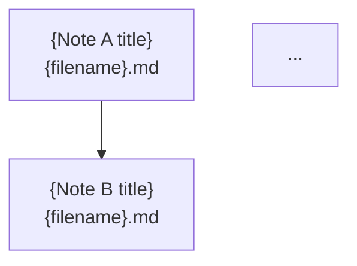

# New Topic Skill

Invocation: `/new-topic`

When invoked, ask the user for:
1. **Topic name** — e.g., "attention mechanisms", "variational autoencoders"
2. **Category** — one of `concepts`, `papers`, `walkthroughs`
3. **Anchor papers or sources** — key references to ground the note (optional; will search if not provided)
4. **Multi-note topic?** — Is this a broad concept that will span multiple note files (like a field survey), or a focused single-note topic? If multi-note, an `overview.md` index will be created first.

Then execute the following steps in order:

## Step 1: Derive the Slug

Convert the topic name to a slug: lowercase, spaces→hyphens, strip punctuation.
Example: "Variational Autoencoders" → `variational-autoencoders`

## Step 2: Create the Design Doc

Create `docs/plans/YYYY-MM-DD-{slug}-design.md` (use today's date) following this template:

```markdown
# Design: {Topic Name} Concept Note

**Date:** YYYY-MM-DD
**Topic slug:** `{slug}`
**Category:** `{category}`
**Multi-note:** {yes/no}

## Scope

[1–2 paragraphs describing what this note will cover and why]

## Files to Create

| File | Purpose |
|------|---------|
| `{category}/{slug}/overview.md` | Topic index, subtopic map, dependency graph, master references *(multi-note only)* |
| `{category}/{slug}/{first-note}.md` | First research note (or `note.md` for single-note topics) |

## Note Structure

[Outline the planned sections with brief descriptions of content. Note: exercises and solutions are inline at the end of each section — no separate files.]

## Planned Subtopics (multi-note only)

[List all anticipated note files with a one-line description of each]

## References

[List anchor papers and sources]
```

## Step 3: Create the Implementation Plan

Create `docs/plans/YYYY-MM-DD-{slug}-plan.md` following the standard plan format with tasks:
1. Write note sections 1–N (exercises and solutions inline)
2. Review note for correctness and completeness
3. Final cross-check (TOC anchors, notation consistency, every exercise has an inline solution)

## Step 4: Create the Topic Directory

```bash
mkdir -p {category}/{slug}
```

## Step 4b: Create overview.md (multi-note topics only)

Skip this step for single-note topics.

For multi-note topics, research the field using the `reference-finder` subagent and any anchor sources provided, then write `{category}/{slug}/overview.md` with the following structure:

```markdown
# {Topic Name}: Overview

This file is the index for the `{category}/{slug}/` folder. It lists planned and written subtopic notes, organizes them by theme, and collects the canonical references for the field. Use it to decide what to write next without needing to re-survey the landscape.

---

## Notes in This Folder

| File | Status | Topic |
|------|--------|-------|
| `{first-note}.md` | 🔲 Planned | [one-line description] |
| `{second-note}.md` | 🔲 Planned | [one-line description] |
| ... | ... | ... |

---

## Subtopic Map

### {Theme 1}

| Subtopic | Key Idea | Primary Source |
|----------|----------|----------------|
| ... | ... | ... |

### {Theme 2}

| Subtopic | Key Idea | Primary Source |
|----------|----------|----------------|
| ... | ... | ... |

---

## Dependency Graph



---

## Master References

| Reference | Authors | Year | What It Covers | Link |
|-----------|---------|------|----------------|------|
| ... | ... | ... | ... | ... |
```

**Guidance for writing the overview:**
- The notes table should enumerate *all* anticipated subtopic files for the full scope of the topic, not just the first one being written. Mark all as `🔲 Planned` initially; update to `✅ Written` as notes are completed.
- The subtopic map groups notes by conceptual theme (e.g. "Unstable theory", "Stable theory", "Applications"). Each row maps to a planned note file.
- The dependency graph shows which notes should be read before others. Use Mermaid `flowchart TD`; follow Mermaid conventions in CLAUDE.md (no `&` multi-edge shorthand, `<br/>` for line breaks, no unicode in diamond labels).
- The master references table should be comprehensive — include all major textbooks, lecture notes, survey papers, and foundational papers for the entire topic cluster, not just the first note.

## Step 5: Research and Write the Note

Use the `note-writer` subagent to research the topic and write the first note file. For single-note topics this is `{category}/{slug}/note.md`; for multi-note topics use a descriptive name matching the first planned entry in `overview.md`. Pass the subagent the design doc and the list of anchor sources.

## Step 6: Commit

After the note is written and reviewed:

```bash
git add docs/plans/ {category}/{slug}/
git commit -m "feat: scaffold {slug} — design doc, plan, overview, and initial note"
```

For single-note topics, omit "overview" from the commit message.
