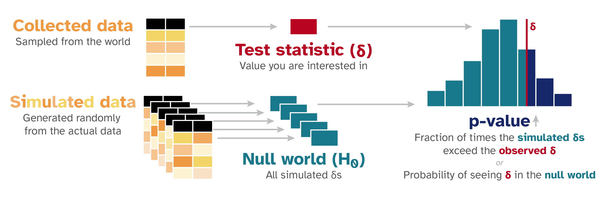
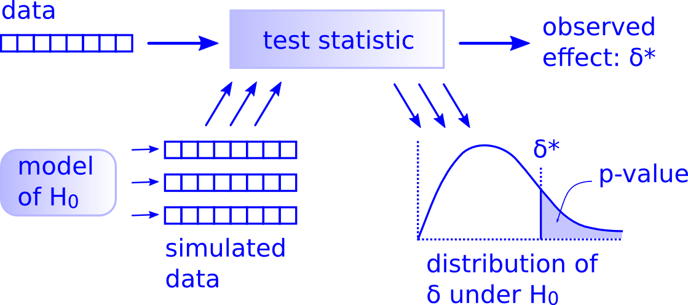
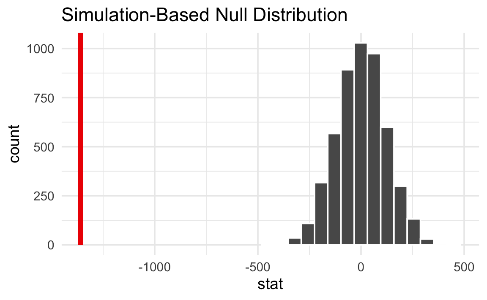
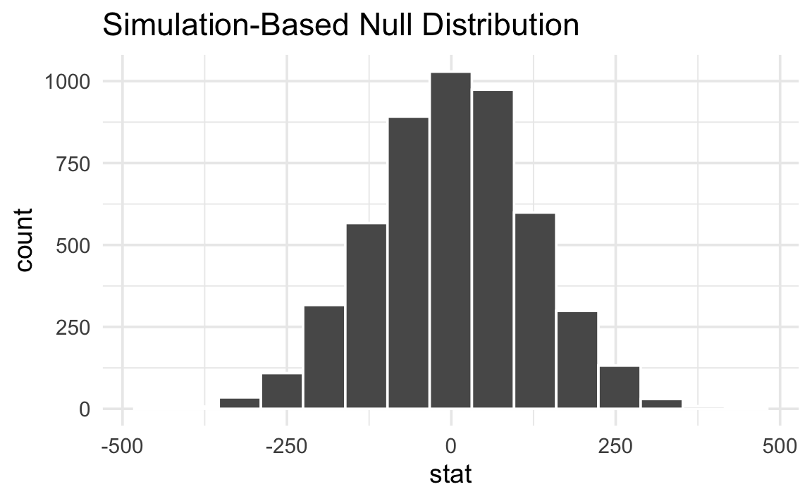

# P-Values and Hypothesis Testing

## Table of Contents

1. [[#1. Orientation: One Test, Not Many|1. Orientation: One Test, Not Many]]
2. [[#2. The Null World Framing|2. The Null World Framing]]
   - [[#2.1 What a Null World Is|2.1 What a Null World Is]]
   - [[#2.2 The Five-Step Simulation Protocol|2.2 The Five-Step Simulation Protocol]]
   - [[#2.3 Why Simulation and Analytic Tests Are the Same Thing|2.3 Why Simulation and Analytic Tests Are the Same Thing]]
3. [[#3. The Unified Structure of Hypothesis Tests|3. The Unified Structure of Hypothesis Tests]]
   - [[#3.1 Downey's Three-Part Decomposition|3.1 Downey's Three-Part Decomposition]]
   - [[#3.2 Named Tests as Special Cases|3.2 Named Tests as Special Cases]]
4. [[#4. Formal Definition of the P-Value|4. Formal Definition of the P-Value]]
   - [[#4.1 Setup and Notation|4.1 Setup and Notation]]
   - [[#4.2 The P-Value as a Random Variable|4.2 The P-Value as a Random Variable]]
   - [[#4.3 Uniformity Under the Null: Proof|4.3 Uniformity Under the Null: Proof]]
   - [[#4.4 Consequences of Uniformity|4.4 Consequences of Uniformity]]
5. [[#5. Type I and Type II Errors|5. Type I and Type II Errors]]
   - [[#5.1 Definitions|5.1 Definitions]]
   - [[#5.2 The Significance Level as a Pre-committed Error Rate|5.2 The Significance Level as a Pre-committed Error Rate]]
   - [[#5.3 The Fundamental Tradeoff|5.3 The Fundamental Tradeoff]]
6. [[#6. Common Misinterpretations|6. Common Misinterpretations]]
   - [[#6.1 The Prosecutor's Fallacy|6.1 The Prosecutor's Fallacy]]
   - [[#6.2 Significance Is Not Effect Size|6.2 Significance Is Not Effect Size]]
   - [[#6.3 Failure to Reject Is Not Acceptance|6.3 Failure to Reject Is Not Acceptance]]
   - [[#6.4 The p-Value Is Not "The Probability the Result Occurred by Chance"|6.4 The p-Value Is Not "The Probability the Result Occurred by Chance"]]
7. [[#7. The Permutation Test: Downey's Canonical Example|7. The Permutation Test: Downey's Canonical Example]]
   - [[#7.1 Exchangeability Under the Null|7.1 Exchangeability Under the Null]]
   - [[#7.2 Exact Permutation Distribution|7.2 Exact Permutation Distribution]]
   - [[#7.3 Monte Carlo Approximation|7.3 Monte Carlo Approximation]]
   - [[#7.4 Relationship to the Two-Sample Z-test|7.4 Relationship to the Two-Sample Z-test]]
8. [[#8. Relationship to Frequentist-Testing.md|8. Relationship to Frequentist-Testing.md]]
9. [[#9. References|9. References]]

---

## 1. Orientation: One Test, Not Many 🗺️

The standard statistics curriculum presents hypothesis testing as a taxonomy problem: is the outcome binary? Use a Z-test. Are variances unknown and unequal? Use Welch's t. Are you comparing more than two groups? Use ANOVA. This framing is pedagogically unfortunate. It suggests that hypothesis testing is a lookup table, and that the various named procedures are fundamentally different objects.

[Allen Downey's argument](https://allendowney.blogspot.com/2016/06/there-is-still-only-one-test.html), made in a 2016 blog post and developed further in interactive form by [Andrew Heiss](https://nullworlds.andrewheiss.com/), is that this picture is wrong. Every hypothesis test — from Student's t to the log-rank test for survival data — is an instance of one underlying logical structure:

1. Choose a *test statistic* that summarizes the deviation of the data from $H_0$.
2. Compute the *null distribution*: the sampling distribution of that statistic if $H_0$ were true.
3. Compute the *p-value* as the probability, under the null distribution, of observing a statistic at least as extreme as the one computed from the data.

💡 The named tests differ only in how they accomplish steps 1 and 2 — the logical skeleton is invariant. This note builds that skeleton rigorously, explains what p-values actually are (and are not), and uses the permutation test as a transparent demonstration of the unified structure.

For the specific analytic procedures (Z-test, Welch's t-test, F-test) that populate step 2 via closed-form null distributions, see [[frequentist-testing.md]]. For the Bayesian alternative to this entire framework, see [[bayesian-testing.md]].

---

## 2. The Null World Framing 🌍

### 2.1 What a Null World Is

📐 **Definition (Null World).** A *null world* is a hypothetical data-generating process in which the null hypothesis $H_0$ holds exactly. It is a stochastic model $\mathcal{M}_0$ that specifies the joint distribution of observables under the assumption of no effect.

The framing, due to [Heiss's interactive guide](https://nullworlds.andrewheiss.com/), is deliberately concrete: rather than invoking asymptotic theory, it asks the analyst to imagine physically re-running the experiment many times in a universe where the treatment does nothing. The collection of test statistic values accumulated over those re-runs constitutes the null distribution.

💡 This language matters because it clarifies exactly what a p-value measures. A p-value does not tell us anything about the probability that $H_0$ is true in our actual world. It tells us how well our observed data fits inside the null world — how ordinary or extraordinary our result would be if we were, in fact, living in that world.

### 2.2 The Five-Step Simulation Protocol 🔬

[Heiss's interactive guide](https://nullworlds.andrewheiss.com/) operationalizes the null world as a five-step computational procedure:

1. **Compute the observed statistic.** From the actual data, compute a scalar $\delta_{\text{obs}}$ that measures the effect of interest (difference in means, ratio of proportions, Spearman correlation, etc.).

2. **Specify the null world model.** Construct a stochastic model $\mathcal{M}_0$ under $H_0$. The key modeling choice is: what symmetry does $H_0$ impose on the data?

3. **Simulate many null-world datasets.** Draw $B$ independent datasets $\mathbf{x}^{(1)}, \ldots, \mathbf{x}^{(B)}$ from $\mathcal{M}_0$, and compute $\delta^{(b)} = \delta(\mathbf{x}^{(b)})$ for each.

4. **Locate $\delta_{\text{obs}}$ in the null distribution.** Overlay $\delta_{\text{obs}}$ on the histogram of $\{\delta^{(b)}\}_{b=1}^B$.

5. **Compute the Monte Carlo p-value.** Count the fraction of simulated statistics at least as extreme as $\delta_{\text{obs}}$:

$$\hat{p} = \frac{1}{B} \sum_{b=1}^{B} \mathbf{1}\bigl[\delta^{(b)} \geq \delta_{\text{obs}}\bigr]$$

As $B \to \infty$, $\hat{p}$ converges almost surely to the true p-value $p = P_{H_0}(\delta \geq \delta_{\text{obs}})$.

*The null world simulation pipeline (Heiss, nullworlds.andrewheiss.com). Left: the observed test statistic δ (red) is computed from the collected data. Center: many null-world datasets are simulated under H₀, each yielding a δ. Right: the resulting null distribution (histogram) is compared to δ_obs; the p-value is the fraction of simulated statistics that meet or exceed δ_obs — the shaded right tail.*

### 2.3 Why Simulation and Analytic Tests Are the Same Thing 🔗

The simulation protocol above and the formula-based tests in textbooks are not different procedures — they are two ways of computing the same quantity. A two-sample Z-test computes the p-value via $p = 1 - \Phi(z_{\text{obs}})$, where $\Phi$ is the standard normal CDF. This is analytically exact in the limit $n \to \infty$ because the Central Limit Theorem guarantees that the standardized difference in sample means converges in distribution to $N(0, 1)$ under $H_0$. The simulation protocol approximates the same null distribution numerically rather than deriving it mathematically.

*The simulation approach is not a heuristic substitute for analytic tests. When the analytic null distribution is exact (e.g., Fisher's exact test for contingency tables, or the permutation test in Section 7), the simulation approximation converges to the exact answer. When the analytic null distribution is itself an approximation (as with asymptotic tests), the simulation approach based on the exact null model can be strictly more accurate for small $n$.*

---

## 3. The Unified Structure of Hypothesis Tests 🏗️

### 3.1 Downey's Three-Part Decomposition

📐 **Theorem (Unified Test Structure, [Downey 2016](https://allendowney.blogspot.com/2016/06/there-is-still-only-one-test.html)).** Every valid frequentist hypothesis test can be decomposed into exactly three choices:

1. **Test statistic** $T: \mathcal{X}^n \to \mathbb{R}$. A measurable function of the data that is large when the data are inconsistent with $H_0$.

2. **Null distribution** $\mathcal{L}_{H_0}(T)$. The distribution of $T$ under the probability model $P_{H_0}$ specified by the null hypothesis. This may be derived analytically (CLT, exact combinatorics) or approximated via simulation.

3. **P-value** $p = P_{H_0}(T \geq t_{\text{obs}})$. The tail probability of the null distribution beyond the observed value.

The test rejects $H_0$ at level $\alpha$ if and only if $p \leq \alpha$.

💡 [Downey's](https://allendowney.blogspot.com/2016/06/there-is-still-only-one-test.html) claim is that *all* named tests — t-test, chi-square, log-rank, Mann-Whitney U, F-test — are instances of this decomposition with specific choices for (1) and (2). The conceptual unity is obscured by the historical practice of giving each (statistic, null distribution) pair its own name and table.

*Downey's unified test framework (Downey, 2016). Every hypothesis test is the composition of these three steps: (1) compute a test statistic from the data to get the observed effect δ*; (2) use a model of H₀ to generate simulated datasets and apply the same statistic to each, building the null distribution; (3) the p-value is the area of the null distribution to the right of δ* (shaded region).*

### 3.2 Named Tests as Special Cases 📋

To make the unification concrete, the table below instantiates the three choices for several common tests.

| Test | Test Statistic $T$ | Null Distribution $\mathcal{L}_{H_0}(T)$ | Use Case |
|------|-------------------|------------------------------------------|----------|
| Two-sample Z-test | Pooled $Z = \frac{\hat{p}_A - \hat{p}_B}{\sqrt{\hat{p}(1-\hat{p})(1/n_A + 1/n_B)}}$ | $N(0,1)$ asymptotically | Binary outcomes, large $n$ |
| Welch's t-test | $t = \frac{\bar{X}_A - \bar{X}_B}{\sqrt{s_A^2/n_A + s_B^2/n_B}}$ | $t_\nu$ with Welch-Satterthwaite $\nu$ | Continuous outcomes, unequal variances |
| One-way ANOVA F-test | $F = \frac{\text{SS}_{\text{between}}/(k-1)}{\text{SS}_{\text{within}}/(n-k)}$ | $F_{k-1,\, n-k}$ | $k > 2$ groups, continuous outcomes |
| Permutation test | Any $T(\mathbf{x})$, e.g. $\bar{X}_A - \bar{X}_B$ | Empirical distribution over all label permutations | Any statistic; exact under exchangeability |
| Chi-square test | $\chi^2 = \sum_{i,j} \frac{(O_{ij} - E_{ij})^2}{E_{ij}}$ | $\chi^2_{(r-1)(c-1)}$ asymptotically | Categorical outcomes, contingency tables |

The permutation test is the purest instantiation of the unified structure because it constructs the null distribution directly from the data without invoking any asymptotic approximation, as we develop in Section 7.

---

## 4. Formal Definition of the P-Value 📐

### 4.1 Setup and Notation

Let $\mathbf{X} = (X_1, \ldots, X_n)$ be a random sample from a distribution $P_\theta$ indexed by a parameter $\theta \in \Theta$. Partition $\Theta = \Theta_0 \cup \Theta_1$ and define:

- $H_0: \theta \in \Theta_0$ — the *null hypothesis*
- $H_1: \theta \in \Theta_1$ — the *alternative hypothesis*

Let $T = T(\mathbf{X}): \mathcal{X}^n \to \mathbb{R}$ be a test statistic with CDF $F_\theta(t) = P_\theta(T \leq t)$. Under a simple null $H_0: \theta = \theta_0$, write $F_0 = F_{\theta_0}$.

🔑 **Definition (P-Value).** Let $t_{\text{obs}} = T(\mathbf{x})$ be the realized test statistic from the observed data $\mathbf{x}$. The *p-value* for an upper-tailed test is:

$$p(\mathbf{x}) = P_{\theta_0}\bigl(T(\mathbf{X}) \geq t_{\text{obs}}\bigr) = 1 - F_0(t_{\text{obs}})$$

For a two-tailed test, assuming the null distribution of $T$ is symmetric about zero:

$$p(\mathbf{x}) = P_{\theta_0}\bigl(|T(\mathbf{X})| \geq |t_{\text{obs}}|\bigr) = 2\bigl(1 - F_0(|t_{\text{obs}}|)\bigr)$$

The decision rule is: reject $H_0$ if $p(\mathbf{x}) \leq \alpha$.

*P-value as tail probability (Heiss, nullworlds.andrewheiss.com). The histogram shows the null distribution of the difference in means under H₀: F_A = F_B, constructed from 5000 random permutations of group labels. The red vertical line marks the observed statistic δ_obs ≈ −1359 g (Gentoo vs. Chinstrap penguins). Because δ_obs falls entirely outside the support of the null distribution, the p-value — the fraction of simulated statistics at least as extreme — is effectively zero, providing decisive evidence against H₀.*

**Remark.** This is consistent with the rejection region formulation in [[frequentist-testing.md#1.4 Rejection Regions and Critical Values]]. Specifically, $p(\mathbf{x}) \leq \alpha$ if and only if $t_{\text{obs}} \geq c_\alpha$, where $c_\alpha = F_0^{-1}(1 - \alpha)$ is the critical value.

### 4.2 The P-Value as a Random Variable

A subtle but essential point: the p-value $p(\mathbf{X})$ is a function of the random sample $\mathbf{X}$, hence it is itself a random variable — before data are collected. This is the correct object of analysis when reasoning about the operating characteristics of a test across repeated experiments.

📐 **Definition (P-Value as Random Variable).** Define $P = p(\mathbf{X}) = 1 - F_0(T(\mathbf{X}))$, viewed as a random variable over the distribution $P_{\theta_0}$ of $\mathbf{X}$.

The question "what is the distribution of $P$ under $H_0$?" has a clean and consequential answer.

### 4.3 Uniformity Under the Null: Proof 🔬

📐 **Proposition (Uniformity of the P-Value).** Let $T(\mathbf{X})$ be a test statistic with continuous CDF $F_0$ under $H_0: \theta = \theta_0$. Then the p-value $P = 1 - F_0(T(\mathbf{X}))$ satisfies:

$$P \overset{H_0}{\sim} \mathrm{Uniform}(0, 1)$$

**Proof.** Let $U = F_0(T(\mathbf{X}))$. For any $u \in [0, 1]$:

$$P_{H_0}(U \leq u) = P_{H_0}\bigl(F_0(T(\mathbf{X})) \leq u\bigr) = P_{H_0}\bigl(T(\mathbf{X}) \leq F_0^{-1}(u)\bigr) = F_0\bigl(F_0^{-1}(u)\bigr) = u$$

where the third equality uses the definition of the CDF and the continuity of $F_0$ (which guarantees $F_0^{-1}$ is well-defined and $F_0(F_0^{-1}(u)) = u$ everywhere). Thus $U \sim \mathrm{Uniform}(0,1)$, and since $P = 1 - U$, we have $P \sim \mathrm{Uniform}(0, 1)$. $\square$

This is a special case of the *probability integral transform*: if $W$ is a continuous random variable with CDF $G$, then $G(W) \sim \mathrm{Uniform}(0,1)$.

⚠️ *This result requires continuity of $F_0$. For discrete test statistics (e.g., the number of successes in a small binomial experiment), $F_0$ has jumps, so the p-value distribution is stochastically larger than uniform — the test is conservative. This is why the exact binomial test at level $\alpha = 0.05$ may have actual size $< 0.05$.*

### 4.4 Consequences of Uniformity 🔑

**Consequence 1: Calibration.** Under $H_0$, the probability that $P \leq \alpha$ is exactly $\alpha$:

$$P_{H_0}(P \leq \alpha) = \alpha$$

**The significance level $\alpha$ is literally the Type I error rate — not an approximation, not a heuristic threshold.**

**Consequence 2: Multiple comparisons.** If $k$ independent tests are conducted simultaneously and $H_0$ holds for all of them, then the p-values $P_1, \ldots, P_k \overset{\text{iid}}{\sim} \mathrm{Uniform}(0,1)$. The probability that at least one $P_i \leq 0.05$ is:

$$1 - (1 - 0.05)^k \to 1 \quad \text{as } k \to \infty$$

This is the statistical basis of the *multiple comparisons problem*. The Bonferroni correction — reject only when $P_i \leq \alpha/k$ — controls the *familywise error rate* by restoring calibration across all $k$ tests.

💡 **Consequence 3: P-value histograms as diagnostics.** Because $P \sim \mathrm{Uniform}(0,1)$ under $H_0$ and is stochastically smaller than uniform under $H_1$ (when the test has power), a histogram of p-values from many independent experiments should be approximately flat if all nulls hold, and should show a spike near zero if a fraction of nulls are false. This makes p-value histograms a standard tool for detecting signal in large-scale multiple-testing settings (e.g., GWAS, online experimentation platforms).

---

## 5. Type I and Type II Errors ⚖️

### 5.1 Definitions

Fix a test with rejection region $\mathcal{R} = \{T > c_\alpha\}$.

📐 **Definition (Type I Error).** A *Type I error* (false positive) occurs when $H_0$ is true but the test rejects:

$$\alpha = P_{\theta_0}(T \in \mathcal{R}) = P_{H_0}(\text{reject } H_0)$$

📐 **Definition (Type II Error).** A *Type II error* (false negative) occurs when $H_0$ is false but the test fails to reject. For a specific alternative $\theta = \theta_1 \in \Theta_1$:

$$\beta(\theta_1) = P_{\theta_1}(T \notin \mathcal{R}) = P_{\theta_1}(\text{fail to reject } H_0)$$

📐 **Definition (Power).** The *power* of the test at $\theta_1$ is the probability of correctly rejecting $H_0$ when the alternative is true:

$$\pi(\theta_1) = 1 - \beta(\theta_1) = P_{\theta_1}(T \in \mathcal{R})$$

### 5.2 The Significance Level as a Pre-committed Error Rate ⚠️

The significance level $\alpha$ must be fixed before data collection. This is not a stylistic convention — it is logically required for the frequentist framework to be coherent. The calibration property in Section 4.4 holds only for pre-specified $\alpha$; choosing $\alpha$ after seeing the data (e.g., reporting $p = 0.049$ and choosing $\alpha = 0.05$) is *p-hacking*, which inflates the true Type I error rate above the nominal $\alpha$.

⚠️ Formally: if $\alpha$ is chosen after observing $t_{\text{obs}}$, then the decision rule "reject if $p \leq \alpha$" becomes "reject if $p \leq p + \epsilon$" for some $\epsilon > 0$, which always rejects and has Type I error rate 1.

### 5.3 The Fundamental Tradeoff

For a fixed sample size $n$ and a fixed test statistic, $\alpha$ and $\beta(\theta_1)$ cannot both be made arbitrarily small simultaneously.

**Heuristic argument.** The critical value $c_\alpha = F_0^{-1}(1 - \alpha)$ is a monotone decreasing function of $\alpha$: smaller $\alpha$ demands a larger critical value, which means the rejection region shrinks. A smaller rejection region is harder to reach under $H_1$, so $\beta(\theta_1)$ increases. Formally, the power function $\pi(\theta_1)$ is a decreasing function of $c_\alpha$.

💡 The standard resolution in A/B testing is to fix $\alpha = 0.05$ and $\pi = 1 - \beta = 0.80$, and then solve for the minimum sample size $n$ that achieves both constraints simultaneously. This is the sample size formula derived in [[frequentist-testing.md#5.1 Derivation from the Power Equation]].

---

## 6. Common Misinterpretations ⚠️

The p-value is among the most frequently misinterpreted quantities in applied statistics. This section catalogs the principal errors with formal diagnoses.

### 6.1 The Prosecutor's Fallacy

**Misconception:** "The p-value $p$ is the probability that $H_0$ is true given the data."

**Formal diagnosis.** The p-value is $P(\text{data at least this extreme} \mid H_0)$, which is the conditional probability of data given hypothesis. The misconception conflates this with $P(H_0 \mid \text{data})$, i.e., the posterior probability of the hypothesis given the data. These are related by Bayes' theorem:

$$P(H_0 \mid \text{data}) = \frac{P(\text{data} \mid H_0) \cdot P(H_0)}{P(\text{data})}$$

Computing $P(H_0 \mid \text{data})$ requires a prior $P(H_0)$, which is a Bayesian quantity. The frequentist framework treats $H_0$ as either true or false — it has no probability. For the Bayesian alternative, see [[bayesian-testing.md]].

This confusion is sometimes called the *prosecutor's fallacy* in the legal literature: the probability of the evidence given innocence is not the same as the probability of innocence given the evidence.

### 6.2 Significance Is Not Effect Size

**Misconception:** "A smaller p-value means a larger effect."

**Formal diagnosis.** For a two-sample Z-test, the p-value is a monotone decreasing function of the test statistic $Z$, which scales as:

$$Z \approx \frac{\delta}{\sigma} \cdot \sqrt{\frac{n_A n_B}{n_A + n_B}}$$

where $\delta = \mu_A - \mu_B$ is the true effect size and $\sigma$ is the pooled standard deviation. The test statistic — and hence the p-value — is a function of both $\delta$ and the sample sizes $n_A, n_B$. With $n = 10^7$ and $\delta = 10^{-4}$, the test may return $p < 10^{-10}$; the effect is statistically significant but substantively irrelevant. Effect size must be assessed separately through standardized measures (Cohen's $d$, relative lift) and confidence intervals.

### 6.3 Failure to Reject Is Not Acceptance

**Misconception:** "$p > \alpha$ means $H_0$ is true" or "the null hypothesis is accepted."

**Formal diagnosis.** Failing to reject $H_0$ means only that $t_{\text{obs}}$ did not fall in the rejection region $\mathcal{R}$. This can happen because (a) $H_0$ is true, (b) $H_0$ is false but the test has low power (small $n$, small $\delta$, or high variance), or (c) the test statistic is a poor choice. The probability of case (b) is $\beta(\theta_1) = 1 - \pi(\theta_1)$, which can be large for underpowered experiments. "We found no significant effect" and "the effect is zero" are not equivalent statements.

### 6.4 The p-Value Is Not "The Probability the Result Occurred by Chance"

**Misconception:** "The p-value tells us the probability that the observed result was due to chance."

**Formal diagnosis.** The p-value is not a statement about a single observed result. Once the data are in hand, the result is fixed — it is not a random outcome that either did or did not occur by chance. The randomness that defines the p-value lives entirely in the hypothetical sampling distribution of $T$ under $H_0$: we imagine $\mathbf{X}$ being re-drawn repeatedly from $P_{H_0}$, and ask what fraction of those imaginary draws would produce a statistic at least as extreme. The observed data $\mathbf{x}$ itself is treated as fixed throughout this thought experiment.

---

## 7. The Permutation Test: Downey's Canonical Example 🔀

The permutation test is the most transparent instantiation of the unified test structure because it constructs the null distribution directly from the data using only the logic of the null hypothesis, without invoking any distributional assumptions.

### 7.1 Exchangeability Under the Null

Consider two independent samples:

$$A = (X_1^A, \ldots, X_{n_A}^A) \overset{\text{iid}}{\sim} F_A, \qquad B = (X_1^B, \ldots, X_{n_B}^B) \overset{\text{iid}}{\sim} F_B$$

The null hypothesis is $H_0: F_A = F_B$ — the two groups have the same distribution. Under $H_0$, the group labels carry no information: if we pooled all $n = n_A + n_B$ observations and randomly re-assigned them to groups of sizes $n_A$ and $n_B$, the resulting labeled dataset would have the same joint distribution as the original.

📐 **Definition (Exchangeability Under the Null).** The pooled observations $\mathbf{z} = (z_1, \ldots, z_n)$ are *exchangeable under $H_0$* if, for every permutation $\sigma \in S_n$, the relabeled dataset $(z_{\sigma(1)}, \ldots, z_{\sigma(n)})$ with the same group size split $(n_A, n_B)$ has the same distribution as the original under $P_{H_0}$.

This exchangeability is exactly the symmetry that justifies using permutations of the data to construct the null distribution.

### 7.2 Exact Permutation Distribution 📐

Let $t_{\text{obs}} = T(\mathbf{x})$ be any test statistic computed from the observed data. Define the *permutation null distribution* as the uniform distribution over all $\binom{n}{n_A}$ distinct relabelings of the pooled sample. For permutation $\sigma$, let $T^{(\sigma)}$ denote the test statistic computed after applying $\sigma$.

🔑 **Definition (Exact Permutation P-Value).** The exact permutation p-value is:

$$p_{\text{perm}} = \frac{\#\left\{\sigma \in S_n : T^{(\sigma)} \geq t_{\text{obs}}\right\}}{\binom{n}{n_A}}$$

**Proposition.** Under $H_0$ (exchangeability), $p_{\text{perm}}$ is exactly uniformly distributed on the set $\left\{\frac{k}{\binom{n}{n_A}} : k = 0, 1, \ldots, \binom{n}{n_A}\right\}$, which is an exact discrete analog of $\mathrm{Uniform}(0,1)$.

**Proof sketch.** Under $H_0$, all $\binom{n}{n_A}$ labelings of the pooled data are equally likely (by exchangeability). The rank of $t_{\text{obs}}$ among the $\binom{n}{n_A}$ permuted statistics is therefore uniform over $\{1, \ldots, \binom{n}{n_A}\}$, and $p_{\text{perm}}$ is the fraction of statistics at or above $t_{\text{obs}}$, which is uniform on the stated grid. $\square$

💡 This is a *finite-population* version of the probability integral transform from Section 4.3.

### 7.3 Monte Carlo Approximation 🎲

For $n_A + n_B$ as small as 30, $\binom{30}{15} \approx 1.55 \times 10^8$, making exact enumeration infeasible. The standard approach is Monte Carlo approximation:

1. Draw $B$ random permutations $\sigma_1, \ldots, \sigma_B$ uniformly from $S_n$.
2. Compute $T^{(b)} = T^{(\sigma_b)}$ for each.
3. Estimate: $\hat{p}_{\text{perm}} = \frac{1}{B} \sum_{b=1}^B \mathbf{1}[T^{(b)} \geq t_{\text{obs}}]$

By the law of large numbers, $\hat{p}_{\text{perm}} \to p_{\text{perm}}$ almost surely as $B \to \infty$. The standard error of the Monte Carlo estimate is $\sqrt{p(1-p)/B}$, which is at most $1/(2\sqrt{B})$. For $B = 10{,}000$ and a true p-value near $0.05$, the standard error is approximately $0.002$ — sufficient precision for a $\alpha = 0.05$ threshold.

*Monte Carlo permutation null distribution (Heiss, nullworlds.andrewheiss.com). Each bar counts how many of the 5000 random label permutations produced a given difference in sample means. The distribution is centered near zero (as required under H₀: F_A = F_B) and approximately normal — consistent with Section 7.4's asymptotic result. The observed statistic δ_obs is located relative to this histogram to compute $\hat{p}_{\text{perm}}$.*

### 7.4 Relationship to the Two-Sample Z-test 🔗

*Surprisingly,* for large samples, the permutation test and the two-sample Z-test yield nearly identical p-values, even though they use completely different machinery to construct the null distribution.

**Heuristic argument.** Under $H_0: F_A = F_B$, the permutation distribution of $\bar{X}_A - \bar{X}_B$ has mean zero and variance:

$$\text{Var}_{\text{perm}}\bigl(\bar{X}_A - \bar{X}_B\bigr) = S^2 \left(\frac{1}{n_A} + \frac{1}{n_B}\right)$$

where $S^2 = \frac{1}{n-1}\sum_{i=1}^n (z_i - \bar{z})^2$ is the pooled sample variance of the combined data. By a combinatorial central limit theorem, the standardized permutation statistic converges in distribution to $N(0,1)$ as $n \to \infty$. The Z-test's asymptotic null distribution is also $N(0,1)$. Hence both tests compute approximately the same p-value for large $n$.

💡 **The practical implication:** for large samples, use the analytic Z-test for speed. For small samples or non-standard statistics, use the permutation test for exactness. The choice is computational, not logical — the underlying null hypothesis structure is identical.

---

## 8. Relationship to Frequentist-Testing.md 🗂️

This note and [[frequentist-testing.md]] cover complementary layers of the same framework.

| Concern | This note | frequentist-testing.md |
|---------|-----------|------------------------|
| What a p-value is | Section 4 (formal definition, uniformity, proof) | Section 5 (brief definition, decision rule) |
| Unified structure of all tests | Section 3 (Downey decomposition) | Section 1 (test statistic requirements) |
| Null world framing | Section 2 (simulation-based) | Not covered |
| Permutation test | Section 7 (full development) | Not covered |
| Z-test for proportions | Cross-reference only | Section 2 (full derivation with CLT proof) |
| Welch's t-test | Cross-reference only | Section 3 (full derivation with Welch-Satterthwaite) |
| ANOVA F-test | Mentioned in table | Section 6 (full SS decomposition) |
| Sample size formulas | Section 5.3 (error tradeoff framing) | Section 5 (full derivation and rule of thumb) |
| Confidence intervals | Not covered | Section 4 (duality with tests, CI formulas) |

The reading order is: [[foundations.md]] for the experimental design context and a first pass at p-values, then this note for the conceptual depth and unified framing, then [[frequentist-testing.md]] for the specific analytic machinery.

---

## 9. References 📚

| Reference Name | Brief Summary | Link to Reference |
|----------------|---------------|-------------------|
| Heiss, "Null Worlds" (interactive guide) | Simulation-based introduction to p-values via the "null world" framing; all hypothesis tests follow a five-step protocol of computing a statistic, simulating the null, and locating the observed statistic | [nullworlds.andrewheiss.com](https://nullworlds.andrewheiss.com/) |
| Downey, "There Is Still Only One Test" (2016) | Argues that every hypothesis test is an instance of one three-part structure: choose statistic, compute null distribution, compute p-value; named tests differ only in how they instantiate these choices | [allendowney.blogspot.com](https://allendowney.blogspot.com/2016/06/there-is-still-only-one-test.html) |
| Lehmann & Romano, *Testing Statistical Hypotheses*, 3rd ed. (2005) | Rigorous treatment of hypothesis testing including p-values, uniformity under the null, UMP tests, and the Neyman-Pearson lemma | [Springer](https://link.springer.com/book/10.1007/0-387-27605-X) |
| Good, *Permutation, Parametric, and Bootstrap Tests of Hypotheses*, 3rd ed. (2005) | Comprehensive reference on permutation and resampling tests; formal development of exchangeability, exact p-values, and Monte Carlo approximation | [Springer](https://link.springer.com/book/10.1007/b138696) |
| Wasserstein & Lazar, "The ASA Statement on p-Values" (2016) | American Statistical Association's official guidance on correct and incorrect interpretations of p-values; addresses all major misconceptions formally | [The American Statistician](https://doi.org/10.1080/00031305.2016.1154108) |
| Probability Integral Transform — Wikipedia | Statement and proof of the probability integral transform; the core result underlying p-value uniformity | [en.wikipedia.org](https://en.wikipedia.org/wiki/Probability_integral_transform) |
| Vasishth, "A simple proof that the p-value distribution is uniform when the null hypothesis is true" (2016) | Accessible blog-post proof of p-value uniformity via the probability integral transform | [vasishth-statistics.blogspot.com](https://vasishth-statistics.blogspot.com/2016/04/a-simple-proof-that-p-value.html) |
| Permutation Test — Wikipedia | Overview of permutation tests, exchangeability conditions, exact vs. Monte Carlo p-values, and connection to parametric tests | [en.wikipedia.org](https://en.wikipedia.org/wiki/Permutation_test) |
