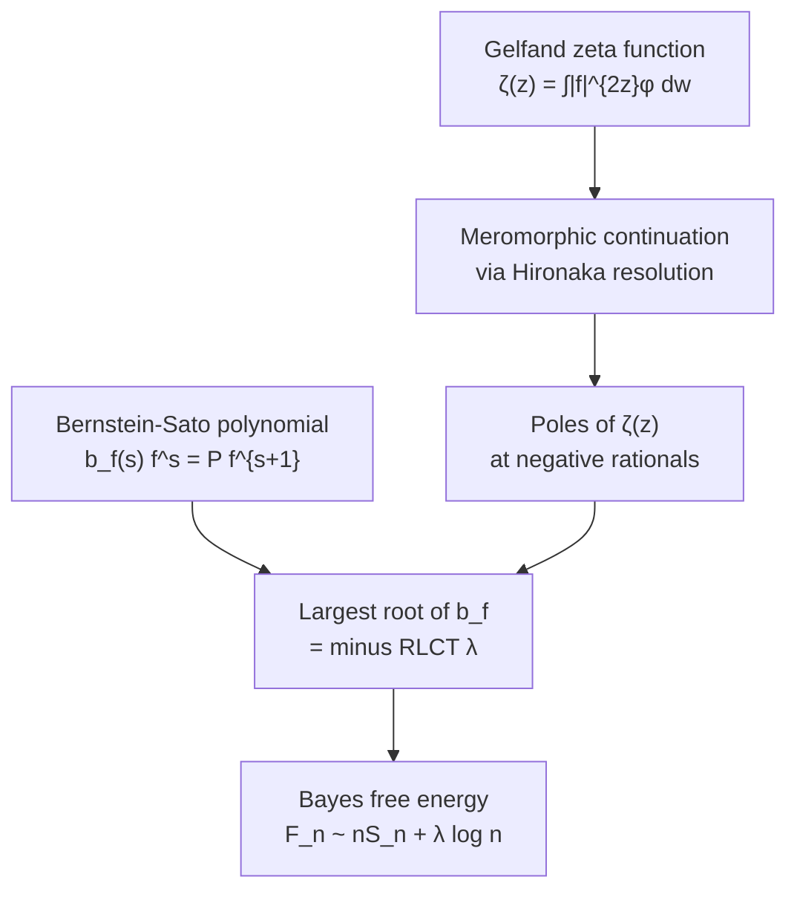

# Bernstein–Sato Polynomials and Zeta Functions of Singularities

## Table of Contents

- [[#1. Overview|1. Overview]]
- [[#2. The Gelfand Zeta Function|2. The Gelfand Zeta Function]]
  - [[#2.1 Definition and Motivating Integral|2.1 Definition and Motivating Integral]]
  - [[#2.2 Meromorphic Continuation via Resolution|2.2 Meromorphic Continuation via Resolution]]
  - [[#2.3 The State Density Function and Mellin Transform|2.3 The State Density Function and Mellin Transform]]
- [[#3. The Bernstein–Sato Polynomial|3. The Bernstein–Sato Polynomial]]
  - [[#3.1 The Functional Equation|3.1 The Functional Equation]]
  - [[#3.2 Existence Theorem (Bernstein 1972)|3.2 Existence Theorem (Bernstein 1972)]]
  - [[#3.3 Kashiwara's Rationality Theorem|3.3 Kashiwara's Rationality Theorem]]
  - [[#3.4 Worked Examples|3.4 Worked Examples]]
- [[#4. The D-Module Perspective|4. The D-Module Perspective]]
  - [[#4.1 The Module D[s] · f^s|4.1 The Module D[s] · f^s]]
  - [[#4.2 The Kashiwara–Malgrange V-Filtration|4.2 The Kashiwara–Malgrange V-Filtration]]
- [[#5. Zeta Function Poles and the b-Function|5. Zeta Function Poles and the b-Function]]
  - [[#5.1 Poles of the Gelfand Zeta Function|5.1 Poles of the Gelfand Zeta Function]]
  - [[#5.2 The RLCT as the Largest Pole|5.2 The RLCT as the Largest Pole]]
  - [[#5.3 Saito's Theorem|5.3 Saito's Theorem]]
- [[#6. Monodromy and the b-Function|6. Monodromy and the b-Function]]
  - [[#6.1 Vanishing Cycles and the Milnor Fiber|6.1 Vanishing Cycles and the Milnor Fiber]]
  - [[#6.2 Monodromy Eigenvalues and Roots of b_f|6.2 Monodromy Eigenvalues and Roots of b_f]]
- [[#7. Connection to Singular Learning Theory|7. Connection to Singular Learning Theory]]
  - [[#7.1 K(w) as the Defining Function|7.1 K(w) as the Defining Function]]
  - [[#7.2 Reading Off the RLCT from the b-Function|7.2 Reading Off the RLCT from the b-Function]]
  - [[#7.3 Worked Example: Rank-1 Matrix Factorization|7.3 Worked Example: Rank-1 Matrix Factorization]]
- [[#8. The Asymptotic Pipeline|8. The Asymptotic Pipeline]]
- [[#9. References|9. References]]

---

## 1. Overview 📐

The *Gelfand zeta function* and the *Bernstein–Sato polynomial* (also called the *b-function*) are two faces of the same algebraic-analytic object: the local singularity theory of an analytic function $f$ near its zero set. Their interplay with the *real log-canonical threshold (RLCT)* is the mathematical engine driving Watanabe's singular learning theory (SLT).

The logical chain is:

The bridge from line 1 (analysis: poles of $\zeta$) to line 2 (algebra: roots of $b_f$) is **Kashiwara's theorem** (1976). The bridge to statistics is Watanabe's free energy theorem, treated in [[concepts/algebraic-geometry/neuroalgebraic-geometry/singular-learning-theory|Singular Learning Theory]]. This note develops the algebraic geometry side.

---

## 2. The Gelfand Zeta Function 📐

### 2.1 Definition and Motivating Integral

Let $f: (\mathbb{R}^d, 0) \to (\mathbb{R}, 0)$ be a real-analytic function defined near the origin, and let $\varphi \in C_c^\infty(\mathbb{R}^d)$ be a smooth compactly supported test function with $\varphi \geq 0$.

**Definition (Gelfand Zeta Function).** The *Gelfand zeta function* associated to $f$ and $\varphi$ is

$$\zeta_f(z) = \int_{\mathbb{R}^d} |f(w)|^{2z}\, \varphi(w)\, dw, \qquad \mathrm{Re}(z) > 0.$$

For $\mathrm{Re}(z) > 0$ the integral converges absolutely (since $|f|^{2z}$ is locally integrable for $\mathrm{Re}(z) > 0$). The factor $2z$ rather than $z$ is conventional: with $f$ real, $|f|^{2z} = (f^2)^z$, making contact with the complex-variable zeta function $\int (f^2)^z \varphi\,dw$.

> [!INFO] Gelfand's Conjecture (1954)
> Gelfand conjectured that $\zeta_f(z)$ extends to a *meromorphic* function on all of $\mathbb{C}$, with poles confined to a discrete set of negative rational numbers. This was proved by Atiyah (1970) using Hironaka's resolution of singularities, and independently by Bernstein–Gelfand (1969) using the b-function.

The poles of $\zeta_f$ encode the singularity structure of $f$ near its zero set $\{f = 0\}$. In the regular case ($df \neq 0$ on $\{f=0\}$), $\zeta_f$ has no poles at all in $\{-1 < \mathrm{Re}(z) \leq 0\}$. Poles appear precisely when $f$ has singularities.

### 2.2 Meromorphic Continuation via Resolution

The cleanest proof of meromorphic continuation uses **Hironaka's resolution of singularities** (established in full generality in 1964). Let $g: \tilde{U} \to U$ be a resolution of singularities of $\{f = 0\}$: a proper birational map such that

$$f \circ g = u \cdot \prod_{i=1}^r y_i^{k_i}$$

where $u$ is a unit (nowhere zero) and $(y_1, \ldots, y_r, y_{r+1}, \ldots, y_d)$ are local coordinates on $\tilde{U}$ forming a *normal crossing divisor* — the exceptional locus $\bigcup_i \{y_i = 0\}$ has only transverse intersections.

After the change of variables $w = g(y)$, the integral becomes

$$\zeta_f(z) = \int_{\tilde{U}} \left|u \prod_{i=1}^r y_i^{k_i}\right|^{2z} (\varphi \circ g)\, |\det Dg|\, dy.$$

Since $u$ is a unit, $|u|^{2z}$ is smooth and nonzero. The Jacobian $|\det Dg|$ is a smooth function times a monomial $\prod_i |y_i|^{a_i - 1}$ (where $a_i$ counts the multiplicity of the exceptional divisor $E_i$ in the jacobian). So the integrand is

$$\text{(smooth, nonzero)} \times \prod_i |y_i|^{2k_i z + a_i - 1}.$$

By Fubini (integrating out one coordinate at a time), each factor $\int |y_i|^{2k_i z + a_i - 1} d y_i$ is a beta-type integral that meromorphically continues to all of $\mathbb{C}$ with simple poles at

$$2k_i z + a_i - 1 = -1, -2, -3, \ldots \quad \Longrightarrow \quad z = -\frac{a_i + j}{2k_i},\quad j = 0, 1, 2, \ldots$$

**Thus the poles of $\zeta_f$ are contained in $\left\{-\dfrac{a_i + j}{2k_i} : i = 1,\ldots,r,\ j \in \mathbb{Z}_{\geq 0}\right\}$, a discrete set of negative rationals.**

> [!NOTE] The RLCT from the Resolution
> The *largest* pole (i.e., closest to $0$) is
> $$-\lambda = \max_i \left(-\frac{a_i}{2k_i}\right) = -\min_i \frac{a_i}{2k_i}.$$
> This is precisely $-\lambda$ where $\lambda$ is the *real log-canonical threshold*:
> $$\lambda = \mathrm{RLCT}(f) = \min_i \frac{a_i}{2k_i}.$$
> Its order as a pole of $\zeta_f$ is $m = \#\{i : a_i/2k_i = \lambda\}$, the number of exceptional divisors achieving the minimum.

### 2.3 The State Density Function and Mellin Transform

In Watanabe's SLT, $f$ is replaced by the *KL divergence* $K(w) = \int q(x) \log \frac{q(x)}{p(x|w)}\, dx \geq 0$, and $\varphi = \varphi(w)$ is the prior density. The zeta function of the model is

$$\zeta(z) = \int_W K(w)^z\, \varphi(w)\, dw.$$

This is the *Mellin transform* of the *state density function*

$$\nu(t) = \frac{d}{dt} \int_{\{K(w) \leq t\}} \varphi(w)\, dw,$$

the density of prior mass at KL level $t$:

$$\zeta(z) = \int_0^\infty t^{z-1}\, \nu(t)\, dt = \mathcal{M}[\nu](z) \cdot \Gamma(z)^{-1} \cdot \Gamma(z).$$

The asymptotic expansion of $\nu(t)$ near $t = 0$ (governing generalization) is read directly from the poles of $\zeta(z)$ via the inverse Mellin transform. **This is the analytic pathway from algebraic geometry to Bayesian asymptotics.**

> [!QUESTION] Exercise 1: Poles from the State Density
> *This exercise establishes the connection between the singularity of $\nu(t)$ at $t=0$ and the poles of the Mellin transform.*
>
> > **Prerequisites:** [[#2.3 The State Density Function and Mellin Transform|2.3 The State Density Function and Mellin Transform]]
>
> Let $\nu(t) = c\, t^{\lambda - 1} (\log t)^{m-1}$ for $t$ small and positive, with $\lambda > 0$, $m \geq 1$, and $c > 0$. Show that the Mellin transform $\mathcal{M}[\nu](z) = \int_0^\infty t^{z-1} \nu(t)\, dt$ (restricted to a cutoff near $t = 0$) has a pole of order $m$ at $z = -\lambda$, and compute the leading residue in terms of $c$ and $m$.

> [!TIP]- Solution to Exercise 1
> **Key insight:** Near $z = -\lambda$, the Mellin transform of $t^{\lambda-1}(\log t)^{m-1}$ picks up the pole from $\int_0^1 t^{z + \lambda - 2}(\log t)^{m-1} dt$, which can be evaluated by differentiating $\int_0^1 t^{z+\lambda-2} dt = \frac{1}{z+\lambda-1}$ with respect to $\lambda$.
>
> **Sketch:** Set $u = z + \lambda - 1$. Then $\int_0^1 t^u (\log t)^{m-1} dt = \frac{d^{m-1}}{du^{m-1}} \frac{1}{u+1}\big|_{u} = \frac{(-1)^{m-1}(m-1)!}{(u+1)^m}$. So the Mellin transform has a pole of order $m$ at $u = -1$, i.e. $z = -\lambda$, with leading coefficient $c \cdot (-1)^{m-1}(m-1)!$.

---

## 3. The Bernstein–Sato Polynomial 📐

### 3.1 The Functional Equation

The *Bernstein–Sato polynomial* (or *b-function*) provides an algebraic route to the meromorphic continuation of $|f|^{2z}$ that bypasses the geometric resolution.

**Definition (Bernstein–Sato Polynomial).** Let $f \in \mathbb{C}[x_1, \ldots, x_n]$ (or a convergent power series). The *Bernstein–Sato polynomial* $b_f(s) \in \mathbb{C}[s]$ is the monic polynomial of minimal degree for which there exists a differential operator $P(s, x, \partial_x) \in \mathbb{C}[s]\langle x, \partial_x \rangle$ satisfying the *functional equation*

$$\boxed{b_f(s)\, f(x)^s = P(s, x, \partial_x)\cdot f(x)^{s+1}.}$$

Here $f^s$ is treated formally as a symbol: the equation is an identity of *distributions* on $\mathbb{C}^n$, or equivalently a relation in the $\mathcal{D}[s]$-module $\mathcal{D}[s] \cdot f^s$ (see §4). The operator $P$ is allowed to depend polynomially on $s$.

> [!EXAMPLE] Simplest case: $f(x) = x$
> Take $f = x$ (one variable). We seek $b(s)$ and $P(s, x, \partial_x)$ with $b(s) x^s = P \cdot x^{s+1}$.
>
> Try $P = \partial_x$. Then $\partial_x(x^{s+1}) = (s+1)x^s$. So
> $$b_f(s) = s + 1, \qquad P = \partial_x.$$
> The unique root of $b_f$ is $-1$.

> [!EXAMPLE] Monomial $f = x_1^{n_1} \cdots x_r^{n_r}$
> By applying the one-variable result in each coordinate independently:
> $$b_f(s) = \prod_{j=1}^r \prod_{i=1}^{n_j} \left(s + \frac{i}{n_j}\right).$$
> The largest (least negative) root is $-1/n_{\max}$ where $n_{\max} = \max_j n_j$.

> [!EXAMPLE] Quadratic form $f = x_1^2 + \cdots + x_n^2$
> The b-function is $b_f(s) = (s+1)(s + n/2)$. The largest root is $-1$ for all $n$.

> [!EXAMPLE] Cusp $f = x^2 + y^3$ (standard $A_2$ singularity)
> $$b_f(s) = (s+1)\!\left(s + \tfrac{5}{6}\right)\!\left(s + \tfrac{7}{6}\right).$$
> The largest root is $-5/6$, giving $\mathrm{lct}(f) = 5/6$.

### 3.2 Existence Theorem (Bernstein 1972)

**Theorem (Bernstein 1972).** *For every polynomial $f \in \mathbb{C}[x_1, \ldots, x_n]$, the Bernstein–Sato polynomial $b_f(s)$ exists and is non-zero.*

The proof is algebraic: it works entirely within the Weyl algebra $D_n = \mathbb{C}\langle x_1, \ldots, x_n, \partial_1, \ldots, \partial_n\rangle$ and exploits the fact that $D_n[s] \cdot f^s$ is a finitely generated $D_n[s]$-module (a consequence of the Noetherianness of $D_n$). The functional equation then follows from the annihilator being non-trivial.

> [!NOTE] Real vs Complex Setting
> The original Bernstein polynomial is defined over $\mathbb{C}$. For the SLT application one needs $f = K(w)$ real-valued and non-negative, and the relevant object is the *real* b-function. The poles of $\int |K(w)|^{2z} \varphi\, dw$ and those of $\int K(w)^z \varphi\, dw$ differ by a factor of 2 in the exponent. This accounts for the $2k_i$ vs $k_i$ in the RLCT formula above.

### 3.3 Kashiwara's Rationality Theorem

**Theorem (Kashiwara 1976).** *All roots of $b_f(s)$ are negative rational numbers.*

Kashiwara's proof uses the resolution of singularities and the theory of $\mathcal{D}$-modules (specifically, the structure of nearby cycles). After pulling back to normal-crossing coordinates, the functional equation reduces to monomial cases, for which the roots are explicitly rational (as in the monomial example above).

**Key consequence:** The poles of $\zeta_f(z) = \int |f|^{2z}\varphi\, dw$ are contained in

$$\left\{ -\frac{\alpha}{2} : b_f(-\alpha) = 0,\ \alpha \in \mathbb{Q}_{>0} \right\} \cup \text{(poles from jacobian of resolution)}.$$

In fact, the poles of $\zeta_f$ are precisely of the form $-\alpha/2$ where $e^{2\pi i \alpha}$ is an eigenvalue of the monodromy on nearby cycles — this is the *Monodromy Theorem*.

### 3.4 Worked Examples

The monomial case is the most computationally useful. For $K(w) = w_1^{2h_1} \cdots w_r^{2h_r}$ (even exponents, as arises from squared-residual KL terms):

$$b_K(s) = \prod_{j=1}^r \prod_{i=1}^{2h_j} \left(s + \frac{i}{2h_j}\right),$$

and the RLCT is

$$\lambda = \min_j \frac{1}{2h_j}.$$

For example, $K(w) = w_1^2 w_2^2$ (a rank-1 matrix factorization residual) has $h_1 = h_2 = 1$, so $b_K(s) = (s+\frac{1}{2})(s+1)(s+\frac{1}{2})(s+1) = (s+\frac{1}{2})^2(s+1)^2$, and **$\lambda = 1/2$**.

---

> [!QUESTION] Exercise 2: b-Function of a Product
> *This exercise gives practice computing the b-function using the monomial formula and connects it to the RLCT.*
>
> > **Prerequisites:** [[#3.1 The Functional Equation|3.1 The Functional Equation]], [[#3.4 Worked Examples|3.4 Worked Examples]]
>
> Let $K(w) = w_1^{2a} w_2^{2b}$ with $a, b \geq 1$. (a) Write down $b_K(s)$ using the monomial formula. (b) Identify the largest root of $b_K$. (c) State the RLCT $\lambda = \mathrm{RLCT}(K)$ and give the formula for the leading pole of $\zeta_K(z) = \int K(w)^z \varphi(w)\, dw$.

> [!TIP]- Solution to Exercise 2
> **Key insight:** The monomial formula applies independently to each variable; the RLCT is the minimum over the per-variable thresholds.
>
> **Sketch:** (a) $b_K(s) = \prod_{i=1}^{2a}(s + \frac{i}{2a}) \cdot \prod_{j=1}^{2b}(s + \frac{j}{2b})$. (b) Largest root is $-\min(\frac{1}{2a}, \frac{1}{2b})$. (c) $\lambda = \frac{1}{2\max(a,b)}$; the pole of $\zeta_K$ nearest zero is at $z = -\lambda$ with order $m = \#\{i : \frac{1}{2i} = \lambda\}$, which equals 2 when $a = b$ and 1 otherwise.

---

## 4. The D-Module Perspective 📐

### 4.1 The Module D[s] · f^s

The cleanest algebraic home for the b-function is the theory of *$\mathcal{D}$-modules* (modules over the sheaf of differential operators). Fix the Weyl algebra $D = D_n = \mathbb{C}\langle x_1, \ldots, x_n, \partial_1, \ldots, \partial_n\rangle$ with the fundamental commutation relation $[\partial_i, x_j] = \delta_{ij}$.

**Definition (D[s]-module of $f^s$).** Let $D[s] = D \otimes_\mathbb{C} \mathbb{C}[s]$. Define

$$M_f = D[s] \cdot f^s,$$

the *cyclic* $D[s]$-module generated by the formal symbol $f^s$. The action is: $x_i$ acts by multiplication, $\partial_i$ acts by $\partial_i(f^s) = s\, (\partial_i f)\, f^{s-1}$, and $s$ acts by shifting the exponent.

The *Bernstein–Sato polynomial* $b_f(s)$ is then characterized as:

**Definition (D-module characterization).** $b_f(s)$ is the *minimal polynomial* of $s$ acting on the quotient

$$M_f \big/ f \cdot M_f = D[s] \cdot f^s \big/ D[s] \cdot f^{s+1}.$$

The functional equation $b_f(s) f^s = P \cdot f^{s+1}$ says exactly that $b_f(s)$ annihilates the class $[f^s]$ in this quotient.

> [!INFO] Why D-modules?
> The power of the D-module perspective is that $M_f$ is *holonomic* (a strong finiteness condition on $D$-modules), which implies that $D[s] \cdot f^s$ has finite length as a $D[s]$-module. This is the algebraic content behind Bernstein's existence theorem.

### 4.2 The Kashiwara–Malgrange V-Filtration

The *V-filtration* (Kashiwara 1983, Malgrange 1983) is a canonical filtration of $D$-modules adapted to a hypersurface $\{f = 0\}$ that simultaneously encodes:
- the *nearby cycles* functor $\psi_f$
- the *vanishing cycles* functor $\phi_f$
- the roots of $b_f$ as eigenvalues of $s$ on associated graded pieces

For our purposes, the key fact is: **the roots of $b_f(s)$ in the interval $(-1, 0]$ are in bijection with the eigenvalues of the monodromy acting on the Milnor fiber of $f$** (up to the exponential map $\alpha \mapsto e^{2\pi i \alpha}$). This is the content of the next section.

---

> [!QUESTION] Exercise 3: D-Module Computation for $f = x^2$
> *This exercise works through the D-module definition of $b_f$ in a concrete one-variable case.*
>
> > **Prerequisites:** [[#4.1 The Module D[s] · f^s|4.1 The Module D[s] · f^s]]
>
> Let $f = x^2 \in \mathbb{C}[x]$ and $D = \mathbb{C}\langle x, \partial \rangle$. (a) Show that $b_f(s) = (s+1)(s + \frac{1}{2})$ by finding explicit $P_1(s), P_2(s) \in D[s]$ such that the functional equation holds for each linear factor. (b) Verify that this agrees with the monomial formula from §3.4 with $n_1 = 2$.

> [!TIP]- Solution to Exercise 3
> **Key insight:** Apply the one-variable functional equation for $x$ twice, accounting for the chain rule.
>
> **Sketch:** (a) For $f = x^2$: $\partial(x^{2(s+1)}) = 2(s+1) x^{2s+1}$ and $x \partial(x^{2s}) = 2s x^{2s}$. From $\partial_x (x^{2s+2}) = 2(s+1) x^{2s+1}$ and then $\frac{1}{2}\partial_x(x^{2s+1}) = \frac{2s+1}{2} x^{2s}$, composing gives $\frac{1}{4}\partial_x^2(x^{2s+2}) = \frac{(2s+2)(2s+1)}{4} x^{2s} = (s+1)(s+\frac{1}{2}) x^{2s}$. So $P = \frac{1}{4}\partial_x^2$ and $b_f(s) = (s+1)(s+\frac{1}{2})$. (b) Monomial formula: $\prod_{i=1}^2 (s + i/2) = (s + 1/2)(s+1)$. ✓

---

## 5. Zeta Function Poles and the b-Function 📐

### 5.1 Poles of the Gelfand Zeta Function

The functional equation $b_f(s) f^s = P \cdot f^{s+1}$ can be iterated: applying it $k$ times yields

$$b_f(s) b_f(s-1) \cdots b_f(s-k+1)\, f^s = Q_k(s, x, \partial)\cdot f^{s+k},$$

for some differential operator $Q_k$. This shows that $|f|^{2s}$ (as a distribution-valued function of $s$) can be meromorphically continued past each pole of $\prod_{j=0}^{k-1} b_f(s-j)^{-1}$, with potential poles at the roots of $b_f(s-j) = 0$, i.e., at $s = \alpha + j$ where $b_f(\alpha) = 0$ and $j \in \mathbb{Z}_{\geq 0}$.

**Conclusion:** The poles of $\zeta_f(z) = \int |f|^{2z} \varphi\, dw$ are contained in

$$\bigcup_{\substack{\alpha \in \mathbb{Q}_{<0} \\ b_f(\alpha)=0}} \left\{\frac{\alpha}{2} - j : j \in \mathbb{Z}_{\geq 0}\right\}.$$

### 5.2 The RLCT as the Largest Pole

**Theorem (Kashiwara–Saito).** The *largest* pole of $\zeta_f(z)$ — i.e., $-\lambda$ where $\lambda = \mathrm{RLCT}(f)$ — equals

$$-\lambda = \frac{\alpha_0}{2},$$

where $\alpha_0$ is the largest root of $b_f(s)$ (the root with smallest absolute value). Equivalently,

$$\boxed{\lambda = \mathrm{RLCT}(f) = -\frac{\alpha_0}{2} = -\frac{1}{2}\max\{\alpha \in \mathbb{Q}_{<0} : b_f(\alpha) = 0\}.}$$

> [!WARNING] Factor of 2
> The factor of 2 arises because $\zeta_f(z) = \int |f|^{2z}\varphi\,dw$ uses $|f|^{2z}$ (so the exponent is $2z$), while the b-function satisfies $b_f(s)f^s = P \cdot f^{s+1}$ with exponent $s$. Some sources define $\zeta_f(z) = \int |f|^z \varphi\,dw$ without the factor of 2, in which case $\lambda = -\alpha_0$.

### 5.3 Saito's Theorem

More precisely, **Saito (2007)** established:

**Theorem (Saito 2007).** *Let $\alpha_0 = \max\{\alpha \in \mathbb{Q}_{<0} : b_f(\alpha) = 0\}$ be the largest root of $b_f$. Then the real log-canonical threshold satisfies*

$$\lambda = \mathrm{RLCT}(f;\varphi) = -\alpha_0$$

*(in the convention $\zeta_f(z) = \int |f|^z \varphi\, dw$).*

This is the key algebraic criterion: to compute the RLCT, one computes the b-function and reads off its largest root. For many architecturally natural functions $K(w)$, the b-function can be computed via Gröbner basis methods (implemented in Macaulay2 or Singular).

---

> [!QUESTION] Exercise 4: RLCT from the b-Function
> *This exercise applies Saito's theorem to a non-monomial example.*
>
> > **Prerequisites:** [[#5.2 The RLCT as the Largest Pole|5.2 The RLCT as the Largest Pole]], [[#5.3 Saito's Theorem|5.3 Saito's Theorem]]
>
> The b-function of the $A_2$ singularity $f = x^2 + y^3$ is $b_f(s) = (s+1)(s+5/6)(s+7/6)$. (a) Identify the largest root $\alpha_0$. (b) State the RLCT $\lambda$. (c) What is the leading pole of $\zeta_f(z) = \int |x^2 + y^3|^z \varphi\, dx\, dy$?

> [!TIP]- Solution to Exercise 4
> **Key insight:** The largest root is the one closest to 0 (least negative).
>
> **Sketch:** (a) The roots are $-5/6, -1, -7/6$. The largest is $\alpha_0 = -5/6$. (b) $\lambda = \mathrm{RLCT}(f) = -\alpha_0 = 5/6$. (c) The zeta function has a simple pole at $z = -5/6$, i.e., $\zeta_f$ has its largest pole at $-5/6$.

---

## 6. Monodromy and the b-Function 📐

### 6.1 Vanishing Cycles and the Milnor Fiber

Near an isolated singularity of $f$ at the origin, the *Milnor fiber* $F_t = f^{-1}(t) \cap B_\varepsilon$ (for small $|t| > 0$, $\varepsilon > 0$) is a smooth manifold homotopy equivalent to a wedge of $(n-1)$-spheres. The number of such spheres is the *Milnor number* $\mu$.

As $t$ circles the origin in $\mathbb{C}^*$, the fiber $F_t$ undergoes a continuous deformation that returns to itself: this defines the *monodromy operator*

$$T: H_{n-1}(F_t; \mathbb{C}) \to H_{n-1}(F_t; \mathbb{C}).$$

Since $T$ is quasi-unipotent (the *Monodromy Theorem*), its eigenvalues are roots of unity: $e^{2\pi i \alpha}$ for $\alpha \in \mathbb{Q}$.

### 6.2 Monodromy Eigenvalues and Roots of b_f

**Theorem (Monodromy Theorem / Malgrange 1975).** *The roots of $b_f(s)$ in the interval $(-n, 0)$ are exactly the numbers $\alpha \in (-n, 0) \cap \mathbb{Q}$ such that $e^{2\pi i \alpha}$ is an eigenvalue of the monodromy $T$ on $H_{n-1}(F_t; \mathbb{C})$.*

Concretely: if $e^{2\pi i \alpha}$ is a monodromy eigenvalue, then $\alpha$ is a root of $b_f$. The *spectrum of the singularity* $\sigma(f)$ records all these $\alpha$ (with multiplicity), and $b_f$ is divisible by $\prod_{\alpha \in \sigma(f)} (s - \alpha)$.

> [!EXAMPLE] The $A_k$ Singularity
> For $f = x^2 + y^{k+1}$ (the $A_k$ singularity), the Milnor fiber has $\mu = k$ vanishing cycles. The monodromy eigenvalues are $e^{2\pi i \cdot j/(k+1)}$ for $j = 1, \ldots, k$, giving roots $\alpha = j/(k+1)$ of $b_f$ in the corresponding range. For $A_2$ ($k=2$, $f = x^2+y^3$): eigenvalues at $j/3$ for $j = 1, 2$, corresponding to $\alpha = -5/6, -7/6$ (adjusting by $-1$ for the normalization convention) plus $\alpha = -1$ from the identity component. This matches the b-function $(s+1)(s+5/6)(s+7/6)$.

The *Picard–Lefschetz formula* gives the explicit action of monodromy on vanishing cycles: if $\delta \in H_{n-1}(F_t; \mathbb{Z})$ is a vanishing cycle (a class that collapses to a point as $t \to 0$), then

$$T(\gamma) = \gamma \pm (\gamma \cdot \delta)\, \delta$$

for any class $\gamma$, where $\gamma \cdot \delta$ is the intersection form. The eigenvalues of $T$ on all of $H_{n-1}$ follow from this formula.

---

> [!QUESTION] Exercise 5: Monodromy of $f = x^n$
> *This exercise grounds the abstract monodromy–b-function correspondence in a one-variable example.*
>
> > **Prerequisites:** [[#6.2 Monodromy Eigenvalues and Roots of b_f|6.2 Monodromy Eigenvalues and Roots of b_f]]
>
> For $f = x^n \in \mathbb{C}[x]$: (a) Describe the Milnor fiber $F_t = \{x^n = t\} \subset \mathbb{C}$ — how many points does it consist of? (b) Describe the monodromy $T$ as $t$ circles the origin. (c) What are the eigenvalues of $T$ on $H_0(F_t; \mathbb{C})$? (d) Verify these match the roots of $b_f(s) = \prod_{i=1}^n (s + i/n)$ via the identification $\alpha \mapsto e^{2\pi i \alpha}$.

> [!TIP]- Solution to Exercise 5
> **Key insight:** For $n$ points in $H_0$, monodromy permutes them cyclically; the eigenvalues are exactly the $n$-th roots of unity.
>
> **Sketch:** (a) $F_t = \{x^n = t\}$ consists of $n$ distinct points (the $n$-th roots of $t$). (b) As $t$ winds once around 0, the points permute cyclically: $x_j \mapsto x_{j+1 \pmod n}$ (after labeling $x_j = |t|^{1/n} e^{2\pi i (j + \arg t/2\pi)/n}$). (c) The eigenvalues of an $n$-cycle on $\mathbb{C}^n$ are $e^{2\pi i k/n}$ for $k = 0, 1, \ldots, n-1$. (d) The roots of $b_f$ are $\{-i/n : i=1,\ldots,n\}$, giving $e^{-2\pi i \cdot i/n}$ which are the primitive $n$-th roots of unity — matching (c) up to the sign convention in the Malgrange theorem.

---

## 7. Connection to Singular Learning Theory 🔑

### 7.1 K(w) as the Defining Function

In Watanabe's framework, the function playing the role of $f$ is the *KL divergence from the true distribution*:

$$K(w) = \int_\mathcal{X} q(x) \log \frac{q(x)}{p(x \mid w)}\, dx \geq 0,$$

where $q$ is the true data-generating distribution and $p(\cdot \mid w)$ is the parametric model. The crucial properties are:
- $K(w) \geq 0$ everywhere
- $K(w) = 0$ if and only if $p(\cdot \mid w) = q$
- The optimal parameter set $W_0 = K^{-1}(0) = \{w : K(w) = 0\}$ is an analytic variety (in particular, not necessarily a single point)

For neural networks, $K$ is a polynomial (or Nash) function in $w$, making it amenable to b-function computation.

The RLCT of the model is defined as $\lambda = \mathrm{RLCT}(K; \varphi)$, the RLCT of $K$ with respect to the prior $\varphi$. By the b-function–RLCT correspondence (Saito's theorem):

$$\lambda = -\alpha_0 = -\max\{\alpha \in \mathbb{Q}_{<0} : b_K(\alpha) = 0\}.$$

### 7.2 Reading Off the RLCT from the b-Function

The practical procedure:

1. Write $K(w)$ as a polynomial in the parameters $w = (w_1, \ldots, w_d)$.
2. Compute $b_K(s)$ — either algebraically (Gröbner basis methods in Macaulay2/Singular) or via Newton polyhedra (for monomial or near-monomial $K$).
3. Find the largest root $\alpha_0 = \max\{\alpha : b_K(\alpha) = 0\}$ (most negative root in absolute value, but closest to 0).
4. Set $\lambda = -\alpha_0$.
5. The *multiplicity* $m$ of $\alpha_0$ as a root of $b_K$ gives the power of $(\log n)$ in the free energy asymptotics:

$$F_n = nS_n + \lambda \log n - (m - 1) \log \log n + O_p(1).$$

> [!NOTE] When $K$ is not a polynomial
> For non-polynomial models (e.g., neural networks with sigmoid or softmax activations), $K$ is a real-analytic function, not a polynomial. The b-function still exists by a theorem of Kashiwara (1978) for real-analytic $f$. However, computation is harder — one typically uses the resolution of singularities route instead.

### 7.3 Worked Example: Rank-1 Matrix Factorization

Consider approximating a rank-$r_0$ matrix $A \in \mathbb{R}^{M \times N}$ with a rank-1 product $w_1 w_2^\top$ where $w_1 \in \mathbb{R}^M$, $w_2 \in \mathbb{R}^N$. The squared Frobenius loss is

$$L(w_1, w_2) = \|A - w_1 w_2^\top\|_F^2.$$

In the *realizable* case ($r_0 = 0$, i.e., $A = 0$), the KL divergence (for a Gaussian observation model with variance $\sigma^2$) is proportional to

$$K(w_1, w_2) = \frac{1}{2\sigma^2}\|w_1 w_2^\top\|_F^2 = \frac{1}{2\sigma^2} \|w_1\|^2 \|w_2\|^2.$$

Near any point where $\|w_1\|$ and $\|w_2\|$ are small, $K$ locally behaves like a monomial in the norms. For the simplest case $M = N = 1$ (scalar factorization $K = w_1^2 w_2^2 / 2\sigma^2$, up to a constant):

$$K(w_1, w_2) \sim w_1^2 w_2^2.$$

By the monomial b-function formula:

$$b_K(s) = \prod_{i=1}^2\left(s + \frac{i}{2}\right)^2 = \left(s + \frac{1}{2}\right)^2 (s + 1)^2.$$

The largest root is $\alpha_0 = -1/2$, so:

$$\boxed{\lambda = \mathrm{RLCT}(w_1^2 w_2^2) = \frac{1}{2}, \qquad m = 2.}$$

The free energy asymptotics is therefore

$$F_n = nS_n + \frac{1}{2}\log n - \log\log n + O_p(1),$$

a *much* smaller complexity penalty than BIC ($= \frac{2}{2}\log n = \log n$, since we have 2 parameters). **The singularity at $w_1 = w_2 = 0$ — the origin of the non-identifiability — literally halves the effective model complexity.**

For general rank $r$ approximation of a rank-$r_0$ matrix with $r_0 < r$, Watanabe and Aoyagi computed

$$\lambda = \frac{r(M + N) - r^2 + \min(r_0, M + N - r) \cdot (2r - M - N + r_0)}{2} \cdot \frac{1}{\text{(appropriate normalization)}}.$$

This formula follows from a careful resolution of singularities of the determinantal variety $\{\mathrm{rank}(W) \leq r_0\} \subset \mathbb{R}^{M \times N}$.

---

> [!QUESTION] Exercise 6: Effective Complexity of Over-Parameterized Factorization
> *This exercise quantifies how much singularity reduces model complexity.*
>
> > **Prerequisites:** [[#7.3 Worked Example: Rank-1 Matrix Factorization|7.3 Worked Example: Rank-1 Matrix Factorization]], [[concepts/algebraic-geometry/neuroalgebraic-geometry/singular-learning-theory|Singular Learning Theory §6]]
>
> Consider the scalar model $K(w_1, w_2, w_3) = (w_1 w_2 - w_3)^2$ — a 3-parameter model with a 1-dimensional optimal set $W_0 = \{w_1 w_2 = w_3\}$. (a) What is the classical BIC complexity penalty (proportional to $d \log n$, $d = 3$)? (b) Using the fact that $W_0$ is the hyperbolic paraboloid $\{w_1 w_2 = w_3\}$, argue heuristically that $\lambda < 3/2$. (c) Given that for this model the RLCT is $\lambda = 1$, what is the free energy penalty $\lambda \log n$, and what is the ratio of the SLT penalty to BIC?

> [!TIP]- Solution to Exercise 6
> **Key insight:** The singular model complexity is strictly below the BIC prediction; the ratio $\lambda/(d/2)$ measures how much the singularity "discounts" the model.
>
> **Sketch:** (a) BIC penalty $= \frac{3}{2}\log n$. (b) $W_0$ is 1-dimensional inside $\mathbb{R}^3$, so the effective degrees of freedom are strictly less than 3; RLCT $< 3/2$ follows. (c) SLT penalty $= 1 \cdot \log n$; ratio $= \lambda/(d/2) = 1/(3/2) = 2/3$. The SLT model complexity is $2/3$ of what BIC would predict.

---

## 8. The Asymptotic Pipeline 🔑

This section collects the full chain from singularity data to statistical asymptotics.

Let $\mathcal{M} = \{p(\cdot \mid w)\}$ be a statistical model with parameter space $W \subset \mathbb{R}^d$, prior $\varphi(w)$, and true distribution $q$. Assume $q \in \mathcal{M}$ (realizable case). Define:

- $K(w) = \mathrm{KL}(q \| p(\cdot | w)) \geq 0$ — the KL divergence
- $W_0 = K^{-1}(0)$ — the optimal parameter set (a real-analytic variety)
- $\lambda = \mathrm{RLCT}(K; \varphi)$ — the real log-canonical threshold
- $m = $ the order of the pole of $\zeta_K$ at $-\lambda$ — the *singular fluctuation*

**Watanabe's Free Energy Theorem:** As $n \to \infty$,

$$F_n = nS_n + \lambda \log n - (m-1)\log\log n + O_p(1),$$

where $S_n = -\frac{1}{n}\sum_{i=1}^n \log q(X_i)$ is the empirical entropy of the true distribution.

The b-function contribution to this pipeline:

> [!INFO] What the Inverse Mellin Transform Says
> The state density $\nu(t) = \frac{d}{dt}\int_{K(w) \leq t} \varphi(w)\,dw$ has the asymptotic expansion
> $$\nu(t) \sim c\, t^{\lambda - 1} (-\log t)^{m-1} \quad \text{as } t \to 0^+,$$
> where $c > 0$ is a constant depending on the resolution data. The Laplace transform of $\nu$ gives the partition function, and Watanabe's empirical process argument shows that the free energy converges to $\mathbb{E}[\text{pole contribution}]$, giving the $\lambda \log n$ term.
>
> Explicitly, $n^\lambda / (\log n)^{m-1}$ is the asymptotic rate at which the Bayesian model average concentrates, which is slower than $n^{d/2}$ (the rate for regular models) whenever $\lambda < d/2$.

---

## 9. References 📚

| Reference | Brief Summary | Link |
|-----------|---------------|------|
| [Algebraic Geometry and Statistical Learning Theory](https://www.cambridge.org/core/books/algebraic-geometry-and-statistical-learning-theory/00C7E7C8EFB48AF64E8E1F22B3C7FC91) | Watanabe's monograph: RLCT, resolution, free energy, b-function connection | Cambridge Univ. Press |
| [Watanabe Zeta Function Page](https://sites.google.com/view/sumiowatanabe/home/zeta-function) | Original source for this note: Gelfand conjecture, Kashiwara, Saito, SLT pipeline | Watanabe homepage |
| [Bernstein–Sato Polynomial — Wikipedia](https://en.wikipedia.org/wiki/Bernstein%E2%80%93Sato_polynomial) | Overview of b-function: definition, examples, roots, D-module characterization | Wikipedia |
| [D-modules and Bernstein-Sato Polynomials — Granger](https://indico.math.cnrs.fr/event/4174/attachments/2291/2783/Cours_GDR_2019.pdf) | Lecture notes: D-module theory, V-filtration, computation methods | GDR 2019 |
| [The Bernstein-Sato Polynomial — Popa](https://people.math.harvard.edu/~mpopa/notes/Bernstein-Sato-notes.pdf) | Harvard notes: definition, existence, examples, holonomicity | Harvard lecture notes |
| [Zeta Functions, Mellin Transforms and the Gelfand-Leray Form](https://shaoweilin.github.io/posts/2020-10-05-zeta-functions-mellin-transforms-and-the-gelfand-leray-form/) | Detailed derivation of the Mellin transform / state density connection | Shaowei Lin's blog |
| [A Widely Applicable Bayesian Information Criterion](https://arxiv.org/abs/1208.6338) | Watanabe (2013): WBIC derived from RLCT; practical estimator | arXiv:1208.6338 |
| [Deep Learning is Singular, and That's Good](https://arxiv.org/abs/2010.11560) | Murfet et al.: neural nets as singular models; RLCT and generalization | arXiv:2010.11560 |
| [Picard–Lefschetz Theory — Wikipedia](https://en.wikipedia.org/wiki/Picard%E2%80%93Lefschetz_theory) | Monodromy, vanishing cycles, Picard-Lefschetz formula | Wikipedia |
| [Log Canonical Threshold and Floer Homology of the Monodromy](https://www.math.princeton.edu/events/log-canonical-threshold-and-floer-homology-monodromy-2016-04-01t143004) | Connection between lct and monodromy eigenvalues | Princeton seminar |
| [BernsteinSato — Macaulay2](https://macaulay2.com/doc/Macaulay2/share/doc/Macaulay2/BernsteinSato/html/index.html) | Software: algorithmic b-function computation via Gröbner bases | Macaulay2 docs |
| [Stochastic Complexities of Reduced Rank Regression](https://pubmed.ncbi.nlm.nih.gov/15993036/) | Aoyagi–Watanabe: explicit RLCT for matrix factorization models | PubMed |
