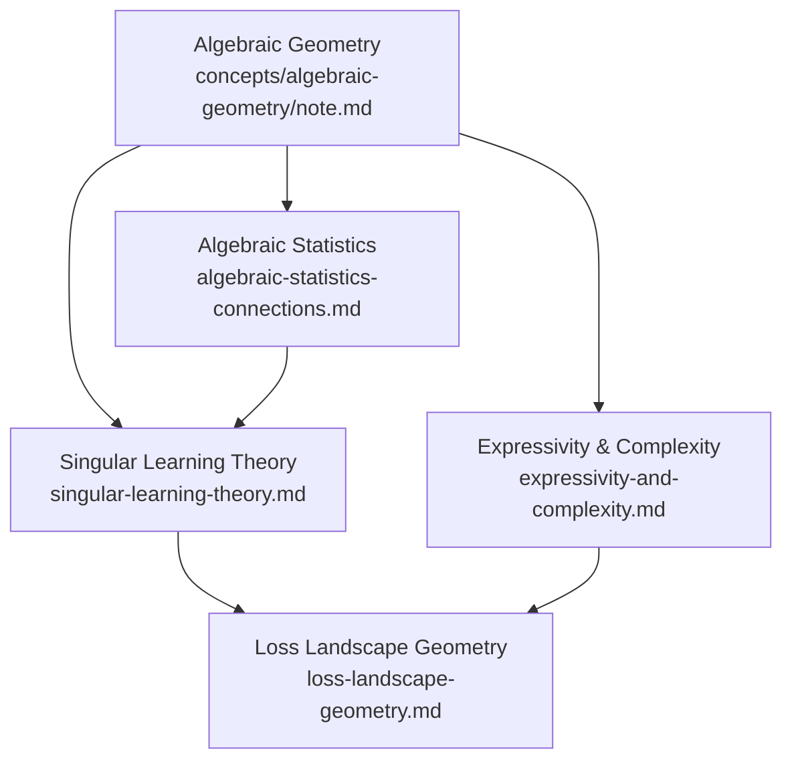

# Neuroalgebraic Geometry: Overview

> [!INFO] About this folder
> This folder collects notes on **neuroalgebraic geometry** — the study of neural networks and statistical learning via algebraic geometry. It lives under `concepts/algebraic-geometry/` because the mathematical foundations (varieties, resolution of singularities, semi-algebraic sets) are developed there. Notes assume familiarity with schemes, birational geometry, and real algebraic geometry at the level of [[concepts/algebraic-geometry/note|the parent folder]].

---

## 📋 Notes in This Folder

| File | Status | Topic |
|------|--------|-------|
| `singular-learning-theory.md` | 🔲 Planned | Watanabe's RLCT, resolution of singularities, Bayesian asymptotics |
| `expressivity-and-complexity.md` | 🔲 Planned | Neuromanifold dimension/degree, tensor rank, Milnor-Thom bounds |
| `loss-landscape-geometry.md` | 🔲 Planned | Critical point structure, Morse theory, EDD, symmetry quotients |
| `algebraic-statistics-connections.md` | 🔲 Planned | MLE on varieties, graphical models, identifiability, exponential families |

---

## 🗺️ Subtopic Map

### Thread 1 — Singular Models & Bayesian Asymptotics

| Subtopic | Key Idea | Primary Source |
|----------|----------|----------------|
| Nonidentifiability & singular models | Parameter map φ: W → M is not injective; fibers are positive-dimensional | Watanabe 2009 |
| Real log canonical threshold (RLCT) | Birational invariant λ controlling Bayes free energy; λ ≤ d/2 for singular models | Watanabe 2009, 2211.10049 |
| Resolution of singularities | Hironaka: blow up W to resolve φ; pullback posterior is normal crossing | Watanabe 2009 |
| Free energy asymptotics | F_n = nS_n + λ log n − (m−1) log log n + O(1); RLCT replaces d/2 in BIC | Watanabe 2009 |
| Phase transitions in learning | λ changes discontinuously as hyperparameters vary; analogy with stat-mech phase transitions | 2406.10234 |
| SLT for deep learning | Neural networks are singular; singularities are *good* (smaller effective complexity) | 2010.11560 |

### Thread 2 — Neuromanifolds & Expressivity

| Subtopic | Key Idea | Primary Source |
|----------|----------|----------------|
| Neuromanifold definition | M = image of φ: W → F(X) in function space; semi-algebraic variety | 2501.18915 |
| Dimension and sample complexity | dim M controls covering number; log N_ε = O(m log(d/ε)) | 2501.18915 |
| Degree and curvature | deg M bounds number of complex critical points of distance minimization | 2501.18915 |
| Identifiability via fibers | φ^{-1}(f) for generic f encodes symmetry group (permutation + scaling for MLPs) | 2501.18915 |
| Linear networks as determinantal varieties | Neuromanifold of linear MLPs = rank-r matrices; RLCT known exactly | Watanabe 2009, 2501.18915 |
| Tropical geometry for ReLU | Max-plus algebra linearizes ReLU computations; tropical varieties count linear regions | 2501.18915 |

### Thread 3 — Loss Landscape & Optimization Geometry

| Subtopic | Key Idea | Primary Source |
|----------|----------|----------------|
| Euclidean distance degree (EDD) | Counts complex critical points of ‖f − f_0‖² over M; bounds real optima | 2501.18915 |
| Singularities as implicit bias | Singular points attract gradient flow → preference for simpler subnetworks | 2501.18915, IPAM |
| Critical point theory | Distinguishing genuine optima from saddles using algebraic discriminants | IPAM workshop |
| Symmetry-induced degeneracies | Permutation symmetry of hidden neurons creates flat directions; quotient geometry | General |

### Thread 4 — Algebraic Statistics Connections

| Subtopic | Key Idea | Primary Source |
|----------|----------|----------------|
| MLE on varieties | Likelihood geometry: ML degree counts critical points of log-likelihood on variety | Sturmfels et al. |
| Graphical models as varieties | Conditional independence = polynomial equations on covariance matrices | General |
| Exponential families | Sufficient statistics map defines a toric variety; duality with log-partition function | General |
| AI alignment & information theory | Bayesian free energy provides universal criterion for model comparison under singularity | 2406.10234 |

---

## 🔗 Dependency Graph

---

## 📚 Master References

| Reference | Authors | Year | What It Covers | Link |
|-----------|---------|------|----------------|------|
| **Thread 1: Singular Learning Theory** | | | | |
| [Algebraic Geometry and Statistical Learning Theory](https://www.cambridge.org/core/books/algebraic-geometry-and-statistical-learning-theory/00C7E7C8EFB48AF64E8E1F22B3C7FC91) | S. Watanabe | 2009 | Foundational monograph: RLCT, resolution, free energy asymptotics, WBIC | Cambridge Univ. Press |
| [Mathematical Theory of Bayesian Statistics](https://www.routledge.com/Mathematical-Theory-of-Bayesian-Statistics/Watanabe/p/book/9780367734817) | S. Watanabe | 2018 | Extended monograph: WAIC/WBIC derivations, phase transitions in Bayesian inference | Routledge |
| [Equations of States in Singular Statistical Estimation](https://arxiv.org/abs/0712.0653) | S. Watanabe | 2010 | Fundamental asymptotic relations linking Bayes generalization error, training error, free energy | arXiv:0712.0653 |
| [A Widely Applicable Bayesian Information Criterion](https://arxiv.org/abs/1208.6338) | S. Watanabe | 2013 | WBIC: singular-model-aware BIC replacement via tempered posterior average | arXiv:1208.6338 |
| [Recent Advances in AG and Bayesian Statistics](https://arxiv.org/abs/2211.10049) | S. Watanabe | 2022 | 20-year review of SLT: birational methods, renormalized posteriors, universal formula | arXiv:2211.10049 |
| [Review: Stat Mech–ML Equivalence](https://arxiv.org/abs/2406.10234) | S. Watanabe | 2024 | Algebraic research program; phase transitions; AI alignment via free energy | arXiv:2406.10234 |
| [Deep Learning is Singular, and That's Good](https://arxiv.org/abs/2010.11560) | Murfet, Wei et al. | 2021 | Neural nets as singular models; SLT for DL; RLCT experiments | arXiv:2010.11560 |
| [The Local Learning Coefficient](https://arxiv.org/abs/2308.12108) | Lau et al. | 2023 | Scalable SGLD-based RLCT estimator; detects phase transitions in transformers | arXiv:2308.12108 |
| [Classification of Real Hyperplane Singularities by RLCT](https://arxiv.org/abs/2411.13392) | Lau, Wiesmann | 2024 | Combinatorial SageMath algorithm for RLCT of hyperplane arrangement polynomials | arXiv:2411.13392 |
| **Thread 2: Expressivity and Algebraic Complexity** | | | | |
| [Neuroalgebraic Geometry](https://arxiv.org/abs/2501.18915) | TBD | 2025 | Expository overview: neuromanifolds, dimension/degree/singularities/fibers/EDD | arXiv:2501.18915 |
| [Geometry of Polynomial Neural Networks](https://arxiv.org/abs/2402.00949) | Kubjas et al. | 2024 | Neurovariety dimension/degree; learning degree as training complexity | arXiv:2402.00949 |
| [Algebraic Complexity and Neurovariety of Linear Convolutional Networks](https://arxiv.org/abs/2401.16613) | Shahverdi | 2024 | Neuromanifold of 1-D linear CNNs = semialgebraic set; EDD equals ED degree of Segre variety | arXiv:2401.16613 |
| [Activation Degree Thresholds and Expressiveness](https://arxiv.org/abs/2408.04569) | Finkel et al. | 2024 | Activation threshold: minimal degree at which neurovariety achieves maximum dimension | arXiv:2408.04569 |
| [On the Expressive Power of Deep Learning: A Tensor Analysis](https://arxiv.org/abs/1509.05009) | Cohen et al. | 2016 | Deep CNNs ↔ hierarchical Tucker decompositions; exponential depth separation via tensor rank | arXiv:1509.05009 |
| [On the Number of Linear Regions of Deep Neural Networks](https://arxiv.org/abs/1402.1869) | Montúfar et al. | 2014 | Deep ReLU networks carve exponentially more linear regions than shallow; piecewise-linear complexity | arXiv:1402.1869 |
| [Benefits of Depth in Neural Networks](https://arxiv.org/abs/1602.04485) | Telgarsky | 2016 | Sawtooth functions: depth-$k^3$ expressible but require $\Omega(2^k)$ width at depth $O(k)$ | arXiv:1602.04485 |
| [The Euclidean Distance Degree of an Algebraic Variety](https://arxiv.org/abs/1309.0049) | Draisma et al. | 2016 | Defines EDD; counts complex critical points of squared distance; bounds real optima | arXiv:1309.0049 |
| [An Introduction to Tropical Geometry](https://arxiv.org/abs/1502.05950) | Maclagan, Sturmfels | 2015 | Tropical varieties and max-plus algebra; applied to ReLU linearization | arXiv:1502.05950 |
| [Algebraic Complexity Theory](https://link.springer.com/book/10.1007/978-3-662-03338-8) | Bürgisser, Clausen, Shokrollahi | 1997 | Tensor rank, circuit complexity, Strassen's theorem | Springer |
| [Why Does Deep and Cheap Learning Work So Well?](https://arxiv.org/abs/1608.08225) | Lin et al. | 2017 | Hierarchical polynomial structure in physics maps to efficient deep networks; RG group analogy | arXiv:1608.08225 |
| **Thread 3: Loss Landscape Geometry** | | | | |
| [Loss Surface of Deep Linear Networks via Algebraic Geometry](https://arxiv.org/abs/1810.07716) | Mehta et al. | 2018 | Numerical AG (homotopy continuation) enumerates all stationary points; algebraic degree bounds | arXiv:1810.07716 |
| [Geometry of the Loss Landscape: Symmetries and Invariances](https://arxiv.org/abs/2105.12221) | Simsek et al. | 2021 | Permutation symmetry generates structured manifold of minima; one extra neuron connects all minima | arXiv:2105.12221 |
| [Connectedness of Loss Landscapes via Morse Theory](https://proceedings.mlr.press/v197/akhtiamov23a.html) | Akhtiamov, Thomson | 2023 | Morse theory for mode connectivity; saddle-point index structure governs path-connectivity | PMLR v197 |
| [Symmetries of Neural Networks](https://arxiv.org/abs/2106.10255) | Brea, Gerstner, Urbanczik | 2019 | Permutation and scaling symmetries; fiber structure of MLP parameter space | arXiv:2106.10255 |
| [Flat Minima](https://www.bioinf.jku.at/publications/older/3304.pdf) | Hochreiter, Schmidhuber | 1997 | Flat-minima hypothesis with MDL/Bayesian argument; precursor to sharpness-aware geometry | bioinf.jku.at |
| [Morse Theory](https://press.princeton.edu/books/paperback/9780691080086/morse-theory) | Milnor | 1963 | Canonical reference: deformation retracts, index theory, CW-complex reconstruction | Princeton Univ. Press |
| **Thread 4: Algebraic Statistics** | | | | |
| [Algebraic Statistics](https://www.ams.org/books/gsm/194/) | Sullivant | 2018 | Comprehensive AMS textbook: algebraic exponential families, MLE degree, identifiability | AMS GSM 194 |
| [Lectures on Algebraic Statistics](https://link.springer.com/book/10.1007/978-3-7643-8905-5) | Drton, Sturmfels, Sullivant | 2009 | Compact introduction to MLE on varieties, likelihood geometry, graphical models | Birkhäuser |
| [Likelihood Geometry](https://arxiv.org/abs/1305.7462) | Huh, Sturmfels | 2014 | ML degree as Euler characteristic of very affine variety; toric and determinantal models | arXiv:1305.7462 |
| [Algebraic Statistics for Computational Biology](https://www.cambridge.org/core/books/algebraic-statistics-for-computational-biology/2E5CCE6BB6751EB7423EE3D2BF40EBFF) | Pachter, Sturmfels | 2005 | Gröbner bases, toric models, tropical geometry for genomics; graphical models and identifiability | Cambridge Univ. Press |
| [Learning Algebraic Varieties from Samples](https://arxiv.org/abs/1802.09436) | Breiding et al. | 2018 | Persistent-homology pipeline to recover dimension/degree/equations of variety from point cloud | arXiv:1802.09436 |
| **Background / Cross-Cutting** | | | | |
| [Ideals, Varieties, and Algorithms](https://link.springer.com/book/10.1007/978-3-319-16721-3) | Cox, Little, O'Shea | 2015 | Standard intro: Gröbner bases, Nullstellensatz, primary decomposition, elimination theory | Springer |
| [Solving Systems of Polynomial Equations](https://bookstore.ams.org/cbms-97/) | Sturmfels | 2002 | Resultants, Bernstein's theorem, Nash equilibria, AG of statistical models | AMS CBMS 97 |
| [Information, Physics, and Computation](https://global.oup.com/academic/product/information-physics-and-computation-9780198570837) | Mézard, Montanari | 2009 | Stat mech of disordered systems; belief propagation, cavity method; phase transitions in large NNs | Oxford Univ. Press |
| [Tensor Decompositions and Applications](https://epubs.siam.org/doi/10.1137/07070111X) | Kolda, Bader | 2009 | Tucker/CP decompositions; tensor rank; algebraic complexity | SIAM Review |
| [IPAM Workshop: AG — A Window to ML](https://www.ipam.ucla.edu/programs/workshops/algebraic-geometry-a-window-to-machine-learning/) | IPAM | 2024 | Community overview: grokking, neural collapse, LoRA, network verification via AG | IPAM |
| [Understanding Deep Learning Requires Rethinking Generalization](https://arxiv.org/abs/1611.03530) | Zhang et al. | 2017 | Empirical motivation for SLT: classical bounds fail for neural nets | arXiv:1611.03530 |
| [Grokking: Generalization Beyond Overfitting](https://arxiv.org/abs/2201.02177) | Power et al. | 2022 | Delayed generalization; one of the IPAM open problems | arXiv:2201.02177 |
