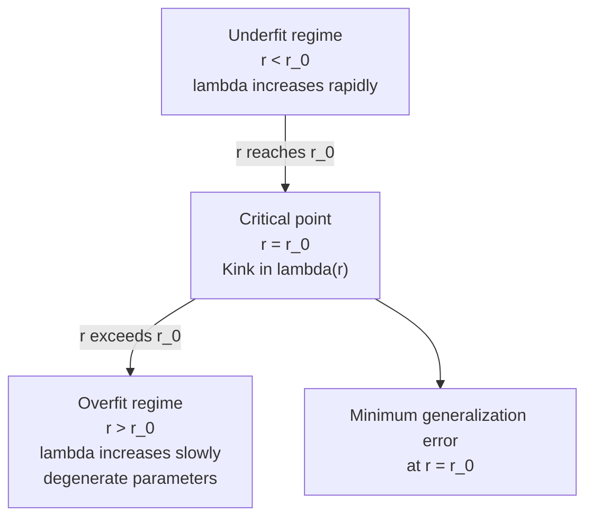
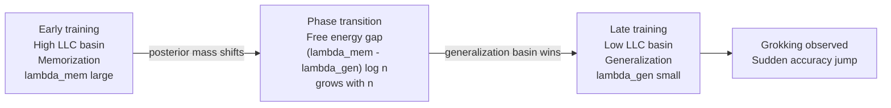

# Singular Learning Theory

## Table of Contents

- [[#1. Introduction and Motivation|1. Introduction and Motivation]]
  - [[#1.1 The Failure of Classical Asymptotics|1.1 The Failure of Classical Asymptotics]]
  - [[#1.2 What Singular Learning Theory Provides|1.2 What Singular Learning Theory Provides]]
- [[#2. Setup: Statistical Models as Algebraic Maps|2. Setup: Statistical Models as Algebraic Maps]]
  - [[#2.1 The Model Map and Parameter Space|2.1 The Model Map and Parameter Space]]
  - [[#2.2 KL Divergence and the Optimal Parameter Set|2.2 KL Divergence and the Optimal Parameter Set]]
  - [[#2.3 Regular vs. Singular Models|2.3 Regular vs. Singular Models]]
- [[#3. Singularities and Their Origin|3. Singularities and Their Origin]]
  - [[#3.1 The Optimal Set as an Analytic Variety|3.1 The Optimal Set as an Analytic Variety]]
  - [[#3.2 Sources of Singularity in Neural Networks|3.2 Sources of Singularity in Neural Networks]]
  - [[#3.3 Degeneracy of the Fisher Information Matrix|3.3 Degeneracy of the Fisher Information Matrix]]
- [[#4. Resolution of Singularities|4. Resolution of Singularities]]
  - [[#4.1 Hironaka's Theorem|4.1 Hironaka's Theorem]]
  - [[#4.2 The Pullback Construction|4.2 The Pullback Construction]]
  - [[#4.3 Normal Crossing Divisors and Their Utility|4.3 Normal Crossing Divisors and Their Utility]]
- [[#5. The Real Log-Canonical Threshold|5. The Real Log-Canonical Threshold]]
  - [[#5.1 Definition via the Zeta Function|5.1 Definition via the Zeta Function]]
  - [[#5.2 Birational Invariance|5.2 Birational Invariance]]
  - [[#5.3 Computation via Newton Polyhedra|5.3 Computation via Newton Polyhedra]]
  - [[#5.4 Examples: Matrix Factorization and Two-Layer Networks|5.4 Examples: Matrix Factorization and Two-Layer Networks]]
- [[#6. Free Energy Asymptotics|6. Free Energy Asymptotics]]
  - [[#6.1 The Bayesian Free Energy|6.1 The Bayesian Free Energy]]
  - [[#6.2 Watanabe's Main Theorem|6.2 Watanabe's Main Theorem]]
  - [[#6.3 Derivation Sketch|6.3 Derivation Sketch]]
  - [[#6.4 Comparison with BIC and the WBIC Estimator|6.4 Comparison with BIC and the WBIC Estimator]]
- [[#7. Phase Transitions|7. Phase Transitions]]
  - [[#7.1 The Statistical Mechanics Analogy|7.1 The Statistical Mechanics Analogy]]
  - [[#7.2 Phase Diagrams and Discontinuous RLCT|7.2 Phase Diagrams and Discontinuous RLCT]]
  - [[#7.3 Tempered Posteriors and Singular Fluctuation|7.3 Tempered Posteriors and Singular Fluctuation]]
- [[#8. Implications for Deep Learning|8. Implications for Deep Learning]]
  - [[#8.1 Why Singularity Is Beneficial|8.1 Why Singularity Is Beneficial]]
  - [[#8.2 RLCT and Double Descent|8.2 RLCT and Double Descent]]
  - [[#8.3 Grokking as a Phase Transition|8.3 Grokking as a Phase Transition]]
- [[#9. References|9. References]]

---

## 1. Introduction and Motivation 📐

### 1.1 The Failure of Classical Asymptotics

Classical Bayesian asymptotics rests on the *Bernstein–von Mises theorem*: under regularity conditions, the posterior concentrates around the maximum-likelihood estimator at rate $1/\sqrt{n}$ and is asymptotically Gaussian. The *Schwarz Bayesian Information Criterion (BIC)* follows from this:

$$\text{BIC} = -2\log p(x^n \mid \hat{w}) + d \log n,$$

where $d$ is the number of free parameters and $\hat{w}$ is the MLE. The term $d \log n$ serves as the complexity penalty. The derivation relies on a Laplace approximation around $\hat{w}$, which requires the *Fisher information matrix*

$$I(w) = \mathbb{E}_{q}\!\left[\nabla_w \log p(x \mid w)\,\nabla_w \log p(x \mid w)^\top\right]$$

to be strictly positive definite in a neighbourhood of the optimal parameters.

> [!DANGER] The Regularity Assumption Is Almost Always Violated
> For neural networks, normal mixtures, hidden Markov models, Boltzmann machines, and reduced-rank regression, the Fisher information matrix $I(w)$ is *identically singular on a set of positive measure*. The Laplace approximation is inapplicable, the MLE is non-unique, and BIC overestimates model complexity. Classical asymptotics simply fails.

More precisely, the Bernstein–von Mises theorem requires *local asymptotic normality (LAN)*: after centering and scaling, the log-likelihood ratio converges to a Gaussian shift experiment. LAN requires $I(w_0)$ to be non-degenerate at the true parameter $w_0$. Whenever the optimal parameter set has positive codimension greater than 0 — i.e., whenever it is a variety rather than an isolated point — LAN fails.

### 1.2 What Singular Learning Theory Provides

*Singular Learning Theory (SLT)*, developed by Sumio Watanabe starting in the late 1990s and synthesized in his 2009 Cambridge monograph, resolves this impasse using tools from algebraic geometry. The central objects are:

1. **The real log-canonical threshold (RLCT)** $\lambda \in \mathbb{Q}_{>0}$, a birational invariant of the pair (model, truth) that replaces $d/2$ in the BIC complexity penalty.
2. **The multiplicity** $m \in \mathbb{Z}_{>0}$, an integer that governs logarithmic corrections to the free energy.

The key replacement is:

$$\underbrace{\frac{d}{2}}_{\text{BIC}} \longrightarrow \underbrace{\lambda}_{\text{SLT}},\quad \lambda \leq \frac{d}{2},$$

with equality only for regular models. For singular models, $\lambda < d/2$, meaning the effective Bayesian complexity penalty is strictly smaller than BIC predicts. **This is the quantitative sense in which singularity is beneficial for learning.**

---

## 2. Setup: Statistical Models as Algebraic Maps 🔑

### 2.1 The Model Map and Parameter Space

**Definition (Statistical Model).** Let $\mathcal{X}$ be a measurable sample space and let $W \subseteq \mathbb{R}^d$ be an open, relatively compact parameter space. A *statistical model* is a family of probability densities

$$p: W \times \mathcal{X} \to \mathbb{R}_{>0}, \quad (w, x) \mapsto p(x \mid w),$$

where $p(\cdot \mid w)$ is a probability density on $\mathcal{X}$ for each $w \in W$. We assume $p(x \mid w)$ is a real analytic function of $w$ for almost every $x$.

The model induces a *model map*

$$\varphi: W \to \mathcal{P}(\mathcal{X}), \quad w \mapsto p(\cdot \mid w),$$

where $\mathcal{P}(\mathcal{X})$ denotes the space of probability distributions on $\mathcal{X}$.

> [!NOTE] The Image as a Variety
> When the parametrization $w \mapsto p(\cdot \mid w)$ is polynomial or real-analytic, the image $\varphi(W)$ is a semi-algebraic or real-analytic variety in $\mathcal{P}(\mathcal{X})$. In the machine learning literature (following arXiv 2501.18915), this image is called the *neuromanifold*
> $$\mathcal{M} = \{f_w : \mathcal{X} \to \mathcal{Y} \mid w \in W\}.$$
> For neural networks with polynomial or real-analytic activations, $\mathcal{M}$ is a semi-algebraic variety.

### 2.2 KL Divergence and the Optimal Parameter Set

Let $q(x)$ be the density of the *true distribution* generating the data. The *Kullback–Leibler divergence* from $p(\cdot \mid w)$ to $q$ is

$$K(w) = \int_{\mathcal{X}} q(x) \log \frac{q(x)}{p(x \mid w)}\, dx.$$

$K(w) \geq 0$ with equality if and only if $p(\cdot \mid w) = q$ almost everywhere.

**Definition (Optimal Parameter Set).** The *optimal parameter set* is

$$W_0 = \arg\min_{w \in W} K(w) = \{w \in W : K(w) = K_{\min}\},$$

where $K_{\min} = \min_{w \in W} K(w) \geq 0$.

*Realizability* holds when $K_{\min} = 0$, i.e., $q \in \varphi(W)$; the *unrealizable* case has $K_{\min} > 0$. SLT handles both, though the realizable case is analytically cleaner for stating the main theorem.

The fundamental difficulty is:

> [!WARNING] Non-Isolation of Optimal Parameters
> For most interesting models (neural networks, mixtures), $W_0$ is *not a finite set of isolated points*. It is a closed analytic subvariety of $W$ of positive dimension. The Laplace approximation treats $W_0$ as a single point with a Gaussian basin — an approximation that fails completely when $\dim W_0 > 0$.

### 2.3 Regular vs. Singular Models

**Definition (Regular Model).** A statistical model is *regular* if:
1. The map $\varphi: W \to \mathcal{P}(\mathcal{X})$ is injective (identifiable);
2. The Fisher information matrix $I(w)$ is strictly positive definite for all $w \in W$; and
3. $W_0$ is a single point.

**Definition (Singular Model).** A model is *singular* if it is not regular — specifically, if there exists $w \in W$ such that $\det I(w) = 0$.

> [!EXAMPLE] The Two-Layer Tanh Network Is Singular
> Consider a feedforward network $f(x, w) = \sum_{h=1}^{H} b_h \tanh(a_h \cdot x + c_h)$ with $H$ hidden units, input dimension $p$, and scalar output. The parameter vector $w = (a_1, \ldots, a_H, b_1, \ldots, b_H, c_1, \ldots, c_H) \in \mathbb{R}^{H(p+2)}$. If the true function is representable by a network with fewer than $H$ hidden units, then $W_0$ is a union of lower-dimensional strata, and $I(w) = 0$ for every $w \in W_0$.

---

> [!QUESTION] Exercise 1: Non-Identifiability from Permutation Symmetry
> *This exercise establishes the simplest source of non-injectivity in neural networks.*
>
> > **Prerequisites:** [[#2.3 Regular vs. Singular Models|2.3 Regular vs. Singular Models]]
>
> Let $f(x, w) = \sum_{h=1}^{2} b_h \tanh(a_h x + c_h)$ be a one-hidden-layer scalar network with two hidden units and scalar input. Show that for any permutation $\sigma \in S_2$, the reparametrization $w' = (a_{\sigma(1)}, a_{\sigma(2)}, b_{\sigma(1)}, b_{\sigma(2)}, c_{\sigma(1)}, c_{\sigma(2)})$ satisfies $f(x, w') = f(x, w)$ for all $x$. Conclude that $\varphi$ is not injective and describe the orbit of a generic point under this symmetry.

> [!TIP]- Solution to Exercise 1
> **Key insight:** The output is an unordered sum of contributions from each hidden unit, so swapping unit indices leaves it unchanged.
>
> **Sketch:** We compute $f(x, w') = b_{\sigma(1)} \tanh(a_{\sigma(1)} x + c_{\sigma(1)}) + b_{\sigma(2)} \tanh(a_{\sigma(2)} x + c_{\sigma(2)})$. Since addition is commutative, this equals $f(x, w)$ for any $\sigma \in S_2$. The generic orbit under $S_2$ has exactly $|S_2| = 2$ elements (any $w$ with $a_1 \neq a_2$), so $\varphi$ is at least $2$-to-$1$ on an open dense set, hence not injective.

---

## 3. Singularities and Their Origin 📐

### 3.1 The Optimal Set as an Analytic Variety

Let $K(w) = \int q(x) \log \frac{q(x)}{p(x|w)} dx$ be the KL function. For real-analytic models, $K$ is real-analytic on $W$. The zero set (in the realizable case)

$$W_0 = \{w \in W : K(w) = 0\}$$

is a real-analytic variety. Because $K(w) \geq 0$ and $K$ is analytic, the Taylor expansion of $K$ around any $w_0 \in W_0$ begins at even order. If $W_0$ is smooth at $w_0$, the Hessian $\nabla^2 K(w_0)$ may have a non-trivial null space corresponding to tangent directions along $W_0$.

**Definition (Singular Point of $W_0$).** A point $w_0 \in W_0$ is *singular* if the Zariski tangent space at $w_0$ has dimension strictly greater than the local dimension of $W_0$ at $w_0$. The singular locus $\text{Sing}(W_0)$ is itself a closed analytic subvariety of $W_0$ of strictly smaller dimension.

### 3.2 Sources of Singularity in Neural Networks

For neural networks, singularities in $W_0$ arise from at least three distinct mechanisms:

**1. Permutation symmetry.** For any layer with $H$ hidden units, any permutation $\sigma \in S_H$ that relabels units produces an equivalent parameter. This generates a group action on $W_0$ with $|S_H| = H!$ elements, contributing $H!$ equivalent points for each function in $\varphi(W_0)$.

**2. Scaling symmetry.** For ReLU networks (and more generally for positively homogeneous activations), for any $\alpha > 0$ and hidden unit $h$:

$$\text{ReLU}\!\left(\alpha w_{h}\right) \cdot \frac{b_h}{\alpha} = \text{ReLU}(w_h) \cdot b_h.$$

The incoming-weight vector of unit $h$ can be scaled by any $\alpha > 0$ while the outgoing weight is scaled by $1/\alpha$, leaving the network function unchanged. This creates a continuous family of equivalent parameters — a $1$-dimensional stratum in $W_0$ through each point.

**3. Node degeneracy.** If the true function is realizable with $H' < H$ hidden units, then parameter configurations with some units "turned off" (weights zero, or contributing zero to the sum) lie in $W_0$. These lower-dimensional strata are the *deepest* singularities and carry the smallest RLCT.

> [!INFO] Historical Note
> Watanabe identified these symmetries as the essential obstruction to applying the Laplace approximation in his 1998 paper on neural network Bayesian analysis. The scaling symmetry for sign-symmetric activations (tanh) takes the form $(a_h, b_h) \mapsto (-a_h, -b_h)$, giving a $\mathbb{Z}/2$ action.

### 3.3 Degeneracy of the Fisher Information Matrix

Let $\partial_i = \partial/\partial w_i$. The Fisher information matrix is

$$I_{ij}(w) = \mathbb{E}_q[\partial_i \log p(x \mid w) \cdot \partial_j \log p(x \mid w)].$$

**Proposition.** If the model map $\varphi$ is not injective in a neighbourhood of $w$, then $I(w)$ is singular.

*Proof sketch.* Non-injectivity implies the existence of a smooth curve $\gamma(t)$ in $W$ through $w = \gamma(0)$ such that $\varphi(\gamma(t)) = \varphi(w)$ for all $t$. Differentiating $p(x \mid \gamma(t)) = p(x \mid w)$ with respect to $t$ at $t = 0$ gives $\nabla_w \log p(x \mid w) \cdot \dot\gamma(0) = 0$ for a.e. $x$. Hence $\dot\gamma(0) \in \ker I(w)$. $\square$

For the scaling symmetry of a one-hidden-layer network with unit $h$, the curve $\gamma(t)$ scales $(a_h, b_h)$ by $e^t$ and $e^{-t}$ respectively. Differentiating gives $a_h \nabla_{a_h} f - b_h \nabla_{b_h} f = 0$ (in an appropriate sense), revealing a null eigenvector of $I(w)$ explicitly.

> [!NOTE] Corollary
> For a two-layer ReLU network with any $H \geq 1$ hidden unit, $\det I(w) = 0$ everywhere. The Fisher information matrix is globally rank-deficient, not just at isolated points. The entire parameter space is a set of singularities for the model.

---

> [!QUESTION] Exercise 2: Null Eigenvector from Scaling Symmetry
> *This exercise makes the degeneracy of $I(w)$ explicit for the scaling symmetry.*
>
> > **Prerequisites:** [[#3.3 Degeneracy of the Fisher Information Matrix|3.3 Degeneracy of the Fisher Information Matrix]]
>
> For a one-hidden-layer scalar network $f(x, w) = b \cdot \sigma(a \cdot x)$ with a single hidden unit and $\sigma$ positively homogeneous of degree 1 (i.e., $\sigma(\alpha t) = \alpha \sigma(t)$ for $\alpha > 0$), define $v = (a, -b) \in \mathbb{R}^2$ (in the $(a, b)$ coordinates). Show that $\nabla_{(a,b)} \log p(y \mid x, a, b) \cdot v = 0$ for all $x, y$, and deduce that $v \in \ker I(w)$ for every $w = (a, b)$.

> [!TIP]- Solution to Exercise 2
> **Key insight:** The scaling symmetry gives a continuous curve of equivalent parameters; its tangent vector is the null eigenvector.
>
> **Sketch:** The network output is $f(x, a, b) = b \sigma(ax)$. By positive homogeneity, $f(x, e^t a, e^{-t} b) = e^{-t} b \sigma(e^t a x) = b \sigma(ax) = f(x, a, b)$ for all $t$. So $p(y \mid x, e^t a, e^{-t} b) = p(y \mid x, a, b)$ for any noise model depending on $y - f$. Differentiating in $t$ at $t=0$: $(\partial_a \log p) \cdot a + (\partial_b \log p) \cdot (-b) = 0$, i.e., $\nabla_{(a,b)} \log p \cdot (a, -b) = 0$ a.s. Taking the expectation gives $I(w)(a,-b) = 0$, so $v = (a,-b) \in \ker I(w)$.

---

## 4. Resolution of Singularities 📐

### 4.1 Hironaka's Theorem

The key algebraic-geometric input is Hironaka's landmark 1964 theorem on resolution of singularities for varieties over $\mathbb{R}$ or $\mathbb{C}$.

**Theorem (Hironaka, 1964).** Let $V$ be an algebraic (or real-analytic) variety over a field of characteristic zero. There exists a smooth manifold $\tilde{V}$ and a proper birational morphism

$$g: \tilde{V} \to V$$

such that:
1. $g$ is an isomorphism over the smooth locus $V \setminus \text{Sing}(V)$;
2. the *exceptional divisor* $E = g^{-1}(\text{Sing}(V))$ is a *simple normal crossing divisor* (SNC divisor) on $\tilde{V}$.

The morphism $g$ is called a *resolution of singularities*. It is constructed by a finite sequence of *blow-ups* along smooth centers.

> [!NOTE] What "Proper Birational" Means
> Birational means $g$ is an isomorphism on a dense open subset. Proper means preimages of compact sets are compact (the map does not "throw points away to infinity"). Together: $g$ is an isomorphism generically, but replaces singularities with more complex (smooth) fibers — the exceptional divisors.

**Definition (Simple Normal Crossing Divisor).** A divisor $D = \bigcup_{k} D_k$ on a smooth manifold $\tilde{V}$ is *simple normal crossing* (SNC) if each irreducible component $D_k$ is smooth, and at any point $\tilde{w} \in \tilde{V}$, there exist local coordinates $(u_1, \ldots, u_d)$ such that $D$ is locally of the form $\{u_1^{} \cdots u_\ell = 0\}$ for some $\ell \leq d$ (with each $D_k$ given by $\{u_{i_k} = 0\}$ for a distinct index $i_k$).

In other words, the components of $D$ are smooth hypersurfaces meeting transversally, like coordinate hyperplanes.

### 4.2 The Pullback Construction

SLT applies Hironaka's theorem to resolve the singularities of the variety $W_0 \subset W$. Let $g: \tilde{W} \to W$ be a resolution, and write $u = g^{-1}(w)$ for coordinates on $\tilde{W}$.

The *pullback* of the log-likelihood ratio function $K(w)$ is

$$K(g(u)) = \tilde{K}(u).$$

By the normal crossing property, in a local chart near any $\tilde{w}_0 \in g^{-1}(W_0)$, the pullback takes the form

$$\tilde{K}(u) = u_1^{2k_1} u_2^{2k_2} \cdots u_d^{2k_d} \cdot c(u),$$

where $k_i \in \mathbb{Z}_{\geq 0}$, and $c(u) > 0$ is a smooth function with $c(\tilde{w}_0) > 0$. The exponents $(2k_1, \ldots, 2k_d)$ are the *orders of vanishing* of $\tilde{K}$ along each component of the exceptional divisor — they are even because $K(w) \geq 0$.

Similarly, the *Jacobian* of $g$ satisfies

$$\det\, dg(u) = u_1^{h_1} \cdots u_d^{h_d} \cdot \tilde{c}(u), \quad h_i \in \mathbb{Z}_{\geq 0}.$$

These local monomial forms are the technical core that makes the zeta function computation tractable.

### 4.3 Normal Crossing Divisors and Their Utility

The SNC condition converts the analysis of a singular integral over $W$ into a sum of tractable integrals in local charts on $\tilde{W}$. Specifically, the zeta function (defined in the next section) factors locally as a product of one-dimensional Beta-type integrals:

$$\int_0^\delta |u_i|^{2k_i z + h_i - 1} du_i = \frac{\delta^{2k_i z + h_i}}{2k_i z + h_i} \xrightarrow{\text{poles at}} z = -\frac{h_i}{2k_i}.$$

The global poles of the zeta function are then the maximum (least negative) of these local poles across all charts and all coordinate directions. This maximum is the RLCT $\lambda$.

> [!INFO] Blow-Up Example
> The simplest blow-up replaces a point $0 \in \mathbb{R}^2$ by $\mathbb{P}^1$, and converts the function $K(w_1, w_2) = w_1^2 + w_2^2$ (smooth at 0, but if this were $w_1^2 w_2^2$ it would be SNC already) or more degenerate combinations into monomials in chart coordinates. For the cusp singularity $K = w_1^2 - w_2^3$, a single blow-up in the $(u_1, u_2)$ chart with $w_1 = u_1 u_2, w_2 = u_2$ gives $\tilde{K} = u_2^2(u_1^2 - u_2)$, beginning to separate the variables.

---

> [!QUESTION] Exercise 3: Normal Crossing After Blow-Up
> *This exercise works through the blow-up procedure for a simple degenerate model.*
>
> > **Prerequisites:** [[#4.2 The Pullback Construction|4.2 The Pullback Construction]]
>
> Let $W = \mathbb{R}^2$ and $K(w_1, w_2) = w_1^2 w_2^2$ (a model whose KL divergence vanishes on the two coordinate axes). This is a simple model of a singular point at the origin where two branches of $W_0$ cross. Perform the blow-up in the chart $w_1 = u_1, w_2 = u_1 u_2$ and show that $\tilde{K}(u_1, u_2) = u_1^4 u_2^2$. Identify the orders of vanishing $(k_1, k_2) = (2, 1)$ in this chart and compute the local pole of the zeta function at $z = -h/(2k)$ for $h_i = 1$ (Jacobian factor).

> [!TIP]- Solution to Exercise 3
> **Key insight:** The blow-up substitution converts a product of vanishing directions into a monomial, revealing the pole structure.
>
> **Sketch:** Substituting $w_1 = u_1, w_2 = u_1 u_2$: $K = (u_1)^2 (u_1 u_2)^2 = u_1^4 u_2^2$. So $(k_1, k_2) = (2, 1)$ in the sense that $\tilde{K} = u_1^{2 \cdot 2} u_2^{2 \cdot 1}$. The Jacobian of the blow-up map is $\det dg = u_1$ (since $dw_1 = du_1, dw_2 = u_2 du_1 + u_1 du_2$, so Jacobian determinant $= u_1$), giving $h_1 = 1, h_2 = 0$. The pole from the $u_1$ direction is at $z = -h_1/(2k_1) = -1/4$; the $u_2$ direction gives $z = -h_2/(2k_2) = 0$ (not a pole from the boundary). So the leading pole from this chart is at $\lambda = 1/4$.

---

## 5. The Real Log-Canonical Threshold 🔑

### 5.1 Definition via the Zeta Function

**Definition (Learning Zeta Function).** Given a statistical model with KL divergence function $K(w)$ and prior density $\varphi(w)$ (a smooth, positive function compactly supported in $W$), the *learning zeta function* is

$$\zeta(z) = \int_W K(w)^z\, \varphi(w)\, dw, \quad z \in \mathbb{C},\quad \text{Re}(z) > 0.$$

By real-analyticity of $K$ and the resolution of singularities, $\zeta(z)$ extends to a meromorphic function on all of $\mathbb{C}$, with poles at negative rational numbers.

**Definition (Real Log-Canonical Threshold).** The *real log-canonical threshold* (RLCT) $\lambda$ of the triple $(K, W, \varphi)$ is

$$\lambda = -\max\{\text{Re}(s) : s \text{ is a pole of } \zeta\} = \min_{k \geq 1} \lambda_k,$$

where the poles are ordered $-\lambda_1 > -\lambda_2 > \cdots$ (i.e., $\lambda_1 < \lambda_2 < \cdots$). The *multiplicity* $m$ is the order of the pole at $-\lambda_1$.

That is, $\lambda$ is the *smallest* pole magnitude (the least negative pole), and $m$ is its order. The Laurent expansion near $z = -\lambda$ reads

$$\zeta(z) = \frac{c_0}{(z + \lambda)^m} + \frac{c_1}{(z+\lambda)^{m-1}} + \cdots, \quad c_0 \neq 0.$$

> [!NOTE] Relation to Log-Canonical Threshold in Algebraic Geometry
> In algebraic geometry, the *log-canonical threshold* (lct) of a hypersurface $\{f = 0\}$ is the largest $c$ such that $|f|^{-c}$ is locally $L^2$-integrable. The RLCT in SLT is the real version, involving $\int |K(w)|^{2z} \varphi(w) dw$ and restricting to the real locus of $W$. For regular models, $K(w) \approx \|w - w_0\|^2_{I(w_0)}$ near $w_0$, and $\zeta(z) \sim \text{const} \cdot \Gamma(z + d/2)$, giving RLCT $= d/2$.

### 5.2 Birational Invariance

**Proposition (Birational Invariance of RLCT).** The pair $(\lambda, m)$ does not depend on the choice of resolution $g: \tilde{W} \to W$. It is a birational invariant of the triple $(W_0 \subset W, \varphi)$.

*Proof sketch.* Two resolutions $g_1: \tilde{W}_1 \to W$ and $g_2: \tilde{W}_2 \to W$ can be dominated by a third resolution $\tilde{W}_3 \to W$ that factors through both. On each $\tilde{W}_i$, the zeta function has the same meromorphic continuation by the change-of-variables formula. Since meromorphic continuation is unique, the poles agree. $\square$

This invariance is crucial: it means $\lambda$ is a genuine property of the statistical model, not an artifact of the coordinate system used to parametrize $W$.

### 5.3 Computation via Newton Polyhedra

For polynomial or power-series $K$, the RLCT can often be read off from the *Newton polyhedron* without performing an explicit resolution.

**Definition (Newton Polyhedron).** For a power series $K(w) = \sum_\alpha c_\alpha w^\alpha$, the *Newton polyhedron* $\Delta(K)$ is the convex hull of $\{\alpha \in \mathbb{R}_{\geq 0}^d : c_\alpha \neq 0\}$.

**Theorem (Newton Polyhedron Formula).** If $K$ is *non-degenerate* with respect to its Newton polyhedron (a condition on the leading forms of $K$ on each face of $\Delta(K)$), then

$$\lambda = \min_{\text{facets } F \text{ of } \Delta(K)} \frac{\sum_{i=1}^d h_i(F)}{\sum_{i=1}^d 2k_i(F)},$$

where $(h_i(F))$ are the coordinates of the inward normal to facet $F$ and $(2k_i(F))$ are the lattice coordinates of the point on $F$ closest to the origin along the normal direction. (More precisely, $\lambda$ is determined by the face of $\Delta(K)$ that the vector $(1,1,\ldots,1)$ first hits when approached from the origin.)

> [!WARNING] Non-Degeneracy Condition
> The Newton polyhedron formula gives the exact RLCT only when $K$ is non-degenerate with respect to $\Delta(K)$. Degenerate cases (e.g., where the leading form on a face factors) require more refined analysis via recursive blow-ups, as in Aoyagi–Watanabe (2005).

### 5.4 Examples: Matrix Factorization and Two-Layer Networks

**Example 1: Rank-$r$ Matrix Factorization (Reduced Rank Regression).**

Consider the model $A \approx BC$ where $A \in \mathbb{R}^{m \times n}$, $B \in \mathbb{R}^{m \times r}$, $C \in \mathbb{R}^{r \times n}$, and the true rank is $r_0 \leq r$. The neuromanifold is the *determinantal variety* $\mathcal{M}_r = \{A \in \mathbb{R}^{m \times n} : \text{rank}(A) \leq r\}$, defined by the vanishing of all $(r+1) \times (r+1)$ minors of $A$.

The dimension of $\mathcal{M}_r$ is $r(m + n - r)$, so a naive BIC complexity penalty would be $r(m + n - r)/2 \cdot \log n$. Aoyagi and Watanabe (2005) computed the exact RLCT for realizable reduced-rank regression:

$$\lambda = \frac{r_0(m + n - 2r_0 + 1)}{2} + \frac{(r - r_0)(m + n - r - r_0)}{2},$$

where the model uses rank $r$ but the truth has rank $r_0 \leq r$. When $r = r_0$ (model rank equals truth rank), this simplifies to $\lambda = r(m + n - r)/2$, recovering the dimension formula. When $r > r_0$, **$\lambda < r(m+n-r)/2$, confirming that the model is genuinely more complex than what BIC would estimate when the true signal is lower-rank.** This is the singular regime.

> [!NOTE] Connection to Determinantal Varieties
> The determinantal variety $\mathcal{M}_r$ is a classical object in algebraic geometry — it appears in Schubert calculus and is related to the Grassmannian. Its singular locus is $\mathcal{M}_{r-1}$, i.e., matrices of rank strictly less than $r$. The recursive structure of the singular locus mirrors the recursive blow-up strategy of Aoyagi–Watanabe.

**Example 2: Two-Layer Tanh Network with $H$ Hidden Units.**

For the realizable case with a true network of $H_0 < H$ hidden units, Watanabe showed (2001; see also the 2009 monograph) that the RLCT satisfies

$$\lambda \leq \frac{H_0(p + 1)}{2} + \frac{(H - H_0)(p + 2)}{4},$$

where $p$ is the input dimension. The first term is the contribution of the "active" units (matching the truth) and the second term accounts for the degenerate units. The singularity structure comes from the zeros of the hidden unit outputs at the degenerate parameters.

> [!EXAMPLE] Specializing to $H_0 = 0$ (Zero True Complexity)
> If the true function is the zero function and we model it with $H$ hidden units, $H_0 = 0$. Then $\lambda \leq H(p+2)/4$. Compare with the full parameter count $d = H(p+2)$, so $d/2 = H(p+2)/2$. The RLCT is at most *half* of the BIC penalty, reflecting that nearly all parameter directions are degenerate.

---

> [!QUESTION] Exercise 4: RLCT for a Rank-1 Model
> *This exercise computes a concrete RLCT to illustrate how singularity reduces effective complexity.*
>
> > **Prerequisites:** [[#5.4 Examples: Matrix Factorization and Two-Layer Networks|5.4 Examples: Matrix Factorization and Two-Layer Networks]]
>
> Consider the simplest matrix factorization: $W = \{(a, b) \in \mathbb{R}^2\}$, model $p(x \mid a, b) \propto \exp(-\|x - ab\|^2/2)$ for $x \in \mathbb{R}$, truth $q(x) \propto \exp(-x^2/2)$ (true rank 0, i.e., $a_0 b_0 = 0$). The KL function is $K(a, b) = (ab)^2 / 2$. Using the Newton polyhedron method, compute $\lambda$. Compare with the BIC complexity $d/2 = 1$.

> [!TIP]- Solution to Exercise 4
> **Key insight:** $K(a,b) = a^2 b^2 / 2$ is already in monomial form; the Newton polyhedron method applies directly.
>
> **Sketch:** $K(a, b) = (1/2) a^2 b^2$. The Newton polyhedron of $a^2 b^2$ has a single vertex at $(2, 2)$. The local zeta function near $0$ is $\zeta(z) \sim \int_0^\delta \int_0^\delta (a^2 b^2)^z da\, db = \int_0^\delta a^{2z} da \int_0^\delta b^{2z} db = \frac{\delta^{2z+1}}{2z+1} \cdot \frac{\delta^{2z+1}}{2z+1}$. The poles are at $2z + 1 = 0$, i.e., $z = -1/2$. So $\lambda = 1/2$ with multiplicity $m = 2$. The BIC penalty would use $d/2 = 1$, **but the actual complexity is $\lambda = 1/2 < 1$**, a factor of 2 smaller.

---

## 6. Free Energy Asymptotics 📐

### 6.1 The Bayesian Free Energy

Let $x^n = (x_1, \ldots, x_n)$ be $n$ i.i.d. observations from $q$. The *empirical log-likelihood* is $\ell_n(w) = \frac{1}{n} \sum_{i=1}^n \log p(x_i \mid w)$. The *Bayesian evidence* (marginal likelihood) is

$$Z_n = \int_W \prod_{i=1}^n p(x_i \mid w)\, \varphi(w)\, dw = \int_W \exp\!\left(n\, \ell_n(w)\right) \varphi(w)\, dw.$$

**Definition (Bayes Free Energy).** The *Bayes free energy* is $F_n = -\log Z_n$. It equals the negative log marginal likelihood and governs Bayesian model selection.

Decompose the empirical log-likelihood as

$$\ell_n(w) = -K_n(w) + \ell_n(w_0),$$

where $K_n(w) = \frac{1}{n}\sum_{i=1}^n \log \frac{p(x_i \mid w_0)}{p(x_i \mid w)}$ is the *empirical KL divergence* and $w_0$ is any fixed element of $W_0$. Then

$$Z_n = \exp(n\, \ell_n(w_0)) \int_W \exp(-n\, K_n(w))\, \varphi(w)\, dw,$$

and

$$F_n = -n\, \ell_n(w_0) - \log \int_W \exp(-n\, K_n(w))\, \varphi(w)\, dw.$$

The first term is the *accuracy part* (depends on the truth), and the second is the *complexity part* that depends on the geometry of $W_0$.

### 6.2 Watanabe's Main Theorem

The following is the central result of SLT, due to Watanabe (1999–2009).

**Theorem (Watanabe's Free Energy Formula).** Let $(\lambda, m)$ be the RLCT and multiplicity of the model triple $(K, W, \varphi)$. Let $S_n = -\frac{1}{n}\sum_{i=1}^n \log q(x_i)$ be the empirical entropy of the truth. Then, in the realizable case ($K_{\min} = 0$), the Bayes free energy satisfies

$$F_n = n S_n + \lambda \log n - (m - 1)\log \log n + O_p(1) \quad \text{as } n \to \infty,$$

where $O_p(1)$ denotes a term that is bounded in probability.

**The coefficient $\lambda \log n$ replaces the BIC term $\frac{d}{2} \log n$, with $\lambda \leq \frac{d}{2}$ always.** The correction $-(m-1)\log\log n$ appears only when the multiplicity $m > 1$.

> [!NOTE] The Generalization Error
> A companion result (Watanabe's equation of state) states that the expected *generalization loss* $G_n = \mathbb{E}_{x^n}[\mathbb{E}_{X}[-\log \bar p(X \mid x^n)]]$, where $\bar p$ is the posterior predictive, satisfies
> $$G_n = S + \frac{\lambda}{n} + o(n^{-1}),$$
> where $S = -\int q(x) \log q(x) dx$ is the true entropy. **The RLCT $\lambda$ also controls the rate of Bayesian generalization: models with smaller $\lambda$ generalize better per sample.**

### 6.3 Derivation Sketch

The derivation proceeds in four steps; we sketch each.

**Step 1: Empirical process decomposition.**
Write $K_n(w) = K(w) + \xi_n(w)$, where $K(w) = \mathbb{E}_q[-\log p(x|w) + \log q(x)]$ is the true KL and $\xi_n(w) = K_n(w) - K(w)$ is the fluctuation term. By the law of large numbers, $\xi_n \to 0$ uniformly on compact sets.

**Step 2: Change of variables via resolution.**
Apply the resolution $g: \tilde{W} \to W$. The integral becomes

$$\int_{\tilde{W}} \exp(-n\, K(g(u)))\, \varphi(g(u)) \,|\det dg(u)|\, du.$$

In each local chart, $K(g(u)) = u_1^{2k_1} \cdots u_d^{2k_d} c(u)$ and $|\det dg| = u_1^{h_1} \cdots u_d^{h_d} \tilde c(u)$, reducing the integrand to a Laplace-type integral with monomial exponents.

**Step 3: Asymptotic evaluation of the monomial Laplace integral.**
The key one-dimensional prototype is

$$\int_0^\delta u^{2k_i z + h_i - 1} e^{-n u^{2k_i}} du \sim \frac{\Gamma\!\left(\frac{h_i}{2k_i}\right)}{2k_i} \cdot n^{-h_i/(2k_i)} \quad \text{as } n \to \infty.$$

The product over $d$ coordinates gives a factor $n^{-\sum_i h_i/(2k_i)}$ in each chart. The dominant term (smallest exponent) across all charts gives $n^{-\lambda}$, contributing $\lambda \log n$ to $F_n$. When the minimum is achieved by $m$ coincident poles, the integral picks up a $(\log n)^{m-1}$ prefactor, contributing $-(m-1)\log\log n$.

**Step 4: Fluctuation correction.**
The fluctuation $\xi_n(w)$ contributes at the $O_p(1)$ level via a central limit theorem argument (the fluctuation around the empirical KL is $O_p(1/\sqrt{n})$ in appropriate function spaces).

> [!TIP]- Connection to Mellin Transform
> The Mellin transform viewpoint is illuminating. The integral $\int_W K(w)^z \varphi(w) dw = \zeta(z)$ is the Mellin transform of the measure $K_*((\varphi dw))$ on $[0, \infty)$. The Laplace integral $\int_W e^{-nK(w)} \varphi(w) dw$ is the *Laplace transform* of the same measure, and the asymptotic expansion of the Laplace transform as $n \to \infty$ is controlled by the singularities of the Mellin transform — exactly the poles of $\zeta(z)$, i.e., the RLCT.

### 6.4 Comparison with BIC and the WBIC Estimator

For a regular model with $d$ parameters: $\lambda = d/2$, $m = 1$, and the formula gives $F_n = nS_n + (d/2)\log n + O_p(1)$, reproducing BIC exactly.

For singular models, $\lambda < d/2$. The effective complexity penalty is smaller, and BIC overestimates it by $(\frac{d}{2} - \lambda)\log n \to \infty$ — a diverging overestimate.

**Definition (WBIC).** The *Widely Applicable Bayesian Information Criterion* is

$$\text{WBIC} = -\mathbb{E}_{\pi_{1/\log n}}\!\left[\sum_{i=1}^n \log p(x_i \mid w)\right],$$

where $\mathbb{E}_{\pi_\beta}$ denotes expectation under the *tempered posterior*

$$\pi_\beta(w \mid x^n) \propto \prod_{i=1}^n p(x_i \mid w)^\beta \cdot \varphi(w)$$

at inverse temperature $\beta = 1/\log n$. Watanabe (2013) proved that $\text{WBIC} = F_n + O_p(1)$, making WBIC a consistent estimator of the free energy that is computable by MCMC without knowing $\lambda$ analytically.

> [!WARNING] WBIC vs. WAIC
> WAIC (Widely Applicable Information Criterion) estimates the *generalization error* $G_n$. WBIC estimates the *free energy* $F_n$. They satisfy $F_n = n S_n + \lambda \log n + \cdots$ and $G_n = S + \lambda/n + \cdots$, so WBIC is the right criterion for model selection (comparing $F_n$ across models), while WAIC is for predictive evaluation.

---

> [!QUESTION] Exercise 5: BIC Overestimation for Rank-1 Factorization
> *This exercise quantifies the diverging overestimation of BIC for a simple singular model.*
>
> > **Prerequisites:** [[#6.2 Watanabe's Main Theorem|6.2 Watanabe's Main Theorem]], [[#5.4 Examples: Matrix Factorization and Two-Layer Networks|5.4 Examples: Matrix Factorization and Two-Layer Networks]]
>
> For the rank-1 matrix factorization model in Exercise 4, with $d = 2$ parameters and $\lambda = 1/2$, compute the BIC complexity penalty and the SLT complexity penalty for $n = 10^6$ samples. By how many nats does BIC overestimate the SLT penalty?

> [!TIP]- Solution to Exercise 5
> **Key insight:** The overestimation grows as $(\frac{d}{2} - \lambda) \log n$, which diverges with $n$.
>
> **Sketch:** BIC penalty: $(d/2)\log n = 1 \cdot \log(10^6) = 6 \log 10 \approx 13.82$ nats. SLT penalty: $\lambda \log n = (1/2)\log(10^6) \approx 6.91$ nats. Overestimation: $13.82 - 6.91 = 6.91$ nats, i.e., $\approx 6.91$ nats for this $n$. For general $n$, the gap is $(1 - 1/2)\log n = (\log n)/2 \to \infty$.

---

## 7. Phase Transitions 🔑

### 7.1 The Statistical Mechanics Analogy

The Bayesian partition function $Z_n(\beta)$ at inverse temperature $\beta$ is

$$Z_n(\beta) = \int_W \prod_{i=1}^n p(x_i \mid w)^\beta\, \varphi(w)\, dw = \int_W e^{\beta n \ell_n(w)}\, \varphi(w)\, dw.$$

The *Bayesian free energy* at temperature $\beta$ is $F_n(\beta) = -\log Z_n(\beta)$.

The exact parallel with statistical mechanics is:

| Statistical Mechanics | Singular Learning Theory |
|---|---|
| Partition function $Z(\beta)$ | Bayesian evidence $Z_n(\beta)$ |
| Free energy $F = -\log Z$ | Bayes free energy $F_n = -\log Z_n$ |
| Energy $E$ | Negative log-likelihood $-\ell_n(w)$ |
| Gibbs distribution | Tempered posterior $\pi_\beta$ |
| Specific heat $C = \partial^2 (\beta F)/\partial \beta^2$ | Singular fluctuation $\nu_n = \text{Var}_{\pi_1}[\ell_n(w)]$ |
| Phase transition | Discontinuous change in $\lambda$ |

**Definition (Singular Fluctuation).** The *singular fluctuation* is $\nu_n = \frac{1}{2}\partial^2(\beta F_n(\beta))/\partial\beta^2\big|_{\beta=1}$. Watanabe (2024) showed that $\nu_n \to \lambda$ in probability as $n \to \infty$, so singular fluctuation is the empirical version of the RLCT.

### 7.2 Phase Diagrams and Discontinuous RLCT

Consider a parametric family of models indexed by a hyperparameter $t$ (e.g., model order $r$ in matrix factorization, number of hidden units $H$ in a network, or a regularization strength). For each $t$, the model has an RLCT $\lambda(t)$.

A *phase transition* occurs at $t = t_c$ if $\lambda(t)$ is discontinuous at $t_c$ — the effective complexity of the model jumps.

**Example: Matrix Factorization Phase Diagram.**

For rank-$r$ matrix factorization with $m \times n$ matrices and true rank $r_0$:

$$\lambda(r) = \begin{cases} \frac{r(m + n - 2r + 1)}{2} & r \leq r_0 \\ \frac{r_0(m + n - 2r_0 + 1)}{2} + \frac{(r-r_0)(m+n-r-r_0)}{2} & r > r_0 \end{cases}$$

*(values following Aoyagi–Watanabe 2005, realizable case)*

At $r = r_0$, the formula changes character: for $r < r_0$, all parameters are "active" and $\lambda$ grows with $r$. For $r > r_0$, additional parameters are degenerate and $\lambda$ grows more slowly. The kink at $r = r_0$ is not a discontinuity in $\lambda$ itself but in its derivative with respect to $r$ — a second-order phase transition in the statistical mechanics language.

> [!INFO] First vs. Second Order
> The phase transition at $r = r_0$ in matrix factorization is second-order (kink in $\lambda$, not a jump). More dramatic first-order transitions occur in hierarchical models and neural networks with multiple hidden layers, where $\lambda$ can jump discontinuously as a layer width crosses a threshold.

### 7.3 Tempered Posteriors and Singular Fluctuation

The WBIC construction uses the tempered posterior at $\beta = 1/\log n$. As $n \to \infty$, this temperature $\beta \to 0$, corresponding to a *high-temperature* limit where the posterior is nearly flat. In this regime, the partition function $Z_n(\beta)$ is dominated by the local geometry of $W_0$ — specifically by the RLCT.

**Proposition.** Under the tempered posterior $\pi_{1/\log n}$, the expected negative log-likelihood satisfies

$$\mathbb{E}_{\pi_{1/\log n}}\!\left[-\frac{1}{n}\sum_{i=1}^n \log p(x_i \mid w)\right] = S_n + \frac{\lambda}{\log n} \cdot \log n + O\!\left(\frac{\log\log n}{\log n}\right) = S_n + \lambda + O\!\left(\frac{\log\log n}{\log n}\right).$$

Multiplying by $n$: $\text{WBIC} = nS_n + \lambda \log n + O(\log\log n) = F_n + O_p(1)$. This is the key identity used in Watanabe (2013).

---

> [!QUESTION] Exercise 6: RLCT as Free Energy Slope
> *This exercise connects the RLCT to a thermodynamic response function.*
>
> > **Prerequisites:** [[#7.1 The Statistical Mechanics Analogy|7.1 The Statistical Mechanics Analogy]]
>
> Let $F_n(\beta) = -\log Z_n(\beta)$ be the free energy at temperature $\beta$. Suppose that (in a local model) $Z_n(\beta) = C \cdot n^{-\beta \lambda} (\log n)^{(\beta m - \beta)}$ for constants $C, \lambda, m$ independent of $n$. Compute $\partial F_n(\beta)/\partial \log n$ and show it equals $\beta \lambda - \beta(m-1)/\log n \approx \beta \lambda$ for large $n$. Conclude that the RLCT $\lambda$ is the *rate of change of free energy per unit $\log n$*, at inverse temperature $\beta = 1$.

> [!TIP]- Solution to Exercise 6
> **Key insight:** Differentiating $F_n(\beta) = -\log C + \beta\lambda \log n - \beta(m-1)\log\log n$ with respect to $\log n$ extracts $\lambda$.
>
> **Sketch:** $F_n(\beta) = -\log C + \beta\lambda \log n - \beta(m-1)\log\log n$. Then $\partial F_n/\partial(\log n) = \beta\lambda - \beta(m-1)/\log n$. At $\beta = 1$ and large $n$: $\partial F_n/\partial(\log n) \approx \lambda$. So $\lambda$ is literally the marginal free energy cost of one additional nat of data complexity, confirming it as the right measure of model complexity in the Bayesian sense.

---

## 8. Implications for Deep Learning 💡

### 8.1 Why Singularity Is Beneficial

The inequality $\lambda \leq d/2$ has direct implications for generalization. By Watanabe's theorem:

$$G_n \approx S + \frac{\lambda}{n},$$

so the excess risk (above the irreducible entropy $S$) scales as $\lambda/n$. A singular model with small $\lambda$ has smaller excess risk than a regular model with the same parameter count $d$.

**The singular locus of $W_0$ is better from a Bayesian perspective.** Near a singular point $w_0 \in \text{Sing}(W_0)$, the volume of the KL $\varepsilon$-ball $\{w : K(w) < \varepsilon\}$ scales as $\varepsilon^\lambda$ rather than $\varepsilon^{d/2}$. Since $\lambda < d/2$, this ball is *larger* — more parameters receive prior mass for the same KL tolerance, meaning the Bayesian posterior concentrates more mass near the singular optimal parameters. *Singular points are the posterior's preferred minima.*

This has a direct consequence for optimization: stochastic gradient descent, which implicitly performs approximate Bayesian inference via the fluctuation-dissipation relation, is drawn toward the deeper singularities of $W_0$. This is the mathematical underpinning of the empirically observed tendency of SGD to find "flat minima."

> [!NOTE] The Neuromanifold Perspective
> From the neuroalgebraic geometry viewpoint (arXiv 2501.18915), singular points of $\mathcal{M}$ correspond to *subnetworks*: functions realizable by architectures smaller than the ambient one. These points have enlarged Voronoi cells in the parameter space, making them more likely targets for gradient-based optimization. Singularity $=$ implicit model compression.

### 8.2 RLCT and Double Descent

*Double descent* refers to the empirical phenomenon where test error decreases with model size, then peaks at the interpolation threshold, then decreases again in the overparameterized regime. SLT provides a qualitative explanation:

In the underparameterized regime ($\lambda < \lambda_{\max}$, model not rich enough), increasing $\lambda$ reduces bias. At the interpolation threshold, the model barely fits the training data, $\lambda$ is near its maximum, and the KL-ball geometry is most "regular" — giving worst generalization. In the overparameterized regime, additional parameters create redundancy, the optimal set $W_0$ becomes larger, and $\lambda$ drops (more singular geometry), reducing the generalization error.

*Heuristically*, the double descent curve traces the free energy $\lambda(d)/n$ as a function of the parameter count $d$, with a peak near the interpolation threshold where singularities are sparse and a descent as singularities proliferate with overparameterization.

> [!WARNING] This Argument Is Heuristic
> The connection between RLCT and double descent is not a theorem in the current literature. It is a suggestive qualitative picture. Quantitative predictions of double descent curves from RLCT remain an open research problem.

### 8.3 Grokking as a Phase Transition

*Grokking* (Power et al., 2022) is the phenomenon where a neural network trained on a finite dataset first memorizes the training data (zero training loss, poor generalization), then — after a long plateau — suddenly generalizes. From the SLT perspective, this is a phase transition between competing basins of $W_0$.

The free energy framework predicts:

1. **Memorization basin:** High LLC (local learning coefficient, the local analog of $\lambda$ at a specific basin $U$), large $\lambda_{\text{mem}}$. This basin is easy to find by SGD (gradient descent can be myopic about free energy), but has high free energy $F_n(U) \approx nL_n(w^*_{\text{mem}}) + \lambda_{\text{mem}} \log n$.

2. **Generalization basin:** Low LLC, $\lambda_{\text{gen}} < \lambda_{\text{mem}}$. This basin corresponds to a simpler, more symmetric function — a "cleaner" representation. Its free energy $F_n(V) \approx nL_n(w^*_{\text{gen}}) + \lambda_{\text{gen}} \log n$ is lower for large $n$ due to the $\lambda$ coefficient.

As $n$ grows (or training continues, sampling more of the distribution), the free energy difference between the two basins grows as $(\lambda_{\text{mem}} - \lambda_{\text{gen}}) \log n$. *Eventually, the generalization basin dominates the posterior*, and the network transitions. The transition is sharp because $\lambda \log n$ grows without bound, making the generalization basin exponentially more probable in the posterior.

Empirical support from arXiv 2603.01192 (2025): for quadratic networks on modular arithmetic, the measured LLC is consistent with $\lambda_{\text{gen}} = K_{\text{eff}}(3p-1)/2$ for appropriate effective parameter counts $K_{\text{eff}}$, confirming the phase-transition interpretation.

---

> [!QUESTION] Exercise 7: Free Energy Gap at Grokking
> *This exercise computes the free energy gap between memorization and generalization basins as a function of $n$.*
>
> > **Prerequisites:** [[#8.3 Grokking as a Phase Transition|8.3 Grokking as a Phase Transition]]
>
> Suppose a model has a memorization basin with $\lambda_{\text{mem}} = 10$ and a generalization basin with $\lambda_{\text{gen}} = 3$, and both have the same training loss $L_n(w^*) = 0$. At what sample size $n$ does the free energy gap $\Delta F_n = (\lambda_{\text{mem}} - \lambda_{\text{gen}}) \log n$ exceed 20 nats? Interpret this in terms of posterior mass: if the ratio of posterior masses is $e^{\Delta F_n}$, how much more probable is the generalization basin than the memorization basin at this $n$?

> [!TIP]- Solution to Exercise 7
> **Key insight:** The free energy gap grows logarithmically, so grokking is a slow phase transition whose timescale grows with $n$.
>
> **Sketch:** $\Delta F_n = (10 - 3)\log n = 7 \log n > 20$ iff $\log n > 20/7 \approx 2.86$, i.e., $n > e^{2.86} \approx 17.4$, so $n \geq 18$. At this $n$, the ratio of posterior masses (by Bayes' theorem, the posterior mass ratio of two regions scales as $e^{-F_n(\text{mem})} / e^{-F_n(\text{gen})} = e^{\Delta F_n}$): $e^{20} \approx 4.9 \times 10^8$. The generalization basin is nearly $5 \times 10^8$ times more probable in the posterior. In practice, grokking requires larger $n$ because the training loss terms $nL_n$ are not exactly equal, and the transition is detected via test accuracy, not free energy directly.

---

## 9. References

| Reference Name | Brief Summary | Link to Reference |
|---|---|---|
| [Watanabe (2009) — Algebraic Geometry and Statistical Learning Theory](https://www.cambridge.org/core/books/algebraic-geometry-and-statistical-learning-theory/9C8FD1BDC817E2FC79117C7F41544A3A) | Foundational monograph. Full development of SLT: RLCT definition, Watanabe's free energy theorem, generalization error asymptotics, and RLCT computations for many models. | https://www.cambridge.org/core/books/algebraic-geometry-and-statistical-learning-theory/9C8FD1BDC817E2FC79117C7F41544A3A |
| [Watanabe (2013) — A Widely Applicable Bayesian Information Criterion (JMLR)](https://jmlr.csail.mit.edu/papers/v14/watanabe13a.html) | Introduces WBIC as a consistent estimator of the Bayes free energy for singular models; proves $\text{WBIC} = F_n + O_p(1)$. | https://jmlr.csail.mit.edu/papers/v14/watanabe13a.html |
| [Watanabe (2010) — Equations of States in Singular Statistical Estimation (JMLR)](https://www.jmlr.org/papers/volume11/watanabe10a/watanabe10a.pdf) | Derives the asymptotic equations relating generalization loss, training loss, and cross-validation in singular models. | https://www.jmlr.org/papers/volume11/watanabe10a/watanabe10a.pdf |
| [Watanabe (2022) — Recent Advances in Algebraic Geometry and Bayesian Statistics (arXiv:2211.10049)](https://arxiv.org/abs/2211.10049) | 20-year review from a birational geometry perspective; renormalized posterior; universal formula for free energy. | https://arxiv.org/abs/2211.10049 |
| [Watanabe (2024) — Review: Statistical Mechanics and ML Equivalence (arXiv:2406.10234)](https://arxiv.org/abs/2406.10234) | Establishes the formal equivalence between Bayesian partition function and statistical mechanics partition function; phase transitions in learning. | https://arxiv.org/abs/2406.10234 |
| [Murfet, Wei et al. (2021) — Deep Learning is Singular, and That's Good (arXiv:2010.11560)](https://arxiv.org/abs/2010.11560) | Shows neural networks are singular via scaling and permutation symmetries; argues singularity is beneficial; positions SLT for deep learning. | https://arxiv.org/abs/2010.11560 |
| [Neuroalgebraic Geometry Survey (arXiv:2501.18915)](https://arxiv.org/abs/2501.18915) | Introduces the term "neuroalgebraic geometry"; defines neuromanifold as semi-algebraic variety; dictionary between ML properties and AG invariants; linear networks as determinantal varieties. | https://arxiv.org/abs/2501.18915 |
| [Aoyagi and Watanabe (2005) — Stochastic Complexities of Reduced Rank Regression (Neural Networks)](https://pubmed.ncbi.nlm.nih.gov/15993036/) | Exact RLCT formula for reduced-rank regression via recursive blow-ups; foundational computation for matrix factorization models. | https://pubmed.ncbi.nlm.nih.gov/15993036/ |
| [Grokking as a Phase Transition (arXiv:2603.01192)](https://arxiv.org/abs/2603.01192) | Interprets grokking as a competition between basins of different LLCs; empirical validation on modular arithmetic tasks. | https://arxiv.org/abs/2603.01192 |
| [Watanabe homepage — Singular Learning Theory](https://sites.google.com/view/sumiowatanabe/home/singular-learning-theory) | Overview of SLT scope, main results, and list of models for which RLCT has been computed. | https://sites.google.com/view/sumiowatanabe/home/singular-learning-theory |
| [Singular Fluctuation as Specific Heat (arXiv:2512.21411)](https://arxiv.org/abs/2512.21411) | Proves singular fluctuation equals specific heat of the Bayesian posterior; connects RLCT to thermodynamic response functions. | https://arxiv.org/abs/2512.21411 |
| [Singular Learning Theory for Factor Analysis (arXiv:2511.15419)](https://arxiv.org/abs/2511.15419) | Computes RLCT for factor analysis models; derives upper bounds and exact values for various covariance ranks. | https://arxiv.org/abs/2511.15419 |
| [Hironaka (1964) — Resolution of Singularities of an Algebraic Variety over a Field of Characteristic Zero](https://homepage.univie.ac.at/herwig.hauser/Publications/hauser%20hironaka%20thm%20bams.pdf) | Original proof of resolution of singularities in characteristic 0; foundational to the algebraic-geometric machinery of SLT. | https://homepage.univie.ac.at/herwig.hauser/Publications/hauser%20hironaka%20thm%20bams.pdf |
| [Devinterp DSLT Series — Neural Networks are Singular](https://devinterp.com/blog/dslt/2023-06-20-dslt-3) | Accessible derivation of Fisher information degeneracy for ReLU networks from scaling and permutation symmetries. | https://devinterp.com/blog/dslt/2023-06-20-dslt-3 |
| [Hauser (2003) — The Hironaka Theorem on Resolution of Singularities (BAMS)](https://www.semanticscholar.org/paper/The-Hironaka-theorem-on-resolution-of-singularities-Hauser/0126d04305bca4364bc6b120913c06a57ca46173) | Exposition of Hironaka's theorem; precise statement of simple normal crossing condition and the blow-up procedure. | https://www.semanticscholar.org/paper/The-Hironaka-theorem-on-resolution-of-singularities-Hauser/0126d04305bca4364bc6b120913c06a57ca46173 |
