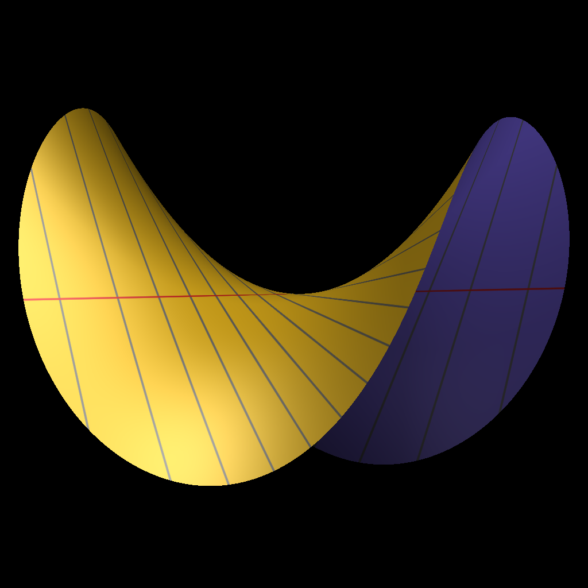
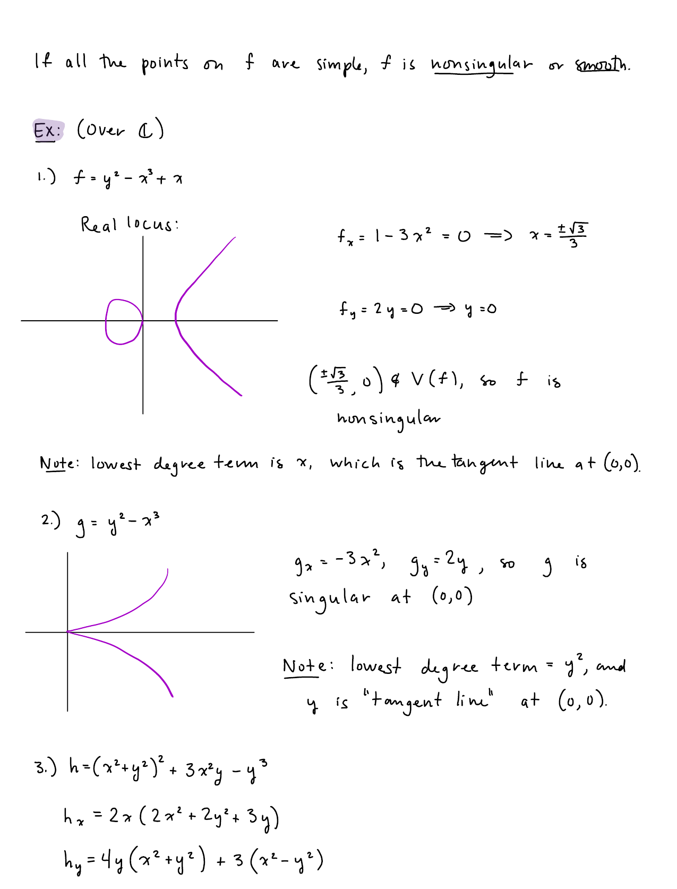

# Shafarevich Ch. II: Normalization and Resolution of Curve Singularities

## Table of Contents

- [[#1. Introduction: Two Paths to Desingularization|1. Introduction: Two Paths to Desingularization]]
- [[#2. Normal Varieties and Integral Closure|2. Normal Varieties and Integral Closure]]
  - [[#2.1 Normal Domains|2.1 Normal Domains]]
  - [[#2.2 Normal Varieties|2.2 Normal Varieties]]
  - [[#2.3 Normal Implies Smooth in Dimension One|2.3 Normal Implies Smooth in Dimension One]]
  - [[#2.4 Serre's Criterion for Normality|2.4 Serre's Criterion for Normality]]
  - [[#2.5 Motivating Example: The Cuspidal Cubic|2.5 Motivating Example: The Cuspidal Cubic]]
- [[#3. The Normalization Construction|3. The Normalization Construction]]
  - [[#3.1 Integral Closure and the Normalization Map|3.1 Integral Closure and the Normalization Map]]
  - [[#3.2 Noether Normalization|3.2 Noether Normalization]]
  - [[#3.3 Worked Example: Normalizing the Cuspidal Cubic|3.3 Worked Example: Normalizing the Cuspidal Cubic]]
  - [[#3.4 Worked Example: Normalizing the Nodal Cubic|3.4 Worked Example: Normalizing the Nodal Cubic]]
- [[#4. Blowing Up|4. Blowing Up]]
  - [[#4.1 Definition via the Incidence Correspondence|4.1 Definition via the Incidence Correspondence]]
  - [[#4.2 Affine Charts for the Blow-Up of the Plane|4.2 Affine Charts for the Blow-Up of the Plane]]
  - [[#4.3 The Strict Transform|4.3 The Strict Transform]]
  - [[#4.4 Multiplicity and the Effect of One Blow-Up|4.4 Multiplicity and the Effect of One Blow-Up]]
- [[#5. Resolving Curve Singularities by Blow-Up|5. Resolving Curve Singularities by Blow-Up]]
  - [[#5.1 Resolution of a Node|5.1 Resolution of a Node]]
  - [[#5.2 Resolution of a Cusp|5.2 Resolution of a Cusp]]
  - [[#5.3 Termination of the Process|5.3 Termination of the Process]]
- [[#6. The Smooth Projective Model|6. The Smooth Projective Model]]
  - [[#6.1 Existence|6.1 Existence]]
  - [[#6.2 Uniqueness|6.2 Uniqueness]]
  - [[#6.3 The Function Field Perspective|6.3 The Function Field Perspective]]
- [[#References|References]]

---

Throughout, $k$ denotes an algebraically closed field and all varieties are over $k$. Coordinate rings are written $A(X) = k[x_1,\ldots,x_n]/I(X)$ for affine $X \subset \mathbb{A}^n$. For background on local rings, singularity, tangent cones, and multiplicity, see [[concepts/algebraic-geometry/shafarevich-ch2-local-properties|Shafarevich Ch. II: Local Properties]]; for projective varieties and rational maps, see [[concepts/algebraic-geometry/note|Classical Algebraic Geometry]].

---

## 1. Introduction: Two Paths to Desingularization

🗺️ A *singular point* of a variety $X$ is a point where the local ring $\mathcal{O}_{X,P}$ fails to be regular — concretely, where the Jacobian matrix of the defining equations drops rank. Singular curves are the simplest non-trivial arena for desingularization: one wishes to find a smooth variety $\tilde{X}$ together with a birational morphism $\nu : \tilde{X} \to X$ that is an isomorphism away from the singular locus.

Two strategies produce this smooth model:

1. **Algebraic (normalization).** Replace the coordinate ring $A(X)$ by its *integral closure* in the fraction field $k(X)$. This is a purely ring-theoretic operation. In dimension one it already yields a smooth variety, because for curves normality is equivalent to smoothness.

2. **Geometric (blowing up).** Replace a singular point $P$ by the projective space of all tangent directions at $P$. This is a local operation that decreases *multiplicity* at each step; since multiplicity is a non-negative integer, the process terminates in finitely many steps with a smooth model.

In dimension one these two approaches converge: normalization gives the smooth projective model directly (after projectivizing), and repeated blowing up reaches the same object. The two methods differ in higher dimensions, where normalization need not resolve all singularities.

> [!INFO] Higher-dimensional contrast
> For surfaces, normalization resolves codimension-1 singularities but not all: a normal surface can still have *isolated singular points* (e.g., the cone $V(xy - z^2) \subset \mathbb{A}^3$ is normal but singular at the apex). Full resolution of surfaces requires further geometric techniques beyond integral closure.

---

## 2. Normal Varieties and Integral Closure

### 2.1 Normal Domains

📐 Recall that an element $\alpha$ in an extension ring $B \supset A$ is *integral over $A$* if it satisfies a monic polynomial equation

$$\alpha^n + a_{n-1}\alpha^{n-1} + \cdots + a_0 = 0, \quad a_i \in A.$$

The *integral closure* of $A$ in $B$ is the set $\bar{A}^B = \{ \beta \in B : \beta \text{ integral over } A \}$; it is itself a ring (closed under addition and multiplication). When $B = \mathrm{Frac}(A)$ we write simply $\bar{A}$.

**Definition (Normal Domain).** An integral domain $A$ is *normal* (or *integrally closed*) if $A = \bar{A}$, i.e., every element of $\mathrm{Frac}(A)$ that is integral over $A$ already belongs to $A$.

**Proposition.** Every *unique factorization domain* (UFD) is normal.

*Proof sketch.* Let $\alpha = p/q \in \mathrm{Frac}(A)$ with $\gcd(p,q) = 1$ in the UFD $A$, and suppose $\alpha^n + a_{n-1}\alpha^{n-1} + \cdots + a_0 = 0$. Multiplying through by $q^n$ gives $p^n = -q(a_{n-1}p^{n-1} + \cdots + a_0 q^{n-1})$, so $q \mid p^n$. Since $\gcd(p,q)=1$ in a UFD every prime dividing $q$ divides $p$, forcing $q$ to be a unit. Hence $\alpha \in A$. $\square$

**Corollary.** Polynomial rings $k[x_1,\ldots,x_n]$ and their localizations are normal. In particular, smooth varieties have normal local rings.

> [!EXAMPLE] A non-normal domain
> The subring $A = k[t^2, t^3] \subset k[t]$ is an integral domain with $\mathrm{Frac}(A) = k(t)$. The element $t \in k(t)$ satisfies $t^2 - t^2 = 0$... more precisely, $t$ satisfies the monic equation $t^2 - (t^2) = 0$ with $t^2 \in A$. So $t$ is integral over $A$ (via $X^2 - t^2 = 0$ with coefficient $t^2 \in A$), yet $t \notin A$. Thus $A$ is *not* integrally closed in $k(t)$.

### 2.2 Normal Varieties

**Definition (Normal Variety).** An irreducible variety $X$ is *normal at a point $P$* if the local ring $\mathcal{O}_{X,P}$ is an integrally closed domain. $X$ is *normal* if it is normal at every point.

For affine $X$ with coordinate ring $A(X)$, normality of $A(X)$ implies normality at every point (since localizations of integrally closed domains are integrally closed). The converse holds when $A(X)$ is Noetherian.

> [!NOTE] Equivalent formulation for affine varieties
> An affine irreducible variety $X = \mathrm{Spec}\, A(X)$ is normal if and only if $A(X)$ is integrally closed in $k(X) = \mathrm{Frac}(A(X))$. The global ring-theoretic condition and the local condition at every point are equivalent for Noetherian rings by a standard localization argument.

**Proposition (Normality and Codimension of Singular Locus).** If $X$ is a normal variety, then the singular locus $X_{\mathrm{sing}}$ has codimension at least $2$ in $X$.

*Proof sketch.* At a codimension-1 point (i.e., a point of a prime divisor) the local ring has Krull dimension 1. A normal Noetherian local ring of dimension 1 is a DVR (see [[concepts/algebraic-geometry/shafarevich-ch2-local-properties|§5]], DVRs and smooth curves), hence regular. So no codimension-1 point of a normal variety is singular. $\square$

**Corollary.** For a *curve* (dimension 1), normality implies smoothness everywhere: $X_{\mathrm{sing}} = \emptyset$.

### 2.3 Normal Implies Smooth in Dimension One

🔑 This corollary is the central fact connecting the two approaches to desingularization for curves. Let us spell it out:

**Theorem (Normal Curves are Smooth).** Let $X$ be an irreducible normal curve (variety of dimension 1). Then $X$ is smooth at every point.

*Proof.* Every point of $X$ has codimension $\leq 1$ in $X$. By the proposition above, codimension-1 points of a normal variety have regular local rings. But for a curve every point is codimension 1 (since $\dim X = 1$). Hence every local ring $\mathcal{O}_{X,P}$ is regular, which is the definition of smoothness. $\square$

**This is the key theorem: for curves, normal = smooth = regular.** Normalization of a curve therefore produces the smooth model directly.

> [!WARNING] Failure in higher dimensions
> *The equivalence breaks down for surfaces and higher.* A normal surface can be singular at isolated points. For example, $V(xy - z^2) \subset \mathbb{A}^3$ is normal (its coordinate ring $k[x,y,z]/(xy-z^2)$ is integrally closed) but singular at the origin.

### 2.4 Serre's Criterion for Normality

For reference in more general settings, we record Serre's criterion without full proof.

**Theorem (Serre's Criterion, R1+S2).** A Noetherian integral domain $A$ is normal if and only if it satisfies:
- **(R1)** $A_\mathfrak{p}$ is a regular local ring for every prime $\mathfrak{p}$ with $\mathrm{ht}(\mathfrak{p}) \leq 1$.
- **(S2)** $\mathrm{depth}(A_\mathfrak{p}) \geq \min(2, \mathrm{ht}(\mathfrak{p}))$ for every prime $\mathfrak{p}$.

Here (R1) is the regularity condition in codimension 1, and (S2) is a depth (Cohen–Macaulay type) condition. Condition (S2) ensures the absence of "embedded" singularities.

> [!INFO] Why this matters
> Serre's criterion is the standard tool for checking normality of rings that arise as quotients of polynomial rings, where direct verification of integral closedness is difficult. It reduces the question to regularity at height-1 primes (accessible via the Jacobian criterion) and depth conditions (accessible via regular sequences).

### 2.5 Motivating Example: The Cuspidal Cubic

⚠️ Consider the *cuspidal cubic* $C = V(y^2 - x^3) \subset \mathbb{A}^2$. Its coordinate ring is

$$A(C) = k[x,y]/(y^2 - x^3) \cong k[t^2, t^3],$$

where the isomorphism sends $x \mapsto t^2$, $y \mapsto t^3$ (the parametrization $t \mapsto (t^2, t^3)$). The *singular point* of $C$ is the origin $(0,0)$, detected by the Jacobian $(-3x^2, 2y)|_{(0,0)} = (0,0)$ vanishing.

Is $A(C) = k[t^2, t^3]$ integrally closed in $k(t)$? No: the element $t \in k(t)$ satisfies

$$t^2 - x = 0 \quad (x \in A(C)),$$

so $t$ is integral over $A(C)$ but $t \notin A(C) = k[t^2, t^3]$. Hence $C$ is *not* normal at the origin, consistent with the fact that the origin is singular.

> [!QUESTION] Exercise 1: Integral Dependence at the Node
> *This problem establishes that the nodal cubic is also non-normal, by exhibiting an element integral over its coordinate ring that does not belong to it.*
>
> > **Prerequisites:** [[#2.1 Normal Domains|2.1 Normal Domains]], [[#2.5 Motivating Example: The Cuspidal Cubic|2.5 Motivating Example: The Cuspidal Cubic]]
>
> Let $N = V(y^2 - x^2(x+1)) \subset \mathbb{A}^2$ be the nodal cubic with node at the origin. Set $t = y/x \in k(N)$.
> (a) Show that $t$ satisfies a monic polynomial equation with coefficients in $A(N)$, hence is integral over $A(N)$.
> (b) Show that $t \notin A(N)$.
> (c) Conclude that $A(N)$ is not integrally closed in $k(N)$, hence $N$ is not normal at the origin.

> [!TIP]- Solution to Exercise 1
> **Key insight:** At the node, two distinct branches meet, and $t = y/x$ is the "slope" separating them. It is algebraic over $A(N)$ but cannot be a polynomial in $x$ and $y$ on the singular variety.
>
> **Sketch:** (a) From $y^2 = x^2(x+1)$ in $k(N)$, dividing both sides by $x^2$ gives $t^2 = x + 1$, i.e., $t^2 - (x+1) = 0$. Since $x+1 \in A(N)$, this is a monic equation over $A(N)$ satisfied by $t$. (b) If $t = y/x$ were a regular function on $N$ at the origin, then $x \cdot t = y$ would force $y/x$ to extend holomorphically across the node. But $x$ vanishes at the origin while $y$ does too, and $y/x$ has different limits along the two branches $y = \pm x\sqrt{x+1}$ near $(0,0)$: as $x \to 0$, $y/x \to \pm 1$. So $t$ is not a well-defined element of $\mathcal{O}_{N,(0,0)}$. Formally, $t \notin A(N)$ since no polynomial in $x,y$ modulo $(y^2 - x^2(x+1))$ equals $y/x$ globally. (c) Follows directly from (a) and (b).

---

## 3. The Normalization Construction

### 3.1 Integral Closure and the Normalization Map

📐 **Definition (Normalization of an Affine Variety).** Let $X = \mathrm{Spec}\, A$ be an irreducible affine variety with $A = A(X)$ and function field $K = \mathrm{Frac}(A) = k(X)$. The *normalization* of $X$ is the affine variety

$$\tilde{X} = \mathrm{Spec}\,\tilde{A},$$

where $\tilde{A}$ is the *integral closure* of $A$ in $K$. The natural inclusion $A \hookrightarrow \tilde{A}$ induces a morphism

$$\nu : \tilde{X} \longrightarrow X,$$

called the *normalization map*.

We now establish the key properties of $\nu$.

**Theorem (Properties of the Normalization Map).** Let $\nu : \tilde{X} \to X$ be the normalization of an irreducible affine variety $X$ of dimension $d$ over a perfect field $k$. Then:
1. $\tilde{A}$ is a finitely generated $A$-module, hence a finitely generated $k$-algebra.
2. $\nu$ is a *finite morphism*: $\mathcal{O}_{\tilde{X}}$ is a coherent $\nu^{-1}\mathcal{O}_X$-module.
3. $\nu$ is *birational*: it induces an isomorphism $k(\tilde{X}) \xrightarrow{\sim} k(X)$ on function fields.
4. $\nu$ is an isomorphism over the smooth locus of $X$: if $U = X \setminus X_{\mathrm{sing}}$, then $\nu^{-1}(U) \to U$ is an isomorphism.
5. $\tilde{X}$ is normal (and, if $\dim X = 1$, smooth).

*Proof sketches.* (1) Finite generation of $\tilde{A}$ as an $A$-module follows from the Noether normalization theorem (§3.2) together with the fact that the extension $K \supset k$ is finite separable when $k$ is perfect — the key input is that a finite integral extension of Noetherian rings is again Noetherian. (2) is the algebraic formulation of (1). (3) holds because $A$ and $\tilde{A}$ share the same fraction field $K$. (4) At a smooth point $P \in X$, $\mathcal{O}_{X,P}$ is already a regular local ring and thus a UFD, hence integrally closed; the fiber $\nu^{-1}(P)$ is a single point. (5) The integral closure $\tilde{A}$ is integrally closed by construction. $\square$

**Finite + birational is the key.** The map $\nu$ "separates branches" without changing the rational function field.

> [!INFO] Non-affine normalization
> For a general (possibly projective) variety $X$, the normalization is constructed by gluing the normalizations of an affine open cover. The resulting $\nu : \tilde{X} \to X$ retains properties (2)–(5) above.

> [!QUESTION] Exercise 2: Normalization is Idempotent
> *This problem establishes that applying normalization twice yields the same result as once.*
>
> > **Prerequisites:** [[#3.1 Integral Closure and the Normalization Map|3.1 Integral Closure and the Normalization Map]]
>
> Let $A$ be an integral domain with fraction field $K$, and let $\tilde{A}$ be its integral closure in $K$.
> (a) Show that $\tilde{A}$ is itself integrally closed in $K$ (i.e., $\widetilde{\tilde{A}} = \tilde{A}$).
> (b) Conclude that the normalization $\tilde{X}$ of $X$ is already normal, and that applying normalization again to $\tilde{X}$ yields $\tilde{X}$ itself.

> [!TIP]- Solution to Exercise 2
> **Key insight:** Integral closure is a closure operation in the algebraic sense — it is idempotent.
>
> **Sketch:** (a) Suppose $\alpha \in K$ is integral over $\tilde{A}$: $\alpha^n + \tilde{a}_{n-1}\alpha^{n-1} + \cdots + \tilde{a}_0 = 0$ with $\tilde{a}_i \in \tilde{A}$. Each $\tilde{a}_i$ is integral over $A$. The ring $A[\tilde{a}_0,\ldots,\tilde{a}_{n-1}]$ is a finitely generated $A$-module (by iterating the integral extension property). Since $\alpha$ is integral over $\tilde{A} \supset A[\tilde{a}_i]$, the module $A[\tilde{a}_0,\ldots,\tilde{a}_{n-1},\alpha]$ is finitely generated over $A$. Hence $\alpha$ is integral over $A$, so $\alpha \in \tilde{A}$. (b) Immediate: $\tilde{A}$ is integrally closed, so $\mathrm{Spec}\,\tilde{A}$ is normal, and its own normalization is $\mathrm{Spec}\,\tilde{A}$ again.

### 3.2 Noether Normalization

🔑 The following theorem underlies the finiteness claim in Theorem 3.1.

**Theorem (Noether Normalization).** Let $X$ be an irreducible affine variety of dimension $d$ over $k$. Then there exist algebraically independent elements $y_1,\ldots,y_d \in A(X)$ such that $A(X)$ is a finitely generated module over the polynomial subring $k[y_1,\ldots,y_d]$. Geometrically, there is a *finite surjective morphism*

$$\varphi : X \longrightarrow \mathbb{A}^d.$$

*Proof sketch.* We induct on the number of generators of $A(X) = k[x_1,\ldots,x_m]/I(X)$. If $m = d$ (i.e., $X$ is itself $\mathbb{A}^d$), done. Otherwise, there is a nonzero polynomial $f(x_1,\ldots,x_m) \in I(X)$. The key trick (due to Nagata) is to make a *shearing change of variables*: set $y_i = x_i - x_m^{e_i}$ for suitably chosen integers $e_i$ (e.g., $e_i = r^{i-1}$ for large $r$). After this substitution, $f$ becomes a monic polynomial in $x_m$ over $k[y_1,\ldots,y_{m-1}]$, so $x_m$ is integral over $k[y_1,\ldots,y_{m-1}]$. Induction reduces to $m-1$ generators. $\square$

**Corollary.** The integral closure $\tilde{A}$ of $A(X)$ in $k(X)$ is a finitely generated $A(X)$-module (hence a finitely generated $k$-algebra), because $\tilde{A}$ lies between two finitely generated modules over a Noetherian ring.

> [!NOTE] Why algebraic independence matters
> The elements $y_1,\ldots,y_d$ in Noether normalization are algebraically independent over $k$ and have transcendence degree $d = \dim X$ over $k$. The finite extension $A(X) \supset k[y_1,\ldots,y_d]$ is the algebraic-geometry analogue of a branched covering: $X$ is a "branched cover" of affine $d$-space $\mathbb{A}^d$.

> [!QUESTION] Exercise 3: Noether Normalization for a Curve
> *This problem makes Noether normalization explicit for a plane curve.*
>
> > **Prerequisites:** [[#3.2 Noether Normalization|3.2 Noether Normalization]]
>
> Let $C = V(f) \subset \mathbb{A}^2$ be an irreducible plane curve with $f \in k[x,y]$ of degree $n \geq 1$.
> (a) Show that $A(C) = k[x,y]/(f)$ is a finitely generated module over $k[x]$ (i.e., $y$ is integral over $k[x]$ in $A(C)$), provided $f$ is monic in $y$ of degree $n$. What does this mean for the projection $\pi : C \to \mathbb{A}^1$, $(x,y) \mapsto x$?
> (b) Show that for any $f$, a linear change of coordinates puts $f$ in Weierstrass form (monic in $y$), so Noether normalization applies.

> [!TIP]- Solution to Exercise 3
> **Key insight:** Monicity in $y$ makes $y$ integral over $k[x]$ directly, turning the projection to the $x$-axis into a finite map.
>
> **Sketch:** (a) If $f = y^n + a_{n-1}(x)y^{n-1} + \cdots + a_0(x)$, then the image $\bar{y}$ of $y$ in $A(C)$ satisfies the monic equation $\bar{y}^n + a_{n-1}(x)\bar{y}^{n-1} + \cdots + a_0(x) = 0$ with coefficients in $k[x]$. So $\bar{y}$ is integral over $k[x]$, and $A(C) = k[x][\bar{y}]$ is generated as a $k[x]$-module by $\{1, \bar{y}, \ldots, \bar{y}^{n-1}\}$. Geometrically, $\pi : C \to \mathbb{A}^1$ is a finite morphism of degree $n$: every fiber $\pi^{-1}(a)$ (counting multiplicities) has exactly $n$ points. (b) A generic linear change $(x,y) \mapsto (x, y - \lambda x)$ ensures the leading term of $f$ in $y$ is nonzero, then divide by the leading coefficient to make $f$ monic.

### 3.3 Worked Example: Normalizing the Cuspidal Cubic

🔑 Let $C = V(y^2 - x^3) \subset \mathbb{A}^2$ with coordinate ring $A(C) = k[t^2, t^3]$ (via $x \mapsto t^2$, $y \mapsto t^3$). We find $\tilde{A}(C)$.

**Step 1: Identify the fraction field.** Since $A(C) = k[t^2, t^3] \subset k[t]$ and $t = t^3/t^2 \in \mathrm{Frac}(A(C))$, we have $\mathrm{Frac}(A(C)) = k(t)$.

**Step 2: Show $k[t]$ is the integral closure.** As noted in §2.5, $t$ satisfies $t^2 - x = 0$ over $A(C)$, so $t \in \overline{A(C)}$. Thus $k[t] \subset \overline{A(C)}$. Conversely, $k[t]$ is a UFD (hence normal), and $A(C) \subset k[t]$, so $\overline{A(C)} \subset \overline{k[t]} = k[t]$. Therefore

$$\tilde{A}(C) = k[t].$$

**Step 3: The normalization map.** The inclusion $A(C) = k[t^2, t^3] \hookrightarrow k[t] = \tilde{A}(C)$ corresponds to the morphism

$$\nu : \mathbb{A}^1 \longrightarrow C, \quad t \longmapsto (t^2, t^3).$$

This is a bijective birational morphism. It maps $\mathbb{A}^1$ (smooth!) onto the cuspidal cubic, resolving the cusp at the origin: the single point $t = 0$ maps to the singular origin $(0,0) \in C$.

> [!NOTE] Why is $\nu$ not an isomorphism?
> The map $\nu : \mathbb{A}^1 \to C$ is bijective and birational, yet *not* an isomorphism of varieties. The inverse map would send $(x,y) \mapsto y/x$, which is not regular at the origin (both numerator and denominator vanish). Algebraically, $A(C) \subsetneq k[t]$ so the rings are not isomorphic.

**The normalization map $\nu$ resolves the cusp: $\tilde{C} \cong \mathbb{A}^1$ is smooth, and $\nu$ is birational and finite.** This is the algebraic incarnation of "unfolding" the cusp.

> [!QUESTION] Exercise 4: The Normalization Fiber at a Smooth Point
> *This problem shows that normalization is an isomorphism away from the singular locus.*
>
> > **Prerequisites:** [[#3.3 Worked Example: Normalizing the Cuspidal Cubic|3.3 Worked Example: Normalizing the Cuspidal Cubic]]
>
> With $\nu : \mathbb{A}^1 \to C = V(y^2-x^3)$ as above, let $P = (1,1) \in C$ (a smooth point, since $f = y^2 - x^3$ has $\nabla f|_P = (-3,2) \neq 0$).
> (a) Find the unique $t_0 \in \mathbb{A}^1$ with $\nu(t_0) = P$.
> (b) Show that $\nu$ induces an isomorphism of local rings $\mathcal{O}_{C,P} \xrightarrow{\sim} \mathcal{O}_{\mathbb{A}^1,t_0}$.
> (c) Contrast with the fiber over the singular point $(0,0)$: what is $\nu^{-1}(0,0)$ set-theoretically?

> [!TIP]- Solution to Exercise 4
> **Key insight:** The normalization is an isomorphism at smooth points; the "extra" geometry is concentrated at singularities.
>
> **Sketch:** (a) $\nu(t_0) = (t_0^2, t_0^3) = (1,1)$ requires $t_0^2 = 1$ and $t_0^3 = 1$, so $t_0 = 1$. (b) Both local rings are DVRs with the same fraction field $k(t)$. At $t_0 = 1$: the uniformizer of $\mathcal{O}_{\mathbb{A}^1,1}$ is $t-1$. On $C$: the function $y-1$ vanishes simply at $(1,1)$ (since $\partial f/\partial y = 2y \neq 0$), so $y-1$ is a uniformizer of $\mathcal{O}_{C,(1,1)}$. Under $\nu^*$: $\nu^*(y-1) = t^3 - 1 = (t-1)(t^2+t+1)$, and $t^2+t+1|_{t=1} = 3 \neq 0$ is a unit. So $\nu^*$ maps the uniformizer to a unit times the uniformizer of $\mathcal{O}_{\mathbb{A}^1,1}$; hence $\nu^*$ is a local isomorphism. (c) $\nu^{-1}(0,0) = \{t : (t^2,t^3) = (0,0)\} = \{0\}$, a single point. Despite the singularity, the fiber is topologically a single point — the cusp has a unique analytic branch.

### 3.4 Worked Example: Normalizing the Nodal Cubic

📐 Let $N = V(y^2 - x^2(x+1)) \subset \mathbb{A}^2$ be the *nodal cubic* with node at the origin. The two branches at the origin have tangent directions $y = x$ and $y = -x$ (since the leading term of $y^2 - x^2(x+1)$ at the origin is $y^2 - x^2 = (y-x)(y+x)$; see [[concepts/algebraic-geometry/shafarevich-ch2-local-properties|§4, The Tangent Cone]]).

**Step 1: Set $t = y/x \in k(N)$.** From $y^2 = x^2(x+1)$ we get

$$t^2 = x + 1, \quad \text{i.e., } x = t^2 - 1, \quad y = xt = (t^2-1)t.$$

So $k(N) = k(t)$.

**Step 2: Integral closure.** The element $t = y/x$ satisfies $t^2 - (x+1) = 0$ over $A(N)$, so $t$ is integral over $A(N)$. One checks that

$$\tilde{A}(N) = k[t].$$

(Verification: $k[t]$ is a UFD hence normal, $t$ integral over $A(N)$ shows $k[t] \subset \overline{A(N)}$, and $A(N) \subset k[t]$ with $k[t]$ normal gives equality.)

**Step 3: The normalization map.**

$$\nu : \mathbb{A}^1 \longrightarrow N, \quad t \longmapsto (t^2 - 1,\; t(t^2-1)).$$

This is again birational. But unlike the cusp case, the fiber over the node $(0,0)$ now has *two* preimages:

$$\nu^{-1}(0,0) = \{t : t^2 - 1 = 0\} = \{+1, -1\}.$$

**The normalization separates the two branches of the node**: $t = +1$ corresponds to the branch with slope $+1$ (i.e., $y \approx x$) and $t = -1$ to the branch with slope $-1$ (i.e., $y \approx -x$). The normalization map $\nu : \mathbb{A}^1 \to N$ is *not* injective at the node.

> [!NOTE] Geometric picture
> The nodal cubic $N$ is a "figure-eight" — a circle with one crossing point. Its normalization $\mathbb{A}^1$ (or $\mathbb{P}^1$ in the projective version) is topologically a line (or sphere), which "unglues" the two sheets at the crossing. This is visible in the fiber: two distinct preimages of the node correspond to two distinct tangent branches.

> [!QUESTION] Exercise 5: Normalization Identifies the Two Branches
> *This problem makes the branch-separation phenomenon precise at the level of local rings.*
>
> > **Prerequisites:** [[#3.4 Worked Example: Normalizing the Nodal Cubic|3.4 Worked Example: Normalizing the Nodal Cubic]]
>
> With $\nu : \mathbb{A}^1 \to N$ as above (normalization of the nodal cubic) and the two preimages $t_+ = 1$, $t_- = -1$ of the node $O = (0,0)$:
> (a) Describe the local rings $\mathcal{O}_{\mathbb{A}^1, t_\pm}$ and show each is isomorphic to the DVR $k[s]_{(s)}$ for $s = t \mp 1$.
> (b) Show that $\nu^*: \mathcal{O}_{N,O} \to \mathcal{O}_{\mathbb{A}^1,t_+} \times \mathcal{O}_{\mathbb{A}^1,t_-}$ is injective but not surjective (the two branches do not "communicate" in $\mathcal{O}_{N,O}$).

> [!TIP]- Solution to Exercise 5
> **Key insight:** At the node, the local ring of $N$ simultaneously "sees" both branches, embedding into (but not equaling) the product of two DVRs.
>
> **Sketch:** (a) Near $t_+ = 1$: set $s = t-1$, so $\mathcal{O}_{\mathbb{A}^1,1} = k[t]_{(t-1)} \cong k[s]_{(s)}$, a DVR with uniformizer $s$. Similarly near $t_- = -1$ with $s = t+1$. (b) Under $\nu^*$: a function $\phi \in \mathcal{O}_{N,O}$ (regular near $O$ on $N$) pulls back to a function on $\mathbb{A}^1$ regular at both $t = \pm 1$. Injectivity: $\nu$ is birational, so $\nu^*$ is injective on function fields. Non-surjectivity: the pair $(1,0) \in \mathcal{O}_{\mathbb{A}^1,1} \times \mathcal{O}_{\mathbb{A}^1,-1}$ (value 1 at $t_+$ and 0 at $t_-$) is not in the image of $\nu^*$, because any function regular at both branches of the node with value 1 on one branch and 0 on the other would need to be discontinuous at $O$ — impossible for a regular function.

---

## 4. Blowing Up

### 4.1 Definition via the Incidence Correspondence

🔬 *Blowing up* replaces a point by the space of all directions through it. We define it for $X = \mathbb{A}^n$ at the origin; the general case follows by choosing local coordinates.

**Definition (Blow-Up of Affine Space).** The *blow-up of $\mathbb{A}^n$ at the origin* is the variety

$$\mathrm{Bl}_0 \mathbb{A}^n = \overline{\{(x, \ell) \in \mathbb{A}^n \times \mathbb{P}^{n-1} : x \in \ell\}} \subset \mathbb{A}^n \times \mathbb{P}^{n-1},$$

where $x \in \ell$ means the point $x = (x_1,\ldots,x_n)$ lies on the line $\ell \in \mathbb{P}^{n-1}$ through the origin. Concretely, in homogeneous coordinates $[u_1:\cdots:u_n]$ on $\mathbb{P}^{n-1}$, the incidence condition is

$$x_i u_j - x_j u_i = 0, \quad 1 \leq i < j \leq n.$$

The *blow-down map* is $\pi : \mathrm{Bl}_0 \mathbb{A}^n \to \mathbb{A}^n$, the projection $(x,\ell) \mapsto x$.

**The exceptional divisor** is $E = \pi^{-1}(0) \cong \mathbb{P}^{n-1}$. For $x \neq 0$, the map $\pi$ is an isomorphism: $\pi^{-1}(x) = \{(x, \overline{x})\}$ where $\overline{x} \in \mathbb{P}^{n-1}$ is the direction of $x$.

**Definition (Blow-Up of a Variety).** For a variety $X$ and a smooth point $P \in X$, the *blow-up $\mathrm{Bl}_P X$* is obtained by choosing local coordinates $(x_1,\ldots,x_n)$ centered at $P$ identifying a neighborhood of $P$ in $X$ with a neighborhood of $0$ in $\mathbb{A}^n$, then applying the above construction. The result is independent of the coordinate choice (up to isomorphism).

> [!INFO] Universal property
> The blow-up $\pi: \mathrm{Bl}_P X \to X$ is the universal morphism from a variety to $X$ that makes the pullback of the ideal sheaf $\mathcal{I}_P$ (defining $P$) into a locally principal (invertible) sheaf. This intrinsic characterization is coordinate-free.

### 4.2 Affine Charts for the Blow-Up of the Plane

📐 The case $n = 2$ is the most important for curve resolution. Here $\mathbb{P}^1$ has homogeneous coordinates $[u:v]$, and

$$\mathrm{Bl}_0 \mathbb{A}^2 = \{((x,y), [u:v]) : xv = yu\} \subset \mathbb{A}^2 \times \mathbb{P}^1.$$

We cover $\mathrm{Bl}_0 \mathbb{A}^2$ by two standard affine charts.

**Chart $U_1$ (where $u \neq 0$):** Set $t = v/u$. The incidence condition $xv = yu$ becomes $xt = y$. The chart is

$$U_1 = \mathrm{Spec}\, k[x, t], \quad y = xt.$$

The blow-down map in this chart is $\pi_1 : (x,t) \mapsto (x, xt) = (x,y)$. The exceptional divisor is $E \cap U_1 = V(x) \subset U_1$, and the map $\pi_1$ restricts to the identity $(x,t) \mapsto (x,y)$ away from $E$.

**Chart $U_2$ (where $v \neq 0$):** Set $s = u/v$. The incidence condition becomes $xs = y \cdot s^{-1}$... more cleanly: $xv = yu$ gives $x = ys$ (set $s = u/v$). The chart is

$$U_2 = \mathrm{Spec}\, k[y, s], \quad x = ys.$$

The blow-down map is $\pi_2 : (y,s) \mapsto (ys, y) = (x,y)$. The exceptional divisor is $E \cap U_2 = V(y)$.

The two charts are glued along $U_1 \cap U_2 = \{(x,t) : x \neq 0\} = \{(y,s) : y \neq 0\}$ via $y = xt$ and $s = 1/t$.

> [!EXAMPLE] The blow-up picture
> In chart $U_1$ with coordinates $(x,t)$: the $x$-axis $V(y) = V(xt)$ in $\mathbb{A}^2$ pulls back to $V(xt) = V(x) \cup V(t)$ in $U_1$ — the exceptional divisor $E: x=0$ and the strict transform of the $x$-axis $t = 0$. The blow-down collapses $E: x = 0$ to the origin and maps $V(t)$ isomorphically to the $x$-axis.



> [!QUESTION] Exercise 6: Blow-Up of the Affine Plane is Smooth
> *This problem verifies that $\mathrm{Bl}_0\mathbb{A}^2$ is itself a smooth surface, confirming the blow-up does not introduce new singularities.*
>
> > **Prerequisites:** [[#4.2 Affine Charts for the Blow-Up of the Plane|4.2 Affine Charts for the Blow-Up of the Plane]]
>
> Using the affine chart $U_1 = \mathrm{Spec}\, k[x,t]$:
> (a) Show that $\mathrm{Bl}_0\mathbb{A}^2|_{U_1} \cong \mathbb{A}^2$ as varieties, hence is smooth.
> (b) Show that the blow-down map $\pi_1 : \mathbb{A}^2 \to \mathbb{A}^2$, $(x,t) \mapsto (x,xt)$ is not an isomorphism (find where it fails).
> (c) Verify that $\pi_1$ is an isomorphism away from $E = V(x)$.

> [!TIP]- Solution to Exercise 6
> **Key insight:** Each affine chart of the blow-up is just $\mathbb{A}^2$ with new coordinates — the blow-up is smooth by construction.
>
> **Sketch:** (a) The chart $U_1 = \{((x,y),[u:v]) : u \neq 0, xv = yu\} = \mathrm{Spec}\, k[x,t]$ with $y = xt$ is isomorphic to $\mathbb{A}^2$ via $(x,t)$, a polynomial ring in two variables. $\mathbb{A}^2$ is smooth. (b) The Jacobian of $\pi_1 = (x, xt)$ is $\begin{pmatrix} 1 & 0 \\ t & x\end{pmatrix}$, with determinant $x$. So $\pi_1$ is not étale (hence not an isomorphism) where $x = 0$ — i.e., along the exceptional divisor $E$. (c) For $x \neq 0$: given $(x,y)$ with $x \neq 0$, the unique preimage is $(x, y/x)$. The map $(x,y) \mapsto (x, y/x)$ is regular for $x \neq 0$, providing the two-sided inverse.

### 4.3 The Strict Transform

**Definition (Total Transform and Strict Transform).** Let $C \subset \mathbb{A}^2$ be an affine curve and $\pi : \mathrm{Bl}_0 \mathbb{A}^2 \to \mathbb{A}^2$ the blow-up at the origin. The *total transform* of $C$ is $\pi^{-1}(C)$. The *strict transform* (or *proper transform*) is

$$\tilde{C} = \overline{\pi^{-1}(C \setminus \{0\})} \subset \mathrm{Bl}_0 \mathbb{A}^2,$$

the closure of the preimage of $C$ minus the blown-up point.

**Computing the strict transform in chart $U_1$.** Suppose $C = V(f(x,y))$ and $0 \in C$ is a point of multiplicity $m$ (so $f$ has no terms of degree $< m$, and has at least one term of degree exactly $m$). In chart $U_1$ with $y = xt$:

$$\pi_1^*(f)(x,t) = f(x, xt) = x^m g(x,t),$$

where $g(x,t) = f(x,xt)/x^m$ has $g(0,t) \neq 0$ generically. The total transform is $V(x^m g)$; the factor $x^m$ corresponds to the exceptional divisor $E^m$ counted with multiplicity $m$. The *strict transform* in $U_1$ is

$$\tilde{C} \cap U_1 = V(g(x,t)).$$

> [!WARNING] Strict vs total transform
> *Do not confuse the strict transform $V(g)$ with the total transform $V(x^m g)$. The exceptional divisor $E = V(x)$ appears in the total transform with multiplicity equal to $\mathrm{mult}_0(C)$, but is removed to get the strict transform.*

### 4.4 Multiplicity and the Effect of One Blow-Up

🔑 Recall from [[concepts/algebraic-geometry/shafarevich-ch2-local-properties|§4.3, Multiplicity]] that the *multiplicity* $\mathrm{mult}_P(C)$ of a curve $C$ at a point $P$ is the degree of the lowest-degree term in the Taylor expansion of the defining equation at $P$. A smooth point has multiplicity 1; a node or ordinary double point has multiplicity 2.

**Theorem (Multiplicity Drops at Points of Tangency).** Let $C \subset \mathbb{A}^2$ have multiplicity $m \geq 2$ at the origin. Let $\tilde{C}$ be the strict transform under blow-up at $0$. At any point $Q \in E \cap \tilde{C}$, we have

$$\mathrm{mult}_Q(\tilde{C}) \leq m.$$

Moreover, $\mathrm{mult}_Q(\tilde{C}) = m$ only if the tangent cone $TC_0(C)$ is supported on a single line (i.e., all tangent directions at $0$ coincide), meaning the singularity is "concentrated in one direction."

*Proof sketch.* In chart $U_1$, $g(x,t) = f(x,xt)/x^m$. At $Q = (0, t_0) \in E \cap \tilde{C}$: $g(0,t_0) = 0$ (since $Q \in \tilde{C}$). The multiplicity of $\tilde{C}$ at $Q$ is the order of vanishing of $g$ at $(0,t_0)$. Write $f = f_m + f_{m+1} + \cdots$ (homogeneous decomposition), so $f(x,xt) = x^m f_m(1,t) + x^{m+1} f_{m+1}(1,t) + \cdots$, giving $g(x,t) = f_m(1,t) + x f_{m+1}(1,t) + \cdots$. At $x = 0$: $g(0,t) = f_m(1,t)$, which vanishes at $t_0$ only if $t_0$ is a root of $f_m(1,t)$. If $t_0$ is a simple root of $f_m(1,\cdot)$, then $\partial_t g|_{(0,t_0)} \neq 0$, so $\mathrm{mult}_Q(\tilde{C}) = 1$ (smooth point). $\square$

**Key conclusion: if the tangent cone at a singular point $P$ has distinct tangent lines, one blow-up reduces the singularity to smooth points on the strict transform.**

> [!QUESTION] Exercise 7: Multiplicity is the Intersection Multiplicity with E
> *This problem gives an alternative characterization of multiplicity in terms of the blow-up.*
>
> > **Prerequisites:** [[#4.3 The Strict Transform|4.3 The Strict Transform]], [[#4.4 Multiplicity and the Effect of One Blow-Up|4.4 Multiplicity and the Effect of One Blow-Up]]
>
> Let $C = V(f)$ with $\mathrm{mult}_0(C) = m$. Show that the total transform $\pi^{-1}(C)$ meets the exceptional divisor $E$ with (set-theoretic) multiplicity $m$, in the sense that the equation of $\pi^{-1}(C)$ in chart $U_1$ has $x^m$ as its lowest power of $x$ occurring. Relate this to the intersection number $(\pi^{-1}(C) \cdot E)$ in the blow-up surface.

> [!TIP]- Solution to Exercise 7
> **Key insight:** The multiplicity of $C$ at the origin equals the order of the exceptional divisor in the total transform.
>
> **Sketch:** In chart $U_1$, $\pi_1^*(f)(x,t) = f(x,xt)$. Write $f = f_m + f_{m+1} + \cdots$ (homogeneous decomposition with $f_m \neq 0$). Then $f(x,xt) = x^m f_m(1,t) + x^{m+1}(\cdots)$. So $x^m$ is the lowest power of $x$ in $\pi_1^*(f)$, confirming that $\pi^{-1}(C)$ contains $E = V(x)$ with multiplicity exactly $m$. For the intersection number: $(\pi^{-1}(C) \cdot E) = m \cdot (E \cdot E) + (\tilde{C} \cdot E) = -m + (\tilde{C} \cdot E)$, using $E^2 = -1$ (the self-intersection of the exceptional divisor on the blow-up surface). The number $(\tilde{C} \cdot E) = \deg f_m$ counts the tangent directions of $C$ at $0$ (including multiplicities).

---

## 5. Resolving Curve Singularities by Blow-Up

### 5.1 Resolution of a Node

🔬 We resolve the node of $N = V(y^2 - x^2(x+1))$ at the origin by blowing up.

**Set-up.** The multiplicity of $N$ at $0$ is 2 (the lowest-degree term is $y^2 - x^2 = (y-x)(y+x)$, a product of two distinct linear forms). In chart $U_1$ with $y = xt$:

$$\pi_1^*(y^2 - x^2(x+1)) = x^2 t^2 - x^2(x+1) = x^2(t^2 - x - 1).$$

The total transform is $V(x^2(t^2 - x - 1))$. The exceptional divisor contributes $V(x)^2$, and the strict transform is

$$\tilde{N} \cap U_1 = V(t^2 - x - 1).$$

**Smoothness of the strict transform.** The equation $g(x,t) = t^2 - x - 1$ has $\nabla g = (-1, 2t)$, which is nonzero everywhere. So $\tilde{N} \cap U_1$ is smooth.

**Intersection with $E$.** Setting $x = 0$: $t^2 - 1 = 0$, giving $t = \pm 1$. These are two distinct smooth points of $\tilde{N}$. **The blow-up separates the two tangent directions of the node.**

The strict transform $\tilde{N}$ meets $E \cong \mathbb{P}^1$ at two distinct points corresponding to the two tangent directions $y/x \to \pm 1$ of $N$ at the origin.

> [!NOTE] Chart $U_2$ check
> In chart $U_2$ with $x = ys$: $\pi_2^*(y^2 - x^2(x+1)) = y^2 - y^2s^2(ys+1) = y^2(1 - s^2(ys+1))$. Strict transform: $V(1 - s^2(ys+1))$. At $y = 0$: $1 - s^2 = 0$, so $s = \pm 1$ — the same two intersection points (matched via the gluing $s = 1/t$ at $t \neq 0$).

**One blow-up resolves the node.**

> [!QUESTION] Exercise 8: The Strict Transform is Smooth Everywhere
> *This problem verifies that the strict transform of the nodal cubic is a smooth curve, establishing that one blow-up fully resolves the node.*
>
> > **Prerequisites:** [[#5.1 Resolution of a Node|5.1 Resolution of a Node]]
>
> The strict transform $\tilde{N}$ in chart $U_1$ is $V(t^2 - x - 1) \subset \mathbb{A}^2_{(x,t)}$.
> (a) Show $\tilde{N} \cap U_1$ is isomorphic to $\mathbb{A}^1$ (hint: use $t$ as a coordinate).
> (b) Show that $\tilde{N}$ is smooth at the two points $Q_\pm = (0, \pm 1)$ where it meets $E$.
> (c) Verify that the blow-down $\pi_1 : \tilde{N} \to N$ maps $Q_\pm$ to the node $(0,0) \in N$ and is an isomorphism away from $Q_\pm$.

> [!TIP]- Solution to Exercise 8
> **Key insight:** The strict transform of the nodal cubic is isomorphic to $\mathbb{A}^1$, confirming it is smooth; the two preimages of the node correspond to the two branches.
>
> **Sketch:** (a) The map $t \mapsto (t^2-1, t)$ gives a morphism $\mathbb{A}^1 \to \tilde{N} \cap U_1 \subset \mathbb{A}^2$, with inverse $(x,t) \mapsto t$. This is an isomorphism, so $\tilde{N} \cap U_1 \cong \mathbb{A}^1$. (b) At $Q_\pm = (0,\pm 1)$: $\nabla(t^2 - x - 1) = (-1, 2t)|_{Q_\pm} = (-1, \pm 2) \neq 0$, confirming smoothness. (c) $\pi_1(Q_\pm) = (0, 0 \cdot (\pm 1)) = (0,0)$, the node. For $(x_0, t_0) \in \tilde{N} \cap U_1$ with $x_0 \neq 0$: $\pi_1^{-1}(\pi_1(x_0,t_0)) = \{(x_0, y_0/x_0)\}$ is a single point, so $\pi_1$ is an isomorphism over $N \setminus \{(0,0)\}$.

### 5.2 Resolution of a Cusp

📐 We resolve the cusp of $C = V(y^2 - x^3)$ at the origin. The multiplicity at $0$ is 2 (the leading term is $y^2$, a single square — the tangent cone is the double line $y = 0$).

**First blow-up.** In chart $U_1$ with $y = xt$:

$$\pi_1^*(y^2 - x^3) = x^2 t^2 - x^3 = x^2(t^2 - x).$$

The total transform is $V(x^2(t^2 - x))$; the strict transform in $U_1$ is

$$\tilde{C}_1 = V(t^2 - x).$$

**Smoothness of $\tilde{C}_1$.** The gradient $\nabla(t^2 - x) = (-1, 2t)$ is nonzero everywhere. So $\tilde{C}_1$ is *smooth*.

**Intersection with $E$.** Setting $x = 0$: $t^2 = 0$, so $t = 0$ is the unique intersection point $Q = (0,0) \in U_1$. But $Q$ is a *smooth point* of $\tilde{C}_1$: $(t^2-x)|_{x=0} = t^2$ vanishes to order 2 in $t$, but this is just the equation of the curve $t^2 = x$ being tangent to $E: x=0$ at $Q$. At $Q$, the strict transform has $t=0, x=0$ with local equation $t^2 = x$; the tangent direction to $\tilde{C}_1$ at $Q$ is $\partial_t(t^2 - x)|_Q = 0$ and $\partial_x(t^2-x)|_Q = -1 \neq 0$, so $x$ is the implicit function parameter and $\tilde{C}_1$ is smooth at $Q$.

**One blow-up resolves the cusp $V(y^2 - x^3)$.** The strict transform is isomorphic to $\mathbb{A}^1$ (via $t \mapsto (t^2, t)$), a smooth curve.

> [!NOTE] The cusp $y^2 = x^3$ vs $y^2 = x^5$
> The singularity $V(y^2 - x^3)$ (an $A_2$ singularity) is resolved in one blow-up. The more degenerate cusp $V(y^2 - x^5)$ requires two blow-ups: after the first, the strict transform in chart $U_1$ has equation $t^2 = x^3$, which is again a cusp! A second blow-up then resolves it. This illustrates that the number of blow-ups required grows with the "distance" of the singularity from smoothness (measured, e.g., by the $\delta$-invariant).



> [!QUESTION] Exercise 9: Strict Transform is Smooth for the Cusp
> *This problem verifies in full detail that the strict transform of $V(y^2 - x^3)$ is smooth.*
>
> > **Prerequisites:** [[#5.2 Resolution of a Cusp|5.2 Resolution of a Cusp]]
>
> In chart $U_2$ (with $x = ys$), compute the strict transform $\tilde{C}_1 \cap U_2$ of $C = V(y^2 - x^3)$. Show that it is an open subset of $\mathbb{A}^1$ (hence smooth) and verify that $\tilde{C}_1 \cap U_1$ and $\tilde{C}_1 \cap U_2$ glue to give a smooth curve in $\mathrm{Bl}_0 \mathbb{A}^2$.

> [!TIP]- Solution to Exercise 9
> **Key insight:** Both affine charts give smooth pieces; their gluing is along a common open set.
>
> **Sketch:** In chart $U_2$, $x = ys$, so $\pi_2^*(y^2 - x^3) = y^2 - y^3 s^3 = y^2(1 - ys^3)$. The strict transform is $\tilde{C}_1 \cap U_2 = V(1 - ys^3)$. Gradient: $\nabla(1-ys^3) = (-s^3, -3ys^2)$. If $1 - ys^3 = 0$ then $y \neq 0$ (since $y=0$ gives $1 = 0$), so $s^3 = 1/y \neq 0$ and $-s^3 = -1/y \neq 0$. So $\tilde{C}_1 \cap U_2$ is smooth. Gluing: on $U_1 \cap U_2$ (where $x \neq 0, y \neq 0$), we have $y = xt$ and $x = ys$, so $ts = 1$. The curve $V(t^2 - x) \subset U_1$ corresponds to $t^2 = x = ys = y/t$ (using $s=1/t$), giving $t^3 = y$; equivalently $1 - ys^3 = 1 - t^3/t^3 = 0$ in $U_2$ — consistent.

### 5.3 Termination of the Process

**Theorem (Termination of Blow-Up Resolution for Curves).** Let $C \subset \mathbb{A}^2$ be a plane curve with an isolated singularity at the origin. After finitely many blow-ups, the strict transform $\tilde{C}^{(n)}$ is smooth.

*Proof sketch.* Define $\mu(C, P) = \mathrm{mult}_P(C)$. This is a non-negative integer with $\mu = 1$ if and only if $P$ is smooth.

After blowing up at $P$ with multiplicity $m \geq 2$: let $Q_1,\ldots,Q_r$ be the points in $E \cap \tilde{C}$. The key inequality is:

$$\sum_{i=1}^r \mathrm{mult}_{Q_i}(\tilde{C}) \leq m = \mathrm{mult}_P(C).$$

In fact, more is true: if $P$ is not an "infinitely near" singularity (one with a single tangent direction of maximal multiplicity), the strict inequality holds at each $Q_i$. The quantity $\sum_P \mathrm{mult}_P(C)^2$ (summed over singular points) strictly decreases at each blow-up where the singularity is not of a single-tangent type. For cusps with a single tangent, one uses the *Milnor number* $\mu(C,P) = (m_x - 1)(m_y - 1)$ or the $\delta$-invariant as the decreasing quantity. Since all these are non-negative integers, the process terminates. $\square$

> [!WARNING] Non-plane curves
> *The argument above works for plane curves in $\mathbb{A}^2$. For space curves (embedded in $\mathbb{A}^n$, $n \geq 3$), the situation is more subtle: blow-up in the ambient space may not decrease the singularity. One should instead normalize or embed in a surface first.*

> [!QUESTION] Exercise 10: Two Blow-Ups Resolve $V(y^2 - x^5)$
> *This problem illustrates termination by tracing through two successive blow-ups.*
>
> > **Prerequisites:** [[#5.2 Resolution of a Cusp|5.2 Resolution of a Cusp]], [[#5.3 Termination of the Process|5.3 Termination of the Process]]
>
> Let $C = V(y^2 - x^5) \subset \mathbb{A}^2$.
> (a) Compute the strict transform $\tilde{C}_1$ after one blow-up at the origin (in chart $U_1$: $y = xt$). Show it has a singularity and identify its type.
> (b) Blow up $\tilde{C}_1$ at its singular point. Compute the strict transform $\tilde{C}_2$ and show it is smooth.
> (c) Track how the multiplicity changes through the two blow-ups.

> [!TIP]- Solution to Exercise 10
> **Key insight:** Each blow-up decreases the degree of the curve in the monomial $x$ that appears, eventually reaching a smooth strict transform.
>
> **Sketch:** (a) In chart $U_1$ with $y = xt$: $\pi_1^*(y^2 - x^5) = x^2t^2 - x^5 = x^2(t^2 - x^3)$. Strict transform: $\tilde{C}_1 = V(t^2 - x^3)$, which is again a cusp of type $V(y^2 - x^3)$ at the origin $(x,t)=(0,0)$! Multiplicity 2. (b) Blow up $\tilde{C}_1$ at $(0,0)$: introduce $t = x\tau$ in chart $U_1'$. Then $\pi'^*(t^2 - x^3) = x^2\tau^2 - x^3 = x^2(\tau^2 - x)$. Strict transform of $\tilde{C}_1$: $V(\tau^2 - x)$, which is smooth (gradient $(-1, 2\tau)$ is everywhere nonzero). (c) Multiplicities: $\mathrm{mult}_0(C) = 2$, $\mathrm{mult}_0(\tilde{C}_1) = 2$ (did not decrease!), $\mathrm{mult}(\tilde{C}_2) = 1$ (smooth). This illustrates that multiplicity alone need not decrease at each step — the singularity type changes from $A_4$ ($y^2 = x^5$) to $A_2$ ($y^2 = x^3$) after one blow-up, even though both have multiplicity 2.

---

## 6. The Smooth Projective Model

### 6.1 Existence

🌐 We now pass to the global picture. Given any irreducible projective curve $X$ over a perfect field $k$, we want a smooth projective curve $\tilde{X}$ birationally equivalent to $X$.

**Theorem (Existence of the Smooth Projective Model).** Every irreducible projective curve $X$ over a perfect field $k$ has a *smooth projective model*: a smooth projective curve $\tilde{X}$ together with a birational morphism $\nu : \tilde{X} \to X$.

*Construction.* 

**Step 1: Normalization.** By §3.1, the normalization $\nu : \tilde{X} \to X$ is a finite birational morphism. By §2.3 (Normal Implies Smooth in Dimension One), $\tilde{X}$ is smooth. So for curves, normalization already produces a smooth model!

**Step 2: Projectivization.** If $X$ is affine, take the projective closure $\bar{X} \subset \mathbb{P}^n$ and normalize $\bar{X}$. The result is a projective curve (normalization of a projective variety is projective since it is finite over $\bar{X}$).

Alternatively: start with any projective model $X \subset \mathbb{P}^n$, cover by affine opens, normalize each, and glue. The gluing works because normalization is compatible with localization. $\square$

> [!INFO] Genus is preserved
> The smooth projective model $\tilde{X}$ has the same *geometric genus* as $X$ (the genus of the smooth model is the birational invariant). In particular, a rational curve (genus 0) normalizes to $\mathbb{P}^1$, an elliptic curve (genus 1) normalizes to a smooth elliptic curve, etc.

> [!QUESTION] Exercise 11: The Projective Nodal Cubic Normalizes to the Projective Line
> *This problem identifies the smooth projective model of the nodal cubic.*
>
> > **Prerequisites:** [[#3.4 Worked Example: Normalizing the Nodal Cubic|3.4 Worked Example: Normalizing the Nodal Cubic]], [[#6.1 Existence|6.1 Existence]]
>
> Let $\bar{N} = V(Y^2 Z - X^2(X+Z)) \subset \mathbb{P}^2$ be the projective closure of the nodal cubic.
> (a) Show that $\bar{N}$ has exactly one singular point (the affine node at $[0:0:1]$) by checking the partial derivatives.
> (b) The normalization of $\bar{N}$ is $\mathbb{P}^1$, with the normalization map $\nu : \mathbb{P}^1 \to \bar{N}$ given in affine charts by $t \mapsto (t^2-1, t(t^2-1))$ and extending to projective coordinates. Write down the projective normalization map $[T:U] \mapsto [X:Y:Z]$.
> (c) Verify that $\nu$ is injective away from the preimages of the node (i.e., $[1:-1:0]$ and $[1:1:0]$ in $\mathbb{P}^1$), and that both map to $[0:0:1]$.

> [!TIP]- Solution to Exercise 11
> **Key insight:** The projective normalization of a rational nodal cubic is $\mathbb{P}^1$, confirming the curve is "genus 0" despite its singularity.
>
> **Sketch:** (a) Partial derivatives: $\partial_X(Y^2Z - X^3 - X^2Z) = -3X^2 - 2XZ$, $\partial_Y = 2YZ$, $\partial_Z = Y^2 - X^2$. Setting all to 0 with $[X:Y:Z] \in \mathbb{P}^2$: if $Z = 0$ then $\partial_Z = Y^2 - X^2 = 0$ gives $Y = \pm X$, and $\partial_X = -3X^2 \neq 0$ unless $X = 0$; but $[0:0:0]$ is not a projective point. So singular points have $Z \neq 0$; WLOG $Z = 1$ and check $\nabla = 0$: $-3X^2 - 2X = 0 \Rightarrow X = 0$ or $X = -2/3$. If $X=0$: $\partial_Y = 2Y = 0$ and $\partial_Z = Y^2 = 0$, consistent. So $[0:0:1]$ is the unique singular point. (b) Homogenize the affine map: $t = T/U$, so $x = t^2-1 = (T^2-U^2)/U^2$, $y = t(t^2-1) = T(T^2-U^2)/U^3$. In projective coordinates $[X:Y:Z] = [U^2(T^2-U^2) : T(T^2-U^2)U : U^4]$... simplify by factoring: $\nu([T:U]) = [U(T^2-U^2) : T(T^2-U^2) : U^3]$ (dividing by $U$) — check this satisfies the cubic. (c) Injectivity away from $\{[1:1:0],[1:-1:0]\}$: $\nu([T:U]) = \nu([T':U'])$ iff $t = t'$ (from $x,y$) unless $x=y=0$, i.e., $T^2 = U^2$, giving $T = \pm U$, i.e., $t = \pm 1$. These map to $x = 0, y = 0$, i.e., $[0:0:1]$.

### 6.2 Uniqueness

**Theorem (Uniqueness of the Smooth Projective Model).** Let $\tilde{X}$ and $\tilde{X}'$ be two smooth projective curves that are birationally equivalent (i.e., $k(\tilde{X}) \cong k(\tilde{X}')$ as $k$-algebras). Then $\tilde{X} \cong \tilde{X}'$ as varieties.

*Proof sketch.* A birational map $\phi : \tilde{X} \dashrightarrow \tilde{X}'$ between smooth projective curves extends to a regular morphism everywhere. The key input is:

**Lemma (Removal of Indeterminacies in Dimension 1).** Let $\phi : U \to Y$ be a morphism from an open dense subset $U \subset X$ of a smooth curve $X$ to a projective variety $Y$. Then $\phi$ extends uniquely to a regular morphism $\bar{\phi} : X \to Y$.

*Proof of lemma.* At any missing point $P \in X \setminus U$: the local ring $\mathcal{O}_{X,P}$ is a DVR (since $X$ is smooth of dimension 1). A rational map to projective space is given by $[f_0:\cdots:f_n]$ with $f_i \in k(X)$. At $P$, let $v = v_P$ be the discrete valuation. Among the $f_i$, choose those with minimal valuation $m = \min_i v(f_i)$; divide by a uniformizer $\pi^m$ to make all $f_i/\pi^m$ regular at $P$ with at least one nonvanishing there. This gives the extension. $\square$

*Completing the uniqueness proof.* The birational map $\phi : \tilde{X} \dashrightarrow \tilde{X}'$ and its inverse $\phi^{-1} : \tilde{X}' \dashrightarrow \tilde{X}$ both extend to regular morphisms by the lemma. These extensions are mutually inverse (they agree on a dense open set), so $\tilde{X} \cong \tilde{X}'$. $\square$

**Uniqueness is the crucial structural fact: a smooth projective curve is determined up to isomorphism by its function field.**

> [!WARNING] Failure in higher dimensions
> *The lemma and uniqueness theorem fail for surfaces and higher.* Smooth projective surfaces in the same birational class need not be isomorphic: blow-up and blow-down create non-isomorphic smooth models. The *minimal model program* in higher dimensions studies which models are "canonical."

### 6.3 The Function Field Perspective

🔑 The uniqueness theorem establishes an anti-equivalence of categories:

$$\left\{ \begin{array}{c} \text{smooth projective curves over } k \\ \text{up to isomorphism} \end{array} \right\} \;\longleftrightarrow\; \left\{ \begin{array}{c} \text{finitely generated field extensions} \\ K/k \text{ with } \mathrm{trdeg}_k(K) = 1 \end{array} \right\}$$

The functor sends $\tilde{X} \mapsto k(\tilde{X})$; given $K/k$ with transcendence degree 1, choose any $x \in K$ transcendental over $k$, set $A = k[x] \cap K$ (the integral closure of $k[x]$ in $K$), and $\tilde{X} = \mathrm{Spec}\, A$ compactified to a projective curve.

**Definition (Abstract Smooth Projective Curve).** Given a finitely generated field extension $K/k$ with $\mathrm{trdeg}_k K = 1$, the associated smooth projective curve $\tilde{X}(K)$ has underlying set

$$|\tilde{X}(K)| = \{ \text{discrete valuation rings } R \subset K : k \subset R,\, \mathrm{Frac}(R) = K \}.$$

The topology and sheaf of regular functions are defined in terms of these DVRs, each corresponding to a "place" of $K$ over $k$.

> [!NOTE] DVRs as points
> This "places" description is purely intrinsic — it does not depend on any embedding of $\tilde{X}$ into projective space. It explains why the smooth projective model is unique: the set of DVRs of $K$ over $k$ is canonical data attached to the field extension, not to any particular embedding.

> [!QUESTION] Exercise 12: The Function Field Determines the Smooth Model
> *This problem makes the abstract DVR-description of points concrete for the rational function field.*
>
> > **Prerequisites:** [[#6.3 The Function Field Perspective|6.3 The Function Field Perspective]]
>
> Let $K = k(t)$ (the rational function field, transcendence degree 1 over $k$).
> (a) Show that every DVR $R \subset k(t)$ with $k \subset R$ and $\mathrm{Frac}(R) = k(t)$ is either of the form $R = k[t]_{(t-a)}$ for some $a \in k$, or $R = k[1/t]_{(1/t)}$ (the "point at infinity").
> (b) Conclude that the smooth projective curve with function field $k(t)$ is $\mathbb{P}^1_k$ (with $k$-points indexed by $k \cup \{\infty\}$).
> (c) Use this to re-derive that the normalizations of the cuspidal and nodal cubics (both rational) have smooth projective model $\mathbb{P}^1$.

> [!TIP]- Solution to Exercise 12
> **Key insight:** The DVRs of $k(t)$ over $k$ are exactly the localizations of $k[t]$ at irreducible polynomials together with the point at infinity — these biject with the points of $\mathbb{P}^1$.
>
> **Sketch:** (a) Any DVR $R$ of $k(t)$ over $k$ has maximal ideal $\mathfrak{m}$ and residue field $R/\mathfrak{m} \supseteq k$. Since $k$ is algebraically closed and $k(t)$ has transcendence degree 1, the residue field is $k$ itself. The uniformizer $\pi \in \mathfrak{m}$ is transcendental over $k$ (else $k(t)/k$ would be algebraic), so $k[\pi] \subset R$ is a polynomial ring. Since $R$ is a DVR, it consists of fractions $f(\pi)/g(\pi)$ with $g(\pi) \notin (\pi)$, giving $R = k[t]_{(t-a)}$ where $t-a = \pi$. The only remaining DVR is obtained by taking $1/t$ as uniformizer: $R = k[1/t]_{(1/t)}$, the local ring of $\mathbb{P}^1$ at infinity. (b) The points of $\mathbb{P}^1_k$ over an algebraically closed field $k$ are in bijection with elements of $k \cup \{\infty\}$, which matches the DVRs from (a). (c) The cuspidal cubic has $k(C) = k(t)$ (via $t = y/x$). The smooth projective model $\tilde{C}$ has function field $k(t)$, hence $\tilde{C} \cong \mathbb{P}^1$. Same for the nodal cubic.

---

## 7. Exercises: Algorithmic Applications

> [!QUESTION] Exercise 13: Computing the Normalization Algorithm
> *This problem sketches a computational procedure for finding the integral closure of a ring given by generators and relations.*
>
> > **Prerequisites:** [[#3.1 Integral Closure and the Normalization Map|3.1 Integral Closure and the Normalization Map]], [[#3.2 Noether Normalization|3.2 Noether Normalization]]
>
> Let $A = k[x,y]/(y^3 - x^4)$ (coordinate ring of the curve $V(y^3 - x^4)$). Describe an algorithmic procedure to compute the integral closure $\tilde{A}$ of $A$ in $k(x,y)$:
> (a) Set $t = y/x$. Show $t^3 = x$ (in $k(x,y)$), and show $k[t]$ is integral over $A$.
> (b) Show $k[t] = \tilde{A}$.
> (c) Write the normalization map $\nu : \mathbb{A}^1 \to V(y^3-x^4)$ explicitly.

> [!TIP]- Solution to Exercise 13
> **Key insight:** For monomial curves $V(y^m - x^n)$, the normalization is always $\mathbb{A}^1$ via $t \mapsto (t^n, t^m)$.
>
> **Sketch:** (a) In $k(x,y)$: $y^3 = x^4$ so $(y/x)^3 = x^4/x^3 = x$. Set $t = y/x$; then $t^3 = x$ and $y = xt = t \cdot t^3 = t^4$. The element $t$ satisfies $t^3 - x = 0$ with $x \in A$, so $t$ is integral over $A$. Hence $k[t] \subset \tilde{A}$. (b) $k[t]$ is a UFD, so normal, and $A = k[t^3, t^4] \subset k[t]$. The fraction field of $A$ is $k(t)$ (since $t = t^4/t^3$). So $\tilde{A} \subset \overline{k[t]} = k[t]$, giving $\tilde{A} = k[t]$. (c) $\nu : t \mapsto (x,y) = (t^3, t^4)$: check $y^3 = t^{12} = (t^3)^4 = x^4$. ✓

> [!QUESTION] Exercise 14: Blow-Up Algorithm for a Tacnode
> *This problem traces the resolution of a tacnode $V(y^2 - x^4)$, which requires more steps than a node or cusp.*
>
> > **Prerequisites:** [[#5. Resolving Curve Singularities by Blow-Up|5. Resolving Curve Singularities by Blow-Up]]
>
> Let $C = V(y^2 - x^4) \subset \mathbb{A}^2$ (a *tacnode* at the origin).
> (a) Compute the strict transform $\tilde{C}_1$ of $C$ in chart $U_1$ after one blow-up at the origin. What is the multiplicity of the new singularity?
> (b) Blow up again. Show the strict transform $\tilde{C}_2$ after two blow-ups is smooth.
> (c) How many blow-ups does the Milnor number $\mu = (m_x-1)(m_y-1)$ predict are needed? (Here $m_x, m_y$ are the orders of vanishing in $x,y$ respectively.)

> [!TIP]- Solution to Exercise 14
> **Key insight:** A tacnode $y^2 = x^4$ has a "more degenerate" tangent cone than a node (both tangent lines coincide), requiring one additional blow-up.
>
> **Sketch:** (a) In chart $U_1$ ($y = xt$): $x^2t^2 - x^4 = x^2(t^2-x^2)$. Strict transform: $V(t^2 - x^2) = V((t-x)(t+x))$. This factors into two smooth branches meeting at the origin $(x,t) = (0,0)$ — i.e., the strict transform has a node at the origin! Multiplicity 2. (b) Blow up the strict transform $V(t^2-x^2)$ at $(0,0)$: in chart $U_1'$ with $t = xu$, $t^2 - x^2 = x^2(u^2-1) = x^2(u-1)(u+1)$. The strict transform is $V(u^2-1) = V(u-1) \cup V(u+1)$, consisting of two disjoint smooth components. Smooth! (c) The Milnor number of $y^2 - x^4$ is $\mu = (4-1)(2-1) = 3$. The number of blow-ups equals the number of steps until smoothness: here 2, consistent with $\mu = 3$ (the relationship is $\mu = \sum_{i} \binom{m_i}{2}$ summed over all steps, which gives $\binom{2}{2} + \binom{2}{2} = 1+1 = 2 < 3$ — so $\mu$ bounds but does not directly equal the blow-up count; the exact count depends on the singularity type).

> [!QUESTION] Exercise 15: Normalization as a Computer Algebra Task
> *This problem describes a Python pseudocode sketch for computing normalizations of affine plane curves.*
>
> > **Prerequisites:** [[#3. The Normalization Construction|3. The Normalization Construction]]
>
> Write a Python pseudocode sketch of an algorithm to:
> (a) Input: a polynomial $f \in k[x,y]$ defining an irreducible plane curve $C = V(f)$.
> (b) Find the singular locus $C_{\mathrm{sing}}$ (using the Jacobian criterion).
> (c) For each singular point $P \in C_{\mathrm{sing}}$, compute the integral elements of $k(C)$ that integralize $\mathcal{O}_{C,P}$.
> Discuss the role of Groebner bases in this computation.

> [!TIP]- Solution to Exercise 15
> **Key insight:** Normalization can be automated via the Groebner-basis-based Grauert–Remmert–de Jong–Vasconcelos algorithm.
>
> **Sketch:**
>
> ```python
> def normalize_plane_curve(f, k_vars=('x', 'y')):
>     """
>     Compute the normalization of V(f) subset A^2.
>     Returns: the integral closure A_tilde as a quotient ring presentation.
>     """
>     x, y = k_vars
>     A = polynomial_ring(x, y) / ideal(f)          # coordinate ring
>     K = fraction_field(A)                          # k(C)
>
>     # Step 1: find singular locus via Jacobian criterion
>     J = jacobian_matrix(f, [x, y])                 # 1x2 Jacobian
>     sing_ideal = ideal(f, J[0], J[1])              # V(f, df/dx, df/dy)
>     singular_points = variety(sing_ideal)
>
>     # Step 2: compute conductor ideal  Hom_A(J_A, A)
>     # (Grauert-Remmert algorithm: iteratively adjoin 1/h * conductor)
>     A_tilde = A
>     changed = True
>     while changed:
>         H = fitting_ideal(A_tilde)                 # Fitting ideal / Jacobian ideal
>         new_gens = [h_inv * a for h_inv in inverses(H, K)
>                     for a in A_tilde if h_inv * a not in A_tilde]
>         if new_gens:
>             A_tilde = ring_generated_by(A_tilde, new_gens)
>         else:
>             changed = False
>
>     return A_tilde
> ```
>
> Groebner bases appear in computing the Fitting/Jacobian ideal (membership testing via normal forms), in the ideal-to-variety step (solving for singular points), and in testing whether a new element lies in $A_{\tilde{}}$ (checking ideal membership modulo the current ring). The algorithm terminates because each adjunction strictly increases $A_{\tilde{}}$ as a module over a Noetherian ring.

> [!QUESTION] Exercise 16: Blow-Up in Coordinates
> *This problem implements the blow-up algorithm as explicit coordinate substitutions.*
>
> > **Prerequisites:** [[#4. Blowing Up|4. Blowing Up]], [[#5. Resolving Curve Singularities by Blow-Up|5. Resolving Curve Singularities by Blow-Up]]
>
> Write a Python pseudocode sketch that, given a polynomial $f(x,y)$ and a singular point $P = (a,b)$:
> (a) Translates coordinates so $P$ becomes the origin.
> (b) Computes the strict transforms in both affine charts.
> (c) Identifies which intersection points with the exceptional divisor are still singular.
> (d) Recurses until all singularities are resolved.

> [!TIP]- Solution to Exercise 16
> **Key insight:** The blow-up algorithm is a loop over affine charts; termination is guaranteed by decreasing total multiplicity.
>
> **Sketch:**
>
> ```python
> def resolve_singularities(f, singular_points=None):
>     """
>     Resolve all singularities of V(f) by iterated blow-up.
>     Returns list of (chart_transforms, coordinate_changes) describing
>     the resolution.
>     """
>     if singular_points is None:
>         singular_points = find_singular_points(f)
>
>     if not singular_points:
>         return []  # base case: already smooth
>
>     steps = []
>     for P in singular_points:
>         a, b = P
>         # Step 1: translate to origin
>         f_translated = f.substitute(x = x + a, y = y + b)
>
>         # Step 2: chart U1 (y = x*t substitution)
>         f_total_U1 = f_translated.substitute(y = x * t)
>         mult = multiplicity_at_origin(f_translated)
>         f_strict_U1 = f_total_U1 / x**mult   # remove E^mult factor
>
>         # Step 3: chart U2 (x = y*s substitution)
>         f_total_U2 = f_translated.substitute(x = y * s)
>         f_strict_U2 = f_total_U2 / y**mult
>
>         steps.append(('blow_up', P, f_strict_U1, f_strict_U2))
>
>         # Step 4: find new singular points on strict transforms
>         E_points_U1 = solve(f_strict_U1.substitute(x=0), t)
>         new_sing = [pt for pt in E_points_U1
>                     if is_singular(f_strict_U1, (0, pt))]
>
>         # Step 5: recurse
>         sub_steps = resolve_singularities(f_strict_U1, new_sing)
>         steps.extend(sub_steps)
>
>     return steps
> ```

> [!QUESTION] Exercise 17: Complexity of Resolution
> *This problem analyzes the number of blow-up steps required as a function of the initial multiplicity.*
>
> > **Prerequisites:** [[#5.3 Termination of the Process|5.3 Termination of the Process]]
>
> (a) For a curve of multiplicity $m$ at an isolated singular point $P$, give an upper bound on the number of blow-ups required to resolve $P$, in terms of $m$.
> (b) Show that this bound is achieved (i.e., there exist singularities of multiplicity $m$ requiring $\Theta(m)$ blow-ups).
> (c) For a plane curve of degree $d$ with $r$ isolated singular points each of multiplicity at most $m$, bound the total number of blow-up steps.

> [!TIP]- Solution to Exercise 17
> **Key insight:** The multiplicity drops by at least 1 at each step only if the tangent cone is reduced; in general the bound is $O(m^2)$ using the Milnor number.
>
> **Sketch:** (a) The Milnor number $\mu(C,P) \leq (m-1)^2$ for a singularity of multiplicity $m$ (with equality for $y^m = x^m$ type). Each blow-up decreases $\mu$ by at least 1 (for isolated singularities in characteristic 0). So at most $(m-1)^2$ blow-ups are needed per singular point. (b) The $A_{n}$ singularity $y^2 = x^{n+1}$ has multiplicity 2 but Milnor number $n$, requiring $\lceil n/2 \rceil$ blow-ups. For multiplicity $m$, the singularity $y^m = x^{m+1}$ requires $m-1$ blow-ups, achieving $\Theta(m)$. (c) Total steps $\leq r \cdot (m-1)^2$. For a degree-$d$ curve, the number of singular points $r \leq \binom{d-1}{2}$ (Plücker formula; genus formula) and $m \leq d$, so total steps $\leq \binom{d-1}{2} \cdot (d-1)^2 = O(d^4)$.

---

## References

| Reference Name | Brief Summary | Link to Reference |
|---|---|---|
| Shafarevich, *Basic Algebraic Geometry 1* (3rd ed.) | Primary source; §II.4–5 cover normalization, blow-up, and resolution for curves | [Springer](https://link.springer.com/book/10.1007/978-3-642-37956-7) |
| Fulton, *Algebraic Curves* | Free textbook; Chapter 7 treats resolution of singularities for plane curves | [Free PDF](http://www.math.lsa.umich.edu/~wfulton/CurveBook.pdf) |
| Atiyah–MacDonald, *Introduction to Commutative Algebra* | Chapter 5 (integral dependence) and Chapter 8 (Noether normalization); foundational reference for normalization algebra | [Amazon](https://www.amazon.com/Introduction-Commutative-Algebra-Addison-Wesley-Mathematics/dp/0201407515) |
| Reid, *Undergraduate Algebraic Geometry* | Chapter 7, §7.1–7.2: geometric approach to resolution and normalization for curves | [Cambridge](https://www.cambridge.org/core/books/undergraduate-algebraic-geometry/B5792AB6D48D4D1AA2DDA8C5F33E2F7A) |
| Eisenbud, *Commutative Algebra with a View Toward Algebraic Geometry* | Chapter 4: integral closure and normalization from the commutative algebra perspective | [Springer](https://link.springer.com/book/10.1007/978-1-4612-5350-1) |
| Stacks Project, [Tag 031S](https://stacks.math.columbia.edu/tag/031S) | Serre's criterion for normality (R1+S2) with proof | [stacks.math.columbia.edu](https://stacks.math.columbia.edu/tag/031S) |
| Wikipedia, *Blowing Up* | Accessible definition of blow-up, exceptional divisor, strict transform; good for intuition | [Wikipedia](https://en.wikipedia.org/wiki/Blowing_up) |
| Wikipedia, *Resolution of Singularities* | Overview of resolution methods, Hironaka's theorem, curve case | [Wikipedia](https://en.wikipedia.org/wiki/Resolution_of_singularities) |
| Vakil, *Foundations of Algebraic Geometry*, Class 20 | Lecture notes on normalization in the scheme-theoretic setting | [math.stanford.edu](https://math.stanford.edu/~vakil/725/class20.pdf) |
| Arapura, *Nodal and Cuspidal Curves* | Worked examples of blow-up for nodal and cuspidal cubics | [math.purdue.edu](https://www.math.purdue.edu/~arapura/graph/nodal.html) |
