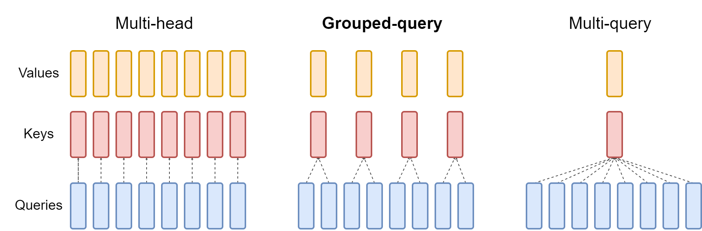
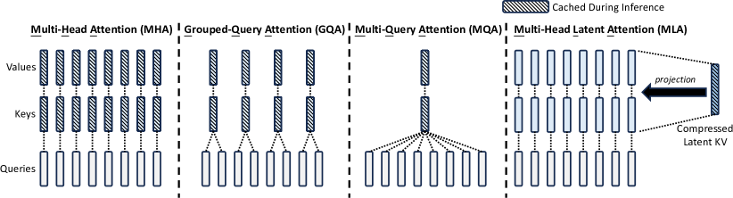

# KV Cache Efficiency Techniques and DeepSeek Sparse Attention

## Table of Contents

- [[#1. Introduction: The KV Cache Memory Problem|1. Introduction: The KV Cache Memory Problem]]
- [[#2. Multi-Query Attention|2. Multi-Query Attention]]
  - [[#2.1 Formulation|2.1 Formulation]]
  - [[#2.2 Memory Analysis: DeepSeek V3 / R1 as Reference|2.2 Memory Analysis: DeepSeek V3 / R1 as Reference]]
  - [[#2.3 Quality Tradeoffs|2.3 Quality Tradeoffs]]
- [[#3. Grouped-Query Attention|3. Grouped-Query Attention]]
  - [[#3.1 Formulation|3.1 Formulation]]
  - [[#3.2 GQA as Low-Rank Factorization of the Key and Value Matrices|3.2 GQA as Low-Rank Factorization of the Key and Value Matrices]]
  - [[#3.3 Memory vs Expressiveness Tradeoff|3.3 Memory vs Expressiveness Tradeoff]]
- [[#4. Rotary Positional Embeddings|4. Rotary Positional Embeddings]]
  - [[#4.1 Motivation: Encoding Relative Position|4.1 Motivation: Encoding Relative Position]]
  - [[#4.2 2D Rotation Construction|4.2 2D Rotation Construction]]
  - [[#4.3 Extension to Higher Dimensions|4.3 Extension to Higher Dimensions]]
  - [[#4.4 The Relative Position Property|4.4 The Relative Position Property]]
- [[#5. Multi-Head Latent Attention|5. Multi-Head Latent Attention]]
  - [[#5.1 Low-Rank KV Compression|5.1 Low-Rank KV Compression]]
  - [[#5.2 Query Compression|5.2 Query Compression]]
  - [[#5.3 Matrix Absorption Trick for Inference|5.3 Matrix Absorption Trick for Inference]]
  - [[#5.4 Incompatibility with RoPE|5.4 Incompatibility with RoPE]]
  - [[#5.5 Decoupled RoPE as the Solution|5.5 Decoupled RoPE as the Solution]]
- [[#6. DeepSeek Sparse Attention|6. DeepSeek Sparse Attention]]
  - [[#6.1 Motivation: Full Attention Cost During Decoding|6.1 Motivation: Full Attention Cost During Decoding]]
  - [[#6.2 The Lightning Indexer|6.2 The Lightning Indexer]]
  - [[#6.3 Quantization for Index Score Computation|6.3 Quantization for Index Score Computation]]
  - [[#6.4 Hadamard Transform for Quantization Stability|6.4 Hadamard Transform for Quantization Stability]]
  - [[#6.5 Two-Stage Training of the Indexer|6.5 Two-Stage Training of the Indexer]]
- [[#7. References|7. References]]

---

## 1. Introduction: The KV Cache Memory Problem

During autoregressive decoding, a transformer generates tokens one at a time. At each step $t$, the new token's query $\mathbf{q}_t$ must attend to the keys and values of all preceding tokens $1, \ldots, t-1$. Rather than recomputing those keys and values from scratch at every step — which would require $O(t)$ forward passes — practitioners store them in a *KV cache*. For a full derivation of why the cache is necessary, see [[standard-attention#5. KV Caching|§5 of standard-attention.md]].

The memory cost of this cache is substantial. In standard *multi-head attention* (MHA) with $H$ heads, head dimension $d_k$, $L$ layers, and sequence length $T$, the cache stores:

$$\text{Memory}_{\text{MHA}} = 2 \cdot H \cdot d_k \cdot L \cdot T \cdot \text{bytes\_per\_element}$$

The factor of 2 accounts for one key tensor and one value tensor per head. In float16 (2 bytes), with $H = 128$, $d_k = 128$, $L = 61$ (DeepSeek V3/R1 architecture), and $T = 32{,}768$:

$$\text{Memory}_{\text{MHA}} = 2 \times 128 \times 128 \times 61 \times 32{,}768 \times 2 \approx 131\ \text{GB}$$

This exceeds the memory of four A100 GPUs for a single inference request at 32k context. The techniques in this note reduce this figure by factors ranging from 8× (GQA) to 57× (MLA).

**Notation.** $D$ denotes the model's hidden dimension; $H$ the number of query heads; $d_k$ the per-head key/query dimension; $d_v$ the per-head value dimension; $T$ the sequence length; $L$ the number of layers. Index $i$ ranges over heads and $t$ over token positions. Vectors are bold lowercase ($\mathbf{q}, \mathbf{k}, \mathbf{v}$), matrices are bold uppercase ($\mathbf{W}$). All matrix dimensions are written as rows $\times$ columns.

---

## 2. Multi-Query Attention

### 2.1 Formulation

**Definition (Multi-Query Attention).** In *multi-query attention* (MQA), each of the $H$ query heads maintains its own projection matrix $\mathbf{W}_Q^h \in \mathbb{R}^{d_k \times D}$, but all heads share a single key projection $\mathbf{W}_K \in \mathbb{R}^{d_k \times D}$ and a single value projection $\mathbf{W}_V \in \mathbb{R}^{d_v \times D}$.

For input $\mathbf{x}_t \in \mathbb{R}^D$, the projections are:

$$\mathbf{q}_t^h = \mathbf{W}_Q^h \mathbf{x}_t \in \mathbb{R}^{d_k}, \quad h = 1, \ldots, H$$

$$\mathbf{k}_t = \mathbf{W}_K \mathbf{x}_t \in \mathbb{R}^{d_k}, \qquad \mathbf{v}_t = \mathbf{W}_V \mathbf{x}_t \in \mathbb{R}^{d_v}$$

The attention output for head $h$ at position $t$ is then:

$$\mathbf{o}_t^h = \sum_{s=1}^{t} a_{t,s}^h \, \mathbf{v}_s, \quad a_{t,s}^h = \frac{\exp\!\left(\mathbf{q}_t^h \cdot \mathbf{k}_s / \sqrt{d_k}\right)}{\sum_{s'=1}^{t} \exp\!\left(\mathbf{q}_t^h \cdot \mathbf{k}_{s'} / \sqrt{d_k}\right)}$$

The $H$ outputs are concatenated and passed through an output projection $\mathbf{W}_O \in \mathbb{R}^{D \times H d_v}$.

In einsum notation (following Shazeer 2019), the batched computation reads:

$$Q = \operatorname{einsum}(\text{"bnd,hdk} \to \text{bhnk"}, X, P_Q), \quad K = \operatorname{einsum}(\text{"bmd,dk} \to \text{bmk"}, M, P_K)$$

where $X$ is the input, $M$ is the memory (context), $P_Q$ has shape $[H, D, d_k]$, and $P_K$ has shape $[D, d_k]$ — a single shared key projection.

### 2.2 Memory Analysis: DeepSeek V3 / R1 as Reference

The KV cache stores keys and values for all past tokens. Under MQA there is only one key vector and one value vector per token (not $H$ of each), so:

$$\text{Memory per token per layer}_{\text{MQA}} = 2 \cdot d_k \cdot \text{bytes\_per\_element}$$

Using DeepSeek V3/R1 hyperparameters ($H = 128$, $d_k = d_v = 128$, $L = 61$, float16):

| Configuration | Per-token-per-layer | Total at $T = 32{,}768$ |
|---------------|--------------------|-----------------------|
| MHA ($H = 128$) | $2 \times 128 \times 128 \times 2 = 65{,}536$ bytes $\approx 64$ KB | $\approx 131$ GB |
| MQA ($H_{\text{KV}} = 1$) | $2 \times 128 \times 2 = 512$ bytes $\approx 0.5$ KB | $\approx 1.0$ GB |

**MQA reduces KV cache memory by a factor of $H$ relative to MHA.** For DeepSeek V3/R1 hyperparameters, this is a 128× reduction, bringing the total from 131 GB to approximately 1 GB for a 32k context.

The corresponding memory-to-compute ratio for incremental decoding improves from $\Theta(T/D + 1/B)$ (MHA) to $\Theta(T/(D \cdot H) + 1/B)$ (MQA), where $B$ is the batch size — a linear improvement in the dominant $T/D$ term by a factor of $H$.

### 2.3 Quality Tradeoffs

Sharing a single KV projection eliminates the per-head specialization of keys and values. Empirically (Shazeer 2019), MQA achieves around 12× decoder speedup on encoder-decoder translation tasks with only minor quality degradation — approximately 0.2 BLEU points on WMT14 — and comparable perplexity on language modeling. The quality gap is tolerable for many applications but motivates the intermediate Grouped-Query Attention of Section 3.

---

## 3. Grouped-Query Attention

### 3.1 Formulation

**Definition (Grouped-Query Attention).** *Grouped-query attention* (GQA) with $G$ groups divides the $H$ query heads into $G$ equal groups of size $H/G$ each. Each group $g \in \{1, \ldots, G\}$ has its own key projection $\mathbf{W}_K^g \in \mathbb{R}^{d_k \times D}$ and value projection $\mathbf{W}_V^g \in \mathbb{R}^{d_v \times D}$, shared by all $H/G$ query heads within the group.

For head $h$ belonging to group $g(h) = \lceil hG/H \rceil$:

$$\mathbf{q}_t^h = \mathbf{W}_Q^h \mathbf{x}_t, \quad \mathbf{k}_t^{g(h)} = \mathbf{W}_K^{g(h)} \mathbf{x}_t, \quad \mathbf{v}_t^{g(h)} = \mathbf{W}_V^{g(h)} \mathbf{x}_t$$

GQA interpolates between MHA ($G = H$, one KV head per query head) and MQA ($G = 1$, one shared KV head). The notation GQA-$G$ specifies the number of groups. The memory of the KV cache scales as $G/H$ relative to MHA.

### 3.2 GQA as Low-Rank Factorization of the Key and Value Matrices

To make GQA's relationship to MHA precise, write the full MHA key matrix as $\mathbf{W}_K \in \mathbb{R}^{D \times H d_k}$ — the horizontal concatenation of $H$ per-head matrices. GQA implicitly factorizes this as:

$$\mathbf{W}_K^{\text{MHA}} \approx \mathbf{W}_K^{\text{down}} \cdot \mathbf{W}_K^{\text{up}}$$

where:

- $\mathbf{W}_K^{\text{down}} \in \mathbb{R}^{D \times G d_k}$ contains $G$ distinct key projection matrices (one per group), concatenated horizontally.
- $\mathbf{W}_K^{\text{up}} = \mathbf{I}_{d_k} \otimes \mathbf{1}_{H/G}^{\top} \in \mathbb{R}^{G d_k \times H d_k}$ is a fixed, non-learned *up-projection* that duplicates each group's $d_k$-dimensional key vector to all $H/G$ heads in that group. Here $\otimes$ denotes the Kronecker product and $\mathbf{1}_{H/G}$ is the all-ones vector of length $H/G$.

The same factorization applies to $\mathbf{W}_V^{\text{MHA}}$. This perspective shows that GQA is not merely an engineering approximation — it is a structured low-rank constraint on the joint KV weight matrix, with the up-projection fixed rather than learned.

*Remark.* The factorization is over the head dimension, not the embedding dimension $D$. The rank reduction is from $H$ to $G$ in the head axis. Setting $G = 1$ recovers MQA (rank-1 in the head axis); setting $G = H$ recovers unconstrained MHA.

### 3.3 Memory vs Expressiveness Tradeoff

**Memory reduction.** GQA-$G$ stores $2 G d_k$ scalars per token per layer (versus $2 H d_k$ for MHA), giving a reduction factor of $H/G$. For GQA-8 with $H = 32$ (LLaMA-style), this is a 4× reduction.

**Expressiveness.** All $H/G$ heads within a group are constrained to attend to the same linear subspace of the context. This removes the ability for those heads to develop specialized key/value representations. In practice (Ainslie et al. 2023), GQA-8 upscaled from an MHA checkpoint matches MHA quality on summarization, translation, and question answering while attaining inference speed close to MQA. *The quality gap between GQA and MHA is substantially smaller than the gap between MQA and MHA.*

Larger models benefit more from GQA, because they use more heads (making MQA's single-head constraint more severe) while the relative FLOPs consumed by KV cache loading decrease (quadratic FLOPs vs linear KV bandwidth).

*Figure 2 (Ainslie et al., 2023): MHA gives every query head its own K and V head (left). GQA-G assigns one K/V head per group of H/G query heads (centre). MQA collapses all heads to a single shared K and V (right). The memory cost of the KV cache scales as the number of K/V heads, so the three designs represent a continuum from maximum expressiveness (MHA) to minimum cache footprint (MQA).*

---

## 4. Rotary Positional Embeddings

### 4.1 Motivation: Encoding Relative Position

Standard dot-product attention computes $\mathbf{q}^{\top} \mathbf{k}$ without any position information. The original Transformer injects *absolute* positional information by adding a sinusoidal bias to the input embeddings before projection. This has two drawbacks: (i) absolute positions generalize poorly to lengths not seen during training; (ii) the positional signal is entangled with content in the same embedding space.

*Rotary Positional Embeddings* (RoPE), introduced by Su et al. (2021), take a different approach: modify the query and key vectors themselves so that their inner product depends only on the *relative* offset between their positions. This is achieved by rotating query and key vectors by an angle proportional to their absolute position; the rotation acts like a carrier frequency that cancels in the dot product.

### 4.2 2D Rotation Construction

**Definition (2D RoPE).** For a 2-dimensional query $\mathbf{q} \in \mathbb{R}^2$ at position $m$ and key $\mathbf{k} \in \mathbb{R}^2$ at position $n$, define the rotation matrix at angle $\phi$:

$$\mathbf{R}(\phi) = \begin{pmatrix} \cos\phi & -\sin\phi \\ \sin\phi & \cos\phi \end{pmatrix}$$

RoPE replaces $\mathbf{q}$ with $\mathbf{R}(m\theta)\mathbf{q}$ and $\mathbf{k}$ with $\mathbf{R}(n\theta)\mathbf{k}$, where $\theta > 0$ is a fixed base frequency. The attention logit then becomes:

$$\left[\mathbf{R}(m\theta)\mathbf{q}\right]^{\top} \left[\mathbf{R}(n\theta)\mathbf{k}\right] = \mathbf{q}^{\top} \mathbf{R}(m\theta)^{\top} \mathbf{R}(n\theta) \mathbf{k}$$

Since $\mathbf{R}(\phi)$ is orthogonal, $\mathbf{R}(m\theta)^{\top} = \mathbf{R}(-m\theta)$, and the product of two rotation matrices satisfies $\mathbf{R}(-m\theta)\mathbf{R}(n\theta) = \mathbf{R}((n-m)\theta)$. Therefore:

$$\left[\mathbf{R}(m\theta)\mathbf{q}\right]^{\top} \left[\mathbf{R}(n\theta)\mathbf{k}\right] = \mathbf{q}^{\top} \mathbf{R}((n-m)\theta) \mathbf{k}$$

**The dot product depends only on the relative position $n - m$, not on $m$ or $n$ individually.**

*Figure 1 (Su et al., 2021): Implementation of Rotary Position Embedding. Each query and key vector is multiplied by a block-diagonal rotation matrix whose angle is proportional to the token's absolute position. Because the rotation of Q at position m and the rotation of K at position n combine to a net rotation by (n − m), the resulting dot product encodes only the relative offset between the two positions.*

### 4.3 Extension to Higher Dimensions

For the realistic case $d_k > 2$, divide the $d_k$-dimensional space into $d_k/2$ independent 2D subspaces (assuming $d_k$ is even). Apply a separate rotation to each pair of coordinates $(q_{2i-1}, q_{2i})$ with its own frequency $\theta_i$:

$$\theta_i = \text{base}^{-2(i-1)/d_k}, \quad i = 1, \ldots, d_k/2$$

where $\text{base} = 10{,}000$ is the standard choice (following the sinusoidal PE convention). This gives logarithmically-spaced frequencies: low-indexed pairs rotate fast (short-range relative positions), high-indexed pairs rotate slowly (long-range relative positions).

**Definition (Full RoPE).** The full rotation operator on $\mathbf{q} \in \mathbb{R}^{d_k}$ at position $m$ is:

$$\mathbf{R}^{d_k}(m) = \operatorname{block-diag}\!\left(\mathbf{R}(m\theta_1),\, \mathbf{R}(m\theta_2),\, \ldots,\, \mathbf{R}(m\theta_{d_k/2})\right) \in \mathbb{R}^{d_k \times d_k}$$

Applied to a vector $\mathbf{q} = (q_1, q_2, \ldots, q_{d_k})^{\top}$:

$$\mathbf{R}^{d_k}(m)\mathbf{q} = \begin{pmatrix} q_1 \cos(m\theta_1) - q_2 \sin(m\theta_1) \\ q_1 \sin(m\theta_1) + q_2 \cos(m\theta_1) \\ q_3 \cos(m\theta_2) - q_4 \sin(m\theta_2) \\ q_3 \sin(m\theta_2) + q_4 \cos(m\theta_2) \\ \vdots \end{pmatrix}$$

### 4.4 The Relative Position Property

**Proposition (RoPE relative position property).** For any $\mathbf{q}, \mathbf{k} \in \mathbb{R}^{d_k}$ and positions $m, n \in \mathbb{Z}$:

$$\left[\mathbf{R}^{d_k}(m)\mathbf{q}\right]^{\top} \left[\mathbf{R}^{d_k}(n)\mathbf{k}\right] = \mathbf{q}^{\top} \mathbf{R}^{d_k}(n-m) \mathbf{k}$$

*Proof sketch.* Since $\mathbf{R}^{d_k}(m)$ is block-diagonal with orthogonal $2 \times 2$ blocks, $\mathbf{R}^{d_k}(m)^{\top} = \mathbf{R}^{d_k}(-m)$. The product $\mathbf{R}^{d_k}(-m)\mathbf{R}^{d_k}(n)$ is block-diagonal with blocks $\mathbf{R}(-m\theta_i)\mathbf{R}(n\theta_i) = \mathbf{R}((n-m)\theta_i)$, yielding $\mathbf{R}^{d_k}(n-m)$. $\square$

**Consequence.** The attention matrix entry $(t, s)$ computed with RoPE is $\mathbf{q}_t^{\top} \mathbf{R}^{d_k}(s-t) \mathbf{k}_s$, a function of the offset $s - t$ only. The model learns to use slow-rotating (large $i$) pairs for long-range dependencies and fast-rotating (small $i$) pairs for local structure. *Empirically, RoPE generalizes better to longer sequences than absolute positional embeddings, though extrapolation still degrades beyond the training length.*

---

## 5. Multi-Head Latent Attention

Standard MQA sacrifices expressiveness entirely; GQA is a middle ground. *Multi-head Latent Attention* (MLA), introduced in DeepSeek-V2, takes a different approach: cache a low-dimensional *latent* vector and reconstruct full KV tensors via learned up-projections, enabling both high expressiveness and a very small cache footprint.

### 5.1 Low-Rank KV Compression

**Definition (MLA KV Down-Projection).** For input hidden state $\mathbf{h}_t \in \mathbb{R}^D$, MLA computes a compressed KV latent:

$$\mathbf{c}_t^{KV} = \mathbf{W}_{KV}^{\text{down}} \mathbf{h}_t \in \mathbb{R}^{d_c}$$

where $\mathbf{W}_{KV}^{\text{down}} \in \mathbb{R}^{d_c \times D}$ is a learned down-projection and $d_c \ll H \cdot d_k$ is the *KV compression dimension*. This single vector $\mathbf{c}_t^{KV}$ is what the KV cache stores, replacing the $H$ key and $H$ value vectors of MHA.

**Definition (MLA KV Up-Projections).** At each attention step, the compressed latent is expanded back to per-head key and value vectors:

$$\mathbf{k}_t^h = \mathbf{W}_K^{\text{up},h} \mathbf{c}_t^{KV} \in \mathbb{R}^{d_k}, \qquad \mathbf{v}_t^h = \mathbf{W}_V^{\text{up},h} \mathbf{c}_t^{KV} \in \mathbb{R}^{d_v}$$

where $\mathbf{W}_K^{\text{up},h} \in \mathbb{R}^{d_k \times d_c}$ and $\mathbf{W}_V^{\text{up},h} \in \mathbb{R}^{d_v \times d_c}$ are learned per-head up-projections.

**DeepSeek-V2 dimensions.** The model uses $H = n_h = 128$ query heads, $d_k = d_v = d_h = 128$, so standard MHA would cache $2 \times 128 \times 128 = 32{,}768$ scalars per token per layer. MLA sets $d_c = 512$ (approximately $4 d_h$), caching only 512 scalars — a compression ratio of $d_c / (2 H d_k) = 512 / 32{,}768 \approx 1/64$. *In practice the effective cache includes additional RoPE components (Section 5.5), bringing the ratio to approximately $1/57$.*

**Memory reduction factor:**

$$\frac{\text{MLA cache size}}{\text{MHA cache size}} = \frac{d_c}{2 H d_k}$$

For the DeepSeek-V2 numbers: $512 / (2 \times 128 \times 128) = 512 / 32{,}768 \approx 1.6\%$ of MHA.

*Figure 3 (DeepSeek-AI, 2024): Simplified illustration of Multi-Head Attention (MHA), Grouped-Query Attention (GQA), Multi-Query Attention (MQA), and Multi-Head Latent Attention (MLA). MLA replaces the per-head K and V tensors with a single low-dimensional latent vector $\mathbf{c}_t^{KV}$ of size $d_c$, which is projected back to full K and V representations via learned up-projections. Only this latent is stored in the KV cache, achieving a ~57× reduction over MHA.*

### 5.2 Query Compression

MLA also compresses queries, not to reduce the KV cache (queries are not cached) but to reduce *activation memory during training*:

$$\mathbf{c}_t^Q = \mathbf{W}_Q^{\text{down}} \mathbf{h}_t \in \mathbb{R}^{d_c'}, \qquad \mathbf{q}_t^h = \mathbf{W}_Q^{\text{up},h} \mathbf{c}_t^Q \in \mathbb{R}^{d_k}$$

where $\mathbf{W}_Q^{\text{down}} \in \mathbb{R}^{d_c' \times D}$ and $\mathbf{W}_Q^{\text{up},h} \in \mathbb{R}^{d_k \times d_c'}$. In DeepSeek-V2, $d_c' = 1{,}536$.

*This does not affect inference memory for the KV cache.* The intermediate query latent $\mathbf{c}_t^Q$ is ephemeral and not stored across decoding steps.

### 5.3 Matrix Absorption Trick for Inference

During inference, materializing $\mathbf{k}_t^h$ and $\mathbf{v}_t^h$ from every cached $\mathbf{c}_t^{KV}$ would require $H$ matrix-vector products per cached token per query step — expensive. The key observation is that the up-projections can be absorbed into adjacent weight matrices.

**Value-side absorption.** The attention output for head $h$ at query position $t$ is:

$$\mathbf{o}_t^h = \sum_{s=1}^{t} a_{t,s}^h \, \mathbf{v}_s^h = \sum_{s=1}^{t} a_{t,s}^h \left(\mathbf{W}_V^{\text{up},h} \mathbf{c}_s^{KV}\right) = \mathbf{W}_V^{\text{up},h} \left(\sum_{s=1}^{t} a_{t,s}^h \mathbf{c}_s^{KV}\right)$$

where the last equality holds because $\mathbf{W}_V^{\text{up},h}$ does not depend on $s$. Define $\tilde{\mathbf{o}}_t^h = \sum_s a_{t,s}^h \mathbf{c}_s^{KV} \in \mathbb{R}^{d_c}$. The final output is:

$$\Delta \mathbf{x}_t = \operatorname{concat}(\mathbf{o}_t^1, \ldots, \mathbf{o}_t^H) \mathbf{W}_O = \operatorname{concat}\!\left(\mathbf{W}_V^{\text{up},1}\tilde{\mathbf{o}}_t^1, \ldots, \mathbf{W}_V^{\text{up},H}\tilde{\mathbf{o}}_t^H\right) \mathbf{W}_O$$

Defining the absorbed output weight:

$$\mathbf{W}_O' = \operatorname{block-diag}\!\left(\mathbf{W}_V^{\text{up},1}, \ldots, \mathbf{W}_V^{\text{up},H}\right) \mathbf{W}_O \in \mathbb{R}^{H d_c \times D}$$

one can write $\Delta \mathbf{x}_t = \operatorname{concat}(\tilde{\mathbf{o}}_t^1, \ldots, \tilde{\mathbf{o}}_t^H) \mathbf{W}_O'$, so **no $\mathbf{v}_t^h$ vectors need to be materialized during inference.**

**Key-side absorption.** Similarly, for the attention logit between query head $h$ at position $t$ and latent $\mathbf{c}_s^{KV}$:

$$a_{t,s}^h \propto \exp\!\left(\frac{\mathbf{q}_t^h \cdot \mathbf{k}_s^h}{\sqrt{d_k}}\right) = \exp\!\left(\frac{\mathbf{q}_t^h \cdot \mathbf{W}_K^{\text{up},h} \mathbf{c}_s^{KV}}{\sqrt{d_k}}\right) = \exp\!\left(\frac{\left((\mathbf{W}_K^{\text{up},h})^{\top} \mathbf{q}_t^h\right) \cdot \mathbf{c}_s^{KV}}{\sqrt{d_k}}\right)$$

Define the absorbed query $\tilde{\mathbf{q}}_t^h = (\mathbf{W}_K^{\text{up},h})^{\top} \mathbf{q}_t^h \in \mathbb{R}^{d_c}$. The attention logit is then $\tilde{\mathbf{q}}_t^h \cdot \mathbf{c}_s^{KV}$, computed directly from the cached latent. **Neither $\mathbf{k}_s^h$ nor $\mathbf{v}_s^h$ need to be reconstructed; only the low-dimensional $\mathbf{c}_s^{KV}$ is read from cache.**

### 5.4 Incompatibility with RoPE

The matrix absorption trick requires that $\mathbf{W}_K^{\text{up},h}$ can be moved to the query side. This is valid only when the key is a linear function of the cached quantity. RoPE breaks this linearity.

With standard RoPE, the key at position $s$ for head $h$ would be:

$$\mathbf{k}_s^h = \mathbf{R}^{d_k}(s) \, \mathbf{W}_K^{\text{up},h} \mathbf{c}_s^{KV}$$

The rotation $\mathbf{R}^{d_k}(s)$ is position-dependent and lies *between* the cached $\mathbf{c}_s^{KV}$ and the weight $\mathbf{W}_K^{\text{up},h}$. To absorb $\mathbf{W}_K^{\text{up},h}$ into the query, one would need to commute it past $\mathbf{R}^{d_k}(s)$, but $\mathbf{R}^{d_k}(s)\mathbf{W}_K^{\text{up},h} \neq \mathbf{W}_K^{\text{up},h}\mathbf{R}^{d_k}(s)$ in general — the rotation and the up-projection do not commute. *If one were to apply RoPE naively, the model would need to materialize the full $\mathbf{k}_s^h$ for every cached position at each decoding step, eliminating the benefit of caching only $\mathbf{c}_s^{KV}$.*

### 5.5 Decoupled RoPE as the Solution

DeepSeek-V2 resolves this incompatibility by introducing separate positional components that carry RoPE but bypass the up-projection.

**Definition (Decoupled RoPE).** In addition to the content-based keys derived from $\mathbf{c}_t^{KV}$, MLA maintains a *shared* RoPE key $\mathbf{k}_t^R \in \mathbb{R}^{d_h^R}$ computed directly from the input (no up-projection):

$$\mathbf{k}_t^R = \mathbf{R}^{d_h^R}(t) \, \mathbf{W}_K^R \mathbf{h}_t$$

where $\mathbf{W}_K^R \in \mathbb{R}^{d_h^R \times D}$ is a shared projection and $d_h^R = 64$ in DeepSeek-V2 (half the head dimension). Similarly, each query head receives a per-head RoPE component:

$$\mathbf{q}_t^{R,h} = \mathbf{R}^{d_h^R}(t) \, \mathbf{W}_Q^{R,h} \mathbf{c}_t^Q$$

The effective key and query for head $h$ are formed by concatenation:

$$\mathbf{k}_t^{\text{eff},h} = \begin{pmatrix} \mathbf{W}_K^{\text{up},h} \mathbf{c}_t^{KV} \\ \mathbf{k}_t^R \end{pmatrix} \in \mathbb{R}^{d_k + d_h^R}, \qquad \mathbf{q}_t^{\text{eff},h} = \begin{pmatrix} \mathbf{q}_t^h \\ \mathbf{q}_t^{R,h} \end{pmatrix} \in \mathbb{R}^{d_k + d_h^R}$$

The cache stores $\mathbf{c}_t^{KV}$ (for the content part, absorption still applies) and $\mathbf{k}_t^R$ (for the positional part, it is a fixed low-dimensional vector). Since $\mathbf{k}_t^R$ requires no up-projection, it suffers no commutativity issue and can be cached directly. **The total cache per token per layer is $d_c + d_h^R = 512 + 64 = 576$ scalars in DeepSeek-V2, versus $2 H d_k = 32{,}768$ for MHA — a compression of approximately 57×.**

---

## 6. DeepSeek Sparse Attention

### 6.1 Motivation: Full Attention Cost During Decoding

Even after MLA reduces the KV cache size by 57×, the attention computation itself during decoding still scales as $O(T)$ per token: for each new query, the model must compute dot products with all $T$ cached latents and read them from memory. For very long contexts ($T \sim 128{,}000$), this becomes the dominant cost.

*DeepSeek Sparse Attention* (DSA), introduced in DeepSeek-V3.2-Exp, addresses this by selecting a small subset $\mathcal{S}_t \subset \{1, \ldots, t-1\}$ of $|\mathcal{S}_t| = K$ past tokens for each query position $t$, where $K \ll t$ (in practice $K = 2{,}048$). Full MLA is then computed only over $\mathcal{S}_t$. The challenge is selecting $\mathcal{S}_t$ cheaply and accurately.

### 6.2 The Lightning Indexer

**Definition (Lightning Indexer).** For each query position $t$, the lightning indexer computes an *index score* $I_{t,s} \geq 0$ for every preceding position $s < t$, and $\mathcal{S}_t$ is the top-$K$ set by score.

The indexer uses a lightweight multi-query-style architecture with $H^I$ indexer query heads of dimension $d^I$ (both much smaller than $H$ and $d_k$) and a single shared indexer key. Let $\mathbf{W}_{Q}^{I,j} \in \mathbb{R}^{d^I \times D}$ be the $j$-th query head projection, $\mathbf{W}_K^I \in \mathbb{R}^{d^I \times D}$ the shared key projection, and $w_{t,j} \geq 0$ learned per-head scalar weights (themselves a linear function of $\mathbf{h}_t$):

$$\mathbf{q}_{t,j}^I = \mathbf{W}_{Q}^{I,j} \mathbf{h}_t \in \mathbb{R}^{d^I}, \qquad \mathbf{k}_s^I = \mathbf{W}_K^I \mathbf{h}_s \in \mathbb{R}^{d^I}$$

$$I_{t,s} = \sum_{j=1}^{H^I} w_{t,j} \cdot \operatorname{ReLU}\!\left(\mathbf{q}_{t,j}^I \cdot \mathbf{k}_s^I\right)$$

The ReLU discards negatively-correlated token pairs rather than treating them as weakly relevant. *The squaring convention sometimes reported in the literature is an alternate formulation; the core design is ReLU-activated weighted dot products.*

The token selector then forms $\mathcal{S}_t = \operatorname{top}\text{-}K\{I_{t,s} : s < t\}$, and the full MLA attention is computed only over tokens in $\mathcal{S}_t$.

### 6.3 Quantization for Index Score Computation

The indexer runs over the full token history at each decoding step, so its constant factor matters. To minimize cost, both query and key vectors are quantized to 8-bit precision before the dot products. Let $\hat{\mathbf{q}}_{t,j}^I$ and $\hat{\mathbf{k}}_s^I$ denote the quantized versions with per-vector or per-block scale factors $s_q$ and $s_k$:

$$I_{t,s} \approx \sum_{j=1}^{H^I} w_{t,j} \cdot \operatorname{ReLU}\!\left(s_q \cdot s_k \cdot \hat{\mathbf{q}}_{t,j}^I \cdot \hat{\mathbf{k}}_s^I\right) = s_q \cdot s_k \cdot \sum_{j=1}^{H^I} w_{t,j} \cdot \operatorname{ReLU}\!\left(\hat{\mathbf{q}}_{t,j}^I \cdot \hat{\mathbf{k}}_s^I\right)$$

where the scale factors have been pulled outside the ReLU (valid since $s_q, s_k > 0$). The indexer keys $\hat{\mathbf{k}}_s^I$ are stored in the cache alongside the MLA latents; the scale factor $s_k(s)$ is stored per block (block size 64) to support efficient dequantization. The goal of the indexer is token *ranking*, not exact score values, so quantization error is tolerable as long as the top-$K$ ordering is approximately preserved.

### 6.4 Hadamard Transform for Quantization Stability

**Problem.** Raw attention vectors often have a heavy-tailed distribution across dimensions: a small number of coordinates carry disproportionately large magnitudes (so-called *outlier dimensions*). When such a vector is quantized to 8 bits, the quantization step size must accommodate the outliers, wasting precision on the majority of near-zero coordinates and degrading the dot product approximation.

**Solution.** Before quantization, apply a *Walsh-Hadamard transform* (WHT) combined with a random sign matrix to the query and key vectors. The WHT is the $d^I \times d^I$ matrix $\mathbf{H}$ satisfying $H_{ij} = d_I^{-1/2}(-1)^{\langle i-1, j-1 \rangle}$ where $\langle \cdot, \cdot \rangle$ is the bitwise inner product of binary representations. This transform has the property that it spreads the energy of any vector uniformly across all coordinates:

$$\|\mathbf{H}\mathbf{x}\|_\infty \leq \|\mathbf{x}\|_2 / \sqrt{d^I}$$

That is, after the WHT, no single dimension can dominate. Quantization applied to the WHT-transformed vector therefore incurs uniform error across coordinates, reducing the worst-case dot product error from $O(\|\mathbf{x}\|_2)$ to $O(\|\mathbf{x}\|_2 / \sqrt{d^I})$.

**Computational cost.** The WHT can be computed in $O(d^I \log d^I)$ using a butterfly (fast Hadamard transform) algorithm, without materializing the dense matrix $\mathbf{H}$. Since both $\mathbf{q}$ and $\mathbf{k}$ are transformed, the dot product $(\mathbf{H}\mathbf{q}) \cdot (\mathbf{H}\mathbf{k}) = \mathbf{q}^{\top} \mathbf{H}^{\top} \mathbf{H} \mathbf{k} = \mathbf{q}^{\top} \mathbf{k}$ (the WHT is orthogonal), so the transform is invisible to the score values while benefiting quantization stability.

*Note.* The initial DeepSeek-V3.2-Exp technical report included Hadamard preprocessing, but subsequent engineering analysis found no measurable accuracy impact and removed it from the production implementation. The theoretical motivation above describes the original design rationale.

### 6.5 Two-Stage Training of the Indexer

Training the lightning indexer end-to-end with the main model is problematic: the top-$K$ selection is non-differentiable, and gradient signals from the language modeling loss would propagate through the selection into the indexer, creating instability.

DSA resolves this with a two-stage curriculum:

**Stage 1 (Dense warm-up — 1,000 steps, 2.1B tokens).** All model parameters (the pretrained MLA transformer) are *frozen*. Only the indexer parameters are trained. The indexer is supervised by a KL-divergence loss that aligns its scores with the full attention distribution:

$$\mathcal{L}^I = \sum_t D_{\mathrm{KL}}\!\left(p_{t,\cdot} \;\big\|\; \operatorname{Softmax}(I_{t,\cdot})\right)$$

where $p_{t,s} = \operatorname{Softmax}_{s'<t}\!\left(\mathbf{q}_t^{\text{eff}} \cdot \mathbf{k}_{s'}^{\text{eff}} / \sqrt{d_k + d_h^R}\right)_s$ is the full (dense) attention distribution. This stage teaches the indexer to approximate the attention pattern without altering the main model.

**Stage 2 (Sparse fine-tuning — 15,000 steps, 943.7B tokens).** All model parameters are unfrozen. At each step, the indexer selects $K = 2{,}048$ tokens per query position, and the main model is fine-tuned using only those selected tokens in its attention computation. Two losses operate in parallel:

1. $\mathcal{L}^{\text{LM}}$: standard next-token prediction loss, backpropagated through MLA (but not the indexer — the indexer's output is used as a non-differentiable mask).
2. $\mathcal{L}^I$: indexer KL-divergence loss over the selected token set $\mathcal{S}_t$:

$$\mathcal{L}^I = \sum_t D_{\mathrm{KL}}\!\left(p_{t,\mathcal{S}_t} \;\big\|\; \operatorname{Softmax}(I_{t,\mathcal{S}_t})\right)$$

**The indexer input is detached from the main computational graph.** This means: (i) $\mathcal{L}^{\text{LM}}$ gradients do not flow into the indexer, so the main model cannot implicitly communicate with the indexer to ease token selection; (ii) $\mathcal{L}^I$ gradients do not flow into the main model, so the indexer cannot distort the main model's representations in service of making its own job easier. Each component is optimized independently.

**Reported results.** DeepSeek-V3.2-Exp achieves approximately 2–3× faster long-sequence processing and 30–40% memory reduction relative to full dense attention at long contexts, with no measurable quality loss on standard benchmarks including GSM8K and GPQA-Diamond.

---

## 7. References

| Reference Name | Brief Summary | Link to Reference |
|----------------|---------------|-------------------|
| Shazeer (2019), "Fast Transformer Decoding: One Write-Head is All You Need" | Introduces Multi-Query Attention: all heads share one K and one V projection, reducing KV cache by factor H with minor quality loss | [arxiv.org/abs/1911.02150](https://arxiv.org/abs/1911.02150) |
| Ainslie et al. (2023), "GQA: Training Generalized Multi-Query Transformer Models from Multi-Head Checkpoints" | Introduces Grouped-Query Attention as a middle ground between MHA and MQA; provides uptraining recipe from MHA checkpoints | [arxiv.org/abs/2305.13245](https://arxiv.org/abs/2305.13245) |
| Su et al. (2021), "RoFormer: Enhanced Transformer with Rotary Position Embedding" | Introduces RoPE: rotates Q and K by position-proportional angles so that dot products depend only on relative position | [arxiv.org/abs/2104.09864](https://arxiv.org/abs/2104.09864) |
| DeepSeek-AI (2024), "DeepSeek-V2: A Strong, Economical, and Efficient Mixture-of-Experts Language Model" | Introduces Multi-Head Latent Attention: low-rank KV compression, matrix absorption trick, and decoupled RoPE | [arxiv.org/abs/2405.04434](https://arxiv.org/abs/2405.04434) |
| DeepSeek-AI (2025), "DeepSeek-V3.2-Exp" | Experimental model introducing DeepSeek Sparse Attention with the lightning indexer, FP8 quantization, and two-stage training | [github.com/deepseek-ai/DeepSeek-V3.2-Exp](https://github.com/deepseek-ai/DeepSeek-V3.2-Exp) |
| vLLM Blog (2025), "DeepSeek-V3.2-Exp in vLLM: Fine-Grained Sparse Attention in Action" | Engineering walkthrough of DSA implementation in vLLM; details FP8 KV cache layout and lightning indexer kernel design | [blog.vllm.ai/2025/09/29/deepseek-v3-2.html](https://blog.vllm.ai/2025/09/29/deepseek-v3-2.html) |
| Thomson (2025), "DeepSeek Sparse Attention" | Detailed technical exposition of DSA: indexer score formula, quantization scaling, Hadamard transform motivation, and two-stage training | [loganthomson.com/DeepSeek-Sparse-Attention](https://loganthomson.com/DeepSeek-Sparse-Attention/) |
| Ericsson (2025), "DeepSeek Sparse Attention" | Blog walkthrough of DSA mechanics including FP8 dot product formulation and training phase details | [leonericsson.github.io/blog/2025-10-16-dsa](https://leonericsson.github.io/blog/2025-10-16-dsa) |
| Jamil (2023), "Attention Mechanism" (YouTube) | Accessible walkthrough of attention, MHA, MQA, GQA, and RoPE with implementation details | [youtube.com/watch?v=Y-o545eYjXM](https://www.youtube.com/watch?v=Y-o545eYjXM) |
