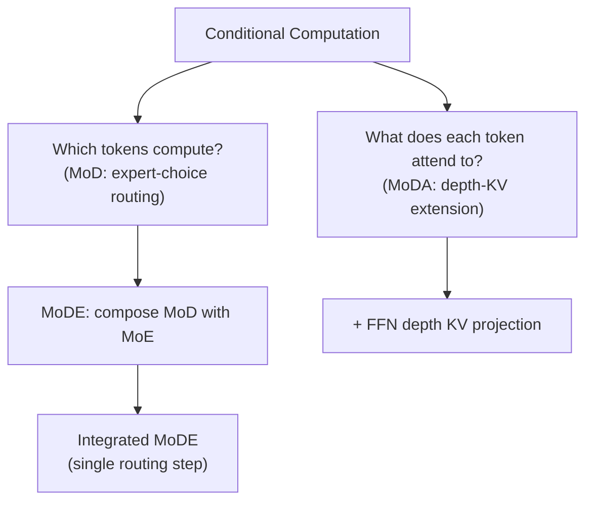

# Conditional Computation in Transformers: Mixture-of-Depths and Depth-Streaming Attention

## Table of Contents

- [[#1. Motivation: Unequal Token Importance and Layer Redundancy|1. Motivation: Unequal Token Importance and Layer Redundancy]]
  - [[#1.1 The Uniform-Compute Assumption|1.1 The Uniform-Compute Assumption]]
  - [[#1.2 Two Failure Modes: Wasted FLOPs and Signal Dilution|1.2 Two Failure Modes: Wasted FLOPs and Signal Dilution]]
- [[#2. Mixture-of-Depths: Routing Tokens Around Blocks|2. Mixture-of-Depths: Routing Tokens Around Blocks]]
  - [[#2.1 Setup and Notation|2.1 Setup and Notation]]
  - [[#2.2 The Routing Decision|2.2 The Routing Decision]]
  - [[#2.3 Expert-Choice vs. Token-Choice Routing|2.3 Expert-Choice vs. Token-Choice Routing]]
  - [[#2.4 Gradient Flow Through the Router|2.4 Gradient Flow Through the Router]]
  - [[#2.5 Autoregressive Inference: The Top-k Causality Problem|2.5 Autoregressive Inference: The Top-k Causality Problem]]
  - [[#2.6 IsoFLOP Analysis and Empirical Results|2.6 IsoFLOP Analysis and Empirical Results]]
  - [[#2.7 Mixture-of-Depths-and-Experts (MoDE)|2.7 Mixture-of-Depths-and-Experts (MoDE)]]
- [[#3. Mixture-of-Depths Attention: Attending Across Layers|3. Mixture-of-Depths Attention: Attending Across Layers]]
  - [[#3.1 The Signal Dilution Problem|3.1 The Signal Dilution Problem]]
  - [[#3.2 Depth-Stream Mechanisms: A Taxonomy|3.2 Depth-Stream Mechanisms: A Taxonomy]]
  - [[#3.3 MoDA: Formal Definition|3.3 MoDA: Formal Definition]]
  - [[#3.4 Visible Relationships and Causal Structure|3.4 Visible Relationships and Causal Structure]]
  - [[#3.5 Complexity Analysis|3.5 Complexity Analysis]]
  - [[#3.6 Hardware-Efficient Implementation|3.6 Hardware-Efficient Implementation]]
  - [[#3.7 Empirical Results|3.7 Empirical Results]]
- [[#4. Connections and Contrasts|4. Connections and Contrasts]]
  - [[#4.1 MoD vs. MoDA: Orthogonal Axes of Conditionality|4.1 MoD vs. MoDA: Orthogonal Axes of Conditionality]]
  - [[#4.2 Relation to Cross-Layer Attention and Deep Supervision|4.2 Relation to Cross-Layer Attention and Deep Supervision]]
  - [[#4.3 Relation to Mixture-of-Experts|4.3 Relation to Mixture-of-Experts]]
- [[#5. References|5. References]]

---

## 1. Motivation: Unequal Token Importance and Layer Redundancy 🔍

### 1.1 The Uniform-Compute Assumption

Standard transformer architectures apply an identical sequence of operations — layer normalization, self-attention, layer normalization, feed-forward network — to every token at every layer. Formally, for a sequence $X^{(0)} \in \mathbb{R}^{T \times D}$ of $T$ tokens each with embedding dimension $D$, the residual update at layer $l$ is:

$$X^{(l)} = X^{(l-1)} + \text{Block}^{(l)}(X^{(l-1)})$$

where $\text{Block}^{(l)}$ denotes the composed attention-plus-MLP sub-block. The total compute scales as $O(T \cdot L \cdot D^2)$ (ignoring the quadratic attention term), and every token $t$ incurs exactly the same cost regardless of how semantically rich or computationally trivial it is.

This *uniform-compute assumption* is a significant inductive bias. Consider a sentence like "The cat, which had been sleeping since early morning and had not eaten, sat on the mat." The tokens "The", ",", and "on" arguably require far less representational work than "sleeping" or "eaten" — yet a vanilla transformer allocates identical FLOPs to each.

### 1.2 Two Failure Modes: Wasted FLOPs and Signal Dilution

The uniform-compute assumption gives rise to two distinct failure modes that the papers in this note address:

> [!INFO]
> These two failure modes motivate two different interventions, studied in separate papers:
> - **Wasted FLOPs** (trivial tokens still processed) → addressed by [[#2. Mixture-of-Depths: Routing Tokens Around Blocks|Mixture-of-Depths (MoD)]] (Raposo et al., 2024)
> - **Signal dilution** (informative features re-weighted away in deep residual stacks) → addressed by [[#3. Mixture-of-Depths Attention: Attending Across Layers|Mixture-of-Depths Attention (MoDA)]] (Zhu et al., 2025)

**Wasted FLOPs.** In a well-trained model, many tokens at many layers contribute negligibly to the final output. The residual stream for these tokens undergoes only a small perturbation from $\text{Block}^{(l)}$, yet the full $O(D^2)$ computation was still executed. If the model could instead learn to route trivial tokens around these blocks via a shortcut (the identity residual), the same final representation could be approximated with strictly fewer FLOPs.

**Signal dilution.** In a deep residual network, an informative feature formed at layer $l_0$ is propagated forward as $x^{(l)} = x^{(l_0)} + \sum_{k=l_0}^{l-1} \delta^{(k)}$ where $\delta^{(k)}$ are residual updates from subsequent layers. Over many layers, these updates accumulate noise and compress the original signal, making it harder for later layers to recover the exact representation from $l_0$. A mechanism that gives late layers direct read-access to early-layer KV pairs — bypassing the lossy residual integration — could recover this signal.

---

## 2. Mixture-of-Depths: Routing Tokens Around Blocks 🔀

> [!INFO]
> **Paper:** Raposo et al. (2024), "Mixture-of-Depths: Dynamically allocating compute in transformer-based language models." Google DeepMind.

### 2.1 Setup and Notation

Let $L$ denote the number of transformer layers, $T$ the sequence length, and $S = T$ the number of tokens per sequence. At each *routing layer* $l$, we have token representations $\{x_i^l\}_{i=1}^S$ with $x_i^l \in \mathbb{R}^D$. The user specifies a *capacity* $C \in \{1, \ldots, S\}$ — the maximum number of tokens that will process through the full self-attention and MLP block at layer $l$.

**Definition (Capacity Factor).** The *capacity factor* $\beta \in (0, 1)$ is:

$$\beta = 1 - \frac{C}{S}$$

$\beta$ is the fraction of tokens that bypass the block. At $\beta = 0.875$ (the optimal setting found empirically), only 12.5% of tokens ($C = S/8$) process through each routed block.

### 2.2 The Routing Decision

**Definition (Router).** At routing layer $l$, a learned linear projection $w_\theta \in \mathbb{R}^D$ produces a scalar *router weight* for each token:

$$r_i^l = w_\theta^\top x_i^l \in \mathbb{R}$$

Let $R^l = (r_1^l, \ldots, r_S^l)$ and let $P_\beta(R^l)$ denote the $\beta$-th percentile of router weights at layer $l$. The block output for token $i$ is:

$$x_i^{l+1} = \begin{cases} r_i^l \cdot f_i(\widetilde{X}^l) + x_i^l & \text{if } r_i^l > P_\beta(R^l) \\ x_i^l & \text{if } r_i^l \leq P_\beta(R^l) \end{cases}$$

where $f_i(\widetilde{X}^l)$ is the output of the self-attention and MLP block applied to the top-$C$ tokens $\widetilde{X}^l$ (the subset of tokens with $r_i^l > P_\beta(R^l)$), and the multiplication by $r_i^l$ is critical for gradient flow (see §2.4).

Tokens with $r_i^l \leq P_\beta(R^l)$ receive only the identity update: $x_i^{l+1} = x_i^l$.

![[concepts/attention-mechanisms/figures/raposo2024-fig1-mod-architecture.png]]

> [!NOTE]
> *Figure 1 from Raposo et al. (2024): Left — two adjacent MoD blocks, each with a router gate that either routes a token through the full self-attention + MLP sub-block (multiplying by weight $w$) or passes it through via identity. Right — routing decisions as a heatmap across layers and sequence positions, contrasted with vanilla (all purple) and early-exit (only first few layers active) patterns. The MoD pattern is irregular and input-dependent.*

> [!QUESTION]
> **Exercise 1 (Mathematical).** Show that if all router weights are equal ($r_i^l = c$ for all $i$), the top-$C$ selection is ill-defined (tie-breaking arbitrary) and the gradient of the loss with respect to $w_\theta$ vanishes through the routing decision. What does this imply about initialization strategies?

> [!SUCCESS]- Solution
> **Key insight:** With $r_i^l = c$ for all $i$, the indicator $\mathbf{1}[r_i^l > P_\beta(R^l)]$ is a step function of a constant — its value depends entirely on tie-breaking, not on $w_\theta$. The gradient $\partial \mathbf{1}[\cdot]/\partial w_\theta = 0$ almost everywhere (the indicator is piecewise constant in $w_\theta$). The only gradient path that survives is through the multiplicative $r_i^l$ term for selected tokens, but when all weights are equal this gives $\partial (r_i^l \cdot f_i)/\partial w_\theta = f_i$ uniformly — a signal, but with no routing specificity, so the model cannot learn which tokens to prioritize.
>
> **Sketch:** This implies that random initialization breaking symmetry is important. Initializing $w_\theta$ with small noise ensures that $r_i^l$ values differ immediately, creating a gradient signal that propagates routing preferences. Initializing $w_\theta = 0$ leads to a flat loss landscape for the routing subnetwork at step 0.

### 2.3 Expert-Choice vs. Token-Choice Routing

The key design decision in MoD is which party — the token or the block — decides who gets processed. This mirrors the *expert-choice* vs. *token-choice* distinction in *Mixture-of-Experts* (MoE) routing.

![[concepts/attention-mechanisms/figures/raposo2024-fig2-routing-schemes.png]]

> [!NOTE]
> *Figure 2 from Raposo et al. (2024): Token-choice routing (left) — tokens select among multiple experts, potentially overloading some; expert-choice routing (center) — each expert selects the top-$k$ tokens, guaranteeing load balance; expert-choice MoD (right) — a single block selects the top-$k$ tokens, all others pass via residual.*

**Definition (Token-Choice Routing).** Each token independently selects a computational path using a softmax over path logits. Tokens are processed by whichever path they select. *Disadvantage:* tokens can "crowd" into one path, causing load imbalance and requiring auxiliary balancing losses.

**Definition (Expert-Choice Routing).** Each computational path selects the top-$k$ tokens by router score. *Advantage:* exactly $k$ tokens process per block at every step, yielding a static computation graph with predictable tensor shapes — critical for hardware efficiency.

MoD uses expert-choice routing. With $C = k$, the top-$C$ tokens by $r_i^l$ are selected, guaranteeing:
1. No auxiliary load-balancing loss is needed.
2. Tensor shapes are constant across training steps, enabling XLA/CUDA kernel fusion.
3. The routing decision is differentiable through the multiplicative $r_i^l$ weight.

> [!WARNING]
> *Expert-choice routing violates causality during autoregressive inference: selecting the top-$C$ tokens requires seeing all $S$ router weights simultaneously, which is impossible when generating token $t$ without tokens $t+1, \ldots, S$ (see §2.5).*

### 2.4 Gradient Flow Through the Router

The routing indicator $\mathbf{1}[r_i^l > P_\beta(R^l)]$ is a discrete operation with zero gradient almost everywhere. Without the multiplicative $r_i^l$ factor, gradient descent cannot adjust $w_\theta$ based on routing decisions. The product $r_i^l \cdot f_i(\widetilde{X}^l)$ solves this:

$$\frac{\partial \ell}{\partial w_\theta} = \sum_{i : r_i^l > P_\beta} \frac{\partial \ell}{\partial x_i^{l+1}} \cdot f_i(\widetilde{X}^l) \cdot x_i^l$$

This gradient is nonzero for every selected token, giving a continuous learning signal for the router. The router learns to assign high weights to tokens that, when processed by the block, produce outputs that reduce loss — i.e., tokens for which the block is genuinely useful.

> [!TIP]
> This is analogous to the REINFORCE-without-baseline trick: multiplying by the router weight $r_i^l$ "scores" each routing decision, enabling gradient-based refinement without requiring a discrete reparameterization.

> [!QUESTION]
> **Exercise 2 (Mathematical).** Consider the MoD update $x_i^{l+1} = r_i^l \cdot f_i(\widetilde{X}^l) + x_i^l$ for a selected token. Suppose the block output satisfies $f_i(\widetilde{X}^l) = \mathbf{v}$ (constant). Show that the fixed point of gradient descent on $r_i^l$ (with loss $\ell = \|x_i^{l+1} - x^*\|^2$ for some target $x^*$) is $r_i^l = \frac{(x^* - x_i^l)^\top \mathbf{v}}{\|\mathbf{v}\|^2}$. Interpret this in terms of how much the block output should be "mixed in."

> [!SUCCESS]- Solution
> **Key insight:** The optimal $r$ is the scalar projection of the residual error onto $\mathbf{v}$, normalized by $\|\mathbf{v}\|^2$.
>
> **Sketch:** Expand $\ell = \|r \mathbf{v} + x_i^l - x^*\|^2 = \|r \mathbf{v} - (x^* - x_i^l)\|^2$. Setting $\partial \ell / \partial r = 2\mathbf{v}^\top(r\mathbf{v} - (x^* - x_i^l)) = 0$ gives $r^* = \mathbf{v}^\top(x^* - x_i^l)/\|\mathbf{v}\|^2$. Interpretation: the router weight measures how much the block correction $\mathbf{v}$ aligns with the residual error $x^* - x_i^l$. A token that is already close to its "ideal" representation (small $\|x^* - x_i^l\|$) gets a small router weight, causing it to be deprioritized — consistent with the intuition that trivial tokens should bypass the block.

### 2.5 Autoregressive Inference: The Top-k Causality Problem

During training, the model sees all $S$ tokens in a batch simultaneously. The top-$C$ selection over $r_1^l, \ldots, r_S^l$ is globally consistent. During autoregressive inference, token $t$ is generated without access to the router weights of future tokens $r_{t+1}^l, \ldots, r_S^l$, so the global percentile threshold $P_\beta(R^l)$ cannot be computed.

Raposo et al. present two solutions:

**Solution 1: Auxiliary Loss (Training-Time Supervision).** Train a secondary binary classifier $\hat{r}_i^l \in [0,1]$ to predict whether token $i$ would be selected by the global top-$C$ rule. During inference, apply a fixed threshold (e.g., 0.5) to $\hat{r}_i^l$ instead of the global percentile. *Cost:* a small binary cross-entropy loss term; performance degradation of 0.2–0.3%.

**Solution 2: Auxiliary MLP Predictor.** Train a small MLP $g_\phi$ with stop-gradient on the router input:

$$\hat{p}_i^l = g_\phi(\text{sg}(x_i^l)) \in [0, 1]$$

where $\text{sg}(\cdot)$ denotes stop-gradient. The predictor $\hat{p}_i^l$ approximates $\mathbf{1}[r_i^l > P_\beta(R^l)]$ without influencing the main model's gradient. During inference, the predictor replaces the non-causal top-$C$ operation, achieving $>97\%$ accuracy within a few thousand training steps.

> [!QUESTION]
> **Exercise 3 (Computational/Python).** Implement the MoD routing step in Python. Given token representations `X` of shape `(S, D)`, router weights `w` of shape `(D,)`, and capacity `C`, compute the selected token indices using expert-choice routing and apply the block identity for non-selected tokens.
>
> ```python
> import torch
>
> def mod_routing_step(X: torch.Tensor, w: torch.Tensor, C: int,
>                       block_fn: callable) -> torch.Tensor:
>     """
>     X: (S, D) token representations
>     w: (D,) router weight vector
>     C: capacity (number of tokens to process through block)
>     block_fn: callable (C, D) -> (C, D)
>     Returns: (S, D) updated representations
>     """
>     # YOUR IMPLEMENTATION HERE
>     pass
> ```

> [!SUCCESS]- Solution
> ```python
> import torch
>
> def mod_routing_step(X: torch.Tensor, w: torch.Tensor, C: int,
>                       block_fn: callable) -> torch.Tensor:
>     S, D = X.shape
>     # Compute scalar router weights for each token
>     r = X @ w  # (S,)
>
>     # Expert-choice: select top-C tokens by router score
>     topk_vals, topk_idx = torch.topk(r, k=C, dim=0)  # (C,), (C,)
>
>     # Gather selected token representations
>     X_selected = X[topk_idx]  # (C, D)
>
>     # Apply block to selected tokens only
>     block_out = block_fn(X_selected)  # (C, D)
>
>     # Scale by router weight and apply residual update
>     r_selected = r[topk_idx].unsqueeze(-1)  # (C, 1) for broadcasting
>     X_updated = X.clone()
>     X_updated[topk_idx] = r_selected * block_out + X[topk_idx]
>
>     # Non-selected tokens: identity (X_updated already holds X for those)
>     return X_updated
> ```
> **Key insight:** The `.clone()` ensures non-selected token representations are copied as-is. The multiplication `r_selected * block_out` scales each block output by its router weight, providing the gradient path back to `w`.

### 2.6 IsoFLOP Analysis and Empirical Results

Raposo et al. perform a systematic *isoFLOP analysis*: for a fixed training FLOP budget $F \in \{6 \times 10^{18}, 2 \times 10^{19}, 10^{20}\}$, they sweep over model sizes (60M to 3B parameters) and measure final language modeling loss on a held-out set.

![[concepts/attention-mechanisms/figures/raposo2024-fig4-isoflop.png]]

> [!NOTE]
> *Figure 4 from Raposo et al. (2024): Left — training loss versus parameter count for baseline and MoD models across three FLOP budgets. MoD models (blue) achieve lower loss at equivalent budgets, and the isoFLOP-optimal MoD model has more parameters than the optimal baseline. Right — normalized loss versus normalized FLOPs per forward pass: shaded region (lower-left) represents models that are simultaneously more accurate and cheaper to run than the isoFLOP-optimal baseline.*

Key empirical findings:

| Setting | Result |
|---|---|
| Optimal capacity factor | $\beta = 0.875$ (12.5% of tokens processed) |
| Optimal routing pattern | Every other block routed (interleaved) |
| isoFLOP improvement at $6 \times 10^{18}$ | $\approx 1.5\%$ lower loss vs. baseline |
| Speed improvement (matched loss) | $66\%$ faster per training step |
| Inference speedup | Up to $50\%$ faster per forward pass |
| Autoregressive predictor accuracy | $>97\%$ within early training |

**💡 Key design principle:** Routing every other block (not every block) is critical. When all blocks are routed, the model loses too much representational capacity; interleaving full-attention blocks with routed blocks maintains model quality while cutting compute.

> [!QUESTION]
> **Exercise 4 (Mathematical).** Suppose a transformer with $L$ layers and uniform block cost $c$ per token per layer is converted to MoD with capacity $\beta = 1 - C/S$. Half the layers are routed (the odd-numbered layers), half are full (even-numbered). Express the total FLOPs per forward pass for both architectures (ignoring attention's quadratic term) and derive the speedup factor as a function of $\beta$.

> [!SUCCESS]- Solution
> **Key insight:** Only the odd-numbered routed layers save compute; even layers are unaffected.
>
> **Sketch:** Full transformer: $F_\text{base} = L \cdot S \cdot c$. In MoD with half the layers routed: $L/2$ full layers contribute $\frac{L}{2} \cdot S \cdot c$, and $L/2$ routed layers contribute $\frac{L}{2} \cdot C \cdot c = \frac{L}{2} \cdot (1-\beta) \cdot S \cdot c$. Total: $F_\text{MoD} = \frac{L \cdot S \cdot c}{2}(1 + (1-\beta))= \frac{L \cdot S \cdot c}{2}(2 - \beta)$.
>
> Speedup: $\frac{F_\text{base}}{F_\text{MoD}} = \frac{2}{2-\beta}$. At $\beta = 0.875$: $\frac{2}{1.125} \approx 1.78\times$ speedup in FLOPs. *Note this is a theoretical upper bound; attention costs (which are quadratic in $S$, not $C$) are not reduced proportionally, so actual wall-clock speedup is lower.*

### 2.7 Mixture-of-Depths-and-Experts (MoDE)

MoD composes naturally with *Mixture-of-Experts* (MoE). In a standard MoE layer, the MLP block is replaced by $E$ expert MLPs with a router selecting which 2–4 experts process each token. MoD can be layered on top to also allow tokens to skip the entire MoE block.

Two integration strategies:

**Staged MoDE.** First decide whether each token enters the MoE block (MoD gate), then for tokens that enter, decide which experts process them (MoE gate). Two sequential routing decisions.

**Integrated MoDE.** A single routing step assigns each token to either an expert MLP or a no-op "identity expert." The identity expert is a valid routing target, so tokens effectively opt out of computation by being routed to it. This collapses two routing steps into one.

*Surprisingly,* the integrated variant marginally outperforms the staged variant, suggesting that joint optimization of "should I compute?" and "which expert?" provides a beneficial inductive bias.

---

## 3. Mixture-of-Depths Attention: Attending Across Layers 📐

> [!INFO]
> **Paper:** Zhu et al. (2025), "Mixture-of-Depths Attention (MoDA)." Huazhong University of Science & Technology and ByteDance.

### 3.1 The Signal Dilution Problem

In a standard pre-norm or post-norm transformer, the residual stream at layer $l$ is:

$$X^{(l)} = X^{(l-1)} + \text{Attn}^{(l)}(\text{Norm}(X^{(l-1)})) + \text{FFN}^{(l)}(\ldots)$$

An informative feature $f$ computed at layer $l_0$ propagates forward as $f + \sum_{k > l_0} \delta_k$, where the $\delta_k$ are subsequent residual deltas. As $l \to L$, this accumulation increasingly masks the original signal $f$. A downstream attention head at layer $l > l_0$ that needs to query $f$ directly must first "subtract out" all the accumulated noise — a task that requires spare capacity in the attention mechanism that might be better used for other purposes.

> [!TIP]
> This is the *depth-stream* analog of the sequence-length problem in attention: just as a long sequence makes it hard to attend to a specific early token, a deep residual stack makes it hard to retrieve a specific early-layer representation.

### 3.2 Depth-Stream Mechanisms: A Taxonomy

Zhu et al. organize prior and new mechanisms by how they read from and write to the *depth stream* — the sequence of representations $\{X^{(l)}\}_{l=0}^{L-1}$ at the same token position across all layers.

![[concepts/attention-mechanisms/figures/zhu2025-fig3-depth-stream-taxonomy.png]]

> [!NOTE]
> *Figure 3 from Zhu et al. (2025): Four depth-streaming mechanisms compared. (a) Depth Residual: standard residual addition — the identity connection writes the same hidden state forward unchanged. (b) Depth Dense: concatenates all previous layer outputs, enabling full history access at $O(L^2 D^2)$ parameter cost. (c) Depth Attention: a separate cross-layer attention module reads from all prior-layer KV pairs. (d) MoDA: the existing sequence attention head is extended to jointly attend over sequence KV and depth KV using a single unified softmax.*

**Definition (Depth Residual).** The standard residual connection: $X^{(l)} = X^{(l-1)} + \delta^{(l)}$. Write operation: identity addition. Read operation: implicit (the summed stream contains all prior contributions).

**Definition (Depth Dense).** Concatenate all prior-layer outputs: $X^{(l)} \leftarrow W^{(l)} \cdot \text{Concat}(X^{(0)}, \ldots, X^{(l-1)})$. This provides direct access to every earlier representation but introduces $O(L^2 D^2)$ parameters — prohibitive for deep models.

**Definition (Depth Attention).** Introduce a dedicated cross-layer attention module that uses $X^{(l)}$ as query and $\{(K^{(i)}, V^{(i)})\}_{i=0}^{l-1}$ (KV pairs from previous layers at the same token position) as keys and values. Separate from sequence attention. Parameter cost: $O(L D^2)$, but adds an extra module.

**Definition (MoDA).** Reuse the existing attention head: jointly attend over both the current-layer sequence KV pairs *and* all prior-layer depth KV pairs within a single unified softmax normalization. No extra module required.

### 3.3 MoDA: Formal Definition

Let $H$ be the number of query heads, $G$ the GQA grouping factor (so there are $H/G$ KV heads), $d_k$ the per-head key dimension, and $d_v$ the per-head value dimension.

At layer $l$, standard GQA attention computes:

$$\text{Attn}(Q, K, V) = \text{Concat}_{h=1}^{H} \text{softmax}\!\left(\frac{Q_h K_{\varphi(h)}^\top}{\sqrt{d_k}} + M\right) V_{\varphi(h)}$$

where $M$ is the causal mask and $\varphi(h)$ maps each query head to its KV group.

**Definition (MoDA).** Let $\{K^{(i)}, V^{(i)}\}_{i=0}^{l-1}$ be the KV pairs generated at all preceding layers at token position $t$ (the *depth KV cache*). MoDA extends the key and value sequences by concatenating depth KV pairs:

$$K_{\varphi(h)}^{\text{MoDA}} = \text{Concat}\!\left(K_{\varphi(h)}^{(l)}, \; K_{\varphi(h)}^{(0)}, K_{\varphi(h)}^{(1)}, \ldots, K_{\varphi(h)}^{(l-1)}\right)$$

$$V_{\varphi(h)}^{\text{MoDA}} = \text{Concat}\!\left(V_{\varphi(h)}^{(l)}, \; V_{\varphi(h)}^{(0)}, V_{\varphi(h)}^{(1)}, \ldots, V_{\varphi(h)}^{(l-1)}\right)$$

and computes attention over this extended key-value set under a single softmax:

$$\text{MoDA}(Q_h, K_{\varphi(h)}^{\text{MoDA}}, V_{\varphi(h)}^{\text{MoDA}}) = \text{softmax}\!\left(\frac{Q_h \left(K_{\varphi(h)}^{\text{MoDA}}\right)^\top}{\sqrt{d_k}} + M^{\text{MoDA}}\right) V_{\varphi(h)}^{\text{MoDA}}$$

where $M^{\text{MoDA}}$ is an extended causal mask covering both sequence and depth dimensions.

> [!INFO]
> Critically, MoDA does **not** introduce new query projections for depth retrieval. The same $Q_h$ that attends to the current-layer sequence KV also attends to prior-layer depth KV. This *reuse* of query projections is what keeps the parameter count at $O(LD^2/G)$ rather than $O(LD^2)$.

![[concepts/attention-mechanisms/figures/zhu2025-fig1-moda-architecture.png]]

> [!NOTE]
> *Figure 1 from Zhu et al. (2025): Left — the MoDA decoder block. Each attention layer receives the standard sequence KV plus the accumulated depth KV cache $\{K_i, V_i\}_{i=0}^{l-1}$. An optional FFN linear KV projection provides additional depth information from the feed-forward sub-block. Right — the visible relationships matrix: token $Q_{3,6}$ (layer 3, position 6) can attend to sequence KV at its current layer (causal window) plus depth KV from layers 0–2 at the same position, giving a richer field of view.*

### 3.4 Visible Relationships and Causal Structure

A key subtlety is the causal structure of depth KV access. Token at position $t$, layer $l$ should only access depth KV pairs from the same token position $t$ at layers $0, \ldots, l-1$. This is the *depth causality* constraint: a layer can read from prior layers but not future layers (since forward passes proceed layer-by-layer).

The resulting attention pattern for query $Q_{l,t}$ is:

$$\text{Visible}(l, t) = \underbrace{\{(l', t') : l' = l,\; t' \leq t\}}_{\text{sequence KV (causal)}} \;\cup\; \underbrace{\{(l', t) : l' < l\}}_{\text{depth KV (same position, prior layers)}}$$

This is richer than standard attention: a single query can retrieve information from its current context window *and* from all of its own prior-layer representations simultaneously.

> [!QUESTION]
> **Exercise 5 (Mathematical).** Let $T$ be sequence length and $L$ the number of layers. In standard attention, the total number of (query, key) pairs at a given layer is $T^2$ (causal: $T(T+1)/2$ unique pairs). In MoDA, each query additionally attends to $l$ depth KV positions. Derive the total number of (query, key) pairs across all $L$ layers and compare to standard attention. Express the ratio as a function of $L$ and $T$, and evaluate for $L = 32$, $T = 4096$.

> [!SUCCESS]- Solution
> **Key insight:** Depth KV adds $l$ extra key positions for each query at layer $l$, so the overhead grows with layer depth.
>
> **Sketch:**
>
> Standard attention: $\sum_{l=0}^{L-1} \frac{T(T+1)}{2} = L \cdot \frac{T(T+1)}{2}$.
>
> MoDA: at layer $l$, each of $T$ queries attends to $\frac{T+1}{2}$ sequence positions (causal mean) plus $l$ depth positions. Total pairs: $\sum_{l=0}^{L-1} T \cdot \left(\frac{T+1}{2} + l\right) = L \cdot \frac{T(T+1)}{2} + T \sum_{l=0}^{L-1} l = L \cdot \frac{T(T+1)}{2} + T \cdot \frac{L(L-1)}{2}$.
>
> Ratio (MoDA / standard): $1 + \frac{L-1}{T+1}$.
>
> For $L=32$, $T=4096$: ratio $= 1 + 31/4097 \approx 1.0076$ — less than 1% overhead in attention pairs. This confirms MoDA's claim that depth KV access is cheap relative to sequence attention at long context lengths.

### 3.5 Complexity Analysis

**Theorem (MoDA Parameter Count).** MoDA has the same asymptotic parameter count as the baseline GQA transformer: $O(LD^2/G)$. No new weight matrices are introduced because the depth KV pairs are cached from existing projection layers.

The depth KV cache itself has size $O(L \cdot d_k \cdot d_v)$ per token — growing linearly in depth but constant in sequence length at inference time. This should be compared with the sequence KV cache, which grows as $O(T \cdot d_k \cdot d_v)$ per layer.

| Mechanism | Parameters | Prefill FLOPs | Decode FLOPs |
|---|---|---|---|
| Depth Residual (baseline) | $O(LD^2)$ | $O(TL D^2)$ | $O(LD^2)$ |
| Depth Dense | $O(L^2 D^2)$ | $O(TL^2 D^2)$ | $O(L^2 D^2)$ |
| Depth Attention | $O(LD^2)$ | $O(TL^2 D)$ | $O(L^2 D)$ |
| MoDA | $O(LD^2/G)$ | $O(TL^2 D)$ | $O(L^2 D)$ |

**💡 MoDA achieves the same parameter efficiency as Depth Residual while matching the FLOP profile of Depth Attention, and uniquely avoids introducing new query projections for depth retrieval.**

> [!QUESTION]
> **Exercise 6 (Mathematical).** Justify the entry $O(LD^2/G)$ for MoDA parameters in the table above. Specifically: count the parameters of a GQA attention layer with $H$ query heads, $H/G$ KV heads, head dimension $d_k$, value dimension $d_v$, and embedding dimension $D$. Then explain why adding depth KV caching does not change this count.

> [!SUCCESS]- Solution
> **Key insight:** Depth KV caching reuses existing $W_K, W_V$ projections — no new matrices are added.
>
> **Sketch:** A GQA attention layer has: query projection $W_Q \in \mathbb{R}^{D \times H d_k}$, key projection $W_K \in \mathbb{R}^{D \times (H/G) d_k}$, value projection $W_V \in \mathbb{R}^{D \times (H/G) d_v}$, output projection $W_O \in \mathbb{R}^{H d_v \times D}$. Total: $D(H d_k + (H/G) d_k + (H/G) d_v + H d_v) = D \cdot H \cdot (d_k + d_v)(1 + 1/G)$. Setting $d_k = d_v = D/H$: $\approx 2D^2(1 + 1/G) = O(D^2/G)$. Over $L$ layers: $O(LD^2/G)$.
>
> Depth KV caching stores the outputs of $W_K$ and $W_V$ from each prior layer at the same token position — these projections already exist in the forward pass and are simply retained in a buffer rather than discarded. No new learned parameters are introduced.

### 3.6 Hardware-Efficient Implementation

The depth KV pairs form a $T \times L \times d_k$ tensor. Naively materializing this entire tensor and scanning it per query yields poor memory bandwidth utilization. Zhu et al. develop three nested optimizations, each building on the previous.

**Optimization 1: Flash-Compatible Layout.** Reorganize the depth KV buffer so that for token $t$, its depth KV slice $\{K^{(i)}_t\}_{i=0}^{l-1}$ occupies a contiguous block of memory at offset $t \cdot L$. This enables the FlashAttention-2 tile-based kernel to process sequence and depth attention in a single pass, without materializing the full $T \times L$ attention matrix.

**Optimization 2: Chunk-Aware Layout.** Divide the sequence into chunks of size $C$. Within each chunk, all queries share the same set of depth KV entries. Organizing the depth KV buffer by chunks reduces the effective depth utilization from $\eta_\text{depth} = 1/T$ to $1/C$, because each chunk-worth of queries reuses the same $C \times L$ depth KV block.

**Optimization 3: Group-Aware Indexing.** Under GQA with group size $G$, adjacent query rows $i_q$ and $i_q + 1$ in the same group share the base-time index $\lfloor i_q / G \rfloor$. This allows $G$ query rows to reuse the same depth KV block, further improving utilization to $G/C$.

| Implementation | Runtime (ms) | Speedup over previous |
|---|---|---|
| Naive PyTorch | 2128.9 | — |
| Flash-compatible | 13.1 | $162\times$ |
| + Chunk-aware | 6.3 | $2.1\times$ |
| + Group-aware | 1.5 | $4.3\times$ |
| FlashAttention-2 (no depth) | 1.46 | — |

**💡 The final group-aware kernel achieves within 2.73% of FlashAttention-2 runtime at $T = 64\text{K}$ with $G=8$, $L=64$.**

> [!QUESTION]
> **Exercise 7 (Computational/Python).** Write a Python function that constructs the MoDA attention mask for a single query at position $(l, t)$ in a model with $L$ layers and $T$ tokens. The mask should be a 2D boolean tensor of shape $(l \cdot T_\text{depth} + T, \;)$ indicating which keys are visible, where $T_\text{depth} = l$ (number of depth KV entries) and the sequence dimension covers causal positions $1, \ldots, t$.

> [!SUCCESS]- Solution
> ```python
> import torch
>
> def moda_attention_mask(query_layer: int, query_pos: int,
>                          L: int, T: int) -> dict:
>     """
>     Returns visible key positions for query at (layer=query_layer, pos=query_pos).
>
>     Returns dict with:
>       'seq_mask': bool tensor of shape (T,) — True for visible sequence positions
>       'depth_mask': bool tensor of shape (query_layer,) — True for all depth layers
>     """
>     # Sequence dimension: causal — can attend to positions <= query_pos
>     seq_mask = torch.zeros(T, dtype=torch.bool)
>     seq_mask[:query_pos + 1] = True  # positions 0..query_pos
>
>     # Depth dimension: can attend to all prior layers at same position
>     # All l in {0, ..., query_layer - 1} are visible
>     depth_mask = torch.ones(query_layer, dtype=torch.bool)
>     # Each depth entry corresponds to (layer=i, pos=query_pos) for i < query_layer
>
>     return {'seq_mask': seq_mask, 'depth_mask': depth_mask}
>
>
> def build_full_moda_mask(L: int, T: int) -> torch.Tensor:
>     """
>     Build the full MoDA mask for all queries.
>     Returns a list of per-layer causal masks, each of shape (T, T + l).
>     """
>     masks = []
>     for l in range(L):
>         # Each query at layer l has T + l key positions:
>         # T sequence keys (causal) + l depth keys (all prior layers, same pos)
>         mask = torch.zeros(T, T + l, dtype=torch.bool)
>         # Sequence part: causal mask (lower triangular)
>         seq_part = torch.tril(torch.ones(T, T, dtype=torch.bool))
>         mask[:, :T] = seq_part
>         # Depth part: all depth keys visible (same token position, prior layers)
>         if l > 0:
>             mask[:, T:] = True  # all l depth entries visible
>         masks.append(mask)
>     return masks
> ```
> **Key insight:** The depth dimension always allows full visibility (no causal restriction within depth), because depth KV entries from layer $i < l$ were produced during the forward pass of the same token, not future tokens.

### 3.7 Empirical Results

Zhu et al. evaluate on 1.5B and 700M parameter models trained on a 400B-token OLMo2 dataset subset with 4096-token sequences.

**Main results (1.5B, 10 downstream tasks):**

| Benchmark | OLMo2 Baseline | MoDA | $\Delta$ |
|---|---|---|---|
| HellaSwag | 65.86 | 66.24 | +0.38 |
| WinoGrande | 63.22 | 65.59 | +2.37 |
| ARC-Challenge | 42.47 | 46.82 | +4.35 |
| MMLU | 27.73 | 29.59 | +1.86 |
| **Average (10 tasks)** | **62.28** | **64.39** | **+2.11%** |

**Validation perplexity (1.5B, 10 domains):** Average PPL 13.67 → 13.47 (−0.20).

**Efficiency at $T=64\text{K}$, $G=8$, $L=64$:** MoDA runtime 1883 ms vs. FlashAttention-2 1832 ms — 2.73% overhead.

**Ablation (700M models):** Adding depth KV from FFN layers alongside attention layers yields further improvement:

| Variant | Downstream avg. |
|---|---|
| OLMo2 baseline | 56.93 |
| + Depth KV (attn only) | 58.10 (+1.17) |
| + FFN KV projection | 58.87 (+0.77) |
| + Extra attn KV projection | 58.97 (+0.10) |

> [!NOTE]
> Post-norm configurations benefit more from depth KV than pre-norm, likely because post-norm maintains sharper layer-wise representations that are easier to selectively retrieve.

> [!QUESTION]
> **Exercise 8 (Mathematical).** The depth KV buffer at inference time stores $L \times d_k$ and $L \times d_v$ scalars per token (one KV pair per layer per token). Compare this depth KV memory cost to the sequence KV cache memory cost for a model with $L=32$ layers, $H=32$ heads, $G=4$ (8 KV heads), $d_k=d_v=128$, and context length $T=128000$.
>
> Express both costs in gigabytes (assuming bfloat16, 2 bytes per scalar).

> [!SUCCESS]- Solution
> **Key insight:** The depth KV cache grows in depth ($L$) but not sequence length; the sequence KV cache grows in sequence length ($T$) but is fixed per layer.
>
> **Sketch:**
>
> *Sequence KV cache:* Per layer, stores $T$ keys and $T$ values across $H/G$ KV heads, each of dimension $d_k$ or $d_v$. Size per layer: $2 \times T \times (H/G) \times d_k \times 2$ bytes $= 2 \times 128000 \times 8 \times 128 \times 2 = 524,288,000$ bytes $\approx 0.49$ GB. Over $L=32$ layers: $\approx 15.7$ GB.
>
> *Depth KV cache:* Per token, stores $L$ key-value pairs per KV head. Size: $T \times L \times (H/G) \times d_k \times 2 \times 2$ bytes $= 128000 \times 32 \times 8 \times 128 \times 2 \times 2 \approx 16.8$ GB.
>
> *Conclusion:* The depth KV cache is comparably sized to (or larger than) the sequence KV cache — depth KV is not free at inference time. This is why efficient depth-cache layouts (§3.6) are essential for practical deployment.

---

## 4. Connections and Contrasts 🔗

### 4.1 MoD vs. MoDA: Orthogonal Axes of Conditionality

Despite sharing "Mixture-of-Depths" in their names, MoD and MoDA address orthogonal problems and are fully composable:

| Dimension | MoD (Raposo et al. 2024) | MoDA (Zhu et al. 2025) |
|---|---|---|
| Problem addressed | Wasted FLOPs on trivial tokens | Signal dilution across layers |
| Mechanism | Route tokens around blocks | Attend across layer depth |
| What changes | Which tokens compute | What each query attends to |
| Composability | Composable with MoDA | Composable with MoD |
| Key parameter | Capacity $\beta$ | Depth $L$ (all layers attended) |
| Inference cost | Reduced FLOPs | Added depth KV cache |
| Training overhead | Auxiliary predictor for AR | Depth cache management |

> [!TIP]
> MoD says: "this token does not need to compute right now." MoDA says: "this token needs to attend to what it was computing in earlier layers." These are genuinely complementary: a token that MoD routes around a block still has its representations from prior layers accessible via MoDA at later blocks.

> [!QUESTION]
> **Exercise 9 (Conceptual/Mathematical).** Suppose a model uses both MoD and MoDA. At layer $l$, token $t$ is routed *around* the MoD block (identity update). However, at layer $l+3$, token $t$ uses MoDA to attend to depth KV from layer $l$. Explain what representation is stored in the depth KV at layer $l$ for token $t$, given that the MoD block was skipped. Is the depth KV at layer $l$ for a skipped token identical to a non-skipped token?

> [!SUCCESS]- Solution
> **Key insight:** The depth KV at layer $l$ for a MoD-skipped token is the *pre-block* representation (the residual stream input to layer $l$), not a transformed one.
>
> **Sketch:** When token $t$ is routed around the block at layer $l$, the update is $x_t^{(l+1)} = x_t^{(l)}$ (identity). However, the depth KV pairs $\{K_t^{(l)}, V_t^{(l)}\}$ are generated by projecting the input to the block: $K_t^{(l)} = W_K \cdot \text{Norm}(x_t^{(l)})$. These are computed *before* the routing decision and do not depend on whether the block is applied. So the depth KV at a skipped layer is the *same* as it would be at a non-skipped layer for the same input — the depth cache faithfully records the representation at that point in the residual stream regardless of the routing outcome.
>
> This is actually favorable for MoDA: it means the depth cache is a clean snapshot of the pre-block representation, uncontaminated by the noisy residual updates that motivated MoDA in the first place.

### 4.2 Relation to Cross-Layer Attention and Deep Supervision

MoDA is related to *cross-layer attention* variants in which certain layers attend not only to the previous layer's hidden states but to a set of earlier layers (e.g., highway networks, dense connections in DenseNet). The key distinction is that MoDA's depth attention is embedded *within* the existing attention head via key-value extension, not via a separate module, and it operates under a unified softmax normalization that allows the model to trade off sequence and depth attention weights data-dependently.

*Deep supervision* (training intermediate layers with auxiliary losses) is a superficially similar technique but operates via gradient flow rather than forward-pass information retrieval. A model with deep supervision still discards early-layer representations at inference time; MoDA explicitly makes them accessible.

### 4.3 Relation to Mixture-of-Experts

Both MoD and MoDA have structural parallels with [[concepts/attention-mechanisms/attention-efficiency|MoE-style routing]] in modern large language models. The conceptual hierarchy is:



> [!QUESTION]
> **Exercise 10 (Computational/Python).** Implement a toy MoDA forward pass for a single-layer, single-head attention, where "depth KV" consists of the KV pairs from a single preceding layer. Given $Q, K_\text{seq}, V_\text{seq}$ (current layer) and $K_\text{depth}, V_\text{depth}$ (prior layer, same positions), compute the MoDA output using a unified softmax.

> [!SUCCESS]- Solution
> ```python
> import torch
> import torch.nn.functional as F
>
> def moda_single_head(
>     Q: torch.Tensor,          # (T, d_k) — current layer queries
>     K_seq: torch.Tensor,      # (T, d_k) — current layer sequence keys
>     V_seq: torch.Tensor,      # (T, d_v) — current layer sequence values
>     K_depth: torch.Tensor,    # (T, d_k) — prior layer depth keys (same positions)
>     V_depth: torch.Tensor,    # (T, d_v) — prior layer depth values (same positions)
>     causal: bool = True,
> ) -> torch.Tensor:
>     """
>     MoDA attention: unified softmax over sequence + depth KV.
>     Returns output of shape (T, d_v).
>     """
>     T, d_k = Q.shape
>
>     # Concatenate keys and values along the key dimension
>     # Depth KV is per-position (T entries), each attending to its own position's history
>     # For simplicity, treat depth KV as additional key-value pairs appended after seq KV
>     K_all = torch.cat([K_seq, K_depth], dim=0)  # (2T, d_k)
>     V_all = torch.cat([V_seq, V_depth], dim=0)  # (2T, d_v)
>
>     # Compute attention scores: Q (T, d_k) x K_all^T (d_k, 2T) -> (T, 2T)
>     scores = Q @ K_all.T / (d_k ** 0.5)  # (T, 2T)
>
>     if causal:
>         # Sequence part: causal mask (lower triangular for first T keys)
>         causal_mask = torch.triu(torch.ones(T, T, dtype=torch.bool), diagonal=1)
>         scores[:, :T] = scores[:, :T].masked_fill(causal_mask, float('-inf'))
>         # Depth part: all T depth keys visible (no causal restriction within depth)
>         # No masking needed for columns T:2T
>
>     # Unified softmax over all 2T key positions
>     attn_weights = F.softmax(scores, dim=-1)  # (T, 2T)
>
>     # Weighted sum of values
>     output = attn_weights @ V_all  # (T, d_v)
>     return output
> ```
> **Key insight:** The critical design choice is that `softmax` is applied over the *concatenated* key dimension (length $2T$ here), not separately over sequence and depth. Separate softmax normalization would force a fixed split of attention mass between the two sources; unified softmax lets the model data-dependently allocate any proportion.

> [!QUESTION]
> **Exercise 11 (Mathematical).** Prove that if the depth KV keys $K_\text{depth}$ are orthogonal to all sequence KV keys $K_\text{seq}$ (i.e., $K_\text{depth} K_\text{seq}^\top = 0$), and if $Q$ is arbitrary, then the MoDA output decomposes as a convex combination of two independent attention outputs: one from sequence attention and one from depth attention. Characterize the mixing coefficients.

> [!SUCCESS]- Solution
> **Key insight:** Orthogonality of key sets implies disjoint attention mass, so the unified softmax decomposes into two sub-softmaxes with a learned mixing weight.
>
> **Sketch:** Let $s_t^{(i)} = Q_t K_{\text{seq},i}^\top / \sqrt{d_k}$ and $d_t^{(j)} = Q_t K_{\text{depth},j}^\top / \sqrt{d_k}$ be the sequence and depth logits for query $t$. Under the orthogonality condition, $Q_t K_{\text{seq},i}^\top$ and $Q_t K_{\text{depth},j}^\top$ are independent (one is zero when the other is nonzero). Define $Z_\text{seq} = \sum_i \exp(s_t^{(i)})$ and $Z_\text{depth} = \sum_j \exp(d_t^{(j)})$.
>
> The unified softmax weights are: $\alpha_i = \exp(s_t^{(i)})/(Z_\text{seq} + Z_\text{depth})$ and $\beta_j = \exp(d_t^{(j)})/(Z_\text{seq} + Z_\text{depth})$.
>
> Output: $\text{out}_t = \sum_i \alpha_i V_{\text{seq},i} + \sum_j \beta_j V_{\text{depth},j}$
> $= \frac{Z_\text{seq}}{Z_\text{seq} + Z_\text{depth}} \underbrace{\left(\sum_i \frac{\exp(s_t^{(i)})}{Z_\text{seq}} V_{\text{seq},i}\right)}_{\text{seq-attn output}} + \frac{Z_\text{depth}}{Z_\text{seq} + Z_\text{depth}} \underbrace{\left(\sum_j \frac{\exp(d_t^{(j)})}{Z_\text{depth}} V_{\text{depth},j}\right)}_{\text{depth-attn output}}$
>
> The mixing coefficient $\lambda = Z_\text{depth}/(Z_\text{seq} + Z_\text{depth})$ is data-dependent: it is large when the depth keys generate high-energy logits (i.e., when the query strongly matches depth KV), and small otherwise. This provides a rigorous justification for why unified softmax is preferred over two separate softmax operations.

> [!QUESTION]
> **Exercise 12 (Mathematical).** MoDA stores the depth KV pairs $\{K^{(i)}, V^{(i)}\}_{i=0}^{l-1}$ at the same token position across all prior layers. This means the depth KV entry for layer $i$ was computed using the representation $x_t^{(i)}$, which is itself a function of all tokens $1, \ldots, t$ at all layers $0, \ldots, i$. Write out the dependency graph for $K^{(l-1)}_t$ (the depth key from the immediately preceding layer, for token $t$) and show that it depends on $O(tl)$ input tokens, compared to $O(t)$ for the current-layer sequence key.

> [!SUCCESS]- Solution
> **Key insight:** Depth KV from layer $l-1$ encodes a representation that has aggregated information from all prior tokens through all prior layers — its effective receptive field is $O(tl)$.
>
> **Sketch:** $K^{(l-1)}_t = W_K \cdot \text{Norm}(x_t^{(l-1)})$. The representation $x_t^{(l-1)}$ satisfies the recurrence $x_t^{(l)} = x_t^{(l-1)} + \text{Attn}^{(l)}(x_1^{(l-1)}, \ldots, x_t^{(l-1)})$. Unrolling: $x_t^{(l-1)}$ depends on $x_1^{(l-2)}, \ldots, x_t^{(l-2)}$ at layer $l-2$, each of which depends on up to $t$ tokens at layer $l-3$, and so on. By induction, $x_t^{(l-1)}$ depends on all $t$ input tokens processed through $l-1$ attention layers. The dependency set has size $O(tl)$ in the number of (token, layer) pairs.
>
> Current-layer sequence key: $K^{(l)}_t = W_K \cdot \text{Norm}(x_t^{(l)})$ depends on $x_t^{(l)}$, which depends on all $t$ tokens but only at the *current* layer's output level — a shallower but equivalently wide dependency. The distinction is that depth KV encodes hierarchically richer information (having passed through more layers), not wider context.

---

## 5. References 📚

| Reference Name | Brief Summary | Link to Reference |
|---|---|---|
| [Raposo et al. (2024), "Mixture-of-Depths: Dynamically allocating compute in transformer-based language models"](https://arxiv.org/abs/2404.02258) | Introduces MoD: expert-choice routing of tokens around transformer blocks, achieving 1.5% loss improvement and 66% step speedup for isoFLOP-matched models | [arXiv:2404.02258](https://arxiv.org/abs/2404.02258) |
| [Zhu et al. (2025), "Mixture-of-Depths Attention"](https://arxiv.org/abs/2603.15619) | Introduces MoDA: depth KV caching with unified softmax, +2.11% downstream accuracy at 2.73% runtime overhead vs. FlashAttention-2 | [arXiv:2603.15619](https://arxiv.org/abs/2603.15619) |
| [Vaswani et al. (2017), "Attention Is All You Need"](https://arxiv.org/abs/1706.03762) | Introduces the Transformer and scaled dot-product attention; the baseline architecture for both MoD and MoDA | [arXiv:1706.03762](https://arxiv.org/abs/1706.03762) |
| [Shazeer et al. (2017), "Outrageously Large Neural Networks: The Sparsely-Gated Mixture-of-Experts Layer"](https://arxiv.org/abs/1701.06538) | Introduces sparse MoE layers and token-choice routing; the conceptual precursor to MoD's expert-choice routing | [arXiv:1701.06538](https://arxiv.org/abs/1701.06538) |
| [Zhou et al. (2022), "Mixture-of-Experts with Expert Choice Routing"](https://arxiv.org/abs/2202.09368) | Introduces expert-choice routing for MoE, which MoD directly adapts for the routing-around-blocks setting | [arXiv:2202.09368](https://arxiv.org/abs/2202.09368) |
| [Dao et al. (2022), "FlashAttention: Fast and Memory-Efficient Exact Attention with IO-Awareness"](https://arxiv.org/abs/2205.14135) | Introduces tiled attention with online softmax; the reference baseline for MoDA's hardware-efficient depth KV implementation | [arXiv:2205.14135](https://arxiv.org/abs/2205.14135) |
| [Ainslie et al. (2023), "GQA: Training Generalized Multi-Query Transformer Models from Multi-Head Checkpoints"](https://arxiv.org/abs/2305.13245) | Introduces grouped-query attention, which MoDA extends with depth KV reuse; the GQA grouping factor $G$ determines MoDA parameter savings | [arXiv:2305.13245](https://arxiv.org/abs/2305.13245) |
| [He et al. (2016), "Deep Residual Learning for Image Recognition"](https://arxiv.org/abs/1512.03385) | Original residual network; the "signal dilution" problem MoDA addresses is a deep-model phenomenon directly tied to residual architectures | [arXiv:1512.03385](https://arxiv.org/abs/1512.03385) |
