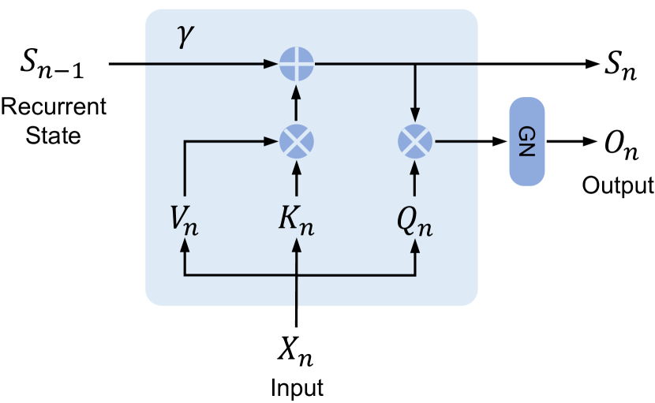
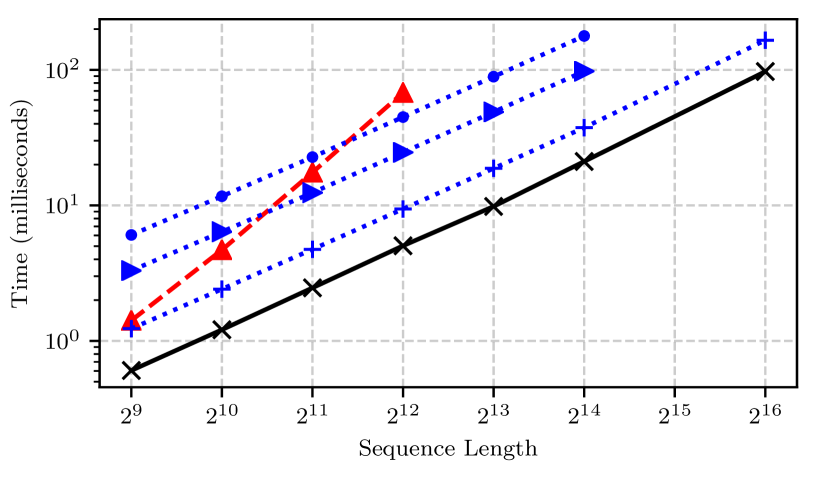
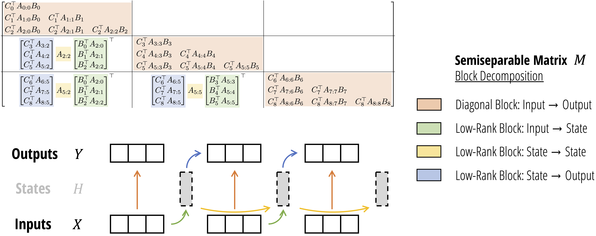
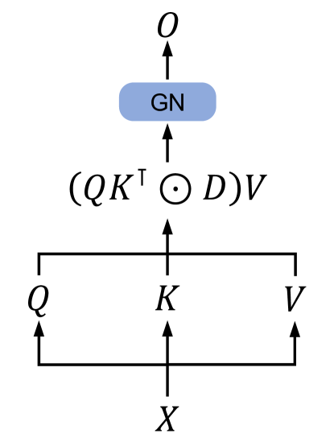
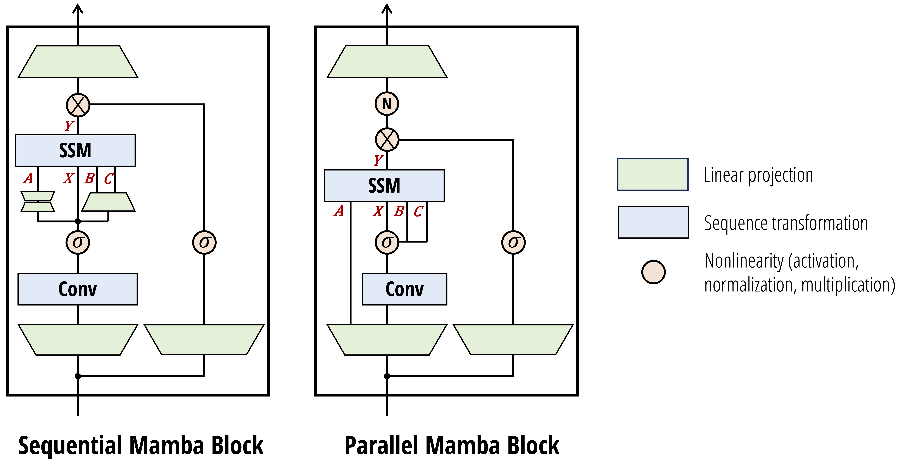

# Linear Attention, Chunkwise Training, and Neural Memory

## Table of Contents

- [[#1. Introduction: Beyond Quadratic Compute and Linear Memory|1. Introduction: Beyond Quadratic Compute and Linear Memory]]
- [[#2. Linear Attention: Removing Softmax|2. Linear Attention: Removing Softmax]]
  - [[#2.1 Factored Dot-Product Attention|2.1 Factored Dot-Product Attention]]
  - [[#2.2 The State Matrix and Recurrence Relation|2.2 The State Matrix and Recurrence Relation]]
  - [[#2.3 Linear RNN Interpretation|2.3 Linear RNN Interpretation]]
  - [[#2.4 Memory Complexity Comparison|2.4 Memory Complexity Comparison]]
- [[#3. Training Efficiency Challenges|3. Training Efficiency Challenges]]
  - [[#3.1 Sequential Recurrence Bottleneck|3.1 Sequential Recurrence Bottleneck]]
  - [[#3.2 Outer-Product Operations and GPU Utilization|3.2 Outer-Product Operations and GPU Utilization]]
  - [[#3.3 IO Overhead from State Materialization|3.3 IO Overhead from State Materialization]]
- [[#4. Chunkwise-Parallel Form|4. Chunkwise-Parallel Form]]
  - [[#4.1 Splitting into Chunks|4.1 Splitting into Chunks]]
  - [[#4.2 Intra-Chunk: Parallel Output Computation|4.2 Intra-Chunk: Parallel Output Computation]]
  - [[#4.3 Inter-Chunk: Recurrent State Passing|4.3 Inter-Chunk: Recurrent State Passing]]
  - [[#4.4 Output Decomposition into Two Parts|4.4 Output Decomposition into Two Parts]]
  - [[#4.5 IO-Aware Implementation|4.5 IO-Aware Implementation]]
- [[#5. Decay and Gating Mechanisms|5. Decay and Gating Mechanisms]]
  - [[#5.1 Motivation: Recency Bias and Bounded Memory|5.1 Motivation: Recency Bias and Bounded Memory]]
  - [[#5.2 Constant Scalar Decay: RetNet|5.2 Constant Scalar Decay: RetNet]]
  - [[#5.3 Scalar Data-Dependent Decay: Mamba-2|5.3 Scalar Data-Dependent Decay: Mamba-2]]
  - [[#5.4 Vector Data-Dependent Gating: GLA|5.4 Vector Data-Dependent Gating: GLA]]
- [[#6. Neural Memory Perspective|6. Neural Memory Perspective]]
  - [[#6.1 Standard Attention as Associative Memory|6.1 Standard Attention as Associative Memory]]
  - [[#6.2 Linear Attention as Online Linear Regression|6.2 Linear Attention as Online Linear Regression]]
  - [[#6.3 Fast Weights and Slow Weights|6.3 Fast Weights and Slow Weights]]
  - [[#6.4 The Delta Rule: Squared-Error Loss and Its Gradient|6.4 The Delta Rule: Squared-Error Loss and Its Gradient]]
- [[#7. References|7. References]]

---

## 1. Introduction: Beyond Quadratic Compute and Linear Memory

Standard softmax attention (see companion note `standard-attention.md`) operates with $O(T^2 d_k)$ time and $O(T^2)$ memory per layer, where $T$ is the sequence length. During training this is managed by FlashAttention-style tiling, but during autoregressive inference a separate bottleneck emerges: the *KV cache*, which stores all $T$ key and value vectors seen so far and grows as $O(T \cdot (d_k + d_v))$ per layer. For a model with $L$ layers, a sequence of length $T = 128\text{k}$, and $d_k = d_v = 128$, this is tens of gigabytes per forward pass — limiting the batch size and thus throughput.

This note addresses the family of architectures that replace softmax attention with a computation that:

1. Maintains a *state matrix* of fixed size $d_k \times d_v$ regardless of $T$, eliminating KV-cache growth.
2. Is expressible as a *recurrence*, enabling $O(1)$ inference-time memory per layer.
3. Admits a *chunkwise-parallel* training algorithm that recovers near-full GPU utilization while remaining mathematically equivalent to the recurrence.

We derive all recurrences from first principles, compare the decay and gating variants introduced by RetNet, Mamba-2, GLA, and RWKV, and close with the *neural memory* / *fast weight programmer* interpretation that places linear attention in a long line of associative memory research.

**Notation.** Scalars are italic ($t$, $\gamma$, $\beta$), vectors are bold ($\mathbf{q}_t$, $\mathbf{k}_t$, $\mathbf{v}_t$), and matrices are bold uppercase ($S_t$, $Q_i$, $K_i$). The sequence length is $T$, chunk size is $C$, key/query dimension is $d_k$, and value dimension is $d_v$. The outer product of column vectors $\mathbf{a} \in \mathbb{R}^m$ and $\mathbf{b} \in \mathbb{R}^n$ is denoted $\mathbf{a} \mathbf{b}^\top \in \mathbb{R}^{m \times n}$; for row vectors $\mathbf{k}_t \in \mathbb{R}^{1 \times d_k}$ we write $\mathbf{k}_t^\top \mathbf{v}_t \in \mathbb{R}^{d_k \times d_v}$. We treat all token vectors as row vectors throughout to align with convention in the literature.

---

## 2. Linear Attention: Removing Softmax

### 2.1 Factored Dot-Product Attention

Recall standard causal (autoregressive) attention. For token $t$, the output is:

$$\mathbf{o}_t = \frac{\sum_{j=1}^{t} \exp(\mathbf{q}_t \mathbf{k}_j^\top / \sqrt{d_k})\, \mathbf{v}_j}{\sum_{j=1}^{t} \exp(\mathbf{q}_t \mathbf{k}_j^\top / \sqrt{d_k})}$$

The softmax nonlinearity prevents factorization: because the normalization denominator couples all $j$, one cannot separate the sum over $j$ from the query $\mathbf{q}_t$.

Katharopoulos et al. (2020) propose replacing the kernel $\exp(\mathbf{q}\mathbf{k}^\top / \sqrt{d_k})$ with a *factored* similarity $\phi(\mathbf{q})\phi(\mathbf{k})^\top$, where $\phi : \mathbb{R}^{d_k} \to \mathbb{R}^r$ is a feature map. This gives:

$$\mathbf{o}_t = \frac{\sum_{j=1}^{t} \phi(\mathbf{q}_t)\phi(\mathbf{k}_j)^\top\, \mathbf{v}_j}{\sum_{j=1}^{t} \phi(\mathbf{q}_t)\phi(\mathbf{k}_j)^\top \cdot \mathbf{1}}$$

Since $\phi(\mathbf{q}_t)$ does not depend on $j$, it factors out of both numerator and denominator:

$$\mathbf{o}_t = \frac{\phi(\mathbf{q}_t) \left(\sum_{j=1}^{t} \phi(\mathbf{k}_j)^\top \mathbf{v}_j\right)}{\phi(\mathbf{q}_t) \left(\sum_{j=1}^{t} \phi(\mathbf{k}_j)^\top\right)}$$

The denominator is a scalar normalizer. In much of the subsequent literature — and throughout this note — the normalizer is dropped or absorbed, and the simplest feature map $\phi(\mathbf{x}) = \mathbf{x}$ (identity) is used. This yields what is most commonly called *linear attention*:

$$\mathbf{o}_t = \mathbf{q}_t \sum_{j=1}^{t} \mathbf{k}_j^\top \mathbf{v}_j$$

*This identity-feature-map form is the starting point for all recurrences below.*

### 2.2 The State Matrix and Recurrence Relation

Define the *state matrix* at time $t$ as the running sum of outer products:

**Definition (Linear Attention State).** Let $\mathbf{k}_j \in \mathbb{R}^{1 \times d_k}$ and $\mathbf{v}_j \in \mathbb{R}^{1 \times d_v}$ be the key and value row vectors at position $j$. The state matrix is:

$$S_t = \sum_{j=1}^{t} \mathbf{k}_j^\top \mathbf{v}_j \in \mathbb{R}^{d_k \times d_v}$$

Each term $\mathbf{k}_j^\top \mathbf{v}_j$ is a rank-1 outer product. The output of linear attention for token $t$ is then:

$$\mathbf{o}_t = \mathbf{q}_t S_t \in \mathbb{R}^{1 \times d_v}$$

From the definition of $S_t$, we immediately derive the recurrence:

$$S_t = S_{t-1} + \mathbf{k}_t^\top \mathbf{v}_t, \qquad S_0 = \mathbf{0}$$

This is a *rank-1 update*: the new state equals the old state plus a single outer product. The update costs $O(d_k \cdot d_v)$ time and the output computation $\mathbf{o}_t = \mathbf{q}_t S_t$ costs the same — both are independent of $T$.

### 2.3 Linear RNN Interpretation

The pair $(S_t, \mathbf{o}_t)$ defines a *recurrent neural network* whose hidden state is the matrix $S_t \in \mathbb{R}^{d_k \times d_v}$:

$$S_t = S_{t-1} + \mathbf{k}_t^\top \mathbf{v}_t, \qquad \mathbf{o}_t = \mathbf{q}_t S_t$$

The transition is linear in $S_{t-1}$ (the coefficient is the identity map), hence the name *linear* attention / linear RNN. This stands in contrast to LSTMs and GRUs, which have nonlinear gating in the state transition. The keys $\mathbf{k}_t$ and values $\mathbf{v}_t$ are the "write" operands and the query $\mathbf{q}_t$ is the "read" operand — a clean read/write decomposition of memory.

*Crucially, the hidden state $S_t$ has dimension $d_k \times d_v$ at every step, regardless of $T$.* During inference one need only store $S_t$, not all past keys and values.

*Figure 3b (Sun et al., 2023): The recurrent form of the retention mechanism. At each step the recurrent state $S_{n-1}$ is scaled by the decay $\gamma$, incremented by the outer product $K_n^\top V_n$ (write), and then read by $Q_n$ to produce output $O_n$. This is exactly the linear attention recurrence $S_t = \gamma S_{t-1} + \mathbf{k}_t^\top \mathbf{v}_t$, $\mathbf{o}_t = \mathbf{q}_t S_t$, making the RNN structure of the state matrix explicit.*

### 2.4 Memory Complexity Comparison

| Scheme | Inference memory per layer |
|---|---|
| Softmax attention (KV cache) | $O(T \cdot (d_k + d_v))$ — grows with $T$ |
| Linear attention (state matrix) | $O(d_k \cdot d_v)$ — constant in $T$ |

**During inference, the linear attention state matrix costs $O(d_k \cdot d_v)$ memory regardless of sequence length, eliminating the KV-cache growth bottleneck.**

For typical values $d_k = d_v = 128$, this is a matrix of $128 \times 128 = 16{,}384$ floats ($\approx 64$ KB per head) — fixed, no matter how long the sequence grows.

*Figure 1 (Katharopoulos et al., 2020): Wall-clock time (ms) versus sequence length for softmax attention (blue, dashed, $O(T^2)$ slope), linear attention (black solid, $O(T)$ slope), and Reformer LSH variants (blue dotted). Linear attention's time grows linearly with $T$, while softmax attention grows quadratically — directly reflecting the constant-memory recurrence versus the KV-cache growth shown in the table above.*

---

## 3. Training Efficiency Challenges

### 3.1 Sequential Recurrence Bottleneck

The recurrence $S_t = S_{t-1} + \mathbf{k}_t^\top \mathbf{v}_t$ is inherently sequential: $S_t$ depends on $S_{t-1}$, which depends on $S_{t-2}$, and so on. During training, where all $T$ tokens are available simultaneously, naive execution of this recurrence requires $T$ sequential steps. This defeats the parallel computation advantage that made softmax attention fast to train via matrix multiplications on GPUs.

By contrast, standard softmax attention processes the full sequence as a single $T \times T$ matrix multiply — all entries of $Q K^\top$ are computed in parallel. The linear recurrence sacrifices this parallelism for the memory advantage.

### 3.2 Outer-Product Operations and GPU Utilization

Each state update $S_t \leftarrow S_{t-1} + \mathbf{k}_t^\top \mathbf{v}_t$ involves a $d_k \times d_v$ outer product. On a GPU, this is a rank-1 update to an $O(d^2)$ matrix — a *memory-bound* operation. The arithmetic intensity (FLOPs per byte transferred) is too low to saturate the tensor cores designed for large matrix multiplies. Running $T$ such updates sequentially compounds the problem: total wall time scales with $T$ even though the total FLOPs are low.

### 3.3 IO Overhead from State Materialization

If one materializes the full state trajectory $\{S_0, S_1, \ldots, S_T\}$ for backpropagation, the memory cost is $O(T \cdot d_k \cdot d_v)$ — the very bottleneck linear attention was meant to avoid. The alternative is gradient checkpointing: recompute $S_t$ from $S_0$ during the backward pass, paying $O(T)$ recomputation cost. Neither option is fully satisfactory for long sequences.

The chunkwise-parallel form in Section 4 resolves all three challenges simultaneously.

---

## 4. Chunkwise-Parallel Form

The key insight is that the linear recurrence can be re-expressed in a *block* form that separates within-chunk (parallel) from between-chunk (sequential) computation. The resulting algorithm — known as the *chunkwise* or *chunkwise-recurrent* form — is mathematically identical to the full recurrence; no approximation is involved.

### 4.1 Splitting into Chunks

Partition the $T$ tokens into $N = T/C$ non-overlapping chunks of size $C$, where $C$ divides $T$. Chunk $i$ contains positions $\{(i-1)C + 1, \ldots, iC\}$. Denote the stacked query, key, and value matrices for chunk $i$ as:

$$Q_i \in \mathbb{R}^{C \times d_k}, \quad K_i \in \mathbb{R}^{C \times d_k}, \quad V_i \in \mathbb{R}^{C \times d_v}$$

Let $S_{i}^\text{end}$ denote the state at the end of chunk $i$ (i.e., at position $iC$), and $S_i^\text{start} = S_{i-1}^\text{end}$ the state entering chunk $i$. Define $S_0^\text{end} = \mathbf{0}$.

### 4.2 Intra-Chunk: Parallel Output Computation

Within chunk $i$, each token $t$ attends only to tokens within the same chunk that precede it (causal masking within the chunk). The output for the $s$-th token inside chunk $i$ (local index $s \in \{1, \ldots, C\}$) from tokens within the same chunk is:

$$\mathbf{o}_s^\text{intra} = \sum_{j=1}^{s} \mathbf{q}_s \mathbf{k}_j^\top \mathbf{v}_j = \mathbf{q}_s \underbrace{\left(\sum_{j=1}^{s} \mathbf{k}_j^\top \mathbf{v}_j\right)}_{\text{partial state within chunk}}$$

In matrix form, stacking all $C$ outputs:

$$O_i^\text{intra} = \underbrace{(Q_i K_i^\top \odot M)}_{\text{lower-triangular masked scores}} V_i \in \mathbb{R}^{C \times d_v}$$

where $M \in \{0, 1\}^{C \times C}$ is a lower-triangular causal mask ($M_{s,j} = 1$ iff $s \geq j$). This is a standard dense matrix multiply — GPU-friendly and fully parallel across all $C \times C$ pairs.

### 4.3 Inter-Chunk: Recurrent State Passing

The state at the end of chunk $i$ is:

$$S_i^\text{end} = S_{i-1}^\text{end} + K_i^\top V_i$$

where $K_i^\top V_i = \sum_{s=1}^{C} \mathbf{k}_{(i-1)C+s}^\top \mathbf{v}_{(i-1)C+s}$ sums the $C$ outer products in chunk $i$. The computation $K_i^\top V_i \in \mathbb{R}^{d_k \times d_v}$ is a matrix multiply of shape $(d_k \times C) \cdot (C \times d_v)$ — again GPU-friendly.

The recurrence $S_i^\text{end} = S_{i-1}^\text{end} + K_i^\top V_i$ is sequential in $i$, but now runs only $N = T/C$ steps rather than $T$ steps. For $C = 64$, this reduces the sequential depth by a factor of 64.

### 4.4 Output Decomposition into Two Parts

Each token inside chunk $i$ also receives contributions from all tokens in chunks $0, 1, \ldots, i-1$ — captured by the state $S_{i-1}^\text{end}$ entering chunk $i$. The inter-chunk contribution for all tokens in chunk $i$ is:

$$O_i^\text{inter} = Q_i \, S_{i-1}^\text{end} \in \mathbb{R}^{C \times d_v}$$

This is a single matrix multiply $(C \times d_k) \cdot (d_k \times d_v)$, again fully parallel.

The total output for chunk $i$ is:

$$O_i = O_i^\text{inter} + O_i^\text{intra} = Q_i S_{i-1}^\text{end} + (Q_i K_i^\top \odot M) V_i$$

**This decomposition is exact: it equals the output one would obtain by running the full token-level recurrence, with no approximation.**

*Proof sketch.* For the $s$-th token in chunk $i$ (absolute index $t = (i-1)C + s$):

$$\mathbf{o}_t = \mathbf{q}_t S_t = \mathbf{q}_t \left( S_{i-1}^\text{end} + \sum_{j=1}^{s} \mathbf{k}_{(i-1)C+j}^\top \mathbf{v}_{(i-1)C+j} \right) = \underbrace{\mathbf{q}_t S_{i-1}^\text{end}}_{\text{inter}} + \underbrace{\mathbf{q}_t \sum_{j=1}^{s} \mathbf{k}_j^\top \mathbf{v}_j}_{\text{intra}}$$

Stacking over $s = 1, \ldots, C$ gives $O_i = O_i^\text{inter} + O_i^\text{intra}$. $\square$

### 4.5 IO-Aware Implementation

The chunkwise form lends itself to a FlashAttention-style tiling strategy (used in FlashLinearAttention / GLA). The key observations are:

1. The state $S_i^\text{end} \in \mathbb{R}^{d_k \times d_v}$ is reused for $O_i^\text{inter}$ of the next chunk. It fits in SRAM for typical head dimensions.
2. The intra-chunk computation $(Q_i K_i^\top \odot M) V_i$ is a local $(C \times C)$ attention with $C \ll T$, fitting the $Q_i, K_i, V_i$ blocks in SRAM.
3. The inter-chunk state update $S_i \leftarrow S_{i-1} + K_i^\top V_i$ reduces to a single $(d_k \times C) \cdot (C \times d_v)$ GEMM per chunk.

By fusing all four operations (state update, $O_i^\text{inter}$, masked intra-chunk attention, output accumulation) into a single kernel, HBM reads/writes are minimized. This is the approach of Yang et al.'s FlashLinearAttention algorithm.

*Figure (Dao & Gu, 2024): The SSD chunkwise algorithm. Top: the output matrix $Y = MX$ where $M$ is a semiseparable matrix, shown tiled into four block types — orange (diagonal intra-chunk, computed as masked attention), green (low-rank input-to-state), yellow (low-rank state-to-state recurrence), and blue (low-rank state-to-output). Bottom: the corresponding data-flow — inputs $X$ are processed within each chunk (intra), states $H$ accumulate across chunks (inter), and outputs $Y$ combine both contributions. This decomposition is exactly the chunkwise form $O_i = Q_i S_{i-1}^\text{end} + (Q_i K_i^\top \odot M)V_i$ derived above.*

---

## 5. Decay and Gating Mechanisms

### 5.1 Motivation: Recency Bias and Bounded Memory

In pure linear attention, all past tokens contribute equally to the state $S_t$: older outer products are never discounted. For long sequences this causes the state to be dominated by the earliest tokens, since contributions accumulate without bound. A *decay* factor $\gamma \in (0, 1)$ multiplies the state at each step, exponentially downweighting older information and introducing a *recency bias*.

Algebraically, the state with decay satisfies:

$$S_t = \gamma S_{t-1} + \mathbf{k}_t^\top \mathbf{v}_t$$

Unrolling $n$ steps: $S_t = \sum_{j=1}^{t} \gamma^{t-j} \mathbf{k}_j^\top \mathbf{v}_j$. The contribution of token $j$ decays exponentially as $\gamma^{t-j}$, so the effective memory horizon is $\approx (1-\gamma)^{-1}$ tokens.

### 5.2 Constant Scalar Decay: RetNet

Sun et al. (2023) introduced the *Retentive Network* (RetNet), in which the state transition uses a fixed scalar decay $\gamma \in (0,1)$ combined with complex-valued rotary encodings. In the simplified scalar form:

**Definition (RetNet Retention).** The retention state satisfies:

$$S_t = \gamma S_{t-1} + \mathbf{k}_t^\top \mathbf{v}_t, \qquad \mathbf{o}_t = \mathbf{q}_t S_t$$

where $\gamma$ is a head-specific constant (different heads use different decay values). The parallel form writes the full-sequence output as:

$$O = (Q K^\top \odot D) V$$

where $D \in \mathbb{R}^{T \times T}$ is the decay mask with $D_{t,j} = \gamma^{t-j}$ for $t \geq j$ and $0$ otherwise. RetNet assigns $\gamma_h = 1 - 2^{-(5+h)}$ for head $h$, giving a geometric spread of memory horizons across heads.

The chunkwise form of RetNet accumulates the decayed state at chunk boundaries. Letting $B = C$ be chunk size and $R_{i-1}$ the state entering chunk $i$:

$$R_i = \gamma^C R_{i-1} + K_i^\top (V_i \odot \zeta_i)$$

where $\zeta_i$ is a per-token decay weight within the chunk. The factor $\gamma^C$ discounts the entire previous state by the chunk length.

*The constant $\gamma$ is never updated at inference time — it is a fixed hyperparameter, not a learned function of the input.* This is both its strength (no input-dependent overhead) and its weakness (the effective memory horizon is fixed and cannot adapt to content).

*Figure 3a (Sun et al., 2023): The parallel representation of retention. Input $X$ is projected to $Q$, $K$, $V$; the output is $(QK^\top \odot D)V$ where $D$ is the decay mask with $D_{t,j} = \gamma^{t-j}$; GroupNorm (GN) normalizes the result. This is the training-time parallel form of the RetNet recurrence — a standard masked matrix multiply with a geometric decay mask in place of the usual binary causal mask.*

### 5.3 Scalar Data-Dependent Decay: Mamba-2

Dao and Gu (2024) introduce the *State Space Duality* (SSD) framework in Mamba-2. The key architectural change is making the decay a *scalar* function of the input at each step:

**Definition (SSD Layer).** The SSD recurrence is:

$$S_t = a_t S_{t-1} + \mathbf{b}_t^\top x_t, \qquad y_t = \mathbf{c}_t S_t$$

where $a_t \in \mathbb{R}$ is a scalar derived from input $x_t$ (typically $a_t = \sigma(w_a^\top x_t)$ for some learned vector $w_a$), and $\mathbf{b}_t, \mathbf{c}_t$ are the data-dependent key and query analogues.

The *scalar-times-identity* constraint on $A$ — that is, $A_t = a_t I_{d_k}$ where $I_{d_k}$ is the identity matrix — distinguishes SSD from earlier SSMs (which allow fully diagonal or even dense $A_t$). This constraint is what makes the connection to linear attention exact and enables a tensor-core-friendly chunkwise algorithm.

In attention notation with $a_t = \gamma_t$ (data-dependent scalar decay):

$$S_t = \gamma_t S_{t-1} + \mathbf{k}_t^\top \mathbf{v}_t, \qquad \mathbf{o}_t = \mathbf{q}_t S_t$$

The parallel (attention-form) dual constructs a lower-triangular matrix $L \in \mathbb{R}^{T \times T}$:

$$L_{t,j} = \prod_{s=j+1}^{t} \gamma_s \quad (t \geq j), \qquad L_{t,j} = 0 \quad (t < j)$$

Then $O = (L \odot Q K^\top) V$, which is a *structured masked attention* that generalizes RetNet's geometric decay mask. **The scalar constraint on $A_t$ is precisely what preserves the matrix-multiply structure in $L$**, keeping the chunkwise algorithm hardware-efficient.

*Figure (Dao & Gu, 2024): The Mamba-2 block in sequential (left) and parallel (right) forms. The SSM parameters $A$ (scalar decay), $X$ (input), $B$ (key analogue), and $C$ (query analogue) are produced by learned projections; the gating $\sigma$ on the right branch creates the SiLU-gated output. The key architectural change from Mamba-1 is that $A$, $B$, $C$ are now computed in parallel from the same input, making the block compatible with the tensor-parallel training setup required by the SSD chunkwise algorithm.*

### 5.4 Vector Data-Dependent Gating: GLA

Yang et al. (2024) introduce *Gated Linear Attention* (GLA), which generalizes the scalar gate to a vector-valued gate while preserving the outer-product structure of the state update:

**Definition (GLA State Update).** The GLA recurrence uses element-wise gates:

$$S_t = (\boldsymbol{\alpha}_t \boldsymbol{\beta}_t^\top) \odot S_{t-1} + \mathbf{k}_t^\top \mathbf{v}_t$$

where $\boldsymbol{\alpha}_t \in \mathbb{R}^{d_k}$ and $\boldsymbol{\beta}_t \in \mathbb{R}^{d_v}$ are data-dependent vectors, and $\odot$ denotes element-wise (Hadamard) multiplication. The gate matrix $\boldsymbol{\alpha}_t \boldsymbol{\beta}_t^\top \in \mathbb{R}^{d_k \times d_v}$ is rank-1, which is the crucial structural property.

*Why must the gate be rank-1?* If the gate were an arbitrary matrix $G_t \in \mathbb{R}^{d_k \times d_v}$, the state update $G_t \odot S_{t-1}$ would break the outer-product recurrence: the chunkwise state $K_i^\top V_i$ would no longer have a clean matrix-multiply form when propagated through the gate. The rank-1 factorization $\boldsymbol{\alpha}_t \boldsymbol{\beta}_t^\top$ ensures the cumulative gate across a chunk is still an outer product, preserving the $(d_k \times C)(C \times d_v)$ GEMM structure in the FlashLinearAttention kernel.

Computing $\boldsymbol{\alpha}_t$ and $\boldsymbol{\beta}_t$ from input $x_t$ via a learned linear map adds minimal overhead. GLA empirically outperforms RetNet and standard linear attention while achieving training speed competitive with FlashAttention-2.

RWKV-6 (Peng et al., 2024) uses a related vector gating scheme, applying data-dependent linear interpolation (*ddlerp*) to construct per-channel decay vectors, combined with LoRA-style low-rank adaptation for efficiency.

<!-- Figure from Yang et al. (2024) "Gated Linear Attention" (arXiv 2312.06635) unavailable: ar5iv HTML conversion failed with fatal error; no accessible preprint figure source found -->

---

## 6. Neural Memory Perspective

### 6.1 Standard Attention as Associative Memory

Softmax attention can be viewed as a *content-addressable memory* (Hopfield network interpretation). The context stores $T$ key-value pairs $\{(\mathbf{k}_j, \mathbf{v}_j)\}_{j=1}^T$. Given a query $\mathbf{q}_t$, the attention mechanism retrieves:

$$\mathbf{o}_t = \sum_{j=1}^{t} \underbrace{\text{softmax}_j(\mathbf{q}_t \mathbf{k}_j^\top / \sqrt{d_k})}_{\text{retrieval weight}} \mathbf{v}_j$$

With high temperature, this approaches nearest-neighbor retrieval: all weight concentrates on the most similar key. The key-value pairs are stored *explicitly* in memory (the KV cache), so retrieval is exact but memory cost is $O(T)$.

### 6.2 Linear Attention as Online Linear Regression

The linear attention state matrix $S_t$ can be interpreted as the weight matrix of a *linear regression model* trained online to map keys to values.

**Claim:** The recurrence $S_t = S_{t-1} + \mathbf{k}_t^\top \mathbf{v}_t$ is a single step of stochastic gradient descent on the loss $\mathcal{L}_t(S) = -\mathbf{q}_t \cdot \mathbf{k}_t S^\top$ (with $\mathbf{q}_t = \mathbf{k}_t$ and unit step size).

*Derivation.* Consider the negative dot-product loss:

$$\mathcal{L}_t(S) = -\langle S \mathbf{k}_t^\top, \mathbf{v}_t^\top \rangle = -\mathbf{v}_t S \mathbf{k}_t^\top$$

Taking the gradient with respect to $S$:

$$\nabla_S \mathcal{L}_t = -\mathbf{k}_t^\top \mathbf{v}_t$$

The gradient descent update with step size $\eta = 1$ is:

$$S_t = S_{t-1} - \nabla_S \mathcal{L}_t = S_{t-1} + \mathbf{k}_t^\top \mathbf{v}_t$$

which is exactly the linear attention update. *However, this loss is unconstrained and can decrease without bound*, making training unstable. The squared error loss in Section 6.4 corrects this.

### 6.3 Fast Weights and Slow Weights

Schmidhuber (1992) introduced the *fast weight* concept: a neural system with two timescales of weight change. The *slow weights* ($W_Q, W_K, W_V, W_O$) are learned by gradient descent over many training examples and encode general-purpose inductive biases. The *fast weights* ($S_t$) are updated at inference time, within a single forward pass, to encode information from the current context.

In the linear attention framework:

- **Slow weights:** $W_Q$, $W_K$, $W_V$, $W_O$ — learned at training time, fixed at inference time.
- **Fast weights:** $S_t$ — initialized to zero at the start of each sequence, updated at every token via $S_t = S_{t-1} + \mathbf{k}_t^\top \mathbf{v}_t$ (or with gating/decay).

The query $\mathbf{q}_t = \mathbf{x}_t W_Q$ reads from the fast weight memory: $\mathbf{o}_t = \mathbf{q}_t S_t$. The key-value pair $(\mathbf{k}_t, \mathbf{v}_t)$ writes to it.

*Schlag et al. (2021) formalized this connection*, proving that linear transformers are exactly fast weight programmers with additive outer-product update rules.

### 6.4 The Delta Rule: Squared-Error Loss and Its Gradient

The instability of the negative dot-product loss motivates using the squared error:

**Definition (Online Squared-Error Loss).** At step $t$, define the loss as the squared discrepancy between the current prediction of $S_{t-1}$ applied to $\mathbf{k}_t$ and the target value $\mathbf{v}_t$:

$$\mathcal{L}_t(S) = \frac{1}{2} \| S_{t-1} \mathbf{k}_t^\top - \mathbf{v}_t^\top \|^2$$

*Derivation of the update rule.* The gradient of $\mathcal{L}_t$ with respect to $S$ evaluated at $S = S_{t-1}$ is:

$$\nabla_S \mathcal{L}_t\big|_{S=S_{t-1}} = (S_{t-1} \mathbf{k}_t^\top - \mathbf{v}_t^\top) \mathbf{k}_t = S_{t-1} \mathbf{k}_t^\top \mathbf{k}_t - \mathbf{v}_t^\top \mathbf{k}_t$$

Transposing (to match the $d_k \times d_v$ convention for $S$):

$$\nabla_S \mathcal{L}_t = \mathbf{k}_t^\top (S_{t-1} \mathbf{k}_t^\top)^\top \mathbf{k}_t - \mathbf{k}_t^\top \mathbf{v}_t$$

Gradient descent with step size $\beta_t$ gives:

$$S_t = S_{t-1} - \beta_t \nabla_S \mathcal{L}_t = S_{t-1} + \beta_t \mathbf{k}_t^\top \mathbf{v}_t - \beta_t \mathbf{k}_t^\top \mathbf{k}_t S_{t-1}$$

Factoring:

$$S_t = S_{t-1} + \beta_t \mathbf{k}_t^\top (\mathbf{v}_t - \mathbf{k}_t S_{t-1})$$

**Definition (Delta Rule Update).** The update $S_t = S_{t-1} + \beta_t \mathbf{k}_t^\top (\mathbf{v}_t - \mathbf{k}_t S_{t-1})$ is the *delta rule* (Widrow-Hoff rule) applied to fast weight memory.

The term $\mathbf{k}_t S_{t-1}$ is the *current prediction*: what the memory $S_{t-1}$ would output if queried with $\mathbf{k}_t$. The correction $\mathbf{v}_t - \mathbf{k}_t S_{t-1}$ is the *prediction error*. The state is updated proportionally to this error, projected back via $\mathbf{k}_t^\top$.

Comparing to standard linear attention:

| Variant | Update Rule | Loss | Behavior |
|---|---|---|---|
| Linear attention | $S_t = S_{t-1} + \mathbf{k}_t^\top \mathbf{v}_t$ | Negative dot-product | Additive, no error correction |
| Delta rule (DeltaNet) | $S_t = S_{t-1} + \beta_t \mathbf{k}_t^\top (\mathbf{v}_t - \mathbf{k}_t S_{t-1})$ | Squared error | Corrects prediction error before writing |

*When $\mathbf{k}_t S_{t-1} = \mathbf{0}$ (empty memory or orthogonal keys), the delta rule reduces to linear attention.* When memory is non-empty, the delta rule first subtracts the existing association before writing the new one — preventing overwriting conflicts and maintaining better key-value fidelity over long contexts.

**The delta rule introduces an implicit "erase-then-write" dynamic that linear attention lacks, giving the state matrix higher effective capacity at the cost of a $\mathbf{k}_t S_{t-1}$ matrix-vector product per step.**

---

## 7. References

| Reference Name | Brief Summary | Link to Reference |
|---|---|---|
| Katharopoulos et al. (2020), "Transformers are RNNs: Fast Autoregressive Transformers with Linear Attention" | Introduces linear attention via kernel feature maps; proves equivalence to RNNs; derives the state matrix recurrence | [arxiv.org/abs/2006.16236](https://arxiv.org/abs/2006.16236) |
| Sun et al. (2023), "Retentive Network: A Successor to Transformer for Large Language Models" | Introduces RetNet with constant scalar decay $\gamma$; parallel, recurrent, and chunkwise computation paradigms | [arxiv.org/abs/2307.08621](https://arxiv.org/abs/2307.08621) |
| Dao & Gu (2024), "Transformers are SSMs: Generalized Models and Efficient Algorithms through Structured State Space Duality" | Unifies SSMs and attention via SSD; scalar data-dependent decay; chunkwise algorithm leveraging matrix multiplies | [arxiv.org/abs/2405.21060](https://arxiv.org/abs/2405.21060) |
| Yang et al. (2024), "Gated Linear Attention Transformers with Hardware-Efficient Training" | Introduces GLA with vector data-dependent gating (rank-1 gate structure); FlashLinearAttention kernel | [arxiv.org/abs/2312.06635](https://arxiv.org/abs/2312.06635) |
| Peng et al. (2024), "Eagle and Finch: RWKV with Matrix-Valued States and Dynamic Recurrence" | RWKV-5/6 architecture; data-dependent vector gating via ddlerp and LoRA-style adaptation | [arxiv.org/abs/2404.05892](https://arxiv.org/abs/2404.05892) |
| Schlag, Irie & Schmidhuber (2021), "Linear Transformers Are Secretly Fast Weight Programmers" | Proves formal equivalence between linear transformers and fast weight programmers; introduces delta rule update | [arxiv.org/abs/2102.11174](https://arxiv.org/abs/2102.11174) |
| Schmidhuber (1992), "Learning to Control Fast-Weight Memories: An Alternative to Dynamic Recurrent Networks" | Original fast weight paper: two-timescale network where one net programs weights of another via outer products | [people.idsia.ch/~juergen/fastweights](https://people.idsia.ch/~juergen/fastweights/ncfastweightsrev.html) |
| Yang, Songlin — "DeltaNet Explained (Part I)" | Blog derivation of the delta rule from squared-error loss; comparison with linear attention update | [sustcsonglin.github.io/blog/2024/deltanet-1](https://sustcsonglin.github.io/blog/2024/deltanet-1/) |
| Goomba Lab — "State Space Duality (Mamba-2) Part I: The Model" | Official blog post; scalar-times-identity $A$ constraint; attention-form dual of SSD | [goombalab.github.io/blog/2024/mamba2-part1-model](https://goombalab.github.io/blog/2024/mamba2-part1-model/) |
| Goomba Lab — "State Space Duality (Mamba-2) Part III: The Algorithm" | Four-step chunkwise algorithm for SSD; intra-chunk parallel, inter-chunk sequential; IO analysis | [goombalab.github.io/blog/2024/mamba2-part3-algorithm](https://goombalab.github.io/blog/2024/mamba2-part3-algorithm/) |
| Ba et al. (2016), "Using Fast Weights to Attend to the Recent Past" | NeurIPS 2016 paper reviving fast-weight memories as a context-attention mechanism; key conceptual bridge between Schmidhuber (1992) and modern linear attention | [arxiv.org/abs/1610.06258](https://arxiv.org/abs/1610.06258) |
| Irie et al. (2021), "Going Beyond Linear Transformers with Recurrent Fast Weight Programmers" | Adds recurrence to both the slow and fast networks; demonstrates gating and non-linear state updates improve expressivity — conceptually anticipates GLA decay mechanisms | [arxiv.org/abs/2106.06295](https://arxiv.org/abs/2106.06295) |
| Choromanski et al. (2021), "Rethinking Attention with Performers" | Introduces FAVOR+, approximating the softmax kernel via positive random orthogonal features to yield unbiased linear-complexity attention; the random-feature complement to deterministic kernel maps | [arxiv.org/abs/2009.14794](https://arxiv.org/abs/2009.14794) |
| Gu et al. (2022), "Efficiently Modeling Long Sequences with Structured State Spaces" (S4) | Establishes the structured SSM framework with HiPPO initialization and Cauchy kernel computation; the mathematical backbone that Mamba-1 and Mamba-2 build on | [arxiv.org/abs/2111.00396](https://arxiv.org/abs/2111.00396) |
| Peng et al. (2023), "RWKV: Reinventing RNNs for the Transformer Era" | RWKV-4 with a time-decay mechanism on keys enabling parallel training and O(1) RNN inference; direct architectural precursor to RWKV-6 | [arxiv.org/abs/2305.13048](https://arxiv.org/abs/2305.13048) |
| Behrouz et al. (2025), "Titans: Learning to Memorize at Test Time" | Introduces a neural long-term memory module trained via gradient-based test-time updates, framing attention as short-term memory and the fast-weight store as long-term memory | [arxiv.org/abs/2501.00663](https://arxiv.org/abs/2501.00663) |
