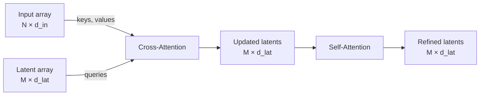

# Perceiver: Latent Cross-Attention

## Table of Contents

- [[#1. Motivation — The Quadratic Bottleneck|1. Motivation — The Quadratic Bottleneck]]
- [[#2. Architecture Overview|2. Architecture Overview]]
- [[#3. The Latent Array|3. The Latent Array]]
- [[#4. Cross-Attention: Input → Latents|4. Cross-Attention: Input → Latents]]
  - [[#4.1 Formal Definition|4.1 Formal Definition]]
  - [[#4.2 Worked Example|4.2 Worked Example]]
- [[#5. Self-Attention Among Latents|5. Self-Attention Among Latents]]
- [[#6. Stacking Blocks|6. Stacking Blocks]]
- [[#7. Complexity Analysis|7. Complexity Analysis]]
- [[#8. References|8. References]]

---

## 1. Motivation — The Quadratic Bottleneck 📐

Standard transformer self-attention on an input of length $N$ computes all pairwise interactions between tokens, giving $O(N^2)$ cost per layer. For long sequences — images flattened to pixels, audio waveforms, long documents — this is prohibitive.

The Perceiver (Jaegle et al., 2021) breaks this bottleneck with a simple architectural change: instead of letting the input attend to itself, a small fixed-size set of *latent tokens* attends to the input via *cross-attention*. The expensive self-attention then operates only on these latents, whose count $M$ is chosen freely and held fixed regardless of input length $N$.

> [!NOTE] Relationship to existing notes
> The quadratic cost of self-attention is analyzed in depth in [[attention-efficiency|KV Cache Efficiency Techniques]]. The Perceiver attacks a different axis of the same problem: reducing the cost at training time for variable-length or very long inputs, rather than caching at inference time.

---

## 2. Architecture Overview 🗺️

A single Perceiver block consists of two sub-layers applied in sequence:

This block is repeated $B$ times. Each repetition re-reads the original input array via cross-attention, allowing the latents to iteratively refine their representation.

---

## 3. The Latent Array 🔑

**Definition (Latent Array).** The *latent array* $\mathbf{Z} \in \mathbb{R}^{M \times d_\text{lat}}$ is a matrix of $M$ learned vectors, initialized randomly and updated by gradient descent during training. The integer $M$ is a hyperparameter chosen independently of the input length $N$.

The latent tokens are not tied to any input position. They carry no intrinsic semantic meaning at initialization — they learn, through training, to act as flexible *query vectors* that extract task-relevant summaries from the input.

> [!INFO] Intuition
> Think of each latent token as a blank sticky note the model carries around. During cross-attention, each note "reads" the entire input and writes down whatever it found useful. After training, different latents tend to specialize in different aspects of the input (entities, syntax, relations), though this specialization is emergent, not prescribed.

---

## 4. Cross-Attention: Input → Latents 📐

### 4.1 Formal Definition

Let the input array be $\mathbf{X} \in \mathbb{R}^{N \times d_\text{in}}$ and the latent array be $\mathbf{Z} \in \mathbb{R}^{M \times d_\text{lat}}$.

**Definition (Perceiver Cross-Attention).** Queries are projected from the latents; keys and values are projected from the input:

$$
\mathbf{Q} = \mathbf{Z} \mathbf{W}_Q \in \mathbb{R}^{M \times d_k}, \qquad
\mathbf{K} = \mathbf{X} \mathbf{W}_K \in \mathbb{R}^{N \times d_k}, \qquad
\mathbf{V} = \mathbf{X} \mathbf{W}_V \in \mathbb{R}^{N \times d_v}
$$

The cross-attention output is:

$$
\text{CrossAttn}(\mathbf{Z}, \mathbf{X}) = \text{softmax}\!\left(\frac{\mathbf{Q}\mathbf{K}^\top}{\sqrt{d_k}}\right) \mathbf{V} \in \mathbb{R}^{M \times d_v}
$$

The attention weight matrix $\mathbf{A} = \text{softmax}(\mathbf{Q}\mathbf{K}^\top / \sqrt{d_k}) \in \mathbb{R}^{M \times N}$ has one row per latent and one column per input token. Entry $\mathbf{A}_{ij}$ is the weight latent $i$ assigns to input token $j$.

**The output shape is $M \times d_v$** — the same number of rows as latents, regardless of $N$.

### 4.2 Worked Example

*Sentence:* `"The cat sat on the mat"` → $N = 6$ token embeddings, $d_\text{in} = 64$.
*Latent array:* $M = 4$ latents, $d_\text{lat} = 64$.

After projecting to $d_k = d_v = 32$:

$$
\mathbf{A} \approx \begin{pmatrix}
0.05 & \mathbf{0.60} & 0.10 & 0.05 & 0.05 & 0.15 \\
0.10 & 0.05 & \mathbf{0.65} & 0.05 & 0.05 & 0.10 \\
\mathbf{0.50} & 0.10 & 0.05 & 0.10 & 0.20 & 0.05 \\
0.05 & 0.05 & 0.05 & 0.10 & 0.05 & \mathbf{0.70}
\end{pmatrix}
$$

Each row sums to 1. In this illustration: latent 0 specializes on *"cat"*, latent 1 on *"sat"*, latent 2 on *"The/the"*, latent 3 on *"mat"*. The updated latent 0 is approximately $0.60 \cdot \mathbf{v}_\text{cat} + 0.15 \cdot \mathbf{v}_\text{mat} + \cdots$, a learned weighted aggregate of input vectors.

> [!WARNING] Asymmetry
> This cross-attention is *asymmetric*: queries come from the small latent array ($M$ rows), keys and values come from the large input ($N$ rows). This is the opposite of the "query from input" framing in standard self-attention. Do not conflate the two.

> [!QUESTION] Exercise 1: Shape Accounting
> *Cross-attention maps two arrays of different sizes to a single output.*
>
> > **Prerequisites:** [[#4.1 Formal Definition|§4.1 Formal Definition]]
>
> Given input $\mathbf{X} \in \mathbb{R}^{1024 \times 512}$, latent array $\mathbf{Z} \in \mathbb{R}^{64 \times 512}$, projection dimensions $d_k = d_v = 128$:
> 1. State the shapes of $\mathbf{Q}$, $\mathbf{K}$, $\mathbf{V}$, and the attention weight matrix $\mathbf{A}$.
> 2. What is the shape of the cross-attention output?
> 3. If we increase $N$ from 1024 to 8192, which of these shapes change?

> [!TIP]- Solution to Exercise 1
> **Key insight:** The output shape is always $M \times d_v$, determined by the latent count, not the input length.
>
> **Sketch:**
> 1. $\mathbf{Q} \in \mathbb{R}^{64 \times 128}$, $\mathbf{K} \in \mathbb{R}^{1024 \times 128}$, $\mathbf{V} \in \mathbb{R}^{1024 \times 128}$, $\mathbf{A} \in \mathbb{R}^{64 \times 1024}$.
> 2. Output $\in \mathbb{R}^{64 \times 128}$.
> 3. $\mathbf{K}$, $\mathbf{V}$, and $\mathbf{A}$ grow (second dimension becomes 8192). $\mathbf{Q}$ and the output are unchanged — they depend only on $M$.

---

## 5. Self-Attention Among Latents 🔄

After cross-attention, the $M$ updated latent vectors are passed through standard multi-head self-attention:

$$
\mathbf{Z}' = \text{SelfAttn}(\mathbf{Z}_\text{updated}) \in \mathbb{R}^{M \times d_\text{lat}}
$$

This costs $O(M^2 \cdot d_\text{lat})$. Since $M \ll N$, this is the cheap step. Its role is to let latents communicate with each other — so that the "cat" latent and the "sat" latent can form a joint representation of the subject-verb pair, for instance.

> [!EXAMPLE] Intuition
> Cross-attention is *extraction*: each latent independently reads the input. Self-attention is *integration*: latents share what they extracted and refine it jointly. Together they implement a two-phase "read then reason" loop.

> [!QUESTION] Exercise 2: Latent Count Trade-off
> *Choosing $M$ balances expressiveness against cost.*
>
> > **Prerequisites:** [[#5. Self-Attention Among Latents|§5 Self-Attention Among Latents]], [[#7. Complexity Analysis|§7 Complexity Analysis]]
>
> Suppose $N = 4096$, $d_k = d_v = d_\text{lat} = 256$, and $B = 8$ blocks. Compute the total cross-attention and self-attention FLOPs (ignoring projection costs) for $M = 32$ and $M = 512$. At what $M$ does self-attention cost exceed cross-attention cost?

> [!TIP]- Solution to Exercise 2
> **Key insight:** Self-attention cost scales as $M^2$ while cross-attention scales as $M \cdot N$; they cross when $M = N$.
>
> **Sketch:** Per block: cross-attention $\approx 2 M N d_k$, self-attention $\approx 2 M^2 d_k$ (standard dot-product FLOP count).
>
> For $M=32$: cross $= 2 \cdot 32 \cdot 4096 \cdot 256 \approx 67\text{M}$; self $= 2 \cdot 32^2 \cdot 256 \approx 0.5\text{M}$.
> For $M=512$: cross $= 2 \cdot 512 \cdot 4096 \cdot 256 \approx 1.07\text{B}$; self $= 2 \cdot 512^2 \cdot 256 \approx 134\text{M}$.
>
> They equalize when $M \cdot N = M^2$, i.e. $M = N = 4096$ — well beyond any practical latent count. Self-attention is always the cheaper step for sensible $M$.

---

## 6. Stacking Blocks 🏗️

A full Perceiver stacks $B$ blocks:

$$
\mathbf{Z}^{(b)} = \text{SelfAttn}\!\left(\text{CrossAttn}\!\left(\mathbf{Z}^{(b-1)},\ \mathbf{X}\right)\right), \quad b = 1, \ldots, B
$$

where $\mathbf{Z}^{(0)}$ is the learned initial latent array. **The same input $\mathbf{X}$ is re-read at every block** — the latents iteratively refine their summary of the input over $B$ steps.

> [!NOTE] Weight sharing across blocks
> In the original Perceiver, the cross-attention weights are optionally *shared* across blocks (the same $\mathbf{W}_Q, \mathbf{W}_K, \mathbf{W}_V$ for every block). This dramatically reduces parameter count and implicitly encourages the model to learn a fixed "reading strategy" rather than a different strategy at each depth.

---

## 7. Complexity Analysis ⚡

Per block, with input length $N$, latent count $M$, and hidden dimension $d$:

| Operation | Cost | Bottleneck |
|---|---|---|
| Cross-attention ($\mathbf{Q}\mathbf{K}^\top$) | $O(M \cdot N \cdot d)$ | scales with $N$ |
| Self-attention (latents only) | $O(M^2 \cdot d)$ | independent of $N$ |

Total over $B$ blocks: $O(B \cdot M \cdot N \cdot d + B \cdot M^2 \cdot d)$.

Compare to a vanilla transformer: $O(B \cdot N^2 \cdot d)$.

**For $M = 512$, $N = 65536$ (e.g., a 256×256 image flattened):**

$$
\frac{N^2}{M \cdot N} = \frac{N}{M} = \frac{65536}{512} = 128\times \text{ reduction in cross-attention cost}
$$

**Key conclusion: the Perceiver's complexity is linear in $N$ (for fixed $M$), not quadratic.** This enables the same architecture to process images, audio, video, and text with no input-specific engineering.

---

## 8. References 📚

| Reference Name | Brief Summary | Link |
|---|---|---|
| Jaegle et al., 2021 — *Perceiver: General Perception with Iterative Attention* | Original Perceiver paper; introduces latent cross-attention for multimodal perception | [arXiv:2103.03206](https://arxiv.org/abs/2103.03206) |
| Jaegle et al., 2022 — *Perceiver IO: A General Architecture for Structured Inputs & Outputs* | Extends Perceiver to structured output decoding via a second cross-attention from latents to output queries | [arXiv:2107.14795](https://arxiv.org/abs/2107.14795) |
| Vaswani et al., 2017 — *Attention Is All You Need* | Original transformer paper; defines the self-attention and cross-attention operations the Perceiver builds on | [arXiv:1706.03762](https://arxiv.org/abs/1706.03762) |
