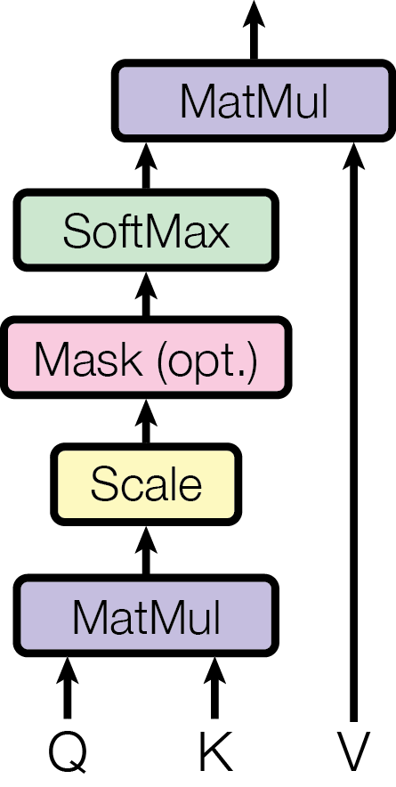

# Standard Softmax Attention Mechanisms

## Table of Contents

- [[#1. Introduction and Motivation|1. Introduction and Motivation]]
- [[#2. Single-Head Scaled Dot-Product Attention|2. Single-Head Scaled Dot-Product Attention]]
  - [[#2.1 Query, Key, Value Projections|2.1 Query, Key, Value Projections]]
  - [[#2.2 Attention Score Computation and Causal Masking|2.2 Attention Score Computation and Causal Masking]]
  - [[#2.3 Softmax Normalization and Weighted Aggregation|2.3 Softmax Normalization and Weighted Aggregation]]
  - [[#2.4 Output Projection and Residual Connection|2.4 Output Projection and Residual Connection]]
- [[#3. Matrix Form of Attention|3. Matrix Form of Attention]]
- [[#4. Multi-Head Attention|4. Multi-Head Attention]]
- [[#5. KV Caching|5. KV Caching]]
  - [[#5.1 Motivation: Avoiding Redundant Computation During Decoding|5.1 Motivation: Avoiding Redundant Computation During Decoding]]
  - [[#5.2 Memory Growth with Sequence Length|5.2 Memory Growth with Sequence Length]]
  - [[#5.3 Variants: GQA, MLA, and Sparse Attention|5.3 Variants: GQA, MLA, and Sparse Attention]]
- [[#6. Memory-Efficient Exact Attention|6. Memory-Efficient Exact Attention]]
  - [[#6.1 The Core Observation: Deferred Normalization|6.1 The Core Observation: Deferred Normalization]]
  - [[#6.2 Numerical Stability via Online Softmax|6.2 Numerical Stability via Online Softmax]]
  - [[#6.3 Tiling for Practical O(sqrt n) Memory|6.3 Tiling for Practical O(sqrt n) Memory]]
  - [[#6.4 Backpropagation via Recomputation|6.4 Backpropagation via Recomputation]]
  - [[#6.5 Relation to FlashAttention|6.5 Relation to FlashAttention]]
- [[#7. References|7. References]]

---

## 1. Introduction and Motivation

Modern language models process text as a sequence of discrete tokens. After embedding, each token is represented as a vector in $\mathbb{R}^D$. A central challenge is allowing each token to *selectively aggregate information* from other tokens in the sequence — a mechanism called *attention*.

The key deficiency of earlier architectures (RNNs, LSTMs) was the *sequential bottleneck*: information from token $i$ must pass through all intermediate hidden states to influence token $j \gg i$, creating vanishing gradient paths and preventing parallelism during training. The *self-attention* mechanism, introduced by Vaswani et al. (2017), resolves both problems by computing pairwise interactions between all tokens in $O(1)$ sequential steps, at the cost of $O(T^2)$ memory and compute per layer, where $T$ is the sequence length.

This note develops standard softmax attention rigorously from first principles, building from the single-head case to multi-head attention and the key-value caching technique used during autoregressive inference. The companion note `linear-attention.md` covers the recurrent and linear attention reformulations that trade the $O(T^2)$ compute cost for a bounded-memory recurrence.

**Notation.** Throughout, scalars are lowercase italic ($q$, $k$, $v$, $d$), vectors are lowercase bold ($\mathbf{q}$, $\mathbf{k}$), and matrices are uppercase bold ($\mathbf{W}$, $\mathbf{Q}$, $\mathbf{K}$, $\mathbf{V}$). The sequence length is $T$, the embedding dimension is $D$, and the per-head key/query dimension is $d_k$ with value dimension $d_v$.

---

## 2. Single-Head Scaled Dot-Product Attention

We develop single-head attention for an autoregressive (decoder-only) setting, where each token may only attend to itself and tokens that precede it in the sequence (*causal masking*).

Let the input to the attention layer be $T$ vectors $\mathbf{x}_1, \mathbf{x}_2, \ldots, \mathbf{x}_T \in \mathbb{R}^D$, one per token.

### 2.1 Query, Key, Value Projections

**Definition (Q/K/V Projections).** Given input embeddings $\mathbf{x}_t \in \mathbb{R}^D$, the attention mechanism defines three learned linear maps:

$$\mathbf{q}_t = \mathbf{W}_Q \mathbf{x}_t, \quad \mathbf{k}_t = \mathbf{W}_K \mathbf{x}_t, \quad \mathbf{v}_t = \mathbf{W}_V \mathbf{x}_t$$

where $\mathbf{W}_Q, \mathbf{W}_K \in \mathbb{R}^{d_k \times D}$ and $\mathbf{W}_V \in \mathbb{R}^{d_v \times D}$ are parameter matrices. The resulting vectors $\mathbf{q}_t, \mathbf{k}_t \in \mathbb{R}^{d_k}$ and $\mathbf{v}_t \in \mathbb{R}^{d_v}$ are the *query*, *key*, and *value* for token $t$, respectively.

**Intuition.** The query $\mathbf{q}_t$ encodes "what information is token $t$ looking for?" The keys $\mathbf{k}_j$ encode "what information does token $j$ offer?" and the value $\mathbf{v}_j$ encodes "what content does token $j$ contribute if selected?" This phrasing is heuristic — the projections are jointly learned end-to-end and the division of roles emerges from training.

In the original Transformer, $d_k = d_v = D / H$ where $H$ is the number of attention heads (see Section 4). For the single-head case take $d_k = d_v = D$.

### 2.2 Attention Score Computation and Causal Masking

**Definition (Raw Attention Score).** The raw attention score of token $t$ with respect to token $j$ is the inner product:

$$e_{tj} = \mathbf{q}_t^\top \mathbf{k}_j \in \mathbb{R}$$

This score measures the alignment between the query of token $t$ and the key of token $j$.

**Why does the dot product serve as a compatibility score?** If $\mathbf{W}_Q$ and $\mathbf{W}_K$ learn to map semantically similar concepts to nearby directions, then $\mathbf{q}_t^\top \mathbf{k}_j$ is large when token $j$ is relevant to token $t$, and small (or negative) otherwise. The softmax in the next step converts these raw scores into a probability distribution.

**Scaling.** A critical detail is that the dot product is scaled by $1/\sqrt{d_k}$ before the softmax. The motivation is as follows. Assume the components of $\mathbf{q}_t$ and $\mathbf{k}_j$ are i.i.d. with mean $0$ and variance $1$. Then the dot product $e_{tj} = \sum_{i=1}^{d_k} q_i k_i$ has:

$$\mathbb{E}[e_{tj}] = \sum_{i=1}^{d_k} \mathbb{E}[q_i]\,\mathbb{E}[k_i] = 0$$

$$\operatorname{Var}(e_{tj}) = \sum_{i=1}^{d_k} \operatorname{Var}(q_i k_i) = \sum_{i=1}^{d_k} \mathbb{E}[q_i^2]\,\mathbb{E}[k_i^2] = d_k$$

So the standard deviation of $e_{tj}$ grows as $\sqrt{d_k}$. For large $d_k$, the raw scores are large in magnitude, which drives the softmax into a near-one-hot regime where almost all weight concentrates on a single token. In this saturated regime, the softmax gradient becomes vanishingly small:

$$\frac{\partial \text{softmax}(s)_j}{\partial s_j} = \text{softmax}(s)_j\,(1 - \text{softmax}(s)_j) \approx 0 \quad \text{when } \text{softmax}(s)_j \approx 1$$

**The fix** is to scale the scores: $\tilde{e}_{tj} = e_{tj}/\sqrt{d_k}$. Under the same independence assumption, $\operatorname{Var}(\tilde{e}_{tj}) = 1$, restoring the softmax inputs to a regime with healthy gradients regardless of $d_k$.

**Definition (Causal Mask).** In autoregressive generation, token $t$ is not permitted to attend to tokens $j > t$ (future tokens are not yet generated). The *causal mask* $M \in \mathbb{R}^{T \times T}$ encodes this constraint:

$$M_{tj} = \begin{cases} 0 & \text{if } j \leq t \\ -\infty & \text{if } j > t \end{cases}$$

Adding $M_{tj}$ to the scaled score $\tilde{e}_{tj}$ before softmax sets the attention weight for all future tokens to $\exp(-\infty) = 0$, exactly implementing the causal constraint.

### 2.3 Softmax Normalization and Weighted Aggregation

**Definition (Attention Weights).** The attention weight that token $t$ assigns to token $j$ is:

$$\alpha_{tj} = \frac{\exp\!\left(\tilde{e}_{tj} + M_{tj}\right)}{\displaystyle\sum_{j'=1}^{T} \exp\!\left(\tilde{e}_{tj'} + M_{tj'}\right)}$$

Due to the causal mask, this simplifies to:

$$\alpha_{tj} = \frac{\exp\!\left(\mathbf{q}_t^\top \mathbf{k}_j / \sqrt{d_k}\right)}{\displaystyle\sum_{j'=1}^{t} \exp\!\left(\mathbf{q}_t^\top \mathbf{k}_{j'} / \sqrt{d_k}\right)}, \quad j \leq t, \quad \alpha_{tj} = 0 \text{ for } j > t$$

The weights $\{\alpha_{tj}\}_{j=1}^{t}$ form a valid probability distribution on the tokens up to and including $t$.

**Definition (Attention Output).** The output of the attention computation for token $t$ is the weighted sum of value vectors over all tokens that $t$ is permitted to attend to:

$$\mathbf{o}_t = \sum_{j=1}^{t} \alpha_{tj}\, \mathbf{v}_j \in \mathbb{R}^{d_v}$$

This is a *convex combination* of value vectors. If the attention weights are nearly one-hot (concentrated on token $j^*$), then $\mathbf{o}_t \approx \mathbf{v}_{j^*}$, effectively "retrieving" the value associated with the most relevant key. When weights are diffuse, $\mathbf{o}_t$ is a soft blend of multiple value vectors.

### 2.4 Output Projection and Residual Connection

The attention output $\mathbf{o}_t \in \mathbb{R}^{d_v}$ lives in the value space. To return to the embedding dimension $D$ (required for subsequent layers), a learned *output projection* $\mathbf{W}_O \in \mathbb{R}^{D \times d_v}$ is applied:

$$\mathbf{z}_t = \mathbf{W}_O\, \mathbf{o}_t \in \mathbb{R}^D$$

A *residual connection* then adds the original embedding back to the projected attention output:

$$\hat{\mathbf{x}}_t = \mathbf{x}_t + \mathbf{z}_t$$

The residual connection serves two purposes: (1) it gives the gradient a direct path from the loss back to earlier layers, alleviating vanishing gradients in deep networks; (2) it allows the attention sublayer to learn a *correction* or *update* to the existing representation rather than reconstructing it from scratch.

*In practice, layer normalization is applied either before (pre-norm) or after (post-norm) the attention sublayer, but we omit this detail as it does not affect the attention computation itself.*

*Figure 2, left (Vaswani et al., 2017): The scaled dot-product attention computation. Queries Q and Keys K are multiplied (MatMul), scaled by $1/\sqrt{d_k}$, optionally masked (the causal mask in decoder-only models), passed through Softmax to produce attention weights, then used to weight-sum the Values V via a final MatMul.*

*Figure 1 (Vaswani et al., 2017): The original Transformer architecture. The left stack is the encoder (bidirectional multi-head attention followed by feed-forward sublayers); the right stack is the decoder (causal masked multi-head attention, cross-attention over encoder outputs, then feed-forward sublayers). Decoder-only language models retain only the right stack with causal masking, discarding the encoder and cross-attention.*

---

## 3. Matrix Form of Attention

The per-token description in Section 2 is pedagogically clear but computationally inconvenient. In practice, all tokens in the sequence are processed simultaneously via matrix operations.

**Definition (Matrix Attention).** Stack all queries, keys, and values into matrices:

$$\mathbf{Q} = \begin{bmatrix} \mathbf{q}_1^\top \\ \vdots \\ \mathbf{q}_T^\top \end{bmatrix} \in \mathbb{R}^{T \times d_k}, \quad \mathbf{K} = \begin{bmatrix} \mathbf{k}_1^\top \\ \vdots \\ \mathbf{k}_T^\top \end{bmatrix} \in \mathbb{R}^{T \times d_k}, \quad \mathbf{V} = \begin{bmatrix} \mathbf{v}_1^\top \\ \vdots \\ \mathbf{v}_T^\top \end{bmatrix} \in \mathbb{R}^{T \times d_v}$$

These are themselves computed from the input matrix $\mathbf{X} = [\mathbf{x}_1, \ldots, \mathbf{x}_T]^\top \in \mathbb{R}^{T \times D}$:

$$\mathbf{Q} = \mathbf{X}\mathbf{W}_Q^\top, \quad \mathbf{K} = \mathbf{X}\mathbf{W}_K^\top, \quad \mathbf{V} = \mathbf{X}\mathbf{W}_V^\top$$

The *score matrix* $\mathbf{S} \in \mathbb{R}^{T \times T}$ collects all pairwise scaled dot products:

$$\mathbf{S} = \frac{\mathbf{Q}\mathbf{K}^\top}{\sqrt{d_k}}$$

where $S_{tj} = \mathbf{q}_t^\top \mathbf{k}_j / \sqrt{d_k}$ as desired.

**Definition (Masked Scaled Dot-Product Attention).** The full causal attention computation in matrix form is:

$$\text{Attn}(\mathbf{Q}, \mathbf{K}, \mathbf{V}) = \text{softmax}\!\left(\frac{\mathbf{Q}\mathbf{K}^\top}{\sqrt{d_k}} + \mathbf{M}\right)\mathbf{V}$$

where the softmax is applied row-wise, and $\mathbf{M} \in \mathbb{R}^{T \times T}$ is the causal mask with $M_{tj} = 0$ for $j \leq t$ and $M_{tj} = -\infty$ for $j > t$. In standard matrix notation, $\mathbf{M}$ is the *strictly upper-triangular* $-\infty$ mask (with zeros on and below the diagonal).

**Remark (Complexity).** The computation $\mathbf{Q}\mathbf{K}^\top$ requires $O(T^2 d_k)$ floating-point operations and produces a $T \times T$ matrix requiring $O(T^2)$ memory. **This quadratic dependence on sequence length is the fundamental bottleneck of softmax attention.** For a sequence of length $T = 128{,}000$ (a common modern context length), the attention matrix alone would require roughly $128{,}000^2 \times 4\,\text{bytes} \approx 62\,\text{GB}$ in float32 — far exceeding typical device memory. Techniques such as FlashAttention (Dao et al., 2022) avoid materializing this matrix explicitly by fusing the softmax and value aggregation into a single pass, but the asymptotic cost remains $O(T^2)$.

---

## 4. Multi-Head Attention

A single attention head computes a single weighted combination of value vectors. *Multi-head attention* runs $H$ attention heads in parallel, each operating in a distinct $d_k$-dimensional subspace of the embedding.

**Definition (Multi-Head Attention).** Let $H$ be the number of heads. For each head $h \in \{1, \ldots, H\}$, introduce separate projection matrices:

$$\mathbf{W}_Q^{(h)} \in \mathbb{R}^{d_k \times D}, \quad \mathbf{W}_K^{(h)} \in \mathbb{R}^{d_k \times D}, \quad \mathbf{W}_V^{(h)} \in \mathbb{R}^{d_v \times D}$$

The $h$-th head output is:

$$\text{head}_h = \text{Attn}\!\left(\mathbf{X}\mathbf{W}_Q^{(h)\top},\, \mathbf{X}\mathbf{W}_K^{(h)\top},\, \mathbf{X}\mathbf{W}_V^{(h)\top}\right) \in \mathbb{R}^{T \times d_v}$$

The $H$ head outputs are concatenated along the feature dimension:

$$\text{MultiHead}(\mathbf{X}) = \left[\text{head}_1 \;\Big|\; \text{head}_2 \;\Big|\; \cdots \;\Big|\; \text{head}_H\right] \mathbf{W}_O$$

where $[\cdot | \cdots | \cdot]$ denotes column-wise concatenation producing a $T \times (H d_v)$ matrix, and $\mathbf{W}_O \in \mathbb{R}^{H d_v \times D}$ is the shared output projection that maps back to the embedding dimension $D$.

*Figure 2, right (Vaswani et al., 2017): Multi-head attention. The inputs Q, K, V are each passed through $h$ separate learned linear projections (the stacked "Linear" boxes), then $h$ scaled dot-product attention computations run in parallel. Their outputs are concatenated and passed through a final linear projection (the "Linear" box at the top) to produce the multi-head output.*

**Standard dimensionality.** In the original Transformer (Vaswani et al., 2017), $d_k = d_v = D / H$, so each head projects down to a $D/H$-dimensional space. The concatenated output has dimension $H \cdot (D/H) = D$, so $\mathbf{W}_O \in \mathbb{R}^{D \times D}$. The total parameter count for all projections is:

$$H \cdot (d_k D + d_k D + d_v D) + D \cdot D = 3D^2 + D^2 = 4D^2$$

which is the same as four $D \times D$ matrices — equal to the parameter count of a single-head attention with $d_k = d_v = D$. **Multi-head attention achieves representational diversity at no extra parameter cost relative to a single full-rank head.**

**Why multiple heads?** Each head learns a different linear projection of queries, keys, and values. The model can simultaneously attend to relationships at different positions and in different feature subspaces — for example, one head may capture syntactic dependencies while another captures semantic similarity. This is a structural inductive bias enabling richer representations, though the specific role of each head is not directly controlled during training.

**Remark (Equivalence to a single large head).** When $H = 1$ and $d_k = d_v = D$, multi-head attention reduces exactly to single-head attention with $\mathbf{W}_Q, \mathbf{W}_K, \mathbf{W}_V, \mathbf{W}_O \in \mathbb{R}^{D \times D}$.

---

## 5. KV Caching

### 5.1 Motivation: Avoiding Redundant Computation During Decoding

Autoregressive generation proceeds token by token. At decode step $t$, the model has already generated tokens $1, \ldots, t-1$ and must produce token $t$. The attention computation at step $t$ requires the queries, keys, and values for all tokens $1, \ldots, t$.

**Without caching**, one would recompute $\mathbf{k}_j = \mathbf{W}_K \mathbf{x}_j$ and $\mathbf{v}_j = \mathbf{W}_V \mathbf{x}_j$ for every past token $j < t$ at every decode step. This is pure waste: the embeddings $\mathbf{x}_j$ for $j < t$ are fixed (they were generated in prior steps), so their keys and values are also fixed.

**With caching**, define the *KV cache* for a layer as:

$$\mathcal{C}_t = \bigl\{(\mathbf{k}_1, \mathbf{v}_1), \ldots, (\mathbf{k}_{t-1}, \mathbf{v}_{t-1})\bigr\}$$

At step $t$:
1. Compute only $\mathbf{q}_t$, $\mathbf{k}_t$, $\mathbf{v}_t$ for the new token.
2. Append $(\mathbf{k}_t, \mathbf{v}_t)$ to the cache: $\mathcal{C}_{t+1} = \mathcal{C}_t \cup \{(\mathbf{k}_t, \mathbf{v}_t)\}$.
3. Compute the attention output using the cached keys and values: $\mathbf{o}_t = \sum_{j=1}^{t} \alpha_{tj}\, \mathbf{v}_j$.

*The query $\mathbf{q}_t$ must be recomputed at each step because it depends on the new token embedding $\mathbf{x}_t$, which is only available at step $t$. Keys and values for prior tokens are reused without recomputation.*

**Prefill vs. decode.** In practice, generation divides into two phases:

- *Prefill*: The full prompt of $T_0$ tokens is processed in a single parallel forward pass (using the matrix form of Section 3). The resulting keys and values for all $T_0$ tokens are written into the cache.
- *Decode*: Each subsequent token is generated one at a time, reading from and extending the cache.

### 5.2 Memory Growth with Sequence Length

**Definition (KV Cache Memory).** For a transformer with $L$ layers, $H$ heads per layer, head dimension $d_k = d_v = d$, and a sequence of length $T$ tokens, the KV cache requires:

$$\text{Memory}_{\text{KV}} = 2 \times L \times H \times T \times d \text{ elements}$$

(the factor of $2$ accounts for storing both keys and values). Since $H \times d = D$ (the model embedding dimension), this simplifies to:

$$\text{Memory}_{\text{KV}} = 2 L T D \text{ elements}$$

In float16 (2 bytes per element), this is $4 L T D$ bytes. **The KV cache memory grows linearly with sequence length $T$.** For a model with $L = 80$ layers, $D = 8192$ (e.g., a 70B-parameter model), and $T = 128{,}000$:

$$\text{Memory}_{\text{KV}} = 4 \times 80 \times 128{,}000 \times 8192 \approx 336\,\text{GB}$$

This is often larger than the model weights themselves, making KV cache memory a primary bottleneck in long-context LLM serving.

**Compute cost per decode step.** At decode step $t$, computing $\mathbf{q}_t^\top \mathbf{k}_j$ for all $j \leq t$ requires $O(t \cdot d)$ multiply-adds. Over $T - T_0$ decode steps, the total compute for attention is $O((T - T_0)^2 d)$ — still quadratic in the total generated length, but avoiding the redundant key/value recomputation that would add a factor of $(T - T_0)$.

### 5.3 Variants: GQA, MLA, and Sparse Attention

The linear memory cost of the KV cache (and the large absolute magnitudes for long contexts) has motivated several architectural variants that reduce the cache footprint.

**Multi-Query Attention (MQA).** Proposed by Shazeer (2019), MQA uses a single shared key/value head across all query heads. Each head has its own $\mathbf{W}_Q^{(h)}$ but all $H$ heads share a single $\mathbf{W}_K$ and $\mathbf{W}_V$. This reduces the KV cache by a factor of $H$.

**Grouped-Query Attention (GQA).** Ainslie et al. (2023) generalize MQA by grouping the $H$ query heads into $G$ groups ($1 \leq G \leq H$), where each group shares one key/value head. MHA corresponds to $G = H$ (each query head has its own KV head) and MQA corresponds to $G = 1$. **GQA achieves quality close to MHA with inference speed approaching MQA**, offering a practical interpolation between the two extremes.

**Multi-Head Latent Attention (MLA).** Introduced in DeepSeek-V2 (2024), MLA compresses the KV cache by projecting keys and values into a low-dimensional *latent space* before caching. Specifically, a compressed representation $\mathbf{c}_t \in \mathbb{R}^{d_c}$ with $d_c \ll H d$ is cached, from which full-rank keys and values are reconstructed via learned up-projections at inference time. This reduces the per-token cache footprint from $2Hd$ to $d_c$ elements.

**Sparse Attention.** Rather than attending to all $t$ preceding tokens, sparse attention patterns restrict each query to a subset of keys. Representative schemes include:
- *Local (sliding-window) attention*: token $t$ attends only to tokens $[t - w, t]$ for window size $w$, achieving $O(Tw)$ memory.
- *Global + local attention* (Longformer, Beltagy et al., 2020): a small number of designated global tokens attend to the full sequence, while all others use local windows.
- *Random + local + global attention* (BigBird, Zaheer et al., 2020): adds random attention edges to the local + global pattern, proven to be a universal sequence function approximator.

*Sparse patterns preserve the core softmax attention computation but are architecturally constrained — they must be designed or learned carefully to avoid dropping critical long-range dependencies.*

For full mathematical derivations of MQA, GQA (including the low-rank factorization interpretation), MLA (including the matrix absorption trick and decoupled RoPE), and DeepSeek Sparse Attention, see the companion note [[attention-efficiency|attention-efficiency.md]].

---

## 6. Memory-Efficient Exact Attention

The matrix attention formulation in Section 3 has a fundamental memory problem: computing $\mathbf{S} = \mathbf{Q}\mathbf{K}^\top / \sqrt{d_k}$ requires materializing a $T \times T$ matrix that costs $O(T^2)$ memory. For $T = 16{,}384$ in float32, this is over 4 GB — a hard barrier for long sequences. Rabe and Staats (2021) ask: *is the $O(T^2)$ memory cost inherent, or is it an artifact of the naive implementation?*

The answer is the latter. The attention output $\mathbf{o}_t$ for a single query $\mathbf{q}_t$ is:

$$\mathbf{o}_t = \frac{\displaystyle\sum_{j=1}^{t} \mathbf{v}_j \exp\!\left(\mathbf{q}_t^\top \mathbf{k}_j / \sqrt{d_k}\right)}{\displaystyle\sum_{j=1}^{t} \exp\!\left(\mathbf{q}_t^\top \mathbf{k}_j / \sqrt{d_k}\right)}$$

This is a ratio of two quantities that can each be computed by *streaming over the key-value pairs*, with only $O(1)$ state maintained. The $T \times T$ score matrix is never necessary; it is an artifact of computing all queries simultaneously.

### 6.1 The Core Observation: Deferred Normalization

Write $s_j = \mathbf{q}_t^\top \mathbf{k}_j / \sqrt{d_k}$ for brevity. The attention output is:

$$\mathbf{o}_t = \frac{\displaystyle\sum_{j=1}^{t} \mathbf{v}_j e^{s_j}}{\displaystyle\sum_{j=1}^{t} e^{s_j}} = \frac{\mathbf{V}^*}{S^*}$$

where $\mathbf{V}^* = \sum_j \mathbf{v}_j e^{s_j} \in \mathbb{R}^{d_v}$ is a weighted value accumulator and $S^* = \sum_j e^{s_j} \in \mathbb{R}$ is the partition function. Both can be computed with a sequential update:

$$\mathbf{V}^* \leftarrow \mathbf{V}^* + \mathbf{v}_j e^{s_j}, \qquad S^* \leftarrow S^* + e^{s_j}$$

At each step, only the current $(\mathbf{k}_j, \mathbf{v}_j)$ pair and the running accumulators $(\mathbf{V}^*, S^*)$ must reside in memory — the previous $j-1$ key-value pairs can be discarded. **A single query's attention output therefore requires $O(1)$ memory with respect to sequence length.** Iterating over all $T$ queries adds a position counter requiring $O(\log T)$ bits, giving $O(\log T)$ memory for the full self-attention computation.

### 6.2 Numerical Stability via Online Softmax

The update above is numerically unstable: $e^{s_j}$ overflows in float32 when $s_j \gtrsim 88$. Standard softmax avoids this by subtracting the global maximum $m = \max_j s_j$ before exponentiating. In a streaming setting the global maximum is not known in advance.

**Definition (Online Softmax Accumulation).** Maintain a third accumulator $m^* \in \mathbb{R}$ for the running maximum. Initialize $m^* = -\infty$, $\mathbf{V}^* = \mathbf{0}$, $S^* = 0$. For each $(s_j, \mathbf{v}_j)$:

1. Compute new maximum: $m_j = \max(m^*, s_j)$.
2. Rescale existing accumulators: $\mathbf{V}^* \leftarrow \mathbf{V}^* \cdot e^{m^* - m_j}$, $S^* \leftarrow S^* \cdot e^{m^* - m_j}$.
3. Incorporate new term: $\mathbf{V}^* \leftarrow \mathbf{V}^* + \mathbf{v}_j \cdot e^{s_j - m_j}$, $S^* \leftarrow S^* + e^{s_j - m_j}$.
4. Update maximum: $m^* \leftarrow m_j$.

**Correctness.** At each step, the invariant is:

$$\mathbf{V}^* = \sum_{j' \leq j} \mathbf{v}_{j'} e^{s_{j'} - m^*}, \qquad S^* = \sum_{j' \leq j} e^{s_{j'} - m^*}$$

After all $T$ steps, $m^*$ equals the global maximum $m = \max_j s_j$ and the final output is:

$$\mathbf{o}_t = \frac{\mathbf{V}^*}{S^*} = \frac{\displaystyle\sum_j \mathbf{v}_j e^{s_j - m}}{\displaystyle\sum_j e^{s_j - m}}$$

which is the numerically stable softmax exactly. Each rescaling step requires one scalar multiply applied to an $\mathbb{R}^{d_v}$ vector — $O(d_v)$ work and no additional memory beyond the $O(d_v)$ accumulator.

*This online softmax accumulation is the mathematical heart of memory-efficient exact attention. Every subsequent algorithm in this family — including FlashAttention — is a variant of this update.*

### 6.3 Tiling for Practical O(sqrt n) Memory

The $O(1)$ algorithm processes key-value pairs one at a time. On modern accelerators (TPUs, GPUs), scalar sequential processing is inefficient — hardware throughput comes from batched tensor operations. Rabe and Staats bridge the theory–practice gap with a *tiled* implementation.

**Definition (Tiled Attention).** Partition the sequence into *blocks* of size $B$. For a query block $Q_b \in \mathbb{R}^{B \times d_k}$ and key-value block $(K_c, V_c) \in \mathbb{R}^{B \times d_k} \times \mathbb{R}^{B \times d_v}$, define the *partial summary*:

$$\text{summary}(Q_b, K_c, V_c) = \left(\mathbf{V}^*_{b,c},\, S^*_{b,c},\, m^*_{b,c}\right)$$

where for each query row $\mathbf{q} \in Q_b$:

$$m^*_{b,c}(\mathbf{q}) = \max_{j \in c} \mathbf{q}^\top \mathbf{k}_j / \sqrt{d_k}, \quad S^*_{b,c}(\mathbf{q}) = \sum_{j \in c} e^{s_j - m^*_{b,c}}, \quad \mathbf{V}^*_{b,c}(\mathbf{q}) = \sum_{j \in c} \mathbf{v}_j e^{s_j - m^*_{b,c}}$$

These summaries are computed in parallel (one $B \times B$ matrix multiply per KV block). The outer loop then *combines* summaries across all KV blocks, applying a global rescaling analogous to the online softmax update:

$$m^* \leftarrow \max(m^*_{\text{prev}},\, m^*_{b,c}), \quad S^* \leftarrow S^*_{\text{prev}} \cdot e^{m^*_{\text{prev}} - m^*} + S^*_{b,c} \cdot e^{m^*_{b,c} - m^*}, \quad \mathbf{V}^* \leftarrow \mathbf{V}^*_{\text{prev}} \cdot e^{m^*_{\text{prev}} - m^*} + \mathbf{V}^*_{b,c} \cdot e^{m^*_{b,c} - m^*}$$

**Complexity.** With block size $B = \sqrt{T}$:
- Each partial summary costs $O(B^2 d_k) = O(T d_k)$ work and $O(B^2) = O(T)$ scratch space — but summaries are computed and discarded sequentially.
- At any point, only one query block ($O(B d_k)$ memory), one KV block ($O(B(d_k + d_v))$ memory), and the running accumulator ($O(B d_v)$ memory) must coexist.
- Total peak memory: $O(B(d_k + d_v)) = O(\sqrt{T} \cdot d)$.

**For $T = 16{,}384$ and $d = 128$:** standard attention stores $T^2 = 268\text{M}$ floats. The tiled algorithm peaks at $\sqrt{T} \cdot d \approx 128 \times 128 = 16\text{K}$ floats per query block — a reduction of roughly $16{,}000\times$ in the attention matrix footprint. In practice, batching and the KV block adds a constant factor; Rabe and Staats report a **59× memory reduction at $T = 16{,}384$ for inference**.

### 6.4 Backpropagation via Recomputation

Computing the attention output is memory-efficient, but training requires gradients. Naive backpropagation through the forward pass would require storing all intermediate partial summaries $(\mathbf{V}^*_{b,c}, S^*_{b,c}, m^*_{b,c})$ — one per (query block, KV block) pair — which costs $O(T/B \times T/B \times B) = O(T^2 / B)$ memory, exactly the same as standard attention when $B = O(1)$.

Rabe and Staats resolve this by *recomputing* partial summaries during the backward pass rather than storing them. The summary function is a simple deterministic computation over the query and KV blocks, so recomputation is cheap:

- **Forward pass:** compute and *discard* all summaries after combining them into the running accumulator. Store only the final output $\mathbf{o}_t$ and the combined state $(S^*_{\text{final}}, m^*_{\text{final}})$ for each query.
- **Backward pass:** for each query-KV block pair, *recompute* the partial summary from stored $Q_b$ and $K_c, V_c$, then compute the gradient contribution.

The stored quantities are $O(T d_v)$ (the outputs $\mathbf{o}_t$) and $O(T)$ (the scalars $S^*, m^*$), which is linear rather than quadratic.

**Cost.** Recomputation doubles the number of forward-pass FLOPs for the attention blocks. Rabe and Staats report approximately **30–35% total training slowdown** relative to the naive materialize-and-store approach, with a **32× memory reduction at $T = 16{,}384$**.

*This gradient-checkpointing strategy is exact (no approximation) and the tradeoff is purely compute vs. memory. In a regime where GPU memory is the binding constraint — which is typical for long-sequence training — the 30% extra compute is well worth it.*

### 6.5 Relation to FlashAttention

Rabe and Staats (December 2021) establish the theoretical and algorithmic foundation. FlashAttention (Dao et al., May 2022) takes the same online softmax insight and augments it with *IO-awareness*:

| Dimension | Rabe & Staats (2021) | FlashAttention (2022) |
|---|---|---|
| Primary target | Minimize HBM resident memory | Minimize HBM read/write bandwidth |
| Tile size | $B = \sqrt{T}$ (memory-optimal) | $B = $ SRAM capacity (throughput-optimal) |
| Backward pass | Generic JAX checkpointing | Custom CUDA kernel with stored softmax statistics |
| Implementation | JAX, TPU-oriented | CUDA, GPU-first |
| Speedup | Slowdown of ~30% vs. naive | Speedup of 2–4× vs. naive (bandwidth savings dominate) |

FlashAttention observes that modern GPUs have fast on-chip SRAM (shared memory) that is orders of magnitude faster to access than HBM (device DRAM). If tiles are sized to fit in SRAM, each tile is loaded from HBM exactly once rather than $O(T/B)$ times. This converts $O(T^2)$ HBM accesses to $O(T^2 / \text{SRAM})$ — a large constant-factor improvement that translates to 2–4× end-to-end speedup. **The mathematical content is Rabe & Staats; the systems innovation is Dao et al.**

---

## 7. References

| Reference Name | Brief Summary | Link to Reference |
|---|---|---|
| Vaswani et al. (2017), "Attention Is All You Need" | Introduces the Transformer architecture: scaled dot-product attention, multi-head attention, positional encodings, and the encoder-decoder structure | [arxiv.org/abs/1706.03762](https://arxiv.org/abs/1706.03762) |
| Shazeer (2019), "Fast Transformer Decoding: One Write-Head is All You Need" | Introduces multi-query attention (MQA) with a single shared KV head, reducing inference memory cost by a factor of $H$ | [arxiv.org/abs/1911.02150](https://arxiv.org/abs/1911.02150) |
| Ainslie et al. (2023), "GQA: Training Generalized Multi-Query Transformer Models from Multi-Head Checkpoints" | Proposes grouped-query attention (GQA) as an interpolation between MHA and MQA; shows uptrained GQA matches MHA quality at near-MQA speed | [arxiv.org/abs/2305.13245](https://arxiv.org/abs/2305.13245) |
| DeepSeek-AI (2024), "DeepSeek-V2: A Strong, Economical, and Efficient Mixture-of-Experts Language Model" | Introduces multi-head latent attention (MLA), compressing the KV cache via a low-dimensional latent projection | [arxiv.org/abs/2405.04434](https://arxiv.org/abs/2405.04434) |
| Rabe and Staats (2021), "Self-attention Does Not Need O(n²) Memory" | Proves that exact self-attention requires only O(log n) memory via online softmax streaming; presents a practical O(√n) tiled implementation with gradient recomputation | [arxiv.org/abs/2112.05682](https://arxiv.org/abs/2112.05682) |
| Dao et al. (2022), "FlashAttention: Fast and Memory-Efficient Exact Attention with IO-Awareness" | IO-aware algorithm for computing exact softmax attention without materializing the full $T \times T$ score matrix, using tiled SRAM-resident computation | [arxiv.org/abs/2205.14135](https://arxiv.org/abs/2205.14135) |
| Beltagy et al. (2020), "Longformer: The Long-Document Transformer" | Introduces sliding-window local attention combined with task-specific global tokens, achieving $O(T)$ attention complexity | [arxiv.org/abs/2004.05150](https://arxiv.org/abs/2004.05150) |
| Zaheer et al. (2020), "Big Bird: Transformers for Longer Sequences" | Extends Longformer with random attention edges; proves the sparse pattern is a universal approximator and Turing complete | [arxiv.org/abs/2007.14062](https://arxiv.org/abs/2007.14062) |
| Tay et al. (2022), "Efficient Transformers: A Survey" | ACM Computing Surveys overview of the X-former landscape (Reformer, Linformer, Performer, Longformer, etc.), organized by approximation strategy; useful map of the design space between full and linear attention | [arxiv.org/abs/2009.06732](https://arxiv.org/abs/2009.06732) |
| Hewitt (2023), "CS224N Note 10: Self-Attention and Transformers" | Graduate-level Stanford lecture notes with a clean self-contained derivation of scaled dot-product attention, multi-head attention, and positional encodings | [web.stanford.edu/class/cs224n/readings/cs224n-self-attention-transformers-2023_draft.pdf](https://web.stanford.edu/class/cs224n/readings/cs224n-self-attention-transformers-2023_draft.pdf) |
| Umar Jamil, "Attention Mechanisms" (YouTube, 2024) | Video walkthrough of standard and linear attention mechanisms, covering Q/K/V projections, KV caching, and the recurrent reformulation | [youtu.be/pUCWwGR5WmQ](https://youtu.be/pUCWwGR5WmQ) |
