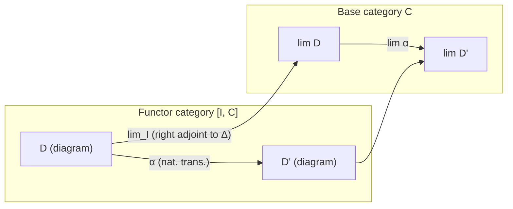

# 📐 Category Theory III: Limits and Colimits

## Table of Contents

- [[#1. Diagrams and Cones|1. Diagrams and Cones]]
  - [[#1.1 The Shape Category|1.1 The Shape Category]]
  - [[#1.2 Cones and Cocones|1.2 Cones and Cocones]]
- [[#2. Limits and Colimits|2. Limits and Colimits]]
  - [[#2.1 The Universal Property|2.1 The Universal Property]]
  - [[#2.2 Uniqueness Up to Unique Isomorphism|2.2 Uniqueness Up to Unique Isomorphism]]
  - [[#2.3 Special Cases|2.3 Special Cases]]
- [[#3. Limits in Set|3. Limits in Set]]
  - [[#3.1 Explicit Description of the Limit|3.1 Explicit Description of the Limit]]
  - [[#3.2 Explicit Description of the Colimit|3.2 Explicit Description of the Colimit]]
- [[#4. Products and Exponentials|4. Products and Exponentials]]
- [[#5. Preservation, Reflection, and Creation of Limits|5. Preservation, Reflection, and Creation of Limits]]
  - [[#5.1 Definitions|5.1 Definitions]]
  - [[#5.2 The Creation Theorem|5.2 The Creation Theorem]]
- [[#6. Projective and Injective Objects|6. Projective and Injective Objects]]
  - [[#6.1 Projective Objects|6.1 Projective Objects]]
  - [[#6.2 Injective Objects|6.2 Injective Objects]]
  - [[#6.3 Regular Injective Objects|6.3 Regular Injective Objects]]
- [[#7. Limits as Colimits: Formal Power Series|7. Limits as Colimits: Formal Power Series]]
- [[#8. Regular Monics and Epics|8. Regular Monics and Epics]]
  - [[#8.1 Definitions and Hierarchy|8.1 Definitions and Hierarchy]]
  - [[#8.2 Characterizations and Examples|8.2 Characterizations and Examples]]
- [[#9. Building Limits from Products and Equalizers|9. Building Limits from Products and Equalizers]]
- [[#10. Algebraic Categories: Widget and Chad|10. Algebraic Categories: Widget and Chad]]
- [[#11. Limits as Right Adjoints to the Diagonal|11. Limits as Right Adjoints to the Diagonal]]
- [[#12. Limits in Functor Categories|12. Limits in Functor Categories]]
- [[#13. Representable Functors Preserve Limits|13. Representable Functors Preserve Limits]]
- [[#14. Adjoints and Limit Preservation|14. Adjoints and Limit Preservation]]
- [[#15. The Density Theorem and Cartesian Closed Categories|15. The Density Theorem and Cartesian Closed Categories]]
  - [[#15.1 The Density Theorem|15.1 The Density Theorem]]
  - [[#15.2 Cartesian Closed Categories|15.2 Cartesian Closed Categories]]
- [[#16. Stability of Morphism Classes|16. Stability of Morphism Classes]]
- [[#17. Optional: Homological Algebra via Category Theory|17. Optional: Homological Algebra via Category Theory]]
- [[#18. The Art of the Diagram Chase|18. The Art of the Diagram Chase 🧩]]
- [[#19. Complete and Cocomplete Categories|19. Complete and Cocomplete Categories 🌐]]
- [[#20. Functoriality of Limits|20. Functoriality of Limits ⚙️]]
- [[#21. Interactions between Limits and Colimits|21. Interactions between Limits and Colimits 🔄]]
- [[#References|References]]

---

> [!INFO] Prerequisites
> This note is File 3 of 4 in a category theory series following Tom Leinster's Part III Cambridge course (2000). File 1 covers categories, functors, and natural transformations. File 2 covers adjoint functors and representable functors. Familiarity with those concepts — in particular the Yoneda lemma and the definition of an adjunction — is assumed throughout.

---

## 1. Diagrams and Cones 🗺️

> [!INFO] Leinster's approach to limits (Chapter 5)
> Leinster opens Chapter 5 of *Basic Category Theory* by defining limits as "the most general kind of limit" and motivating them via three examples: products (a discrete diagram), equalizers (a parallel pair), and pullbacks (a cospan). He then gives the general definition and proves the key results: limits in $\mathbf{Set}$ are explicit, limits are representable, and right adjoints preserve them. He also emphasises the *duality principle*: every result about limits has a dual result about colimits, obtained by reversing all arrows.
>
> Leinster's notation: he writes $\lim D$ for a limit of the diagram $D$ and $\varprojlim D$ for an inverse limit when the index category is a poset; he uses $\varinjlim D$ for a direct/colimit. These notes follow this convention.

### 1.1 The Shape Category

A *diagram* in a category $\mathcal{C}$ is simply a functor $D : \mathcal{I} \to \mathcal{C}$, where $\mathcal{I}$ is a small category called the *index category* or *shape*. The objects of $\mathcal{I}$ label the vertices of the diagram, and the morphisms of $\mathcal{I}$ label the arrows between them.

**Definition (Diagram).** Let $\mathcal{C}$ be a category and $\mathcal{I}$ a small category. A *diagram of shape $\mathcal{I}$ in $\mathcal{C}$* is a functor $D : \mathcal{I} \to \mathcal{C}$.

> [!EXAMPLE] Familiar shapes
> - $\mathcal{I} = \bullet \rightrightarrows \bullet$ (the *parallel pair* shape): a diagram $D$ picks out two objects and two morphisms $f, g : A \rightrightarrows B$.
> - $\mathcal{I} = \bullet \leftarrow \bullet \rightarrow \bullet$ (the *span* shape): a diagram picks out $A \xleftarrow{f} C \xrightarrow{g} B$.
> - $\mathcal{I} = \bullet \rightarrow \bullet \leftarrow \bullet$ (the *cospan* shape): picks out $A \xrightarrow{f} C \xleftarrow{g} B$.
> - $\mathcal{I} = \emptyset$ (the empty category): the unique diagram is the empty diagram.
> - $\mathcal{I}$ discrete on $n$ objects: a diagram is an $n$-tuple of objects in $\mathcal{C}$.

### 1.2 Cones and Cocones

**Definition (Cone).** Let $D : \mathcal{I} \to \mathcal{C}$ be a diagram. A *cone over $D$* is a pair $(N, (\pi_i)_{i \in \mathcal{I}})$ where $N \in \mathcal{C}$ is an object (the *apex*) and $\pi_i : N \to Di$ is a morphism for each object $i \in \mathcal{I}$, subject to the *commutativity condition*: for every morphism $u : i \to j$ in $\mathcal{I}$,
$$D(u) \circ \pi_i = \pi_j.$$

Equivalently, in terms of the *constant functor* $\Delta_N : \mathcal{I} \to \mathcal{C}$ (which sends every object to $N$ and every morphism to $\mathrm{id}_N$), a cone $(N, (\pi_i))$ is precisely a natural transformation $\pi : \Delta_N \Rightarrow D$.

```tikz
\usepackage{tikz-cd}
\begin{document}
\begin{tikzcd}
& N \arrow[dl, "\pi_i"'] \arrow[dr, "\pi_j"] & \\
Di \arrow[rr, "D(u)"'] & & Dj
\end{tikzcd}
\end{document}
```

**Definition (Cocone).** A *cocone under $D$* is a pair $(N, (\iota_i)_{i \in \mathcal{I}})$ where $\iota_i : Di \to N$ for each $i \in \mathcal{I}$, subject to the *cocommutativity condition*: for every $u : i \to j$ in $\mathcal{I}$,
$$\iota_j \circ D(u) = \iota_i.$$

Equivalently, a cocone is a natural transformation $\iota : D \Rightarrow \Delta_N$.

> [!NOTE] Notation
> We write $\mathrm{Cone}(N, D)$ for the set of cones with apex $N$ over $D$, and $\mathrm{Cocone}(D, N)$ for the set of cocones under $D$ with nadir $N$. Both are functorial in $N$.

---

## 2. Limits and Colimits 🎯

### 2.1 The Universal Property

**Definition (Limit).** A *limit of $D$* is a cone $(L, (\pi_i)_{i \in \mathcal{I}})$ over $D$ that is *terminal* in the category of cones over $D$: for every cone $(N, (\phi_i)_{i \in \mathcal{I}})$ over $D$, there exists a unique morphism $! : N \to L$ in $\mathcal{C}$ such that
$$\pi_i \circ \, ! \;= \phi_i \quad \text{for all } i \in \mathcal{I}.$$

We denote the apex $L$ by $\varprojlim D$ or $\lim_{\mathcal{I}} D$ or simply $\lim D$.

```tikz
\usepackage{tikz-cd}
\begin{document}
\begin{tikzcd}
N \arrow[dr, "\varphi_i"'] \arrow[r, "!", dashed] & {L = \lim D} \arrow[d, "\pi_i"] \\
& Di
\end{tikzcd}
\end{document}
```

**Definition (Colimit).** A *colimit of $D$* is a cocone $(L, (\iota_i)_{i \in \mathcal{I}})$ under $D$ that is *initial* among cocones: for every cocone $(N, (\psi_i)_{i \in \mathcal{I}})$ under $D$, there exists a unique morphism $! : L \to N$ such that
$$! \circ \iota_i = \psi_i \quad \text{for all } i \in \mathcal{I}.$$

We denote the nadir $L$ by $\varinjlim D$ or $\mathrm{colim}_{\mathcal{I}} D$ or simply $\mathrm{colim}\, D$.

> [!NOTE] Duality
> The definition of colimit is precisely the definition of limit applied in the *opposite* category $\mathcal{C}^{\mathrm{op}}$: a colimit of $D : \mathcal{I} \to \mathcal{C}$ is a limit of $D^{\mathrm{op}} : \mathcal{I}^{\mathrm{op}} \to \mathcal{C}^{\mathrm{op}}$.

### 2.2 Uniqueness Up to Unique Isomorphism

**Proposition (Uniqueness of limits).** If $(L, (\pi_i))$ and $(L', (\pi'_i))$ are both limits of $D : \mathcal{I} \to \mathcal{C}$, then there is a unique isomorphism $\phi : L \xrightarrow{\sim} L'$ compatible with the projections: $\pi'_i \circ \phi = \pi_i$ for all $i$.

*Proof sketch.* By the universal property applied to $(L, (\pi_i))$ as a cone over $D$, there is a unique $\phi : L \to L'$ with $\pi'_i \circ \phi = \pi_i$. Similarly there is a unique $\psi : L' \to L$ with $\pi_i \circ \psi = \pi'_i$. Then $\psi \circ \phi$ and $\mathrm{id}_L$ are both morphisms $L \to L$ compatible with $(\pi_i)$; by uniqueness $\psi \circ \phi = \mathrm{id}_L$. Similarly $\phi \circ \psi = \mathrm{id}_{L'}$. $\square$

**This uniqueness justifies speaking of "the" limit of a diagram.**

### 2.3 Special Cases

The following table catalogues the most important special instances of limits and colimits, obtained by varying the shape $\mathcal{I}$.

| Name | Shape $\mathcal{I}$ | Limit / Colimit | Universal property |
|------|--------------------|-----------------|-------------------|
| *Terminal object* | $\emptyset$ | Limit | Unique morphism into $1$ from any object |
| *Initial object* | $\emptyset$ | Colimit | Unique morphism from $0$ to any object |
| *Product* $A \times B$ | $\bullet \quad \bullet$ (discrete, 2 objects) | Limit | Projections $\pi_1, \pi_2$; unique factoring |
| *Coproduct* $A \sqcup B$ | $\bullet \quad \bullet$ (discrete, 2 objects) | Colimit | Injections $\iota_1, \iota_2$; unique factoring |
| *Equalizer* | $\bullet \rightrightarrows \bullet$ | Limit | The subobject equalizing $f, g : A \rightrightarrows B$ |
| *Coequalizer* | $\bullet \rightrightarrows \bullet$ | Colimit | The quotient coequalization |
| *Pullback* | $\bullet \to \bullet \leftarrow \bullet$ | Limit | Fiber product over a common target |
| *Pushout* | $\bullet \leftarrow \bullet \to \bullet$ | Colimit | Amalgamated sum over a common source |

> [!EXAMPLE]- Pullbacks in concrete categories
> 💡 The *pullback* of a cospan $A \xrightarrow{f} C \xleftarrow{g} B$ is the limit of the diagram of shape $\bullet \to \bullet \leftarrow \bullet$. It is the object $A \times_C B$ with projections to $A$ and $B$, such that the square commutes and is universal with this property.
>
> In $\mathbf{Set}$: $A \times_C B = \{(a, b) \in A \times B \mid f(a) = g(b)\}$ — the "fibered product" over $C$.
>
> In $\mathbf{Top}$: the pullback of continuous maps $f : A \to C$ and $g : B \to C$ is $\{(a,b) \in A \times B : f(a) = g(b)\}$ with the subspace topology.
>
> In $\mathbf{Grp}$: the pullback is the fiber product $\{(a, b) \in A \times B : f(a) = g(b)\}$ with componentwise group structure.
>
> The dual construction — the *pushout* of a span $A \xleftarrow{f} C \xrightarrow{g} B$ — is $A \sqcup_C B$ (the amalgamated sum). In $\mathbf{Set}$: the pushout is $(A \sqcup B)/{\sim}$ where $f(c) \sim g(c)$ for all $c \in C$. In $\mathbf{Grp}$: the pushout is the free product with amalgamation $A *_C B$.

> [!EXAMPLE]- Equalizers and kernel pairs
> The *equalizer* of $f, g \colon A \rightrightarrows B$ is the limit of the parallel pair diagram. In $\mathbf{Set}$: $\mathrm{eq}(f,g) = \{a \in A \mid f(a) = g(a)\} \hookrightarrow A$.
>
> In $\mathbf{Grp}$: the equalizer of $f, g \colon G \rightrightarrows H$ is the subgroup $\{x \in G \mid f(x) = g(x)\}$ with the inclusion homomorphism.
>
> The *kernel pair* of a morphism $f \colon A \to B$ is the pullback of $f$ along itself: the object $A \times_B A$ with two projection morphisms $p_1, p_2 \colon A \times_B A \rightrightarrows A$. In $\mathbf{Set}$, this is the equivalence relation $\{(a, a') \mid f(a) = f(a')\}$. Kernel pairs are fundamental to the theory of regular categories.

> [!INFO] Leinster on limits as "the same idea in many guises"
> Leinster (§5.1) observes that products, equalizers, and pullbacks are all "the same idea in different guises." All three are instances of the same universal property: a terminal cone over a diagram. The unifying language of limits and diagrams shows that these seemingly disparate constructions are manifestations of a single concept. This is a prime example of the "bird's eye view" that category theory provides.

> [!NOTE] Exercise 1
> **Exercise 1.** Define "limit" and "colimit" of a diagram $D : \mathcal{I} \to \mathcal{C}$ in a category $\mathcal{C}$. Discuss uniqueness. Give three examples of each in specific categories not discussed in lectures.

---

## 3. Limits in Set 🔢

> [!INFO] Leinster on limits in Set (§5.1 of Basic Category Theory)
> Leinster proves that limits in $\mathbf{Set}$ can be computed explicitly as the "matching families" formula below. He uses this as the foundation for a general existence theorem: any category with products and equalizers has all limits (§9 of these notes), and these exist in $\mathbf{Set}$ (products are Cartesian products; equalizers are subsets). Leinster then proves that the limit in $\mathbf{Set}$ has the claimed universal property by a direct verification, rather than citing abstract theorems.

### 3.1 Explicit Description of the Limit

For a small diagram $D : \mathcal{I} \to \mathbf{Set}$, the limit has an entirely explicit description as a subset of a product.

**Theorem (Limits in Set).** The limit of $D : \mathcal{I} \to \mathbf{Set}$ is
$$\varprojlim D \;=\; \left\{\; (x_i)_{i \in \mathcal{I}} \in \prod_{i \in \mathcal{I}} D(i) \;\Big|\; D(u)(x_i) = x_j \text{ for all } u : i \to j \text{ in } \mathcal{I} \;\right\},$$
with projections $\pi_j : \varprojlim D \to D(j)$ given by $(x_i)_{i \in \mathcal{I}} \mapsto x_j$.

*Proof sketch.* One verifies that the given set with projections satisfies the universal property of a limit cone. Given any cone $(N, (\phi_i))$, define $! : N \to \varprojlim D$ by $!(n) = (\phi_i(n))_{i \in \mathcal{I}}$. This is the unique map with $\pi_i \circ \, ! = \phi_i$, and it lands in the equalizing subset by the cone condition $D(u) \circ \phi_i = \phi_j$. $\square$

> [!EXAMPLE] Equalizer in Set
> For the parallel pair $f, g : A \rightrightarrows B$, the diagram has shape $\mathcal{I} = \{s, t\}$ with $D(s) = A$, $D(t) = B$, and $D(f) = f$, $D(g) = g$. The limit formula gives the equalizer $\{a \in A \mid f(a) = g(a)\}$, with inclusion $e : \{a \mid f(a) = g(a)\} \hookrightarrow A$.

### 3.2 Explicit Description of the Colimit

**Theorem (Colimits in Set).** The colimit of $D : \mathcal{I} \to \mathbf{Set}$ is
$$\varinjlim D \;=\; \left(\bigsqcup_{i \in \mathcal{I}} D(i)\right) \Big/ {\sim},$$
where $\sim$ is the equivalence relation generated by: $x_i \sim x_j$ whenever there exists $u : i \to j$ in $\mathcal{I}$ with $D(u)(x_i) = x_j$. The structure maps are $\iota_i : D(i) \to \varinjlim D$, sending $x$ to its equivalence class $[x]$.

*Proof sketch.* Given any cocone $(N, (\psi_i))$, define $! : \varinjlim D \to N$ by $!([x_i]) = \psi_i(x_i)$. This is well-defined because the cocone condition $\psi_j \circ D(u) = \psi_i$ ensures that equivalent elements map to the same element of $N$. $\square$

> [!NOTE] Exercise 2
> **Exercise 2.** For a small diagram $D : \mathcal{I} \to \mathbf{Set}$, describe explicitly the limit cone and the colimit cocone.

---

## 4. Products and Exponentials 🧮

Let $\mathcal{C}$ be a category with finite products. For fixed $B \in \mathcal{C}$, the *product functor* $- \times B : \mathcal{C} \to \mathcal{C}$ sends $A \mapsto A \times B$ and $(f : A \to A') \mapsto (f \times \mathrm{id}_B : A \times B \to A' \times B)$.

**Proposition.** There is a natural isomorphism
$$\mathcal{C}(A, B \times C) \;\cong\; \mathcal{C}(A, B) \times \mathcal{C}(A, C)$$
naturally in $A$, $B$, and $C$.

*Proof sketch.* The bijection sends $f : A \to B \times C$ to the pair $(\pi_1 \circ f, \pi_2 \circ f)$. The inverse sends $(g, h)$ to the unique $\langle g, h \rangle : A \to B \times C$ given by the universal property of the product. Naturality in each variable follows by functoriality of composition. $\square$

> [!NOTE] Exercise 3
> **Exercise 3.** Let $\mathcal{C}$ be a category with finite products. Show directly (without using the fact that right adjoints preserve limits) that $\mathcal{C}(A, B \times C) \cong \mathcal{C}(A, B) \times \mathcal{C}(A, C)$ naturally in $A$, $B$, $C \in \mathcal{C}$.

> [!TIP] Connection to representability
> This isomorphism shows that $\mathcal{C}(A, -)$ converts products in $\mathcal{C}$ to products in $\mathbf{Set}$. It is a special case of the fact (proved in §13) that representable functors preserve all limits.

---

## 5. Preservation, Reflection, and Creation of Limits ⚙️

### 5.1 Definitions

Let $F : \mathcal{C} \to \mathcal{D}$ be a functor and $\mathcal{I}$ a small category.

**Definition (Preservation).** $F$ *preserves limits of shape $\mathcal{I}$* if, for every diagram $D : \mathcal{I} \to \mathcal{C}$ and every limit cone $(L, (\pi_i))$ over $D$ in $\mathcal{C}$, the cone $(FL, (F\pi_i))$ is a limit of $FD : \mathcal{I} \to \mathcal{D}$.

**Definition (Reflection).** $F$ *reflects limits of shape $\mathcal{I}$* if, for every diagram $D : \mathcal{I} \to \mathcal{C}$ and every cone $(L, (\pi_i))$ over $D$: if $(FL, (F\pi_i))$ is a limit of $FD$ in $\mathcal{D}$, then $(L, (\pi_i))$ is already a limit of $D$ in $\mathcal{C}$.

**Definition (Creation).** $F$ *creates limits of shape $\mathcal{I}$* if $F$ reflects limits of shape $\mathcal{I}$, and moreover: for every diagram $D : \mathcal{I} \to \mathcal{C}$ such that $FD$ has a limit $(M, (\mu_i))$ in $\mathcal{D}$, there exists a unique cone $(L, (\pi_i))$ over $D$ in $\mathcal{C}$ such that $(FL, (F\pi_i)) = (M, (\mu_i))$, and this unique cone is a limit cone.

> [!WARNING] Creation is strictly stronger
> Creation implies reflection and (given existence of the limit in $\mathcal{D}$) implies preservation. But a functor may preserve and reflect without creating — see Exercise 4.

> [!EXAMPLE] Forgetful functors
> The forgetful functor $U : \mathbf{Grp} \to \mathbf{Set}$ creates all limits. Concretely: a cone over a diagram of groups in $\mathbf{Set}$, whose apex and legs are given by the explicit limit formula, carries a unique group structure making it a cone in $\mathbf{Grp}$.

### 5.2 The Creation Theorem

**Theorem.** If $F : \mathcal{C} \to \mathcal{D}$ creates limits of shape $\mathcal{I}$, and $D : \mathcal{I} \to \mathcal{C}$ is a diagram such that $FD$ has a limit in $\mathcal{D}$, then:
1. $D$ has a limit in $\mathcal{C}$.
2. $F$ preserves this limit.

*Proof.* Since $F$ creates limits, the existence of a limit of $FD$ implies the existence of a unique lift $(L, (\pi_i))$ over $D$ that maps to it, and this lift is a limit cone. This gives (1). For (2): since $F$ maps the limit cone $(L, (\pi_i))$ to the limit cone $(FL, (F\pi_i)) = (M, (\mu_i))$ of $FD$, $F$ preserves this limit. $\square$

> [!NOTE] Exercise 4
> **Exercise 4.** Define when a functor $F : \mathcal{C} \to \mathcal{D}$ "preserves," "reflects," or "creates" limits. Give examples of:
> (a) A functor that preserves but does not reflect limits.
> (b) A functor that reflects but does not create limits.
>
> Prove: if $F$ creates limits of shape $\mathcal{I}$ and $D : \mathcal{I} \to \mathcal{C}$ has the property that $FD$ has a limit in $\mathcal{D}$, then $D$ has a limit in $\mathcal{C}$ and $F$ preserves it.

---

## 6. Projective and Injective Objects 🔩

### 6.1 Projective Objects

**Definition (Projective object).** An object $P \in \mathcal{C}$ is *projective* if the representable functor $\mathcal{C}(P, -) : \mathcal{C} \to \mathbf{Set}$ preserves epimorphisms: for every epimorphism $e : A \twoheadrightarrow B$ and every morphism $f : P \to B$, there exists a morphism $g : P \to A$ with $e \circ g = f$.

```tikz
\usepackage{tikz-cd}
\begin{document}
\begin{tikzcd}
& P \arrow[d, "f"] \arrow[dl, dashed, "\exists g"'] \\
A \arrow[r, "e"', two heads] & B
\end{tikzcd}
\end{document}
```

> [!EXAMPLE] Free modules are projective
> In $\mathbf{Ab}$ (or any category of $R$-modules), free abelian groups $\mathbb{Z}^{\oplus S}$ are projective. The element $e_s \in \mathbb{Z}^{\oplus S}$ must lift via $e$ to some preimage, and the universal property of the free abelian group then determines the lift.

> [!EXAMPLE] Non-projective object in Ab
> $\mathbb{Z}/2\mathbb{Z}$ is not projective in $\mathbf{Ab}$. Consider the epimorphism $e : \mathbb{Z} \twoheadrightarrow \mathbb{Z}/2\mathbb{Z}$ and the identity $\mathrm{id} : \mathbb{Z}/2\mathbb{Z} \to \mathbb{Z}/2\mathbb{Z}$. A lift would be a group homomorphism $g : \mathbb{Z}/2\mathbb{Z} \to \mathbb{Z}$, but $\mathbb{Z}$ is torsion-free, so $g(1) = 0$ and $e \circ g$ is zero, not the identity.

### 6.2 Injective Objects

**Definition (Injective object).** An object $I \in \mathcal{C}$ is *injective* if the contravariant representable $\mathcal{C}(-, I) : \mathcal{C}^{\mathrm{op}} \to \mathbf{Set}$ sends monomorphisms to surjections: for every monomorphism $m : A \hookrightarrow B$ and every morphism $f : A \to I$, there exists $g : B \to I$ with $g \circ m = f$.

> [!EXAMPLE] Injective abelian groups: divisible groups
> An abelian group $J$ is injective in $\mathbf{Ab}$ if and only if $J$ is *divisible*: for every $x \in J$ and $n \geq 1$, there exists $y \in J$ with $ny = x$. Examples: $\mathbb{Q}$, $\mathbb{R}$, $\mathbb{Q}/\mathbb{Z}$, $\mathbb{Z}[p^{-1}]/\mathbb{Z}$ (Prüfer groups). The group $\mathbb{Z}/n\mathbb{Z}$ is not divisible (and hence not injective): in $\mathbb{Z}/2\mathbb{Z}$, there is no $y$ with $2y = 1$.

> [!EXAMPLE] All objects in Vect_k are injective
> In the category $\mathbf{Vect}_k$ of $k$-vector spaces, every object is both projective and injective. For injectivity: given $m : U \hookrightarrow V$ (which is split by a choice of basis extension) and $f : U \to W$, extend $f$ by zero on a complement. For projectivity: every surjection of vector spaces splits.

### 6.3 Regular Injective Objects

**Definition (Regular injective).** An object $I \in \mathcal{C}$ is *regular injective* if it has the extension property only with respect to *regular monomorphisms* (i.e., equalizer embeddings) rather than all monomorphisms.

> [!EXAMPLE] Real numbers as regular injective in NVS
> Let $\mathbf{NVS}$ denote the category of normed vector spaces with morphisms being bounded linear maps of norm $\leq 1$. The regular monomorphisms are isometric embeddings (inclusions that preserve norm). The claim is that $\mathbb{R}$ is regular injective in $\mathbf{NVS}$: given an isometric embedding $m : U \hookrightarrow V$ and a bounded linear functional $f : U \to \mathbb{R}$ of norm $\leq 1$, the *Hahn–Banach theorem* guarantees an extension $g : V \to \mathbb{R}$ with $g \circ m = f$ and $\|g\| \leq 1$. Note that $\mathbb{R}$ need not be injective with respect to all monomorphisms in $\mathbf{NVS}$.

> [!NOTE] Exercise 5
> **Exercise 5.**
> (i) Define "projective object" $P$ as one where $\mathcal{C}(P, -)$ preserves epics. Show: if $U : F \dashv \mathcal{C}$ is an adjunction (with $F : \mathbf{Set} \to \mathcal{C}$) and $U$ preserves epics, then $F(S)$ is projective for any set $S$. Find a non-projective object in $\mathbf{Ab}$.
> (ii) Define "injective object." Show all objects in $\mathbf{Vect}_k$ are injective. Find a non-injective object in $\mathbf{Ab}$.
> (iii) Define "regular injective object." Let $\mathbf{NVS}$ be the category of normed vector spaces with morphisms being bounded linear maps of norm $\leq 1$. Show that $\mathbb{R}$ is regular injective in $\mathbf{NVS}$.

---

## 7. Limits as Colimits: Formal Power Series 🌀

This section illustrates how limits arise in classical algebra through a categorical lens.

Let $k$ be a field. For each $n \geq 0$, consider the *truncated polynomial ring* $k[X]/(X^n)$. For $m \geq n$, there is a canonical surjective ring homomorphism
$$\rho_{m,n} : k[X]/(X^m) \twoheadrightarrow k[X]/(X^n), \qquad [f(X)] \mapsto [f(X) \mod X^n],$$
and these satisfy the coherence condition $\rho_{n,p} \circ \rho_{m,n} = \rho_{m,p}$ for $m \geq n \geq p \geq 0$. Thus the rings $\{k[X]/(X^n)\}_{n \geq 0}$ together with the maps $\rho_{m,n}$ form an *inverse system* (a diagram indexed by the poset $(\mathbb{N}, \leq)^{\mathrm{op}}$).

**Proposition.** The ring of formal power series $k\llbracket X \rrbracket$ is (isomorphic to) the limit of this inverse system in the category $\mathbf{Ring}$:
$$k\llbracket X \rrbracket \;\cong\; \varprojlim_{n \in \mathbb{N}} k[X]/(X^n).$$

*Proof sketch.* The limit is computed by the explicit formula from §3.1 (applied in the enriched sense for rings, or equivalently using the underlying sets): an element of $\varprojlim k[X]/(X^n)$ is a compatible sequence $(a_n)_{n \geq 0}$ with $a_n \in k[X]/(X^n)$ and $\rho_{m,n}(a_m) = a_n$. Such a sequence is precisely determined by its coefficients $c_0, c_1, c_2, \ldots \in k$ (the coefficients of a formal power series), via $a_n = c_0 + c_1 X + \cdots + c_{n-1}X^{n-1}$ in $k[X]/(X^n)$. The ring operations on the limit match those of $k\llbracket X \rrbracket$ because truncation is a ring homomorphism. $\square$

The *$k$-linear dual* $k[X]^* = \mathrm{Hom}_k(k[X], k)$ also has a canonical identification with $k\llbracket X \rrbracket$: a $k$-linear functional $\phi : k[X] \to k$ is determined by its values on the basis $\{1, X, X^2, \ldots\}$, i.e., by a sequence $(c_n)_{n \geq 0} = (\phi(X^n))$, and this is exactly a formal power series $\sum c_n X^n$.

**Key categorical point.** $k\llbracket X \rrbracket = \varprojlim_n k[X]/(X^n)$ is the *completion* of $k[X]$ at the maximal ideal $(X)$, i.e., the limit (= colimit of the inverse system = limit in the category-theoretic sense) of the diagram of finite approximations. The dual identification $k[X]^* \cong k\llbracket X \rrbracket$ then follows from the fact that linear functionals on a filtered colimit correspond to compatible sequences of functionals on the finite stages.

> [!NOTE] Exercise 6
> **Exercise 6.** Let $k[X]$ be the polynomial ring and $k\llbracket X \rrbracket$ the formal power series ring over a field $k$. Explain categorically (in terms of limits or colimits and universal properties) why $k[X]^* \cong k\llbracket X \rrbracket$, where $(-)^*$ denotes the $k$-linear dual.

---

## 8. Regular Monics and Epics 🔱

### 8.1 Definitions and Hierarchy

**Definition (Regular monic).** A morphism $m : A \to B$ in $\mathcal{C}$ is a *regular monomorphism* if it arises as an equalizer: there exist morphisms $f, g : B \rightrightarrows C$ such that $(A, m)$ is the equalizer of $f$ and $g$.

**Definition (Split monic).** A morphism $m : A \to B$ is a *split monomorphism* (or *section*) if there exists $r : B \to A$ (a *retraction*) with $r \circ m = \mathrm{id}_A$.

The following chain of implications holds in any category:

$$\text{split monic} \implies \text{regular monic} \implies \text{monic}$$

*Proof of first implication.* If $r \circ m = \mathrm{id}_A$, then $m$ is the equalizer of $m \circ r : B \to B$ and $\mathrm{id}_B$: indeed, $m \circ r \circ m = m = \mathrm{id}_B \circ m$, so $m$ factors through this equalizer; conversely, if $f : X \to B$ satisfies $(m \circ r) \circ f = f$, then $r \circ f : X \to A$ is the unique factoring since $m \circ (r \circ f) = f$. $\square$

*Proof of second implication.* If $m$ is the equalizer of $f, g : B \rightrightarrows C$, suppose $m \circ h = m \circ k$. Then $f \circ m \circ h = g \circ m \circ h$, i.e., $f \circ m \circ h = g \circ m \circ k$. Since $m$ is an equalizer, $h = k$ by the universal property. $\square$

The dual hierarchy for epimorphisms:
$$\text{split epic} \implies \text{regular epic} \implies \text{epic}$$

**Definition (Regular epic).** A morphism $e : A \to B$ is a *regular epimorphism* if it arises as a coequalizer of some parallel pair $f, g : C \rightrightarrows A$.

**Definition (Split epic).** A morphism $e : A \to B$ is a *split epimorphism* if there exists $s : B \to A$ with $e \circ s = \mathrm{id}_B$.

### 8.2 Characterizations and Examples

**Proposition (Isomorphisms from epic + regular monic).** A morphism $f : A \to B$ is an isomorphism if and only if it is both an epimorphism and a regular monomorphism.

*Proof sketch.* ($\Rightarrow$) Isomorphisms are both epic and (split, hence regular) monic. ($\Leftarrow$) Suppose $f$ is the equalizer of $g, h : B \rightrightarrows C$ and is also epic. From $g \circ f = h \circ f$ and $f$ being epic, $g = h$. Then the equalizer of $g = h$ is the identity $\mathrm{id}_B$, so $f$ is isomorphic to the identity, hence an isomorphism. $\square$

> [!EXAMPLE] Monics and epics in Ab
> In $\mathbf{Ab}$, every monomorphism is regular (it is the equalizer of the two maps $B \rightrightarrows B/\mathrm{im}(m)$, i.e., the quotient map and $0$). However, not every monic is split: $\iota : \mathbb{Z} \hookrightarrow \mathbb{Q}$ is monic (and regular) but has no retraction $r : \mathbb{Q} \to \mathbb{Z}$ (since $\mathbb{Z}$ is not divisible). The map $\mathbb{Z} \to \mathbb{Z}/n\mathbb{Z}$ is a regular epimorphism (a coequalizer) but is not split in general (there is no group homomorphism $\mathbb{Z}/n\mathbb{Z} \to \mathbb{Z}$ since $\mathbb{Z}$ is torsion-free).

> [!EXAMPLE] Epic and monic but not iso
> In $\mathbf{Ring}$, the inclusion $\iota : \mathbb{Z} \hookrightarrow \mathbb{Q}$ is both monic and epic (any ring map $\mathbb{Q} \to R$ is determined by where $1$ goes, i.e., by the image of $\mathbb{Z}$), yet it is not an isomorphism. This is consistent because $\iota$ is not a *regular* monomorphism in $\mathbf{Ring}$ — it cannot be expressed as an equalizer of ring homomorphisms.

> [!INFO] Monics in Top
> In $\mathbf{Top}$, the monomorphisms are precisely the injective continuous maps. The regular monomorphisms are the *topological embeddings* (homeomorphisms onto their image with the subspace topology). An injective continuous map need not be an embedding: e.g., $[0,1) \to S^1$ by $t \mapsto e^{2\pi i t}$ is injective and continuous but not a homeomorphism onto its image.

> [!NOTE] Exercise 7
> **Exercise 7.** Define "regular monic" as arising as an equalizer, and "split monic" as a morphism with a left inverse. Define regular and split epics dually.
> (i) Show: split monic $\Rightarrow$ regular monic $\Rightarrow$ monic.
> (ii) In $\mathbf{Ab}$, all monics are regular, but not all monics are split. Give an example.
> (iii) Characterize regular monics in $\mathbf{Top}$. Find a monic in $\mathbf{Top}$ that is not regular.
> (iv) Show: a morphism is an isomorphism iff it is both epic and a regular monic. Give an example of a morphism in some category that is both monic and epic but not an isomorphism.
> (v) In $\mathbf{Set}$ (assuming the axiom of choice), show that every epimorphism is split.

---

## 9. Building Limits from Products and Equalizers 🏗️

> [!INFO] Leinster's coverage of this theorem (Theorem 5.1.5)
> Leinster proves the construction of all finite limits from products and equalizers in Theorem 5.1.5 of *Basic Category Theory*. His proof is constructive: given a finite diagram $D : \mathcal{I} \to \mathcal{C}$, he explicitly writes down the product $P = \prod_{i} Di$ over all objects and $Q = \prod_{u: i \to j} Dj$ over all morphisms, then defines two maps $s, t : P \to Q$ and takes the equalizer. He also proves the reduction from pullbacks to products and equalizers (pullbacks are a special case of finite limits), and notes that pullbacks together with a terminal object already suffice.

The following theorem shows that one need not check all limit shapes separately: a small number of "primitive" limit types suffice to generate all finite limits.

**Theorem (Finite limits from products and equalizers).** A category $\mathcal{C}$ has all finite limits if and only if it has:
1. A terminal object (limit of the empty diagram),
2. Binary products,
3. Equalizers of parallel pairs.

*Proof sketch.* The "only if" direction is trivial. For the "if" direction, let $D : \mathcal{I} \to \mathcal{C}$ be a finite diagram. Construct the limit as an equalizer of two maps between products, as follows. Form the products
$$P = \prod_{i \in \mathrm{ob}(\mathcal{I})} Di, \qquad Q = \prod_{u : i \to j \text{ in } \mathcal{I}} Dj.$$
Define two maps $s, t : P \to Q$: the $u$-component of $s$ is $\pi_j : P \to Dj$, and the $u$-component of $t$ is $D(u) \circ \pi_i : P \to Dj$. Then $\mathrm{eq}(s, t)$ is (canonically isomorphic to) $\lim D$. $\square$

**Corollary.** A category with a terminal object and all pullbacks has all finite limits.

*Proof.* Equalizers can be built from pullbacks: the equalizer of $f, g : A \rightrightarrows B$ is the pullback of $\langle f, g \rangle : A \to B \times B$ along the diagonal $\Delta : B \to B \times B$. $\square$

```tikz
\usepackage{tikz-cd}
\begin{document}
\begin{tikzcd}
A \arrow[dr, "\langle f{,}g\rangle"] & \\
B \arrow[r, "\Delta"'] & B \times B
\end{tikzcd}
\end{document}
```

The equalizer of $f, g$ is the pullback of this cospan. In particular, categories with terminal objects and pullbacks have all finite limits.

**Dual statement.** A category has all finite colimits if and only if it has an initial object, binary coproducts, and coequalizers.

**Proposition (Pushouts preserve epics).** In a category $\mathcal{C}$, if $e : A \twoheadrightarrow B$ is a regular epimorphism and
$$\begin{array}{ccc} A & \xrightarrow{f} & C \\ {\scriptstyle e}\downarrow & & \downarrow{\scriptstyle e'} \\ B & \xrightarrow{g} & D \end{array}$$
is a pushout square, then $e' : C \twoheadrightarrow D$ is also a regular epimorphism.

> [!NOTE] Exercise 8
> **Exercise 8.**
> (i) Show that a category with a terminal object, binary products, and equalizers has all finite limits.
> (ii) Deduce: a category with a terminal object and all pullbacks has all finite limits.
> (iii) Let $\mathcal{C}$ have all finite colimits and $F : \mathcal{C} \to \mathcal{D}$ preserve pushouts and the initial object. Show $F$ preserves all finite colimits.
> (iv) Show that a functor preserving pushouts also preserves epimorphisms.

---

## 10. Algebraic Categories: Widget and Chad 🔧

A *widget* is a set $W$ equipped with:
- Distinguished elements $0, 1 \in W$,
- A ternary operation $[-,-,-] : W^3 \to W$,
- Unary operations $\tilde{r} : W \to W$ for each $r \in \mathbb{Q}$,

satisfying the axioms, for all $a, b, c, d \in W$:
1. $[a, b, b] = a$,
2. $[a, a, b] = b$,
3. $[a, [a, b, c], d] = [a, b, d]$,
4. $\tilde{r}([a, b, c]) = [\tilde{r}(a), \tilde{r}(b), \tilde{r}(c)]$.

> [!INFO] What is a widget?
> Widgets arise from Leinster's Cambridge course as a model of an *algebraic theory* — a set-based structure defined by operations and equational axioms. The definition resembles an affine space with $\mathbb{Q}$-scaling; the ternary operation $[a, b, c]$ plays the role of "the point dividing the segment $bc$ in ratio determined by $a$."

The category $\mathbf{Widget}$ has widgets as objects and functions preserving $0$, $1$, $[-,-,-]$, and all $\tilde{r}$ as morphisms. There is a forgetful functor $U : \mathbf{Widget} \to \mathbf{Set}$.

**Theorem.** The forgetful functor $U : \mathbf{Widget} \to \mathbf{Set}$ creates all limits.

*Proof sketch.* Given a diagram $D : \mathcal{I} \to \mathbf{Widget}$, the limit of $UD : \mathcal{I} \to \mathbf{Set}$ is the set
$$L = \left\{(w_i)_{i \in \mathcal{I}} \in \prod_{i} W_i \;\middle|\; D(u)(w_i) = w_j \text{ for all } u : i \to j \right\}.$$
Define widget structure on $L$ pointwise: $0_L = (0_{W_i})_i$, $1_L = (1_{W_i})_i$, $[(a_i), (b_i), (c_i)] = ([a_i, b_i, c_i])_i$, and $\tilde{r}((a_i)_i) = (\tilde{r}(a_i))_i$. The closure of $L$ under these operations follows from the fact that all structure maps $D(u)$ are widget homomorphisms (they commute with the operations). The resulting cone is the unique lift of the limit cone of $UD$ to $\mathbf{Widget}$, and it satisfies the universal property. $\square$

**Corollary.** $\mathbf{Widget}$ has all limits, and $U$ preserves them (by the creation theorem from §5.2).

A *chad* is a simplified version of a widget with fewer operations (e.g., omitting some of the $\tilde{r}$ or the distinguished elements). The forgetful functor $\mathbf{Widget} \to \mathbf{Chad}$ similarly creates all limits, by an entirely analogous pointwise argument.

> [!NOTE] Exercise 9
> **Exercise 9.**
> (i) Define a "widget" as above. Show that the forgetful functor $\mathbf{Widget} \to \mathbf{Set}$ creates all limits; deduce that $\mathbf{Widget}$ has all limits and the forgetful functor preserves them.
> (ii) Define a "chad" (a simplified widget with fewer operations). Show the forgetful functor $\mathbf{Widget} \to \mathbf{Chad}$ preserves and creates limits.

---

## 11. Limits as Right Adjoints to the Diagonal 🔄

**Definition (Diagonal functor).** For a small category $\mathcal{I}$ and a category $\mathcal{C}$, the *diagonal functor* $\Delta : \mathcal{C} \to [\mathcal{I}, \mathcal{C}]$ sends each object $c \in \mathcal{C}$ to the *constant diagram* $\Delta_c : \mathcal{I} \to \mathcal{C}$ (with $\Delta_c(i) = c$ for all $i$ and $\Delta_c(u) = \mathrm{id}_c$ for all $u$), and each morphism $f : c \to c'$ to the natural transformation $\Delta_f : \Delta_c \Rightarrow \Delta_{c'}$ with all components equal to $f$.

**Theorem.** $\mathcal{C}$ has all limits of shape $\mathcal{I}$ if and only if $\Delta : \mathcal{C} \to [\mathcal{I}, \mathcal{C}]$ has a right adjoint $\lim_{\mathcal{I}} : [\mathcal{I}, \mathcal{C}] \to \mathcal{C}$.

*Proof.* The adjunction $\Delta \dashv \lim_{\mathcal{I}}$ means there is a natural bijection
$$[\mathcal{I}, \mathcal{C}]({\Delta_c, D}) \;\cong\; \mathcal{C}(c, \lim_{\mathcal{I}} D).$$
The left side is exactly $\mathrm{Cone}(c, D)$ (natural transformations from the constant functor at $c$ to $D$, i.e., cones over $D$ with apex $c$). A right adjoint to $\Delta$ thus assigns to each diagram $D$ an object $\lim D$ representing the functor $c \mapsto \mathrm{Cone}(c, D)$, which is precisely the universal property of the limit. $\square$

**Dually.** $\mathcal{C}$ has all colimits of shape $\mathcal{I}$ if and only if $\Delta : \mathcal{C} \to [\mathcal{I}, \mathcal{C}]$ has a left adjoint $\mathrm{colim}_{\mathcal{I}} : [\mathcal{I}, \mathcal{C}] \to \mathcal{C}$.

> [!NOTE] Exercise 10
> **Exercise 10.** Show that a small category $\mathcal{C}$ has all colimits of shape $\mathcal{I}$ iff the diagonal functor $\Delta : \mathcal{C} \to [\mathcal{I}, \mathcal{C}]$ has a left adjoint. State the analogous result for limits.

---

## 12. Limits in Functor Categories 🗂️

Let $\mathcal{C}$ be a small category and $\mathcal{D}$ a category with all limits of shape $\mathcal{I}$.

**Theorem (Pointwise limits in functor categories).** The functor category $[\mathcal{C}, \mathcal{D}]$ has all limits of shape $\mathcal{I}$, computed *pointwise*: for a diagram $\mathbf{F} : \mathcal{I} \to [\mathcal{C}, \mathcal{D}]$ (i.e., a family of functors $F_i : \mathcal{C} \to \mathcal{D}$ with natural transformations $\mathbf{F}(u) : F_i \Rightarrow F_j$ for $u : i \to j$), the limit functor $\lim_{\mathcal{I}} \mathbf{F} : \mathcal{C} \to \mathcal{D}$ is defined by
$$(\lim_{\mathcal{I}} \mathbf{F})(c) \;=\; \lim_{\mathcal{I}} (F_-(c)) \;=\; \lim_{\mathcal{I}}(i \mapsto F_i(c)).$$

*Proof sketch.* For each $c \in \mathcal{C}$, the evaluation functor $\mathrm{ev}_c : [\mathcal{C}, \mathcal{D}] \to \mathcal{D}$ sends $\mathbf{F}$ to $F_i(c)$ and the maps to the corresponding natural transformation components. Since $\mathcal{D}$ has limits, $\lim_{\mathcal{I}}(F_-(c))$ exists for each $c$. One checks that this assignment is functorial in $c$ (using the fact that limit cones are natural) and satisfies the universal property in $[\mathcal{C}, \mathcal{D}]$. $\square$

> [!WARNING] Colimits in presheaf categories are also pointwise
> For $\mathcal{D} = \mathbf{Set}$, both limits and colimits in $[\mathcal{C}^{\mathrm{op}}, \mathbf{Set}]$ are computed pointwise. However, in a general functor category, colimits may fail to be pointwise if $\mathcal{D}$ lacks colimits.

**Monics in presheaf categories.** A natural transformation $\alpha : F \Rightarrow G$ in $[\mathcal{C}^{\mathrm{op}}, \mathbf{Set}]$ is a monomorphism if and only if each component $\alpha_c : F(c) \to G(c)$ is injective (a monomorphism in $\mathbf{Set}$).

*Proof.* If all $\alpha_c$ are injective, then for any natural transformations $\beta, \gamma : H \Rightarrow F$ with $\alpha \circ \beta = \alpha \circ \gamma$, we get $\alpha_c \circ \beta_c = \alpha_c \circ \gamma_c$ for all $c$, and injectivity gives $\beta_c = \gamma_c$ for all $c$, so $\beta = \gamma$. Conversely, if some $\alpha_c$ is not injective, one can construct $\beta \neq \gamma$ with $\alpha \circ \beta = \alpha \circ \gamma$ by precomposing $\alpha_c$ with two distinct maps into $F(c)$. $\square$

*Epics are subtler.* Epimorphisms in $[\mathcal{C}^{\mathrm{op}}, \mathbf{Set}]$ need not be pointwise surjective. *Surprisingly,* a natural transformation can be epic without all its components being surjective — see e.g. the inclusion of a non-surjective dense subfunctor.

> [!NOTE] Exercise 11
> **Exercise 11.**
> (i) Let $\mathcal{C}$ be small. Define "pointwise" computation of limits in $[\mathcal{C}^{\mathrm{op}}, \mathbf{Set}]$. Prove that limits exist and are computed pointwise.
> (ii) Characterize monics in $[\mathcal{C}^{\mathrm{op}}, \mathbf{Set}]$. Attempt to characterize epics (try without using (i)).

---

## 13. Representable Functors Preserve Limits 🔍

**Theorem.** For any object $A \in \mathcal{C}$, the representable functor $H_A = \mathcal{C}(A, -) : \mathcal{C} \to \mathbf{Set}$ preserves all limits that exist in $\mathcal{C}$.

*Proof.* Let $(L, (\pi_i))$ be a limit of $D : \mathcal{I} \to \mathcal{C}$. We must show $(H_A(L), (H_A(\pi_i)))$ is a limit of $H_A \circ D$ in $\mathbf{Set}$, i.e., that the canonical map
$$\mathcal{C}(A, L) \xrightarrow{\sim} \varprojlim_{i \in \mathcal{I}} \mathcal{C}(A, Di)$$
is a bijection. But this is immediate: a morphism $f : A \to L$ determines a compatible family $({\pi_i \circ f : A \to Di})_{i \in \mathcal{I}}$ (a cone over $D$ from $A$), and by the universal property of $L$, every such family arises from a unique $f$. $\square$

**Theorem (Yoneda embedding preserves limits).** The Yoneda embedding $H^- : \mathcal{C} \to [\mathcal{C}^{\mathrm{op}}, \mathbf{Set}]$, defined by $A \mapsto H^A = \mathcal{C}(-, A)$, preserves all limits.

*Proof.* By the pointwise description of limits in presheaf categories (§12), a limit of a diagram in $[\mathcal{C}^{\mathrm{op}}, \mathbf{Set}]$ is computed pointwise. For a limit $(L, (\pi_i))$ in $\mathcal{C}$, the cone $(H^L, (H^{\pi_i}))$ has components
$$(H^L)(B) = \mathcal{C}(B, L), \quad (H^{\pi_i})(B) = \mathcal{C}(B, \pi_i).$$
At each $B$, this is a limit cone in $\mathbf{Set}$ by the previous theorem (applied to $\mathcal{C}(B, -)$). Since pointwise limit cones are limit cones in the functor category, $H^-$ preserves limits. $\square$

> [!NOTE] Exercise 12
> **Exercise 12.**
> (i) Let $\mathcal{C}$ be small. Show that for any $A \in \mathcal{C}$, the representable functor $H_A = \mathcal{C}(A, -) : \mathcal{C} \to \mathbf{Set}$ preserves all limits.
> (ii) Show that the Yoneda embedding $H^- : \mathcal{C} \to [\mathcal{C}^{\mathrm{op}}, \mathbf{Set}]$ preserves all limits.

---

## 14. Adjoints and Limit Preservation 🔗

This is one of the most important theorems in category theory.

**Theorem (Right adjoints preserve limits; left adjoints preserve colimits).** Let $F \dashv G : \mathcal{C} \rightleftharpoons \mathcal{D}$ be an adjunction.
- $G$ (the right adjoint) preserves all limits that exist in $\mathcal{D}$.
- $F$ (the left adjoint) preserves all colimits that exist in $\mathcal{C}$.

> [!INFO] Leinster's proof strategy
> Leinster (Theorem 5.2.5 in *Basic Category Theory*) gives an elegant proof via representability. The key insight is: to check that a cone is a limit cone, it suffices to check that the associated map on hom-sets is a bijection. Combining this with the adjunction bijection and the fact that representable functors preserve limits (§13) gives the result in just a few lines. Leinster calls this proof strategy "the representability criterion for limits."

*Proof (right adjoints preserve limits).* Let $(L, (\pi_i)_{i \in \mathcal{I}})$ be a limit of $D : \mathcal{I} \to \mathcal{D}$. We must show that $(GL, (G\pi_i)_{i \in \mathcal{I}})$ is a limit of $GD : \mathcal{I} \to \mathcal{C}$.

By the representability criterion (§13 applied to $\mathcal{C}(A, -)$), it suffices to show that for every $A \in \mathcal{C}$, the canonical map
$$\mathcal{C}(A, GL) \xrightarrow{\;(G\pi_i \circ -)_i\;} \varprojlim_{i \in \mathcal{I}} \mathcal{C}(A, GDi)$$
is a bijection. Using the adjunction bijection $\mathcal{C}(A, GX) \cong \mathcal{D}(FA, X)$ (natural in $X \in \mathcal{D}$), this map is naturally identified with:
$$\mathcal{D}(FA, L) \xrightarrow{\;(\pi_i \circ -)_i\;} \varprojlim_{i \in \mathcal{I}} \mathcal{D}(FA, Di).$$
This is a bijection because $\mathcal{D}(FA, -)$ is a representable functor, hence preserves all limits by §13. Since the bijection is natural in $A$, we conclude that $(GL, (G\pi_i))$ is a limit of $GD$. $\square$

*Proof (left adjoints preserve colimits).* By duality: a left adjoint $F : \mathcal{C} \to \mathcal{D}$ is a right adjoint in the opposite categories, $F^{\mathrm{op}} : \mathcal{C}^{\mathrm{op}} \to \mathcal{D}^{\mathrm{op}}$ is right adjoint to $G^{\mathrm{op}}$. Limits in $\mathcal{C}^{\mathrm{op}}$ are colimits in $\mathcal{C}$, so the result follows by applying the previous proof to the opposite adjunction. $\square$

> [!TIP] Slogan and applications
> **"RAPL": Right Adjoints Preserve Limits. "LAPC": Left Adjoints Preserve Colimits.**
>
> Applications:
> - The forgetful functor $\mathbf{Grp} \to \mathbf{Set}$ (right adjoint to the free group functor) preserves all limits: the underlying set of a product of groups is the product of the underlying sets, the equalizer of group homomorphisms is the set-theoretic equalizer, etc.
> - The free abelian group functor $\mathbf{Set} \to \mathbf{Ab}$ (left adjoint to the forgetful functor) preserves all colimits: the free abelian group on a coproduct $S \sqcup T$ is $\mathbb{Z}^{\oplus S} \oplus \mathbb{Z}^{\oplus T}$.
> - The tensor product functor $M \otimes_R - : \mathbf{Mod}_R \to \mathbf{Mod}_R$ (left adjoint to $\mathrm{Hom}_R(M, -)$) is *right exact*: it preserves all colimits, hence in particular coequalizers — this is the categorical proof of right exactness of tensor.
> - The inverse image functor $f^{-1}$ for a continuous map $f$ (left adjoint to $f_*$) preserves all colimits of sheaves.

> [!EXAMPLE] Forgetful functor from Grp to Set
> The forgetful functor $U : \mathbf{Grp} \to \mathbf{Set}$ has a left adjoint (the free group functor $F : \mathbf{Set} \to \mathbf{Grp}$). Therefore $U$ preserves all limits. In particular, the underlying set of a product of groups is the product of the underlying sets.
>
> To show $U$ has *no right adjoint*: by the adjoint functor theorem (File 4), a right adjoint would require $U$ to preserve all colimits. But $U$ does not preserve all coequalizers: the coequalizer in $\mathbf{Grp}$ of $f, g : H \rightrightarrows G$ is the quotient group $G / \langle\!\langle \{f(h) g(h)^{-1}\}\rangle\!\rangle$, whose underlying set is generally not the coequalizer in $\mathbf{Set}$.

> [!NOTE] Exercise 13
> **Exercise 13.**
> (i) For an adjunction $F \dashv G : \mathcal{C} \rightleftharpoons \mathcal{D}$, show that $F$ preserves all existing colimits in $\mathcal{C}$ and $G$ preserves all existing limits in $\mathcal{D}$.
> (ii) Deduce that the forgetful functor $\mathbf{Grp} \to \mathbf{Set}$ has no right adjoint.
> (iii) Given the chain of adjoints: free group $\dashv$ forgetful $(\mathbf{Grp} \to \mathbf{Set})$, and using that the free-abelianization functor $\mathbf{Grp} \to \mathbf{Ab}$ is left adjoint to the inclusion $\mathbf{Ab} \hookrightarrow \mathbf{Grp}$, show the chain of adjoints extends no further right.

---

## 15. The Density Theorem and Cartesian Closed Categories 🌐

### 15.1 The Density Theorem

The *category of elements* of a presheaf $X \in [\mathcal{C}^{\mathrm{op}}, \mathbf{Set}]$ is the category $\int X$ (also written $\mathbf{el}(X)$) defined as follows:
- Objects: pairs $(A, x)$ with $A \in \mathcal{C}$ and $x \in X(A)$.
- Morphisms $(A, x) \to (B, y)$: morphisms $f : A \to B$ in $\mathcal{C}$ such that $X(f)(y) = x$ (i.e., $f^*(y) = x$).
- There is a forgetful functor $\pi : \int X \to \mathcal{C}$ sending $(A, x) \mapsto A$.

**Theorem (Density / co-Yoneda Lemma).** Every presheaf $X \in [\mathcal{C}^{\mathrm{op}}, \mathbf{Set}]$ is a canonical colimit of representable presheaves. Specifically,
$$X \;\cong\; \mathrm{colim}_{(A, x) \in \int X} \mathcal{C}(-, A).$$
The colimit is indexed by $(\int X)^{\mathrm{op}}$, with the cocone component at $(A, x)$ being the natural transformation $\mathcal{C}(-, A) \Rightarrow X$ corresponding (via Yoneda) to $x \in X(A)$.

*Proof.* We must show that $X$ represents the functor $[\mathcal{C}^{\mathrm{op}}, \mathbf{Set}](\mathrm{colim}\, \mathcal{C}(-, A), -) \cong \varprojlim_{(A,x) \in \int X} [\mathcal{C}^{\mathrm{op}}, \mathbf{Set}](\mathcal{C}(-, A), -)$. By the Yoneda lemma, $[\mathcal{C}^{\mathrm{op}}, \mathbf{Set}](\mathcal{C}(-, A), Y) \cong Y(A)$ naturally. So the limit becomes $\varprojlim_{(A, x) \in \int X} Y(A)$. One verifies that this limit is naturally isomorphic to $[\mathcal{C}^{\mathrm{op}}, \mathbf{Set}](X, Y)$ via the Yoneda correspondence — a natural transformation $X \Rightarrow Y$ assigns to each $(A, x)$ an element $\alpha_A(x) \in Y(A)$, which is precisely a compatible family indexed by $\int X$. $\square$

> [!TIP] Intuition
> The density theorem says: every presheaf is "glued together" from representable pieces. This is the presheaf analogue of every set being a disjoint union of singletons, or every module being a quotient of a free module.

### 15.2 Cartesian Closed Categories

**Definition (Cartesian closed category).** A category $\mathcal{C}$ is *cartesian closed* (a CCC) if:
1. $\mathcal{C}$ has finite products (including a terminal object $1$),
2. For each pair of objects $A, B \in \mathcal{C}$, there exists an *exponential object* $B^A$ (also written $[A, B]$) together with an *evaluation morphism* $\mathrm{ev} : B^A \times A \to B$, such that for every $C \in \mathcal{C}$, the function
$$\mathcal{C}(C \times A, B) \xrightarrow{\sim} \mathcal{C}(C, B^A), \qquad f \mapsto \lambda f,$$
is a bijection, natural in $C$. Here $\lambda f$ is the unique morphism with $\mathrm{ev} \circ (\lambda f \times \mathrm{id}_A) = f$.

Equivalently: for each $A$, the functor $- \times A : \mathcal{C} \to \mathcal{C}$ has a right adjoint $(-)^A : \mathcal{C} \to \mathcal{C}$:
$$- \times A \;\dashv\; (-)^A.$$

| Category | Exponential $B^A$ | Notes |
|----------|------------------|-------|
| $\mathbf{Set}$ | Function set $\{f : A \to B\}$ | The prototypical example |
| $\mathbf{Cat}$ | Functor category $[A, B]$ | Objects are functors, morphisms are natural transformations |
| Any topos | Exists by definition | Every elementary topos is a CCC |
| $[\mathcal{C}^{\mathrm{op}}, \mathbf{Set}]$ | See below | Computed via Yoneda |

**Presheaf categories are cartesian closed.** For $F, G \in [\mathcal{C}^{\mathrm{op}}, \mathbf{Set}]$, the exponential $G^F$ is defined by
$$G^F(A) = [\mathcal{C}^{\mathrm{op}}, \mathbf{Set}](\mathcal{C}(-, A) \times F, G) \;\cong\; [\mathcal{C}^{\mathrm{op}}, \mathbf{Set}](F, G^{\mathcal{C}(-, A)}),$$
or equivalently, by the Yoneda lemma:
$$G^F(A) = \mathrm{Nat}(\mathcal{C}(-, A) \times F, G).$$
When $F = \mathcal{C}(-, B)$ is representable, the Yoneda lemma gives $G^F(A) \cong G(A)^{F(A)}$... wait, more precisely: $G^{\mathcal{C}(-, B)}(A) \cong \mathrm{Nat}(\mathcal{C}(-, A) \times \mathcal{C}(-, B), G) \cong G(A \times B)$ (when $\mathcal{C}$ has products).

**Proposition.** If $\mathcal{C}$ is a cartesian closed category, then the Yoneda embedding $H^- : \mathcal{C} \to [\mathcal{C}^{\mathrm{op}}, \mathbf{Set}]$ preserves finite products and exponentials.

*Proof sketch.* Preservation of products: $H^{A \times B}(C) = \mathcal{C}(C, A \times B) \cong \mathcal{C}(C, A) \times \mathcal{C}(C, B) = (H^A \times H^B)(C)$ naturally in $C$. Preservation of exponentials: $H^{B^A}(C) = \mathcal{C}(C, B^A) \cong \mathcal{C}(C \times A, B)$, and $(H^B)^{H^A}(C) = \mathrm{Nat}(\mathcal{C}(-, C) \times \mathcal{C}(-, A), \mathcal{C}(-, B)) \cong \mathcal{C}(C \times A, B)$ by Yoneda. $\square$

> [!NOTE] Exercise 14
> **Exercise 14.**
> (i) Prove that any presheaf $X \in [\mathcal{C}^{\mathrm{op}}, \mathbf{Set}]$ is a colimit of representable presheaves.
> (ii) Define "cartesian closed category." Show that $[\mathcal{C}^{\mathrm{op}}, \mathbf{Set}]$ is cartesian closed.
> (iii) If $\mathcal{C}$ is a cartesian closed category, prove that the Yoneda embedding $H^- : \mathcal{C} \to [\mathcal{C}^{\mathrm{op}}, \mathbf{Set}]$ preserves finite products and exponentials.

---

## 16. Stability of Morphism Classes 📊

For the six classes of morphisms — monics, regular monics, split monics, epics, regular epics, split epics — we ask two questions:
- (C) Is the class *closed under composition*?
- (P) Is the class *stable under pullback* (i.e., if $f$ is in the class, is its pullback along any map also in the class)?

The following table summarizes the answers:

| Class | Composition (C) | Pullback stable (P) |
|-------|----------------|---------------------|
| Monics | Yes, in all categories | Yes, in all categories |
| Regular monics | Not in general; yes in regular categories | Yes, in all categories |
| Split monics | Yes, in all categories | Yes, in all categories |
| Epics | Yes, in all categories | No, not even in Set |
| Regular epics | Not in general | Yes in regular categories; no in general |
| Split epics | Yes, in all categories | Yes, in all categories |

**Justifications (selected):**

*Monics are closed under composition.* If $f, g$ are monic and $f \circ g \circ h = f \circ g \circ k$, then $g \circ h = g \circ k$ (by $f$ monic), then $h = k$ (by $g$ monic).

*Monics are stable under pullback.* If $m : A \to B$ is monic and the square
$$\begin{array}{ccc} A' & \xrightarrow{m'} & B' \\ \downarrow & & \downarrow \\ A & \xrightarrow{m} & B \end{array}$$
is a pullback, then $m'$ is monic: if $m' \circ h = m' \circ k$, then both $(h, k)$ induce the same morphism into the pullback corner, so they agree.

*Epics are not pullback stable, even in Set.* Let $e : \{a, b\} \twoheadrightarrow \{*\}$ be the unique surjection (an epic/split epic in $\mathbf{Set}$). Pull it back along $s : \{*\} \to \{*\}$ (say the identity): the pullback is $\{a, b\} \to \{*\}$, which is still surjective. *However*, consider a non-surjective map $i : \emptyset \to \{*\}$: the pullback of $e$ along $i$ is $\emptyset \to \emptyset$, which is vacuously surjective. More interesting: in $\mathbf{Top}$, the quotient map $[0,1] \twoheadrightarrow S^1$ is a regular epic; its pullback along the inclusion of a point $\{p\} \hookrightarrow S^1$ is a single fiber, which need not be surjective.

*Split monics are closed under composition.* If $r \circ m = \mathrm{id}$ and $s \circ n = \mathrm{id}$, then $(m \circ s) \circ (n \circ r) = m \circ (s \circ n) \circ r = m \circ r = \mathrm{id}$... wait: $(r \circ s) \circ (n \circ m) = r \circ (s \circ n) \circ m = r \circ m = \mathrm{id}$. So $n \circ m$ is split monic with retraction $r \circ s$.

> [!NOTE] Exercise 15
> **Exercise 15.** For each of the following six classes of morphisms — monics, regular monics, split monics, epics, regular epics, split epics — determine:
> (a) Whether morphisms of that class are closed under composition.
> (b) Whether the class is stable under pullback.
>
> For each of the 12 combinations, answer "yes in all categories," "yes in $\mathbf{Set}$ but not all categories," or "no, not even in $\mathbf{Set}$."

---

## 17. Optional: Homological Algebra via Category Theory 🧬

This section sketches how the categorical machinery of limits, colimits, projective and injective objects organizes the foundations of homological algebra.

An *abelian category* is an additive category in which every morphism has a kernel and cokernel, every monic is a kernel, and every epic is a cokernel. Examples: $\mathbf{Ab}$, $R\text{-}\mathbf{Mod}$, $\mathrm{QCoh}(X)$.

In an abelian category $\mathcal{A}$, a *chain complex* $(C_\bullet, \partial)$ is a sequence
$$\cdots \to C_{n+1} \xrightarrow{\partial_{n+1}} C_n \xrightarrow{\partial_n} C_{n-1} \to \cdots$$
with $\partial_n \circ \partial_{n+1} = 0$. The *$n$-th homology* is $H_n(C_\bullet) = \ker \partial_n / \mathrm{im}\, \partial_{n+1}$, which is well-defined in any abelian category.

**Projective resolutions.** A *projective resolution* of $A \in \mathcal{A}$ is an exact sequence
$$\cdots \to P_2 \to P_1 \to P_0 \to A \to 0$$
with each $P_n$ projective. Such resolutions exist whenever $\mathcal{A}$ has *enough projectives* (every object admits an epic from a projective).

**Derived functors.** Let $T : \mathcal{A} \to \mathcal{B}$ be a right-exact additive functor. The *left derived functors* $L_n T$ are defined by: choose a projective resolution $P_\bullet \to A$, apply $T$ to get a complex $T(P_\bullet)$, then $L_n T(A) = H_n(T(P_\bullet))$. The key fact is that this is independent of the choice of projective resolution.

**Ext and Tor.** For $A \in \mathcal{A}$, the functors $\mathrm{Ext}^n(A, -)$ are the right derived functors of $\mathcal{A}(A, -) : \mathcal{A} \to \mathbf{Ab}$:
$$\mathrm{Ext}^n(A, B) = R^n \mathcal{A}(A, -)(B) = H^n(\mathcal{A}(P_\bullet, B)),$$
where $P_\bullet \to A$ is a projective resolution of $A$. For $R$-modules, $\mathrm{Tor}_n(A, -)$ is the $n$-th left derived functor of $A \otimes_R -$.

**Computation.** In $\mathbf{Ab}$, the projective resolution of $\mathbb{Z}/n\mathbb{Z}$ is
$$0 \to \mathbb{Z} \xrightarrow{\times n} \mathbb{Z} \to \mathbb{Z}/n\mathbb{Z} \to 0.$$
Applying $\mathrm{Hom}(-, \mathbb{Z})$ gives
$$0 \to \mathbb{Z} \xrightarrow{\times n} \mathbb{Z} \to 0,$$
from which $\mathrm{Ext}^0(\mathbb{Z}/n\mathbb{Z}, \mathbb{Z}) = 0$ (since $\mathbb{Z}/n\mathbb{Z}$ has no maps to $\mathbb{Z}$) and **$\mathrm{Ext}^1(\mathbb{Z}/n\mathbb{Z}, \mathbb{Z}) \cong \mathbb{Z}/n\mathbb{Z}$** (the cokernel of $\times n : \mathbb{Z} \to \mathbb{Z}$).

> [!NOTE] Exercise 16
> **Exercise 16 (Optional/Further).** Develop the basic theory of projective and injective resolutions in an abelian category $\mathcal{A}$. Define the derived functors $\mathrm{Ext}^n(A, -)$ and $\mathrm{Tor}_n(A, -)$ and describe their universal properties. Show that in $\mathbf{Ab}$, $\mathrm{Ext}^1(\mathbb{Z}/n\mathbb{Z}, \mathbb{Z}) \cong \mathbb{Z}/n\mathbb{Z}$.

---

## 18. The Art of the Diagram Chase 🧩

A *diagram chase* is a proof technique in which one establishes a result by following elements through a commutative diagram, using commutativity and exactness conditions to derive the conclusion. The technique is most powerful in *abelian categories*, where kernels, cokernels, and exact sequences are available, but it generalizes to any *regular category* via generalized elements.

> [!INFO] Historical context
> The term "diagram chasing" became standard after MacLane systematized it in the 1950s. Eilenberg and Steenrod used the technique extensively in their foundational work on algebraic topology. The Snake Lemma famously appears in the film *It's My Turn* (1980), where Jill Clayburgh's character proves it on a blackboard — making it perhaps the most cinematic theorem in mathematics.

### The Five Lemma

Consider a commutative diagram of abelian groups with exact rows:

```tikz
\usepackage{tikz-cd}
\begin{document}
\begin{tikzcd}
A_1 \arrow[r, "\alpha_1"] \arrow[d, "f_1"'] & A_2 \arrow[r, "\alpha_2"] \arrow[d, "f_2"'] & A_3 \arrow[r, "\alpha_3"] \arrow[d, "f_3"'] & A_4 \arrow[r, "\alpha_4"] \arrow[d, "f_4"'] & A_5 \arrow[d, "f_5"'] \\
B_1 \arrow[r, "\beta_1"'] & B_2 \arrow[r, "\beta_2"'] & B_3 \arrow[r, "\beta_3"'] & B_4 \arrow[r, "\beta_4"'] & B_5
\end{tikzcd}
\end{document}
```

**Theorem (Five Lemma).** In the diagram above with exact rows:
- If $f_1$ is epic and $f_2, f_4$ are isomorphisms, then $f_3$ is monic.
- If $f_5$ is monic and $f_2, f_4$ are isomorphisms, then $f_3$ is epic.
- Hence if $f_1, f_2, f_4, f_5$ are all isomorphisms, then $f_3$ is an isomorphism.

*Proof (injectivity of $f_3$).* Suppose $a_3 \in A_3$ with $f_3(a_3) = 0$. Apply $\beta_3 \circ f_3 = f_4 \circ \alpha_3$ to get $f_4(\alpha_3(a_3)) = 0$. Since $f_4$ is injective, $\alpha_3(a_3) = 0$. By exactness of the top row at $A_3$, there exists $a_2 \in A_2$ with $\alpha_2(a_2) = a_3$. Now $\beta_2(f_2(a_2)) = f_3(\alpha_2(a_2)) = f_3(a_3) = 0$. By exactness of the bottom row at $B_2$, there exists $b_1 \in B_1$ with $\beta_1(b_1) = f_2(a_2)$. Since $f_1$ is surjective, there exists $a_1 \in A_1$ with $f_1(a_1) = b_1$. Then $f_2(\alpha_1(a_1)) = \beta_1(f_1(a_1)) = \beta_1(b_1) = f_2(a_2)$. Since $f_2$ is injective, $\alpha_1(a_1) = a_2$. By exactness at $A_2$, $a_3 = \alpha_2(a_2) = \alpha_2(\alpha_1(a_1)) = 0$. $\square$

*Proof (surjectivity of $f_3$).* Let $b_3 \in B_3$. Apply $\beta_3$ to get $\beta_3(b_3) \in B_4$. Since $f_4$ is surjective, write $\beta_3(b_3) = f_4(a_4)$ for some $a_4 \in A_4$. Then $f_5(\alpha_4(a_4)) = \beta_4(f_4(a_4)) = \beta_4(\beta_3(b_3)) = 0$ (by exactness at $B_4$). Since $f_5$ is injective, $\alpha_4(a_4) = 0$, so $a_4 \in \ker \alpha_4 = \mathrm{im}\, \alpha_3$. Write $a_4 = \alpha_3(a_3)$. Then $\beta_3(f_3(a_3)) = f_4(\alpha_3(a_3)) = f_4(a_4) = \beta_3(b_3)$, so $b_3 - f_3(a_3) \in \ker \beta_3 = \mathrm{im}\, \beta_2$. Write $b_3 - f_3(a_3) = \beta_2(b_2)$. Since $f_2$ is surjective, $b_2 = f_2(a_2)$. Then $f_3(a_3 + \alpha_2(a_2)) = f_3(a_3) + f_3(\alpha_2(a_2)) = f_3(a_3) + \beta_2(f_2(a_2)) = f_3(a_3) + (b_3 - f_3(a_3)) = b_3$. $\square$

### The Short Five Lemma

**Theorem (Short Five Lemma).** Consider a commutative diagram with exact rows:

```tikz
\usepackage{tikz-cd}
\begin{document}
\begin{tikzcd}
0 \arrow[r] & A \arrow[r, "i"] \arrow[d, "f"'] & B \arrow[r, "p"] \arrow[d, "g"'] & C \arrow[r] \arrow[d, "h"'] & 0 \\
0 \arrow[r] & A' \arrow[r, "i'"'] & B' \arrow[r, "p'"'] & C' \arrow[r] & 0
\end{tikzcd}
\end{document}
```

If $f$ and $h$ are isomorphisms, then $g$ is an isomorphism.

*Proof sketch.* This is a special case of the Five Lemma with $A_1 = B_1 = 0$ and $A_5 = B_5 = 0$. Alternatively: for injectivity of $g$, suppose $g(b) = 0$. Then $h(p(b)) = p'(g(b)) = 0$, so $p(b) = 0$ (since $h$ is monic), thus $b = i(a)$ for some $a$. Then $i'(f(a)) = g(i(a)) = g(b) = 0$, so $f(a) = 0$ (since $i'$ is monic), so $a = 0$ and $b = 0$. For surjectivity: given $b' \in B'$, map $p'(b') \in C'$; since $h$ is surjective, $p'(b') = h(c)$ for some $c \in C$; choose a preimage $b \in B$ with $p(b) = c$ (using surjectivity of $p$); then $p'(b' - g(b)) = 0$, so $b' - g(b) = i'(a')$ for some $a'$; since $f$ is surjective, $a' = f(a)$, giving $b' = g(b) + i'(f(a)) = g(b + i(a)) = g(b + i(a))$. $\square$

### The Snake Lemma

The *Snake Lemma* is the engine of connecting homomorphisms in long exact sequences of homology.

**Theorem (Snake Lemma).** Given a commutative diagram of abelian groups with exact rows:

```tikz
\usepackage{tikz-cd}
\begin{document}
\begin{tikzcd}
& A \arrow[r, "f"] \arrow[d, "\alpha"'] & B \arrow[r, "g"] \arrow[d, "\beta"'] & C \arrow[r] \arrow[d, "\gamma"'] & 0 \\
0 \arrow[r] & A' \arrow[r, "f'"'] & B' \arrow[r, "g'"'] & C'
\end{tikzcd}
\end{document}
```

there is an exact sequence
$$\ker \alpha \xrightarrow{\bar f} \ker \beta \xrightarrow{\bar g} \ker \gamma \xrightarrow{\;\delta\;} \mathrm{coker}\, \alpha \xrightarrow{\bar f'} \mathrm{coker}\, \beta \xrightarrow{\bar g'} \mathrm{coker}\, \gamma,$$
where $\delta$ is the *connecting homomorphism* defined by the diagram chase: given $c \in \ker \gamma$, choose $b \in B$ with $g(b) = c$; then $g'(\beta(b)) = \gamma(g(b)) = \gamma(c) = 0$, so $\beta(b) \in \ker g' = \mathrm{im}\, f'$; write $\beta(b) = f'(a')$ and set $\delta(c) = [a'] \in A'/\mathrm{im}\, \alpha$.

> [!WARNING] Well-definedness requires checking
> The definition of $\delta(c)$ involves two choices: the preimage $b$ of $c$ under $g$, and the preimage $a'$ of $\beta(b)$ under $f'$. Independence of $a'$ follows from injectivity of $f'$. Independence of $b$: if $b_1, b_2$ both map to $c$, then $b_1 - b_2 \in \ker g = \mathrm{im}\, f$, so $b_1 - b_2 = f(a)$ for some $a \in A$, and $\beta(b_1) - \beta(b_2) = \beta(f(a)) = f'(\alpha(a)) \in \mathrm{im}\, f' \circ \alpha = f'(\mathrm{im}\, \alpha)$. Thus $\delta$ is well-defined modulo $\mathrm{im}\, \alpha$. $\square$

> [!EXAMPLE]- Snake Lemma applied: long exact sequence of homology
> The Snake Lemma is the key tool in proving that a short exact sequence of chain complexes $0 \to A_\bullet \to B_\bullet \to C_\bullet \to 0$ gives a long exact sequence in homology:
> $$\cdots \to H_n(A) \to H_n(B) \to H_n(C) \xrightarrow{\delta} H_{n-1}(A) \to \cdots$$
> The connecting homomorphism $\delta$ is defined by applying the Snake Lemma to the short exact sequence $0 \to Z_n(A) \to Z_n(B) \to Z_n(C)$ and $B_{n-1}(A) \to B_{n-1}(B) \to B_{n-1}(C) \to 0$, where $Z_n, B_n$ denote cycles and boundaries.

### Diagram Chasing in General Categories

In non-abelian settings, one cannot refer to elements of objects. Instead, one works with *generalized elements*: a morphism $x : T \to A$ is a "$T$-shaped element of $A$." Commutativity $f \circ x = g \circ x$ for all $T$-elements (all $T$ and all $x : T \to A$) implies $f = g$ — this is precisely the Yoneda lemma applied to the natural bijection $\mathcal{C}(T, A) \cong \mathcal{C}(T, A)$.

**Definition (Generalized element).** A *generalized element* of $A \in \mathcal{C}$ of *stage* $T$ is a morphism $x : T \to A$.

💡 *In this language, a cone $(L, (\pi_i))$ is a compatible family of generalized elements $\pi_i : L \to Di$, and the universal property of the limit says that any other such compatible family factors uniquely through $L$.*

This formalism allows diagram chasing in any category, though the arguments become more subtle without exact sequences.

### The Salamander Lemma (Brief Mention)

The *Salamander Lemma* (due to Bergman) is a powerful generalization: for any commutative diagram of abelian groups, the *cohomology at any spot* (the quotient of the kernel by the image of incoming maps) fits into exact sequences relating it to the cohomology of adjacent spots. Riehl (§1.6) gives a clean treatment. The Snake and Five Lemmas become immediate corollaries.

> [!NOTE] Riehl Exercise: Diagram Chasing
> (i) Prove the Short Five Lemma: in a commutative diagram with exact rows
> $0 \to A \to B \to C \to 0$ over $0 \to A' \to B' \to C' \to 0$,
> if both $A \to A'$ and $C \to C'$ are isomorphisms, then $B \to B'$ is an isomorphism.
>
> (ii) State and prove the 3×3 lemma (nine lemma): given a commutative 3×3 diagram of abelian groups where all columns are exact and two of the three rows are exact, the third row is also exact.
>
> (iii) Define what it means for a sequence $A \xrightarrow{f} B \xrightarrow{g} C$ to be exact at $B$ in terms of equalizers and coequalizers (without referring to elements). Show this recovers the usual notion in $\mathbf{Ab}$.

---

## 19. Complete and Cocomplete Categories 🌐

**Definition (Complete and cocomplete).** A category $\mathcal{C}$ is *complete* if it has all small limits — limits of diagrams $D : \mathcal{I} \to \mathcal{C}$ where $\mathcal{I}$ is a small category. $\mathcal{C}$ is *cocomplete* if it has all small colimits.

> [!NOTE] Size matters
> "Small" here means the index category $\mathcal{I}$ is a set-sized category (its objects and morphisms form sets, not proper classes). Without this restriction, limits over proper classes may fail to exist even in $\mathbf{Set}$, due to Russell-type paradoxes.

### The Completeness Theorem

**Theorem (Completeness from products and equalizers).** A category $\mathcal{C}$ is complete if and only if it has all small products and all equalizers. Dually, $\mathcal{C}$ is cocomplete if and only if it has all small coproducts and all coequalizers.

*Proof sketch.* The "only if" direction is trivial. For "if": given any small diagram $D : \mathcal{I} \to \mathcal{C}$, the limit is constructed as an equalizer of two maps between products, exactly as in the finite case (§9), but now using small (possibly infinite) products. Specifically, form
$$P = \prod_{i \in \mathrm{ob}(\mathcal{I})} Di, \qquad Q = \prod_{u : i \to j \text{ in } \mathcal{I}} Dj,$$
define $s, t : P \to Q$ by $s_u = \pi_j$ and $t_u = D(u) \circ \pi_i$, then $\lim D = \mathrm{eq}(s, t)$. The small product and equalizer exist by hypothesis. $\square$

**This shows that the "generating" limit shapes are products (discrete diagrams) and equalizers (parallel pairs).**

### Examples

| Category | Complete | Cocomplete | Notes |
|----------|----------|------------|-------|
| $\mathbf{Set}$ | Yes | Yes | Products are Cartesian products; coproducts are disjoint unions |
| $\mathbf{Grp}$ | Yes | Yes | Limits created by forgetful functor; colimits via presentations |
| $\mathbf{Ab}$ | Yes | Yes | Products are direct products; coproducts are direct sums |
| $\mathbf{Top}$ | Yes | Yes | Products have product topology; coproducts have disjoint union topology |
| $\mathbf{Vect}_k$ | Yes | Yes | Products and coproducts both available (differ for infinite index) |
| $\mathbf{Ring}$ | Yes | Yes | Products are Cartesian; coproducts are tensor products (for commutative rings) |
| $[\mathcal{C}^{\mathrm{op}}, \mathbf{Set}]$ | Yes | Yes | All limits and colimits computed pointwise (§12) |
| Any Grothendieck topos | Yes | Yes | By Giraud's theorem |
| $\mathbf{Field}$ | No | No | No terminal object (no field maps to every field); no initial object |
| $\mathbf{FinSet}$ | Fin. Yes | Fin. Yes | Has all finite limits/colimits; fails for countably infinite products |

> [!DANGER] Fields are not complete
> The category $\mathbf{Field}$ has neither a terminal nor an initial object in the usual sense: a terminal object would be a field receiving a unique map from every field, but there is no field mapping to $\mathbb{Q}$ and $\mathbb{F}_p$ simultaneously (they have different characteristics). *This failure is categorical, not a size issue.*

### Completeness via Generating Limit Shapes

The theorem above shows that one can reduce all small limits to products and equalizers. A refinement: a category has all *finite* limits iff it has a terminal object, binary products, and equalizers (§9). The "small" version replaces binary products with small products.

**Proposition.** The following are equivalent for a category $\mathcal{C}$:
1. $\mathcal{C}$ is complete.
2. $\mathcal{C}$ has all small products and all equalizers.
3. $\mathcal{C}$ has all small products, a terminal object, and all pullbacks.

### Preservation of Completeness

**Proposition.** Let $F : \mathcal{C} \to \mathcal{D}$.
- If $F$ creates limits and $\mathcal{C}$ is complete, then $\mathcal{D}$ is complete.
- If $\mathcal{D}$ is a *reflective subcategory* of $\mathcal{C}$ (inclusion has a left adjoint) and $\mathcal{C}$ is complete, then $\mathcal{D}$ is complete.
- If $\mathcal{C}$ is complete, then $[\mathcal{J}, \mathcal{C}]$ is complete for any small $\mathcal{J}$ (by pointwise limits, §12).

> [!TIP] Practical criterion
> To show an algebraic category (groups, rings, modules, etc.) is complete and cocomplete: (1) the forgetful functor to $\mathbf{Set}$ creates limits, so completeness follows from completeness of $\mathbf{Set}$; (2) colimits exist because free algebras exist and coequalizers are quotient algebras.

> [!NOTE] Riehl Exercise: Completeness
> (i) Show that a category with all small products and equalizers has all small limits. (Hint: construct $\lim D$ as an equalizer of a product, generalizing the finite case in §9.)
>
> (ii) Show that $\mathbf{Ab}$ is both complete and cocomplete by verifying: (a) it has all small products (direct products) and equalizers (kernels of difference maps); (b) it has all small coproducts (direct sums) and coequalizers (cokernels of difference maps).
>
> (iii) A *complete lattice* is a poset with all small meets (infima) and joins (suprema). Show that a complete lattice, viewed as a category, is both complete and cocomplete. Give an example of a poset that is complete but not a complete lattice.

---

## 20. Functoriality of Limits ⚙️

### Limits as Functors

When $\mathcal{C}$ has all limits of shape $\mathcal{I}$, the assignment $D \mapsto \lim D$ defines a functor
$$\lim_{\mathcal{I}} : [\mathcal{I}, \mathcal{C}] \to \mathcal{C}.$$
This is the *right adjoint* to the diagonal functor $\Delta : \mathcal{C} \to [\mathcal{I}, \mathcal{C}]$ (established in §11). Functoriality means: given a natural transformation $\alpha : D \Rightarrow D'$ in $[\mathcal{I}, \mathcal{C}]$, there is an induced map
$$\lim \alpha : \lim D \to \lim D',$$
the unique morphism such that $\pi'_i \circ (\lim \alpha) = \alpha_i \circ \pi_i$ for each $i \in \mathcal{I}$, where $\pi, \pi'$ are the respective limit projections. This is obtained by applying the universal property of $\lim D'$ to the cone $(\lim D,\; (\alpha_i \circ \pi_i)_{i \in \mathcal{I}})$ over $D'$.



### Morphisms of Diagrams and Naturality

**Proposition.** The induced map $\lim \alpha : \lim D \to \lim D'$ satisfies
$$\pi'_i \circ (\lim \alpha) = \alpha_i \circ \pi_i \quad \text{for each } i \in \mathcal{I}.$$
Moreover, $\lim(-)$ is functorial: $\lim(\beta \circ \alpha) = (\lim \beta) \circ (\lim \alpha)$ and $\lim(\mathrm{id}_D) = \mathrm{id}_{\lim D}$.

*Proof.* By the universal property of $\lim D'$ applied to the cone over $D'$ with apex $\lim D$ and legs $\alpha_i \circ \pi_i$. The cone condition holds: for $u : i \to j$ in $\mathcal{I}$, $D'(u) \circ (\alpha_i \circ \pi_i) = \alpha_j \circ D(u) \circ \pi_i = \alpha_j \circ \pi_j$ (using naturality of $\alpha$ and the cone condition for $\pi$). Uniqueness gives functoriality. $\square$

### The Limit Functor Preserves Limits

**Theorem.** The limit functor $\lim_{\mathcal{I}} : [\mathcal{I}, \mathcal{C}] \to \mathcal{C}$ is a right adjoint (to $\Delta$), hence by RAPL (§14) it preserves all limits that exist in $[\mathcal{I}, \mathcal{C}]$.

**Corollary ("Fubini for limits").** *A limit of limits is a limit.* More precisely, if $D : \mathcal{I} \times \mathcal{J} \to \mathcal{C}$ is a bifunctor and $\mathcal{C}$ has all limits of shapes $\mathcal{I}$, $\mathcal{J}$, and $\mathcal{I} \times \mathcal{J}$, then there is a natural isomorphism
$$\lim_{\mathcal{I}} \lim_{\mathcal{J}} D(-,-) \;\cong\; \lim_{\mathcal{I} \times \mathcal{J}} D \;\cong\; \lim_{\mathcal{J}} \lim_{\mathcal{I}} D(-,-).$$

> [!EXAMPLE]- Fubini for products
> The Fubini isomorphism for products says $\prod_{i \in \mathcal{I}} \prod_{j \in \mathcal{J}} D_{ij} \cong \prod_{(i,j) \in \mathcal{I} \times \mathcal{J}} D_{ij} \cong \prod_{j \in \mathcal{J}} \prod_{i \in \mathcal{I}} D_{ij}$, which is the familiar commutativity and associativity of Cartesian products of sets.

### Continuity of Hom-Functors

**Theorem.** For any $A \in \mathcal{C}$, the hom-functor $\mathcal{C}(A, -) : \mathcal{C} \to \mathbf{Set}$ *preserves all limits*:
$$\mathcal{C}(A, \lim_{\mathcal{I}} D) \;\cong\; \lim_{\mathcal{I}} \mathcal{C}(A, D(-)).$$

This was already proved in §13. The functoriality of limits strengthens it: the isomorphism is *natural in both $A$ and $D$*, making $\mathcal{C}(-, -)$ a *continuous bifunctor* (contravariant in the first argument, covariant in the second).

**Definition (Continuous functor).** A functor $F : \mathcal{C} \to \mathcal{D}$ is *continuous* if it preserves all small limits. Equivalently: for every small diagram $D : \mathcal{I} \to \mathcal{C}$ and limit $(L, (\pi_i))$ in $\mathcal{C}$, the cone $(F(L), (F\pi_i))$ is a limit of $F \circ D$ in $\mathcal{D}$.

📐 *Every right adjoint is continuous (RAPL). Every representable functor is continuous. The forgetful functor $\mathbf{Grp} \to \mathbf{Set}$ is continuous (it is a right adjoint to the free group functor).*

> [!NOTE] Riehl Exercise: Functoriality of Limits
> (i) Show that the limit functor $\lim_{\mathcal{I}} : [\mathcal{I}, \mathbf{Set}] \to \mathbf{Set}$ is continuous (preserves all small limits). (Hint: use that it is a right adjoint.)
>
> (ii) Let $\mathcal{C}$ have all limits of shapes $\mathcal{I}$ and $\mathcal{J}$. Show that there is a natural isomorphism $\lim_{\mathcal{I}} (\lim_{\mathcal{J}} D) \cong \lim_{\mathcal{I} \times \mathcal{J}} D$ for any diagram $D : \mathcal{I} \times \mathcal{J} \to \mathcal{C}$. (This is "Fubini for limits.")
>
> (iii) A functor $F : \mathcal{C} \to \mathcal{D}$ is continuous if it preserves all small limits. Show that every representable functor $\mathcal{C}(A, -) : \mathcal{C} \to \mathbf{Set}$ is continuous. Show that the forgetful functor $\mathbf{Grp} \to \mathbf{Set}$ is continuous.

---

## 21. Interactions between Limits and Colimits 🔄

### Limits and Colimits Do Not Generally Commute

The canonical comparison map
$$\mathrm{colim}_{j \in \mathcal{J}}\, \lim_{i \in \mathcal{I}} D(i, j) \;\longrightarrow\; \lim_{i \in \mathcal{I}}\, \mathrm{colim}_{j \in \mathcal{J}} D(i, j)$$
exists for any bifunctor $D : \mathcal{I} \times \mathcal{J} \to \mathcal{C}$, but it is *rarely an isomorphism* in general. The direction of this map (colim of lim maps to lim of colim) reflects the fact that limits "commute past" colimits in this canonical direction.

> [!EXAMPLE]- Counterexample in Set
> Let $\mathcal{J} = \{0, 1\}$ (discrete, two objects) and $\mathcal{I} = \{0 \to 1\}$ (the walking arrow). Consider the diagram $D : \mathcal{I} \times \mathcal{J} \to \mathbf{Set}$ given by:
> - $D(0, 0) = \{a\}$, $D(0, 1) = \{b\}$ (disjoint singletons)
> - $D(1, 0) = D(1, 1) = \{*\}$ (one-point set)
> - Maps $D(0,j) \to D(1,j)$ are the unique maps.
>
> Then $\lim_{\mathcal{I}} D(-,0) = \{a\}$ and $\lim_{\mathcal{I}} D(-,1) = \{b\}$, so $\mathrm{colim}_{\mathcal{J}} \lim_{\mathcal{I}} D = \{a, b\}$ (a two-element set).
>
> On the other hand, $\mathrm{colim}_{\mathcal{J}} D(0,-) = \{a, b\}$ and $\mathrm{colim}_{\mathcal{J}} D(1,-) = \{*\}$, so $\lim_{\mathcal{I}} \mathrm{colim}_{\mathcal{J}} D = \{*\}$ (the limit of the map $\{a,b\} \to \{*\}$, which is $\{*\}$).
>
> Thus $\mathrm{colim}\, \lim = \{a,b\} \not\cong \{*\} = \lim\, \mathrm{colim}$, and the canonical map $\{a,b\} \to \{*\}$ is not an isomorphism.

### Filtered Colimits

**Definition (Filtered category).** A category $\mathcal{J}$ is *filtered* if:
1. $\mathcal{J}$ is non-empty,
2. Any two objects $i, j \in \mathcal{J}$ have a common *upper bound*: there exists $k$ with morphisms $i \to k$ and $j \to k$,
3. Any two parallel morphisms $f, g : i \rightrightarrows j$ have a common *coequalization*: there exists $k$ and $h : j \to k$ with $h \circ f = h \circ g$.

*Filtered colimits* generalize directed colimits (colimits over directed posets, which satisfy conditions 1 and 2 but not necessarily 3).

> [!EXAMPLE] The canonical filtered category
> The category $\boldsymbol{\omega} = (0 \to 1 \to 2 \to \cdots)$ of natural numbers is filtered (conditions 1, 2, and 3 are all easy to verify). A colimit over $\boldsymbol{\omega}$ in $\mathbf{Set}$ is a *sequential union*: $\varinjlim X_n = \bigcup_{n} X_n$ (where the union is taken with respect to the inclusion maps $X_n \to X_{n+1}$), with $x \in X_m$ and $y \in X_n$ identified iff they agree in some $X_k$ with $k \geq m, n$.

### Filtered Colimits Commute with Finite Limits in Set

**Theorem (Filtered colimits commute with finite limits).** In $\mathbf{Set}$, if $\mathcal{J}$ is filtered and $\mathcal{I}$ is finite, then the canonical comparison map
$$\mathrm{colim}_{j \in \mathcal{J}}\, \lim_{i \in \mathcal{I}} D(i,j) \;\xrightarrow{\;\sim\;}\; \lim_{i \in \mathcal{I}}\, \mathrm{colim}_{j \in \mathcal{J}} D(i,j)$$
is an isomorphism for any $D : \mathcal{I} \times \mathcal{J} \to \mathbf{Set}$.

*Proof sketch (for binary products, $\mathcal{I} = \{0, 1\}$).* An element of $\mathrm{colim}_{j} (D(0,j) \times D(1,j))$ is an equivalence class $[(j, x, y)]$ with $x \in D(0,j)$ and $y \in D(1,j)$. An element of $\mathrm{colim}_{j} D(0,j) \times \mathrm{colim}_{j} D(1,j)$ is a pair $([(j_1, x)], [(j_2, y)])$ with $x \in D(0,j_1)$ and $y \in D(1,j_2)$. Since $\mathcal{J}$ is filtered, there exists $k$ with morphisms $j_1 \to k$ and $j_2 \to k$; pushing forward, we can represent both $x$ and $y$ at stage $k$, giving $[(k, x', y')]$. This defines the inverse map. $\square$

*Proof sketch (for equalizers).* Given $[(j, b)]$ in $\mathrm{colim}_j \mathrm{eq}(f_j, g_j)$, one shows the image in $\mathrm{colim}_j D(j)$ lies in the equalizer of the colimit maps, using the filteredness to coequalize the witnesses.

**🔑 This theorem is the key to understanding the structure of algebraic categories.**

### Algebraic Importance

**Proposition (Algebras are filtered colimits of finitely presented ones).** Every group (ring, module, algebra over a theory $\mathbb{T}$, ...) is a *filtered colimit* of finitely presented ones. Specifically, given a group $G$, its finitely generated subgroups form a directed system (ordered by inclusion), and $G = \varinjlim_{H \subseteq G,\, H \text{ f.g.}} H$.

A *finitely presented algebra* is one with finitely many generators and finitely many relations. The class of all $\mathbb{T}$-algebras that are finitely presented is essentially the "compact objects" of the category.

> [!INFO] Locally presentable categories
> A category is *locally presentable* if it is cocomplete and every object is a filtered colimit of "small" (presentable) objects. Examples: $\mathbf{Set}$, $\mathbf{Grp}$, $\mathbf{Ab}$, $R$-$\mathbf{Mod}$, $\mathbf{Top}$ (with the right morphisms), any category of algebras for an accessible monad. Locally presentable categories have excellent exactness properties, and the adjoint functor theorem has a particularly clean form for them.

### Sifted Colimits

**Definition (Sifted colimit).** A colimit is *sifted* if the index category $\mathcal{J}$ has the property that the diagonal $\mathcal{J} \to \mathcal{J} \times \mathcal{J}$ is *final* (cofinal). Equivalently, $\mathcal{J}$ is sifted iff $\mathrm{colim}_{\mathcal{J}}$ commutes with finite products in $\mathbf{Set}$.

Filtered colimits and *reflexive coequalizers* (coequalizers of parallel pairs that have a common section) are both sifted. The class of sifted colimits characterizes algebraic categories: a functor $\mathbf{Set}^{\mathrm{op}} \to \mathbf{Set}$ is representable by an algebraic theory iff it preserves sifted colimits.

### Summary: When Limits and Colimits Commute

| Situation | Result |
|-----------|--------|
| Finite limits vs. filtered colimits | Commute in $\mathbf{Set}$ (and any algebraic/Grothendieck topos) |
| Finite products vs. sifted colimits | Commute in $\mathbf{Set}$ (by definition of sifted) |
| Finite limits vs. filtered colimits in any topos | Commute (by definition of topos + exactness) |
| Left adjoint vs. all colimits | Left adjoints *preserve* colimits (LAPC, §14) |
| Finite limits vs. finite colimits | Do not commute in general |
| All limits vs. all colimits | Do not commute in general |

> [!NOTE] Riehl Exercise: Filtered Colimits
> (i) Show that the category $\boldsymbol{\omega} = (0 \to 1 \to 2 \to \cdots)$ of natural numbers is filtered. Describe what a colimit over $\boldsymbol{\omega}$ in $\mathbf{Set}$ looks like — show it is a sequential union $\bigcup_n X_n$.
>
> (ii) Give an explicit example showing that a non-filtered colimit fails to commute with a finite limit in $\mathbf{Set}$: find a bifunctor $D : \mathcal{I} \times \mathcal{J} \to \mathbf{Set}$ where $\mathcal{J}$ is discrete (hence not filtered) and the canonical comparison map $\mathrm{colim}_{\mathcal{J}} \lim_{\mathcal{I}} D \to \lim_{\mathcal{I}} \mathrm{colim}_{\mathcal{J}} D$ is not an isomorphism.
>
> (iii) Let $A$ be an abelian group. Show that $A$ is a filtered colimit (directed union) of its finitely generated subgroups. Conclude that any property preserved by filtered colimits and true for finitely generated abelian groups is true for all abelian groups.

---

## References

| Reference Name | Brief Summary | Link to Reference |
|---------------|---------------|-------------------|
| Leinster, Part III Category Theory (Cambridge, 2000) | Original course notes and exercise sheets from which these exercises are drawn | [Course page](https://webhomes.maths.ed.ac.uk/~tl/categories/index.html) |
| Leinster, *Basic Category Theory* (2014) | Self-contained introduction; Chapter 5 covers limits and colimits, §5.3 covers preservation/reflection/creation | [arXiv:1612.09375](https://arxiv.org/abs/1612.09375) |
| Mac Lane, *Categories for the Working Mathematician* (2nd ed., 1998) | The standard reference; Chapter V on limits and Chapter IX on adjoint functor theorems | [Springer](https://link.springer.com/book/10.1007/978-1-4757-4721-8) |
| Riehl, *Category Theory in Context* (2016) | Modern treatment with excellent examples; Chapter 3 on limits and colimits, Chapter 4 on adjunctions and limits | [Author PDF](https://math.jhu.edu/~eriehl/context.pdf) |
| Borceux, *Handbook of Categorical Algebra*, Vol. 1 (1994) | Comprehensive reference for creation of limits, regular categories, projective/injective objects | [Cambridge University Press](https://www.cambridge.org/core/books/handbook-of-categorical-algebra/B53E16C2E80B1F9E0506CD4F51C11D76) |
| Wikipedia, *Limit (category theory)* | Accessible overview of cones, limits, colimits, and the main examples | [Wikipedia](https://en.wikipedia.org/wiki/Limit_(category_theory)) |
| nLab, *Regular epimorphism* | Precise definition, stability properties, and examples including Ab and Top | [nLab](https://ncatlab.org/nlab/show/regular+epimorphism) |
| PlanetMath, *Formal power series as inverse limits* | Explicit construction of $k\llbracket X \rrbracket = \varprojlim_n k[X]/(X^n)$ | [PlanetMath](https://planetmath.org/formalpowerseriesasinverselimits) |
| Wikipedia, *Density theorem (category theory)* | Statement and proof sketch of the co-Yoneda / density theorem for presheaves | [Wikipedia](https://en.wikipedia.org/wiki/Density_theorem_(category_theory)) |
| Wikipedia, *Cartesian closed category* | Definition, examples, and the relationship to the simply typed lambda calculus | [Wikipedia](https://en.wikipedia.org/wiki/Cartesian_closed_category) |
| Butz, *Regular Categories and Regular Logic* (BRICS, 1998) | Technical reference on regular categories, pullback stability, and factorization systems | [BRICS LS-98-2](https://www.brics.dk/LS/98/2/BRICS-LS-98-2.pdf) |
