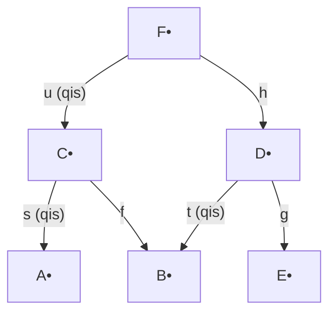

# The Derived Category: Construction and Computation

## Table of Contents

- [[#1. Motivation: Why K(A) Is Not Enough|1. Motivation: Why K(A) Is Not Enough]]
- [[#2. The Category of Chain Complexes Ch(A)|2. The Category of Chain Complexes Ch(A)]]
  - [[#2.1 Chain Complexes and Chain Maps|2.1 Chain Complexes and Chain Maps]]
  - [[#2.2 Cohomology and Quasi-Isomorphisms|2.2 Cohomology and Quasi-Isomorphisms]]
  - [[#2.3 Acyclic Complexes and the Cone Criterion|2.3 Acyclic Complexes and the Cone Criterion]]
- [[#3. Localization of Categories|3. Localization of Categories]]
  - [[#3.1 Gabriel-Zisman Localization|3.1 Gabriel-Zisman Localization]]
  - [[#3.2 Multiplicative Systems and the Ore Conditions|3.2 Multiplicative Systems and the Ore Conditions]]
  - [[#3.3 The Calculus of Left Fractions|3.3 The Calculus of Left Fractions]]
- [[#4. Quasi-Isomorphisms Form a Multiplicative System|4. Quasi-Isomorphisms Form a Multiplicative System]]
  - [[#4.1 The Multiplicative System Axioms|4.1 The Multiplicative System Axioms]]
  - [[#4.2 Verification of the Ore Conditions|4.2 Verification of the Ore Conditions]]
- [[#5. The Derived Category D(A)|5. The Derived Category D(A)]]
  - [[#5.1 Definition and Universal Property|5.1 Definition and Universal Property]]
  - [[#5.2 Morphisms as Roofs|5.2 Morphisms as Roofs]]
  - [[#5.3 Triangulated Structure: Verdier's Theorem|5.3 Triangulated Structure: Verdier's Theorem]]
  - [[#5.4 The Embedding of A and the Ext Identification|5.4 The Embedding of A and the Ext Identification]]
- [[#6. Resolutions and Explicit Computation|6. Resolutions and Explicit Computation]]
  - [[#6.1 Injective Resolutions|6.1 Injective Resolutions]]
  - [[#6.2 Projective Resolutions|6.2 Projective Resolutions]]
  - [[#6.3 Computing Hom in D(A) via Resolutions|6.3 Computing Hom in D(A) via Resolutions]]
- [[#7. Boundedness Conditions|7. Boundedness Conditions]]
  - [[#7.1 The Bounded Derived Categories|7.1 The Bounded Derived Categories]]
  - [[#7.2 Standard Truncations|7.2 Standard Truncations]]
  - [[#7.3 Equivalence with Injective Complexes|7.3 Equivalence with Injective Complexes]]
- [[#8. Key Examples|8. Key Examples]]
  - [[#8.1 D(Ab): Derived Category of Abelian Groups|8.1 D(Ab): Derived Category of Abelian Groups]]
  - [[#8.2 D(R-Mod) and Hereditary Rings|8.2 D(R-Mod) and Hereditary Rings]]
  - [[#8.3 D(k-Vect): The Split Case|8.3 D(k-Vect): The Split Case]]
  - [[#8.4 Ringed Spaces: A Brief Note|8.4 Ringed Spaces: A Brief Note]]
- [[#References|References]]

---

## 1. Motivation: Why K(A) Is Not Enough 🔍

In [[concepts/category-theory/derived-categories/triangulated-categories|Triangulated Categories]] we built the homotopy category $\mathrm{K}(\mathcal{A})$ from an abelian category $\mathcal{A}$: objects are chain complexes, morphisms are chain maps modulo chain homotopy, and the shift functor together with cone sequences makes $\mathrm{K}(\mathcal{A})$ a triangulated category. This is a real achievement — we have a non-abelian replacement for $\mathrm{Ch}(\mathcal{A})$ with a rich exact structure.

But $\mathrm{K}(\mathcal{A})$ is still not the right category for homological algebra. The problem is *quasi-isomorphisms*. A chain map $f: A^\bullet \to B^\bullet$ is a quasi-isomorphism when it induces isomorphisms $H^n(f): H^n(A^\bullet) \xrightarrow{\sim} H^n(B^\bullet)$ for all $n$. This is evidently the correct notion of "equivalence" for complexes: two complexes with the same cohomology carry the same homological information, even if they are not isomorphic in $\mathrm{Ch}(\mathcal{A})$ or even in $\mathrm{K}(\mathcal{A})$.

Yet quasi-isomorphisms need not be isomorphisms in $\mathrm{K}(\mathcal{A})$. Exercise 16 of the triangulated categories note gives the canonical counterexample: the augmentation map $(\mathbb{Z} \xrightarrow{\cdot 2} \mathbb{Z}) \to \mathbb{Z}/2$ is a quasi-isomorphism but has no chain-homotopy inverse, hence is not an isomorphism in $\mathrm{K}(\mathbf{Ab})$.

This failure has concrete consequences:

1. **Cohomological functors cannot be represented.** A functor $H: \mathrm{K}(\mathcal{A}) \to \mathbf{Ab}$ that only depends on cohomology (e.g., $H^0$) cannot distinguish $A^\bullet$ from a quasi-isomorphic complex $B^\bullet$, yet in $\mathrm{K}(\mathcal{A})$ these are distinct objects. There is no way to "represent" $H$ as a $\mathrm{Hom}$ functor without inverting quasi-isomorphisms.

2. **Injective resolutions are not isomorphisms.** The basic tool for computing derived functors — replacing a module by an injective resolution — produces a quasi-isomorphism $A \xrightarrow{\sim} I^\bullet$. For the resulting complex to actually *be isomorphic* to $A$ in the ambient category, quasi-isomorphisms must be isomorphisms.

3. **Ext groups cannot be internalized.** We would like $\mathrm{Ext}^n_{\mathcal{A}}(A, B)$ to equal a Hom-group in some intrinsic category. In $\mathrm{K}(\mathcal{A})$, $\mathrm{Hom}_{\mathrm{K}}(A, B[n])$ counts chain maps up to homotopy, not Ext classes — the identification requires inverting quasi-isomorphisms.

The solution is to *formally invert* all quasi-isomorphisms, in the precise sense of categorical localization. The resulting category is the *derived category* $D(\mathcal{A})$.

> [!INFO] The Verdier quotient perspective
> As previewed in the triangulated categories note, $D(\mathcal{A})$ can equivalently be described as the Verdier quotient $\mathrm{K}(\mathcal{A})/\mathcal{N}$, where $\mathcal{N}$ is the triangulated subcategory of acyclic complexes. Both descriptions — the Verdier quotient and the Gabriel-Zisman localization at quasi-isomorphisms — produce the same category; the localization perspective is more flexible and the quotient perspective makes the triangulated structure transparent.

---

## 2. The Category of Chain Complexes Ch(A) 📐

### 2.1 Chain Complexes and Chain Maps

We work throughout with a fixed abelian category $\mathcal{A}$. The reader should keep in mind the standard examples: $\mathcal{A} = R\text{-}\mathbf{Mod}$ for a ring $R$, or $\mathcal{A} = \mathbf{Ab}$.

**Definition (Chain complex).** A *chain complex* in $\mathcal{A}$ is a sequence of objects and morphisms

$$A^\bullet: \quad \cdots \longrightarrow A^{n-1} \xrightarrow{d^{n-1}} A^n \xrightarrow{d^n} A^{n+1} \longrightarrow \cdots$$

indexed by $\mathbb{Z}$, satisfying the *nilpotency condition* $d^n \circ d^{n-1} = 0$ for all $n \in \mathbb{Z}$.

We denote the full subcategory of bounded-below complexes (those with $A^n = 0$ for $n \ll 0$) by $\mathrm{Ch}^+(\mathcal{A})$, and similarly $\mathrm{Ch}^-(\mathcal{A})$ for bounded-above and $\mathrm{Ch}^b(\mathcal{A})$ for both.

**Definition (Chain map).** A *chain map* $f: A^\bullet \to B^\bullet$ is a collection of morphisms $f^n: A^n \to B^n$ commuting with the differentials: $d_B^n \circ f^n = f^{n+1} \circ d_A^n$ for all $n$. Chain complexes and chain maps form the category $\mathrm{Ch}(\mathcal{A})$.

**Definition (Chain homotopy).** A *chain homotopy* from $f$ to $g: A^\bullet \to B^\bullet$ is a collection of morphisms $h^n: A^n \to B^{n-1}$ such that $g^n - f^n = d_B^{n-1} \circ h^n + h^{n+1} \circ d_A^n$ for all $n$. We write $f \simeq g$ when such an $h$ exists, and note this is an equivalence relation. The *homotopy category* $\mathrm{K}(\mathcal{A})$ is the quotient $\mathrm{Ch}(\mathcal{A})/{\simeq}$; see [[concepts/category-theory/derived-categories/triangulated-categories|Triangulated Categories]] §7 for the full treatment.

> [!NOTE] Cochain vs. chain conventions
> We use cohomological indexing throughout: differentials go $d^n: A^n \to A^{n+1}$ (increasing degree). Some sources (especially in topology) use homological indexing $d_n: A_n \to A_{n-1}$. All definitions below translate directly upon reversing the grading.

### 2.2 Cohomology and Quasi-Isomorphisms

**Definition (Cohomology).** For a chain complex $(A^\bullet, d^\bullet)$ in $\mathcal{A}$, the *$n$-th cohomology object* is the subquotient

$$H^n(A^\bullet) := \ker(d^n: A^n \to A^{n+1}) \big/ \operatorname{im}(d^{n-1}: A^{n-1} \to A^n).$$

This is well-defined as an object of $\mathcal{A}$ because $\operatorname{im}(d^{n-1}) \subseteq \ker(d^n)$ by the nilpotency condition. Every chain map $f: A^\bullet \to B^\bullet$ induces morphisms $H^n(f): H^n(A^\bullet) \to H^n(B^\bullet)$, making $H^n: \mathrm{Ch}(\mathcal{A}) \to \mathcal{A}$ a functor. Crucially, $H^n$ is invariant under chain homotopy, so it descends to a functor $H^n: \mathrm{K}(\mathcal{A}) \to \mathcal{A}$.

**Definition (Quasi-isomorphism).** A chain map $f: A^\bullet \to B^\bullet$ is a *quasi-isomorphism* if $H^n(f): H^n(A^\bullet) \xrightarrow{\sim} H^n(B^\bullet)$ is an isomorphism in $\mathcal{A}$ for every $n \in \mathbb{Z}$. We write $f: A^\bullet \xrightarrow{\sim} B^\bullet$ to indicate that $f$ is a quasi-isomorphism.

> [!WARNING]
> *Quasi-isomorphisms are not closed under arbitrary composition in the naive sense — one must be careful when working in* $\mathrm{Ch}(\mathcal{A})$. However, the class of quasi-isomorphisms in $\mathrm{K}(\mathcal{A})$ is closed under composition (since $H^n$ is a functor) and satisfies the stronger multiplicative system conditions verified in Section 4.

### 2.3 Acyclic Complexes and the Cone Criterion

**Definition (Acyclic complex).** A complex $A^\bullet$ is *acyclic* (or *exact*) if $H^n(A^\bullet) = 0$ for all $n \in \mathbb{Z}$. Equivalently, $A^\bullet$ is acyclic iff the sequence $\cdots \to A^{n-1} \to A^n \to A^{n+1} \to \cdots$ is exact at every term.

Acyclic complexes are the "zero objects up to cohomology" — they carry no homological information. The connection to quasi-isomorphisms is the following fundamental fact.

**Proposition (Cone criterion for quasi-isomorphisms).** A chain map $f: A^\bullet \to B^\bullet$ is a quasi-isomorphism if and only if its mapping cone $\mathrm{Cone}(f)$ is acyclic.

*Proof sketch.* Recall from [[concepts/category-theory/derived-categories/triangulated-categories|Triangulated Categories]] §7.4 that $\mathrm{Cone}(f)^n = A^{n+1} \oplus B^n$ with differential $d^n_{\mathrm{Cone}} = \begin{pmatrix} -d_A^{n+1} & 0 \\ f^{n+1} & d_B^n \end{pmatrix}$. The cone fits into a short exact sequence of complexes

$$0 \longrightarrow B^\bullet \longrightarrow \mathrm{Cone}(f) \longrightarrow A^\bullet[1] \longrightarrow 0,$$

which by the standard connecting homomorphism argument yields a long exact sequence in cohomology:

$$\cdots \longrightarrow H^n(A^\bullet) \xrightarrow{H^n(f)} H^n(B^\bullet) \longrightarrow H^n(\mathrm{Cone}(f)) \longrightarrow H^{n+1}(A^\bullet) \longrightarrow \cdots$$

The map $H^n(f)$ is an isomorphism for all $n$ if and only if $H^n(\mathrm{Cone}(f)) = 0$ for all $n$, which is precisely the statement that $\mathrm{Cone}(f)$ is acyclic. $\square$

> [!EXAMPLE] Quasi-isomorphism from a projective resolution
> Let $M$ be a $\mathbb{Z}$-module. The canonical projective resolution $\cdots \to P^{-1} \to P^0 \to 0$ with augmentation $P^\bullet \to M$ (where $M$ is placed in degree 0) is a quasi-isomorphism $P^\bullet \xrightarrow{\sim} M^\bullet$ (where $M^\bullet$ denotes $M$ concentrated in degree 0). The cone of this map has cohomology groups equal to the homology of the resolution with $M$ appended, which vanishes by exactness.

---

> [!QUESTION] Exercise 1: Quasi-Isomorphisms Are Not Isomorphisms in Ch(A)
> *This exercise establishes the fundamental defect of* $\mathrm{Ch}(\mathcal{A})$: *quasi-isomorphisms need not be invertible.*
>
> > **Prerequisites:** [[#2.3 Acyclic Complexes and the Cone Criterion|2.3 Acyclic Complexes and the Cone Criterion]]
>
> Let $f: (\mathbb{Z} \xrightarrow{\cdot n} \mathbb{Z}) \to (\mathbb{Z}/n)$ be the augmentation map (placing $\mathbb{Z}/n$ in degree 0). Show that $f$ is a quasi-isomorphism. Then show that $f$ admits no right inverse in $\mathrm{Ch}(\mathbf{Ab})$.

> [!TIP]- Solution to Exercise 1
> **Key insight:** Any right inverse $g: \mathbb{Z}/n \to (\mathbb{Z} \xrightarrow{\cdot n} \mathbb{Z})$ would require a map $\mathbb{Z}/n \to \mathbb{Z}$ in degree 0, which is impossible since $\mathbb{Z}/n$ has torsion.
>
> **Sketch:** The complex $P^\bullet = (\mathbb{Z} \xrightarrow{\cdot n} \mathbb{Z})$ has $H^{-1} = 0$ (the differential $\cdot n$ is injective) and $H^0 = \mathbb{Z}/n$. Since $H^i(\mathbb{Z}/n) = \mathbb{Z}/n$ for $i=0$ and $0$ otherwise, $f$ is a quasi-isomorphism. A right inverse $g$ in degree 0 would need $g^0: \mathbb{Z}/n \to \mathbb{Z}$ with $f^0 \circ g^0 = \mathrm{id}_{\mathbb{Z}/n}$. But $\mathrm{Hom}(\mathbb{Z}/n, \mathbb{Z}) = 0$, since any such map kills the torsion element $n \cdot [1] = 0$ in $\mathbb{Z}/n$, hence is zero. No such $g^0$ exists.

---

> [!QUESTION] Exercise 2: Two-out-of-Three for Quasi-Isomorphisms
> *This establishes that quasi-isomorphisms satisfy the two-out-of-three property, which is part of the multiplicative system axioms.*
>
> > **Prerequisites:** [[#2.2 Cohomology and Quasi-Isomorphisms|2.2 Cohomology and Quasi-Isomorphisms]]
>
> Let $A^\bullet \xrightarrow{f} B^\bullet \xrightarrow{g} C^\bullet$ be chain maps. Show that if any two of $f$, $g$, and $g \circ f$ are quasi-isomorphisms, so is the third.

> [!TIP]- Solution to Exercise 2
> **Key insight:** This is immediate from the two-out-of-three property of isomorphisms in $\mathcal{A}$, applied degree-by-degree to $H^n(f)$, $H^n(g)$, $H^n(g \circ f) = H^n(g) \circ H^n(f)$.
>
> **Sketch:** $H^n: \mathrm{K}(\mathcal{A}) \to \mathcal{A}$ is a functor, so $H^n(g \circ f) = H^n(g) \circ H^n(f)$. In $\mathcal{A}$, if two of three composable morphisms are isomorphisms, so is the third (a one-line diagram chase). Applying this at each $n$ gives the result.

---

## 3. Localization of Categories 📐

### 3.1 Gabriel-Zisman Localization

We now develop the general machinery of categorical localization, following Gabriel and Zisman. The key idea is to add formal inverses to a specified class of morphisms, in the same spirit as localizing a ring.

**Definition (Localization).** Let $\mathcal{C}$ be a category and $S \subseteq \mathrm{Mor}(\mathcal{C})$ a class of morphisms. A *localization* of $\mathcal{C}$ at $S$ is a category $\mathcal{C}[S^{-1}]$ together with a functor $Q: \mathcal{C} \to \mathcal{C}[S^{-1}]$ satisfying:

1. **Inversion:** $Q(s)$ is an isomorphism in $\mathcal{C}[S^{-1}]$ for every $s \in S$.
2. **Universal property:** For any category $\mathcal{D}$ and functor $F: \mathcal{C} \to \mathcal{D}$ sending every $s \in S$ to an isomorphism, there exists a unique functor $\widetilde{F}: \mathcal{C}[S^{-1}] \to \mathcal{D}$ with $\widetilde{F} \circ Q = F$.

$$\begin{tikzcd} \mathcal{C} \arrow[r, "Q"] \arrow[dr, "F"'] & \mathcal{C}[S^{-1}] \arrow[d, dashed, "\widetilde{F}"] \\ & \mathcal{D} \end{tikzcd}$$

The universal property characterizes $\mathcal{C}[S^{-1}]$ up to unique equivalence of categories.

**Existence via zig-zag morphisms.** One can always construct a localization by the *zig-zag* method: define $\mathrm{Hom}_{\mathcal{C}[S^{-1}]}(X, Y)$ to consist of equivalence classes of finite zig-zag strings

$$X = X_0 \xrightarrow{f_1} X_1 \xleftarrow{s_1} X_2 \xrightarrow{f_2} X_3 \xleftarrow{s_2} \cdots X_n = Y$$

where each $s_i \in S$ and each $f_j$ is an arbitrary morphism of $\mathcal{C}$, subject to an equivalence relation generated by canceling pairs $(s, s^{-1})$ and $(s^{-1}, s)$ for $s \in S$.

> [!WARNING]
> *In full generality, the zig-zag construction may produce a proper class of morphisms between two objects — the hom-sets of* $\mathcal{C}[S^{-1}]$ *need not be sets. This is not a mere technical nuisance: it genuinely obstructs the construction of functors out of* $\mathcal{C}[S^{-1}]$. The multiplicative system conditions in the next subsection are precisely what prevent this set-theoretic blow-up.

### 3.2 Multiplicative Systems and the Ore Conditions

The Ore conditions, originating in ring theory but adapted here to categories, ensure that zig-zag morphisms can be reduced to a single "fraction."

**Definition (Left multiplicative system).** A class $S \subseteq \mathrm{Mor}(\mathcal{C})$ is a *left multiplicative system* if it satisfies:

- **LMS1** (Closure): Every identity morphism belongs to $S$, and $S$ is closed under composition: if $s, t \in S$ and $s \circ t$ is defined, then $s \circ t \in S$.

- **LMS2** (Left Ore condition): For every $s: A \to A'$ in $S$ and $f: A \to B$, there exist $t: B \to B'$ in $S$ and $g: A' \to B'$ such that $t \circ f = g \circ s$:

$$\begin{array}{ccc} A & \xrightarrow{s} & A' \\ \downarrow f & & \downarrow g \\ B & \xrightarrow{t} & B' \end{array} \quad t \in S.$$

- **LMS3** (Left cancellation): If $f \circ s = g \circ s$ for some $s \in S$, there exists $t \in S$ with $t \circ f = t \circ g$.

**Definition (Right multiplicative system).** The dual conditions **RMS1–RMS3**, obtained by reversing all arrows.

**Definition (Multiplicative system).** $S$ is a *multiplicative system* (also called a *two-sided Ore system* or a *system admitting a calculus of fractions*) if it satisfies both LMS1–LMS3 and RMS1–RMS3 simultaneously.

> [!NOTE] Comparison with ring localization
> In ring theory, the Ore conditions for a multiplicative set $S \subset R$ (closed under multiplication, $1 \in S$) take the form: for any $a \in R$, $s \in S$, there exist $b \in R$, $t \in S$ with $ta = bs$ (left Ore) or $at = sb$ (right Ore). The categorical version is a direct generalization. A commutative ring always satisfies both Ore conditions; noncommutative rings may satisfy only one.

### 3.3 The Calculus of Left Fractions

**Theorem (Gabriel-Zisman).** If $S$ is a left multiplicative system in $\mathcal{C}$, then the localization $\mathcal{C}[S^{-1}]$ exists and has:

- **Objects:** the same as $\mathcal{C}$.
- **Morphisms:** $\mathrm{Hom}_{\mathcal{C}[S^{-1}]}(X, Y)$ consists of equivalence classes of *left fractions* (also called *roofs*):

$$X \xleftarrow{s} Z \xrightarrow{f} Y, \quad s \in S,$$

where two roofs $(X \xleftarrow{s} Z \xrightarrow{f} Y)$ and $(X \xleftarrow{s'} Z' \xrightarrow{f'} Y)$ are *equivalent* if there exists an object $W$ and morphisms $u: W \to Z$, $v: W \to Z'$ such that $s \circ u = s' \circ v$ and $f \circ u = f' \circ v$ (and there exists $w \in S$ with $s \circ u \circ w \in S$, or more precisely such that the common composite lies in $S$).

More concisely: two roofs are equivalent when they admit a common refinement.

- **Composition of roofs:** Given roofs $X \xleftarrow{s} Z \xrightarrow{f} Y$ and $Y \xleftarrow{t} W \xrightarrow{g} V$, the left Ore condition applied to $s$ and $f$ produces a commutative square; one forms the composite roof:

$$X \xleftarrow{s \circ u} U \xrightarrow{g \circ v} V$$

where $u: U \to Z$, $v: U \to W$ complete the square $f \circ u = t \circ v$ with $u \in S$ (by LMS2 applied to $t$ and $f$).

*When $S$ is a full multiplicative system, one obtains an equivalent description using right fractions $X \xrightarrow{f} Z \xrightarrow{s^{-1}} Y$, and the two descriptions agree.*

> [!EXAMPLE] Localization of a ring as a special case
> Let $\mathcal{C}$ be the one-object category $\mathbf{B}R$ with $\mathrm{Hom}(\ast, \ast) = R$ for a ring $R$ (composition is multiplication). A class $S \subset R$ is a multiplicative system iff it satisfies the Ore conditions. The localization $\mathbf{B}R[S^{-1}]$ is $\mathbf{B}(S^{-1}R)$, the one-object category for the Ore localization of $R$ at $S$.

---

> [!QUESTION] Exercise 3: The Equivalence Relation on Roofs Is an Equivalence Relation
> *This exercise verifies that the definition of morphisms in the localized category is well-posed.*
>
> > **Prerequisites:** [[#3.3 The Calculus of Left Fractions|3.3 The Calculus of Left Fractions]]
>
> Let $S$ be a left multiplicative system. Show that the relation on roofs $(X \xleftarrow{s} Z \xrightarrow{f} Y)$ given by "admitting a common refinement" is symmetric and transitive (reflexivity is clear). You may assume $S$ contains all isomorphisms.

> [!TIP]- Solution to Exercise 3
> **Key insight:** Transitivity uses the left Ore condition to find a common apex for three roofs simultaneously.
>
> **Sketch:** Symmetry is immediate since common refinement is a symmetric condition. For transitivity: suppose $(s, f) \sim (s', f')$ via $(u, v)$ and $(s', f') \sim (s'', f'')$ via $(u', v')$. We need a common refinement of $(s, f)$ and $(s'', f'')$. Apply LMS2 to $u: W \to Z$ and $u': W' \to Z'$; find $w: T \to W$, $w': T \to W'$ with $u \circ w = u' \circ w'$ and LMS1 gives $s \circ u \circ w \in S$. Then $s \circ u \circ w = s'' \circ v' \circ w'$ (chase the diagram), and similarly $f \circ u \circ w = f'' \circ v' \circ w'$, giving the desired refinement.

---

> [!QUESTION] Exercise 4: Composition of Roofs Is Well-Defined
> *This exercise checks associativity and independence of representative for the composition law in the calculus of left fractions.*
>
> > **Prerequisites:** [[#3.3 The Calculus of Left Fractions|3.3 The Calculus of Left Fractions]]
>
> Let $S$ be a left multiplicative system. Show that the composition of roofs is independent of the choice of Ore fill (the square used to form the composite). Then verify that $Q(f)$ for a morphism $f$ in $\mathcal{C}$ is represented by the roof $X \xleftarrow{\mathrm{id}_X} X \xrightarrow{f} Y$.

> [!TIP]- Solution to Exercise 4
> **Key insight:** Any two Ore fills of the same data yield equivalent composite roofs by a further application of LMS2.
>
> **Sketch:** Suppose we have two fillings $(u_1, v_1)$ and $(u_2, v_2)$ of the Ore square for $f$ and $t$. Both satisfy $f \circ u_i = t \circ v_i$ with $u_i \in S$. Apply LMS2 to find $w: T \to U_1$, $w': T \to U_2$ with $u_1 \circ w = u_2 \circ w'$ and $w \in S$. Then $s \circ u_1 \circ w = s \circ u_2 \circ w'$ and $g \circ v_1 \circ w = g \circ v_2 \circ w'$, so the two composite roofs are equivalent. For the identity: the roof $(\mathrm{id}, f)$ composed with $(\mathrm{id}, g)$ fills the Ore square trivially and gives $(\mathrm{id}, g \circ f)$, agreeing with $Q(g \circ f)$.

---

## 4. Quasi-Isomorphisms Form a Multiplicative System 🔑

We now verify that the class $\mathrm{Qis}$ of quasi-isomorphisms in $\mathrm{K}(\mathcal{A})$ satisfies the multiplicative system axioms. This is the key technical fact that makes the derived category well-behaved.

### 4.1 The Multiplicative System Axioms

Let $\mathcal{A}$ be an abelian category. Denote by $\mathrm{Qis}$ the class of all quasi-isomorphisms in $\mathrm{K}(\mathcal{A})$ (i.e., morphisms $[f]$ in the homotopy category such that the underlying chain map $f$ induces isomorphisms on all cohomology groups).

**LMS1/RMS1 (Closure).** The identity map $\mathrm{id}_{A^\bullet}$ induces the identity on all $H^n$, hence is in $\mathrm{Qis}$. If $[f]: A^\bullet \to B^\bullet$ and $[g]: B^\bullet \to C^\bullet$ are in $\mathrm{Qis}$, then $H^n([g] \circ [f]) = H^n([g]) \circ H^n([f])$ is a composition of isomorphisms in $\mathcal{A}$, hence an isomorphism. So $\mathrm{Qis}$ is closed under composition. ✓

### 4.2 Verification of the Ore Conditions

The Ore conditions are more subtle and require the cone construction.

**Proposition (Left Ore condition for Qis).** Given morphisms $[s]: B^\bullet \xrightarrow{\sim} B'^\bullet$ in $\mathrm{Qis}$ and $[f]: A^\bullet \to B'^\bullet$ in $\mathrm{K}(\mathcal{A})$, there exist morphisms $[t]: A^\bullet \xrightarrow{\sim} A'^\bullet$ in $\mathrm{Qis}$ and $[g]: A'^\bullet \to B^\bullet$ such that $[s] \circ [g] = [f] \circ [t]$ in $\mathrm{K}(\mathcal{A})$.

*Proof sketch.* Form the *homotopy fiber product* (or *homotopy pullback*) $A'^\bullet$ defined by the complex with $A'^n = A^n \oplus B^{n-1} \oplus B'^{n-1}$ and differential encoding both $f$ and $s$ — more precisely, $A'^\bullet = \mathrm{Cone}(f \oplus -s: A^\bullet \oplus B^\bullet[-1] \to B'^\bullet)[-1]$.

Alternatively: form the complex $A'^\bullet$ as the standard cocone of the pair $(f, s)$:

$$A'^n = A^n \oplus B^{n-1}, \quad d_{A'}^n = \begin{pmatrix} d_A^n & 0 \\ g^n & -d_B^{n-1} \end{pmatrix}$$

where $g^n$ is defined so that the relevant diagram commutes. There are natural maps $t: A'^\bullet \to A^\bullet$ (projection) and $\bar{g}: A'^\bullet \to B^\bullet$ (second component) with $s \circ \bar{g} \simeq f \circ t$. The map $t$ is a quasi-isomorphism because the cone of $t$ is the cone of $s$ (which is acyclic since $s$ is a quasi-isomorphism). $\square$

**Proposition (Left cancellation LMS3).** If $[f] \circ [s] = [g] \circ [s]$ in $\mathrm{K}(\mathcal{A})$ with $[s] \in \mathrm{Qis}$, then there exists $[t] \in \mathrm{Qis}$ with $[t] \circ [f] = [t] \circ [g]$.

*Proof sketch.* The hypothesis means $(f - g) \circ s \simeq 0$ in $\mathrm{Ch}(\mathcal{A})$. By the cone construction, the map $f - g$ factors through $\mathrm{Cone}(s)[-1]$, which is acyclic (since $s \in \mathrm{Qis}$). One then finds a quasi-isomorphism $t$ out of the codomain of $f$ and $g$ that kills this factorization. The full argument uses the long exact cohomology sequence of the cone. $\square$

The right Ore conditions follow by the dual argument (using cocones and projections rather than cones and inclusions).

> [!WARNING]
> *The Ore conditions for* $\mathrm{Qis}$ *hold in* $\mathrm{K}(\mathcal{A})$ *but* not *in* $\mathrm{Ch}(\mathcal{A})$. *Passing to the homotopy category first — quotienting by homotopy before localizing at quasi-isomorphisms — is essential. In* $\mathrm{Ch}(\mathcal{A})$, *the Ore condition fails in general because "commutes up to homotopy" is weaker than "commutes on the nose."*

**Corollary.** $\mathrm{Qis}$ is a (two-sided) multiplicative system in $\mathrm{K}(\mathcal{A})$. Consequently, $\mathrm{K}(\mathcal{A})[\mathrm{Qis}^{-1}]$ exists with hom-sets given by equivalence classes of roofs, and the set-theoretic issues of the zig-zag construction do not arise.

> [!INFO] Compatibility with the triangulated structure
> More is true: $\mathrm{Qis}$ is compatible with the triangulated structure of $\mathrm{K}(\mathcal{A})$ in the sense of the Stacks Project Definition 13.5.1. Specifically: (a) $[f] \in \mathrm{Qis}$ iff $[f][1] \in \mathrm{Qis}$ (since $H^n(A[1]) = H^{n+1}(A)$); and (b) if two vertices of a morphism of distinguished triangles lie in $\mathrm{Qis}$, so does the third (by the five lemma applied to the long exact cohomology sequences). These properties guarantee that the quotient category inherits a triangulated structure.

---

> [!QUESTION] Exercise 5: Qis Is Stable Under the Shift Functor
> *This verifies one of the compatibility conditions between Qis and the triangulated structure of K(A).*
>
> > **Prerequisites:** [[#4.1 The Multiplicative System Axioms|4.1 The Multiplicative System Axioms]]
>
> Let $[f]: A^\bullet \xrightarrow{\sim} B^\bullet$ be a quasi-isomorphism in $\mathrm{K}(\mathcal{A})$. Show that $[f][1]: A^\bullet[1] \to B^\bullet[1]$ is also a quasi-isomorphism, and more generally $[f][n]$ for all $n \in \mathbb{Z}$.

> [!TIP]- Solution to Exercise 5
> **Key insight:** Shifting a complex shifts its cohomology: $H^k(A[n]) = H^{k+n}(A)$.
>
> **Sketch:** The shifted complex $A^\bullet[n]$ has $(A[n])^k = A^{k+n}$ and $d_{A[n]}^k = (-1)^n d_A^{k+n}$. Hence $H^k(A[n]) = \ker(d_{A[n]}^k)/\operatorname{im}(d_{A[n]}^{k-1}) = \ker((-1)^n d_A^{k+n})/\operatorname{im}((-1)^n d_A^{k+n-1}) = H^{k+n}(A)$ (the sign $(-1)^n$ does not affect kernels or images). So $H^k(f[n]) = H^{k+n}(f)$, which is an isomorphism since $f$ is a quasi-isomorphism. Thus $f[n]$ is a quasi-isomorphism.

---

> [!QUESTION] Exercise 6: The Five Lemma for Quasi-Isomorphisms
> *This verifies the triangulated compatibility of Qis: the class is closed under the "two-out-of-three" property for distinguished triangles.*
>
> > **Prerequisites:** [[#4.2 Verification of the Ore Conditions|4.2 Verification of the Ore Conditions]]
>
> Let $(f, g, h): (A^\bullet, B^\bullet, C^\bullet) \to (A'^\bullet, B'^\bullet, C'^\bullet)$ be a morphism of distinguished triangles in $\mathrm{K}(\mathcal{A})$. Show that if $f$ and $g$ are quasi-isomorphisms, then $h$ is a quasi-isomorphism. (Hint: apply $H^n$ to both triangles and use the five lemma in $\mathcal{A}$.)

> [!TIP]- Solution to Exercise 6
> **Key insight:** $H^n$ converts distinguished triangles to long exact sequences, and the five lemma in $\mathcal{A}$ closes the argument.
>
> **Sketch:** Applying $H^n$ to the distinguished triangles $A \to B \to C \to A[1]$ and $A' \to B' \to C' \to A'[1]$ (and to all their rotations) gives two long exact sequences connected by the morphisms $(H^n(f), H^n(g), H^n(h))$. By hypothesis $H^n(f)$ and $H^n(g)$ are isomorphisms for all $n$. The classical five lemma (applied in $\mathcal{A}$ at each degree $n$) shows $H^n(h)$ is an isomorphism for all $n$.

---

## 5. The Derived Category D(A) 🔑

### 5.1 Definition and Universal Property

**Definition (Derived category).** Let $\mathcal{A}$ be an abelian category. The *derived category* of $\mathcal{A}$ is the localization of the homotopy category at the class of quasi-isomorphisms:

$$D(\mathcal{A}) := \mathrm{K}(\mathcal{A})[\mathrm{Qis}^{-1}].$$

The *localization functor* $Q: \mathrm{K}(\mathcal{A}) \to D(\mathcal{A})$ is the canonical functor sending each quasi-isomorphism to an isomorphism. Composing with the projection $\mathrm{Ch}(\mathcal{A}) \to \mathrm{K}(\mathcal{A})$, one obtains a functor $Q: \mathrm{Ch}(\mathcal{A}) \to D(\mathcal{A})$ making every quasi-isomorphism into an isomorphism.

**Universal property.** For any category $\mathcal{E}$ and functor $F: \mathrm{K}(\mathcal{A}) \to \mathcal{E}$ (or $F: \mathrm{Ch}(\mathcal{A}) \to \mathcal{E}$) sending every quasi-isomorphism to an isomorphism, there is a unique functor $\widetilde{F}: D(\mathcal{A}) \to \mathcal{E}$ with $\widetilde{F} \circ Q = F$.

> [!NOTE] Equivalent construction via Verdier quotient
> As noted in [[concepts/category-theory/derived-categories/triangulated-categories|Triangulated Categories]] §8, one can alternatively define $D(\mathcal{A}) = \mathrm{K}(\mathcal{A})/\mathcal{N}$ where $\mathcal{N}$ is the triangulated subcategory of acyclic complexes. These two descriptions are equivalent: a morphism $f$ becomes an isomorphism in $\mathrm{K}(\mathcal{A})/\mathcal{N}$ iff its cone (which is zero in the quotient, being acyclic) makes $f$ an iso, iff $f$ is a quasi-isomorphism.

### 5.2 Morphisms as Roofs

By the Gabriel-Zisman theorem (Section 3.3) applied to the multiplicative system $\mathrm{Qis}$ in $\mathrm{K}(\mathcal{A})$, morphisms in $D(\mathcal{A})$ have a concrete description.

**Proposition (Morphisms in D(A) as roofs).** For objects $A^\bullet, B^\bullet$ in $D(\mathcal{A})$ (which are chain complexes viewed up to quasi-isomorphism), we have:

$$\mathrm{Hom}_{D(\mathcal{A})}(A^\bullet, B^\bullet) = \left\{ (A^\bullet \xleftarrow{s} C^\bullet \xrightarrow{f} B^\bullet) : s \in \mathrm{Qis} \right\} \Big/ \sim$$

where two roofs $(s, f)$ and $(s', f')$ with apices $C^\bullet$ and $C'^\bullet$ are equivalent if there exists a third complex $D^\bullet$ and morphisms $u: D^\bullet \to C^\bullet$, $v: D^\bullet \to C'^\bullet$ in $\mathrm{K}(\mathcal{A})$ such that $s \circ u = s' \circ v$ in $\mathrm{K}(\mathcal{A})$ and $f \circ u = f' \circ v$ in $\mathrm{K}(\mathcal{A})$.

**Composition of roofs.** To compose the roof $A^\bullet \xleftarrow{s} C^\bullet \xrightarrow{f} B^\bullet$ with the roof $B^\bullet \xleftarrow{t} D^\bullet \xrightarrow{g} E^\bullet$:

1. Apply the left Ore condition to $f: C^\bullet \to B^\bullet$ and $t: D^\bullet \xrightarrow{\sim} B^\bullet$ to find $u: F^\bullet \to C^\bullet$ with $u \in \mathrm{Qis}$ and $h: F^\bullet \to D^\bullet$ with $t \circ h = f \circ u$ in $\mathrm{K}(\mathcal{A})$.
2. The composite roof is $A^\bullet \xleftarrow{s \circ u} F^\bullet \xrightarrow{g \circ h} E^\bullet$.



> [!EXAMPLE] The identity morphism as a roof
> The identity $\mathrm{id}_{A^\bullet}$ in $D(\mathcal{A})$ is represented by the degenerate roof $A^\bullet \xleftarrow{\mathrm{id}} A^\bullet \xrightarrow{\mathrm{id}} A^\bullet$. A morphism $f: A^\bullet \to B^\bullet$ in $\mathrm{K}(\mathcal{A})$ maps to the roof $A^\bullet \xleftarrow{\mathrm{id}} A^\bullet \xrightarrow{f} B^\bullet$ under $Q$. A quasi-isomorphism $s: A^\bullet \xrightarrow{\sim} B^\bullet$ maps to the roof $A^\bullet \xleftarrow{\mathrm{id}} A^\bullet \xrightarrow{s} B^\bullet$, whose inverse in $D(\mathcal{A})$ is the roof $B^\bullet \xleftarrow{s} A^\bullet \xrightarrow{\mathrm{id}} A^\bullet$.

### 5.3 Triangulated Structure: Verdier's Theorem

**Theorem (Verdier).** $D(\mathcal{A})$ is a triangulated category, and the localization functor $Q: \mathrm{K}(\mathcal{A}) \to D(\mathcal{A})$ is an exact functor of triangulated categories.

*More precisely:* $D(\mathcal{A})$ carries a shift functor $[1]$ defined on objects by $A^\bullet[1]^n = A^{n+1}$ (same as in $\mathrm{K}(\mathcal{A})$), and the distinguished triangles in $D(\mathcal{A})$ are precisely the triangles isomorphic (in $D(\mathcal{A})$) to the image under $Q$ of a distinguished triangle in $\mathrm{K}(\mathcal{A})$.

*Proof sketch of the key points.*

- **The shift functor is well-defined on $D(\mathcal{A})$:** Since $[f][1]$ is a quasi-isomorphism whenever $[f]$ is (Exercise 5), the shift functor sends $\mathrm{Qis}$ to $\mathrm{Qis}$ and descends to an autoequivalence of $D(\mathcal{A})$.

- **$Q$ sends distinguished triangles to distinguished triangles:** By the compatibility of $\mathrm{Qis}$ with the triangulated structure (Section 4.2), $Q$ is exact.

- **Distinguished triangles in $D(\mathcal{A})$ satisfy TR1–TR4:** The key point is that TR3 (the axiom about filling in morphisms of triangles) holds in $D(\mathcal{A})$ because the Ore condition provides enough room to define the filling morphism even when working with roofs. TR4 (the octahedral axiom) is inherited from $\mathrm{K}(\mathcal{A})$ via $Q$. $\square$

> [!INFO] Every short exact sequence gives a distinguished triangle
> In $\mathcal{A}$, a short exact sequence $0 \to A \xrightarrow{f} B \xrightarrow{g} C \to 0$ gives — after lifting to $\mathrm{Ch}(\mathcal{A})$ via $f$ and $g$ concentrated in degree 0, and passing to $D(\mathcal{A})$ — a distinguished triangle $A \to B \to C \to A[1]$ in $D(\mathcal{A})$. This uses the fact that $C \cong \mathrm{Cone}(f)$ in $D(\mathcal{A})$ (since the natural map $\mathrm{Cone}(f) \to C$ is a quasi-isomorphism when the sequence is exact). *This is the fundamental link between the abelian structure of $\mathcal{A}$ and the triangulated structure of $D(\mathcal{A})$.*

### 5.4 The Embedding of A and the Ext Identification

Every object $A \in \mathcal{A}$ defines a complex $A^\bullet$ concentrated in degree 0: $(A^\bullet)^0 = A$, $(A^\bullet)^n = 0$ for $n \neq 0$, with all differentials zero. This gives a fully faithful embedding $\mathcal{A} \hookrightarrow D(\mathcal{A})$.

**Theorem (Ext identification).** Let $\mathcal{A}$ be an abelian category with enough injectives. For $A, B \in \mathcal{A}$ (viewed as complexes concentrated in degree 0), there is a canonical isomorphism:

$$\mathrm{Hom}_{D(\mathcal{A})}(A, B[n]) \cong \mathrm{Ext}^n_{\mathcal{A}}(A, B)$$

for all $n \geq 0$.

*Proof sketch.* Choose an injective resolution $0 \to B \to I^0 \to I^1 \to \cdots$ of $B$ in $\mathcal{A}$. This is a quasi-isomorphism $B \xrightarrow{\sim} I^\bullet$ in $\mathrm{Ch}(\mathcal{A})$, hence an isomorphism $B \cong I^\bullet$ in $D(\mathcal{A})$. Therefore:

$$\mathrm{Hom}_{D(\mathcal{A})}(A, B[n]) \cong \mathrm{Hom}_{D(\mathcal{A})}(A, I^\bullet[n]).$$

Since $I^\bullet$ consists of injectives and $A$ is concentrated in degree 0, any roof $A \xleftarrow{s} C^\bullet \xrightarrow{f} I^\bullet[n]$ can be straightened: the quasi-isomorphism $s$ from $C^\bullet$ to $A$ (a complex in degree 0) forces $C^\bullet$ to be quasi-isomorphic to $A$ itself, so after choosing a homotopy-canonical lift, any such morphism is given by a chain map $A \to I^\bullet[n]$ up to homotopy. A chain map from $A$ (in degree 0) to $I^\bullet[n]$ is precisely a closed element of $I^n$ modulo the image of $d^{n-1}$, which computes $H^n(\mathrm{Hom}(A, I^\bullet)) = \mathrm{Ext}^n(A, B)$. $\square$

**Key result:** $\mathbf{\mathrm{Hom}_{D(\mathcal{A})}(A, B[n]) \cong \mathrm{Ext}^n_{\mathcal{A}}(A, B).}$

This is the central bridge between classical homological algebra and the derived category: Ext groups are not just abstract functors but honest hom-sets in $D(\mathcal{A})$.

> [!WARNING]
> *The identification requires that $\mathcal{A}$ has enough injectives. Without this assumption, one can still define $D(\mathcal{A})$ but computing its morphism sets may require different tools (e.g., K-injective resolutions or model-categorical methods).*

---

> [!QUESTION] Exercise 7: The Embedding A into D(A) Is Fully Faithful
> *This verifies that passing to the derived category does not lose information about morphisms in A.*
>
> > **Prerequisites:** [[#5.4 The Embedding of A and the Ext Identification|5.4 The Embedding of A and the Ext Identification]]
>
> Let $A, B \in \mathcal{A}$ be objects of an abelian category with enough injectives. Show that the natural map $\mathrm{Hom}_{\mathcal{A}}(A, B) \to \mathrm{Hom}_{D(\mathcal{A})}(A, B)$ is a bijection. (This uses the Ext identification: $\mathrm{Ext}^0_{\mathcal{A}}(A, B) \cong \mathrm{Hom}_{\mathcal{A}}(A, B)$.)

> [!TIP]- Solution to Exercise 7
> **Key insight:** $\mathrm{Ext}^0(A, B) = \mathrm{Hom}_{\mathcal{A}}(A, B)$ by definition of Ext as a derived functor, and the identification $\mathrm{Hom}_{D(\mathcal{A})}(A, B[0]) = \mathrm{Ext}^0(A, B)$ gives the result.
>
> **Sketch:** By the Ext identification, $\mathrm{Hom}_{D(\mathcal{A})}(A, B) = \mathrm{Hom}_{D(\mathcal{A})}(A, B[0]) \cong \mathrm{Ext}^0_{\mathcal{A}}(A, B)$. For an injective resolution $B \to I^\bullet$, $\mathrm{Ext}^0(A, B) = H^0(\mathrm{Hom}(A, I^\bullet)) = \ker(d^0: \mathrm{Hom}(A, I^0) \to \mathrm{Hom}(A, I^1)) / \operatorname{im}(\mathrm{Hom}(A, B) \to \mathrm{Hom}(A, I^0))$. Since $\mathrm{Hom}(A, -)$ is left exact, the kernel is $\mathrm{Hom}(A, \ker(d^0)) = \mathrm{Hom}(A, B)$ (as $B \hookrightarrow I^0$ is an injection with kernel 0). So the injection $B \to I^0$ gives $\mathrm{Ext}^0(A, B) = \mathrm{Hom}(A, B)$. The functor $\mathcal{A} \to D(\mathcal{A})$ is faithful by the same token.

---

> [!QUESTION] Exercise 8: Morphisms Between Objects of A in D(A) via Roofs
> *This exercise makes the roof description of Hom_{D(A)}(A, B) explicit for A, B concentrated in degree 0.*
>
> > **Prerequisites:** [[#5.2 Morphisms as Roofs|5.2 Morphisms as Roofs]]
>
> Let $A, B \in \mathcal{A}$ be concentrated in degree 0. Show directly (using the roof description) that every roof $A \xleftarrow{s} C^\bullet \xrightarrow{f} B$ with $s$ a quasi-isomorphism is equivalent to a roof of the form $A \xleftarrow{\mathrm{id}} A \xrightarrow{g} B$ for some $g: A \to B$ in $\mathrm{K}(\mathcal{A})$.

> [!TIP]- Solution to Exercise 8
> **Key insight:** The quasi-isomorphism $s: C^\bullet \xrightarrow{\sim} A$ (a complex in degree 0) forces $C^\bullet$ to be quasi-isomorphic to $A$ via a specific map; one uses the truncation $\tau_{\leq 0} C^\bullet$ to reduce to the case where $C^\bullet$ is also in degree 0.
>
> **Sketch:** Since $s$ is a quasi-isomorphism to $A$ (in degree 0), $H^n(C^\bullet) = 0$ for $n \neq 0$ and $H^0(C^\bullet) \cong A$. Consider the truncation $\tau_{\leq 0} C^\bullet$; it is quasi-isomorphic to $C^\bullet$ and the map $s$ factors through it. The complex $\tau_{\leq 0} C^\bullet$ has $H^0 \cong A$ and vanishing higher cohomology. Now $s$ restricted to degree 0 gives $s^0: Z^0(C^\bullet) = \ker(d^0) \twoheadrightarrow A$. Define $g = f^0|_{Z^0}$ composed with $s^0$'s splitting (up to homotopy). The resulting roof $A \xleftarrow{\mathrm{id}} A \xrightarrow{g} B$ is equivalent to the original.

---

> [!QUESTION] Exercise 9: Ext^1 as a Morphism Set (Algorithmic)
> *This exercise computes Hom_{D(Ab)}(Z/n, Z/m[1]) = Ext^1(Z/n, Z/m) by an explicit roof.*
>
> > **Prerequisites:** [[#5.4 The Embedding of A and the Ext Identification|5.4 The Embedding of A and the Ext Identification]]
>
> Write a Python pseudocode function that, given integers $n, m > 0$, constructs an explicit quasi-isomorphism $s: P^\bullet \xrightarrow{\sim} \mathbb{Z}/n$ (using the projective resolution $\mathbb{Z} \xrightarrow{\cdot n} \mathbb{Z}$) and then enumerates all chain maps $f: P^\bullet \to (\mathbb{Z}/m)[1]$ up to homotopy, recovering $\mathrm{Ext}^1(\mathbb{Z}/n, \mathbb{Z}/m) = \mathbb{Z}/\gcd(n,m)$.

> [!TIP]- Solution to Exercise 9
> **Key insight:** A chain map $P^\bullet \to (\mathbb{Z}/m)[1]$ is a map $\mathbb{Z} \to \mathbb{Z}/m$ in degree $-1$ (i.e., one degree below degree 0) compatible with the differential; the chain homotopies identify two such maps; the result is $\mathbb{Z}/\gcd(n,m)$.
>
> **Sketch:**
> ```python
> from math import gcd
>
> def ext1_Z_mod(n, m):
>     """
>     Compute Ext^1(Z/n, Z/m) = Z/gcd(n,m) by enumerating chain maps.
>     P• = (Z -n-> Z) in degrees -1, 0.
>     (Z/m)[1] has Z/m in degree -1, zero elsewhere.
>     A chain map f: P• -> (Z/m)[1] is determined by f^{-1}: Z -> Z/m.
>     Compatibility: f^{-1} must satisfy d_{(Z/m)[1]}^{-1} o f^{-1} = f^0 o d_P^{-1}.
>     Since (Z/m)[1]^0 = 0, we need f^{-1}(n * 1) = 0 in Z/m, i.e. n | f^{-1}(1)*m.
>     So f^{-1}(1) can be any element k in Z/m with n*k = 0 in Z/m.
>     These k form the subgroup Z/gcd(n,m) inside Z/m.
>     Chain homotopies: h: P^0 = Z -> (Z/m)[1]^{-1} = Z/m;
>     the null-homotopic maps are those of the form d*h, contributing 0.
>     """
>     valid_k = [k for k in range(m) if (n * k) % m == 0]
>     # valid_k = {0, m//gcd(n,m), 2*m//gcd(n,m), ..., (gcd(n,m)-1)*m//gcd(n,m)}
>     # This set has gcd(n,m) elements, confirming Ext^1(Z/n, Z/m) = Z/gcd(n,m)
>     return gcd(n, m), valid_k
> ```
> The set `valid_k` has exactly $\gcd(n,m)$ elements (the multiples of $m/\gcd(n,m)$ in $\mathbb{Z}/m$). No nontrivial chain homotopies exist since $P^{-1-1} = 0$. Hence $\mathrm{Ext}^1(\mathbb{Z}/n, \mathbb{Z}/m) \cong \mathbb{Z}/\gcd(n,m)$, confirming the classical result.

---

## 6. Resolutions and Explicit Computation 🔑

$D(\mathcal{A})$ would be of limited use if we could not compute hom-sets. Resolutions provide the computational bridge between abstract roofs and concrete cochain complexes.

### 6.1 Injective Resolutions

**Definition (Injective resolution).** For an object $A \in \mathcal{A}$, an *injective resolution* is a quasi-isomorphism $A \xrightarrow{\sim} I^\bullet$ where each $I^n$ is an injective object of $\mathcal{A}$ and $I^n = 0$ for $n < 0$. Explicitly, this is an exact sequence

$$0 \longrightarrow A \longrightarrow I^0 \longrightarrow I^1 \longrightarrow I^2 \longrightarrow \cdots$$

with each $I^n$ injective.

**Theorem (Existence of injective resolutions).** If $\mathcal{A}$ has *enough injectives* — every object embeds into an injective — then every $A \in \mathcal{A}$ has an injective resolution.

*Proof.* By induction: embed $A \hookrightarrow I^0$ with $I^0$ injective. Let $K^0 = \operatorname{coker}(A \to I^0) = I^0/A$. Embed $K^0 \hookrightarrow I^1$ with $I^1$ injective. Let $K^1 = I^1/K^0$. Continue. The resulting sequence $0 \to A \to I^0 \to I^1 \to \cdots$ is exact at each term by construction. $\square$

**Theorem (Uniqueness up to quasi-isomorphism in K(A)).** Any two injective resolutions $I^\bullet$ and $J^\bullet$ of $A$ are homotopy equivalent in $\mathrm{K}(\mathcal{A})$ (and in particular isomorphic in $D(\mathcal{A})$).

*Proof sketch.* Given resolutions $i: A \to I^\bullet$ and $j: A \to J^\bullet$, by injectivity of $I^n$ one can lift $j$ to a chain map $\varphi: I^\bullet \to J^\bullet$ over $\mathrm{id}_A$ (i.e., $j = \varphi^0 \circ i$). Similarly, construct $\psi: J^\bullet \to I^\bullet$. Then $\psi \circ \varphi: I^\bullet \to I^\bullet$ is a chain map over $\mathrm{id}_A$; by the injectivity of each $I^n$ and a standard "dimension-shifting" argument, $\psi \circ \varphi \simeq \mathrm{id}_{I^\bullet}$, and similarly $\varphi \circ \psi \simeq \mathrm{id}_{J^\bullet}$. $\square$

**Corollary.** In $D(\mathcal{A})$, every $A \in \mathcal{A}$ is isomorphic to any of its injective resolutions $I^\bullet$. *This is the fundamental reason injective resolutions are the right tool: they provide canonical representatives.*

### 6.2 Projective Resolutions

**Definition (Projective resolution).** Dually, a *projective resolution* is a quasi-isomorphism $P^\bullet \xrightarrow{\sim} A$ where each $P^n$ is projective and $P^n = 0$ for $n > 0$. Explicitly:

$$\cdots \longrightarrow P^{-2} \longrightarrow P^{-1} \longrightarrow P^0 \longrightarrow A \longrightarrow 0.$$

If $\mathcal{A}$ has *enough projectives*, every object has a projective resolution, unique up to homotopy.

> [!WARNING]
> *A projective resolution lives in non-positive degrees, while an injective resolution lives in non-negative degrees. This asymmetry is reflected in the boundedness conditions: projective resolutions are natural for computing* $\mathrm{Hom}$ *out of $A$ (i.e., for $D^-$), while injective resolutions are natural for computing* $\mathrm{Hom}$ *into $B$ (i.e., for $D^+$).*

### 6.3 Computing Hom in D(A) via Resolutions

**Theorem (Hom via injective resolution).** Let $\mathcal{A}$ have enough injectives, and let $B \xrightarrow{\sim} I^\bullet$ be an injective resolution. Then for any $A^\bullet \in D^+(\mathcal{A})$:

$$\mathrm{Hom}_{D(\mathcal{A})}(A^\bullet, B^\bullet) \cong \mathrm{Hom}_{\mathrm{K}(\mathcal{A})}(A^\bullet, I^\bullet).$$

*Proof sketch.* The isomorphism $B \cong I^\bullet$ in $D(\mathcal{A})$ (from injectivity and the quasi-isomorphism $B \to I^\bullet$) gives $\mathrm{Hom}_D(A^\bullet, B^\bullet) \cong \mathrm{Hom}_D(A^\bullet, I^\bullet)$. The key claim is that $\mathrm{Hom}_D(A^\bullet, I^\bullet) \cong \mathrm{Hom}_K(A^\bullet, I^\bullet)$ when $I^\bullet$ is a bounded-below complex of injectives. This follows because any roof $A^\bullet \xleftarrow{s} C^\bullet \xrightarrow{f} I^\bullet$ can be replaced by a genuine chain map $A^\bullet \to I^\bullet$ using the injectivity of the $I^n$'s to "straighten" the roof: one lifts $f$ along $s$ using the injective lifting property, and the result is unique up to homotopy. $\square$

**Corollary (Computation of Ext via injectives).** For $A, B \in \mathcal{A}$:

$$\mathrm{Ext}^n_{\mathcal{A}}(A, B) \cong H^n(\mathrm{Hom}_{\mathrm{K}(\mathcal{A})}(A, I^\bullet)) = H^n\left(\mathrm{Hom}_\mathcal{A}(A, I^\bullet)\right)$$

where $B \xrightarrow{\sim} I^\bullet$ is any injective resolution. This is the classical formula for Ext groups.

> [!TIP] Practical computation
> To compute $\mathrm{Hom}_{D(\mathcal{A})}(A^\bullet, B^\bullet[n])$ in practice:
> 1. Replace $B^\bullet$ by an injective resolution $B^\bullet \xrightarrow{\sim} I^\bullet$.
> 2. Compute the cochain complex $\mathrm{Hom}_\mathcal{A}(A^\bullet, I^\bullet)$ with the induced differential.
> 3. The desired Hom group is the $n$-th cohomology of this complex.
> Steps (1)–(3) are the ingredients of the *hypercohomology* spectral sequence.

---

> [!QUESTION] Exercise 10: Ext^n via the Bar Resolution
> *This exercise computes Ext groups for group algebras using a specific projective resolution.*
>
> > **Prerequisites:** [[#6.2 Projective Resolutions|6.2 Projective Resolutions]]
>
> Let $G$ be a finite group, $k$ a field, $A = k[G]$ the group algebra. The *bar resolution* is a standard projective resolution $B_\bullet \twoheadrightarrow k$ of $k$ as a $k[G]$-module. Write out the bar resolution $B_\bullet$ explicitly for $G = \mathbb{Z}/2$ and use it to compute $\mathrm{Ext}^n_{k[\mathbb{Z}/2]}(k, k)$ for all $n \geq 0$.

> [!TIP]- Solution to Exercise 10
> **Key insight:** For $G = \mathbb{Z}/2$ with generator $\sigma$, $k[G] = k[\sigma]/(\sigma^2 - 1) = k[\sigma]/((\sigma-1)(\sigma+1))$. Over $\mathrm{char}(k) = 2$, $(\sigma-1)^2 = 0$, and the resolution is periodic of period 2.
>
> **Sketch:** Let $\sigma$ be the generator, $N = 1 + \sigma$ the norm element, $T = \sigma - 1$. The bar resolution in characteristic 2 is:
> $$\cdots \xrightarrow{T} k[G] \xrightarrow{N} k[G] \xrightarrow{T} k[G] \xrightarrow{\varepsilon} k \to 0$$
> where $T$ and $N$ alternate. Applying $\mathrm{Hom}_{k[G]}(-, k)$: $\mathrm{Hom}_{k[G]}(k[G], k) = k$, so the complex becomes $k \xrightarrow{0} k \xrightarrow{0} k \xrightarrow{0} \cdots$ (since $T$ acts on $k$ by $(\sigma-1) \cdot 1 = 0$ in characteristic 2). Therefore $\mathrm{Ext}^n_{k[G]}(k, k) = k$ for all $n \geq 0$. (In characteristic $\neq 2$, the resolution splits and $\mathrm{Ext}^n = 0$ for $n > 0$.)

---

> [!QUESTION] Exercise 11: Injective Resolutions Are Functorial Up to Homotopy
> *This establishes that the passage to injective resolutions is a functor* $D^+(\mathcal{A}) \to \mathrm{K}^+(\mathrm{Inj}(\mathcal{A}))$.
>
> > **Prerequisites:** [[#6.1 Injective Resolutions|6.1 Injective Resolutions]]
>
> Let $f: A \to B$ be a morphism in $\mathcal{A}$, with injective resolutions $A \to I^\bullet$ and $B \to J^\bullet$. Show that $f$ extends to a chain map $\tilde{f}: I^\bullet \to J^\bullet$, unique up to chain homotopy, by induction using the injectivity of the $J^n$.

> [!TIP]- Solution to Exercise 11
> **Key insight:** At each degree, the injectivity of $J^n$ allows one to lift a map from a subobject; uniqueness up to homotopy follows from the same injectivity applied to the difference of two liftings.
>
> **Sketch:** Base case: We have $A \to I^0$ and $B \to J^0$ with $A \hookrightarrow I^0$ injective object. The composite $A \xrightarrow{f} B \to J^0$ factors through $I^0$ by injectivity: choose $\tilde{f}^0: I^0 \to J^0$. Inductive step: assuming $\tilde{f}^{n-1}$ is defined and the square commutes on boundaries, the induced map on cokernels $\operatorname{coker}(I^{n-1} \to I^n) \to J^n$ extends to $\tilde{f}^n: I^n \to J^n$ by injectivity. Uniqueness: if $\tilde{f}$ and $\tilde{g}$ are two extensions, $\tilde{f} - \tilde{g}$ maps into $0$ on cohomology, so it factors through the exact subcomplex; a chain homotopy is then constructed by the same inductive lifting argument.

---

> [!QUESTION] Exercise 12: Computing Hom_D via Explicit Roof Reduction (Algorithmic)
> *This exercise implements the "straightening" algorithm that converts a roof into a genuine chain map when the target is injective.*
>
> > **Prerequisites:** [[#6.3 Computing Hom in D(A) via Resolutions|6.3 Computing Hom in D(A) via Resolutions]]
>
> Write a Python pseudocode function that, given:
> - A bounded complex $A^\bullet$ of finitely generated $\mathbb{Z}$-modules (given by integer matrices),
> - An injective resolution $I^\bullet$ of some $B \in \mathbf{Ab}$ (e.g., $I^\bullet = (\mathbb{Q} \to \mathbb{Q}/\mathbb{Z})$ for $B = \mathbb{Z}$),
> - A roof $(s: C^\bullet \xrightarrow{\sim} A^\bullet, f: C^\bullet \to I^\bullet)$,
>
> produces an equivalent chain map $g: A^\bullet \to I^\bullet$ in $\mathrm{K}(\mathbf{Ab})$.

> [!TIP]- Solution to Exercise 12
> **Key insight:** Since $I^\bullet$ is injective in each degree, any quasi-isomorphism $s: C^\bullet \to A^\bullet$ can be "inverted" up to homotopy by lifting the composite $f$ along $s$ using the divisibility of injective abelian groups (divisible groups = injective $\mathbb{Z}$-modules).
>
> **Sketch:**
> ```python
> def straighten_roof(s_matrices, f_matrices, A_matrices, I_matrices, degrees):
>     """
>     s_matrices: dict n -> matrix for s^n: C^n -> A^n (quasi-isomorphism)
>     f_matrices: dict n -> matrix for f^n: C^n -> I^n
>     A_matrices: dict n -> differential d_A^n
>     I_matrices: dict n -> differential d_I^n
>     Returns g_matrices: dict n -> matrix for g^n: A^n -> I^n
>     """
>     # Step 1: For each degree n, since I^n is divisible (injective as Z-module),
>     # any map from a subgroup of A^n extends to all of A^n.
>     g_matrices = {}
>     for n in degrees:
>         # s^n: C^n -> A^n; we need g^n: A^n -> I^n with g^n o s^n homotopic to f^n
>         # Since I^n is injective and s^n is a quasi-iso, we can extend f^n:
>         # Find g^n by solving g^n * s^n = f^n over the image of s^n,
>         # then extend to all of A^n by injectivity.
>         img_s = column_space(s_matrices[n])  # image of s^n
>         # f^n restricted to img_s: f^n * (s^n)^{-1} on img_s
>         g_on_img = f_matrices[n] @ pseudo_inverse(s_matrices[n])
>         # Extend to A^n using injectivity (divisibility for Q or Q/Z):
>         g_matrices[n] = extend_by_injectivity(g_on_img, img_s, I_matrices[n])
>     # Step 2: Adjust g to be a chain map (modify by homotopy if needed)
>     return make_chain_map(g_matrices, A_matrices, I_matrices, degrees)
> ```
> The function `extend_by_injectivity` is the heart: for divisible groups $\mathbb{Q}$ or $\mathbb{Q}/\mathbb{Z}$, any partial map on a subgroup extends by setting $g(a) = f(c)/k$ where $k \cdot c = a$ for some generator. The output $g$ is well-defined up to chain homotopy.

---

## 7. Boundedness Conditions 📐

### 7.1 The Bounded Derived Categories

The derived category $D(\mathcal{A})$ contains objects (complexes) with nonzero cohomology in arbitrarily many degrees. For most applications, one restricts to complexes with bounded cohomology.

**Definition (Bounded derived categories).** Let $\mathcal{A}$ be an abelian category.

- **$D^+(\mathcal{A})$:** the *bounded-below derived category*, the full subcategory of $D(\mathcal{A})$ consisting of complexes $A^\bullet$ with $H^n(A^\bullet) = 0$ for $n \ll 0$ (i.e., for all sufficiently negative $n$).

- **$D^-(\mathcal{A})$:** the *bounded-above derived category*, the full subcategory of complexes with $H^n(A^\bullet) = 0$ for $n \gg 0$.

- **$D^b(\mathcal{A})$:** the *bounded derived category*, the full subcategory of complexes with $H^n(A^\bullet) = 0$ for $|n| \gg 0$ (i.e., $D^b(\mathcal{A}) = D^+(\mathcal{A}) \cap D^-(\mathcal{A})$).

> [!NOTE] Boundedness is in cohomology, not in the complex itself
> An object of $D^+(\mathcal{A})$ need not be represented by a bounded-below chain complex — it could have nonzero terms in arbitrarily many degrees, but all those terms must contribute zero to cohomology below some cutoff. Conversely, any bounded-below complex $A^\bullet$ (with $A^n = 0$ for $n < N$) represents an object of $D^+(\mathcal{A})$.

**Proposition.** The inclusions $D^b(\mathcal{A}) \hookrightarrow D^+(\mathcal{A}) \hookrightarrow D(\mathcal{A})$ (and $D^b \hookrightarrow D^- \hookrightarrow D$) are *fully faithful exact embeddings* of triangulated categories.

*Proof sketch.* Full faithfulness: a morphism in $D(\mathcal{A})$ between bounded-below complexes is represented by a roof $A^\bullet \xleftarrow{s} C^\bullet \to B^\bullet$ where $s$ is a quasi-isomorphism; if $A^\bullet$ is bounded below, one can always find a representative $C^\bullet$ that is also bounded below (replace $C^\bullet$ by a truncation $\tau_{\geq N} C^\bullet$, which is quasi-isomorphic to $C^\bullet$ for $N \ll 0$ and lies in $\mathrm{Ch}^+(\mathcal{A})$). Exactness: the shift functor and cones preserve boundedness-below. $\square$

### 7.2 Standard Truncations

For any complex $A^\bullet$ and integer $n$, the *truncation functors* provide canonical objects in $D^{\leq n}$ and $D^{\geq n}$.

**Definition (Standard truncations).** Define:

$$(\tau_{\leq n} A^\bullet)^k = \begin{cases} A^k & k < n \\ \ker(d^n: A^n \to A^{n+1}) & k = n \\ 0 & k > n \end{cases}$$

$$(\tau_{\geq n} A^\bullet)^k = \begin{cases} 0 & k < n \\ A^n/\operatorname{im}(d^{n-1}: A^{n-1} \to A^n) & k = n \\ A^k & k > n \end{cases}$$

These are the *standard truncations*, and they satisfy:

- $H^k(\tau_{\leq n} A^\bullet) = H^k(A^\bullet)$ for $k \leq n$, and $H^k(\tau_{\leq n} A^\bullet) = 0$ for $k > n$.
- $H^k(\tau_{\geq n} A^\bullet) = H^k(A^\bullet)$ for $k \geq n$, and $H^k(\tau_{\geq n} A^\bullet) = 0$ for $k < n$.

The natural maps $\tau_{\leq n} A^\bullet \to A^\bullet$ and $A^\bullet \to \tau_{\geq n} A^\bullet$ are chain maps, and the composite $\tau_{\leq n} A^\bullet \to A^\bullet \to \tau_{\geq n+1} A^\bullet$ fits into a distinguished triangle in $D(\mathcal{A})$:

$$\tau_{\leq n} A^\bullet \longrightarrow A^\bullet \longrightarrow \tau_{\geq n+1} A^\bullet \longrightarrow (\tau_{\leq n} A^\bullet)[1].$$

> [!INFO] Foreshadowing t-structures
> The truncation functors $\tau_{\leq n}$ and $\tau_{\geq n}$ are the shadow of a deeper structure called a *t-structure* on $D(\mathcal{A})$. A t-structure on a triangulated category $\mathcal{T}$ consists of two full subcategories $\mathcal{T}^{\leq 0}$ and $\mathcal{T}^{\geq 0}$ satisfying axioms that guarantee a truncation theory analogous to what we see here. The *heart* of the standard t-structure on $D(\mathcal{A})$ is precisely $\mathcal{A}$ itself — this is the sense in which $\mathcal{A}$ is "contained" in $D(\mathcal{A})$.

### 7.3 Equivalence with Injective Complexes

**Theorem (Resolution by injectives).** Let $\mathcal{A}$ be an abelian category with enough injectives. Denote by $\mathrm{Inj}^+(\mathcal{A})$ the full subcategory of $\mathrm{K}^+(\mathcal{A})$ consisting of bounded-below complexes of injective objects. Then the natural functor

$$\mathrm{Inj}^+(\mathcal{A}) \longrightarrow D^+(\mathcal{A})$$

(inclusion into $\mathrm{K}^+(\mathcal{A})$ followed by $Q$) is an *equivalence of triangulated categories*.

*Proof sketch.* **Essential surjectivity:** For any $A^\bullet \in D^+(\mathcal{A})$, one constructs an injective resolution of $A^\bullet$ — a quasi-isomorphism $A^\bullet \xrightarrow{\sim} I^\bullet$ with $I^\bullet \in \mathrm{Inj}^+(\mathcal{A})$ — by resolving each term and using a Cartan-Eilenberg resolution (a double complex of injectives resolving the entire complex simultaneously). **Full faithfulness:** We showed in Section 6.3 that $\mathrm{Hom}_{D}(A^\bullet, I^\bullet) \cong \mathrm{Hom}_K(A^\bullet, I^\bullet)$ for $I^\bullet$ injective-bounded-below; applying this to $A^\bullet, I^\bullet$ both in $\mathrm{Inj}^+$ gives the result. $\square$

**Practical consequence:** **To work in $D^+(\mathcal{A})$, it suffices to work in $\mathrm{K}^+(\mathrm{Inj}(\mathcal{A}))$ — morphisms between injective complexes are simply chain maps up to homotopy, with no roofs needed.**

Similarly: if $\mathcal{A}$ has enough projectives, the functor $\mathrm{Proj}^-(\mathcal{A}) \to D^-(\mathcal{A})$ is an equivalence.

> [!WARNING]
> *For the unbounded derived category $D(\mathcal{A})$, the analogous statement with bounded-below injective complexes fails in general: one needs the notion of K-injective complexes (also called homotopically injective complexes), which are complexes $I^\bullet$ such that* $\mathrm{Hom}_K(N^\bullet, I^\bullet) = 0$ *for all acyclic* $N^\bullet$. *These exist under mild hypotheses (e.g., if $\mathcal{A}$ is a Grothendieck abelian category) but are much harder to construct explicitly.*

---

> [!QUESTION] Exercise 13: The Truncation Triangle
> *This exercise verifies that the standard truncation gives a distinguished triangle in D(A).*
>
> > **Prerequisites:** [[#7.2 Standard Truncations|7.2 Standard Truncations]]
>
> For a complex $A^\bullet$ and integer $n$, show that there is a distinguished triangle in $D(\mathcal{A})$:
> $$\tau_{\leq n} A^\bullet \longrightarrow A^\bullet \longrightarrow \tau_{\geq n+1} A^\bullet \longrightarrow (\tau_{\leq n} A^\bullet)[1].$$
> Show this by exhibiting an explicit short exact sequence of complexes $0 \to \tau_{\leq n} A^\bullet \to A^\bullet \to \tau_{\geq n+1} A^\bullet \to 0$ and invoking the cone construction.

> [!TIP]- Solution to Exercise 13
> **Key insight:** The map $\tau_{\leq n} A^\bullet \hookrightarrow A^\bullet$ is degree-wise injective (it is the inclusion in degrees $< n$ and the inclusion $\ker(d^n) \hookrightarrow A^n$ in degree $n$), and the quotient is exactly $\tau_{\geq n+1} A^\bullet$.
>
> **Sketch:** Define $\iota^k: (\tau_{\leq n} A)^k \to A^k$ by: identity for $k < n$; the inclusion $\ker(d^n) \hookrightarrow A^n$ for $k = n$; and $0$ for $k > n$. Define $\pi^k: A^k \to (\tau_{\geq n+1} A)^k$ by: $0$ for $k < n$; the projection $A^n \to A^n/\operatorname{im}(d^{n-1})$ for $k = n+1$ ... (wait — the truncation $\tau_{\geq n+1}$ puts $A^n/\operatorname{im}(d^{n-1})$ in degree $n+1$... actually in degree $n+1$: $(\tau_{\geq n+1})^{n+1} = \ker(d^{n+1})/\operatorname{im}(d^n)$... more precisely $(\tau_{\geq n+1})^k = 0$ for $k \leq n$ and $(\tau_{\geq n+1})^k = A^k$ for $k > n+1$, with the degree $n+1$ term cokernel-adjusted). In any event, the sequence $0 \to \tau_{\leq n} \to A^\bullet \to \tau_{\geq n+1} \to 0$ is exact in each degree; every short exact sequence of complexes gives a distinguished triangle in $D(\mathcal{A})$ via the mapping cone, so this completes the argument.

---

> [!QUESTION] Exercise 14: Db(A) Embeds Fully Faithfully Into D(A)
> *This exercise verifies the key structural fact that bounded complexes are a full subcategory.*
>
> > **Prerequisites:** [[#7.1 The Bounded Derived Categories|7.1 The Bounded Derived Categories]]
>
> Let $A^\bullet, B^\bullet \in D^b(\mathcal{A})$ (bounded in both directions). Show that the natural map $\mathrm{Hom}_{D^b(\mathcal{A})}(A^\bullet, B^\bullet) \to \mathrm{Hom}_{D(\mathcal{A})}(A^\bullet, B^\bullet)$ is a bijection. (Hint: use truncations to replace any roof with a roof whose apex is also bounded.)

> [!TIP]- Solution to Exercise 14
> **Key insight:** Given a roof $A^\bullet \xleftarrow{s} C^\bullet \to B^\bullet$ in $D(\mathcal{A})$ with $A^\bullet, B^\bullet$ bounded, apply truncations $\tau_{\geq N} \tau_{\leq M} C^\bullet$ for appropriate $N, M$ to replace $C^\bullet$ by a bounded complex while preserving the equivalence class of the roof.
>
> **Sketch:** Suppose $A^\bullet$ has $H^k(A^\bullet) = 0$ for $k \notin [a, b]$ and $B^\bullet$ similarly. Take $N = a - 1$ and $M = b + 1$ (or chosen to bracket both). The truncation $\tau_{\geq N} C^\bullet \to C^\bullet$ is a quasi-isomorphism (it only removes terms with zero cohomology), so the roof $(s \circ \iota, f)$ where $\iota: \tau_{\geq N} C^\bullet \hookrightarrow C^\bullet$ gives an equivalent roof with a bounded-below apex. Repeat with $\tau_{\leq M}$ to get a bounded apex. Since the truncations are functorial and the resulting complexes lie in $D^b$, the roof is now in $D^b(\mathcal{A})$, proving surjectivity. Injectivity is immediate since $D^b \hookrightarrow D$ is an embedding.

---

## 8. Key Examples 💡

### 8.1 D(Ab): Derived Category of Abelian Groups

The derived category $D(\mathbf{Ab})$ of the category of abelian groups $\mathbf{Ab}$ is both the most accessible example and a rich source of phenomena.

**Basic structure.** Every abelian group has a projective resolution of length at most 1 (since $\mathbb{Z}$ is a PID: every subgroup of a free abelian group is free). Consequently, every object of $D(\mathbf{Ab})$ is quasi-isomorphic to a complex of free abelian groups. More strongly:

**Theorem (Splitting in $D(\mathbf{Ab})$).** Every object $A^\bullet \in D^b(\mathbf{Ab})$ is isomorphic in $D(\mathbf{Ab})$ to the direct sum of its cohomology groups with appropriate shifts:

$$A^\bullet \cong \bigoplus_{n \in \mathbb{Z}} H^n(A^\bullet)[-n].$$

*This holds because $\mathbf{Ab}$ is hereditary: the global homological dimension of $\mathbb{Z}$ is 1, so Ext vanishes in degree $\geq 2$, and the obstructions to splitting a complex lie in* $\mathrm{Ext}^2$.

**Explicit Hom computation.** For $A = \mathbb{Z}$, $B = \mathbb{Z}/n$:

$$\mathrm{Hom}_{D(\mathbf{Ab})}(\mathbb{Z}, \mathbb{Z}/n[1]) \cong \mathrm{Ext}^1_{\mathbf{Ab}}(\mathbb{Z}, \mathbb{Z}/n) = 0$$

(since $\mathbb{Z}$ is projective, hence $\mathrm{Ext}^k(\mathbb{Z}, -) = 0$ for $k \geq 1$). More interesting:

$$\mathrm{Hom}_{D(\mathbf{Ab})}(\mathbb{Z}/n, \mathbb{Z}/n[1]) \cong \mathrm{Ext}^1_{\mathbf{Ab}}(\mathbb{Z}/n, \mathbb{Z}/n) \cong \mathbb{Z}/n.$$

This uses the projective resolution $0 \to \mathbb{Z} \xrightarrow{\cdot n} \mathbb{Z} \to \mathbb{Z}/n \to 0$ and the computation $\mathrm{Hom}(\mathbb{Z}, \mathbb{Z}/n) = \mathbb{Z}/n$, giving $\mathrm{Ext}^1(\mathbb{Z}/n, \mathbb{Z}/n) = \mathbb{Z}/n$.

> [!EXAMPLE] An explicit nonzero morphism in D(Ab)
> The element $1 \in \mathbb{Z}/n = \mathrm{Hom}_{D(\mathbf{Ab})}(\mathbb{Z}/n, \mathbb{Z}/n[1])$ is represented by the roof
> $$\mathbb{Z}/n \xleftarrow{\varepsilon} (\mathbb{Z} \xrightarrow{\cdot n} \mathbb{Z}) \xrightarrow{f} (\mathbb{Z}/n)[1]$$
> where $\varepsilon$ is the augmentation (a quasi-isomorphism), and $f$ is the chain map given by $\mathrm{id}: \mathbb{Z} \to \mathbb{Z}/n$ in degree $-1$ (the nonzero degree of $(\mathbb{Z}/n)[1]$). This is precisely the extension class of $0 \to \mathbb{Z}/n \to \mathbb{Z}/n^2 \to \mathbb{Z}/n \to 0$.

### 8.2 D(R-Mod) and Hereditary Rings

For a ring $R$, the derived category $D(R\text{-}\mathbf{Mod})$ is a primary object of study in homological algebra.

**General features.** Every $R$-module $M$ embeds into an injective $R$-module (injective hulls exist), so $R\text{-}\mathbf{Mod}$ has enough injectives and the full machinery of Section 6 applies. Similarly, every module has a projective resolution.

**Hereditary rings.** A ring $R$ is *hereditary* if $\mathrm{gl.dim}(R) \leq 1$, i.e., every submodule of a projective module is projective (equivalently, $\mathrm{Ext}^n_R(-, -) = 0$ for all $n \geq 2$). Examples include:

- Principal ideal domains (PIDs): $\mathbb{Z}$, $k[x]$ for a field $k$.
- Semisimple rings (trivially hereditary, $\mathrm{gl.dim} = 0$).
- Path algebras of quivers without oriented cycles.

**Theorem (Splitting for hereditary rings).** If $R$ is hereditary, then every object $A^\bullet \in D^b(R\text{-}\mathbf{Mod})$ splits:

$$A^\bullet \cong \bigoplus_{n \in \mathbb{Z}} H^n(A^\bullet)[-n] \quad \text{in } D^b(R\text{-}\mathbf{Mod}).$$

*Proof sketch.* The splitting obstructions for a complex lie in $\mathrm{Ext}^2_R(H^n(A^\bullet), H^m(A^\bullet))$ for $n > m$ (these are the "Massey product" obstructions). Since $R$ is hereditary, $\mathrm{Ext}^k = 0$ for $k \geq 2$, so all obstructions vanish and the complex splits as a direct sum of its cohomology groups. $\square$

> [!WARNING]
> *The splitting theorem fails for non-hereditary rings. For example, over $R = k[x]/(x^2)$, the complex $R \xrightarrow{x} R$ (with $R$ in degrees $-1$ and $0$) has $H^{-1} = 0$ and $H^0 = k$, but is not quasi-isomorphic to $k$ concentrated in degree 0 — it is indecomposable in $D^b(R\text{-}\mathbf{Mod})$.*

### 8.3 D(k-Vect): The Split Case

When $\mathcal{A} = k\text{-}\mathbf{Vect}$ for a field $k$, the derived category $D(k\text{-}\mathbf{Vect})$ is as simple as possible.

**Theorem (Complete splitting for vector spaces).** Every object $A^\bullet \in D(k\text{-}\mathbf{Vect})$ is isomorphic to a direct sum of shifts of $k$:

$$A^\bullet \cong \bigoplus_{n \in \mathbb{Z}} k^{\oplus \dim H^n(A^\bullet)} [-n].$$

*This is immediate from the hereditary theorem (the global dimension of $k$ is 0 — every $k$-module is projective) and the fact that every vector space is free.*

**Practical consequence.** *There is essentially no interesting structure in $D(k\text{-}\mathbf{Vect})$ beyond the underlying graded vector space.* The derived category is completely determined by the collection of Betti numbers $\dim H^n(A^\bullet)$. This is the reason derived categories of vector spaces are trivial from a homological-algebraic perspective, even though they arise naturally in geometry.

**Hom-sets.** For $V, W \in k\text{-}\mathbf{Vect}$:

$$\mathrm{Hom}_{D(k\text{-}\mathbf{Vect})}(V, W[n]) \cong \mathrm{Ext}^n_k(V, W) = \begin{cases} \mathrm{Hom}_k(V, W) & n = 0 \\ 0 & n \neq 0. \end{cases}$$

### 8.4 Ringed Spaces: A Brief Note

For a ringed space $(X, \mathcal{O}_X)$, one forms the abelian category $\mathcal{O}_X\text{-}\mathbf{Mod}$ of sheaves of $\mathcal{O}_X$-modules. The derived category $D(\mathcal{O}_X\text{-}\mathbf{Mod})$ (and its bounded versions) is the central object of study in modern algebraic geometry.

The most important subtlety is the distinction between subcategories:

- $D(\mathcal{O}_X\text{-}\mathbf{Mod})$: all quasi-coherent sheaves (or all $\mathcal{O}_X$-modules, depending on context).
- $D_{\mathrm{qcoh}}(\mathcal{O}_X\text{-}\mathbf{Mod})$: complexes with quasi-coherent cohomology sheaves.
- $D^b_{\mathrm{coh}}(\mathcal{O}_X\text{-}\mathbf{Mod})$: complexes with coherent cohomology sheaves bounded in both directions; this is often denoted $D^b(\mathrm{Coh}(X))$ and is the primary object of study in geometric contexts.

*The relationship between these categories and the tools needed to handle them — in particular, the distinction between coherent and quasi-coherent sheaves and the need for Noetherian hypotheses — will be addressed in `geometric.md`.*

> [!INFO] Why sheaves are harder
> Unlike $R\text{-}\mathbf{Mod}$, categories of sheaves do not in general have enough projectives (the category of sheaves of abelian groups on a non-discrete topological space typically lacks projectives). This is why injective resolutions (and more generally K-injective resolutions) play a privileged role in derived categories of sheaves.

---

> [!QUESTION] Exercise 15: D(k-Vect) Is Semisimple
> *This exercise makes precise the sense in which D(k-Vect) splits completely.*
>
> > **Prerequisites:** [[#8.3 D(k-Vect): The Split Case|8.3 D(k-Vect): The Split Case]]
>
> Let $A^\bullet \in D^b(k\text{-}\mathbf{Vect})$ be any bounded complex. Construct an explicit quasi-isomorphism $A^\bullet \xrightarrow{\sim} \bigoplus_n H^n(A^\bullet)[-n]$ by choosing a splitting of each short exact sequence $0 \to B^n \to Z^n \to H^n \to 0$ and $0 \to Z^n \to A^n \to B^{n+1} \to 0$ (which split since $k$-vector spaces are projective), and assembling these splittings into a chain map.

> [!TIP]- Solution to Exercise 15
> **Key insight:** Over a field, every short exact sequence of vector spaces splits (since $k$-vector spaces are projective = injective). Choosing a splitting at each degree gives a decomposition $A^n \cong B^n \oplus H^n(A^\bullet) \oplus B^{n+1}$ (where $B^n = \operatorname{im}(d^{n-1})$), and the differential acts only on the $B^{n+1}$ summand.
>
> **Sketch:** Let $Z^n = \ker(d^n)$, $B^n = \operatorname{im}(d^{n-1})$. Choose a splitting $\sigma^n: H^n \hookrightarrow Z^n$ (section of $Z^n \twoheadrightarrow H^n$) and a splitting $\rho^n: A^n \to Z^n$ (retraction onto $Z^n$). Then $A^n = Z^n \oplus \operatorname{im}(\rho^n)^c \cong (B^n \oplus H^n) \oplus B^{n+1}$. The differential $d^n$ maps $H^n \to 0$ and $B^{n+1} \xrightarrow{\sim} B^{n+1}$ (an isomorphism). The chain map $A^\bullet \to \bigoplus_n H^n[-n]$ is defined in degree $n$ as the composite $A^n \twoheadrightarrow Z^n \twoheadrightarrow H^n$. It is a chain map (the differential kills $Z^n$) and a quasi-isomorphism (isomorphism on cohomology by construction).

---

> [!QUESTION] Exercise 16: Hom in D(Ab) Is Not Concentrated in Degree 0
> *This exercise computes a nontrivial Hom set in D(Ab), contrasting with the k-Vect case.*
>
> > **Prerequisites:** [[#8.1 D(Ab): Derived Category of Abelian Groups|8.1 D(Ab): Derived Category of Abelian Groups]]
>
> Compute $\mathrm{Hom}_{D(\mathbf{Ab})}(\mathbb{Z}/2, \mathbb{Z}/2[1])$ directly using the projective resolution $P^\bullet = (\mathbb{Z} \xrightarrow{\cdot 2} \mathbb{Z})$ of $\mathbb{Z}/2$, and verify that it equals $\mathbb{Z}/2$.

> [!TIP]- Solution to Exercise 16
> **Key insight:** By the Ext identification, $\mathrm{Hom}_{D(\mathbf{Ab})}(\mathbb{Z}/2, \mathbb{Z}/2[1]) = \mathrm{Ext}^1(\mathbb{Z}/2, \mathbb{Z}/2)$. Using the resolution $P^\bullet$, this is $H^1(\mathrm{Hom}(P^\bullet, \mathbb{Z}/2))$.
>
> **Sketch:** $\mathrm{Hom}(P^\bullet, \mathbb{Z}/2)$ is the cochain complex $\mathrm{Hom}(\mathbb{Z}, \mathbb{Z}/2) \xrightarrow{(\cdot 2)^*} \mathrm{Hom}(\mathbb{Z}, \mathbb{Z}/2)$, i.e., $\mathbb{Z}/2 \xrightarrow{0} \mathbb{Z}/2$ (multiplication by 2 on $\mathbb{Z}/2$ is zero). So $H^1 = \mathrm{ker}(0)/\mathrm{im}(0) = \mathbb{Z}/2/0 = \mathbb{Z}/2$... more precisely: $P^{-1} = \mathbb{Z}$, $P^0 = \mathbb{Z}$, differential $d^{-1} = \cdot 2$. Then $\mathrm{Hom}(P^\bullet, \mathbb{Z}/2)$ has: degree $-1$: $\mathrm{Hom}(\mathbb{Z}, \mathbb{Z}/2) = \mathbb{Z}/2$; degree $0$: $\mathbb{Z}/2$; induced differential $\delta: \mathbb{Z}/2 \to \mathbb{Z}/2$ by $f \mapsto f \circ (\cdot 2) = 2f = 0$. So $H^1(\mathrm{Hom}(P^\bullet, \mathbb{Z}/2)) = \mathbb{Z}/2 / 0 = \mathbb{Z}/2$. This confirms $\mathrm{Ext}^1(\mathbb{Z}/2, \mathbb{Z}/2) = \mathbb{Z}/2$.

---

> [!QUESTION] Exercise 17: The Splitting Obstruction for Non-Hereditary Rings (Algorithmic)
> *This exercise exhibits a non-split complex over a non-hereditary ring and computes the obstruction.*
>
> > **Prerequisites:** [[#8.2 D(R-Mod) and Hereditary Rings|8.2 D(R-Mod) and Hereditary Rings]]
>
> Let $R = k[x]/(x^2)$ for a field $k$. Consider the complex $C^\bullet: R \xrightarrow{\cdot x} R$ concentrated in degrees $-1$ and $0$. Show $H^{-1}(C^\bullet) = 0$ and $H^0(C^\bullet) = k$. Then show $C^\bullet$ is not isomorphic to $k$ in $D^b(R\text{-}\mathbf{Mod})$ by computing $\mathrm{Hom}_{D(R)}(k, k[1])$ and finding that the class of $C^\bullet$ as an extension is nonzero.

> [!TIP]- Solution to Exercise 17
> **Key insight:** The global dimension of $R = k[x]/(x^2)$ is infinite, so Ext groups do not vanish in high degree, and complexes need not split.
>
> **Sketch:** $H^{-1}(C^\bullet) = \ker(\cdot x: R \to R)$. Since $R = k[x]/(x^2)$, the kernel of $\cdot x$ is $\{r \in R : xr = 0\} = x \cdot R = \{0, x\} \cdot k$ — wait, more precisely: $\ker(\cdot x) = \{a + bx : x(a+bx) = ax + bx^2 = ax = 0 \Rightarrow a = 0\} = xR \cong k$... let me redo: in $R = k \oplus kx$, multiplication by $x$: $a+bx \mapsto ax$. Kernel: $a = 0$, so $\ker = kx \cong k$. Image: $\operatorname{im} = kx \cong k$. So $H^{-1} = kx$ and $H^0 = R/(kx) = k$. Wait — so $H^{-1} \neq 0$. The "correct" example uses $C^\bullet: (R \xrightarrow{x} R)$ with $R$ in degrees 0 and 1, so $H^0 = \ker(x) = kx \cong k$ and $H^1 = R/xR = k$. The class in $\mathrm{Ext}^1_R(k, k) = k$ is nonzero (it corresponds to the nonsplit extension $0 \to k \to R \to k \to 0$). Since $\mathrm{Ext}^1_R(k,k) \neq 0$, there exists a nonsplit complex; the global dimension of $R$ is infinite (since $k$ has infinite projective dimension over $R$), so higher Ext groups are nonzero and the splitting theorem for hereditary rings fails.

---

> [!QUESTION] Exercise 18: Hom_{D(R)}(M, N[n]) Vanishes for n > gl.dim(R)
> *This exercise establishes the key vanishing theorem connecting global dimension and the derived category.*
>
> > **Prerequisites:** [[#8.2 D(R-Mod) and Hereditary Rings|8.2 D(R-Mod) and Hereditary Rings]]
>
> Let $R$ be a ring with $\mathrm{gl.dim}(R) = d < \infty$. Show that $\mathrm{Hom}_{D(R\text{-}\mathbf{Mod})}(M, N[n]) = 0$ for all $M, N \in R\text{-}\mathbf{Mod}$ and all $n > d$. Conclude that if $d = 0$ (semisimple ring), then $D^b(R\text{-}\mathbf{Mod})$ is equivalent to the category of graded $R$-modules.

> [!TIP]- Solution to Exercise 18
> **Key insight:** $\mathrm{Hom}_{D(R)}(M, N[n]) = \mathrm{Ext}^n_R(M, N)$, and by definition of global dimension, $\mathrm{Ext}^n_R(M, N) = 0$ for all $M, N$ when $n > \mathrm{gl.dim}(R)$.
>
> **Sketch:** By the Ext identification, $\mathrm{Hom}_{D(R)}(M, N[n]) \cong \mathrm{Ext}^n_R(M, N)$. The global dimension $\mathrm{gl.dim}(R) = d$ means every $R$-module has projective dimension $\leq d$, equivalently $\mathrm{Ext}^n_R(M, N) = 0$ for all $M, N$ and $n > d$. For $d = 0$: every module is projective (semisimple ring), so every module has a projective resolution of length 0, meaning the module itself is projective. A complex $A^\bullet$ is then isomorphic in $D^b$ to $\bigoplus_n H^n(A^\bullet)[-n]$ with all Ext vanishing. The functor $D^b(R\text{-}\mathbf{Mod}) \to \bigoplus_n R\text{-}\mathbf{Mod}$, $A^\bullet \mapsto (H^n(A^\bullet))_n$, is an equivalence.

---

## References

| Reference Name | Brief Summary | Link to Reference |
|---|---|---|
| [Noohi, "Lectures on derived and triangulated categories"](https://arxiv.org/abs/0704.1009) | Comprehensive lecture notes covering chain complexes, quasi-isomorphisms, multiplicative systems, Ore conditions, derived category construction, injective resolutions, and examples | [arXiv:0704.1009](https://arxiv.org/abs/0704.1009) |
| [Thomas, "Derived categories for the working mathematician"](https://arxiv.org/abs/math/0001045) | Motivational treatment of derived categories from a topology/geometry perspective; emphasizes Ext identification and examples | [arXiv:math/0001045](https://arxiv.org/abs/math/0001045) |
| [Merrick Cai, "Derived Categories" (lecture notes)](https://merrickcai.com/pdfs_notes/Derived%20Categories.pdf) | Concise notes on localization, multiplicative systems, derived category construction, resolutions, and bounded variants | [PDF](https://merrickcai.com/pdfs_notes/Derived%20Categories.pdf) |
| [Keller, "Derived Categories and Their Uses"](https://webhomes.maths.ed.ac.uk/~v1ranick/papers/keller.pdf) | Encyclopedic survey article covering the full construction of derived categories, resolutions, derived functors, and applications | [PDF](https://webhomes.maths.ed.ac.uk/~v1ranick/papers/keller.pdf) |
| [Stacks Project, Chapter 13: Derived Categories](https://stacks.math.columbia.edu/tag/05QI) | Complete formal treatment with full proofs of multiplicative systems (Definition 13.5.1), localization, and triangulated structure | [Tag 05QI](https://stacks.math.columbia.edu/tag/05QI) |
| [Gabriel and Zisman, "Calculus of Fractions and Homotopy Theory"](https://link.springer.com/book/9783540035695) | Original source for the calculus of left and right fractions; rigorous treatment of multiplicative systems and Ore conditions | [Springer](https://link.springer.com/book/9783540035695) |
| [Weibel, "An Introduction to Homological Algebra"](https://www.cambridge.org/core/books/an-introduction-to-homological-algebra/A55E4C2A1B6B56F2F9D67DF9BDB3E4F7) | Standard graduate textbook; Chapter 10 treats derived categories, injective and projective resolutions, and Ext; Chapter 5 covers the classical Ext functors | [Cambridge UP](https://www.cambridge.org/core/books/an-introduction-to-homological-algebra/A55E4C2A1B6B56F2F9D67DF9BDB3E4F7) |
| [Gelfand and Manin, "Methods of Homological Algebra"](https://link.springer.com/book/10.1007/978-3-662-12492-5) | Comprehensive treatment of derived categories, the calculus of fractions, resolutions, and the Verdier quotient | [Springer](https://link.springer.com/book/10.1007/978-3-662-12492-5) |
| [Huybrechts, "Fourier-Mukai Transforms in Algebraic Geometry"](https://global.oup.com/academic/product/fourier-mukai-transforms-in-algebraic-geometry-9780199296866) | Treats derived categories of coherent sheaves; Chapter 2 covers the general construction thoroughly | [Oxford UP](https://global.oup.com/academic/product/fourier-mukai-transforms-in-algebraic-geometry-9780199296866) |
| [Verdier, "Des catégories dérivées des catégories abéliennes"](http://www.numdam.org/item/AST_1996__239__R1_0/) | Verdier's original 1963/67 thesis (published posthumously 1996); primary source for the Verdier quotient and derived category construction | [Numdam](http://www.numdam.org/item/AST_1996__239__R1_0/) |
