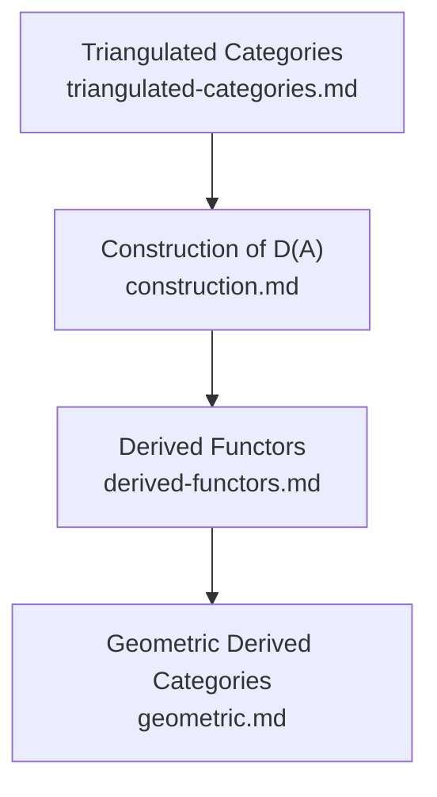

# Derived Categories: Overview

This file is the index for the `concepts/category-theory/derived-categories/` folder. It lists planned and written subtopic notes, organizes them by theme, and collects the canonical references for the field. Use it to decide what to write next without needing to re-survey the landscape.

---

## Notes in This Folder

| File | Status | Topic |
|------|--------|-------|
| `triangulated-categories.md` | ✅ Written | Axiomatic theory: additive categories, shift functor, TR1–TR4, octahedral axiom, homotopy category K(A) as the canonical example |
| `construction.md` | 🔲 Planned | Explicit construction of D(A): complexes, homotopy category, Verdier localization at quasi-isomorphisms, boundedness conditions D⁺/D⁻/Dᵇ |
| `derived-functors.md` | 🔲 Planned | Right/left derived functors RF and LF via injective/projective resolutions, δ-functor formalism, Grothendieck spectral sequence |
| `geometric.md` | 🔲 Planned | Derived categories of sheaves on schemes/ringed spaces, Grothendieck's six functors (f∗, f∗, f!, f!, ⊗ᴸ, RHom), proper base change |

---

## Subtopic Map

### Foundational Algebra

| Subtopic | Key Idea | Primary Source |
|----------|----------|----------------|
| Triangulated categories | Exact triangles axiomatize the cone construction; TR4 (octahedral axiom) encodes a coherence condition on compositions | Noohi (0704.1009), Weibel Ch. 10 |
| Homotopy category K(A) | Chain homotopies are the right notion of "sameness" before localizing; K(A) is triangulated but not abelian | Thomas (math/0001045), Gelfand–Manin |
| Verdier localization | Inverting quasi-isomorphisms via a calculus of fractions (Ore conditions); existence and universal property of D(A) | Verdier's thesis, Kashiwara–Schapira |
| Boundedness conditions | D⁺(A), D⁻(A), Dᵇ(A) carve out subcategories where derived functors are better behaved | Huybrechts Ch. 2 |

### Derived Functors

| Subtopic | Key Idea | Primary Source |
|----------|----------|----------------|
| Right derived functors RF | F left exact ⟹ RF = RHom, Rf∗, RΓ defined via injective resolutions | Weibel Ch. 5, Thomas |
| Left derived functors LF | F right exact ⟹ LF = ⊗ᴸ, Lf∗ defined via projective/flat resolutions | Weibel Ch. 5 |
| Grothendieck spectral sequence | Composition of derived functors; R(G∘F) ≃ RG∘RF when F sends injectives to G-acyclics | Weibel Ch. 5, McCleary |
| δ-functors and universality | Universal δ-functors extend uniquely from an exact functor; cohomological foundations | Grothendieck "Tohoku" |

### Geometric Applications

| Subtopic | Key Idea | Primary Source |
|----------|----------|----------------|
| D(X) for ringed spaces | D(𝒪_X-Mod) and Dᵇ(Coh(X)); subtlety of coherent vs. quasi-coherent | Huybrechts, SGA 4 |
| Six functor formalism | f∗, f∗, f!, f!, ⊗ᴸ, RHom form two adjoint pairs + duality; proper base change theorem | SGA 4, Kashiwara–Schapira, Scholze |
| Fourier–Mukai transforms | Integral kernels 𝒫 ∈ Dᵇ(X×Y) define exact functors; Orlov representability theorem | Huybrechts, Orlov |

---

## Dependency Graph

---

## Master References

| Reference | Authors | Year | What It Covers | Link |
|-----------|---------|------|----------------|------|
| "Sur quelques points d'algèbre homologique" (Tôhoku) | A. Grothendieck | 1957 | Introduces abelian categories, AB5, injective resolutions, Grothendieck spectral sequence — the direct ancestor of everything here | [Project Euclid](https://projecteuclid.org/journals/tohoku-mathematical-journal/volume-9/issue-2/Sur-quelques-points-dalg%C3%A8bre-homologique-I/10.2748/tmj/1178244839.full) · [Barr translation PDF](https://www.math.mcgill.ca/barr/papers/gk.pdf) |
| "Des catégories dérivées des catégories abéliennes" | J.-L. Verdier | 1963/1996 | The founding text: TR1–TR4 + octahedral axiom, K(A), D(A) via localization, calculus of fractions. Verdier's 1963 Paris thesis; published posthumously in Astérisque 239 | [Numdam](https://numdam.org/item/AST_1996__239__R1_0/) |
| "Residues and Duality" | R. Hartshorne (after Grothendieck) | 1966 | First book-length treatment of D(X) for schemes; dualizing complexes, Rf∗, Grothendieck duality theorem | [Springer LNM 20](https://link.springer.com/book/10.1007/BFb0080482) |
| "Faisceaux pervers" (BBD) | A. Beilinson, J. Bernstein, P. Deligne | 1982 | t-structures, perverse t-structure on constructible sheaves, six operations (f∗, f∗, f!, f!, ⊗, RHom). Foundational for geometric D(X) | [Numdam](http://www.numdam.org/item/AST_1982__100__1_0.pdf) |
| "Enhanced Triangulated Categories" | A. I. Bondal, M. M. Kapranov | 1990 | Introduces pretriangulated dg-categories as enhancements; resolves non-functoriality of cones | [nLab PDF](https://ncatlab.org/nlab/files/bondalKaprEnhTRiangCat.pdf) |
| "An Introduction to Homological Algebra" | C. A. Weibel | 1994 | Standard graduate textbook; Ch. 5 (derived functors, spectral sequences), Ch. 10 (triangulated cats, D(A)) | [Cambridge UP](https://www.cambridge.org/core/books/an-introduction-to-homological-algebra/AAA3F16482097015CD12D4376D505282) · [Author draft PDF](https://www.sas.rochester.edu/mth/sites/doug-ravenel/otherpapers/weibel-homv2.pdf) |
| "Methods of Homological Algebra" | S. I. Gelfand, Yu. I. Manin | 1996 | Systematic treatment of derived and triangulated cats (Chs. 4–5), derived functors, spectral sequences; high level of abstraction | [Springer](https://link.springer.com/book/10.1007/978-3-662-12492-5) |
| "Sheaves on Manifolds" | M. Kashiwara, P. Schapira | 1990 | Bounded derived cats of sheaves, six Grothendieck operations, specialization, microlocalization, duality — definitive analytic reference | [Springer](https://link.springer.com/book/10.1007/978-3-662-02661-8) |
| "Categories and Sheaves" | M. Kashiwara, P. Schapira | 2006 | Rigorous self-contained reference from scratch through unbounded derived cats, triangulated cats, Grothendieck topologies | [Springer (Grundlehren 332)](https://link.springer.com/book/10.1007/3-540-27950-4) · [PDF](https://pages.jh.edu/rrynasi1/FoundationsOFMath/Literature/Textbooks/Kashiwara+Schapira2006Categories+Sheaves.pdf) |
| "Fourier-Mukai Transforms in Algebraic Geometry" | D. Huybrechts | 2006 | Dᵇ(X) for smooth projective varieties (Chs. 1–3), Fourier–Mukai transforms, equivalences of derived categories | [Oxford UP](https://academic.oup.com/book/11573) · [Author PDF](https://homepage.mi-ras.ru/~akuznet/homalg/Huybrechts_Fourier-Mukai_transforms.pdf) |
| "Notes on Derived Functors and Grothendieck Duality" | J. Lipman | 2009 | Modern rigorous account of Grothendieck duality: quasi-proper maps, twisted inverse image f!, tor-independent base change | [Springer LNM 1960](https://link.springer.com/book/10.1007/978-3-540-85420-3) |
| "Derived Categories and Their Uses" | B. Keller | 1996 | Concise expository survey: D(A) construction, derived functors, derived Morita theory, tilting. Widely cited as the most readable short introduction | [Edinburgh PDF](https://webhomes.maths.ed.ac.uk/~v1ranick/papers/keller.pdf) |
| "On Differential Graded Categories" | B. Keller | 2006 | ICM survey: why triangulated cats need DG enhancements, Bondal–Kapranov construction, DG quotients, cluster categories | [arXiv:math/0601185](https://arxiv.org/abs/math/0601185) |
| "Generators and Representability of Functors" | A. I. Bondal, M. Van den Bergh | 2003 | Strong generators of Dᵇ(Coh X) for smooth proper varieties; saturation; consequences for autoequivalences | [arXiv:math/0204218](https://arxiv.org/abs/math/0204218) |
| "Lectures on derived and triangulated categories" | B. Noohi | 2007 | Self-contained intro: additive cats, triangulated cats, localization, derived functors, tilting. Good for TR1–TR4 | [arXiv:0704.1009](https://arxiv.org/abs/0704.1009) |
| "Derived categories for the working mathematician" | R. P. Thomas | 2000 | Gentle intro motivated by algebraic geometry and topology; Ext, Tor, hypercohomology framed accessibly | [arXiv:math/0001045](https://arxiv.org/abs/math/0001045) |
| Merrick Cai lecture notes | Merrick Cai | — | Concise notes: triangulated categories, D(A), derived functors, t-structures | [PDF](https://merrickcai.com/pdfs_notes/Derived%20Categories.pdf) |
| "Trying to understand BBD" | Akhil Mathew | 2011 | Blog post on t-structures, truncation functors, hearts, and perverse sheaves from the BBD paper | [Blog](https://amathew.wordpress.com/2011/06/23/trying-to-understand-bbd/) |
| Stacks Project, Ch. 13 "Derived Categories" | The Stacks Project Authors | ongoing | Machine-verified comprehensive reference: triangulated cats, K(A), localization, derived functors; Ch. 36 covers D(X) for schemes | [Ch. 13](https://stacks.math.columbia.edu/tag/05QI) · [Ch. 36](https://stacks.math.columbia.edu/tag/08CU) |
