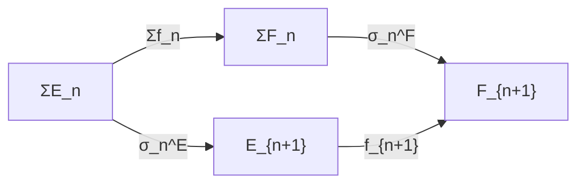

# Spectra and the Stable Homotopy Category

## Table of Contents

- [[#1. Motivation: Stabilization|1. Motivation: Stabilization]]
  - [[#1.1 The Suspension Homomorphism|1.1 The Suspension Homomorphism]]
  - [[#1.2 Stable Homotopy Groups and the Freudenthal Suspension Theorem|1.2 Stable Homotopy Groups and the Freudenthal Suspension Theorem]]
  - [[#1.3 Why Stabilize? The Algebraic Payoff|1.3 Why Stabilize? The Algebraic Payoff]]
- [[#2. Sequential Spectra|2. Sequential Spectra]]
  - [[#2.1 The Definition|2.1 The Definition]]
  - [[#2.2 Morphisms and the Category Sp|2.2 Morphisms and the Category Sp]]
  - [[#2.3 Key Examples|2.3 Key Examples]]
  - [[#2.4 Omega-Spectra: The Fibrant Objects|2.4 Omega-Spectra: The Fibrant Objects]]
- [[#3. Homotopy Groups of Spectra|3. Homotopy Groups of Spectra]]
  - [[#3.1 Definition via Colimit|3.1 Definition via Colimit]]
  - [[#3.2 The Analogy Table|3.2 The Analogy Table]]
  - [[#3.3 Key Computations|3.3 Key Computations]]
- [[#4. The Stable Homotopy Category SH|4. The Stable Homotopy Category SH]]
  - [[#4.1 The Naive Approach and Its Failure|4.1 The Naive Approach and Its Failure]]
  - [[#4.2 The Stable Model Structure|4.2 The Stable Model Structure]]
  - [[#4.3 SH as a Triangulated Category|4.3 SH as a Triangulated Category]]
  - [[#4.4 The Sphere Spectrum as Monoidal Unit|4.4 The Sphere Spectrum as Monoidal Unit]]
- [[#5. The Smash Product and Ring Spectra|5. The Smash Product and Ring Spectra]]
  - [[#5.1 The Problem with the Naive Smash Product|5.1 The Problem with the Naive Smash Product]]
  - [[#5.2 Symmetric Monoidal Categories of Spectra|5.2 Symmetric Monoidal Categories of Spectra]]
  - [[#5.3 Ring Spectra and Module Spectra|5.3 Ring Spectra and Module Spectra]]
- [[#6. The Comparison: D(Ab) and HZ-Modules|6. The Comparison: D(Ab) and HZ-Modules]]
  - [[#6.1 The Eilenberg-MacLane Functor|6.1 The Eilenberg-MacLane Functor]]
  - [[#6.2 Dold-Kan and Connective Spectra|6.2 Dold-Kan and Connective Spectra]]
  - [[#6.3 Shipley's Theorem|6.3 Shipley's Theorem]]
  - [[#6.4 Splitting of HZ-Modules|6.4 Splitting of HZ-Modules]]
- [[#7. Key Examples of Spectra|7. Key Examples of Spectra]]
  - [[#7.1 The Sphere Spectrum|7.1 The Sphere Spectrum]]
  - [[#7.2 Eilenberg-MacLane Spectra|7.2 Eilenberg-MacLane Spectra]]
  - [[#7.3 K-Theory Spectra|7.3 K-Theory Spectra]]
  - [[#7.4 The Complex Cobordism Spectrum MU|7.4 The Complex Cobordism Spectrum MU]]
- [[#8. SH as Universal: Brown Representability and Infinity-Categorical Universality|8. SH as Universal: Brown Representability and Infinity-Categorical Universality]]
  - [[#8.1 Brown Representability|8.1 Brown Representability]]
  - [[#8.2 SH as the Initial Stable Infinity-Category|8.2 SH as the Initial Stable Infinity-Category]]
- [[#References|References]]

---

## 1. Motivation: Stabilization 🔍

### 1.1 The Suspension Homomorphism

We begin with the most basic construction in pointed homotopy theory. Let $(X, x_0)$ be a based topological space. The *reduced suspension* of $X$ is

$$\Sigma X = X \wedge S^1 = (X \times S^1) / (X \vee S^1),$$

where $X \wedge S^1$ is the *smash product* formed by collapsing the *wedge* $X \vee S^1 = (X \times \{*\}) \cup (\{x_0\} \times S^1)$ to a point.

**Definition (Suspension homomorphism).** For a based space $X$, the *suspension homomorphism* is the map

$$\Sigma: \pi_n(X) \longrightarrow \pi_{n+1}(\Sigma X)$$

defined as follows. Given a based map $f: S^n \to X$ representing a class $[f] \in \pi_n(X)$, the suspension $\Sigma f: S^{n+1} \to \Sigma X$ is the map induced on smash products: $\Sigma f = f \wedge \mathrm{id}_{S^1}: S^n \wedge S^1 \to X \wedge S^1$.

This is well-defined on homotopy classes because a homotopy $f \simeq g$ suspends to $\Sigma f \simeq \Sigma g$.

> [!NOTE] Why is $\Sigma$ a homomorphism?
> The group structure on $\pi_{n+1}(\Sigma X)$ is defined by concatenation of loops (or equivalently, folding of spheres). One checks that $\Sigma$ respects this structure: $\Sigma([f] \cdot [g]) = \Sigma[f] \cdot \Sigma[g]$. This uses the fact that the fold map $S^n \vee S^n \to S^n$ suspends to the fold map $S^{n+1} \vee S^{n+1} \to S^{n+1}$, compatibly with the group structure.

### 1.2 Stable Homotopy Groups and the Freudenthal Suspension Theorem

The fundamental question is: when does $\Sigma$ become an isomorphism? The answer is provided by a cornerstone theorem.

**Theorem (Freudenthal Suspension Theorem).** Let $X$ be a $(k-1)$-connected based CW complex (i.e., $\pi_i(X) = 0$ for $i < k$). Then the suspension homomorphism

$$\Sigma: \pi_n(X) \longrightarrow \pi_{n+1}(\Sigma X)$$

is an *isomorphism* for $n < 2k - 1$ and a *surjection* for $n = 2k - 1$.

*Proof sketch.* Apply the Blakers–Massey theorem (homotopy excision) to the pushout square defining $\Sigma X = CX \cup_X CX$, where $CX$ is the cone. If $X$ is $(k-1)$-connected and $CX$ is contractible (hence $(-1)$-connected as a cone), homotopy excision gives isomorphisms in the claimed range. $\square$

As a consequence, for $X = S^m$ (which is $(m-1)$-connected), the suspension maps

$$\pi_n(S^m) \xrightarrow{\Sigma} \pi_{n+1}(S^{m+1}) \xrightarrow{\Sigma} \pi_{n+2}(S^{m+2}) \xrightarrow{\Sigma} \cdots$$

stabilize: for fixed $n - m = k$, the maps become isomorphisms once $m > k + 1$.

**Definition (Stable homotopy groups).** For a based space $X$, the *$n$-th stable homotopy group* of $X$ is

$$\pi_n^s(X) = \operatorname{colim}_{k \to \infty} \pi_{n+k}(\Sigma^k X),$$

where the colimit is taken along the suspension homomorphisms $\pi_{n+k}(\Sigma^k X) \xrightarrow{\Sigma} \pi_{n+k+1}(\Sigma^{k+1} X)$.

The Freudenthal theorem guarantees this colimit stabilizes after finitely many steps. The *stable stems* are defined as $\pi_n^s = \pi_n^s(S^0)$.

> [!EXAMPLE] First few stable stems
> The stable homotopy groups of spheres begin:
> - $\pi_0^s \cong \mathbb{Z}$ (generated by the identity map)
> - $\pi_1^s \cong \mathbb{Z}/2$ (generated by the stable Hopf map $\eta$)
> - $\pi_2^s \cong \mathbb{Z}/2$ (generated by $\eta^2$)
> - $\pi_3^s \cong \mathbb{Z}/24$ (generated by $\nu$, the stable quaternionic Hopf map)
> - $\pi_4^s = \pi_5^s = \pi_6^s \cong 0$
>
> These are notoriously difficult to compute; computing further stable stems is one of the central problems of algebraic topology.

### 1.3 Why Stabilize? The Algebraic Payoff

Stable homotopy groups have vastly better formal properties than their unstable counterparts:

1. **Additivity.** The functor $X \mapsto \pi_n^s(X)$ is an abelian group valued functor on based spaces.
2. **Long exact sequences.** A cofibration sequence $A \hookrightarrow X \to X/A$ induces a long exact sequence $\cdots \to \pi_n^s(A) \to \pi_n^s(X) \to \pi_n^s(X/A) \to \pi_{n-1}^s(A) \to \cdots$
3. **Suspension isomorphism.** $\pi_n^s(\Sigma X) \cong \pi_n^s(X)$.

These properties suggest we should work in a category where $\Sigma$ is an *equivalence* — not just a map, but an actual isomorphism. **The stable homotopy category $\mathrm{SH}$ is precisely such a category: a homotopy-theoretic analogue of $D(\mathbf{Ab})$ where suspension plays the role of the shift functor $[1]$.**

---

> [!QUESTION] Exercise 1: Stability Range for Spheres
> *This problem verifies the Freudenthal theorem in the most explicit case and establishes the vocabulary for the stable range.*
>
> > **Prerequisites:** [[#1.2 Stable Homotopy Groups and the Freudenthal Suspension Theorem|1.2 The Freudenthal Suspension Theorem]]
>
> Let $X = S^n$ for $n \geq 1$. Determine the smallest integer $m$ such that $\Sigma: \pi_k(S^n) \to \pi_{k+1}(S^{n+1})$ is an isomorphism for all $k \leq m$, in terms of $n$. Using the known values $\pi_{2n-1}(S^n) \cong \mathbb{Z}$ for all $n$ and $\pi_{2n}(S^n) \cong \mathbb{Z}/2$ for $n \geq 2$, verify that the boundary case $k = 2n - 1$ in the Freudenthal theorem is sharp (i.e., the map can fail to be an isomorphism there).

> [!TIP]- Solution to Exercise 1
> **Key insight:** $S^n$ is $(n-1)$-connected, so the Freudenthal theorem gives isomorphisms for $k < 2(n) - 1 = 2n - 1$, hence the stable range is $k \leq 2n - 2$.
>
> **Sketch:** For $k = 2n - 1$, Freudenthal only gives surjectivity, not injectivity. Indeed, $\pi_{2n-1}(S^n) \cong \mathbb{Z}$ (generated by the Whitehead product $[\iota_n, \iota_n]$), while $\pi_{2n}(S^{n+1}) \cong \mathbb{Z}/2$ (for $n \geq 2$). The suspension map $\mathbb{Z} \to \mathbb{Z}/2$ is surjective but not injective — confirming the bound is sharp. The kernel of $\Sigma: \pi_{2n-1}(S^n) \to \pi_{2n}(S^{n+1})$ is generated by $[\iota_n, \iota_n]$ minus twice a generator.

---

## 2. Sequential Spectra 📐

### 2.1 The Definition

The key data of a spectrum is a sequence of spaces together with structure maps that encode the suspension isomorphism.

**Definition (Sequential Spectrum).** A *sequential spectrum* (or simply a *spectrum*) $E$ consists of:
1. A sequence of based topological spaces $(E_n)_{n \geq 0}$.
2. *Structure maps*: based continuous maps $\sigma_n: \Sigma E_n \to E_{n+1}$ for each $n \geq 0$.

The adjoint of each structure map, via the based loop-suspension adjunction $[\Sigma X, Y]_* \cong [X, \Omega Y]_*$, is a map

$$\tilde{\sigma}_n: E_n \longrightarrow \Omega E_{n+1}.$$

These adjoint structure maps $\tilde{\sigma}_n$ will be central to the definition of $\Omega$-spectra below.

> [!NOTE] Notation
> We write $\Omega Y = \mathrm{Map}_*(S^1, Y)$ for the based loop space, and use the canonical homeomorphism $\Omega \Sigma X \simeq \Omega(X \wedge S^1)$. The adjunction $\Sigma \dashv \Omega$ is the foundational adjunction of based homotopy theory.

### 2.2 Morphisms and the Category Sp

**Definition (Morphism of Spectra).** A *morphism* $f: E \to F$ of sequential spectra is a collection of based maps $f_n: E_n \to F_n$ for $n \geq 0$ that commute with the structure maps: for each $n$, the following diagram commutes:



The category of sequential spectra with these morphisms is denoted $\mathbf{Sp}$ (or $\mathbf{Sp}^N$ to emphasize the sequential/naive nature).

### 2.3 Key Examples

**Example (Suspension spectrum).** For a based space $X$, the *suspension spectrum* $\Sigma^\infty X$ is defined by

$$(\Sigma^\infty X)_n = \Sigma^n X$$

with structure maps the identity: $\sigma_n: \Sigma(\Sigma^n X) = \Sigma^{n+1} X \xrightarrow{=} \Sigma^{n+1} X$. This is the most fundamental construction connecting unstable and stable homotopy theory; it sends $X$ to the spectrum that remembers all of $X$'s stable data.

**Example (Sphere spectrum).** The *sphere spectrum* $\mathbb{S} = \Sigma^\infty S^0$ has $\mathbb{S}_n = \Sigma^n S^0 = S^n$, with structure maps the identity $\Sigma S^n \cong S^{n+1}$.

**Example (Eilenberg–MacLane spectrum).** For an abelian group $A$, the *Eilenberg–MacLane spectrum* $HA$ is defined by

$$(HA)_n = K(A, n),$$

where $K(A, n)$ is the *Eilenberg–MacLane space* characterized by $\pi_k(K(A,n)) = A$ if $k = n$ and $= 0$ otherwise. The structure maps arise from the weak equivalence $K(A, n) \xrightarrow{\sim} \Omega K(A, n+1)$, which is the fundamental property of Eilenberg–MacLane spaces.

> [!INFO] Why Eilenberg-MacLane spaces work
> The equivalence $K(A, n) \simeq \Omega K(A, n+1)$ follows from the fact that $\pi_k(\Omega K(A,n+1)) = \pi_{k+1}(K(A,n+1))$, and $K(A,n+1)$ has homotopy groups $A$ in degree $n+1$ and $0$ elsewhere, so $\Omega K(A,n+1)$ has homotopy groups $A$ in degree $n$ and $0$ elsewhere, uniquely characterizing $K(A,n)$ up to weak equivalence. This makes $HA$ an $\Omega$-spectrum.

**Example (Real and complex K-theory spectra).** The *complex K-theory spectrum* $KU$ is defined by Bott periodicity: $(KU)_{2n} = \mathbb{Z} \times BU$ and $(KU)_{2n+1} = U$, where $BU$ is the classifying space for stable complex vector bundles and $U = \operatorname{colim}_n U(n)$. The structure maps use the Bott periodicity equivalences $\Omega U \simeq \mathbb{Z} \times BU$ and $\Omega(\mathbb{Z} \times BU) \simeq U$.

### 2.4 Omega-Spectra: The Fibrant Objects

**Definition (Omega-spectrum).** A spectrum $E$ is an *$\Omega$-spectrum* if each adjoint structure map $\tilde{\sigma}_n: E_n \to \Omega E_{n+1}$ is a weak homotopy equivalence.

$\Omega$-spectra are the "fibrant" objects in the stable model structure on $\mathbf{Sp}$ — they are the spectra with well-behaved homotopy types at every level. The examples $HA$ and $KU$ above are $\Omega$-spectra; the suspension spectrum $\Sigma^\infty X$ is generally not (since $\Sigma^n X \not\simeq \Omega \Sigma^{n+1} X$ in general).

> [!WARNING] Not all spectra are Omega-spectra
> The suspension spectrum $\Sigma^\infty X$ fails to be an $\Omega$-spectrum unless $X$ is already an infinite loop space. By James' theorem, $\Omega \Sigma X \simeq J(X)$ (the James construction, a free monoid on $X$), which is generally much larger than $X$. One says $\Sigma^\infty X$ is *not fibrant*; fibrant replacement produces the *spectrification* of $\Sigma^\infty X$, a genuinely different spectrum.

---

> [!QUESTION] Exercise 2: The Suspension Spectrum of a Point
> *This problem computes the simplest suspension spectrum and foreshadows why the sphere spectrum is the unit of SH.*
>
> > **Prerequisites:** [[#2.3 Key Examples|2.3 Key Examples]]
>
> Let $* = S^0 / (S^0 \setminus \{*\})$ be the one-point based space. (a) Compute $\Sigma^\infty(*)_n$ for all $n$. (b) Show that $\Sigma^\infty(*)$ is not the zero spectrum. (c) Compare with $\Sigma^\infty S^0 = \mathbb{S}$: what is the relationship between $\Sigma^\infty(*)$ and the zero object in $\mathbf{Sp}$?

> [!TIP]- Solution to Exercise 2
> **Key insight:** The one-point space $*$ is also the based point itself, so $\Sigma^n(*) = *$ for all $n$. The spectrum $\Sigma^\infty(*)$ has all spaces equal to a point, with trivial structure maps — this is the zero spectrum (the zero object).
>
> **Sketch:** (a) $(\Sigma^\infty *)_n = \Sigma^n * = *$ since smashing with $S^1$ takes $*$ to $*$ (the basepoint of the smash product). (b) Wait — in fact $\Sigma^\infty *$ is the zero spectrum, which is the zero object. Compare: $\Sigma^\infty S^0 = \mathbb{S}$ has $\mathbb{S}_n = S^n$, which is not contractible. The distinction is between the based one-point space (the zero object) and $S^0$ (two points, one basepoint) — $S^0$ is the monoidal unit for the smash product, not the zero.

> [!QUESTION] Exercise 3: Eilenberg-MacLane is an Omega-Spectrum
> *This problem verifies the fibrant condition for the fundamental example.*
>
> > **Prerequisites:** [[#2.4 Omega-Spectra: The Fibrant Objects|2.4 Omega-Spectra]]
>
> Let $A$ be an abelian group. Using the universal property of Eilenberg–MacLane spaces (characterized up to weak equivalence by their homotopy groups), prove that the adjoint structure map $\tilde{\sigma}_n: K(A, n) \to \Omega K(A, n+1)$ is a weak homotopy equivalence, verifying that $HA$ is an $\Omega$-spectrum.

> [!TIP]- Solution to Exercise 3
> **Key insight:** Both $K(A,n)$ and $\Omega K(A, n+1)$ are Eilenberg–MacLane spaces for $A$ concentrated in degree $n$.
>
> **Sketch:** Compute $\pi_k(\Omega K(A, n+1)) = \pi_{k+1}(K(A, n+1))$. Since $K(A, n+1)$ is the Eilenberg–MacLane space with $\pi_{n+1} = A$ and all other homotopy groups $0$, we get $\pi_k(\Omega K(A,n+1)) = A$ for $k = n$ and $0$ otherwise. This is precisely the homotopy type of $K(A, n)$. By Whitehead's theorem applied to CW complexes, any map inducing isomorphisms on all homotopy groups is a weak equivalence; the adjoint structure map induces such isomorphisms, so it is a weak equivalence.

---

## 3. Homotopy Groups of Spectra 📊

### 3.1 Definition via Colimit

**Definition (Homotopy groups of a spectrum).** For a sequential spectrum $E$ and $n \in \mathbb{Z}$, the *$n$-th homotopy group* of $E$ is

$$\pi_n(E) = \operatorname{colim}_{k \geq \max(0, -n)} \pi_{n+k}(E_k),$$

where the colimit is taken along the maps

$$\pi_{n+k}(E_k) \xrightarrow{(\sigma_k)_*} \pi_{n+k+1}(\Sigma E_k) \xrightarrow{(\sigma_k)_*} \pi_{n+k+1}(E_{k+1}).$$

More explicitly: the structure map $\sigma_k: \Sigma E_k \to E_{k+1}$ induces, via post-composition, a map $\pi_{n+k+1}(\Sigma E_k) \to \pi_{n+k+1}(E_{k+1})$; combined with the suspension isomorphism $\pi_{n+k}(E_k) \cong \pi_{n+k+1}(\Sigma E_k)$ (which holds unconditionally as an abstract map), we get the transition maps of the colimit system.

The crucial observation is that $\pi_n(E)$ is defined for **all** $n \in \mathbb{Z}$ — spectra have *negative homotopy groups*, unlike spaces. For $n < 0$, choose $k$ large enough so $n + k \geq 1$ and compute $\pi_{n+k}(E_k)$ ordinarily; the colimit stabilizes by the Freudenthal theorem applied to $E$ (if $E$ is an $\Omega$-spectrum).

> [!NOTE] Negative homotopy groups
> A space $X$ has $\pi_n(X) = 0$ for $n < 0$ by definition. But a spectrum $E$ can have $\pi_{-n}(E) \neq 0$ for $n > 0$. This is the first concrete sense in which spectra are genuinely richer than spaces: they support a full $\mathbb{Z}$-graded homotopy theory, exactly analogous to how chain complexes $A^\bullet$ have cohomology in all degrees $H^n(A^\bullet)$, including $n < 0$ for unbounded complexes.

### 3.2 The Analogy Table

The central thesis of this note is that spectra are the homotopy-theoretic analogue of chain complexes. The following table makes this precise.

| Homological Algebra | Stable Homotopy Theory |
|---------------------|------------------------|
| Abelian group $A$ | Spectrum $E$ |
| Chain complex $A^\bullet$ | Sequential spectrum |
| Cohomology $H^n(A^\bullet)$ | Homotopy group $\pi_{-n}(E)$ |
| Derived category $D(\mathbf{Ab})$ | Stable homotopy category $\mathrm{SH}$ |
| Shift functor $[1]$ | Suspension $\Sigma$ |
| Quasi-isomorphism | Stable weak equivalence (isomorphism on $\pi_*$) |
| $H\mathbb{Z}$-module spectrum | Complex of abelian groups |
| Integral Eilenberg–MacLane $H\mathbb{Z}$ | The integers $\mathbb{Z}$ (unit for $\otimes$) |
| $\mathbb{Z}$-linear algebra | $\mathrm{SH}$-linear stable homotopy theory |
| Künneth formula in $D(\mathbf{Ab})$ | Künneth formula for $H\mathbb{Z}$-modules |

**We return to this table throughout the note. Every theorem about $\mathrm{SH}$ has a homological-algebra analogue, and vice versa.**

### 3.3 Key Computations

The following homotopy group computations are fundamental.

**Computation 1 (Sphere spectrum).** For the sphere spectrum $\mathbb{S} = \Sigma^\infty S^0$:

$$\pi_n(\mathbb{S}) = \pi_n^s = \text{$n$-th stable homotopy group of spheres.}$$

Indeed, $\pi_n(\mathbb{S}) = \operatorname{colim}_k \pi_{n+k}(S^k)$, which is exactly the stable stem $\pi_n^s$ by definition. These groups encode the global complexity of stable homotopy theory and remain incompletely understood.

**Computation 2 (Integral Eilenberg–MacLane spectrum).** For $H\mathbb{Z}$:

$$\pi_n(H\mathbb{Z}) = \begin{cases} \mathbb{Z} & n = 0 \\ 0 & n \neq 0. \end{cases}$$

*Proof.* $\pi_n(H\mathbb{Z}) = \operatorname{colim}_k \pi_{n+k}(K(\mathbb{Z}, k))$. But $\pi_{n+k}(K(\mathbb{Z},k)) = \mathbb{Z}$ if $n + k = k$ (i.e., $n = 0$) and $= 0$ if $n + k \neq k$ (for $k$ large enough). The colimit stabilizes immediately. $\square$

**Computation 3 (Mod-$p$ spectrum).** Similarly, $\pi_n(H\mathbb{F}_p) = \mathbb{F}_p$ if $n = 0$ and $0$ otherwise.

**Computation 4 (Complex K-theory spectrum).** By Bott periodicity:

$$\pi_n(KU) = \begin{cases} \mathbb{Z} & n \text{ even} \\ 0 & n \text{ odd.} \end{cases}$$

This two-periodicity is the spectral incarnation of the Bott periodicity theorem $\Omega^2 BU \simeq BU$.

---

> [!QUESTION] Exercise 4: Homotopy Groups via Omega-Spectrum
> *This problem gives a direct formula for homotopy groups when the spectrum is fibrant.*
>
> > **Prerequisites:** [[#3.1 Definition via Colimit|3.1 Definition via Colimit]], [[#2.4 Omega-Spectra: The Fibrant Objects|2.4 Omega-Spectra]]
>
> Let $E$ be an $\Omega$-spectrum. Show that $\pi_n(E) \cong \pi_{n+k}(E_k)$ for any $k \geq \max(0, -n)$, i.e., the colimit system is already constant. In particular, show that $\pi_n(HA) \cong \pi_{n+k}(K(A,k))$ and deduce Computation 2 and 3 above directly.

> [!TIP]- Solution to Exercise 4
> **Key insight:** For an $\Omega$-spectrum, each transition map $\pi_{n+k}(E_k) \to \pi_{n+k+1}(E_{k+1})$ is an isomorphism.
>
> **Sketch:** The transition map factors as $\pi_{n+k}(E_k) \xrightarrow{\Sigma} \pi_{n+k+1}(\Sigma E_k) \xrightarrow{(\sigma_k)_*} \pi_{n+k+1}(E_{k+1})$. Since $E$ is an $\Omega$-spectrum, $\tilde\sigma_k: E_k \to \Omega E_{k+1}$ is a weak equivalence, so $(\sigma_k)_* \circ \Sigma$ is an isomorphism (the adjoint to $\sigma_k$ is the adjoint structure map, and weak equivalences induce isomorphisms on $\pi_*$). Hence the colimit of a system of isomorphisms is just the first term. For $HA$: $\pi_{n+k}(K(A,k)) = A$ if $n = 0$ and $0$ otherwise (for $k \geq 1$, $n + k \geq 1$), giving Computations 2 and 3.

> [!QUESTION] Exercise 5: A Spectrum with Nontrivial Negative Homotopy
> *This problem constructs an explicit spectrum with nonzero negative homotopy groups, making concrete the difference between spaces and spectra.*
>
> > **Prerequisites:** [[#3.1 Definition via Colimit|3.1 Definition via Colimit]]
>
> Define a spectrum $E$ by $E_n = K(\mathbb{Z}, n+2)$ for $n \geq 0$, with structure maps from the $\Omega$-spectrum structure of $H\mathbb{Z}$ shifted by two. Compute $\pi_n(E)$ for all $n \in \mathbb{Z}$ and identify the spectrum $E$ up to equivalence.

> [!TIP]- Solution to Exercise 5
> **Key insight:** Shifting a spectrum by $k$ positions shifts homotopy groups: $\pi_n(E[k]) = \pi_{n-k}(E)$.
>
> **Sketch:** This spectrum $E$ is the two-fold desuspension $\Sigma^{-2} H\mathbb{Z}$. We have $\pi_n(E) = \operatorname{colim}_k \pi_{n+k}(K(\mathbb{Z}, k+2)) = \mathbb{Z}$ if $n + k = k + 2$, i.e., $n = 2$, and $0$ otherwise. Wait — recheck: $\pi_{n+k}(K(\mathbb{Z}, k+2)) = \mathbb{Z}$ iff $n + k = k + 2$, i.e., $n = 2$. So $\pi_n(E) = \mathbb{Z}$ for $n = 2$ and $0$ elsewhere. This is $\Sigma^2 H\mathbb{Z}$, not $\Sigma^{-2}H\mathbb{Z}$. The spectrum $\Sigma^{-2}H\mathbb{Z}$ would have $\pi_{-2} = \mathbb{Z}$ and $0$ elsewhere — to see such a spectrum as sequential spectra requires the abstract stable model structure where negative shifts exist formally.

---

## 4. The Stable Homotopy Category SH 🔑

This is the heart of the note. We construct $\mathrm{SH}$, verify its triangulated structure, and make precise the analogy with $D(\mathbf{Ab})$.

### 4.1 The Naive Approach and Its Failure

The most obvious approach to defining $\mathrm{SH}$ is to take $\mathbf{Sp}$ as objects and formally invert *stable weak equivalences* — maps $f: E \to F$ inducing isomorphisms $\pi_n(f): \pi_n(E) \xrightarrow{\sim} \pi_n(F)$ for all $n \in \mathbb{Z}$.

This gives a category. But it has poor formal properties: not every object is fibrant or cofibrant, so many constructions (including the smash product and mapping spectra) are not homotopy-invariant at the naive level. *The naive localization does not behave well.*

> [!WARNING] The set-theoretic and homotopy-theoretic issues
> In the naive localization, the morphism sets $\mathrm{SH}(E, F)$ can be computed as $[QE, RF]_{\mathbf{Sp}}$ where $Q, R$ are cofibrant and fibrant replacement functors — but this only works once we have a *model structure* guaranteeing these replacements exist and behave properly. The naive approach presupposes this infrastructure without building it.

### 4.2 The Stable Model Structure

**Definition (Stable model structure).** The *stable model structure* on $\mathbf{Sp}$ — due to Bousfield–Friedlander (1978) — is the model structure on sequential spectra in which:

- *Weak equivalences*: maps $f: E \to F$ with $\pi_n(f)$ an isomorphism for all $n \in \mathbb{Z}$.
- *Fibrations*: maps $f$ such that each $f_n: E_n \to F_n$ is a Serre fibration and each naturality square for the adjoint structure maps is a homotopy pullback.
- *Cofibrations*: maps determined by the left lifting property against acyclic fibrations.

The stable model structure arises from the strict model structure on $\mathbf{Sp}$ (where weak equivalences are levelwise weak homotopy equivalences) by a left Bousfield localization forcing the adjoint structure maps to become weak equivalences.

**Definition (Stable homotopy category).** The *stable homotopy category* is

$$\mathrm{SH} = \mathrm{Ho}(\mathbf{Sp}) = \mathbf{Sp}[\mathcal{W}^{-1}],$$

the homotopy category of the Bousfield–Friedlander model structure, obtained by formally inverting the stable weak equivalences $\mathcal{W}$.

Concretely, morphisms in $\mathrm{SH}$ are computed by

$$\mathrm{SH}(E, F) = [QE, RF]_{\mathbf{Sp}},$$

where $QE$ is a cofibrant replacement and $RF$ is a fibrant ($\Omega$-spectrum) replacement of $E$ and $F$ respectively, and $[-,-]_{\mathbf{Sp}}$ denotes homotopy classes of maps in $\mathbf{Sp}$.

> [!NOTE] Bousfield localization connects to the D(A) construction
> This is exactly the same formal procedure as constructing $D(\mathcal{A})$ from $\mathrm{K}(\mathcal{A})$ by inverting quasi-isomorphisms — see [[concepts/category-theory/derived-categories/triangulated-categories|Triangulated Categories]]. In both cases: (1) form a homotopy category, (2) identify the correct class of "weak equivalences," (3) localize. The difference is that spectra require the machinery of model categories to make the localization well-behaved, while for $D(\mathcal{A})$ Verdier's explicit construction suffices.

### 4.3 SH as a Triangulated Category

$\mathrm{SH}$ is a [[concepts/category-theory/derived-categories/triangulated-categories|triangulated category]] with:

- **Shift functor**: $E \mapsto \Sigma E = E \wedge S^1$ (suspension), with $(\Sigma E)_n = E_{n+1}$ (or more precisely, the pushout $E_n \cup_* *$).
- **Desuspension**: $\Sigma^{-1}$ exists as an actual functor in $\mathrm{SH}$ (unlike in the unstable category), since the model structure makes suspension an equivalence.
- **Distinguished triangles**: cofibre sequences $E \to F \to C(f) \to \Sigma E$, where $C(f)$ is the *mapping cone* of a map $f: E \to F$ of spectra.

**Theorem (SH is triangulated).** The stable homotopy category $\mathrm{SH}$ is a triangulated category satisfying axioms TR1–TR4.

*Proof sketch.* One verifies the axioms:
- (TR1): The identity $\mathrm{id}_E$ gives a distinguished triangle $E \xrightarrow{\mathrm{id}} E \to 0 \to \Sigma E$.
- (TR2): Rotation axiom holds because the mapping cone construction commutes with rotation: $\mathrm{Cone}(\Sigma f) \simeq \Sigma \mathrm{Cone}(f)$.
- (TR3): Completion of morphisms uses the fact that mapping cones are functorial up to homotopy.
- (TR4): The octahedral axiom holds because the cone of a composite is built from the cones of the factors via a cofibre sequence.

The key point is that in the *stable* setting, the *fibre sequence* and *cofibre sequence* of any map $f: E \to F$ coincide (up to equivalence), because the cofibre $C(f)$ is also the homotopy fibre $F(f)$ (shifted). This is the characteristic feature of stable categories.

**Proposition (Fiber = Cofiber in SH).** For any map $f: E \to F$ in $\mathrm{SH}$, there is a natural equivalence $\mathrm{hofib}(f) \simeq \Sigma^{-1} \mathrm{hocofib}(f)$.

This is a dramatic simplification over the unstable world: in $\mathrm{Ho}(\mathbf{Top}_*)$, fiber and cofiber sequences are genuinely distinct.

> [!EXAMPLE] The distinguished triangle of a cofiber sequence
> For the inclusion $i: S^n \hookrightarrow D^{n+1}$ (where $D^{n+1}$ is the $(n+1)$-disk), the homotopy cofiber is $D^{n+1}/S^n \simeq S^{n+1}$. Applying $\Sigma^\infty$, we get a distinguished triangle in $\mathrm{SH}$:
> $$\Sigma^\infty S^n \xrightarrow{\Sigma^\infty i} \Sigma^\infty D^{n+1} \to \Sigma^\infty S^{n+1} \to \Sigma^{n+1} \Sigma^\infty S^n.$$
> Since $D^{n+1}$ is contractible, $\Sigma^\infty D^{n+1} \simeq 0$ in $\mathrm{SH}$, so this simplifies to $\mathbb{S}[n] \to 0 \to \mathbb{S}[n+1] \to \mathbb{S}[n+1]$, consistent with $\mathrm{id}_{\mathbb{S}[n+1]}$ being a distinguished triangle.

### 4.4 The Sphere Spectrum as Monoidal Unit

The sphere spectrum $\mathbb{S} = \Sigma^\infty S^0$ plays the role of the ring $\mathbb{Z}$ in algebra:

$$\mathrm{SH}(\mathbb{S}, E) \cong \pi_0(E) \quad \text{for any spectrum } E.$$

More precisely, $\mathbb{S}$ is the monoidal unit for the smash product $\wedge$ on $\mathrm{SH}$ (constructed in the next section), and $\mathrm{SH}$ is the natural target for stable phenomena just as $\mathbf{Ab}$ is the natural target for linear algebra.

---

> [!QUESTION] Exercise 6: The Cofiber Sequence of a Degree-$p$ Map
> *This problem constructs the fundamental cofiber sequence in SH arising from multiplication by a prime, the stable analogue of the short exact sequence $0 \to \mathbb{Z} \xrightarrow{p} \mathbb{Z} \to \mathbb{Z}/p \to 0$.*
>
> > **Prerequisites:** [[#4.3 SH as a Triangulated Category|4.3 SH as a Triangulated Category]]
>
> Let $p: \mathbb{S} \to \mathbb{S}$ denote the degree-$p$ self-map of the sphere spectrum (summing the identity map $p$ times). (a) Write down the corresponding distinguished triangle in $\mathrm{SH}$. (b) The cofiber $\mathbb{S}/p$ (the *mod-$p$ Moore spectrum*) has $\pi_n(\mathbb{S}/p) = ?$ for all $n$. (c) Compare with the exact triangle $\mathbb{Z} \xrightarrow{p} \mathbb{Z} \to \mathbb{Z}/p \to \mathbb{Z}[1]$ in $D(\mathbf{Ab})$.

> [!TIP]- Solution to Exercise 6
> **Key insight:** The cofiber sequence in SH mirrors the short exact sequence in $D(\mathbf{Ab})$, but the Moore spectrum $\mathbb{S}/p$ is not the same as $H(\mathbb{Z}/p)$.
>
> **Sketch:** (a) The distinguished triangle is $\mathbb{S} \xrightarrow{p} \mathbb{S} \to \mathbb{S}/p \to \Sigma\mathbb{S}$. (b) Applying $\pi_*$ to this triangle gives a long exact sequence $\cdots \to \pi_n(\mathbb{S}) \xrightarrow{p} \pi_n(\mathbb{S}) \to \pi_n(\mathbb{S}/p) \to \pi_{n-1}(\mathbb{S}) \to \cdots$. So $\pi_0(\mathbb{S}/p) = \mathbb{Z}/p$, but $\pi_n(\mathbb{S}/p)$ for $n \neq 0$ depends on $\pi_n(\mathbb{S})$ and involves extensions — not all zero. (c) In $D(\mathbf{Ab})$, $H\mathbb{Z} \xrightarrow{p} H\mathbb{Z} \to H(\mathbb{Z}/p) \to H\mathbb{Z}[1]$, and $H(\mathbb{Z}/p)$ has only $\pi_0 = \mathbb{Z}/p$. The Moore spectrum $\mathbb{S}/p$ has richer higher homotopy (from the stable stems), while $H(\mathbb{Z}/p)$ is the algebraic version with no higher homotopy.

> [!QUESTION] Exercise 7: SH is Additive
> *This problem verifies that SH is an additive category, the necessary precondition for being triangulated.*
>
> > **Prerequisites:** [[#4.3 SH as a Triangulated Category|4.3 SH as a Triangulated Category]]
>
> Show that $\mathrm{SH}(E, F)$ carries a natural abelian group structure for any two spectra $E, F$, making $\mathrm{SH}$ an additive category. (Hint: show that finite products and coproducts coincide in $\mathrm{SH}$, i.e., that $E \vee F \simeq E \times F$ in $\mathrm{SH}$.)

> [!TIP]- Solution to Exercise 7
> **Key insight:** In a stable category, the codiagonal $E \vee F \to E \times F$ is an equivalence.
>
> **Sketch:** Consider the diagram $* \to F \to * $ and $E \to * \to *$. The map $E \vee F \to E \times F$ (the codiagonal) fits into a $2 \times 2$ grid of cofibration sequences. In a stable model category, the cofibre of $E \vee F \to E \times F$ is computed to be contractible (a Mayer–Vietoris argument), so the map is a weak equivalence. Concretely: $\pi_n(E \vee F) = \pi_n(E) \oplus \pi_n(F) = \pi_n(E \times F)$ for all $n$, since $\pi_n$ converts wedges to direct sums for spectra.

---

## 5. The Smash Product and Ring Spectra ⊗

### 5.1 The Problem with the Naive Smash Product

For based spaces $X, Y$, the smash product $X \wedge Y = (X \times Y)/(X \vee Y)$ is well-behaved and symmetric monoidal. For sequential spectra, a naive levelwise definition

$$(E \wedge F)_n = \bigvee_{p+q=n} E_p \wedge F_q$$

(with appropriate structure maps) does yield a smash product, but it fails to be associative or commutative *on the nose* — only up to coherent homotopy. Making these coherences strict requires passing to a better model of spectra.

*Surprisingly,* the defect is not a minor technical annoyance but a fundamental obstruction: the category $\mathbf{Sp}$ of sequential spectra does not admit a symmetric monoidal model structure compatible with the stable model structure. The smash product is only symmetric monoidal in $\mathrm{SH}$, not in $\mathbf{Sp}$ itself.

### 5.2 Symmetric Monoidal Categories of Spectra

The resolution required new foundations, developed in the late 1990s. The main options are:

1. **$S$-modules (EKMM, 1997):** Elmendorf–Kriz–Mandell–May construct a category of "$S$-modules" using the linear isometries operad, with a strictly associative and commutative smash product. The homotopy category recovers $\mathrm{SH}$.

2. **Symmetric spectra (Hovey–Shipley–Smith, 2000):** A *symmetric spectrum* $E$ has spaces $E_n$ with an action of the symmetric group $\Sigma_n$, and structure maps equivariant with respect to these actions. The category of symmetric spectra is closed symmetric monoidal, and the homotopy category is again $\mathrm{SH}$.

3. **Orthogonal spectra (Mandell–May, 2002):** Replace $\Sigma_n$ by the orthogonal group $O(n)$. These are also closed symmetric monoidal and Quillen equivalent to symmetric spectra.

In all three cases, the homotopy category is the same $\mathrm{SH}$. **The symmetric monoidal structure on $\mathrm{SH}$ is the smash product $\wedge$, with unit the sphere spectrum $\mathbb{S}$.**

### 5.3 Ring Spectra and Module Spectra

**Definition (Ring spectrum).** A *ring spectrum* (or *monoid in $\mathrm{SH}$*) is a spectrum $R$ equipped with maps

$$\mu: R \wedge R \to R \quad \text{(multiplication)}$$
$$\eta: \mathbb{S} \to R \quad \text{(unit)}$$

satisfying associativity and unitality in $\mathrm{SH}$:

$$\mu \circ (\mu \wedge \mathrm{id}_R) = \mu \circ (\mathrm{id}_R \wedge \mu): R \wedge R \wedge R \to R,$$
$$\mu \circ (\eta \wedge \mathrm{id}_R) = \mathrm{id}_R = \mu \circ (\mathrm{id}_R \wedge \eta).$$

A ring spectrum is *commutative* if $\mu \circ \tau = \mu$ where $\tau: R \wedge R \xrightarrow{\sim} R \wedge R$ is the twist map.

**Definition (Module spectrum).** An *$R$-module spectrum* is a spectrum $M$ with an action map $\rho: R \wedge M \to M$ satisfying the usual module axioms in $\mathrm{SH}$.

> [!EXAMPLE] Key ring spectra
> - $\mathbb{S}$: The sphere spectrum itself is a commutative ring spectrum (it is the initial one).
> - $H\mathbb{Z}$: The integral Eilenberg–MacLane spectrum, with multiplication from the ring structure of $\mathbb{Z}$.
> - $H\mathbb{F}_p$: The mod-$p$ Eilenberg–MacLane spectrum; a commutative ring spectrum.
> - $KU$: Complex K-theory, a commutative ring spectrum (the Bott periodicity map provides the structure).
> - $MU$: Complex cobordism, the universal complex-oriented commutative ring spectrum.

**The Steenrod algebra** arises as $[H\mathbb{F}_p, H\mathbb{F}_p]_{\mathrm{SH}} = \pi_*(H\mathbb{F}_p \wedge H\mathbb{F}_p)^{\mathrm{op}}$, and its action on $H\mathbb{F}_p^*(X)$ for a space $X$ is precisely the module structure of $H\mathbb{F}_p^*(X)$ over $H\mathbb{F}_p \wedge H\mathbb{F}_p$.

---

> [!QUESTION] Exercise 8: Ring Spectrum Axioms for HZ
> *This problem verifies that the integral Eilenberg-MacLane spectrum is a commutative ring spectrum.*
>
> > **Prerequisites:** [[#5.3 Ring Spectra and Module Spectra|5.3 Ring Spectra and Module Spectra]], [[#2.3 Key Examples|2.3 Key Examples]]
>
> The ring structure of $\mathbb{Z}$ induces multiplication maps $K(\mathbb{Z}, m) \wedge K(\mathbb{Z}, n) \to K(\mathbb{Z}, m+n)$. (a) Using this, construct the multiplication map $\mu: H\mathbb{Z} \wedge H\mathbb{Z} \to H\mathbb{Z}$ as a map of spectra. (b) Verify the unit axiom using $\eta: \mathbb{S} \to H\mathbb{Z}$ (the map whose adjoint represents $1 \in \mathbb{Z} = \pi_0(H\mathbb{Z})$). (c) Why is $H\mathbb{Z}$ commutative?

> [!TIP]- Solution to Exercise 8
> **Key insight:** Eilenberg–MacLane spaces carry a group structure, and the maps between them are uniquely determined (up to homotopy) by maps on $\pi_*$.
>
> **Sketch:** (a) On level $m + n$, the multiplication is a map $K(\mathbb{Z}, m) \wedge K(\mathbb{Z}, n) \to K(\mathbb{Z}, m+n)$; such maps exist because the smash product of an $m$-fold loop space and an $n$-fold loop space is an $(m+n)$-fold loop space, and the multiplication of $\mathbb{Z}$ provides the map on $\pi_*$. (b) The unit axiom holds because $\eta$ represents $1 \in \mathbb{Z}$ and the unit axiom for the ring $\mathbb{Z}$ carries over. (c) Commutativity: the twist map $\tau: H\mathbb{Z} \wedge H\mathbb{Z} \to H\mathbb{Z} \wedge H\mathbb{Z}$ and $\mu$ satisfy $\mu \circ \tau = \mu$ because $ab = ba$ in $\mathbb{Z}$; formally, any two maps $H\mathbb{Z} \wedge H\mathbb{Z} \to H\mathbb{Z}$ inducing the same map on $\pi_*$ are homotopic (by obstruction theory for Eilenberg–MacLane spaces).

> [!QUESTION] Exercise 9: The Smash Product and Tensor Product
> *This problem makes the analogy between the smash product in SH and the derived tensor product in D(Ab) explicit.*
>
> > **Prerequisites:** [[#5.2 Symmetric Monoidal Categories of Spectra|5.2 Symmetric Monoidal Categories]], [[#3.2 The Analogy Table|3.2 The Analogy Table]]
>
> Let $A, B$ be abelian groups. (a) Show that $\pi_n(HA \wedge HB) = \mathrm{Tor}_0^{\mathbb{Z}}(A, B) = A \otimes_{\mathbb{Z}} B$ for $n = 0$ and $\pi_n(HA \wedge HB) = \mathrm{Tor}_1^{\mathbb{Z}}(A, B)$ for $n = -1$, with all other $\pi_n$ vanishing. (b) Compare this with the Künneth formula in $D(\mathbf{Ab})$: for complexes concentrated in degree zero with values $A$ and $B$, what is $A \otimes^L B$?

> [!TIP]- Solution to Exercise 9
> **Key insight:** $HA \wedge HB \simeq H(A \otimes B) \oplus \Sigma H(\mathrm{Tor}(A,B))$ as a consequence of the splitting of HZ-modules (discussed in Section 6.4).
>
> **Sketch:** (a) Use the fact that $HA$ and $HB$ are $H\mathbb{Z}$-modules, so $HA \wedge HB = HA \wedge_{H\mathbb{Z}} HB$ (after base-changing over $H\mathbb{Z}$). The homotopy groups compute as: $\pi_0 = A \otimes_\mathbb{Z} B$ (from the derived tensor product in degree 0) and $\pi_{-1} = \mathrm{Tor}_1^\mathbb{Z}(A, B)$ (from the first Tor group). All higher Tor vanish since $\mathbb{Z}$ has global dimension 1. (b) In $D(\mathbf{Ab})$, $A \otimes^L B$ is a complex with $H^0 = A \otimes B$ and $H^{-1} = \mathrm{Tor}_1(A,B)$, exactly matching (a). **This isomorphism $\pi_n(HA \wedge HB) \cong H^{-n}(A \otimes^L B)$ is the key part of the equivalence $D(\mathbf{Ab}) \simeq \mathrm{Ho}(H\mathbb{Z}\text{-Mod})$.**

---

## 6. The Comparison: D(Ab) and HZ-Modules 🔑

This section makes the central analogy precise at the level of a theorem.

### 6.1 The Eilenberg-MacLane Functor

The functor $H: \mathbf{Ab} \to \mathrm{SH}$, $A \mapsto HA$, extends to a functor on chain complexes. For an abelian group $A$, the Eilenberg–MacLane spectrum $HA$ is an $H\mathbb{Z}$-module spectrum (via the ring map $H\mathbb{Z} \to H\mathbb{Z}$ and the canonical structure). This is the key bridge between [[concepts/category-theory/derived-categories/triangulated-categories|triangulated categories]] in algebra and topology.

**Definition.** The *Eilenberg–MacLane functor* is

$$H: \mathbf{Ch}(\mathbf{Ab}) \to H\mathbb{Z}\text{-}\mathbf{Mod},$$

defined on a chain complex $(A^\bullet, d)$ by taking the Dold–Kan image (see Section 6.2) and regarding it as an $H\mathbb{Z}$-module spectrum.

### 6.2 Dold-Kan and Connective Spectra

The first piece of the comparison is the classical *Dold–Kan correspondence*.

**Theorem (Dold–Kan).** There is an equivalence of categories

$$\Gamma: \mathbf{Ch}_{\geq 0}(\mathbf{Ab}) \xrightarrow{\sim} s\mathbf{Ab}$$

between nonnegatively graded chain complexes of abelian groups and simplicial abelian groups, with inverse $N$ (the normalized chains functor). This extends to a Quillen equivalence of model categories.

For spectra: a simplicial abelian group $X_\bullet$ gives rise to a spectrum $|X_\bullet|$ via geometric realization, and the spectra arising this way are precisely the *connective* $H\mathbb{Z}$-module spectra (those with $\pi_n = 0$ for $n < 0$).

**Corollary.** There is a Quillen equivalence:

$$D^{\leq 0}(\mathbf{Ab}) \simeq \mathrm{Ho}(s\mathbf{Ab}) \simeq \mathrm{Ho}(\text{connective } H\mathbb{Z}\text{-}\mathbf{Mod}).$$

This is the connective half of the comparison; it says that *connective HZ-module spectra are the same as nonnegatively graded chain complexes.*

### 6.3 Shipley's Theorem

The full comparison, extending to unbounded chain complexes, is Shipley's theorem.

**Theorem (Shipley, 2007).** There is a symmetric monoidal Quillen equivalence:

$$\mathbf{Ch}(\mathbf{Ab}) \simeq_Q H\mathbb{Z}\text{-}\mathbf{Mod},$$

inducing a symmetric monoidal triangulated equivalence on homotopy categories:

$$D(\mathbf{Ab}) \xrightarrow{\sim} \mathrm{Ho}(H\mathbb{Z}\text{-}\mathbf{Mod}).$$

*Proof sketch (key steps).* Shipley constructs a zig-zag of Quillen equivalences through intermediate model categories. The key insight is:

1. There is a functor $\Phi: \mathbf{Ch}(\mathbf{Ab}) \to H\mathbb{Z}\text{-}\mathbf{Mod}$ given by the "Eilenberg–MacLane realization."
2. The functor $\Phi$ is a Quillen equivalence: it preserves and reflects weak equivalences between cofibrant–fibrant objects, and the unit/counit of the adjunction are weak equivalences.
3. The symmetric monoidal structure is preserved: $\Phi(A \otimes_{\mathbb{Z}} B) \simeq \Phi(A) \wedge_{H\mathbb{Z}} \Phi(B)$.

This is the precise theorem that makes the analogy table of Section 3.2 into mathematics, not metaphor.

> [!INFO] Historical context
> The Dold–Kan direction (connective spectra ↔ chain complexes) was classical by the 1970s. The full unbounded equivalence required the development of symmetric monoidal model categories of spectra (EKMM 1997, Hovey–Shipley–Smith 2000) and was established by Shipley in "HZ-algebra spectra are differential graded algebras" (2007). Brooke Shipley's paper actually proves more: it establishes that HZ-*algebra* spectra are differential graded algebras, giving the algebra level of the equivalence.

### 6.4 Splitting of HZ-Modules

The most striking consequence of Shipley's theorem is:

**Proposition (Splitting of HZ-modules).** Every $H\mathbb{Z}$-module spectrum $M$ is equivalent to a wedge sum

$$M \simeq \bigoplus_{n \in \mathbb{Z}} H(\pi_n(M))[n] = \bigoplus_{n \in \mathbb{Z}} \Sigma^n H(\pi_n(M)).$$

*Proof sketch.* Since $\mathbb{Z}$ has global dimension 1, the $\mathrm{Ext}^2_\mathbb{Z}(A, B) = 0$ for all abelian groups $A, B$. This means all Postnikov k-invariants for $H\mathbb{Z}$-module spectra vanish: every $H\mathbb{Z}$-module spectrum is a product of *Eilenberg–MacLane spectra* (suspended to appropriate degrees). Concretely, the Postnikov tower of $M$ as an $H\mathbb{Z}$-module splits at each stage because the obstructions live in $H\mathbb{Z}\text{-Ext}^2 = 0$. $\square$

*Contrast with SH:* The sphere spectrum $\mathbb{S}$ does **not** split as $\bigoplus_n H(\pi_n^s)[n]$ — the stable homotopy category is vastly more complex than $D(\mathbf{Ab})$. **$\mathrm{SH}$ is a vast generalization of $D(\mathbf{Ab})$; the latter is recovered by restricting to $H\mathbb{Z}$-modules.**

> [!WARNING] The splitting does not preserve ring structure
> The splitting $M \simeq \bigoplus_n \Sigma^n H(\pi_n M)$ is a splitting of $H\mathbb{Z}$-module spectra, not of ring spectra. A ring spectrum that happens to be an $H\mathbb{Z}$-algebra (i.e., a DGA) will split as an $H\mathbb{Z}$-module but the multiplication need not respect the splitting. This is analogous to the fact that a DGA is not necessarily formal (quasi-isomorphic to its cohomology as a DGA).

---

> [!QUESTION] Exercise 10: The Künneth Formula for HZ-Modules
> *This exercise makes concrete the analogy between the derived tensor product in D(Ab) and the smash product of HZ-modules.*
>
> > **Prerequisites:** [[#6.4 Splitting of HZ-Modules|6.4 Splitting of HZ-Modules]], [[#5.3 Ring Spectra and Module Spectra|5.3 Ring Spectra and Module Spectra]]
>
> Let $A$ and $B$ be abelian groups, and let $HA$ and $HB$ be the corresponding Eilenberg–MacLane spectra as $H\mathbb{Z}$-modules. (a) Using the splitting of $H\mathbb{Z}$-modules and the formula $\pi_n(HA \wedge_{H\mathbb{Z}} HB) = \mathrm{Tor}_{-n}^{\mathbb{Z}}(A, B)$ (which follows from the equivalence of Section 6.3), derive the Künneth short exact sequence:
> $$0 \to A \otimes_{\mathbb{Z}} B \to \pi_0(HA \wedge_{H\mathbb{Z}} HB) \to 0$$
> when $A$ or $B$ is flat (i.e., torsion-free). (b) What happens to the distinguished triangle from Section 4.3 under the equivalence $D(\mathbf{Ab}) \simeq \mathrm{Ho}(H\mathbb{Z}\text{-Mod})$?

> [!TIP]- Solution to Exercise 10
> **Key insight:** Under the Shipley equivalence, the smash product of $H\mathbb{Z}$-modules corresponds to the derived tensor product over $\mathbb{Z}$.
>
> **Sketch:** (a) When $A$ or $B$ is torsion-free (e.g., $A = \mathbb{Z}^n$ or $A = \mathbb{Z}[1/p]$), $\mathrm{Tor}_1^\mathbb{Z}(A, B) = 0$, so $HA \wedge_{H\mathbb{Z}} HB \simeq H(A \otimes_{\mathbb{Z}} B)$ — a single Eilenberg–MacLane spectrum. This matches the flat Künneth theorem in $D(\mathbf{Ab})$: if $A$ is flat, $A \otimes^L B = A \otimes B$ concentrated in degree 0. (b) The distinguished triangle $H\mathbb{Z} \xrightarrow{p} H\mathbb{Z} \to H(\mathbb{Z}/p) \to \Sigma H\mathbb{Z}$ in $\mathrm{Ho}(H\mathbb{Z}\text{-Mod})$ corresponds exactly to $\mathbb{Z} \xrightarrow{p} \mathbb{Z} \to \mathbb{Z}/p \to \mathbb{Z}[1]$ in $D(\mathbf{Ab})$, with $H(\mathbb{Z}/p)$ corresponding to the complex $\mathbb{Z}/p$ concentrated in degree 0.

> [!QUESTION] Exercise 11: Formality and Non-Formality
> *This problem illustrates when the splitting of the previous section fails at the multiplicative level.*
>
> > **Prerequisites:** [[#6.4 Splitting of HZ-Modules|6.4 Splitting of HZ-Modules]]
>
> A DGA (differential graded algebra) $A^\bullet$ is *formal* if it is quasi-isomorphic to its cohomology $H^*(A^\bullet)$ as a DGA (with zero differential). (a) Show that any DGA over a field $k$ is formal as a graded module over $Hk$ (i.e., as an $Hk$-module spectrum, it splits as $\bigoplus_n \Sigma^n H(H^n(A^\bullet))$). (b) Give an example of a DGA over $\mathbb{Z}$ that is formal as an $H\mathbb{Z}$-module but not as a DGA (i.e., not quasi-isomorphic to its cohomology as a ring).

> [!TIP]- Solution to Exercise 11
> **Key insight:** Module-level splitting is automatic over fields and over $\mathbb{Z}$ (global dimension $\leq 1$), but ring-level formality is a much stronger condition controlled by Massey products.
>
> **Sketch:** (a) Over a field $k$, every chain complex of $k$-vector spaces is quasi-isomorphic to its cohomology (choose a splitting of cycles as a direct sum), so every DGA over $k$ splits as a module. As $Hk$-modules, $HA^\bullet \simeq \bigoplus_n \Sigma^n H(H^n)$ with the splitting holding by the same argument (global dimension 0 for fields). (b) Example: Let $A^\bullet = \mathbb{Z}[x]/(x^2, 2x)$ with $|x| = 1$ (the cohomology ring of $\mathbb{R}P^2$ over $\mathbb{Z}$). As a graded $\mathbb{Z}$-module, $A^\bullet = \mathbb{Z} \oplus \mathbb{Z}/2[-1]$; as $H\mathbb{Z}$-modules, $HA^\bullet \simeq H\mathbb{Z} \vee \Sigma^{-1}H(\mathbb{Z}/2)$. But the ring structure — the fact that the degree-1 generator is 2-torsion — is not visible at the module level. There is no ring map from $H(H^*(A^\bullet)) = H(\mathbb{Z} \oplus \mathbb{Z}/2[-1])$ to $HA^\bullet$ realizing the cohomology product, because the Massey products in $A^\bullet$ are nontrivial.

---

## 7. Key Examples of Spectra 📚

This section provides a guided tour of the fundamental spectra encountered in stable homotopy theory.

### 7.1 The Sphere Spectrum

The *sphere spectrum* $\mathbb{S} = \Sigma^\infty S^0$ is the most fundamental spectrum:

- **Homotopy groups**: $\pi_n(\mathbb{S}) = \pi_n^s$, the stable homotopy groups of spheres. These are finite for $n > 0$ except $\pi_0(\mathbb{S}) = \mathbb{Z}$.
- **Role in SH**: $\mathbb{S}$ is the monoidal unit; every spectrum $E$ has $\mathbb{S} \wedge E \simeq E$.
- **Universal property**: $\mathbb{S}$ is the initial ring spectrum: for any ring spectrum $R$, there is a unique ring map $\mathbb{S} \to R$ (the unit $\eta: \mathbb{S} \to R$).

The complexity of $\pi_*(\mathbb{S})$ encodes all of stable homotopy theory — knowing these groups completely is considered beyond current reach.

### 7.2 Eilenberg-MacLane Spectra

For any abelian group $A$, $HA$ has:

- **Homotopy groups**: $\pi_n(HA) = A$ for $n = 0$, $0$ otherwise.
- **Cohomology theory**: $HA$ represents ordinary cohomology: $(HA)^n(X) = H^n(X; A)$.
- **Analogy**: $HA$ is the spectral analogue of $A$ viewed as a chain complex concentrated in degree 0.

Key special cases:
- $H\mathbb{Z}$: represents integral cohomology; unit of the full subcategory $\mathrm{Ho}(H\mathbb{Z}\text{-Mod}) \simeq D(\mathbf{Ab})$.
- $H\mathbb{Q}$: represents rational cohomology; $H\mathbb{Q}$-modules in $\mathrm{SH}$ are rational spectra.
- $H\mathbb{F}_p$: represents mod-$p$ cohomology; the Steenrod algebra $\mathcal{A}_p = \pi_*(H\mathbb{F}_p \wedge H\mathbb{F}_p)^{\mathrm{op}}$ acts on $H\mathbb{F}_p^*(X)$.

### 7.3 K-Theory Spectra

**Complex K-theory $KU$:**

$$\pi_n(KU) = \begin{cases} \mathbb{Z} & n \equiv 0 \pmod{2} \\ 0 & n \equiv 1 \pmod{2}. \end{cases}$$

This 2-periodicity is the spectral incarnation of Bott periodicity. The equivalence $\Omega^2(KU) \simeq KU$ is an equivalence of spectra — $KU$ is a 2-periodic spectrum.

The spectrum $KU$ represents complex topological K-theory: $KU^0(X) = K(X) = \tilde{K}(X^+)$ (the Grothendieck group of virtual complex vector bundles), and $KU^{-2n}(X) = K(X)$ for all $n$.

**Connective K-theory $ku$:** The *connective cover* $ku$ of $KU$ has $(ku)_n = \Omega^\infty(\Sigma^n KU)$ for $n \geq 0$ (the zeroth space of the suspended spectrum), giving $\pi_n(ku) = \mathbb{Z}$ for $n$ even, $n \geq 0$, and $0$ otherwise. There is a map $ku \to KU$ inverting the Bott class.

> [!INFO] Real K-theory KO
> Similarly, real K-theory $KO$ is 8-periodic (by real Bott periodicity), with $\pi_n(KO)$ cycling through $\mathbb{Z}, \mathbb{Z}/2, \mathbb{Z}/2, 0, \mathbb{Z}, 0, 0, 0$ with period 8. The map $KO \to KU$ is complexification.

### 7.4 The Complex Cobordism Spectrum MU

The *complex cobordism spectrum* $MU$ is the Thom spectrum of the universal complex vector bundle $\gamma^\infty \to BU$:

$$MU_n = \mathrm{Th}(\gamma^n \to BU(n)),$$

where $\mathrm{Th}$ denotes the Thom space. Its homotopy groups satisfy:

$$\pi_*(MU) \cong \mathbb{Z}[x_1, x_2, x_3, \ldots], \quad |x_i| = 2i$$

(Milnor–Novikov), so $MU$ has homotopy concentrated in even nonnegative degrees, generated by algebraically independent generators $x_i$ corresponding to complex manifolds (complex projective spaces $\mathbb{CP}^n$ generate the ring).

**Universal property of $MU$:** $MU$ is the *universal complex-oriented ring spectrum*: a commutative ring spectrum $E$ is *complex-oriented* if it receives a *complex orientation* (a class $u_E \in \tilde{E}^2(\mathbb{CP}^\infty)$ restricting to the canonical generator of $\tilde{E}^2(\mathbb{CP}^1) = \tilde{E}^2(S^2) \cong \pi_0(E)$). For every complex-oriented $E$, there is a unique ring map $MU \to E$ sending $u_{MU}$ to $u_E$.

This makes $MU$ the starting point for the *Adams–Novikov spectral sequence*, which computes $\pi_*(\mathbb{S})$ from the $MU$-cohomology of spheres:

$$\mathrm{Ext}^{s,t}_{MU_*MU}(MU_*, MU_*) \Rightarrow \pi_{t-s}^s.$$

| Spectrum | Notation | Homotopy groups $\pi_n$ | Significance |
|----------|----------|------------------------|--------------|
| Sphere spectrum | $\mathbb{S}$ | $\pi_n^s$ (stable homotopy groups of spheres) | Unit of SH; encodes all stable homotopy theory |
| Integral Eilenberg–MacLane | $H\mathbb{Z}$ | $\mathbb{Z}$ in degree 0 | $D(\mathbf{Ab}) \simeq H\mathbb{Z}\text{-Mod}$; ordinary cohomology |
| Mod-$p$ Eilenberg–MacLane | $H\mathbb{F}_p$ | $\mathbb{F}_p$ in degree 0 | Steenrod algebra; mod-$p$ cohomology |
| Complex K-theory | $KU$ | $\mathbb{Z}$ in even degrees, 0 in odd | Complex vector bundles; Bott periodicity |
| Complex cobordism | $MU$ | $\mathbb{Z}[x_1, x_2, \ldots]$, $|x_i| = 2i$ | Universal complex-oriented theory; Adams–Novikov |

---

> [!QUESTION] Exercise 12: Complex Orientation of HZ
> *This problem constructs the complex orientation of $H\mathbb{Z}$ and identifies the resulting formal group law.*
>
> > **Prerequisites:** [[#7.4 The Complex Cobordism Spectrum MU|7.4 MU]]
>
> (a) Show that $H\mathbb{Z}$ is complex-oriented by constructing a class $u \in \tilde{H}^2(\mathbb{CP}^\infty; \mathbb{Z})$ that restricts to a generator of $\tilde{H}^2(\mathbb{CP}^1; \mathbb{Z}) \cong \mathbb{Z}$. (b) The formal group law of a complex-oriented spectrum $E$ is a formal power series $F_E(x, y) \in \pi_*(E)[[x,y]]$ determined by the formula $u(\xi \otimes \eta) = F_E(u(\xi), u(\eta))$ for line bundles $\xi, \eta$. Show that the formal group law of $H\mathbb{Z}$ is the additive formal group law $F_{H\mathbb{Z}}(x, y) = x + y$. (c) What is the formal group law of $KU$?

> [!TIP]- Solution to Exercise 12
> **Key insight:** The formal group law of $H\mathbb{Z}$ is additive because the Chern class of a tensor product of line bundles satisfies $c_1(\xi \otimes \eta) = c_1(\xi) + c_1(\eta)$ in integral cohomology.
>
> **Sketch:** (a) The class $u = c_1(\gamma)$ — the first Chern class of the tautological line bundle over $\mathbb{CP}^\infty$ — is the canonical complex orientation of $H\mathbb{Z}$. It restricts to the standard generator of $\tilde{H}^2(\mathbb{CP}^1; \mathbb{Z}) \cong \mathbb{Z}$. (b) For two line bundles $\xi, \eta$ over a space $X$, the Chern class satisfies $c_1(\xi \otimes \eta) = c_1(\xi) + c_1(\eta)$ — this is the Whitney sum formula for rank-1 bundles. In terms of the orientation class: $u(\xi \otimes \eta) = u(\xi) + u(\eta)$. So $F_{H\mathbb{Z}}(x,y) = x + y$. (c) For $KU$: the Chern character takes tensor products to products, and the formal group law is the multiplicative one $F_{KU}(x,y) = x + y + \beta^{-1} xy$ where $\beta \in \pi_2(KU) = \mathbb{Z}$ is the Bott class. This is the multiplicative formal group law (over $\mathbb{Z}[\beta^{\pm 1}]$).

> [!QUESTION] Exercise 13: Rational Splitting of Spectra
> *This problem establishes the rational analogue of Shipley's theorem: all rational spectra split into Eilenberg-MacLane spectra.*
>
> > **Prerequisites:** [[#6.4 Splitting of HZ-Modules|6.4 Splitting of HZ-Modules]], [[#7.2 Eilenberg-MacLane Spectra|7.2 Eilenberg-MacLane Spectra]]
>
> A spectrum $E$ is *rational* if $\pi_n(E)$ is a $\mathbb{Q}$-vector space for all $n$. (a) Show that any rational spectrum $E$ splits as $E \simeq \bigoplus_{n \in \mathbb{Z}} \Sigma^n H(\pi_n(E))$ in $\mathrm{SH}$. (Hint: use the fact that rational stable homotopy theory is the same as $\mathbb{Q}$-graded algebra.) (b) Conclude that the stable homotopy category of rational spectra is equivalent to the derived category of $\mathbb{Q}$-vector spaces $D(\mathbf{Vect}_\mathbb{Q})$.

> [!TIP]- Solution to Exercise 13
> **Key insight:** Rationally, all extension problems are trivial because $\mathrm{Ext}^n_{\mathbb{Q}}(V, W) = 0$ for $n > 0$ (rational vector spaces are injective).
>
> **Sketch:** (a) For a rational spectrum $E$, each Postnikov section fits into a distinguished triangle $E_{\geq n+1} \to E_{\geq n} \to \Sigma^n H(\pi_n E) \to \Sigma^{n+1} E_{\geq n+1}$. The extension is classified by a map in $\mathrm{SH}(\Sigma^n H(\pi_n E), \Sigma^{n+1} E_{\geq n+1})$. Rationally, this group is $\mathrm{Ext}^1_{\mathbb{Q}}(\pi_n E, \pi_{n+1}E_{\geq n+1}) = 0$ (since rational vector spaces are injective), so all extensions split. Inducting, $E$ splits as the claimed wedge. (b) The splitting gives a functor $\mathrm{SH}_\mathbb{Q} \to D(\mathbf{Vect}_\mathbb{Q})$ by $E \mapsto (n \mapsto \pi_n(E))$, and this is an equivalence since $H\mathbb{Q}$-modules are exactly the rational spectra by Shipley's theorem rationally.

---

## 8. SH as Universal: Brown Representability and Infinity-Categorical Universality 🌐

### 8.1 Brown Representability

A *generalized cohomology theory* (also called a *reduced cohomology theory*) on the category of finite CW complexes is a collection of contravariant functors $\{h^n: \mathbf{CW}_*^{\mathrm{fin}} \to \mathbf{Ab}\}_{n \in \mathbb{Z}}$ satisfying:

1. **Homotopy invariance**: $f \simeq g \Rightarrow h^n(f) = h^n(g)$.
2. **Exactness**: Every cofibre sequence $A \to X \to X/A$ gives a long exact sequence $\cdots \to h^n(X/A) \to h^n(X) \to h^n(A) \to h^{n+1}(X/A) \to \cdots$
3. **Wedge axiom**: $h^n(\bigvee_\alpha X_\alpha) \cong \prod_\alpha h^n(X_\alpha)$.

**Theorem (Brown Representability).** Every generalized cohomology theory $h^*$ on finite CW complexes is represented by an $\Omega$-spectrum $E$: there is a natural isomorphism

$$h^n(X) \cong [X, E_n]_*$$

for all based CW complexes $X$ and all $n \in \mathbb{Z}$.

*Proof sketch.* Brown's original argument constructs the representing spaces inductively. One builds $E_n$ as a CW complex such that $[S^k, E_n]_* = h^n(S^k)$ for all $k$ (using the fact that the homotopy groups of $E_n$ must be $h^n(S^k)$). A counting argument shows the resulting $E_n$ represent $h^n$ on all finite CW complexes via the Mayer–Vietoris sequence. The $\Omega$-spectrum structure follows from the suspension isomorphism. $\square$

**Corollary.** There is a one-to-one correspondence:

$$\{\text{generalized cohomology theories}\} \longleftrightarrow \{\text{spectra in } \mathrm{SH}\}.$$

This is the most important structural theorem of the subject: **every cohomological invariant of spaces is represented by a spectrum, and SH is the repository of all cohomological information.**

Examples:
- Ordinary cohomology $H^*(-, A)$ ↔ $HA$
- Complex K-theory $K^*(-)$ ↔ $KU$
- Complex cobordism $MU^*(-)$ ↔ $MU$
- Real cobordism $MO^*(-)$ ↔ $MO$

> [!WARNING] The Wedge Axiom for Infinite CW Complexes
> Brown representability holds on the full category of based CW complexes only with the *wedge axiom* (not the weaker *additivity*). The theorem fails without it: there exist cohomological functors on all spaces that are not representable if one drops the wedge axiom.

### 8.2 SH as the Initial Stable Infinity-Category

In the language of Lurie's *Higher Algebra*, spectra admit a cleaner universal characterization.

**Definition (Stable infinity-category).** An $(\infty, 1)$-category $\mathcal{C}$ is *stable* if:
1. It has a zero object.
2. Every pushout square is also a pullback square (equivalently, $\Sigma: \mathcal{C} \to \mathcal{C}$ is an equivalence).
3. It has all finite limits and colimits.

The homotopy category of any stable $\infty$-category is a triangulated category (Lurie, *Higher Algebra*, Theorem 1.1.2.15), making stability the $\infty$-categorical refinement of triangularity.

**Definition (Category of spectra).** The $\infty$-category $\mathbf{Sp}$ of spectra is defined as

$$\mathbf{Sp} = \operatorname{Stab}(\mathcal{S}_*) = \operatorname{colim}\left(\mathcal{S}_* \xrightarrow{\Omega} \mathcal{S}_* \xrightarrow{\Omega} \mathcal{S}_* \xrightarrow{\Omega} \cdots \right),$$

the *stabilization* of the $\infty$-category of pointed spaces $\mathcal{S}_*$. The objects are sequences $\{X_n\}$ of pointed spaces with equivalences $X_n \xrightarrow{\sim} \Omega X_{n+1}$ — exactly the $\Omega$-spectrum structure, but now in an $\infty$-categorical setting where all homotopies are coherent.

**Theorem (Universal property of Sp, Lurie).** Let $\mathcal{C}$ be a stable $\infty$-category that is *presentable* (has all small colimits and is generated by a small set under colimits). Then there exists a unique (up to equivalence) exact functor

$$\mathbf{Sp} \to \mathcal{C}$$

sending the sphere spectrum $\mathbb{S}$ to the specified generator. Equivalently, $\mathbf{Sp}$ is the initial stable presentable $\infty$-category.

*Informal summary:* **$\mathbf{Sp}$ is freely generated by $\mathbb{S}$ as a stable presentable $\infty$-category, just as $\mathbf{Ab}$ is freely generated by $\mathbb{Z}$ as an abelian group.** The analogy is complete.

This is the precise sense in which $\mathrm{SH} = \mathrm{Ho}(\mathbf{Sp})$ is the "universal triangulated category": every stable homotopy theory (formalized as a stable presentable $\infty$-category) receives a unique exact functor from $\mathbf{Sp}$, factoring through $\mathrm{SH}$ at the level of homotopy categories.

> [!TIP] The analogy with D(Ab) completed
> The derived category $D(\mathbf{Ab})$ is the initial stable presentable $\infty$-category *with a $\mathbb{Z}$-linear structure*: equivalently, the initial stable presentable $H\mathbb{Z}$-module $\infty$-category. The forgetful functor $D(\mathbf{Ab}) \to \mathrm{SH}$ is (the homotopy category of) the unique functor $H\mathbb{Z}\text{-Mod} \to \mathbf{Sp}$ given by forgetting the $H\mathbb{Z}$-module structure. This is the deepest form of the central analogy.

---

> [!QUESTION] Exercise 14: Representability via Brown
> *This problem applies Brown representability to identify specific spectra from their cohomological data.*
>
> > **Prerequisites:** [[#8.1 Brown Representability|8.1 Brown Representability]]
>
> Let $h^*(-)$ be the cohomology theory with $h^n(X) = [X, K(\mathbb{Z}/2, n)]_*$ (mod-2 cohomology). (a) Verify that $h^*$ satisfies the three axioms of a generalized cohomology theory. (b) Identify the representing $\Omega$-spectrum. (c) What is the relationship between this spectrum and $H\mathbb{F}_2$?

> [!TIP]- Solution to Exercise 14
> **Key insight:** The spaces $K(\mathbb{Z}/2, n)$ already form an $\Omega$-spectrum by the Eilenberg-MacLane construction.
>
> **Sketch:** (a) Homotopy invariance: $K(\mathbb{Z}/2, n)$ is an $H$-space so $[-, K(\mathbb{Z}/2,n)]_*$ is a group functor; homotopy equivalences induce bijections. Exactness: the cofibre sequence axiom follows from the general fact that $[-,Y]_*$ is exact for any space $Y$ (given a cofibre sequence $A \to X \to X/A$, the Puppe sequence gives exactness). Wedge axiom: $[A \vee B, K(\mathbb{Z}/2,n)] \cong [A, K(\mathbb{Z}/2,n)] \times [B, K(\mathbb{Z}/2,n)]$. (b) The representing $\Omega$-spectrum has $E_n = K(\mathbb{Z}/2, n)$ with the Eilenberg-MacLane structure maps. (c) This is exactly $H\mathbb{F}_2$, the mod-2 Eilenberg-MacLane spectrum. This verifies that Brown representability is consistent: $H\mathbb{F}_2$ represents mod-2 cohomology by construction, and the two descriptions coincide.

> [!QUESTION] Exercise 15: Universality of the Sphere Spectrum
> *This problem verifies the analogy between S as the initial ring spectrum and Z as the initial ring.*
>
> > **Prerequisites:** [[#8.2 SH as the Initial Stable Infinity-Category|8.2 SH as Initial Stable Infinity-Category]], [[#4.4 The Sphere Spectrum as Monoidal Unit|4.4 The Sphere Spectrum as Monoidal Unit]]
>
> (a) Show that for any ring spectrum $R$, there is a unique map of ring spectra $\eta: \mathbb{S} \to R$. (b) Describe the map $\eta: \mathbb{S} \to H\mathbb{Z}$ explicitly in terms of the levelwise maps $\eta_n: S^n \to K(\mathbb{Z}, n)$. (c) Show that the induced map $\pi_0(\eta): \pi_0(\mathbb{S}) = \mathbb{Z} \to \pi_0(H\mathbb{Z}) = \mathbb{Z}$ is the identity, consistent with $\eta$ being the unit map.

> [!TIP]- Solution to Exercise 15
> **Key insight:** The unique ring map $\mathbb{S} \to R$ is the unit map $\eta$, determined by the image of the generator $1 \in \pi_0(\mathbb{S}) = \mathbb{Z}$ mapping to the unit $1 \in \pi_0(R)$.
>
> **Sketch:** (a) A ring spectrum map $f: \mathbb{S} \to R$ must satisfy $f \circ \mu_{\mathbb{S}} = \mu_R \circ (f \wedge f)$ and be unital. The map $f$ is determined by where the identity class $[\mathrm{id}] \in \pi_0(\mathbb{S}) = [S^0, S^0]$ maps, which must go to the unit $1 \in \pi_0(R)$. Since $\pi_0(\mathbb{S}) = \mathbb{Z}$ and ring maps preserve units, $f$ is uniquely determined. (b) The map $\eta_n: S^n \to K(\mathbb{Z}, n)$ is the fundamental class: the element of $\pi_n(K(\mathbb{Z},n)) = \mathbb{Z}$ corresponding to $1 \in \mathbb{Z}$, i.e., the identity element under the isomorphism $[S^n, K(\mathbb{Z},n)]_* \cong H^n(S^n; \mathbb{Z}) = \mathbb{Z}$. (c) Applying $\pi_0$: $\pi_0(\eta): \mathbb{Z} \to \mathbb{Z}$ sends the generator (identity map of $S^0$) to the generator of $\pi_0(K(\mathbb{Z},0)) = \mathbb{Z}$, so $\pi_0(\eta) = \mathrm{id}_{\mathbb{Z}}$.

---

> [!QUESTION] Exercise 16: Cofiber Sequences and Long Exact Sequences
> *This problem derives the long exact sequence in generalized homology from the triangulated structure of SH.*
>
> > **Prerequisites:** [[#4.3 SH as a Triangulated Category|4.3 SH as a Triangulated Category]], [[#8.1 Brown Representability|8.1 Brown Representability]]
>
> Let $E$ be a ring spectrum representing a generalized cohomology theory $E^*$, and let $A \hookrightarrow X \to X/A$ be a cofibre sequence of based CW complexes. Apply the functor $\mathrm{SH}(\Sigma^\infty(-), E)$ to the distinguished triangle $\Sigma^\infty A \to \Sigma^\infty X \to \Sigma^\infty(X/A) \to \Sigma^1 \Sigma^\infty A$ in $\mathrm{SH}$ to derive the long exact sequence
> $$\cdots \to E^{n-1}(A) \to E^n(X/A) \to E^n(X) \to E^n(A) \to E^{n+1}(X/A) \to \cdots$$
> using only the triangulated structure of $\mathrm{SH}$.

> [!TIP]- Solution to Exercise 16
> **Key insight:** The long exact sequence in cohomology is a formal consequence of TR1–TR3 applied to a representable functor, exactly as in [[concepts/category-theory/derived-categories/triangulated-categories|triangulated categories]].
>
> **Sketch:** Apply the contravariant functor $h = \mathrm{SH}(\Sigma^\infty(-), E[-n])$ to the distinguished triangle. By TR2 (rotation axiom), rotating the triangle gives new distinguished triangles. The long exact sequence follows from the general fact (proved for any triangulated category) that $\mathrm{Hom}(\mathcal{C})(-, Z)$ applied to a distinguished triangle $X \to Y \to Z \to X[1]$ gives a long exact sequence $\cdots \to [X[1], Z] \to [Z, Z] \to [Y, Z] \to [X, Z] \to \cdots$. Here, $[W, E[-n]]_{\mathrm{SH}} = \mathrm{SH}(\Sigma^\infty W, E[-n]) \cong \mathrm{SH}(\Sigma^n\Sigma^\infty W, E) = E^n(W)$ using the suspension isomorphism.

> [!QUESTION] Exercise 17: Postnikov Towers for Spectra
> *This problem constructs the Postnikov tower for spectra and identifies the splitting condition.*
>
> > **Prerequisites:** [[#6.4 Splitting of HZ-Modules|6.4 Splitting of HZ-Modules]], [[#4.3 SH as a Triangulated Category|4.3 SH as a Triangulated Category]]
>
> For a spectrum $E$ and integer $n$, the *$n$-th Postnikov section* $E_{\leq n}$ is characterized by $\pi_k(E_{\leq n}) = \pi_k(E)$ for $k \leq n$ and $= 0$ for $k > n$. (a) Show that there are distinguished triangles $E_{\leq n-1} \to E_{\leq n} \to H(\pi_n E)[n] \to \Sigma E_{\leq n-1}$ in $\mathrm{SH}$ (the Postnikov–Whitehead tower for spectra). (b) The Postnikov tower of $E$ splits (i.e., $E \simeq \bigoplus_n H(\pi_n E)[n]$) if and only if all the k-invariants — the maps $H(\pi_n E)[n] \to \Sigma^2 E_{\leq n-2}$ classifying the extension — vanish. (c) Show that these k-invariants vanish for all $H\mathbb{Z}$-module spectra, recovering the splitting of Section 6.4.

> [!TIP]- Solution to Exercise 17
> **Key insight:** The k-invariants for $H\mathbb{Z}$-modules live in groups that vanish because $\mathbb{Z}$ has global dimension 1.
>
> **Sketch:** (a) The distinguished triangle for the Postnikov section is the cofibre sequence $E_{\leq n-1} \to E_{\leq n} \to \mathrm{hofib}(\tau_{\geq n+1} E \to E)$ — but more precisely, one constructs $H(\pi_n E)[n]$ as the cofibre of $E_{\leq n-1} \to E_{\leq n}$ and verifies on homotopy groups. (b) The extension is classified by a map in $\mathrm{SH}(H(\pi_n E)[n], \Sigma E_{\leq n-1})$; if this vanishes, the distinguished triangle splits. (c) For $H\mathbb{Z}$-modules, $\mathrm{SH}_{H\mathbb{Z}}(H(\pi_n E)[n], \Sigma E_{\leq n-1}) \cong \mathrm{Ext}^2_{\mathbb{Z}}(\pi_n E, \pi_{n-1} E) = 0$ (since $\mathbb{Z}$ has global dimension 1: $\mathrm{Ext}^k_\mathbb{Z} = 0$ for $k \geq 2$). Hence all k-invariants vanish, and $E$ splits as the direct sum of its Eilenberg–MacLane layers.

> [!QUESTION] Exercise 18: Algorithmic: Computing Stable Homotopy Classes
> *This problem develops the algorithmic perspective on computing morphisms in SH.*
>
> > **Prerequisites:** [[#4.2 The Stable Model Structure|4.2 The Stable Model Structure]]
>
> Let $E$ and $F$ be $\Omega$-spectra. Describe an algorithm (as Python pseudocode) to compute $\pi_n(F^E) = \mathrm{SH}(E, F[n])$ for a fixed $n$ in terms of the levelwise data of $E$ and $F$. Your algorithm should: (a) construct the relevant colimit system, (b) identify the stabilization point (using the Freudenthal bound), and (c) output the group $\pi_n(F^E)$.

> [!TIP]- Solution to Exercise 18
> **Key insight:** For $\Omega$-spectra, the colimit stabilizes and can be computed level by level using ordinary homotopy theory of spaces.
>
> **Sketch:**
> ```python
> def compute_SH_morphisms(E, F, n, max_level=20):
>     """
>     Compute [E, F[n]]_SH = colim_k [E_k, F_{n+k}]_* for Omega-spectra E, F.
>     For Omega-spectra, the colimit stabilizes; we detect stability by comparing
>     consecutive levels.
>     """
>     groups = {}
>     for k in range(max(0, -n), max_level):
>         # Compute [E_k, F_{n+k}]_* using ordinary homotopy theory
>         # For Omega-spectra, this is pi_0(Map_*(E_k, F_{n+k}))
>         groups[k] = homotopy_classes(E.space(k), F.space(n + k))
>
>     # Detect stabilization: for Omega-spectra, groups[k] -> groups[k+1]
>     # is an isomorphism once E_k is dim(E_k - 1)-connected and k > n + 1
>     for k in range(max(0, -n), max_level - 1):
>         if groups[k] == groups[k + 1]:
>             # Freudenthal: stable for all levels >= k
>             return groups[k]
>
>     raise ValueError("Did not stabilize within max_level; increase bound")
> ```
> The Freudenthal suspension theorem guarantees stabilization; for $\Omega$-spectra, the transition maps are already isomorphisms (as shown in Exercise 4), so `groups[max(0,-n)]` is already the answer.

> [!QUESTION] Exercise 19: Algorithmic: The Adams Spectral Sequence Setup
> *This problem outlines the algorithmic structure of the classical Adams spectral sequence as a computational tool for stable homotopy groups.*
>
> > **Prerequisites:** [[#7.2 Eilenberg-MacLane Spectra|7.2 Eilenberg-MacLane Spectra]], [[#4.3 SH as a Triangulated Category|4.3 SH as a Triangulated Category]]
>
> The *Adams spectral sequence* computes $\pi_*(E)$ for a spectrum $E$ from the cohomology $H\mathbb{F}_p^*(E)$ as a module over the Steenrod algebra $\mathcal{A}_p$. Its $E_2$ page is $E_2^{s,t} = \mathrm{Ext}^{s,t}_{\mathcal{A}_p}(H\mathbb{F}_p^*(E), \mathbb{F}_p)$ and it converges to $\pi_{t-s}(E) \otimes \hat{\mathbb{Z}}_p$ (the $p$-adic completion). Write pseudocode for computing the $E_2$ page for $E = \mathbb{S}$ in a range $0 \leq t - s \leq N$, using a minimal free resolution of $\mathbb{F}_p$ over $\mathcal{A}_p$.

> [!TIP]- Solution to Exercise 19
> **Key insight:** The Adams $E_2$ page is a purely algebraic computation: find a minimal free resolution of $\mathbb{F}_p$ over $\mathcal{A}_p$ and apply $\mathrm{Hom}_{\mathcal{A}_p}(-, \mathbb{F}_p)$.
>
> **Sketch:**
> ```python
> def adams_E2_page(p, N):
>     """
>     Compute Ext^{s,t}_{A_p}(F_p, F_p) for 0 <= t - s <= N.
>     Uses a minimal free resolution of F_p over the Steenrod algebra A_p.
>     """
>     # Step 1: Build A_p in degrees <= N (finite-dimensional in each degree)
>     A_p = steenrod_algebra(p, max_degree=N)
>
>     # Step 2: Construct minimal free A_p-resolution of F_p
>     # F_0 = A_p (generated in degree 0)
>     # d_0: F_0 -> F_p sends generator to 1
>     # F_1 = free A_p-module on generators in degrees of indecomposables of A_p
>     # Continue: F_s = free A_p-module generated by syzygies of d_{s-1}
>     resolution = minimal_free_resolution(A_p, F_p, max_homological_degree=N)
>
>     # Step 3: Apply Hom_{A_p}(-, F_p) to the resolution
>     # Ext^{s,t} = ker(d^*_s) / im(d^*_{s-1}) in internal degree t
>     ext_groups = {}
>     for s in range(N + 1):
>         cochain_complex = apply_hom(resolution, s, F_p, max_degree=N)
>         for t in range(s, N + s + 1):
>             if t - s <= N:
>                 ext_groups[(s, t)] = cohomology(cochain_complex, degree=t)
>
>     return ext_groups
> ```
> The output is a bigraded abelian group; nonzero classes in $\mathrm{Ext}^{s,t}$ are candidates for elements of $\pi_{t-s}(\mathbb{S})$ (surviving the differentials $d_r$ for $r \geq 2$).

> [!QUESTION] Exercise 20: Algorithmic: Spectrification
> *This problem implements the fibrant replacement functor: turning a spectrum into an Omega-spectrum.*
>
> > **Prerequisites:** [[#2.4 Omega-Spectra: The Fibrant Objects|2.4 Omega-Spectra]], [[#4.2 The Stable Model Structure|4.2 The Stable Model Structure]]
>
> The *spectrification* functor $Q: \mathbf{Sp} \to \mathbf{Sp}$ sends a spectrum $E$ to an $\Omega$-spectrum $QE$ with a natural map $E \to QE$ that is a stable weak equivalence. Concretely, $(QE)_n = \operatorname{colim}_{k} \Omega^k E_{n+k}$ (the telescope of iterated loop spaces). Write Python pseudocode for computing $(QE)_n$ levelwise and verify that the result satisfies the $\Omega$-spectrum condition.

> [!TIP]- Solution to Exercise 20
> **Key insight:** Spectrification replaces each level $E_n$ by the colimit of $\Omega^k E_{n+k}$ as $k \to \infty$, which stabilizes by Freudenthal.
>
> **Sketch:**
> ```python
> def spectrify(E, n, max_k=20):
>     """
>     Compute (QE)_n = colim_{k->inf} Omega^k E_{n+k}.
>     Returns the homotopy type of the spectrified n-th space.
>     """
>     spaces = []
>     for k in range(max_k):
>         # Omega^k E_{n+k}: take k-fold loop space of E_{n+k}
>         space_k = loop_space(E.space(n + k), k)
>         spaces.append(space_k)
>
>     # Take the homotopy colimit (telescope) of the sequence
>     # spaces[0] -> spaces[1] -> ... (via structure maps + loop adjunction)
>     return homotopy_colimit(spaces)
>
> def verify_omega_spectrum(QE, n, tolerance=1e-6):
>     """Verify (QE)_n -> Omega (QE)_{n+1} is a weak equivalence."""
>     QE_n = spectrify(QE, n)
>     Omega_QE_np1 = loop_space(spectrify(QE, n + 1), times=1)
>     # Check isomorphism on homotopy groups up to some bound
>     for k in range(10):
>         assert pi(QE_n, k) == pi(Omega_QE_np1, k), \
>             f"Not omega-spectrum at level {n}, degree {k}"
>     return True
> ```
> The key point: after spectrification, the transition maps become equivalences. Concretely, $\pi_k((QE)_n) = \pi_k(\operatorname{colim}_j \Omega^j E_{n+j}) = \operatorname{colim}_j \pi_{k+j}(E_{n+j}) = \pi_{n+k}(E)$ (the stable homotopy groups of $E$), and similarly $\pi_k(\Omega(QE)_{n+1}) = \pi_{k+1}((QE)_{n+1}) = \pi_{n+k+1}(E)$... wait — both equal $\pi_{n+k}(E)$ confirming the $\Omega$-spectrum property.

---

## References

| Reference Name | Brief Summary | Link to Reference |
|----------------|---------------|-------------------|
| Malkiewich, "The Stable Homotopy Category" | Concise expository notes on SH, sequential spectra, and triangulated structure | [PDF](https://people.math.binghamton.edu/malkiewich/stable.pdf) |
| Malkiewich, "Spectra and Stable Homotopy Theory" | Book-length treatment of spectra from elementary foundations; draft version | [PDF](https://people.math.binghamton.edu/malkiewich/spectra_book_draft.pdf) |
| Barnes–Roitzheim, "Foundations of Stable Homotopy Theory" | Cambridge textbook: model structures on spectra, triangulated structure of SH, comparisons | [PDF](https://www.uio.no/studier/emner/matnat/math/MAT9580/v23/documents/barnes_roitzheim.pdf) |
| Lurie, "Derived Algebraic Geometry I: Stable ∞-Categories" | Stable ∞-categories, universal property of Sp, triangulated homotopy categories | [PDF](https://people.math.harvard.edu/~lurie/papers/stable.pdf) |
| Lurie, "Higher Algebra" | Full treatment of stable ∞-categories, spectra, E_n-rings, and operads | [PDF](https://www.math.ias.edu/~lurie/papers/HA.pdf) |
| Shipley, "HZ-algebra spectra are differential graded algebras" | Proves the Quillen equivalence between DGAs and HZ-algebra spectra | [arXiv:math/0209215](https://arxiv.org/abs/math/0209215) |
| Adams, "Stable Homotopy and Generalised Homology" | Classical reference; Chicago lectures on spectra, MU, and the Adams–Novikov spectral sequence | [PDF](https://www.sas.rochester.edu/mth/sites/doug-ravenel/otherpapers/Adams-SHGH-latex2.pdf) |
| Ravenel, "Complex Cobordism and Stable Homotopy Groups of Spheres" | Comprehensive treatment of MU, formal group laws, and Adams–Novikov spectral sequence | [PDF](https://webhomes.maths.ed.ac.uk/~v1ranick/papers/ravenel2.pdf) |
| Bousfield–Friedlander, "Homotopy Theory of Γ-Spaces, Spectra, and Bisimplicial Sets" | Original paper defining the Bousfield–Friedlander stable model structure on spectra | [PDF](https://www.sas.rochester.edu/mth/sites/doug-ravenel/otherpapers/bousfield-friedlander.pdf) |
| Hovey–Shipley–Smith, "Symmetric Spectra" | Foundational paper constructing symmetric spectra with correct smash product | [Journal of AMS](https://www.ams.org/journals/jams/2000-13-01/S0894-0347-99-00320-3/) |
| Stern, "What are Spectra?" | Concise introductory exposition of spectra and their basic properties | [PDF](https://scholar.harvard.edu/files/rastern/files/spectra.pdf) |
| Wikipedia, "Spectrum (topology)" | Overview of spectrum definitions, examples, and key theorems | [Wikipedia](https://en.wikipedia.org/wiki/Spectrum_(topology)) |
| nLab, "Stable Homotopy Category" | Technical reference for SH, its triangulated structure, and smash product | [nLab](https://ncatlab.org/nlab/show/stable+homotopy+category) |
| nLab, "Eilenberg–MacLane Spectrum" | Formal properties of HA, the equivalence D(Ab) ≃ Ho(HZ-Mod) | [nLab](https://ncatlab.org/nlab/show/Eilenberg-Mac+Lane+spectrum) |
| nLab, "Bousfield–Friedlander Model Structure" | Technical details of the stable model structure on sequential spectra | [nLab](https://ncatlab.org/nlab/show/Bousfield-Friedlander+model+structure) |
| Mehrle notes, "HZ-module spectra" | Lecture notes on the Shipley equivalence and Dold–Kan correspondence | [PDF](https://pi.math.cornell.edu/~dmehrle/notes/conferences/ytm2017/ytm2017-shipley-notes.pdf) |
