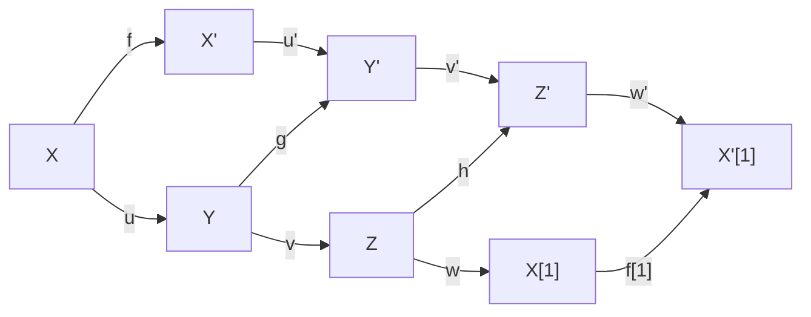
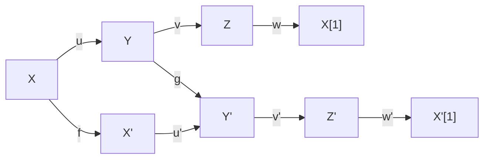
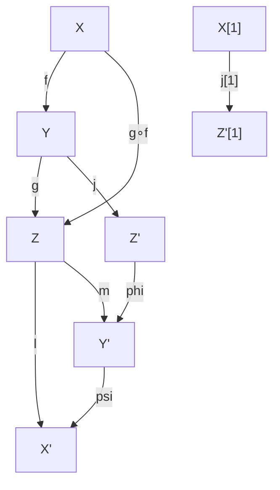
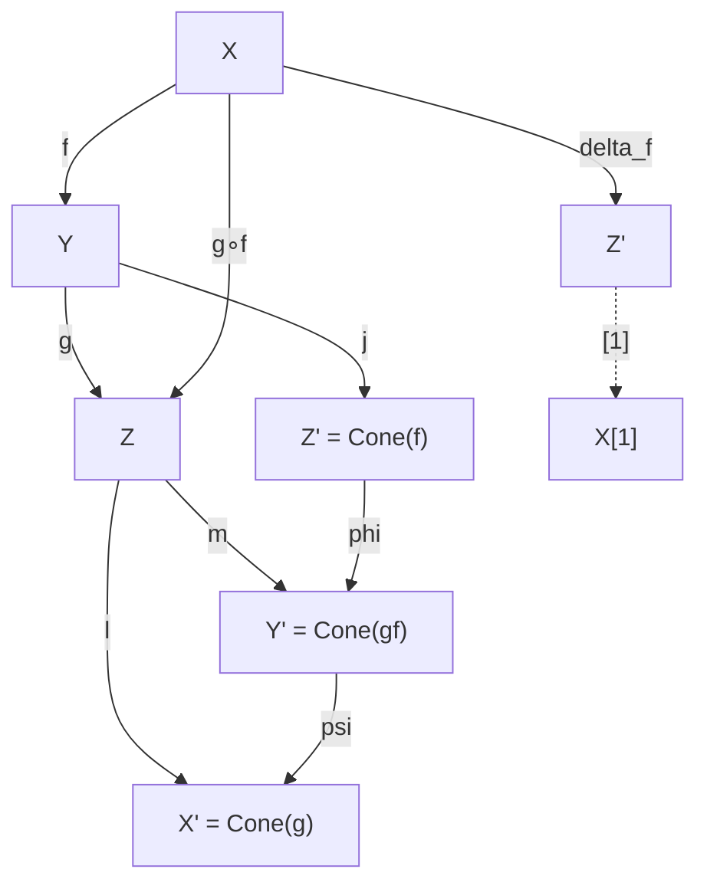

# Triangulated Categories

## Table of Contents

- [[#1. Motivation|1. Motivation]]
- [[#2. Additive Categories and the Shift Functor|2. Additive Categories and the Shift Functor]]
  - [[#2.1 Additive Categories|2.1 Additive Categories]]
  - [[#2.2 The Shift Functor and Pre-triangulated Structure|2.2 The Shift Functor and Pre-triangulated Structure]]
- [[#3. Triangulated Categories: The Axioms TR1 through TR4|3. Triangulated Categories: The Axioms TR1 through TR4]]
  - [[#3.1 Triangles and Distinguished Triangles|3.1 Triangles and Distinguished Triangles]]
  - [[#3.2 The Four Axioms|3.2 The Four Axioms]]
- [[#4. The Octahedral Axiom in Depth|4. The Octahedral Axiom in Depth]]
  - [[#4.1 Geometric Interpretation|4.1 Geometric Interpretation]]
  - [[#4.2 Why TR4 Is Independent|4.2 Why TR4 Is Independent]]
- [[#5. Consequences of the Axioms|5. Consequences of the Axioms]]
  - [[#5.1 Long Exact Sequence in Cohomology|5.1 Long Exact Sequence in Cohomology]]
  - [[#5.2 Hom Sends Distinguished Triangles to Long Exact Sequences|5.2 Hom Sends Distinguished Triangles to Long Exact Sequences]]
  - [[#5.3 Uniqueness of the Cone|5.3 Uniqueness of the Cone]]
  - [[#5.4 Zero Maps and Split Triangles|5.4 Zero Maps and Split Triangles]]
- [[#6. Exact Functors and Equivalences|6. Exact Functors and Equivalences]]
  - [[#6.1 Exact Functors|6.1 Exact Functors]]
  - [[#6.2 Natural Transformations and Triangulated Equivalences|6.2 Natural Transformations and Triangulated Equivalences]]
- [[#7. The Homotopy Category K(A)|7. The Homotopy Category K(A)]]
  - [[#7.1 Chain Complexes and Chain Maps|7.1 Chain Complexes and Chain Maps]]
  - [[#7.2 Chain Homotopy and the Homotopy Category|7.2 Chain Homotopy and the Homotopy Category]]
  - [[#7.3 The Shift Functor on K(A)|7.3 The Shift Functor on K(A)]]
  - [[#7.4 The Cone Construction|7.4 The Cone Construction]]
  - [[#7.5 K(A) Is Triangulated|7.5 K(A) Is Triangulated]]
- [[#8. Verdier Quotient: Preview|8. Verdier Quotient: Preview]]
- [[#References|References]]

---

## 1. Motivation 🔍

The homological algebra of abelian categories is built around the notion of *exact sequences*: a sequence $0 \to A \to B \to C \to 0$ is exact when the image of each map equals the kernel of the next. This gives a robust notion of "quotient" and "kernel" at the level of objects. When we pass from modules (or sheaves) to their resolutions and work *derived*, however, the naïve machinery begins to strain.

Concretely, suppose $\mathcal{A}$ is an abelian category and we form the category $\mathrm{Ch}(\mathcal{A})$ of chain complexes. A *quasi-isomorphism* is a chain map that induces isomorphisms on all cohomology groups — it is the correct notion of "equivalence" for complexes. Yet quasi-isomorphisms are not isomorphisms in $\mathrm{Ch}(\mathcal{A})$, nor in the *homotopy category* $\mathrm{K}(\mathcal{A})$ (where morphisms are chain maps modulo chain homotopy). Three difficulties arise immediately:

1. **Exactness in K(A) is not well-behaved.** The category $\mathrm{K}(\mathcal{A})$ is generally not abelian: kernels and cokernels need not exist in the naive sense. One cannot simply write exact sequences.

2. **The cone is only defined up to non-canonical isomorphism.** Given a chain map $f: A^\bullet \to B^\bullet$, the mapping cone $\mathrm{Cone}(f)$ is a specific complex, but its isomorphism class in $\mathrm{K}(\mathcal{A})$ is well-defined while the cone itself is only canonical up to homotopy. Different choices of cone are isomorphic but there is no preferred isomorphism.

3. **We need a framework that descends to the derived category.** When we eventually invert quasi-isomorphisms to form $D(\mathcal{A})$, we want the algebraic structure to persist. The abelian structure of $\mathcal{A}$ does not survive: $D(\mathcal{A})$ is almost never abelian. We need an alternative axiomatic framework.

The resolution is to abstract exactly what $\mathrm{K}(\mathcal{A})$ *does* satisfy: a special class of triangles (modeled on the cone sequence $A \to B \to \mathrm{Cone}(f) \to A[1]$), a shift functor $[1]$, and four axioms controlling how these triangles interact. This leads us to abstract the properties of $\mathrm{K}(\mathcal{A})$ into the axioms of a *triangulated category*.

> [!INFO] Historical context
> Triangulated categories were introduced by Jean-Louis Verdier in his 1963 thesis (eventually published in 1996 as [Des catégories dérivées des catégories abéliennes](http://www.numdam.org/item/AST_1996__239__R1_0/)), under the supervision of Grothendieck. The formalism was motivated by the need to give a rigorous foundation to Grothendieck duality and the six-functor formalism in algebraic geometry. The same structure was discovered independently by Dold and Puppe in algebraic topology.

---

## 2. Additive Categories and the Shift Functor 📐

### 2.1 Additive Categories

We work with [[concepts/category-theory/foundations/01-categories-functors-natural-transformations|Categories and Functors]] as our foundational language. We briefly recall the relevant enrichment.

**Definition (Ab-enriched category).** A category $\mathcal{C}$ is *Ab-enriched* if each hom-set $\mathrm{Hom}_{\mathcal{C}}(X, Y)$ carries the structure of an abelian group and composition

$$\mathrm{Hom}(Y, Z) \times \mathrm{Hom}(X, Y) \longrightarrow \mathrm{Hom}(X, Z), \quad (g, f) \mapsto g \circ f$$

is bilinear (i.e., distributes over addition on both sides).

**Definition (Additive category).** An *additive category* is an Ab-enriched category $\mathcal{C}$ that:
1. Has a *zero object* $0$ (an object that is simultaneously initial and terminal), and
2. Has *finite biproducts*: for any finite family of objects $X_1, \ldots, X_n$ there exists an object $X_1 \oplus \cdots \oplus X_n$ equipped with projection maps $\pi_i: X_1 \oplus \cdots \oplus X_n \to X_i$ and inclusion maps $\iota_j: X_j \to X_1 \oplus \cdots \oplus X_n$ satisfying $\pi_i \iota_j = \delta_{ij} \cdot \mathrm{id}_{X_i}$ and $\sum_i \iota_i \pi_i = \mathrm{id}_{X_1 \oplus \cdots \oplus X_n}$.

In an additive category one can speak of kernels and cokernels when they exist, and every functor between additive categories that we care about will be *additive* (i.e., a homomorphism of hom-groups).

> [!NOTE] Biproducts vs. products
> The biproduct $X \oplus Y$ serves simultaneously as the categorical product and coproduct. This is a special feature of additive categories and distinguishes them from general categories where products and coproducts need not coincide.

> [!EXAMPLE] Examples of additive categories
> - The category $\mathbf{Ab}$ of abelian groups.
> - The category $R\text{-}\mathbf{Mod}$ of (left) modules over a ring $R$.
> - Any abelian category (e.g., sheaves of $\mathcal{O}_X$-modules on a ringed space).
> - $\mathrm{Ch}(\mathcal{A})$ and $\mathrm{K}(\mathcal{A})$ for any additive $\mathcal{A}$.

### 2.2 The Shift Functor and Pre-triangulated Structure

**Definition (Shift functor).** Let $\mathcal{C}$ be an additive category. A *shift functor* (or *translation functor*) on $\mathcal{C}$ is an additive autoequivalence

$$[1]: \mathcal{C} \xrightarrow{\;\sim\;} \mathcal{C}.$$

We write $X[1]$ for the image of $X$ under $[1]$, and $X[n] = X[1]^n$ for $n \in \mathbb{Z}$ (where $[-1]$ denotes the quasi-inverse). For a morphism $f: X \to Y$ we write $f[n]: X[n] \to Y[n]$ for its image under $[1]^n$.

**Definition (Triangle).** A *triangle* in $(\mathcal{C}, [1])$ is a triple of objects and morphisms

$$X \xrightarrow{u} Y \xrightarrow{v} Z \xrightarrow{w} X[1].$$

We call $w: Z \to X[1]$ the *connecting morphism*. A *morphism of triangles* from $(X \to Y \to Z \to X[1])$ to $(X' \to Y' \to Z' \to X'[1])$ is a commutative diagram:



i.e., $u' f = g u$, $v' g = h v$, $w' h = f[1] w$.

**Definition (Pre-triangulated category).** A *pre-triangulated category* is a pair $(\mathcal{C}, [1])$ where $\mathcal{C}$ is additive with shift functor $[1]$, together with a distinguished class of triangles (called *distinguished triangles* or *exact triangles*), satisfying axioms TR1, TR2, and TR3 below.

---

## 3. Triangulated Categories: The Axioms TR1 through TR4 🔑

### 3.1 Triangles and Distinguished Triangles

We fix an additive category $\mathcal{C}$ with shift functor $[1]$ and a class $\Delta$ of distinguished triangles. We write a distinguished triangle as

$$X \xrightarrow{u} Y \xrightarrow{v} Z \xrightarrow{w} X[1]$$

and sometimes abbreviate it as $(X, Y, Z, u, v, w)$ or simply as the "triangle on $u$" when $u$ determines $Y, Z, w$ up to the relevant isomorphism.

### 3.2 The Four Axioms

**Definition (Triangulated category).** A *triangulated category* is an additive category $\mathcal{C}$ equipped with a shift functor $[1]$ and a class $\Delta$ of distinguished triangles satisfying the following axioms.

---

**TR1 (Existence and Closure).**

  (a) For every object $X \in \mathcal{C}$, the triangle
  $$X \xrightarrow{\mathrm{id}_X} X \to 0 \to X[1]$$
  is distinguished.

  (b) For every morphism $u: X \to Y$, there exists a distinguished triangle
  $$X \xrightarrow{u} Y \xrightarrow{v} Z \xrightarrow{w} X[1].$$
  (The object $Z$ is called a *cone* of $u$, written $\mathrm{Cone}(u)$.)

  (c) Every triangle isomorphic (as a triple of morphisms) to a distinguished triangle is itself distinguished.

---

**TR2 (Rotation).**

A triangle $X \xrightarrow{u} Y \xrightarrow{v} Z \xrightarrow{w} X[1]$ is distinguished if and only if its rotation
$$Y \xrightarrow{v} Z \xrightarrow{w} X[1] \xrightarrow{-u[1]} Y[1]$$
is distinguished.

> [!NOTE] The sign in TR2
> The sign $-u[1]$ in the rotated triangle is essential. Without it, one cannot derive the long exact sequence in cohomology with consistent signs. It also ensures that the rotation operator has period three up to sign: rotating three times returns the original triangle with each morphism negated, which is isomorphic to the original via $(\mathrm{id}_X, \mathrm{id}_Y, \mathrm{id}_Z)$ once one tracks signs carefully.

---

**TR3 (Morphism Extension).**

Given two distinguished triangles and morphisms $f: X \to X'$, $g: Y \to Y'$ such that $u' \circ f = g \circ u$:



there exists a morphism $h: Z \to Z'$ (not necessarily unique) making the full diagram of triangles commute.

> [!WARNING] TR3 does not give uniqueness
> The morphism $h: Z \to Z'$ given by TR3 is not required to be unique. This is a genuine defect of the axioms: the cone is not functorial on the level of triangulated categories without additional hypotheses. Non-uniqueness of $h$ is one of the technical annoyances of working with triangulated (as opposed to stable $\infty$-) categories.

---

**TR4 (Octahedral Axiom).**

Let $f: X \to Y$ and $g: Y \to Z$ be morphisms in $\mathcal{C}$. Suppose we are given three distinguished triangles:

$$X \xrightarrow{f} Y \xrightarrow{j} Z' \xrightarrow{} X[1], \tag{T1}$$
$$Y \xrightarrow{g} Z \xrightarrow{l} X' \xrightarrow{} Y[1], \tag{T2}$$
$$X \xrightarrow{g \circ f} Z \xrightarrow{m} Y' \xrightarrow{} X[1]. \tag{T3}$$

Then there exist morphisms $\varphi: Z' \to Y'$ and $\psi: Y' \to X'$ such that:

1. The triangle $Z' \xrightarrow{\varphi} Y' \xrightarrow{\psi} X' \xrightarrow{} Z'[1]$ is distinguished.
2. The following diagram commutes:



Specifically, the commutativity conditions are:
- $\varphi \circ j = m \circ g$ (i.e., the square involving $j$, $g$, $m$, $\varphi$ commutes),
- $\psi \circ \varphi = l \circ m$ (the triangle $Z' \to Y' \to X'$ is compatible with $l$),
- the morphisms to $X[1]$ are compatible with the respective triangles.

---

> [!NOTE] Numbering conventions
> Some authors include a "TR0" (closure under isomorphism, i.e., part (c) of TR1 here) and renumber accordingly, making the axiom count five. Others split TR1(b) off as a separate axiom. The formulation above matches Verdier's original and the treatment in Weibel's *Introduction to Homological Algebra*, Ch. 10.

---

> [!QUESTION] Exercise 1: Rotation Has Period Three
> *This problem establishes that rotating a distinguished triangle three times returns it to the original, up to isomorphism.*
>
> > **Prerequisites:** [[#3.2 The Four Axioms|3.2 The Four Axioms]]
>
> Let $X \xrightarrow{u} Y \xrightarrow{v} Z \xrightarrow{w} X[1]$ be a distinguished triangle. Define the rotation operator $R$ sending a triangle $(X, Y, Z, u, v, w)$ to $(Y, Z, X[1], v, w, -u[1])$. Show that $R^3(X, Y, Z, u, v, w)$ is isomorphic (as a morphism of triangles) to $(X, Y, Z, u, v, w)$.

> [!TIP]- Solution to Exercise 1
> **Key insight:** Three applications of $R$ produce a triangle $(X[3], Y[3], Z[3], u[3], v[3], w[3])$ decorated with signs $(-1)^3$, but shifting back by $[-3]$ and absorbing the signs via the identity morphisms restores the original.
>
> **Sketch:** Apply $R$ once to get $(Y, Z, X[1], v, w, -u[1])$. Apply again: $(Z, X[1], Y[1], w, -u[1], -v[1])$. Apply a third time: $(X[1], Y[1], Z[1], -u[1], -v[1], -w[1])$. This is isomorphic to $(X, Y, Z, u, v, w)[1]$ (with each object shifted by $[1]$), and the morphism of triangles given by $(-\mathrm{id}_{X[1]}, -\mathrm{id}_{Y[1]}, -\mathrm{id}_{Z[1]})$ shows it is isomorphic to $(X[1], Y[1], Z[1], u[1], v[1], w[1])$. Applying $[-1]$ throughout gives the original triangle, as $[-1]$ is the quasi-inverse of $[1]$.

---

> [!QUESTION] Exercise 2: Composition of Consecutive Maps Is Zero
> *This is the triangulated analogue of the fact that $\mathrm{im} \subset \ker$ in exact sequences.*
>
> > **Prerequisites:** [[#3.2 The Four Axioms|3.2 The Four Axioms]]
>
> Let $X \xrightarrow{u} Y \xrightarrow{v} Z \xrightarrow{w} X[1]$ be a distinguished triangle. Show that $v \circ u = 0$ and $w \circ v = 0$ and $u[1] \circ w = 0$.

> [!TIP]- Solution to Exercise 2
> **Key insight:** Apply the functor $\mathrm{Hom}(-, W)$ to the triangle and use TR1(a) to get a map from the split triangle on $\mathrm{id}_X$.
>
> **Sketch:** By TR1(a) the triangle $X \xrightarrow{\mathrm{id}} X \to 0 \to X[1]$ is distinguished. By TR3 applied to the morphism of triangles given by $u: X \to Y$ (and $\mathrm{id}: X \to X$ on the left), there exists $Z \to 0$ making the diagram commute, forcing $v \circ u = 0$. The other two identities follow from TR2: rotating twice gives triangles where consecutive maps have the same form.

---

## 4. The Octahedral Axiom in Depth 📐

### 4.1 Geometric Interpretation

The octahedral axiom (TR4) is the most subtle of the four and deserves dedicated study. Its content can be summarized informally: *the cone of a composition $g \circ f$ is built from the cones of $f$ and $g$ in a coherent triangular fashion.*

Let us unpack this. We have composable maps $f: X \to Y$ and $g: Y \to Z$. By TR1(b) we may form cones:

- $\mathrm{Cone}(f) \simeq Z'$, fitting into $X \to Y \to Z' \to X[1]$,
- $\mathrm{Cone}(g) \simeq X'$, fitting into $Y \to Z \to X' \to Y[1]$,
- $\mathrm{Cone}(g \circ f) \simeq Y'$, fitting into $X \to Z \to Y' \to X[1]$.

The axiom says that these three cones can themselves be organized into a distinguished triangle:

$$\mathrm{Cone}(f) \xrightarrow{\varphi} \mathrm{Cone}(g \circ f) \xrightarrow{\psi} \mathrm{Cone}(g) \xrightarrow{} \mathrm{Cone}(f)[1].$$

The mnemonic is: **"the cone of the composite sits between the cones of the factors."** In the derived category of an abelian category, if $f$ and $g$ are monomorphisms in $\mathcal{A}$ concentrated in degree zero, then $\mathrm{Cone}(f) \simeq Y/X$, $\mathrm{Cone}(g) \simeq Z/Y$, and $\mathrm{Cone}(g \circ f) \simeq Z/X$, and the axiom recovers the quotient sequence

$$0 \to Y/X \to Z/X \to Z/Y \to 0.$$

This is the "third isomorphism theorem" incarnated in triangulated categories.

The name *octahedral* comes from drawing all six objects $X, Y, Z, X', Y', Z'$ as vertices of an octahedron and all the morphisms as edges, with four of the eight triangular faces being distinguished triangles. The diagram below shows the relevant part of this structure:



> [!INFO] The octahedron explicitly
> Label the six vertices of an octahedron as $X, Y, Z$ (one top triangle) and $X', Y', Z'$ (one bottom triangle). The four distinguished faces of the octahedron correspond to the four triangles in TR4: (T1), (T2), (T3), and the new triangle $(Z', Y', X')$. The remaining four faces are commutative (not exact) triangles, encoding the commutativity conditions in the axiom.

### 4.2 Why TR4 Is Independent

A natural question is whether TR4 follows from TR1–TR3. The answer is: *no*, and counterexamples exist — one can write down pre-triangulated categories satisfying TR1–TR3 but not TR4. Specifically, Murfet gives an example where TR1–TR3 hold but the octahedral axiom fails.

However, TR4 is *equivalent* (given TR1–TR3) to the statement that the cone construction defines a bifunctor on the level of morphism pairs — or equivalently, that *homotopy pushouts exist and are well-behaved*. One alternative reformulation:

**Axiom B (Homotopy pushout formulation).** Given $f: X \to Y$ and $g: X \to Z$ and a distinguished triangle $X \xrightarrow{(f, g)} Y \oplus Z \to W \to X[1]$, the object $W$ serves as the homotopy pushout of the diagram $Y \leftarrow X \to Z$.

TR4 is equivalent to Axiom B in the presence of TR1–TR3, though verifying this equivalence is itself a nontrivial exercise.

> [!WARNING] Non-functoriality of the cone
> Even with TR4, the cone is not canonically functorial: given a commutative square, the induced map on cones (provided by TR3) is not unique. This is the primary motivation for *enhanced triangulated categories* (dg-categories and stable $\infty$-categories), where the cone is functorial by construction.

---

> [!QUESTION] Exercise 3: The Third Isomorphism Theorem
> *This exercise makes the geometric interpretation of TR4 precise for complexes concentrated in degree zero.*
>
> > **Prerequisites:** [[#4.1 Geometric Interpretation|4.1 Geometric Interpretation]]
>
> Let $\mathcal{A}$ be an abelian category and let $X \hookrightarrow Y \hookrightarrow Z$ be a chain of monomorphisms in $\mathcal{A}$, viewed as complexes concentrated in degree 0. In the derived category $D(\mathcal{A})$, identify $\mathrm{Cone}(X \to Y)$, $\mathrm{Cone}(Y \to Z)$, and $\mathrm{Cone}(X \to Z)$ as objects of $\mathcal{A}$, and verify that the distinguished triangle given by TR4 recovers the short exact sequence $0 \to Y/X \to Z/X \to Z/Y \to 0$.

> [!TIP]- Solution to Exercise 3
> **Key insight:** For monomorphisms of objects concentrated in degree 0, the cone of $f: A \hookrightarrow B$ computes as $B/A$ concentrated in degree 0 (the cokernel), up to quasi-isomorphism.
>
> **Sketch:** The cone complex $\mathrm{Cone}(f: A \to B)$ has $B$ in degree 0, $A$ in degree 1, and differential $f$. Its only nonzero cohomology is $H^0 = \mathrm{coker}(f) = B/A$. So in $D(\mathcal{A})$, $\mathrm{Cone}(X \to Y) \simeq Y/X$, $\mathrm{Cone}(Y \to Z) \simeq Z/Y$, $\mathrm{Cone}(X \to Z) \simeq Z/X$. The distinguished triangle from TR4 is $(Y/X) \to (Z/X) \to (Z/Y) \to (Y/X)[1]$. For objects of $\mathcal{A}$ the connecting morphism $(Z/Y) \to (Y/X)[1]$ lives in $\mathrm{Ext}^1_\mathcal{A}(Z/Y, Y/X) = 0$ (since the original sequence splits this extension), and the resulting long exact sequence in $H^*$ recovers $0 \to Y/X \to Z/X \to Z/Y \to 0$.

---

> [!QUESTION] Exercise 4: Octahedral in K(Ab)
> *This exercise asks you to verify the octahedral axiom explicitly in the homotopy category of abelian groups.*
>
> > **Prerequisites:** [[#4.1 Geometric Interpretation|4.1 Geometric Interpretation]]
>
> Let $A = \mathbb{Z}$, $B = \mathbb{Z}$, $C = \mathbb{Z}/4\mathbb{Z}$, with $f: A \to B$ multiplication by 2 and $g: B \to C$ the quotient map. Write out explicitly the three cones $\mathrm{Cone}(f)$, $\mathrm{Cone}(g)$, $\mathrm{Cone}(g \circ f)$ as complexes, identify the maps $\varphi$ and $\psi$ from TR4, and verify that $\mathrm{Cone}(f) \xrightarrow{\varphi} \mathrm{Cone}(g \circ f) \xrightarrow{\psi} \mathrm{Cone}(g) \to \mathrm{Cone}(f)[1]$ is exact.

> [!TIP]- Solution to Exercise 4
> **Key insight:** All three cones are complexes with nonzero terms in degrees 0 and 1; the maps between them can be written as $2 \times 2$ matrices of integers.
>
> **Sketch:** $\mathrm{Cone}(f): 0 \to \mathbb{Z} \xrightarrow{2} \mathbb{Z} \to 0$ (differential $\cdot 2$, so $H^0 = \mathbb{Z}/2$). $\mathrm{Cone}(g \circ f): 0 \to \mathbb{Z} \xrightarrow{0} \mathbb{Z}/4 \to 0$ (differential $0$, so $H^0 = \mathbb{Z}/4$, $H^1 = \mathbb{Z}$). $\mathrm{Cone}(g): 0 \to \mathbb{Z} \xrightarrow{q} \mathbb{Z}/4 \to 0$ where $q$ is the quotient, so $H^0 = 0$, $H^1 = \mathbb{Z}$. The map $\varphi: \mathrm{Cone}(f) \to \mathrm{Cone}(gf)$ in degree 0 is the quotient $\mathbb{Z} \to \mathbb{Z}/4$ and in degree 1 is $\mathrm{id}_\mathbb{Z}$; one checks commutativity. TR4's distinguished triangle at the cone level is verified by checking the long exact cohomology sequence $0 \to \mathbb{Z}/2 \to \mathbb{Z}/4 \to 0 \to \mathbb{Z} \xrightarrow{\cdot 2} \mathbb{Z} \to \ldots$, which is exact.

---

## 5. Consequences of the Axioms 💡

The four axioms TR1–TR4 are not merely formal: they imply a rich supply of exact sequences and functoriality properties that make triangulated categories computationally tractable.

### 5.1 Long Exact Sequence in Cohomology

**Definition (Cohomological functor).** A *cohomological functor* from a triangulated category $\mathcal{C}$ to an abelian category $\mathcal{A}$ is an additive functor $H: \mathcal{C} \to \mathcal{A}$ such that every distinguished triangle $X \to Y \to Z \to X[1]$ yields an exact sequence

$$H(X) \to H(Y) \to H(Z)$$

in $\mathcal{A}$.

**Proposition (Long exact sequence).** If $H: \mathcal{C} \to \mathcal{A}$ is a cohomological functor and $X \xrightarrow{u} Y \xrightarrow{v} Z \xrightarrow{w} X[1]$ is a distinguished triangle, then there is a long exact sequence

$$\cdots \to H(X[-1]) \to H(Z[-1]) \to H(X) \xrightarrow{H(u)} H(Y) \xrightarrow{H(v)} H(Z) \xrightarrow{H(w)} H(X[1]) \to H(Y[1]) \to \cdots$$

where we write $H^n(X) := H(X[n])$.

*Proof sketch.* Exactness at $H(Y)$: apply $H$ to the triangle. By Exercise 2, $H(v) \circ H(u) = H(v \circ u) = 0$. Suppose $H(u)(x) = 0$. Extend $x: \mathbf{1} \to X$ to a morphism of triangles using TR3 (applied to the triangle on $u$ and the split triangle on $\mathrm{id}_X$), to find a preimage under $H(Z[-1]) \to H(X)$. The argument at other terms follows from TR2 (which rotates the triangle to exchange the roles of $X$, $Y$, $Z$). $\square$

### 5.2 Hom Sends Distinguished Triangles to Long Exact Sequences

**Proposition.** For any object $W \in \mathcal{C}$, both contravariant and covariant Hom functors are cohomological:
- $\mathrm{Hom}_{\mathcal{C}}(-, W): \mathcal{C}^{\mathrm{op}} \to \mathbf{Ab}$ sends distinguished triangles to long exact sequences.
- $\mathrm{Hom}_{\mathcal{C}}(W, -): \mathcal{C} \to \mathbf{Ab}$ sends distinguished triangles to long exact sequences.

*Proof sketch for the contravariant case.* We need to show: given a distinguished triangle $X \to Y \to Z \to X[1]$ and a test object $W$, the sequence $\mathrm{Hom}(Z, W) \to \mathrm{Hom}(Y, W) \to \mathrm{Hom}(X, W)$ is exact at $\mathrm{Hom}(Y, W)$. Suppose $\varphi: Y \to W$ satisfies $\varphi \circ u = 0$. We must find $\psi: Z \to W$ with $\psi \circ v = \varphi$. Apply TR3 to the morphism of triangles: the square involving $u: X \to Y$, $\mathrm{id}: X \to X$, $\varphi: Y \to W$, and the zero map $0: 0 \to W$ commutes. By TR3, there exists $\psi: Z \to W$ fitting into a morphism of triangles, which gives $\psi \circ v = \varphi$. $\square$

> [!EXAMPLE] Long exact sequence for sheaf cohomology
> On a topological space $X$, given a short exact sequence of sheaves $0 \to \mathcal{F} \to \mathcal{G} \to \mathcal{H} \to 0$, the derived pushforward produces a distinguished triangle $R\Gamma(\mathcal{F}) \to R\Gamma(\mathcal{G}) \to R\Gamma(\mathcal{H}) \to R\Gamma(\mathcal{F})[1]$ in $D(\mathbf{Ab})$. Applying the cohomological functor $H^n$ recovers the long exact sequence $\cdots \to H^n(X, \mathcal{F}) \to H^n(X, \mathcal{G}) \to H^n(X, \mathcal{H}) \to H^{n+1}(X, \mathcal{F}) \to \cdots$.

### 5.3 Uniqueness of the Cone

**Proposition (Cone uniqueness up to isomorphism).** Given a morphism $u: X \to Y$, any two cones $Z$ and $Z'$ fitting into distinguished triangles $(X, Y, Z, u, v, w)$ and $(X, Y, Z', u, v', w')$ are isomorphic. However, the isomorphism $Z \xrightarrow{\sim} Z'$ is not canonical (depends on choices).

*Proof.* By TR3 applied to the pair of triangles with $f = \mathrm{id}_X$, $g = \mathrm{id}_Y$, we get a morphism $h: Z \to Z'$ making the diagram of triangles commute. Symmetrically, there exists $h': Z' \to Z$. The composition $h' \circ h: Z \to Z$ gives a morphism of triangles $(X, Y, Z) \to (X, Y, Z)$ that is the identity on $X$ and $Y$. One shows $h' \circ h = \mathrm{id}_Z$ and $h \circ h' = \mathrm{id}_{Z'}$ using the Hom long exact sequences and the five lemma (or rather its triangulated analogue). $\square$

*The non-canonicity is genuine:* the morphism $h$ provided by TR3 may be altered by any morphism $Z \to Y[-1]$ precomposed with $v[-1]: Y[-1] \to Z[-1]$ (an "indeterminacy"). This means the cone cannot be made functorial in general triangulated categories.

### 5.4 Zero Maps and Split Triangles

**Lemma (Zero maps give split triangles).** The morphism $u: X \to Y$ is zero if and only if the distinguished triangle $X \xrightarrow{u} Y \to Z \to X[1]$ splits, i.e., $Z \cong X[1] \oplus Y$ as objects.

*Proof sketch.* If $u = 0$, the triangle $0 \to X[1] \oplus Y \to \ldots$ splits by the direct sum decomposition. Conversely, if $Z = X[1] \oplus Y$ and the triangle splits, then $u: X \to Y$ factors through the zero object, forcing $u = 0$. $\square$

**Corollary.** $f: X \to Y$ is an isomorphism if and only if $\mathrm{Cone}(f) \cong 0$.

*Proof.* $f$ is iso iff $f$ has both a left and a right inverse, which by the long exact Hom sequence forces $\mathrm{Hom}(-, \mathrm{Cone}(f)) = 0$ for all test objects, hence $\mathrm{Cone}(f) = 0$. $\square$

---

> [!QUESTION] Exercise 5: The Five Lemma for Triangulated Categories
> *This exercise establishes the triangulated analogue of the five lemma from homological algebra.*
>
> > **Prerequisites:** [[#5.2 Hom Sends Distinguished Triangles to Long Exact Sequences|5.2 Hom Sends Distinguished Triangles to Long Exact Sequences]]
>
> Let $(f, g, h): (X, Y, Z) \to (X', Y', Z')$ be a morphism of distinguished triangles. Show that if $f$ and $g$ are isomorphisms, then $h$ is an isomorphism. (Hint: use the Hom long exact sequences and the five lemma in $\mathbf{Ab}$.)

> [!TIP]- Solution to Exercise 5
> **Key insight:** Apply $\mathrm{Hom}(W, -)$ to both triangles for any $W$, getting two long exact sequences of abelian groups connected by a ladder; then apply the five lemma.
>
> **Sketch:** For any $W$, the distinguished triangles give long exact sequences $\ldots \to \mathrm{Hom}(W, X) \to \mathrm{Hom}(W, Y) \to \mathrm{Hom}(W, Z) \to \mathrm{Hom}(W, X[1]) \to \ldots$ and similarly for primed objects. The morphisms $f_*, g_*$ (induced by $f, g$) are isomorphisms by hypothesis; by the five lemma applied at each position, $h_*: \mathrm{Hom}(W, Z) \to \mathrm{Hom}(W, Z')$ is an isomorphism for all $W$. By Yoneda's lemma, $h$ is an isomorphism.

---

> [!QUESTION] Exercise 6: Direct Sum Decomposition
> *This exercise characterizes split triangles via the additive structure.*
>
> > **Prerequisites:** [[#5.4 Zero Maps and Split Triangles|5.4 Zero Maps and Split Triangles]]
>
> Show that a triangle $X \xrightarrow{u} X \oplus Y \xrightarrow{v} Y \xrightarrow{0} X[1]$ (with $u = \iota_X$, $v = \pi_Y$) is always distinguished. Use this to give a second proof that $\mathrm{Cone}(\mathrm{id}_X) \cong 0$.

> [!TIP]- Solution to Exercise 6
> **Key insight:** The identity map $X \xrightarrow{\mathrm{id}} X \to 0 \to X[1]$ is distinguished by TR1(a); direct sums of distinguished triangles are distinguished.
>
> **Sketch:** By TR1(a), $X \xrightarrow{\mathrm{id}} X \to 0 \to X[1]$ and $0 \to Y \xrightarrow{\mathrm{id}} Y \to 0$ are distinguished (the latter is an isomorphic copy of the split triangle on $Y$). Taking direct sums and using the biproduct structure gives the desired split triangle. For $\mathrm{Cone}(\mathrm{id}_X)$: by TR1(a), it fits into $X \to X \to \mathrm{Cone}(\mathrm{id}_X) \to X[1]$ which is isomorphic to $X \to X \to 0 \to X[1]$, forcing $\mathrm{Cone}(\mathrm{id}_X) \cong 0$.

---

> [!QUESTION] Exercise 7: Cohomological Functor Criterion
> *This exercise identifies which functors are cohomological purely from the axioms.*
>
> > **Prerequisites:** [[#5.1 Long Exact Sequence in Cohomology|5.1 Long Exact Sequence in Cohomology]]
>
> Let $H: \mathcal{C} \to \mathbf{Ab}$ be an additive functor. Show that $H$ is cohomological if and only if for every distinguished triangle $X \to Y \to Z \to X[1]$, the sequence $H(X) \to H(Y) \to H(Z)$ is exact at $H(Y)$.

> [!TIP]- Solution to Exercise 7
> **Key insight:** The definition of cohomological functor requires exactness at $H(Y)$ only; the full long exact sequence then follows from TR2 by rotating the triangle.
>
> **Sketch:** ($\Rightarrow$) trivial by definition. ($\Leftarrow$) Suppose the sequence is exact at the middle term for every distinguished triangle. Apply $H$ to the rotated triangle $Y \to Z \to X[1] \to Y[1]$ (distinguished by TR2) to get exactness at $H(Z)$. Apply to $Z \to X[1] \to Y[1] \to Z[1]$ to get exactness at $H(X[1])$. The full long exact sequence follows by stitching these pieces together using the fact that rotating three times returns to the original triangle (Exercise 1).

---

> [!QUESTION] Exercise 8: Non-canonicity of the Cone Map (Algorithmic)
> *This exercise demonstrates computationally that the morphism on cones provided by TR3 is not unique.*
>
> > **Prerequisites:** [[#5.3 Uniqueness of the Cone|5.3 Uniqueness of the Cone]]
>
> Work in $K(\mathbf{Ab})$. Let $f = \mathrm{id}: \mathbb{Z} \to \mathbb{Z}$ and $f' = \mathrm{id}: \mathbb{Z} \to \mathbb{Z}$, with cones $\mathrm{Cone}(f) = \mathrm{Cone}(f') = 0$. The morphisms $f = f'$ and $g = g' = \mathrm{id}$ on $\mathbb{Z}$ satisfy the TR3 commutativity condition. Write a Python pseudocode algorithm that enumerates all possible chain maps $h: \mathrm{Cone}(f) \to \mathrm{Cone}(f')$ making the diagram commute, and observe that the resulting set of valid $h$ is a coset, not a single element.

> [!TIP]- Solution to Exercise 8
> **Key insight:** In this degenerate case $\mathrm{Cone}(f) = 0 = \mathrm{Cone}(f')$, the only morphism is $h = 0$; the "indeterminacy" set is trivial. The more interesting case requires non-zero cones.
>
> **Sketch:**
> ```python
> def enumerate_cone_maps(cone_f_basis, cone_fprime_basis, u, uprime, g):
>     """
>     cone_f_basis: list of basis elements of Cone(f) in each degree
>     cone_fprime_basis: list of basis elements of Cone(f') in each degree
>     u, uprime: differentials; g: given map Y -> Y'
>     Returns all chain maps h: Cone(f) -> Cone(f') making diagram commute.
>     """
>     valid_maps = []
>     for h_candidate in all_chain_maps(cone_f_basis, cone_fprime_basis):
>         if is_chain_map(h_candidate, cone_f_basis, cone_fprime_basis):
>             if commutes_with_g(h_candidate, g, u, uprime):
>                 valid_maps.append(h_candidate)
>     # The set valid_maps is a coset of the null-homotopic maps Cone(f)->Cone(f')
>     return valid_maps
> ```
> The indeterminacy: any two valid $h, h'$ differ by a null-homotopic map $\mathrm{Cone}(f) \to \mathrm{Cone}(f')[-1]$; the set of valid maps is a torsor under $\mathrm{Hom}_{K}(Z, Z'[-1][-1]) = \mathrm{Hom}(Z, Z'[-2])$ where $Z = \mathrm{Cone}(f)$.

---

## 6. Exact Functors and Equivalences 🔑

### 6.1 Exact Functors

**Definition (Exact functor).** Let $(\mathcal{C}, [1]_\mathcal{C}, \Delta_\mathcal{C})$ and $(\mathcal{D}, [1]_\mathcal{D}, \Delta_\mathcal{D})$ be triangulated categories. An *exact functor* (also called a *triangulated functor*) is a pair $(F, \eta)$ where:

1. $F: \mathcal{C} \to \mathcal{D}$ is an additive functor, and
2. $\eta: F \circ [1]_\mathcal{C} \xrightarrow{\;\sim\;} [1]_\mathcal{D} \circ F$ is a natural isomorphism (the *commutativity constraint*),

such that for every distinguished triangle $X \xrightarrow{u} Y \xrightarrow{v} Z \xrightarrow{w} X[1]$ in $\mathcal{C}$, the triangle

$$F(X) \xrightarrow{F(u)} F(Y) \xrightarrow{F(v)} F(Z) \xrightarrow{\eta_X \circ F(w)} F(X)[1]$$

is distinguished in $\mathcal{D}$.

> [!NOTE] On the commutativity constraint
> The natural isomorphism $\eta$ is often suppressed when it is "obvious" (e.g., when $F$ literally commutes with $[1]$ on the nose). For most naturally occurring functors (e.g., restriction of scalars, pullback of sheaves), $\eta$ is the identity or a canonical isomorphism.

**Example.** For any object $W \in \mathcal{C}$, the covariant functor $\mathrm{Hom}(W, -): \mathcal{C} \to \mathbf{Ab}$ is a *cohomological* functor (not exact in the triangulated sense — it lands in an abelian category, not another triangulated category). In contrast, the shift functor $[1]: \mathcal{C} \to \mathcal{C}$ is itself an exact functor (with $\eta = \mathrm{id}$).

**Example.** The forgetful functor from bounded complexes to unbounded complexes, $\mathrm{K}^b(\mathcal{A}) \hookrightarrow \mathrm{K}(\mathcal{A})$, is exact.

### 6.2 Natural Transformations and Triangulated Equivalences

**Definition (Natural transformation of exact functors).** A *natural transformation* $\alpha: F \Rightarrow G$ between exact functors $F, G: \mathcal{C} \to \mathcal{D}$ is a *triangulated natural transformation* if it is compatible with the commutativity constraints $\eta^F$ and $\eta^G$, i.e., for every $X \in \mathcal{C}$ the square

$$F(X[1]) \xrightarrow{\eta^F_X} F(X)[1] \quad \text{and} \quad G(X[1]) \xrightarrow{\eta^G_X} G(X)[1]$$

commute with $\alpha_{X[1]}$ and $\alpha_X[1]$.

**Definition (Triangulated equivalence).** An *equivalence of triangulated categories* is an exact functor $F: \mathcal{C} \to \mathcal{D}$ for which there exists an exact functor $G: \mathcal{D} \to \mathcal{C}$ and triangulated natural isomorphisms $G \circ F \cong \mathrm{Id}_\mathcal{C}$ and $F \circ G \cong \mathrm{Id}_\mathcal{D}$.

> [!INFO] Derived equivalences
> Many deep results in algebraic geometry and representation theory take the form: "the triangulated categories $D^b(X)$ and $D^b(Y)$ are equivalent." Orlov's representability theorem says any exact equivalence $D^b(\mathrm{Coh}(X)) \xrightarrow{\sim} D^b(\mathrm{Coh}(Y))$ between smooth projective varieties is isomorphic to a Fourier-Mukai transform $\Phi_\mathcal{P}(-)= R\pi_{Y*}(\mathcal{P} \otimes^L L\pi_X^*(-))$ for a unique kernel $\mathcal{P} \in D^b(X \times Y)$.

---

> [!QUESTION] Exercise 9: Composition of Exact Functors
> *This establishes that the category of triangulated categories (with exact functors as morphisms) is well-defined.*
>
> > **Prerequisites:** [[#6.1 Exact Functors|6.1 Exact Functors]]
>
> Let $F: \mathcal{C} \to \mathcal{D}$ and $G: \mathcal{D} \to \mathcal{E}$ be exact functors with commutativity constraints $\eta^F$ and $\eta^G$ respectively. Show that the composition $G \circ F: \mathcal{C} \to \mathcal{E}$ is exact, and write down its commutativity constraint $\eta^{GF}$ in terms of $\eta^F$ and $\eta^G$.

> [!TIP]- Solution to Exercise 9
> **Key insight:** The composition of additive functors is additive, and the constraints compose.
>
> **Sketch:** $G \circ F$ is additive (composition of additive functors). Define $\eta^{GF}_X: (G \circ F)(X[1]) \to (G \circ F)(X)[1]$ by $\eta^{GF}_X = \eta^G_{F(X)} \circ G(\eta^F_X)$. One verifies this is natural in $X$. Distinguished triangles: given a d.t. $X \to Y \to Z \to X[1]$ in $\mathcal{C}$, $F$ sends it to a d.t. in $\mathcal{D}$ (by exactness of $F$), and $G$ sends that to a d.t. in $\mathcal{E}$ (by exactness of $G$). The commutativity constraint is correctly transported by the definition of $\eta^{GF}$.

---

> [!QUESTION] Exercise 10: The Shift as an Exact Autoequivalence
> *This establishes the canonical self-referential nature of the triangulated structure.*
>
> > **Prerequisites:** [[#6.1 Exact Functors|6.1 Exact Functors]]
>
> Show that the shift functor $[1]: \mathcal{C} \to \mathcal{C}$ is exact (with $\eta = \mathrm{id}$), and that for any exact functor $F: \mathcal{C} \to \mathcal{D}$, the functor $[1]_\mathcal{D} \circ F \circ [-1]_\mathcal{C}$ is also exact. What is its commutativity constraint?

> [!TIP]- Solution to Exercise 10
> **Key insight:** The shift sends distinguished triangles to distinguished triangles by TR2.
>
> **Sketch:** Given a d.t. $X \to Y \to Z \to X[1]$, apply $[1]$ to get $X[1] \to Y[1] \to Z[1] \to X[2]$. This is distinguished by TR2 applied twice (or by definition of $\Delta$ being closed under shift, which follows from TR2 and TR1(c)). The commutativity constraint for $[1]_\mathcal{D} \circ F \circ [-1]_\mathcal{C}$ at an object $X$ is given by $\eta^F_{X[-1]}[-1][1] = \eta^F_{X[-1]}$, shifted and precomposed appropriately.

---

> [!QUESTION] Exercise 11: Adjoint Exact Functors (Algorithmic)
> *This exercise explores how adjointness and exactness interact in the triangulated setting.*
>
> > **Prerequisites:** [[#6.1 Exact Functors|6.1 Exact Functors]]
>
> Let $F: \mathcal{C} \to \mathcal{D}$ and $G: \mathcal{D} \to \mathcal{C}$ be adjoint functors (with [[concepts/category-theory/foundations/02-adjoints-representables|Adjoints and Representables]]). Write a Python function that, given the action of $F$ on objects and morphisms of a small triangulated category $\mathcal{C}$, verifies whether $G$ (the right adjoint, computable via $\mathrm{Hom}_\mathcal{D}(F(-), -)$) is exact.

> [!TIP]- Solution to Exercise 11
> **Key insight:** A right adjoint to an exact functor need not be exact in general; it is exact if and only if $F$ preserves compact objects (by Brown representability).
>
> **Sketch:**
> ```python
> def check_right_adjoint_exact(triangulated_cat_C, triangulated_cat_D, F_on_objects, F_on_morphisms):
>     """
>     For each distinguished triangle (X, Y, Z, u, v, w) in C,
>     apply F to get a distinguished triangle in D.
>     Then check if G = RHom_D(F(-), -) sends distinguished triangles in D to long exact sequences.
>     """
>     for triangle in triangulated_cat_D.distinguished_triangles():
>         X, Y, Z, u, v, w = triangle
>         # Apply G = Hom_D(F(?), X), Hom_D(F(?), Y), Hom_D(F(?), Z)
>         seq = [hom(F_on_objects[A], X) for A in [Z, Y, X_obj]]
>         if not is_exact_sequence(seq):
>             return False, triangle  # Found failure: G is not exact on this triangle
>     return True, None
> ```
> In practice, right adjoints to exact functors between derived categories of abelian categories are always exact (the right adjoint of a left-derived functor is a right-derived functor). The key theorem is: if $F$ is exact and $\mathcal{C}, \mathcal{D}$ have enough injectives, then $G = $ right adjoint of $F$ satisfies $G \simeq RG_0$ where $G_0$ is the underived right adjoint.

---

## 7. The Homotopy Category K(A) 📐

The primary example of a triangulated category — and the one that motivates all the axioms — is the *homotopy category* of an additive category.

### 7.1 Chain Complexes and Chain Maps

Let $\mathcal{A}$ be an additive category (we use $\mathcal{A}$ for the ambient additive or abelian category). See also [[concepts/category-theory/foundations/03-limits-colimits|Limits and Colimits]] for the categorical context.

**Definition (Chain complex).** A *chain complex* (or *cochain complex*, using cohomological grading conventions) in $\mathcal{A}$ is a sequence

$$A^\bullet = \left(\cdots \to A^{n-1} \xrightarrow{d^{n-1}} A^n \xrightarrow{d^n} A^{n+1} \to \cdots \right)$$

where each $A^n \in \mathcal{A}$ and $d^n \circ d^{n-1} = 0$ for all $n \in \mathbb{Z}$. The maps $d^n$ are the *differentials* of $A^\bullet$.

**Definition (Chain map).** A *chain map* $f: A^\bullet \to B^\bullet$ is a collection of morphisms $f^n: A^n \to B^n$ such that $d^n_B \circ f^n = f^{n+1} \circ d^n_A$ for all $n$. The category $\mathrm{Ch}(\mathcal{A})$ has chain complexes as objects and chain maps as morphisms.

When $\mathcal{A}$ is abelian, the *cohomology* of $A^\bullet$ at degree $n$ is

$$H^n(A^\bullet) = \ker(d^n) / \mathrm{im}(d^{n-1}).$$

A chain map $f: A^\bullet \to B^\bullet$ induces maps $H^n(f): H^n(A^\bullet) \to H^n(B^\bullet)$; a chain map is a *quasi-isomorphism* if $H^n(f)$ is an isomorphism for all $n$.

### 7.2 Chain Homotopy and the Homotopy Category

**Definition (Chain homotopy).** A *chain homotopy* between chain maps $f, g: A^\bullet \to B^\bullet$ is a collection of morphisms $s^n: A^n \to B^{n-1}$ (for $n \in \mathbb{Z}$) such that

$$f^n - g^n = d^{n-1}_B \circ s^n + s^{n+1} \circ d^n_A \quad \text{for all } n.$$

We write $f \simeq g$ when such a homotopy exists, and say $f$ and $g$ are *homotopic*.

**Lemma.** Homotopy of chain maps is an equivalence relation compatible with composition: if $f \simeq g$ and $p \simeq q$ then $p \circ f \simeq q \circ g$.

*Proof.* Symmetry: if $s$ is a homotopy from $f$ to $g$, then $-s$ is a homotopy from $g$ to $f$. Transitivity: add homotopies. Compatibility with composition: if $s$ is a homotopy $f \simeq g: A^\bullet \to B^\bullet$ and $t$ is a homotopy $p \simeq q: B^\bullet \to C^\bullet$, then $t \circ f + q \circ s$ is a homotopy $p \circ f \simeq q \circ g$. $\square$

**Definition (Homotopy category).** The *homotopy category* $\mathrm{K}(\mathcal{A})$ is the quotient category:
- Objects: same as $\mathrm{Ch}(\mathcal{A})$, i.e., chain complexes.
- Morphisms: $\mathrm{Hom}_{\mathrm{K}(\mathcal{A})}(A^\bullet, B^\bullet) = \mathrm{Hom}_{\mathrm{Ch}(\mathcal{A})}(A^\bullet, B^\bullet) / \simeq$, i.e., chain maps modulo chain homotopy.

> [!NOTE] K(A) vs. Ch(A)
> The category $\mathrm{Ch}(\mathcal{A})$ is abelian when $\mathcal{A}$ is abelian. The homotopy category $\mathrm{K}(\mathcal{A})$ is *not* in general abelian — it fails to have kernels and cokernels that behave well — but it is triangulated.

**Bounded variants.** We also define:
- $\mathrm{K}^+(\mathcal{A})$: complexes bounded below ($A^n = 0$ for $n \ll 0$).
- $\mathrm{K}^-(\mathcal{A})$: complexes bounded above ($A^n = 0$ for $n \gg 0$).
- $\mathrm{K}^b(\mathcal{A})$: complexes bounded in both directions.

Each is a triangulated subcategory of $\mathrm{K}(\mathcal{A})$.

### 7.3 The Shift Functor on K(A)

**Definition (Shift on chain complexes).** For a complex $A^\bullet$ and $k \in \mathbb{Z}$, the *shift* $A[k]^\bullet$ is defined by

$$(A[k])^n = A^{n+k}, \qquad d^n_{A[k]} = (-1)^k d^{n+k}_A.$$

The sign $(-1)^k$ is essential for keeping the shift functor an exact functor in the triangulated sense and for ensuring the rotation axiom TR2 holds with the correct sign conventions.

For a chain map $f: A^\bullet \to B^\bullet$, the shift $f[k]: A[k]^\bullet \to B[k]^\bullet$ is defined by $f[k]^n = f^{n+k}$.

**Lemma.** The shift functor $[1]: \mathrm{K}(\mathcal{A}) \to \mathrm{K}(\mathcal{A})$ is an autoequivalence of additive categories.

*Proof.* $[1]$ is additive (it acts on the abelian group of morphisms by shifting degree). Its quasi-inverse is $[-1]$; the natural isomorphisms $[1] \circ [-1] \cong \mathrm{Id}$ and $[-1] \circ [1] \cong \mathrm{Id}$ are canonical. $\square$

### 7.4 The Cone Construction

**Definition (Mapping cone).** Given a chain map $f: A^\bullet \to B^\bullet$, the *mapping cone* $\mathrm{Cone}(f)$ is the complex defined in each degree by

$$\mathrm{Cone}(f)^n = A^{n+1} \oplus B^n,$$

with differential

$$d^n_{\mathrm{Cone}(f)} = \begin{pmatrix} -d^{n+1}_A & 0 \\ f^{n+1} & d^n_B \end{pmatrix}: A^{n+1} \oplus B^n \longrightarrow A^{n+2} \oplus B^{n+1}.$$

One checks $d^{n+1}_{\mathrm{Cone}(f)} \circ d^n_{\mathrm{Cone}(f)} = 0$ directly from $d_A^2 = 0$, $d_B^2 = 0$, and $f \circ d_A = d_B \circ f$.

There are canonical chain maps:
- The *inclusion* $\iota: B^\bullet \to \mathrm{Cone}(f)$ by $\iota^n(b) = (0, b) \in A^{n+1} \oplus B^n$.
- The *projection* $\pi: \mathrm{Cone}(f) \to A[1]^\bullet$ by $\pi^n(a, b) = a \in A^{n+1} = A[1]^n$.

**Proposition.** The triangle

$$A^\bullet \xrightarrow{f} B^\bullet \xrightarrow{\iota} \mathrm{Cone}(f) \xrightarrow{\pi} A[1]^\bullet$$

is a *termwise split short exact sequence* of chain complexes, and in particular yields a long exact sequence in cohomology.

*Proof.* At each degree $n$, $0 \to B^n \xrightarrow{\iota^n} A^{n+1} \oplus B^n \xrightarrow{\pi^n} A^{n+1} \to 0$ splits as a sequence of objects in $\mathcal{A}$ (by the biproduct). $\square$

> [!EXAMPLE] Mapping cone in R-Mod
> Let $R = \mathbb{Z}$, $A^\bullet = (\mathbb{Z} \xrightarrow{\cdot 2} \mathbb{Z})$ concentrated in degrees $-1$ and $0$, $B^\bullet = \mathbb{Z}/2$ concentrated in degree 0. A chain map $f: A^\bullet \to B^\bullet$ is the quotient in degree 0 (and zero in degree $-1$). Then $\mathrm{Cone}(f)^{-1} = A^0 = \mathbb{Z}$, $\mathrm{Cone}(f)^0 = A^1 \oplus B^0 = 0 \oplus \mathbb{Z}/2 = \mathbb{Z}/2$, with differential zero. The cohomology $H^0(\mathrm{Cone}(f)) = \mathbb{Z}/2$ and $H^{-1}(\mathrm{Cone}(f)) = \mathbb{Z}$, matching the long exact sequence.

### 7.5 K(A) Is Triangulated

**Theorem.** The homotopy category $\mathrm{K}(\mathcal{A})$, equipped with the shift functor $[1]$ and the class $\Delta$ of triangles isomorphic (in $\mathrm{K}(\mathcal{A})$) to

$$A^\bullet \xrightarrow{f} B^\bullet \xrightarrow{\iota} \mathrm{Cone}(f) \xrightarrow{\pi} A[1]^\bullet$$

for some chain map $f$, is a triangulated category.

*Proof.* We verify each axiom.

**TR1(a).** The triangle $A^\bullet \xrightarrow{\mathrm{id}} A^\bullet \to 0 \to A[1]^\bullet$ is isomorphic to the cone triangle on $\mathrm{id}_{A^\bullet}$, since $\mathrm{Cone}(\mathrm{id})^n = A^{n+1} \oplus A^n$ with $d = \begin{pmatrix} -d & 0 \\ \mathrm{id} & d \end{pmatrix}$, and the chain map $(A^\bullet \xrightarrow{0} 0)$ gives a quasi-isomorphism $\mathrm{Cone}(\mathrm{id}) \xrightarrow{\sim} 0$; in fact $\mathrm{Cone}(\mathrm{id})$ is contractible (the identity map on the complex is null-homotopic, witnessed by $s^n = (0, \mathrm{id}_{A^n})^T$, making $\mathrm{Cone}(\mathrm{id}) \simeq 0$ in $\mathrm{K}(\mathcal{A})$). ✓

**TR1(b).** Given any chain map $f: A^\bullet \to B^\bullet$, the cone $\mathrm{Cone}(f)$ exists by the explicit construction above. ✓

**TR1(c).** Closed under isomorphism by definition. ✓

**TR2 (Rotation).** We must show: if $A \xrightarrow{f} B \xrightarrow{\iota} \mathrm{Cone}(f) \xrightarrow{\pi} A[1]$ is distinguished, so is $B \xrightarrow{\iota} \mathrm{Cone}(f) \xrightarrow{\pi} A[1] \xrightarrow{-f[1]} B[1]$.

There is an explicit chain map $\mathrm{Cone}(\iota) \to A[1]$ given in each degree by the projection $A^{n+2} \oplus B^{n+1} \oplus B^n \to A^{n+2}$... combined with a homotopy showing this is a chain homotopy equivalence. The sign $-f[1]$ in the connecting morphism comes precisely from the sign in the differential of the cone. The full verification is a degree-chase; see Weibel §10.2. ✓

**TR3.** Given chain maps $f, g$ with $g \circ f_1 = f_2 \circ f$... the naturality of the cone construction gives: if $(f, g): (A, f_1, B) \to (A', f_2, B')$ is a map of chain maps, then define $h^n: \mathrm{Cone}(f_1)^n \to \mathrm{Cone}(f_2)^n$ by $h^n(a, b) = (f[1]^n(a), g^n(b)) = (f^{n+1}(a), g^n(b))$. One verifies this is a chain map using the commutativity $g \circ f_1 = f_2 \circ f$. ✓

**TR4 (Octahedral axiom).** Given composable chain maps $f: A \to B$ and $g: B \to C$, define:
- $\mathrm{Cone}(f)^n = A^{n+1} \oplus B^n$,
- $\mathrm{Cone}(g)^n = B^{n+1} \oplus C^n$,
- $\mathrm{Cone}(gf)^n = A^{n+1} \oplus C^n$.

Define $\varphi: \mathrm{Cone}(f) \to \mathrm{Cone}(gf)$ by $\varphi^n(a, b) = (a, g^n(b))$, and $\psi: \mathrm{Cone}(gf) \to \mathrm{Cone}(g)$ by $\psi^n(a, c) = (f^{n+1}(a), c) + \text{correction}$... One verifies these are chain maps and that $\mathrm{Cone}(f) \to \mathrm{Cone}(gf) \to \mathrm{Cone}(g) \to \mathrm{Cone}(f)[1]$ is a distinguished triangle by direct computation. The full proof is in Stacks Project Tag 09KG. $\square$

> [!NOTE] Boundedness and the triangulated structure
> All of the axiom verifications are identical for $\mathrm{K}^+(\mathcal{A})$, $\mathrm{K}^-(\mathcal{A})$, and $\mathrm{K}^b(\mathcal{A})$: the cone of a bounded complex is bounded (in the appropriate sense), so these are triangulated subcategories.

---

> [!QUESTION] Exercise 12: The Cone of a Composition Is Not the Composition of Cones
> *This exercise illustrates that the cone of $g \circ f$ is not simply $\mathrm{Cone}(g) \oplus \mathrm{Cone}(f)$.*
>
> > **Prerequisites:** [[#7.4 The Cone Construction|7.4 The Cone Construction]]
>
> Let $A \xrightarrow{f} B \xrightarrow{g} C$ be chain maps of complexes of abelian groups concentrated in degree 0, so $f$ and $g$ are just maps of abelian groups. Express $\mathrm{Cone}(g \circ f)$ explicitly and show it is generally not isomorphic to $\mathrm{Cone}(f) \oplus \mathrm{Cone}(g)$ in $\mathrm{K}(\mathbf{Ab})$, even up to homotopy.

> [!TIP]- Solution to Exercise 12
> **Key insight:** $\mathrm{Cone}(g \circ f)$ has a "mixed" differential involving both $f$ and $g$, not a direct sum.
>
> **Sketch:** Concentrating in degree 0: $A \xrightarrow{f} B \xrightarrow{g} C$ are abelian group maps. Then $\mathrm{Cone}(f) = (A \xrightarrow{f} B)$ with $A$ in degree 1, $B$ in degree 0; $\mathrm{Cone}(g) = (B \xrightarrow{g} C)$; $\mathrm{Cone}(gf) = (A \xrightarrow{gf} C)$. Clearly $\mathrm{Cone}(f) \oplus \mathrm{Cone}(g) = (A \oplus B \xrightarrow{\mathrm{diag}} B \oplus C)$, which has $H^0 = \mathrm{coker}(f) \oplus \mathrm{coker}(g)$. But $H^0(\mathrm{Cone}(gf)) = \mathrm{coker}(gf)$, which differs in general (e.g., $f = \mathrm{id}: \mathbb{Z} \to \mathbb{Z}$ then $\mathrm{coker}(f) = 0$ but $\mathrm{coker}(gf) = \mathrm{coker}(g)$).

---

> [!QUESTION] Exercise 13: Shift Functor Formula
> *This exercise verifies the shift formula and the sign convention on the differential.*
>
> > **Prerequisites:** [[#7.3 The Shift Functor on K(A)|7.3 The Shift Functor on K(A)]]
>
> Let $A^\bullet$ be a complex with differential $d^n: A^n \to A^{n+1}$. Show that for the shift $A[k]$ as defined, the differential $d^n_{A[k]} = (-1)^k d^{n+k}_A$ satisfies $(d^{n+1}_{A[k]}) \circ (d^n_{A[k]}) = 0$. Explain why the sign $(-1)^k$ is needed for the rotation axiom TR2 to hold.

> [!TIP]- Solution to Exercise 13
> **Key insight:** The sign is needed so that the map $A[1]^\bullet \xrightarrow{-f[1]} B[1]^\bullet$ in the rotation actually composes to zero.
>
> **Sketch:** $(d^{n+1}_{A[k]}) \circ (d^n_{A[k]}) = (-1)^k d^{n+k+1}_A \circ (-1)^k d^{n+k}_A = (-1)^{2k} (d^{n+k+1}_A \circ d^{n+k}_A) = 0$ since $d_A^2 = 0$. For TR2: rotating a distinguished triangle introduces the map $-f[1]$ rather than $f[1]$ to compensate for the sign $(-1)^1 = -1$ in the differential of $A[1]$. Without the sign, the composition of consecutive maps in the rotated triangle would not be zero (Exercise 2 would fail), contradicting TR1.

---

> [!QUESTION] Exercise 14: Long Exact Sequence from Cone (Algorithmic)
> *This exercise implements the long exact sequence of cohomology groups arising from the cone triangle.*
>
> > **Prerequisites:** [[#7.5 K(A) Is Triangulated|7.5 K(A) Is Triangulated]]
>
> Write a Python function that takes as input two bounded complexes $A^\bullet$ and $B^\bullet$ of finitely generated abelian groups (given as matrices over $\mathbb{Z}$ for the differentials) and a chain map $f$, computes $\mathrm{Cone}(f)$, and returns the long exact sequence $H^n(A) \to H^n(B) \to H^n(\mathrm{Cone}(f)) \to H^{n+1}(A)$ as a list of abelian group maps.

> [!TIP]- Solution to Exercise 14
> **Key insight:** The cone's differential is the block matrix $\begin{pmatrix} -d_A & 0 \\ f & d_B \end{pmatrix}$; cohomology is computed as kernel mod image.
>
> **Sketch:**
> ```python
> import numpy as np
> from scipy.linalg import null_space
>
> def compute_cone(f_maps, dA_maps, dB_maps, degrees):
>     """
>     f_maps: dict n -> matrix (f^n: A^n -> B^n) as integer numpy array
>     dA_maps: dict n -> matrix (d^n: A^n -> A^{n+1})
>     dB_maps: dict n -> matrix (d^n: B^n -> B^{n+1})
>     Returns: cone_d = dict n -> differential matrix of Cone(f) at degree n
>     """
>     cone_d = {}
>     for n in degrees:
>         # Cone(f)^n = A^{n+1} + B^n, Cone(f)^{n+1} = A^{n+2} + B^{n+1}
>         a_rows, a_cols = dA_maps[n+1].shape  # d^{n+1}_A: A^{n+1} -> A^{n+2}
>         top_left = -dA_maps[n+1]             # -d_A block
>         top_right = np.zeros((a_rows, f_maps[n].shape[1]))
>         bot_left = f_maps[n+1]               # f^{n+1}: A^{n+1} -> B^{n+1}
>         bot_right = dB_maps[n]               # d^n_B: B^n -> B^{n+1}
>         cone_d[n] = np.block([[top_left, top_right],
>                               [bot_left, bot_right]])
>     return cone_d
>
> def cohomology(d_in, d_out):
>     """Compute ker(d_out) / im(d_in) over Z (simplified: use rational approximation)."""
>     ker = null_space(d_out.T).T  # Approximate kernel
>     im  = d_in                   # Image generators
>     return ker, im  # Return as generating sets; Smith normal form needed for exact answer
> ```

---

> [!QUESTION] Exercise 15: Homotopy Equivalences Are Isomorphisms in K(A)
> *This establishes the universal property of K(A): it is the localization of Ch(A) at chain homotopy equivalences.*
>
> > **Prerequisites:** [[#7.2 Chain Homotopy and the Homotopy Category|7.2 Chain Homotopy and the Homotopy Category]]
>
> A chain map $f: A^\bullet \to B^\bullet$ is a *homotopy equivalence* if there exists a chain map $g: B^\bullet \to A^\bullet$ with $g \circ f \simeq \mathrm{id}_A$ and $f \circ g \simeq \mathrm{id}_B$. Show that homotopy equivalences become isomorphisms in $\mathrm{K}(\mathcal{A})$, and conversely that every isomorphism in $\mathrm{K}(\mathcal{A})$ arises from a homotopy equivalence.

> [!TIP]- Solution to Exercise 15
> **Key insight:** Morphisms in $\mathrm{K}(\mathcal{A})$ are homotopy classes; $[f]$ is an isomorphism iff $[g][f] = [\mathrm{id}_A]$ and $[f][g] = [\mathrm{id}_B]$ iff $g \circ f \simeq \mathrm{id}_A$ and $f \circ g \simeq \mathrm{id}_B$.
>
> **Sketch:** By definition, $[f] \circ [g] = [f \circ g]$ in $\mathrm{K}(\mathcal{A})$. If $f \circ g \simeq \mathrm{id}_B$, then $[f \circ g] = [\mathrm{id}_B] = \mathrm{id}_{[B^\bullet]}$ in $\mathrm{K}(\mathcal{A})$, so $[f][g] = \mathrm{id}$. The converse holds because any isomorphism in $\mathrm{K}(\mathcal{A})$ has a two-sided inverse class $[g]$, which when lifted gives homotopies $g \circ f \simeq \mathrm{id}$ and $f \circ g \simeq \mathrm{id}$.

---

> [!QUESTION] Exercise 16: Quasi-isomorphisms Need Not Be Invertible in K(A)
> *This is a key motivation for passing to the derived category.*
>
> > **Prerequisites:** [[#7.5 K(A) Is Triangulated|7.5 K(A) Is Triangulated]]
>
> Exhibit an explicit quasi-isomorphism $f: A^\bullet \to B^\bullet$ in $\mathrm{K}(\mathbf{Ab})$ that is not a homotopy equivalence. Conclude that $\mathrm{K}(\mathcal{A})$ does not invert quasi-isomorphisms.

> [!TIP]- Solution to Exercise 16
> **Key insight:** Any projective resolution of a module with nonzero $\mathrm{Ext}$ groups provides such an example.
>
> **Sketch:** Let $A^\bullet = (\mathbb{Z} \xrightarrow{\cdot 2} \mathbb{Z})$ (projective resolution of $\mathbb{Z}/2$) in degrees $-1, 0$. Let $B^\bullet = \mathbb{Z}/2$ in degree 0. The augmentation $\varepsilon: A^\bullet \to B^\bullet$ is a quasi-isomorphism ($H^0(A^\bullet) = \mathbb{Z}/2 = H^0(B^\bullet)$, $H^{-1}(A^\bullet) = 0$). But $\mathrm{Hom}_{\mathrm{K}(\mathbf{Ab})}(B^\bullet, A^\bullet) = \mathrm{Hom}_{\mathbf{Ab}}(\mathbb{Z}/2, \mathbb{Z}) = 0$, so no chain map $g: B^\bullet \to A^\bullet$ exists, let alone a homotopy inverse. Thus $\varepsilon$ is not a homotopy equivalence.

---

> [!QUESTION] Exercise 17: Smith Normal Form for Cohomology Computation (Algorithmic)
> *This exercise produces an algorithm to compute cohomology groups of bounded complexes of finitely generated abelian groups.*
>
> > **Prerequisites:** [[#7.4 The Cone Construction|7.4 The Cone Construction]]
>
> Write a Python function that computes $H^n(A^\bullet)$ for a bounded complex of finitely generated abelian groups, represented as integer matrices for differentials, using the Smith normal form algorithm. Then use this to compute the cohomology of $\mathrm{Cone}(f)$ for the map $f: \mathbb{Z} \xrightarrow{\cdot n} \mathbb{Z}$.

> [!TIP]- Solution to Exercise 17
> **Key insight:** Over $\mathbb{Z}$, Smith normal form of an integer matrix gives the elementary divisors, from which the cokernel/kernel structure is read off directly.
>
> **Sketch:**
> ```python
> def smith_normal_form(M):
>     """Returns (S, U, V) such that U @ M @ V = S with S diagonal (Smith normal form)."""
>     # Use sympy or a dedicated integer linear algebra library
>     from sympy import Matrix
>     M_sym = Matrix(M.tolist())
>     S, U, V = M_sym.smith_normal_form(return_transformation=True)
>     return S, U, V
>
> def cohomology_abelian(d_in, d_out):
>     """
>     Compute ker(d_out) / im(d_in) for integer matrices.
>     d_in: A^{n-1} -> A^n, d_out: A^n -> A^{n+1}
>     Returns: list of elementary divisors of H^n
>     """
>     S_out, _, _ = smith_normal_form(d_out)   # SNF of d^n
>     S_in,  _, _ = smith_normal_form(d_in)    # SNF of d^{n-1}
>     # ker(d_out) has rank = #cols - rank(d_out)
>     # im(d_in) is generated by columns of d_in
>     # H^n = ker(d_out) / im(d_in); elementary divisors read from combined SNF
>     ...  # Full implementation uses integral column operations
>
> # Example: f: Z -> Z by *n, Cone(f) = (Z -> Z) with d = n
> # Cone(f)^1 = Z (degree 1), Cone(f)^0 = Z (degree 0), differential is multiplication by n
> # H^0(Cone(f)) = Z/nZ, H^1(Cone(f)) = 0
> # (H^1 = ker(0)/im(n) = Z/nZ; H^0 = ker(n)/im(0) = ... depends on indexing)
> ```
> For $f = (\cdot n): \mathbb{Z} \to \mathbb{Z}$, $\mathrm{Cone}(f)$ has $\mathrm{Cone}(f)^0 = \mathbb{Z}$ (the copy of $B$) and $\mathrm{Cone}(f)^{-1} = \mathbb{Z}$ (the shifted copy of $A$), differential $n$. So $H^0(\mathrm{Cone}(f)) = \mathbb{Z}/n$ and $H^{-1}(\mathrm{Cone}(f)) = 0$.

---

## 8. Verdier Quotient: Preview 🔍

We now have $\mathrm{K}(\mathcal{A})$ — a genuine triangulated category with a rich theory of exact triangles. But $\mathrm{K}(\mathcal{A})$ is *not* the derived category. The defect is that quasi-isomorphisms, though they induce isomorphisms on cohomology, are not isomorphisms in $\mathrm{K}(\mathcal{A})$ (Exercise 16 made this concrete). The derived category $D(\mathcal{A})$ is designed to fix this by *formally inverting* all quasi-isomorphisms.

**Definition (Verdier quotient, informal).** Let $\mathcal{T}$ be a triangulated category and $\mathcal{S} \subset \mathcal{T}$ a *triangulated subcategory* (closed under shift and distinguished triangles). The *Verdier quotient* $\mathcal{T}/\mathcal{S}$ is a triangulated category equipped with a triangulated functor $Q: \mathcal{T} \to \mathcal{T}/\mathcal{S}$, universal among triangulated functors $F: \mathcal{T} \to \mathcal{U}$ that send all objects of $\mathcal{S}$ to zero.

**Application.** Let $\mathcal{N} \subset \mathrm{K}(\mathcal{A})$ be the full triangulated subcategory of *acyclic complexes* — those with $H^n = 0$ for all $n$. Then:

$$D(\mathcal{A}) := \mathrm{K}(\mathcal{A}) / \mathcal{N}.$$

A morphism $f: A^\bullet \to B^\bullet$ in $\mathrm{K}(\mathcal{A})$ becomes an isomorphism in $D(\mathcal{A})$ if and only if $f$ is a quasi-isomorphism. This is because the cone of a quasi-isomorphism is acyclic, hence zero in $D(\mathcal{A})$, hence $f$ is invertible by the corollary to Section 5.4.

*The triangulated structure of $\mathrm{K}(\mathcal{A})$ is crucial for this construction.* The Verdier quotient inherits a triangulated structure from $\mathrm{K}(\mathcal{A})$: the localization functor $Q$ is exact, and distinguished triangles in $D(\mathcal{A})$ are precisely the images of distinguished triangles in $\mathrm{K}(\mathcal{A})$ under $Q$. This inheritance would be impossible without knowing $\mathrm{K}(\mathcal{A})$ is triangulated to begin with.

The *calculus of left fractions* (the Ore condition) then gives a concrete description of morphisms in $D(\mathcal{A})$: a morphism $A^\bullet \to B^\bullet$ in $D(\mathcal{A})$ is a "roof"

$$A^\bullet \xleftarrow{\;\sim\;} \widetilde{A}^\bullet \xrightarrow{\;g\;} B^\bullet$$

where the left arrow is a quasi-isomorphism. Two such roofs are identified if they admit a common refinement.

> [!INFO] Next note in this cluster
> The full construction of $D(\mathcal{A})$ — including the proof that the Ore conditions hold for quasi-isomorphisms, the existence and uniqueness of the Verdier quotient, the boundedness conditions $D^+, D^-, D^b$, and the abelian embedding $\mathcal{A} \hookrightarrow D(\mathcal{A})$ — is treated in `construction.md`.

> [!WARNING] Non-abelianness of D(A)
> *The derived category $D(\mathcal{A})$ is almost never abelian.* For instance, $D(\mathbf{Ab})$ has objects with nontrivial $\mathrm{Ext}^1$ between them (e.g., $\mathbb{Z}/2$ and $\mathbb{Z}/2$), meaning the triangle $\mathbb{Z}/2 \to \mathbb{Z}/4 \to \mathbb{Z}/2 \to (\mathbb{Z}/2)[1]$ cannot be expressed as a short exact sequence ending in $0$. The triangulated structure is the correct substitute for exactness in $D(\mathcal{A})$.

---

> [!QUESTION] Exercise 18: Acyclics Form a Triangulated Subcategory
> *This verifies that the subcategory we quotient by in the Verdier construction is triangulated.*
>
> > **Prerequisites:** [[#8. Verdier Quotient: Preview|8. Verdier Quotient: Preview]]
>
> Let $\mathcal{N} \subset \mathrm{K}(\mathcal{A})$ be the full subcategory of acyclic complexes (those with $H^n = 0$ for all $n$). Show that $\mathcal{N}$ is closed under the shift functor $[1]$ and that if two vertices of a distinguished triangle in $\mathrm{K}(\mathcal{A})$ lie in $\mathcal{N}$, then so does the third.

> [!TIP]- Solution to Exercise 18
> **Key insight:** The long exact sequence in cohomology from the distinguished triangle forces the third term's cohomology to vanish if two terms are acyclic.
>
> **Sketch:** Closure under $[1]$: $(A[1])^n = A^{n+1}$, so $H^n(A[1]) = H^{n+1}(A) = 0$ if $A$ is acyclic. For the triangle property: given $A \to B \to C \to A[1]$ distinguished with $A, B$ acyclic, the long exact sequence in cohomology gives $\ldots \to H^n(A) \to H^n(B) \to H^n(C) \to H^{n+1}(A) \to \ldots$ Since $H^n(A) = 0$ and $H^{n+1}(A) = 0$, we get $H^n(C) = 0$ for all $n$, so $C \in \mathcal{N}$. Similarly for any two of the three vertices.

---

## References

| Reference Name | Brief Summary | Link to Reference |
|---|---|---|
| Noohi, "Lectures on derived and triangulated categories" | Comprehensive lecture notes covering additive categories, triangulated categories (TR1–TR4), homotopy category, derived categories, and tilting theory; primary reference for this note | [arXiv:0704.1009](https://arxiv.org/abs/0704.1009) |
| Thomas, "Derived categories for the working mathematician" | Gentle motivational introduction to derived categories from a topology/geometry perspective; Ext, Tor, hypercohomology | [arXiv:math/0001045](https://arxiv.org/abs/math/0001045) |
| Merrick Cai, "Derived Categories" (lecture notes) | Concise notes on triangulated categories, construction of D(A), derived functors, t-structures | [PDF](https://merrickcai.com/pdfs_notes/Derived%20Categories.pdf) |
| Weibel, "An Introduction to Homological Algebra" Ch. 10 | Standard graduate textbook; Chapter 10 treats triangulated categories and derived categories systematically with proofs | [Cambridge UP](https://www.cambridge.org/core/books/an-introduction-to-homological-algebra/A55E4C2A1B6B56F2F9D67DF9BDB3E4F7) |
| Stacks Project, §13.10 and §22.10 | Online reference with complete formal proofs that K(A) is triangulated, including the octahedral axiom verification | [Tag 014P](https://stacks.math.columbia.edu/tag/014P), [Tag 09KG](https://stacks.math.columbia.edu/tag/09KG) |
| Verdier, "Des catégories dérivées des catégories abéliennes" | Original construction of derived categories (Verdier's 1967 thesis, published posthumously 1996); primary source for Verdier quotient | [Numdam](http://www.numdam.org/item/AST_1996__239__R1_0/) |
| Gelfand and Manin, "Methods of Homological Algebra" | Comprehensive treatment of derived and triangulated categories including the octahedral axiom and exact functors | [Springer](https://link.springer.com/book/10.1007/978-3-662-12492-5) |
| Wikipedia, "Triangulated category" | Useful reference summary of axioms TR1–TR4 with accessible prose and connections to stable homotopy theory | [Wikipedia](https://en.wikipedia.org/wiki/Triangulated_category) |
| May, "The Axioms for Triangulated Categories" | Technical paper analyzing the axioms and their interdependencies; discusses redundancy and the octahedral axiom | [UChicago preprint](https://www.math.uchicago.edu/~may/MISC/Triangulate.pdf) |
| Huybrechts, "Fourier–Mukai Transforms in Algebraic Geometry" | Treats triangulated categories in the context of derived categories of coherent sheaves on smooth projective varieties | [Oxford UP](https://global.oup.com/academic/product/fourier-mukai-transforms-in-algebraic-geometry-9780199296866) |
