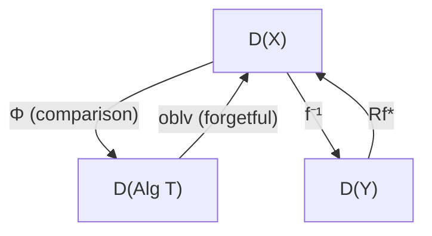

# Descent Theory and Monads

## Table of Contents

- [[#1. Motivation: the Descent Problem|1. Motivation: the Descent Problem]]
  - [[#1.1 Gluing in Topology|1.1 Gluing in Topology]]
  - [[#1.2 Vector Bundles and the Gluing Condition|1.2 Vector Bundles and the Gluing Condition]]
  - [[#1.3 Sheaves as the Prototypical Descent|1.3 Sheaves as the Prototypical Descent]]
- [[#2. Grothendieck Descent|2. Grothendieck Descent]]
  - [[#2.1 Fibered Categories|2.1 Fibered Categories]]
  - [[#2.2 Descent Data and the Cocycle Condition|2.2 Descent Data and the Cocycle Condition]]
  - [[#2.3 The Descent Category|2.3 The Descent Category]]
  - [[#2.4 Effective Descent Morphisms|2.4 Effective Descent Morphisms]]
- [[#3. The Monad Connection|3. The Monad Connection]]
  - [[#3.1 The Descent Monad of a Morphism|3.1 The Descent Monad of a Morphism]]
  - [[#3.2 Eilenberg-Moore Algebras as Descent Data|3.2 Eilenberg-Moore Algebras as Descent Data]]
  - [[#3.3 Beck's Monadicity Theorem|3.3 Beck's Monadicity Theorem]]
  - [[#3.4 The Benabou-Roubaud Theorem|3.4 The Benabou-Roubaud Theorem]]
  - [[#3.5 Faithfully Flat Descent as a Special Case|3.5 Faithfully Flat Descent as a Special Case]]
- [[#4. The Beck-Chevalley Condition|4. The Beck-Chevalley Condition]]
  - [[#4.1 Base Change and Mates|4.1 Base Change and Mates]]
  - [[#4.2 The Condition and its Significance|4.2 The Condition and its Significance]]
  - [[#4.3 The Six-Functor Formalism|4.3 The Six-Functor Formalism]]
- [[#5. Cohomological Descent|5. Cohomological Descent]]
  - [[#5.1 The Cech Nerve of a Cover|5.1 The Cech Nerve of a Cover]]
  - [[#5.2 Hypercoverings|5.2 Hypercoverings]]
  - [[#5.3 Cohomological Descent|5.3 Cohomological Descent]]
  - [[#5.4 The Bar Construction for Monads|5.4 The Bar Construction for Monads]]
  - [[#5.5 Comparison: Cohomological and Categorical Descent|5.5 Comparison: Cohomological and Categorical Descent]]
- [[#6. Galois Theory as Descent|6. Galois Theory as Descent]]
  - [[#6.1 Galois Descent for Vector Spaces|6.1 Galois Descent for Vector Spaces]]
  - [[#6.2 The Fundamental Theorem via Descent|6.2 The Fundamental Theorem via Descent]]
  - [[#6.3 Tannakian Formalism|6.3 Tannakian Formalism]]
- [[#7. The Higher-Categorical Perspective|7. The Higher-Categorical Perspective]]
  - [[#7.1 Infinity-Categorical Descent|7.1 Infinity-Categorical Descent]]
  - [[#7.2 The Barr-Beck-Lurie Theorem|7.2 The Barr-Beck-Lurie Theorem]]
  - [[#7.3 Infinity-Stacks and Sheaves|7.3 Infinity-Stacks and Sheaves]]
- [[#References|References]]

---

## 1. Motivation: the Descent Problem 🔭

The word *descent* in mathematics refers to a family of techniques for reconstructing a global object from local data that is already known to cohere. The paradigm is as follows: given a space $X$ and a cover $\{U_i \to X\}$, suppose we know the object we want on each $U_i$. When can we *descend* this data to a single object on $X$?

### 1.1 Gluing in Topology

The simplest instance is gluing continuous functions. Suppose $X = U_1 \cup U_2$ is a topological space covered by two open sets, and we have continuous functions $f_i : U_i \to Y$. We can glue them into a single $f : X \to Y$ if and only if $f_1|_{U_1 \cap U_2} = f_2|_{U_1 \cap U_2}$.

This is a *descent* statement: a function on the cover descends to the base if and only if it satisfies a compatibility condition on overlaps. The key data is:
1. Objects $f_i$ over each piece $U_i$.
2. An *isomorphism datum* (here, equality) over each double overlap $U_i \cap U_j$.
3. A *cocycle condition* over triple overlaps $U_i \cap U_j \cap U_k$ ensuring consistency.

### 1.2 Vector Bundles and the Gluing Condition

The classical geometric case is *vector bundles*. Let $X$ be a topological space with open cover $\{U_i\}$, and let $V_i$ be a vector bundle on each $U_i$. A *gluing datum* consists of bundle isomorphisms

$$\varphi_{ij} : V_i|_{U_i \cap U_j} \xrightarrow{\sim} V_j|_{U_i \cap U_j}$$

satisfying:
- **Unit condition:** $\varphi_{ii} = \mathrm{id}_{V_i}$.
- **Cocycle condition:** $\varphi_{jk} \circ \varphi_{ij} = \varphi_{ik}$ on $U_i \cap U_j \cap U_k$.

A standard theorem in topology asserts that vector bundles on $X$ are in bijection (up to isomorphism) with such gluing data.

> [!INFO] Historical Context
> Grothendieck systematized this in the 1950s–1960s, generalizing from topological covers to *Grothendieck topologies*, where "covers" can be morphisms of schemes rather than inclusions of open sets. His TDTE seminars (1959) and SGA1 laid the foundations of descent theory in algebraic geometry. The categorical formalization via monads was completed by Bénabou and Roubaud in 1970.

### 1.3 Sheaves as the Prototypical Descent

A *sheaf* on a topological space $X$ is the cleanest formalization of the descent idea. Recall:

**Definition (Sheaf).** A presheaf $\mathcal{F} : \mathrm{Open}(X)^{\mathrm{op}} \to \mathbf{Set}$ is a *sheaf* if for every open cover $U = \bigcup_i U_i$, the diagram

$$\mathcal{F}(U) \xrightarrow{\ \prod \rho_i\ } \prod_i \mathcal{F}(U_i) \underset{p_2^*}{\overset{p_1^*}{\rightrightarrows}} \prod_{i,j} \mathcal{F}(U_i \cap U_j)$$

is an equalizer, where $p_1^*, p_2^*$ are restriction to the two factors.

This says: sections over $U$ are precisely the *compatible families* of sections over the $U_i$. The right-hand equalizer is the beginning of a simplicial diagram — the *Cech nerve* — which will reappear in Section 5.

---

## 2. Grothendieck Descent 🏗️

We now develop the abstract framework for descent along an arbitrary morphism $f : Y \to X$ in a category $\mathcal{C}$.

### 2.1 Fibered Categories

**Definition (Fibered Category).** Let $p : \mathcal{E} \to \mathcal{B}$ be a functor. A morphism $\varphi : e' \to e$ in $\mathcal{E}$ is *cartesian* (over $u : b' \to b = p(e') \to p(e)$) if for every $e'' \in \mathcal{E}$ and every morphism $\psi : e'' \to e$ with $p(\psi) = u \circ v$ for some $v : p(e'') \to b'$, there exists a unique $\chi : e'' \to e'$ with $p(\chi) = v$ and $\varphi \circ \chi = \psi$.

In the notation of a diagram, $\varphi$ is cartesian if the following square is a pullback in $\mathcal{E}$ "over" the given square in $\mathcal{B}$:

```tikz
\usepackage{tikz-cd}
\begin{document}
\begin{tikzcd}
e'' \arrow[r, dashed, "\chi"] \arrow[rr, bend left, "\psi"] & e' \arrow[r, "\varphi"] & e \\
p(e'') \arrow[r, "v"] & b' \arrow[r, "u"] & b
\end{tikzcd}
\end{document}
```

**Definition (Fibration).** A functor $p : \mathcal{E} \to \mathcal{B}$ is a *Grothendieck fibration* (or *fibered category*) if for every morphism $u : b' \to b$ in $\mathcal{B}$ and every $e \in \mathcal{E}$ with $p(e) = b$, there exists a cartesian morphism $\varphi : e' \to e$ with $p(\varphi) = u$.

For each $b \in \mathcal{B}$, the *fiber* is $\mathcal{E}_b = p^{-1}(b)$. Given $u : b' \to b$, the cartesian lifting gives a *base-change functor* $u^* : \mathcal{E}_b \to \mathcal{E}_{b'}$, well-defined up to unique isomorphism.

> [!EXAMPLE] The Prototypical Fibration
> Let $\mathcal{B} = \mathbf{Top}$ and $\mathcal{E}$ the category of pairs $(X, V)$ where $V \to X$ is a vector bundle. The projection $p(X,V) = X$ is a Grothendieck fibration: the fiber over $X$ is the category of vector bundles on $X$, and a map $f : X' \to X$ gives the pullback functor $f^* : \mathrm{Vect}(X) \to \mathrm{Vect}(X')$.

The category of *pseudofunctors* $\mathcal{B}^{\mathrm{op}} \to \mathbf{Cat}$ is equivalent to the category of fibrations over $\mathcal{B}$ (the Grothendieck construction). Thus, a fibration encodes a "family of categories parameterized by $\mathcal{B}$."

> [!NOTE] From Single Morphisms to Stacks
> Descent can be studied *along one fixed morphism* $f : Y \to X$, or *for all morphisms in a topology simultaneously*. A fibered category $p : \mathcal{E} \to \mathcal{B}$ is a **stack** in a Grothendieck topology $\tau$ on $\mathcal{B}$ if for *every* covering morphism $f : Y \to X$ in $\tau$, the comparison functor $\Phi_f : \mathcal{E}_X \to \mathrm{Des}(f)$ is an equivalence. In other words, the stack condition is precisely the condition that every cover is an effective descent morphism for the given fibration. This is why "descent theory" and "the theory of stacks" are essentially the same subject viewed from different angles: one morphism at a time vs. all morphisms in a topology.

### 2.2 Descent Data and the Cocycle Condition

Fix a fibration $p : \mathcal{E} \to \mathcal{B}$ and a morphism $f : Y \to X$ in $\mathcal{B}$. The fiber products $Y \times_X Y$ and $Y \times_X Y \times_X Y$ (assumed to exist) give the *Cech nerve* diagram:

```tikz
\usepackage{tikz-cd}
\begin{document}
\begin{tikzcd}
Y \times_X Y \times_X Y \arrow[r, shift left=2, "p_{12}"] \arrow[r, "p_{23}"] \arrow[r, shift right=2, "p_{13}"'] & Y \times_X Y \arrow[r, shift left, "\pi_1"] \arrow[r, shift right, "\pi_2"'] & Y \arrow[r, "f"] & X
\end{tikzcd}
\end{document}
```

**Definition (Descent Datum).** A *descent datum* for $f : Y \to X$ in the fibration $p : \mathcal{E} \to \mathcal{B}$ is a pair $(E, \varphi)$ where:
- $E \in \mathcal{E}_Y$ is an object over $Y$.
- $\varphi : \pi_1^* E \xrightarrow{\sim} \pi_2^* E$ is an isomorphism in $\mathcal{E}_{Y \times_X Y}$, called the *descent isomorphism*.
- The *cocycle condition* holds: $p_{23}^*\varphi \circ p_{12}^*\varphi = p_{13}^*\varphi$ as isomorphisms in $\mathcal{E}_{Y \times_X Y \times_X Y}$.

The cocycle condition can be drawn:

```tikz
\usepackage{tikz-cd}
\begin{document}
\begin{tikzcd}
p_{12}^*\pi_1^* E \arrow[rr, "p_{12}^*\varphi"] \arrow[dr, "p_{13}^*\varphi"'] & & p_{12}^*\pi_2^* E \arrow[dl, "p_{23}^*\varphi"] \\
& p_{13}^*\pi_2^* E &
\end{tikzcd}
\end{document}
```

> [!NOTE] Cocycle vs. 2-Cocycle
> The cocycle condition $p_{23}^*\varphi \circ p_{12}^*\varphi = p_{13}^*\varphi$ is a categorical analog of the Cech 1-cocycle condition $g_{jk} \cdot g_{ij} = g_{ik}$ for transition functions. When $\mathcal{E}$ is a sheaf of groups rather than categories, descent data reduce precisely to Cech 1-cocycles, and isomorphism classes of descent data form the Cech cohomology group $\check{H}^1(Y/X, \mathcal{G})$.

A morphism of descent data $(E, \varphi) \to (E', \varphi')$ is a morphism $h : E \to E'$ in $\mathcal{E}_Y$ such that $\varphi' \circ \pi_1^* h = \pi_2^* h \circ \varphi$.

### 2.3 The Descent Category

**Definition (Descent Category).** The *descent category* $\mathrm{Des}(f)$ (or $\mathrm{Des}(p, f)$ when the fibration must be specified) is the category whose objects are descent data $(E, \varphi)$ and whose morphisms are morphisms of descent data.

There is a canonical functor — the *comparison functor* — from the fiber over $X$ to the descent category:

$$\Phi_f : \mathcal{E}_X \to \mathrm{Des}(f), \qquad F \mapsto (f^* F, \, \mathrm{can})$$

where $\mathrm{can} : \pi_1^* f^* F \xrightarrow{\sim} \pi_2^* f^* F$ is the canonical isomorphism $(\pi_1 \circ f)^* F \cong (\pi_2 \circ f)^* F$ coming from $f \circ \pi_1 = f \circ \pi_2$ (both projections to $X$ are equal to $f \circ \pi_i$).

> [!NOTE] Fully Faithful Descent
> The functor $\Phi_f$ is always faithful when $f$ is an epimorphism in a suitable sense. It is *fully faithful* under mild conditions on the fibration and the morphism $f$. The interesting and more subtle question is whether $\Phi_f$ is an equivalence.

### 2.4 Effective Descent Morphisms

**Definition (Effective Descent Morphism).** A morphism $f : Y \to X$ is an *effective descent morphism* for the fibration $p$ if the comparison functor $\Phi_f : \mathcal{E}_X \to \mathrm{Des}(f)$ is an equivalence of categories.

Intuitively: $f$ is an effective descent morphism if every descent datum along $f$ actually comes from an object on $X$. The data "glues."

> [!INFO] The Two Fundamental Questions of Descent
> Descent theory is organized around two problems, both asking about the fibers of $f^* : C_X \to C_Y$:
>
> 1. **Image problem.** When is an object $G \in C_Y$ isomorphic to $f^*(E)$ for some $E \in C_X$? That is, when does $G$ *come from* the base?
> 2. **Forms problem.** Given $G \in C_Y$ that is in the image, classify all $E \in C_X$ with $f^*(E) \cong G$. These are called the *$f$-forms* of $G$.
>
> Effective descent answers question 1 completely: if $f$ is of effective descent, every $G$ *equipped with a descent datum* comes from $X$. The forms problem is answered by $H^1$: the set of isomorphism classes of $X$-objects descending to $G$ is a torsor under $\mathrm{Aut}(G)$-cohomology. This two-question framing, due to Grothendieck, is the engine behind Galois cohomology and the theory of algebraic forms.

> [!EXAMPLE] Effective Descent in Algebraic Geometry
> In the fibration of quasi-coherent sheaves over $\mathbf{Sch}$, a key theorem (Grothendieck, SGA 1) states:
> - Any *faithfully flat quasi-compact* (fpqc) morphism $f : Y \to X$ is an effective descent morphism.
> - In particular, Zariski open covers, etale covers, and flat covers with finiteness conditions all yield effective descent.
>
> This generalizes the patching of modules from commutative algebra: if $A \to B$ is faithfully flat, then $A$-modules can be reconstructed from $B$-modules equipped with descent data.

> [!NOTE] Pure Morphisms: Sharp Characterization
> Grothendieck's theorem identifies *faithfully flat* maps as effective descent morphisms, but this is not optimal. A deeper result in commutative algebra (Joyal–Tierney, Mesablishvili) shows:
>
> **Effective descent morphisms for modules are precisely the *pure* ring maps** $A \to B$ — those for which $M \to M \otimes_A B$ is injective for every $A$-module $M$.
>
> Every faithfully flat map is pure, but pure maps need not be flat (e.g., $\mathbb{Z} \to \prod_p \mathbb{Z}/p\mathbb{Z}$ is pure but not flat). The pure morphism characterization is the "right" answer to the question: which ring maps permit reconstructing $A$-modules from their base changes?

---

## 3. The Monad Connection 🔗

The profound insight, due to Beck (unpublished, 1960s) and formalized by Bénabou–Roubaud (1970), is that descent theory is secretly monadic. Every morphism gives rise to a monad, and descent data are precisely algebras over this monad.

> [!INFO] Genealogy: From Beck to Lurie
> The monadic viewpoint on descent has a rich intellectual lineage. The key contributors and their roles:
>
> | Contributor | Contribution |
> |---|---|
> | Beck (1960s, unpublished) | Monadicity theorem; comonadicity = descent |
> | Bénabou–Roubaud (1970) | Formalized Des$(f) \cong$ Alg$(\mathbb{T}_f)$ under Beck-Chevalley |
> | Giraud (1971) | Non-abelian $H^2$, gerbes, stacks |
> | Breen (1980s–90s) | Non-abelian cohomology, higher gerbes |
> | Street (1980s) | Formal theory of monads in 2-categories; descent in bicategories |
> | K. Brown, Joyal, Jardine (1980s–90s) | Homotopy-theoretic descent, simplicial presheaves |
> | Simpson, Mauri–Tierney (1990s) | Higher stacks and $n$-stacks |
> | Kontsevich–Rosenberg (2004) | Descent for $A_\infty$-categories and Karoubian triangulated categories |
> | Lurie (2006–) | $(\infty,1)$-Beck theorem; descent in $\infty$-topoi (HTT, HA) |
>
> The common thread: each generalization replaces strict equalities in the cocycle condition with coherent homotopies, requiring progressively richer algebraic structures (monads → $A_\infty$-monads → $\infty$-monads) to encode the data.

### 3.1 The Descent Monad of a Morphism

Fix a category $\mathcal{C}$ with pullbacks and a morphism $f : Y \to X$. The *pullback functor*

$$f^* : \mathcal{C}/X \to \mathcal{C}/Y$$

(sending $[E \to X]$ to $[E \times_X Y \to Y]$) has a right adjoint given by composition with $f$:

$$f_* : \mathcal{C}/Y \to \mathcal{C}/X, \qquad [V \to Y] \mapsto [V \xrightarrow{} Y \xrightarrow{f} X].$$

This gives an adjunction $f^* \dashv f_*$ between slice categories:

```tikz
\usepackage{tikz-cd}
\begin{document}
\begin{tikzcd}
\mathcal{C}/X \arrow[r, bend left, "f^*"] \arrow[r, phantom, "\perp"] & \mathcal{C}/Y \arrow[l, bend left, "f_*"]
\end{tikzcd}
\end{document}
```

**Definition (Descent Monad).** The *descent monad* $\mathbb{T}_f = (T_f, \eta, \mu)$ on $\mathcal{C}/X$ is the monad induced by the adjunction $f^* \dashv f_*$:

$$T_f = f_* \circ f^*, \qquad \eta : \mathrm{Id} \Rightarrow T_f, \qquad \mu : T_f^2 \Rightarrow T_f.$$

Explicitly, for $[E \to X] \in \mathcal{C}/X$:

$$T_f(E) = E \times_X Y \xrightarrow{f \circ \pi_Y} X$$

(the *Weil restriction* of the base change). The unit $\eta_E : E \to T_f(E)$ comes from the universal property of the pullback, and the multiplication $\mu_E : T_f^2(E) \to T_f(E)$ encodes the composition of the two pullbacks.

> [!INFO] The Comonad Perspective
> The same adjunction also gives a *comonad* $\mathbb{G}_f = (G_f, \varepsilon, \delta)$ on $\mathcal{C}/Y$:
> $$G_f = f^* \circ f_*, \qquad \varepsilon : G_f \Rightarrow \mathrm{Id}, \qquad \delta : G_f \Rightarrow G_f^2.$$
> For $[V \to Y]$, $G_f(V) = V \times_Y (Y \times_X Y)$, which is the fiber product implementing the double cover. The comonad perspective is often more natural for descent: $G_f$-coalgebras will turn out to be exactly descent data.

### 3.2 Eilenberg-Moore Algebras as Descent Data

Let us unpack what a $T_f$-algebra is. See [[concepts/category-theory/foundations/04-adjoint-functor-theorems-monads|Monads]] for the general theory.

**Claim.** The category $\mathrm{Alg}(T_f)$ of Eilenberg–Moore algebras for $\mathbb{T}_f$ is equivalent to the descent category $\mathrm{Des}(f)$.

*Proof sketch.* An Eilenberg–Moore algebra is a pair $(E \to X, \, \alpha : T_f(E) \to E)$ satisfying unit and associativity axioms. Unwrapping:

$$T_f(E) = f_*(f^*(E)) = [E \times_X Y \xrightarrow{f \circ \pi_Y} X].$$

The structure map $\alpha$ is a morphism over $X$, i.e., a map $E \times_X Y \to E$ over $X$. By adjunction $(f^* \dashv f_*)$, giving such a map is equivalent to giving a map $f^*(E) \to f^*(E)$ over $Y$, i.e., an automorphism $\varphi : \pi_1^* E \cong f^* E \to f^* E \cong \pi_2^* E$ over $Y \times_X Y$ (where the identification uses $\pi_i^* \cong f^*$ after unfolding pullbacks). The unit and associativity axioms for $\alpha$ translate precisely to:
- $\varphi|_{\Delta} = \mathrm{id}$ (unit, where $\Delta : Y \to Y \times_X Y$ is the diagonal).
- $p_{23}^* \varphi \circ p_{12}^* \varphi = p_{13}^* \varphi$ (cocycle condition).

These are exactly the axioms for a descent datum $(f^* E, \varphi) \in \mathrm{Des}(f)$. $\square$

> [!WARNING] Variance
> The monad $\mathbb{T}_f$ lives on $\mathcal{C}/X$, not on a single fiber. The "fiber" version — working with the single fiber $\mathcal{E}_X$ in a fibration — requires the Beck-Chevalley condition discussed in Section 4 to make the base-change functors cohere into a genuine monad on the fiber.

### 3.3 Beck's Monadicity Theorem

The comparison functor $K : \mathcal{C}/X \to \mathrm{Alg}(T_f)$, given by $K(E) = (E, \eta_{T_f(E)} \circ \alpha_E)$... wait, more precisely, the canonical comparison functor is

$$K : \mathcal{C}/Y \to \mathrm{Coalg}(G_f), \qquad V \mapsto (V, \delta_V : V \to G_f(V))$$

using the counit of the adjunction. The question of when $K$ is an equivalence is answered by Beck's theorem.

**Theorem (Beck's Monadicity Theorem).** Let $U : \mathcal{D} \to \mathcal{C}$ be a functor with a left adjoint $F : \mathcal{C} \to \mathcal{D}$. Then $U$ is *monadic* — i.e., the comparison functor $K : \mathcal{D} \to \mathrm{Alg}(U F)$ is an equivalence — if and only if:
1. $U$ reflects isomorphisms: if $U(h)$ is an isomorphism then so is $h$.
2. $\mathcal{D}$ has coequalizers of $U$-split pairs, and $U$ preserves them.

A parallel $f \underset{g}{\overset{h}{\rightrightarrows}} e$ in $\mathcal{D}$ is *$U$-split* if $U(f), U(g)$ have a split coequalizer in $\mathcal{C}$, i.e., there exist $t : Ue \to Uf$ and $s : \mathrm{coeq}(Uf, Ug) \to Ue$ splitting the coequalizer.

**Corollary (Descent via Monadicity).** The morphism $f : Y \to X$ is an effective descent morphism for the fibration of objects in $\mathcal{C}$ if and only if the pullback functor $f^* : \mathcal{C}/X \to \mathcal{C}/Y$ is comonadic (equivalently, $f_* : \mathcal{C}/Y \to \mathcal{C}/X$ is monadic). **This is the fundamental equivalence: descent = monadicity of $f^*$.**

> [!NOTE] Crude vs. Precise Monadicity
> There is also a *crude* monadicity theorem: $U$ is monadic if it reflects isomorphisms, and $\mathcal{D}$ has and $U$ preserves coequalizers of *reflexive pairs* (pairs with a common right inverse). For descent applications, the crude theorem often suffices because the relevant coequalizers are reflexive — the diagonal $\Delta : Y \to Y \times_X Y$ provides a common section.

### 3.4 The Benabou-Roubaud Theorem

The Bénabou–Roubaud theorem (1970) makes the relationship between fibered descent and monadic descent precise in the setting of bifibrations.

**Definition (Bifibration).** A functor $p : \mathcal{E} \to \mathcal{B}$ is a *bifibration* if it is both a Grothendieck fibration and a Grothendieck opfibration. That is, every morphism in $\mathcal{B}$ has both a *cartesian* lifting (giving the base-change functor $u^*$) and a *opcartesian* lifting (giving the pushforward functor $u_*$), yielding adjunctions $u_! \dashv u^* \dashv u_*$ on each fiber.

**Theorem (Bénabou–Roubaud).** Let $p : \mathcal{E} \to \mathcal{B}$ be a bifibration satisfying the *Beck-Chevalley condition* (Section 4) for a morphism $a : A_1 \to A_0$ in $\mathcal{B}$. Then there is an isomorphism of categories

$$\mathrm{Alg}(\mathbb{T}^a) \cong \mathrm{Des}(p, a)$$

where $\mathbb{T}^a = a^* a_*$ is the monad on $\mathcal{E}_{A_0}$ induced by the adjunction $a_! \dashv a^*$ (or $a^* \dashv a_*$), and $\mathrm{Des}(p, a)$ is the descent category of $a$ in the fibration $p$.

Combining this with Beck's monadicity theorem:

**Corollary.** Under the hypotheses of the Bénabou–Roubaud theorem, $a : A_1 \to A_0$ is an effective descent morphism if and only if the base-change functor $a^* : \mathcal{E}_{A_0} \to \mathcal{E}_{A_1}$ is monadic.

> [!INFO] The Original Paper
> The original 1970 note by Bénabou and Roubaud appeared without proofs; it established the equivalence in the presence of a Beck-Chevalley condition. The result was subsequently generalized by various authors (Janelidze, Tholen, Lack–Paré) to settings where the Beck-Chevalley condition holds only weakly or up to a natural transformation that is epic rather than an isomorphism.

### 3.5 Faithfully Flat Descent as a Special Case

The most important application in algebraic geometry is *faithfully flat* (or fpqc) descent.

**Setup.** Let $A \to B$ be a *faithfully flat* ring homomorphism (flat plus $\mathrm{Spec}(B) \to \mathrm{Spec}(A)$ surjective). Consider the fibration $p : \mathrm{QCoh} \to \mathbf{Sch}^{\mathrm{op}}$ assigning to a scheme its category of quasi-coherent sheaves.

The monad $\mathbb{T}_{f}$ on $A\text{-}\mathbf{Mod}$ induced by $f^*(M) = M \otimes_A B$ is $T_f(M) = M \otimes_A B$, and a $T_f$-algebra structure on $M \otimes_A B$ is a $B \otimes_A B$-module isomorphism

$$\varphi : M \otimes_A B \otimes_{B} (B \otimes_A B) \xrightarrow{\sim} (B \otimes_A B) \otimes_B M \otimes_A B,$$

which, after simplification, is a $B \otimes_A B$-module isomorphism $\varphi : M \otimes_A B \otimes_A B \xrightarrow{\sim} B \otimes_A M \otimes_A B$ satisfying the cocycle condition over $B \otimes_A B \otimes_A B$. This is precisely the classical descent datum for modules.

**Theorem (Grothendieck Faithfully Flat Descent).** For a faithfully flat ring map $A \to B$, the functor

$$A\text{-}\mathbf{Mod} \to \mathrm{Des}(A \to B)$$

is an equivalence. **An $A$-module $M$ is completely determined by its base change $M \otimes_A B$ together with descent data.**

*Why does monadicity apply?* Since $A \to B$ is faithfully flat:
1. $f^*(M) = - \otimes_A B$ is *conservative* (reflects isomorphisms): if $M \otimes_A B \cong N \otimes_A B$ as $B$-modules with compatible descent data, then $M \cong N$.
2. Coequalizers of $f^*$-split pairs exist and are preserved, because $- \otimes_A B$ is exact (flat) and reflects exactness (faithfully flat). $\square$

---

## 4. The Beck-Chevalley Condition 🔀

### 4.1 Base Change and Mates

In a 2-category (or the 2-category $\mathbf{Cat}$ of categories), given a commutative square of functors and a pair of adjunctions, one can form a *mate* — a canonical natural transformation going in the opposite direction.

**Definition (Mate).** Suppose $f \dashv f^*$ and $g \dashv g^*$ are adjunctions (with $f, g$ the left adjoints). Given a natural transformation $\alpha : g^* \circ h \Rightarrow k \circ f^*$, the *mate* of $\alpha$ is the natural transformation

$$\bar{\alpha} : h \circ f \Rightarrow g \circ k$$

constructed as $\bar{\alpha} = (g \circ \varepsilon_k) \circ (g \circ k \circ \alpha \circ f) \circ (\eta_h \circ f)$ (using the units and counits of the adjunctions).

In the context of a fibration, given a commutative square in the base:

```tikz
\usepackage{tikz-cd}
\begin{document}
\begin{tikzcd}
B' \arrow[r, "h"] \arrow[d, "k"'] & A' \arrow[d, "f"] \\
B \arrow[r, "g"] & A
\end{tikzcd}
\end{document}
```

the commutativity $f \circ h = g \circ k$ induces, via the pullback functors, a canonical *base-change natural transformation*

$$\chi : k^* g^* \Rightarrow h^* f^*.$$

(Since $g \circ k = f \circ h$ and pullback is functorial, both sides pull the same composite back to $B'$, and there is a canonical comparison.)

### 4.2 The Condition and its Significance

**Definition (Beck-Chevalley Condition).** A commutative square in the base (as above) satisfies the *Beck-Chevalley condition* if the canonical natural transformation $\chi : k^* g^* \Rightarrow h^* f^*$ is an isomorphism (equivalently, its mate $\bar{\chi} : h_! k^* \Rightarrow f^* g_!$ is an isomorphism, where $h_!, g_!$ are left adjoints to $h^*, g^*$ if they exist).

The condition is crucial for two reasons:

1. **Monad coherence.** It ensures that the "fiber-wise" monads $\mathbb{T}^f_b = b^* b_*$ on fibers $\mathcal{E}_b$ assemble into a coherent pseudofunctor. Without Beck-Chevalley, the composition $b^* \circ b_*$ does not commute with base change in the way needed for the Bénabou–Roubaud theorem.

2. **Functoriality of indexed adjoints.** If $p : \mathcal{E} \to \mathcal{B}$ is a fibration and every $f : b' \to b$ admits both $f_!$ and $f_*$, then the families $(f_!)_{f \in \mathcal{B}}$ and $(f_*)_{f \in \mathcal{B}}$ assemble into indexed functors if and only if the Beck-Chevalley condition holds for all pullback squares.

> [!EXAMPLE] Beck-Chevalley in Logic
> In dependent type theory and categorical logic, the Beck-Chevalley condition is exactly the condition that *substitution commutes with quantification*. If $f : \Gamma' \to \Gamma$ is a context morphism, the condition says $f^*(\exists_g \phi) \cong \exists_h (k^* \phi)$ for a pullback square — i.e., substituting before or after existential quantification gives the same result. This is a fundamental *coherence* condition for first-order logic in categories.

### 4.3 The Six-Functor Formalism

When a morphism $f : Y \to X$ admits all three adjoints — $f_! \dashv f^* \dashv f_*$ — one is in the realm of the *six-functor formalism* (Grothendieck, later formalized by Scholze):

$$f_!, \, f^*, \, f_*, \, f^!, \, \otimes, \, \mathcal{H}om.$$

The Beck-Chevalley condition then becomes a key compatibility: for a Cartesian square

```tikz
\usepackage{tikz-cd}
\begin{document}
\begin{tikzcd}
Y' \arrow[r, "h"] \arrow[d, "k"'] & Y \arrow[d, "f"] \\
X' \arrow[r, "g"] & X
\end{tikzcd}
\end{document}
```

the *proper base change theorem* states $g^* f_! \cong k_! h^*$, and the *smooth base change theorem* states $g^* f_* \cong k_* h^*$ (under appropriate hypotheses). These are the Beck-Chevalley conditions for $f_!$ and $f_*$ respectively.

> [!INFO] Descent and the Six Functors
> In the six-functor framework, descent for $f^*$ is equivalent to saying that the adjunction $f_! \dashv f^*$ is comonadic, while descent for $f^*$ with respect to $f_*$ is monadic descent. The Beck-Chevalley conditions then ensure these descent statements are compatible with further base change.

---

## 5. Cohomological Descent 🌐

### 5.1 The Cech Nerve of a Cover

Given a morphism $f : Y \to X$, its *Cech nerve* $\check{C}(f)_\bullet$ is the simplicial object (see [[concepts/category-theory/foundations/03-limits-colimits|Limits and Colimits]] for simplicial machinery):

**Definition (Cech Nerve).** The *Cech nerve* $\check{C}(f)_\bullet$ is the simplicial object in $\mathcal{C}$ with

$$\check{C}(f)_n = Y \times_X Y \times_X \cdots \times_X Y \quad (n+1 \text{ factors})$$

with face maps $d_i : \check{C}(f)_n \to \check{C}(f)_{n-1}$ given by omitting the $i$-th factor (via the projection), and degeneracy maps $s_i : \check{C}(f)_n \to \check{C}(f)_{n+1}$ given by repeating the $i$-th factor (via the diagonal).

Explicitly: $\check{C}(f)_0 = Y$, $\check{C}(f)_1 = Y \times_X Y$, $\check{C}(f)_2 = Y \times_X Y \times_X Y$, and so on. The augmented Cech nerve includes the map $f : Y \to X$ as an augmentation $\check{C}(f)_\bullet \to X$.

> [!NOTE] Cech Nerve and the Two-Sided Bar Construction
> The Cech nerve $\check{C}(f)_\bullet$ is a special case of the two-sided bar construction. If $\mathbf{B}(f)$ denotes the bar construction for the comonad $G_f = f^* f_*$ on $\mathcal{C}/Y$, then the simplicial object $\mathbf{B}(G_f, V)_n = G_f^{n+1}(V)$ corresponds under the equivalence $\mathrm{Coalg}(G_f) \cong \mathrm{Des}(f)$ to the Cech nerve construction. This is the categorical bridge between the monad-theoretic and geometric viewpoints.

### 5.2 Hypercoverings

The Cech nerve handles "one-level" covers, but for cohomology one sometimes needs *hypercoverings*, which are more flexible.

**Definition (Hypercovering).** Let $(\mathcal{C}, \tau)$ be a site (a category with a Grothendieck topology). A *hypercovering* of $X \in \mathcal{C}$ is an augmented simplicial object $U_\bullet \to X$ in $\mathcal{C}$ such that for each $n \geq 0$, the canonical map

$$U_n \to (\mathrm{cosk}_{n-1} U_\bullet)_n$$

is a covering morphism (in the topology $\tau$), where $\mathrm{cosk}_{n-1}$ denotes the $(n-1)$-coskeleton.

Every Cech nerve of a cover is a hypercovering, but hypercoverings are strictly more general: they allow the $n$-th level to be a cover of the matching object (the coskeleton) rather than the naive iterated fiber product. Hypercoverings arise naturally when the topology is not generated by single covers (e.g., the etale topology in characteristic $p$).

### 5.3 Cohomological Descent

Now suppose we are in an abelian situation: $\mathcal{F}$ is a sheaf of abelian groups (or a complex of sheaves) on a site $(\mathcal{C}, \tau)$.

**Definition (Cohomological Descent).** A morphism $f : Y \to X$ (or an augmented simplicial object $U_\bullet \to X$) is *of cohomological descent* for a sheaf $\mathcal{F}$ if the canonical map

$$R\Gamma(X, \mathcal{F}) \xrightarrow{\sim} R\Gamma(\check{C}(f)_\bullet, f^*\mathcal{F}) := R\Gamma(Y, f^*\mathcal{F}) \times^h R\Gamma(Y \times_X Y, \pi^* f^*\mathcal{F}) \times^h \cdots$$

is a quasi-isomorphism. More precisely, there is a *descent spectral sequence*:

$$E_1^{p,q} = H^q(\check{C}(f)_p, f^*\mathcal{F}) \Rightarrow H^{p+q}(X, \mathcal{F}).$$

For a hypercovering $U_\bullet \to X$, the correct statement uses the *totalization* of the cosimplicial cochain complex $R\Gamma(U_\bullet, \mathcal{F}|_{U_\bullet})$:

$$R\Gamma(X, \mathcal{F}) \xrightarrow{\sim} R\lim_{\Delta} R\Gamma(U_n, \mathcal{F}|_{U_n}).$$

**Theorem (Cohomological Descent via Hypercovering).** If $U_\bullet \to X$ is a hypercovering in a site where $\mathcal{F}$ is a sheaf, then the natural map

$$R\Gamma(X, \mathcal{F}) \xrightarrow{\sim} \mathrm{Tot}\big(R\Gamma(U_\bullet, \mathcal{F}|_{U_\bullet})\big)$$

is a quasi-isomorphism (Conrad, SGA 4).

> [!WARNING] Cohomological vs. Categorical Descent
> Cohomological descent is *weaker* than categorical descent. Categorical descent says the comparison functor $\Phi_f : \mathcal{E}_X \to \mathrm{Des}(f)$ is an equivalence of categories — every descent datum comes from a genuine object on $X$. Cohomological descent says only that $R\Gamma(X, \mathcal{F}) \xrightarrow{\sim} \mathrm{Tot}(R\Gamma(\check{C}(f)_\bullet, f^*\mathcal{F}))$ — the cohomology groups agree. A morphism can be of cohomological descent without being an effective descent morphism. See §5.5 for the precise relationship and why the weaker condition is nonetheless indispensable.

> [!INFO] Cohomological Descent as the Unit of a Derived Monad
> There is a clean monad-theoretic interpretation of cohomological descent. Consider the adjunction $(f^{-1} \dashv Rf_*)$ on derived categories of sheaves. This adjunction induces a monad $\mathbb{T} = Rf_* \circ f^{-1}$ on $D(X)$. The unit of this monad is the canonical map
>
> $$\eta : \mathrm{Id} \to Rf_* \circ f^{-1}.$$
>
> Cohomological descent for $f$ is exactly the statement that $\eta_\mathcal{F} : \mathcal{F} \xrightarrow{\sim} Rf_*(f^{-1}\mathcal{F})$ is an isomorphism (in $D(X)$). In other words, *cohomological descent = the unit of the derived monad is an isomorphism*. The full $\infty$-categorical version — where the unit of the associated $(\infty,1)$-monad is an equivalence — recovers both sheaf-theoretic and homotopy-theoretic descent simultaneously (Lurie, "Noncommutative Algebra"; Kontsevich–Rosenberg for $A_\infty$-categories and Karoubian triangulated categories).

### 5.4 The Bar Construction for Monads

The bar construction for the monad $\mathbb{T}_f$ on $\mathcal{C}/X$ is the simplicial object

$$B(\mathbb{T}_f, E)_\bullet : \quad \cdots \underset{}{\overset{}{\overset{}{\underset{}{\rightrightarrows\atop\leftarrow}}}} T_f^2(E) \underset{}{\overset{}{\rightarrow\atop\leftarrow}} T_f(E) \to E$$

with face maps $d_i = T_f^{n-i} \mu T_f^{i-1}$ (applying $\mu$ in the $i$-th position) and degeneracy maps $s_j = T_f^{n-j} \eta T_f^j$ (applying $\eta$).

The *normalized bar complex* computes the derived functor of the coinvariants:

**Claim.** The bar construction $B(\mathbb{T}_f, \mathbb{T}_f, E)_\bullet$ (the two-sided bar construction) is contractible in $\mathcal{C}/X$ (it has a contracting homotopy given by the extra degeneracy $T_f(E) \to T_f^2(E)$ from the unit $\eta$). This contractibility is the categorical content of the statement that $T_f$-algebras form a "resolution" of objects in $\mathcal{C}/X$.

Under the identification $T_f(E) = E \times_X Y$, we have $T_f^n(E) = E \times_X Y^{\times_X n}$, and the bar complex becomes the Cech nerve augmented over $E$. **The bar construction for the monad $\mathbb{T}_f$ is exactly the Cech nerve of $f$, and its contractibility is the content of cohomological descent.** This is the deepest link between the monad-theoretic and sheaf-theoretic perspectives.

### 5.5 Comparison: Cohomological and Categorical Descent

The two descent conditions ask very different things of a morphism $f : Y \to X$, and understanding the gap between them is essential for applications.

#### Why cohomological descent is useful despite being weaker

The practical power of cohomological descent comes from the morphisms it admits. **Resolutions of singularities are almost never flat.** If $X$ is a singular variety and $\pi : \tilde{X} \to X$ is a resolution (proper, birational, smooth $\tilde{X}$), then $\pi$ is an isomorphism away from the singular locus but contracts exceptional divisors — it cannot be flat at those points. So:

- **Categorical descent fails** for $\pi$: the pullback $\pi^* : \mathrm{QCoh}(X) \to \mathrm{QCoh}(\tilde{X})$ is not monadic. The essential failure is that $\pi^*$ is not conservative — an $O_X$-module $\mathcal{F}$ supported on the singular locus can satisfy $\pi^*\mathcal{F} = 0$ without being zero.
- **Cohomological descent holds** for $\pi$: by proper base change and the Leray spectral sequence, $H^n(X, \mathcal{F}) \cong H^n(\tilde{X}, \pi^*\mathcal{F})$ when $\mathcal{F}$ has no higher direct images (e.g., for rational singularities, $R^i\pi_*\mathcal{O}_{\tilde{X}} = 0$ for $i > 0$).

*Categorical descent reconstructs objects; cohomological descent reconstructs cohomology groups.* The weaker condition is what allows tools from resolution of singularities — blowups, alterations, de Jong's theorem — to enter cohomological computations.

> [!EXAMPLE] cdh Topology and Motives
> The *cdh topology* on $\mathbf{Sch}$ is generated by abstract blowup squares and Nisnevich covers. Blowups are proper birational and almost never flat, so categorical descent in the fpqc sense fails. But cohomological descent holds for cdh covers, which is what allows motivic cohomology and algebraic $K$-theory to be extended from smooth varieties to all schemes via cdh descent (Haesemeyer–Weibel, Cisinski–Déglise).

#### Which morphisms admit cohomological descent?

The key theorem (SGA 4, Exposé V bis; Conrad) is:

**Theorem.** *Any hypercovering $U_\bullet \to X$ in a site satisfying mild hypotheses is of cohomological descent for any sheaf $\mathcal{F}$ on the site.*

This is a striking contrast with categorical descent, where the morphism must be an effective descent morphism (faithfully flat, or more generally pure). The classes are:

| Condition | Cohomological descent | Categorical descent |
|---|---|---|
| Faithfully flat (fpqc) | ✓ | ✓ (Grothendieck) |
| Étale cover | ✓ | ✓ |
| Proper surjection (general) | ✓ (via Leray + proper base change) | ✗ in general |
| Resolution of singularities | ✓ (rational singularities) | ✗ (not flat) |
| Blowup along a center | ✓ (cdh) | ✗ |
| Purely inseparable map ($\mathrm{char}\, p$) | ✗ in general | ✗ |
| Any hypercovering | ✓ (SGA 4) | depends on topology |

*Cohomological descent is not automatic for every surjection* — the morphism must "cover" the topology in the relevant sense. A closed immersion $Z \hookrightarrow X$ is surjective on points of $Z$ but obviously loses information about $U = X \setminus Z$.

> [!WARNING] Purely Inseparable Maps
> In characteristic $p$, purely inseparable morphisms $f : Y \to X$ (e.g., the Frobenius) are homeomorphisms on underlying spaces but fail cohomological descent for $\mathbb{Z}/\ell\mathbb{Z}$-sheaves with $\ell \neq p$. The cohomology of the Frobenius twist is not the same. This is one reason the étale topology is defined using separable covers.

#### The functor relating the two notions

Both notions arise from the same adjunction $f^{-1} \dashv Rf_*$, but they extract different information from it. Let $\mathbb{T} = Rf_* \circ f^{-1}$ denote the derived monad on $D(X)$ (the derived category of sheaves on $X$).

**Categorical descent** asks: is $Rf_* : D(Y) \to D(X)$ monadic, i.e., is the comparison functor

$$\Phi : D(X) \xrightarrow{\sim} D(\mathrm{Alg}_{\mathbb{T}})$$

an equivalence? This is the $\infty$-categorical Barr–Beck–Lurie theorem (Section 7).

**Cohomological descent** asks only: is the *unit* of the monad an isomorphism?

$$\eta_{\mathcal{F}} : \mathcal{F} \xrightarrow{\sim} Rf_*(f^{-1}\mathcal{F}) = \mathbb{T}(\mathcal{F}) \quad \text{in } D(X).$$

The implication **categorical $\Rightarrow$ cohomological** now has a clean proof: if $Rf_*$ is monadic and $f^{-1}$ is its left adjoint, the unit $\eta$ is an isomorphism precisely when every object of $D(X)$ is a *free* $\mathbb{T}$-algebra — which holds when the monad is *idempotent*, i.e., when $\mu : \mathbb{T}^2 \Rightarrow \mathbb{T}$ is an isomorphism. This is the content of the bar construction contractibility from §5.4: the extra degeneracy $T_f(E) \to T_f^2(E)$ provides a contracting homotopy, showing the Čech complex is a resolution and hence that the unit is a quasi-isomorphism.

More precisely, the functor relating the two conditions is the *forgetful functor*

$$\mathrm{oblv} : D(\mathrm{Alg}_{\mathbb{T}}) \to D(X),$$

which forgets the $\mathbb{T}$-algebra structure and returns the underlying complex. The diagram



commutes in the following sense: categorical descent says $\Phi$ is an equivalence (oblv $\circ$ $\Phi$ = Id); cohomological descent says $\eta = \mathrm{oblv} \circ \Phi$ lands each $\mathcal{F}$ on its own image, i.e., the unit $\mathcal{F} \to \mathbb{T}(\mathcal{F})$ is an isomorphism without requiring that $\Phi$ itself is an equivalence.

*Categorical descent = $\Phi$ is an equivalence. Cohomological descent = $\eta$ is an isomorphism. The latter is the shadow of the former under the forgetful functor $\mathrm{oblv}$.*

> [!QUESTION] Exercise: Idempotent Monads
> *This exercise establishes when the unit of a monad is an isomorphism and connects the monad-theoretic criterion to the geometric one.*
>
> > **Prerequisites:** [[#3.1 The Descent Monad of a Morphism|Section 3.1]], [[#5.3 Cohomological Descent|Section 5.3]]
>
> A monad $\mathbb{T} = (T, \eta, \mu)$ on a category $\mathcal{C}$ is *idempotent* if $\mu : T^2 \Rightarrow T$ is a natural isomorphism.
>
> (a) Show that if $\mathbb{T}$ is idempotent, then for every $\mathbb{T}$-algebra $(A, \alpha)$, the structure map $\alpha : T(A) \to A$ is an isomorphism.
>
> (b) Conclude that for an idempotent monad, the comparison functor $\Phi : \mathcal{C} \to \mathrm{Alg}(\mathbb{T})$ is an equivalence if and only if $\eta_C : C \to T(C)$ is an isomorphism for all $C$.
>
> (c) The derived monad $\mathbb{T}_f = Rf_* \circ f^{-1}$ is idempotent when $f$ is a localization (open immersion). Check this for $f : U \hookrightarrow X$ an open immersion, where $Rf_* = j_*$ is exact: show $j_* j^{-1} j_* \cong j_*$ using the unit-counit triangle identity.

> [!TIP]- Solution to Exercise: Idempotent Monads
> **Key insight:** Idempotency of $\mu$ forces algebra structure maps to be isos, collapsing the distinction between $\mathcal{C}$ and $\mathrm{Alg}(\mathbb{T})$ to just the question of whether $\eta$ is an iso.
>
> **Sketch:** (a) For a $\mathbb{T}$-algebra $(A, \alpha)$, the unit law $\alpha \circ \eta_A = \mathrm{id}_A$ and the associativity law $\alpha \circ \mu_A = \alpha \circ T(\alpha)$ give, when $\mu_A$ is an iso: $\alpha = \alpha \circ \mu_A \circ \mu_A^{-1} = \alpha \circ T(\alpha) \circ \mu_A^{-1}$. Using $\alpha \circ \eta_{T(A)} = \mathrm{id}_{T(A)}$ (the unit law applied to the free algebra), one shows $\alpha$ is a left inverse to $\eta_A$, and since $\alpha \circ \eta_A = \mathrm{id}$, $\alpha$ is also a right inverse, so $\alpha = \eta_A^{-1}$.
>
> (b) If $\eta_C$ is an iso for all $C$, then $\Phi(C) = (T(C), \mu_C)$ and $\mathrm{oblv}(\Phi(C)) = T(C) \cong C$ via $\eta_C^{-1}$, giving $\mathrm{oblv} \circ \Phi \cong \mathrm{Id}$. By (a), every algebra is free, giving $\Phi \circ \mathrm{oblv} \cong \mathrm{Id}$.
>
> (c) $j_* j^{-1} j_* \mathcal{F} = j_*(j^{-1}j_*\mathcal{F})$. By the counit $\varepsilon : j^{-1}j_* \to \mathrm{Id}$, there is a map $j_*(j^{-1}j_*\mathcal{F}) \to j_*\mathcal{F}$. For an open immersion $j: U \hookrightarrow X$, $j^{-1} j_* = \mathrm{Id}$ (restriction to $U$ of extension by zero on $U$ is the identity), so $j_* j^{-1} j_* \mathcal{F} \cong j_* \mathcal{F}$, confirming idempotency.

---

## 6. Galois Theory as Descent 🔑

### 6.1 Galois Descent for Vector Spaces

The paradigm example of descent in algebra is *Galois descent*. Let $K/k$ be a finite Galois extension with Galois group $G = \mathrm{Gal}(K/k)$.

**Definition (Semilinear Action).** A *semilinear $G$-action* on a $K$-vector space $V$ is a group action of $G$ on the underlying set of $V$ such that for all $\sigma \in G$, $v \in V$, $\lambda \in K$:

$$\sigma(\lambda \cdot v) = \sigma(\lambda) \cdot \sigma(v),$$

where $G$ acts on $K$ via the Galois action.

**Definition (Galois Descent Datum).** A *descent datum* for a $K$-vector space $V$ relative to $K/k$ is a collection of semilinear isomorphisms $\varphi_\sigma : V \to V$ (one for each $\sigma \in G$) satisfying the cocycle condition $\varphi_{\sigma\tau} = \varphi_\sigma \circ \sigma_*(\varphi_\tau)$, where $\sigma_*(\varphi_\tau)$ denotes $\varphi_\tau$ twisted by $\sigma$.

Equivalently, writing $\varphi_\sigma(v) = \sigma \cdot v$, a descent datum is a semilinear $G$-action on $V$.

**Theorem (Galois Descent).** The functor

$$k\text{-}\mathbf{Vect} \to \{K\text{-}\mathbf{Vect} \text{ with semilinear } G\text{-action}\}, \qquad W \mapsto (W \otimes_k K, \text{ natural action})$$

is an equivalence of categories. The inverse is $V \mapsto V^G = \{v \in V : \sigma(v) = v \, \forall \sigma \in G\}$.

*Proof sketch.* This is a special case of faithfully flat descent. The extension $k \hookrightarrow K$ is faithfully flat (it is a finite separable extension). A $K$-module with $B \otimes_A B$-descent data, where $B = K$ and $A = k$, amounts to: for each $\sigma \in G$, an isomorphism $\varphi_\sigma : V \otimes_{k,\sigma} K \to V$ satisfying the cocycle condition. Since $K \otimes_k K \cong \prod_{\sigma \in G} K$ (by the Chinese Remainder Theorem, as $K/k$ is Galois), descent data decompose into a semilinear $G$-action. $\square$

> [!EXAMPLE] A Concrete Instance
> Let $K = \mathbb{C}$, $k = \mathbb{R}$, $G = \{1, c\}$ where $c$ is complex conjugation. A $\mathbb{C}$-vector space $V$ with semilinear $G$-action descends to a $\mathbb{R}$-vector space: the underlying real vector space is $V^G = \{v \in V : c(v) = v\}$. For $V = \mathbb{C}^n$ with the standard action $c(z_1, \ldots, z_n) = (\bar{z}_1, \ldots, \bar{z}_n)$, we recover $\mathbb{R}^n \subseteq \mathbb{C}^n$.

### 6.2 The Fundamental Theorem via Descent

Grothendieck's formulation of Galois theory reinterprets the fundamental theorem as a descent statement.

**Setup.** Let $X = \mathrm{Spec}(k)$ for a field $k$ with separable closure $k^s$ and absolute Galois group $\pi_1(X) = \mathrm{Gal}(k^s/k)$. Consider the fibration $\mathbf{FEt} \to \mathbf{Sch}$ assigning to a scheme its category of finite etale covers.

**Theorem (Grothendieck Galois Theory).** There is an equivalence of categories

$$\mathbf{FEt}(X) \xrightarrow{\sim} \pi_1(X, \bar{x})\text{-}\mathbf{FinSets}$$

between finite etale covers of $X = \mathrm{Spec}(k)$ and finite sets with continuous $\mathrm{Gal}(k^s/k)$-action (permutation representations).

The comparison functor sends $Y \to X$ to the fiber $Y_{\bar{x}} = Y \times_X \mathrm{Spec}(k^s)$. This fiber functor $\omega : \mathbf{FEt}(X) \to \mathbf{FinSets}$ is a *fiber functor* in the sense of Tannakian formalism, and the Galois group is recovered as $\mathrm{Aut}(\omega)$ — the automorphism group of $\omega$ as a functor.

The descent perspective: a finite etale $X$-scheme $Y$ descends from $\mathrm{Spec}(k^s)$ back to $\mathrm{Spec}(k)$ precisely when the corresponding finite set is equipped with a continuous $\mathrm{Gal}(k^s/k)$-action satisfying the Galois descent condition.

> [!INFO] Descent and Galois Cohomology
> The *failure* of descent — the obstruction to descending a $k^s$-object to a $k$-object — is measured by Galois cohomology. Specifically, the set of isomorphism classes of $k$-forms of a given $k^s$-object $X_0$ is in bijection with the pointed set $H^1(\mathrm{Gal}(k^s/k), \mathrm{Aut}(X_0))$. This is the beginning of non-abelian cohomology and the theory of torsors.

> [!EXAMPLE] Non-Abelian $H^1$ and Twisted Forms
> The forms problem is where descent meets non-abelian cohomology concretely. Over $k = \mathbb{R}$, $G = \mathbb{Z}/2$ acting via complex conjugation:
>
> - The $\mathbb{R}$-forms of the $\mathbb{C}$-algebra $M_n(\mathbb{C})$ are classified by $H^1(\mathbb{Z}/2, \mathrm{PGL}_n(\mathbb{C}))$. For $n = 2$, this gives two forms: $M_2(\mathbb{R})$ itself and the *Hamilton quaternions* $\mathbb{H}$. Both become isomorphic to $M_2(\mathbb{C})$ after base change to $\mathbb{C}$.
> - The $\mathbb{R}$-forms of the quadratic space $(\mathbb{C}^n, \text{standard form})$ are classified by $H^1(\mathbb{Z}/2, O_n(\mathbb{C}))$, recovering the real quadratic forms of signature $(p,q)$ with $p + q = n$.
>
> The Cech 1-cocycle $\sigma \mapsto \varphi_\sigma \in \mathrm{Aut}(X_0)(k^s)$ (satisfying $\varphi_{\sigma\tau} = \varphi_\sigma \cdot \sigma(\varphi_\tau)$) is precisely a descent datum, confirming that the descent category for Galois covers is $H^1$ in the non-abelian sense. When $\mathrm{Aut}(X_0)$ is abelian, the pointed set $H^1$ is a group and coincides with the usual Galois cohomology group.

### 6.3 Tannakian Formalism

Tannakian formalism is a vast generalization of Galois descent, where instead of *sets with group action* one considers *linear representations*, and the Galois group is replaced by an algebraic group (or group scheme).

**Definition (Tannakian Category).** A *Tannakian category* over a field $k$ is a $k$-linear abelian rigid symmetric monoidal category $(\mathcal{T}, \otimes, \mathbf{1})$ such that $\mathrm{End}(\mathbf{1}) \cong k$, together with an *exact faithful tensor functor* (a *fiber functor*) $\omega : \mathcal{T} \to k\text{-}\mathbf{Vect}$.

**Theorem (Tannaka Reconstruction).** Let $(\mathcal{T}, \omega)$ be a neutral Tannakian category over $k$. Define

$$G = \underline{\mathrm{Aut}}^\otimes(\omega) : \mathbf{Alg}_k \to \mathbf{Grp}, \qquad R \mapsto \mathrm{Aut}^\otimes(\omega_R)$$

where $\omega_R = \omega \otimes_k R$. Then $G$ is an affine group scheme over $k$, and there is an equivalence of tensor categories

$$\mathcal{T} \xrightarrow{\sim} \mathrm{Rep}_k(G).$$

*Descent perspective.* The category $\mathrm{Rep}_k(G)$ is the descent of the trivial representation over $k^s$ (where the representation theory is trivial — every representation is a free module) back to $k$. The fiber functor $\omega$ plays the role of the "base change to $k^s$," and the Galois action is replaced by the $G$-action. **Tannakian reconstruction is Galois descent for tensor categories.**

> [!EXAMPLE] Motivic Galois Group
> In Grothendieck's vision of motives, the category of pure motives over $\mathbb{Q}$ should be a Tannakian category. The reconstructed group scheme $G = \mathrm{Gal}^{\mathrm{mot}}(\bar{\mathbb{Q}}/\mathbb{Q})$, the *motivic Galois group*, should encode all motivic cohomology. This program remains incomplete but guides much of modern arithmetic algebraic geometry.

---

## 7. The Higher-Categorical Perspective 🔬

### 7.1 Infinity-Categorical Descent

In Lurie's $\infty$-categorical framework (Higher Topos Theory, HTT), descent is recast in terms of $\infty$-sheaves on $\infty$-sites.

**Definition (Descent in an Infinity-Category).** Let $\mathcal{X}$ be an $\infty$-category and $U_\bullet \to X$ an augmented simplicial object (thought of as a "cover"). Then descent holds for an object $\mathcal{F} \in \mathcal{X}$ along this cover if the canonical map

$$\mathcal{F}(X) \to \lim_{\Delta} \mathcal{F}(U_\bullet)$$

is an equivalence in $\mathcal{X}$ (where the limit is the $\infty$-categorical limit over the simplex category $\Delta^{\mathrm{op}}$).

**Definition (Infinity-Sheaf / Infinity-Stack).** An $\infty$-presheaf $\mathcal{F} : \mathcal{C}^{\mathrm{op}} \to \mathcal{S}$ (where $\mathcal{S}$ is the $\infty$-category of spaces) is an *$\infty$-sheaf* on a site $(\mathcal{C}, \tau)$ if for every cover $U_\bullet \to X$, the descent condition holds.

The $\infty$-categorical formulation is strictly stronger than the classical one: it requires descent for *all* homotopy limits, not just the $\pi_0$ truncation. This is why the $\infty$-categorical theory handles stacks, higher stacks, and derived stacks uniformly.

> [!NOTE] Why Infinity-Categories?
> In the classical 1-categorical setting, the cocycle condition for descent data is a strict equality. In derived algebraic geometry, one works with complexes or $\infty$-groupoids, and the cocycle condition should hold only *up to coherent homotopy*. The $\infty$-categorical framework handles this automatically: the limit $\lim_\Delta \mathcal{F}(U_\bullet)$ automatically incorporates all higher coherences.

### 7.2 The Barr-Beck-Lurie Theorem

The $\infty$-categorical generalization of Beck's monadicity theorem is due to Lurie (HTT, §4.7 and HA, §4.7).

**Definition (Monadic Functor, Infinity-Categorical).** A functor $G : \mathcal{D} \to \mathcal{C}$ between $\infty$-categories is *monadic* if:
1. $G$ has a left adjoint $F : \mathcal{C} \to \mathcal{D}$ (with respect to [[concepts/category-theory/foundations/02-adjoints-representables|Adjoints]] in the $\infty$-categorical sense).
2. The comparison functor $K : \mathcal{D} \to \mathrm{Alg}_{\mathbb{T}}(\mathcal{C})$ to the $\infty$-category of algebras over the induced monad $\mathbb{T} = G \circ F$ is an equivalence.

**Theorem (Barr-Beck-Lurie).** Let $G : \mathcal{D} \to \mathcal{C}$ be a functor of $\infty$-categories admitting a left adjoint $F$. Then $G$ is monadic if and only if:
1. $G$ is *conservative*: $G(f)$ is an equivalence implies $f$ is an equivalence.
2. $\mathcal{D}$ admits geometric realizations (i.e., $|\Delta^{\mathrm{op}}|$-shaped colimits) of $G$-split simplicial objects, and $G$ preserves these geometric realizations.

Condition (2) is the $\infty$-categorical replacement of "has and preserves coequalizers of $U$-split pairs" — in the $\infty$-world, coequalizers are replaced by geometric realizations (colimits of simplicial diagrams), because the higher coherences built into an $\infty$-algebra are precisely captured by a resolution by a simplicial object.

> [!INFO] Why Geometric Realizations?
> In an ordinary category, an Eilenberg–Moore algebra is specified by a map $TA \to A$ satisfying unit and associativity as *equalities*. In an $\infty$-category, an $\infty$-algebra over a monad is a map $TA \to A$ satisfying these axioms up to coherent homotopy — i.e., it is the data of a whole simplicial object in $\mathcal{D}$ (the bar resolution), whose geometric realization recovers $A$. The Barr-Beck-Lurie theorem says: $G$ is monadic iff this bar-resolution process is well-behaved.

**Corollary (Infinity-Categorical Descent).** For a map $f : Y \to X$ in an $\infty$-topos $\mathcal{X}$, the pullback functor $f^* : \mathcal{X}_{/X} \to \mathcal{X}_{/Y}$ is comonadic if and only if $f$ is an effective descent morphism in the $\infty$-categorical sense.

### 7.3 Infinity-Stacks and Sheaves

An *$\infty$-topos* (Lurie, HTT Chapter 6) is an $\infty$-category $\mathcal{X}$ satisfying:
1. $\mathcal{X}$ has all small colimits and small limits.
2. Colimits are *universal* (stable under base change).
3. *Descent:* for every simplicial object $U_\bullet$ in $\mathcal{X}$ with colimit $|U_\bullet| = X$, the canonical functor $\mathcal{X}_{/X} \to \lim_\Delta \mathcal{X}_{/U_\bullet}$ is an equivalence.

Condition (3) is literally the $\infty$-categorical descent condition built into the axioms of an $\infty$-topos. The descent axiom ensures that $\mathcal{X}$ "looks like" the $\infty$-category of $\infty$-sheaves on some $\infty$-site.

**Theorem (Lurie, HTT 6.1.3).** An $\infty$-category $\mathcal{X}$ is an $\infty$-topos if and only if it is equivalent to the $\infty$-category of $\infty$-sheaves $\mathrm{Sh}_\infty(\mathcal{C}, \tau)$ on some $\infty$-site $(\mathcal{C}, \tau)$.

> [!TIP] Summary: The Central Equivalence
> The core result threading through this note is:
>
> **For a morphism $f : Y \to X$ in a suitable categorical context:**
> $$f \text{ is an effective descent morphism} \iff f^* : \mathcal{C}_X \to \mathcal{C}_Y \text{ is (co)monadic.}$$
>
> The proof pathway: Bénabou–Roubaud identifies $\mathrm{Des}(f) \cong \mathrm{Alg}(\mathbb{T}_f)$, and Beck's theorem (or Barr-Beck-Lurie in the $\infty$-case) then gives an explicit criterion — conservativity plus preservation of certain colimits — for when the comparison functor $\mathcal{C}_X \to \mathrm{Alg}(\mathbb{T}_f)$ is an equivalence.

---

## References

| Reference Name | Brief Summary | Link to Reference |
|---|---|---|
| [Vistoli, "Notes on Grothendieck Topologies, Fibered Categories and Descent Theory" (2004)](https://arxiv.org/abs/math/0412512) | Comprehensive foundational treatment: fibered categories, Grothendieck topologies, descent data, stacks | [arXiv:math/0412512](https://arxiv.org/abs/math/0412512) |
| [Bénabou & Roubaud, "Monades et Descente" (1970)](https://hal.science/hal-01254637) | Original paper identifying descent data with monad algebras under Beck-Chevalley | [hal-01254637](https://hal.science/hal-01254637) |
| [Beck, "Distributive Laws" (1969)](https://link.springer.com/chapter/10.1007/BFb0083084) | Beck's original unpublished monadicity theorem; first connecting descent to comonadicity | [Springer link](https://link.springer.com/chapter/10.1007/BFb0083084) |
| [Lurie, "Higher Topos Theory" (2009)](https://www.math.ias.edu/~lurie/papers/HTT.pdf) | Definitive reference for $\infty$-categories, $\infty$-topoi, $\infty$-descent, and the Barr-Beck-Lurie theorem | [IAS PDF](https://www.math.ias.edu/~lurie/papers/HTT.pdf) |
| [Obradović, "The Bénabou-Roubaud Monadic Descent Theorem via String Diagrams" (2024)](https://arxiv.org/html/2404.00868v1) | Modern treatment of Bénabou–Roubaud with weakened hypotheses and string-diagram proofs | [arXiv:2404.00868](https://arxiv.org/abs/2404.00868) |
| [Conrad, "Cohomological Descent" (2003)](https://math.stanford.edu/~conrad/papers/hypercover.pdf) | Detailed treatment of cohomological descent via hypercoverings following SGA 4 | [Stanford PDF](https://math.stanford.edu/~conrad/papers/hypercover.pdf) |
| [Ruiter, "Galois Descent" (2020)](https://users.math.msu.edu/users/ruiterj2/math/Documents/Notes%20and%20talks/Galois%20descent.pdf) | Accessible notes on Galois descent for vector spaces with explicit computations | [MSU PDF](https://users.math.msu.edu/users/ruiterj2/math/Documents/Notes%20and%20talks/Galois%20descent.pdf) |
| [Milne, "Algebraic Geometry, Chapter 16: Descent Theory"](https://www.jmilne.org/math/CourseNotes/AG16.pdf) | Algebraic geometry perspective on descent, including effective descent morphisms | [jmilne.org](https://www.jmilne.org/math/CourseNotes/AG16.pdf) |
| [nLab, "Monadic Descent"](https://ncatlab.org/nlab/show/monadic+descent) | Wiki-style reference with definitions, theorems, and connections to the broader categorical literature | [nLab](https://ncatlab.org/nlab/show/monadic+descent) |
| [nLab, "Beck's Monadicity Theorem"](https://ncatlab.org/nlab/show/monadicity+theorem) | Precise statement of Beck's theorem with proof sketch and variants (crude, strict) | [nLab](https://ncatlab.org/nlab/show/monadicity+theorem) |
| [Wikipedia, "Faithfully Flat Descent"](https://en.wikipedia.org/wiki/Faithfully_flat_descent) | Overview of faithfully flat descent for modules, connection to Beck's theorem | [Wikipedia](https://en.wikipedia.org/wiki/Faithfully_flat_descent) |
| [Brantner, "Lecture 5: The Barr-Beck-Lurie Theorem"](https://people.maths.ox.ac.uk/brantner/L5.pdf) | Lecture notes on the $\infty$-categorical Barr-Beck theorem and its applications | [Oxford PDF](https://people.maths.ox.ac.uk/brantner/L5.pdf) |
| [Hedonistic Learning, "Beck-Chevalley"](https://www.hedonisticlearning.com/posts/beck-chevalley.html) | Expository post on the Beck-Chevalley condition, mates, and indexed adjoints | [blog post](https://www.hedonisticlearning.com/posts/beck-chevalley.html) |
| [Golem Café, "On the Bar Construction" (2007)](https://golem.ph.utexas.edu/category/2007/05/on_the_bar_construction.html) | n-Category Café post on the bar construction, its universal property, and monad connections | [n-Cat Café](https://golem.ph.utexas.edu/category/2007/05/on_the_bar_construction.html) |
| [Deligne & Milne, "Tannakian Categories" (2022)](https://www.jmilne.org/math/xnotes/tc2022.pdf) | Definitive reference for Tannakian formalism, fiber functors, and reconstruction theorems | [jmilne.org](https://www.jmilne.org/math/xnotes/tc2022.pdf) |
| [Fantechi et al., "Fundamental Algebraic Geometry: Grothendieck's FGA Explained" (2005)](https://arxiv.org/abs/math/0412512) | Self-contained introductory treatment of Grothendieck topologies, fibered categories, descent, and stacks; recommended entry point for algebraic geometry | [arXiv:math/0412512](https://arxiv.org/abs/math/0412512) |
| [Bosch, Lütkebohmert & Raynaud, "Néron Models" Chapter 6 (1990)](https://link.springer.com/book/10.1007/978-3-642-51438-8) | Chapter 6 (§6.1–6.2) contains a detailed and highly concrete treatment of descent theory with worked examples linking Galois descent to the general formalism | [Springer](https://link.springer.com/book/10.1007/978-3-642-51438-8) |
