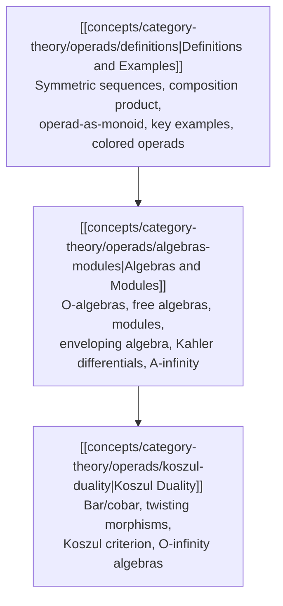

# Operads: Overview

An *operad* is an algebraic device that encodes a species of algebraic structure by packaging, for each arity $n \geq 0$, a collection of abstract $n$-ary operations together with composition laws, unit, and symmetric-group equivariance. The theory unifies disparate structures — associative algebras, commutative algebras, Lie algebras, $A_\infty$-algebras, and information-theoretic constructs such as the probability operad — under a single categorical framework. This cluster develops the subject in three layers: the foundational definitions (symmetric sequences, the composition product $\circ$, operad-as-monoid, key examples, colored operads); the theory of algebras and modules over an operad (free algebras, enveloping algebras $U_\mathcal{O}(A)$, Kähler differentials $\Omega^1_\mathcal{O}(A)$, and $A_\infty$-algebras); and Koszul duality (bar/cobar constructions, twisting morphisms, the Koszul criterion, and $\mathcal{O}_\infty$-resolutions). Together these notes supply both the algebraic foundations and the homotopy-theoretic machinery needed for applications in deformation theory, higher category theory, and mathematical physics.

---

## Notes in This Folder

| File | Status | Topic |
|------|--------|-------|
| [[concepts/category-theory/operads/definitions\|definitions.md]] | Written | Symmetric sequences, composition product $\circ$, operad as monoid in $\mathsf{SymSeq}$, partial-composition $\circ_i$ formulation, key examples ($\mathsf{Ass}$, $\mathsf{Com}$, $\mathsf{Lie}$, $\mathsf{End}_V$, probability operad $\mathcal{P}$), colored operads |
| [[concepts/category-theory/operads/algebras-modules\|algebras-modules.md]] | Planned | Algebras over an operad, free algebras, left/right/bimodules, enveloping algebra $U_\mathcal{O}(A)$, derivations, Kähler differentials $\Omega^1_\mathcal{O}(A)$, $A_\infty$-algebras |
| [[concepts/category-theory/operads/koszul-duality\|koszul-duality.md]] | Planned | Bar construction $B(\mathcal{O})$, cobar $\Omega(\mathcal{C})$, twisting morphisms, Koszul duality for quadratic operads, Koszul criterion, $\mathcal{O}_\infty$-algebras |

---

## Subtopic Map

### Foundational Structure

| Subtopic | Key Idea | Primary Source |
|----------|----------|----------------|
| Symmetric sequences | A *symmetric sequence* $M \in \mathsf{SymSeq}$ assigns to each $n$ a $\Bbbk[\mathbb{S}_n]$-module $M(n)$; the category $\mathsf{SymSeq}$ carries a non-symmetric monoidal structure | Loday–Vallette Ch. 5; Vallette survey §2 |
| Composition product $\circ$ | $(M \circ N)(n) = \bigoplus_{k} M(k) \otimes_{\mathbb{S}_k} N^{\otimes k}(n)$; an operad is a monoid $(M, \gamma, \eta)$ in $(\mathsf{SymSeq}, \circ, I)$ | Loday–Vallette §5.3; Markl survey §1 |
| Partial compositions $\circ_i$ | Equivalent formulation via maps $\mu \circ_i \nu = \gamma(\mu; \mathrm{id}, \ldots, \nu, \ldots, \mathrm{id})$; unit, associativity, and equivariance axioms expressed locally | Loday–Vallette §5.3.4; Markl–Shnider–Stasheff Ch. II |
| Operad-as-monoid | Identifying operads with monoids unifies definitions and makes the bar/cobar construction a general monoid bar construction | Loday–Vallette §5.4 |
| Key examples: Ass, Com, Lie | Generators-and-relations presentations; $\mathsf{Com}(n) = \Bbbk$, $\mathsf{Ass}(n) = \Bbbk[\mathbb{S}_n]$, $\mathsf{Lie}$ generated by a binary bracket satisfying anti-symmetry and Jacobi | Loday–Vallette §§9.1–9.4; Ginzburg–Kapranov |
| Endomorphism operad $\mathsf{End}_V$ | $\mathsf{End}_V(n) = \mathrm{Hom}(V^{\otimes n}, V)$; any operad algebra structure on $V$ is a morphism $\mathcal{O} \to \mathsf{End}_V$ | Loday–Vallette §5.2 |
| Probability operad $\mathcal{P}$ | $\mathcal{P}(n)$ = probability distributions on $[n]$; operadic composition is mixture; Shannon entropy is a derivation on $\mathcal{P}$-algebras | Leinster, *Entropy and Diversity* |
| Colored operads | Allow multiple object colors; subsume categories, multicategories, and PROPs; necessary for algebras with multiple sorts | Lurie, *Higher Algebra* App. B; Markl survey §4 |

### Algebras and Modules

| Subtopic | Key Idea | Primary Source |
|----------|----------|----------------|
| Algebras over $\mathcal{O}$ | An *$\mathcal{O}$-algebra* is a vector space $A$ with a morphism $\mathcal{O} \to \mathsf{End}_A$; equivalently, $\mathcal{O}(A) \to A$ where $\mathcal{O}(A) = \bigoplus_n \mathcal{O}(n) \otimes_{\mathbb{S}_n} A^{\otimes n}$ | Loday–Vallette Ch. 5; Kriz–May |
| Free $\mathcal{O}$-algebras | The free algebra on $V$ is $\mathcal{O}(V)$; it represents the forgetful functor from $\mathcal{O}$-algebras to $\Bbbk$-modules | Fresse Ch. 2 |
| Left/right/bimodules | Modules over an operad generalize bimodules; right $\mathcal{O}$-modules are symmetric sequences $M$ with $M \circ \mathcal{O} \to M$; left modules refine this | Fresse Ch. 3–4; Kriz–May §II |
| Enveloping algebra $U_\mathcal{O}(A)$ | Universal algebra such that $\mathcal{O}$-derivations $A \to M$ correspond to $U_\mathcal{O}(A)$-modules; built as a quotient of $T(\mathcal{O}, A)$ | Kriz–May §IV; Fresse Ch. 10 |
| Derivations and Kähler differentials | *Derivation* $d: A \to M$ satisfies operadic Leibniz; $\Omega^1_\mathcal{O}(A) = U_\mathcal{O}(A) \otimes_{U_\mathcal{O}(A)^e} \Omega^1$ represents $\mathrm{Der}_\mathcal{O}(A, -)$ | Kriz–May §IV; Loday–Vallette §12.3 |
| $A_\infty$-algebras | Algebras over the minimal resolution of $\mathsf{Ass}$; encoded by a sequence of maps $m_n: A^{\otimes n} \to A$ satisfying Stasheff's coherence equations | Stasheff 1963; Keller 2001 |

### Koszul Duality and Homotopy Algebra

| Subtopic | Key Idea | Primary Source |
|----------|----------|----------------|
| Bar construction $B(\mathcal{O})$ | Cofree conilpotent cooperad on $s\bar{\mathcal{O}}$; dg-structure given by the internal differential plus a coderivation from $\gamma$ | Loday–Vallette Ch. 6; Getzler–Jones |
| Cobar construction $\Omega(\mathcal{C})$ | Free operad on $s^{-1}\bar{\mathcal{C}}$; the counit $\Omega B(\mathcal{O}) \xrightarrow{\sim} \mathcal{O}$ is a quasi-isomorphism when $\mathcal{O}$ is Koszul | Ginzburg–Kapranov; Loday–Vallette Ch. 6 |
| Twisting morphisms | A *twisting morphism* $\alpha: \mathcal{C} \to \mathcal{O}$ satisfies the Maurer–Cartan equation $\partial \alpha + \alpha \star \alpha = 0$; governs the bar–cobar adjunction | Loday–Vallette §6.4 |
| Koszul duality for quadratic operads | A quadratic operad $\mathcal{O} = \mathcal{O}(E, R)$ has a dual $\mathcal{O}^! = \mathcal{O}(E^\vee, R^\perp)$; the canonical twisting morphism $\kappa: \mathcal{O}^¡ \to \mathcal{O}$ is a quasi-isomorphism iff $\mathcal{O}$ is Koszul | Ginzburg–Kapranov; Loday–Vallette Ch. 7 |
| Koszul criterion | $\mathcal{O}$ is Koszul iff $H(B(\mathcal{O})) \cong \mathcal{O}^¡$ as cooperads; equivalent to the Koszul complex being acyclic | Loday–Vallette §7.4 |
| $\mathcal{O}_\infty$-algebras | Algebras over $\Omega(\mathcal{O}^¡)$, the cofibrant resolution of $\mathcal{O}$; for $\mathcal{O} = \mathsf{Ass}$ this recovers $A_\infty$; for $\mathsf{Com}$ recovers $C_\infty$ | Loday–Vallette Ch. 10; Keller 2001 |

### Topological and Probabilistic Applications

| Subtopic | Key Idea | Primary Source |
|----------|----------|----------------|
| Little $n$-disks operad $\mathcal{D}_n$ | $\mathcal{D}_n(k)$ = configurations of $k$ disjoint disks in the unit $n$-disk; algebras over $\mathcal{D}_1$ are $A_\infty$, over $\mathcal{D}_\infty$ are $E_\infty$ | May 1972; Boardman–Vogt 1973 |
| Recognition principle | A connected space $X$ is weakly equivalent to an $n$-fold loop space iff it admits a $\mathcal{D}_n$-algebra structure (group-like case) | May 1972 §14 |
| $W$-construction (BV resolution) | Boardman–Vogt replacement $W(\mathcal{O})$ is a cofibrant resolution functorial in $\mathcal{O}$; precursor to the model-category approach | Boardman–Vogt 1973; Berger–Moerdijk |
| Model structures on operads | The category of $\mathcal{O}$-algebras inherits a model structure from the base; transferred model structure exists under mild conditions on $\mathcal{O}$ | Berger–Moerdijk 2003 |
| Probability operad and entropy | Shannon entropy $H(p_1, \ldots, p_n) = -\sum p_i \log p_i$ is the unique $\mathcal{P}$-derivation up to scalar, giving an operadic characterization of information | Leinster, *Entropy and Diversity* Ch. 2 |
| $E_n$-algebras and higher algebra | In the $\infty$-categorical setting, $E_n$-operads model $n$-fold loop spaces; $E_1 = A_\infty$, $E_\infty = C_\infty$; governed by Lurie's formalism | Lurie, *Higher Algebra* Ch. 5 |

---

## Dependency Graph

---

## Master References

| Reference Name | Brief Summary | Link to Reference |
|----------------|---------------|-------------------|
| Loday & Vallette, *Algebraic Operads* | The canonical graduate textbook; covers symmetric sequences, composition product, operad definitions, algebras, modules, bar/cobar, Koszul duality in full | [Springer](https://link.springer.com/book/10.1007/978-3-642-30362-3) |
| Markl, Shnider & Stasheff, *Operads in Algebra, Topology and Physics* | AMS monograph: definitions, algebras, cohomology, Koszul duality, cyclic/modular operads, physics connections | [AMS](https://bookstore.ams.org/surv-96-s) |
| May, *The Geometry of Iterated Loop Spaces* | Introduced the modern operad definition; little disks operad; recognition principle for loop spaces | [PDF](https://www.math.uchicago.edu/~may/BOOKS/gils.pdf) |
| Boardman & Vogt, *Homotopy Invariant Algebraic Structures* | Parallel foundational monograph; $W$-construction (BV resolution); PROP-like structures | [Springer LNM 347](https://link.springer.com/book/10.1007/BFb0068547) |
| Ginzburg & Kapranov, "Koszul Duality for Operads" | Foundational paper for Koszul duality: quadratic dual operad, bar/cobar for operads, Com–Lie duality | [arXiv:0709.1228](https://arxiv.org/abs/0709.1228) |
| Kriz & May, *Operads, Algebras, Modules, and Motives* | Algebras and modules over operads in dg/spectra settings; enveloping algebras, Kähler differentials, André–Quillen cohomology | [PDF](https://www.math.uchicago.edu/~may/BOOKS/KM.pdf) |
| Fresse, *Modules over Operads and Functors* | Systematic treatment of modules over operads and their functors | [Springer LNM 1967](https://link.springer.com/book/10.1007/978-3-540-89056-0) |
| Vallette, "Algebra + Homotopy = Operad" | 43-page introductory survey with 59 figures; covers symmetric sequences, composition product, Koszul duality, $\infty$-algebras accessibly | [arXiv:1202.3245](https://arxiv.org/abs/1202.3245) |
| Keller, "Introduction to $A_\infty$ Algebras and Modules" | Self-contained intro to $A_\infty$ algebras, bar construction, minimal models, derived categories of modules | [arXiv:math/9910179](https://arxiv.org/abs/math/9910179) |
| Getzler & Jones, "Operads, Homotopy Algebra and Iterated Integrals" | dg bar construction for operads; homotopy algebras; 2d TFT applications | [arXiv:hep-th/9403055](https://arxiv.org/abs/hep-th/9403055) |
| Stasheff, "Homotopy Associativity of H-Spaces I & II" | Original $A_\infty$ paper; associahedra; foundational motivation for operads | [AMS](https://www.ams.org/journals/tran/1963-108-02/S0002-9947-1963-99936-3/) |
| Markl, "Operads and PROPs" | Handbook survey: definitions, algebras, examples; concise entry point | [arXiv:math/0601129](https://arxiv.org/abs/math/0601129) |
| Leinster, *Entropy and Diversity* | Probability operad $\mathcal{P}$; entropy as a derivation; operadic approach to information theory | [arXiv:2012.02113](https://arxiv.org/abs/2012.02113) |
| Lurie, *Higher Algebra* | $\infty$-operads, $E_n$-algebras, algebras/modules in the $\infty$-categorical setting | [PDF](https://www.math.ias.edu/~lurie/papers/HA.pdf) |
| Berger & Moerdijk, "Axiomatic Homotopy Theory for Operads" | Model structures on operad categories; homotopy-invariance of algebras | [arXiv:math/0206094](https://arxiv.org/abs/math/0206094) |
