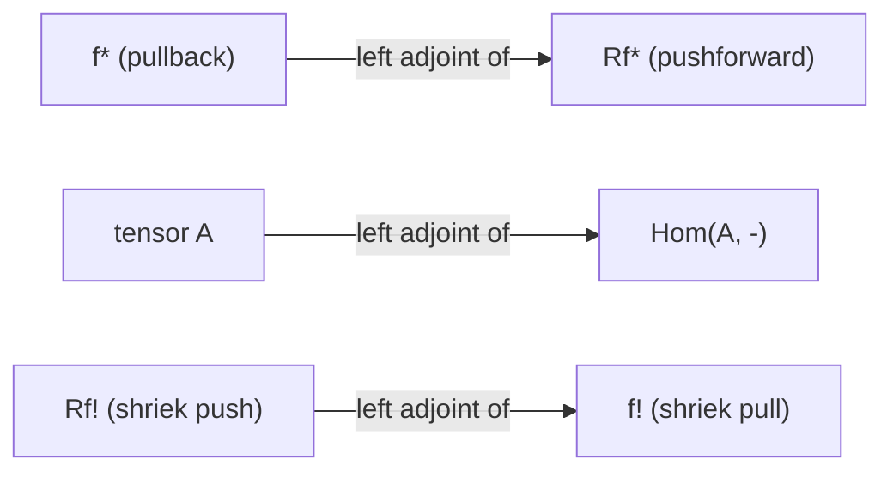

# Six Functor Formalisms

## Table of Contents

- [[#1. Introduction|1. Introduction]]
- [[#2. Setup: Sheaves on Locally Compact Spaces|2. Setup: Sheaves on Locally Compact Spaces]]
  - [[#2.1 The Category of Spaces|2.1 The Category of Spaces]]
  - [[#2.2 Abelian Sheaves|2.2 Abelian Sheaves]]
  - [[#2.3 The Derived Category D(X, Z)|2.3 The Derived Category D(X, Z)]]
- [[#3. The First Two Functors: Pullback and Pushforward|3. The First Two Functors: Pullback and Pushforward]]
  - [[#3.1 Pullback f*|3.1 Pullback f*]]
  - [[#3.2 Pushforward f_*|3.2 Pushforward f_*]]
  - [[#3.3 The Adjunction f* ⊣ f_*|3.3 The Adjunction f* ⊣ f_*]]
  - [[#3.4 Proper Base Change|3.4 Proper Base Change]]
- [[#4. The Tensor Product and Internal Hom|4. The Tensor Product and Internal Hom]]
  - [[#4.1 Symmetric Monoidal Structure on D(X, Z)|4.1 Symmetric Monoidal Structure on D(X, Z)]]
  - [[#4.2 The Kunneth Formula|4.2 The Kunneth Formula]]
  - [[#4.3 The Projection Formula for Proper Maps|4.3 The Projection Formula for Proper Maps]]
- [[#5. The Exceptional Functors: f_! and f^!|5. The Exceptional Functors: f_! and f^!]]
  - [[#5.1 Why f_* Is Not Enough|5.1 Why f_* Is Not Enough]]
  - [[#5.2 Proper Pushforward f_!|5.2 Proper Pushforward f_!]]
  - [[#5.3 Compactly Supported Cohomology and the Open-Closed Triangle|5.3 Compactly Supported Cohomology and the Open-Closed Triangle]]
  - [[#5.4 Exceptional Pullback f^!|5.4 Exceptional Pullback f^!]]
  - [[#5.5 Verdier Duality and the Dualizing Functor|5.5 Verdier Duality and the Dualizing Functor]]
- [[#6. What Is a Six-Functor Formalism|6. What Is a Six-Functor Formalism]]
  - [[#6.1 The Abstract Setup|6.1 The Abstract Setup]]
  - [[#6.2 The Key Compatibilities|6.2 The Key Compatibilities]]
  - [[#6.3 The Problem of Higher Coherences|6.3 The Problem of Higher Coherences]]
- [[#7. The Betti Space Construction|7. The Betti Space Construction]]
- [[#8. References|8. References]]

---

## 1. Introduction

📐 The central question these notes address is deceptively simple: *what is a 6-functor formalism?* For decades, the answer was informal — "you know it when you see it." The first instance appeared in the development of étale cohomology by Grothendieck and his collaborators in the 1960s, and it was quickly recognized that analogous structures existed for sheaves on topological spaces, for D-modules on algebraic varieties in characteristic zero, and in many other geometric settings. Despite the ubiquity of these examples, a precise axiomatization capturing *all* the implicit structure proved elusive for many years.

This note builds up the theory from scratch through the lens of *classical sheaf theory on locally compact Hausdorff spaces*. This is the oldest and most geometrically intuitive setting, and it exhibits all six functors with minimal technical overhead. The goal is to:

1. Introduce each of the six functors in turn, motivating why each one is forced upon us by the geometry.
2. State the key theorems relating them: proper base change, the Künneth formula, the projection formula, and Verdier duality.
3. Arrive at a rough definition of what an abstract 6-functor formalism is, and explain why making this definition precise requires ∞-categorical machinery.

> [!INFO] Historical note
> The six functors in the topological setting were largely worked out by Verdier in the 1960s. For schemes, the construction of $f_!$ and $f^!$ was part of Grothendieck's program completed in SGA 4 and SGA 4½. The first formal axiomatization in the triangulated setting is due to Ayoub [Ayo07], and the modern ∞-categorical definition follows Mann [Man22b] building on Liu–Zheng [LZ12a].

---

## 2. Setup: Sheaves on Locally Compact Spaces

### 2.1 The Category of Spaces

We work with the category $\mathcal{C}$ of *finite-dimensional locally compact Hausdorff spaces*, specifically those that can be realized as locally closed subsets of some $\mathbb{R}^n$. This includes:
- Open and closed subsets of $\mathbb{R}^n$ (e.g., balls, spheres)
- Compact manifolds
- Algebraic varieties over $\mathbb{R}$ or $\mathbb{C}$ (via their underlying topological spaces)
- Totally disconnected spaces like the Cantor set $2^{\mathbb{N}}$

The Hausdorff condition ensures that diagonals $X \hookrightarrow X \times X$ are closed embeddings, and finite-dimensionality is a technical hypothesis for the existence of $f^!$.

> [!WARNING] Why not all topological spaces?
> The theory of six functors breaks down for pathological spaces. The Hausdorff condition is used in showing that $f_!$ commutes with stalks, and finite-dimensionality enters in the construction of $f^!$ via the dualizing complex. There is a more general theory, but let us not worry about it here.

### 2.2 Abelian Sheaves

For $X \in \mathcal{C}$, we write $\mathrm{Ab}(X)$ for the *abelian category of abelian sheaves on $X$*. Recall that a sheaf of abelian groups $\mathcal{F}$ on $X$ assigns an abelian group $\mathcal{F}(U)$ to each open $U \subseteq X$, together with restriction maps, subject to the *sheaf condition*: for any open cover $\{U_i\}$ of $U$,

$$0 \to \mathcal{F}(U) \to \prod_i \mathcal{F}(U_i) \rightrightarrows \prod_{i,j} \mathcal{F}(U_i \cap U_j)$$

is exact. The *stalk* of $\mathcal{F}$ at a point $x \in X$ is $\mathcal{F}_x = \varinjlim_{U \ni x} \mathcal{F}(U)$.

**Example.** The *constant sheaf* $\underline{M}$ associated to an abelian group $M$ assigns locally constant $M$-valued functions to each open $U$.

> [!EXAMPLE] Computing a stalk
> Let $X = \mathbb{R}$ and $\mathcal{F} = \underline{\mathbb{Z}}$ the constant sheaf. The stalk at any $x \in \mathbb{R}$ is $\mathbb{Z}$, since every small enough open neighborhood of $x$ is connected. Now let $Y = \{0,1\} \subset \mathbb{R}$ with the subspace topology (discrete). The stalk of the constant sheaf $\underline{\mathbb{Z}}$ on $Y$ at each point is again $\mathbb{Z}$, but the global sections $\Gamma(Y, \underline{\mathbb{Z}}) = \mathbb{Z} \times \mathbb{Z}$.

### 2.3 The Derived Category D(X, Z)

The *derived category* $D(X, \mathbb{Z}) := D(\mathrm{Ab}(X))$ is the localization of the category of cochain complexes of abelian sheaves at quasi-isomorphisms. Morphisms in $D(X, \mathbb{Z})$ are *roofs* — formal compositions of chain maps with quasi-isomorphisms inverted — so two complexes that are quasi-isomorphic become genuinely isomorphic.

The key additional structure is the *triangulated structure*: for any map $f : A \to B$ in $D(X, \mathbb{Z})$, there is a *distinguished triangle*

$$A \to B \to C \xrightarrow{+1}$$

where $C = \mathrm{Cone}(f)$ is the mapping cone. Distinguished triangles play the role of short exact sequences; they give long exact sequences in cohomology.

As a graded invariant, the cohomology $H^i(X, \mathbb{Z})$ is extracted by applying the *global sections functor*

$$\Gamma(X, -) = H^0(X, -) : \mathrm{Ab}(X) \to \mathrm{Ab},$$

which is *left exact*, and taking its right derived functors $R^i\Gamma(X, -) = H^i(X, -)$. The correct derived version packages this as a single functor

$$R\Gamma(X, -) : D(X, \mathbb{Z}) \to D(\mathbb{Z}).$$

Applied to the constant sheaf $\underline{\mathbb{Z}}$, this recovers the sheaf cohomology groups $H^i(X, \mathbb{Z})$.

> [!NOTE] Why sheaf cohomology and not singular cohomology?
> For nice spaces (CW-complexes), sheaf cohomology and singular cohomology agree. But for pathological spaces like the Cantor set, singular cohomology is not the right invariant — it fails to see the local structure correctly. *Sheaf cohomology* is the correct generalization.

---

## 3. The First Two Functors: Pullback and Pushforward

### 3.1 Pullback f*

For a continuous map $f : X \to Y$, there is an *exact* functor

$$f^* : \mathrm{Ab}(Y) \to \mathrm{Ab}(X)$$

defined by $(f^*\mathcal{F})_x = \mathcal{F}_{f(x)}$ on stalks (or more precisely, by sheafifying the presheaf $U \mapsto \varinjlim_{V \supseteq f(U)} \mathcal{F}(V)$).

Since $f^*$ is exact, it induces a functor at the derived level:

$$f^* : D(Y, \mathbb{Z}) \to D(X, \mathbb{Z}) \qquad \textbf{(Functor 1)}$$

**Example.** If $f : X \to \{*\}$ is the terminal map, then $f^*\mathbb{Z} = \underline{\mathbb{Z}}$ is the constant sheaf on $X$.

**Example.** If $i : Z \hookrightarrow X$ is a closed inclusion, then $i^*\mathcal{F} = \mathcal{F}|_Z$ is just the restriction of $\mathcal{F}$ to $Z$.

> [!EXAMPLE] Exercise 1: Pullback is the stalk functor at a point
> *This establishes how pullback interacts with stalks.*
>
> Let $f : \{x\} \hookrightarrow X$ be the inclusion of a point. Show that for any $\mathcal{F} \in \mathrm{Ab}(X)$, we have $f^*\mathcal{F} = \mathcal{F}_x$ as abelian groups, viewing $\mathrm{Ab}(\{x\}) \cong \mathrm{Ab}$. Conclude that $f^*$ is simply the stalk functor.

### 3.2 Pushforward f_*

The *pushforward* is the right adjoint to pullback. For $f : X \to Y$ and $\mathcal{F} \in \mathrm{Ab}(X)$, define

$$(f_*\mathcal{F})(V) = \mathcal{F}(f^{-1}(V)) \quad \text{for open } V \subseteq Y.$$

This is already a sheaf (no sheafification needed), and the assignment $\mathcal{F} \mapsto f_*\mathcal{F}$ is a *left exact* functor. Its right derived functor is

$$Rf_* : D(X, \mathbb{Z}) \to D(Y, \mathbb{Z}) \qquad \textbf{(Functor 2)}$$

**Example.** If $f : X \to \{*\}$ is the terminal map, then $f_* = R\Gamma(X, -)$ is the global sections functor. The cohomology of $X$ is $H^i(X, \mathbb{Z}) = H^i(Rf_*\underline{\mathbb{Z}})$.

**Example.** For $f : \mathbb{R} \to \{*\}$ and $\mathcal{F} = \underline{\mathbb{Z}}$, we get $Rf_*\underline{\mathbb{Z}} = R\Gamma(\mathbb{R}, \mathbb{Z})$. Since $\mathbb{R}$ is contractible, this is just $\mathbb{Z}$ concentrated in degree 0.

> [!INFO] Relative cohomology
> The pushforward $Rf_*\mathcal{F}$ should be thought of as a *relative* or *fiberwise* version of cohomology. For any $y \in Y$, the stalk $(Rf_*\mathcal{F})_y$ measures the cohomology of the fiber $f^{-1}(y)$ with coefficients in $\mathcal{F}$ — but only for *proper* $f$ (see Proper Base Change below).

### 3.3 The Adjunction f* ⊣ f_*

The fundamental adjunction is

$$\mathrm{Hom}_{D(X)}(f^*A, B) \cong \mathrm{Hom}_{D(Y)}(A, Rf_*B)$$

naturally in $A \in D(Y, \mathbb{Z})$ and $B \in D(X, \mathbb{Z})$.

The *unit* of this adjunction is a natural map $\eta : A \to Rf_*f^*A$, and the *counit* is $\varepsilon : f^*Rf_*B \to B$.

**Key consequence.** Taking $f : X \to \{*\}$ and $A = \mathbb{Z}$, the unit gives a map $\mathbb{Z} \to R\Gamma(X, \underline{\mathbb{Z}})$, which is exactly the augmentation map encoding the cohomology of $X$.

> [!EXAMPLE] Exercise 2: Derived pushforward is compatible with composition
> *This establishes that $R(g \circ f)_* \cong Rg_* \circ Rf_*$ via the adjunction.*
>
> Let $f : X \to Y$ and $g : Y \to Z$ be composable maps. Use the universal property of the adjunction $f^* \dashv Rf_*$ to construct a natural isomorphism $R(g \circ f)_* \cong Rg_* \circ Rf_*$.

> [!EXAMPLE] Exercise 3: The adjunction for an open inclusion
> *This makes the unit and counit concrete, and shows the unit can fail to be an isomorphism.*
>
> Let $j : U \hookrightarrow X$ be an open inclusion. Show that for any $\mathcal{F} \in \mathrm{Ab}(X)$ and $\mathcal{G} \in \mathrm{Ab}(U)$:
> - The counit $j^*j_*\mathcal{G} \to \mathcal{G}$ is an isomorphism (i.e., $j^* \circ j_* = \mathrm{id}$).
> - The unit $\mathcal{F} \to j_*j^*\mathcal{F}$ need not be an isomorphism — describe its failure at points not in $U$.

### 3.4 Proper Base Change

The pushforward $Rf_*$ computes "global cohomology of the fibers" only when $f$ is *proper* — meaning the preimage of any compact set is compact. The precise statement is:

**Theorem 3.1** (Proper Base Change). *Let $f : X \to Y$ be a proper map in $\mathcal{C}$ and let*

```tikz
\usepackage{tikz-cd}
\begin{document}
\begin{tikzcd}
X' \arrow[r, "g'"] \arrow[d, "f'"'] & X \arrow[d, "f"] \\
Y' \arrow[r, "g"'] & Y
\end{tikzcd}
\end{document}
```

*be a Cartesian square (i.e., $X' = X \times_Y Y'$). Then for any $A \in D(X, \mathbb{Z})$, the natural base change map*

$$g^* Rf_* A \xrightarrow{\sim} Rf'_* g'^* A$$

*is an isomorphism.*

> [!NOTE] How to construct the base change map
> The map $g^* Rf_* A \to Rf'_* g'^* A$ is adjoint to the composite
> $$f'^* g^* Rf_* A \xrightarrow{\sim} g'^* f^* Rf_* A \xrightarrow{g'^*\varepsilon} g'^* A,$$
> where the first map uses the canonical isomorphism $f'^* g^* \cong g'^* f^*$ (coming from the Cartesian square), and the second is the counit of $f^* \dashv Rf_*$.

**Stalk form.** For $g : \{y\} \hookrightarrow Y$ the inclusion of a point, proper base change says

$$(Rf_*A)_y \xrightarrow{\sim} R\Gamma(X_y, A|_{X_y})$$

where $X_y = X \times_Y \{y\}$ is the fiber over $y$. So the stalks of $Rf_*A$ are exactly the cohomology of the fibers. This is the reason $f$ must be proper: for non-proper $f$, the stalk $(Rf_*A)_y$ sees contributions from cohomology "at infinity" in the fibers.

> [!EXAMPLE] Exercise 4: Properness is necessary for base change
> *This shows by direct computation that base change fails for a non-proper open inclusion.*
>
> Let $j : (0, 1) \hookrightarrow [0, 1]$ be the open inclusion of the open interval into the closed interval, and let $\mathcal{F} = \underline{\mathbb{Z}}$. Compute $(Rj_*\underline{\mathbb{Z}})_0$ (the stalk at $0 \in [0,1]$) and compare it to $R\Gamma(j^{-1}(0), \underline{\mathbb{Z}})$. Conclude that base change fails for $j$.

> [!TIP]- Solution to Exercise 4
> The stalk $(Rj_*\underline{\mathbb{Z}})_0$ is computed as $\varinjlim_{U \ni 0} R\Gamma(j^{-1}(U), \mathbb{Z})$. For small $U$, $j^{-1}(U) = (0, \epsilon)$ which is contractible, so the stalk is $\mathbb{Z}$. But $j^{-1}(0) = \emptyset$, so $R\Gamma(\emptyset, \mathbb{Z}) = 0$. These disagree, witnessing the failure of base change.

---

## 4. The Tensor Product and Internal Hom

### 4.1 Symmetric Monoidal Structure on D(X, Z)

Beyond just cohomology of individual sheaves, we want to understand how cohomology interacts with *products*. This forces us to equip each $D(X, \mathbb{Z})$ with a tensor product.

The abelian category $\mathrm{Ab}(X)$ has a tensor product: for $\mathcal{F}, \mathcal{G} \in \mathrm{Ab}(X)$, the tensor product $\mathcal{F} \otimes \mathcal{G}$ is the sheafification of the presheaf $U \mapsto \mathcal{F}(U) \otimes_\mathbb{Z} \mathcal{G}(U)$. Since this is right exact but not left exact, we derive it:

$$- \otimes - : D(X, \mathbb{Z}) \times D(X, \mathbb{Z}) \to D(X, \mathbb{Z}) \qquad \textbf{(Functor 3)}$$

This is the *derived tensor product*. The unit object is $\underline{\mathbb{Z}}$ (the constant sheaf). Together with the natural associativity, commutativity, and unit isomorphisms satisfying coherence axioms, this makes $D(X, \mathbb{Z})$ a *symmetric monoidal category*.

The *internal Hom* is characterized by the adjunction

$$\mathrm{Hom}_{D(X)}(A \otimes B, C) \cong \mathrm{Hom}_{D(X)}(A, \mathcal{H}om(B, C))$$

and gives a functor

$$\mathcal{H}om(-, -) : D(X, \mathbb{Z})^{\mathrm{op}} \times D(X, \mathbb{Z}) \to D(X, \mathbb{Z}) \qquad \textbf{(Functor 4)}$$

> [!NOTE] Closed symmetric monoidal categories
> The pair $(\otimes, \mathcal{H}om)$ makes $D(X, \mathbb{Z})$ into a *closed symmetric monoidal category*: "closed" means internal Hom exists, "symmetric monoidal" means the tensor is commutative and associative up to coherent natural isomorphisms. This is the correct categorical framework for duality theory.

**Compatibility with pullback.** The pullback $f^*$ is *symmetric monoidal*: there is a natural isomorphism

$$f^*(A \otimes B) \xrightarrow{\sim} f^*A \otimes f^*B$$

compatible with all the monoidal structure. This is because $f^*$ is exact and commutes with sheafification, so it distributes over the tensor product construction.

> [!EXAMPLE] Exercise 5: The symmetric monoidal constraint forces a map on internal Hom
> *This shows that if $f^*$ is symmetric monoidal, it induces a natural map on $\mathcal{H}om$, which is generally not an isomorphism.*
>
> Suppose $f^*$ is symmetric monoidal. Using the adjunction $- \otimes - \dashv \mathcal{H}om(-,-)$, construct a natural map $f^*\mathcal{H}om(A, B) \to \mathcal{H}om(f^*A, f^*B)$ and explain when it is an isomorphism.

### 4.2 The Kunneth Formula

💡 The first payoff of having the tensor product is the Künneth formula.

**Theorem 4.2** (Künneth Formula). *For proper $X, Y \in \mathcal{C}$ and any $A \in D(X, \mathbb{Z})$, $B \in D(Y, \mathbb{Z})$, there is a natural isomorphism*

$$R\Gamma(X, A) \otimes R\Gamma(Y, B) \xrightarrow{\sim} R\Gamma(X \times Y, A \boxtimes B)$$

*where $A \boxtimes B := p_1^* A \otimes p_2^* B \in D(X \times Y, \mathbb{Z})$ is the external tensor product.*

*In the special case $A = \underline{\mathbb{Z}}$, $B = \underline{\mathbb{Z}}$, this gives $H^*(X, \mathbb{Z}) \otimes H^*(Y, \mathbb{Z}) \cong H^*(X \times Y, \mathbb{Z})$ (as graded groups).*

> [!EXAMPLE]- Proof via the projection formula
> The proof uses the diagram $X \times Y \xrightarrow{p_X} X \xrightarrow{p} \{*\}$ and computes:
> $$R\Gamma(X \times Y, p_1^*A \otimes p_2^*B) = p_*(p_{X*}(p_1^*A \otimes p_2^*B))$$
> $$\cong p_*(A \otimes p_{X*}p_2^*B) \quad \text{(Projection Formula, since } p \text{ proper)}$$
> $$\cong p_*(A \otimes p_X^* q_* B) \quad \text{(Base change along the product square)}$$
> $$\cong p_*A \otimes q_*B = R\Gamma(X, A) \otimes R\Gamma(Y, B).$$
> Each step uses either the projection formula (Theorem 4.3 below) or proper base change, illustrating that these two results are the workhorses of cohomology computations.

### 4.3 The Projection Formula for Proper Maps

The projection formula is a fundamental compatibility between the tensor product and pushforward:

**Theorem 4.3** (Projection Formula). *Let $f : X \to Y$ be proper and let $A \in D(X, \mathbb{Z})$, $B \in D(Y, \mathbb{Z})$. There is a natural isomorphism*

$$Rf_*A \otimes B \xrightarrow{\sim} Rf_*(A \otimes f^*B).$$

> [!NOTE] Constructing the projection formula map
> The map $Rf_*A \otimes B \to Rf_*(A \otimes f^*B)$ is adjoint (under $f^* \dashv Rf_*$) to the composite
> $$f^*(Rf_*A \otimes B) \xrightarrow{\sim} f^*Rf_*A \otimes f^*B \xrightarrow{\varepsilon \otimes \mathrm{id}} A \otimes f^*B,$$
> where the first map uses that $f^*$ is symmetric monoidal, and the second is the counit. This shows the projection formula map is *always* defined — it's an isomorphism only for proper $f$ (or later, for $f_!$ without properness).

> [!EXAMPLE] Exercise 6: Verifying the projection formula via universal coefficients
> *This confirms the projection formula for the constant sheaf by direct computation.*
>
> Let $f : X \to \{*\}$ be proper and let $B \in D(\mathbb{Z})$ (a chain complex of abelian groups). The projection formula asserts $R\Gamma(X, \underline{\mathbb{Z}}) \otimes B \cong R\Gamma(X, f^*B) = R\Gamma(X, \underline{B})$. Verify this directly for $X = S^1$, $B = \mathbb{Z}/2$, using the long exact sequence for $0 \to \mathbb{Z} \xrightarrow{2} \mathbb{Z} \to \mathbb{Z}/2 \to 0$.

> [!TIP]- Solution to Exercise 6
> We have $H^*(S^1, \mathbb{Z}) = \mathbb{Z}$ in degrees $0, 1$ and $0$ elsewhere. The universal coefficient theorem gives $H^n(S^1, \mathbb{Z}/2) = H^n(S^1, \mathbb{Z}) \otimes \mathbb{Z}/2 \oplus \mathrm{Tor}(H^{n+1}(S^1, \mathbb{Z}), \mathbb{Z}/2)$. Since $H^n(S^1, \mathbb{Z})$ is always free, the Tor term vanishes, and we get $H^n(S^1, \mathbb{Z}/2) = \mathbb{Z}/2$ for $n = 0, 1$. This matches $H^*(S^1, \mathbb{Z}) \otimes_\mathbb{Z} \mathbb{Z}/2$, confirming the projection formula.

---

## 5. The Exceptional Functors: f_! and f^!

### 5.1 Why f_* Is Not Enough

🔑 The four functors $f^*, Rf_*, \otimes, \mathcal{H}om$ are already rich enough to define cohomology and prove the Künneth formula. So why do we need two more?

The issue is *duality*. Consider $f : X \to \{*\}$ for a compact oriented $d$-manifold $X$. Poincaré duality says:

$$H^k(X, \mathbb{Z}) \cong H_{d-k}(X, \mathbb{Z}) \cong H^{d-k}(X, \mathbb{Z})^\vee$$

(the last isomorphism after tensoring with $\mathbb{Q}$). In sheaf-theoretic language, there should be a *dualizing sheaf* $\omega_X \in D(X, \mathbb{Z})$ such that $\mathcal{H}om(A, \omega_X)$ is the "Poincaré dual" of $A$.

The problem is that $\omega_X$ is *not* the constant sheaf in general — it detects local orientation. Moreover, to state a *relative* version of duality (for $f : X \to Y$ rather than $f : X \to \{*\}$), one needs a functor $f^!$ that is right adjoint to $f_!$, and neither of these is $Rf_*$ or $f^*$.

A second issue: the base change and projection formula for $Rf_*$ require properness. In many geometric applications, we need these compatibilities for *all* maps, not just proper ones. The functor $f_!$ (defined below) satisfies base change and projection formula for all $f$.

> [!INFO] The case of an open inclusion
> For an open embedding $j : U \hookrightarrow X$, the pushforward $Rj_*$ is the "sheaf of sections that might not vanish at the boundary $\partial U = X \setminus U$." The exceptional pushforward $j_!$ is the "sheaf of sections that *do* vanish at the boundary" — it extends sections by zero. These differ dramatically: $Rj_*\underline{\mathbb{Z}}$ sees cohomology of the closure, while $j_!\underline{\mathbb{Z}}$ sees cohomology with compact support.

### 5.2 Proper Pushforward f_!

For $f : X \to Y$ in $\mathcal{C}$, the *pushforward with proper support* $f_!$ is defined as follows. The *sections with proper support* of a sheaf $\mathcal{F}$ over an open $V \subseteq Y$ are

$$\Gamma_!(V, f, \mathcal{F}) = \{ s \in \Gamma(f^{-1}(V), \mathcal{F}) \mid \mathrm{supp}(s) \to V \text{ is proper}\}.$$

This defines a left exact functor $f_! : \mathrm{Ab}(X) \to \mathrm{Ab}(Y)$, and we set

$$Rf_! : D(X, \mathbb{Z}) \to D(Y, \mathbb{Z}) \qquad \textbf{(Functor 5)}$$

to be its right derived functor.

**Key properties:**
- There is a natural transformation $Rf_! \to Rf_*$, which is an *isomorphism when $f$ is proper*.
- For an open embedding $j : U \hookrightarrow X$, $j_!$ is exact and extends sections by zero: $(j_!\mathcal{F})_x = 0$ for $x \notin U$ and $\mathcal{F}_x$ for $x \in U$.
- For a closed embedding $i : Z \hookrightarrow X$, $i_! = i_*$.

**General base change and projection formula.** Unlike $Rf_*$, the functor $Rf_!$ satisfies base change and projection formula without any properness assumption:

$$g^* Rf_! \xrightarrow{\sim} Rf'_! g'^* \qquad \text{and} \qquad Rf_!A \otimes B \xrightarrow{\sim} Rf_!(A \otimes f^*B)$$

hold for all $f$ (not just proper). **However**, unlike the analogous results for $Rf_*$, these are now *extra data* — not maps derived from adjunctions — and must be specified as part of the structure. This is the heart of the difficulty in formalizing a 6-functor formalism.

> [!EXAMPLE] Exercise 7: Computing f_! for an open inclusion into a compact space
> *This computes $Rj_!$ and $Rj_*$ on the circle and shows they differ, making the compact support distinction concrete.*
>
> Let $j : \mathbb{R} \hookrightarrow S^1 = \mathbb{R} \cup \{\infty\}$ be the open inclusion of the non-compact part of the one-point compactification. Compute $Rj_!\underline{\mathbb{Z}}$ and $Rj_*\underline{\mathbb{Z}}$ on $S^1$, and show they differ. (*Hint:* use the long exact sequence for the open-closed decomposition $\mathbb{R} \sqcup \{\infty\} = S^1$.)

> [!TIP]- Solution to Exercise 7
> The long exact sequence of the pair $(\{\infty\}, S^1)$ gives the triangle $j_!\underline{\mathbb{Z}} \to \underline{\mathbb{Z}}_{S^1} \to i_*\underline{\mathbb{Z}}_{\{\infty\}} \xrightarrow{+1}$. Taking global sections: $H^*(S^1, j_!\underline{\mathbb{Z}}) = H^*_c(\mathbb{R}, \mathbb{Z})$, which is $\mathbb{Z}$ in degree $1$ (see §5.3). By contrast, $Rj_*\underline{\mathbb{Z}}$ gives $H^*(S^1, Rj_*\underline{\mathbb{Z}}) = H^*(\mathbb{R}, \mathbb{Z}) = \mathbb{Z}$ in degree 0.

### 5.3 Compactly Supported Cohomology and the Open-Closed Triangle

🗜️ With $f_!$ in hand, we can define one of the most important geometric invariants.

**Definition.** For $p : X \to \{*\}$ the structure map, the *cohomology with compact support* of $X$ is

$$H^k_c(X, \mathbb{Z}) := H^k(Rp_!\underline{\mathbb{Z}}).$$

For compact $X$, $p_! = p_*$ (since $p$ is proper), so $H^*_c(X) = H^*(X)$. The interesting case is non-compact $X$.

**Key examples:**

$$H^k_c(\mathbb{R}^n, \mathbb{Z}) = \begin{cases} \mathbb{Z} & k = n \\ 0 & k \neq n \end{cases}$$

This is dramatically different from $H^k(\mathbb{R}^n, \mathbb{Z}) = \mathbb{Z}$ concentrated in degree $0$ (since $\mathbb{R}^n$ is contractible). Intuitively, compactly supported cohomology "sees" the $n$-dimensional hole at infinity that ordinary cohomology cannot detect.

> [!NOTE] Computing via one-point compactification
> For locally compact Hausdorff $X$, there is an identification $H^*_c(X, \mathbb{Z}) \cong \widetilde{H}^*(X^+, \mathbb{Z})$ where $X^+ = X \cup \{\infty\}$ is the *one-point compactification* and $\widetilde{H}^*$ is reduced cohomology. For $X = \mathbb{R}^n$, $X^+ = S^n$, so $\widetilde{H}^k(S^n, \mathbb{Z}) = \mathbb{Z}$ for $k = n$, recovering the formula above.

**The open-closed exact triangles.** Given $j : U \hookrightarrow X$ an open embedding and $i : Z = X \setminus U \hookrightarrow X$ the complementary closed embedding, the natural maps give two fundamental exact triangles in $D(X, \mathbb{Z})$: for any $\mathcal{F} \in D(X, \mathbb{Z})$,

$$j_!j^*\mathcal{F} \longrightarrow \mathcal{F} \longrightarrow i_*i^*\mathcal{F} \xrightarrow{+1} \qquad \textbf{(Triangle 1)}$$

$$i_*i^!\mathcal{F} \longrightarrow \mathcal{F} \longrightarrow Rj_*j^*\mathcal{F} \xrightarrow{+1} \qquad \textbf{(Triangle 2)}$$

Both triangles can be verified stalk-by-stalk:

| | $j_!j^*\mathcal{F}_x$ | $\mathcal{F}_x$ | $i_*i^*\mathcal{F}_x$ |
|---|---|---|---|
| $x \in U$ | $\mathcal{F}_x$ | $\mathcal{F}_x$ | $0$ |
| $x \in Z$ | $0$ | $\mathcal{F}_x$ | $\mathcal{F}_x$ |

So Triangle 1 is exact at every stalk: an isomorphism at $U$-points followed by zero, then zero followed by an isomorphism at $Z$-points.

> [!INFO] Recollement
> The two triangles together express the *recollement* structure: $D(X)$ is "glued" from $D(U)$ and $D(Z)$ via the six functors $j_!, j^*, Rj_*, i_*, i^*, i^!$. Applying the Verdier duality functor $\mathbb{D}_X$ (defined in §5.5) to Triangle 1 gives Triangle 2, since $\mathbb{D}_X$ exchanges $j_!$ with $Rj_*$ and $i_*i^*$ with $i_*i^!$.

**Long exact sequence for a pair.** Applying $R\Gamma(X, -)$ to Triangle 1 with $\mathcal{F} = \underline{\mathbb{Z}}_X$ and using that $R\Gamma(X, j_!\underline{\mathbb{Z}}_U) = R\Gamma_c(U, \mathbb{Z})$ (when $X$ is compact) gives the *long exact sequence of the pair $(X, Z)$*:

$$\cdots \to H^k_c(U, \mathbb{Z}) \to H^k(X, \mathbb{Z}) \to H^k(Z, \mathbb{Z}) \to H^{k+1}_c(U, \mathbb{Z}) \to \cdots$$

> [!EXAMPLE] Exercise 8: Computing $H^*_c(\mathbb{R})$ via the open-closed sequence
> *This uses the long exact sequence of an open-closed pair to compute compactly supported cohomology of a non-compact space.*
>
> Let $X = S^1$, $p \in S^1$ a point, $Z = \{p\}$, and $U = S^1 \setminus \{p\} \cong \mathbb{R}$. Using the long exact sequence
> $$\cdots \to H^k_c(\mathbb{R}, \mathbb{Z}) \to H^k(S^1, \mathbb{Z}) \to H^k(\{p\}, \mathbb{Z}) \to H^{k+1}_c(\mathbb{R}, \mathbb{Z}) \to \cdots$$
> together with the known cohomology of $S^1$, compute $H^k_c(\mathbb{R}, \mathbb{Z})$ for all $k$.

> [!TIP]- Solution to Exercise 8
> We have $H^k(S^1, \mathbb{Z}) = \mathbb{Z}$ for $k = 0, 1$ and $0$ otherwise, while $H^k(\{p\}, \mathbb{Z}) = \mathbb{Z}$ for $k = 0$ and $0$ otherwise. The relevant portion of the long exact sequence is:
> $$0 \to H^0_c(\mathbb{R}) \to \mathbb{Z} \xrightarrow{\sim} \mathbb{Z} \to H^1_c(\mathbb{R}) \to \mathbb{Z} \to 0 \to H^2_c(\mathbb{R}) \to 0$$
> The map $H^0(S^1) \to H^0(\{p\})$ is the restriction, an isomorphism. So $H^0_c(\mathbb{R}) = 0$ and exactness at $H^1(S^1)$ gives $H^1_c(\mathbb{R}) \cong \mathbb{Z}$. **Result:** $H^k_c(\mathbb{R}, \mathbb{Z}) = \mathbb{Z}$ for $k = 1$, and $0$ otherwise — confirming the general formula $H^k_c(\mathbb{R}^n) = \mathbb{Z}$ for $k = n$.

### 5.4 Exceptional Pullback f^!

The functor $Rf_!$ has a right adjoint:

$$f^! : D(Y, \mathbb{Z}) \to D(X, \mathbb{Z}) \qquad \textbf{(Functor 6)}$$

called the *exceptional inverse image* or *extraordinary pullback*, characterized by

$$\mathrm{Hom}_{D(Y)}(Rf_!A, B) \cong \mathrm{Hom}_{D(X)}(A, f^!B).$$

> [!WARNING] Existence of f^!
> The existence of $f^!$ requires some work — it is *not* constructed by sheafifying a presheaf. Rather, it follows from adjoint functor theorems applied to the appropriate ∞-categories (or, classically, using injective resolutions and the theory of soft sheaves). The finite-dimensionality hypothesis on $\mathcal{C}$ enters here.

**Key computations:**
- For an open embedding $j : U \hookrightarrow X$: since $j_! \dashv j^*$, we have $j^! = j^*$.
- For a closed embedding $i : Z \hookrightarrow X$: $i^!\mathcal{F}$ computes local sections of $\mathcal{F}$ supported on $Z$ — the *local cohomology* of $\mathcal{F}$ with support in $Z$.
- For a proper map $f$: since $Rf_! \cong Rf_*$, the adjunction $Rf_! \dashv f^!$ gives $f^!$ as a right adjoint of $Rf_*$.

> [!EXAMPLE] Exercise 9: Proper maps give a right adjoint to Rf*
> *This shows that for proper $f$, the adjunction $Rf_! \dashv f^!$ recovers a right adjoint for $Rf_*$, and makes the dualizing complex appear naturally.*
>
> Let $f : X \to Y$ be proper. Using the isomorphism $Rf_! \cong Rf_*$ and the adjunction $Rf_! \dashv f^!$, show that there is a natural isomorphism
> $$\mathrm{Hom}_{D(Y)}(Rf_*A, B) \cong \mathrm{Hom}_{D(X)}(A, f^!B)$$
> for all $A \in D(X, \mathbb{Z})$, $B \in D(Y, \mathbb{Z})$. Then specialize to $f : X \to \{*\}$ proper and $B = \mathbb{Z}$ to obtain the identity
> $$\mathrm{Hom}_{D(\mathbb{Z})}(R\Gamma(X, A), \mathbb{Z}) \cong R\Gamma(X, f^!\mathbb{Z}).$$
> Interpret: the right-hand side is cohomology of $X$ with coefficients in the *dualizing complex* $f^!\mathbb{Z}$.

### 5.5 Verdier Duality and the Dualizing Functor

With all six functors in place, we can state and prove duality.

**Definition.** For a map $f : X \to Y$, the *relative dualizing complex* is $\omega_{X/Y} = f^!\underline{\mathbb{Z}}_Y \in D(X, \mathbb{Z})$. For $p : X \to \{*\}$, write $\omega_X = p^!\mathbb{Z}$ for the *absolute dualizing complex* of $X$.

**Theorem 5.4** (Verdier Duality, Local Form). *Let $f : X \to Y$ be a "manifold bundle" of relative dimension $d$: locally on $X$, the map looks like $Y \times B^d \to Y$ (where $B^d$ is an open $d$-ball). Then $f^! \cong f^*(-) \otimes \omega_{X/Y}$ where $\omega_{X/Y}$ is locally isomorphic to $\underline{\mathbb{Z}}[d]$.*

**Corollary** (Global Poincaré Duality). *If $X$ is a compact oriented $d$-manifold and $f : X \to \{*\}$, then $\omega_X \cong \underline{\mathbb{Z}}[d]$ globally, and for any $A \in D(X, \mathbb{Z})$, $B \in D(\mathbb{Z})$:*

$$R\mathcal{H}om_{D(\mathbb{Z})}(R\Gamma(X, A), B) \cong R\Gamma(X, \mathcal{H}om(A, f^!B)).$$

> [!NOTE] Why the local form is better
> The global form of Verdier duality ("$f$ proper AND manifold bundle") mixes a global and a local condition. The local form separates these: any "manifold bundle" (a local condition) satisfies the local duality, and properness enters separately when you compute global sections. This decoupling is one of the great conceptual payoffs of introducing $f_!$ and $f^!$.

**The Verdier duality functor.** The dualizing complex $\omega_X = p^!\mathbb{Z}$ assembles into a contravariant involution:

**Definition.** The *Verdier duality functor* is

$$\mathbb{D}_X : D(X, \mathbb{Z})^{\mathrm{op}} \to D(X, \mathbb{Z}), \quad \mathbb{D}_X(A) = R\mathcal{H}om(A, \omega_X).$$

For an oriented $d$-manifold, $\omega_X = \underline{\mathbb{Z}}[d]$, so $\mathbb{D}_X(A) = R\mathcal{H}om(A, \underline{\mathbb{Z}})[d]$.

**Theorem** (Biduality). *For any $A$ in the bounded derived category $D^b_c(X, \mathbb{Z})$ of constructible sheaves, the natural evaluation map*

$$A \xrightarrow{\sim} \mathbb{D}_X(\mathbb{D}_X(A))$$

*is an isomorphism. In other words, $\mathbb{D}_X$ is an involution on $D^b_c(X, \mathbb{Z})$.*

**Duality exchanges $f_!$ and $f^!$.** The most important property of $\mathbb{D}$ is that it interchanges the two exceptional functors. For any $f : X \to Y$ in $\mathcal{E}$, there are natural isomorphisms:

$$Rf_* \circ \mathbb{D}_X \cong \mathbb{D}_Y \circ Rf_! \qquad \text{and} \qquad f^! \circ \mathbb{D}_Y \cong \mathbb{D}_X \circ f^*.$$

Informally: computing $Rf_*$ after dualizing on $X$ is the same as first computing $Rf_!$, then dualizing on $Y$. This is the precise sense in which $f_!$ and $f^!$ are "adjoint" not just to each other, but dual to $f^*$ and $Rf_*$ via the dualizing functor.

**Consequence: duality between ordinary and compact cohomology.** Applying $R\Gamma(Y, -)$ and using $\mathbb{D}_Y \circ Rf_! \cong Rf_* \circ \mathbb{D}_X$, one obtains (for $A \in D^b_c(X)$ with free cohomology sheaves):

$$H^k(X, A)^\vee \cong H^{-k}_c(X, \mathbb{D}_X(A)).$$

For a compact oriented $d$-manifold with $A = \underline{\mathbb{Z}}$, $\mathbb{D}_X(\underline{\mathbb{Z}}) = \underline{\mathbb{Z}}[d]$, so this gives $H^k(X, \mathbb{Z})^\vee \cong H^{d-k}(X, \mathbb{Z})$ — classical Poincaré duality.

> [!EXAMPLE] Exercise 10: Poincaré duality on S^1
> *This verifies the duality pairing concretely for the circle.*
>
> Let $X = S^1$ (compact oriented 1-manifold) and $f : S^1 \to \{*\}$. Poincaré duality says $H^k(S^1, \mathbb{Z}) \cong H^{1-k}(S^1, \mathbb{Z})^\vee$. Verify this directly: compute $H^*(S^1, \mathbb{Z})$, identify $H^0$ and $H^1$, and check the duality pairing $H^0 \times H^1 \to \mathbb{Z}$ is perfect.

> [!EXAMPLE] Exercise 11: Computing the Verdier dual of the constant sheaf on S^1
> *This makes the dualizing functor concrete and confirms biduality.*
>
> Let $X = S^1$, so $\omega_{S^1} = \underline{\mathbb{Z}}[1]$. Compute $\mathbb{D}_{S^1}(\underline{\mathbb{Z}})$ using the definition $\mathbb{D}_{S^1}(\underline{\mathbb{Z}}) = R\mathcal{H}om(\underline{\mathbb{Z}}, \omega_{S^1})$. Then verify biduality by computing $\mathbb{D}_{S^1}(\mathbb{D}_{S^1}(\underline{\mathbb{Z}}))$ and checking it recovers $\underline{\mathbb{Z}}$.

> [!TIP]- Solution to Exercise 11
> Since $R\mathcal{H}om(\underline{\mathbb{Z}}, \mathcal{F}) \cong \mathcal{F}$ for any $\mathcal{F}$ (the unit sheaf is the identity for internal Hom), we get $\mathbb{D}_{S^1}(\underline{\mathbb{Z}}) = R\mathcal{H}om(\underline{\mathbb{Z}}, \underline{\mathbb{Z}}[1]) = \underline{\mathbb{Z}}[1]$.
>
> Biduality: $\mathbb{D}_{S^1}(\underline{\mathbb{Z}}[1]) = R\mathcal{H}om(\underline{\mathbb{Z}}[1], \underline{\mathbb{Z}}[1]) = R\mathcal{H}om(\underline{\mathbb{Z}}, \underline{\mathbb{Z}}) = \underline{\mathbb{Z}}$.
>
> So $\mathbb{D}_{S^1}^2(\underline{\mathbb{Z}}) = \underline{\mathbb{Z}}$, confirming biduality. The global consequence: using $H^k(S^1, \mathbb{D}_{S^1}A) \cong H^{1-k}_c(S^1, A)^\vee$ for $A = \underline{\mathbb{Z}}$, we get $H^k(S^1, \mathbb{Z}) \cong H^{1-k}(S^1, \mathbb{Z})^\vee$, which holds since both sides are $\mathbb{Z}$ for $k = 0, 1$ and $0$ otherwise.

---

## 6. What Is a Six-Functor Formalism

### 6.1 The Abstract Setup

We can now give a rough definition of an abstract 6-functor formalism. The data consists of:

- A category $\mathcal{C}$ of "geometric objects" (topological spaces, schemes, analytic spaces, stacks, ...).
- A class $\mathcal{E}$ of "admissible" morphisms in $\mathcal{C}$ (those for which $f_!$ and $f^!$ exist). We require: $\mathcal{E}$ is stable under composition, pullback, and contains all isomorphisms.
- An assignment $X \mapsto D(X)$ from $\mathcal{C}$ to stable $\infty$-categories (or at least triangulated categories).
- Six functors:

| Functor | Direction | Name |
|---------|-----------|------|
| $f^*$ | $D(Y) \to D(X)$ | Pullback |
| $Rf_*$ | $D(X) \to D(Y)$ | Pushforward |
| $- \otimes -$ | $D(X) \times D(X) \to D(X)$ | Tensor product |
| $\mathcal{H}om(-, -)$ | $D(X)^{\mathrm{op}} \times D(X) \to D(X)$ | Internal Hom |
| $Rf_!$ | $D(X) \to D(Y)$, $f \in \mathcal{E}$ | Proper pushforward |
| $f^!$ | $D(Y) \to D(X)$, $f \in \mathcal{E}$ | Exceptional pullback |

The adjunctions are:



### 6.2 The Key Compatibilities

Beyond the adjunctions, the key structural constraints are:

1. **Pullback is symmetric monoidal:** Natural isomorphisms $f^*(A \otimes B) \xrightarrow{\sim} f^*A \otimes f^*B$, compatible with composition and with the symmetric monoidal axioms.

2. **Composition:** For $f : X \to Y$ and $g : Y \to Z$ both in $\mathcal{E}$, natural isomorphisms
$$R(g \circ f)_! \xrightarrow{\sim} Rg_! \circ Rf_!$$
satisfying associativity for triple composites.

3. **Base change:** For any Cartesian square with $f \in \mathcal{E}$:
$$g^* Rf_! \xrightarrow{\sim} Rf'_! g'^*$$

4. **Projection formula:** For $f \in \mathcal{E}$ and any $A \in D(X)$, $B \in D(Y)$:
$$Rf_!A \otimes B \xrightarrow{\sim} Rf_!(A \otimes f^*B)$$

> [!DANGER] These are data, not just conditions
> Items 3 and 4 are *isomorphisms that must be specified as part of the structure*, not conditions that may or may not hold. Moreover, they must satisfy a long list of coherence axioms — compatibilities with composition isomorphisms, with the symmetric monoidal structure of $\otimes$, and with each other. In the triangulated setting, Ayoub [Ayo07] gave the first complete list; it is quite long. In the $\infty$-categorical setting, these coherences are automatically captured (but must still be proved!).

### 6.3 The Problem of Higher Coherences

⚠️ *The real difficulty in axiomatizing a 6-functor formalism is not the list of isomorphisms, but the coherences between them.*

Consider just the composition isomorphism $h_! \cong g_! f_!$ for $h = g \circ f$. For a triple composite $k = h \circ g \circ f$, there are two ways to build the isomorphism $k_! \cong h_! g_! f_!$: either compose the isomorphisms for $(f, g)$ then $(gf, h)$, or for $(g, h)$ then $(f, hg)$. These must agree.

But when $D(X)$ is an $\infty$-category rather than a triangulated category, an isomorphism is not just a morphism — it is a *path* in the space of morphisms. Two paths can be homotopic in many ways, and homotopies between homotopies must also cohere, ad infinitum.

**How this is resolved.** The modern approach (Mann [Man22b], building on Liu–Zheng [LZ12a]) packages *all* these coherences by encoding $f_!$ not as a separate functor but as part of a single functor

$$D : \mathrm{Corr}(\mathcal{C}, \mathcal{E}) \to \mathrm{Cat}_\infty$$

from an $\infty$-category of *correspondences* (or spans) over $\mathcal{C}$, where $f^*$ lives on backward arrows and $f_!$ lives on forward arrows. The coherences of base change are then built into the categorical structure of correspondences automatically.

> [!INFO] What are correspondences?
> A *correspondence* from $X$ to $Y$ is a diagram $X \xleftarrow{a} Z \xrightarrow{b} Y$ where the left leg $a$ is arbitrary and the right leg $b \in \mathcal{E}$. Correspondences compose by fiber product: given $X \leftarrow Z \rightarrow Y$ and $Y \leftarrow W \rightarrow V$, the composite is $X \leftarrow Z \times_Y W \rightarrow V$. A functor out of $\mathrm{Corr}(\mathcal{C}, \mathcal{E})$ assigns $D(X)$ to each object and $f^*(-)$ to left legs, $Rf_!(-)$ to right legs — base change becomes the statement that the two ways to evaluate a correspondence agree.

> [!QUESTION] Open problems
> Is there a simple set of axioms for a 6-functor formalism that does not require $\infty$-categorical language? Ayoub's axioms work at the triangulated level but are incomplete for the purposes of constructing $f^!$ in all generality. The Dauser–Kuijper result [DK25] shows uniqueness (up to higher homotopies) when all morphisms are truncated.

---

## 7. The Betti Space Construction

🌐 We close with a beautiful example showing that the 6-functor formalism for locally compact Hausdorff spaces is secretly of "algebraic" origin.

For $X \in \mathcal{C}$, define the functor

$$X_{\mathrm{Betti}} : \mathrm{Schemes}^{\mathrm{op}} \to \mathrm{Sets}, \quad S \mapsto \{\text{continuous maps } |S| \to X\},$$

where $|S|$ denotes the underlying topological space of the scheme $S$.

**Theorem 7.1** (Scholze). *$X_{\mathrm{Betti}}$ is representable as a pro-étale algebraic space: it admits a pro-étale surjection from a scheme. Moreover, there is a natural equivalence*

$$D(X, \mathbb{Z}) \xrightarrow{\sim} D_{\mathrm{qc}}(X_{\mathrm{Betti}})$$

*where $D_{\mathrm{qc}}$ denotes the derived category of quasi-coherent sheaves.*

> [!NOTE] What this means geometrically
> This says that the 6-functor formalism for topological spaces is "the same" as the 6-functor formalism for quasi-coherent sheaves on a certain pro-étale algebraic space. In particular, all the abstract machinery of algebraic geometry (flat base change, the derived category of quasi-coherent sheaves, etc.) applies to ordinary topological sheaves via this identification.

> [!EXAMPLE] Exercise 12: The Betti space for a discrete set
> *This makes the Betti space construction explicit for the simplest non-trivial example.*
>
> Let $X = \{0, 1\}$ be the two-point discrete space. Describe $X_{\mathrm{Betti}}$ explicitly: what does it assign to $\mathrm{Spec}(k)$ for a field $k$? What about $\mathrm{Spec}(\mathbb{Z})$? Show that $D(X, \mathbb{Z}) \cong D(\mathbb{Z}) \times D(\mathbb{Z})$ directly.

This example hints at a broader phenomenon: in many settings, there is a factorization

$$\mathcal{C} \xrightarrow{F} \{\text{analytic stacks}\} \xrightarrow{D_{\mathrm{qc}}} \mathrm{Cat}_\infty$$

where $F$ takes each geometric object $X$ to some kind of "ring stack" $F(X)$, and the 6-functor formalism is pulled back from the formalism for quasi-coherent sheaves. This perspective, initiated by Drinfeld in the context of prismatic cohomology, provides a unified geometric picture of six-functor formalisms across topology, algebraic geometry, and $p$-adic analysis.

---

## 8. References

| Reference Name | Brief Summary | Link |
|---------------|---------------|------|
| Scholze, "Six-Functor Formalisms" | Primary source: lecture notes from Winter 2022/23, updated 2025. Defines abstract 6-functor formalisms following Mann, develops Poincaré–Verdier duality, and gives many examples. | [arXiv:2510.26269](https://arxiv.org/abs/2510.26269) |
| Mann, "A p-adic 6-functor formalism in rigid analytic geometry" | Defines the Mann–Liu–Zheng notion of 6-functor formalism used throughout Scholze's notes; Appendix A.5 gives the abstract definition. | [arXiv:2206.02022](https://arxiv.org/abs/2206.02022) |
| Ayoub, "Les six opérations de Grothendieck..." | First systematic axiomatization of 6-functor formalisms in the triangulated setting; proves that proper base change follows from the other axioms. | [Société Mathématique de France](http://smf.emath.fr/Publications/Memoires/2007/115-116/) |
| Liu–Zheng, "Gluing restricted nerves of ∞-categories" | Constructs the 6-functor formalism for étale cohomology of schemes in Lurie's ∞-categorical framework. | [arXiv:1211.5294](https://arxiv.org/abs/1211.5294) |
| Cnossen–Lenz–Linskens, "Parametrized stability and the six functors" | Reproves and sharpens Liu–Zheng's construction via (∞, 2)-categories of spans; model-independent proof. | [arXiv:2501.16128](https://arxiv.org/abs/2501.16128) |
| Kashiwara–Schapira, "Sheaves on Manifolds" | Comprehensive classical reference for the derived category of sheaves, $f_!$, $f^!$, and Verdier duality on locally compact spaces. | [Springer, Grundlehren 292](https://link.springer.com/book/10.1007/978-3-662-02661-8) |
| Heyer–Mann, "Introduction to six-functor formalisms" | Develops many of the ideas in Scholze's lectures in greater detail; recommended for a more thorough treatment. | [arXiv:2407.15885](https://arxiv.org/abs/2407.15885) |
