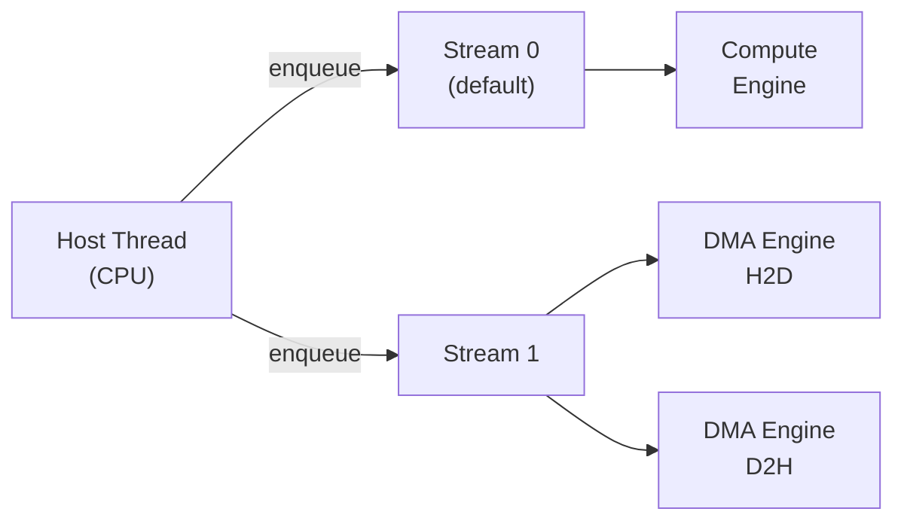
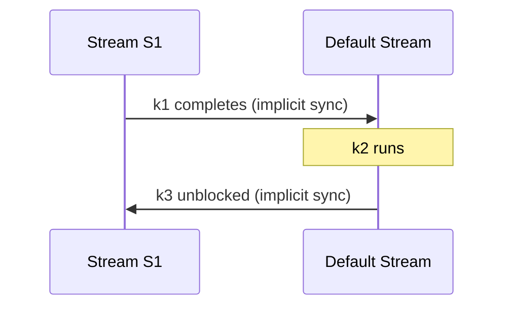
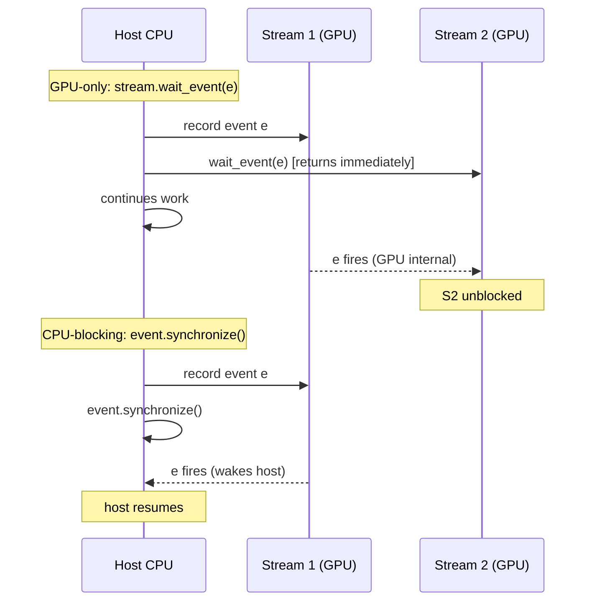

# CUDA Streams and Events

## Table of Contents

- [[#1. The CUDA Execution Model|1. The CUDA Execution Model]]
  - [[#1.1 The Host-Device Command Model|1.1 The Host-Device Command Model]]
  - [[#1.2 GPU Execution Engines|1.2 GPU Execution Engines]]
- [[#2. CUDA Streams|2. CUDA Streams]]
  - [[#2.1 Formal Definition|2.1 Formal Definition]]
  - [[#2.2 The Default Stream and Implicit Synchronization|2.2 The Default Stream and Implicit Synchronization]]
  - [[#2.3 Non-Blocking Streams|2.3 Non-Blocking Streams]]
  - [[#2.4 PyTorch Stream API|2.4 PyTorch Stream API]]
  - [[#2.5 Key Pattern: Overlapping Compute and Data Transfer|2.5 Key Pattern: Overlapping Compute and Data Transfer]]
- [[#3. CUDA Events|3. CUDA Events]]
  - [[#3.1 Formal Definition|3.1 Formal Definition]]
  - [[#3.2 PyTorch Event API|3.2 PyTorch Event API]]
  - [[#3.3 The GPU Timing Trap|3.3 The GPU Timing Trap]]
- [[#4. Synchronization Semantics|4. Synchronization Semantics]]
  - [[#4.1 Taxonomy of Synchronization Primitives|4.1 Taxonomy of Synchronization Primitives]]
  - [[#4.2 CPU-Blocking vs GPU-Only Synchronization|4.2 CPU-Blocking vs GPU-Only Synchronization]]
- [[#5. PyTorch Integration|5. PyTorch Integration]]
  - [[#5.1 Current Stream and Context Manager|5.1 Current Stream and Context Manager]]
  - [[#5.2 record_stream and Memory Safety|5.2 record_stream and Memory Safety]]
  - [[#5.3 The CUDA Caching Allocator and Stream Ordering|5.3 The CUDA Caching Allocator and Stream Ordering]]
  - [[#5.4 Multi-GPU Considerations|5.4 Multi-GPU Considerations]]
  - [[#5.5 Backward Pass Stream Behavior|5.5 Backward Pass Stream Behavior]]
- [[#6. Profiling with CUDA Events and torch.profiler|6. Profiling with CUDA Events and torch.profiler]]
  - [[#6.1 GPU-Accurate Benchmarking with Events|6.1 GPU-Accurate Benchmarking with Events]]
  - [[#6.2 torch.profiler|6.2 torch.profiler]]
  - [[#6.3 Chrome Trace Export and Interpretation|6.3 Chrome Trace Export and Interpretation]]
  - [[#6.4 Nsight Systems for Low-Level Profiling|6.4 Nsight Systems for Low-Level Profiling]]
- [[#7. Common Patterns and Pitfalls|7. Common Patterns and Pitfalls]]
  - [[#7.1 Double-Buffering for Data Loading Overlap|7.1 Double-Buffering for Data Loading Overlap]]
  - [[#7.2 Pitfall Catalog|7.2 Pitfall Catalog]]
- [[#References|References]]

---

## 1. The CUDA Execution Model 🏗️

### 1.1 The Host-Device Command Model

A CUDA program runs on two distinct processors simultaneously: the *host* (CPU) and the *device* (GPU). The host is responsible for submitting work; the device is responsible for executing it. The communication channel between them is an asynchronous *command queue*.

**Definition (CUDA Execution Model).** The host submits GPU operations — *kernels* (computation) and *memory copies* (data movement) — to a queue. The CUDA runtime delivers commands from the queue to the GPU hardware. From the host's perspective, kernel launch is near-instantaneous: the runtime enqueues the command and returns control to the host thread without waiting for the GPU to finish.

This asynchrony is fundamental. A naive timing loop like

```python
import time
t0 = time.perf_counter()
y = torch.matmul(A, B)   # enqueues kernel, returns immediately
t1 = time.perf_counter()
print(t1 - t0)           # measures enqueue time, NOT execution time
```

measures only how long the host takes to *submit* the kernel, not how long the GPU takes to *run* it. This error is addressed precisely in Section 3.3.

### 1.2 GPU Execution Engines ⚙️

Modern NVIDIA GPUs expose multiple independent *execution engines*. The relevant engines for stream-level concurrency are:

| Engine | CUDA name | Handles |
|--------|-----------|---------|
| Compute engine | — | Kernel execution (SM warps) |
| Copy engine H2D | `cudaMemcpyHostToDevice` | Host → Device DMA transfers |
| Copy engine D2H | `cudaMemcpyDeviceToHost` | Device → Host DMA transfers |

Because these engines are physically distinct, a copy to device memory and a compute kernel can run *simultaneously*, provided they reside in different streams. The hardware schedules work from multiple streams concurrently when independent engines are available.



*The host enqueues work into streams; each stream is dispatched to one or more GPU engines. Separate engines can operate concurrently.*

---

## 2. CUDA Streams 🌊

### 2.1 Formal Definition

**Definition (CUDA Stream).** A *CUDA stream* is a total-order sequence of GPU operations — kernels and memory copies — such that operations within a single stream execute in *issue order* relative to each other. Operations belonging to *different* streams have no ordering guarantee and may execute concurrently, subject to hardware resource availability.

More precisely, let $S$ be a stream and let $o_1, o_2 \in S$ be two operations with $o_1$ enqueued before $o_2$. The GPU guarantees $o_1$ completes before $o_2$ begins. For operations $o \in S_1$ and $o' \in S_2$ with $S_1 \neq S_2$, no such guarantee exists unless an explicit synchronization primitive is used (see Section 4).

> [!NOTE] Streams are not OS threads
> A stream is a logical ordering constraint on the GPU command queue. It is *not* a CPU thread and does not impose concurrency at the CPU level. A single host thread can own and submit to arbitrarily many streams.

### 2.2 The Default Stream and Implicit Synchronization ⚠️

Every CUDA context has a *default stream* (also called the *NULL stream* or *stream 0*). In the legacy default stream mode — the default for most CUDA programs — the default stream has a special serialization property:

**Definition (Legacy Default Stream).** The legacy default stream *synchronizes with all other blocking streams* in the same CUDA context. Specifically, when an operation is submitted to the legacy default stream, the runtime inserts an implicit synchronization barrier: all previously enqueued work on blocking streams drains first, then the default-stream operation runs, then blocking streams may resume.

The consequence is global serialization. Suppose you submit kernel $k_1$ to stream $S_1$, then $k_2$ to the default stream, then $k_3$ to $S_1$. Even if $k_1$, $k_2$, $k_3$ are all independent, $k_2$ will wait for $k_1$, and $k_3$ will wait for $k_2$:



*Implicit serialization introduced by a single default-stream operation.*

*This makes the default stream a correctness trap in multi-stream programs.* Any operation routed to stream 0 acts as a global fence.

### 2.3 Non-Blocking Streams

PyTorch non-default streams are created with the `cudaStreamNonBlocking` flag, which exempts them from the legacy default stream synchronization protocol. Such streams interact with the default stream only via *explicit* synchronization (events or `wait_stream`), not implicitly.

> [!WARNING] Per-thread default stream
> CUDA also supports a *per-thread default stream* mode (enabled via the `--default-stream per-thread` compiler flag, or by using `cudaStreamPerThread`). In this mode each host thread has its own independent default stream, and none of them implicitly synchronize with each other. PyTorch does not use per-thread default streams by default; be aware of this when interoperating with raw CUDA C extensions.

### 2.4 PyTorch Stream API 🐍

PyTorch wraps CUDA streams through `torch.cuda.Stream`.

```python
import torch

# Create a non-default stream on the current device
s1 = torch.cuda.Stream()

# Create a stream on a specific device
s2 = torch.cuda.Stream(device="cuda:1")

# Context manager: all PyTorch ops inside the block go to s1
with torch.cuda.stream(s1):
    y = torch.matmul(A, B)   # enqueued on s1

# Explicit: block host until s1 is fully drained
s1.synchronize()

# GPU-side: make s1 wait for s2 (host does NOT block)
s1.wait_stream(s2)

# Check if all work submitted so far to s1 is done
done: bool = s1.query()
```

Key methods on `torch.cuda.Stream`:

| Method | Semantics | Blocks host? |
|--------|-----------|--------------|
| `s.synchronize()` | Wait until all ops in `s` complete | Yes |
| `s.wait_stream(other)` | GPU-side: future ops in `s` wait for `other` | No |
| `s.wait_event(event)` | GPU-side: future ops in `s` wait for `event` | No |
| `s.record_event(event=None)` | Insert event into `s`; returns the event | No |
| `s.query()` | Returns `True` if `s` is idle | No |

### 2.5 Key Pattern: Overlapping Compute and Data Transfer 🔑

**Both the compute engine and the DMA H2D engine can run simultaneously.** This means: while the GPU is running a forward pass on batch $k$ in stream 0, stream 1 can be DMA-ing batch $k+1$ from host to device. The result is that data transfer latency is fully *hidden* behind compute.

Requirements for this overlap:
1. Host memory must be *page-locked* (pinned). The DMA engine can only initiate asynchronous transfers from pinned memory; pageable memory requires an intermediate copy via a staging buffer, which stalls.
2. The transfer and compute must be in *different* streams.

```python
import torch

device = torch.device("cuda:0")

# Allocate pinned host tensors for double-buffering
host_batch = [
    torch.randn(1024, 512, pin_memory=True) for _ in range(2)
]
# Pre-allocate device buffers
dev_batch = [torch.empty(1024, 512, device=device) for _ in range(2)]

compute_stream = torch.cuda.default_stream(device)
transfer_stream = torch.cuda.Stream(device=device)

batches = get_batch_iterator()  # yields CPU tensors

# Seed: prefetch batch 0
with torch.cuda.stream(transfer_stream):
    dev_batch[0].copy_(host_batch[0], non_blocking=True)
transfer_stream.synchronize()

for step, batch_cpu in enumerate(batches):
    buf_idx = step % 2
    next_idx = 1 - buf_idx

    # --- Enqueue prefetch of next batch (runs on transfer_stream) ---
    with torch.cuda.stream(transfer_stream):
        host_batch[next_idx].copy_(batch_cpu, non_blocking=True)
        dev_batch[next_idx].copy_(host_batch[next_idx], non_blocking=True)

    # --- Compute on current batch (runs on compute_stream = default) ---
    # compute_stream must not start until transfer of current buf is done.
    # transfer_stream must have finished loading buf_idx before we use it.
    compute_stream.wait_stream(transfer_stream)
    output = model(dev_batch[buf_idx])
    loss = criterion(output, targets)
    loss.backward()
    optimizer.step()

    # Tell allocator: dev_batch[buf_idx] is live on compute_stream too
    dev_batch[buf_idx].record_stream(compute_stream)
```

> [!NOTE] Why `non_blocking=True` on `.copy_()`?
> `tensor.copy_(src, non_blocking=True)` issues the H2D (or D2H) transfer asynchronously. For a pinned-memory source, the copy is dispatched to the DMA engine and control returns to the host immediately. Without `non_blocking=True`, the host blocks until the copy completes, negating any overlap.

---

> [!QUESTION] Exercise 1: Double-Buffering Correctness
> *This exercise checks whether you have identified all the necessary synchronization points in the double-buffering pattern.*
>
> > **Prerequisites:** [[#2.5 Key Pattern: Overlapping Compute and Data Transfer|2.5 Key Pattern: Overlapping Compute and Data Transfer]]
>
> Consider the following simplified double-buffering loop. Identify every synchronization bug — places where a race condition or use-after-free can occur — and explain precisely which hardware race each one introduces.
>
> ```python
> s_transfer = torch.cuda.Stream()
> dev = [torch.empty(N, device="cuda") for _ in range(2)]
>
> for step, cpu_batch in enumerate(loader):
>     i = step % 2
>     j = 1 - i
>     with torch.cuda.stream(s_transfer):
>         dev[j].copy_(cpu_batch, non_blocking=True)
>     output = model(dev[i])   # runs on default stream
> ```

> [!TIP]- Solution to Exercise 1
> **Key insight:** There are two independent races: one between the transfer stream finishing the *previous* load of `dev[i]` before `model()` reads it, and one between the allocator potentially reusing `dev[i]`'s memory before the compute stream finishes.
>
> **Sketch:**
>
> **Bug 1 — Missing `compute_stream.wait_stream(s_transfer)` before `model(dev[i])`.**
> At step `step=1`, `i=1`. `dev[1]` was loaded in step 0 (on `s_transfer`). Without `wait_stream`, the default stream may begin `model(dev[1])` before `s_transfer` has finished the `copy_` from step 0, since the two streams have no ordering relationship. Fix: `torch.cuda.default_stream().wait_stream(s_transfer)` before `model(dev[i])`.
>
> **Bug 2 — Missing `dev[i].record_stream(compute_stream)`.**
> Without `record_stream`, PyTorch's caching allocator tracks `dev[i]` as allocated on `s_transfer` only. If `dev[i]` goes out of scope (or is reused) before the allocator is notified that `compute_stream` is still touching it, the allocator may hand that memory to a new allocation mid-kernel. Fix: call `dev[i].record_stream(torch.cuda.current_stream())` after the `model()` call so the allocator defers reuse until the compute stream is done.

---

## 3. CUDA Events ⏱️

### 3.1 Formal Definition

**Definition (CUDA Event).** A *CUDA event* is a *synchronization marker* that may be *recorded* into a stream at a specific point in that stream's execution order. An event has two observable states:

- **Not yet recorded**: the GPU pipeline has not yet reached the point where the event was enqueued.
- **Recorded**: the GPU has completed all operations up to and including the event's position in its stream.

Events serve two distinct purposes:
1. **Cross-stream dependency**: stream $S_B$ can be instructed to wait until an event recorded in stream $S_A$ has fired, establishing a happens-before relationship $e_{S_A} \prec \text{ops in } S_B$.
2. **GPU-side elapsed time**: a pair of events $(e_\text{start}, e_\text{end})$ recorded around a sequence of operations yields an elapsed time that reflects actual *GPU execution time*, not CPU scheduling time.

Formally, if event $e$ is recorded at position $p$ in stream $S$, then $e$ is recorded if and only if all operations at positions $\leq p$ in $S$ have completed on the GPU.

### 3.2 PyTorch Event API 🐍

```python
import torch

# Create a timing-capable event (enable_timing=True required for elapsed_time)
start = torch.cuda.Event(enable_timing=True)
end   = torch.cuda.Event(enable_timing=True)

# Record start into the current stream
start.record()

# ... GPU work ...
C = torch.matmul(A, B)

# Record end into the current stream
end.record()

# Block host until end event has been recorded on GPU
end.synchronize()

# Returns elapsed time in milliseconds (float)
ms = start.elapsed_time(end)
print(f"matmul took {ms:.3f} ms")
```

`torch.cuda.Event` constructor parameters:

| Parameter | Type | Default | Meaning |
|-----------|------|---------|---------|
| `enable_timing` | bool | `False` | Must be `True` to use `elapsed_time()` |
| `blocking` | bool | `False` | If `True`, `wait()` blocks the CPU thread |
| `interprocess` | bool | `False` | Enables cross-process sharing via IPC handle |

Key methods:

| Method | Semantics | Blocks host? |
|--------|-----------|--------------|
| `e.record(stream=None)` | Insert marker at current position in `stream` | No |
| `e.wait(stream=None)` | GPU-side: `stream` will not proceed past this until `e` is recorded | No |
| `e.synchronize()` | Block host until `e` has been recorded | Yes |
| `e.elapsed_time(end_event)` | Milliseconds between `self` and `end_event` | Must call `end_event.synchronize()` first |
| `e.query()` | `True` if event has been recorded | No |

> [!WARNING] `elapsed_time` before `synchronize`
> Calling `start.elapsed_time(end)` before `end.synchronize()` will raise a `RuntimeError` or return garbage if the GPU has not yet reached `end`. Always call `end.synchronize()` first.

### 3.3 The GPU Timing Trap ⚠️

This is one of the most common correctness errors in ML performance work.

**The trap.** Kernel launches are asynchronous. When you write:

```python
import time

torch.cuda.synchronize()          # drain queue first for a fair start
t0 = time.perf_counter()
C = torch.matmul(A, B)            # enqueues kernel, returns ~immediately
t1 = time.perf_counter()
print((t1 - t0) * 1e3, "ms")     # WRONG: measures ~microseconds of launch overhead
```

`time.perf_counter()` captures wall-clock time on the CPU. Because `matmul` launches asynchronously, `t1 - t0` is the time to *submit* the kernel to the queue — typically 10–100 µs regardless of the matrix size — not the time to *execute* it (which may be tens of milliseconds for large matrices).

**Variant with `synchronize` but still wrong.** A common (incorrect) fix:

```python
t0 = time.perf_counter()
C = torch.matmul(A, B)
torch.cuda.synchronize()          # correct barrier...
t1 = time.perf_counter()          # ...but t0 was captured before synchronize
```

This measures enqueue time + synchronization time, which includes scheduling jitter and is noisy across runs.

**Correct pattern using events:**

```python
start = torch.cuda.Event(enable_timing=True)
end   = torch.cuda.Event(enable_timing=True)

start.record()
C = torch.matmul(A, B)
end.record()

end.synchronize()                  # block host until GPU reaches end
ms = start.elapsed_time(end)       # pure GPU execution time
print(f"{ms:.3f} ms")
```

The event timer lives entirely on the GPU clock. It is immune to CPU scheduling jitter and does not require any `perf_counter` call.

---

> [!QUESTION] Exercise 2: Theoretical vs. Measured GEMM Time
> *This exercise connects the roofline model to event-based timing, making the boundary between compute-bound and memory-bound concrete.*
>
> > **Prerequisites:** [[#3.3 The GPU Timing Trap|3.3 The GPU Timing Trap]], [[concepts/deep-learning-engineering/nvidia-gpu-hardware#7. The Roofline Model|Roofline Model]], [[concepts/deep-learning-engineering/memory-bound-inference#1.2 Formal Derivation of Arithmetic Intensity for a Linear Layer|Arithmetic Intensity]]
>
> Let $A \in \mathbb{R}^{M \times K}$ and $B \in \mathbb{R}^{K \times N}$ be FP16 matrices. You run a single `torch.matmul(A, B)` on an A100 80 GB SXM (FP16 peak: 312 TFLOPS, HBM bandwidth: 2 TB/s).
>
> (a) Compute the *theoretical minimum runtime* for the GEMM, taking into account both the compute bound ($T_\text{compute}$) and the memory-bandwidth bound ($T_\text{memory}$). State which regime dominates as a function of $M, K, N$.
>
> (b) For $M = K = N = 4096$, compute the predicted runtime and compare it to the event-measured value. Write the complete benchmarking code using `torch.cuda.Event`.
>
> (c) If your measured time is 3× larger than the theoretical minimum, name two plausible hardware or software reasons.

> [!TIP]- Solution to Exercise 2
> **Key insight:** The GEMM is compute-bound when arithmetic intensity $I > I^*$ (the ridge point), and memory-bound otherwise. The ridge point for the A100 is $I^* = 312 \times 10^{12} / (2 \times 10^{12}) = 156$ FLOP/byte.
>
> **Sketch:**
>
> **(a) Theoretical bounds.**
>
> A standard GEMM $C = AB$ requires $F = 2MKN$ FLOPs. In FP16, matrices $A$ (size $MK$), $B$ (size $KN$), and $C$ (size $MN$) each occupy 2 bytes per element. Total bytes transferred: $B = 2(MK + KN + MN)$ bytes.
>
> Arithmetic intensity: $I = F / B = 2MKN / [2(MK + KN + MN)]$.
>
> For large square matrices with $M = K = N = d$: $I \approx d/3$.
>
> - $T_\text{compute} = F / \Pi = 2d^3 / (312 \times 10^{12})$ seconds
> - $T_\text{memory} = B / \beta = 6d^2 \times 2 / (2 \times 10^{12})$ seconds
> - Dominant: whichever is larger. For $d \gg 3I^* = 468$, compute dominates.
>
> **(b) For $d = 4096$:** $F = 2 \times 4096^3 \approx 1.374 \times 10^{11}$ FLOPs, so $T_\text{compute} \approx 0.44$ ms; $B = 6 \times 4096^2 \times 2 \approx 2.01 \times 10^8$ bytes, so $T_\text{memory} \approx 0.10$ ms. The GEMM is compute-bound; predicted time $\approx 0.44$ ms.
>
> ```python
> import torch
>
> M = K = N = 4096
> A = torch.randn(M, K, dtype=torch.float16, device="cuda")
> B = torch.randn(K, N, dtype=torch.float16, device="cuda")
>
> # Warmup
> for _ in range(5):
>     torch.matmul(A, B)
> torch.cuda.synchronize()
>
> start = torch.cuda.Event(enable_timing=True)
> end   = torch.cuda.Event(enable_timing=True)
> start.record()
> C = torch.matmul(A, B)
> end.record()
> end.synchronize()
> print(f"Measured: {start.elapsed_time(end):.3f} ms  |  Predicted: ~0.44 ms")
> ```
>
> **(c) Reasons for 3× gap:**
> 1. **Occupancy limits / register pressure:** if the GEMM kernel cannot fill all SMs to full occupancy, peak TFLOPS is not realized.
> 2. **Memory bank conflicts or non-coalesced access in shared memory tiling:** the cuBLAS kernel may not achieve ideal shared memory throughput on every tile configuration.

---

## 4. Synchronization Semantics 🔒

### 4.1 Taxonomy of Synchronization Primitives

There are four distinct synchronization operations in the PyTorch/CUDA stack. They differ on two axes: *who blocks* (host CPU vs GPU pipeline) and *scope* (all streams vs one stream vs one event).

| Primitive | Who blocks | Scope |
|-----------|-----------|-------|
| `torch.cuda.synchronize()` | Host | All streams, current device |
| `stream.synchronize()` | Host | One stream |
| `event.synchronize()` | Host | One event (i.e., all ops up to `event` in its stream) |
| `stream.wait_event(event)` / `event.wait(stream)` | GPU pipeline only | One event → one stream dependency |
| `stream.wait_stream(other)` | GPU pipeline only | All ops in `other` at call time → `stream` |

**Definition (CPU-blocking synchronization).** A synchronization call is *CPU-blocking* if the host thread is suspended (via an OS wait or spin-loop) until the specified GPU condition is satisfied. During this time, the host cannot issue new work.

**Definition (GPU-only synchronization).** A synchronization call is *GPU-only* if it inserts a dependency barrier into the GPU command queue without suspending the host. The host continues executing immediately; only the GPU pipeline stalls at the barrier point.

### 4.2 CPU-Blocking vs GPU-Only Synchronization



*Top half: GPU-only dependency — host continues immediately. Bottom half: CPU-blocking — host sleeps until the GPU reaches the event.*

💡 Prefer GPU-only synchronization inside training loops. CPU-blocking calls serialize the host against the GPU, introducing idle time on both sides.

> [!DANGER] Over-synchronizing in the training loop
> Inserting `torch.cuda.synchronize()` inside the per-step training loop eliminates all stream-level parallelism. Every call drains the entire GPU pipeline before the host can submit the next batch of work, turning asynchronous pipelining into a strictly sequential execution. Reserve `synchronize()` for debugging and benchmarking.

---

> [!QUESTION] Exercise 3: Synchronization Bug Identification
> *This exercise tests whether you can distinguish CPU-blocking from GPU-only synchronization and identify incorrect timing patterns.*
>
> > **Prerequisites:** [[#4.1 Taxonomy of Synchronization Primitives|4.1 Taxonomy of Synchronization Primitives]], [[#3.3 The GPU Timing Trap|3.3 The GPU Timing Trap]]
>
> For each of the following three code snippets, state: (i) whether the timing result is correct; (ii) what the measured quantity actually is; (iii) how to fix it if it is wrong.
>
> **Snippet A:**
> ```python
> t0 = time.perf_counter()
> out = model(x)
> torch.cuda.synchronize()
> t1 = time.perf_counter()
> ```
>
> **Snippet B:**
> ```python
> start = torch.cuda.Event(enable_timing=True)
> end   = torch.cuda.Event(enable_timing=True)
> start.record()
> out = model(x)
> end.record()
> ms = start.elapsed_time(end)  # called immediately
> ```
>
> **Snippet C:**
> ```python
> s = torch.cuda.Stream()
> start = torch.cuda.Event(enable_timing=True)
> end   = torch.cuda.Event(enable_timing=True)
> with torch.cuda.stream(s):
>     start.record()
>     out = model(x)
>     end.record()
> end.synchronize()
> ms = start.elapsed_time(end)
> ```

> [!TIP]- Solution to Exercise 3
> **Key insight:** `elapsed_time` without `synchronize` reads an unrecorded event; `perf_counter` with `synchronize` is correct but noisier than events; events in a dedicated stream are the cleanest approach.
>
> **Sketch:**
>
> **Snippet A — Conditionally correct.** The `synchronize()` is placed *after* `model(x)` and *before* `t1`, so `t1 - t0` measures: (enqueue time for all ops in `model`) + (time for GPU to drain up to `synchronize`). This captures true GPU execution time but includes CPU-side kernel launch overhead in `t0`. For large models the launch overhead is negligible compared to execution time, so this is acceptable for rough measurements. For tight kernels (< 1 ms), use events. No fix required for correctness, but events are preferred for precision.
>
> **Snippet B — Incorrect.** `start.elapsed_time(end)` is called immediately after `end.record()` without `end.synchronize()`. At this point the GPU has not necessarily reached `end` in the queue. The call either raises a `RuntimeError` or returns an invalid time. Fix: insert `end.synchronize()` before `start.elapsed_time(end)`.
>
> **Snippet C — Correct.** All ops are enqueued on stream `s`, events bracket them in the same stream, and `end.synchronize()` blocks until the GPU reaches `end`. `elapsed_time` then returns accurate GPU execution time.

---

## 5. PyTorch Integration 🔧

### 5.1 Current Stream and Context Manager

PyTorch maintains a *per-device current stream*. Every PyTorch CUDA operation — `torch.matmul`, `F.layer_norm`, optimizer steps, etc. — is enqueued onto the current stream of its device.

```python
import torch

# Query the current stream for device 0
s = torch.cuda.current_stream(device="cuda:0")

# Explicitly set the current stream (persistent, not a context manager)
torch.cuda.set_stream(s1)

# Context manager: temporarily override the current stream
with torch.cuda.stream(s1):
    y = model(x)   # goes to s1
# After the block, current stream reverts to what it was before
```

`torch.cuda.stream(s)` is the preferred idiom for multi-stream code because it restores the previous stream on exit, making it composable.

### 5.2 record_stream and Memory Safety 🔑

**The problem.** PyTorch's caching allocator tracks each tensor's *home stream* — the stream on which it was allocated. When the tensor's reference count drops to zero, the allocator marks the memory as free for reuse *on the home stream*. If another stream is still using that memory (because you passed a tensor across streams without telling the allocator), the allocator may hand the same bytes to a new allocation while the old kernel is still reading or writing them — a silent memory corruption.

**Definition (record_stream).** `tensor.record_stream(stream)` registers `stream` as an additional user of `tensor`'s underlying storage. The caching allocator will not reuse the storage until both the home stream and all registered streams have advanced past the point where the tensor was last used.

```python
s_transfer = torch.cuda.Stream()
s_compute  = torch.cuda.current_stream()

# Tensor allocated and filled on s_transfer
with torch.cuda.stream(s_transfer):
    buf = torch.empty(1024, device="cuda")
    buf.copy_(cpu_data, non_blocking=True)

# buf is passed to s_compute for kernel use
s_compute.wait_stream(s_transfer)
output = model(buf)

# CRITICAL: tell allocator that buf is in use on s_compute
buf.record_stream(s_compute)
# Now buf can safely go out of scope — the allocator will not
# reuse its memory until s_compute has finished with it.
```

*Without `record_stream`, dropping `buf` while `s_compute` is still running the kernel is a use-after-free.*

### 5.3 The CUDA Caching Allocator and Stream Ordering

PyTorch's CUDA caching allocator is *stream-ordered*: allocations are associated with the stream that requested them, and the allocator exploits stream ordering to aggressively reuse memory within a stream without GPU-side synchronization.

Concretely, if tensors $T_1$ and $T_2$ are both allocated on stream $S$, and $T_1$ is freed before $T_2$ is allocated (in stream order), the allocator can safely give $T_2$ $T_1$'s memory block, because the GPU will process the free and the allocate in the same order.

**When free happens from the wrong stream.** If $T_1$ was allocated on $S_1$ but freed on $S_2$ (i.e., the last reference on $S_2$ drops), the allocator cannot guarantee that $S_1$ is done with the memory. It therefore:
1. Records a CUDA event on $S_2$ at the point of free.
2. Defers returning $T_1$'s block to the pool until that event fires.
3. Even then, the block is returned to $S_1$'s pool, not $S_2$'s.

*This delayed-free path adds latency and increases pool fragmentation.* Allocating and freeing on the same stream is always preferable.

### 5.4 Multi-GPU Considerations

Each device has its own set of streams and its own default stream. Streams on one device cannot synchronize directly with streams on another device; you must use inter-device events.

```python
with torch.cuda.device(0):
    s0 = torch.cuda.Stream()
    e  = torch.cuda.Event()

with torch.cuda.device(1):
    s1 = torch.cuda.Stream()

# On device 0: do work, record event
with torch.cuda.stream(s0):
    out = layer0(x)
    e.record(s0)         # event recorded on device 0's stream

# On device 1: wait for device 0's event before proceeding
with torch.cuda.stream(s1):
    s1.wait_event(e)     # s1 will not proceed until e fires
    out2 = layer1(out.to("cuda:1"))
```

> [!INFO] torch.cuda.device context
> `torch.cuda.device(i)` sets the *current device* for the duration of the block. New streams created inside the block belong to device `i`. This is distinct from stream context managers — device context and stream context are orthogonal.

### 5.5 Backward Pass Stream Behavior 🔑

Each backward CUDA operation executes on the **same stream as its corresponding forward operation**. This is not incidental — it means that if you ran independent forward passes on separate streams, their backward passes will also run on those streams concurrently, giving you parallel backward computation for free.

```python
s1 = torch.cuda.Stream()
s2 = torch.cuda.Stream()

with torch.cuda.stream(s1):
    loss1 = model_branch1(x1).sum()

with torch.cuda.stream(s2):
    loss2 = model_branch2(x2).sum()

# backward on s1 and backward on s2 may run concurrently
with torch.cuda.stream(s1):
    loss1.backward()

with torch.cuda.stream(s2):
    loss2.backward()
```

> [!DANGER] PyTorch 1.9 breaking change: backward no longer auto-syncs default stream
> Prior to PyTorch 1.9, calling `loss.backward()` on a non-default stream would automatically synchronize with the default stream, so gradient tensors were safe to use on the default stream immediately after. **This implicit sync was removed in 1.9.** If you call `loss.backward()` inside a `torch.cuda.stream(s)` block, you must explicitly wait for that stream before using the gradients:
>
> ```python
> with torch.cuda.stream(s):
>     loss.backward()
>
> # Required since PyTorch 1.9 — without this, accessing .grad on the
> # default stream races with the backward kernel still running on s
> torch.cuda.current_stream().wait_stream(s)
>
> optimizer.step()   # now safe: gradients are fully computed
> ```
>
> Omitting `wait_stream` produces a silent race condition — no error is raised, but optimizer steps may read partially-written gradient tensors.

---

## 6. Profiling with CUDA Events and torch.profiler 📊

### 6.1 GPU-Accurate Benchmarking with Events 🔑

**Canonical benchmark function.** The following pattern correctly measures GPU time while accounting for:
- *Warmup* to fill CUDA JIT caches and page-in GPU memory
- *Statistical aggregation* (mean ± std over multiple iterations)
- *Pure GPU timing* via events (no CPU jitter)

```python
import torch
import statistics

def benchmark(
    fn,
    n_warmup: int = 5,
    n_iters: int = 50,
    device: str = "cuda",
) -> tuple[float, float]:
    """
    Benchmark a GPU function using CUDA events.

    Returns:
        (mean_ms, std_ms): mean and standard deviation of GPU execution
        time in milliseconds over n_iters iterations.
    """
    # 1. Warmup: populate CUDA JIT cache, warm up GPU clocks
    for _ in range(n_warmup):
        fn()
    torch.cuda.synchronize()

    # 2. Create timing events
    timings: list[float] = []
    start = torch.cuda.Event(enable_timing=True)
    end   = torch.cuda.Event(enable_timing=True)

    for _ in range(n_iters):
        start.record()
        fn()
        end.record()
        # Block until this iteration's end event fires
        end.synchronize()
        timings.append(start.elapsed_time(end))

    mean_ms = statistics.mean(timings)
    std_ms  = statistics.stdev(timings) if len(timings) > 1 else 0.0
    return mean_ms, std_ms


# Example usage
A = torch.randn(4096, 4096, dtype=torch.float16, device="cuda")
B = torch.randn(4096, 4096, dtype=torch.float16, device="cuda")
mean, std = benchmark(lambda: torch.matmul(A, B))
print(f"matmul: {mean:.3f} ± {std:.3f} ms")
```

> [!NOTE] Why synchronize per iteration?
> Calling `end.synchronize()` inside the loop ensures each timing measurement is for exactly one iteration, not an accumulated batch. Without it, the event queue grows and you get a single elapsed time that covers all iterations bundled together, making per-iteration variance invisible.

### 6.2 torch.profiler 🔍

`torch.profiler.profile` is a context manager that collects detailed execution traces, attributing CPU time and GPU kernel time to named PyTorch operations.

```python
import torch
from torch.profiler import profile, ProfilerActivity, record_function

model = MyModel().cuda()
x     = torch.randn(32, 512, device="cuda")

with profile(
    activities=[ProfilerActivity.CPU, ProfilerActivity.CUDA],
    record_shapes=True,
    profile_memory=True,
    with_stack=False,
) as prof:
    with record_function("forward_pass"):
        out = model(x)
    with record_function("backward_pass"):
        out.sum().backward()

# Print top operators by total CUDA time
print(
    prof.key_averages().table(
        sort_by="cuda_time_total",
        row_limit=15,
    )
)
```

The `record_function` context manager annotates a code region with a user-defined name. That name then appears as a named span in the trace output, making it straightforward to attribute GPU time to logical operations (e.g., `"attention_forward"`, `"mlp_backward"`).

`key_averages()` columns of interest:

| Column | Meaning |
|--------|---------|
| `Self CPU time` | Time in this operator, excluding children |
| `CPU total` | Cumulative CPU time including all nested ops |
| `Self CUDA time` | GPU kernel time attributed to this operator alone |
| `CUDA total` | Cumulative GPU time including children |
| `# Calls` | Number of invocations |
| `Input shapes` | Shapes of input tensors (if `record_shapes=True`) |

> [!TIP] Sorting by CUDA time
> Always sort by `cuda_time_total` or `self_cuda_time_total` when diagnosing GPU-bound bottlenecks. CPU time is often dominated by Python overhead and launch latency, which can be misleading.

### 6.3 Chrome Trace Export and Interpretation

```python
prof.export_chrome_trace("trace.json")
```

Open `trace.json` in `chrome://tracing` (or [ui.perfetto.dev](https://ui.perfetto.dev)) to see a timeline view.

The trace is structured as a 2D timeline:
- **Horizontal axis**: real wall-clock time.
- **Vertical lanes (rows)**: one lane per CPU thread, plus one lane per CUDA stream per device.

What to look for:
- **GPU kernel bars** appear in the CUDA stream lanes. Their width shows actual GPU execution duration.
- **Gaps between kernel bars** in a stream lane indicate idle GPU time — potential overlap opportunity.
- **Parallel bars** across two stream lanes indicate genuine concurrent execution.
- **CPU operator spans** (top lanes) should align left-to-right with the corresponding GPU kernel bars below. If a CPU span is much wider than its kernel bar, launch overhead or Python overhead dominates.

The relationship between streams and trace lanes: **each stream is a separate lane**. If you have a compute stream and a transfer stream both active, they appear as two parallel rows in the GPU section, and overlapping bars confirm that hardware overlap is actually occurring (not just hoped for).

### 6.4 Nsight Systems for Low-Level Profiling

For cases where `torch.profiler` is insufficient — e.g., you need to inspect individual CUDA kernel configurations, warp occupancy, or memory access patterns — use NVIDIA Nsight Systems:

```bash
nsys profile \
    --trace=cuda,nvtx,osrt \
    --output=my_trace \
    python train.py
```

Open the resulting `.nsys-rep` file in the Nsight Systems GUI. It provides the same stream-level timeline as Chrome trace but with higher fidelity: exact kernel names (e.g., `volta_h884gemm_...`), launch parameters (grid/block dimensions), and memory transfer events on the DMA engine lanes.

*Use `nsys` when `torch.profiler` shows a bottleneck but the kernel-level detail is needed to understand why.*

---

> [!QUESTION] Exercise 4: Profiler-Driven Overlap Diagnosis
> *This exercise develops the skill of reading a Chrome trace to determine whether stream overlap is actually occurring.*
>
> > **Prerequisites:** [[#6.3 Chrome Trace Export and Interpretation|6.3 Chrome Trace Export and Interpretation]], [[#2.5 Key Pattern: Overlapping Compute and Data Transfer|2.5 Key Pattern: Overlapping Compute and Data Transfer]]
>
> You profile a training loop that uses a compute stream and a prefetch stream. The exported Chrome trace shows: the compute stream lane has kernel bars with no gaps, and the prefetch stream lane also has bars — but the prefetch bars are *sequential* with the compute bars (they start only after the compute bar ends each step), never overlapping.
>
> (a) Name two code-level reasons this could happen despite the code appearing to use two streams.
>
> (b) How would the trace look differently if `non_blocking=True` were omitted from the `copy_` calls?
>
> (c) What single line of Python would you add (or remove) to diagnose whether the default stream is causing serialization?

> [!TIP]- Solution to Exercise 4
> **Key insight:** Sequential bars despite two streams almost always means either (1) an accidental default-stream operation between them, or (2) the pageable-memory staging-copy blocking the host before the async copy can even begin.
>
> **Sketch:**
>
> **(a) Two causes of unintended serialization:**
> 1. **A PyTorch operation in the loop body runs on the default stream.** If any op — a loss computation, a `.item()` call, a tensor print — touches the legacy default stream, that stream acts as a global fence, forcing the prefetch stream to wait. Check: wrap every op in `torch.cuda.stream(...)` and avoid bare ops outside stream contexts.
> 2. **The source tensor is not pinned.** Unpinned host memory cannot be transferred by the DMA engine asynchronously. The CUDA runtime silently falls back to a synchronous copy through a pinned staging buffer, blocking until it completes. This makes the "async" copy synchronous from the GPU's perspective. Check: `assert cpu_tensor.is_pinned()`.
>
> **(b) Without `non_blocking=True`:** the `copy_` call on the prefetch stream would block the *host thread* until the H2D copy completes. The host therefore cannot proceed to enqueue the compute-stream kernel until the copy finishes. The trace would show: prefetch copy runs, then compute kernel runs, strictly sequential — identical appearance to the bug above, but for a different reason.
>
> **(c) Diagnosis line:** temporarily replace `torch.cuda.Stream()` with the legacy default stream:
> ```python
> s_transfer = torch.cuda.default_stream()  # force all ops onto default stream
> ```
> If the behavior does not change (still sequential), the issue is not stream assignment — it is the non-pinned memory or a blocking copy. If the behavior *does* change (now everything is obviously sequential because it's all on one stream), you have confirmed the issue is a stray default-stream op.

---

## 7. Common Patterns and Pitfalls 🗺️

### 7.1 Double-Buffering for Data Loading Overlap

The canonical pattern for hiding data-loading latency in a training loop:

```python
import torch
from torch.utils.data import DataLoader

def train_with_double_buffer(
    model: torch.nn.Module,
    loader: DataLoader,
    optimizer: torch.optim.Optimizer,
) -> None:
    device = torch.device("cuda:0")
    compute_stream  = torch.cuda.default_stream(device)
    transfer_stream = torch.cuda.Stream(device=device)

    # Pre-allocate two pinned-memory staging buffers
    # (In practice, use pin_memory=True in DataLoader)

    prefetched: torch.Tensor | None = None

    def prefetch(batch_cpu: torch.Tensor) -> None:
        nonlocal prefetched
        with torch.cuda.stream(transfer_stream):
            prefetched = batch_cpu.to(device, non_blocking=True)

    loader_iter = iter(loader)

    # Prime the pump: prefetch first batch
    first_batch = next(loader_iter)
    prefetch(first_batch)

    for batch_cpu in loader_iter:
        # Wait for the previously prefetched batch to arrive
        compute_stream.wait_stream(transfer_stream)
        batch_gpu = prefetched

        # Mark tensor as used on compute stream so allocator is safe
        assert batch_gpu is not None
        batch_gpu.record_stream(compute_stream)

        # Concurrently prefetch the next batch
        prefetch(batch_cpu)

        # --- Forward / backward / optimizer step ---
        logits = model(batch_gpu)
        loss   = criterion(logits, labels_gpu)
        optimizer.zero_grad()
        loss.backward()
        optimizer.step()

    # Drain the last prefetched batch
    compute_stream.wait_stream(transfer_stream)
    if prefetched is not None:
        # process last batch
        pass
```

> [!NOTE] DataLoader pin_memory
> Using `DataLoader(..., pin_memory=True)` causes the DataLoader worker processes to allocate output tensors in page-locked memory automatically. This is the preferred way to ensure all batches are pinned without manual buffer management.

### 7.2 Pitfall Catalog ⚠️

| Pitfall | Symptom | Fix |
|---------|---------|-----|
| **Missing `record_stream`** when sharing tensors across streams | Silent memory corruption; occasionally `RuntimeError` in allocator | Call `tensor.record_stream(stream)` on every stream that will use the tensor after the home stream |
| **Timing with `perf_counter` without `synchronize`** | Reported time is 10–100× smaller than true execution time | Use `torch.cuda.Event` pair with `end.synchronize()` |
| **`synchronize()` inside training loop** | Throughput collapses to sequential execution; GPU and CPU idle each other | Move `synchronize()` outside the loop; use event-based barriers for correctness |
| **Default stream operation in multi-stream code** | All streams serialize at that operation; no overlap in profiler | Wrap every op in `torch.cuda.stream(s)` context; audit for bare calls |
| **Unpinned host memory with `non_blocking=True`** | Copy is silently synchronous; no overlap despite correct stream setup | Ensure all host tensors are pinned (`pin_memory=True` or `torch.pin_memory()`) |
| **`elapsed_time` before `end.synchronize()`** | `RuntimeError` or nonsense result | Always call `end.synchronize()` before `start.elapsed_time(end)` |
| **Allocating and freeing on different streams** | Pool fragmentation, delayed-free latency, reduced allocator efficiency | Keep tensor lifetime within its home stream where possible |
| **Deferred CUDA error reporting** | A kernel error appears on a *later* unrelated CUDA call, making the true source hard to find | Set `CUDA_LAUNCH_BLOCKING=1` to force synchronous execution; errors surface immediately at the offending call. Never leave enabled in production — it eliminates all stream parallelism |

---

## References

| Reference Name | Brief Summary | Link to Reference |
|----------------|--------------|-------------------|
| [CUDA Programming Guide — Asynchronous Execution](https://docs.nvidia.com/cuda/cuda-programming-guide/02-basics/asynchronous-execution.html) | Official NVIDIA docs on streams, events, and concurrency primitives | https://docs.nvidia.com/cuda/cuda-programming-guide/02-basics/asynchronous-execution.html |
| [CUDA Runtime API — Stream Sync Behavior](https://docs.nvidia.com/cuda/cuda-runtime-api/stream-sync-behavior.html) | Formal semantics of legacy default stream, per-thread default stream, and non-blocking streams | https://docs.nvidia.com/cuda/cuda-runtime-api/stream-sync-behavior.html |
| [NVIDIA — Streams and Concurrency Webinar (Rennich)](https://developer.download.nvidia.com/CUDA/training/StreamsAndConcurrencyWebinar.pdf) | Classic NVIDIA webinar: copy engines, double buffering, timing with events | https://developer.download.nvidia.com/CUDA/training/StreamsAndConcurrencyWebinar.pdf |
| [GPU Pro Tip: CUDA 7 Streams Simplify Concurrency](https://developer.nvidia.com/blog/gpu-pro-tip-cuda-7-streams-simplify-concurrency/) | Practical guide to per-thread default streams and stream creation flags | https://developer.nvidia.com/blog/gpu-pro-tip-cuda-7-streams-simplify-concurrency/ |
| [PyTorch — torch.cuda.Stream API](https://docs.pytorch.org/docs/2.12/generated/torch.cuda.Stream_class.html) | Official PyTorch API reference for Stream | https://docs.pytorch.org/docs/2.12/generated/torch.cuda.Stream_class.html |
| [PyTorch — torch.cuda.Event API](https://docs.pytorch.org/docs/2.12/generated/torch.cuda.Event.html) | Official PyTorch API reference for Event | https://docs.pytorch.org/docs/2.12/generated/torch.cuda.Event.html |
| [PyTorch — Tensor.record_stream](https://docs.pytorch.org/docs/stable/generated/torch.Tensor.record_stream.html) | API docs and semantics for `record_stream` | https://docs.pytorch.org/docs/stable/generated/torch.Tensor.record_stream.html |
| [A Guide to PyTorch's CUDA Caching Allocator (deVito)](https://zdevito.github.io/2022/08/04/cuda-caching-allocator.html) | Deep-dive into stream-ordered allocation, delayed-free, and the `record_stream` mechanism | https://zdevito.github.io/2022/08/04/cuda-caching-allocator.html |
| [PyTorch Profiler Tutorial](https://docs.pytorch.org/tutorials/recipes/recipes/profiler_recipe.html) | Official PyTorch tutorial on `torch.profiler`, `record_function`, Chrome trace export | https://docs.pytorch.org/tutorials/recipes/recipes/profiler_recipe.html |
| [Roofline Model — GPU Glossary (Modal)](https://modal.com/gpu-glossary/perf/roofline-model) | Concise explanation of compute-bound vs memory-bound regimes and ridge point | https://modal.com/gpu-glossary/perf/roofline-model |
| [CUDA Default Stream (Lei Mao's Log Book)](https://leimao.github.io/blog/CUDA-Default-Stream/) | Worked examples of default stream serialization and non-blocking stream semantics | https://leimao.github.io/blog/CUDA-Default-Stream/ |
| [PyTorch CUDA Semantics (official notes, 2.12)](https://docs.pytorch.org/docs/2.12/notes/cuda.html) | Authoritative PyTorch notes on stream semantics, `record_stream`, backward stream behavior, and the 1.9 sync change | https://docs.pytorch.org/docs/2.12/notes/cuda.html |
| [CUDA Streams — Wentao (wentao.site)](https://wentao.site/cuda_streams/) | Practical guide to multi-stream patterns, P2P/NVLink multi-GPU, and overlap strategies | https://wentao.site/cuda_streams/ |
