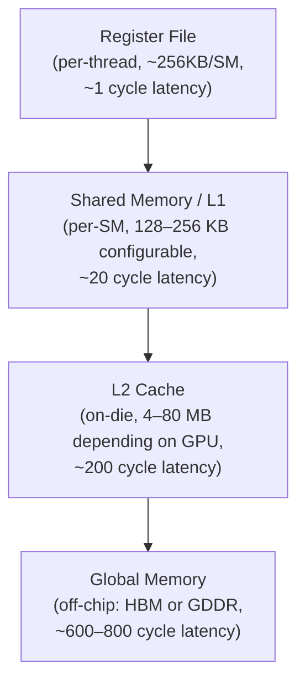
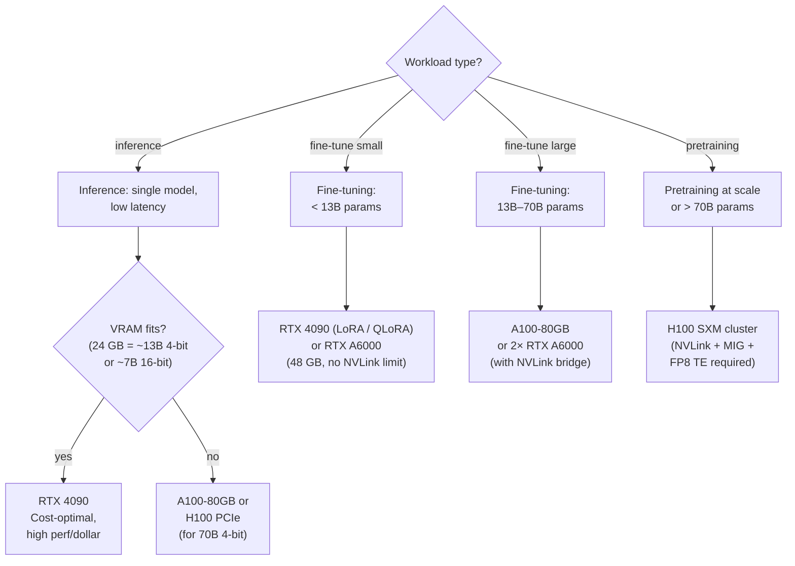

# NVIDIA GPU Hardware for Deep Learning

## Table of Contents

- [[#0. GPU Quick Reference|0. GPU Quick Reference]]
- [[#1. GPU Architecture Overview|1. GPU Architecture Overview]]
  - [[#1.1 The Streaming Multiprocessor|1.1 The Streaming Multiprocessor]]
  - [[#1.2 Warps and SIMT Execution|1.2 Warps and SIMT Execution]]
  - [[#1.3 Memory Hierarchy|1.3 Memory Hierarchy]]
- [[#2. Memory Types: GDDR6X vs HBM|2. Memory Types: GDDR6X vs HBM]]
  - [[#2.1 GDDR6X|2.1 GDDR6X]]
  - [[#2.2 HBM2e and HBM3|2.2 HBM2e and HBM3]]
  - [[#2.3 Why Memory Bandwidth Matters|2.3 Why Memory Bandwidth Matters]]
- [[#3. Tensor Cores|3. Tensor Cores]]
  - [[#3.1 Matrix Multiply-Accumulate|3.1 Matrix Multiply-Accumulate]]
  - [[#3.2 Supported Precision Modes|3.2 Supported Precision Modes]]
  - [[#3.3 Evolution Across Generations|3.3 Evolution Across Generations]]
- [[#4. GPU Generations|4. GPU Generations]]
  - [[#4.1 Turing (2018): RTX 20xx|4.1 Turing (2018): RTX 20xx]]
  - [[#4.2 Ampere (2020): RTX 30xx / A100|4.2 Ampere (2020): RTX 30xx / A100]]
  - [[#4.3 Ada Lovelace (2022): RTX 40xx / L40S|4.3 Ada Lovelace (2022): RTX 40xx / L40S]]
  - [[#4.4 Hopper (2022): H100|4.4 Hopper (2022): H100]]
  - [[#4.5 Blackwell (2024): B100 / B200|4.5 Blackwell (2024): B100 / B200]]
- [[#5. Consumer vs. Data Center GPUs|5. Consumer vs. Data Center GPUs]]
  - [[#5.1 Feature Comparison Table|5.1 Feature Comparison Table]]
  - [[#5.2 Key Differentiators|5.2 Key Differentiators]]
- [[#6. CUDA Specializations|6. CUDA Specializations]]
  - [[#6.1 NVLink and NVSwitch|6.1 NVLink and NVSwitch]]
  - [[#6.2 Multi-Instance GPU (MIG)|6.2 Multi-Instance GPU (MIG)]]
  - [[#6.3 Structured Sparsity (2:4)|6.3 Structured Sparsity (2:4)]]
  - [[#6.4 FP8 and the Transformer Engine|6.4 FP8 and the Transformer Engine]]
- [[#7. The Roofline Model|7. The Roofline Model]]
  - [[#7.1 Arithmetic Intensity|7.1 Arithmetic Intensity]]
  - [[#7.2 Roofline Analysis|7.2 Roofline Analysis]]
  - [[#7.3 Deep Learning Operations on the Roofline|7.3 Deep Learning Operations on the Roofline]]
- [[#8. Practical GPU Selection|8. Practical GPU Selection]]
- [[#References|References]]

---

## 0. GPU Quick Reference 📋

A bird's-eye view of every major NVIDIA GPU line relevant to deep learning, organized by generation and use case.

| GPU | Generation | Architecture | VRAM | Memory Type | FP16 TFLOPS | FP8 TFLOPS | Primary Use | Tier |
|-----|-----------|--------------|------|-------------|-------------|------------|-------------|------|
| GTX 1080 Ti | Pascal (2017) | GP102 | 11 GB | GDDR5X | 0.18 | — | Hobbyist training | Consumer |
| RTX 2080 Ti | Turing (2018) | TU102 | 11 GB | GDDR6 | 26.9 | — | Training / inference | Consumer |
| RTX 2080 Super | Turing (2018) | TU104 | 8 GB | GDDR6 | 22.0 | — | Training / inference | Consumer |
| RTX 3090 | Ampere (2020) | GA102 | 24 GB | GDDR6X | 35.6 | — | Training / inference | Consumer |
| RTX 3090 Ti | Ampere (2021) | GA102 | 24 GB | GDDR6X | 40.0 | — | Training / inference | Consumer |
| RTX A4000 | Ampere (2021) | GA104 | 16 GB | GDDR6 | 19.2 | — | Inference / light training | Pro |
| RTX A5000 | Ampere (2021) | GA102 | 24 GB | GDDR6 | 27.8 | — | Training / inference | Pro |
| RTX A6000 | Ampere (2021) | GA102 | 48 GB | GDDR6 | 38.7 | — | Training (large batch) | Pro |
| A10 | Ampere (2021) | GA102 | 24 GB | GDDR6 | 31.2 | — | Inference | Datacenter |
| A30 | Ampere (2021) | GA100 | 24 GB | HBM2 | 165 | — | Training / inference | Datacenter |
| A40 | Ampere (2021) | GA102 | 48 GB | GDDR6 | 37.4 | — | Inference / training | Datacenter |
| A100 40 GB | Ampere (2020) | GA100 | 40 GB | HBM2e | 312 | — | Training | Datacenter |
| A100 80 GB | Ampere (2020) | GA100 | 80 GB | HBM2e | 312 | — | Training (large models) | Datacenter |
| RTX 4090 | Ada Lovelace (2022) | AD102 | 24 GB | GDDR6X | 82.6 | 165.2 | Training / inference | Consumer |
| RTX 4080 | Ada Lovelace (2022) | AD103 | 16 GB | GDDR6X | 48.7 | 97.5 | Training / inference | Consumer |
| RTX 4070 Ti | Ada Lovelace (2022) | AD104 | 12 GB | GDDR6X | 40.1 | 80.2 | Inference / light training | Consumer |
| RTX A5000 Ada | Ada Lovelace (2023) | AD102 | 24 GB | GDDR6 | 59.8 | 119.6 | Training / inference | Pro |
| RTX A6000 Ada | Ada Lovelace (2023) | AD102 | 48 GB | GDDR6 | 91.1 | 182.2 | Training (large batch) | Pro |
| L4 | Ada Lovelace (2023) | AD104 | 24 GB | GDDR6 | 30.3 | 60.6 | Inference | Datacenter |
| L40 | Ada Lovelace (2023) | AD102 | 48 GB | GDDR6 | 90.5 | 181.0 | Inference / training | Datacenter |
| L40S | Ada Lovelace (2023) | AD102 | 48 GB | GDDR6 | 91.6 | 183.2 | Training / inference | Datacenter |
| H100 PCIe | Hopper (2022) | GH100 | 80 GB | HBM3 | 756 | 1,513 | Training | Datacenter |
| H100 SXM5 | Hopper (2022) | GH100 | 80 GB | HBM3 | 989 | 1,979 | Training (pretraining scale) | Datacenter |
| H200 SXM | Hopper (2024) | GH100 | 141 GB | HBM3e | 989 | 1,979 | Training + long-context inference | Datacenter |
| B100 | Blackwell (2024) | GB100 | 192 GB | HBM3e | 1,800 | 3,500 | Training (frontier scale) | Datacenter |
| B200 | Blackwell (2024) | GB200 | 192 GB | HBM3e | 4,500 | 9,000 | Training (frontier scale) | Datacenter |
| RTX 5090 | Blackwell (2025) | GB202 | 32 GB | GDDR7 | 209.6 | 419.2 | Training / inference | Consumer |
| RTX 5080 | Blackwell (2025) | GB203 | 16 GB | GDDR7 | 137.7 | 275.4 | Training / inference | Consumer |

> [!NOTE] Reading the table
> **FP8 TFLOPS** applies only to Hopper (Ada for consumer) and later — prior generations lack native FP8 Tensor Core support. FP16 TFLOPS shown are with Tensor Cores (sparsity off). H100/H200 figures are with TF32 accumulation; peak with sparsity is 2×. B200 FP8 numbers include the 2:4 structured sparsity multiplier.

> [!TIP] Training vs. inference optimization
> The primary axis is **memory bandwidth** (inference is usually memory-bound at batch size 1) vs. **compute throughput** (training is compute-bound during forward/backward passes). GPUs with HBM (A100, H100, H200, B-series) dominate training because they pair high bandwidth with high compute. Consumer GPUs with GDDR6X (RTX 4090, 5090) are bandwidth-constrained for large-batch inference but surprisingly competitive for training at their VRAM capacity ceiling.

---

## 1. GPU Architecture Overview 🏗️

A GPU is a massively parallel processor organized around a hierarchy of execution units and memory. Understanding this hierarchy is prerequisite for reasoning about performance.

### 1.1 The Streaming Multiprocessor

**Definition (Streaming Multiprocessor).** A *Streaming Multiprocessor* (SM) is the fundamental compute unit of an NVIDIA GPU. It contains its own register file, instruction schedulers, functional units, and a configurable on-chip memory pool shared between L1 cache and shared memory.

The total number of SMs varies by chip and generation:

| GPU | SMs | FP32 cores/SM | Total CUDA cores |
|-----|-----|---------------|-----------------|
| RTX 2080 Ti (Turing TU102) | 68 | 64 | 4,352 |
| RTX 3090 (Ampere GA102) | 82 | 128 | 10,496 |
| RTX 4090 (Ada AD102) | 128 | 128 | 16,384 |
| A100 (Ampere GA100) | 108 | 64 | 6,912 |
| H100 SXM (Hopper GH100) | 132 | 128 | 16,896 |

Each SM is organized into *processing blocks* (also called sub-cores). In Ampere and later, each SM has four processing blocks. Every processing block contains one Tensor Core unit, one warp scheduler, and its share of FP32 and INT32 cores.

> [!INFO] Graphics Processing Clusters
> SMs are further grouped into *Graphics Processing Clusters* (GPCs), which share rasterization hardware. For compute workloads, the GPC grouping is mostly transparent — the scheduling and resource allocation that matters is at the SM level.

### 1.2 Warps and SIMT Execution

**Definition (Warp).** A *warp* is a group of exactly 32 threads that execute in *SIMT* (Single Instruction, Multiple Threads) fashion: all 32 threads execute the same instruction each cycle, applied to distinct data. A warp is the atomic unit of scheduling on an SM.

Each SM issues instructions at the warp granularity. When a warp stalls (e.g., waiting on a memory load), the SM's warp scheduler selects a different resident warp to issue — this *latency hiding* is the primary mechanism by which GPUs tolerate long-latency memory accesses.

*Warp divergence* occurs when threads within a warp take different branches. The SM must serialize the divergent paths, reducing effective throughput. Avoiding divergence in hot loops is a practical concern for CUDA kernel writers.

### 1.3 Memory Hierarchy

The GPU memory hierarchy, from fastest to slowest:

*Figure: GPU memory hierarchy from register file to global memory, with representative latencies.*

**Definition (Shared Memory).** Shared memory is on-chip SRAM local to each SM. It is software-managed (programmer explicitly loads and stores to it), and can be used as a *scratchpad* to stage data for reuse across threads in the same block, eliminating repeated global memory traffic.

In Ampere and later, the L1 cache and shared memory share a single unified 128–256 KB SRAM bank per SM. The split between L1 and shared memory is configurable at kernel launch time. Using `cudaFuncSetAttribute` to maximize shared memory is a common optimization for attention and matmul kernels.

**Key capacity numbers:**

| Generation | Shared memory + L1 / SM | L2 cache (total die) |
|------------|------------------------|----------------------|
| Turing | 96 KB | 6 MB |
| Ampere (A100) | 192 KB | 40 MB |
| Ada (RTX 4090) | 128 KB | 96 MB |
| Hopper (H100) | 256 KB | 50 MB |

> [!NOTE] L2 Cache as a Hidden Bandwidth Multiplier
> The Ada architecture's 96 MB L2 cache (16x larger than Ampere's) dramatically reduces off-chip GDDR6X traffic for workloads with temporal locality. This partially compensates for Ada's lower raw memory bandwidth relative to HBM-equipped data center GPUs.

---

> [!QUESTION] Exercise 1: SM Count and Throughput
> *This problem tests the relationship between SM count, per-SM throughput, and peak device throughput.*
>
> > **Prerequisites:** [[#1.1 The Streaming Multiprocessor|1.1 The Streaming Multiprocessor]]
>
> The RTX 4090 has 128 SMs, each with 128 FP32 CUDA cores, running at a boost clock of approximately 2.52 GHz. The H100 SXM has 132 SMs, each with 128 FP32 CUDA cores, at a boost clock of approximately 1.98 GHz.
>
> (a) Compute the peak FP32 TFLOPS for each GPU from first principles, using the formula $\text{TFLOPS} = 2 \times N_\text{SMs} \times N_\text{cores/SM} \times f_\text{GHz} \times 10^{-3}$ (the factor of 2 accounts for FMA = one multiply + one add).
>
> (b) The H100 SXM achieves roughly 67 FP32 TFLOPS versus the RTX 4090's ~83 TFLOPS, yet the H100 far outperforms the 4090 on matrix multiply workloads. Explain why.

> [!TIP]- Solution to Exercise 1
> **Key insight:** Tensor Cores, not CUDA cores, dominate throughput on GEMM workloads. The H100's 4th-gen Tensor Cores provide ~989 TFLOPS in TF32 and ~1,979 TFLOPS in FP16, dwarfing what CUDA cores can achieve.
>
> **Sketch:**
>
> (a) RTX 4090: $2 \times 128 \times 128 \times 2.52 \approx 82.6$ TFLOPS FP32. H100 SXM: $2 \times 132 \times 128 \times 1.98 \approx 66.9$ TFLOPS FP32. These match the published spec-sheet numbers.
>
> (b) CUDA cores handle scalar FP32. Tensor Cores perform $4 \times 4 \times 4$ (or larger) matrix MMA in a single warp-level instruction. The H100 has 528 Tensor Cores (4 per SM), each capable of 512 FP16 FMA ops/cycle. The 4090's 4th-gen Tensor Cores are powerful too, but the H100's memory system (HBM3 at 3.35 TB/s vs GDDR6X at ~1 TB/s) ensures matrix operands can be fed fast enough to keep those Tensor Cores busy.

---

## 2. Memory Types: GDDR6X vs HBM 💾

The off-chip memory technology is one of the most consequential architectural choices separating consumer from data center GPUs.

### 2.1 GDDR6X

*GDDR6X* (Graphics Double Data Rate 6X) is the memory standard used in NVIDIA's consumer Ada Lovelace (RTX 40xx) cards and some Turing/Ampere consumer cards. It uses PAM4 (Pulse Amplitude Modulation with 4 levels) signaling over a wide parallel bus, achieving high bandwidth over a physically narrow interface.

**RTX 4090 GDDR6X numbers:**
- Bus width: 384-bit
- Memory clock: ~21 Gbps effective per pin
- Peak bandwidth: $384 \times 21 / 8 \approx 1{,}008 \text{ GB/s}$

**Limitation:** The GDDR6X die sits adjacent to the GPU on the package substrate. Scaling to much higher bandwidth requires either a wider bus (expensive, large PCB area) or faster signaling (power-limited). These constraints cap practical consumer GPU bandwidth around 1–1.2 TB/s.

### 2.2 HBM2e and HBM3

*High Bandwidth Memory* (HBM) stacks multiple DRAM dies vertically and connects them to the GPU through a *silicon interposer* via thousands of microscopic *through-silicon vias* (TSVs). This dramatically increases pin count and bandwidth density.

**HBM2e (Ampere A100):**
- Up to 80 GB per GPU
- Peak bandwidth: ~2.0 TB/s (A100 SXM)

**HBM3 (Hopper H100 SXM):**
- 80 GB per GPU
- Peak bandwidth: ~3.35 TB/s

**HBM3e (H200, B200):**
- 141 GB (H200) / 192 GB (B200) per GPU
- Peak bandwidth: ~4.8 TB/s (H200), ~8.0 TB/s (B200)

> [!NOTE] Why HBM Enables Data Center GPUs
> HBM's packaging is substantially more expensive (silicon interposer, complex 3D assembly) and consumes more board area, making it impractical for consumer-tier cards. But for large-model training, the 3–8x bandwidth advantage of HBM over GDDR6X often determines whether training is practical at all.

### 2.3 Why Memory Bandwidth Matters

For many deep learning operations, performance is limited not by how many FLOPs the chip can execute but by how fast weights and activations can be read from and written to memory. This distinction is formalized in the roofline model (Section 7).

**Intuition:** A transformer layer inference at batch size 1 reads the full weight matrix once per token. At BF16 precision, a 7B parameter model has $7 \times 10^9 \times 2 \approx 14 \text{ GB}$ of weights. On an RTX 4090 (1 TB/s), loading these weights takes at minimum $14 \times 10^{-3} \text{ s} = 14 \text{ ms}$, corresponding to ~71 tokens/second as a bandwidth ceiling regardless of compute speed.

---

## 3. Tensor Cores ⚡

### 3.1 Matrix Multiply-Accumulate

**Definition (Tensor Core MMA).** A *Tensor Core* is a specialized execution unit that performs a small *matrix multiply-accumulate* (MMA) operation in a single warp-level instruction. The abstract operation is:

$$D = A \cdot B + C$$

where $A$, $B$, $C$, $D$ are tiles of a larger matrix multiplication. The precise tile dimensions vary by generation and precision mode (see below), but conceptually each Tensor Core computes a fused outer product and accumulates into $D$.

**Why tiles?** A single CUDA FMA computes one scalar fused multiply-add per cycle. A Tensor Core computes many such FMAs simultaneously using dedicated datapath wiring, amortizing instruction decode overhead and enabling dramatically higher throughput per area.

The CUDA programmer accesses Tensor Cores via:
1. **WMMA API** (`nvcuda::wmma`) — warp-level intrinsics, available since CUDA 9
2. **PTX MMA instructions** (`mma.sync.aligned.*`) — lower-level, more control
3. **cuBLAS / cuDNN / CUTLASS** — library calls that use Tensor Cores automatically

### 3.2 Supported Precision Modes

NVIDIA Tensor Cores operate in *mixed precision*: inputs at lower precision, accumulator at higher precision. This allows smaller data types for throughput and memory savings while preserving numerical stability in the accumulation.

| Input Type | Accumulator | Notes |
|------------|-------------|-------|
| FP16 | FP32 | Original Volta/Turing mode |
| BF16 | FP32 | Added in Ampere; broader dynamic range than FP16 |
| TF32 | FP32 | 10-bit mantissa (same as FP16), 8-bit exponent (same as FP32); Ampere+ |
| FP64 | FP64 | Added in Ampere A100 for HPC workloads |
| INT8 | INT32 | Inference; Turing+ |
| INT4 | INT32 | Inference; Turing+ |
| FP8 (E4M3/E5M2) | FP16/FP32 | Training + inference; Hopper+, Ada+ |
| FP4 | FP16 | Inference; Blackwell+ |

**Definition (TF32).** *TF32* (TensorFloat-32) is a non-standard NVIDIA format: 1 sign bit, 8 exponent bits (same range as FP32), and 10 mantissa bits (same precision as FP16). Its purpose is to drop mantissa bits from FP32 inputs so they fit into the Tensor Core pipeline without explicit user-side format conversion, giving automatic 10x speedup over FP32 CUDA cores for matmul.

**Definition (FP8 E4M3 / E5M2).** The Hopper architecture introduced two FP8 formats: *E4M3* (4 exponent bits, 3 mantissa bits, used for forward pass where precision matters) and *E5M2* (5 exponent bits, 2 mantissa bits, used for gradients where range matters more). The Transformer Engine automatically selects between them per-tensor.

### 3.3 Evolution Across Generations

| Generation | Tensor Core Gen | Tile Size (FP16) | Precision Modes Added |
|------------|----------------|------------------|-----------------------|
| Volta (V100) | 1st | 4×4×4 | FP16 |
| Turing (RTX 20xx) | 2nd | 8×8×4 | INT8, INT4 |
| Ampere (A100, RTX 30xx) | 3rd | 8×16×16 | BF16, TF32, FP64, 2:4 sparsity |
| Ada / Hopper (RTX 40xx, H100) | 4th | 8×16×16 | FP8 (E4M3 / E5M2) |
| Blackwell (B100, B200) | 5th | — | FP4, micro-tensor scaling |

> [!NOTE] Volta vs Turing Tensor Core Tile
> The original Volta Tensor Core operated on 4×4×4 tiles (64 FMAs per clock per core). Turing doubled the effective tile to 8×8×4 (allowing 256 FMAs per clock). Ampere and later further widened the datapath while adding new numeric types.

---

> [!QUESTION] Exercise 2: Mixed-Precision Training Throughput
> *This problem develops intuition for why FP16/BF16 training is faster than FP32.*
>
> > **Prerequisites:** [[#3.2 Supported Precision Modes|3.2 Supported Precision Modes]]
>
> An A100 SXM has 312 TFLOPS of FP16 Tensor Core throughput and 19.5 TFLOPS of FP32 CUDA Core throughput. A standard training step for a transformer layer consists primarily of matrix multiplications (forward + backward).
>
> (a) If Tensor Cores can only be used when inputs are in FP16 or BF16, what speedup is available for the forward pass matrix multiplications by switching from FP32 CUDA cores to FP16 Tensor Cores?
>
> (b) BF16 uses the same Tensor Core throughput as FP16 on A100 but has a smaller representable range. Why is BF16 generally preferred over FP16 for training large language models?

> [!TIP]- Solution to Exercise 2
> **Key insight:** BF16's larger exponent range makes it far more numerically stable for LLM training, while matching FP16's hardware throughput on A100+.
>
> **Sketch:**
>
> (a) Speedup $\approx 312 / 19.5 = 16\times$ for matmul-heavy kernels. In practice the realized speedup is lower (6–8x) due to memory-bound operations, activation functions, norms, and I/O overhead, but the matmul bottleneck is massively reduced.
>
> (b) FP16 has 5 exponent bits (range $\approx 6 \times 10^{-5}$ to $65{,}504$). BF16 has 8 exponent bits (same range as FP32: $\approx 1.2 \times 10^{-38}$ to $3.4 \times 10^{38}$). Gradient norms in LLMs span many orders of magnitude; FP16 suffers overflow and underflow that requires loss scaling heuristics. BF16 avoids this entirely, simplifying the training recipe at no hardware throughput cost on modern GPUs.

---

## 4. GPU Generations 📅

### 4.1 Turing (2018): RTX 20xx

*Turing* (microarchitecture codename TU10x) was introduced in 2018 and is NVIDIA's first consumer architecture to include dedicated hardware for both ray tracing and deep learning inference.

**Key specs (RTX 2080 Ti, TU102):**
- Process: TSMC 12nm
- Transistors: 18.6B
- SMs: 68, CUDA cores: 4,352
- Tensor Cores: 2nd-gen, 8 per SM (544 total)
- Memory: 11 GB GDDR6, 616 GB/s
- FP16 Tensor TFLOPS: ~113.8
- Compute capability: 7.5

**What Turing added for DL:**
- 2nd-gen Tensor Cores with INT8 and INT4 modes (for inference quantization)
- Concurrent execution of FP32 and INT32 operations on independent datapaths

*Turing is now largely obsolete for training* but remains viable for inference on models that fit in 11 GB and can exploit INT8 quantization via TensorRT.

### 4.2 Ampere (2020): RTX 30xx / A100

*Ampere* (GA10x) is a generational leap: NVIDIA moved to Samsung 8nm (consumer) and TSMC 7nm (A100), nearly doubling transistor count and introducing a redesigned SM.

**Key additions:**
- **3rd-gen Tensor Cores:** BF16, TF32 (automatic FP32 → TF32 conversion in matmul), FP64
- **Structured sparsity:** 2:4 sparsity doubles Tensor Core throughput (see Section 6.3)
- **MIG (Multi-Instance GPU):** Hardware partition of A100 into up to 7 isolated instances
- **3rd-gen NVLink:** 600 GB/s bidirectional GPU-to-GPU bandwidth

**Flagship models:**
- **A100-40GB SXM**: 108 SMs, 312 FP16 TFLOPS, 1.555 TB/s HBM2e, CC 8.0
- **A100-80GB SXM**: Same compute, 2.0 TB/s HBM2e, 80 GB
- **RTX 3090 (GA102)**: 82 SMs, 35.6 TFLOPS FP32, 936 GB/s GDDR6X, 24 GB, CC 8.6
- **RTX A6000 (GA102)**: 84 SMs, 77.4 FP16 TFLOPS, 768 GB/s GDDR6, 48 GB, CC 8.6

> [!INFO] CC 8.0 vs 8.6
> The A100 uses compute capability 8.0 (the "full" GA100 die with FP64 Tensor Cores and MIG). Consumer Ampere cards (GA102) use CC 8.6: faster FP32, no FP64 Tensor Cores, no MIG.

### 4.3 Ada Lovelace (2022): RTX 40xx / L40S

*Ada Lovelace* (AD10x) is NVIDIA's 2022 consumer and professional GPU architecture, fabricated on TSMC 4N (effectively 5nm class). It targets ray tracing and AI inference alongside training.

**Key additions:**
- **4th-gen Tensor Cores with FP8** — 5× throughput vs. Ampere for supported ops
- **Massive L2 cache**: 96 MB on AD102 (16× the GA102's 6 MB), reducing GDDR bandwidth pressure
- **3rd-gen RT Cores**, DLSS 3 Frame Generation
- Shader Execution Reordering (SER) for graphics

**Flagship models:**
- **RTX 4090 (AD102)**: 128 SMs, 16,384 CUDA cores, 165 FP16 TFLOPS (no sparsity), 1,008 GB/s GDDR6X, 24 GB, CC 8.9
- **L40S (AD102 professional)**: 142 SMs, 362 FP16 TFLOPS, 864 GB/s GDDR6, 48 GB, CC 8.9

*The RTX 4090's 24 GB VRAM remains a hard constraint for large-model fine-tuning*, despite its strong per-FLOP performance. The L40S doubles VRAM at 48 GB.

### 4.4 Hopper (2022): H100

*Hopper* (GH100) is NVIDIA's dedicated data center architecture for the LLM era. Announced alongside Ada but targeting an entirely different market, it introduces the first native FP8 support and the Transformer Engine.

**Key additions:**
- **4th-gen Tensor Cores with native FP8** (E4M3/E5M2 formats)
- **Transformer Engine (TE):** Hardware + software layer that automatically manages per-tensor FP8/FP16 scaling, delivering up to 9× speedup over A100 on transformer training
- **2nd-gen MIG:** Up to 7 confidential compute instances with dedicated video decode per slice
- **4th-gen NVLink:** 900 GB/s bidirectional per GPU
- **HBM3 (SXM5):** 3.35 TB/s — 67% more than A100 SXM
- **DPX instructions:** 40× acceleration for dynamic programming algorithms (bioinformatics, path finding)
- Compute capability: 9.0

**H100 SXM vs H100 PCIe:**

| | H100 SXM5 | H100 PCIe |
|---|---|---|
| Memory | 80 GB HBM3 | 80 GB HBM2e |
| Bandwidth | 3.35 TB/s | 2.0 TB/s |
| FP16 Tensor TFLOPS | 1,979 | 1,513 |
| NVLink BW (bidirectional) | 900 GB/s | 600 GB/s |
| TDP | 700 W | 300–350 W |

**The SXM form factor requires a dedicated baseboard (HGX)** and liquid or high-airflow cooling — it is a rack-level purchase. PCIe H100 fits in a conventional GPU slot but sacrifices ~24% of compute and 40% of bandwidth.

### 4.5 Blackwell (2024): B100 / B200

*Blackwell* (GB100/GB200) is NVIDIA's 2024 data center architecture. The flagship B200 uses a *dual-die design* connected by NV-HBI (NVLink chip-to-chip interconnect at 10 TB/s), appearing as a single logical GPU.

**Key additions:**
- **5th-gen Tensor Cores:** Up to 2.5× training improvement over Hopper per GPU
- **FP4 precision:** 2nd-gen Transformer Engine adds FP4 for inference (18 PFLOPS sparse FP4 on B200)
- **FP6 precision:** Intermediate option between FP8 and FP4
- **5th-gen NVLink:** 1.8 TB/s per GPU, scalable to 576 GPUs via NVLink Switch
- **HBM3e:** Up to 192 GB (B200), 8 TB/s bandwidth
- **RAS Engine:** Hardware reliability, availability, and serviceability monitoring
- Compute capability: 10.0

**B100 vs B200:**

| | B100 | B200 |
|---|---|---|
| Die design | Dual-die (NV-HBI) | Dual-die (NV-HBI) |
| VRAM | 192 GB HBM3e | 192 GB HBM3e |
| Bandwidth | 8 TB/s | 8 TB/s |
| FP16/BF16 dense | 1.8 PFLOPS | 2.25 PFLOPS |
| FP8 dense | 3.5 PFLOPS | 4.5 PFLOPS |
| FP4 dense | 7 PFLOPS | 9 PFLOPS |
| TDP | 700 W | 1,000 W |

> [!WARNING] Blackwell Availability and Naming
> As of mid-2025, the B200 and B100 are shipping to hyperscalers but not broadly available for individual purchase. The "H200" (Hopper die, HBM3e memory, up to 141 GB, 4.8 TB/s) is the more immediately accessible next-tier upgrade from the H100.

---

## 5. Consumer vs. Data Center GPUs 📊

### 5.1 Feature Comparison Table

| GPU | Arch | VRAM | Mem BW | FP16 TFLOPS | FP8 TFLOPS | NVLink BW | MIG | ECC | Tier |
|-----|------|------|--------|-------------|------------|-----------|-----|-----|------|
| RTX 3090 | Ampere | 24 GB GDDR6X | 936 GB/s | 35.6 | — | No | No | No | Consumer |
| RTX A6000 | Ampere | 48 GB GDDR6 | 768 GB/s | 77.4 | — | No* | No | Yes | Pro Workstation |
| RTX 4090 | Ada | 24 GB GDDR6X | 1,008 GB/s | 165.2 | 1,321† | No | No | No | Consumer |
| A100-40GB | Ampere | 40 GB HBM2e | 1,555 GB/s | 312 | — | 600 GB/s | 7×10 GB | Yes | Data Center |
| A100-80GB | Ampere | 80 GB HBM2e | 2,000 GB/s | 312 | — | 600 GB/s | 7×10 GB | Yes | Data Center |
| H100 PCIe | Hopper | 80 GB HBM2e | 2,000 GB/s | 1,513 | 3,026 | 600 GB/s | 7 | Yes | Data Center |
| H100 SXM | Hopper | 80 GB HBM3 | 3,350 GB/s | 1,979 | 3,958 | 900 GB/s | 7 | Yes | Data Center |

*RTX A6000 supports NVLink bridge for 2-GPU configurations (112.5 GB/s bidirectional), but not full NVSwitch fabric.
†RTX 4090 FP8 Tensor Core via Ada's 4th-gen Tensor Cores; no Transformer Engine.

### 5.2 Key Differentiators

**1. ECC (Error-Correcting Code) memory.** Data center GPUs include ECC on HBM and SRAM, allowing single-bit error correction. For multi-week pretraining runs, uncorrected DRAM errors accumulate and can corrupt model state silently. Consumer GPUs omit ECC for cost and minor bandwidth overhead reasons.

**2. NVLink for multi-GPU bandwidth.** All-reduce operations in data-parallel training dominate communication cost. Consumer GPUs communicate over PCIe Gen 4/5 (64–128 GB/s bidirectional), which is 5–15× narrower than NVLink. A PCIe-limited 8×RTX 4090 cluster often spends more time communicating gradients than computing them for large models.

**3. MIG (Multi-Instance GPU).** Allows a single A100 or H100 to be partitioned into up to 7 isolated GPU instances, each with guaranteed memory bandwidth and compute. Critical for multi-tenant inference serving (e.g., running seven independent models on one A100).

**4. Transformer Engine.** Available only on Hopper (H100) and Ada professional cards (L40S), not consumer Ada (RTX 40xx). It manages per-tensor FP8 scaling automatically, unlocking the full FP8 throughput numbers on the spec sheet.

**5. Thermal and power design.** Consumer GPUs assume air-cooled tower cases. SXM data center GPUs assume server-grade cooling (forced air or direct liquid cooling). The H100 SXM at 700W in a 1U server requires purpose-built infrastructure.

> [!TIP] The RTX 4090 Case
> *The RTX 4090 is the strongest case for consumer GPU DL.* At ~$1,600–2,000 (2024 market), it delivers more FP16 TFLOPS than an A100-40GB at a fraction of the cost. Its 24 GB VRAM limits model size, but for fine-tuning 7B–13B models or running inference, it is extremely cost-effective. **The 4090 cannot be recommended for pretraining at scale** due to no NVLink, no ECC, and the 24 GB VRAM ceiling.

---

> [!QUESTION] Exercise 3: Multi-GPU Communication Overhead
> *This problem quantifies how memory bandwidth and interconnect speed interact in distributed training.*
>
> > **Prerequisites:** [[#5.2 Key Differentiators|5.2 Key Differentiators]]
>
> Consider training a 13B parameter model in BF16 using 8-way data parallelism. An all-reduce of the gradients must transmit $2 \times 13 \times 10^9 \times 2 \text{ bytes} = 52 \text{ GB}$ of data across the ring (factor of 2 because ring all-reduce sends $2(N-1)/N$ times the gradient size; approximate as $2\times$ for large $N$).
>
> (a) Estimate the all-reduce time on an 8×RTX 4090 cluster using PCIe Gen 4 (64 GB/s bidirectional per GPU) versus an 8×H100 SXM cluster using NVLink (900 GB/s bidirectional per GPU). Assume bandwidth is the bottleneck and all-reduce bandwidth equals the per-GPU interconnect bandwidth divided by 2 (ring factor).
>
> (b) If a single gradient-compute step takes 500 ms on both clusters, what fraction of time is spent communicating on each?

> [!TIP]- Solution to Exercise 3
> **Key insight:** NVLink reduces all-reduce time by ~28×, making communication nearly negligible on H100 clusters while dominating on PCIe-limited consumer builds.
>
> **Sketch:**
>
> (a) Available ring bandwidth per GPU: PCIe Gen 4 bidirectional = 64 GB/s, effective ring BW $\approx 64 / 2 = 32$ GB/s per GPU. All-reduce time (PCIe): $52 \text{ GB} / 32 \text{ GB/s} \approx 1{,}625 \text{ ms}$.
>
> NVLink: 900 GB/s bidirectional, effective ring BW = 450 GB/s. All-reduce time (NVLink): $52 / 450 \approx 116 \text{ ms}$.
>
> (b) PCIe cluster: $1{,}625 / (500 + 1{,}625) \approx 76\%$ of step time communicating. NVLink cluster: $116 / (500 + 116) \approx 19\%$ communicating. On the consumer cluster, 3 out of 4 GPU-seconds are spent waiting for gradients — NVLink changes the economics of distributed training fundamentally.

---

## 6. CUDA Specializations 🔧

### 6.1 NVLink and NVSwitch

**Definition (NVLink).** *NVLink* is NVIDIA's proprietary high-speed GPU-to-GPU interconnect, implemented as a set of parallel differential signal pairs on the GPU substrate. Each NVLink "link" provides 50 GB/s bidirectional bandwidth (4th gen), and GPUs expose multiple links simultaneously.

**NVSwitch** is a dedicated switching chip that allows all-to-all connectivity among up to 8 (or 72, with newer generations) GPUs at full NVLink bandwidth simultaneously, eliminating the bandwidth contraction of a ring topology.

| Generation | Per-link BW | Links/GPU | Total GPU BW | Max GPUs (NVSwitch) |
|------------|-------------|-----------|--------------|---------------------|
| 3rd (Ampere) | 50 GB/s | 12 | 600 GB/s | 8 |
| 4th (Hopper) | 50 GB/s | 18 | 900 GB/s | 8 |
| 5th (Blackwell) | — | — | 1,800 GB/s | 72 (NVLink Switch) |

**DGX H100** contains 8 H100 SXMs connected via NVSwitch, providing each GPU with 900 GB/s of all-to-all bandwidth. This enables *tensor parallelism* within a node without PCIe bottleneck — critical for large models where a single layer does not fit on one GPU.

### 6.2 Multi-Instance GPU (MIG)

**Definition (MIG).** *Multi-Instance GPU* is a hardware partitioning feature introduced in Ampere A100 that allows a single physical GPU to be divided into up to 7 isolated *GPU instances*, each with:
- Guaranteed, non-interfering memory bandwidth slices
- Isolated L2 cache partitions
- Dedicated SM groups (no cross-instance contention)
- Independent hardware fault isolation

MIG is designed for cloud multi-tenancy and inference serving. A cloud provider can carve one A100 into seven 10 GB instances and sell each to a different customer with SLA-level performance guarantees — impossible with software partitioning, which allows one tenant to thrash the shared L2.

*MIG is not available on any consumer NVIDIA GPU.*

> [!INFO] MIG Instance Naming
> NVIDIA names MIG slices as `g.Xgb` — e.g., `1g.10gb` means 1 GPU slice of 10 GB. An A100-80GB can be partitioned as one `7g.80gb` (full GPU), or seven `1g.10gb` instances, or various mixed configurations.

### 6.3 Structured Sparsity (2:4)

**Definition (2:4 Structured Sparsity).** NVIDIA's *2:4 sparsity* format requires that at most 2 of every 4 consecutive weights are non-zero. Hardware stores only the non-zero values plus a 2-bit index array, halving the storage and bandwidth cost of loading weight tiles. Tensor Cores execute on the compressed representation.

The effective speedup is exactly 2× for compute and ~2× for memory traffic to load weight tiles, **only if the weight matrix satisfies the 2:4 constraint**. In practice:

- Training: weights are *pruned* to 2:4 format using a magnitude-based selection at each step, then fine-tuned. The NVIDIA ASP (Automatic SParsity) library automates this.
- Inference: a pretrained dense model can be post-hoc pruned to 2:4 with minimal accuracy loss for many architectures.

*2:4 sparsity doubles Tensor Core throughput on Ampere and later, but requires explicit opt-in*. PyTorch supports 2:4 sparse training via `torch.ao.pruning`.

### 6.4 FP8 and the Transformer Engine

**Definition (Transformer Engine).** NVIDIA's *Transformer Engine* (TE) is a software library and hardware mechanism that automates per-tensor dynamic scaling for FP8 matrix multiplications. It:
1. Maintains per-tensor *scale factors* that map FP8 range to the tensor's actual value distribution
2. Automatically chooses between E4M3 (forward pass, higher precision) and E5M2 (backward pass, higher range)
3. Updates scale factors based on a delayed scaling scheme (using statistics from prior iterations)

Without TE, using FP8 naively causes catastrophic loss of accuracy because the narrow 8-bit dynamic range cannot represent both near-zero gradients and large weight values simultaneously. TE's per-tensor scaling solves this.

**Performance impact:**
- H100 SXM FP8 Tensor Core: ~3,958 TFLOPS (vs. 1,979 in FP16) — a 2× throughput gain
- In practice, end-to-end training speedup is ~1.5–2×, as not all operations benefit from FP8

*TE is available only on Hopper (H100), Ada professional (L40S), and Blackwell hardware.* Consumer Ada cards (RTX 40xx) have the FP8 Tensor Core hardware but lack the Transformer Engine software integration in the same form.

---

> [!QUESTION] Exercise 4: Structured Sparsity and Effective TFLOPS
> *This problem derives the theoretical speedup from 2:4 sparsity.*
>
> > **Prerequisites:** [[#6.3 Structured Sparsity (2:4)|6.3 Structured Sparsity (2:4)]]
>
> Suppose a weight matrix $W \in \mathbb{R}^{M \times K}$ is stored in 2:4 sparse format. The compressed representation stores $M \times K / 2$ non-zero values (as FP16) and $M \times K / 4 \times 2 = M \times K / 2$ bits of index metadata.
>
> (a) If $M = K = 4096$ and the original dense matrix uses FP16 (2 bytes/element), compute the storage savings of the 2:4 compressed format vs. dense format. What is the effective compression ratio including the metadata overhead?
>
> (b) An A100 has 312 FP16 dense TFLOPS. With 2:4 sparsity, it achieves 624 TFLOPS. A forward pass through a single linear layer $y = Wx$ where $x \in \mathbb{R}^{K \times B}$ requires $2MKB$ FLOPs. For $B=1$ (inference, single token), $M=K=4096$, what is the compute time on dense vs. sparse A100? Does the bandwidth or compute roof dominate at $B=1$?

> [!TIP]- Solution to Exercise 4
> **Key insight:** At batch size 1, the matrix-vector product is always memory-bandwidth bound, not compute bound. The sparsity speedup in compute does not help — the bottleneck is loading the weight matrix from HBM.
>
> **Sketch:**
>
> (a) Dense storage: $4096 \times 4096 \times 2 = 33.6$ MB. Sparse values: $4096 \times 4096 / 2 \times 2 = 16.8$ MB. Metadata: $4096 \times 4096 / 2$ bits $= 4096 \times 4096 / 16$ bytes $= 1.05$ MB. Total sparse: $16.8 + 1.05 \approx 17.85$ MB. Compression ratio $\approx 33.6 / 17.85 \approx 1.88\times$ (not quite 2×, due to metadata).
>
> (b) FLOPs for $B=1$: $2 \times 4096^2 \approx 33.6$ MFLOPs — tiny. Compute time: $33.6 \times 10^6 / 312 \times 10^{12} \approx 0.1\ \mu\text{s}$. But loading $W$ from HBM: $33.6$ MB at 2 TB/s = $16.8\ \mu\text{s}$. The memory roof is 168× more restrictive than the compute roof. 2:4 sparsity cuts weight loading by ~1.88×, giving a real 1.88× speedup — but this is a bandwidth speedup, not a Tensor Core speedup.

---

## 7. The Roofline Model 📐

### 7.1 Arithmetic Intensity

**Definition (Arithmetic Intensity).** For a compute kernel, let $F$ denote the total floating-point operations (FLOPs) performed and $B$ denote the total bytes transferred between the processor and main memory. The *arithmetic intensity* is:

$$I = \frac{F}{B} \quad \text{(FLOP/byte)}$$

*Higher arithmetic intensity means more computation is extracted per byte loaded*, reducing sensitivity to memory bandwidth.

**Example: Dense matrix multiply.** For $C = AB$ with $A \in \mathbb{R}^{M \times K}$, $B \in \mathbb{R}^{K \times N}$:
- FLOPs: $F = 2MKN$ (one multiply, one add per element of the inner product)
- Bytes (assuming inputs/output are loaded/stored once, FP16): $B = 2(MK + KN + MN)$

For $M = N = K = d$ (square):

$$I = \frac{2d^3}{6d^2} = \frac{d}{3} \quad \text{FLOP/byte (FP16)}$$

**This grows linearly with $d$**: a $d=4096$ matmul has $I \approx 1365$ FLOP/byte, comfortably compute-bound on any modern GPU.

**Example: Softmax.** For a vector of length $N$:
- FLOPs: $\approx 5N$ (exp + sum + divide + log, roughly)
- Bytes: $2 \times 2N = 4N$ (read input, write output, FP16)
- $I \approx 5N / 4N = 1.25$ FLOP/byte — extremely memory-bound

### 7.2 Roofline Analysis

**Definition (Roofline Model).** Given a GPU with peak compute throughput $\Pi$ (FLOP/s) and peak memory bandwidth $\beta$ (byte/s), the *roofline model* bounds attainable performance $P$ for a kernel with arithmetic intensity $I$ by:

$$P \leq \min(\Pi,\ \beta \cdot I)$$

The bound $\beta \cdot I$ is the *memory roof* (diagonal line in log-log space): even if compute were infinite, performance is capped by how fast data can be streamed from memory. The bound $\Pi$ is the *compute roof* (horizontal line).

**Definition (Ridge Point).** The *ridge point* $I^*$ is the arithmetic intensity at which the two bounds are equal:

$$I^* = \frac{\Pi}{\beta}$$

Kernels with $I < I^*$ are *memory-bound*; kernels with $I > I^*$ are *compute-bound*.

**Ridge points for key GPUs (FP16 Tensor Cores):**

| GPU | $\Pi$ (FP16 TFLOPS) | $\beta$ (TB/s) | $I^*$ (FLOP/byte) |
|-----|---------------------|----------------|-------------------|
| RTX 4090 | 165.2 | 1.008 | 164 |
| A100 SXM | 312 | 2.0 | 156 |
| H100 SXM | 1,979 | 3.35 | 591 |

*The H100's ridge point is 3.6× higher than the A100's*: a kernel must achieve 591 FLOP/byte to be compute-bound on the H100, versus 156 on the A100. This means more workloads are memory-bound on the H100 than on the A100, and achieving peak Tensor Core utilization requires larger batch sizes or longer sequences.

### 7.3 Deep Learning Operations on the Roofline

**Compute-bound (high arithmetic intensity):**
- Large-batch GEMM: $I = d/3$ grows with dimension and batch size
- Attention QKV projection (large batch): same as GEMM
- Prefill / prompt processing in LLM inference (long sequences, $I \propto \text{seq len}$)

**Memory-bound (low arithmetic intensity):**
- Element-wise ops: ReLU, GELU, dropout, residual add ($I \approx 1–3$ FLOP/byte)
- LayerNorm, RMSNorm: reduction + broadcast ($I \approx 5–10$ FLOP/byte)
- Decoding (autoregressive generation) at batch size 1: all weight matrices loaded once per token, $I \approx 1$ FLOP/byte
- KV-cache attention with short sequences

> [!EXAMPLE] FlashAttention and the Roofline
> Standard attention writes the full $N \times N$ attention matrix to HBM, then re-reads it for softmax. For sequence length $N$ and head dim $d$, this is $O(N^2)$ bytes of HBM traffic for $O(N^2 d)$ FLOPs — $I = O(d)$, which can be below the ridge point for small $d$.
>
> FlashAttention fuses the attention computation to eliminate the $N \times N$ HBM write/read, bringing HBM traffic down to $O(Nd)$ and keeping the kernel in shared memory. This makes attention I/O-optimal: it achieves the same FLOP count with minimum possible HBM traffic, shifting the kernel toward the compute roof.

---

> [!QUESTION] Exercise 5: Roofline for Attention Decoding
> *This problem applies the roofline model to autoregressive decoding, the dominant inference bottleneck.*
>
> > **Prerequisites:** [[#7.2 Roofline Analysis|7.2 Roofline Analysis]], [[#7.3 Deep Learning Operations on the Roofline|7.3 Deep Learning Operations on the Roofline]]
>
> During autoregressive decoding of a transformer with $L = 32$ layers, $d_\text{model} = 4096$, $d_\text{ffn} = 16384$, at batch size $B = 1$ in BF16:
>
> (a) Estimate the total bytes loaded from HBM per generated token (weight-only; ignore activations and KV cache). Recall each layer has: QKV projection ($3 \times d^2$), output projection ($d^2$), two FFN matrices ($d \times d_\text{ffn}$ each), and a gate projection ($d \times d_\text{ffn}$) for SwiGLU.
>
> (b) Estimate the total FLOPs per generated token at $B=1$. Is this kernel memory-bound or compute-bound on an H100 SXM ($I^* = 591$ FLOP/byte)?
>
> (c) At what batch size $B$ does the arithmetic intensity cross the H100 SXM ridge point, making the forward pass compute-bound?

> [!TIP]- Solution to Exercise 5
> **Key insight:** Autoregressive decoding is deeply memory-bound at low batch sizes. The H100's high ridge point means it only becomes compute-bound at batch sizes of several hundred.
>
> **Sketch:**
>
> (a) Per layer weight bytes (BF16 = 2 bytes/element): QKV: $3 \times 4096^2 \times 2 = 100.7$ MB; output proj: $4096^2 \times 2 = 33.6$ MB; FFN (gate + up + down): $3 \times 4096 \times 16384 \times 2 = 402.7$ MB. Per layer: $\approx 537$ MB. Total (32 layers): $\approx 17.2$ GB.
>
> (b) FLOPs per token at $B=1$: Each linear is a matrix-vector product with $2 \times (\text{rows} \times \text{cols})$ FLOPs. Per layer: $\approx 2 \times (3 \times 4096^2 + 4096^2 + 3 \times 4096 \times 16384) = 2 \times (50.3M + 16.8M + 201.3M) = 536.8$ MFLOPs. Total (32 layers): $\approx 17.2$ GFLOPs. Arithmetic intensity: $I = 17.2 \times 10^9 \text{ FLOPs} / 17.2 \times 10^9 \text{ bytes} \approx 1$ FLOP/byte. Deeply memory-bound ($1 \ll 591$).
>
> (c) At batch size $B$: FLOPs scale as $B \times 17.2$ GFLOPs, bytes stay at $\approx 17.2$ GB (weights dominate over activations). $I(B) \approx B$ FLOP/byte. Crossover at $B \approx I^* = 591$, i.e., batch size $\approx 600$ to become compute-bound on H100. In practice, KV cache also grows with $B$, pushing the crossover higher.

---

## 8. Practical GPU Selection 🎯

Choosing a GPU requires matching workload characteristics to hardware capabilities. The dominant variables are: **model size** (determines VRAM floor), **batch size** (determines whether memory- or compute-bound), **training vs. inference** (determines whether precision/Tensor Cores or bandwidth dominate), and **multi-GPU need** (determines NVLink necessity).

*Figure: Decision flowchart for GPU selection by workload type.*

**Summary of use cases:**

| Workload | Recommended GPU | Rationale |
|----------|-----------------|-----------|
| 7B inference (FP16) | RTX 4090 | 24 GB fits 7B FP16; 1 TB/s bandwidth, cost-efficient |
| 7B inference (INT4) | RTX 3090 / RTX 4080 | 24 GB fits 7B INT4; older cards sufficient |
| 13B fine-tune (QLoRA) | RTX 4090 | Fits in 24 GB with 4-bit base + adapters |
| 30B–70B inference | A100-80GB | 80 GB VRAM, ECC, NVLink capable |
| Full fine-tune 7B–13B | A100-40/80GB | ECC, NVLink for multi-GPU, HBM bandwidth |
| LLM pretraining | H100 SXM (cluster) | FP8 TE, NVSwitch, 3.35 TB/s, MIG for test runs |
| Multi-tenant inference serving | A100 or H100 (MIG) | 7 isolated instances, SLA guarantees |
| Budget multi-GPU research | 4× RTX 3090 | NVLink bridge, 4×24=96 GB total, low cost |

> [!WARNING] VRAM Arithmetic
> A common mistake is calculating VRAM purely from parameter count. A 7B FP16 model needs $7 \times 10^9 \times 2 = 14$ GB for weights. During training in BF16 with Adam optimizer, the memory footprint is approximately $16 \times P$ bytes (weights + gradients + 2 optimizer states, each at FP32 = 4 bytes): $16 \times 7 \times 10^9 \approx 112$ GB. This does not fit on a single 80 GB A100. Techniques like gradient checkpointing, mixed precision, and ZeRO optimizer sharding are required.

> [!NOTE] PCIe vs SXM as a Practical Choice
> For research labs buying a single node: PCIe H100 cards in a standard GPU server are substantially cheaper than HGX H100 (SXM + baseboard), and the ~24% compute loss is often acceptable. The critical loss is the SXM's 3.35 TB/s HBM3 bandwidth vs PCIe's 2 TB/s HBM2e — for bandwidth-bound workloads (decoding, fine-tuning at moderate batch size), this matters more than raw TFLOPS.

---

## References

| Reference Name | Brief Summary | Link to Reference |
|----------------|---------------|-------------------|
| NVIDIA Turing Architecture In-Depth | Official deep dive on Turing SM structure, Tensor Cores (2nd gen), RT Cores, INT8/INT4 inference support | [developer.nvidia.com](https://developer.nvidia.com/blog/nvidia-turing-architecture-in-depth/) |
| NVIDIA Hopper H100 Architecture Whitepaper | Full technical whitepaper on Hopper GH100: Transformer Engine, FP8, 4th-gen NVLink, MIG enhancements, HBM3 | [advancedclustering.com](https://www.advancedclustering.com/wp-content/uploads/2022/03/gtc22-whitepaper-hopper.pdf) |
| NVIDIA Ada GPU Architecture Whitepaper | Full technical whitepaper on Ada AD102: 4th-gen Tensor Cores, 96 MB L2 cache, DLSS 3, FP8 Tensor Cores | [images.nvidia.com](https://images.nvidia.com/aem-dam/Solutions/geforce/ada/nvidia-ada-gpu-architecture.pdf) |
| NVIDIA Blackwell Architecture | Overview of Blackwell B100/B200 architecture: 5th-gen Tensor Cores, FP4, 8 TB/s HBM3e, NVLink 5 | [cudocompute.com](https://www.cudocompute.com/blog/nvidias-blackwell-architecture-breaking-down-the-b100-b200-and-gb200) |
| Roofline Model — Modal GPU Glossary | Formal definition of roofline model, arithmetic intensity, ridge point, memory vs compute bound | [modal.com](https://modal.com/gpu-glossary/perf/roofline-model) |
| Arithmetic Intensity — Modal GPU Glossary | Definition of arithmetic intensity with examples for GPU operations | [modal.com](https://modal.com/gpu-glossary/perf/arithmetic-intensity) |
| Programming Tensor Cores in CUDA 9 | NVIDIA blog on WMMA API for Tensor Core programming, original FP16 MMA tile dimensions | [developer.nvidia.com](https://developer.nvidia.com/blog/programming-tensor-cores-cuda-9/) |
| NVIDIA TransformerEngine (GitHub) | Source and documentation for TE library; FP8/FP4 management for Hopper, Ada, Blackwell | [github.com/NVIDIA/TransformerEngine](https://github.com/NVIDIA/TransformerEngine) |
| NVIDIA H100 PCIe vs SXM Comparison | Technical comparison of H100 PCIe vs SXM form factors: bandwidth, compute, NVLink, TDP differences | [hyperstack.cloud](https://www.hyperstack.cloud/technical-resources/performance-benchmarks/comparing-nvidia-h100-pcie-vs-sxm-performance-use-cases-and-more) |
| Transformer Inference Arithmetic Intensity | Analysis of arithmetic intensity for LLM inference operations; memory-bound decoding, compute-bound prefill | [yadavsaurabh.com](https://www.yadavsaurabh.com/transformer-inference-arithmetic-intensity-cost-and-optimization/) |
| A Systematic Methodology for DL Hardware Analysis | Harvard MLSys 2020 paper applying roofline methodology to DNN layers | [parsa.epfl.ch](https://parsa.epfl.ch/course-info/cs723/papers/harvard-mlsys2020.pdf) |
| Hopper Tuning Guide — NVIDIA CUDA Docs | Official NVIDIA CUDA documentation for Hopper-specific optimizations | [docs.nvidia.com](https://docs.nvidia.com/cuda/hopper-tuning-guide/index.html) |
| B200 vs H100 Comparison (Exxact) | Detailed spec comparison table for Blackwell B200/B100 vs Hopper H100/H200 vs Ampere A100 | [exxactcorp.com](https://www.exxactcorp.com/blog/hpc/comparing-nvidia-tensor-core-gpus) |
