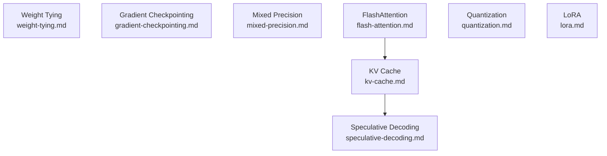

# Deep Learning Engineering: Overview

This file is the index for the `concepts/deep-learning-engineering/` folder. It maps planned and written notes on practical techniques for training efficiency, inference acceleration, and memory reduction in modern deep learning — with emphasis on large language models and transformer architectures.

---

## Notes in This Folder

| File | Status | Topic |
|------|--------|-------|
| `weight-tying.md` | ✅ Written | Parameter sharing between input embedding and output projection |
| `gradient-checkpointing.md` | 🔲 Planned | Recompute activations on the backward pass to reduce peak memory |
| `mixed-precision.md` | 🔲 Planned | FP16/BF16 training, loss scaling, and master weight copies |
| `flash-attention.md` | 🔲 Planned | IO-aware attention — tiled SRAM computation to minimize HBM round-trips |
| `kv-cache.md` | 🔲 Planned | Cache past K/V tensors across autoregressive decoding steps |
| `speculative-decoding.md` | 🔲 Planned | Draft-then-verify decoding for latency reduction |
| `quantization.md` | 🔲 Planned | PTQ, QAT, GPTQ, AWQ — reducing bit-width at inference |
| `lora.md` | 🔲 Planned | Low-rank adaptation: freeze base weights, train $\Delta W = BA$ |

---

## Subtopic Map

### 🏋️ Training Efficiency

| Subtopic | Key Idea | Primary Source |
|----------|----------|----------------|
| Weight tying | Share $W_{\text{emb}} = W_{\text{out}}^\top$; halves vocab-layer parameters | Press & Wolf (2017) |
| Gradient checkpointing | Discard activations during forward pass; recompute on demand during backward | Chen et al. (2016) |
| Mixed precision | Compute in FP16/BF16; keep FP32 master weights for stable updates | Micikevicius et al. (2018) |

### ⚡ Inference Acceleration

| Subtopic | Key Idea | Primary Source |
|----------|----------|----------------|
| KV cache | Avoid recomputing past keys/values at each decode step | Pope et al. (2023) |
| Speculative decoding | Small draft model proposes tokens; large model verifies a batch in parallel | Leviathan et al. (2023) |
| FlashAttention | Fuse softmax + matmul into one SRAM-resident kernel; $O(N)$ memory | Dao et al. (2022) |

### 🗜️ Memory and Parameter Efficiency

| Subtopic | Key Idea | Primary Source |
|----------|----------|----------------|
| Quantization | Reduce weights/activations to INT8/INT4; minimize quantization error | Dettmers et al. (2023) |
| LoRA | Inject trainable low-rank matrices; freeze pretrained weights | Hu et al. (2021) |

---

## Dependency Graph

*Notes without incoming edges can be read in any order. `speculative-decoding.md` assumes `kv-cache.md`; `flash-attention.md` is a useful prerequisite for `kv-cache.md` but not required.*

---

## Master References

| Reference | Authors | Year | What It Covers | Link |
|-----------|---------|------|----------------|------|
| Using the Output Embedding to Improve Language Models | Press & Wolf | 2017 | Weight tying — empirical analysis and motivation | [arXiv:1608.05859](https://arxiv.org/abs/1608.05859) |
| Tying Word Vectors and Word Classifiers | Inan et al. | 2017 | Independent concurrent weight tying paper; theoretical KL-divergence justification | [arXiv:1611.01462](https://arxiv.org/abs/1611.01462) |
| ALBERT | Lan et al. | 2020 | Factored embedding parametrization; cross-layer weight sharing | [arXiv:1909.11942](https://arxiv.org/abs/1909.11942) |
| Training Deep Nets with Sublinear Memory Cost | Chen et al. | 2016 | Gradient checkpointing — $O(\sqrt{n})$ memory algorithm | [arXiv:1604.06174](https://arxiv.org/abs/1604.06174) |
| Reducing Activation Recomputation in Large Transformer Models | Korthikanti et al. | 2022 | Selective recomputation — recompute cheap activations, store expensive ones; 5x memory reduction | [arXiv:2205.05198](https://arxiv.org/abs/2205.05198) |
| Mixed Precision Training | Micikevicius et al. | 2018 | FP16 training with loss scaling and FP32 master weights | [arXiv:1710.03740](https://arxiv.org/abs/1710.03740) |
| A Study of BFLOAT16 for Deep Learning Training | Kalamkar et al. | 2019 | BF16 as FP32 drop-in — same exponent range, no loss scaling needed | [arXiv:1905.12322](https://arxiv.org/abs/1905.12322) |
| FlashAttention | Dao et al. | 2022 | IO-aware tiled attention; HBM access analysis | [arXiv:2205.14135](https://arxiv.org/abs/2205.14135) |
| FlashAttention-2 | Dao | 2023 | Improved parallelism and work partitioning; 2x faster than FA1 | [arXiv:2307.08691](https://arxiv.org/abs/2307.08691) |
| Efficiently Scaling Transformer Inference | Pope et al. | 2022 | KV cache memory footprint and bandwidth analysis; partitioning strategies | [arXiv:2211.05102](https://arxiv.org/abs/2211.05102) |
| Fast Inference from Transformers via Speculative Decoding | Leviathan et al. | 2023 | Speculative decoding — rejection-sampling proof; 2–3x speedup | [arXiv:2211.17192](https://arxiv.org/abs/2211.17192) |
| Accelerating LLM Decoding with Speculative Sampling | Chen et al. (DeepMind) | 2023 | Independent concurrent speculative sampling work; sampling-theoretic foundations | [arXiv:2302.01318](https://arxiv.org/abs/2302.01318) |
| A Survey of Quantization Methods for Efficient Neural Network Inference | Gholami et al. | 2021 | Comprehensive quantization survey — PTQ, QAT, mixed-precision, hardware | [arXiv:2103.13630](https://arxiv.org/abs/2103.13630) |
| GPTQ: Accurate Post-Training Quantization | Frantar et al. | 2022 | Layer-wise second-order (Hessian) PTQ; 3–4 bit with negligible accuracy loss | [arXiv:2210.17323](https://arxiv.org/abs/2210.17323) |
| SmoothQuant | Xiao et al. | 2022 | Per-channel scaling migrates quantization difficulty from activations to weights; enables W8A8 | [arXiv:2211.10438](https://arxiv.org/abs/2211.10438) |
| AWQ: Activation-aware Weight Quantization | Lin et al. | 2023 | INT4 quantization protecting salient weight channels via activation magnitudes | [arXiv:2306.00978](https://arxiv.org/abs/2306.00978) |
| LLM.int8() | Dettmers et al. | 2022 | Mixed-decomposition INT8 inference for LLMs | [arXiv:2208.07339](https://arxiv.org/abs/2208.07339) |
| LoRA: Low-Rank Adaptation of Large Language Models | Hu et al. | 2021 | LoRA — $\Delta W = BA$; 10,000x fewer trainable parameters than full fine-tuning | [arXiv:2106.09685](https://arxiv.org/abs/2106.09685) |
| Parameter-Efficient Fine-Tuning for Large Models: A Comprehensive Survey | Han et al. | 2024 | Taxonomy of PEFT methods: additive, selective, reparameterized, hybrid | [arXiv:2403.14608](https://arxiv.org/abs/2403.14608) |
