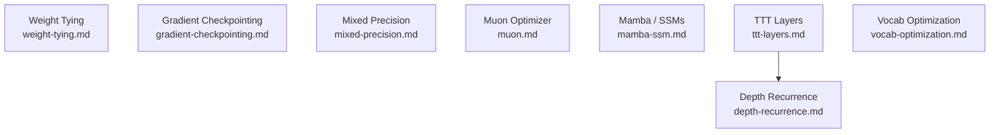

# Deep Learning Engineering: Overview

This file is the index for the `concepts/deep-learning-engineering/` folder. It maps planned and written notes on practical techniques for training efficiency, inference acceleration, and parameter efficiency in modern deep learning — with emphasis on large language models and Parameter Golf-style optimization.

---

## Notes in This Folder

| File | Status | Topic |
|------|--------|-------|
| `weight-tying.md` | ✅ Written | Parameter sharing between input embedding and output projection |
| `gradient-checkpointing.md` | 🔲 Planned | Recompute activations on the backward pass to reduce peak memory |
| `mixed-precision.md` | 🔲 Planned | FP16/BF16 training, loss scaling, and master weight copies |
| `muon.md` | 🔲 Planned | Orthogonalized gradient descent for 2D weights; the top Parameter Golf optimizer |
| `mamba-ssm.md` | 🔲 Planned | Selective state space models — $O(N)$ training via parallel scan, $O(1)$ inference via recurrence |
| `ttt-layers.md` | 🔲 Planned | Test-time training layers — inner model weights as dynamic hidden state |
| `depth-recurrence.md` | 🔲 Planned | Shared-weight transformers — depth for free via weight reuse across layers |
| `vocab-optimization.md` | 🔲 Planned | BPE engineering, bigram hashing, and small-vocabulary strategies |

---

## Subtopic Map

### 🏋️ Training Efficiency

| Subtopic | Key Idea | Primary Source |
|----------|----------|----------------|
| Weight tying | Share $W_{\text{emb}} = W_{\text{out}}^\top$; halves vocab-layer parameters | Press & Wolf (2017) |
| Gradient checkpointing | Discard activations during forward; recompute on demand during backward | Chen et al. (2016) |
| Mixed precision | Compute in FP16/BF16; keep FP32 master weights for stable updates | Micikevicius et al. (2018) |
| Muon optimizer | Orthogonalize gradients via Newton-Schulz before applying; beats AdamW per parameter | Jordan et al. / modded-nanoGPT (2024) |

### 🏗️ Novel Architectures

| Subtopic | Key Idea | Primary Source |
|----------|----------|----------------|
| Mamba / selective SSMs | Input-dependent $A, B, C$ matrices; parallel associative scan during training, $O(1)$ recurrent inference | Gu & Dao (2023) |
| TTT layers | Hidden state = inner model weights; updated by gradient steps at test time | Sun et al. (2024) |
| Depth recurrence | Run one shared transformer block $L$ times; $L$-layer expressivity at 1-layer parameter cost | Dehghani et al. (2019) |

### 📖 Vocabulary and Data

| Subtopic | Key Idea | Primary Source |
|----------|----------|----------------|
| Vocabulary optimization | Tune BPE vocab size; bigram hashing for ultra-small vocabularies | Sennrich et al. (2016) |

---

## Dependency Graph

*All notes are largely self-contained. `depth-recurrence.md` is best read after `ttt-layers.md` since the top Parameter Golf technique combines both.*

---

## Master References

| Reference | Authors | Year | What It Covers | Link |
|-----------|---------|------|----------------|------|
| Using the Output Embedding to Improve Language Models | Press & Wolf | 2017 | Weight tying — empirical analysis and motivation | [arXiv:1608.05859](https://arxiv.org/abs/1608.05859) |
| Tying Word Vectors and Word Classifiers | Inan et al. | 2017 | Independent concurrent weight tying; KL-divergence justification | [arXiv:1611.01462](https://arxiv.org/abs/1611.01462) |
| ALBERT | Lan et al. | 2020 | Factored embeddings; cross-layer weight sharing | [arXiv:1909.11942](https://arxiv.org/abs/1909.11942) |
| Training Deep Nets with Sublinear Memory Cost | Chen et al. | 2016 | Gradient checkpointing — $O(\sqrt{n})$ activation memory | [arXiv:1604.06174](https://arxiv.org/abs/1604.06174) |
| Reducing Activation Recomputation in Large Transformer Models | Korthikanti et al. | 2022 | Selective recomputation — 5x memory reduction at minimal compute cost | [arXiv:2205.05198](https://arxiv.org/abs/2205.05198) |
| Mixed Precision Training | Micikevicius et al. | 2018 | FP16 training with loss scaling and FP32 master weights | [arXiv:1710.03740](https://arxiv.org/abs/1710.03740) |
| A Study of BFLOAT16 for Deep Learning Training | Kalamkar et al. | 2019 | BF16 as FP32 drop-in — same exponent range, no loss scaling needed | [arXiv:1905.12322](https://arxiv.org/abs/1905.12322) |
| Modded-nanoGPT / Muon | Jordan et al. | 2024 | Muon optimizer — Newton-Schulz orthogonalization for 2D weight gradients | [GitHub](https://github.com/KellerJordan/modded-nanogpt) |
| Mamba: Linear-Time Sequence Modeling with Selective State Spaces | Gu & Dao | 2023 | Selective SSM — input-dependent transitions; parallel scan algorithm | [arXiv:2312.00752](https://arxiv.org/abs/2312.00752) |
| Learning to (Learn at Test Time) | Sun et al. | 2024 | TTT layers — inner model weights as hidden state; outer network learns the update rule | [arXiv:2407.04620](https://arxiv.org/abs/2407.04620) |
| Universal Transformers | Dehghani et al. | 2019 | Depth recurrence — one shared transformer block run $L$ times | [arXiv:1807.03819](https://arxiv.org/abs/1807.03819) |
| Neural Machine Translation of Rare Words with Subword Units | Sennrich et al. | 2016 | BPE tokenization — the foundational algorithm for modern vocabulary construction | [arXiv:1508.07909](https://arxiv.org/abs/1508.07909) |
