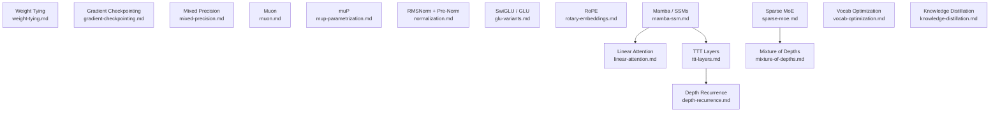

# Deep Learning Engineering: Overview

This file is the index for the `concepts/deep-learning-engineering/` folder. It maps planned and written notes on practical techniques for training efficiency, inference acceleration, and parameter efficiency in modern deep learning — with emphasis on large language models and Parameter Golf-style optimization.

---

## Notes in This Folder

### Written

| File | Topic |
|------|-------|
| `weight-tying.md` | ✅ Parameter sharing between input embedding and output projection |
| `gradient-checkpointing.md` | ✅ Recompute activations on the backward pass to reduce peak memory |
| `normalization-free-transformers.md` | ✅ DyT and Derf as pointwise LayerNorm replacements; four-property theory |
| `rotary-embeddings.md` | ✅ RoPE — rotating Q/K vectors to encode relative position; NTK-aware scaling and YaRN context extension |

### Planned

| File | Topic |
|------|-------|
| `mixed-precision.md` | FP16/BF16 training, loss scaling, and master weight copies |
| `muon.md` | Orthogonalized gradient descent for 2D weights; the top Parameter Golf optimizer |
| `mup-parametrization.md` | Maximal Update Parametrization — transfer optimal hyperparameters from small to large models |
| `normalization.md` | RMSNorm vs. LayerNorm; Pre-Norm vs. Post-Norm; training stability at depth |
| `glu-variants.md` | SwiGLU and gated FFN variants — multiplicative gating for better perplexity |
| `mamba-ssm.md` | Selective state space models — $O(N)$ training via parallel scan, $O(1)$ inference via recurrence |
| `linear-attention.md` | Gated linear attention — RWKV, RetNet, GLA; $O(1)$ inference with data-dependent decay |
| `ttt-layers.md` | Test-time training layers — inner model weights as dynamic hidden state |
| `depth-recurrence.md` | Shared-weight transformers — depth for free via weight reuse across layers |
| `sparse-moe.md` | Sparse Mixture of Experts — decouple parameter count from per-token compute via routing |
| `mixture-of-depths.md` | Token routing to skip transformer blocks — reduce FLOPs with matched perplexity |
| `vocab-optimization.md` | BPE engineering, bigram hashing, and small-vocabulary strategies |
| `knowledge-distillation.md` | Sequence-level and on-policy distillation — training small models from teacher distributions |

---

## Subtopic Map

### 🏋️ Training Efficiency

| Subtopic | Key Idea | Primary Source |
|----------|----------|----------------|
| Weight tying | Share $W_{\text{emb}} = W_{\text{out}}^\top$; halves vocab-layer parameters | Press & Wolf (2017) |
| Gradient checkpointing | Discard activations during forward; recompute on demand during backward | Chen et al. (2016) |
| Mixed precision | Compute in FP16/BF16; keep FP32 master weights for stable updates | Micikevicius et al. (2018) |
| Muon optimizer | Orthogonalize gradients via Newton-Schulz before applying; beats AdamW per parameter | Jordan et al. (2024) |
| µP | Reparametrize init and LR scaling so optimal HPs transfer from small proxy to full model | Yang et al. (2022) |

### 🧱 Architecture Components

| Subtopic | Key Idea | Primary Source |
|----------|----------|----------------|
| RMSNorm + Pre-Norm | Drop mean-centering; normalize before each sublayer — ubiquitous in modern LLMs | Zhang & Sennrich (2019); LLaMA (2023) |
| Normalization-free Transformers | Replace LayerNorm with DyT (tanh) or Derf (erf); four necessary properties; matches/beats LN | Zhu et al. (2025); Chen et al. (2025) |
| SwiGLU / GLU variants | Gated FFN: $\text{FFN}(x) = (\sigma(xV) \odot xW_1) W_2$ — consistent perplexity improvement | Shazeer (2020) |
| Rotary embeddings (RoPE) | Encode relative position via Q/K rotation; extends to longer contexts via YaRN | Su et al. (2021); Peng et al. (2023) |

### 🏗️ Sequence Models

| Subtopic | Key Idea | Primary Source |
|----------|----------|----------------|
| Mamba / selective SSMs | Input-dependent $A, B, C$; parallel scan in training, recurrent in inference | Gu & Dao (2023) |
| Linear attention / GLA | Data-dependent decay gates; $O(1)$ inference memory, $O(N)$ training compute | Peng et al. / Yang et al. (2023–24) |

### ⚙️ Dynamic Computation

| Subtopic | Key Idea | Primary Source |
|----------|----------|----------------|
| Sparse MoE | Route each token to top-$k$ of $N$ expert FFNs; total params $\gg$ active params | Jiang et al. / Dai et al. (2024) |
| Mixture of Depths | Top-$k$ token routing to skip entire blocks; up to 50% FLOP reduction | Raposo et al. (2024) |
| TTT layers | Hidden state = inner model weights; updated by gradient steps at test time | Sun et al. (2024) |
| Depth recurrence | Run one shared transformer block $L$ times; $L$-layer expressivity at 1-layer cost | Dehghani et al. (2019) |

### 📖 Vocabulary and Transfer

| Subtopic | Key Idea | Primary Source |
|----------|----------|----------------|
| Vocabulary optimization | Tune BPE vocab size; bigram hashing for ultra-small vocabularies | Sennrich et al. (2016) |
| Knowledge distillation | Train student on teacher's output distribution via reverse KL; on-policy variants | Gu et al. (2023) |

---

## Dependency Graph

*Most notes are self-contained. Notable chains: `mamba-ssm` motivates both `linear-attention` (shared recurrent framing) and `ttt-layers` (generalizing fixed state to a learned model); `ttt-layers` pairs naturally with `depth-recurrence` for Parameter Golf. `sparse-moe` is prerequisite context for `mixture-of-depths`.*

---

## Master References

| Reference | Authors | Year | What It Covers | Link |
|-----------|---------|------|----------------|------|
| Using the Output Embedding to Improve Language Models | Press & Wolf | 2017 | Weight tying — empirical analysis and motivation | [arXiv:1608.05859](https://arxiv.org/abs/1608.05859) |
| Tying Word Vectors and Word Classifiers | Inan et al. | 2017 | Independent concurrent weight tying; KL-divergence justification | [arXiv:1611.01462](https://arxiv.org/abs/1611.01462) |
| ALBERT | Lan et al. | 2020 | Factored embeddings; cross-layer weight sharing | [arXiv:1909.11942](https://arxiv.org/abs/1909.11942) |
| Training Deep Nets with Sublinear Memory Cost | Chen et al. | 2016 | Gradient checkpointing — $O(\sqrt{n})$ activation memory | [arXiv:1604.06174](https://arxiv.org/abs/1604.06174) |
| Reducing Activation Recomputation in Large Transformer Models | Korthikanti et al. | 2022 | Selective recomputation — 5x memory reduction | [arXiv:2205.05198](https://arxiv.org/abs/2205.05198) |
| Mixed Precision Training | Micikevicius et al. | 2018 | FP16 training with loss scaling and FP32 master weights | [arXiv:1710.03740](https://arxiv.org/abs/1710.03740) |
| A Study of BFLOAT16 for Deep Learning Training | Kalamkar et al. | 2019 | BF16 as FP32 drop-in — same exponent range, no loss scaling needed | [arXiv:1905.12322](https://arxiv.org/abs/1905.12322) |
| Modded-nanoGPT / Muon | Jordan et al. | 2024 | Muon optimizer — Newton-Schulz orthogonalization for 2D weight gradients | [GitHub](https://github.com/KellerJordan/modded-nanogpt) |
| Tensor Programs V: Tuning Large Neural Networks via Zero-Shot HP Transfer | Yang et al. | 2022 | µP — reparametrization enabling HP transfer across model scales | [arXiv:2203.03466](https://arxiv.org/abs/2203.03466) |
| Root Mean Square Layer Normalization | Zhang & Sennrich | 2019 | RMSNorm — drops mean-centering; faster and equally stable as LayerNorm | [arXiv:1910.07467](https://arxiv.org/abs/1910.07467) |
| Transformers without Normalization | Zhu, Chen, He, LeCun, Liu | 2025 | DyT = γ⊙tanh(αx)+β as drop-in LayerNorm replacement; 8.2% LLaMA-7B training speedup | [arXiv:2503.10622](https://arxiv.org/abs/2503.10622) |
| Stronger Normalization-Free Transformers | Chen, Lu, Zhu, Sun, Liu | 2025 | Four-property framework for pointwise norm replacements; Derf = γ·erf(αx+s)+β outperforms LN and DyT | [arXiv:2512.10938](https://arxiv.org/abs/2512.10938) |
| GLU Variants Improve Transformer | Shazeer | 2020 | SwiGLU and other gated FFN variants — consistent perplexity improvement | [arXiv:2002.05202](https://arxiv.org/abs/2002.05202) |
| RoFormer: Enhanced Transformer with Rotary Position Embedding | Su et al. | 2021 | RoPE — relative position via rotation; decays with distance naturally | [arXiv:2104.09864](https://arxiv.org/abs/2104.09864) |
| YaRN: Efficient Context Window Extension | Peng et al. | 2023 | NTK-aware RoPE frequency interpolation for context length extension | [arXiv:2309.00071](https://arxiv.org/abs/2309.00071) |
| Mamba: Linear-Time Sequence Modeling with Selective State Spaces | Gu & Dao | 2023 | Selective SSM — input-dependent transitions; parallel scan algorithm | [arXiv:2312.00752](https://arxiv.org/abs/2312.00752) |
| RWKV: Reinventing RNNs for the Transformer Era | Peng et al. | 2023 | Linear attention via time-decay recurrence; $O(1)$ inference memory | [arXiv:2305.13048](https://arxiv.org/abs/2305.13048) |
| Gated Linear Attention Transformers with Hardware-Efficient Training | Yang et al. | 2024 | GLA — data-dependent decay gates; hardware-efficient via chunk-wise scan | [arXiv:2312.06635](https://arxiv.org/abs/2312.06635) |
| Learning to (Learn at Test Time) | Sun et al. | 2024 | TTT layers — inner model weights as dynamic hidden state | [arXiv:2407.04620](https://arxiv.org/abs/2407.04620) |
| Universal Transformers | Dehghani et al. | 2019 | Depth recurrence — one shared transformer block run $L$ times | [arXiv:1807.03819](https://arxiv.org/abs/1807.03819) |
| Mixtral of Experts | Jiang et al. | 2024 | Sparse MoE at scale — 8 experts, top-2 routing, matches dense 13B with 7B active params | [arXiv:2401.04088](https://arxiv.org/abs/2401.04088) |
| DeepSeekMoE | Dai et al. | 2024 | Fine-grained expert segmentation and shared expert isolation | [arXiv:2401.06066](https://arxiv.org/abs/2401.06066) |
| Mixture-of-Depths | Raposo et al. | 2024 | Token routing to skip entire transformer blocks; 50% FLOP reduction | [arXiv:2404.02258](https://arxiv.org/abs/2404.02258) |
| Neural Machine Translation of Rare Words with Subword Units | Sennrich et al. | 2016 | BPE tokenization — foundational algorithm for vocabulary construction | [arXiv:1508.07909](https://arxiv.org/abs/1508.07909) |
| MiniLLM: Knowledge Distillation of Large Language Models | Gu et al. | 2023 | On-policy distillation via reverse KL — avoids mode-covering pathologies | [arXiv:2306.08543](https://arxiv.org/abs/2306.08543) |
