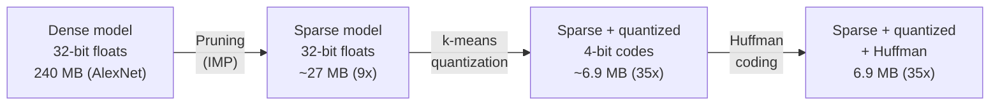
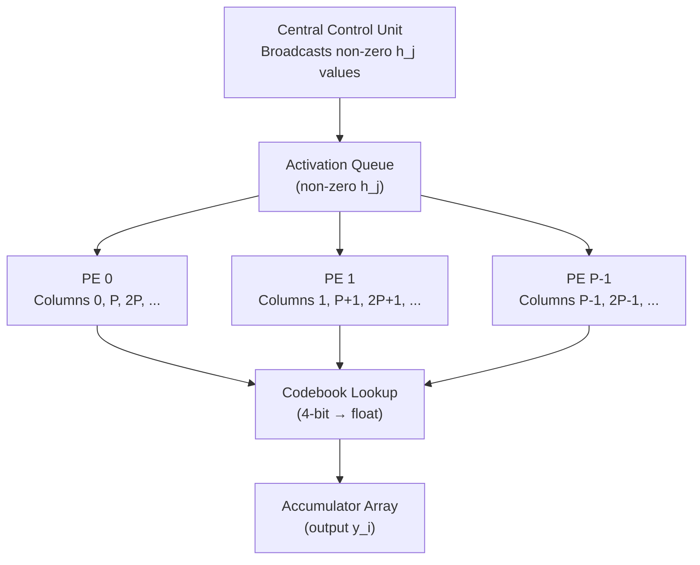

# 🗜️ Compression Pipelines: Deep Compression and EIE

## Table of Contents

- [[#1. 💡 Motivation: From Pruning to Deployment|1. Motivation: From Pruning to Deployment]]
- [[#2. 🔗 The Deep Compression Pipeline|2. The Deep Compression Pipeline]]
  - [[#2.1 Stage 1 — Pruning|2.1 Stage 1 — Pruning]]
  - [[#2.2 Stage 2 — Weight Quantization|2.2 Stage 2 — Weight Quantization]]
  - [[#2.3 Stage 3 — Huffman Coding|2.3 Stage 3 — Huffman Coding]]
  - [[#2.4 End-to-End Compression Ratios|2.4 End-to-End Compression Ratios]]
  - [[#2.5 💻 PyTorch: Deep Compression Pipeline|2.5 PyTorch: Deep Compression Pipeline]]
- [[#3. ⚡ EIE: Efficient Inference Engine|3. EIE: Efficient Inference Engine]]
  - [[#3.1 The Sparsity Exploitation Problem|3.1 The Sparsity Exploitation Problem]]
  - [[#3.2 Compressed Sparse Column Representation|3.2 Compressed Sparse Column Representation]]
  - [[#3.3 EIE Architecture|3.3 EIE Architecture]]
  - [[#3.4 Performance Analysis|3.4 Performance Analysis]]
  - [[#3.5 💻 PyTorch: Sparse Matrix-Vector Product in CSC Format|3.5 PyTorch: Sparse Matrix-Vector Product in CSC Format]]
- [[#4. 🔲 NVIDIA Ampere 2:4 Structured Sparsity|4. NVIDIA Ampere 2:4 Structured Sparsity]]
- [[#5. 📚 References|5. References]]

---

## 1. 💡 Motivation: From Pruning to Deployment

Iterative magnitude pruning ([[concepts/deep-learning-engineering/sparsity-pruning/classical-pruning|Classical Pruning]]) produces a network where 80–90% of weights are exactly zero. But *storing* or *computing* with this sparse network naively recovers none of the theoretical efficiency:

- A sparse weight matrix stored as a dense 32-bit float array wastes memory: 90% of the entries are zeros consuming full storage.
- A matrix-vector product with a dense representation executes 10× more multiply-accumulate operations than necessary.
- Modern GPU cores have no native support for irregular unstructured sparsity — a sparse matrix-vector product on a GPU can be *slower* than its dense counterpart due to irregular memory access patterns.

*Deep Compression* (Han, Mao, Dally 2016) addresses the storage problem via a three-stage pipeline that reduces AlexNet from 240 MB to 6.9 MB. *EIE* addresses the compute problem via custom VLSI that directly operates on the compressed sparse representation.

---

## 2. 🔗 The Deep Compression Pipeline

The pipeline applies three compression stages in sequence:



### 2.1 Stage 1 — Pruning

Apply iterative magnitude pruning (see [[concepts/deep-learning-engineering/sparsity-pruning/classical-pruning|Classical Pruning]] §6) to remove 80–90% of weights. The output is a sparse weight matrix with a binary mask:

$$W_\text{sparse} = W \odot M, \quad M_{ij} \in \{0, 1\}$$

The mask $M$ does not need to be stored explicitly — it is implicit in the sparse representation used in subsequent stages.

### 2.2 Stage 2 — Weight Quantization

Each layer's non-zero weights are clustered into $k = 2^b$ groups using $k$-means clustering (typically $b = 4$ or $5$ bits). Instead of storing each weight as a 32-bit float, we store:

1. A **codebook** of $k$ centroid values $\{c_1, \ldots, c_k\}$ (32-bit floats, $k \cdot 32$ bits total).
2. A **code index** for each non-zero weight: a $b$-bit integer pointing to its centroid.

**Formal setup.** Let $W_{nz} = \{w_i : w_i \neq 0\}$ be the non-zero weights of a layer. We solve:

$$\min_{c_1,\ldots,c_k,\, z} \sum_{i: w_i \neq 0} \bigl(w_i - c_{z_i}\bigr)^2$$

where $z_i \in \{1,\ldots,k\}$ is the cluster assignment for weight $w_i$. This is standard $k$-means; LLoyd's algorithm converges in $O(k \cdot |W_{nz}| \cdot T)$ for $T$ iterations.

**Gradient update for codebook (fine-tuning).** After assigning codes, the network is fine-tuned. Gradients are *accumulated* per cluster:

$$\frac{\partial L}{\partial c_j} = \sum_{i:\, z_i = j} \frac{\partial L}{\partial w_i}$$

All weights sharing a centroid receive the same gradient update — the centroid moves, and all weights in its cluster move together.

> [!INFO] Why k-means, not uniform quantization?
> Weight distributions after training are approximately Gaussian (for FC layers) or bimodal. Uniform quantization wastes precision on the sparse tails. K-means places more cluster centers in the high-density region near zero, matching the data distribution. Empirically, k-means quantization loses $\approx 0.5\%$ top-1 accuracy vs. full precision at 4 bits; uniform quantization loses $\approx 2\%$.

> [!QUESTION] Exercise 1: Codebook storage overhead
> *This exercise analyzes the storage cost of the quantization codebook.*
>
> > **Prerequisites:** [[#2.2 Stage 2 — Weight Quantization|2.2 Stage 2 — Weight Quantization]]
>
> A fully-connected layer has $N_{nz} = 4{,}096 \times 4{,}096 \times 0.1 = 1{,}677{,}722$ non-zero weights (90% pruned). We quantize to $b = 4$ bits ($k = 16$ clusters).
>
> (a) How many bits does the codebook consume? How many bits do the code indices consume?
>
> (b) What is the total storage cost in MB? Compare to storing the non-zero weights as 32-bit floats.
>
> (c) At what value of $N_{nz}$ does the codebook overhead become negligible (say, $< 1\%$ of total storage)?

> [!TIP]- Solution to Exercise 1
> **Key insight:** The codebook is fixed-size ($k \cdot 32$ bits) regardless of $N_{nz}$; its overhead is $O(1/N_{nz})$ relative.
>
> **(a)** Codebook: $16 \times 32 = 512$ bits $= 64$ bytes. Code indices: $N_{nz} \times 4 = 1{,}677{,}722 \times 4 \approx 6.72 \times 10^6$ bits $\approx 0.84$ MB.
>
> **(b)** Total: $64$ bytes $+ 0.84$ MB $\approx 0.84$ MB. Full 32-bit storage: $1.68 \times 10^6 \times 4 \approx 6.7$ MB. Compression ratio from quantization alone: $\approx 8\times$.
>
> **(c)** Codebook overhead $< 1\%$: $512 / (N_{nz} \cdot 4) < 0.01 \implies N_{nz} > 512/0.04 = 12{,}800$. Any non-trivial layer satisfies this; the codebook is always negligible for realistic layer sizes.

### 2.3 Stage 3 — Huffman Coding

Huffman coding assigns variable-length binary codes to symbols based on their frequency: frequent symbols get shorter codes. After quantization, the code indices $\{z_i\}$ form a discrete distribution over $\{1,\ldots,k\}$.

**Shannon entropy lower bound.** The minimum average code length achievable is the entropy:

$$H(\mathbf{z}) = -\sum_{j=1}^k p_j \log_2 p_j \quad \text{bits per symbol}$$

where $p_j = |\{i : z_i = j\}| / N_{nz}$. Huffman coding achieves average length within $1$ bit of $H(\mathbf{z})$.

**Storage after Huffman.** If the average Huffman code length is $\bar{\ell}$ bits (typically $3$–$3.5$ bits for 4-bit quantization of a Gaussian weight distribution), total non-zero weight storage is $N_{nz} \cdot \bar{\ell}$ bits — an additional $4/\bar{\ell} \approx 1.14$–$1.33\times$ compression on top of the 4-bit codes.

**The index difference trick.** Non-zero weights are stored in sparse format as (value, column-index) pairs. The column indices are stored as *differences* between consecutive non-zero positions rather than absolute values. Differences are small (average gap = $1/(1-\text{sparsity})$ columns), so they use few bits. These differences are also Huffman-coded.

> [!QUESTION] Exercise 2: Huffman compression factor
> *This exercise bounds the Huffman compression factor given the weight distribution.*
>
> > **Prerequisites:** [[#2.3 Stage 3 — Huffman Coding|2.3 Stage 3 — Huffman Coding]]
>
> A quantized layer has 4-bit codes ($k = 16$). The cluster frequencies follow a Laplace distribution: $p_j \propto \exp(-|j - 8|/\lambda)$ for $j = 1, \ldots, 16$ with $\lambda = 2$.
>
> (a) Normalize $p_j$ and compute the entropy $H(\mathbf{z})$.
>
> (b) What is the maximum compression factor (ratio of 4 bits to $H(\mathbf{z})$) achievable by Huffman coding?

> [!TIP]- Solution to Exercise 2
> **Key insight:** Huffman compression is most effective when the distribution is highly skewed; for a near-uniform distribution, it provides little gain.
>
> **(a)** Unnormalized: $\tilde{p}_j = e^{-|j-8|/2}$ for $j=1,\ldots,16$. The distribution is symmetric around $j=8$. Numerically: $Z = \sum_{j=1}^{16} e^{-|j-8|/2} \approx 2(e^0 + e^{-0.5} + e^{-1} + \ldots + e^{-3.5}) - e^0$ (counting $j=8$ once). $Z \approx 2(1 + 0.607 + 0.368 + 0.223 + 0.135 + 0.082 + 0.050 + 0.030) - 1 \approx 3.99$. Central probability $p_8 \approx 1/3.99 \approx 0.251$. Entropy is reduced relative to uniform ($H_{uniform} = 4$ bits): numerically $H \approx 3.0$–$3.2$ bits.
>
> **(b)** Compression factor $\approx 4/3.1 \approx 1.3\times$ from Huffman on top of 4-bit quantization. Combined with 4-bit quantization (8× over 32-bit), total compression from quantization + Huffman $\approx 10.4\times$ for this layer.

### 2.4 End-to-End Compression Ratios

Han et al. report the following for AlexNet:

| Layer | Parameters | Pruning | Quantization | Huffman | Total |
|-------|-----------|---------|--------------|---------|-------|
| conv1 | 35K | 16% | 8-bit | 1.2× | 6.3× |
| conv2–5 | 1.5M | 62% | 8-bit | 1.3× | 9.6× |
| fc6 | 37.7M | 91% | 5-bit | 1.3× | 27.3× |
| fc7 | 16.8M | 91% | 5-bit | 1.3× | 27.2× |
| fc8 | 4.1M | 75% | 5-bit | 1.3× | 17.9× |
| **Total** | **60.9M** | — | — | — | **35×** |

VGG-16: **49× total compression** (552 MB → 11.3 MB) with no accuracy loss.

### 2.5 💻 PyTorch: Deep Compression Pipeline

```python
import torch
import torch.nn as nn
import numpy as np
from sklearn.cluster import KMeans
from collections import Counter
import heapq
from dataclasses import dataclass, field
from typing import Optional


# ─────────────────────────────────────────────────────────────────────
# Stage 2: k-means weight quantization
# ─────────────────────────────────────────────────────────────────────

@dataclass
class QuantizedLayer:
    """Stores the codebook and per-weight code indices for one layer."""
    codebook: torch.Tensor       # (k,) float32 centroid values
    codes: torch.Tensor          # (n_nonzero,) int  code indices
    indices: torch.Tensor        # (n_nonzero,) int  positions of non-zero weights
    original_shape: tuple        # shape of the original weight tensor
    n_bits: int                  # bits per code (log2 k)


def quantize_layer(weight: torch.Tensor, n_bits: int = 4) -> QuantizedLayer:
    """
    K-means quantize the non-zero weights of a (pruned) weight tensor.

    Args:
        weight: weight tensor (may contain zeros from pruning)
        n_bits: bits per code; k = 2**n_bits clusters

    Returns:
        QuantizedLayer with codebook and code indices for non-zero weights
    """
    k = 2 ** n_bits
    flat = weight.flatten()
    nz_mask = flat.ne(0)
    nz_vals = flat[nz_mask].float().cpu().numpy().reshape(-1, 1)

    # Initialize k-means with linear spacing over the non-zero range
    init_centers = np.linspace(nz_vals.min(), nz_vals.max(), k).reshape(-1, 1)
    km = KMeans(n_clusters=k, init=init_centers, n_init=1, max_iter=300)
    km.fit(nz_vals)

    codebook = torch.tensor(km.cluster_centers_.flatten(), dtype=torch.float32)
    codes = torch.tensor(km.labels_, dtype=torch.int32)
    indices = nz_mask.nonzero(as_tuple=False).squeeze(1)

    return QuantizedLayer(
        codebook=codebook,
        codes=codes,
        indices=indices,
        original_shape=tuple(weight.shape),
        n_bits=n_bits,
    )


def dequantize_layer(ql: QuantizedLayer) -> torch.Tensor:
    """Reconstruct a dense weight tensor from a QuantizedLayer."""
    flat = torch.zeros(int(np.prod(ql.original_shape)), dtype=torch.float32)
    flat[ql.indices] = ql.codebook[ql.codes.long()]
    return flat.reshape(ql.original_shape)


def fine_tune_codebook(
    ql: QuantizedLayer,
    grad_weight: torch.Tensor,
) -> QuantizedLayer:
    """
    Accumulate gradients per cluster and update codebook centroids.
    Called during the fine-tuning phase after quantization.

    grad_weight: the gradient dL/dW for the full weight tensor
    """
    flat_grad = grad_weight.flatten()[ql.indices]
    new_codebook = ql.codebook.clone()
    for j in range(len(ql.codebook)):
        mask = ql.codes == j
        if mask.any():
            new_codebook[j] -= flat_grad[mask].mean()
    return QuantizedLayer(
        codebook=new_codebook,
        codes=ql.codes,
        indices=ql.indices,
        original_shape=ql.original_shape,
        n_bits=ql.n_bits,
    )


# ─────────────────────────────────────────────────────────────────────
# Stage 3: Huffman coding
# ─────────────────────────────────────────────────────────────────────

@dataclass(order=True)
class _HNode:
    freq: int
    symbol: Optional[int] = field(compare=False, default=None)
    left: Optional["_HNode"] = field(compare=False, default=None)
    right: Optional["_HNode"] = field(compare=False, default=None)


def build_huffman_codebook(symbols: list[int]) -> dict[int, str]:
    """Build a Huffman codebook from a list of symbol occurrences."""
    freq = Counter(symbols)
    heap = [_HNode(f, s) for s, f in freq.items()]
    heapq.heapify(heap)

    while len(heap) > 1:
        a = heapq.heappop(heap)
        b = heapq.heappop(heap)
        heapq.heappush(heap, _HNode(a.freq + b.freq, left=a, right=b))

    root = heap[0]
    codebook: dict[int, str] = {}

    def _traverse(node: _HNode, code: str) -> None:
        if node.symbol is not None:
            codebook[node.symbol] = code or "0"
        else:
            if node.left:
                _traverse(node.left, code + "0")
            if node.right:
                _traverse(node.right, code + "1")

    _traverse(root, "")
    return codebook


def huffman_compress(ql: QuantizedLayer) -> tuple[dict[int, str], float]:
    """
    Build Huffman codes for the code indices and return:
    - huffman_codes: dict mapping code index → bit string
    - avg_bits: average bits per non-zero weight after Huffman
    """
    symbols = ql.codes.tolist()
    hcodes = build_huffman_codebook(symbols)
    avg_bits = sum(len(hcodes[s]) for s in symbols) / len(symbols)
    return hcodes, avg_bits


def compression_ratio(
    ql: QuantizedLayer,
    huffman_avg_bits: float,
    original_bits: int = 32,
) -> float:
    """
    Compute compression ratio relative to dense 32-bit storage.
    Accounts for: (1) sparsity, (2) quantization, (3) Huffman.
    """
    n_total = int(np.prod(ql.original_shape))
    n_nonzero = len(ql.codes)
    # Storage: n_nonzero * huffman_avg_bits (codes) + n_nonzero * log2(n_total) (indices)
    # Codebook: 2**n_bits * 32 bits (negligible for large layers)
    idx_bits = np.log2(n_total)
    compressed_bits = n_nonzero * (huffman_avg_bits + idx_bits) + (2 ** ql.n_bits) * 32
    original_total_bits = n_total * original_bits
    return original_total_bits / compressed_bits
```

---

## 3. ⚡ EIE: Efficient Inference Engine

*Han, Liu, Mao, Pu, Pedram, Horowitz, Dally (2016). "EIE: Efficient Inference Engine on Compressed Deep Neural Network." ISCA 2016.*

### 3.1 The Sparsity Exploitation Problem

After Deep Compression, a FC layer has:
- 90%+ weight sparsity
- ReLU activation sparsity: $\approx 50\%$ of activations are zero (ReLU kills negative pre-activations)

A GPU cannot efficiently exploit *unstructured* weight sparsity. The irregular memory access pattern of a compressed sparse row (CSR) matrix-vector product causes memory bandwidth bottlenecks — the GPU's strength is regular, coalesced DRAM accesses. In practice, a 90%-sparse matrix-vector product on a GPU is no faster than its dense counterpart.

EIE is a custom ASIC designed to operate *natively* on the compressed sparse column (CSC) format and to skip zero activations at the hardware level.

### 3.2 Compressed Sparse Column Representation

For a weight matrix $W \in \mathbb{R}^{m \times n}$ with sparsity $s$, the CSC representation stores:

- **`val`**: vector of $N_{nz} = (1-s) \cdot mn$ non-zero weight *code indices* (4-bit integers after quantization), packed two per byte.
- **`col_ptr`**: vector of $n+1$ integers; `col_ptr[j]` is the index in `val` of the first non-zero entry in column $j$.
- **`row_idx`**: vector of $N_{nz}$ integers giving the row of each non-zero entry, stored as *relative offsets* (4-bit differences) between consecutive non-zeros in the same column.

Storage for AlexNet fc6 ($4096 \times 9216$, 91% pruned):
- Original: $4096 \times 9216 \times 32 = 1.2$Gb
- CSC + 4-bit codes: $\approx 44$MB (27× compression from pruning+quantization)

### 3.3 EIE Architecture

EIE implements the matrix-vector product $y = Wh$ where $W$ is stored in CSC and $h$ is the (sparse) activation vector.



**Key design decisions:**
1. **Column-based work distribution:** Each of $P$ processing elements (PEs) handles a disjoint subset of columns. Column $j$ is processed by PE $j \bmod P$. This distributes non-zero weights evenly (approximately) across PEs.
2. **Zero activation skipping:** The central control unit broadcasts non-zero $h_j$ values and their indices. Zero activations are *never broadcast* — the PEs skip them entirely. This exploits the $\approx 50\%$ ReLU activation sparsity.
3. **In-place codebook lookup:** Each PE stores the 16-entry codebook (16 × 16-bit = 32 bytes) and decodes 4-bit codes on-the-fly during accumulation.
4. **Pointer-driven column scanning:** Each PE maintains a pointer into its columns' `val` arrays. When $h_j \neq 0$, PE $j \bmod P$ scans the non-zero entries in column $j$ using the CSC `col_ptr` and accumulates into its output buffer.

### 3.4 Performance Analysis

**Compute:** A dense FC layer costs $2mn$ multiply-accumulates (MACs). EIE performs $(1-s_w)(1-s_a) \cdot 2mn$ MACs, where $s_w \approx 0.9$ is weight sparsity and $s_a \approx 0.5$ is activation sparsity. Speedup from sparsity alone: $\frac{1}{(1-s_w)(1-s_a)} = \frac{1}{0.1 \times 0.5} = 20\times$.

**Memory bandwidth:** EIE reads 4-bit codes (not 32-bit floats) and skips zeros. Effective bandwidth reduction vs. dense 32-bit: $\approx 8\times$ (4-bit) $\times 10\times$ (weight sparsity) $\times 2\times$ (activation sparsity) $= 160\times$ fewer DRAM accesses.

**Measured results (from paper):**
- 189× speedup over Intel Core i7 CPU (dense)
- 13× speedup over NVIDIA GeForce GTX Titan X (dense)
- 24,000× energy efficiency improvement over CPU
- 3,400× over GPU
- EIE chip: 282 GOPS/W, 0.6W power, 40mm² area (45nm CMOS)

> [!INFO] Why GPU loses to a custom ASIC here
> A GPU is optimized for *regular*, *high-throughput* computation. Its DRAM controller prefetches cache lines assuming spatial locality — but a sparse matrix-vector product accesses memory in an irregular pattern determined by the non-zero structure. EIE's custom memory controller is designed for exactly this access pattern. The GPU also cannot exploit 4-bit codes natively (pre-Turing); EIE's 4-bit arithmetic is free at the hardware level. See [[concepts/deep-learning-engineering/nvidia-gpu-hardware|NVIDIA GPU Hardware]] for GPU memory hierarchy context.

### 3.5 💻 PyTorch: Sparse Matrix-Vector Product in CSC Format

```python
import torch
import torch.nn as nn


def dense_to_csc(W: torch.Tensor) -> tuple[torch.Tensor, torch.Tensor, torch.Tensor]:
    """
    Convert a dense weight matrix W (m x n) to CSC format.

    Returns:
        val:     (nnz,) non-zero values
        col_ptr: (n+1,) column start pointers into val
        row_idx: (nnz,) row indices of non-zeros
    """
    m, n = W.shape
    col_ptr = torch.zeros(n + 1, dtype=torch.long)
    row_indices = []
    values = []

    for j in range(n):
        nz_rows = W[:, j].nonzero(as_tuple=False).squeeze(1)
        col_ptr[j + 1] = col_ptr[j] + len(nz_rows)
        row_indices.append(nz_rows)
        values.append(W[nz_rows, j])

    val = torch.cat(values) if values else torch.tensor([])
    row_idx = torch.cat(row_indices).long() if row_indices else torch.tensor([], dtype=torch.long)
    return val, col_ptr, row_idx


def csc_matvec(
    val: torch.Tensor,
    col_ptr: torch.Tensor,
    row_idx: torch.Tensor,
    h: torch.Tensor,
    m: int,
) -> torch.Tensor:
    """
    Sparse matrix-vector product y = W h using CSC storage.
    Skips zero entries in h (simulating EIE activation sparsity).

    Args:
        val, col_ptr, row_idx: CSC representation of W
        h: (n,) input activation vector
        m: number of output rows

    Returns:
        y: (m,) output vector
    """
    y = torch.zeros(m, dtype=val.dtype, device=val.device)
    n = len(h)

    for j in range(n):
        if h[j] == 0.0:
            continue  # skip zero activations (EIE's key optimization)
        start = col_ptr[j].item()
        end = col_ptr[j + 1].item()
        if start == end:
            continue  # empty column (pruned)
        rows = row_idx[start:end]
        y[rows] += val[start:end] * h[j]

    return y


# PyTorch sparse tensors provide a vectorized alternative:
def sparse_matvec_pytorch(W_sparse: torch.Tensor, h: torch.Tensor) -> torch.Tensor:
    """
    Sparse matrix-vector product using PyTorch's native sparse COO format.
    More efficient than the Python loop above for large matrices.
    """
    # W_sparse is a torch.sparse_coo_tensor or sparse_csr_tensor
    return torch.mv(W_sparse, h)


def to_pytorch_sparse(W: torch.Tensor) -> torch.Tensor:
    """Convert a dense weight tensor to PyTorch sparse CSR format."""
    return W.to_sparse_csr()
```

> [!EXAMPLE] Measuring the memory footprint
> ```python
> import torch
> W_dense = torch.randn(4096, 9216)
> # Simulate 90% pruning
> mask = torch.rand_like(W_dense) > 0.9
> W_pruned = W_dense * mask
>
> W_sparse = W_pruned.to_sparse_csr()
> dense_bytes = W_dense.element_size() * W_dense.numel()
> # Sparse CSR storage: values + col_indices + crow_indices
> sparse_bytes = (
>     W_sparse.values().nbytes
>     + W_sparse.col_indices().nbytes
>     + W_sparse.crow_indices().nbytes
> )
> print(f"Dense: {dense_bytes / 1e6:.1f} MB")
> print(f"Sparse CSR: {sparse_bytes / 1e6:.1f} MB")
> print(f"Compression: {dense_bytes / sparse_bytes:.1f}x")
> # Dense: 150.9 MB, Sparse CSR: ~22 MB, Compression: ~6.8x
> # (further 8x from 4-bit quantization → ~50x total)
> ```

---

## 4. 🔲 NVIDIA Ampere 2:4 Structured Sparsity

EIE targets a custom ASIC. For mainstream GPU deployment, NVIDIA introduced *2:4 structured sparsity* in the Ampere architecture (A100, 2020): exactly 2 of every 4 consecutive weights in a row must be zero, enforcing 50% sparsity with a regular pattern that the Sparse Tensor Core can exploit natively.

**Format.** For each group of 4 weights, store 2 non-zero values (16-bit) and a 2-bit index indicating which two of the four positions are non-zero. Storage: $2 \times 16 + 2 = 34$ bits per 4-weight group vs. $4 \times 16 = 64$ bits dense — exactly $2\times$ compression.

**Hardware.** The Ampere Sparse Tensor Core performs the sparse GEMM directly on the 2:4 compressed format, achieving $2\times$ throughput over dense at the same accuracy. This is the first mainstream GPU to offer hardware sparsity acceleration.

**Limitations.** 2:4 sparsity forces exactly 50% sparsity with a structured pattern — unstructured magnitude pruning produces arbitrary sparsity that does not map to 2:4. In practice, a *post-training* or *during-training* mask selection step must enforce the 2:4 constraint, typically with $< 1\%$ accuracy degradation.

> [!INFO] SCNN: exploiting dual sparsity in convolutions
> Parashar et al. (2017) extended the EIE idea to convolutional layers with *SCNN*, an accelerator that exploits both weight sparsity (from pruning) and activation sparsity (from ReLU) simultaneously via a novel tiled outer-product dataflow. Unlike EIE (which targets FC layers), SCNN's hardware maps the sparse convolution computation onto a 2D array of multiply-accumulate units, avoiding the input-stationary or weight-stationary limitations of standard CNN accelerators.

---

## 5. 📚 References

| Reference Name | Brief Summary | Link |
|----------------|---------------|------|
| Han, Mao, Dally (2016). "Deep Compression" | Three-stage pipeline (prune + quantize + Huffman); 35–49× compression of AlexNet/VGG-16; ICLR 2016 Best Paper | [arXiv:1510.00149](https://arxiv.org/abs/1510.00149) |
| Han et al. (2016). "EIE: Efficient Inference Engine" | Custom VLSI for compressed-sparse FC inference; 189× CPU speedup, 24,000× CPU energy efficiency | [arXiv:1602.01528](https://arxiv.org/abs/1602.01528) |
| Parashar et al. (2017). "SCNN" | Dual weight+activation sparsity dataflow for CNNs; ISCA 2017 | [arXiv:1708.04485](https://arxiv.org/abs/1708.04485) |
| NVIDIA Ampere Architecture (2020) | 2:4 structured sparsity in Sparse Tensor Cores; 2× throughput at 50% sparsity | [NVIDIA Technical Blog](https://developer.nvidia.com/blog/accelerating-inference-with-sparsity-using-ampere-and-tensorrt/) |
