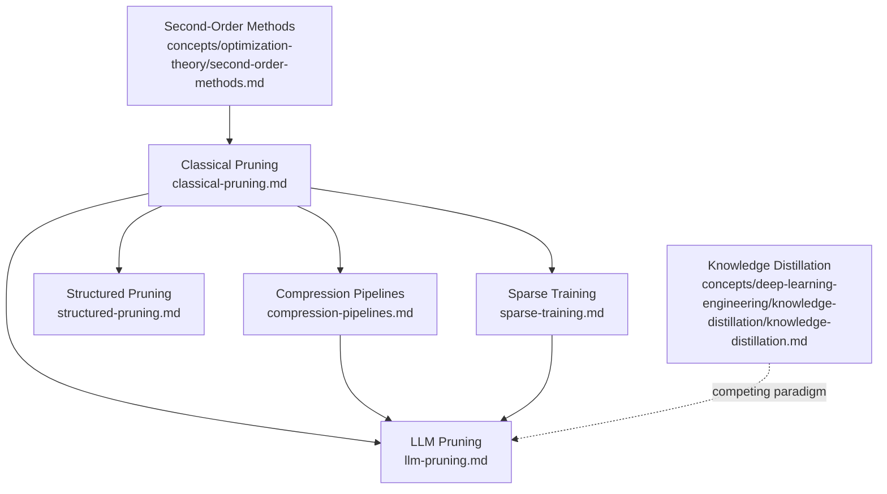

# Sparsity and Pruning in Deep Learning: Overview

This file is the index for the `concepts/deep-learning-engineering/sparsity-pruning/` folder. It lists planned and written subtopic notes, organizes them by theme, and collects the canonical references for the field.

---

## Notes in This Folder

| File | Status | Topic |
|------|--------|-------|
| `classical-pruning.md` | ✅ Written | OBD, OBS, magnitude pruning — second-order saliency theory and iterative magnitude pruning |
| `compression-pipelines.md` | ✅ Written | Deep Compression (prune + quantize + Huffman) and EIE hardware accelerator |
| `structured-pruning.md` | ✅ Written | Filter/channel pruning, BN-scaling pruning, attention head pruning |
| `sparse-training.md` | ✅ Written | Lottery Ticket Hypothesis, SNIP, SET, SNFS, RigL — sparse training from scratch |
| `llm-pruning.md` | ✅ Written | Movement Pruning, SparseGPT, Wanda — LLM-scale compression |

---

## Subtopic Map

### Classical Theory: Hessian-Based Saliency

| Subtopic | Key Idea | Primary Source |
|----------|----------|----------------|
| Optimal Brain Damage | Diagonal-Hessian saliency $s_i = H_{ii} w_i^2 / 2$; prune low-$s$ weights | LeCun et al. 1990 |
| Optimal Brain Surgeon | Full inverse-Hessian; exact weight compensation $\delta w = -\frac{w_q}{[H^{-1}]_{qq}} H^{-1} e_q$ | Hassibi & Stork 1993 |
| Iterative Magnitude Pruning | Train → threshold → retrain; zeroth-order proxy; competitive at scale | Han et al. 2015 |

### Hardware-Aware Compression Pipelines

| Subtopic | Key Idea | Primary Source |
|----------|----------|----------------|
| Deep Compression | Prune (9–13×) → k-means quantization (5 bits) → Huffman coding; 35–49× total | Han et al. 2016 |
| EIE Accelerator | Custom VLSI for compressed sparse FC layers; skips zero weights & activations | Han et al. 2016 |
| SCNN | Exploits both weight and activation sparsity in a tiled dataflow microarchitecture | Parashar et al. 2017 |

### Structured Pruning

| Subtopic | Key Idea | Primary Source |
|----------|----------|----------------|
| Filter pruning (ℓ₁) | Rank filters by ℓ₁ norm; remove whole filters for cuDNN-compatible sparsity | Li et al. 2016 |
| BN scaling (Network Slimming) | ℓ₁ sparsity on BN γ; prune channels with near-zero γ after training | Liu et al. 2017 |
| Attention head pruning | Most heads are redundant; L0-gate pruning identifies specialized heads | Michel et al. 2019; Voita et al. 2019 |
| Rethinking pruning | Fine-tuning pruned weights ≈ random init of pruned architecture for structured methods | Liu et al. 2019 |

### Sparse Training

| Subtopic | Key Idea | Primary Source |
|----------|----------|----------------|
| Lottery Ticket Hypothesis | Dense nets contain sparse "winning tickets" that train well from original init | Frankle & Carlin 2019 |
| SNIP | Connection sensitivity saliency at init; prune before training begins | Lee et al. 2019 |
| SET | Sparse Erdős–Rényi topology evolved during training; no dense model needed | Mocanu et al. 2018 |
| SNFS / Sparse Momentum | Gradient-magnitude momentum drives topology reallocation; 5× faster training | Dettmers & Zettlemoyer 2019 |
| RigL | Instantaneous gradient magnitudes update connectivity periodically; fixed FLOP budget | Evci et al. 2020 |

### LLM-Scale Pruning

| Subtopic | Key Idea | Primary Source |
|----------|----------|----------------|
| Movement Pruning | Fine-tuning saliency = weight × gradient movement; task-adaptive | Sanh et al. 2020 |
| SparseGPT | Layerwise OBS with approximate inverse-Hessian via Cholesky; 50% sparsity at 175B | Frantar & Alistarh 2023 |
| Wanda | Saliency = weight magnitude × activation ℓ₂ norm; no weight update needed | Sun et al. 2023 |

---

## Dependency Graph

---

## Master References

| Reference | Authors | Year | Sub-theme | Key Contribution | Link |
|-----------|---------|------|-----------|-----------------|------|
| [Optimal Brain Damage](https://proceedings.neurips.cc/paper/1989/hash/6c9882bbac1c7093bd25041881277658-Abstract.html) | LeCun, Denker, Solla | 1990 | Classical | Diagonal-Hessian saliency scores; pruning as constrained loss minimization | NeurIPS 1989 |
| [Optimal Brain Surgeon](https://proceedings.neurips.cc/paper/1992/hash/303ed4c69846ab36c2904d3ba8573050-Abstract.html) | Hassibi, Stork | 1993 | Classical | Full inverse-Hessian; exact closed-form weight compensation after pruning | NeurIPS 1992 |
| [Learning Weights and Connections](https://arxiv.org/abs/1506.02626) | Han, Pool, Tran, Dally | 2015 | Magnitude | IMP pipeline; 9× AlexNet, 13× VGG-16 compression, no accuracy loss | NeurIPS 2015 |
| [Deep Compression](https://arxiv.org/abs/1510.00149) | Han, Mao, Dally | 2016 | Pipeline | Prune + quantize + Huffman; 35–49× total compression; ICLR 2016 Best Paper | ICLR 2016 |
| [EIE](https://arxiv.org/abs/1602.01528) | Han et al. | 2016 | Hardware | Custom VLSI for compressed sparse FC; 189× CPU speedup | ISCA 2016 |
| [SCNN](https://arxiv.org/abs/1708.04485) | Parashar et al. | 2017 | Hardware | Dual weight+activation sparsity dataflow; ISCA 2017 | ISCA 2017 |
| [Pruning Filters](https://arxiv.org/abs/1608.08710) | Li et al. | 2016 | Structured | ℓ₁-norm filter pruning; hardware-compatible structured sparsity | ICLR 2017 |
| [Network Slimming](https://arxiv.org/abs/1708.06519) | Liu et al. | 2017 | Structured | BN γ sparsity regularization; channel pruning via near-zero γ | ICCV 2017 |
| [Sixteen Heads](https://arxiv.org/abs/1905.10650) | Michel, Levy, Neubig | 2019 | Structured | Most attention heads are redundant; head importance scoring | NeurIPS 2019 |
| [Analyzing Self-Attention](https://arxiv.org/abs/1905.09418) | Voita et al. | 2019 | Structured | L0-gate head pruning; specialized vs. redundant heads | ACL 2019 |
| [Lottery Ticket Hypothesis](https://arxiv.org/abs/1803.03635) | Frankle, Carlin | 2019 | Sparse training | Winning ticket subnetworks; IMP + weight rewinding; ICLR 2019 Best Paper | ICLR 2019 |
| [Linear Mode Connectivity](https://arxiv.org/abs/1912.05671) | Frankle et al. | 2020 | Sparse training | LTH stability requires rewinding to early training checkpoint, not step 0 | ICML 2020 |
| [SNIP](https://arxiv.org/abs/1810.02340) | Lee, Ajanthan, Torr | 2019 | Sparse training | Connection sensitivity at init; prune before any training | ICLR 2019 |
| [SET](https://arxiv.org/abs/1707.04780) | Mocanu et al. | 2018 | Sparse training | Sparse Erdős–Rényi topology evolved online; no dense model | Nature Comms 2018 |
| [SNFS](https://arxiv.org/abs/1907.04840) | Dettmers, Zettlemoyer | 2019 | Sparse training | Gradient-momentum-based topology reallocation; 5× faster | NeurIPS 2019 |
| [RigL](https://arxiv.org/abs/1911.11134) | Evci et al. | 2020 | Sparse training | Periodic gradient-magnitude topology updates; fixed FLOP training | ICML 2020 |
| [Movement Pruning](https://arxiv.org/abs/2005.07683) | Sanh, Wolf, Rush | 2020 | LLM | Fine-tuning-adaptive saliency; weight × gradient movement | NeurIPS 2020 |
| [SparseGPT](https://arxiv.org/abs/2301.00774) | Frantar, Alistarh | 2023 | LLM | Layerwise OBS at 175B scale; approximate inverse-Hessian via Cholesky | ICML 2023 |
| [Wanda](https://arxiv.org/abs/2306.11695) | Sun et al. | 2023 | LLM | Weight × activation-norm saliency; no weight update; matches SparseGPT | arXiv 2023 |
| [State of Sparsity](https://arxiv.org/abs/1902.09574) | Gale, Elsen, Hooker | 2019 | Survey | Magnitude pruning matches complex methods; sparse archs can't train from scratch | arXiv 2019 |
| [Pruning Survey](https://arxiv.org/abs/2003.03033) | Blalock et al. | 2020 | Survey | 81-paper meta-survey; community lacks reproducible benchmarks; ShrinkBench | MLSys 2020 |
| [Rethinking Pruning](https://arxiv.org/abs/1810.05270) | Liu et al. | 2019 | Survey | For structured pruning, architecture > inherited weights; train from random init | ICLR 2019 |
