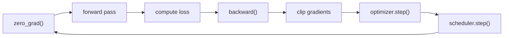
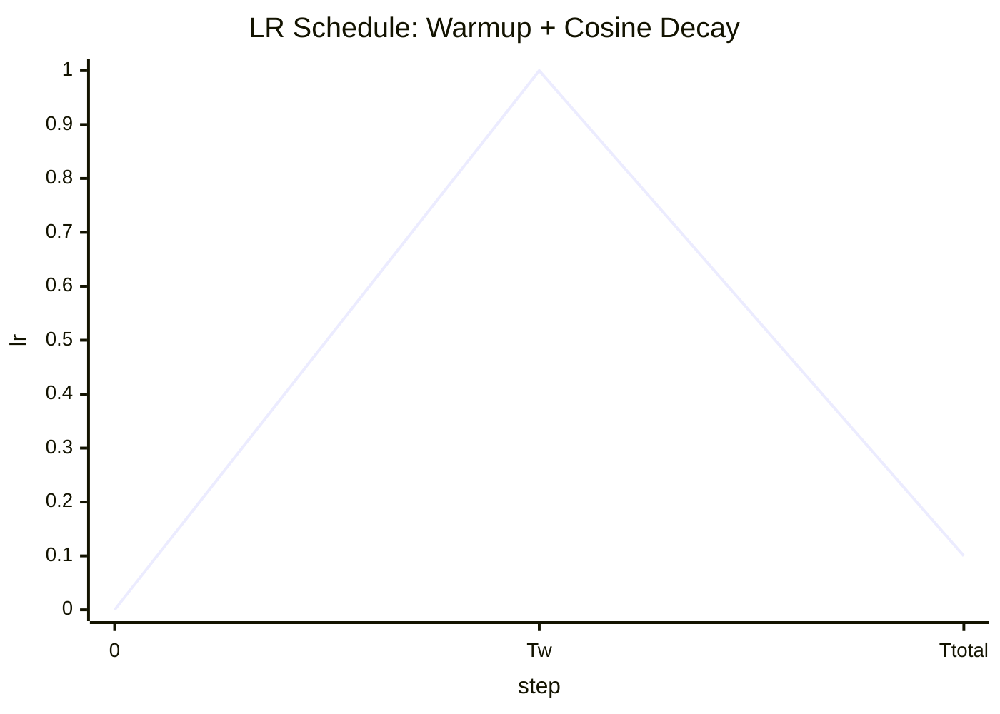

# Engineering Concerns for Deep Learning Training Loops

## Table of Contents

- [[#The Core Step Order|The Core Step Order]]
- [[#Optimizer Configuration|Optimizer Configuration]]
  - [[#AdamW and Decoupled Weight Decay|AdamW and Decoupled Weight Decay]]
  - [[#Parameter Group Weight Decay|Parameter Group Weight Decay]]
- [[#Learning Rate Scheduling|Learning Rate Scheduling]]
  - [[#Linear Warmup|Linear Warmup]]
  - [[#Cosine Decay|Cosine Decay]]
  - [[#PyTorch Implementation|PyTorch Implementation]]
- [[#Mixed Precision Training|Mixed Precision Training]]
  - [[#bfloat16 vs float16|bfloat16 vs float16]]
  - [[#GradScaler and the float16 Pitfall|GradScaler and the float16 Pitfall]]
  - [[#Device-Specific Considerations|Device-Specific Considerations]]
- [[#Gradient Clipping|Gradient Clipping]]
- [[#Gradient Accumulation|Gradient Accumulation]]
  - [[#Plain PyTorch|Plain PyTorch]]
  - [[#HuggingFace Accelerate|HuggingFace Accelerate]]
  - [[#PyTorch Lightning|PyTorch Lightning]]
  - [[#DDP and Gradient Sync|DDP and Gradient Sync]]
- [[#Model Mode Management|Model Mode Management]]
- [[#Tricks and Engineering Notes|Tricks and Engineering Notes]]
- [[#References|References]]

---

## ⚙️ The Core Step Order

Every neural network training loop reduces to the same fundamental rhythm:



**The ordering is not arbitrary — every step has a causal dependency on the previous one.**

| Step | Why it must come here |
|------|-----------------------|
| `zero_grad()` | Clears accumulated gradients from the previous step; must precede backward |
| `forward` + `loss` | Builds the computation graph |
| `backward()` | Populates `.grad` on every parameter via reverse-mode autodiff |
| `clip_grad_norm_` | Operates on `.grad` tensors — must come after backward, before the update |
| `optimizer.step()` | Reads `.grad` to update weights |
| `scheduler.step()` | Adjusts the learning rate for the *next* step |

> [!DANGER] Clipping after optimizer.step()
> Clipping gradients after the optimizer step is a silent bug — the gradients have already been consumed and the weights updated. The clip has no effect. This is easy to introduce when refactoring.

---

## 📐 Optimizer Configuration

### AdamW and Decoupled Weight Decay

*Standard Adam* applies weight decay by adding an L2 penalty to the loss:

$$\mathcal{L}_{\text{reg}} = \mathcal{L} + \frac{\lambda}{2} \|\theta\|^2$$

This folds the decay into the gradient: $g_t \leftarrow g_t + \lambda \theta_t$. Because Adam scales gradients by its second-moment estimate $\hat{v}_t$, the effective decay rate varies per parameter — parameters with large gradient variance get *less* decay than intended.

*AdamW* (Loshchilov & Hutter, 2019) *decouples* weight decay from the gradient update, applying it directly to the weights after the Adam step:

$$\theta_{t+1} \leftarrow \theta_{t+1}^{\text{Adam}} - \eta \lambda \theta_t$$

**This restores weight decay to its intended regularization semantics, independent of the adaptive learning rate.**

### Parameter Group Weight Decay

Even with AdamW, applying a uniform `weight_decay` to all parameters is incorrect. Weight decay pushes parameters toward zero — this is meaningful regularization for weight matrices, where zero means "no connection." It is *not* meaningful for:

- **Norm scale parameters** (e.g. `RMSNorm` weights, `LayerNorm` weight/bias): these control layer output magnitude. Decaying them toward zero suppresses normalization.
- **Bias parameters**: these represent learned offsets; zero is an arbitrary target with no regularization justification.

The standard heuristic, due to nanoGPT, separates parameters by tensor dimension:

```python
decay_params   = [p for n, p in model.named_parameters() if p.dim() >= 2]
nodecay_params = [p for n, p in model.named_parameters() if p.dim() < 2]

optimizer = torch.optim.AdamW([
    {"params": decay_params,   "weight_decay": weight_decay},
    {"params": nodecay_params, "weight_decay": 0.0},
], lr=learning_rate)
```

> [!NOTE] Why dim ≥ 2 works
> Weight matrices are always at least 2-dimensional by construction. All parameters that *should not* be decayed — biases ($d=1$), norm scale vectors ($d=1$) — are 1-dimensional. The geometric property of the tensor directly encodes the semantic distinction.

> [!WARNING] Embeddings
> Embedding tables are 2D (`vocab_size × emb_dim`) and will receive weight decay under this heuristic. Whether to decay embeddings is debated — some practitioners exclude them explicitly by name. The effect is generally small.

---

## 📈 Learning Rate Scheduling

A fixed learning rate is rarely optimal. At the start of training, weights are random and gradients are noisy — a large step risks divergence. Near convergence, smaller steps are needed for precision. The solution is a *schedule*: $\eta_t$ varies over training.

### Linear Warmup

For the first $T_w$ steps, ramp linearly from near-zero to the peak learning rate $\eta_{\max}$:

$$\eta_t = \eta_{\max} \cdot \frac{t}{T_w}, \quad t < T_w$$

*Warmup stabilizes early training* by giving the optimizer time to build reliable second-moment estimates before taking large steps. GPT-3 warmed up over approximately 375M tokens; LLaMA 2 over 2000 steps.

> [!TIP] Why not start from exactly zero?
> Starting from $\eta_0 = 0$ makes the first update a no-op. In practice, use a small $\epsilon$ (e.g. `1e-8 × η_max`) as the initial value.

### Cosine Decay

After warmup, decay from $\eta_{\max}$ to a minimum floor $\eta_{\min}$ following a cosine curve:

$$\eta_t = \eta_{\min} + \frac{1}{2}(\eta_{\max} - \eta_{\min})\left(1 + \cos\left(\pi \cdot \frac{t - T_w}{T_{\text{total}} - T_w}\right)\right), \quad t \geq T_w$$

Cosine decay is preferred over linear or step decay because the smooth curve *spends more time near the minimum* — it decelerates gradually rather than dropping sharply at fixed milestones, avoiding loss spikes.

**The combined schedule:**



### PyTorch Implementation

Two idiomatic approaches:

**`SequentialLR` (declarative):**
```python
from torch.optim.lr_scheduler import LinearLR, CosineAnnealingLR, SequentialLR

warmup = LinearLR(optimizer, start_factor=1e-8, end_factor=1.0, total_iters=warmup_steps)
cosine = CosineAnnealingLR(optimizer, T_max=total_steps - warmup_steps, eta_min=min_lr)
scheduler = SequentialLR(optimizer, schedulers=[warmup, cosine], milestones=[warmup_steps])
```

**`LambdaLR` (most flexible, used in nanoGPT and HuggingFace internals):**
```python
def lr_lambda(step):
    if step < warmup_steps:
        return step / warmup_steps
    progress = (step - warmup_steps) / (total_steps - warmup_steps)
    return 0.5 * (1 + math.cos(math.pi * progress))

scheduler = torch.optim.lr_scheduler.LambdaLR(optimizer, lr_lambda)
```

> [!WARNING] Scheduler placement
> `scheduler.step()` must always be called *after* `optimizer.step()`. Calling it before is a common mistake that updates the LR one step early.

---

## ⚡ Mixed Precision Training

Standard PyTorch training uses `float32` (32 bits per value). *Mixed precision* runs the forward pass in a lower-precision dtype while preserving `float32` for weight updates and loss computation.

Benefits:
- ~2× reduction in activation memory
- Faster matrix multiplications on modern hardware (Tensor Cores, Apple AMX)
- Near-zero accuracy cost when the dtype is chosen correctly

### bfloat16 vs float16

Both use 16 bits, but differ in bit allocation:

| Format | Sign | Exponent | Mantissa | Range | Precision |
|--------|------|----------|----------|-------|-----------|
| `float32` | 1 | 8 | 23 | $\pm 3.4 \times 10^{38}$ | ~7 decimal digits |
| `bfloat16` | 1 | 8 | 7 | $\pm 3.4 \times 10^{38}$ | ~2 decimal digits |
| `float16` | 1 | 5 | 10 | $\pm 6.5 \times 10^{4}$ | ~3 decimal digits |

**`bfloat16` preserves the full exponent range of `float32`.** This matters because gradients can span many orders of magnitude — `float16`'s narrow exponent causes overflow and underflow, requiring a `GradScaler` workaround. `bfloat16` avoids this entirely. *All modern LLMs (LLaMA, Gemma, GPT-4) train with `bfloat16`.*

With `torch.amp.autocast`, only the forward pass activations are cast down. The model weights remain in `float32`; backprop computes gradients in `float32`.

### GradScaler and the float16 Pitfall

When using `float16`, small gradients underflow to zero. `GradScaler` works around this by multiplying the loss by a large scale factor $s$ before backprop, then dividing out before the optimizer step:

$$\text{scaled\_loss} = s \cdot \mathcal{L} \quad \Rightarrow \quad \text{scaled\_grad} = s \cdot \nabla_\theta \mathcal{L}$$

> [!DANGER] Gradient clipping with GradScaler
> If you clip gradients while they are still scaled, you are comparing $\|s \cdot g\|$ against `max_norm` — completely wrong units. You must call `scaler.unscale_(optimizer)` before `clip_grad_norm_`:
> ```python
> scaler.scale(loss).backward()
> scaler.unscale_(optimizer)          # ← required before clipping
> clip_grad_norm_(model.parameters(), max_norm=1.0)
> scaler.step(optimizer)
> scaler.update()
> ```
> **Prefer `bfloat16` to avoid `GradScaler` entirely.**

### Device-Specific Considerations

Different hardware backends have different dtype support:

```python
_AUTOCAST_DTYPE = {
    "cuda": torch.bfloat16,   # Ampere+ has hardware bfloat16 support
    "cpu":  torch.bfloat16,   # Supported since PyTorch 1.10; speedup requires Intel AMX
    "mps":  torch.float16,    # Apple Silicon; bfloat16 autocast support is inconsistent
}

def mp_training_autocast(device: torch.device):
    dtype = _AUTOCAST_DTYPE.get(device.type)
    if dtype is None:
        return contextlib.nullcontext()
    return torch.amp.autocast(device_type=device.type, dtype=dtype)
```

> [!NOTE] nullcontext
> `contextlib.nullcontext()` is the idiomatic way to write "optionally apply a context manager." It is a context manager that does nothing, allowing a single `with` block to work whether or not AMP is active.

---

## ✂️ Gradient Clipping

Gradient clipping prevents *exploding gradients* — large loss spikes that send gradients to extreme magnitudes, destabilizing training. The standard approach is *global norm clipping*: if the $\ell_2$ norm of all gradients stacked into a single vector exceeds a threshold $c$, rescale them uniformly:

$$g \leftarrow g \cdot \min\left(1,\ \frac{c}{\|g\|_2}\right)$$

In PyTorch:
```python
torch.nn.utils.clip_grad_norm_(model.parameters(), max_norm=1.0)
```

A max norm of $1.0$ is the conventional default for LLM pretraining (used by GPT-3, LLaMA, nanoGPT). Clipping must occur *after* `backward()` and *before* `optimizer.step()`.

> [!INFO] Why global norm, not per-parameter?
> Per-parameter clipping changes the *direction* of the gradient update, not just its magnitude. Global norm clipping scales the entire gradient vector uniformly, preserving direction. This is a meaningful distinction: direction encodes *which way to move*, magnitude encodes *how far*.

---

## 🔁 Gradient Accumulation

*Gradient accumulation* simulates a larger effective batch size by running multiple forward–backward passes before taking a single optimizer step. If the true desired batch size is $B$ but only $B/k$ samples fit in memory, run $k$ *micro-steps*, accumulating gradients across them, then step once.

The effective gradient is:

$$g_{\text{eff}} = \frac{1}{k} \sum_{i=1}^{k} \nabla_\theta \mathcal{L}(x_i)$$

which requires dividing each micro-batch loss by $k$ before backprop so gradients average rather than sum.

### Plain PyTorch

```python
accumulation_steps = 4

optimizer.zero_grad()
for i, (x, y) in enumerate(train_loader):
    loss = loss_fn(model(x), y) / accumulation_steps   # scale before backward
    loss.backward()                                     # gradients accumulate in .grad
    if (i + 1) % accumulation_steps == 0:
        clip_grad_norm_(model.parameters(), max_norm=1.0)
        optimizer.step()
        scheduler.step()
        optimizer.zero_grad()
```

> [!WARNING] Norm clipping with accumulation
> `clip_grad_norm_` must be called *after all micro-steps* for that accumulation window, not after each individual backward. Clipping per micro-step clips a partial gradient — the norm computed is not representative of the full accumulated gradient.

### HuggingFace Accelerate

Accelerate wraps accumulation in a context manager that handles loss scaling and DDP sync suppression automatically:

```python
accelerator = Accelerator(gradient_accumulation_steps=4)
model, optimizer, dataloader, scheduler = accelerator.prepare(
    model, optimizer, dataloader, scheduler
)

for batch in dataloader:
    with accelerator.accumulate(model):       # manages no_sync + loss scaling
        loss = loss_fn(model(inputs), labels)
        accelerator.backward(loss)            # internally: loss / accumulation_steps
        optimizer.step()
        scheduler.step()
        optimizer.zero_grad()
```

Inside `accelerator.backward()` (from source):
```python
def backward(self, loss, **kwargs):
    loss = loss / self.gradient_accumulation_steps   # scale before backward
    if self.scaler is not None:
        self.scaler.scale(loss).backward(**kwargs)   # fp16: GradScaler path
    else:
        loss.backward(**kwargs)
```

The parameter group weight decay exclusion in HuggingFace Trainer also uses name-based filtering (see [[#Tricks and Engineering Notes|Tricks]]).

### PyTorch Lightning

Lightning exposes accumulation as a single Trainer argument — it handles loss normalization and DDP sync suppression internally:

```python
trainer = Trainer(accumulate_grad_batches=4)
```

A scheduled variant allows decreasing accumulation as training stabilizes:
```python
from lightning.pytorch.callbacks import GradientAccumulationScheduler

# 8 micro-steps for first 4 epochs, then 4, then 1
scheduler = GradientAccumulationScheduler(scheduling={0: 8, 4: 4, 8: 1})
trainer = Trainer(callbacks=scheduler)
```

In Lightning's automatic optimization mode the `training_step` just returns a loss — Lightning divides it by `accumulate_grad_batches` internally. The full optimizer step (including clipping) only fires on update steps; on accumulation steps the optimizer call is entirely skipped, not merely no-op'd.

> [!NOTE] Manual mode in Lightning
> With `self.automatic_optimization = False`, the user controls accumulation manually — identical to plain PyTorch but using `self.manual_backward(loss)` instead of `loss.backward()` to route through Lightning's precision plugin.

### DDP and Gradient Sync

In *DistributedDataParallel* training, PyTorch performs an all-reduce across ranks at the end of each `backward()` call to synchronize gradients. During accumulation micro-steps this is wasted communication — only the final backward in each window needs to sync.

The fix is to suppress gradient sync on intermediate steps using `model.no_sync()`:

```python
for i, (x, y) in enumerate(train_loader):
    is_last_micro_step = (i + 1) % accumulation_steps == 0
    ctx = contextlib.nullcontext() if is_last_micro_step else model.no_sync()
    with ctx:
        loss = loss_fn(model(x), y) / accumulation_steps
        loss.backward()
    if is_last_micro_step:
        optimizer.step()
        optimizer.zero_grad()
```

Both Accelerate (`accumulate()`) and Lightning (`_block_parallel_sync_behavior`) handle this automatically. *In a single-GPU setup `no_sync` is a no-op* — the pattern is safe to use regardless of whether DDP is active.

---

## 🔄 Model Mode Management

PyTorch modules carry a `training: bool` flag (accessible as `model.training`) that changes the behavior of stateful layers:

| Layer | `.train()` mode | `.eval()` mode |
|-------|----------------|----------------|
| `nn.Dropout` | zeroes activations at rate $p$ | identity (pass-through) |
| `nn.BatchNorm` | uses batch statistics | uses running statistics |
| `nn.LayerNorm`, `RMSNorm`, `nn.Linear` | no difference | no difference |

The standard pattern:
```python
# During evaluation
model.eval()
with torch.no_grad():
    ...
model.train()  # restore

# During training
model.train()
```

> [!NOTE] eval() vs no_grad()
> These are orthogonal. `model.eval()` changes *what the model computes* (disables dropout stochasticity). `torch.no_grad()` changes *how PyTorch tracks computation* (disables gradient graph construction, saving memory and compute). Both are needed during inference.

> [!TIP] Safer mode restoration
> The unconditional `model.train()` after eval incorrectly assumes the model was in training mode before the call. A context manager that captures and restores the original state is more robust:
> ```python
> from contextlib import contextmanager
>
> @contextmanager
> def eval_mode(model: torch.nn.Module):
>     was_training = model.training
>     model.eval()
>     try:
>         yield
>     finally:
>         model.train(was_training)
> ```

---

## 🔑 Tricks and Engineering Notes

A running collection of non-obvious implementation details.

---

### Parameter Group Weight Decay

**Problem:** AdamW applies weight decay uniformly to all parameters. Weight decay pushes values toward zero — a meaningful regularizer for weight matrices, but harmful for norm scale parameters (pushing layer outputs toward zero) and biases (arbitrary zero target).

**Heuristic:** separate parameters by `ndim`. All parameters that should not be decayed happen to be 1D; all weight matrices are ≥ 2D.

```python
decay   = [p for _, p in model.named_parameters() if p.dim() >= 2]
no_decay = [p for _, p in model.named_parameters() if p.dim() < 2]

optimizer = torch.optim.AdamW([
    {"params": decay,    "weight_decay": wd},
    {"params": no_decay, "weight_decay": 0.0},
], lr=lr)
```

**Origin:** nanoGPT (`configure_optimizers`). Widely adopted in LLM pretraining.

**HuggingFace Trainer variant — name-based exclusion:** rather than relying on `ndim`, HuggingFace filters by parameter name using regex patterns. This is more explicit and handles edge cases like named 2D norm parameters:

```python
# From transformers/trainer.py
forbidden = [r"bias", r"layernorm", r"rmsnorm", r"(?:^|\.)norm(?:$|\.)", r"_norm(?:$|\.)"]

decay_names = get_parameter_names(model, [nn.LayerNorm], forbidden)
optimizer_grouped_parameters = [
    {
        "params": [p for n, p in model.named_parameters()
                   if n in decay_names and p.requires_grad],
        "weight_decay": args.weight_decay,
    },
    {
        "params": [p for n, p in model.named_parameters()
                   if n not in decay_names and p.requires_grad],
        "weight_decay": 0.0,
    },
]
```

The `dim >= 2` heuristic and the name-based approach should agree in practice. The name-based approach is more defensive when third-party layers use non-standard parameter shapes.

---

### torch.compile()

Compiles the model's computation graph with TorchInductor, fusing kernels and eliminating Python overhead. Applied after model initialization:

```python
model = torch.compile(model)
```

Typically yields 15–30% throughput improvement on CUDA with no code changes beyond this line. PyTorch 2.0+.

---

### TF32 Matmul Precision

On NVIDIA Ampere and newer GPUs, PyTorch can use *TF32* for `float32` matrix multiplications — a 19-bit format with the same exponent range as `float32` but reduced mantissa precision. The accuracy loss is negligible for deep learning while throughput improves significantly.

```python
torch.set_float32_matmul_precision("high")  # enable TF32
```

Call this once before model initialization. Has no effect on non-CUDA devices.

---

## 📚 References

| Reference | Brief Summary | Link |
|-----------|--------------|-------|
| Loshchilov & Hutter, "Decoupled Weight Decay Regularization" (2019) | Introduced AdamW; showed that L2 regularization in Adam does not equal weight decay | [arXiv:1711.05101](https://arxiv.org/abs/1711.05101) |
| Karpathy, nanoGPT | Minimal, readable GPT-2 pretraining reference implementation | [GitHub](https://github.com/karpathy/nanoGPT) |
| PyTorch AMP documentation | Official guide to `torch.amp.autocast` and `GradScaler` | [pytorch.org](https://pytorch.org/docs/stable/amp.html) |
| Touvron et al., "LLaMA 2" (2023) | Training config reference: bfloat16, cosine schedule, AdamW with group WD | [arXiv:2307.09288](https://arxiv.org/abs/2307.09288) |
| HuggingFace Accelerate source (`accelerator.py`) | Reference implementation of gradient accumulation, loss scaling, `no_sync` dispatch, and GradScaler unscaling in a framework context | [GitHub](https://github.com/huggingface/accelerate/blob/main/src/accelerate/accelerator.py) |
| HuggingFace Transformers Trainer (`trainer.py`) | Reference implementation of parameter group weight decay via name-based regex filtering | [GitHub](https://github.com/huggingface/transformers/blob/main/src/transformers/trainer.py) |
| PyTorch Lightning training tricks docs | Canonical Lightning patterns for gradient accumulation, mixed precision, and gradient clipping via Trainer arguments | [lightning.ai](https://lightning.ai/docs/pytorch/stable/advanced/training_tricks.html) |
