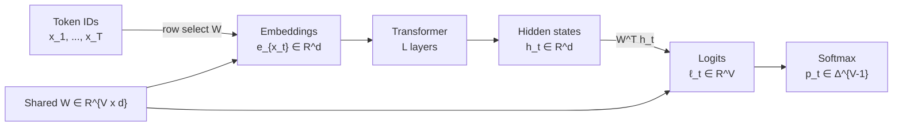

# Weight Tying 🔗

## Table of Contents

- [[#1. Motivation: Parameter Dominance at the Vocabulary Boundary|1. Motivation: Parameter Dominance at the Vocabulary Boundary]]
  - [[#1.1 Where Parameters Live|1.1 Where Parameters Live]]
  - [[#1.2 The Symmetry Observation|1.2 The Symmetry Observation]]
- [[#2. The Technique: Formal Definition|2. The Technique: Formal Definition]]
  - [[#2.1 Notation|2.1 Notation]]
  - [[#2.2 The Standard (Untied) Forward Pass|2.2 The Standard (Untied) Forward Pass]]
  - [[#2.3 Weight Tying Defined|2.3 Weight Tying Defined]]
  - [[#2.4 Parameter Savings|2.4 Parameter Savings]]
- [[#3. Why It Works: Geometry and Regularization|3. Why It Works: Geometry and Regularization]]
  - [[#3.1 The Semantic Space Argument|3.1 The Semantic Space Argument]]
  - [[#3.2 Implicit Regularization|3.2 Implicit Regularization]]
- [[#4. Formal Gradient Analysis|4. Formal Gradient Analysis]]
  - [[#4.1 Setup: Loss and Computational Graph|4.1 Setup: Loss and Computational Graph]]
  - [[#4.2 Gradient from the Output Projection Path|4.2 Gradient from the Output Projection Path]]
  - [[#4.3 Gradient from the Embedding Lookup Path|4.3 Gradient from the Embedding Lookup Path]]
  - [[#4.4 The Combined Gradient|4.4 The Combined Gradient]]
  - [[#4.5 Gradient Imbalance and Its Consequences|4.5 Gradient Imbalance and Its Consequences]]
- [[#5. When Weight Tying Hurts|5. When Weight Tying Hurts]]
  - [[#5.1 Large Vocabularies at Scale|5.1 Large Vocabularies at Scale]]
  - [[#5.2 Structural Mismatch Between Input and Output|5.2 Structural Mismatch Between Input and Output]]
  - [[#5.3 Multilingual and Heavily Subword-Tokenized Models|5.3 Multilingual and Heavily Subword-Tokenized Models]]
  - [[#5.4 Loss Landscape Perspective|5.4 Loss Landscape Perspective]]
- [[#6. Variations|6. Variations]]
  - [[#6.1 Factored Embeddings (ALBERT)|6.1 Factored Embeddings (ALBERT)]]
  - [[#6.2 Output Projection Scaling|6.2 Output Projection Scaling]]
  - [[#6.3 Cross-Layer Weight Sharing|6.3 Cross-Layer Weight Sharing]]
- [[#References|References]]

---

## 1. Motivation: Parameter Dominance at the Vocabulary Boundary 📐

### 1.1 Where Parameters Live

A standard autoregressive language model over a vocabulary of size $V$ with hidden dimension $d$ and $L$ transformer layers has the following parameter budget (ignoring biases):

| Component | Parameters |
|---|---|
| Token embedding matrix $W_E$ | $V \cdot d$ |
| Transformer layers (attention + FFN) | $O(L \cdot d^2)$ |
| Unembedding matrix $W_U$ | $d \cdot V$ |

The vocabulary-boundary matrices each cost $Vd$ parameters. For a typical large language model — say $V = 32{,}000$, $d = 4{,}096$, $L = 32$ — the vocabulary matrices together consume $2 \times 32{,}000 \times 4{,}096 \approx 262\text{M}$ parameters, while a single transformer layer costs roughly $4 \times 4{,}096^2 \approx 67\text{M}$. For small models (sub-100M parameters), the two vocabulary matrices can constitute the majority of all parameters.

> [!INFO] Parameter dominance at small scale
> At 70M total parameters with $V=32{,}000$ and $d=512$, the embedding matrices alone consume $2 \times 32{,}000 \times 512 \approx 33\text{M}$ parameters — roughly 47% of the model. This is the regime where weight tying yields the largest proportional savings.

### 1.2 The Symmetry Observation

Both $W_E$ and $W_U$ mediate between the same two spaces: the vocabulary space $\mathbb{R}^V$ (or equivalently, the simplex over tokens) and the model's internal representation space $\mathbb{R}^d$. Specifically:

- $W_E \in \mathbb{R}^{V \times d}$: maps a one-hot token encoding to a dense vector in $\mathbb{R}^d$.
- $W_U \in \mathbb{R}^{d \times V}$: maps a hidden state in $\mathbb{R}^d$ to unnormalized logits over $\mathbb{R}^V$.

The $i$-th row of $W_E$, written $e_i \in \mathbb{R}^d$, is the *input embedding* of token $i$. The $i$-th column of $W_U$, written $u_i \in \mathbb{R}^d$, is the *output embedding* of token $i$: the direction in hidden-state space toward which the model must point to assign high probability to token $i$.

The observation is that $e_i$ and $u_i$ both purport to represent token $i$ in $\mathbb{R}^d$. This raises a natural question: must they be distinct?

---

## 2. The Technique: Formal Definition 🔑

### 2.1 Notation

Let:
- $V \in \mathbb{N}$ — vocabulary size.
- $d \in \mathbb{N}$ — model (hidden) dimension.
- $W_E \in \mathbb{R}^{V \times d}$ — the *input embedding matrix*; row $i$ gives the embedding of token $i$.
- $W_U \in \mathbb{R}^{d \times V}$ — the *unembedding matrix* (output projection); column $j$ gives the output embedding of token $j$.
- $h_t \in \mathbb{R}^d$ — the hidden state of the model at position $t$, output of the final transformer layer.
- $\mathbf{x} = (x_1, \ldots, x_T)$ — input token sequence, with $x_t \in \{1, \ldots, V\}$.

### 2.2 The Standard (Untied) Forward Pass

The LM forward pass proceeds in three stages.

**Stage 1 — Embedding lookup.** For each position $t$, select row $x_t$ of $W_E$:

$$\text{emb}_t = W_E[x_t, :] = e_{x_t} \in \mathbb{R}^d.$$

**Stage 2 — Transformer.** Apply $L$ transformer layers to the sequence of embeddings to produce hidden states $h_1, \ldots, h_T \in \mathbb{R}^d$. This stage is agnostic to the vocabulary matrices.

**Stage 3 — Output projection.** Compute unnormalized logits and a next-token distribution:

$$\ell_t = W_U^\top h_t \in \mathbb{R}^V, \qquad p_t = \text{softmax}(\ell_t) \in \Delta^{V-1}.$$

*Note:* $W_U^\top \in \mathbb{R}^{V \times d}$ acts on $h_t \in \mathbb{R}^d$ to produce logits in $\mathbb{R}^V$. Equivalently, the logit for token $j$ at position $t$ is the dot product $\langle u_j, h_t \rangle$ where $u_j$ is the $j$-th column of $W_U$.

The *cross-entropy loss* over the sequence is

$$\mathcal{L} = -\frac{1}{T}\sum_{t=1}^{T} \log p_t(x_{t+1}) = -\frac{1}{T}\sum_{t=1}^{T} \log \frac{\exp(\langle u_{x_{t+1}}, h_t \rangle)}{\sum_{v=1}^{V} \exp(\langle u_v, h_t \rangle)}.$$

### 2.3 Weight Tying Defined

**Definition (Weight Tying).** *Weight tying* is the constraint

$$W_U = W_E^\top,$$

i.e., column $j$ of $W_U$ equals row $j$ of $W_E$: $u_j = e_j$ for all $j \in \{1, \ldots, V\}$. Under this constraint, the logit for token $j$ at position $t$ becomes

$$\ell_t(j) = \langle e_j, h_t \rangle,$$

and the model is parameterized by the single matrix $W \in \mathbb{R}^{V \times d}$ serving both roles simultaneously.

> [!NOTE] Dimension check
> With $W_E \in \mathbb{R}^{V \times d}$, its transpose is $W_E^\top \in \mathbb{R}^{d \times V}$, matching the required shape of $W_U$. The constraint is therefore dimensionally consistent.

The tied forward pass is:

### 2.4 Parameter Savings

Without tying, the model maintains $W_E$ and $W_U$ separately, at a total cost of $2Vd$ parameters for the vocabulary matrices. With tying, only $W_E$ (or equivalently $W$) is stored, at cost $Vd$.

**Exact parameter savings: $Vd$ parameters eliminated by weight tying.**

> [!QUESTION] Exercise 1: Parameter Count
> *This exercise makes the savings concrete as a function of model size.*
>
> > **Prerequisites:** [[#2.4 Parameter Savings|2.4 Parameter Savings]]
>
> Let $V = 32{,}000$, $d = 1{,}024$, $L = 12$ transformer layers, each with 4 weight matrices of shape $d \times d$ (two projection matrices per attention head, combined) and a two-layer FFN with hidden dimension $4d$.
>
> (a) Compute the exact number of parameters saved by weight tying.
>
> (b) Express the fractional savings as a function of $V$, $d$, $L$. For what ratio $V/d$ does weight tying account for more than 30% of total parameters in the untied model? (Treat each transformer layer as costing $12d^2$ parameters.)

> [!TIP]- Solution to Exercise 1
> **Key insight:** The vocabulary matrices scale as $Vd$ while transformer layers scale as $Ld^2$, so the fractional savings grow with $V/d$.
>
> **(a)** Parameters saved $= Vd = 32{,}000 \times 1{,}024 = 32{,}768{,}000 \approx 32.8\text{M}$.
>
> **(b)** Total untied parameters: $2Vd + 12Ld^2$. Weight tying saves $Vd$. Fractional savings:
>
> $$f = \frac{Vd}{2Vd + 12Ld^2} = \frac{V/d}{2V/d + 12L}.$$
>
> Set $f > 0.3$ and solve:
>
> $$\frac{V/d}{2V/d + 12L} > 0.3 \implies V/d > \frac{0.3 \times 12L}{1 - 0.6} = \frac{3.6L}{0.4} = 9L.$$
>
> For $L = 12$: $V/d > 108$. With $d = 1{,}024$, this means $V > 110{,}592$. Standard vocabularies ($V \sim 32{,}000$) at this $d$ give $V/d \approx 31$, which is below the threshold — so weight tying accounts for only about 11% of total parameters at this scale.
>
> **Conclusion:** Weight tying yields significant fractional savings primarily at small $d$ or large $V$ (or both).

---

## 3. Why It Works: Geometry and Regularization 💡

### 3.1 The Semantic Space Argument

The core justification for weight tying is geometric. Both $e_i$ and $u_i$ are learned representations of token $i$ in $\mathbb{R}^d$, and both must encode the token's semantic content relative to other tokens for the model to function.

- The input embedding $e_i$ must encode token $i$ such that the transformer can compute useful attention patterns and feed-forward activations. Syntactically similar tokens (in distributional sense) should have nearby embeddings.

- The output embedding $u_i$ must encode token $i$ such that the dot product $\langle u_i, h_t \rangle$ is large exactly when token $i$ is the appropriate continuation of context $h_t$. Again, tokens that appear in similar distributional contexts should have similar $u_i$.

Both criteria derive from the *distributional hypothesis*: tokens with similar distributional contexts have similar representations. This is the same hypothesis underlying word2vec, GloVe, and every token embedding method. The natural conjecture — which Press and Wolf (2017) validate empirically — is that the optimal $e_i$ and $u_i$ should be close (perhaps identical) for most tokens.

> [!NOTE] Why they need not be identical in principle
> The distributional contexts that determine $e_i$ (what precedes token $i$) and $u_i$ (what token $i$ follows) are related but not identical. The input embedding must summarize the context in which token $i$ appears as input; the output embedding must summarize the contexts in which token $i$ appears as the target. These are essentially *bigram* statistics from two different directions, and in principle they differ. Press & Wolf's empirical finding is that the difference is small enough to be a useful structural prior, not that it is exactly zero.

Press and Wolf (2017) demonstrate empirically that in untied models, the output embedding $W_U$ trained from scratch is close to the transpose of the trained input embedding $W_E$ in cosine similarity. This confirms that tying is not merely a computational shortcut but reflects a real structural property of the optimization landscape.

### 3.2 Implicit Regularization

Tying adds a hard equality constraint $W_U = W_E^\top$ to the optimization. This reduces the model's degrees of freedom by $Vd$, which has a regularizing effect. Concretely:

1. **Reduced expressivity** prevents the model from memorizing idiosyncratic input/output pairs that differ only because of noise in training data.

2. **Gradient coupling** (formalized in Section 4) means that the embedding of a rarely-seen input token still receives gradient signal from its appearances as a prediction target, and vice versa. This improves the representation of tail tokens.

> [!TIP] Practical note
> The regularization effect is most pronounced for low-frequency tokens, which have sparse gradient signal through the embedding lookup path alone. Tying effectively subsidizes their embedding quality with the (often stronger) gradient from the output projection path.

---

## 4. Formal Gradient Analysis 📐

### 4.1 Setup: Loss and Computational Graph

Fix a single training example: a sequence $(x_1, \ldots, x_T, x_{T+1})$ and the cross-entropy loss

$$\mathcal{L} = -\sum_{t=1}^{T} \log p_t(x_{t+1}),$$

where $p_t(j) = \text{softmax}(W^\top h_t)(j) = \frac{\exp(\langle e_j, h_t \rangle)}{\sum_{v} \exp(\langle e_v, h_t \rangle)}$.

Under weight tying, the single matrix $W \in \mathbb{R}^{V \times d}$ (rows indexed by token) participates in the computation graph via two distinct paths:

1. **Path A (Embedding Lookup):** $W[x_t, :] = e_{x_t}$ is selected and passed into the transformer.
2. **Path B (Output Projection):** $W^\top \cdot h_t = \ell_t$ computes logits over all tokens.

We want $\nabla_W \mathcal{L}$, which by the chain rule accumulates contributions from both paths.

### 4.2 Gradient from the Output Projection Path

For a fixed position $t$, the logit vector $\ell_t = W^\top h_t$ contributes to $\mathcal{L}$ through $p_t = \text{softmax}(\ell_t)$. The gradient of the cross-entropy with respect to $\ell_t$ is the standard softmax gradient:

$$\frac{\partial \mathcal{L}}{\partial \ell_t} = p_t - \mathbf{1}_{x_{t+1}},$$

where $\mathbf{1}_{x_{t+1}} \in \mathbb{R}^V$ is the one-hot indicator of the target token. Writing this as $\delta_t^{\text{out}} = p_t - \mathbf{1}_{x_{t+1}} \in \mathbb{R}^V$, the gradient with respect to $W$ from Path B at position $t$ is:

$$\frac{\partial \mathcal{L}}{\partial W}\bigg|_{\text{Path B}, t} = \delta_t^{\text{out}} \otimes h_t = \delta_t^{\text{out}} h_t^\top \in \mathbb{R}^{V \times d}.$$

Here $\otimes$ denotes the outer product. Explicitly, the gradient for row $j$ of $W$ from Path B is:

$$\left.\frac{\partial \mathcal{L}}{\partial w_j}\right|_{\text{Path B}, t} = (p_t(j) - \mathbf{1}[j = x_{t+1}]) \cdot h_t.$$

Summing over positions:

$$\left.\frac{\partial \mathcal{L}}{\partial W}\right|_{\text{Path B}} = \sum_{t=1}^{T} \delta_t^{\text{out}} h_t^\top.$$

### 4.3 Gradient from the Embedding Lookup Path

The embedding lookup selects row $x_t$ of $W$ at each position $t$, so only rows corresponding to tokens that appear in the input sequence receive gradient through Path A. Let $\bar{h}_t \in \mathbb{R}^d$ be the upstream gradient flowing back from the transformer into the embedding at position $t$:

$$\bar{h}_t = \frac{\partial \mathcal{L}}{\partial e_{x_t}} = \frac{\partial \mathcal{L}}{\partial \text{emb}_t}.$$

This upstream gradient depends on the transformer's internal computation and is in general a non-trivial function of all parameters. For row $j$ of $W$, the gradient from Path A is:

$$\left.\frac{\partial \mathcal{L}}{\partial w_j}\right|_{\text{Path A}} = \sum_{t : x_t = j} \bar{h}_t.$$

The sum is over all positions at which token $j$ appears as input. For a rare token $j$, this sum may be empty (zero gradient from Path A), while Path B always contributes (token $j$ appears in the denominator of every softmax computation).

### 4.4 The Combined Gradient

By the chain rule and linearity of differentiation, the total gradient on row $j$ of the tied weight matrix is the sum of contributions from both paths:

$$\boxed{\frac{\partial \mathcal{L}}{\partial w_j} = \underbrace{\sum_{t : x_t = j} \bar{h}_t}_{\text{Path A: embedding lookup}} + \underbrace{\sum_{t=1}^{T}(p_t(j) - \mathbf{1}[j = x_{t+1}]) \cdot h_t}_{\text{Path B: output projection}}}$$

**Key conclusion: The tied weight row $w_j$ receives gradient from (A) every input position at which token $j$ appears, and from (B) every position in the sequence via the softmax residual.**

> [!NOTE] Contrast with the untied case
> In the untied model, $e_j$ (row $j$ of $W_E$) receives only Path A gradient, while $u_j$ (column $j$ of $W_U$, equivalently the $j$-th row of $W_U^\top$) receives only Path B gradient. Tying merges these two update signals into one.

### 4.5 Gradient Imbalance and Its Consequences

The Path B gradient sums over all $T$ positions for every token $j$, because token $j$ contributes to the softmax denominator (and potentially the numerator) at every step. The Path A gradient sums only over the typically much smaller set $\{t : x_t = j\}$.

**Empirically, Path B dominates throughout training.** Iyer et al. (2025) measure gradient norms in tied models and find that output-path gradients account for approximately 70% of the total signal during early training. The tied matrix therefore evolves to resemble an output embedding more than an input embedding — a bias baked in by the asymmetric gradient magnitudes.

> [!WARNING] Unequal effective learning rates
> Because Path B gradient is structurally larger, the tied matrix is updated primarily in the direction that optimizes the output projection. This can harm input token disambiguation, especially for tokens whose distributional contexts (as inputs) differ substantially from their contexts (as prediction targets). One mitigation is to scale the Path A gradient by a factor $\alpha > 1$ during training to rebalance, though this is non-standard.

> [!QUESTION] Exercise 2: Deriving the Combined Gradient
> *This exercise asks you to derive the gradient formula from first principles, making the chain rule application explicit.*
>
> > **Prerequisites:** [[#4.1 Setup: Loss and Computational Graph|4.1 Setup]], [[#4.2 Gradient from the Output Projection Path|4.2]], [[#4.3 Gradient from the Embedding Lookup Path|4.3]]
>
> Let $T = 3$, $V = 4$, $d = 2$, and suppose the token sequence is $(x_1, x_2, x_3, x_4) = (2, 1, 2, 3)$ (so target tokens are $x_2, x_3, x_4$). Let $W \in \mathbb{R}^{4 \times 2}$ be the tied weight matrix.
>
> (a) Write down the full expression for $\partial \mathcal{L}/\partial w_2$ (row 2 of $W$) in terms of $p_1, p_2, p_3 \in \mathbb{R}^4$, $h_1, h_2, h_3 \in \mathbb{R}^2$, and upstream gradients $\bar{h}_1, \bar{h}_3$ (the two positions where token 2 appears as input).
>
> (b) Identify which terms come from Path A and which from Path B.
>
> (c) For $w_4$ (token 4, which does not appear in the input), what is $\partial \mathcal{L}/\partial w_4$? Interpret the result.

> [!TIP]- Solution to Exercise 2
> **Key insight:** The index sets for Path A and Path B are decoupled — Path A depends on where token $j$ appears as input, Path B on the softmax residual at every position.
>
> **(a)** Token 2 appears at input positions $t = 1$ and $t = 3$.
>
> $$\frac{\partial \mathcal{L}}{\partial w_2} = \underbrace{\bar{h}_1 + \bar{h}_3}_{\text{Path A}} + \underbrace{(p_1(2) - 0) \cdot h_1 + (p_2(2) - 0) \cdot h_2 + (p_3(2) - 1) \cdot h_3}_{\text{Path B}}$$
>
> where $p_t(2)$ is the model's predicted probability for token 2 at step $t$, and the indicator $\mathbf{1}[2 = x_{t+1}]$ equals 1 only at $t=2$ (since $x_3 = 2$).
>
> **(b)** $\bar{h}_1 + \bar{h}_3$ is Path A; the $\sum_t (p_t(2) - \mathbf{1}[\ldots]) h_t$ terms are Path B.
>
> **(c)** Token 4 never appears as an input in this sequence, so Path A contributes zero:
>
> $$\frac{\partial \mathcal{L}}{\partial w_4} = \sum_{t=1}^{3} p_t(4) \cdot h_t.$$
>
> *Interpretation:* Token 4's embedding is still updated at every step, pushed in directions that reduce its predicted probability (since $p_t(4) > 0$ contributes a positive residual, so the gradient drives $w_4$ to have smaller dot product with future $h_t$ values — i.e., the model is penalized for assigning any probability to token 4 when it shouldn't). This is a pure output-path update; without tying, $w_4$'s input embedding would receive zero gradient on this example.

---

## 5. When Weight Tying Hurts ⚠️

### 5.1 Large Vocabularies at Scale

The efficiency argument for tying is predicated on the vocabulary matrices constituting a non-trivial fraction of total parameters. As model depth and width increase, the transformer layers dominate:

$$\text{fraction of params in embeddings (tied)} = \frac{Vd}{Vd + 12Ld^2} = \frac{1}{1 + 12Ld/V}.$$

For large $L$ or large $d/V$, this fraction vanishes. Iyer et al. (2025) report:

| Model scale | Embedding fraction (untied) | Efficiency benefit of tying |
|---|---|---|
| 70M parameters | 73.4% | High |
| 1B parameters | 20.6% | Moderate |
| 2.8B parameters | 9.2% | Marginal |

*Surprisingly,* at billion-parameter scale the efficiency gain from tying largely disappears, while the representational cost (forcing $e_j = u_j$) persists. At very large scales, the constraint strictly reduces the model's capacity in a regime where parameters are cheap.

### 5.2 Structural Mismatch Between Input and Output

The geometric argument for tying assumes that $e_j$ and $u_j$ should be "close." This fails when the input and output distributions are structurally different.

**Example — Pointer networks.** A *pointer network* generates outputs by selecting from the input sequence rather than from a fixed vocabulary. The output distribution is over input positions, not over tokens, so there is no meaningful shared semantic space between the embedding of an input token and the output distribution.

**Example — Encoder-only models.** In models like BERT that do not have a causal language modeling head, weight tying is not naturally applicable since there is no unembedding matrix in the autoregressive sense.

> [!WARNING] Task-specific mismatch
> For tasks like sequence labeling, the "output" at each position is a label class, not a token. Reusing the token embedding matrix as the label classifier projection would be semantically incoherent.

### 5.3 Multilingual and Heavily Subword-Tokenized Models

In multilingual models, the vocabulary contains subword pieces from many languages. A subword that is a complete word in one language (e.g., "est" in French) appears in radically different left-context distributions (as an input) versus right-context distributions (as a prediction target) compared to monolingual settings. The asymmetry between $e_j$ and $u_j$ can be larger, making the tying constraint more lossy.

### 5.4 Loss Landscape Perspective

> [!QUESTION] Exercise 3: Weight Tying as a Constraint
> *This exercise frames weight tying as a constrained optimization problem and analyzes its effect on the loss landscape.*
>
> > **Prerequisites:** [[#2.3 Weight Tying Defined|2.3 Weight Tying Defined]], [[#5. When Weight Tying Hurts|5. When Weight Tying Hurts]]
>
> Let $\mathcal{L}(W_E, W_U)$ be the (untied) cross-entropy loss as a function of both embedding matrices separately.
>
> (a) Weight tying enforces the constraint $W_U = W_E^\top$. Define the *tying gap* $\Delta^* = \mathcal{L}^*_{\text{tied}} - \mathcal{L}^*_{\text{untied}}$, where $\mathcal{L}^*$ denotes the global minimum over the respective feasible set. Show that $\Delta^* \geq 0$.
>
> (b) Under what structural condition on $\mathcal{L}$ would $\Delta^* = 0$ (tying incurs no loss)?
>
> (c) Argue heuristically that $\Delta^*$ is small when the optimal $W_U^*$ satisfies $(W_U^*)^\top \approx W_E^*$ (the untied optima are nearly tied). What observable quantity in the untied model approximates this condition?

> [!TIP]- Solution to Exercise 3
> **Key insight:** The tied feasible set is strictly smaller than the untied feasible set, so the optimal tied loss can only be at least as large as the optimal untied loss.
>
> **(a)** The tied model optimizes $\mathcal{L}$ over the constraint set $\mathcal{C} = \{(W_E, W_U) : W_U = W_E^\top\}$, which is a strict subset of $\mathbb{R}^{V \times d} \times \mathbb{R}^{d \times V}$. Since we are minimizing over a smaller feasible set:
>
> $$\mathcal{L}^*_{\text{tied}} = \min_{(W_E,W_U) \in \mathcal{C}} \mathcal{L}(W_E, W_U) \geq \min_{W_E, W_U} \mathcal{L}(W_E, W_U) = \mathcal{L}^*_{\text{untied}}.$$
>
> Hence $\Delta^* \geq 0$.
>
> **(b)** $\Delta^* = 0$ iff the unconstrained minimizer $(W_E^*, W_U^*)$ already satisfies $W_U^* = (W_E^*)^\top$, i.e., the constraint is not binding at the global optimum. Equivalently, the global minimum lies within $\mathcal{C}$.
>
> **(c)** A heuristic measure is the cosine similarity between $e_j = (W_E^*)_{j,:}$ and $u_j = (W_U^*)_{:,j}$ for each token $j$, averaged over the vocabulary:
>
> $$\bar{\rho} = \frac{1}{V} \sum_{j=1}^{V} \frac{\langle e_j, u_j \rangle}{\|e_j\| \|u_j\|}.$$
>
> If $\bar{\rho} \approx 1$ (and the norms are similar), then $(W_U^*)^\top \approx W_E^*$ and $\Delta^*$ is small. Press & Wolf (2017) find this empirically: the untied trained embeddings are close, suggesting the constraint is nearly non-binding.

---

## 6. Variations 🔧

### 6.1 Factored Embeddings (ALBERT)

When $d$ is large, even a single embedding matrix $W \in \mathbb{R}^{V \times d}$ is expensive. ALBERT (Lan et al., 2020) introduces *factored embeddings*: instead of learning $W_E \in \mathbb{R}^{V \times d}$ directly, decompose it as

$$W_E = A B, \quad A \in \mathbb{R}^{V \times k},\; B \in \mathbb{R}^{k \times d}, \quad k \ll d.$$

**Parameter count:** $Vk + kd$ versus $Vd$ for the full matrix.

**Savings:** The factored approach reduces parameters from $Vd$ to $k(V + d)$, for a saving of

$$\Delta_{\text{param}} = Vd - k(V + d).$$

Since $k \ll \min(V, d)$, the saving is approximately $Vd$: almost the entire original embedding cost is eliminated.

> [!QUESTION] Exercise 4: Optimal Factorization Rank
> *This exercise derives the parameter savings from ALBERT-style factorization and finds the optimal bottleneck dimension.*
>
> > **Prerequisites:** [[#6.1 Factored Embeddings (ALBERT)|6.1 Factored Embeddings (ALBERT)]]
>
> (a) Show that the parameter reduction from using rank-$k$ factored embeddings instead of the full $V \times d$ embedding is $Vd - k(V + d)$.
>
> (b) Find the value of $k$ that minimizes parameter count subject to the factorized matrix $AB$ having rank exactly $k$. (Note: the rank cannot exceed $\min(V, d)$, and $k$ must be a positive integer.)
>
> (c) ALBERT uses $k = 128$, $V \approx 30{,}000$, $H = d = 1{,}024$ for ALBERT-large. Compute the exact parameter savings versus the full embedding matrix. Compare to not tying at all (separate $W_E$ and $W_U$, both full-rank).
>
> (d) Is there a "optimal" $k$ in the sense of minimizing parameters while maintaining a given rank capacity? Explain.

> [!TIP]- Solution to Exercise 4
> **Key insight:** The parameter count $k(V + d)$ is linear in $k$, so it is minimized by taking $k$ as small as possible — subject to the approximation quality constraint.
>
> **(a)** Full embedding: $Vd$ parameters. Factored: $Vk + kd = k(V + d)$ parameters. Savings:
>
> $$Vd - k(V + d).$$
>
> **(b)** Parameter count $k(V+d)$ is strictly increasing in $k$. Thus the minimum is at $k = 1$, giving $V + d$ parameters — a rank-1 embedding. However, rank-1 embeddings have terrible representational capacity (all token embeddings are scalar multiples of a single vector). In practice, $k$ is chosen by ablation to balance parameters against downstream performance. There is no closed-form "optimal" $k$ without a loss model.
>
> **(c)** Full embedding (ALBERT-large): $Vd = 30{,}000 \times 1{,}024 = 30{,}720{,}000$.
>
> Factored ($k=128$): $k(V+d) = 128 \times (30{,}000 + 1{,}024) = 128 \times 31{,}024 = 3{,}971{,}072$.
>
> Savings over full embedding: $30{,}720{,}000 - 3{,}971{,}072 \approx 26.7\text{M}$ parameters — roughly an **8.7x reduction** for the embedding alone.
>
> Without tying at all (two separate full matrices): $2 \times 30{,}720{,}000 = 61{,}440{,}000$. ALBERT's factored approach (with tying between the two factored matrices applied the same way) saves approximately **57.5M** over two separate full matrices.
>
> **(d)** There is no universally optimal $k$ without a model of approximation quality. **The parameter count is minimized at $k=1$**, but representational capacity degrades monotonically. ALBERT's empirical choice of $k=128$ reflects that losses plateau beyond that bottleneck dimension in their ablation.

### 6.2 Output Projection Scaling

The original Transformer (Vaswani et al., 2017) uses weight tying but multiplies the shared embedding matrix by $\sqrt{d}$ in the embedding lookup stage:

$$\text{emb}_t = \sqrt{d} \cdot W[x_t, :].$$

The output projection is unchanged: $\ell_t = W^\top h_t$. The rationale is normalization: if $W$'s rows have unit norm (a common initialization), then $e_{x_t}$ has $\ell_2$ norm 1, which is small relative to the positional encoding vectors (which have entries of order 1). Scaling by $\sqrt{d}$ brings the embedding magnitude to $\mathcal{O}(\sqrt{d})$, comparable to sinusoidal positional encodings.

> [!WARNING] Scaling breaks the tying symmetry
> When the embedding is scaled by $\sqrt{d}$ but the output projection is not, $W_U \neq \sqrt{d} \cdot W_E^\top$. The weight matrices are *shared* (same storage), but the effective matrices in the forward pass are $\sqrt{d} \cdot W_E$ for input and $W_U = W^\top$ for output. Gradients from Path A are scaled by $\sqrt{d}$ relative to what they would be for an unscaled embedding, further exacerbating the gradient imbalance from Section 4.5.

### 6.3 Cross-Layer Weight Sharing

ALBERT also introduces a distinct form of weight sharing: tying the parameters of all transformer layers. Every layer uses the same attention weight matrices and FFN weights. This reduces the transformer parameter count from $O(L d^2)$ to $O(d^2)$, independent of depth.

This is a different technique from embedding weight tying but is often combined with factored embeddings in ALBERT. The motivation is similar: exploit structural redundancy in the learned representations.

> [!INFO] Relationship to weight tying
> Cross-layer sharing is sometimes called "vertical" weight tying (across depth), while embedding/unembedding weight tying is "horizontal" (across the input/output boundary). Both exploit parameter sharing to improve parameter efficiency, but they address different axes of redundancy.

---

## References

| Reference Name | Brief Summary | Link to Reference |
|---|---|---|
| Press & Wolf (2017), "Using the Output Embedding to Improve Language Models" | Canonical paper proposing and validating weight tying in RNN language models; introduces regularization of the output embedding | [arXiv:1608.05859](https://arxiv.org/abs/1608.05859) |
| Vaswani et al. (2017), "Attention Is All You Need" | Original Transformer paper; §3.4 adopts weight tying between input/output embeddings and scales embeddings by $\sqrt{d_{\text{model}}}$ | [NeurIPS 2017](https://proceedings.neurips.cc/paper_files/paper/2017/file/3f5ee243547dee91fbd053c1c4a845aa-Paper.pdf) |
| Lan et al. (2020), "ALBERT: A Lite BERT for Self-supervised Learning of Language Representations" | Introduces factored embeddings (rank-$k$ decomposition of $W_E$) and cross-layer weight sharing; reduces BERT-large parameters 18x | [arXiv:1909.11942](https://arxiv.org/abs/1909.11942) |
| Iyer et al. (2025), "Weight Tying Biases Token Embeddings Towards the Output Space" | Analyzes gradient imbalance in tied models; identifies scaling threshold (~1B params) where tying becomes inefficient; provides Procrustes alignment analysis | [arXiv:2603.26663](https://arxiv.org/abs/2603.26663) |
| Inan et al. (2017), "Tying Word Vectors and Word Classifiers: A Loss Framework for Language Modeling" | Independent concurrent work proposing weight tying; provides an augmented loss interpretation | [OpenReview](https://openreview.net/forum?id=r1aPbsFle) |
