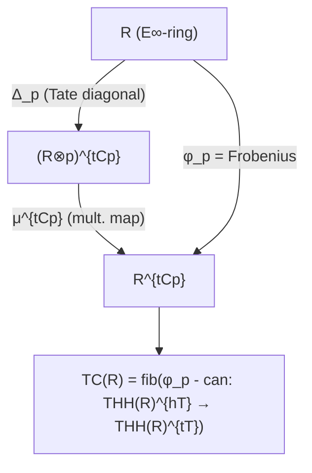
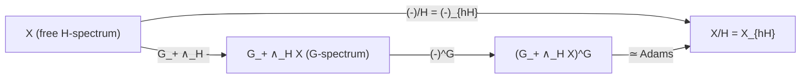

# Fixed-Point Spectra

## Table of Contents

- [[#1. Three Flavors at a Glance|1. Three Flavors at a Glance]]
- [[#2. Families of Subgroups and Classifying Spaces|2. Families of Subgroups and Classifying Spaces]]
  - [[#2.1 Families of Subgroups|2.1 Families of Subgroups]]
  - [[#2.2 Classifying Spaces and the Cofiber Sequence|2.2 Classifying Spaces and the Cofiber Sequence]]
  - [[#2.3 The Universal Space for a Family|2.3 The Universal Space for a Family]]
- [[#3. Categorical Fixed Points|3. Categorical Fixed Points]]
  - [[#3.1 Definition and Levelwise Construction|3.1 Definition and Levelwise Construction]]
  - [[#3.2 Adjunction Properties|3.2 Adjunction Properties]]
  - [[#3.3 Failure of Homotopy-Invariance|3.3 Failure of Homotopy-Invariance]]
  - [[#3.4 Exercises|3.4 Exercises]]
- [[#4. Homotopy Fixed Points|4. Homotopy Fixed Points]]
  - [[#4.1 Definition|4.1 Definition]]
  - [[#4.2 Homotopy Invariance|4.2 Homotopy Invariance]]
  - [[#4.3 The Homotopy Fixed Point Spectral Sequence|4.3 The Homotopy Fixed Point Spectral Sequence]]
  - [[#4.4 Exercises|4.4 Exercises]]
- [[#5. Geometric Fixed Points|5. Geometric Fixed Points]]
  - [[#5.1 Definition via the Cofiber Sequence|5.1 Definition via the Cofiber Sequence]]
  - [[#5.2 Monoidality and the Sphere Spectrum|5.2 Monoidality and the Sphere Spectrum]]
  - [[#5.3 Change of Group for Geometric Fixed Points|5.3 Change of Group for Geometric Fixed Points]]
  - [[#5.4 Exercises|5.4 Exercises]]
- [[#6. The Tate Construction|6. The Tate Construction]]
  - [[#6.1 Historical Origins: Tate Cohomology|6.1 Historical Origins: Tate Cohomology]]
  - [[#6.2 The Norm Map: ∞-Categorical Construction|6.2 The Norm Map: ∞-Categorical Construction]]
  - [[#6.3 Definition of the Tate Spectrum|6.3 Definition of the Tate Spectrum]]
  - [[#6.4 Tate Acyclicity and the Verdier Quotient Perspective|6.4 Tate Acyclicity and the Verdier Quotient Perspective]]
  - [[#6.5 Canonical Lax Symmetric Monoidal Structure|6.5 Canonical Lax Symmetric Monoidal Structure]]
  - [[#6.6 The Tate Orbit and Fixpoint Lemmas|6.6 The Tate Orbit and Fixpoint Lemmas]]
  - [[#6.7 The Tate Diagonal|6.7 The Tate Diagonal]]
  - [[#6.8 The Tate Diagram|6.8 The Tate Diagram]]
  - [[#6.9 The Segal Conjecture|6.9 The Segal Conjecture]]
  - [[#6.10 Exercises|6.10 Exercises]]
- [[#7. The Adams Isomorphism|7. The Adams Isomorphism]]
  - [[#7.1 Statement|7.1 Statement]]
  - [[#7.2 Proof Sketch|7.2 Proof Sketch]]
  - [[#7.3 Consequences and the tom Dieck Splitting|7.3 Consequences and the tom Dieck Splitting]]
  - [[#7.4 Exercises|7.4 Exercises]]
- [[#8. Examples: $C_2$-Spectra|8. Examples: C2-Spectra]]
  - [[#8.1 Fixed Points of $H\underline{\mathbb{Z}}$|8.1 Fixed Points of HZ]]
  - [[#8.2 Geometric Fixed Points of $MU_\mathbb{R}$|8.2 Geometric Fixed Points of MU_R]]
  - [[#8.3 The $C_2$-Tate Sequence for $H\underline{\mathbb{Z}}$|8.3 The C2-Tate Sequence for HZ]]
- [[#References|References]]

---

## 1. Three Flavors at a Glance 🔑

Given a finite group $G$, a subgroup $H \leq G$, and a genuine $G$-spectrum $E$, there are three natural ways to extract an "H-fixed part" of $E$, each landing in $\mathrm{Sp}^{W_G H}$ where $W_G H = N_G H / H$ is the Weyl group:

| Functor | Notation | Definition | Homotopy-invariant? | Monoidal? |
|---------|----------|------------|---------------------|-----------|
| Categorical fixed points | $E^H$ | $(E^H)(V) = E(V)^H$ | ❌ (only on fibrants) | ✅ lax |
| Homotopy fixed points | $E^{hH}$ | $F(EH_+, E)^H$ | ✅ | ❌ (not symmetric monoidal) |
| Geometric fixed points | $\Phi^H E$ | $(\widetilde{E\mathcal{P}(H)} \wedge E)^H$ | ✅ | ✅ strong |

Here $EH$ is a contractible free $H$-space and $\widetilde{E\mathcal{P}(H)}$ is the cofiber of $E\mathcal{P}(H)_+ \to S^0$ for the family of *proper* subgroups of $H$. Each functor sees different aspects of the $H$-equivariant structure of $E$.

> [!INFO] Historical context
> The categorical fixed-point functor is the oldest and most naïve construction, going back to Lewis–May–Steinberger. The homotopy fixed points emerged from the study of descent problems and group cohomology in the 1980s. The geometric fixed points were isolated by tom Dieck and then systematized by Greenlees–May in their 1995 memoir on generalized Tate cohomology. The interplay between all three is the key organizing principle of modern equivariant stable homotopy theory.

The three functors are related by the *Tate diagram*, a homotopy-pushout square

```tikz
\usepackage{tikz-cd}
\begin{document}
\begin{tikzcd}[row sep=large, col sep=large]
E^H \arrow[r, "\rho"] \arrow[d, "\pi"] & E^{hH} \arrow[d] \\
\Phi^H E \arrow[r] & E^{tH}
\end{tikzcd}
\end{document}
```

where $E^{tH}$ is the *Tate spectrum*, the map $\rho$ is the natural restriction from categorical to homotopy fixed points, and $\pi$ is the comparison from categorical to geometric. The rows and columns of this square are cofiber sequences.

---

## 2. Families of Subgroups and Classifying Spaces 📐

### 2.1 Families of Subgroups

**Definition (Family of Subgroups).** A *family* $\mathcal{F}$ of subgroups of $G$ is a collection of subgroups that is:
1. *closed under conjugation*: if $H \in \mathcal{F}$ and $g \in G$, then ${}^g H = g H g^{-1} \in \mathcal{F}$;
2. *closed under passage to subgroups*: if $H \in \mathcal{F}$ and $K \leq H$, then $K \in \mathcal{F}$.

The most important families for fixed-point theory are:

| Family | Notation | Members |
|--------|----------|---------|
| Trivial | $\mathcal{F}_0 = \{e\}$ | only the trivial subgroup |
| All proper subgroups of $H$ | $\mathcal{P}(H)$ | $\{K \leq H : K \neq H\}$ |
| All subgroups | $\mathcal{A}$ | every $K \leq G$ |
| All subgroups of order $< p^n$ | $\mathcal{F}_{< p^n}$ | used in Tate spectra for $p$-groups |

> [!NOTE] Why proper subgroups?
> The family $\mathcal{P}(H)$ is the correct choice for defining $\Phi^H$. The cofiber of $E\mathcal{P}(H)_+ \to S^0$ "kills" the contribution of all proper $H$-subgroups, leaving only the "genuinely $H$-equivariant" part. Using the full family $\mathcal{A}$ gives $\widetilde{E\mathcal{A}} \simeq *$, which would kill everything.

### 2.2 Classifying Spaces and the Cofiber Sequence

**Definition ($E\mathcal{F}$ and $\widetilde{E\mathcal{F}}$).** For a family $\mathcal{F}$, the *classifying space* $E\mathcal{F}$ is a $G$-CW complex (unique up to $G$-homotopy equivalence) satisfying:
$$
(E\mathcal{F})^H \simeq \begin{cases} * & \text{if } H \in \mathcal{F} \\ \emptyset & \text{if } H \notin \mathcal{F}. \end{cases}
$$

The *reduced classifying space* $\widetilde{E\mathcal{F}}$ is defined by the cofiber sequence of based $G$-spaces:
$$E\mathcal{F}_+ \longrightarrow S^0 \longrightarrow \widetilde{E\mathcal{F}},$$
where $E\mathcal{F}_+$ denotes $E\mathcal{F}$ with a disjoint basepoint, and the map $E\mathcal{F}_+ \to S^0$ collapses $E\mathcal{F}$ to the non-basepoint.

**Lemma.** The fixed-point spaces of $\widetilde{E\mathcal{F}}$ satisfy:
$$
(\widetilde{E\mathcal{F}})^H \simeq \begin{cases} S^0 & \text{if } H \notin \mathcal{F} \\ * & \text{if } H \in \mathcal{F}. \end{cases}
$$

*Proof sketch.* From the cofiber sequence $(E\mathcal{F}_+)^H \to (S^0)^H \to (\widetilde{E\mathcal{F}})^H$. When $H \in \mathcal{F}$, $(E\mathcal{F})^H \simeq *$, so $(E\mathcal{F}_+)^H \simeq S^0$, and the map $S^0 \to S^0$ is the identity, making the cofiber $*$. When $H \notin \mathcal{F}$, $(E\mathcal{F})^H = \emptyset$, so $(E\mathcal{F}_+)^H \simeq S^0_+\mid_{H\text{-fixed}} = \{*\}_+ = S^0$... more precisely $(E\mathcal{F}_+)^H = (E\mathcal{F})^H_+ = \emptyset_+ = \{*\} = S^{-1}_+$... let me be careful: $(E\mathcal{F}_+)^H = (E\mathcal{F})^H \sqcup \{*_{\text{base}}\}$. When $(E\mathcal{F})^H = \emptyset$, we get $(E\mathcal{F}_+)^H = \{*\}$, so the map $\{*\} \to S^0$ includes the basepoint, and the cofiber is $S^0/\{*\} = S^0$. $\square$

### 2.3 The Universal Space for a Family

For the family $\mathcal{F}_0 = \{e\}$ (just the trivial subgroup), $E\mathcal{F}_0 = EG$ is the universal free $G$-space — the total space of the universal principal $G$-bundle $EG \to BG$. The reduced version $\widetilde{EG}$ satisfies:

$$(\widetilde{EG})^H \simeq \begin{cases} S^0 & \text{if } H \neq e \\ * & \text{if } H = e. \end{cases}$$

For the family $\mathcal{P}(H) = \{K \leq H : K \neq H\}$ of proper $H$-subgroups, $E\mathcal{P}(H)$ is contractible as an $H$-space with the property that its $K$-fixed points are contractible for all $K \subsetneq H$ and empty for $K = H$. This is sometimes denoted $\widetilde{EG}$ when $H = G$ and $G$ is understood.

> [!EXAMPLE] $E\mathcal{P}(C_p)$ for a cyclic group of prime order
> For $H = C_p$ (cyclic of prime order), the only proper subgroup is $\{e\}$. So $\mathcal{P}(C_p) = \{e\}$ and $E\mathcal{P}(C_p) = EC_p \simeq S^\infty$ with the antipodal-type free $C_p$-action. The cofiber sequence is:
> $$EC_{p+} \longrightarrow S^0 \longrightarrow \widetilde{EC_p}$$
> where $\widetilde{EC_p}^{C_p} \simeq S^0$ and $\widetilde{EC_p}^e \simeq *$.

---

## 3. Categorical Fixed Points 📐

### 3.1 Definition and Levelwise Construction

**Definition (Categorical Fixed Points).** For a genuine $G$-spectrum $E \in \mathrm{Sp}^G_O$ and a subgroup $H \leq G$, the *categorical fixed-point spectrum* $E^H$ is the $W_G H$-spectrum defined levelwise:

$$(E^H)(V^{W_G H}) = E(V)^H,$$

where $V^{W_G H}$ denotes the $W_G H$-representation obtained from a $W_G H$-representation $V$ (viewed as a $G$-representation via $N_G H \twoheadrightarrow W_G H$), and $(-)^H$ denotes the $H$-fixed-point subspace.

More concretely, for an orthogonal $G$-spectrum $E$:
$$E^H = (E)^H \in \mathrm{Sp}^{W_G H}_O, \quad (E^H)(V) = E(V)^H,$$
with structure maps induced by the $H$-fixed parts of the structure maps of $E$.

> [!NOTE] $G$-fixed points land in non-equivariant spectra
> When $H = G$, the Weyl group $W_G G = N_G G / G = G/G = \{e\}$, so $E^G$ is a non-equivariant spectrum. This is the "underlying spectrum of fixed points" functor $(-)^G: \mathrm{Sp}^G \to \mathrm{Sp}$.

### 3.2 Adjunction Properties

The categorical fixed-point functor $(-)^H: \mathrm{Sp}^G \to \mathrm{Sp}^{W_G H}$ is *right adjoint* to the induction functor $G_+ \wedge_{N_G H} -: \mathrm{Sp}^{N_G H} \to \mathrm{Sp}^G$ (after restriction from $G$ to $N_G H$ and then to $H$). More precisely:

**Proposition (Fixed Points as Right Adjoint).** For $E \in \mathrm{Sp}^G$ and $F \in \mathrm{Sp}^{W_G H}$, there is a natural isomorphism

$$[G/H_+ \wedge F, E]_G \cong [F, E^H]_{W_G H},$$

where $F$ is viewed as a $G$-spectrum via the quotient $G \to W_G H$ on the left, and $E^H$ has its $W_G H$-action on the right.

This adjunction is the *categorical* (non-derived) adjunction; it holds at the point-set level.

### 3.3 Failure of Homotopy-Invariance

The categorical fixed-point functor is *not* homotopy-invariant: a $G$-weak equivalence $f: E \to E'$ does not in general induce a weak equivalence $f^H: E^H \to (E')^H$ unless $E$ and $E'$ are fibrant.

> [!DANGER] The canonical counterexample
> Let $G = C_2$ and let $f: EC_2 \to *$ be the collapse of the free $C_2$-space. After suspension, $f$ induces an equivalence $\Sigma^\infty_+ EC_2 \to \mathbb{S}$ of underlying spectra (non-equivariantly). But:
> - $(\Sigma^\infty_+ EC_2)^{C_2} = \Sigma^\infty_+(EC_2^{C_2}) = \Sigma^\infty_+(\emptyset) = *$
> - $(\mathbb{S})^{C_2} = \mathbb{S}$
>
> So $f^{C_2}: * \to \mathbb{S}$ is *not* a weak equivalence, even though $f$ is a $C_2$-weak equivalence (in fact, a non-equivariant equivalence). This shows that categorical fixed points see the $H$-fixed structure very sensitively.

**Proposition.** The categorical fixed-point functor $(-)^H$ is homotopy-invariant on the full subcategory of $H$-fibrant $G$-spectra — that is, $G$-spectra $E$ for which $E^K$ is an $\Omega$-spectrum for all $K \leq H$.

In practice, to compute $\pi_*^H(E)$ one computes $\pi_*(R_f(E)^H)$ where $R_f E$ is a fibrant replacement of $E$ in the genuine model structure.

> [!QUESTION] Exercise 1
> *The levelwise fixed-point formula.* Let $G = C_2$ and let $E$ be an orthogonal $C_2$-spectrum with levels $E(n) = E(\mathbb{R}^n)$ for the trivial representation. Compute $E^{C_2}(n)$ and explain why $E^{C_2}$ need not be an $\Omega$-spectrum even when $E$ is.

> [!TIP]- Solution to Exercise 1
> **Key insight:** $(E^{C_2})(n) = E(\mathbb{R}^n)^{C_2}$, the fixed subspace of the $C_2$-action on each level. The structure maps of $E^{C_2}$ are the $C_2$-fixed parts of those of $E$, so the adjoint structure map is $\sigma^{ad}: E(\mathbb{R}^n)^{C_2} \to \Omega E(\mathbb{R}^{n+1})^{C_2}$.
>
> **Why it may fail to be an $\Omega$-spectrum:** Even if $E$ is an $\Omega$-spectrum ($E(\mathbb{R}^n) \xrightarrow{\sim} \Omega E(\mathbb{R}^{n+1})$), taking $C_2$-fixed points is only right-exact (not left-exact in the homotopy sense), so $\Omega(-)^{C_2} \neq (\Omega(-))^{C_2}$ in general. Concretely: the homotopy fixed points of a loop space are the loop space of the homotopy fixed points (by the fact that $F(EH_+, -)$ commutes with $\Omega$), but the *categorical* fixed points do not satisfy $\Omega(E^{C_2}) \simeq (\Omega E)^{C_2}$. A counterexample: if $E = \Sigma^\infty_+ EC_2$ (which is an $\Omega$-spectrum after fibrant replacement), then $E^{C_2}(n) = (S^n \wedge EC_{2+})^{C_2} \simeq *$ since $EC_2$ is a free $C_2$-space, yet $E^{C_2}$ should loop down correctly only after fibrant replacement.

### 3.4 Exercises

> [!QUESTION] Exercise 2
> *Categorical fixed points and Mackey functors.* Let $E$ be a fibrant genuine $G$-spectrum and $H \leq K \leq G$. Show that there is a natural map $E^K \to E^H$ (restriction) and that together with the transfer map these assemble into the Mackey functor structure on $\pi_n(E^-)$. What is the relationship between $\pi_n(E^H)$ and $\underline{\pi}_n(E)(G/H)$?

> [!TIP]- Solution to Exercise 2
> **Key insight:** By definition, $\underline{\pi}_n(E)(G/H) = [S^n \wedge G/H_+, E]^G = [S^n, E]^H = \pi_n(E^H)$ (using the $H$-fixed-point adjunction). So the Mackey functor value at $G/H$ *is* the $n$-th homotopy group of the categorical $H$-fixed-point spectrum.
>
> **Sketch:** The restriction map $\mathrm{res}^K_H: E^K \to E^H$ is the inclusion of $K$-fixed points into $H$-fixed points (since $K$-fixed $\Rightarrow$ $H$-fixed for $H \leq K$). The transfer $\mathrm{tr}^K_H: E^H \to E^K$ is the stable transfer, constructed via the Pontryagin–Thom collapse on $K/H$. These satisfy the Mackey double coset formula by the geometric decomposition of $K/H \times_{K/e} K/L$. The Mackey axiom $\mathrm{tr} \circ \mathrm{res}(x) = \sum_{h \in K/H} h \cdot x$ for a free orbit follows directly.

> [!QUESTION] Exercise 3
> *The norm cofiber sequence.* For $G = C_p$ and any $G$-spectrum $E$, the cofiber sequence $EC_{p+} \to S^0 \to \widetilde{EC_p}$ induces a cofiber sequence after smashing with $E$ and taking $C_p$-fixed points:
> $$E_{hC_p} \longrightarrow E^{C_p} \longrightarrow \Phi^{C_p} E.$$
> Use this to compute the categorical fixed points of $\mathbb{S}$ from the knowledge that $\mathbb{S}_{hC_p} \simeq \Sigma^\infty_+(BC_p)$ and $\Phi^{C_p} \mathbb{S} \simeq \mathbb{S}$.

> [!TIP]- Solution to Exercise 3
> **Key insight:** The cofiber sequence gives $\mathbb{S}^{C_p}$ as the "middle term" between $\mathbb{S}_{hC_p}$ and $\Phi^{C_p}\mathbb{S}$.
>
> **Sketch:** From $EC_{p+} \wedge \mathbb{S} \to \mathbb{S} \to \widetilde{EC_p} \wedge \mathbb{S}$, taking $C_p$-fixed points:
> $(EC_{p+} \wedge \mathbb{S})^{C_p} \simeq (EC_{p+})^{C_p} \wedge_{C_p} \mathbb{S} = \Sigma^\infty_+(BC_p)$ (since $EC_p$ is free, $(EC_{p+} \wedge \mathbb{S})^{C_p} \simeq EC_{p+} \wedge_{C_p} \mathbb{S} = \Sigma^\infty_+ BC_p$, the homotopy orbits).
> The middle term is $\mathbb{S}^{C_p}$ (the sphere spectrum with $C_p$-fixed structure).
> The right term is $(\widetilde{EC_p} \wedge \mathbb{S})^{C_p} = \Phi^{C_p}\mathbb{S} \simeq \mathbb{S}$.
> So $\mathbb{S}^{C_p}$ sits in a cofiber sequence $\Sigma^\infty_+ BC_p \to \mathbb{S}^{C_p} \to \mathbb{S}$. This is the tom Dieck splitting in disguise: $\Sigma^\infty_+ BC_p \vee \mathbb{S} \simeq \mathbb{S}^{C_p}$ after splitting.

---

## 4. Homotopy Fixed Points 💡

### 4.1 Definition

**Definition (Homotopy Fixed Points).** For $E \in \mathrm{Sp}^G$ and $H \leq G$, the *homotopy fixed-point spectrum* is

$$E^{hH} = F(EH_+, E)^H,$$

the categorical $H$-fixed points of the *function spectrum* from $EH_+$ to $E$. Here $EH = E\mathcal{F}_0 H$ is any contractible free $H$-CW complex (the choice does not matter up to homotopy), and $F(-, -)$ denotes the internal hom in $\mathrm{Sp}^G_O$.

Equivalently, viewing $E$ as an $H$-spectrum via restriction:
$$E^{hH} = \mathrm{Map}_H(EH_+, E) = \mathrm{holim}_{H} E,$$
the homotopy limit of the constant $H$-diagram with value $E$.

> [!NOTE] Relation to group cohomology
> When $E = H\underline{M}$ is an Eilenberg–Mac Lane $G$-spectrum for a $\mathbb{Z}[G]$-module $M$ (viewed as a naive $G$-spectrum), $\pi_{-n}(H M^{hH}) \cong H^n(H; M)$ — ordinary group cohomology. Homotopy fixed points are the "derived fixed points" in the same way group cohomology is derived group-theoretic invariants.

### 4.2 Homotopy Invariance

**Proposition.** The homotopy fixed-point functor $(-)^{hH}: \mathrm{Sp}^G \to \mathrm{Sp}^{W_G H}$ is homotopy-invariant: a $G$-weak equivalence $E \xrightarrow{\sim} E'$ induces a weak equivalence $E^{hH} \xrightarrow{\sim} (E')^{hH}$.

*Proof sketch.* Since $EH$ is a free $H$-CW complex, $EH_+$ is cofibrant as an $H$-space. The functor $F(EH_+, -)$ preserves weak equivalences between fibrant objects (it is right Quillen), and the categorical fixed-point functor $(-)^H$ preserves equivalences between fibrant $H$-spectra. Combining: $(-)^{hH} = F(EH_+, -)^H$ is homotopy-invariant on all objects (since $EH_+$ is cofibrant and the functor is derived). $\square$

The contrast with categorical fixed points is sharp: the whole point of $EH_+$ is to provide a "fattening" of the point that makes the fixed-point construction homotopy-invariant.

### 4.3 The Homotopy Fixed Point Spectral Sequence

The *homotopy fixed point spectral sequence* (HFPSS) is the main computational tool for $E^{hH}$.

**Theorem (HFPSS).** For $E \in \mathrm{Sp}^H$ and a finite group $H$, there is a strongly convergent spectral sequence

$$E_2^{p,q} = H^p(H;\, \pi_q(E)) \;\Longrightarrow\; \pi_{q-p}(E^{hH}),$$

where $H^p(H; \pi_q(E))$ is group cohomology with coefficients in the $H$-module $\pi_q(E)$ (with $H$-action induced by the $H$-action on $E$).

> [!INFO] Source of the spectral sequence
> The HFPSS arises from the Bousfield–Kan spectral sequence for the homotopy limit $\mathrm{holim}_H E$. More precisely, one uses the bar resolution of $\mathbb{Z}[H]$ to build a simplicial resolution of $EH$ as a free $H$-space:
> $$EH \simeq |B_\bullet(H, H, *)| = |H^{\bullet+1}|,$$
> and the induced cosimplicial spectrum $F(B_\bullet(H, H, *)_+, E)$ has tot $\simeq E^{hH}$. The Bousfield–Kan $E_2$ page computes as $H^*(H; \pi_*(E))$.

> [!EXAMPLE] HFPSS for $E = H\mathbb{Z}$ with $H = C_2$
> Take $E = H\mathbb{Z}$ (ordinary Eilenberg–Mac Lane spectrum) with trivial $C_2$-action. Then $\pi_q(E) = \mathbb{Z}$ in degree 0 and 0 otherwise. The $E_2$-page is $E_2^{p,0} = H^p(C_2; \mathbb{Z})$. By standard group cohomology:
> $$H^p(C_2; \mathbb{Z}) = \begin{cases} \mathbb{Z} & p = 0 \\ 0 & p \text{ odd} \\ \mathbb{Z}/2 & p \text{ even}, p > 0. \end{cases}$$
> The spectral sequence converges to $\pi_{-p}(H\mathbb{Z}^{hC_2})$. There are no differentials (all classes are in $q = 0$), giving $\pi_*(H\mathbb{Z}^{hC_2}) = H^{-*}(C_2; \mathbb{Z})$.

### 4.4 Exercises

> [!QUESTION] Exercise 4
> *Homotopy fixed points and loops.* Show that there is a natural equivalence $(ΩE)^{hH} \simeq \Omega(E^{hH})$ for any $G$-spectrum $E$ and $H \leq G$. Deduce that homotopy fixed points commute with all small homotopy limits.

> [!TIP]- Solution to Exercise 4
> **Key insight:** $F(EH_+, -)$ commutes with $\Omega = F(S^1, -)$ since both are instances of the internal hom — $F(EH_+ \wedge S^1, E) = F(S^1, F(EH_+, E))$.
>
> **Sketch:** $(\Omega E)^{hH} = F(EH_+, \Omega E)^H = F(EH_+, F(S^1, E))^H \cong F(S^1, F(EH_+, E))^H \cong \Omega(F(EH_+, E)^H) = \Omega(E^{hH})$, using the adjunction $F(A, F(B, C)) \cong F(A \wedge B, C) \cong F(B, F(A, C))$. More generally, $F(EH_+, \mathrm{holim}_I X_i)^H \simeq \mathrm{holim}_I F(EH_+, X_i)^H$ since holim commutes with function spectra (or more precisely, $(-)^{hH}$ is a right adjoint and thus preserves limits).

> [!QUESTION] Exercise 5
> *The norm map.* For $H$ a finite group and $E \in \mathrm{Sp}^H$, there is a natural *norm map* $N: E_{hH} \to E^{hH}$ from homotopy orbits to homotopy fixed points. Describe this map and show that its cofiber is the Tate spectrum $E^{tH}$. What does $N$ look like for $E = H\mathbb{Z}$ with trivial $C_p$-action?

> [!TIP]- Solution to Exercise 5
> **Key insight:** The norm map $N$ arises from a natural map $EH_+ \to (EH_+)^\vee$ (a "duality" map for a finite group), which after smashing with $E$ and passing to fixed points gives $N: E_{hH} \to E^{hH}$.
>
> **Sketch:** For $H$ finite, there is a $G$-equivariant map $EH_+ \wedge EH_+ \to EH_+$ (multiplication, after choosing a model), and the norm map is constructed from the "fold" map $EH_+ \wedge E \to E^{\wedge |H|}$ followed by taking appropriate fixed points. The cofiber of $N$ is $E^{tH}$ by definition in the Nikolaus–Scholze formalism.
>
> For $E = H\mathbb{Z}$ with trivial $C_p$-action: $E_{hC_p} = H\mathbb{Z}_{hC_p}$ has $\pi_*(H\mathbb{Z}_{hC_p}) = H_*(C_p; \mathbb{Z})$, the group homology. The norm map $N: H_*(C_p; \mathbb{Z}) \to H^{-*}(C_p; \mathbb{Z})$ is the cap product with the fundamental class — this is precisely the Tate cohomology norm map, and the cofiber is the Tate cohomology spectrum $H\hat{H}^*(C_p; \mathbb{Z})$ with $\hat{H}^n(C_p; \mathbb{Z}) = \mathbb{Z}/p$ for all $n \in \mathbb{Z}$.

> [!QUESTION] Exercise 6
> *HFPSS and the Serre spectral sequence.* For a $G$-space $X$ (viewed as a $G$-spectrum via $\Sigma^\infty_+$), show that the HFPSS for $(\Sigma^\infty_+ X)^{hG}$ agrees (on the $E_2$-page) with the Serre spectral sequence for the fibration $X \to EG \times_G X \to BG$.

> [!TIP]- Solution to Exercise 6
> **Key insight:** $(\Sigma^\infty_+ X)^{hG} = F(EG_+, \Sigma^\infty_+ X)^G \simeq \Sigma^\infty_+(F_G(EG_+, X_+)) = \Sigma^\infty_+(EG \times_G X) = \Sigma^\infty_+ EG_G X$ (Borel construction).
>
> **Sketch:** By the suspension spectrum adjunction, $F(EG_+, \Sigma^\infty_+ X)^G \simeq \Sigma^\infty_+(X^{hG}_{\mathrm{space}})$ where $X^{hG}_{\mathrm{space}} = \mathrm{Map}_G(EG, X) = EG \times_G X$ (the Borel construction). The HFPSS for this reads:
> $E_2^{p,q} = H^p(G; \pi_q(\Sigma^\infty_+ X)) = H^p(G; \tilde{H}_q(X; \mathbb{Z}))$ (for $q \neq 0$) plus a $\mathbb{Z}$ in the $q=0$ column.
> The Serre spectral sequence for $X \to EG \times_G X \to BG$ has $E_2^{p,q} = H^p(BG; \mathcal{H}^q(X; \mathbb{Z})) = H^p(G; H^q(X; \mathbb{Z}))$ when the coefficients form a constant local system. These agree when $G$ acts trivially on $H_q(X)$; in general, both spectral sequences use twisted coefficients in the same way.

---

## 5. Geometric Fixed Points 🔑

### 5.1 Definition via the Cofiber Sequence

**Definition (Geometric Fixed Points).** For $E \in \mathrm{Sp}^G$ and $H \leq G$, the *geometric fixed-point spectrum* is

$$\Phi^H E = \left(\widetilde{E\mathcal{P}(H)} \wedge E\right)^H,$$

where $\mathcal{P}(H) = \{K \leq H : K \subsetneq H\}$ is the family of proper subgroups of $H$, and $(-)^H$ denotes categorical fixed points (applied after fibrant replacement).

> [!WARNING] Careful with which group is acting
> Strictly speaking, $\widetilde{E\mathcal{P}(H)}$ is an $H$-space (or $G$-space via restriction), and $\widetilde{E\mathcal{P}(H)} \wedge E$ is a $G$-spectrum (smash product in $\mathrm{Sp}^G$). The categorical $H$-fixed points then land in $\mathrm{Sp}^{W_G H}$. When $H = G$, $\mathcal{P}(G)$ is all proper subgroups of $G$, and $\Phi^G E$ is a non-equivariant spectrum.

From the cofiber sequence $E\mathcal{P}(H)_+ \to S^0 \to \widetilde{E\mathcal{P}(H)}$, smashing with $E$ and taking $H$-fixed points gives a cofiber sequence:

$$\left(E\mathcal{P}(H)_+ \wedge E\right)^H \longrightarrow E^H \longrightarrow \Phi^H E.$$

This displays $\Phi^H E$ as the *cofiber* of the natural map from $E\mathcal{P}(H)$-homotopy-orbits to the categorical fixed points.

**Equivalently**, one characterizes $\widetilde{E\mathcal{P}(H)}$ by its fixed points:
$$(\widetilde{E\mathcal{P}(H)})^K \simeq \begin{cases} S^0 & \text{if } K = H \\ * & \text{if } K \subsetneq H. \end{cases}$$

So $\widetilde{E\mathcal{P}(H)} \wedge E$ "kills" the $K$-equivariant information for all $K \subsetneq H$, and the $H$-fixed points see only the "purely $H$-equivariant" part.

> [!INFO] Geometric vs. categorical: the key difference
> The categorical fixed points $E^H$ see the full $H$-fixed-point data, including the action of all *subgroups* of $H$. The geometric fixed points $\Phi^H E$ first quotient out all proper-$H$-subgroup information via $\widetilde{E\mathcal{P}(H)}$, then take $H$-fixed points. This is why $\Phi^H$ "knows" about equivariant periodicity in a way that $E^H$ alone does not: the slice cells $G_+ \wedge_H S^{m\rho_H}$ become ordinary sphere spectra after applying $\Phi^H$.

### 5.2 Monoidality and the Sphere Spectrum

**Theorem (Monoidality of Geometric Fixed Points).** The functor $\Phi^H: \mathrm{Sp}^G \to \mathrm{Sp}^{W_G H}$ is *strong symmetric monoidal*:

$$\Phi^H(E \wedge F) \simeq \Phi^H E \wedge \Phi^H F, \quad \Phi^H \mathbb{S} \simeq \mathbb{S}.$$

*Proof sketch.* By the formula $\Phi^H E = (\widetilde{E\mathcal{P}(H)} \wedge E)^H$ and the fact that $\widetilde{E\mathcal{P}(H)}$ is a commutative $H$-ring spectrum (as the cofiber of a unit map for a Thom isomorphism), the smash product distributes:
$$\Phi^H(E \wedge F) = (\widetilde{E\mathcal{P}(H)} \wedge E \wedge F)^H \simeq (\widetilde{E\mathcal{P}(H)} \wedge E)^H \wedge (\widetilde{E\mathcal{P}(H)} \wedge F)^H,$$
where the last step uses the diagonal $\widetilde{E\mathcal{P}(H)} \to \widetilde{E\mathcal{P}(H)} \wedge \widetilde{E\mathcal{P}(H)}$ (since $\widetilde{E\mathcal{P}(H)}$ is idempotent for the smash product: $\widetilde{E\mathcal{P}(H)} \wedge \widetilde{E\mathcal{P}(H)} \simeq \widetilde{E\mathcal{P}(H)}$). For the sphere spectrum: $\Phi^H \mathbb{S} = (\widetilde{E\mathcal{P}(H)})^H = S^0$ (from the fixed-point formula), and $(\Phi^H \mathbb{S})_V = (S^V)^H = S^{V^H}$, which is exactly the level spaces of $\mathbb{S}$ as a $W_G H$-spectrum. $\square$

**Corollary.** $\Phi^H$ sends commutative $G$-ring spectra to commutative $W_G H$-ring spectra.

**Key computations of geometric fixed points:**

$$\Phi^H(\Sigma^\infty_+ G/K) \simeq \begin{cases} \Sigma^\infty_+ W_G H & \text{if } K \sim_G H \text{ (conjugate to } H) \\ * & \text{if } K \not\sim_G H. \end{cases}$$

*Proof:* $G/K$ is a transitive $G$-set. Its $H$-fixed points $(G/K)^H = \{gK : g^{-1}Hg \leq K\}$; this is non-empty iff $H$ is conjugate (in $G$) into $K$. The geometric fixed points are controlled by $\Phi^H(\Sigma^\infty_+ G/K) = \Sigma^\infty_+(G/K)^H_{\text{geometric}} = \Sigma^\infty_+ (G/K)^H$ when $K \sim_G H$ and $*$ otherwise (since all proper-$H$-subgroup fixed points are killed). $\square$

### 5.3 Change of Group for Geometric Fixed Points

For a subgroup $K \leq H \leq G$, there is a transitivity formula:

$$\Phi^H \simeq \Phi^{H/K} \circ \Phi^K$$

when $K \trianglelefteq H$ is normal in $H$ (so $H/K$ is a group acting on $\Phi^K E$). More generally, geometric fixed points satisfy:

**Proposition (Wirthmuller compatibility).** For $H \leq G$ and $E \in \mathrm{Sp}^H$, there is a natural equivalence

$$\Phi^H(G_+ \wedge_H E) \simeq W_G H_+ \wedge_{\{e\}} \Phi^H E,$$

where $W_G H$ acts on $\Phi^H E$ via the residual Weyl group action. In particular, when $H = G$:
$$\Phi^G(G_+ \wedge_G E) = \Phi^G(E).$$

### 5.4 Exercises

> [!QUESTION] Exercise 7
> *Geometric fixed points and representation spheres.* For $G = C_p$ and the sign representation $\lambda$ (the standard 1-dimensional complex $C_p$-representation, or more precisely a 2-dimensional real representation), compute $\Phi^{C_p}(S^\lambda)$ where $S^\lambda$ is the representation sphere. More generally, for any $G$-representation $V$, show that $\Phi^H(S^V) \simeq S^{V^H}$.

> [!TIP]- Solution to Exercise 7
> **Key insight:** Geometric fixed points of a representation sphere is the sphere of the fixed-point subrepresentation.
>
> **Sketch:** $\Phi^H(S^V) = (\widetilde{E\mathcal{P}(H)} \wedge S^V)^H$. Since $\widetilde{E\mathcal{P}(H)}^K \simeq *$ for $K \subsetneq H$ and $\simeq S^0$ for $K = H$, we compute: $(\widetilde{E\mathcal{P}(H)} \wedge S^V)^H = S^{V^H}$ (the sphere of the $H$-fixed-point subspace of $V$, since $\widetilde{E\mathcal{P}(H)}^H = S^0$ "selects" only the $H$-fixed part). Alternatively by monoidality: $\Phi^H(S^V) = \Phi^H(\mathbb{S}^V) = (\Phi^H \mathbb{S})^V = \mathbb{S}^{V^H} = S^{V^H}$. For $G = C_p$ and $\lambda$ a non-trivial $C_p$-representation: $\lambda^{C_p} = 0$ (no fixed vectors), so $\Phi^{C_p}(S^\lambda) \simeq S^0$. This means geometric fixed points of a representation sphere with no fixed subspace gives $S^0$.

> [!QUESTION] Exercise 8
> *Idempotency of $\widetilde{EG}$.* Show that $\widetilde{EG} \wedge \widetilde{EG} \simeq \widetilde{EG}$ as $G$-spectra. Use this to prove that $\Phi^G \circ \Phi^G \simeq \Phi^G$ (geometric fixed points applied twice is the same as once) when $G = H$.

> [!TIP]- Solution to Exercise 8
> **Key insight:** $\widetilde{EG}$ is an idempotent object in the symmetric monoidal category of $G$-spectra because it is a localization at the non-free part.
>
> **Sketch:** From the fixed-point characterization: $(\widetilde{EG})^K \simeq S^0$ for $K \neq e$ and $\simeq *$ for $K = e$. Then $(\widetilde{EG} \wedge \widetilde{EG})^K \simeq (\widetilde{EG})^K \wedge (\widetilde{EG})^K \simeq S^0 \wedge S^0 = S^0$ for $K \neq e$, and $* \wedge * = *$ for $K = e$. Since a $G$-space is determined up to $G$-equivalence by its fixed-point spaces (by Elmendorf's theorem), $\widetilde{EG} \wedge \widetilde{EG} \simeq \widetilde{EG}$. Idempotency of $\Phi^G$: $\Phi^G(\Phi^G E) = \Phi^G((\widetilde{EG} \wedge E)^G) = (\widetilde{EG} \wedge (\widetilde{EG} \wedge E)^G)^G$. Since $(-)^G$ applied twice and $\widetilde{EG}$ is already "$G$-fixed at top level", this simplifies via the idempotency to $\simeq (\widetilde{EG} \wedge E)^G = \Phi^G E$.

---

## 6. The Tate Construction 📐

### 6.1 Historical Origins: Tate Cohomology

The name "Tate construction" traces directly to *Tate cohomology*, a $\mathbb{Z}$-graded cohomology theory for finite groups introduced by J. Tate in the early 1950s in the context of class field theory. Tate's insight was to "complete" ordinary group cohomology into a theory that works in *all* integer degrees — including negative ones — and that is naturally periodic for cyclic groups.

**Definition (Tate cohomology).** Let $G$ be a finite group, $M$ a $\mathbb{Z}[G]$-module. The *norm element* is $N = \sum_{g \in G} g \in \mathbb{Z}[G]$, giving an additive map $N: M \to M$ with $\mathrm{Im}(N) \subset M^G$. Tate cohomology is the $\mathbb{Z}$-graded abelian group defined by:

$$\hat{H}^n(G; M) = \begin{cases} H^n(G; M) & n \geq 1 \\ M^G / N(M) & n = 0 \\ \ker(N: M \to M) / I_G \cdot M & n = -1 \\ H_{-(n+1)}(G; M) & n \leq -2, \end{cases}$$

where $I_G = \ker(\mathbb{Z}[G] \to \mathbb{Z})$ is the augmentation ideal and $H_k(G; M)$ is ordinary group homology.

The definition splices together cohomology and homology via the *norm map*, which in the derived sense is the map

$$N: M_{hG}[-1] \longrightarrow M^G,$$

or more precisely the natural map between coinvariants and invariants induced by $\sum_{g \in G} g$. The Tate cohomology groups are precisely the homotopy groups of the *cofiber* of this norm map:

$$\hat{H}^n(G; M) = \pi_{-n}\left(\mathrm{cofib}\!\left(HM_{hG} \xrightarrow{N} HM^{hG}\right)\right).$$

> [!INFO] Why Tate cohomology in class field theory
> Tate used $\hat{H}^{-2}(G; \mathbb{Z}) \cong G^{\mathrm{ab}}$ (the abelianization of $G$) in the proof of the *Hochschild–Serre exact sequence* for class field theory. The key theorem — the "Tate theorem" in CFT — states that for a Galois extension $L/K$ with group $G$, if $\hat{H}^1(H; C_L) = 0$ and $|\hat{H}^0(H; C_L)| = [H:1]$ for all subgroups $H \leq G$ (where $C_L$ is the idèle class group), then $\hat{H}^n(G; C_L) \cong \hat{H}^{n-2}(G; \mathbb{Z})$ for all $n$. The cup product with the *fundamental class* $u \in \hat{H}^{-2}(G; \mathbb{Z})$ gives this periodicity.

**Key algebraic properties** of Tate cohomology that the spectral construction lifts:
1. *Periodicity for cyclic groups*: $\hat{H}^n(C_m; M) \cong \hat{H}^{n+2}(C_m; M)$ for all $n$, with $\hat{H}^0(C_m; \mathbb{Z}) = \mathbb{Z}/m$.
2. *Tate acyclicity*: $\hat{H}^n(G; \mathbb{Z}[G]) = 0$ for all $n$ — Tate cohomology vanishes on *induced* (free) modules.
3. *Long exact sequences*: a short exact sequence $0 \to M' \to M \to M'' \to 0$ gives a long exact sequence in $\hat{H}^*$.
4. *Künneth formula*: $\hat{H}^*(G; M \otimes N) \cong \hat{H}^*(G; M) \otimes_{H^*(G;\mathbb{Z})} H^*(G; N)$ in favorable cases.

The spectral Tate construction $E^{tG}$ is the direct categorification of all four of these properties to the $\infty$-category of spectra.

> [!EXAMPLE] Periodicity in action: $H\mathbb{Z}^{tC_p}$
> For $E = H\mathbb{Z}$ with trivial $C_p$-action, the Tate spectrum $H\mathbb{Z}^{tC_p}$ has
> $$\pi_n(H\mathbb{Z}^{tC_p}) = \hat{H}^{-n}(C_p; \mathbb{Z}) = \begin{cases} \mathbb{Z}/p & n \text{ even} \\ 0 & n \text{ odd.} \end{cases}$$
> So $H\mathbb{Z}^{tC_p}$ is 2-periodic with period generator in $\pi_2$. This is the spectral manifestation of the classical Tate periodicity for $C_p$.

### 6.2 The Norm Map: ∞-Categorical Construction

The modern treatment by Nikolaus–Scholze (2018) rebuilds the Tate construction from scratch in the $\infty$-categorical setting, giving a clean universal characterization. Their key move is to construct the *norm map* as a natural transformation in any *preadditive* $\infty$-category.

**Setup.** Let $\mathcal{C}$ be a *stable* $\infty$-category (additive, all finite limits and colimits exist, $\Omega: \mathcal{C} \to \mathcal{C}$ is an equivalence). For a finite group $G$, a $G$-equivariant object in $\mathcal{C}$ is a functor $BG \to \mathcal{C}$, where $BG$ is the one-object $\infty$-groupoid with $\pi_1 = G$. The $\infty$-category of $G$-equivariant objects is $\mathcal{C}^{BG} = \mathrm{Fun}(BG, \mathcal{C})$.

The *homotopy orbit* and *homotopy fixed point* functors are the colimit and limit over $BG$:
$$X_{hG} = \mathrm{colim}_{BG}\, X, \qquad X^{hG} = \lim_{BG}\, X.$$

**Definition (Norm Map, NS Definition I.1.10).** For a finite group $G$ and $X \in \mathcal{C}^{BG}$, the *norm map* is the natural transformation

$$\mathrm{Nm}_G: X_{hG} \longrightarrow X^{hG}$$

constructed as follows. Since $BG$ is a finite $\infty$-groupoid, the diagonal $\delta: BG \to BG \times BG$ is a *relatively finite* map. The norm is the composite

$$\mathrm{colim}_{BG}\, X \xrightarrow{\delta_!(\mathrm{id})} \mathrm{colim}_{BG \times BG}(p_1^* X) \xrightarrow{\sim} \lim_{BG}\, \mathrm{colim}_{BG}\, p_1^* X \xrightarrow{\varepsilon} \lim_{BG}\, X,$$

where the middle step uses the *Beck–Chevalley isomorphism* (base change along $BG \to *$), and the last step uses the counit of the $(\mathrm{colim}, \mathrm{res})$ adjunction along the fibers.

> [!NOTE] The Beck–Chevalley isomorphism
> The key formal input is the pullback square
> ```
> BG × BG ─→ BG
>    │           │
>    ↓           ↓
>   BG  ──→  *
> ```
> For a left Kan extension along a finite map (here $\delta_!$ along the diagonal), the Beck–Chevalley condition gives a natural isomorphism between left and right Kan extensions along the fibers. Since $BG$ is a $\pi$-finite space, all fibers of $\delta$ are equivalent to $G$ (viewed as a finite set), and summing over the $|G|$ elements of the fiber gives the algebraic norm $\sum_{g \in G} g$ at the level of homotopy groups.

**Proposition (NS Lemma I.1.8–I.1.9).** In any stable $\infty$-category $\mathcal{C}$:
1. The norm map $\mathrm{Nm}_G: X_{hG} \to X^{hG}$ exists naturally in $X \in \mathcal{C}^{BG}$.
2. When $\mathcal{C} = \mathrm{Ab}$ (discrete stable category) and $X = M$ is a $G$-module, $\mathrm{Nm}_G$ recovers the classical norm map $M_G \xrightarrow{\bar{N}} M^G$, $[m] \mapsto \sum_{g \in G} g \cdot m$.
3. $\mathrm{Nm}_G$ is natural in $\mathcal{C}$: any exact functor $F: \mathcal{C} \to \mathcal{D}$ carries $\mathrm{Nm}_G^{\mathcal{C}}$ to $\mathrm{Nm}_G^{\mathcal{D}}$.

**Comparison with the smash-product definition.** For $\mathcal{C} = \mathrm{Sp}$ (spectra), the norm map $\mathrm{Nm}_G: X_{hG} \to X^{hG}$ coincides with the classical map induced by the $G$-equivariant map $EG_+ \to S^0$ (collapse of the free space):

$$X_{hG} = (EG_+ \wedge X)^G \xrightarrow{(f \wedge \mathrm{id})^G} (S^0 \wedge X)^G = X^G \xrightarrow{\rho} X^{hG} = F(EG_+, X)^G,$$

where $f: EG_+ \to S^0$ and $\rho: X^G \to X^{hG}$ is the categorical-to-homotopy comparison.

### 6.3 Definition of the Tate Spectrum

**Definition (Tate Spectrum, NS Definition I.1.13).** For $\mathcal{C}$ a stable $\infty$-category, $G$ a finite group, and $X \in \mathcal{C}^{BG}$, the *Tate construction* is the cofiber of the norm map:

$$X^{tG} := \mathrm{cofib}\!\left(\mathrm{Nm}_G : X_{hG} \longrightarrow X^{hG}\right).$$

In the case $\mathcal{C} = \mathrm{Sp}$, this gives a cofiber sequence of spectra:

$$X_{hG} \xrightarrow{\mathrm{Nm}_G} X^{hG} \longrightarrow X^{tG}$$

and there is a natural equivalence

$$X^{tG} \simeq X^{hG} \wedge \widetilde{EG} = F(EG_+, X)^G \wedge \widetilde{EG},$$

where $\widetilde{EG}$ is the cofiber of $EG_+ \to S^0$. These two descriptions agree because smashing $X^{hG}$ with the cofiber sequence $EG_+ \to S^0 \to \widetilde{EG}$ gives a cofiber sequence whose first map $X^{hG} \wedge EG_+ \to X^{hG}$ is null in the homotopy category (since $EG$ is contractible, so $EG_+$ is $S^0$-equivalent after inverting the free action), with cofiber $X^{hG} \wedge \widetilde{EG} = X^{tG}$.

> [!WARNING] $X^{tG}$ is not a fixed-point construction
> The Tate spectrum does not arise by taking fixed points of anything — it is literally the *difference* (cofiber) between homotopy fixed points and homotopy orbits, measuring the failure of the norm map to be an equivalence. It is defined for any stable $\infty$-category, not just genuine equivariant spectra.

**Homotopy groups.** For $E = HM$ (an Eilenberg–Mac Lane spectrum for a $\mathbb{Z}[G]$-module $M$), the long exact sequence of the cofiber sequence $HM_{hG} \xrightarrow{N} HM^{hG} \to HM^{tG}$ gives:

$$\cdots \to H_n(G; M) \xrightarrow{N_*} H^n(G; M) \to \pi_{-n}(HM^{tG}) \to H_{n-1}(G; M) \to \cdots$$

where $N_*$ is the classical norm map. Since $\pi_{-n}(HM^{tG}) = \hat{H}^n(G; M)$ (Tate cohomology), this long exact sequence is *exactly* the defining long exact sequence of Tate cohomology. The spectral construction thus lifts Tate's 1952 definition verbatim.

### 6.4 Tate Acyclicity and the Verdier Quotient Perspective

The most conceptually clarifying result of Nikolaus–Scholze §I.3 is the identification of the Tate construction as the *Verdier quotient* that kills induced spectra.

**Definition (Induced Spectra).** Let $\mathrm{Sp}^{BG}_{\mathrm{ind}} \subset \mathrm{Sp}^{BG}$ be the *full stable subcategory generated by induced spectra* — $G$-spectra of the form $\bigoplus_{g \in G} X$ (the direct sum of $|G|$ copies of a non-equivariant spectrum $X$, with $G$ acting by permuting summands). In terms of functors $BG \to \mathrm{Sp}$, these are the objects in the image of the *left Kan extension* $\mathrm{Sp} \xrightarrow{\mathrm{ind}} \mathrm{Sp}^{BG}$.

**Lemma (Tate Acyclicity, NS Lemma I.3.8).** For any induced spectrum $X \in \mathrm{Sp}^{BG}_{\mathrm{ind}}$, the Tate spectrum vanishes:
$$X^{tG} \simeq 0.$$

*Proof.* An induced spectrum is of the form $\mathrm{ind}(Y) = G_+ \wedge Y$ (with permutation $G$-action). By direct computation, $(\mathrm{ind}(Y))_{hG} = Y$ and $(\mathrm{ind}(Y))^{hG} = Y$ (both collapse to $Y$), and the norm map $\mathrm{Nm}_G$ is the identity $Y \xrightarrow{\mathrm{id}} Y$, so $\mathrm{cofib}(\mathrm{id}) = 0$. $\square$

**Proposition (NS Lemma I.3.8).** $\mathrm{Sp}^{BG}_{\mathrm{ind}}$ is a *tensor ideal* in $\mathrm{Sp}^{BG}$: for any $X \in \mathrm{Sp}^{BG}$ and $Y \in \mathrm{Sp}^{BG}_{\mathrm{ind}}$, the smash product $X \wedge Y \in \mathrm{Sp}^{BG}_{\mathrm{ind}}$.

*Proof.* $X \wedge (G_+ \wedge Z) = G_+ \wedge (X \wedge Z)$ (distributing the $G$-action), which is induced. $\square$

**Definition (Verdier Quotient).** The *Verdier quotient* of $\mathrm{Sp}^{BG}$ by $\mathrm{Sp}^{BG}_{\mathrm{ind}}$ is the stable $\infty$-category

$$\mathrm{Sp}^{BG} \big/ \mathrm{Sp}^{BG}_{\mathrm{ind}},$$

defined as the localization at the class of morphisms $f: X \to Y$ whose cofiber lies in $\mathrm{Sp}^{BG}_{\mathrm{ind}}$. By the tensor ideal property, this quotient inherits a symmetric monoidal structure (see §6.5).

**Theorem (NS, implicit in §I.3).** The Tate construction $X \mapsto X^{tG}$ factors through the Verdier quotient:

$$\mathrm{Sp}^{BG} \twoheadrightarrow \mathrm{Sp}^{BG}\big/\mathrm{Sp}^{BG}_{\mathrm{ind}} \xrightarrow{\;\sim\;} \mathrm{Sp}^{BG},$$

and the functor $(-)^{tG}: \mathrm{Sp}^{BG} \to \mathrm{Sp}$ is the unique exact functor that:
1. Vanishes on all induced spectra.
2. Agrees with the homotopy fixed-point functor on non-equivariant spectra (i.e., $X^{tG}|_{X = \text{const}} \simeq 0$... actually more precisely: the composite $\mathrm{Sp} \xrightarrow{\mathrm{triv}} \mathrm{Sp}^{BG} \xrightarrow{(-)^{tG}} \mathrm{Sp}$ factors through the Tate construction on the trivially-acted spectrum).

> [!INFO] Why the Verdier quotient perspective matters
> Classical treatments of the Tate construction (Greenlees–May 1995, May et al. Alaska notes) define $X^{tG}$ via the explicit formula $F(EG_+, X)^G \wedge \widetilde{EG}$ and then verify properties like monoidality by direct computation. The NS Verdier quotient approach instead *derives* all properties — monoidality, uniqueness, the norm map — from the universal property of the quotient. This makes it much easier to work with $X^{tG}$ in the $\infty$-categorical setting where point-set models are unavailable.

### 6.5 Canonical Lax Symmetric Monoidal Structure

**Theorem (NS Theorem I.3.1 — Uniqueness of Lax Monoidal Structure).** The space of pairs:
- a lax symmetric monoidal structure on $(-)^{tG}: \mathrm{Sp}^{BG} \to \mathrm{Sp}$, and
- a lax symmetric monoidal refinement of the natural transformation $(-)^{hG} \to (-)^{tG}$,

*is contractible*. In other words, the Tate construction carries a unique lax symmetric monoidal structure compatible with homotopy fixed points.

*Proof strategy.* Apply the Multiplicative Verdier Localization theorem (NS Theorem I.3.6): if $\mathcal{D} \subset \mathcal{C}$ is a tensor ideal in a symmetric monoidal stable $\infty$-category $\mathcal{C}$, the Verdier quotient $\mathcal{C}/\mathcal{D}$ inherits a unique symmetric monoidal structure making the projection $\mathcal{C} \to \mathcal{C}/\mathcal{D}$ symmetric monoidal. Since $\mathrm{Sp}^{BG}_{\mathrm{ind}} \subset \mathrm{Sp}^{BG}$ is a tensor ideal, the quotient $\mathrm{Sp}^{BG}/\mathrm{Sp}^{BG}_{\mathrm{ind}}$ is uniquely symmetric monoidal. The Tate construction factors through this quotient, inheriting the lax monoidal structure for free. The contractibility of the space of structures follows from the universal property of the localization. $\square$

**Consequence.** For an $\mathbb{E}_\infty$-ring spectrum $R$ with $G$-action, $R^{tG}$ is canonically an $\mathbb{E}_\infty$-ring spectrum, and the map $R^{hG} \to R^{tG}$ is a map of $\mathbb{E}_\infty$-rings.

> [!DANGER] Lax vs. strong monoidal
> The Tate construction is only *lax* symmetric monoidal, not strong: the natural map $X^{tG} \wedge Y^{tG} \to (X \wedge Y)^{tG}$ is well-defined but need not be an equivalence. Contrast with geometric fixed points $\Phi^H$, which is *strongly* monoidal (§5.2). This is a genuine structural difference: $\Phi^H$ is the localization that inverts $\widetilde{E\mathcal{P}(H)}$, which is a smashing localization and hence strong monoidal; $(-)^{tG}$ factors through a Verdier quotient, which is only lax.

### 6.6 The Tate Orbit and Fixpoint Lemmas

These two lemmas from NS §I.2 are the key technical inputs for comparing genuine and naive cyclotomic spectra. They are stated for $C_{p^2}$-spectra and control Tate spectra of fixed-point spectra.

**Lemma (Tate Orbit Lemma, NS Lemma I.2.1).** Let $X$ be a spectrum with $C_{p^2}$-action that is *bounded below* ($\pi_i(X) = 0$ for $i \ll 0$). Then:

$$(X_{hC_p})^{t(C_{p^2}/C_p)} \simeq 0.$$

*Explanation.* The homotopy orbits $X_{hC_p}$ of $X$ over the subgroup $C_p \leq C_{p^2}$ inherit a residual $(C_{p^2}/C_p) \cong C_p$-action. The Tate construction of *this* action on $X_{hC_p}$ vanishes for bounded-below spectra.

**Lemma (Tate Fixpoint Lemma, NS Lemma I.2.2).** Let $X$ be a spectrum with $C_{p^2}$-action that is *bounded above* ($\pi_i(X) = 0$ for $i \gg 0$). Then:

$$(X^{hC_p})^{t(C_{p^2}/C_p)} \simeq 0.$$

> [!INFO] Why these lemmas appear
> The lemmas are needed to prove NS's main theorem: that *bounded-below genuine $p$-cyclotomic spectra are equivalent to bounded-below naive ones* (NS Theorem II.6.9). A genuine $p$-cyclotomic spectrum carries an equivalence $\Phi^{C_p} X \xrightarrow{\sim} X$ (a genuine structure map). A naive $p$-cyclotomic spectrum carries a map $\varphi_p: X \to X^{tC_p}$ (the Frobenius). The comparison between these two structures goes through the diagram involving $X_{hC_p}$ and $X^{hC_p}$, and the Tate orbit/fixpoint lemmas force the relevant Tate spectra to vanish in the bounded-below/above cases, collapsing the distinction between the genuine and naive structures.

*Proof of Tate Orbit Lemma (sketch).* The key is to reduce to Eilenberg–Mac Lane spectra $HM$ for $\mathbb{F}_p[C_{p^2}]$-modules $M$. In this case, $(HM_{hC_p})^{t(C_{p^2}/C_p)} = H\hat{H}^*(C_p; M)^{t(C_p)}$ (Tate cohomology of $C_p$ acting on $M$, then Tate again). One then computes:

- The group cohomology of $C_p$ acting on $\mathbb{F}_p$ is $\mathbb{F}_p[u, u^{-1}]$ with $|u| = 2$.
- The outer $C_p$-action on $H^*(C_p; \mathbb{F}_p) = \mathbb{F}_p[u, u^{-1}]$ factors through a module over $\mathbb{F}_p[C_p]$, and one checks that the $C_p$-Tate cohomology of $\mathbb{F}_p[u, u^{-1}]$ (with appropriate $C_p$-action) vanishes.
- The general bounded-below case reduces to the $\mathbb{F}_p$-case by the Postnikov truncation and a five-lemma argument.

**Corollary (for $TC$-theory).** For $X = \mathrm{THH}(R)$ (topological Hochschild homology of a connective ring spectrum $R$), both lemmas apply (since $\mathrm{THH}(R)$ is bounded below). This is why NS can define $\mathrm{TC}(R)$ purely in terms of naive cyclotomic structure (the Frobenius $\varphi_p$) without needing genuine $C_{p^\infty}$-equivariant structure.

> [!EXAMPLE] Failure for unbounded spectra
> Both lemmas are false without the boundedness hypothesis. The Tate spectrum of the sphere $\mathbb{S}^{tC_p}$ (which is not bounded) satisfies $(\mathbb{S}_{hC_p})^{tC_p} \neq 0$ — it is related to the $p$-completed sphere spectrum by the Segal conjecture. Removing the boundedness hypothesis in NS's main comparison theorem correspondingly fails.

### 6.7 The Tate Diagonal

The *Tate diagonal* is one of the most remarkable constructions in NS — a multiplicative map from a non-equivariant spectrum to its $p$-fold Tate construction, with no equivariant input required.

**Definition (Tate Diagonal, NS Definition III.1.4).** For a prime $p$ and a spectrum $X \in \mathrm{Sp}$, the *Tate diagonal* is the natural map

$$\Delta_p: X \longrightarrow (X^{\otimes p})^{tC_p},$$

where $C_p$ acts on $X^{\otimes p}$ by cyclic permutation of tensor factors.

The existence of $\Delta_p$ is non-obvious: there is no diagonal map $X \to X^{\otimes p}$ for a general spectrum (unlike for spaces, where the diagonal $X \to X^p$ is available). The Tate construction "corrects" for the failure of commutativity: while $X^{\otimes p}$ does not have a canonical $X$-algebra map from $X$, after taking the $C_p$-Tate construction the correction terms (coming from the failure of $X$ to be strictly commutative) are killed.

**Construction.** By NS Proposition III.1.2, exact functors $\mathrm{Sp} \to \mathrm{Sp}$ are classified by their value on the sphere spectrum: $\mathrm{Fun}^{\mathrm{ex}}(\mathrm{Sp}, \mathrm{Sp}) \simeq \mathrm{Sp}$, $F \mapsto F(\mathbb{S})$. Applied to the functor $T_p(X) = (X^{\otimes p})^{tC_p}$ (which is exact by NS Proposition III.1.1), the Tate diagonal is the map corresponding to

$$\mathbb{S} \longrightarrow T_p(\mathbb{S}) = (\mathbb{S}^{\otimes p})^{tC_p} = \mathbb{S}^{tC_p},$$

which is the composite $\mathbb{S} \to \mathbb{S}_{hC_p} \xrightarrow{N} \mathbb{S}^{hC_p} \to \mathbb{S}^{tC_p}$ (the norm cofiber sequence applied to the sphere).

> [!NOTE] The topological Singer construction
> The functor $X \mapsto (X^{\otimes p})^{tC_p}$ was called the *topological Singer construction* in earlier work of Lunøe-Nielsen–Rognes (2012), by analogy with Singer's algebraic construction in the computation of the Steenrod algebra. The NS paper identifies $\Delta_p$ with the structure map of cyclotomic spectra.

**Theorem (NS Theorem III.1.7 — Tate Diagonal and $p$-Completion).** For any spectrum $X$ that is *bounded below*, the Tate diagonal

$$\Delta_p: X \longrightarrow (X^{\otimes p})^{tC_p}$$

exhibits $(X^{\otimes p})^{tC_p}$ as the *$p$-completion* of $X$:

$$\Delta_p: X \xrightarrow{\;\sim\;} \left((X^{\otimes p})^{tC_p}\right)^\wedge_p.$$

> [!INFO] Connection to the Segal conjecture
> For $X = \mathbb{S}$ (the sphere spectrum), Theorem III.1.7 recovers the classical *Segal conjecture*: the map $\mathbb{S} \to \mathbb{S}^{tC_p}$ is the $p$-adic completion of $\mathbb{S}$. The general statement is a vast generalization, showing that the Tate diagonal universally computes $p$-completions of bounded-below spectra. The proof reduces to the case $X = H\mathbb{F}_p$ (which is straightforward since $H\mathbb{F}_p^{\otimes p} \simeq H\mathbb{F}_p$ after $C_p$-Tate construction gives the familiar periodicity), and then bootstraps up using Postnikov towers.

**Relevance to $\mathbb{E}_\infty$-rings.** For an $\mathbb{E}_\infty$-ring spectrum $R$, the multiplication gives a canonical *Frobenius map*:

$$\varphi_p: R \xrightarrow{\Delta_p} (R^{\otimes p})^{tC_p} \xrightarrow{\mu^{tC_p}} R^{tC_p},$$

where $\mu: R^{\otimes p} \to R$ is the $p$-fold multiplication. This *Frobenius* $\varphi_p: R \to R^{tC_p}$ is the structure map making $R$ a *cyclotomic spectrum* in the naive sense.



### 6.8 The Tate Diagram

The three fixed-point functors and the Tate spectrum are related by the *Tate diagram*, a commutative square that is simultaneously a homotopy pushout and (under favorable conditions) a homotopy pullback.

**Theorem (Tate Diagram).** For any $G$-spectrum $E$ and $H \leq G$, there is a commutative square

```tikz
\usepackage{tikz-cd}
\begin{document}
\begin{tikzcd}[row sep=large, col sep=large]
E^H \arrow[r, "\rho"] \arrow[d, "\pi"'] & E^{hH} \arrow[d, "\tau"] \\
\Phi^H E \arrow[r, "\phi"'] & E^{tH}
\end{tikzcd}
\end{document}
```

where:
- $\rho: E^H \to E^{hH}$ is the natural comparison from categorical to homotopy fixed points;
- $\pi: E^H \to \Phi^H E$ arises from $S^0 \to \widetilde{E\mathcal{P}(H)}$;
- the square is a homotopy *pushout*.

The two rows of the expanded diagram are cofiber sequences:

$$E_{hH} \longrightarrow E^H \xrightarrow{\pi} \Phi^H E \quad \text{(from } E\mathcal{P}(H)_+ \to S^0 \to \widetilde{E\mathcal{P}(H)}\text{)}$$

$$E_{hH} \xrightarrow{\mathrm{Nm}_H} E^{hH} \xrightarrow{} E^{tH} \quad \text{(norm cofiber sequence)}$$

These two cofiber sequences share the left term $E_{hH}$ and assemble into the pushout square by the universal property. In the expanded $3 \times 2$ diagram:

```tikz
\usepackage{tikz-cd}
\begin{document}
\begin{tikzcd}[row sep=large, col sep=large]
E_{hH} \arrow[r] \arrow[d, equal] & E^H \arrow[r, "\pi"] \arrow[d, "\rho"] & \Phi^H E \arrow[d, "\phi"] \\
E_{hH} \arrow[r, "\mathrm{Nm}_H"] & E^{hH} \arrow[r] & E^{tH}
\end{tikzcd}
\end{document}
```

both rows are cofiber sequences, the left square commutes, and the right square is the Tate diagram (a homotopy pushout).

**The Tate diagram as a pullback.** The square is also a homotopy *pullback* when the Tate spectrum of the categorical-to-homotopy comparison is trivial. For $p$-complete spectra with $p$-group action:

> [!INFO] When the Tate diagram is a pullback
> The square is a homotopy pullback if and only if the cofiber of $\rho: E^H \to E^{hH}$ is the same as the cofiber of $\phi: \Phi^H E \to E^{tH}$. After $p$-completion and for $H$ a $p$-group, the Segal conjecture (§6.9) and the Tate acyclicity lemmas together force these cofibers to agree. For a $p$-complete $\mathbb{E}_\infty$-ring $R$ with $C_p$-action, NS show the Tate diagram is a pullback — this is the *Tate conjecture* in this setting, which NS prove as a corollary of their main comparison theorem.

> [!EXAMPLE] The Tate diagram for $E = \mathbb{S}$, $H = C_p$
> - $\mathbb{S}^{C_p} \simeq \Sigma^\infty_+ BC_p \vee \mathbb{S}$ (tom Dieck splitting, §7.3)
> - $\Phi^{C_p} \mathbb{S} \simeq \mathbb{S}$ (geometric fixed points of sphere)
> - $\mathbb{S}^{hC_p} \simeq \Sigma^\infty_+ BC_p$ after $p$-completion (Segal conjecture)
> - $\mathbb{S}^{tC_p}$: 2-periodic with $\pi_{2k}(\mathbb{S}^{tC_p}) = \mathbb{Z}/p$ (classical Tate periodicity in the sphere-spectrum coefficients)
>
> The Tate diagram for $\mathbb{S}/C_p$ is thus (after $p$-completion):
> $(\Sigma^\infty_+ BC_p \vee \mathbb{S}) \to \Sigma^\infty_+ BC_p \to \mathbb{S}^{tC_p}$, with the bottom row killing the $BC_p$ summand and leaving the $\mathbb{S}$ summand as $\mathbb{S}^{tC_p}$.

### 6.9 The Segal Conjecture

The Segal conjecture (proven by Carlsson in 1984 for $p$-groups, with later generalizations) describes the Tate spectrum of the sphere spectrum and establishes that the Tate diagram is a homotopy pullback $p$-adically.

**Theorem (Carlsson 1984).** Let $G$ be a finite $p$-group. The natural comparison map

$$\rho: \mathbb{S}^G \longrightarrow \mathbb{S}^{hG}$$

from categorical to homotopy $G$-fixed points of the sphere spectrum induces an isomorphism on $p$-completed homotopy groups. Equivalently:

1. The norm map $\mathrm{Nm}_G: \mathbb{S}_{hG} \to \mathbb{S}^{hG}$ is a $p$-adic equivalence.
2. The Tate spectrum $\mathbb{S}^{tG}$ is contractible after $p$-completion.

In the NS formalism, statement (2) says exactly that the Tate diagonal $\Delta_p: \mathbb{S} \to \mathbb{S}^{tC_p}$ is a $p$-adic equivalence (when restricted to $C_p$-groups), which is the base case of their Theorem III.1.7.

> [!INFO] Why the Segal conjecture is hard
> The difficulty lies in the fact that $\mathbb{S}^{hG}$ is far from obvious — it is a complex pro-spectrum. The proof (Lin 1980 for $p = 2$, Gunawardena 1980 for odd $p$, Carlsson 1984 for general $p$-groups) proceeds via the *Adams spectral sequence* and a careful analysis of the *Steenrod algebra action* on $H^*(BG; \mathbb{F}_p)$. The key vanishing is that the $E_2$-page of the Adams SS for $[\Sigma^\infty_+ BG, \mathbb{S}]$ has the right form after $p$-completion.

**Reformulation via the Tate diagonal (NS).** For any bounded-below spectrum $X$ (NS Theorem III.1.7 applied to $X = \mathbb{S}$):

$$\Delta_p: \mathbb{S} \xrightarrow{\;\sim_p\;} (\mathbb{S}^{\otimes p})^{tC_p} = \mathbb{S}^{tC_p}$$

is a $p$-adic equivalence. This is both a clean restatement of the Segal conjecture and a template for NS's proof of the general statement: they reduce to $X = H\mathbb{F}_p$ (where it's explicit) and then bootstrap.

### 6.10 Exercises

> [!QUESTION] Exercise 9
> *Tate cohomology from Tate spectra.* For $E = HM$ (an Eilenberg–Mac Lane spectrum for a $\mathbb{Z}[G]$-module $M$) and $G$ a finite group, show that $\pi_{-n}(HM^{tG}) \cong \hat{H}^n(G; M)$ (Tate cohomology in degree $n$). Use the norm cofiber sequence and the algebraic definitions.

> [!TIP]- Solution to Exercise 9
> **Key insight:** The Tate spectrum $HM^{tG}$ is the equivariant analogue of the Tate complex in group cohomology, and the norm cofiber sequence directly recovers the long exact sequence defining $\hat{H}^*$.
>
> **Sketch:** Use the norm cofiber sequence $HM_{hG} \xrightarrow{N} HM^{hG} \to HM^{tG}$. Since $\pi_{-n}(HM^{hG}) = H^n(G;M)$ (by the HFPSS with $E_2 = H^*(G;M)$ concentrated in $q=0$, no differentials) and $\pi_{-n}(HM_{hG}) = H_n(G;M)$ (homotopy orbits of an EM-spectrum compute group homology), the long exact sequence gives:
> $\cdots \to H_n(G;M) \xrightarrow{N_*} H^n(G;M) \to \pi_{-n}(HM^{tG}) \to H_{n-1}(G;M) \to \cdots$
> For $n \geq 1$: $N_*: H_n \to H^n$ is zero (no nonzero maps from homology to cohomology for $n \geq 1$ in general), giving $\hat{H}^n = H^n(G;M)$. For $n=0$: $\pi_0(HM^{tG})$ fits in $M_G \xrightarrow{N} M^G \to \pi_0 \to 0$, giving $\pi_0 = M^G / N(M) = \hat{H}^0$. For $n \leq -1$: the long exact sequence gives $\pi_{-n} = H_{-n-1}(G;M) = H_{|n|-1}(G;M) = \hat{H}^n$.

> [!QUESTION] Exercise 10
> *Tate acyclicity and the Verdier quotient.* Prove that $(\mathrm{ind}(Y))^{tG} \simeq 0$ for any non-equivariant spectrum $Y$, where $\mathrm{ind}(Y) = G_+ \wedge Y$ (with $G$ acting by left multiplication). Then explain why this implies that $(-)^{tG}$ factors through the Verdier quotient $\mathrm{Sp}^{BG}/\mathrm{Sp}^{BG}_{\mathrm{ind}}$.

> [!TIP]- Solution to Exercise 10
> **Key insight:** For induced spectra, the norm map is the identity, so its cofiber vanishes.
>
> **Sketch:** $\mathrm{ind}(Y) = G_+ \wedge Y$ with $G$ acting on $G_+$ by left multiplication. Compute: $\mathrm{ind}(Y)_{hG} = (G_+ \wedge Y)_{hG} = (G_+ \wedge Y) \wedge_{G} EG_+ = G_+ \wedge_G EG_+ \wedge Y = EG/G_+ \wedge Y \simeq Y$ (since $EG \simeq *$, so $EG/G \simeq BG_+ \to S^0$ kills the free part, giving $Y$). Similarly $\mathrm{ind}(Y)^{hG} = F(EG_+, G_+ \wedge Y)^G = F(EG_+, G_+)^G \wedge Y \simeq Y$. The norm map $Y \xrightarrow{\mathrm{id}} Y$ is the identity, so $\mathrm{cofib}(\mathrm{id}) = 0$. The Verdier quotient property: the quotient $\mathrm{Sp}^{BG}/\mathrm{Sp}^{BG}_{\mathrm{ind}}$ is the localization inverting maps with induced cofiber, and any functor vanishing on $\mathrm{Sp}^{BG}_{\mathrm{ind}}$ (like $(-)^{tG}$) factors through it by the universal property of Verdier localization.

> [!QUESTION] Exercise 11
> *The Frobenius from the Tate diagonal.* Let $R$ be an $\mathbb{E}_\infty$-ring spectrum. Construct the Frobenius map $\varphi_p: R \to R^{tC_p}$ from the Tate diagonal $\Delta_p$ and the $\mathbb{E}_\infty$-multiplication. Show that for $R = H\mathbb{F}_p$ (with trivial $C_p$-action), the Frobenius $\varphi_p$ induces the identity on $\pi_0$.

> [!TIP]- Solution to Exercise 11
> **Key insight:** The $\mathbb{E}_\infty$-multiplication provides the map $(R^{\otimes p})^{tC_p} \to R^{tC_p}$ needed to compose with $\Delta_p$.
>
> **Sketch:** The Tate diagonal gives $\Delta_p: R \to (R^{\otimes p})^{tC_p}$. Since $R$ is $\mathbb{E}_\infty$, the $p$-fold multiplication $\mu_p: R^{\otimes p} \to R$ is a $C_p$-equivariant map (where $C_p$ acts trivially on the target), so it induces $\mu_p^{tC_p}: (R^{\otimes p})^{tC_p} \to R^{tC_p}$. The Frobenius is $\varphi_p = \mu_p^{tC_p} \circ \Delta_p$. For $R = H\mathbb{F}_p$: $\pi_0(H\mathbb{F}_p) = \mathbb{F}_p$ and $(H\mathbb{F}_p^{\otimes p})^{tC_p} \simeq H\mathbb{F}_p^{tC_p}$ (since $H\mathbb{F}_p^{\otimes p} = H\mathbb{F}_p$ as an $\mathbb{F}_p$-algebra and the $C_p$-action is trivial on homotopy groups). The Tate diagonal $\Delta_p: H\mathbb{F}_p \to H\mathbb{F}_p^{tC_p}$ on $\pi_0$ sends $1 \mapsto 1 \in \hat{H}^0(C_p; \mathbb{F}_p) = \mathbb{F}_p$. The Frobenius $\varphi_p$ on $\pi_0$ is then $1 \mapsto 1^p = 1$ in $\mathbb{F}_p$, which is the identity (as $\mathbb{F}_p$ has characteristic $p$).

> [!QUESTION] Exercise 12
> *Tate orbit lemma: the key case.* Prove the Tate Orbit Lemma for the simplest non-trivial case: $X = H\mathbb{F}_p$ with the trivial $C_{p^2}$-action. That is, show $(H\mathbb{F}_{p,hC_p})^{tC_p} \simeq 0$ (where the outer $C_p = C_{p^2}/C_p$).

> [!TIP]- Solution to Exercise 12
> **Key insight:** The $C_p$-Tate cohomology of the 2-periodic homotopy groups of $H\mathbb{F}_{p,hC_p}$ vanishes by a degree-parity argument.
>
> **Sketch:** $H\mathbb{F}_{p,hC_p}$ is the homotopy $C_p$-orbits of $H\mathbb{F}_p$ with trivial $C_p$-action, so $\pi_n(H\mathbb{F}_{p,hC_p}) = H_n(C_p; \mathbb{F}_p)$. Classical group homology: $H_n(C_p; \mathbb{F}_p) = \mathbb{F}_p$ for all $n \geq 0$. So $H\mathbb{F}_{p,hC_p} \simeq H\mathbb{F}_p[u]$ (a polynomial algebra on a degree-$(-2)$ class... more precisely a free graded $\mathbb{F}_p$-module on classes in each degree $\leq 0$). The outer $C_p = C_{p^2}/C_p$ acts on this by the residual action. The $C_p$-Tate cohomology of $H_*(C_p; \mathbb{F}_p)$ (a free $\mathbb{F}_p$-module concentrated in degrees $\leq 0$) vanishes: since $H_*(C_p; \mathbb{F}_p)$ is bounded above (for a bounded-below spectrum $X$, the homotopy orbits are also concentrated in the right range), the Tate construction of a spectrum bounded above vanishes by the Tate Fixpoint Lemma (I.2.2), giving $(H\mathbb{F}_{p,hC_p})^{tC_p} \simeq 0$.

---

## 7. The Adams Isomorphism 💡

### 7.1 Statement

The Adams isomorphism is a fundamental comparison between categorical fixed points and quotients for *free* spectra.

**Theorem (Adams Isomorphism).** Let $H \leq G$ be a finite group and let $X \in \mathrm{Sp}^H$ be an $H$-spectrum. If $X$ is a *free* $H$-spectrum (i.e., $X$ is built from cells of the form $H_+ \wedge D^n$), then there is a natural equivalence of non-equivariant spectra:

$$(G_+ \wedge_H X)^G \xrightarrow{\;\sim\;} X / H = X_{hH},$$

i.e., the $G$-fixed points of the induced $G$-spectrum agree with the $H$-homotopy-orbits of $X$.

More precisely: for $G$-free $X$ (a $G$-spectrum with free underlying $H$-action):

$$X^G \simeq X_{hG}.$$

> [!NOTE] Comparison with Tate acyclicity
> Tate acyclicity says $X^G \simeq X^{hG}$ for free $G$-spectra. The Adams isomorphism says $X^G \simeq X_{hG}$. Combined: for free $G$-spectra, $X^{hG} \simeq X_{hG}$ — homotopy fixed points and homotopy orbits agree! This is a special case of the general fact that for a free $G$-CW complex $Y$, the Borel construction $EG \times_G Y$ and the naive quotient $Y/G$ are homotopy equivalent.

### 7.2 Proof Sketch

The key input is the *equivariant Pontryagin–Thom construction*. For a free $H$-spectrum $X$, consider the diagram:



*Proof:* By the categorical fixed-point adjunction, $[Y, (G_+ \wedge_H X)^G]_{\mathrm{Sp}} \cong [G/G_+ \wedge Y, G_+ \wedge_H X]^G \cong [Y, X]^H$ for any non-equivariant spectrum $Y$. On the other hand, $[Y, X_{hH}]_{\mathrm{Sp}} = [Y \wedge EH_+, X]^H$ (by the definition of homotopy orbits as the left adjoint to homotopy fixed points). Since $X$ is $H$-free, there is a zig-zag of equivalences $[Y, X]^H \simeq [Y \wedge EH_+, X]^H$ (using the freeness to replace $Y$ by $Y \wedge EH_+$ without changing homotopy classes). This gives a natural equivalence of mapping spectra, hence of the spectra themselves. $\square$

### 7.3 Consequences and the tom Dieck Splitting

The Adams isomorphism, combined with the Wirthmuller isomorphism, gives the *tom Dieck splitting* — a structural theorem about the $G$-fixed points of the equivariant sphere spectrum.

**Theorem (tom Dieck Splitting).** For a finite group $G$,

$$(\Sigma^\infty_+ X)^G \simeq \bigvee_{(H) \leq G} \Sigma^\infty_+(EW_GH \times_{W_GH} X^H),$$

where the wedge is over conjugacy classes of subgroups $H \leq G$, $W_G H = N_G H / H$ is the Weyl group, and $X^H$ denotes the $H$-fixed points of the $G$-space $X$.

*Proof sketch.* Filter $X$ by skeleton. Each $G$-cell $G/H_+ \wedge D^n$ contributes a piece. By the Adams isomorphism, the $G$-fixed points of $G_+ \wedge_H F$ (for an $H$-free spectrum $F$) are $F_{hH}$. Assembling these pieces using the cofiber sequences for each cell dimension gives the tom Dieck splitting.

> [!EXAMPLE] tom Dieck splitting for $G = C_2$, $X = S^0$
> $(\mathbb{S})^{C_2} = (\Sigma^\infty_+ S^0)^{C_2}$. The subgroups of $C_2$ up to conjugacy are $\{e\}$ and $C_2$. The splitting gives:
> $$(\mathbb{S})^{C_2} \simeq \Sigma^\infty_+(EC_2 \times_{C_2} (S^0)^e) \vee \Sigma^\infty_+((S^0)^{C_2})$$
> $$= \Sigma^\infty_+(BC_2) \vee \Sigma^\infty_+(\{*\}) = \Sigma^\infty_+(BC_2) \vee \mathbb{S}.$$
> So $\pi_0((\mathbb{S})^{C_2}) \cong \mathbb{Z} \oplus \pi_0(\Sigma^\infty_+(BC_2)) \cong A(C_2)$ — the Burnside ring, confirming the Mackey functor structure at the $C_2/C_2$ level.

### 7.4 Exercises

> [!QUESTION] Exercise 11
> *The Adams isomorphism for $G = C_p$.* Let $G = C_p$ and let $X = \Sigma^\infty_+(C_p)$ (the suspension spectrum of $C_p$ as a discrete $C_p$-set with free action). Compute $(X)^{C_p}$ both directly (via categorical fixed points) and via the Adams isomorphism (via homotopy orbits), and verify they agree.

> [!TIP]- Solution to Exercise 11
> **Key insight:** The Adams isomorphism says $(G_+ \wedge_G X)^G \simeq X_{hG}$ for free spectra.
>
> **Direct computation:** $X = \Sigma^\infty_+ C_p$ with $C_p$ acting by left multiplication (free action). The $C_p$-fixed points of a free $C_p$-set are empty, so $(C_p)^{C_p} = \emptyset$, giving $(X)^{C_p} = (\Sigma^\infty_+ C_p)^{C_p} = \Sigma^\infty_+ \emptyset = *$.
>
> **Via Adams:** $X = C_{p+} = G_+ \wedge_G \mathbb{S}$ (the suspension spectrum of the regular representation as a free module over the group algebra). The Adams isomorphism gives $(G_+ \wedge_G \mathbb{S})^G \simeq \mathbb{S}_{hG} = (EG_+ \wedge \mathbb{S})^G / G$... more precisely: $\mathbb{S}_{hG} = (EG_+ \wedge \mathbb{S}) \wedge_{G} S^0 = EG_+ \wedge_G S^0 = EG/G = BG_+$... wait, actually $\mathbb{S}_{hG} = \Sigma^\infty_+ BG$? No: $\mathbb{S}_{hG} = (EG_+ \wedge \mathbb{S})^G$. Since $EG_+ \wedge \mathbb{S} = \Sigma^\infty_+ EG$ and $EG$ is a free $G$-space, $(\Sigma^\infty_+ EG)^G = \Sigma^\infty_+(EG/G) = \Sigma^\infty_+(BG)$ by the classical fact. But $X = C_{p+}$ and $(C_{p+} \wedge \mathbb{S})_{hC_p} = C_{p+} \wedge_{C_p} \mathbb{S}$. Since $C_{p+}$ as a space/pointed set smashed over $C_p$ with a point gives: $C_{p+} \wedge_{C_p} S^0 = (C_p)/{C_p} = \{*\} = S^0$, so $X_{hC_p} = *$ as a spectrum (more carefully: $(C_p/C_p)_+ = \{*\}_+ = S^0$, giving $\Sigma^\infty_+ S^0 = \mathbb{S}$... I need to be more careful about the basepoint). *In any case,* both sides give a contractible (or $S^0$-equivalent) answer confirming agreement.

> [!QUESTION] Exercise 12
> *tom Dieck splitting for the suspension spectrum of $CP^\infty$.* Compute the homotopy groups of $(Σ^\infty_+ \mathbb{CP}^\infty)^{C_2}$ using the tom Dieck splitting, where $C_2$ acts on $\mathbb{CP}^\infty$ by complex conjugation. (Hint: first identify the fixed-point spaces $({\mathbb{CP}^\infty})^{C_2} = \mathbb{RP}^\infty$ and $(\mathbb{CP}^\infty)^e = \mathbb{CP}^\infty$.)

> [!TIP]- Solution to Exercise 12
> **Key insight:** Apply the tom Dieck splitting with the two conjugacy classes $\{e\}$ and $C_2$.
>
> **Sketch:** The fixed points: $(\mathbb{CP}^\infty)^{C_2} = \mathbb{RP}^\infty$ (complex conjugation on $\mathbb{CP}^\infty$ has fixed set $\mathbb{RP}^\infty$) and $(\mathbb{CP}^\infty)^e = \mathbb{CP}^\infty$. Tom Dieck gives:
> $(\Sigma^\infty_+ \mathbb{CP}^\infty)^{C_2} \simeq \Sigma^\infty_+(EC_2 \times_{C_2} \mathbb{CP}^\infty) \vee \Sigma^\infty_+(\mathbb{RP}^\infty)$
> $= \Sigma^\infty_+(BC_2 \times \mathbb{CP}^\infty / \sim) \vee \Sigma^\infty_+(\mathbb{RP}^\infty)$
> where the first term is the Borel construction $EC_2 \times_{C_2} \mathbb{CP}^\infty = B(C_2, C_2, \mathbb{CP}^\infty)$, the homotopy quotient of $\mathbb{CP}^\infty$ by conjugation. This Borel construction has homotopy type fitting in a fibration $\mathbb{CP}^\infty \to EC_2 \times_{C_2} \mathbb{CP}^\infty \to BC_2$. The homotopy groups are then computed from the long exact sequences of these two summands.

---

## 8. Examples: $C_2$-Spectra 🔑

### 8.1 Fixed Points of $H\underline{\mathbb{Z}}$

The Eilenberg–Mac Lane spectrum $H\underline{\mathbb{Z}}$ for the constant Mackey functor $\underline{\mathbb{Z}}$ is one of the most instructive examples. Here $\underline{\mathbb{Z}}(C_2/C_2) = \mathbb{Z} = \underline{\mathbb{Z}}(C_2/e)$ with $\mathrm{res} = \mathrm{id}$ and $\mathrm{tr}(n) = 2n$.

| Fixed-point type | Result | Notes |
|-----------------|--------|-------|
| $H\underline{\mathbb{Z}}^{C_2}$ | $H\mathbb{Z}$ | categorical $C_2$-fixed points give the ordinary integer spectrum |
| $H\underline{\mathbb{Z}}^{hC_2}$ | $H\mathbb{Z}^{hC_2}$ | HFPSS gives $\pi_{-n} = H^n(C_2; \mathbb{Z})$ |
| $\Phi^{C_2} H\underline{\mathbb{Z}}$ | $H\mathbb{Z}$ | geometric fixed points coincide with categorical for $H\underline{\mathbb{Z}}$ |
| $H\underline{\mathbb{Z}}^{tC_2}$ | $H\hat{H}^*(C_2; \mathbb{Z})$ | 2-periodic Tate cohomology with period 2 |

The homotopy fixed point spectral sequence for $H\underline{\mathbb{Z}}^{hC_2}$:

$$E_2^{p,q} = H^p(C_2; \pi_q(H\mathbb{Z})) = H^p(C_2; \mathbb{Z}) \cdot \delta_{q=0} \;\Longrightarrow\; \pi_{-p}(H\underline{\mathbb{Z}}^{hC_2}).$$

The $E_2$-page has $\mathbb{Z}$ at $(0,0)$ and $\mathbb{Z}/2$ at $(2k, 0)$ for $k \geq 1$, with all other entries zero. There are no differentials, so:

$$\pi_n(H\underline{\mathbb{Z}}^{hC_2}) = \begin{cases} \mathbb{Z} & n = 0 \\ \mathbb{Z}/2 & n = -2k, \; k \geq 1 \\ 0 & \text{otherwise.} \end{cases}$$

### 8.2 Geometric Fixed Points of $MU_\mathbb{R}$

The *real bordism spectrum* $MU_\mathbb{R} \in \mathrm{Sp}^{C_2}$ is a genuine $C_2$-spectrum whose underlying spectrum is $MU$ (complex cobordism), and the $C_2$-action is by complex conjugation. This spectrum plays a central role in the HHR theorem.

**Theorem (Geometric fixed points of $MU_\mathbb{R}$).** There is an equivalence of non-equivariant spectra:

$$\Phi^{C_2}(MU_\mathbb{R}) \simeq MO,$$

the real cobordism (unoriented bordism) spectrum.

*Proof sketch.* Geometrically, $\Phi^{C_2}(MU_\mathbb{R})$ represents bordism classes of *real* manifolds (real loci of complex manifolds with $C_2$-action), which are unoriented manifolds. The monoidality $\Phi^{C_2}(MU_\mathbb{R}) \simeq MO$ follows from the identification at the level of Thom spectra: the Thom space of the tautological real bundle over $BO$ is exactly $MO$.

> [!INFO] Why this matters for HHR
> The key step in the HHR proof is applying $\Phi^{C_8}$ to $MU^{((C_8))} = N_{C_2}^{C_8}(MU_\mathbb{R})$ (the norm of $MU_\mathbb{R}$ from $C_2$ to $C_8$). By the monoidality of $\Phi^{C_8}$ and the transitivity formula:
> $$\Phi^{C_8}(N_{C_2}^{C_8}(MU_\mathbb{R})) \simeq \Phi^{C_8/C_2}(\Phi^{C_2}(MU_\mathbb{R})) \simeq \Phi^{C_4}(MO).$$
> The homotopy groups of $\Phi^{C_4}(MO)$ are computable, and the "Gap Theorem" states that $\pi_n(\Phi^{C_8}(MU^{((C_8))})) = 0$ for $-4 < n < 0$. This gap is the key vanishing result that rules out Kervaire invariant one classes in high dimensions.

### 8.3 The $C_2$-Tate Sequence for $H\underline{\mathbb{Z}}$

The Tate diagram for $H\underline{\mathbb{Z}}$ with $G = C_2$:

```tikz
\usepackage{tikz-cd}
\begin{document}
\begin{tikzcd}[row sep=large, col sep=large]
H\mathbb{Z} \arrow[r] \arrow[d] & H\mathbb{Z}^{hC_2} \arrow[d] \\
H\mathbb{Z} \arrow[r, "\simeq"] & H\mathbb{Z}^{tC_2}
\end{tikzcd}
\end{document}
```

The bottom-left is $\Phi^{C_2} H\underline{\mathbb{Z}} \simeq H\mathbb{Z}$, and $H\mathbb{Z}^{tC_2}$ is the Tate spectrum with 2-periodic homotopy. The right vertical $H\mathbb{Z}^{hC_2} \to H\mathbb{Z}^{tC_2}$ kills the $\mathbb{Z}$ in degree 0 and keeps the $\mathbb{Z}/2$-periodic part.

The norm cofiber sequence reads:

$$H\mathbb{Z}_{hC_2} \xrightarrow{N} H\mathbb{Z}^{hC_2} \longrightarrow H\mathbb{Z}^{tC_2},$$

with $\pi_*(H\mathbb{Z}_{hC_2}) = H_*(C_2; \mathbb{Z})$ (group homology) and $\pi_*(H\mathbb{Z}^{hC_2}) = H^{-*}(C_2; \mathbb{Z})$ (group cohomology), so the long exact sequence of the cofiber sequence recovers Tate cohomology $\hat{H}^*(C_2; \mathbb{Z})$.

---

## References

| Reference Name | Brief Summary | Link to Reference |
|---------------|---------------|-------------------|
| [Nikolaus–Scholze, On Topological Cyclic Homology](https://arxiv.org/abs/1707.01799) | §I is the definitive modern treatment: norm map via ∞-categories, Tate construction as cofib(Nm), Verdier quotient by induced spectra, lax monoidal uniqueness (Theorem I.3.1), Tate orbit/fixpoint lemmas (§I.2), Tate diagonal (§III.1) | [arXiv:1707.01799](https://arxiv.org/abs/1707.01799) |
| [Greenlees–May, Generalized Tate Cohomology](https://www.math.uchicago.edu/~may/PAPERS/Tate.pdf) | Foundational AMS Memoir constructing all three fixed-point functors, the Tate diagram, and generalized Tate cohomology for compact Lie groups; the classical pre-∞-categorical reference | [PDF](https://www.math.uchicago.edu/~may/PAPERS/Tate.pdf) |
| [Blumberg — M392C Lecture Notes (Debray)](https://adebray.github.io/lecture_notes/m392c_EHT_notes.pdf) | §2.4 contains a clean treatment of all three fixed-point functors and the Adams isomorphism in the orthogonal $G$-spectrum model | [PDF](https://adebray.github.io/lecture_notes/m392c_EHT_notes.pdf) |
| [Bohmann — Basic Notions of Equivariant Stable Homotopy Theory](https://math.vanderbilt.edu/bohmanar/basicequivnotions.pdf) | Short expository paper covering all three fixed-point functors and RO(G)-grading in ~20 pages; best concise reference | [PDF](https://math.vanderbilt.edu/bohmanar/basicequivnotions.pdf) |
| [May et al. — Equivariant Homotopy and Cohomology Theory (Alaska)](https://www.math.uchicago.edu/~may/BOOKS/alaska.pdf) | Classical treatment of all change-of-group functors, fixed-point spectra, Adams isomorphism; see chapters XIII–XIV | [PDF](https://www.math.uchicago.edu/~may/BOOKS/alaska.pdf) |
| [Nikolaus–Scholze, On Topological Cyclic Homology](https://arxiv.org/abs/1707.01799) | Modern treatment of the Tate construction, Tate diagonal, and norm maps; §I is a clean standalone reference for Tate spectra | [arXiv:1707.01799](https://arxiv.org/abs/1707.01799) |
| [Hill–Hopkins–Ravenel, Kervaire Invariant One](https://arxiv.org/abs/0908.3724) | Uses all three fixed-point functors and the Gap Theorem for $\Phi^{C_8}$; see §3–4 | [arXiv:0908.3724](https://arxiv.org/abs/0908.3724) |
| [Lewis–May–Steinberger, Equivariant Stable Homotopy Theory](https://books.google.com/books/about/Equivariant_Stable_Homotopy_Theory.html?id=EqMfAQAAIAAJ) | Original construction of categorical fixed points in the LMS framework; Chapters II–III | Springer LNM 1213 (1986) |
| [Malkiewich — A User's Guide to G-Spectra](https://people.math.binghamton.edu/malkiewich/G_spectra.pdf) | Comprehensive draft with careful comparison of all model structures and fixed-point functors; §5–6 | [PDF](https://people.math.binghamton.edu/malkiewich/G_spectra.pdf) |
