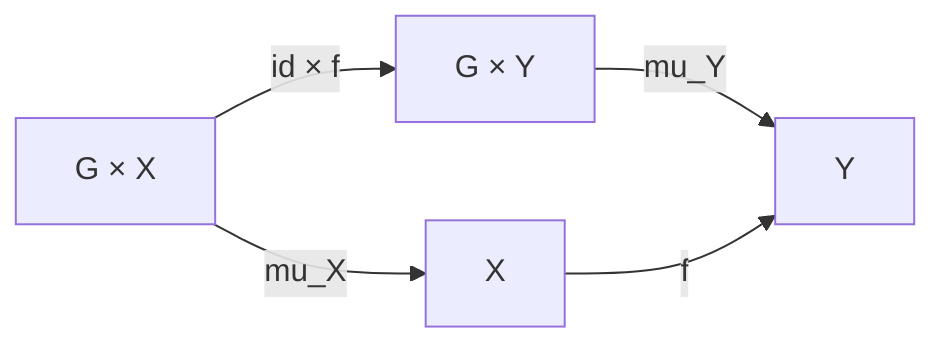
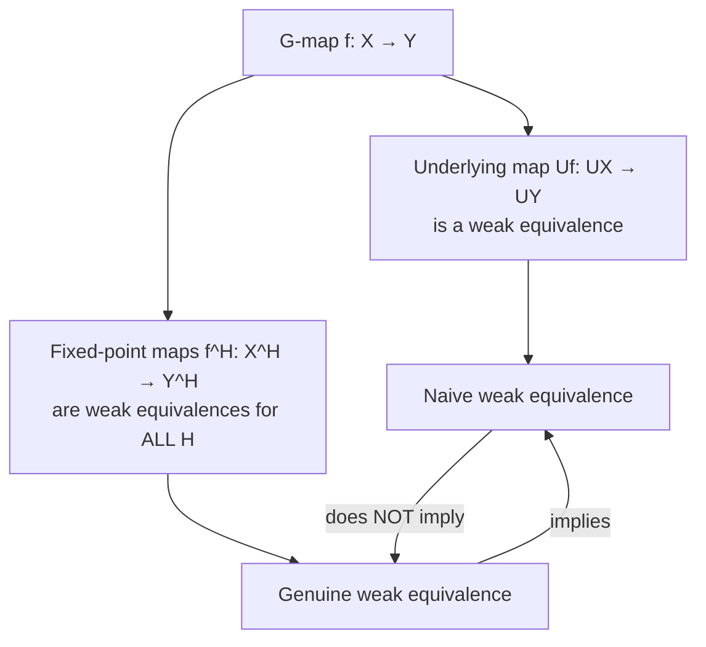

# G-Spaces and Equivariant Maps

## Table of Contents

- [[#1. Basic Definitions|1. Basic Definitions]]
  - [[#1.1 The Category of G-Spaces via Monads|1.1 The Category of G-Spaces via Monads]]
  - [[#1.2 Explicit Definition and Morphisms|1.2 Explicit Definition and Morphisms]]
  - [[#1.3 Mapping Spaces and Enrichment|1.3 Mapping Spaces and Enrichment]]
  - [[#1.4 G-Homotopies|1.4 G-Homotopies]]
- [[#2. Fixed Points, Orbits, and Key Examples|2. Fixed Points, Orbits, and Key Examples]]
  - [[#2.1 Fixed-Point Spaces and Isotropy|2.1 Fixed-Point Spaces and Isotropy]]
  - [[#2.2 Corepresentability of Fixed Points|2.2 Corepresentability of Fixed Points]]
  - [[#2.3 Induction and Coinduction|2.3 Induction and Coinduction]]
  - [[#2.4 Representation Spheres|2.4 Representation Spheres]]
- [[#3. Naive vs. Genuine G-Spaces|3. Naive vs. Genuine G-Spaces]]
  - [[#3.1 Naive G-Spaces|3.1 Naive G-Spaces]]
  - [[#3.2 Genuine Weak Equivalences|3.2 Genuine Weak Equivalences]]
  - [[#3.3 The Model Structure on G Top|3.3 The Model Structure on G Top]]
  - [[#3.4 Equivariant Homotopy Groups|3.4 Equivariant Homotopy Groups]]
- [[#4. G-CW Complexes|4. G-CW Complexes]]
  - [[#4.1 Cells and Skeleta|4.1 Cells and Skeleta]]
  - [[#4.2 Fixed Points of Cells|4.2 Fixed Points of Cells]]
  - [[#4.3 Colimit Compatibility|4.3 Colimit Compatibility]]
  - [[#4.4 Theta-Connectedness and the HELP Lemma|4.4 Theta-Connectedness and the HELP Lemma]]
  - [[#4.5 Worked Examples|4.5 Worked Examples]]
- [[#5. Elmendorf's Theorem|5. Elmendorf's Theorem]]
  - [[#5.1 The Orbit Category|5.1 The Orbit Category]]
  - [[#5.2 The Presheaf Functor|5.2 The Presheaf Functor]]
  - [[#5.3 Statement and Proof Sketch|5.3 Statement and Proof Sketch]]
  - [[#5.4 The Infinity-Categorical Statement|5.4 The Infinity-Categorical Statement]]
  - [[#5.5 Applications|5.5 Applications]]
- [[#References|References]]

---

## 1. Basic Definitions 📐

### 1.1 The Category of G-Spaces via Monads

Throughout, let $G$ be a *topological group* — a group object in $\mathbf{Top}$. We define the category $G\mathbf{Top}$ of *G-spaces* as the category of algebras over a monad.

**Definition (The Monad $M_G$).** Define the *endofunctor* $M_G: \mathbf{Top} \to \mathbf{Top}$ by

$$M_G(X) = G \times X.$$

The monad structure is given by:
- *Unit* $\eta_X: X \to G \times X$, $x \mapsto (e, x)$ (inclusion at the identity),
- *Multiplication* $\mu_X: G \times G \times X \to G \times X$, $(g, h, x) \mapsto (gh, x)$.

Associativity and unitality of this monad follow directly from the group axioms of $G$.

The *category of $M_G$-algebras* is exactly $G\mathbf{Top}$: an algebra structure $\alpha: G \times X \to X$ satisfying the algebra axioms is precisely a continuous $G$-action. The algebra maps are exactly equivariant maps.

> [!INFO] Completeness and Cocompleteness
> Since $\mathbf{Top}$ is complete and cocomplete, and the forgetful functor $U: G\mathbf{Top} \to \mathbf{Top}$ creates limits and reflexive coequalizers, the category $G\mathbf{Top}$ is itself complete and cocomplete. Limits are computed in $\mathbf{Top}$ with the pointwise $G$-action; colimits are computed as coequalizers involving the $G$-action.

For *based* G-spaces we instead work with the monad $M_G^+$ on $\mathbf{Top}_*$ sending $X \mapsto G_+ \wedge X$, where $G_+ = G \sqcup \{*\}$ is $G$ with a disjoint basepoint. The based category is denoted $G\mathbf{Top}_*$.

### 1.2 Explicit Definition and Morphisms

Unpacking the monad description gives the explicit definition.

**Definition (G-Space).** A *G-space* is a topological space $X$ equipped with a continuous *action map*

$$\mu: G \times X \longrightarrow X, \quad (g, x) \mapsto g \cdot x,$$

satisfying:
1. *(Associativity)* $g \cdot (h \cdot x) = (gh) \cdot x$ for all $g, h \in G$, $x \in X$.
2. *(Unitality)* $e \cdot x = x$ for all $x \in X$.

These conditions correspond precisely to $\alpha \circ (m_G \times \mathrm{id}) = \alpha \circ (\mathrm{id}_G \times \alpha)$ and $\alpha \circ (\eta \times \mathrm{id}) = \mathrm{id}_X$ in the monad algebra axioms.

**Definition (Equivariant Map).** A *G-equivariant map* (or *G-map*) between G-spaces $(X, \mu_X)$ and $(Y, \mu_Y)$ is a continuous map $f: X \to Y$ such that

$$f(g \cdot x) = g \cdot f(x) \quad \text{for all } g \in G, x \in X,$$

i.e., the following diagram commutes:

$G\mathbf{Top}$ denotes the category with objects G-spaces and morphisms G-equivariant maps.

### 1.3 Mapping Spaces and Enrichment

Three distinct notions of mapping space appear naturally in $G\mathbf{Top}$, and keeping them distinct is essential.

**Definition (Fixed-Point Mapping Space).** For G-spaces $X$ and $Y$, the *equivariant mapping space* is

$$\mathrm{Map}_G(X, Y) = \{ f \in \mathrm{Map}(X, Y) \mid f \text{ is } G\text{-equivariant} \}$$

with the subspace topology inherited from $\mathrm{Map}(X, Y)$ (compactly generated compact-open topology). This is the *internal hom of the fixed-point enrichment*.

**Definition (Conjugation Action).** The *conjugation G-space of maps* is

$$G\mathrm{Map}(X, Y) = \mathrm{Map}(X, Y)$$

as a topological space, equipped with the *conjugation action*:

$$(g \cdot f)(x) = g \cdot f(g^{-1} \cdot x).$$

> [!NOTE] Why conjugation?
> This is the unique $G$-action on $\mathrm{Map}(X,Y)$ making evaluation $\mathrm{ev}: G\mathrm{Map}(X,Y) \times X \to Y$ into a $G$-map (where $G$ acts diagonally on the product). The formula $(g \cdot f)(x) = g \cdot f(g^{-1} x)$ is the natural "change-of-frame" action.

The *self-enrichment* of $G\mathbf{Top}$ uses $G\mathrm{Map}(X, Y)$ as the internal hom object — the category $G\mathbf{Top}$ is enriched over itself.

**Key Relation.** The equivariant mapping space is the fixed points of the conjugation space:

$$\mathrm{Map}_G(X, Y) = \bigl(G\mathrm{Map}(X, Y)\bigr)^G.$$

*Proof.* A map $f \in G\mathrm{Map}(X,Y)$ is fixed by every $g \in G$ under conjugation iff $g \cdot f = f$ for all $g$, i.e., $g \cdot f(g^{-1} x) = f(x)$ for all $g, x$. Setting $x' = g^{-1} x$ gives $f(gx') = g \cdot f(x')$, which is exactly the equivariance condition. $\square$

> [!INFO] Adjunction
> The conjugation mapping space gives an adjunction: for G-spaces $X$, $Y$, $Z$,
> $$G\mathbf{Top}(X \times Y, Z) \cong G\mathbf{Top}(X, G\mathrm{Map}(Y, Z)).$$
> Taking $G$-fixed points on both sides recovers the non-equivariant adjunction at the level of equivariant maps.

### 1.4 G-Homotopies

**Definition (G-Homotopy).** A *G-homotopy* between G-maps $f_0, f_1: X \to Y$ is a continuous map

$$h: X \times I \longrightarrow Y$$

that is a morphism in $G\mathbf{Top}$, where $G$ acts on $X \times I$ via $g \cdot (x, t) = (g \cdot x, t)$ — that is, $G$ acts *trivially* on $I = [0,1]$.

The triviality of the $G$-action on $I$ is forced: we want homotopies to be "the same at every time $t$" from $G$'s perspective. Explicitly, $h$ is a G-homotopy iff $h(g \cdot x, t) = g \cdot h(x, t)$ for all $g \in G$, $x \in X$, $t \in I$.

> [!WARNING]
> *Do not* allow $G$ to act non-trivially on $I$. A map $X \times I \to Y$ with a non-trivial $G$-action on $I$ does not define a "path" between $f_0$ and $f_1$ in any homotopy-theoretically meaningful sense for equivariant purposes.

---

## 2. Fixed Points, Orbits, and Key Examples 🔑

### 2.1 Fixed-Point Spaces and Isotropy

**Definition (Fixed-Point Space).** For a G-space $X$ and a subgroup $H \leq G$, the *$H$-fixed-point subspace* is

$$X^H = \{ x \in X \mid h \cdot x = x \text{ for all } h \in H \}.$$

This is a closed subspace of $X$ (since it is the equalizer of the continuous maps $\mu(h, -): X \to X$ and $\mathrm{id}_X$ for each $h \in H$, and a countable intersection of closed sets when $H$ is second countable).

**Definition (Weyl Group).** The *Weyl group* of $H$ in $G$ is

$$WH = NH/H,$$

where $NH = \{ g \in G \mid gHg^{-1} = H \}$ is the *normalizer* of $H$. The Weyl group $WH$ acts on $X^H$ by $[n] \cdot x = n \cdot x$, making $X^H$ naturally a $WH$-space.

> [!NOTE] Why WH acts on $X^H$
> If $x \in X^H$ and $n \in NH$, then for any $h \in H$: $h \cdot (n \cdot x) = n \cdot (n^{-1}hn) \cdot x = n \cdot x$ since $n^{-1}hn \in H$. So $n \cdot x \in X^H$, and the action of $NH$ on $X^H$ factors through $WH = NH/H$.

**Definition (Isotropy Group).** For $x \in X$, the *isotropy group* (or *stabilizer*) of $x$ is

$$G_x = \{ g \in G \mid g \cdot x = x \} \leq G.$$

The *orbit* of $x$ is $Gx = G/G_x$ as a $G$-set, and the orbit map $G \to Gx$, $g \mapsto gx$, induces a homeomorphism $G/G_x \xrightarrow{\sim} Gx$ when $G$ is compact and $X$ is Hausdorff.

### 2.2 Corepresentability of Fixed Points

The orbit spaces $G/H$ play a fundamental role: they *corepresent* the fixed-point functors.

**Proposition (Corepresentability).** For any G-space $X$ and closed subgroup $H \leq G$,

$$X^H \cong \mathrm{Map}_G(G/H, X).$$

*Proof.* A $G$-equivariant map $f: G/H \to X$ is determined by $f(eH) \in X$, subject to the condition that $f(eH)$ is fixed by $H$: for $h \in H$, equivariance gives $h \cdot f(eH) = f(h \cdot eH) = f(eH)$. Conversely, any $x \in X^H$ determines an equivariant map $f_x: G/H \to X$ by $f_x(gH) = g \cdot x$ (well-defined since $x \in X^H$). These assignments are inverse homeomorphisms. $\square$

> [!INFO] Conceptual Significance
> This says that $G/H$ is the "universal $H$-fixed space" in $G\mathbf{Top}$: maps out of $G/H$ detect $H$-fixed points. This is the key reason orbit spaces appear as the generating objects for the whole theory, and is the seed of Elmendorf's theorem.

### 2.3 Induction and Coinduction

Let $H \leq G$ be a closed subgroup. The *forgetful functor* $U: G\mathbf{Top} \to H\mathbf{Top}$ restricts the group action from $G$ to $H$. This functor has both a left and a right adjoint.

**Definition (Induced G-Space).** The *induced G-space* of an $H$-space $X$ is the *balanced product*

$$G \times_H X = (G \times X) / {\sim}, \quad (gh, x) \sim (g, hx) \text{ for } h \in H,$$

with $G$-action $g' \cdot [g, x] = [g'g, x]$. This is the left adjoint of $U$:

$$G\mathbf{Top}(G \times_H X, Y) \cong H\mathbf{Top}(X, UY).$$

**Definition (Coinduced G-Space).** The *coinduced G-space* of an $H$-space $X$ is

$$\mathrm{Map}_H(G, X),$$

the space of $H$-equivariant maps $G \to X$ (where $H$ acts on $G$ by left multiplication), with $G$-action $(g \cdot f)(g') = f(g'g)$ (right translation). This is the right adjoint of $U$:

$$H\mathbf{Top}(UY, X) \cong G\mathbf{Top}(Y, \mathrm{Map}_H(G, X)).$$

> [!INFO] Kan Extension Perspective
> Let $BG$ and $BH$ denote the one-object topological categories with morphism spaces $G$ and $H$ respectively. The inclusion $i: BH \hookrightarrow BG$ induces $i^*: \mathbf{Top}^{BG} \to \mathbf{Top}^{BH}$, which is exactly the forgetful functor $U$.
>
> - The *left Kan extension* $\mathrm{Lan}_i$ is $(G \times_H -)$: induction.
> - The *right Kan extension* $\mathrm{Ran}_i$ is $\mathrm{Map}_H(G, -)$: coinduction.
>
> The induction-restriction-coinduction triple $(G \times_H -, U, \mathrm{Map}_H(G,-))$ is the standard example of a *Kan extension sandwich*.

> [!EXAMPLE]- Induction for $C_2 \leq C_4$
> Let $G = C_4 = \langle r \mid r^4 = 1 \rangle$ and $H = C_2 = \langle r^2 \rangle$. Let $X = \{pt\}$ with trivial $H$-action.
>
> Then $G \times_H X = C_4 \times_{C_2} \{pt\} \cong C_4/C_2 \cong \{eC_2, rC_2\}$, which is a two-point $C_4$-space — the orbit $C_4/C_2$.
>
> On the other hand, $\mathrm{Map}_H(G, X) = \mathrm{Map}_{C_2}(C_4, \{pt\}) = \{pt\}$ (only one map).

### 2.4 Representation Spheres

A key family of examples arises from linear representations.

**Definition (Representation Sphere).** Let $V$ be a finite-dimensional real *$G$-representation* (i.e., a finite-dimensional real vector space with a continuous linear $G$-action). The *representation sphere* is

$$S^V = V^+ = V \cup \{\infty\},$$

the one-point compactification of $V$, with the $G$-action extended so that $G$ fixes $\infty$.

> [!NOTE]
> When $V = \mathbb{R}^n$ with trivial $G$-action, $S^V = S^n$ with trivial $G$-action. When $V = \mathbb{R}$ with $C_2$ acting by $-1$ (the *sign representation* $\sigma$), $S^\sigma \cong S^1$ with $C_2$ acting by reflection (the antipodal map on the equator).

Representation spheres are fundamental for defining *$RO(G)$-graded* cohomology theories, where one suspends not just by $S^n$ but by arbitrary representation spheres $S^V$.

---

## 3. Naive vs. Genuine G-Spaces 🎯

This section contains the most conceptually important distinction in equivariant homotopy theory.

### 3.1 Naive G-Spaces

**Definition (Naive G-Space).** A *naive G-space* is simply a topological space with a continuous $G$-action, viewed through the lens of $\mathbf{Top}^{BG}$ — i.e., as a functor $BG \to \mathbf{Top}$.

In the *naive* theory, a map $f: X \to Y$ of G-spaces is a *weak equivalence* if the underlying map of topological spaces $Uf: UX \to UY$ is a weak homotopy equivalence — that is, $\pi_n(f): \pi_n(X) \xrightarrow{\sim} \pi_n(Y)$ for all $n \geq 0$ and all basepoints. The $G$-action is *completely ignored*.

> [!DANGER] The Naive Theory is Insufficient
> The naive theory discards all equivariant information. For example, the two $C_2$-spaces $X = S^1$ (with trivial action) and $Y = S^1$ (with antipodal action) are naively weakly equivalent (both have $\pi_1 = \mathbb{Z}$), but they are *not* equivariantly equivalent: $X^{C_2} = S^1 \neq \emptyset$ while $Y^{C_2} = \emptyset$.

The naive theory is appropriate when one only cares about spaces parametrized by the classifying space $BG$, not about the equivariant structure itself.

### 3.2 Genuine Weak Equivalences

**Definition (Genuine Weak Equivalence).** A map $f: X \to Y$ in $G\mathbf{Top}$ is a *genuine weak equivalence* if for every closed subgroup $H \leq G$, the induced map on $H$-fixed points

$$f^H: X^H \longrightarrow Y^H$$

is a weak homotopy equivalence.

**The key principle:** *genuine* equivariant homotopy theory sees a G-space $X$ as a *system* of spaces $\{X^H\}_{H \leq G}$ varying over the lattice of closed subgroups, and requires weak equivalences to be *detected at every level of this system simultaneously*.

> [!NOTE] Subgroup Lattice
> For a finite group $G$, there are finitely many subgroups, so the condition is a finite conjunction of weak equivalences. For a compact Lie group, the lattice is typically uncountable but still manageable by the structure theory of compact Lie groups.

The distinction between naive and genuine weak equivalences is the central divide in equivariant homotopy theory:

**The implication is strict.** Every genuine weak equivalence is a naive weak equivalence (taking $H = \{e\}$ gives the underlying map), but the converse fails, as the $C_2$-action example above demonstrates.

### 3.3 The Model Structure on G Top

The genuine weak equivalences are the weak equivalences in a model structure on $G\mathbf{Top}$.

**Proposition 1.2.15 (Genuine Model Structure on $G\mathbf{Top}$).** There is a cofibrantly generated model structure on $G\mathbf{Top}$ in which:

- *Weak equivalences* are genuine weak equivalences: maps $f: X \to Y$ with $f^H: X^H \xrightarrow{\sim} Y^H$ for all closed $H \leq G$.
- *Fibrations* are maps $p: X \to Y$ such that $p^H: X^H \to Y^H$ is a Serre fibration for all closed $H \leq G$.
- *Cofibrations* are retracts of relative $G$-CW complexes (see §4).

The *generating cofibrations* are:

$$I_G = \{ G/H \times S^{n-1} \hookrightarrow G/H \times D^n \mid H \leq G \text{ closed}, n \geq 0 \}.$$

The *generating acyclic cofibrations* are:

$$J_G = \{ G/H \times D^n \hookrightarrow G/H \times D^n \times I \mid H \leq G \text{ closed}, n \geq 0 \}.$$

> [!INFO] Verification Strategy
> The model structure is verified using the *recognition theorem* for cofibrantly generated model categories: one checks the small object argument applies (compactness of cells), that $I_G$-cofibrations with the RLP against $J_G$ are acyclic, and that $J_G$-cofibrations are weak equivalences. The key input is that fixed-point functors $(-)^H$ commute with sequential colimits along closed inclusions — proved in Proposition 1.2.8 (see §4.3).

### 3.4 Equivariant Homotopy Groups

**Definition (Equivariant Homotopy Groups).** For a based G-space $X$ with $H$-fixed basepoint, the *$H$-equivariant homotopy groups* are

$$\pi_n^H(X) := \pi_n(X^H),$$

the ordinary homotopy groups of the $H$-fixed-point space.

These are indexed not just by $n \geq 0$ but by the *lattice of closed subgroups* of $G$:

$$\bigl\{ \pi_n^H(X) \bigr\}_{H \leq G,\, n \geq 0}.$$

**The genuine weak equivalences are precisely the maps inducing isomorphisms on all $\pi_n^H$.** This is the equivariant analog of Whitehead's theorem characterizing weak equivalences via homotopy groups.

> [!WARNING]
> *This is not the only natural notion of equivariant homotopy groups.* In the stable setting, one also has homotopy groups indexed by representations $V$ of $G$, giving $\pi_V^H(X) = [S^V, X]^H$. The groups $\pi_n^H$ defined here are the *unstable* equivariant homotopy groups.

---

## 4. G-CW Complexes 🏗️

### 4.1 Cells and Skeleta

The cells in a G-CW complex are *orbit spaces times discs*.

**Definition (G-Cells).** The *$n$-dimensional $G$-cells* are spaces of the form

$$G/H \times D^n \quad \text{(interior cell)}, \qquad G/H \times S^{n-1} \quad \text{(boundary cell)},$$

where $H \leq G$ is a closed subgroup and $G$ acts on the orbit factor $G/H$ by left translation and *trivially* on $D^n$ and $S^{n-1}$.

> [!NOTE] Why these cells?
> One might hope to use cells of the form $G \times_H D(V)$ for a representation $V$ of $H$ (the *equivariant disk bundle*). These are more flexible and appear in *$G$-CW structures compatible with representation theory*. However, it is a theorem that any such cell can be *triangulated* in terms of the simpler cells $G/K \times D^n$, so no generality is lost by restricting to the simpler form for homotopy-theoretic purposes.

**Definition 1.2.1 (G-CW Complex).** A *G-CW complex* is a G-space $X$ equipped with a filtration

$$X^0 \subseteq X^1 \subseteq X^2 \subseteq \cdots \subseteq X = \operatorname{colim}_n X^n$$

where:
- $X^0 = \coprod_\alpha G/H_\alpha$ is a disjoint union of orbits (a discrete set of $G$-orbits),
- $X^{n+1}$ is obtained from $X^n$ by a *pushout* of the form:

$$\begin{array}{ccc}
\displaystyle\coprod_\beta G/H_\beta \times S^n & \hookrightarrow & \displaystyle\coprod_\beta G/H_\beta \times D^{n+1} \\[4pt]
\downarrow & & \downarrow \\
X^n & \longrightarrow & X^{n+1}
\end{array}$$

where the $H_\beta$ range over (possibly varying) closed subgroups of $G$.

The horizontal top map is the standard inclusion $S^n \hookrightarrow D^{n+1}$, and the left vertical map is the *attaching map* of the cells.

> [!EXAMPLE]- Zero-Dimensional G-CW Complexes
> A $0$-dimensional $G$-CW complex is simply a disjoint union of orbits:
> $$X^0 = \coprod_\alpha G/H_\alpha.$$
> These are the "discrete G-spaces" — their fixed-point sets are $(G/H_\alpha)^K = \mathrm{Map}_G(G/K, G/H_\alpha)$, which is nonempty iff some $G$-conjugate of $K$ is contained in $H_\alpha$.

### 4.2 Fixed Points of Cells

To understand the homotopy theory, one must understand the fixed-point sets of cells.

**Lemma (Fixed Points of a Cell).** For closed subgroups $H, K \leq G$,

$$(G/K \times D^n)^H = (G/K)^H \times D^n.$$

*Proof.* The $G$-action is $(G/K \times D^n)$ with trivial action on $D^n$, so $H$ fixes a pair $(gK, x)$ iff $H$ fixes $gK$ (and $x$ is arbitrary). $\square$

This reduces the computation of cell fixed points to understanding $(G/K)^H$.

**Proposition.** There is a natural bijection

$$(G/K)^H = \mathrm{Map}_G(G/H, G/K).$$

*Proof.* By the corepresentability result of §2.2, $\mathrm{Map}_G(G/H, G/K) \cong (G/K)^H$. $\square$

> [!NOTE] Explicit Description
> An element of $(G/K)^H$ is a coset $gK$ fixed by all $h \in H$, i.e., $hgK = gK$ for all $h \in H$, i.e., $g^{-1}Hg \subseteq K$. So
> $$(G/K)^H = \{ gK \mid g^{-1}Hg \subseteq K \}$$
> — the $H$-fixed cosets of $K$ correspond to elements $g$ for which $H$ is subconjugate to $K$ via $g$. In particular, $(G/K)^H \neq \emptyset$ iff $H$ is subconjugate to $K$ in $G$.

### 4.3 Colimit Compatibility

A crucial technical fact underlies the model structure verification.

**Proposition 1.2.8 (Fixed Points Commute with Relevant Colimits).** Let $H \leq G$ be a closed subgroup. The fixed-point functor $(-)^H: G\mathbf{Top} \to \mathbf{Top}$ commutes with:
1. *Pushouts along closed inclusions* (i.e., if $A \hookrightarrow X$ is a $G$-equivariant closed inclusion and $A \hookrightarrow B$ is any $G$-map, then $(X \cup_A B)^H \cong X^H \cup_{A^H} B^H$).
2. *Sequential colimits along closed inclusions* (i.e., if $X_0 \hookrightarrow X_1 \hookrightarrow \cdots$ are $G$-equivariant closed inclusions, then $(\operatorname{colim}_n X_n)^H \cong \operatorname{colim}_n (X_n^H)$).

> [!INFO] Why Closed Inclusions?
> General colimits do not commute with fixed points. The *closed inclusion* hypothesis ensures that the fixed-point set of the colimit is the colimit of the fixed-point sets — this follows from the fact that fixed points of a closed $G$-equivariant subspace are closed, and compact Hausdorff (or compactly generated) spaces have good intersection properties.

**Corollary.** If $X$ is a $G$-CW complex, then $X^H$ is a CW complex with cells $(G/K)^H \times D^n$ for each $G$-cell $G/K \times D^n$ of $X$. The CW filtration on $X^H$ is induced from the skeletal filtration of $X$.

### 4.4 Theta-Connectedness and the HELP Lemma

**Definition 1.2.10 ($\theta$-Connected Maps).** Let $\theta: \{\text{closed subgroups of } G\} \to \mathbb{Z}_{\geq 0} \cup \{\infty\}$ be a function. A $G$-map $f: X \to Y$ is *$\theta$-connected* if $f^H: X^H \to Y^H$ is $\theta(H)$-connected for all closed subgroups $H \leq G$.

> [!NOTE]
> Recall a map $f: A \to B$ is *$k$-connected* if $\pi_i(f): \pi_i(A) \xrightarrow{\sim} \pi_i(B)$ is an isomorphism for $i < k$ and a surjection for $i = k$. A $\theta$-connected map is one that is simultaneously connected at every level of the equivariant structure, with the connectivity requirement possibly varying by subgroup.

**Theorem 1.2.11 (Equivariant HELP Lemma — Homotopy Extension Lifting Property).** Let $f: X \to Y$ be a $\theta$-connected $G$-map and let $i: A \hookrightarrow B$ be an inclusion of $G$-CW complexes such that all cells of $B \setminus A$ of type $G/H$ have dimension $\leq \theta(H)$. Then $f$ has the *homotopy lifting property* with respect to $i$.

*Proof sketch.* By induction over the skeletal filtration of $B$, using Proposition 1.2.8 to reduce each attachment to an ordinary (non-equivariant) HELP lemma problem for the fixed-point maps $f^H$. $\square$

**Corollary 1.2.14 (Equivariant Whitehead Theorem).** A genuine weak equivalence between $G$-CW complexes is a $G$-homotopy equivalence.

*Proof sketch.* Apply the Equivariant HELP Lemma with $A = \emptyset$, $B = Y$, and $f: X \to Y$ the weak equivalence. The $\theta$-connectedness condition is satisfied for $\theta \equiv \infty$. Construct the inverse homotopy equivalence and homotopies inductively. $\square$

> [!WARNING]
> *The Equivariant Whitehead theorem requires the domain and codomain to be G-CW complexes* — it fails for general G-spaces, just as in the non-equivariant setting.

### 4.5 Worked Examples

> [!EXAMPLE]- The Beachball: $C_2$ Acting on $S^V$
> Let $V = \mathbb{R}^2$ with $C_2 = \{1, \tau\}$ acting by $\tau \cdot (x,y) = (-x, -y)$ (the antipodal map). Then $S^V = S^2$.
>
> The $C_2$-CW structure on $S^2$ (the "beachball") is:
> - Two $0$-cells: $\{N, S\}$ — one $C_2$-orbit $C_2/e$, or equivalently two fixed points if $\tau(N) = S$. Let $\tau$ act antipodally, so $\{N,S\}$ is the orbit $C_2/e$.
> - One equatorial $1$-cell: $C_2/e \times D^1$ — the equator as an orbit of arcs.
> - One $2$-cell: $C_2/e \times D^2$ — the two hemispheres as an orbit.
>
> The fixed-point set $(S^V)^{C_2}$ is the set of antipodally-fixed points of $S^2$: since antipodal map has no fixed points on $S^2$, $(S^V)^{C_2} = \emptyset$.
>
> Compare with $S^{2\sigma}$ where $\sigma$ is the sign rep on $\mathbb{R}$: here $S^{2\sigma} = S^2$ with $C_2$ reflecting across the equator. Then $(S^{2\sigma})^{C_2} = S^1$ (the equator).

> [!EXAMPLE]- The Torus with $S^1$-Action
> Consider $T^2 = S^1 \times S^1$ with the $S^1$-action $z \cdot (w_1, w_2) = (zw_1, w_2)$ (rotation on the first factor).
>
> A minimal $S^1$-CW structure requires only:
> - $0$-cells: One orbit $S^1/S^1 \cong \{*\}$ — the point $\{1\} \times S^1$ (fixed-point set), thought of as a single $S^1$-fixed point. Actually the fixed set is $(T^2)^{S^1} = \{1\} \times S^1$.
>
> Wait — we need cells to build the whole torus. A minimal structure is:
> - One $0$-cell of type $S^1/e$ (a free orbit)
> - One $1$-cell of type $S^1/e \times D^1$
>
> This gives $S^1 \cup_{S^1} S^1 \times I \cong T^2$. The remarkable fact is that *the torus only needs a single free $1$-cell* in its $S^1$-CW structure, whereas without the group action one needs $2$-cells as well.

> [!EXAMPLE]- Equilateral Triangle with $D_6$-Action
> The dihedral group $D_6 = \langle r, s \mid r^3 = s^2 = 1, srs = r^{-1} \rangle$ acts on the equilateral triangle $T$ (as a topological space, homeomorphic to $S^1$).
>
> The $D_6$-CW structure:
> - $0$-cells: The three vertices form a single $D_6$-orbit $D_6/D_2$ (where $D_2$ is the stabilizer of a vertex, isomorphic to $\mathbb{Z}/2$, generated by the reflection fixing that vertex).
> - $1$-cells: The three edges form a single $D_6$-orbit $D_6/\mathbb{Z}/2$ (where $\mathbb{Z}/2$ is the reflection fixing the midpoint of an edge). But an edge has a midpoint fixed by a reflection, so the attaching data is an equivariant attachment.
>
> The key point is that $|D_6|/|D_2| = 6/2 = 3$ (the number of vertices), confirming the orbit count.

---

## 5. Elmendorf's Theorem 🌐

### 5.1 The Orbit Category

**Definition (Orbit Category).** The *orbit category* $\mathcal{O}_G$ is the full subcategory of $G\mathbf{Top}$ on objects $\{G/H \mid H \leq G \text{ closed}\}$.

The morphism spaces in $\mathcal{O}_G$ are computed as:

$$\mathrm{Map}_{\mathcal{O}_G}(G/H, G/K) = \mathrm{Map}_G(G/H, G/K) \cong (G/K)^H.$$

By the analysis in §4.2, an element of $(G/K)^H$ is a coset $gK$ with $g^{-1}Hg \subseteq K$ — i.e., an element exhibiting a *subconjugacy relation* $H \lesssim K$.

> [!NOTE] Morphisms Encode Subconjugacy
> There is a morphism $G/H \to G/K$ in $\mathcal{O}_G$ iff there exists $g \in G$ with $g^{-1}Hg \subseteq K$. In particular:
> - $G/H \to G/\{e\} = G$ always exists (take $g = e$ and $K = \{e\}$ is subconjugate to anything).
> - $G/\{e\} \to G/H$ exists iff $\{e\} \subseteq H$, which is always true — so $G/e \to G/H$ exists for all $H$.
> - There is a morphism $G/H \to G/H$ for each element of $WH = (G/H)^H$.

For $G$ a finite group, $\mathcal{O}_G$ is a finite category and this becomes an explicit finite combinatorial object.

### 5.2 The Presheaf Functor

Every G-space $X$ determines a presheaf on $\mathcal{O}_G$.

**Definition (Fixed-Point System Functor).** Define the functor

$$\psi: G\mathbf{Top} \longrightarrow \mathrm{Fun}(\mathcal{O}_G^{\mathrm{op}}, \mathbf{Top})$$

by

$$\psi(X) = \bigl( G/H \mapsto X^H \bigr).$$

The functoriality in $\mathcal{O}_G^{\mathrm{op}}$ is given as follows: a morphism $\phi: G/H \to G/K$ in $\mathcal{O}_G$ (corresponding to $gK \in (G/K)^H$) induces a *restriction map*

$$\phi^*: X^K \longrightarrow X^H, \quad x \mapsto g \cdot x.$$

(This is well-defined: if $x \in X^K$ and $h \in H$, then $h \cdot (gx) = g \cdot (g^{-1}hg) \cdot x = g \cdot x$ since $g^{-1}hg \in K$.)

> [!INFO] Contravariance
> The functor $\psi$ is *contravariant* in $\mathcal{O}_G$ — a map $G/H \to G/K$ induces a map $X^K \to X^H$ in the *opposite direction*. This is why $\psi$ lands in presheaves $\mathrm{Fun}(\mathcal{O}_G^{\mathrm{op}}, \mathbf{Top})$, not sheaves on $\mathcal{O}_G$.

**Key Observation.** Under $\psi$, genuine weak equivalences in $G\mathbf{Top}$ correspond exactly to *objectwise weak equivalences* in $\mathrm{Fun}(\mathcal{O}_G^{\mathrm{op}}, \mathbf{Top})$ (the *projective* model structure): a map $f: X \to Y$ is a genuine weak equivalence iff $\psi(f)(G/H): X^H \to Y^H$ is a weak equivalence for all $H$. **This is the precise sense in which genuine G-spaces are "systems of spaces."**

### 5.3 Statement and Proof Sketch

**Theorem 1.3.6 (Elmendorf, 1983).** The functor

$$\psi: G\mathbf{Top} \longrightarrow \mathrm{Fun}(\mathcal{O}_G^{\mathrm{op}}, \mathbf{Top})$$

is the *right adjoint* of a Quillen equivalence. The left adjoint $\Phi: \mathrm{Fun}(\mathcal{O}_G^{\mathrm{op}}, \mathbf{Top}) \to G\mathbf{Top}$ is *evaluation at $G/e$*:

$$\Phi(\mathcal{F}) = \mathcal{F}(G/e).$$

The space $\mathcal{F}(G/e)$ acquires a $G$-action via the $G$-action on $G/e \cong G$ — morphisms in $\mathcal{O}_G$ from $G/e$ to itself correspond to elements of $G$ (since $\mathrm{Map}_G(G/e, G/e) = (G/e)^e = G$), and this gives $\mathcal{F}(G/e)$ a $G$-action.

> [!INFO] Quillen Equivalence
> A *Quillen equivalence* is an adjunction $F \dashv G$ between model categories such that the total derived functors $\mathbf{L}F$ and $\mathbf{R}G$ are inverse equivalences of homotopy categories. The model structure on $\mathrm{Fun}(\mathcal{O}_G^{\mathrm{op}}, \mathbf{Top})$ used here is the *projective model structure* (weak equivalences and fibrations are objectwise).

*Proof sketch via the bar construction.*

Define a *cofibrant replacement functor* $\Phi: \mathrm{Fun}(\mathcal{O}_G^{\mathrm{op}}, \mathbf{Top}) \to G\mathbf{Top}$ by the *two-sided bar construction*:

$$\Phi(\mathcal{F}) = \bigl| B_\bullet(\mathcal{F}, \mathcal{O}_G, M) \bigr|,$$

where $M: \mathcal{O}_G \to G\mathbf{Top}$ is the functor $M(G/H) = G/H$ (realizing the orbits in $G\mathbf{Top}$), and the bar construction has:

- $B_n(\mathcal{F}, \mathcal{O}_G, M) = \displaystyle\coprod_{G/H_0 \to \cdots \to G/H_n} \mathcal{F}(G/H_0) \times G/H_n$,

with simplicial face maps given by composition in $\mathcal{O}_G$ and by the $\mathcal{F}$ and $M$ actions.

The key computation: $\Phi(\mathcal{F})^H = |\mathcal{F}(G/H \times \Delta^\bullet)| \simeq \mathcal{F}(G/H)$ via the *extra degeneracy argument*: there is a contraction of the simplicial set of $H$-fixed-point simplices onto the $0$-simplices, given by the identity coset $eH \in (G/H)^H$.

This shows $\psi \circ \Phi \simeq \mathrm{id}$ (up to weak equivalence), establishing the Quillen equivalence. $\square$

> [!QUESTION] The Left Adjoint Perspective
> The left adjoint $\Phi \dashv \psi$ satisfies: a map $\Phi(\mathcal{F}) \to X$ in $G\mathbf{Top}$ corresponds to a natural transformation $\mathcal{F} \to \psi(X)$ in $\mathrm{Fun}(\mathcal{O}_G^{\mathrm{op}}, \mathbf{Top})$. At $G/H$, this is a map $\mathcal{F}(G/H) \to X^H$, compatible with all restriction maps. This is the precise sense in which $\Phi(\mathcal{F})$ is "built from the data $\mathcal{F}$."

### 5.4 The Infinity-Categorical Statement

The Quillen equivalence of Elmendorf upgrades to an $(\infty,1)$-categorical equivalence.

**Theorem 1.3.8 (Elmendorf, $\infty$-categorical form).** There is an equivalence of $(\infty,1)$-categories:

$$G\mathbf{Top} \simeq \mathrm{Fun}(\mathcal{O}_G^{\mathrm{op}}, \mathbf{Spaces}),$$

where $\mathbf{Spaces}$ denotes the $(\infty,1)$-category of spaces (Kan complexes / $\infty$-groupoids).

> [!INFO] Modern Perspective
> This is the *modern* way to understand genuine G-spaces. Rather than a G-space being "a space with a group action," it is a *$\mathcal{O}_G^{\mathrm{op}}$-diagram of spaces*:
>
> $$X \longleftrightarrow \bigl\{ X^H \text{ for each closed } H \leq G, \text{ with restriction maps} \bigr\}.$$
>
> The equivariant structure of $X$ is *entirely encoded* by its system of fixed-point spaces and the maps between them, indexed by the orbit category. This perspective is essential in modern formulations of equivariant stable homotopy theory.

The $(\infty,1)$-categorical statement is strictly stronger: it says not only that the homotopy categories are equivalent, but that all higher homotopical data (mapping spaces, homotopy coherent diagrams, etc.) are also equivalent.

### 5.5 Applications

Elmendorf's theorem has several important structural consequences.

**Families of Subgroups.** A *family* $\mathcal{F}$ of subgroups of $G$ is a collection closed under conjugation and taking subgroups. Examples:
- $\mathcal{F} = \{\{e\}\}$: the *trivial family* (only the trivial subgroup).
- $\mathcal{F} = \mathbf{All}$: all closed subgroups.
- $\mathcal{F} = \mathbf{Fin}$: all *finite* subgroups (relevant for $G = S^1$).

**Definition (Classifying G-Space for a Family).** For a family $\mathcal{F}$, the *classifying G-space* $E\mathcal{F}$ is the unique G-space (up to genuine weak equivalence) with:

$$E\mathcal{F}^H \simeq \begin{cases} * & H \in \mathcal{F} \\ \emptyset & H \notin \mathcal{F}. \end{cases}$$

Via Elmendorf's theorem, this is the presheaf $\mathcal{O}_G^{\mathrm{op}} \to \mathbf{Spaces}$ sending $G/H \mapsto *$ for $H \in \mathcal{F}$ and $G/H \mapsto \emptyset$ for $H \notin \mathcal{F}$.

> [!EXAMPLE]- The Universal Space $EG$
> Taking $\mathcal{F} = \{\{e\}\}$: $E\mathcal{F} = EG$ (the universal free $G$-space), which has $(EG)^H = \emptyset$ for $H \neq \{e\}$ and $(EG)^{\{e\}} \simeq *$. This is the contractible total space of the universal $G$-bundle $EG \to BG$.

**G-Connected Components.** Via Elmendorf's theorem, the *equivariant $\pi_0$* of a G-space $X$ is the presheaf $G/H \mapsto \pi_0(X^H)$. This records how the connected components of the fixed-point sets vary with the subgroup.

**Bredon Cohomology.** The Eilenberg-Mac Lane G-spaces are constructed via Elmendorf's theorem from presheaves of abelian groups on $\mathcal{O}_G$.

**Definition (Coefficient System).** A *Bredon coefficient system* is a functor $M: \mathcal{O}_G^{\mathrm{op}} \to \mathbf{Ab}$ (a presheaf of abelian groups on $\mathcal{O}_G$).

Via Elmendorf's theorem, one constructs an *Eilenberg-Mac Lane G-space* $K(M, n)$ with $\pi_n^H(K(M,n)) = M(G/H)$ and all other equivariant homotopy groups trivial. *Bredon cohomology* is then defined by

$$H^n_G(X; M) = [X, K(M,n)]_G,$$

the group of equivariant homotopy classes of maps, and this recovers Bredon's original (1967) cohomology theory of $G$-spaces.

> [!INFO] Significance of Elmendorf
> Elmendorf's theorem is the cornerstone of the modern approach to equivariant homotopy theory. **The slogan is: a genuine G-space is precisely a presheaf on the orbit category.** This perspective:
> 1. Makes the definition of equivariant homotopy types conceptually transparent.
> 2. Provides the correct framework for equivariant stable homotopy theory (spectra indexed by the orbit category).
> 3. Explains why Bredon cohomology — defined by coefficient systems on $\mathcal{O}_G$ — is the correct equivariant generalization of ordinary cohomology.
> 4. Enables the systematic use of homotopy-theoretic techniques (model categories, $(\infty,1)$-categories) in equivariant settings.

---

## References

| Reference Name | Brief Summary | Link to Reference |
|---|---|---|
| Blumberg, *M392C Lecture Notes* | Main source; Chapter 1 covers G-spaces, G-CW complexes, and Elmendorf's theorem in detail | [adebray.github.io](https://adebray.github.io/lecture_notes/m392c_EHT_notes.pdf) |
| [Elmendorf (1983), *Systems of fixed point sets*](https://www.ams.org/journals/tran/1983-277-01/S0002-9947-1983-0690052-0/) | Original proof of Elmendorf's theorem via the bar construction; introduced the orbit category perspective | [AMS Transactions (1983)](https://www.ams.org/journals/tran/1983-277-01/S0002-9947-1983-0690052-0/) |
| [May, *Equivariant Homotopy and Cohomology Theory* (1996)](https://math.uchicago.edu/~may/BOOKS/alaska.pdf) | Comprehensive reference for equivariant stable homotopy theory; covers G-CW complexes, model structures, and equivariant spectra | [University of Chicago](https://math.uchicago.edu/~may/BOOKS/alaska.pdf) |
| Bredon, *Equivariant Cohomology Theories* (1967) | Original definition of Bredon cohomology via coefficient systems on the orbit category | (book) |
| [Riehl, *Categorical Homotopy Theory* (2014)](https://math.jhu.edu/~eriehl/cathtpy.pdf) | Background on model categories, bar constructions, and Kan extensions used throughout | [Johns Hopkins](https://math.jhu.edu/~eriehl/cathtpy.pdf) |
