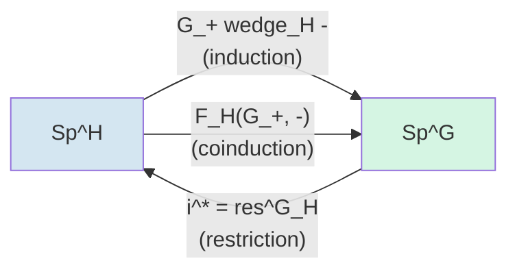

# Genuine G-Spectra

## Table of Contents

- [[#1. Stabilization and the Need for Genuine Spectra|1. Stabilization and the Need for Genuine Spectra]]
  - [[#1.1 Naive Stabilization and Its Failures|1.1 Naive Stabilization and Its Failures]]
  - [[#1.2 Representation Spheres|1.2 Representation Spheres]]
  - [[#1.3 What Genuine Stabilization Fixes|1.3 What Genuine Stabilization Fixes]]
- [[#2. G-Universes and Indexing|2. G-Universes and Indexing]]
  - [[#2.1 The Indexing Universe|2.1 The Indexing Universe]]
  - [[#2.2 Complete vs. Incomplete Universes|2.2 Complete vs. Incomplete Universes]]
  - [[#2.3 Spaces of Isometric Embeddings|2.3 Spaces of Isometric Embeddings]]
- [[#3. Lewis–May–Steinberger G-Spectra|3. Lewis–May–Steinberger G-Spectra]]
  - [[#3.1 G-Prespectra|3.1 G-Prespectra]]
  - [[#3.2 The Omega-Spectrum Condition|3.2 The Omega-Spectrum Condition]]
  - [[#3.3 Spectrification|3.3 Spectrification]]
- [[#4. Orthogonal G-Spectra|4. Orthogonal G-Spectra]]
  - [[#4.1 The Indexing Category|4.1 The Indexing Category]]
  - [[#4.2 Orthogonal G-Spectra as Functors|4.2 Orthogonal G-Spectra as Functors]]
  - [[#4.3 The Smash Product via Day Convolution|4.3 The Smash Product via Day Convolution]]
  - [[#4.4 Comparison with Lewis–May–Steinberger|4.4 Comparison with Lewis–May–Steinberger]]
- [[#5. Naive vs. Genuine: Two Model Structures|5. Naive vs. Genuine: Two Model Structures]]
  - [[#5.1 The Naive Model Structure|5.1 The Naive Model Structure]]
  - [[#5.2 The Genuine Model Structure|5.2 The Genuine Model Structure]]
  - [[#5.3 Lewis's Theorem: Inequivalence|5.3 Lewis's Theorem: Inequivalence]]
  - [[#5.4 What the Genuine Theory Gains|5.4 What the Genuine Theory Gains]]
  - [[#5.5 G-CW-Spectra|5.5 G-CW-Spectra]]
- [[#6. Homotopy Groups as Mackey Functors|6. Homotopy Groups as Mackey Functors]]
  - [[#6.1 Definition of the Homotopy Mackey Functor|6.1 Definition of the Homotopy Mackey Functor]]
  - [[#6.2 Restriction and Transfer Maps|6.2 Restriction and Transfer Maps]]
  - [[#6.3 The Mackey Axiom from the Double Coset Formula|6.3 The Mackey Axiom from the Double Coset Formula]]
  - [[#6.4 The C2 Example in Detail|6.4 The C2 Example in Detail]]
- [[#7. Suspension Spectra and Basic Examples|7. Suspension Spectra and Basic Examples]]
  - [[#7.1 The Equivariant Suspension Spectrum|7.1 The Equivariant Suspension Spectrum]]
  - [[#7.2 The Sphere Spectrum and the Burnside Ring|7.2 The Sphere Spectrum and the Burnside Ring]]
  - [[#7.3 Equivariant Eilenberg–Mac Lane Spectra|7.3 Equivariant Eilenberg–Mac Lane Spectra]]
  - [[#7.4 The tom Dieck Splitting|7.4 The tom Dieck Splitting]]
- [[#8. The Smash Product and Closed Structure|8. The Smash Product and Closed Structure]]
  - [[#8.1 Symmetric Monoidal Structure|8.1 Symmetric Monoidal Structure]]
  - [[#8.2 The Internal Hom and Spanier–Whitehead Duality|8.2 The Internal Hom and Spanier–Whitehead Duality]]
  - [[#8.3 The Suspension Isomorphism|8.3 The Suspension Isomorphism]]
  - [[#8.4 Cofiber Sequences|8.4 Cofiber Sequences]]
- [[#9. Change of Universe and Change of Group|9. Change of Universe and Change of Group]]
  - [[#9.1 Change of Universe|9.1 Change of Universe]]
  - [[#9.2 Change of Group: Restriction|9.2 Change of Group: Restriction]]
  - [[#9.3 Induction and Coinduction|9.3 Induction and Coinduction]]
  - [[#9.4 Preview: Fixed-Point Functors|9.4 Preview: Fixed-Point Functors]]
- [[#References|References]]

---

## 1. Stabilization and the Need for Genuine Spectra 📐

### 1.1 Naive Stabilization and Its Failures

The passage from unstable to stable homotopy theory classically proceeds by formally inverting $S^1$: the stable homotopy category is obtained from $G\mathbf{Top}_*$ by inverting $\Sigma = S^1 \wedge -$. This yields a well-defined triangulated category. In the equivariant setting, one can perform the same construction to get *naive G-spectra* — orthogonal spectra equipped with a $G$-action, where weak equivalences are detected only on the underlying non-equivariant homotopy type.

The problem is that this is too coarse. There are several structural theorems in equivariant homotopy theory that require inverting suspension by *all* representation spheres $S^V$, not just $S^1$:

1. **RO(G)-graded homotopy groups.** For a genuine G-spectrum $E$, one wants to define $\pi_V^H(E) = [S^V, E]^H$ for any real representation $V$ of $G$ and subgroup $H \leq G$. This requires that $S^V \wedge -$ is invertible in the homotopy category.

2. **The Wirthmuller isomorphism.** For a subgroup inclusion $i: H \hookrightarrow G$, the functors $i_! = G_+ \wedge_H - $ (left adjoint to restriction) and $i_* = F_H(G_+, -)$ (right adjoint) are *not* equivalent in the naive setting. In the genuine setting, the Wirthmuller isomorphism gives $i_! E \simeq i_* E \otimes S^{L_{G/H}}$ where $L_{G/H}$ is the tangent representation of $G/H$. This fails naively.

3. **The Adams isomorphism.** For a free $H$-spectrum $X$, the Adams isomorphism $(G_+ \wedge_H X)^G \simeq X^H$ is a theorem about genuine spectra; it has no naive analogue.

4. **Equivariant duality.** Atiyah duality $D(\Sigma^\infty_+ M) \simeq \Sigma^\infty_+ M^{-TM}$ for a compact $G$-manifold $M$ requires the tangent bundle to contribute a genuine representation sphere twist.

> [!DANGER] The critical failure of naive spectra
> In the naive setting, $\underline{\pi}_0(\mathbb{S}) \cong \underline{\mathbb{Z}}$ — the constant Mackey functor with value $\mathbb{Z}$. In the genuine setting, $\underline{\pi}_0(\mathbb{S}) \cong \underline{A}(G)$ — the *Burnside ring Mackey functor*, which records all virtual finite $G$-sets. This is a much richer object. The failure of naive spectra to see $\underline{A}(G)$ shows that the entire transfer structure is invisible to naive stabilization.

### 1.2 Representation Spheres

**Definition (Representation Sphere).** Let $V$ be a finite-dimensional real representation of $G$ — a finite-dimensional real inner product space with a continuous $G$-action by isometries. The *representation sphere* $S^V$ is the one-point compactification of $V$:

$$S^V = V^+ := V \sqcup \{\infty\},$$

topologized so that the neighborhoods of $\infty$ are complements of compact sets. As a $G$-space, $G$ acts on $V^+$ by extending the action on $V$ with $g \cdot \infty = \infty$.

> [!EXAMPLE] Representation spheres for $C_2$
> Let $G = C_2 = \{1, \sigma\}$ with $\sigma^2 = 1$. There are two irreducible real representations:
> - The *trivial representation* $\mathbf{1}$: $V = \mathbb{R}$ with $\sigma \cdot v = v$. Then $S^\mathbf{1} = S^1$ with trivial $C_2$-action.
> - The *sign representation* $\sigma$: $V = \mathbb{R}$ with $\sigma \cdot v = -v$. Then $S^\sigma \cong S^1$ as a space, but with the antipodal action — $\sigma$ acts by the antipodal map. The fixed-point set $(S^\sigma)^{C_2} = \{0^+, \infty\} \cong S^0$, unlike $(S^1)^{C_2} = S^1$.
>
> More generally, for the *regular representation* $\rho = \mathbf{1} \oplus \sigma$, $S^\rho \cong S^2$ with $C_2$ acting by a rotation-reflection.

The formula $S^{V \oplus W} \cong S^V \wedge S^W$ holds as $G$-spaces, making representation spheres multiplicative.

### 1.3 What Genuine Stabilization Fixes

A *genuine G-spectrum* is obtained by formally inverting $S^V \wedge -$ for *all* finite-dimensional real representations $V$ of $G$ simultaneously. This means:

- For every $V$, there is an adjoint pair $(\Sigma^V, \Omega^V) = (S^V \wedge -, F(S^V, -))$ on the homotopy category.
- The RO(G)-graded homotopy groups $\underline{\pi}_V(E)$ are well-defined for all $V \in \mathrm{RO}(G)$.
- Transfers exist in stable homotopy, making homotopy groups into [[concepts/equivariant-stable-homotopy/mackey-functors|Mackey Functors]] rather than just abelian groups.

> [!INFO] Why inverting all $S^V$ is necessary for transfers
> The transfer map $\mathrm{tr}_H^G: E^H \to E^G$ in the stable category arises from the equivariant Pontryagin–Thom construction, which requires collapsing using the normal bundle of $G/H$. This normal bundle is a genuine representation of $G$, and the collapse map involves $S^{-L_{G/H}}$ — a desuspension by a representation sphere. Without genuine stabilization, this desuspension is not available.

---

## 2. G-Universes and Indexing 🔑

### 2.1 The Indexing Universe

The classical Lewis–May–Steinberger approach indexes a $G$-spectrum on the finite-dimensional sub-inner-product-spaces of a single large "universe."

**Definition (G-Universe).** A *$G$-universe* is a countably-infinite-dimensional real inner product space $\mathcal{U}$ equipped with a continuous isometric $G$-action, together with a countably infinite family of pairwise orthogonal copies of each finite-dimensional representation of $G$ in $\mathcal{U}$ (so $\mathcal{U}$ is not itself finite-dimensional). We require:

1. *(Completeness under stabilization)* $\mathcal{U}$ contains a copy of the trivial representation $\mathbb{R}$ (equivalently, $\mathbb{R}^\infty \subset \mathcal{U}$ as a trivial subrepresentation).
2. *(Stability under direct sum)* For any $V, W \subset \mathcal{U}$ finite-dimensional, $V \oplus W \subset \mathcal{U}$.
3. *(Topological conditions)* $\mathcal{U} \cong \bigoplus_{V \in \mathrm{Irr}_\mathbb{R}(G)} V^{\oplus \infty}$ as a real $G$-inner product space, where the direct sum is over the countably many (for finite $G$) irreducible real representations of $G$.

The *trivial universe* $\mathcal{U}_{\mathrm{triv}} = \mathbb{R}^\infty$ carries the trivial $G$-action; it sees only the single representation $\mathbb{R}$.

### 2.2 Complete vs. Incomplete Universes

**Definition (Complete Universe).** A $G$-universe $\mathcal{U}$ is *complete* if for every irreducible real representation $V$ of $G$, there are infinitely many orthogonal copies of $V$ in $\mathcal{U}$. Equivalently, $\mathcal{U}$ is complete if and only if every finite-dimensional real $G$-representation embeds isometrically into $\mathcal{U}$.

| Universe | Notation | Indexed on | Homotopy type of $\mathrm{Sp}^G(\mathcal{U})$ |
|----------|----------|------------|------------------------------------------------|
| Trivial | $\mathcal{U}_{\mathrm{triv}}$ | $\{\mathbb{R}^n\}_{n \geq 0}$ | Naive G-spectra |
| Complete | $\mathcal{U}$ | All finite-dim rep'ns of $G$ | Genuine G-spectra |
| Incomplete | $\mathcal{U}'$ | Some sub-family of rep'ns | Intermediate category |

> [!WARNING] Changing the universe changes the category
> If $i: \mathcal{U}' \hookrightarrow \mathcal{U}$ is an inclusion of universes, the restriction functor $i^*: \mathrm{Sp}^G(\mathcal{U}) \to \mathrm{Sp}^G(\mathcal{U}')$ and its left adjoint $i_*$ are *not* in general inverse equivalences. The category of $G$-spectra genuinely depends on the choice of universe, and the full genuine theory requires the complete universe.

For a finite group $G$, the complete $G$-universe is unique up to $G$-equivariant isometry:

$$\mathcal{U} \cong \bigoplus_{[V] \in \mathrm{Irr}_\mathbb{R}(G)} V^{\oplus \infty}.$$

For $G = C_2$ there are two real irreducibles ($\mathbf{1}$ and $\sigma$), so $\mathcal{U} = \mathbb{R}^\infty \oplus \mathbb{R}^\infty_\sigma$ where the second factor is the sign representation repeated.

### 2.3 Spaces of Isometric Embeddings

For finite-dimensional sub-inner-product-spaces $V, W \subset \mathcal{U}$, let $\mathcal{L}(V, W)$ denote the *space of linear isometric embeddings* $V \hookrightarrow W$ (i.e., injective linear maps preserving the inner product). This is a topological space with the subspace topology from $\mathrm{Hom}(V, W)$.

The group $G$ acts on $\mathcal{L}(V, W)$ by $g \cdot \phi = g \circ \phi \circ g^{-1}$ (conjugation via the $G$-actions on $V$ and $W$). When $V$ and $W$ are $G$-representations, the $G$-fixed points $\mathcal{L}(V, W)^G$ are the $G$-equivariant isometric embeddings.

For $V \subset W$, the *orthogonal complement* $W \ominus V$ is the representation $W \ominus V = \{w \in W : \langle w, v \rangle = 0 \text{ for all } v \in V\}$. The structure maps of an LMS spectrum will involve suspension by $W \ominus V$.

> [!NOTE] The topology of $\mathcal{L}(V,W)$
> When $\dim V \leq \dim W$, $\mathcal{L}(V, W) \cong O(\dim W) / O(\dim W - \dim V) = V_{k,n}$ is the Stiefel manifold of $k$-frames in $n$-space where $k = \dim V$, $n = \dim W$. In particular, $\mathcal{L}(\mathbb{R}^n, \mathbb{R}^n) = O(n)$.

---

## 3. Lewis–May–Steinberger G-Spectra 📐

### 3.1 G-Prespectra

Fix a complete $G$-universe $\mathcal{U}$ and write $\mathcal{V}(\mathcal{U})$ for the poset of finite-dimensional sub-inner-product-spaces of $\mathcal{U}$, ordered by inclusion.

**Definition (G-Prespectrum).** A *$G$-prespectrum* $D$ indexed on $\mathcal{U}$ consists of:
1. For each $V \in \mathcal{V}(\mathcal{U})$, a based $G$-space $D_V$.
2. For each pair $V \subset W$ in $\mathcal{V}(\mathcal{U})$, a based $G$-equivariant *structure map*

$$\sigma_{V,W}: \Sigma^{W \ominus V} D_V = S^{W \ominus V} \wedge D_V \longrightarrow D_W,$$

satisfying the *transitivity condition*: for $V \subset W \subset X$, the diagram

```tikz
\usepackage{tikz-cd}
\begin{document}
\begin{tikzcd}
S^{X \ominus W} \wedge S^{W \ominus V} \wedge D_V \arrow[r, "\cong"] \arrow[d, "{1 \wedge \sigma_{V,W}}"'] & S^{X \ominus V} \wedge D_V \arrow[d, "\sigma_{V,X}"] \\
S^{X \ominus W} \wedge D_W \arrow[r, "\sigma_{W,X}"'] & D_X
\end{tikzcd}
\end{document}
```

commutes. Here we use $S^{X \ominus W} \wedge S^{W \ominus V} \cong S^{X \ominus V}$ from the direct sum decomposition $X = W \oplus (X \ominus W) = V \oplus (W \ominus V) \oplus (X \ominus W)$.

Passing to adjoints, each structure map $\sigma_{V,W}$ has an adjoint

$$\tilde{\sigma}_{V,W}: D_V \longrightarrow \Omega^{W \ominus V} D_W = \mathrm{Map}_*(S^{W \ominus V}, D_W).$$

$G$-maps of $G$-prespectra are natural transformations respecting the structure maps. The category of $G$-prespectra is denoted $G\mathcal{P}(\mathcal{U})$.

> [!EXAMPLE] The suspension prespectrum of a G-space
> Given a based $G$-space $X$, define the *suspension $G$-prespectrum* $\Sigma^\infty X$ by $(\Sigma^\infty X)_V = S^V \wedge X$ with structure maps the identity $S^{W \ominus V} \wedge S^V \wedge X \xrightarrow{\cong} S^W \wedge X$. This is a $G$-prespectrum but not in general a $G$-spectrum (it fails the $\Omega$-spectrum condition unless $X$ is contractible).

### 3.2 The Omega-Spectrum Condition

**Definition (G-Spectrum).** A $G$-prespectrum $E$ is a *$G$-spectrum* (or *$\Omega$-$G$-spectrum*) if for every $V \subset W$ in $\mathcal{V}(\mathcal{U})$, the adjoint structure map

$$\tilde{\sigma}_{V,W}: E_V \xrightarrow{\;\sim\;} \Omega^{W \ominus V} E_W$$

is a homeomorphism of based $G$-spaces.

The category $G\mathcal{S}(\mathcal{U})$ of $G$-spectra is the full subcategory of $G\mathcal{P}(\mathcal{U})$ on the $\Omega$-$G$-spectra.

> [!NOTE] The Omega condition is on all representation-indexed levels
> Critically, the homeomorphism condition is required for *all* finite-dimensional sub-representations $V \subset W \subset \mathcal{U}$, not just for $V = \mathbb{R}^n \subset \mathbb{R}^{n+1}$. This means $E_V$ determines all of $E$ via iterating $\Omega^W$. In the complete universe, this is a much stronger condition than the classical $E_n \simeq \Omega E_{n+1}$, because it includes suspension by non-trivial representation spheres.

### 3.3 Spectrification

The inclusion $G\mathcal{S}(\mathcal{U}) \hookrightarrow G\mathcal{P}(\mathcal{U})$ has a left adjoint $L$, the *spectrification functor*.

**Construction (Spectrification).** For a $G$-prespectrum $D$, define $LD$ by

$$(LD)_V = \mathrm{colim}_{V \subset W} \Omega^{W \ominus V} D_W,$$

where the colimit is taken over the directed system of inclusions $V \subset W$ in $\mathcal{V}(\mathcal{U})$. The adjoint structure maps of $LD$ are induced by passing the colimit.

**Proposition.** $L: G\mathcal{P}(\mathcal{U}) \to G\mathcal{S}(\mathcal{U})$ is left adjoint to the inclusion, and the unit $\eta: D \to L(D)$ is an isomorphism whenever $D$ is already a $G$-spectrum.

The suspension spectrum is then defined properly as $\Sigma^\infty_+ X = L(X \mapsto S^V \wedge X_+)$ — applying spectrification to the suspension prespectrum.

> [!INFO] Relation to sheafification
> The spectrification functor is formally analogous to sheafification of a presheaf: it freely adjoins the $\Omega$-spectrum condition, just as sheafification freely adjoins the gluing condition. The colimit formula is the equivariant version of sheafification via the plus construction.

---

## 4. Orthogonal G-Spectra 🔑

### 4.1 The Indexing Category

The modern approach, due to Mandell–May and developed in Schwede's work, replaces the universe-indexed approach with a categorical definition that is more amenable to homotopy-theoretic analysis.

**Definition (The Indexing Category $\mathbf{I}_G$).** Let $\mathbf{I}_G$ be the *symmetric monoidal topological category* defined as follows:
- **Objects:** finite-dimensional real inner product spaces $V$ (not necessarily $G$-representations — the $G$-action enters through the morphism spaces).
- **Morphisms:** $\mathbf{I}_G(V, W)$ is the *Thom space* of the tautological vector bundle $\gamma_{V,W}$ over the space of isometric embeddings $\mathrm{Inj}(V, W)$:

$$\mathbf{I}_G(V, W) = \mathrm{Th}(\gamma_{V,W}) = \mathrm{Inj}(V, W)^+ \wedge_{O(\dim V)} S^{\dim W - \dim V}$$

when $\dim V \leq \dim W$, and $\mathbf{I}_G(V, W) = *$ otherwise. Here $\gamma_{V,W}$ is the bundle over $\mathrm{Inj}(V, W)$ whose fiber at $\phi: V \hookrightarrow W$ is the orthogonal complement $\phi(V)^\perp \subset W$.

- **G-action on morphisms:** $G$ acts on $\mathbf{I}_G(V, W)$ through a representation structure on $V$ and $W$ (when we evaluate an orthogonal $G$-spectrum on a $G$-representation $V$, $G$ acts on $V$ by the representation and thus on morphism spaces by conjugation).

- **Monoidal structure:** $\oplus$ on objects, and the monoidal structure on morphisms defined by the smash product of Thom spaces.

> [!NOTE] Why the Thom space?
> The Thom space construction encodes the "stabilization data" — morphisms in $\mathbf{I}_G$ encode not just isometric embeddings $V \to W$ but also the twist by the orthogonal complement bundle $W \ominus V$. This allows the structure maps of orthogonal spectra to include suspension by representation spheres without explicit mention of a universe.

### 4.2 Orthogonal G-Spectra as Functors

**Definition (Orthogonal G-Spectrum).** An *orthogonal $G$-spectrum* is a based continuous functor

$$X: \mathbf{I}_G \longrightarrow G\mathbf{Top}_*$$

from the indexing category to based $G$-spaces. Explicitly:
- For each finite-dimensional real inner product space $V$, a based $G$-space $X(V)$.
- For each pair $V, W$, a based continuous *structure map*

$$\sigma_{V,W}: \mathbf{I}_G(V, W) \wedge X(V) \longrightarrow X(W)$$

natural in $V$ and $W$, and satisfying the evident associativity and unitality conditions.

The $G$-action on $X(V)$ for a $G$-representation $V$: when $V$ carries a $G$-representation structure, $G$ acts on $X(V)$ via the induced action. An element $g \in G$ gives an isometry $g: V \to V$ (by the representation), which is a morphism in $\mathbf{I}_G(V, V)$; the structure map then gives a self-map $X(g): X(V) \to X(V)$.

The category of orthogonal $G$-spectra is denoted $\mathrm{Sp}^G_O$ or $G\mathcal{S}$.

> [!EXAMPLE] Orthogonal $G$-spectra from spaces
> For a based $G$-space $A$, define the orthogonal $G$-suspension spectrum $\Sigma^\infty A$ by $(\Sigma^\infty A)(V) = S^V \wedge A$, with structure maps $\mathbf{I}_G(V, W) \wedge S^V \wedge A \to S^W \wedge A$ using the fact that $\mathbf{I}_G(V, W) \wedge S^V \to S^W$ is the tautological map from the Thom space construction.

### 4.3 The Smash Product via Day Convolution

The *smash product* of orthogonal $G$-spectra is defined via *Day convolution* with respect to the monoidal structure $\oplus$ on $\mathbf{I}_G$.

**Definition (Smash Product).** For orthogonal $G$-spectra $X$ and $Y$, define their smash product $X \wedge Y$ by the coend formula:

$$(X \wedge Y)(V) = \int^{(A, B) \in \mathbf{I}_G \times \mathbf{I}_G} \mathbf{I}_G(A \oplus B, V) \wedge X(A) \wedge Y(B).$$

Equivalently, $X \wedge Y$ is the left Kan extension of the external smash product $(V, W) \mapsto X(V) \wedge Y(W)$ along the direct sum functor $\oplus: \mathbf{I}_G \times \mathbf{I}_G \to \mathbf{I}_G$:

$$X \wedge Y = \mathrm{Lan}_\oplus (X \boxtimes Y).$$

**Theorem (Mandell–May).** The smash product makes $\mathrm{Sp}^G_O$ into a *closed symmetric monoidal category*:

$$(\mathrm{Sp}^G_O, \wedge, \mathbb{S})$$

where $\mathbb{S} = \Sigma^\infty_+ \{*\}$ is the *sphere spectrum*. The unit and associativity isomorphisms are strictly coherent (not just up to homotopy), making this a genuine symmetric monoidal structure on the point-set level.

> [!INFO] Why orthogonal spectra have a strict smash product
> In the Lewis–May–Steinberger model, constructing a strictly associative smash product requires considerable work (the "twisted half-smash product" machinery of LMS). The orthogonal spectrum model achieves this via the Day convolution, which is automatically associative and commutative by abstract categorical reasons. This is one of the main technical advantages of orthogonal spectra.

### 4.4 Comparison with Lewis–May–Steinberger

**Theorem (Mandell–May).** There is a Quillen equivalence of model categories

$$\mathrm{Sp}^G_O \simeq_Q G\mathcal{S}(\mathcal{U})$$

between orthogonal $G$-spectra with the genuine model structure and Lewis–May–Steinberger $G$-spectra indexed on a complete $G$-universe $\mathcal{U}$. The equivalence is given by evaluation: send $X \in \mathrm{Sp}^G_O$ to the LMS spectrum $V \mapsto X(V)$ for $V \subset \mathcal{U}$.

*This means that the two models present the same homotopy theory.* The orthogonal model is preferred for:
- Having a strict smash product.
- Being amenable to global equivariant homotopy theory (varying $G$).
- Having explicit cofibrant/fibrant replacement functors.

---

## 5. Naive vs. Genuine: Two Model Structures ⚠️

### 5.1 The Naive Model Structure

On the category $\mathrm{Sp}^G_O$ of orthogonal $G$-spectra, there is a Quillen model structure with:

- **Naive weak equivalences:** $f: X \to Y$ is a *naive weak equivalence* if the underlying map of non-equivariant orthogonal spectra $f^e: X^e \to Y^e$ (forgetting the $G$-action, i.e., evaluating at the trivial subgroup $e \leq G$) is a $\pi_*$-isomorphism.
- **Naive fibrations:** the fibrations and cofibrations are defined by the projective model structure — they are obtained by forgetting the $G$-action.

The homotopy category of the naive model structure is denoted $\mathrm{Ho}^G_{\mathrm{naive}}(\mathrm{Sp}^G_O)$.

> [!NOTE] Naive spectra vs. spectra with G-action
> Naive $G$-spectra are equivalent, as homotopy theories, to *orthogonal spectra equipped with a $G$-action* — i.e., to $\mathrm{Fun}(BG, \mathrm{Sp})$ in the $\infty$-categorical sense. This is a genuine simplification: the $G$-action lives only on the values, not on the indexing data.

### 5.2 The Genuine Model Structure

**Definition (Genuine Weak Equivalence).** A map $f: X \to Y$ of orthogonal $G$-spectra is a *genuine $G$-weak equivalence* if for every closed subgroup $H \leq G$ and every integer $n \in \mathbb{Z}$, the induced map

$$\pi_n^H(f): \pi_n^H(X) \longrightarrow \pi_n^H(Y)$$

is an isomorphism, where $\pi_n^H(X) = [S^n, X(V)^H]$ for large enough representation $V$ containing $\mathbb{R}^n$ (stabilized via the structure maps).

More precisely, for a representation sphere $S^V$ with $V$ a $G$-representation:
$$\pi_n^H(X) = \mathrm{colim}_{V \subset \mathcal{U}} [S^{n + V}, X(V)]^H$$
where $[-, -]^H$ denotes homotopy classes of $H$-equivariant based maps and the colimit is over $V$ ranging over finite-dimensional sub-representations of the complete $G$-universe.

The genuine model structure has:
- **Weak equivalences:** genuine $G$-weak equivalences (as defined above).
- **Fibrations:** maps $f: X \to Y$ such that $f^H: X^H \to Y^H$ is an $\Omega$-spectrum level fibration for all $H \leq G$.
- **Cofibrations:** determined by the left-lifting property.

**Theorem (Mandell–May).** The genuine model structure on $\mathrm{Sp}^G_O$ is a proper, cellular, stable model category. The smash product $\wedge$ is a Quillen bifunctor with respect to this model structure, making $(\mathrm{Sp}^G_O, \wedge, \mathbb{S})$ into a symmetric monoidal model category.

### 5.3 Lewis's Theorem: Inequivalence

The key structural theorem distinguishing naive from genuine is:

**Theorem (Lewis).** *If $G \neq \{e\}$, the naive and genuine equivariant stable homotopy categories are not equivalent.* More precisely, the forgetful functor

$$\iota^*: \mathrm{Ho}^G_{\mathrm{genuine}}(\mathrm{Sp}^G_O) \longrightarrow \mathrm{Ho}^G_{\mathrm{naive}}(\mathrm{Sp}^G_O)$$

does not induce an equivalence of triangulated categories.

*Proof sketch.* The sphere spectrum $\mathbb{S}$ has

$$\underline{\pi}_0^{\mathrm{genuine}}(\mathbb{S}) = \underline{A}(G), \quad \underline{\pi}_0^{\mathrm{naive}}(\mathbb{S}) = \underline{\mathbb{Z}},$$

where $\underline{A}(G)$ is the *Burnside ring Mackey functor* (with $\underline{A}(G)(G/H) = A(H)$, the Burnside ring of $H$, including transfer maps) and $\underline{\mathbb{Z}}$ is the constant Mackey functor. Since $A(H) \neq \mathbb{Z}$ for $H \neq \{e\}$ (the Burnside ring has additional generators from non-trivial $H$-sets), these two objects are not isomorphic as Mackey functors. Therefore $\mathbb{S}^{\mathrm{genuine}} \not\simeq \mathbb{S}^{\mathrm{naive}}$ in any putative equivalence. $\square$

> [!DANGER] These are not just different presentations of the same category
> The naive and genuine stable categories are categorically distinct — they have different objects, different morphisms, and represent different cohomology theories. A naive $G$-spectrum represents a cohomology theory with naive suspension isomorphisms; a genuine $G$-spectrum represents a cohomology theory with RO(G)-graded suspension isomorphisms. See [[concepts/equivariant-stable-homotopy/ro-g-graded-cohomology|RO(G)-Graded Cohomology]] *(no note yet)* for the latter.

### 5.4 What the Genuine Theory Gains

| Feature | Naive spectra | Genuine spectra |
|---------|--------------|-----------------|
| $\underline{\pi}_0(\mathbb{S})$ | $\underline{\mathbb{Z}}$ | $\underline{A}(G)$ (Burnside ring MF) |
| Suspension isomorphism | Only $S^1$ | All $S^V$, $V \in \mathrm{RO}(G)$ |
| Transfer maps in $\pi_*$ | No | Yes (Mackey functor structure) |
| Wirthmuller isomorphism | Fails | $i_! \simeq i_* \otimes S^{L_{G/H}}$ |
| Adams isomorphism | Fails | $(G_+ \wedge_H X)^G \simeq X^H$ |
| RO(G)-graded Bredon cohomology | No | Yes: $H^V_G(X; \underline{M})$ |

> [!NOTE] Three Flavors of Equivariant Homotopy Theory
>
> There are three levels of equivariant structure, each with an unstable and a stable incarnation, connected by a chain of functors. Moving left-to-right loses equivariant information; moving top-to-bottom stabilizes.
>
> ```mermaid
> flowchart LR
>     subgraph Unstable
>         GTop["Genuine G-spaces<br/>weq: all X^H equiv"]
>         NTop["Naive G-spaces<br/>weq: underlying X equiv"]
>         BTop["Borel G-spaces<br/>Fun(BG, Top)"]
>     end
>     subgraph Stable
>         GSp["Genuine G-spectra<br/>pi_* are Mackey functors<br/>Sp^G indexed on U_complete"]
>         NSp["Naive G-spectra<br/>Fun(BG, Sp)<br/>Sp^G indexed on R^inf"]
>         BSp["Borel G-spectra<br/>EG+ wedge E = E<br/>cohomology of X_hG"]
>     end
>     GTop -->|"iota*<br/>forget fixed-pt weq"| NTop
>     NTop -->|"EG x_G -<br/>Borel construction"| BTop
>     GTop -->|"Sigma^inf_+"| GSp
>     NTop -->|"Sigma^inf_+"| NSp
>     BTop -->|"Sigma^inf_+"| BSp
>     GSp -->|"iota*<br/>trivial universe"| NSp
>     NSp -->|"EG+ wedge -<br/>Borelify"| BSp
> ```
>
> **Key distinctions:**
>
> | | Genuine | Naive | Borel |
> |--|---------|-------|-------|
> | Unstable weq | All $X^H \xrightarrow{\sim} Y^H$ | $X \xrightarrow{\sim} Y$ underlying | $EG \times_G X \xrightarrow{\sim} EG \times_G Y$ |
> | Stable $\pi_*$ | Mackey functors $\underline{\pi}_n$ | Plain groups $\pi_n^e$ with $G$-action | Plain groups; $\pi_n^H \cong \pi_n^{hH}$ always |
> | Fixed pts | $X^H \neq X^{hH}$ in general | $(-)^H$ not homotopically meaningful | $X^H \simeq X^{hH}$ by definition |
> | Cohomology theory | $E^*_G(X)$ — RO(G)-graded | $E^*_G(X)$ — integer-graded only | $E^*(EG \times_G X)$ — Borel cohomology |
> | Sphere spectrum $\pi_0$ | $\underline{A}(G)$ (Burnside ring MF) | $\underline{\mathbb{Z}}$ (constant MF) | $\mathbb{Z}$ |
> | Elmendorf description | Presheaves on $\mathcal{O}_G$ | Presheaves on $\{G/G\} \simeq BG$ | Presheaves on $BG$ (same) |
>
> **Inclusions and adjoints (stable).** There is a chain of adjunctions
> $$\mathrm{Sp}^G_{\mathrm{Borel}} \underset{i_*}{\overset{i^*}{\rightleftharpoons}} \mathrm{Sp}^G_{\mathrm{naive}} \underset{\iota_*}{\overset{\iota^*}{\rightleftharpoons}} \mathrm{Sp}^G_{\mathrm{gen}}$$
> where $i^*$ and $\iota^*$ are the forgetful functors (right adjoints), and $i_*$, $\iota_*$ are their left adjoints (induction / change-of-universe). The Borel-complete objects $\{E : EG_+ \wedge E \xrightarrow{\sim} E\}$ form a full subcategory of genuine $G$-spectra closed under the smash product. *Importantly*, the functors $i^*$ and $\iota^*$ are not equivalences of homotopy categories (Lewis's theorem), so these three theories are genuinely distinct.

### 5.5 G-CW-Spectra 📐

The model structure language above has a classical CW-theoretic counterpart: just as G-spaces are built from orbit cells $G/H \times D^n$, genuine G-spectra are built from *representation-disk cells*.

**Definition (Naive G-CW-Spectrum).** A *naive G-CW-spectrum* is a sequential colimit

$$* = X_{-1} \hookrightarrow X_0 \hookrightarrow X_1 \hookrightarrow \cdots$$

where each $X_n$ is obtained from $X_{n-1}$ by attaching cells of the form $G/H_+ \wedge D^n_+$ along attaching maps $G/H_+ \wedge S^{n-1} \to X_{n-1}$. Here $H \leq G$ is any subgroup and $D^n, S^{n-1}$ carry trivial $G$-action. These are exactly the *generating cofibrations* of the naive model structure:

$$I_{\mathrm{naive}} = \{ G/H_+ \wedge (S^{n-1} \hookrightarrow D^n) : H \leq G,\, n \geq 0 \}.$$

**Definition (Genuine G-CW-Spectrum).** A *genuine G-CW-spectrum* is built by attaching representation-disk cells. For a finite-dimensional $G$-representation $V$, define the *representation disk* $D^V = \{v \in V : |v| \leq 1\}$ and *representation sphere* $S^{V-1} = \partial D^V$. The generating cofibrations of the genuine model structure are:

$$I_{\mathrm{gen}} = \{ G/H_+ \wedge (S^{V-1} \hookrightarrow D^V) : H \leq G,\, V \in \mathcal{U}^H \},$$

where $\mathcal{U}^H$ denotes the finite-dimensional $H$-fixed sub-representations of the complete universe. A genuine G-CW-spectrum is a sequential colimit obtained by attaching cells of this type.

> [!NOTE] Integer-graded vs. RO(G)-graded cells
> Naive G-CW-spectra are $\mathbb{Z}$-graded: the "dimension" of a cell $G/H_+ \wedge D^n$ is the integer $n$. Genuine G-CW-spectra are $RO(G)$-graded: the "dimension" of a cell $G/H_+ \wedge D^V$ is the virtual representation $[V] \in RO(G)$. A cell of type $(G/H, V)$ contributes to the fixed-point spectrum $E^K$ for any $K \leq H$ via the restriction $\mathrm{res}_K^H$, but *only* the $K$-fixed part $V^K$ is seen by $\pi_*^K$. This is why genuine G-CW-spectra simultaneously encode data at all subgroup levels.

**The Equivariant Whitehead Theorem.** The equivariant analogue of the classical Whitehead theorem holds for genuine G-CW-spectra:

**Theorem (Whitehead).** *Let $f: X \to Y$ be a map of genuine G-CW-spectra. If $\pi_n^H(f)$ is an isomorphism for all $H \leq G$ and all $n \in \mathbb{Z}$, then $f$ is a $G$-homotopy equivalence.*

*Proof sketch.* By the model structure, $f$ is a genuine weak equivalence between cofibrant objects, hence a $G$-homotopy equivalence by Ken Brown's lemma. $\square$

> [!WARNING] Integer-graded detection is not enough
> For genuine G-CW-spectra, it is *not* sufficient to check $\pi_n^H(f)$ for $n \in \mathbb{Z}$ — one must check all $\pi_V^H(f)$ for $V \in RO(G)$ for the Whitehead theorem to apply to general maps. However, for maps between *bounded-below* G-spectra (slice $\geq N$ for some $N$), integer-graded detection is sufficient by an inductive argument on the slice tower.

**Cells, slices, and the filtration.** The generating cofibrations $I_{\mathrm{gen}}$ refine to a slice-graded family. Define the *slice dimension* of a cell $G/H_+ \wedge D^V$ to be $\dim_\mathbb{R}(V)$. The slice cells

$$\widetilde{S}^{m|H|} = G_+ \wedge_H S^{m\rho_H}$$

of [[concepts/equivariant-stable-homotopy/equivariant-postnikov-and-slice|Equivariant Postnikov and Slice]] are specific genuine G-CW cells built from the regular representation $\rho_H$. The slice filtration on a genuine G-CW-spectrum $E$ is the sub-CW-filtration generated by attaching cells of slice dimension $\leq n$:

$$\text{slice filtration} \;\subset\; \text{genuine G-CW filtration} \;\subset\; RO(G)\text{-graded cell filtration.}$$

The slice filtration is *coarser*: it groups all cells of the same real dimension together, regardless of which representation they come from.

**Compatibility with change-of-group.** Induction and restriction act on G-CW-spectra in the expected way:
- *Restriction* $i_H^*: \mathrm{Sp}^G \to \mathrm{Sp}^H$ sends a genuine G-CW-spectrum to a genuine H-CW-spectrum. A cell $G/K_+ \wedge D^V$ restricts to $\bigsqcup_{[g] \in H \backslash G / K} H/(H \cap {}^gK)_+ \wedge D^{V|_{H \cap {}^gK}}$ by the Mackey double coset formula — each double coset contributes one $H$-cell.
- *Induction* $G_+ \wedge_H -: \mathrm{Sp}^H \to \mathrm{Sp}^G$ sends an $H$-cell $H/K_+ \wedge D^V$ to a $G$-cell $G/K_+ \wedge D^V$.

> [!NOTE] Slice filtration across the three flavors
>
> The slice filtration interacts very differently with genuine, naive, and Borel spectra:
>
> **Genuine → naive** (forgetful $\iota^*$). Applying $\iota^*$ collapses every representation sphere $S^V$ to the ordinary sphere $S^{\dim V}$, since the representation structure is forgotten. As a result, the generating cofibrations $G/H_+ \wedge (S^{V-1} \hookrightarrow D^V)$ become naive cofibrations $G/H_+ \wedge (S^{n-1} \hookrightarrow D^n)$ with $n = \dim V$. Consequently:
> $$\iota^* P^n_{\mathrm{slice}} X \;\simeq\; P^n_{\mathrm{Post}}(\iota^* X)$$
> The slice tower of a genuine G-spectrum maps to the ordinary Postnikov tower of the underlying naive spectrum. The RO(G)-graded differentials in the slice spectral sequence become invisible — they collapse onto the integer-graded AHSS.
>
> **Genuine → Borel** ($EG_+ \wedge -$). For a Borel-complete G-spectrum $E$ (i.e., $EG_+ \wedge E \simeq E$), categorical and homotopy fixed points agree: $E^H \simeq E^{hH}$. The slice tower of $E$ has Borel-complete slices at each stage, and the slice spectral sequence degenerates to the **homotopy fixed point spectral sequence**:
> $$E_2^{s,t} = H^s(G;\, \pi_t(E^e)) \;\Longrightarrow\; \pi_{t-s}(E^{hG}).$$
> In other words, the HFPSS *is* the slice SS for Borel-complete spectra. The genuine slice SS is a strict refinement — it sees the difference between $E^H$ and $E^{hH}$ in its differentials.
>
> **The Tate sequence as the bridge.** For any genuine G-spectrum $X$, the cofiber sequence
> $$EG_+ \wedge X \longrightarrow X \longrightarrow \widetilde{EG} \wedge X$$
> (Borel part → genuine → Tate part) is a map of filtered objects: each term carries its own slice tower, and the three towers fit into a map of exact triangles at each filtration level. The Tate spectrum $X^{tG} = (\widetilde{EG} \wedge X)^{hG}$ precisely captures *what the genuine slice SS sees that the Borel HFPSS cannot*.
>
> | | Generating cells | Slice SS | Fixed points |
> |-|-----------------|----------|--------------|
> | Genuine | $G/H_+ \wedge D^V$, $V \in RO(G)$ | Full slice SS; $d_r$ detect rep-sphere structure | $X^H \not\simeq X^{hH}$ in general |
> | Naive | $G/H_+ \wedge D^n$, $n \in \mathbb{Z}$ | Collapses to Postnikov / AHSS | $(-)^H$ not meaningful stably |
> | Borel | $G/H_+ \wedge D^n$ (effectively) | Collapses to HFPSS | $X^H \simeq X^{hH}$ always |

---

## 6. Homotopy Groups as Mackey Functors 🔑

### 6.1 Definition of the Homotopy Mackey Functor

For a genuine $G$-spectrum $E \in \mathrm{Sp}^G_O$, the *equivariant homotopy groups* assemble into a [[concepts/equivariant-stable-homotopy/mackey-functors|Mackey Functor]] $\underline{\pi}_n(E)$.

**Definition (Homotopy Mackey Functor).** For $n \in \mathbb{Z}$ and $E \in \mathrm{Sp}^G_O$, define the *$n$-th homotopy Mackey functor* $\underline{\pi}_n(E)$ by

$$\underline{\pi}_n(E)(G/H) = \pi_n(E^H) = \mathrm{colim}_{V \subset \mathcal{U}} [S^{n + V}, E(V)]^H,$$

where $E^H$ denotes the $H$-fixed-point spectrum. The colimit is over finite-dimensional $G$-sub-representations $V \subset \mathcal{U}$ (with $\dim V \geq \max(0, -n)$), and a map $S^{n+V} \to E(V)$ is required to be $H$-equivariant.

The value $\underline{\pi}_n(E)(G/H) = \pi_n^H(E)$ is simply the $n$-th homotopy group of the $H$-fixed-point space of $E$ at a sufficiently large representation.

### 6.2 Restriction and Transfer Maps

To complete the Mackey functor structure, we need maps in both directions.

**Restriction maps.** For an inclusion of subgroups $i: K \hookrightarrow H$, the map $G/K \to G/H$ defined by $gK \mapsto gH$ is a morphism in the orbit category. The restriction

$$\mathrm{res}^H_K: \pi_n^H(E) \longrightarrow \pi_n^K(E)$$

is simply the map induced by the inclusion of fixed-point spaces $E^H \hookrightarrow E^K$ (a smaller group has more fixed points): if $f: S^{n+V} \to E(V)$ is $H$-equivariant, it is also $K$-equivariant since $K \leq H$.

**Transfer maps.** For $K \leq H \leq G$, the transfer is the stable map

$$\mathrm{tr}^H_K: \pi_n^K(E) \longrightarrow \pi_n^H(E)$$

constructed via the Pontryagin–Thom collapse. Specifically, the coset space $H/K$ is a finite $H$-set, and there is a stable transfer map $\mathrm{tr}: \Sigma^\infty_+ (H/K) \to \mathbb{S}^H$ in the $H$-equivariant stable category. The transfer on homotopy groups is then the composition

$$\pi_n^K(E) \cong [S^{n}, E^K] \xrightarrow{\mathrm{tr}^H_K \wedge -} [\Sigma^\infty_+(H/K) \wedge S^n, \Sigma^\infty_+(H/K) \wedge E^K] \to [S^n, E^H].$$

> [!NOTE] Transfer for $n = 0$ and group rings
> For $E = H\underline{M}$ an Eilenberg–Mac Lane spectrum and $n = 0$, the transfer $\mathrm{tr}^H_K: M(G/K) \to M(G/H)$ is the classical Mackey transfer — it sums over coset representatives when $\underline{M}$ takes values in abelian groups. For $\underline{M} = \underline{A}(G)$ this is the induction map on Burnside rings.

**Conjugation maps.** For $g \in G$ and $H \leq G$, conjugation by $g$ gives a group isomorphism $c_g: H \to {}^gH = gHg^{-1}$, and this induces an isomorphism

$$c_g^*: \pi_n^{{}^gH}(E) \xrightarrow{\;\sim\;} \pi_n^H(E).$$

### 6.3 The Mackey Axiom from the Double Coset Formula

We must verify that the Mackey double coset formula holds: for $K, L \leq H$,

$$\mathrm{res}^H_K \circ \mathrm{tr}^H_L = \sum_{[h] \in K \backslash H / L} \mathrm{tr}^K_{K \cap {}^hL} \circ c_{h}^* \circ \mathrm{res}^L_{K^h \cap L}.$$

In the stable equivariant category, this follows from the *geometric* decomposition of the span $H/K \xleftarrow{} H \xrightarrow{} H/L$ as a disjoint union of double coset spans. Specifically, the fiber product

$$(H/K) \times_{H/e} (H/L) \cong \bigsqcup_{[h] \in K \backslash H / L} K/(K \cap {}^hL)$$

as $K$-sets, and the Mackey formula is the image of this identity under the stable transfer. This is a direct consequence of the Mackey double coset formula for finite $G$-sets (see [[concepts/equivariant-stable-homotopy/mackey-functors|Mackey Functors]] §4 for the algebraic statement).

**Corollary.** For any genuine $G$-spectrum $E$ and any $n \in \mathbb{Z}$, the data $(\underline{\pi}_n(E), \mathrm{res}, \mathrm{tr}, c_g)$ form a Mackey functor. The assignment $E \mapsto \underline{\pi}_n(E)$ is a functor $\mathrm{Ho}(\mathrm{Sp}^G_O) \to \mathbf{Mack}(G)$.

> [!WARNING] This fails for naive spectra
> For a naive $G$-spectrum, the transfer maps $\mathrm{tr}^H_K$ are not defined in general — there is no stable transfer available without genuine suspension maps. The homotopy groups $\pi_n^H(E)$ of a naive spectrum are merely abelian groups, not assembled into Mackey functors.

### 6.4 The C2 Example in Detail

Let $G = C_2 = \{1, \sigma\}$. A $C_2$-Mackey functor is a diagram

$$M(C_2/C_2) = M^{C_2} \underset{\mathrm{tr}}{\overset{\mathrm{res}}{\rightleftharpoons}} M(C_2/e) = M^e$$

of abelian groups with $\mathrm{res}: M^{C_2} \to M^e$ and $\mathrm{tr}: M^e \to M^{C_2}$, satisfying the Mackey axiom $\mathrm{tr} \circ \mathrm{res} = 1 + \sigma_*$ (where $\sigma_*$ is conjugation by $\sigma$, which acts as the identity on $M^{C_2}$ and by the $C_2$-action on $M^e$).

For a genuine $C_2$-spectrum $E$:

$$\underline{\pi}_n(E): \quad \pi_n(E^{C_2}) \underset{\mathrm{tr}}{\overset{\mathrm{res}}{\rightleftharpoons}} \pi_n(E^e)$$

- $\mathrm{res} = i^*$: the map induced by the inclusion of fixed points $E^{C_2} \hookrightarrow E^e$ (which simply forgets the $C_2$-equivariance condition).
- $\mathrm{tr}$: the stable transfer, which for $C_2/e$ can be described as follows — embed $S^n \hookrightarrow S^n \vee S^n \cong C_2 \cdot S^n$ and apply the fold map; the stable transfer is the composition of this with the $C_2$-norm.
- Weyl conjugation: $W_{C_2}(e) = C_2$ acts on $\pi_n(E^e)$ by the residual $C_2$-action on the underlying spectrum. The Mackey axiom gives $\mathrm{tr} \circ \mathrm{res} = 1 + \sigma_*$.

> [!EXAMPLE] The Burnside ring Mackey functor $\underline{A}(C_2) = \underline{\pi}_0(\mathbb{S})$
>
> The sphere spectrum $\mathbb{S}$ has:
> - $\pi_0^{C_2}(\mathbb{S}) = A(C_2)$: the Burnside ring of $C_2$, generated as an abelian group by $[*]$ (the trivial 0-cell) and $[C_2/e]$ (the free orbit). As a ring, $A(C_2) \cong \mathbb{Z}^2$ via the isomorphism $([X]) \mapsto (|X^{C_2}|, |X^e|/2 + |X^{C_2}|)$... more precisely, via the marks homomorphism $\phi: A(C_2) \to \mathbb{Z} \times \mathbb{Z}$, $[X] \mapsto (|X^{C_2}|, |X^e|)$.
> - $\pi_0^e(\mathbb{S}) = \mathbb{Z}$.
> - The restriction map $\mathrm{res}: A(C_2) \to \mathbb{Z}$ sends $[X] \mapsto |X|$ (the total number of points, forgetting the action).
> - The transfer map $\mathrm{tr}: \mathbb{Z} \to A(C_2)$ sends $1 \mapsto [C_2/e]$ (the free orbit).
>
> In the naive category, $\underline{\pi}_0(\mathbb{S}) = \underline{\mathbb{Z}}$ — the constant Mackey functor sending both $C_2/C_2$ and $C_2/e$ to $\mathbb{Z}$ with identity restriction and $\mathrm{tr}(n) = 2n$. This is strictly smaller than $A(C_2)$.

---

## 7. Suspension Spectra and Basic Examples 💡

### 7.1 The Equivariant Suspension Spectrum

**Definition (Equivariant Suspension Spectrum).** For a based $G$-space $X$, the *equivariant suspension spectrum* is the orthogonal $G$-spectrum

$$\Sigma^\infty X \in \mathrm{Sp}^G_O, \quad (\Sigma^\infty X)(V) = S^V \wedge X,$$

with structure maps $\mathbf{I}_G(V, W) \wedge S^V \wedge X \to S^W \wedge X$ induced by the tautological map $\mathbf{I}_G(V, W) \wedge S^V \to S^W$.

For an *unbased* $G$-space $Y$, define $\Sigma^\infty_+ Y = \Sigma^\infty(Y_+)$ where $Y_+ = Y \sqcup \{*\}$ adjoins a disjoint basepoint.

The *infinite loop space* functor $\Omega^\infty: \mathrm{Sp}^G_O \to G\mathbf{Top}_*$ is defined by $\Omega^\infty E = \mathrm{colim}_{V \subset \mathcal{U}} \Omega^V E(V)$.

**Proposition (Suspension-Loop Adjunction).** There is a natural adjunction

$$\Sigma^\infty_+: G\mathbf{Top} \rightleftharpoons \mathrm{Sp}^G_O : \Omega^\infty$$

with $\Sigma^\infty_+$ left adjoint to $\Omega^\infty$. The unit $\eta: Y_+ \to \Omega^\infty \Sigma^\infty_+ Y$ and counit $\epsilon: \Sigma^\infty_+ \Omega^\infty E \to E$ are the standard suspension-loop unit and counit.

> [!NOTE] Derived suspension spectrum
> In the homotopy category, $\Sigma^\infty_+$ has a total left derived functor $\mathbb{L}\Sigma^\infty_+$, which is defined on all $G$-spaces (not just cofibrant ones). For a $G$-CW complex $X$, the counit $\Sigma^\infty_+ \Omega^\infty E \to E$ is a genuine $G$-weak equivalence when $E$ is a connective $G$-spectrum (i.e., $\pi_n^H(E) = 0$ for $n < 0$ and all $H$).

### 7.2 The Sphere Spectrum and the Burnside Ring

**Definition (Sphere Spectrum).** The *equivariant sphere spectrum* is

$$\mathbb{S} = \Sigma^\infty_+ \{*\} = \Sigma^\infty S^0.$$

As an orthogonal $G$-spectrum, $\mathbb{S}(V) = S^V$ with the canonical structure maps. The $H$-fixed points of $\mathbb{S}$ at each level are $(\mathbb{S}(V))^H = (S^V)^H = S^{V^H}$, where $V^H$ is the fixed subrepresentation.

**Definition (Representation Sphere Spectrum).** For a $G$-representation $V$, define the *representation sphere spectrum*

$$S^V = \Sigma^\infty S^V \in \mathrm{Sp}^G_O.$$

More precisely, $S^V$ is the suspension spectrum of the representation sphere, and it represents the functor $\pi_V^H(E) = [S^V, E]^H$ in the stable category.

The suspension spectrum of the orbit $G/H$ plays a central role: $\Sigma^\infty_+ G/H$ is *free* as a $G$-spectrum (in the sense that its $H$-equivariant homotopy groups are those of a free $G$-space).

**Proposition.** $\underline{\pi}_0(\mathbb{S}) = \underline{A}(G)$, the Burnside ring Mackey functor with $\underline{A}(G)(G/H) = A(H)$ (the Burnside ring of $H$).

*Sketch.* The group $\pi_0^H(\mathbb{S}) = [S^0, S^0]^H_{\mathrm{stable}} \cong A(H)$ by the equivariant stable Freudenthal theorem: stable maps $S^0 \to S^0$ in the $H$-equivariant stable category biject with virtual finite $H$-sets, giving the Burnside ring. See [[concepts/equivariant-stable-homotopy/mackey-functors|Mackey Functors]] §5.2 for the Burnside ring Mackey functor.

### 7.3 Equivariant Eilenberg–Mac Lane Spectra

For a [[concepts/equivariant-stable-homotopy/mackey-functors|Mackey Functor]] $\underline{M}$, there is an equivariant Eilenberg–Mac Lane spectrum $H\underline{M}$ characterized by

$$\underline{\pi}_n(H\underline{M}) = \begin{cases} \underline{M} & n = 0, \\ 0 & n \neq 0. \end{cases}$$

**Construction.** One constructs $H\underline{M}$ via the equivariant bar construction: for each $G/H$, the $H$-fixed-point space of $H\underline{M}$ is the classical Eilenberg–Mac Lane space $K(\underline{M}(G/H), 0)$, and the equivariant structure is assembled using the restriction and transfer maps of $\underline{M}$.

The spectrum $H\underline{M}$ represents *Bredon cohomology*: for a $G$-CW complex $X$,

$$H^n_G(X; \underline{M}) = [X, \Sigma^n H\underline{M}]^G.$$

> [!EXAMPLE] Key Eilenberg–Mac Lane spectra
>
> - $H\underline{\mathbb{Z}}$: the equivariant Eilenberg–Mac Lane spectrum for the constant Mackey functor $\underline{\mathbb{Z}}$ (every $G/H \mapsto \mathbb{Z}$, trivial restriction and transfer $\mathrm{tr}(n) = |H/K| \cdot n$). Represents Bredon cohomology with constant coefficients.
> - $H\underline{A}(G)$: the Eilenberg–Mac Lane spectrum for the Burnside ring Mackey functor. Appears in the slice filtration of $\mathbb{S}$ — see [[concepts/equivariant-stable-homotopy/equivariant-postnikov-and-slice|Equivariant Postnikov and Slice]] for the equivariant Postnikov tower.
> - $H\underline{\mathbb{Z}}_{\mathrm{tr}}$ for $G = C_2$: the Mackey functor $\mathbb{Z} \overset{\mathrm{id}}{\underset{2 \cdot}{\rightleftharpoons}} \mathbb{Z}$. This appears in the computation of $\pi_*^{C_2}(H\underline{\mathbb{Z}})$.

### 7.4 The tom Dieck Splitting

One of the most important structural results for suspension spectra is the *tom Dieck splitting*.

**Theorem (tom Dieck Splitting).** For a based $G$-space $X$ and a finite group $G$,

$$\pi_n^G(\Sigma^\infty_+ X) \cong \bigoplus_{[H] \leq G} \pi_n^{\mathrm{st}}(EW_GH_+ \wedge_{W_GH} X^H),$$

where the sum is over conjugacy classes of subgroups, $W_GH = N_GH / H$ is the Weyl group, and $\pi_n^{\mathrm{st}}$ denotes stable homotopy groups.

*Proof sketch.* Use the $H$-fixed-point decomposition of the Pontryagin–Thom construction for free orbits. Each summand corresponds to the contribution from $H$-fixed locus of $X$, twisted by the Weyl group $W_GH$ action on $EW_GH \times X^H$. $\square$

> [!EXAMPLE] Tom Dieck splitting for $G = C_2$ and $X = S^0$
> $\pi_n^{C_2}(\mathbb{S}) = \pi_n^{C_2}(\Sigma^\infty S^0) \cong \pi_n^{\mathrm{st}}(EC_2) \oplus \pi_n^{\mathrm{st}}(S^0)$. In degree $n = 0$: $\pi_0^{C_2}(\mathbb{S}) \cong \mathbb{Z} \oplus \mathbb{Z}$, which matches $A(C_2) \cong \mathbb{Z}^2$ via the Burnside ring (generated by $[*]$ and $[C_2]$).

---

## 8. The Smash Product and Closed Structure 📐

### 8.1 Symmetric Monoidal Structure

We have already constructed the smash product via Day convolution in §4.3. Here we record its properties.

**Theorem.** The homotopy category $\mathrm{Ho}(\mathrm{Sp}^G_O)$ with the derived smash product $\wedge^L$ is a *closed symmetric monoidal category*:

$$(\mathrm{Ho}(\mathrm{Sp}^G_O), \wedge^L, \mathbb{S}).$$

The monoidal structure satisfies:
1. *(Unit)* $\mathbb{S} \wedge E \simeq E \simeq E \wedge \mathbb{S}$.
2. *(Associativity)* $(E \wedge F) \wedge K \simeq E \wedge (F \wedge K)$ naturally.
3. *(Commutativity)* $E \wedge F \simeq F \wedge E$ via the twist.
4. *(Closed)* There exists an *internal hom* $F(E, F)$ with natural adjunction isomorphism $[E \wedge F, K]^G \cong [E, F(F, K)]^G$.

### 8.2 The Internal Hom and Spanier–Whitehead Duality

**Definition (Internal Hom).** For orthogonal $G$-spectra $E, F$, the *function spectrum* $F(E, F)$ is defined by

$$F(E, F)(V) = \mathrm{Map}_*(E(V), F(V))^G$$

(maps of $G$-spaces, assembled using the structure of orthogonal spectra). More precisely, $F(E, F)$ represents the functor $X \mapsto [X \wedge E, F]^G$ on the homotopy category.

**Definition (Spanier–Whitehead Dual).** The *Spanier–Whitehead dual* of $E \in \mathrm{Sp}^G_O$ is

$$D(E) = F(E, \mathbb{S}).$$

A $G$-spectrum $E$ is *dualizable* if the natural map $E \wedge D(E) \to F(D(E), E)$ is an equivalence, or equivalently, if the evaluation map $D(E) \wedge E \to \mathbb{S}$ and coevaluation $\mathbb{S} \to E \wedge D(E)$ exhibit the standard adjunction.

**Theorem (Equivariant Atiyah Duality).** For a compact smooth $G$-manifold $M$ with $G$-equivariant embedding $M \hookrightarrow V$ into a $G$-representation $V$, the equivariant Spanier–Whitehead dual is

$$D(\Sigma^\infty_+ M) \simeq \Sigma^\infty_+(M^{-TM}) = \Sigma^{-V} \Sigma^\infty(M^{\nu})$$

where $\nu$ is the normal bundle of the embedding and $M^\nu$ is the Thom space.

### 8.3 The Suspension Isomorphism

**Proposition (Suspension Isomorphism).** For any $G$-representation $V$ and any $G$-spectrum $E$, there is a natural equivalence

$$\Sigma^V E := S^V \wedge E \simeq E[V]$$

in the homotopy category, where $E[V]$ is the $V$-th shift of $E$. In particular:
- $\pi_n^H(\Sigma^V E) \cong \pi_{n + \dim V^H}^H(E)$ for the real dimension of the $H$-fixed subrepresentation.
- More precisely (for the genuine RO(G)-graded story), $\underline{\pi}_{V+n}(E)(G/H) \cong \underline{\pi}_n(E)(G/H)$ for a $G$-representation $V$ thought of as an element of $\mathrm{RO}(G)$.

The suspension isomorphism demonstrates that genuine $G$-spectra are *stable* with respect to all representation spheres: inverting $S^V \wedge -$ for all $V \in \mathrm{RO}(G)$ is the correct notion of equivariant stability.

> [!WARNING] The suspension isomorphism is not immediate from the Omega-spectrum condition
> The $\Omega$-spectrum condition gives homeomorphisms $E(V) \simeq \Omega^{W \ominus V} E(W)$. The suspension isomorphism is the statement that $S^V \wedge -$ is invertible up to homotopy in the stable category — this requires the genuinely indexed structure. Passing through change-of-universe from the trivial universe (naive) to the complete universe (genuine), one sees that only the genuine theory inverts all $S^V$.

### 8.4 Cofiber Sequences

A *cofiber sequence* in $\mathrm{Sp}^G_O$ is a sequence $A \xrightarrow{f} X \to C(f)$ where $C(f) = X \cup_f \mathrm{cone}(A) = X \cup_f CA$ is the mapping cone. In the stable category:

- Every cofiber sequence $A \to X \to X/A$ extends to a long exact sequence in equivariant homotopy groups:

$$\cdots \to \underline{\pi}_{n+1}(X/A) \to \underline{\pi}_n(A) \to \underline{\pi}_n(X) \to \underline{\pi}_n(X/A) \to \cdots$$

where all maps are morphisms of Mackey functors (not just abelian groups).

- The stable category is *triangulated*: the cofiber of the cofiber is the suspension: $C(C(f)) \simeq \Sigma A$.

- Every cofiber sequence gives a fiber sequence via $\Omega^\infty$: $F(f) \simeq \Omega C(f)$ in the stable category.

---

## 9. Change of Universe and Change of Group 🔑

### 9.1 Change of Universe

Given an inclusion of $G$-universes $\iota: \mathcal{U}' \hookrightarrow \mathcal{U}$, there are adjoint functors:

**Definition (Change-of-Universe).** The *restriction functor* $\iota^*: \mathrm{Sp}^G(\mathcal{U}) \to \mathrm{Sp}^G(\mathcal{U}')$ is defined by $(\iota^* E)_V = E_V$ for $V \subset \mathcal{U}'$ (restricting the indexing to sub-representations of $\mathcal{U}'$). Its left adjoint $\iota_*$ (extension of universe) is defined by

$$(\iota_* D)_W = \mathrm{colim}_{V \subset \mathcal{U}', V \subset W} \Omega^{W \ominus V} D_V.$$

The adjunction $(\iota_*, \iota^*)$ is a Quillen adjunction but *not* a Quillen equivalence unless $\mathcal{U} = \mathcal{U}'$.

> [!WARNING] Changing universe is not innocent
> If $\mathcal{U}' \subsetneq \mathcal{U}$ (strictly), then $\iota_*$ loses homotopical information: a spectrum indexed on $\mathcal{U}'$ cannot "see" the representations in $\mathcal{U} \setminus \mathcal{U}'$. The functor $\iota^* \iota_* \neq \mathrm{id}$ in general. This is why the choice of universe matters for defining what "equivariant cohomology theory" means.

### 9.2 Change of Group: Restriction

For a closed subgroup inclusion $i: H \hookrightarrow G$, there is a *restriction functor* on spectra.

**Definition (Restriction).** The *restriction functor* $i^* = \mathrm{res}^G_H: \mathrm{Sp}^G \to \mathrm{Sp}^H$ is defined by restricting the $G$-action to $H$:

$$(i^* E)(V) = E(V)|_H,$$

where $V$ is now regarded as an $H$-representation (by restriction). On homotopy groups, $i^*$ sends $\underline{\pi}_n(E)(G/K) = \pi_n^K(E)$ to $\underline{\pi}_n(i^*E)(H/K \cap H) = \pi_n^{K \cap H}(i^*E)$.

### 9.3 Induction and Coinduction

The restriction functor has both a left and right adjoint.

**Definition (Induction).** The *induction functor* $G_+ \wedge_H -: \mathrm{Sp}^H \to \mathrm{Sp}^G$ is

$$(G_+ \wedge_H E)(V) = G_+ \wedge_H E(V),$$

where $G_+ \wedge_H X = (G \times X) / \{(gh, x) \sim (g, hx)\}$ is the balanced product. This is the left adjoint to restriction:

$$[G_+ \wedge_H E, F]^G \cong [E, i^* F]^H.$$

**Definition (Coinduction).** The *coinduction functor* $F_H(G_+, -): \mathrm{Sp}^H \to \mathrm{Sp}^G$ is

$$F_H(G_+, E)(V) = F_H(G_+, E(V))= \mathrm{Map}_H(G, E(V)),$$

the $H$-equivariant maps from $G_+$ to $E(V)$. This is the right adjoint to restriction:

$$[i^* F, E]^H \cong [F, F_H(G_+, E)]^G.$$

**Theorem (Wirthmuller Isomorphism).** For a finite group $G$ and $H \leq G$, there is a natural equivalence of $G$-spectra

$$G_+ \wedge_H E \simeq F_H(G_+, E) \otimes S^{L_{G/H}},$$

where $L_{G/H}$ is the tangent representation of $G/H$ at the identity coset (the adjoint representation of $H$ in $G$). In particular, *induction $\simeq$ coinduction up to a representation sphere twist*.

> [!INFO] Connection to Poincaré duality
> The Wirthmuller isomorphism is an equivariant analogue of Poincaré duality for the coset space $G/H$. The representation $L_{G/H}$ plays the role of the tangent bundle, and the isomorphism says that integration (induction) and co-integration (coinduction) differ by the orientation sheaf twist. See [[concepts/equivariant-stable-homotopy/wirthmuller-and-adams|Wirthmuller and Adams]] *(no note yet)* for a full treatment.



### 9.4 Preview: Fixed-Point Functors

The change-of-group functors interact with three distinct *fixed-point constructions*, which will be treated in full in [[concepts/equivariant-stable-homotopy/fixed-point-spectra|Fixed-Point Spectra]] *(no note yet)*:

1. **Categorical fixed points** $(-)^H: \mathrm{Sp}^G \to \mathrm{Sp}^{W_GH}$: $(E^H)(V) = E(V)^H$. Well-behaved on fibrant objects but not homotopy-invariant on all spectra.

2. **Homotopy fixed points** $(-)^{hH}: \mathrm{Sp}^G \to \mathrm{Sp}^{W_GH}$: $E^{hH} = F(EH_+, E)^H$, the $H$-equivariant maps from a contractible free $H$-space into $E$. Homotopy-invariant but loses equivariant information.

3. **Geometric fixed points** $\Phi^H: \mathrm{Sp}^G \to \mathrm{Sp}^{W_GH}$: defined by smashing with $\widetilde{E\mathcal{F}[H]}$ (the cofiber of $E\mathcal{F}[H]_+ \to S^0$ for the family $\mathcal{F}[H]$ of subgroups not conjugate to $H$) and then taking $H$-fixed points. Homotopy-invariant *and* detects equivariant periodicity.

The three are related by the *Tate diagram*:

```tikz
\usepackage{tikz-cd}
\begin{document}
\begin{tikzcd}
E^H \arrow[r] \arrow[d] & E^{hH} \arrow[d] \\
\Phi^H E \arrow[r] & E^{tH}
\end{tikzcd}
\end{document}
```

where $E^{tH} = (E^{hH})^{t C_2}$ (the Tate spectrum, see [[concepts/equivariant-stable-homotopy/equivariant-postnikov-and-slice|Equivariant Postnikov and Slice]] for how the slice filtration controls this).

> [!QUESTION] When do categorical and geometric fixed points agree?
> For the *sphere spectrum* $\mathbb{S}$, $(\mathbb{S})^H \simeq \mathbb{S}^H$ (categorical fixed points equal the sphere spectrum in the Weyl group category). The geometric fixed points $\Phi^H \mathbb{S} \simeq \mathbb{S}$ as well (since $\mathbb{S}$ is already an equivariant sphere spectrum). The Tate spectrum $\mathbb{S}^{tH}$ is the non-trivial object that the Tate diagonal measures. The interplay between these three is a central organizing theme of equivariant stable homotopy theory.

---

## References

| Reference Name | Brief Summary | Link to Reference |
|---------------|---------------|-------------------|
| [Lewis, May, Steinberger — Equivariant Stable Homotopy Theory](https://books.google.com/books/about/Equivariant_Stable_Homotopy_Theory.html?id=EqMfAQAAIAAJ) | Foundational monograph defining genuine G-spectra indexed on a complete G-universe; twisted half-smash products, smash product, change-of-universe | Springer LNM 1213 (1986) |
| [Blumberg — M392C Lecture Notes (Debray)](https://adebray.github.io/lecture_notes/m392c_EHT_notes.pdf) | Best survey of equivariant stable homotopy theory: G-universes, LMS spectra, orthogonal G-spectra, model structures, Mackey functors, RO(G)-grading | [PDF](https://adebray.github.io/lecture_notes/m392c_EHT_notes.pdf) |
| [Schwede — Lectures on Equivariant Stable Homotopy Theory](https://www.math.uni-bonn.de/~schwede/equivariant.pdf) | Clean modern treatment via orthogonal G-spectra; naive vs. genuine model structures; change of group | [PDF](https://www.math.uni-bonn.de/~schwede/equivariant.pdf) |
| [Mandell, May — Equivariant Orthogonal Spectra and S-modules](https://www.math.uchicago.edu/~may/PAPERS/MMMFinal.pdf) | Original paper defining orthogonal G-spectra; comparison with LMS; Quillen equivalence; smash product via Day convolution | [PDF](https://www.math.uchicago.edu/~may/PAPERS/MMMFinal.pdf) |
| [Malkiewich — A User's Guide to G-Spectra](https://people.math.binghamton.edu/malkiewich/G_spectra.pdf) | 344pp draft reference: model structures on G-spectra, comparisons between flavors, detailed proofs | [PDF](https://people.math.binghamton.edu/malkiewich/G_spectra.pdf) |
| [Greenlees, May — Equivariant Stable Homotopy Theory (handbook chapter)](https://www.math.uchicago.edu/~may/PAPERS/Newthird.pdf) | Concise survey: all three fixed-point functors, Tate diagram, Wirthmuller and Adams isomorphisms | [PDF](https://www.math.uchicago.edu/~may/PAPERS/Newthird.pdf) |
| [May et al. — Equivariant Homotopy and Cohomology Theory (Alaska notes)](https://www.math.uchicago.edu/~may/BOOKS/alaska.pdf) | Complete classical treatment: G-CW complexes, RO(G)-graded stable homotopy, full change-of-universe machinery | [PDF](https://www.math.uchicago.edu/~may/BOOKS/alaska.pdf) |
| [Hill, Hopkins, Ravenel — Equivariant Stable Homotopy Theory and the Kervaire Invariant Problem](https://www.cambridge.org/core/books/equivariant-stable-homotopy-theory-and-the-kervaire-invariant-problem/E2648B96D05293C5197B29B104FA80C2) | Self-contained modern monograph on orthogonal G-spectra; slice filtration; norm maps | Cambridge, 2021 |
| [Adams — Prerequisites for Carlsson's Lecture](https://www.sas.rochester.edu/mth/sites/doug-ravenel/otherpapers/prerequisites_for_carlsson.pdf) | Expository account of genuine G-spectra for topologists; representation spheres; transfer maps | [PDF](https://www.sas.rochester.edu/mth/sites/doug-ravenel/otherpapers/prerequisites_for_carlsson.pdf) |
| [May — The Wirthmuller Isomorphism Revisited](http://www.math.uchicago.edu/~may/PAPERS/WirthFinalMarch.pdf) | Clean proof of the Wirthmuller isomorphism via abstract duality | [PDF](http://www.math.uchicago.edu/~may/PAPERS/WirthFinalMarch.pdf) |
| [Bohmann — Basic Notions of Equivariant Stable Homotopy Theory](https://math.vanderbilt.edu/bohmanar/basicequivnotions.pdf) | Short expository notes covering all three fixed-point functors and RO(G)-grading | [PDF](https://math.vanderbilt.edu/bohmanar/basicequivnotions.pdf) |
| [Rubin — Equivariant Spectra and Mackey Functors (IWOAT 2019)](https://iwoat.github.io/2019/notes/Lecture-10.pdf) | Lecture notes connecting G-spectra and Mackey functors; tom Dieck splitting; Burnside ring | [PDF](https://iwoat.github.io/2019/notes/Lecture-10.pdf) |
