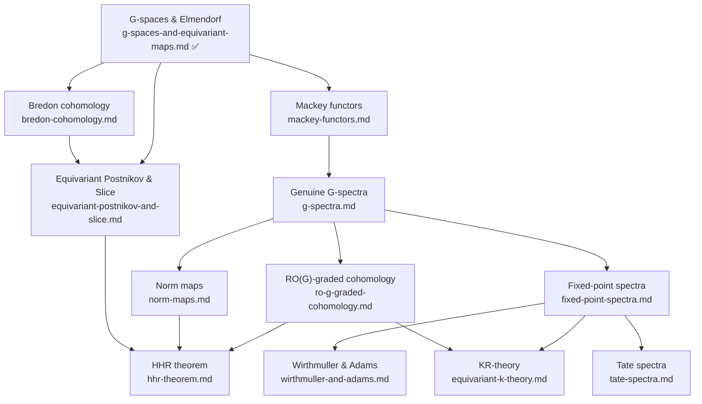

# Equivariant Stable Homotopy Theory: Overview

This file is the index for the `concepts/equivariant-stable-homotopy/` folder. It lists planned and written subtopic notes, organizes them by theme, and collects the canonical references for the field. Use it to decide what to write next without needing to re-survey the landscape.

---

## Notes in This Folder

| File | Status | Topic |
|------|--------|-------|
| `g-spaces-and-equivariant-maps.md` | ✅ Written | G-spaces, orbit category, naive vs. genuine, G-CW complexes, Elmendorf's theorem |
| `equivariant-postnikov-and-slice.md` | 🔲 Planned | Equivariant Postnikov towers (unstable), the slice filtration, slice spectral sequence |
| `bredon-cohomology.md` | 🔲 Planned | Coefficient systems, chain complex of coefficient systems, Bredon (co)homology, computations |
| `mackey-functors.md` | 🔲 Planned | Mackey functors, the Burnside category, spectral Mackey functors (Barwick) |
| `g-spectra.md` | 🔲 Planned | Genuine G-spectra indexed on a complete universe, orthogonal G-spectra, naive vs. genuine stable |
| `ro-g-graded-cohomology.md` | 🔲 Planned | RO(G)-graded homotopy groups, representation spheres, RO(G)-graded Bredon cohomology |
| `fixed-point-spectra.md` | 🔲 Planned | Geometric fixed points $\Phi^H$, categorical fixed points $(-)^H$, homotopy fixed points $(-)^{hH}$; the Tate diagram |
| `wirthmuller-and-adams.md` | 🔲 Planned | Wirthmuller isomorphism $i_! \simeq i_*$, Adams isomorphism, formal duality |
| `norm-maps.md` | 🔲 Planned | Multiplicative norm $N_H^G$, $N_\infty$-operads, commutative equivariant ring spectra |
| `tate-spectra.md` | 🔲 Planned | Tate construction $X^{tG}$, Tate diagonal, generalized Tate cohomology, TC and THH |
| `equivariant-k-theory.md` | 🔲 Planned | Segal's $K_G(X)$, KR-theory (Atiyah), Bott periodicity, Atiyah-Segal completion theorem |
| `hhr-theorem.md` | 🔲 Planned | Kervaire invariant one problem, $MU^{((C_8))}$, Detection/Periodicity/Gap theorems |
| `global-equivariant-homotopy.md` | 🔲 Planned | Global spectra (Schwede), simultaneous $G$-actions for all compact Lie groups $G$ |
| `parametrized-spectra.md` | 🔲 Planned | Parametrized $\infty$-categories (Barwick et al.), $G$-$\infty$-categories, equivariant $\infty$-operads |

---

## Subtopic Map

### Unstable Equivariant Homotopy Theory

| Subtopic | Key Idea | Primary Source |
|----------|----------|----------------|
| G-spaces and Elmendorf | Genuine G-spaces ≃ presheaves on $\mathcal{O}_G$ | Blumberg §1, Elmendorf 1983 |
| Bredon cohomology | Cohomology with coefficient systems; k-invariants for equivariant Postnikov towers | Bredon 1967, Blumberg §1.4 |
| Equivariant Postnikov towers | Objectwise via Elmendorf; fibers are $K(\underline{M}, n)$; k-invariants in Bredon cohomology | Blumberg §1.3 remark, May Alaska §3 |
| Smith theory | Fixed-point sets of $\mathbb{Z}/p$-actions on mod-$p$ homology spheres | May Alaska §3 |

### Equivariant Stable Homotopy Theory

| Subtopic | Key Idea | Primary Source |
|----------|----------|----------------|
| Mackey functors | Abelian-group-valued functors with restriction + transfer on $\mathcal{O}_G$; coefficient objects for RO(G)-theories | Dress 1973, Webb 2000, Blumberg §3 |
| Genuine G-spectra | Spectra indexed on a complete $G$-universe $\mathcal{U}$; two model structures (naive vs. genuine) are now *different categories* | Lewis-May-Steinberger 1986, Blumberg §2 |
| RO(G)-graded cohomology | Suspension by representation spheres $S^V$; homotopy groups $\pi_V^H(X) = [S^V, X]^H$ | May Alaska §XIII–XIV, Costenoble-Waner |
| Fixed-point spectra | Three flavors: $X^H$ (categorical), $\Phi^H X$ (geometric), $X^{hH}$ (homotopy); Tate sequence $X^H \to X^{hH} \to X^{tH}$ | Greenlees-May 1995, Blumberg §2.4 |
| Wirthmuller isomorphism | $i_! \simeq i_* \otimes \text{(representation twist)}$ for restriction $i^*: \text{Sp}^G \to \text{Sp}^H$; equivariant Poincaré duality | May 2003, Fausk-Hu-May 2003 |
| Adams isomorphism | $(G_+ \wedge_H X)^G \simeq X^H$ for a free $H$-spectrum $X$; relates orbits and fixed points | Haugseng et al. 2016, Blumberg §2.4 |
| Norm maps | $N_H^G: \text{Sp}^H \to \text{Sp}^G$; multiplicative transfer; $N_\infty$-operads; no unstable analogue | HHR 2016, Blumberg-Hill 2015 |
| Tate spectra | $X^{tG} = \widetilde{EG} \wedge X^{hG}$; Tate diagonal $\Delta_p: X \to (X^{\otimes p})^{tC_p}$; fundamental for TC | Greenlees-May 1995, Nikolaus-Scholze 2018 |
| Slice filtration | Equivariant analogue of Postnikov tower for G-spectra; slice cells $G_+ \wedge_H S^{m\rho_H}$; indexed by representation dimension | HHR 2016, Hill 2011, Blumberg §5.2 |

### Applications

| Subtopic | Key Idea | Primary Source |
|----------|----------|----------------|
| KR-theory | Spaces with involution; real $K$-theory with 8-fold periodicity; $K_G(X)$ for general $G$ | Atiyah 1966, Segal 1968 |
| HHR theorem | $\theta_j \notin \pi_{2^{j+1}-2}^s$ for $j \geq 7$; uses genuine $C_8$-spectra, slice SS, norm $N_{C_2}^{C_8}(MU_\mathbb{R})$ | HHR 2009/2016, Miller 2011 |
| Global equivariant homotopy | Uniform $G$-equivariance for all compact Lie $G$ simultaneously; ultra-commutative ring spectra | Schwede 2018 |
| Parametrized / $\infty$-categorical | $G$-$\infty$-categories, Barwick's effective Burnside $\infty$-category, spectral Mackey functors | Barwick 2014, Nardin-Shah 2022 |

---

## Dependency Graph

---

## Master References

| Reference | Authors | Year | What It Covers | Link |
|-----------|---------|------|----------------|------|
| [M392C Lecture Notes](https://adebray.github.io/lecture_notes/m392c_EHT_notes.pdf) | Blumberg (notes by Debray) | 2017 | G-spaces, Elmendorf, genuine G-spectra, Mackey functors, RO(G), HHR slice SS — the single best survey | [PDF](https://adebray.github.io/lecture_notes/m392c_EHT_notes.pdf) |
| [Equivariant Homotopy and Cohomology Theory](https://www.math.uchicago.edu/~may/BOOKS/alaska.pdf) | May et al. | 1996 | Complete classical treatment: G-CW, RO(G), Wirthmuller, Adams, Tate; CBMS Alaska notes | [PDF](https://www.math.uchicago.edu/~may/BOOKS/alaska.pdf) |
| [Equivariant Stable Homotopy Theory](https://link.springer.com/book/10.1007/BFb0075778) | Lewis, May, Steinberger | 1986 | Definitive reference for genuine G-spectra on a complete universe; smash product, change-of-universe | Springer LNM 1213 |
| [Equivariant Stable Homotopy Theory and the Kervaire Invariant Problem](https://www.cambridge.org/core/books/equivariant-stable-homotopy-theory-and-the-kervaire-invariant-problem/E2648B96D05293C5197B29B104FA80C2) | Hill, Hopkins, Ravenel | 2021 | Self-contained monograph: orthogonal G-spectra, slice filtration, HHR proof | Cambridge |
| [On the Non-Existence of Elements of Kervaire Invariant One](https://arxiv.org/abs/0908.3724) | Hill, Hopkins, Ravenel | 2009/2016 | Original HHR paper; norm maps, slice SS, Kervaire invariant one | [arXiv:0908.3724](https://arxiv.org/abs/0908.3724) |
| [Equivariant Stable Homotopy Theory](https://www.math.uchicago.edu/~may/PAPERS/Newthird.pdf) | Greenlees, May | 1995 | Handbook survey: all three fixed-point functors, Tate diagram, Wirthmuller/Adams | [PDF](https://www.math.uchicago.edu/~may/PAPERS/Newthird.pdf) |
| [Lectures on Equivariant Stable Homotopy Theory](https://www.math.uni-bonn.de/~schwede/equivariant.pdf) | Schwede | 2020 | Clean modern treatment via orthogonal G-spectra; good complement to LMS | [PDF](https://www.math.uni-bonn.de/~schwede/equivariant.pdf) |
| [A User's Guide to G-Spectra](https://people.math.binghamton.edu/malkiewich/G_spectra.pdf) | Malkiewich | draft | 344pp draft: model structures on G-spectra, comparisons between flavors | [PDF](https://people.math.binghamton.edu/malkiewich/G_spectra.pdf) |
| [Basic Notions of Equivariant Stable Homotopy Theory](https://math.vanderbilt.edu/bohmanar/basicequivnotions.pdf) | Bohmann | 2010 | Short expository notes: three fixed-point functors, RO(G)-grading in a few pages | [PDF](https://math.vanderbilt.edu/bohmanar/basicequivnotions.pdf) |
| [Systems of Fixed Point Sets](https://www.ams.org/journals/tran/1983-277-01/S0002-9947-1983-0690052-0/) | Elmendorf | 1983 | Original Elmendorf's theorem via bar construction | [AMS](https://www.ams.org/journals/tran/1983-277-01/S0002-9947-1983-0690052-0/) |
| [Equivariant Cohomology Theories](https://link.springer.com/book/10.1007/BFb0082690) | Bredon | 1967 | Original definition of Bredon cohomology with coefficient systems | Springer LNM 34 |
| [A Guide to Mackey Functors](https://www.sas.rochester.edu/mth/sites/doug-ravenel/otherpapers/WebbMF.pdf) | Webb | 2000 | Handbook survey: algebra of Mackey functors, resolutions, connections to representation theory | [PDF](https://www.sas.rochester.edu/mth/sites/doug-ravenel/otherpapers/WebbMF.pdf) |
| [Spectral Mackey Functors and Equivariant Algebraic K-Theory](https://arxiv.org/abs/1404.0108) | Barwick | 2014 | Mackey functors as excisive functors on the Burnside ∞-category; bridges classical and ∞-categorical | [arXiv:1404.0108](https://arxiv.org/abs/1404.0108) |
| [Prerequisites for Carlsson's Lecture](https://www.sas.rochester.edu/mth/sites/doug-ravenel/otherpapers/prerequisites_for_carlsson.pdf) | Adams | 1984 | Adams's expository account of genuine G-spectra, representations, suspension spectra | [PDF](https://www.sas.rochester.edu/mth/sites/doug-ravenel/otherpapers/prerequisites_for_carlsson.pdf) |
| [The Wirthmuller Isomorphism Revisited](https://arxiv.org/abs/math/0206080) | May | 2003 | Clean proof of Wirthmuller isomorphism; clarifies relation to Adams isomorphism | [arXiv:math/0206080](https://arxiv.org/abs/math/0206080) |
| [Isomorphisms Between Left and Right Adjoints](https://www.math.uchicago.edu/~may/PAPERS/WirthFinalMarch.pdf) | Fausk, Hu, May | 2003 | Wirthmuller and Adams isomorphisms via abstract formal duality | [PDF](https://www.math.uchicago.edu/~may/PAPERS/WirthFinalMarch.pdf) |
| [The Adams Isomorphism Revisited](https://arxiv.org/abs/2311.04884) | Kro | 2024 | Modern proof via equivariant semiadditivity in parametrized higher category theory | [arXiv:2311.04884](https://arxiv.org/abs/2311.04884) |
| [The Equivariant Slice Filtration: A Primer](https://arxiv.org/abs/1107.3582) | Hill | 2011 | Best entry point for the slice filtration before the full HHR paper | [arXiv:1107.3582](https://arxiv.org/abs/1107.3582) |
| [Generalized Tate Cohomology](https://www.math.uchicago.edu/~may/PAPERS/Tate.pdf) | Greenlees, May | 1995 | Foundational AMS Memoir constructing Tate spectra for compact Lie groups | [PDF](https://www.math.uchicago.edu/~may/PAPERS/Tate.pdf) |
| [On Topological Cyclic Homology](https://arxiv.org/abs/1707.01799) | Nikolaus, Scholze | 2018 | Tate diagonal $\Delta_p$; reformulates TC via the Tate construction | [arXiv:1707.01799](https://arxiv.org/abs/1707.01799) |
| [Operadic Multiplications in Equivariant Spectra, Norms, and Transfers](https://arxiv.org/abs/1309.1750) | Blumberg, Hill | 2015 | $N_\infty$-operads; characterizes which norm maps a commutative equivariant ring spectrum admits | [arXiv:1309.1750](https://arxiv.org/abs/1309.1750) |
| [K-Theory and Reality](https://webhomes.maths.ed.ac.uk/~v1ranick/papers/atiyahkr.pdf) | Atiyah | 1966 | Original KR-theory; real $K$-theory for spaces with involution; 8-fold periodicity | [PDF](https://webhomes.maths.ed.ac.uk/~v1ranick/papers/atiyahkr.pdf) |
| [Equivariant K-Theory](https://www.numdam.org/article/PMIHES_1968__34__129_0.pdf) | Segal | 1968 | Systematic $K_G(X)$ for compact $G$; equivariant Bott periodicity; localization theorem | [NUMDAM](https://www.numdam.org/article/PMIHES_1968__34__129_0.pdf) |
| [Equivariant K-Theory and Completion](https://webhomes.maths.ed.ac.uk/~v1ranick/papers/atiyahsegal1.pdf) | Atiyah, Segal | 1969 | Atiyah-Segal completion theorem: $K_G(X)^\wedge_{I(G)} \cong K(EG \times_G X)$ | [PDF](https://webhomes.maths.ed.ac.uk/~v1ranick/papers/atiyahsegal1.pdf) |
| [Global Homotopy Theory](https://arxiv.org/abs/1802.09382) | Schwede | 2018 | Definitive monograph on global equivariant homotopy via orthogonal spectra | [arXiv:1802.09382](https://arxiv.org/abs/1802.09382) |
| [Kervaire Invariant One [after HHR]](https://arxiv.org/abs/1104.4523) | Miller | 2011 | Bourbaki exposé surveying the HHR proof strategy; best orientation before the original | [arXiv:1104.4523](https://arxiv.org/abs/1104.4523) |
| [Parametrized Higher Category Theory and Higher Algebra](https://arxiv.org/abs/1608.03654) | Barwick et al. | 2016 | Foundations of parametrized $\infty$-categories for equivariant algebra | [arXiv:1608.03654](https://arxiv.org/abs/1608.03654) |
| [Parametrized and Equivariant Higher Algebra](https://arxiv.org/abs/2203.00072) | Nardin, Shah | 2022 | Parametrized $\infty$-operads; Day convolution; multiplicative equivariant structures | [arXiv:2203.00072](https://arxiv.org/abs/2203.00072) |
