# Generative Recommender Systems

## Table of Contents

- [[#1. The Recommendation Problem at Scale|1. The Recommendation Problem at Scale]]
  - [[#1.1 Formal Task Definition|1.1 Formal Task Definition]]
  - [[#1.2 The Industrial Pipeline|1.2 The Industrial Pipeline]]
  - [[#1.3 Why Scale Makes This Hard|1.3 Why Scale Makes This Hard]]
- [[#2. The DLRM Paradigm and Its Limits|2. The DLRM Paradigm and Its Limits]]
  - [[#2.1 Architecture: FM-Style Interactions over Engineered Features|2.1 Architecture: FM-Style Interactions over Engineered Features]]
  - [[#2.2 Quality Saturation: A Formal Argument|2.2 Quality Saturation: A Formal Argument]]
  - [[#2.3 Target-Aware Attention and the DIN Argument|2.3 Target-Aware Attention and the DIN Argument]]
  - [[#2.4 The Feature Engineering Bottleneck|2.4 The Feature Engineering Bottleneck]]
- [[#3. The Generative Turn: Core Concepts|3. The Generative Turn: Core Concepts]]
  - [[#3.1 What Generative Means in Recommendation|3.1 What Generative Means in Recommendation]]
  - [[#3.2 Two Sub-Problems: Retrieval and Ranking|3.2 Two Sub-Problems: Retrieval and Ranking]]
  - [[#3.3 Supervision Density: The Key Advantage|3.3 Supervision Density: The Key Advantage]]
  - [[#3.4 A Unified Model for Retrieval and Ranking|3.4 A Unified Model for Retrieval and Ranking]]
- [[#4. Generative Retrieval: The Tokenization Problem|4. Generative Retrieval: The Tokenization Problem]]
  - [[#4.1 Semantic IDs via RQ-VAE: TIGER|4.1 Semantic IDs via RQ-VAE: TIGER]]
  - [[#4.2 COBRA: Cascaded Sparse-Dense Generation|4.2 COBRA: Cascaded Sparse-Dense Generation]]
- [[#5. Generative Ranking: Sequential Transduction|5. Generative Ranking: Sequential Transduction]]
  - [[#5.1 HSTU: The Foundational Architecture|5.1 HSTU: The Foundational Architecture]]
  - [[#5.2 GenRank: Efficient Industrial Generative Ranking|5.2 GenRank: Efficient Industrial Generative Ranking]]
  - [[#5.3 GR2: LLM-Based Reranking with Reasoning|5.3 GR2: LLM-Based Reranking with Reasoning]]
- [[#6. Scaling Laws for Generative Recommenders|6. Scaling Laws for Generative Recommenders]]
  - [[#6.1 The HSTU Scaling Law|6.1 The HSTU Scaling Law]]
  - [[#6.2 Why Generative Models Scale and DLRMs Do Not|6.2 Why Generative Models Scale and DLRMs Do Not]]
  - [[#6.3 Connection to Neural Scaling Laws|6.3 Connection to Neural Scaling Laws]]
- [[#7. Open Problems and Future Directions|7. Open Problems and Future Directions]]
- [[#8. References|8. References]]

> **See also:** [[systems|ML Systems for Generative Recommenders]] — a companion note covering distributed training, inference serving, embedding infrastructure, and online learning for production-scale GR deployments.

---

## 1. The Recommendation Problem at Scale

### 1.1 Formal Task Definition

**Definition (Recommendation Task).** Let $\mathcal{U}$ be a set of users and $\mathcal{I}$ a set of items (content, ads, products). For each user $u \in \mathcal{U}$ and item $x \in \mathcal{I}$, the recommendation system must estimate

$$p(a \mid u, x, \mathcal{C})$$

where $a$ is a user action from a discrete action space $\mathcal{A}$ (click, watch, purchase, skip, etc.), and $\mathcal{C}$ is a context (device, time, session state). The system then selects a ranked list of items to present by solving an optimization problem over this distribution, subject to business constraints.

Two subtasks partition the problem:

**Definition (Retrieval).** Given a user $u$ and a context $\mathcal{C}$, retrieve a small set $\mathcal{R} \subset \mathcal{I}$ with $|\mathcal{R}| \ll |\mathcal{I}|$ that contains items with high probability of positive engagement. This is an approximate nearest-neighbor problem in a learned representation space.

**Definition (Ranking).** Given $\mathcal{R}$ from retrieval, produce a total order on items in $\mathcal{R}$ consistent with user preferences and business objectives. This is typically cast as a CTR prediction problem: estimate $p(\text{click} \mid u, x)$ for each $x \in \mathcal{R}$.

### 1.2 The Industrial Pipeline

In production at scale (Meta, Xiaohongshu, Baidu, etc.), the recommendation system is organized as a multi-stage funnel:

1. **Retrieval**: from $|\mathcal{I}| \sim 10^9$ items, retrieve $O(10^3)$ candidates using approximate methods (dense retrieval, collaborative filtering, keyword matching).
2. **Pre-ranking**: from $O(10^3)$ candidates, score and reduce to $O(10^2)$ using a lightweight model.
3. **Ranking**: apply a full-capacity model to $O(10^2)$ candidates and produce a final ranked list.
4. **Policy layer**: apply business rules, diversity constraints, and contextual adjustments to the ranked output.

Historically, each stage was a separate system with its own architecture, feature engineering pipeline, and training objective. A key consequence is that knowledge learned in one stage (e.g., that users who watched sports content are likely to engage with fitness ads) is not automatically transferred to other stages.

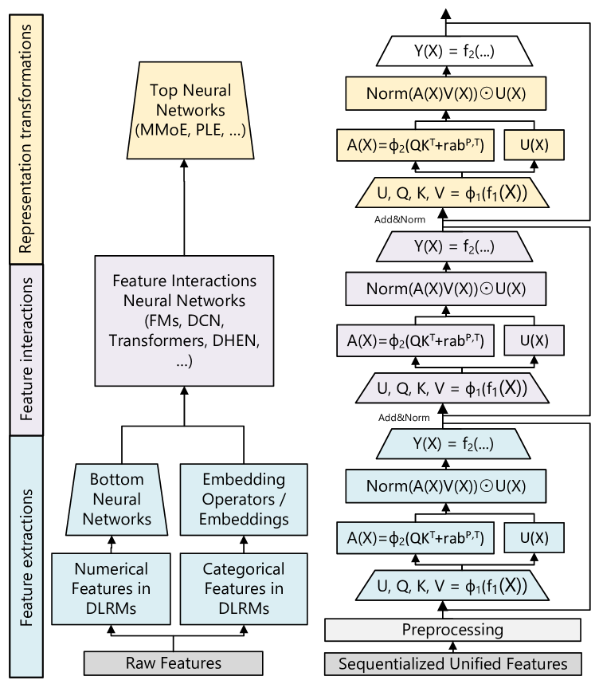
*Figure 3 (Zhai et al., 2024): Left — the full DLRM setup with categorical feature embeddings, FM pairwise interactions, and impression-level training. Right — a simplified HSTU showing the unified interleaved sequence of item and action tokens with causal attention. This architectural contrast is the core of the paradigm shift.*

### 1.3 Why Scale Makes This Hard

Three structural properties of industrial recommendation create fundamental challenges:

**Sparse supervision.** User behavior is long-tailed: most items receive few interactions. A new item posted on a platform may accumulate only tens of interactions before it either goes viral (and receives billions) or expires. This sparsity means that models relying on per-item statistics converge slowly or not at all for most items.

**Massive, non-stationary vocabulary.** On creator-economy platforms (short video feeds, news), the item set $\mathcal{I}$ is not fixed. New content is created continuously; old content expires. At any given time, $|\mathcal{I}|$ is in the billions, but it changes daily. This is qualitatively different from NLP, where the token vocabulary is fixed and stationary.

**Power-law interaction distribution.** Both user activity and item popularity follow power laws. A small fraction of users account for a disproportionate share of interactions; a small fraction of items account for most traffic. Models trained on raw interaction data without careful handling will overfit to popular items and be nearly untrained on the long tail.

---

## 2. The DLRM Paradigm and Its Limits

### 2.1 Architecture: FM-Style Interactions over Engineered Features

The dominant production architecture prior to generative recommenders is the *Deep Learning Recommendation Model* (DLRM). Its design philosophy rests on two pillars:

**Pillar 1: Feature engineering.** User-item pairs are described by hundreds or thousands of handcrafted features: categorical IDs (user ID, item ID, category), numerical aggregates (7-day CTR by category, session-level engagement counts, recency-weighted click sums), and cross-product features (category × device, brand × price tier). These features require significant domain knowledge to design and are committed at training time.

**Pillar 2: Pairwise interaction over fixed-dimension embeddings.** Each feature embedding $\mathbf{v}_i \in \mathbb{R}^d$ is obtained from an embedding table lookup (categorical) or linear projection (numerical). The model then computes *factorization machine*-style pairwise interactions $\langle \mathbf{v}_i, \mathbf{v}_j \rangle$ over all feature pairs, concatenates these with an MLP applied to the raw features, and produces a click probability. The FM interaction is efficient to compute: the naive $O(n^2 d)$ computation over $n$ features reduces to $O(nd)$ via the identity

$$\sum_{i < j} \langle \mathbf{v}_i, \mathbf{v}_j \rangle = \frac{1}{2}\left[\left\|\sum_i \mathbf{v}_i\right\|^2 - \sum_i \|\mathbf{v}_i\|^2\right].$$

**Training objective.** Each training example is a single (user, item, label) triple. A positive example corresponds to a user action (click, watch completion); negative examples are impressions without engagement. The model is trained with binary cross-entropy. *This is impression-level training*: each user interaction contributes exactly one training signal.

**Why this works at moderate scale.** For a stable item vocabulary of moderate size, per-item ID embeddings are effective: each item accumulates training signal over many impressions, the embedding converges to a useful representation, and the FM interaction captures cross-feature dependencies that a pure MLP would miss. The DLRM paradigm dominated industrial recommendation from roughly 2016 to 2023.

### 2.2 Quality Saturation: A Formal Argument

The critical failure mode of item-centric DLRM at scale was formalized by Zhao et al. (KDD 2023) as *quality saturation*. We present their argument precisely.

**Definition (Item-Centric Ranking, ICR).** An ICR model assigns a unique learnable embedding $\theta_x \in \mathbb{R}^d$ to each item $x \in \mathcal{I}$. The total parameter count is $\Theta = \theta_{\text{shared}} + |\mathcal{I}| \cdot d$, where $\theta_{\text{shared}}$ are parameters shared across all items.

**Definition (User-Centric Ranking, UCR).** A UCR model represents each user $u$ as a function of their behavior history. Item representations are either shared (content embeddings) or absent. Total parameters are $O(1)$ in $|\mathcal{I}|$.

**Proposition (Asymptotic Error Floor for ICR).** On a creator-economy platform where the item inventory grows as $|\mathcal{I}(t)| = O(t)$ and total training data volume grows as $T(t) = O(t)$, the expected estimation error for an ICR model satisfies:

$$\mathbb{E}\!\left[\|\hat{\theta}_t - \theta^*\|^2\right]_{\text{ICR}} = \Omega(1) \quad \text{as } t \to \infty.$$

**Sketch.** The key observation is that total training signal $T(t) = O(t)$ is split across $|\mathcal{I}(t)| = O(t)$ item embeddings. The training signal per parameter is therefore $T(t) / (|\mathcal{I}(t)| \cdot d) = O(1)$ — it does not grow with $t$. By standard asymptotic arguments for parametric estimators, the estimation error per item remains bounded away from zero regardless of how much total data is collected. This is the error floor.

In contrast, for UCR:

$$\mathbb{E}\!\left[\|\hat{\theta}_t - \theta^*\|^2\right]_{\text{UCR}} = O(1/t) \quad \text{as } t \to \infty$$

because the UCR parameter count is $O(1)$ in $t$, so the signal-to-parameter ratio grows unboundedly.

**The parameter inflation problem.** Empirically (Table 4 of Zhao et al.), at the 60-day mark of production training data on a creator-economy platform, an ICR model is **21 times larger** in total parameters than the UCR counterpart trained on identical data. This is entirely due to item embedding growth.

**The embedding dimension degradation.** A natural response to quality saturation is to increase embedding dimension $d$, adding capacity per item. However, Zhao et al. find empirically that increasing $d$ causes ICR to *degrade* in production: the additional parameters are initialized randomly and see too few training signals to converge, adding noise rather than capacity. UCR, by contrast, shows consistent improvement with larger $d$. **This rules out embedding dimension scaling as a remedy for ICR quality saturation.**

*This argument does not depend on data volume — it holds even as training data grows without bound. The problem is structural: item vocabularies on creator-economy platforms are intrinsically non-stationary, and per-item embeddings accumulate signal only during each item's lifetime.*

### 2.3 Target-Aware Attention and the DIN Argument

One principled response within the DLRM paradigm is to make user representations *target-aware*: rather than summarizing a user's full history into a single fixed vector, compute a candidate-conditioned representation that attends selectively to the most relevant history.

**Definition (Target-Aware User Representation, DIN).** Let $\{(\mathbf{e}_j, t_j)\}_{j=1}^H$ be the user's history of item embeddings with timestamps, and let $\mathbf{v}_A$ be the candidate item embedding. The *Deep Interest Network* (Zhou et al., KDD 2018) defines the user representation for candidate $A$ as:

$$\mathbf{v}_U(A) = \sum_{j=1}^{H} a(\mathbf{e}_j,\, \mathbf{v}_A) \cdot \mathbf{e}_j$$

where the scalar weights $a(\mathbf{e}_j, \mathbf{v}_A)$ are produced by a small MLP applied to the concatenation:

$$[\,\mathbf{e}_j,\ \mathbf{v}_A,\ \mathbf{e}_j \odot \mathbf{v}_A,\ \mathbf{e}_j \otimes \mathbf{v}_A\,] \in \mathbb{R}^{d + d + d + d^2}.$$

The outer product term $\mathbf{e}_j \otimes \mathbf{v}_A \in \mathbb{R}^{d \times d}$ gives the activation unit explicit access to multiplicative cross-item feature interactions. Crucially, **the weights are not softmax-normalized**: the magnitude of $\mathbf{v}_U(A)$ encodes preference intensity, not merely relative attention distribution.

**Why no softmax?** Softmax normalization would force $\sum_j a_j = 1$, making the representation scale-invariant to the number of relevant history items. A user who has interacted 100 times with sports content and once with cooking would produce the same representation for a sports candidate as a user with two sports interactions and one cooking interaction, if relative weights are identical. Without softmax, the absolute sum $\sum_j a_j$ scales with the volume of relevant history, encoding how *strongly* the user prefers this category. DIN finds this unnormalized formulation consistently outperforms the softmax variant in CTR experiments.

**Implication for feature engineering.** Handcrafted numerical features (7-day CTR by category, session-level click counts) are fixed aggregations over user history that commit to a particular partitioning scheme at feature-engineering time. DIN's target-aware attention subsumes these: for any feature that a human engineer might compute, the attention mechanism can learn to approximate it — and moreover, to condition the aggregation on the specific candidate being scored. This is strictly more expressive than any static pre-computed feature.

### 2.4 The Feature Engineering Bottleneck

The DIN argument identifies a deeper problem: even target-aware attention over a fixed feature set is constrained by what engineers chose to measure. Static features cannot capture:

- **Temporal dynamics**: how user interests evolve at multiple timescales (intra-session, daily, weekly, seasonal).
- **Higher-order context**: interaction effects between user state and item characteristics that engineers did not anticipate.
- **Action sequences**: the ordered structure of interactions (which items were seen and in what order before engaging).

The logical endpoint of the DIN argument is to remove engineered features entirely and process raw action sequences directly. If the model is expressive enough, it should learn to compute any feature the engineer might have designed — and many more that were never designed.

*This reasoning, taken to its conclusion, motivates the generative recommender paradigm.*

---

## 3. The Generative Turn: Core Concepts

### 3.1 What Generative Means in Recommendation

The term *generative* in this context is borrowed from language modeling but refers to a specific structural property: the model defines an explicit distribution over the next event in a user sequence, rather than scoring a fixed (user, item) pair.

**Definition (Sequential Recommendation).** Let $h_t = (x_0, a_0, x_1, a_1, \ldots, x_{t-1}, a_{t-1})$ be the chronological sequence of item-action pairs for a user up to time $t$. A generative recommender models the conditional distribution

$$p(x_t, a_t \mid h_{t-1})$$

or, for retrieval only, $p(x_t \mid h_{t-1})$. The model defines a *sequential transducer*: a function from histories to probability distributions over future events.

This differs from the DLRM formulation $p(a \mid u, x)$ in a fundamental way. The DLRM formulation is *discriminative*: it conditions on a specific candidate item $x$ and asks "would the user click on this?" The generative formulation is *generative*: it conditions on the user's full history and asks "what would the user do next, over the entire item space?"

**Remark.** The "generative" label does not require the model to generate novel content. Rather, it refers to the generative modeling paradigm: specifying a distribution over outputs that can be queried either directly (next-item generation) or via posterior inference (scoring a specific candidate against the model's distribution).

### 3.2 Two Sub-Problems: Retrieval and Ranking

The generative paradigm decomposes naturally into two complementary sub-problems.

**Definition (Generative Retrieval).** Given the user history $h_{t-1}$, produce a ranked list of items from $\mathcal{I}$ sorted by $p(x \mid h_{t-1})$, without requiring a pre-specified candidate set. The challenge is that $|\mathcal{I}| \sim 10^9$, so direct computation of $p(x \mid h_{t-1})$ for all $x$ is infeasible. Generative retrieval must encode items in a way that allows efficient argmax computation.

**Definition (Generative Ranking).** Given a candidate item $x$ and history $h_{t-1}$, predict the action the user will take. In the sequential formulation, this becomes $p(a_t \mid x_t = x, h_{t-1})$, where $x_t$ is appended to the history and the model predicts the next action. This is formally identical to the retrieval formulation — the same model can handle both tasks by choosing what to condition on.

The unified treatment is architecturally significant: a single model trained on the full sequence $p(x_t, a_t \mid h_{t-1})$ simultaneously learns to retrieve (by sampling or beam-searching $x_t$) and rank (by conditioning on $x_t$ and predicting $a_t$).

### 3.3 Supervision Density: The Key Advantage

**Definition (Supervision Density).** For a training dataset of $N$ users with interaction sequences of length $n_i$ each, supervision density is the ratio of independent training signals to model parameters.

Under impression-level DLRM training, each user contributes $n_i$ independent (user, item, label) triples. However, each triple is processed as a separate forward pass — the cross-time dependencies within a user's sequence are ignored. A user with 1,000 interactions contributes 1,000 binary labels but no information about *which* interactions led to *which* subsequent actions.

Under generative training, the same user with 1,000 interactions contributes $n_i - 1$ supervised next-event predictions from a single forward pass. Crucially, the *cross-time structure* (what the user did in step $t-1$ conditions what they do in step $t$) is captured explicitly. The total supervision count is the same, but the information per training signal is higher because each prediction is conditioned on the user's full prior context.

**The training cost comparison.** For a sequence model with $d$-dimensional embeddings processing a sequence of length $n$, a single forward pass costs $O(n^2 d)$ in attention and produces $n$ supervised predictions. The cost per training signal is $O(n d)$. For impression-level training, a model that processes each item against the full history independently costs $O(n \cdot n d) = O(n^2 d)$ for $n$ predictions. The cost per training signal is also $O(n d)$. *The training efficiency is asymptotically identical* — but the generative model captures temporal dependencies that the impression-level model cannot, for the same computational budget.

**The scaling implication.** As model size grows, the generative model's richer per-signal information means the signal-to-parameter ratio decreases more slowly, enabling productive training at larger scale. This is the fundamental reason generative models exhibit scaling laws while DLRMs plateau (see Section 6).

### 3.4 A Unified Model for Retrieval and Ranking

**Proposition (Unified Retrieval and Ranking).** A single sequential transducer trained on $p(x_t, a_t \mid h_{t-1})$ can serve both retrieval and ranking tasks without architectural modification:

- **For retrieval**: at inference time, use the model's distribution $p(x_t \mid h_{t-1})$ to generate top-$K$ candidate items via beam search or ANN lookup in the representation space.
- **For ranking**: given candidate item $x_c$, append it to the history and query $p(a_t \mid x_c, h_{t-1})$.

Both operations share the same encoder and the same learned representations. Knowledge learned during ranking (which item features correlate with positive actions) directly informs retrieval (which items to surface), and vice versa.

*This unification eliminates the infrastructure overhead of maintaining separate retrieval and ranking systems, and enables knowledge transfer between tasks that was impossible under separate-model designs.*

---

## 4. Generative Retrieval: The Tokenization Problem

Generative ranking, covered in Section 5, is conceptually straightforward: process the user's history as a sequence and predict the next action. Generative *retrieval*, however, faces a fundamental challenge: the item vocabulary is too large for standard sequence generation.

**Definition (The Tokenization Problem).** In natural language generation, a model decodes over a vocabulary of $\sim 50{,}000$ tokens. In recommendation retrieval, the "vocabulary" is the item set $|\mathcal{I}| \sim 10^9$. A softmax output layer over $10^9$ items is computationally infeasible: the weight matrix alone requires terabytes of memory. Some encoding of items into a compact, decodable representation is necessary.

### 4.1 Semantic IDs via RQ-VAE: TIGER

The TIGER paper (Rajput et al., NeurIPS 2023) proposes encoding each item as a *semantic ID*: a short tuple of discrete codewords $(c_1, c_2, \ldots, c_K)$ that the sequence model can generate autoregressively.

**Definition (Residual Quantized VAE).** A *Residual Quantized VAE* (RQ-VAE) is a hierarchical quantization scheme that encodes a dense embedding $\mathbf{z} \in \mathbb{R}^d$ into a sequence of $K$ codewords from codebooks $\mathcal{C}_1, \ldots, \mathcal{C}_K$, each of size $V$:

1. Compute the first quantization residual: find $c_1 = \arg\min_{v \in \mathcal{C}_1} \|\mathbf{z} - v\|$. Set residual $\mathbf{r}_1 = \mathbf{z} - \mathbf{e}_{c_1}$.
2. For each subsequent level $k = 2, \ldots, K$: find $c_k = \arg\min_{v \in \mathcal{C}_k} \|\mathbf{r}_{k-1} - v\|$. Set $\mathbf{r}_k = \mathbf{r}_{k-1} - \mathbf{e}_{c_k}$.
3. The semantic ID for item $x$ is the tuple $(c_1(x), c_2(x), \ldots, c_K(x))$.

The first level captures the coarsest structure (broad category); each subsequent level refines the approximation. Items with similar content embeddings receive similar semantic IDs — specifically, similar prefixes $(c_1, c_2, \ldots)$ — enabling hierarchical retrieval.

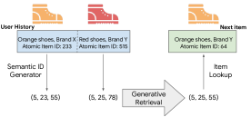
*Figure 1 (Rajput et al., NeurIPS 2023): Overview of the TIGER framework. Each item is encoded into a tuple of discrete semantic tokens (semantic ID) via RQ-VAE. Sequential recommendation is then expressed as a generative retrieval task: the encoder-decoder Transformer takes the user's history of semantic IDs and autoregressively decodes the semantic ID of the next item.*

**The seq2seq generation procedure.** TIGER trains a Transformer-based encoder-decoder. The encoder processes the user's history of semantic IDs. The decoder autoregressively generates the semantic ID of the next item, producing $(c_1, c_2, \ldots, c_K)$ one token at a time. At each decode step, the output vocabulary is of size $V$ (typically 256), not $|\mathcal{I}|$.

**Beam search over the code tree.** By searching over partially generated codes, beam search traverses the item semantic tree efficiently. A beam of width $B$ explores $B$ candidate prefixes at each decoding step, pruning invalid completions (codes not assigned to any item). The total cost scales as $O(B \cdot K \cdot V)$ rather than $O(|\mathcal{I}|)$.

**Proposition (Representational Capacity).** With $K$ quantization levels and codebooks of size $V$, the total number of distinct semantic IDs is $V^K$. For $K = 3$, $V = 256$: capacity is $256^3 \approx 1.7 \times 10^7$, sufficient for typical item inventories. Longer codes accommodate larger inventories with finer granularity.

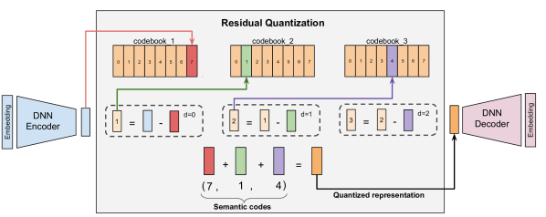
*Figure 3 (Rajput et al., NeurIPS 2023): The residual quantization process. The encoder output $\mathbf{r}_0$ is quantized to the nearest codebook entry $c_1$; the residual $\mathbf{r}_1 = \mathbf{r}_0 - \mathbf{e}_{c_1}$ is then quantized at the next level, and so on. The semantic ID is the tuple $(c_1, c_2, \ldots, c_K)$ of codeword indices.*

**The RQ-VAE training objective.** The encoder and codebooks are trained jointly to minimize reconstruction error while keeping codebook entries close to the inputs they represent:

$$\mathcal{L}_{\text{RQ-VAE}} = \underbrace{\|\mathbf{z} - \hat{\mathbf{z}}\|_2^2}_{\text{reconstruction}} + \beta \sum_{k=1}^K \underbrace{\|\text{sg}[\mathbf{r}_k] - \mathbf{e}_{c_k}\|_2^2}_{\text{codebook loss}} + \gamma \sum_{k=1}^K \underbrace{\|\mathbf{r}_k - \text{sg}[\mathbf{e}_{c_k}]\|_2^2}_{\text{commitment loss}}$$

where $\hat{\mathbf{z}} = \sum_{k=1}^K \mathbf{e}_{c_k}$ is the reconstruction, and $\text{sg}[\cdot]$ denotes stop-gradient. The codebook loss moves each entry toward the inputs assigned to it; the commitment loss moves the encoder outputs toward the codebook entries. Neither gradient flows through the argmin — the *straight-through estimator* passes gradients directly from $\hat{\mathbf{z}}$ to $\mathbf{z}$ as if the quantization step were the identity.

**The codebook collapse problem.** The straight-through estimator creates a pathological failure mode: codebook entries that are rarely selected receive no gradient signal and drift toward irrelevance, causing more and more inputs to be assigned to the same small set of active entries. Empirically (Liang et al., GR2 2026), without mitigation, a $K=4$ RQ-VAE achieves only $\sim$31% codebook utilization — meaning most of the codebook is dead, and many distinct items share identical semantic IDs (*SID collision*). A model that cannot distinguish two items by their SIDs cannot recommend one over the other.

Two techniques are necessary and sufficient to achieve $\geq$99% uniqueness (Liang et al., 2026):

1. **EMA codebook updates.** Instead of updating codebook entries via backpropagation, update them by an exponential moving average of the inputs assigned to each entry:
$$\mathbf{e}_j^{(k)} \leftarrow \gamma\, \mathbf{e}_j^{(k)} + (1 - \gamma)\, \bar{\mathbf{r}}_j^{(k)}, \quad \gamma \in [0.95, 0.99]$$
where $\bar{\mathbf{r}}_j^{(k)}$ is the mean of all residuals $\mathbf{r}_k$ assigned to entry $j$ in the current batch. This provides a stable, direct update signal to codebook entries bypassing the straight-through gradient — the most critical single technique.

2. **Random last level.** At inference time, the final quantization level $c_K$ is assigned *uniformly at random* from unused codewords rather than by nearest-neighbor. This sacrifices reconstruction fidelity at the finest level in exchange for guaranteed distinctiveness. Alone it contributes +28.7% uniqueness; combined with EMA it closes the gap to $\geq$99.95%.

**The uniqueness–quality tradeoff.** Adding a *contrastive loss* on top of $\mathcal{L}_{\text{RQ-VAE}}$ encourages items that co-occur in user histories to have similar SIDs:
$$\mathcal{L}_{\text{ctr}} = -\frac{1}{|\mathcal{P}(i)|} \sum_{p \in \mathcal{P}(i)} \log \frac{\exp(\tilde{\mathbf{h}}_i^\top \tilde{\mathbf{h}}_p / T)}{\exp(\tilde{\mathbf{h}}_i^\top \tilde{\mathbf{h}}_p / T) + \sum_{n \in \mathcal{N}(i)} \exp(\tilde{\mathbf{h}}_i^\top \tilde{\mathbf{h}}_n / T)}$$
This encodes collaborative signal into the code structure — items frequently bought together share prefix codes, making beam search more likely to retrieve semantically related items. However, it also *reduces* uniqueness by −13.2% (similar items intentionally share codes). The tradeoff is empirical: contrastive loss hurts SID uniqueness but improves downstream recommendation quality on standard benchmarks.

**The information loss problem.** Even with perfect uniqueness, quantization is lossy by construction: the final residual $\mathbf{r}_K$ is discarded. The reconstruction error $\|\mathbf{z} - \hat{\mathbf{z}}\|$ cannot be driven to zero without increasing $K$ or $V$, both of which increase inference cost. COBRA (Section 4.2) addresses this by generating a complementary dense vector alongside the sparse ID.

*Additionally, approximately 0.3–6% of beam-searched codes at depth $K=3$ are invalid (assigned to no item), requiring re-ranking or padding. This overhead grows with code depth.*

### 4.2 COBRA: Cascaded Sparse-Dense Generation

COBRA (Yang et al., 2025) addresses the information loss problem by augmenting discrete semantic IDs with a generated dense vector, producing a joint sparse-dense item representation.

**The core insight.** An RQ-VAE semantic ID $c$ captures which *cluster* an item belongs to. A dense vector $\mathbf{v} \in \mathbb{R}^d$ captures where within that cluster the item lies. Generating both — conditioned on each other — recovers information that neither alone could represent.

**Definition (COBRA Probabilistic Factorization).** Let $\text{ID}_{t+1}$ be the semantic ID of the next item and $\mathbf{v}_{t+1}$ its dense representation. COBRA factorizes the joint distribution as:

$$P(\text{ID}_{t+1},\, \mathbf{v}_{t+1} \mid S_{1:t}) = P(\text{ID}_{t+1} \mid S_{1:t}) \cdot P(\mathbf{v}_{t+1} \mid \text{ID}_{t+1},\, S_{1:t})$$

where $S_{1:t}$ is the user's interaction history. This factorization is the *cascade*: the dense vector generation is conditioned on the previously generated sparse ID, which constrains it to be consistent with the coarse-grained prediction.

**History representation.** Each history event $(x_t, \mathbf{v}_t)$ is represented by concatenating the sparse ID embedding and the dense vector: $\mathbf{h}_t = [\mathbf{e}(\text{ID}_t);\ \mathbf{v}_t] \in \mathbb{R}^{2d}$.

**Output heads.** COBRA uses a shared Transformer decoder with two prediction heads:
- *SparseHead*: projects decoder output to logits over the codebook, producing $P(\text{ID}_{t+1} \mid S_{1:t})$.
- *DenseHead*: after appending the predicted $\text{ID}_{t+1}$ embedding to the sequence, projects the updated decoder output to a dense vector $\hat{\mathbf{v}}_{t+1}$, producing $P(\mathbf{v}_{t+1} \mid \text{ID}_{t+1}, S_{1:t})$.

**Training objectives.** The total loss is:

$$\mathcal{L} = \mathcal{L}_{\text{sparse}} + \mathcal{L}_{\text{dense}}$$

where $\mathcal{L}_{\text{sparse}}$ is cross-entropy over the codebook, and $\mathcal{L}_{\text{dense}}$ is a contrastive loss using cosine similarity:

$$\mathcal{L}_{\text{dense}} = -\log \frac{\exp(\cos(\hat{\mathbf{v}}_{t+1},\, \mathbf{v}^+) / \tau)}{\sum_{k} \exp(\cos(\hat{\mathbf{v}}_{t+1},\, \mathbf{v}^k) / \tau)}$$

where $\mathbf{v}^+$ is the ground-truth dense vector and $\{\mathbf{v}^k\}$ are in-batch negatives.

**Definition (BeamFusion Inference).** COBRA's inference procedure operates in three phases:

1. *Beam search over sparse IDs*: run beam search with width $M$ to produce $M$ candidate IDs $\{\text{ID}^1, \ldots, \text{ID}^M\}$ with associated log-probabilities $\{\phi^1, \ldots, \phi^M\}$.
2. *Conditional dense generation*: for each beam $k$, append $\text{ID}^k$ to the sequence and run DenseHead to produce $\hat{\mathbf{v}}^k$.
3. *BeamFusion ranking*: retrieve ANN neighbors for each $\hat{\mathbf{v}}^k$ and score the final candidates by:

$$\Phi(\hat{\mathbf{v}}^k, \text{ID}^k) = \text{Softmax}(\tau \cdot \phi^{\text{ID}^k}) \cdot \text{Softmax}(\psi \cdot \cos(\hat{\mathbf{v}}^k,\, \mathbf{a}))$$

where $\mathbf{a}$ is the candidate item's pre-computed dense embedding, and $\tau, \psi$ are temperature hyperparameters controlling the precision-diversity trade-off.

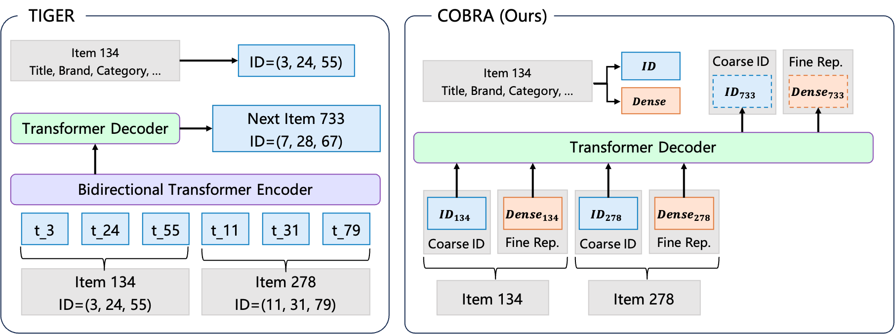
*Figure 1 (Yang et al., COBRA 2025): Left — traditional generative retrieval (TIGER) predicts only a sparse semantic ID. Right — COBRA's cascaded approach: the sparse ID is generated first, then conditions the generation of a complementary dense vector. The joint sparse-dense representation recovers information that either branch alone cannot represent.*

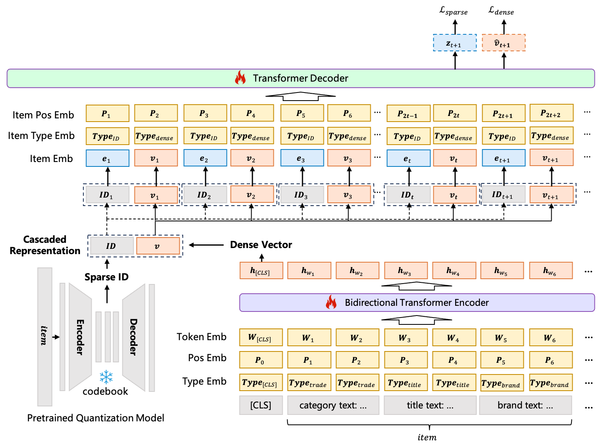
*Figure 2 (Yang et al., COBRA 2025): The COBRA architecture. A shared Transformer decoder with two heads — SparseHead (cross-entropy over codebook) and DenseHead (contrastive loss over dense vector space). History events are represented by concatenating sparse ID embeddings and dense vectors.*

**Comparison to LIGER.** LIGER (Yang et al., 2024) generates a sparse representation and a dense vector simultaneously, at the same granularity, using pre-trained fixed embeddings. COBRA differs in two ways: (1) the sparse ID is generated first and conditions the dense generation, creating a hierarchical decomposition of uncertainty; (2) dense embeddings are learned end-to-end rather than fixed, allowing them to adapt to the generative pretraining objective.

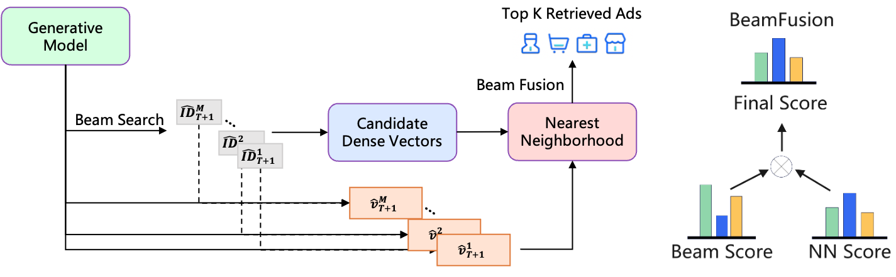
*Figure 3 (Yang et al., COBRA 2025): BeamFusion inference. Beam search over sparse IDs produces $M$ candidates with log-probabilities. For each beam, the DenseHead generates a conditional dense vector. ANN retrieval over dense vectors then produces the final candidate pool, scored by the product of sparse and dense softmax scores.*

**Ablation results.** On an industrial dataset (Baidu, 200M DAU), removing components from the full COBRA system degrades Recall@500:

| Variant | Recall@500 | Relative change |
|---|---|---|
| Full COBRA | 0.3716 | — |
| Without sparse ID branch | 0.2466 | −33.6% |
| Without dense branch | 0.2613 | −27.1% |
| Without BeamFusion | 0.2895 | −22.1% |

**Both branches are necessary; neither alone captures the full information in the joint distribution.** Online results at Baidu: +3.60% conversion, +4.15% ARPU.

---

## 5. Generative Ranking: Sequential Transduction

### 5.1 HSTU: The Foundational Architecture

The *Hierarchical Sequential Transduction Unit* (HSTU, Zhai et al., 2024) is the architectural backbone that enables generative recommendation at trillion-parameter scale. See also [[hstu|HSTU note]] for full derivations.

**Sequence formulation.** For the ranking task, all user interactions are interleaved into a single chronological sequence:

$$h_i = (x_0, a_0, x_1, a_1, \ldots, x_{n-1}, a_{n-1}) \in \mathbb{R}^{2n \times d}$$

where $x_t \in \mathbb{R}^d$ is the item embedding and $a_t \in \mathbb{R}^d$ is an action embedding. The model is a causal (autoregressive) sequence transducer: position $t$ can attend only to positions $\leq t$.

**The HSTU block.** Each HSTU layer applies three sub-layers:

*Sub-layer 1: Pointwise Projection.*

$$U(X),\, V(X),\, Q(X),\, K(X) = \text{Split}\!\left(\varphi_1\!\left(W_1 X\right)\right)$$

where $W_1 \in \mathbb{R}^{4d \times d}$ expands the embedding by 4×, $\varphi_1$ is the SiLU nonlinearity $\text{SiLU}(z) = z \cdot \sigma(z)$, and $\text{Split}$ partitions the result into four equal-dimensional parts. $Q, K$ are used for spatial aggregation; $U$ is a content-dependent gate; $V$ is the value projection.

*Sub-layer 2: Spatial Aggregation.*

$$A(X) V(X) = \varphi_2\!\left(Q(X)\, K(X)^\top + \text{rab}^{p,t}\right) V(X)$$

where $\varphi_2$ is again SiLU applied *elementwise* to each attention score. Critically, **there is no softmax normalization**. The matrix $Q(X) K(X)^\top \in \mathbb{R}^{n \times n}$ computes raw dot-product attention scores; SiLU nonlinearly thresholds them.

*Sub-layer 3: Pointwise Transformation.*

$$Y(X) = f_2\!\left(\text{LayerNorm}\!\left(A(X) V(X)\right) \odot U(X)\right)$$

where $\odot$ is elementwise multiplication. The gating by $U$ — derived from the input $X$ via the same $W_1$ projection — acts as a content-dependent filter: positions where the input is weakly activated will gate down the aggregated values.

**Why no softmax: the non-stationarity argument.** Softmax normalization enforces $\sum_j \alpha_{ij} = 1$ for each query $i$, making attention weights a probability simplex. This normalizes out the *magnitude* of preference signals. Under a *Dirichlet Process* model of user preferences — which is appropriate for non-stationary streaming recommendation where item popularity follows a power law — the absolute activation magnitude carries information about preference intensity that softmax destroys. Empirically (Dirichlet Process synthetic data): SiLU pointwise attention outperforms softmax HSTU by **44.7% relative HR@10**.

**Definition (Temporal Relative Attention Bias).** The term $\text{rab}^{p,t}$ adds a learned bias to attention score $(i, j)$ based on relative position and elapsed time:

$$\text{rab}^{p,t}_{ij} = b^p_{|i-j|} + b^t_{\lfloor \log_2(\Delta t_{ij}) \rfloor}$$

where $\Delta t_{ij}$ is the elapsed time in seconds between events $i$ and $j$, log-bucketed. The positional component $b^p$ encodes the inductive bias that recent interactions are more relevant. The temporal component $b^t$ encodes that items interacted with recently (small wall-clock $\Delta t$, independent of position) are more relevant. Both are learned scalar look-up tables, not absolute positional encodings — they generalize across sequence lengths.

**Stochastic length sparsity.** Attention cost is $O(n^2 d)$ per sequence. For users with $n \gg N^{\alpha/2}$, HSTU applies *stochastic length* truncation: sample the full sequence with probability $N^\alpha / n^2$ and a random subsequence of length $N^{\alpha/2}$ otherwise. The expected cost per user is $O(N^\alpha d)$ with $\alpha \in (1, 2]$. For $\alpha = 1.5$, a sequence of length $10^6$ has effective cost $O(10^9)$ rather than $O(10^{12})$. Empirically, 80%+ sparsity is achieved with less than 0.2% metric degradation.

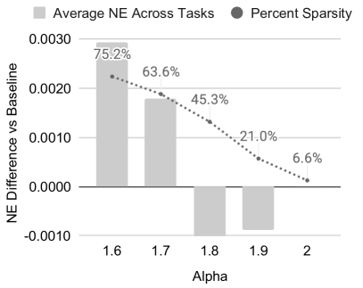
*Figure 4 (Zhai et al., 2024): Impact of stochastic length (SL) sampling on NE and HR metrics. Left: $n=4096$. Right: $n=8192$. The horizontal axis shows the sparsity target $N^\alpha$; the plots show that quality degrades by less than 0.2% even at 80%+ sparsity, validating the approach for very long user sequences.*

**Definition (M-FALCON Inference Amortization).** At inference, scoring $b_m$ candidate items naively requires $b_m$ independent forward passes: cost $O(b_m n^2 d)$. M-FALCON processes all candidates in a single forward pass via modified attention masks: candidate items attend to the user history but not to each other. The user history prefix of length $n$ is computed once at cost $O(n^2 d)$; each candidate adds $O(n d)$ incremental cost. Total: $O(n^2 d + b_m n d)$, an $O(b_m)$ reduction for large candidate batches.

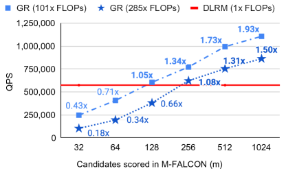
*Figure 9 (Zhai et al., 2024): End-to-end inference throughput comparison between DLRMs and generative recommenders with M-FALCON amortization in the large-scale industrial ranking setting. M-FALCON's shared-history batching closes the inference throughput gap that would otherwise make GR deployment infeasible.*

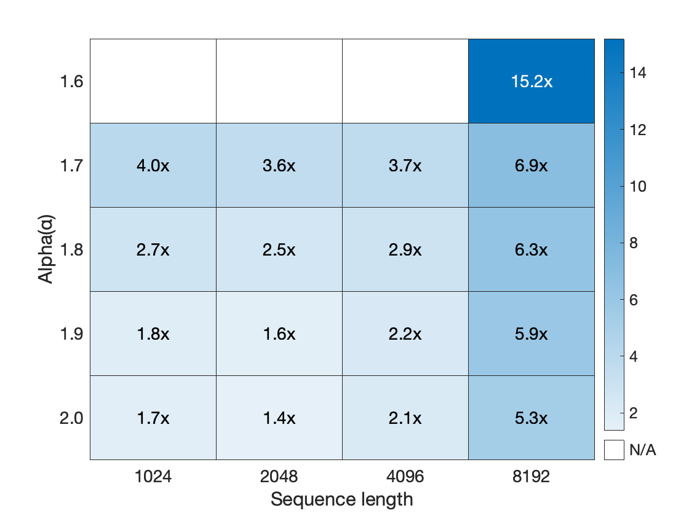
*Figure 5b (Zhai et al., 2024): Training throughput speedup of HSTU (with stochastic length sparsity) relative to a FlashAttention2-based Transformer baseline, plotted against sparsity level. At 80%+ sparsity — the regime used in production — HSTU achieves substantial throughput gains with negligible quality loss.*

**Scaling law.** HSTU demonstrates empirically clean power-law scaling across three orders of magnitude in training compute:

$$\text{HR@100} = 0.15 + 0.0195 \ln C, \qquad \text{NE} = 0.549 - 5.3 \times 10^{-3} \ln C$$

where $C$ is training compute in PetaFLOPs/day. The largest deployed model has 1.5 trillion parameters. DLRMs plateau at HR@100 $\approx 0.28$–$0.29$ regardless of compute budget.

### 5.2 GenRank: Efficient Industrial Generative Ranking

GenRank (Huang et al., 2025) refines the HSTU framework for production deployment at Xiaohongshu, addressing the efficiency gap between HSTU's research design and constraints at hundreds-of-millions-of-user scale.

**Key architectural finding.** The primary ablation result of GenRank is that **the improvement from generative ranking stems from the architecture (autoregressive causal structure), not from the training paradigm (how samples are organized in batches)**. Replacing the causal attention mask with a fully visible mask (T5-style bidirectional attention) causes AUC drops exceeding 0.0100, and the gap grows with model size — confirming that autoregression is an architectural property, not a training convenience.

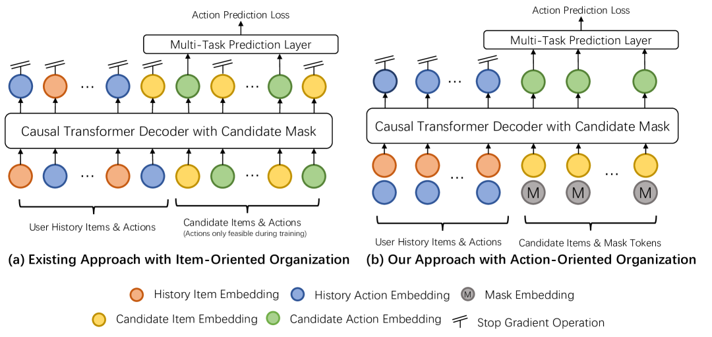
*Figure 2 (Huang et al., GenRank 2025): Architecture comparison between HSTU's item-oriented sequence organization (left) and GenRank's action-oriented organization (right). In the item-oriented scheme each position in the sequence is either an item or an action token; in the action-oriented scheme, each position aggregates the item and its associated action into a single token, halving sequence length.*

**Action-oriented sequence organization.** HSTU interleaves item and action tokens: $(x_0, a_0, x_1, a_1, \ldots)$. GenRank observes that *items serve primarily as positional context for actions*: the recommendation task is to predict actions, not items. GenRank therefore treats each request's items as a unit and organizes the sequence around actions:

$$\mathbf{e}_i^{p,t} = \phi(x_i) + \phi(a_i) + E_{pe,i} + E_{ri,i} + E_{rt,i}$$

where $\phi(x_i)$ is the item embedding, $\phi(a_i)$ the action embedding, $E_{pe,i}$ a learnable positional embedding, $E_{ri,i}$ a *request index embedding* (which server request generated this item, enabling the model to identify items from the same exposure session), and $E_{rt,i}$ a *pre-request time embedding* (log-bucketed elapsed time since the previous request).

This consolidation halves sequence length relative to HSTU's interleaved representation, reducing attention cost by **75%** and linear projection cost by **50%**.

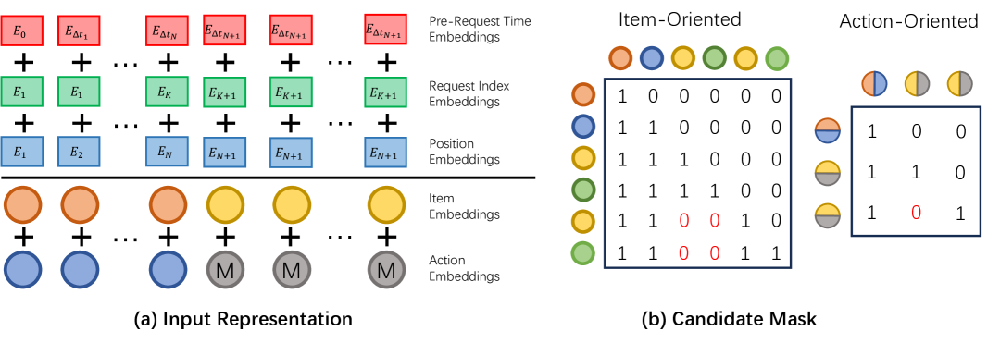
*Figure 3 (Huang et al., GenRank 2025): (a) The five-component input representation per position: item embedding, action embedding, positional embedding, request index embedding, and pre-request time embedding. (b) The candidate mask structure: candidate items attend to all history positions but are masked from attending to each other, the same design principle as M-FALCON.*

**ALiBi relative position bias.** HSTU uses a learnable relative attention bias $\text{rab}^{p,t}$, which requires storing a bias look-up table and adds $O(n^2)$ memory for training. GenRank replaces this with *Attention with Linear Biases* (ALiBi, Press et al., 2022), a parameter-free bias:

$$\text{score}_{ij}^{\text{ALiBi}} = \mathbf{q}_i \cdot \mathbf{k}_j - m_h \cdot |i - j|$$

where $m_h > 0$ is a fixed, head-specific slope that penalizes attention between distant query-key pairs linearly in their distance. Slopes are set as a geometric sequence across heads: $m_h = 1 / 2^h$ for head $h$. No parameters are learned; memory cost is $O(n)$ in the bias term rather than $O(n^2)$. Integrated into FlashAttention, ALiBi adds negligible computational overhead.

**Combined efficiency gains.** The two modifications together achieve:

| Modification | Training speedup |
|---|---|
| Action-oriented sequence (halved length) | +78.7% |
| ALiBi bias (replaces learnable RAB) | +25.0% |
| Combined GenRank total | +94.8% |

Additionally, P99 inference latency improves by more than 25% relative to the production HSTU system.

**Content embedding behavior.** An important empirical finding is that content embeddings (dense representations of item text/visual content from pre-trained encoders) show **more than 2× the AUC improvement** under the generative paradigm compared to the discriminative DLRM paradigm. The explanation is architectural consistency: generative pretraining and downstream inference use the same forward pass structure, so content representations learned during training transfer directly to ranking without distribution shift. Under DLRM, the content embedding is processed differently during training (impression-level scoring) and inference.

**Feature engineering behavior.** Classical handcrafted features (category CTR, session statistics, user demographics) provide negligible AUC benefit when added to GenRank. The architecture has learned to implicitly compute these aggregations from the action sequence. However, *real-time statistical features* — particularly sliding-window statistics that capture very recent trends (last 1 hour of platform-wide CTR by category) — remain effective. These encode non-stationary signal that the sequence cannot contain: they capture what is trending *right now* on the platform, not just what this user has historically preferred.

**Online results** (Xiaohongshu Explore Feed, tens of millions of users, A/B test):

| Metric | Lift |
|---|---|
| Time spent | +0.33% |
| Reads | +0.63% |
| Engagements | +1.25% |
| 7-day lifetime (LT7) | +0.15% |

### 5.3 GR2: LLM-Based Reranking with Reasoning

GR2 (Liang et al., Meta, 2026) introduces a new stage to the generative pipeline: *reranking*. Where ranking (Section 5.1–5.2) scores hundreds of candidates via a sequence model, reranking takes the top-$K$ ranked candidates (typically $K = 10$) and asks an LLM to reason about their relative ordering. The distinction is that reranking operates over a small, already-filtered set — small enough that an LLM can attend to all candidates simultaneously and produce an explicit chain-of-thought justification for its ordering.

**Why reranking benefits from reasoning.** A ranking model predicts $p(a \mid x, h)$ for each candidate independently (or jointly with M-FALCON amortization). It does not explicitly compare candidates against each other or articulate why one is preferred over another. An LLM operating over all $K$ candidates can identify *comparative* signals: "the user bought conditioner last week, so among these candidates the complementary item is X rather than Y." This cross-candidate reasoning can surface orderings the ranking model misses.

**Semantic IDs in LLM context.** For the LLM to reason over items, items must be represented as tokens the LLM can process. GR2 encodes each item as a $K=4$-level RQ-VAE semantic ID (Section 4.1) and adds these as new vocabulary tokens to the LLM's embedding table. The user history and candidate list are both expressed in SID tokens, enabling the LLM to process item identity without natural-language descriptions:

$$\texttt{<|sid\_begin|><s\_a\_57><s\_b\_7><s\_c\_23><s\_d\_4><|sid\_end|>}$$

The LLM (Qwen3-8B) is first *mid-trained* on a mixture of item-alignment tasks — sequential preference prediction, dense captioning from SIDs, user persona grounding — to align the new SID vocabulary with the LLM's existing linguistic representations.

**Three-stage training pipeline.** GR2 trains the reranker in three sequential stages:

1. *Tokenized mid-training*: extend the LLM's vocabulary with SID tokens and mid-train on item-alignment tasks. This stage bridges the gap between the LLM's text-pretrained representations and the discrete item vocabulary.

2. *Supervised fine-tuning on reasoning traces*: a teacher LLM (Qwen3-32B) generates reasoning traces via rejection sampling — the teacher is given the history and candidate set but *not* the ground truth, and samples until it predicts the correct next item. Only successful traces (correct prediction) are kept. This produces training data where the reasoning genuinely leads to the right answer. The SFT loss decouples reasoning tokens from ranking tokens:
$$\mathcal{L}_{\text{SFT}} = -\lambda_r \sum_{i} \log P(r_i \mid \mathcal{P}, r_{<i}) - \lambda_o \sum_{j} \log P(o_j \mid \mathcal{P}, \tau, o_{<j})$$
where $\tau = [r_1, \ldots]$ is the reasoning trace, $o$ is the re-ranked output, and $\lambda_r < \lambda_o$ — the ranking output loss is weighted higher to prevent the model from hallucinating plausible-sounding reasoning at the expense of ranking accuracy.

3. *Reinforcement learning via DAPO*: RL fine-tunes the model to maximize a rank-promotion reward. The reward measures how much the ground-truth next item moves up in the re-ranked list relative to the pre-ranked input:
$$R_{\text{rank}} = \frac{\text{rank}_{\text{pre}}(x^*) - \text{rank}_{\text{re}}(x^*)}{|D|}$$
A positive value means the target item was promoted; a negative value means it was demoted. The format reward $R_{\text{fmt}}$ (checking that output is parseable JSON) is applied *conditionally*:
$$R = \begin{cases} R_{\text{rank}} + \alpha R_{\text{fmt}} & \text{if } R_{\text{rank}} > 0 \text{ or } \text{rank}_{\text{pre}}(x^*) = 1 \\ R_{\text{rank}} & \text{otherwise} \end{cases}$$
The conditional application prevents a degenerate strategy: without it, the model learns to copy the pre-ranked order (zero rank change, guaranteed parseable output) to collect the format reward for free.

**DAPO objective.** The RL optimizer is DAPO (Decoupled Clip and Dynamic sAmpling Policy Optimization), which extends GRPO with two modifications: (1) separate clip thresholds $\varepsilon_{\text{low}}, \varepsilon_{\text{high}}$ for the importance ratio (Clip-Higher strategy, allowing larger positive updates); (2) dynamic sampling that filters out prompts where all $G$ sampled rollouts agree (accuracy = 0 or 1), avoiding zero-gradient updates:
$$J_{\text{DAPO}}(\theta) = \mathbb{E} \left[ \frac{1}{G} \sum_{i=1}^G \frac{1}{|o_i|} \sum_{t=1}^{|o_i|} \min\!\left( r_{i,t}(\theta)\hat{A}_{i,t},\ \text{clip}(r_{i,t}(\theta), 1{-}\varepsilon_{\text{low}}, 1{+}\varepsilon_{\text{high}}) \hat{A}_{i,t} \right) \right]$$
where $r_{i,t} = \pi_\theta / \pi_{\theta_{\text{old}}}$ is the token-level importance ratio and $\hat{A}_{i,t}$ is the group-normalized advantage.

**Results.** GR2 outperforms the prior state-of-the-art (OneRec-Think) by +2.4% Recall@5 and +1.3% NDCG@5 on Amazon product datasets. The RL stage is necessary: SFT alone often *degrades* R@1, improving reasoning fluency without improving ranking optimality. The combination of rejection-sampling traces and domain knowledge priming (sequential purchase heuristics injected into prompts) is the best data recipe.

---

## 6. Scaling Laws for Generative Recommenders

### 6.1 The HSTU Scaling Law

**Empirical Observation (HSTU Scaling, Zhai et al., 2024).** On Meta's production recommendation data, training compute $C$ (measured in PetaFLOPs/day) and model quality metrics satisfy:

$$\text{HR@100} = 0.15 + 0.0195 \ln C$$
$$\text{NE} = 0.549 - 5.3 \times 10^{-3} \ln C$$

These log-linear relationships hold across three orders of magnitude in compute, from $C \approx 10^3$ to $C \approx 10^6$ PetaFLOPs/day. The fit is tight (no clear break in slope), and the models at the largest scale have 1.5 trillion parameters — comparable to GPT-3/LLaMA-2 in scale.

DLRMs, trained on identical data with increasing compute budgets, cluster at HR@100 $\approx 0.28$–$0.29$ regardless of compute. **The plateau is architectural, not fundamental.**

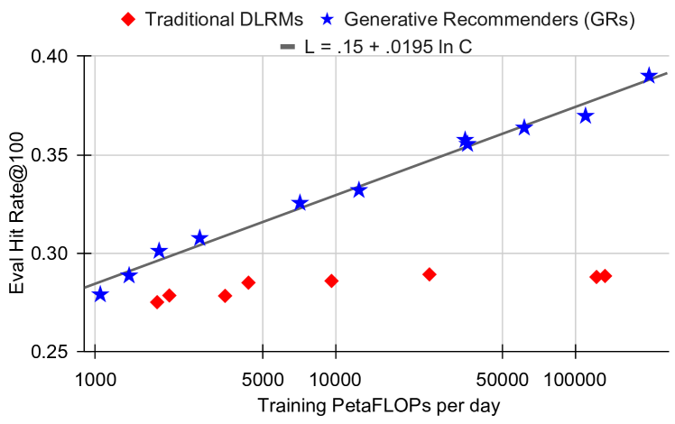
*Figure 7a–b (Zhai et al., 2024): Scaling behavior on the retrieval task. Hit Rate@100 for generative recommenders (GRs) grows log-linearly with training compute across three orders of magnitude. DLRMs plateau in the $0.28$–$0.29$ range regardless of additional compute.*

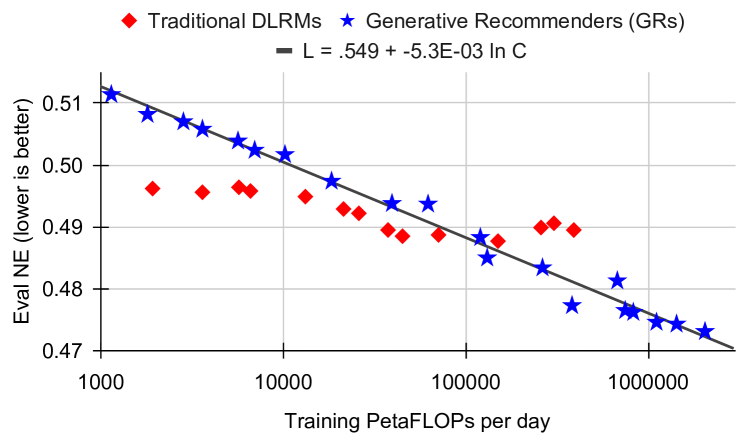
*Figure 7c (Zhai et al., 2024): Scaling behavior on the ranking task. Normalized Entropy (NE, lower is better) for GRs continues to improve with compute while DLRM NE saturates. The 1.5 trillion parameter GR models at the far right represent the deployed production system.*

The Wukong paper (Zhang et al., 2024) provides a complementary result from the DLRM-adjacent direction: an FM-stack architecture designed for CTR prediction achieves approximately **0.1% LogLoss improvement for every quadrupling of compute** across two orders of magnitude, up to 100+ GFLOP/example. Standard DLRM saturates around 31 GFLOP/example. Both results triangulate the same conclusion from different paradigms.

### 6.2 Why Generative Models Scale and DLRMs Do Not

The supervision density argument (Section 3.3) provides the structural explanation, but a second mechanism is equally important: the *parameter-signal ratio*.

**For DLRMs with item ID embeddings**: as model size grows by adding embedding capacity (wider item embeddings, more items), the number of trainable parameters grows proportionally to $|\mathcal{I}|$, but the total training signal grows as $O(T)$ where $T$ is total interactions. If $|\mathcal{I}| = O(T)$ (as on creator-economy platforms), the training signal per parameter stays constant, and the estimator does not improve — per the quality saturation argument of Section 2.2.

**For generative sequence models**: parameters are predominantly in the Transformer weights (attention projection matrices, feed-forward layers), which are shared across all users and items. As model size grows by adding Transformer capacity (more layers, wider attention heads), the shared parameters receive gradient signal from *all* users' sequences simultaneously. The signal-to-parameter ratio grows as $T / P_{\text{shared}}$, which increases with training data $T$ as long as the shared parameter count $P_{\text{shared}}$ is held fixed.

*In other words, DLRMs couple parameter count to item inventory size; generative models decouple them. This decoupling is the structural mechanism that enables scaling.*

### 6.3 Connection to Neural Scaling Laws

Kaplan et al. (2020) established that language model loss follows $L(C) \propto C^{-\alpha}$ for a power-law exponent $\alpha$ that depends on the architecture but not the dataset. The HSTU log-linear law $L = L_0 - \beta \ln C$ is equivalent (taking $L = -\ln(\text{HR@100} - 0.15)$ and expanding for small $\beta \ln C$), with the same qualitative behavior: each doubling of compute yields a fixed incremental quality improvement.

**Remark.** The analogy is not merely qualitative. Both NLP and recommendation involve learning to model structured distributions over high-cardinality discrete sequences. The key difference is that NLP sequences are over a fixed vocabulary of tokens, while recommendation sequences are over a non-stationary vocabulary of items. The HSTU architecture's design choices — particularly the temporal relative attention bias and the pointwise (non-softmax) aggregation — address this non-stationarity directly, enabling the same scaling behavior that transformers exhibit in NLP.

The Kaplan et al. result also predicts *compute-optimal* training: for a fixed compute budget, there is an optimal model size and dataset size. The recommendation analogue (what is the optimal number of parameters versus training data for generative recommenders?) remains an open question, though the GenRank results suggest that sequence length (and thus data recency) plays a role analogous to dataset size in the NLP setting.

---

## 7. Open Problems and Future Directions

**Cold-start performance.** Generative recommenders show stronger cold-start performance than DLRMs (GenRank reports improvements for new users), because the architecture generalizes from behavioral patterns rather than memorizing per-item statistics. However, a new user with zero interaction history provides no sequence to condition on. Current approaches use demographic features or short initial sequences, but a principled treatment of zero-shot user generalization remains open.

**End-to-end retrieval plus ranking.** HSTU handles both retrieval and ranking with the same forward pass, but in practice they are still operated at different latency budgets and candidate set sizes. COBRA focuses on retrieval; GenRank focuses on ranking. An end-to-end pipeline where retrieval and ranking share parameters, training data, and loss functions — with a principled handoff between stages — remains to be demonstrated at full production scale.

**Item tokenization beyond RQ-VAE.** The TIGER and COBRA results show that the quality of item tokenization directly affects retrieval quality. RQ-VAE produces codes with approximately 6% invalid rates and known information loss. Recent work (LETTER, SEATER, and others) explores alternative tokenization schemes — including variable-length codes, modality-specific encoders, and token hierarchies — but no consensus has emerged on what constitutes optimal item tokenization for generative recommendation.

**Feature integration.** The GenRank results establish an empirical taxonomy: static aggregate features are redundant; content embeddings improve significantly; real-time statistics remain effective. Formalizing this taxonomy — characterizing precisely which features can and cannot be recovered from a sufficiently deep sequence model — would resolve the current empirical uncertainty and guide feature engineering decisions.

**Multi-task generalization.** The action space in production recommendation is heterogeneous: clicks, long watches, shares, comments, purchases, and skips each represent different user signals. Current generative models typically predict a single action type or combine them via task-specific heads. Whether a single generative model can simultaneously optimize across these objectives without task-specific architecture remains an open question.

**Reasoning and reranking at scale.** GR2 demonstrates that LLM-based reasoning improves reranking quality on benchmark datasets, but the approach requires a 8B-parameter LLM running over $K=10$ candidates with chain-of-thought generation — orders of magnitude more expensive than a standard ranking forward pass. Whether reasoning-based reranking can be made fast enough for production latency budgets (typically $<$10ms), and whether the quality gains hold at the scale of billions of users, remains to be shown.

**Distribution shift and temporal nonstationarity.** Generative models are trained on historical sequences but deployed on future sequences. User preferences and item distributions shift over time. The HSTU temporal relative attention bias addresses intra-sequence recency, but does not address global distribution shift between training and deployment. Online learning and continual training strategies for generative recommenders at trillion-parameter scale are not yet well understood.

---

## 8. References

| Reference Name | Brief Summary | Link to Reference |
|---|---|---|
| Actions Speak Louder than Words: Trillion-Parameter Sequential Transducers for Generative Recommendations (Zhai et al., 2024) | Introduces HSTU: the foundational generative recommender architecture. Softmax-free attention, temporal relative bias, stochastic length sparsity, M-FALCON inference amortization, 1.5T parameter scaling law | https://arxiv.org/abs/2402.17152 |
| Towards Large-scale Generative Ranking (Huang et al., 2025) | GenRank: production deployment of generative ranking at Xiaohongshu. Action-oriented sequence organization, ALiBi bias, 94.8% training speedup, ablation isolating architecture vs training paradigm | https://arxiv.org/abs/2505.04180 |
| COBRA: Sparse Meets Dense for Generative Recommendation (Yang et al., 2025) | Cascaded sparse-dense generation for retrieval. Probabilistic factorization of ID and dense vector, BeamFusion inference, +3.60% conversion at Baidu (200M DAU) | https://arxiv.org/abs/2503.02453 |
| Recommender Systems with Generative Retrieval — TIGER (Rajput et al., NeurIPS 2023) | First seq2seq generative retrieval using RQ-VAE semantic IDs; beam search over hierarchical code tree | https://arxiv.org/abs/2305.05065 |
| Deep Interest Network for Click-Through Rate Prediction (Zhou et al., KDD 2018) | Introduces target-aware local activation: candidate-conditioned weighted pooling of history with outer-product interactions and no softmax normalization | https://arxiv.org/abs/1706.06978 |
| Breaking the Curse of Quality Saturation with User-Centric Ranking (Zhao et al., KDD 2023) | Formal asymptotic analysis of ICR error floor; 21× parameter inflation at 60 days; embedding dimension degradation | https://arxiv.org/abs/2305.15333 |
| Wukong: Towards a Scaling Law for Large-Scale Recommendation (Zhang et al., 2024) | FM-stack architecture achieving power-law scaling within the DLRM paradigm; DLRM baselines plateau at 31 GFLOP/example | https://arxiv.org/abs/2403.02545 |
| Scaling Laws for Neural Language Models (Kaplan et al., 2020) | Original power-law scaling for LLMs; $L \propto C^{-\alpha}$; compute-optimal training | https://arxiv.org/abs/2001.08361 |
| Generating Diverse High-Fidelity Images with VQ-VAE-2 (Razavi et al., 2019) | Foundational residual quantized VAE architecture underpinning TIGER's semantic ID construction | https://arxiv.org/abs/1906.00446 |
| Self-Attentive Sequential Recommendation — SASRec (Kang and McAuley, 2018) | First Transformer-based sequential recommender; establishes self-attention for next-item prediction; major baseline for HSTU | https://arxiv.org/abs/1808.09781 |
| Train Short, Test Long: ALiBi (Press et al., 2022) | Attention with Linear Biases: parameter-free position encoding via head-specific linear penalty on attention distance; adopted by GenRank | https://arxiv.org/abs/2108.12409 |
| Generative Reasoning Re-ranker — GR2 (Liang et al., Meta 2026) | LLM-based reranking with reasoning traces: three-stage pipeline (tokenized mid-training, rejection-sampling SFT, DAPO RL), rank-promotion reward with conditional format reward to prevent reward hacking, ≥99% SID uniqueness via EMA + Random Last Level | https://arxiv.org/abs/2602.07774 |

<!-- Figure from GR2 (Liang et al., 2026) arXiv:2602.07774 unavailable: ar5iv HTML conversion has a fatal error and no arxiv.org/html version exists for this paper ID. -->

