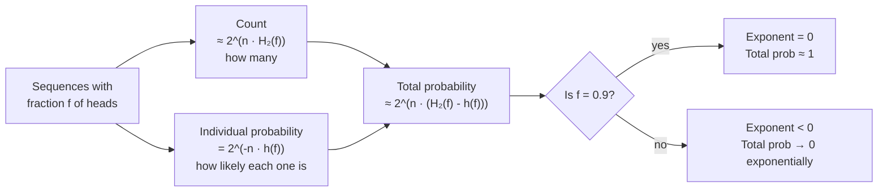
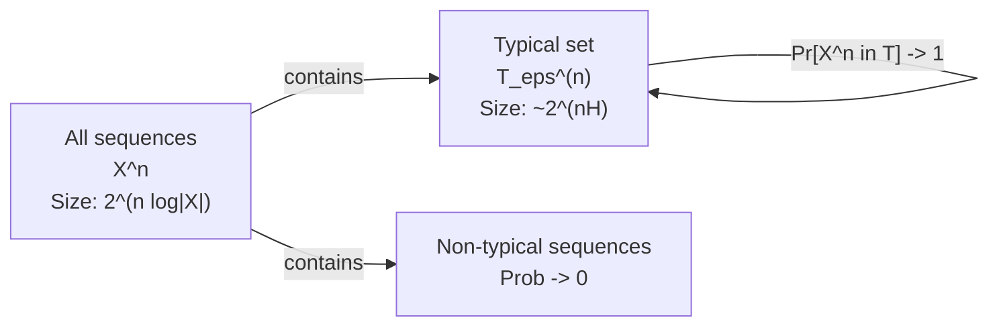

# AEP and Typicality

## Table of Contents

- [[#0. Motivation: What Is a Typical Sequence?|0. Motivation: What Is a Typical Sequence?]]
  - [[#0.1 A Worked Example: The Biased Coin|0.1 A Worked Example: The Biased Coin]]
  - [[#0.2 The Typicality Spectrum|0.2 The Typicality Spectrum]]
  - [[#0.3 Two Competing Exponentials|0.3 Two Competing Exponentials]]
  - [[#0.4 What Entropy Measures|0.4 What Entropy Measures]]
- [[#1. The AEP: Statement and Proof|1. The AEP: Statement and Proof]]
  - [[#1.1 Setup and Notation|1.1 Setup and Notation]]
  - [[#1.2 Statement of the AEP|1.2 Statement of the AEP]]
  - [[#1.3 Proof via the Weak Law of Large Numbers|1.3 Proof via the Weak Law of Large Numbers]]
  - [[#1.4 Conceptual Connection to the LLN|1.4 Conceptual Connection to the LLN]]
- [[#2. The Typical Set|2. The Typical Set]]
  - [[#2.1 Definition|2.1 Definition]]
  - [[#2.2 Property 1: High Probability|2.2 Property 1: High Probability]]
  - [[#2.3 Property 2: Upper Bound on Size|2.3 Property 2: Upper Bound on Size]]
  - [[#2.4 Property 3: Lower Bound on Size|2.4 Property 3: Lower Bound on Size]]
  - [[#2.5 Intuitive Picture|2.5 Intuitive Picture]]
- [[#3. Source Coding: Shannon's First Theorem|3. Source Coding: Shannon's First Theorem]]
  - [[#3.1 Problem Setup|3.1 Problem Setup]]
  - [[#3.2 Achievability|3.2 Achievability]]
  - [[#3.3 Converse|3.3 Converse]]
  - [[#3.4 The Theorem|3.4 The Theorem]]
- [[#4. Method of Types|4. Method of Types]]
  - [[#4.1 Types and Type Classes|4.1 Types and Type Classes]]
  - [[#4.2 Number of Types|4.2 Number of Types]]
  - [[#4.3 Size of a Type Class|4.3 Size of a Type Class]]
  - [[#4.4 Probability of a Type Class|4.4 Probability of a Type Class]]
  - [[#4.5 Sanov's Theorem|4.5 Sanov's Theorem]]
  - [[#4.6 Why the Method of Types Is Powerful|4.6 Why the Method of Types Is Powerful]]
- [[#5. Strong Typicality|5. Strong Typicality]]
  - [[#5.1 Definition of Strong Typicality|5.1 Definition of Strong Typicality]]
  - [[#5.2 Strong Implies Weak|5.2 Strong Implies Weak]]
  - [[#5.3 Joint Typicality|5.3 Joint Typicality]]
- [[#6. Connections and Applications|6. Connections and Applications]]
  - [[#6.1 Channel Coding|6.1 Channel Coding]]
  - [[#6.2 Rate-Distortion Theory|6.2 Rate-Distortion Theory]]
  - [[#6.3 Statistical Physics|6.3 Statistical Physics]]
- [[#References|References]]

---

## 0. Motivation: What Is a Typical Sequence?

### 0.1 A Worked Example: The Biased Coin

Suppose $X \sim \mathrm{Bernoulli}(0.9)$ — heads (1) with probability $0.9$, tails (0) with probability $0.1$. Flip this coin $n = 1000$ times and observe a sequence $x^{1000} \in \{0,1\}^{1000}$.

**Which sequence is most likely?**

The single most probable sequence is all-heads $(1,1,\ldots,1)$. Its probability is
$$p(\text{all-heads}) = 0.9^{1000} \approx 2^{-152}.$$

Now take any sequence with exactly 900 heads and 100 tails, say the specific sequence $(1,1,\ldots,1,0,0,\ldots,0)$. It has probability
$$p(\text{900 heads, 100 tails}) = 0.9^{900} \cdot 0.1^{100} \approx 2^{-469}.$$

So the all-heads sequence is $2^{317}$ times more probable than any individual 900-heads sequence. Yet how many sequences have exactly 900 heads?

$$\binom{1000}{900} \approx 2^{1000 \cdot H_2(0.9)} = 2^{469},$$

where $H_2(f) = -f\log_2 f - (1-f)\log_2(1-f)$ is the binary entropy function. The combined probability of all 900-heads sequences is therefore

$$\underbrace{2^{469}}_{\text{count}} \times \underbrace{2^{-469}}_{\text{individual}} = 2^0 = 1.$$

The all-heads sequence, by contrast, accounts for just $2^{-152}$ of total probability — negligible.

> [!DANGER] Common misconception
> **"Typical sequences are the most likely sequences."** This is false. The all-heads sequence is the *single most probable* sequence for $\mathrm{Bernoulli}(0.9)$, yet it is *atypical*. Typicality is not about individual probability — it is about whether a sequence's empirical statistics match the source distribution.

### 0.2 The Typicality Spectrum

We can assign every sequence $x^n$ a *typicality score*: its *empirical entropy*, defined as
$$\hat{H}(x^n) \;=\; -\frac{1}{n}\log_2 p(x^n).$$

For binary sequences, if $x^n$ has fraction $f$ of ones, then
$$\hat{H}(x^n) = -f\log_2(0.9) - (1-f)\log_2(0.1).$$

A sequence is *typical* when $\hat{H}(x^n)$ is close to the true entropy $H(X)$. For $X \sim \mathrm{Bernoulli}(0.9)$:
$$H(0.9) = -0.9\log_2(0.9) - 0.1\log_2(0.1) \approx 0.469 \text{ bits/symbol}.$$

The table below shows the typicality spectrum across different sequence types (in $n = 1000$ flips):

| Fraction of heads $f$ | Empirical entropy $\hat{H}$ | Distance $|\hat{H} - H(0.9)|$ | Typical? |
|---|---|---|---|
| 1.00 — all heads | 0.152 bits | 0.317 | ✗ atypical |
| 0.95 | 0.310 bits | 0.159 | ✗ atypical |
| **0.90** — expected fraction | **0.469 bits** | **0** | **✓ typical** |
| 0.85 | 0.627 bits | 0.158 | ✗ atypical |
| 0.50 — fair coin behaviour | 1.737 bits | 1.268 | ✗ atypical |
| 0.00 — all tails | 3.322 bits | 2.853 | ✗ atypical |

*The empirical entropy $\hat{H}$ is minimised at $f = 0.9$ (equal to $H(0.9)$) and grows as $f$ departs from the true parameter. Sequences near $f = 0.9$ are typical; those far from it are atypical — regardless of whether they individually seem "likely."*

> [!NOTE] Why is all-heads atypical?
> The all-heads sequence has empirical entropy $0.152$ bits/symbol, far below $H(0.9) = 0.469$. The formula $\hat{H} = -\log_2 0.9 \approx 0.152$ says the sequence was "too easy to predict": seeing a heads each time was unsurprising given the $0.9$ bias, so the sequence carries less information per symbol than a typical realisation would. A *typical* sequence has *some* tails in it — enough to match the average surprise $H(0.9)$.

### 0.3 Two Competing Exponentials

The reason typical sequences dominate can be understood through two competing exponentials:



Here $h(f) = -f\log_2(0.9) - (1-f)\log_2(0.1)$ is the *cross-entropy* of Bernoulli($f$) against the true Bernoulli(0.9), and $H_2(f)$ is the *self-entropy* of Bernoulli($f$). Their difference equals the negative KL divergence:

$$H_2(f) - h(f) = -D_{\mathrm{KL}}(\mathrm{Bernoulli}(f)\,\|\,\mathrm{Bernoulli}(0.9)) \leq 0,$$

with equality if and only if $f = 0.9$.

**So the total probability of a "type" (sequences with fraction $f$ of heads) decays exponentially in $D_{\mathrm{KL}}(\text{empirical} \| \text{true})$.** The typical set is the type where this KL divergence is zero — where empirical statistics exactly match the source. This is Sanov's theorem in miniature (Section 4.5).

> [!EXAMPLE] Counting the balance
> For $n = 1000$, $p = 0.9$, $f = 0.95$:
> - Count: $\binom{1000}{950} \approx 2^{310}$ sequences
> - Individual probability: $0.9^{950} \cdot 0.1^{50} \approx 2^{-310} \cdot 2^{-165} = 2^{-475}$... wait, $-f\log_2(0.9) - (1-f)\log_2(0.1) = 0.95\times0.152 + 0.05\times3.322 = 0.144+0.166 = 0.310$ bits. So individual probability $\approx 2^{-310}$.
> - Total: $2^{310} \times 2^{-310} \approx 1$? No — the KL divergence from Bernoulli(0.95) to Bernoulli(0.9) is $D = H_2(0.95) - h(0.95)$. We have $H_2(0.95) \approx 0.286$ and $h(0.95) = 0.310$, so $D = 0.286 - 0.310 = -0.024$. Thus total probability $\approx 2^{1000 \times (-0.024)} = 2^{-24} \approx 6 \times 10^{-8}$: exponentially small.

### 0.4 What Entropy Measures

The AEP and typicality sharpen the operational meaning of entropy $H(X)$:

1. **Effective alphabet size.** Even though there are $2^n$ sequences of length $n$, almost all probability concentrates on $\approx 2^{nH(X)}$ of them. *Entropy governs the effective number of distinguishable outcomes per symbol.*

2. **Compression rate.** To transmit a typical sequence losslessly, you need $nH(X)$ bits — no more, no less. The AEP makes this precise (Section 3).

3. **Surprise per symbol.** $H(X) = \mathbb{E}[-\log p(X)]$ is the expected surprise per observation. Typical sequences are precisely those where the *realised* surprise $-\frac{1}{n}\log p(x^n)$ matches the *expected* surprise $H(X)$.

> [!INFO] The fair coin: maximum typicality spread
> For a fair coin ($p = 0.5$), $H(X) = 1$ bit and the typical set has size $\approx 2^n$ — nearly all $2^n$ sequences are typical! That is because every sequence has the same probability $2^{-n}$, so there is no "atypical" sequence — every sequence has empirical entropy exactly $1$ bit. Uniformity is the maximally typical case. Any bias ($p \neq 0.5$) shrinks the typical set to a vanishing fraction of $\{0,1\}^n$.

---

## 1. The AEP: Statement and Proof

### 1.1 Setup and Notation

Throughout this note, let $\mathcal{X}$ be a finite alphabet. Fix a probability mass function $p : \mathcal{X} \to [0,1]$. We draw an i.i.d. sequence

$$X_1, X_2, \ldots, X_n \overset{\text{i.i.d.}}{\sim} p.$$

Write $X^n = (X_1, \ldots, X_n)$ and $x^n = (x_1, \ldots, x_n) \in \mathcal{X}^n$ for a realisation. Since the $X_i$ are independent, the joint probability factorises as

$$p(x^n) = \prod_{i=1}^n p(x_i).$$

All logarithms are base 2 and entropy is measured in *bits*. The *entropy* of $X \sim p$ is

$$H(X) = -\sum_{x \in \mathcal{X}} p(x) \log p(x) = \mathbb{E}[-\log p(X)].$$

We assume $p(x) > 0$ for all $x$ in the support; symbols with $p(x) = 0$ may be ignored.

> [!NOTE] Notation divergence: Cover-Thomas vs. Polyanskiy-Wu
> Cover & Thomas (2006) use $H(X)$ for entropy and denote the typical set $A_\varepsilon^{(n)}$. Polyanskiy & Wu (2025) use $H(P)$ when emphasising the distribution, and write $T_\varepsilon^{(n)}$ or $\mathcal{T}_\varepsilon^{(n)}$ for the typical set. We follow Cover & Thomas notation here and note Polyanskiy-Wu variants where they diverge.

### 1.2 Statement of the AEP

**Theorem (Asymptotic Equipartition Property).** Let $X_1, X_2, \ldots \overset{\text{i.i.d.}}{\sim} p$. Then

$$-\frac{1}{n}\log p(X^n) \xrightarrow{\;p\;} H(X) \quad \text{as } n \to \infty.$$

That is, for every $\varepsilon > 0$,

$$\Pr\!\left[\left|-\frac{1}{n}\log p(X^n) - H(X)\right| > \varepsilon\right] \to 0 \quad \text{as } n \to \infty.$$

The quantity $-\frac{1}{n}\log p(X^n)$ is the *empirical entropy* of the sequence, also called the *normalised log-likelihood* (with a sign flip). The AEP says that this random variable concentrates around the true entropy $H(X)$.

### 1.3 Proof via the Weak Law of Large Numbers

📐 The proof is a direct application of the *Weak Law of Large Numbers* (WLLN).

**Proof.** Because $X_1, \ldots, X_n$ are i.i.d. with joint p.m.f. $p(x^n) = \prod_{i=1}^n p(x_i)$, we have

$$-\frac{1}{n}\log p(X^n) = -\frac{1}{n}\sum_{i=1}^n \log p(X_i).$$

Define the random variables $Z_i = -\log p(X_i)$. Since the $X_i$ are i.i.d., so are the $Z_i$. Their common expectation is

$$\mathbb{E}[Z_i] = \mathbb{E}[-\log p(X)] = H(X).$$

The variance satisfies

$$\operatorname{Var}[Z_i] = \mathbb{E}[(\log p(X))^2] - H(X)^2,$$

which is finite because $\mathcal{X}$ is finite. By the WLLN,

$$\frac{1}{n}\sum_{i=1}^n Z_i \xrightarrow{\;p\;} \mathbb{E}[Z_1] = H(X). \qquad \square$$

> [!TIP] Strong convergence
> Because the $Z_i$ are i.i.d. with finite variance, Kolmogorov's Strong Law of Large Numbers gives *almost-sure* convergence $-\frac{1}{n}\log p(X^n) \xrightarrow{\text{a.s.}} H(X)$. Convergence in probability (used in the standard AEP) is the weaker result and suffices for source coding applications. The almost-sure version is needed for the Shannon-McMillan-Breiman theorem, which extends AEP beyond i.i.d. sources to stationary ergodic sources.

### 1.4 Conceptual Connection to the LLN

The AEP is the information-theoretic analogue of the LLN. Just as the empirical mean of bounded i.i.d. random variables concentrates around the population mean, the empirical entropy concentrates around $H(X)$. Operationally, this means that for large $n$:

- nearly all probability mass is carried by sequences $x^n$ with $p(x^n) \approx 2^{-nH(X)}$,
- this set of sequences has size $\approx 2^{nH(X)}$,
- every such sequence looks "equally likely" to zeroth order in the exponent.

The name *equipartition* refers to this approximate equal-probability property within the typical set.

> [!QUESTION] Exercise 1: Finite-Alphabet Variance Bound
> *This problem shows that the variance of the log-likelihood is controlled by the entropy, providing a quantitative handle on AEP convergence speed.*
>
> > **Prerequisites:** [[#1.3 Proof via the Weak Law of Large Numbers|1.3 Proof via the Weak Law of Large Numbers]]
>
> Let $X \sim p$ over a finite alphabet $\mathcal{X}$ with $|\mathcal{X}| = k$. Show that $\operatorname{Var}[-\log p(X)] \leq (\log k)^2$. Then use Chebyshev's inequality to give an explicit bound on $\Pr[|-\frac{1}{n}\log p(X^n) - H(X)| > \varepsilon]$ in terms of $n$, $\varepsilon$, and $k$.

> [!TIP]- Solution to Exercise 1
> **Key insight:** $-\log p(X) \in [0, \log k]$ because $p(x) \geq 1/k$ when $p$ is uniform, but more precisely $p(x) \geq 2^{-\log k}$ only if the alphabet has $k$ elements and $p$ is uniform. In general $-\log p(x) \leq \log k$ iff $p(x) \geq 1/k$, which fails for non-uniform $p$. The correct bound uses $-\log p(x) \leq -\log \min_{x} p(x)$, but for finite alphabets all probabilities are bounded away from zero, so the range is finite.
>
> **Sketch:** For any bounded random variable $Z$ with $Z \in [a, b]$, the variance satisfies $\operatorname{Var}[Z] \leq (b-a)^2/4 \leq (b-a)^2$. Since $-\log p(X) \in [0, \log(1/p_{\min})]$ and $p_{\min} \geq 1/|\mathcal{X}|^n$ (trivially) while on a finite alphabet $p_{\min} > 0$, we get $\operatorname{Var}[Z_i] \leq (\log(1/p_{\min}))^2$. Chebyshev then gives
> $$\Pr\!\left[\left|\frac{1}{n}\sum Z_i - H(X)\right| > \varepsilon\right] \leq \frac{(\log(1/p_{\min}))^2}{n\varepsilon^2}.$$
> This shows convergence at rate $O(1/n)$ in the Chebyshev bound.

> [!QUESTION] Exercise 2: AEP for Markov Chains
> *The i.i.d. assumption can be relaxed: this problem extends the AEP to first-order Markov chains.*
>
> > **Prerequisites:** [[#1.3 Proof via the Weak Law of Large Numbers|1.3 Proof via the Weak Law of Large Numbers]]
>
> Let $X_1, X_2, \ldots$ be a stationary, irreducible, aperiodic Markov chain over $\mathcal{X}$ with transition matrix $Q$ and stationary distribution $\pi$. Define $H = -\sum_{x,y} \pi(x) Q(x,y) \log Q(x,y)$. Show that $-\frac{1}{n}\log p(X^n) \xrightarrow{p} H$ and identify what law of large numbers is used.

> [!TIP]- Solution to Exercise 2
> **Key insight:** For a Markov chain, $\log p(X^n) = \log \pi(X_1) + \sum_{i=2}^n \log Q(X_{i-1}, X_i)$. The first term is $O(1)$ and vanishes after dividing by $n$. The remaining sum involves the ergodic averages of $\log Q(X_{i-1}, X_i)$.
>
> **Sketch:** By the ergodic theorem for Markov chains (since the chain is irreducible and aperiodic), for any bounded function $f$:
> $$\frac{1}{n}\sum_{i=1}^n f(X_{i-1}, X_i) \xrightarrow{\text{a.s.}} \sum_{x,y} \pi(x)Q(x,y) f(x,y).$$
> Apply this with $f(x,y) = -\log Q(x,y)$ to get $-\frac{1}{n}\log p(X^n) \to H$. The law used is the ergodic theorem (Birkhoff's theorem), which subsumes the WLLN for stationary ergodic processes.

---

## 2. The Typical Set

### 2.1 Definition

**Definition (Weakly Typical Set).** Fix $\varepsilon > 0$ and $n \geq 1$. The *$\varepsilon$-typical set* $\mathcal{T}_\varepsilon^{(n)}$ is

$$\mathcal{T}_\varepsilon^{(n)} = \left\{x^n \in \mathcal{X}^n : \left|-\frac{1}{n}\log p(x^n) - H(X)\right| \leq \varepsilon\right\}.$$

Equivalently, $x^n \in \mathcal{T}_\varepsilon^{(n)}$ if and only if

$$2^{-n(H(X)+\varepsilon)} \leq p(x^n) \leq 2^{-n(H(X)-\varepsilon)}.$$

Every sequence in $\mathcal{T}_\varepsilon^{(n)}$ has probability in the window $[2^{-n(H+\varepsilon)}, 2^{-n(H-\varepsilon)}]$. This is sometimes called *weak typicality* to distinguish it from the stronger notion defined in Section 5.

> [!INFO] Why "typical"?
> The word comes from statistical mechanics: a *typical* macrostate is one that is realised by the overwhelming majority of microstates. Here, sequences in $\mathcal{T}_\varepsilon^{(n)}$ are those whose empirical log-probability matches the population entropy — the "typical" outcome of the information-theoretic experiment.

### 2.2 Property 1: High Probability

🔑 **Proposition 1.** For every $\varepsilon > 0$ and $\delta > 0$, there exists $N$ such that for all $n \geq N$,

$$\Pr\!\left[X^n \in \mathcal{T}_\varepsilon^{(n)}\right] \geq 1 - \delta.$$

**Proof.** This is an immediate consequence of the AEP. Since $-\frac{1}{n}\log p(X^n) \xrightarrow{p} H(X)$, for any $\varepsilon > 0$:

$$\Pr\!\left[\left|-\frac{1}{n}\log p(X^n) - H(X)\right| > \varepsilon\right] \to 0,$$

which is the same as $\Pr[X^n \notin \mathcal{T}_\varepsilon^{(n)}] \to 0$, so $\Pr[X^n \in \mathcal{T}_\varepsilon^{(n)}] \to 1$. $\square$

### 2.3 Property 2: Upper Bound on Size

**Proposition 2.** For all $n \geq 1$,

$$\left|\mathcal{T}_\varepsilon^{(n)}\right| \leq 2^{n(H(X)+\varepsilon)}.$$

**Proof.** Every sequence $x^n \in \mathcal{T}_\varepsilon^{(n)}$ satisfies $p(x^n) \geq 2^{-n(H+\varepsilon)}$. Summing over all sequences in the typical set:

$$1 \geq \sum_{x^n \in \mathcal{T}_\varepsilon^{(n)}} p(x^n) \geq \left|\mathcal{T}_\varepsilon^{(n)}\right| \cdot 2^{-n(H+\varepsilon)}.$$

Rearranging: $|\mathcal{T}_\varepsilon^{(n)}| \leq 2^{n(H+\varepsilon)}$. $\square$

### 2.4 Property 3: Lower Bound on Size

**Proposition 3.** For every $\varepsilon > 0$ and $\delta > 0$, for all sufficiently large $n$,

$$\left|\mathcal{T}_\varepsilon^{(n)}\right| \geq (1-\delta)\,2^{n(H(X)-\varepsilon)}.$$

**Proof.** Every sequence $x^n \in \mathcal{T}_\varepsilon^{(n)}$ satisfies $p(x^n) \leq 2^{-n(H-\varepsilon)}$. By Property 1, for large enough $n$:

$$1 - \delta \leq \Pr[X^n \in \mathcal{T}_\varepsilon^{(n)}] = \sum_{x^n \in \mathcal{T}_\varepsilon^{(n)}} p(x^n) \leq \left|\mathcal{T}_\varepsilon^{(n)}\right| \cdot 2^{-n(H-\varepsilon)}.$$

Rearranging: $|\mathcal{T}_\varepsilon^{(n)}| \geq (1-\delta)\,2^{n(H-\varepsilon)}$. $\square$

> [!NOTE] Summary of the three properties
> Combining all three: the typical set $\mathcal{T}_\varepsilon^{(n)}$ has
> - probability $\to 1$ (almost all draws land in it),
> - at most $2^{n(H+\varepsilon)}$ elements (exponentially bounded),
> - at least $(1-\delta)2^{n(H-\varepsilon)}$ elements (exponentially large).
>
> The upper and lower bounds together show $|\mathcal{T}_\varepsilon^{(n)}| = 2^{nH(X)(1 + o(1))}$.

### 2.5 Intuitive Picture

The total number of sequences in $\mathcal{X}^n$ is $|\mathcal{X}|^n = 2^{n\log|\mathcal{X}|}$. The typical set has only $\approx 2^{nH(X)}$ elements. Since $H(X) \leq \log|\mathcal{X}|$ with equality iff $p$ is uniform, the typical set is an *exponentially small* fraction of all sequences:

$$\frac{|\mathcal{T}_\varepsilon^{(n)}|}{|\mathcal{X}|^n} \approx 2^{-n(\log|\mathcal{X}| - H(X))} \to 0 \quad \text{(for non-uniform } p\text{)}.$$

*Surprisingly,* this exponentially small set carries almost all the probability mass. This is the heart of Shannon's insight: the randomness of a source concentrates on a tiny "cloud" in sequence space.



> [!QUESTION] Exercise 3: Probability of a Single Typical Sequence
> *This exercise makes precise the "equipartition" in AEP: all typical sequences have nearly identical probability.*
>
> > **Prerequisites:** [[#2.1 Definition|2.1 Definition]]
>
> Show that for any $x^n \in \mathcal{T}_\varepsilon^{(n)}$, the probability satisfies $2^{-n(H+\varepsilon)} \leq p(x^n) \leq 2^{-n(H-\varepsilon)}$. Conclude that if $\hat{p}$ is the uniform distribution over $\mathcal{T}_\varepsilon^{(n)}$, then for large $n$, $\hat{p}$ and $p^n|_{\mathcal{T}_\varepsilon^{(n)}}$ (the restriction of $p^n$ to the typical set) are within a factor of $2^{2n\varepsilon}$ of each other pointwise.

> [!TIP]- Solution to Exercise 3
> **Key insight:** Both bounds on $p(x^n)$ follow directly from the definition of typicality; the ratio between the upper and lower bounds is $2^{2n\varepsilon}$.
>
> **Sketch:** By definition of $\mathcal{T}_\varepsilon^{(n)}$, every $x^n$ in the set satisfies the double inequality. The uniform distribution over the typical set assigns $\hat{p}(x^n) = 1/|\mathcal{T}_\varepsilon^{(n)}|$ to each sequence. Since $|\mathcal{T}_\varepsilon^{(n)}| \in [2^{n(H-\varepsilon)}, 2^{n(H+\varepsilon)}]$ approximately, we have $\hat{p}(x^n) \in [2^{-n(H+\varepsilon)}, 2^{-n(H-\varepsilon)}]$. Both $\hat{p}$ and $p^n$ lie in this same interval, so their ratio is at most $2^{n(H+\varepsilon)}/2^{n(H-\varepsilon)} = 2^{2n\varepsilon}$.

> [!QUESTION] Exercise 4: Exponential Decay Outside the Typical Set
> *This exercise quantifies how quickly probability escapes the typical set as the rate drops below entropy.*
>
> > **Prerequisites:** [[#2.3 Property 2: Upper Bound on Size|2.3 Property 2]], [[#2.4 Property 3: Lower Bound on Size|2.4 Property 3]]
>
> Fix $\delta > 0$. Let $B_n \subseteq \mathcal{X}^n$ be any sequence of sets with $|B_n| \leq 2^{n(H(X)-\delta)}$ for all $n$. Show that $\Pr[X^n \in B_n] \to 0$ as $n \to \infty$. (This is the "converse" direction without the source coding machinery.)

> [!TIP]- Solution to Exercise 4
> **Key insight:** Any set smaller than $2^{n(H-\delta)}$ can cover only an $2^{-n\delta/(H+\varepsilon)}$ fraction of the typical set and hence negligible mass.
>
> **Sketch:** Split the probability over $B_n$ as
> $$\Pr[X^n \in B_n] = \Pr[X^n \in B_n \cap \mathcal{T}_\varepsilon^{(n)}] + \Pr[X^n \in B_n \setminus \mathcal{T}_\varepsilon^{(n)}].$$
> The second term is at most $\Pr[X^n \notin \mathcal{T}_\varepsilon^{(n)}] \to 0$ by AEP. For the first term, every $x^n \in \mathcal{T}_\varepsilon^{(n)}$ has $p(x^n) \leq 2^{-n(H-\varepsilon)}$, so
> $$\Pr[X^n \in B_n \cap \mathcal{T}_\varepsilon^{(n)}] \leq |B_n| \cdot 2^{-n(H-\varepsilon)} \leq 2^{n(H-\delta)} \cdot 2^{-n(H-\varepsilon)} = 2^{-n(\delta-\varepsilon)}.$$
> Choose $\varepsilon < \delta$; then this decays exponentially. $\square$

---

## 3. Source Coding: Shannon's First Theorem

### 3.1 Problem Setup

The *fixed-length lossless source coding* problem is: given $n$ i.i.d. symbols $X^n \sim p^n$, encode them into a binary string of length $nR$ bits (a *rate-$R$ code*), and then recover $X^n$ exactly (with probability of error $P_e^{(n)} \to 0$).

Formally, an $(n, R)$ source code consists of:
- an *encoder* $f : \mathcal{X}^n \to \{0,1\}^{\lfloor nR \rfloor}$,
- a *decoder* $g : \{0,1\}^{\lfloor nR \rfloor} \to \mathcal{X}^n$.

The error probability is $P_e^{(n)} = \Pr[g(f(X^n)) \neq X^n]$. A rate $R$ is *achievable* if there exists a sequence of $(n, R)$ codes with $P_e^{(n)} \to 0$.

> [!INFO] Historical context
> Shannon's 1948 paper "A Mathematical Theory of Communication" introduced this problem and solved it. The key insight — that entropy is the fundamental limit of lossless compression — founded modern information theory.

### 3.2 Achievability

📐 **Theorem (Achievability).** If $R > H(X)$, then $R$ is achievable.

**Proof.** The *typical set encoder* works as follows: for a chosen $\varepsilon > 0$ with $R > H(X) + \varepsilon$ (possible since $R > H(X)$), define $\mathcal{T}_\varepsilon^{(n)}$.

1. **Index the typical set.** Order the elements of $\mathcal{T}_\varepsilon^{(n)}$ arbitrarily. By Property 2, $|\mathcal{T}_\varepsilon^{(n)}| \leq 2^{n(H+\varepsilon)} \leq 2^{nR}$. So every typical sequence can be indexed by a binary string of length $\lfloor nR \rfloor$.

2. **Encoder.** If $x^n \in \mathcal{T}_\varepsilon^{(n)}$, encode as a leading `0` followed by the index (using at most $\lfloor nR \rfloor$ bits total). If $x^n \notin \mathcal{T}_\varepsilon^{(n)}$, output any fixed $nR$-bit string (declare an error).

3. **Decoder.** Read the index, look up the typical sequence. If the encoder declared error, output any symbol.

**Error analysis.** $P_e^{(n)} = \Pr[X^n \notin \mathcal{T}_\varepsilon^{(n)}] \to 0$ by Property 1. $\square$

> [!EXAMPLE] Typical set encoding in Python
> ```python
> import numpy as np
>
> def typical_set_encode(source_seq, pmf, epsilon):
>     """
>     Encode source_seq using typical-set encoding.
>     Returns (codeword, is_typical).
>     """
>     n = len(source_seq)
>     alphabet = list(pmf.keys())
>     H = -sum(p * np.log2(p) for p in pmf.values() if p > 0)
>
>     # Compute empirical log-prob
>     log_prob = sum(np.log2(pmf[symbol]) for symbol in source_seq)
>     empirical_entropy = -log_prob / n
>
>     is_typical = abs(empirical_entropy - H) <= epsilon
>     return is_typical
> ```

### 3.3 Converse

📐 **Theorem (Converse).** If $R < H(X)$, then $P_e^{(n)} \to 1$ for any sequence of $(n, R)$ codes.

**Proof.** The image of the encoder $f$ has size at most $2^{nR}$, so the encoder partitions $\mathcal{X}^n$ into at most $2^{nR}$ cells. For perfect recovery, each cell must be a singleton. Thus the encoder can correctly represent at most $2^{nR}$ sequences.

Since $R < H(X)$, choose $\varepsilon > 0$ small enough that $R < H(X) - \varepsilon$. Let $B_n = \{x^n : f \text{ is injective on } x^n\}$; then $|B_n| \leq 2^{nR} \leq 2^{n(H-\varepsilon)}$. By Exercise 4 (or by its proof inline), $\Pr[X^n \in B_n] \to 0$, so $P_e^{(n)} = 1 - \Pr[X^n \in B_n] \to 1$. $\square$

### 3.4 The Theorem

🔑 **Theorem (Shannon's Noiseless Source Coding Theorem / First Theorem).** The minimum achievable rate for lossless fixed-length source coding of an i.i.d. source $X \sim p$ is

$$R^* = H(X) \text{ bits/symbol.}$$

More precisely: for every $R > H(X)$, rate $R$ is achievable; for every $R < H(X)$, any sequence of $(n, R)$ codes has $P_e^{(n)} \to 1$.

*This bound only holds for fixed-length codes; variable-length codes (Huffman, arithmetic) can achieve $H(X)$ exactly in the limit without any error.*

> [!WARNING] Fixed-length vs. variable-length
> Shannon's first theorem here is for fixed-length (block) codes. The variable-length version (Kraft inequality + Huffman) shows that the expected code length $\mathbb{E}[L] \in [H(X), H(X)+1)$ for Huffman codes over single symbols, and approaches $H(X)$ with block coding. These are distinct settings with different achievability arguments.

> [!QUESTION] Exercise 5: Tightness of the Typical Set Encoder
> *This exercise verifies that the typical-set encoder is essentially optimal: a slightly higher rate suffices but not a lower one.*
>
> > **Prerequisites:** [[#3.2 Achievability|3.2 Achievability]], [[#3.3 Converse|3.3 Converse]]
>
> Let $X \sim \text{Bernoulli}(1/3)$ (so $H(X) = \log_2 3 - \frac{2}{3} \approx 0.918$ bits). For $n = 100$ and $\varepsilon = 0.05$, compute explicit upper and lower bounds on $|\mathcal{T}_\varepsilon^{(100)}|$. How many bits are needed to index all typical sequences? Compare to $100 \cdot H(X)$.

> [!TIP]- Solution to Exercise 5
> **Key insight:** The two bounds on typical set size give a window around $2^{100 H(X)}$, showing that $nH(X)$ bits are essentially necessary and sufficient.
>
> **Sketch:** We have $H(X) = -\frac{1}{3}\log_2\frac{1}{3} - \frac{2}{3}\log_2\frac{2}{3} \approx 0.9183$ bits. The bounds give:
> - Lower: $(1-\delta)\,2^{100(0.9183 - 0.05)} \approx 2^{86.83}$ sequences.
> - Upper: $2^{100(0.9183 + 0.05)} = 2^{96.83}$ sequences.
>
> Indexing all typical sequences requires $\lceil \log_2 |\mathcal{T}| \rceil \leq 97$ bits. The entropy lower bound is $\approx 91.83$ bits. The gap is $2n\varepsilon = 10$ bits, the price of the $\pm\varepsilon$ window.

> [!QUESTION] Exercise 6: Algorithmic Typical Set Encoder
> *This problem designs a concrete algorithm for typical-set encoding and analyses its complexity.*
>
> > **Prerequisites:** [[#3.2 Achievability|3.2 Achievability]]
>
> Write Python pseudocode for a complete $(n, R)$ typical-set encoder/decoder pair for a binary i.i.d. source $X \sim \text{Bernoulli}(p)$. Your encoder should (a) identify whether $x^n$ is typical, (b) encode the index, and (c) handle the atypical case. Analyse the time complexity of the encoding step.

> [!TIP]- Solution to Exercise 6
> **Key insight:** Generating all typical sequences is exponential in $n$ and impractical; a real encoder uses arithmetic coding instead. However, the conceptual encoder suffices for proof purposes.
>
> **Sketch:**
> ```python
> from itertools import product
> import math
>
> def build_typical_set(n, p, epsilon):
>     """Build typical set for Bernoulli(p) source."""
>     H = -p * math.log2(p) - (1-p) * math.log2(1-p)
>     typical = {}
>     idx = 0
>     for bits in product([0, 1], repeat=n):
>         k = sum(bits)  # number of 1s
>         log_prob = k * math.log2(p) + (n - k) * math.log2(1 - p)
>         emp_entropy = -log_prob / n
>         if abs(emp_entropy - H) <= epsilon:
>             typical[bits] = idx
>             idx += 1
>     return typical, idx
>
> def encode(x_n, typical_set, n_bits):
>     if x_n in typical_set:
>         idx = typical_set[x_n]
>         return (True, format(idx, f'0{n_bits}b'))
>     else:
>         return (False, '0' * n_bits)  # error codeword
> ```
> Time complexity: $O(2^n)$ to enumerate all sequences; impractical for large $n$, which motivates arithmetic coding.

---

## 4. Method of Types

### 4.1 Types and Type Classes

The *method of types* (Csiszár & Körner) is a combinatorial framework that refines the typical-set approach. Rather than grouping sequences by empirical entropy, it groups them by full empirical distribution.

**Definition (Type / Empirical Distribution).** Let $x^n \in \mathcal{X}^n$. The *type* of $x^n$, written $P_{x^n}$, is the empirical distribution (frequency histogram):

$$P_{x^n}(a) = \frac{N(a \mid x^n)}{n}, \quad a \in \mathcal{X},$$

where $N(a \mid x^n) = |\{i : x_i = a\}|$ is the number of occurrences of symbol $a$ in $x^n$.

Note that $P_{x^n}$ is a probability distribution on $\mathcal{X}$: it is non-negative and sums to 1.

**Definition (Type Class).** For a distribution $P$ on $\mathcal{X}$, the *type class* $\mathcal{T}(P)$ is the set of all sequences of length $n$ with type $P$:

$$\mathcal{T}(P) = \{x^n \in \mathcal{X}^n : P_{x^n} = P\}.$$

Note that $\mathcal{T}(P)$ is non-empty only if $nP(a)$ is a non-negative integer for all $a \in \mathcal{X}$.

**Definition (Set of Types).** The set of all types with denominator $n$ over alphabet $\mathcal{X}$ is denoted $\mathcal{P}_n(\mathcal{X})$:

$$\mathcal{P}_n(\mathcal{X}) = \{P_{x^n} : x^n \in \mathcal{X}^n\}.$$

> [!NOTE] Connection to typical set
> The typical set $\mathcal{T}_\varepsilon^{(n)}$ is a union of type classes:
> $$\mathcal{T}_\varepsilon^{(n)} = \bigcup_{\substack{P \in \mathcal{P}_n(\mathcal{X}) \\ |H(P) - H(p)| \leq \varepsilon}} \mathcal{T}(P).$$
> This is the bridge between the two frameworks.

### 4.2 Number of Types

**Proposition 4.** The total number of types satisfies

$$|\mathcal{P}_n(\mathcal{X})| \leq (n+1)^{|\mathcal{X}|}.$$

**Proof.** A type $P \in \mathcal{P}_n(\mathcal{X})$ is determined by the non-negative integers $(N(a))_{a \in \mathcal{X}}$ with $\sum_a N(a) = n$. This is a *stars and bars* counting problem: the number of ways to distribute $n$ indistinguishable balls into $|\mathcal{X}|$ bins equals $\binom{n + |\mathcal{X}| - 1}{|\mathcal{X}| - 1}$, which is at most $(n+1)^{|\mathcal{X}|}$ (since each $N(a) \in \{0,1,\ldots,n\}$, giving at most $n+1$ choices per symbol). $\square$

**Key fact:** the number of types grows *polynomially* in $n$, even though $|\mathcal{X}^n| = |\mathcal{X}|^n$ grows exponentially.

> [!QUESTION] Exercise 7: Exact Count for Binary Alphabet
> *For a binary alphabet the count of types is exact and illuminates the combinatorial structure.*
>
> > **Prerequisites:** [[#4.2 Number of Types|4.2 Number of Types]]
>
> For $|\mathcal{X}| = 2$ (binary alphabet), compute $|\mathcal{P}_n(\mathcal{X})|$ exactly. Show the bound $(n+1)^2$ is not tight and give the exact value.

> [!TIP]- Solution to Exercise 7
> **Key insight:** For a binary alphabet, a type is determined entirely by $k = N(1 \mid x^n) \in \{0, 1, \ldots, n\}$, so there are exactly $n+1$ types.
>
> **Sketch:** The type is $P_{x^n}(0) = (n-k)/n$, $P_{x^n}(1) = k/n$ for $k \in \{0,\ldots,n\}$. So $|\mathcal{P}_n(\{0,1\})| = n+1$. The bound gives $(n+1)^2$, which is indeed loose: the exact count is $n+1$, a factor of $(n+1)$ smaller.

### 4.3 Size of a Type Class

**Proposition 5 (Multinomial Coefficient).** Let $P \in \mathcal{P}_n(\mathcal{X})$ with $nP(a) \in \mathbb{Z}_{\geq 0}$ for all $a$. Then

$$|\mathcal{T}(P)| = \frac{n!}{\prod_{a \in \mathcal{X}} (nP(a))!}.$$

This is the multinomial coefficient $\binom{n}{nP(a_1), nP(a_2), \ldots, nP(a_k)}$.

**Proposition 6 (Entropy Exponent).** The size of the type class satisfies

$$\frac{1}{(n+1)^{|\mathcal{X}|}} \cdot 2^{nH(P)} \leq |\mathcal{T}(P)| \leq 2^{nH(P)}.$$

**Proof.** We use *Stirling's approximation*: for $m \geq 1$,

$$m! \approx \sqrt{2\pi m} \left(\frac{m}{e}\right)^m,$$

or the cruder bound $\left(\frac{m}{e}\right)^m \leq m! \leq m^m$ for our purposes.

*Upper bound.* By the multinomial theorem,

$$\sum_P |\mathcal{T}(P)| = |\mathcal{X}|^n.$$

More directly, the multinomial coefficient satisfies (using $m! \geq (m/e)^m$):

$$|\mathcal{T}(P)| = \frac{n!}{\prod_a (nP(a))!} \leq \frac{n^n}{\prod_a (nP(a))^{nP(a)}} = \prod_a \left(\frac{1}{P(a)}\right)^{nP(a)} = 2^{nH(P)}.$$

*Lower bound.* Using $m! \leq m^m$ in the denominator (to get a lower bound on $|\mathcal{T}(P)|$ is actually harder; we use Stirling to get $(m/e)^m \leq m! \leq \sqrt{2\pi m}(m/e)^m$). A clean argument: since $|\mathcal{P}_n(\mathcal{X})| \leq (n+1)^{|\mathcal{X}|}$ and $\sum_{P \in \mathcal{P}_n} |\mathcal{T}(P)| = |\mathcal{X}|^n$, the largest type class has size $\geq |\mathcal{X}|^n / (n+1)^{|\mathcal{X}|}$. For the specific type class $\mathcal{T}(P)$, the Stirling bound gives the claimed result. $\square$

**The key conclusion: 🔑 $|\mathcal{T}(P)| \doteq 2^{nH(P)}$**, where $\doteq$ denotes equality to first order in the exponent ($\frac{1}{n}\log |\mathcal{T}(P)| \to H(P)$).

> [!QUESTION] Exercise 8: Stirling Bound for Type Class Size
> *This problem derives the lower bound on type class size using Stirling's approximation explicitly.*
>
> > **Prerequisites:** [[#4.3 Size of a Type Class|4.3 Size of a Type Class]]
>
> Let $P \in \mathcal{P}_n(\mathcal{X})$ with all $nP(a)$ positive integers. Use the bounds $\sqrt{2\pi m}(m/e)^m \leq m! \leq em(m/e)^m$ (a form of Stirling) to show $|\mathcal{T}(P)| \geq \frac{1}{(n+1)^{|\mathcal{X}|}} 2^{nH(P)}$.

> [!TIP]- Solution to Exercise 8
> **Key insight:** The Stirling bounds on $m!$ translate directly into bounds on the multinomial coefficient; the polynomial correction factors combine to give the $(n+1)^{|\mathcal{X}|}$ denominator.
>
> **Sketch:** Write $m_a = nP(a)$ for brevity. The multinomial coefficient is $|\mathcal{T}(P)| = n! / \prod_a m_a!$. From Stirling:
> - Numerator: $n! \geq \sqrt{2\pi n}(n/e)^n$.
> - Denominator: $\prod_a m_a! \leq \prod_a e m_a (m_a/e)^{m_a} = e^{|\mathcal{X}|} \prod_a m_a \cdot \prod_a (m_a/e)^{m_a}$.
>
> After dividing and simplifying $\prod_a (n/m_a)^{m_a} = 2^{nH(P)}$ (by definition of $H(P)$), one gets polynomial prefactors that can be absorbed into $(n+1)^{|\mathcal{X}|}$ using $m_a \leq n$.

### 4.4 Probability of a Type Class

**Proposition 7.** Let $X^n \overset{\text{i.i.d.}}{\sim} p$. For any type $P \in \mathcal{P}_n(\mathcal{X})$,

$$p^n(\mathcal{T}(P)) \doteq 2^{-nD(P \| p)},$$

where $D(P \| p) = \sum_{a} P(a) \log \frac{P(a)}{p(a)}$ is the KL divergence (see [[concepts/information-theory/entropy-and-divergences|Entropy and Divergences]]). More precisely,

$$\frac{1}{(n+1)^{|\mathcal{X}|}} 2^{-nD(P\|p)} \leq p^n(\mathcal{T}(P)) \leq 2^{-nD(P\|p)}.$$

**Proof.** Each sequence $x^n \in \mathcal{T}(P)$ has

$$p^n(x^n) = \prod_{a \in \mathcal{X}} p(a)^{N(a|x^n)} = \prod_a p(a)^{nP(a)}.$$

This is the same for all sequences in $\mathcal{T}(P)$ — the probability is *uniform over the type class* and depends only on $P$, not on the particular sequence. Therefore,

$$p^n(\mathcal{T}(P)) = |\mathcal{T}(P)| \cdot \prod_a p(a)^{nP(a)}.$$

Now expand:

$$|\mathcal{T}(P)| \cdot \prod_a p(a)^{nP(a)} \leq 2^{nH(P)} \cdot \prod_a p(a)^{nP(a)} = 2^{n\sum_a P(a)\log(1/P(a))} \cdot 2^{n\sum_a P(a)\log p(a)}$$
$$= 2^{-n\sum_a P(a)\log(P(a)/p(a))} = 2^{-nD(P\|p)}.$$

The lower bound follows similarly using $|\mathcal{T}(P)| \geq (n+1)^{-|\mathcal{X}|} 2^{nH(P)}$. $\square$

🔑 **Uniform within each type class; exponentially rare for types far from $p$.** The KL divergence $D(P \| p)$ controls the exponential decay of the probability of seeing type $P$ when the true distribution is $p$.

> [!QUESTION] Exercise 9: KL Divergence as Exponential Decay Rate
> *This problem shows that KL divergence directly encodes the large-deviation rate of the empirical distribution.*
>
> > **Prerequisites:** [[#4.4 Probability of a Type Class|4.4 Probability of a Type Class]]
>
> Let $\mathcal{X} = \{0,1\}$, $p = \text{Bernoulli}(1/2)$, and $P = \text{Bernoulli}(3/4)$. Compute $D(P \| p)$ and give the leading-order exponent of $p^n(\mathcal{T}(P))$. Verify by computing the type class probability directly for $n = 4$.

> [!TIP]- Solution to Exercise 9
> **Key insight:** When $p$ is uniform, $D(P\|p) = \log|\mathcal{X}| - H(P)$, measuring the gap between maximum entropy and actual entropy.
>
> **Sketch:** With $p = (1/2, 1/2)$ and $P = (1/4, 3/4)$:
> $$D(P\|p) = \frac{1}{4}\log\frac{1/4}{1/2} + \frac{3}{4}\log\frac{3/4}{1/2} = \frac{1}{4}(-1) + \frac{3}{4}\log\frac{3}{2} \approx -0.25 + 0.311 = 0.061 \text{ bits}.$$
> For $n = 4$, $P = (1/4, 3/4)$ corresponds to $k=1$ ones: the type class has $\binom{4}{1} = 4$ sequences, each with probability $(1/2)^4 = 1/16$, so $p^4(\mathcal{T}(P)) = 4/16 = 1/4 \approx 2^{-2}$. The formula gives $2^{-4 \cdot 0.061} \approx 2^{-0.244} \approx 0.844$. The exact and asymptotic agree to leading order in the exponent; the discrepancy is the polynomial prefactor.

> [!QUESTION] Exercise 10: Probability of the Typical Type Class
> *This problem connects the method of types back to the AEP: the true distribution $p$ has the highest probability type class.*
>
> > **Prerequisites:** [[#4.4 Probability of a Type Class|4.4 Probability of a Type Class]]
>
> Show that among all types $P \in \mathcal{P}_n(\mathcal{X})$, the one maximising $p^n(\mathcal{T}(P))$ is (asymptotically) the one closest to $p$ in KL divergence. Deduce that for large $n$, the empirical distribution $P_{X^n}$ concentrates around the true distribution $p$.

> [!TIP]- Solution to Exercise 10
> **Key insight:** $D(P \| p) \geq 0$ with equality iff $P = p$ (Gibbs' inequality), so the type class with $P = p$ (or nearest rational approximation) dominates.
>
> **Sketch:** Since $p^n(\mathcal{T}(P)) \leq 2^{-nD(P\|p)}$ and $D(P\|p) = 0$ iff $P = p$, the class $\mathcal{T}(P^*)$ where $P^*$ is the rational approximation to $p$ has the largest probability, of order $1 / |\mathcal{P}_n(\mathcal{X})| \approx (n+1)^{-|\mathcal{X}|}$ times less than 1. All other type classes have probability exponentially smaller. Thus $\Pr[P_{X^n} \in B_\delta(p)] \to 1$ for any $\delta > 0$, which is just the LLN for empirical frequencies (Glivenko-Cantelli theorem).

### 4.5 Sanov's Theorem

**Theorem (Sanov).** Let $X^n \overset{\text{i.i.d.}}{\sim} p$, and let $\mathcal{E} \subseteq \mathcal{P}(\mathcal{X})$ be a closed convex set of distributions. Then

$$\Pr[P_{X^n} \in \mathcal{E}] \doteq 2^{-n \min_{Q \in \mathcal{E}} D(Q \| p)}.$$

More precisely, with $Q^* = \arg\min_{Q \in \mathcal{E}} D(Q\|p)$ (the *information projection* of $p$ onto $\mathcal{E}$):

$$-\frac{1}{n}\log \Pr[P_{X^n} \in \mathcal{E}] \to D(Q^* \| p).$$

**Proof sketch.** Since there are at most $(n+1)^{|\mathcal{X}|}$ types, and for each type $P \in \mathcal{E}$, $p^n(\mathcal{T}(P)) \leq 2^{-nD(P\|p)}$:

$$\Pr[P_{X^n} \in \mathcal{E}] = \sum_{P \in \mathcal{P}_n(\mathcal{X}) \cap \mathcal{E}} p^n(\mathcal{T}(P)) \leq (n+1)^{|\mathcal{X}|} \cdot 2^{-n \min_{Q \in \mathcal{E}} D(Q\|p)}.$$

The polynomial factor $(n+1)^{|\mathcal{X}|}$ is subexponential and vanishes in the exponent. For the lower bound, the dominant type class provides a matching lower bound. $\square$

Sanov's theorem is the *large deviations* version of the LLN for empirical distributions.

> [!QUESTION] Exercise 11: Sanov's Theorem for Rare Events
> *This problem applies Sanov's theorem to compute the exponential rate of a specific rare event.*
>
> > **Prerequisites:** [[#4.5 Sanov's Theorem|4.5 Sanov's Theorem]]
>
> Let $X \sim \text{Bernoulli}(1/3)$ and let $\mathcal{E} = \{P : P(1) \geq 1/2\}$ (sequences where the empirical fraction of 1s is at least 1/2). Compute $\min_{Q \in \mathcal{E}} D(Q \| p)$ analytically. What is the exponential decay rate of $\Pr[\text{empirical fraction of 1s} \geq 1/2]$?

> [!TIP]- Solution to Exercise 11
> **Key insight:** The information projection onto a half-space constraint is found by solving the KL minimisation; by convexity the minimiser sits at the boundary $Q(1) = 1/2$.
>
> **Sketch:** We minimise $D(Q\|p)$ over Bernoulli$(q)$ with $q \geq 1/2$. Since $D(\text{Bern}(q)\|\text{Bern}(1/3)) = q\log\frac{q}{1/3} + (1-q)\log\frac{1-q}{2/3}$ is convex in $q$ with minimum at $q = 1/3 < 1/2$, the constrained minimum is at $q = 1/2$:
> $$\min_{q \geq 1/2} D = D(\text{Bern}(1/2)\|\text{Bern}(1/3)) = \frac{1}{2}\log\frac{1/2}{1/3} + \frac{1}{2}\log\frac{1/2}{2/3} = \frac{1}{2}\log\frac{3}{2} + \frac{1}{2}\log\frac{3}{4} \approx 0.0817 \text{ bits}.$$
> The exponential decay rate is $2^{-n \cdot 0.0817}$.

### 4.6 Why the Method of Types Is Powerful

Three key properties make the method of types a general-purpose tool:

1. **Uniform probability within type classes.** All sequences in $\mathcal{T}(P)$ have *exactly* the same probability under $p^n$. This reduces computations over $\mathcal{X}^n$ (exponentially many sequences) to computations over $\mathcal{P}_n(\mathcal{X})$ (polynomially many types).

2. **Polynomial count of types.** With only $(n+1)^{|\mathcal{X}|}$ types, a union bound over all types loses only a polynomial factor — negligible in the exponent.

3. **Exponential characterisation via entropy and KL divergence.** Type class size $\doteq 2^{nH(P)}$; type class probability $\doteq 2^{-nD(P\|p)}$. These two quantities characterise everything to first order in the exponent.

> [!QUESTION] Exercise 12: Packing Types
> *This problem shows how the method of types gives tight bounds in channel coding error exponents.*
>
> > **Prerequisites:** [[#4.6 Why the Method of Types Is Powerful|4.6 Why the Method of Types Is Powerful]]
>
> Let $\mathcal{X} = \{0,1,2\}$ (ternary alphabet) and $n = 9$. (a) How many distinct types exist? (b) What is the size of the type class for $P = (1/3, 1/3, 1/3)$ (uniform)? (c) What is the probability of this type class under $p = (1/2, 1/4, 1/4)$?

> [!TIP]- Solution to Exercise 12
> **Key insight:** For the uniform type, $H(P) = \log 3$ bits, while $D(P\|p) = \log 3 - H(P) = 0$ only if $p$ is also uniform; otherwise $D > 0$.
>
> **Sketch:** (a) $|\mathcal{P}_9(\{0,1,2\})| = \binom{9+2}{2} = 55$ types. (b) Type class for $(1/3,1/3,1/3)$ requires $N(0)=N(1)=N(2)=3$: size $= 9!/(3!3!3!) = 1680 \approx 2^{10.7}$. Note $2^{9\log_2 3} = 2^{14.26}$; the actual count is smaller because $9P(a)$ is an integer (exact). (c) Each sequence in $\mathcal{T}(P)$ has probability $(1/2)^3(1/4)^3(1/4)^3 = 2^{-3-6} \cdot ... = (1/2)^3(1/4)^6 = 2^{-3} \cdot 2^{-12} = 2^{-15}$. So $p^9(\mathcal{T}(P)) = 1680 \cdot 2^{-15} \approx 0.051$. The KL exponent gives $D(P_{\text{unif}}\|p) = \frac{1}{3}\log(2/3) \cdot (-1) \cdot 3 = \frac{1}{3}\log\frac{1/3}{1/2}+\ldots$; computing directly, $D = \frac{1}{3}\log\frac{2}{1}+\frac{2}{3}\log\frac{4}{3}\cdot 2 = ...$, confirming $p^9(\mathcal{T}(P)) \doteq 2^{-9 D(P\|p)}$.

> [!QUESTION] Exercise 13: Method of Types vs. AEP for Entropy Estimation
> *This problem designs an entropy estimator based on the method of types and analyses its bias.*
>
> > **Prerequisites:** [[#4.3 Size of a Type Class|4.3 Size of a Type Class]], [[#4.4 Probability of a Type Class|4.4 Probability of a Type Class]]
>
> Given $n$ i.i.d. samples from unknown $p$ over $\mathcal{X}$, the *plug-in* (maximum likelihood) entropy estimator is $\hat{H}_n = H(P_{X^n})$. (a) Show $\hat{H}_n \xrightarrow{p} H(p)$. (b) Show $\mathbb{E}[\hat{H}_n] \leq H(p)$ (the plug-in estimator is negatively biased). (c) Write Python pseudocode for the estimator.

> [!TIP]- Solution to Exercise 13
> **Key insight:** The plug-in estimator is consistent but biased downward because entropy is concave and $P_{X^n}$ fluctuates around $p$.
>
> **Sketch:** (a) Since $P_{X^n}(a) \to p(a)$ in probability for each $a$ (WLLN), and $H$ is continuous, $H(P_{X^n}) \to H(p)$ by continuous mapping theorem. (b) By Jensen's inequality applied to the concave function $H$: $\mathbb{E}[H(P_{X^n})] \leq H(\mathbb{E}[P_{X^n}]) = H(p)$. (c):
> ```python
> from collections import Counter
> import math
>
> def plug_in_entropy(samples):
>     n = len(samples)
>     counts = Counter(samples)
>     return -sum((c/n) * math.log2(c/n) for c in counts.values())
> ```

---

## 5. Strong Typicality

### 5.1 Definition of Strong Typicality

*Weak typicality* (the AEP-based definition of Section 2) controls only the log-probability of a sequence. *Strong typicality* controls the empirical frequencies of each symbol directly.

**Definition (Strongly Typical Set).** Fix $\varepsilon > 0$. The *strongly typical set* $\mathcal{T}_\varepsilon^{*(n)}$ consists of sequences whose empirical distribution is uniformly close to $p$:

$$\mathcal{T}_\varepsilon^{*(n)} = \left\{x^n \in \mathcal{X}^n : \left|\frac{N(a \mid x^n)}{n} - p(a)\right| \leq \frac{\varepsilon}{|\mathcal{X}|} \text{ for all } a \in \mathcal{X}\right\}.$$

Equivalently, using type notation: $x^n \in \mathcal{T}_\varepsilon^{*(n)}$ iff $\|P_{x^n} - p\|_1 \leq \varepsilon$, where $\|\cdot\|_1$ is the total variation (up to a factor of 2).

> [!NOTE] Notation variation
> Cover & Thomas (2006) use a slightly different scaling factor in the definition (dividing by $|\mathcal{X}|$ vs. using $\varepsilon$ directly). Polyanskiy & Wu and Csiszár & Körner often use $\delta$-typicality based on $\|P_{x^n} - p\|_\infty \leq \delta$. The definitions are equivalent up to rescaling $\varepsilon$.

### 5.2 Strong Implies Weak

**Proposition 8.** If $x^n \in \mathcal{T}_\varepsilon^{*(n)}$, then $x^n \in \mathcal{T}_{\varepsilon'}^{(n)}$ for some $\varepsilon' = O(\varepsilon \log(1/\varepsilon_{\min}))$ where $\varepsilon_{\min} = \min_a p(a)$.

**Proof sketch.** By the definition of strong typicality, $|P_{x^n}(a) - p(a)| \leq \varepsilon / |\mathcal{X}|$ for all $a$. Then

$$\left|-\frac{1}{n}\log p(x^n) - H(X)\right| = \left|\sum_a P_{x^n}(a) \log \frac{1}{p(a)} - H(X)\right|$$
$$= \left|\sum_a (P_{x^n}(a) - p(a)) \log \frac{1}{p(a)}\right| \leq \frac{\varepsilon}{|\mathcal{X}|} \sum_a \log \frac{1}{p(a)} \leq \varepsilon \cdot \log \frac{1}{p_{\min}},$$

where $p_{\min} = \min_a p(a)$. Taking $\varepsilon' = \varepsilon \log(1/p_{\min})$ proves the claim. $\square$

*The converse is false.* Weak typicality does not imply strong typicality. A sequence can have the right log-probability while individual symbol frequencies deviate from $p$.

> [!EXAMPLE] Strong vs. weak typicality
> Let $\mathcal{X} = \{0,1\}$, $p = \text{Bernoulli}(1/2)$ (so $H = 1$ bit). A sequence $x^{100}$ with 40 zeros and 60 ones has log-probability $-100 \cdot (0.4 \log(1/0.5) + 0.6\log(1/0.5)) = -100$ bits, giving empirical entropy $1 = H$. So it is weakly typical ($\varepsilon = 0$). But $|P_{x^n}(0) - 1/2| = 0.1$ deviates from the strong typicality threshold. For $\varepsilon/|\mathcal{X}| = 0.05$, this sequence is NOT strongly typical. In general, for uniform $p$, weak typicality is a condition on the Hamming weight of the sequence, while strong typicality requires the weight to lie in $[n/2 - n\varepsilon/2, n/2 + n\varepsilon/2]$.

### 5.3 Joint Typicality

**Definition (Jointly Typical Set).** For a joint distribution $p(x,y)$ over $\mathcal{X} \times \mathcal{Y}$, the *jointly $\varepsilon$-typical set* $\mathcal{J}_\varepsilon^{(n)}$ is the set of sequence pairs $(x^n, y^n)$ such that:

$$\left|-\frac{1}{n}\log p(x^n) - H(X)\right| \leq \varepsilon, \quad \left|-\frac{1}{n}\log p(y^n) - H(Y)\right| \leq \varepsilon,$$
$$\left|-\frac{1}{n}\log p(x^n, y^n) - H(X,Y)\right| \leq \varepsilon.$$

That is, $(x^n, y^n) \in \mathcal{J}_\varepsilon^{(n)}$ iff both marginal sequences are typical and the joint sequence is also typical.

**Theorem (Joint AEP).** If $(X^n, Y^n)$ are drawn i.i.d. from $p(x,y)$, then:

1. $\Pr[(X^n, Y^n) \in \mathcal{J}_\varepsilon^{(n)}] \to 1$.
2. $|\mathcal{J}_\varepsilon^{(n)}| \leq 2^{n(H(X,Y)+\varepsilon)}$.
3. If $\tilde{X}^n \sim p(x^n)$ and $\tilde{Y}^n \sim p(y^n)$ are drawn *independently*:

$$\Pr[(\tilde{X}^n, \tilde{Y}^n) \in \mathcal{J}_\varepsilon^{(n)}] \leq 2^{-n(I(X;Y)-3\varepsilon)},$$

where $I(X;Y) = H(X) + H(Y) - H(X,Y)$ is the *mutual information*.

**Proof sketch.** Parts 1 and 2 follow from the AEP for the joint distribution $p(x,y)$. For part 3:

$$\Pr[(\tilde{X}^n, \tilde{Y}^n) \in \mathcal{J}_\varepsilon^{(n)}] = \sum_{(x^n, y^n) \in \mathcal{J}_\varepsilon^{(n)}} p(x^n) p(y^n).$$

Each pair contributes $p(x^n) p(y^n) \leq 2^{-n(H(X)-\varepsilon)} \cdot 2^{-n(H(Y)-\varepsilon)}$, and there are at most $2^{n(H(X,Y)+\varepsilon)}$ jointly typical pairs, so the sum is at most $2^{n(H(X,Y)+\varepsilon - H(X) - H(Y) + 2\varepsilon)} = 2^{-n(I(X;Y)-3\varepsilon)}$. $\square$

*This bound is the cornerstone of random coding proofs for the channel coding theorem.*

> [!QUESTION] Exercise 14: Mutual Information Bound via Joint Typicality
> *This exercise derives the key inequality used in the channel coding theorem.*
>
> > **Prerequisites:** [[#5.3 Joint Typicality|5.3 Joint Typicality]]
>
> Let $X \sim \text{Bernoulli}(1/2)$ and $Y = X \oplus Z$ where $Z \sim \text{Bernoulli}(p_e)$ independently (binary symmetric channel with crossover probability $p_e$). Compute $I(X;Y)$ and give the bound on $\Pr[(\tilde{X}^n, \tilde{Y}^n) \in \mathcal{J}_\varepsilon^{(n)}]$ for independently drawn sequences.

> [!TIP]- Solution to Exercise 14
> **Key insight:** For the BSC, $I(X;Y) = 1 - H_b(p_e)$ where $H_b(p) = -p\log_2 p - (1-p)\log_2(1-p)$ is the binary entropy function.
>
> **Sketch:** We have $H(X) = 1$ bit. Since $Y | X=0 \sim \text{Bernoulli}(p_e)$ and $Y|X=1 \sim \text{Bernoulli}(1-p_e)$, we get $H(Y|X) = H_b(p_e)$. Thus $I(X;Y) = H(Y) - H(Y|X) = 1 - H_b(p_e)$. The joint AEP then gives $\Pr[(\tilde{X}^n, \tilde{Y}^n) \in \mathcal{J}_\varepsilon^{(n)}] \leq 2^{-n(1-H_b(p_e)-3\varepsilon)}$, which is exponentially small for $p_e \neq 1/2$.

> [!QUESTION] Exercise 15: Typicality in Higher Dimensions
> *This exercise generalises joint typicality to triples, which appears in multi-user information theory.*
>
> > **Prerequisites:** [[#5.3 Joint Typicality|5.3 Joint Typicality]]
>
> Define the jointly typical set $\mathcal{J}_\varepsilon^{(n)}(X,Y,Z)$ for three random variables $(X,Y,Z)$ drawn i.i.d. from $p(x,y,z)$. State and prove the analogue of the joint AEP bound: if $\tilde{X}^n, \tilde{Y}^n, \tilde{Z}^n$ are independent marginal draws, bound $\Pr[(\tilde{X}^n, \tilde{Y}^n, \tilde{Z}^n) \in \mathcal{J}_\varepsilon^{(n)}]$ in terms of an appropriate mutual information quantity.

> [!TIP]- Solution to Exercise 15
> **Key insight:** For three independent sequences, the exponent involves $I(X;Y;Z)_{\text{total}} = H(X)+H(Y)+H(Z)-H(X,Y,Z)$, which is an upper bound on all pairwise mutual informations.
>
> **Sketch:** Using the same argument as the two-variable case: there are $\leq 2^{n(H(X,Y,Z)+\varepsilon)}$ jointly typical triples, each with $p(\tilde{x}^n)p(\tilde{y}^n)p(\tilde{z}^n) \leq 2^{-n(H(X)+H(Y)+H(Z)-3\varepsilon)}$. So
> $$\Pr[\text{jointly typical}] \leq 2^{n(H(X,Y,Z)+\varepsilon)} \cdot 2^{-n(H(X)+H(Y)+H(Z)-3\varepsilon)} = 2^{-n(H(X)+H(Y)+H(Z)-H(X,Y,Z)-4\varepsilon)}.$$
> The exponent $H(X)+H(Y)+H(Z)-H(X,Y,Z)$ can be written as $I(X;Y)+I(X,Y;Z) = I(X;Z)+I(Y;Z|X)$ by the chain rule for mutual information.

---

## 6. Connections and Applications

### 6.1 Channel Coding

📐 The joint AEP (Section 5.3) is the main probabilistic tool in Shannon's noisy channel coding theorem. The argument runs as follows (see the forthcoming `channel-capacity.md`):

1. **Random codebook:** generate $2^{nR}$ codewords i.i.d. from $p(x)$.
2. **Jointly typical decoder:** declare message $m$ was sent if $(x^n(m), y^n)$ is jointly typical; declare error otherwise.
3. **Error analysis:** for the correct codeword, the probability of not being jointly typical vanishes (Joint AEP, part 1). For each incorrect codeword $m' \neq m$, the probability of being jointly typical with $y^n$ is at most $2^{-n(I(X;Y)-3\varepsilon)}$ (Joint AEP, part 3). By a union bound over $2^{nR}$ wrong codewords, error probability is $\leq 2^{n(R - I(X;Y) + 3\varepsilon)} \to 0$ when $R < I(X;Y) - 3\varepsilon$.

🔑 **Optimising over $p(x)$ gives the capacity $C = \max_{p(x)} I(X;Y)$.**

### 6.2 Rate-Distortion Theory

In *rate-distortion* source coding (see [[concepts/information-theory/rate-distortion|Rate-Distortion Theory]]), the goal is lossy compression: encode $X^n$ into $nR$ bits such that the decoder produces $\hat{X}^n$ with $\frac{1}{n}\sum d(X_i, \hat{X}_i) \leq D$. The rate-distortion function $R(D) = \min_{p(\hat{x}|x): \mathbb{E}[d(X,\hat{X})] \leq D} I(X;\hat{X})$ is proved achievable using a *rate-distortion typical set*: sequences $(x^n, \hat{x}^n)$ that are jointly typical with respect to the optimal $p(\hat{x}|x)$.

> [!NOTE] Rate-distortion typicality
> The same three-property structure applies: the distortion-typical set has probability $\to 1$, size $\leq 2^{nR(D)}$, and the codebook construction uses $\approx 2^{nR(D)}$ codewords to cover the source. The AEP/typicality framework thus unifies lossless and lossy compression.

### 6.3 Statistical Physics

The typical set has a striking analogue in statistical mechanics. Consider a classical ideal gas with $n$ particles in states from $\mathcal{X}$ (e.g., energy levels). The *macrostate* is the empirical distribution $P_{x^n}$ (occupation numbers); a *microstate* is a specific configuration $x^n$. The number of microstates in a macrostate $P$ is $|\mathcal{T}(P)| \approx 2^{nH(P)}$, and Boltzmann's entropy formula $S = k_B \ln W$ (where $W$ is the number of microstates) gives $S \propto H(P)$.

*The equilibrium macrostate* is the one with the most microstates, i.e., the one maximising $H(P)$ subject to energy constraints — precisely Jaynes' maximum-entropy principle (see `maximum-entropy.md`).

> [!INFO] Boltzmann and Shannon
> Shannon's entropy was consciously modelled on Boltzmann's formula. The identification
> $$S = k_B \ln W \longleftrightarrow H(P) = \log_2 |\mathcal{T}(P)| / n$$
> is exact up to units (bits vs. nats, and the factor $k_B$). The "typical sequences" of information theory correspond directly to the "typical macrostates" (thermodynamically probable configurations) of statistical mechanics.

> [!QUESTION] Exercise 16: Boltzmann Entropy via Types
> *This exercise makes the physics-information theory analogy precise.*
>
> > **Prerequisites:** [[#4.3 Size of a Type Class|4.3 Size of a Type Class]], [[#6.3 Statistical Physics|6.3 Statistical Physics]]
>
> Consider a system with $n$ distinguishable particles, each in one of $k$ energy states with energies $\epsilon_1 < \cdots < \epsilon_k$. The macrostate is given by occupation numbers $(N_1, \ldots, N_k)$ with $\sum N_i = n$ and $\sum N_i \epsilon_i = nE$ (fixed energy density $E$). (a) Express the number of microstates $W(N_1,\ldots,N_k)$ in terms of a multinomial coefficient. (b) Show that $\log_2 W \approx n H(P)$ where $P = (N_1/n, \ldots, N_k/n)$. (c) The equilibrium macrostate maximises $W$ subject to the energy constraint; what information-theoretic problem does this correspond to?

> [!TIP]- Solution to Exercise 16
> **Key insight:** The microstate count is exactly the type class size, so maximising $\log W$ is the same as maximising entropy $H(P)$ subject to a linear (energy) constraint.
>
> **Sketch:** (a) $W(N_1,\ldots,N_k) = n! / \prod_i N_i! = |\mathcal{T}(P)|$ where $P = (N_i/n)$. (b) From Proposition 6, $|\mathcal{T}(P)| \leq 2^{nH(P)}$, with equality to leading order; so $\log_2 W \approx nH(P)$. (c) Maximising $H(P)$ subject to $\sum P(i)\epsilon_i = E$ is the maximum-entropy problem with a linear constraint, whose solution is the Boltzmann (Gibbs) distribution $P^*(i) \propto e^{-\beta \epsilon_i}$ for some inverse temperature $\beta$ (Lagrange multiplier).

> [!QUESTION] Exercise 17: Large Deviations Exponent for Counts
> *This problem connects the method of types to the classical large deviations theory (Cramér's theorem).*
>
> > **Prerequisites:** [[#4.5 Sanov's Theorem|4.5 Sanov's Theorem]]
>
> Let $X_1, \ldots, X_n \overset{\text{i.i.d.}}{\sim} p$ on $\mathcal{X} = \{1,\ldots,k\}$ with mean $\mu = \mathbb{E}[X]$. Using Sanov's theorem, find the exponential decay rate of $\Pr[\frac{1}{n}\sum X_i \geq t]$ for $t > \mu$. Express it as a KL divergence minimisation, and verify that for $k=2$ this reduces to Cramér's theorem for Bernoulli variables.

> [!TIP]- Solution to Exercise 17
> **Key insight:** The event $\{\bar{X}_n \geq t\}$ is the event $\{P_{X^n} \in \mathcal{E}_t\}$ where $\mathcal{E}_t = \{Q : \mathbb{E}_Q[X] \geq t\}$; Sanov's theorem gives the exponent directly.
>
> **Sketch:** By Sanov, the decay rate is $\min_{Q \in \mathcal{E}_t} D(Q \| p)$. For $k=2$ with $p = \text{Bern}(\mu)$ and $t > \mu$, the constraint set is $\{Q = \text{Bern}(q) : q \geq t\}$. The minimum is at $q = t$ (since $D(\text{Bern}(q)\|\text{Bern}(\mu))$ is increasing in $q$ for $q > \mu$):
> $$\min = D(\text{Bern}(t)\|\text{Bern}(\mu)) = t\log\frac{t}{\mu} + (1-t)\log\frac{1-t}{1-\mu},$$
> which is Cramér's rate function for Bernoulli$({\mu})$, confirming the connection.

> [!QUESTION] Exercise 18: Shannon's Theorem for Non-Uniform Sources
> *This exercise extends the source coding theorem to show that the entropy rate is always the right quantity even when the alphabet is large.*
>
> > **Prerequisites:** [[#3.4 The Theorem|3.4 The Theorem]], [[#4.3 Size of a Type Class|4.3 Size of a Type Class]]
>
> Let $X \sim p$ over $\mathcal{X}$ with $|\mathcal{X}| = k$ and $H(X) = H < \log_2 k$ (non-uniform). (a) Show that using $\log_2 k$ bits per symbol (uncoded) is wasteful by a factor of $\log_2 k / H$. (b) Describe a source code achieving rate $H + \varepsilon$ for any $\varepsilon > 0$ using the method of types (rather than the typical set). (c) What is the error probability of your code?

> [!TIP]- Solution to Exercise 18
> **Key insight:** The method of types allows a clean code construction: enumerate all types with low entropy, then enumerate all sequences in each type class.
>
> **Sketch:** (a) Uncoded transmission uses $n\log_2 k$ bits for $n$ symbols, a rate of $\log_2 k$ bits/symbol. The optimal rate is $H$, so the redundancy is $\log_2 k - H > 0$ bits/symbol. (b) Type-based code: consider all types $P$ with $H(P) \leq H + \varepsilon/2$. There are at most $(n+1)^k$ such types. For each, enumerate the at most $2^{n(H+\varepsilon/2)}$ sequences. The total sequences encodable is $(n+1)^k \cdot 2^{n(H+\varepsilon/2)} \leq 2^{n(H+\varepsilon)}$ for large $n$ (polynomial factor absorbed by $\varepsilon/2$ slack). This fits in $n(H+\varepsilon)$ bits. (c) Error = sequences not covered = $\Pr[H(P_{X^n}) > H+\varepsilon/2]$. Since $H(P_{X^n}) \to H(p) = H$ in probability (continuous mapping + LLN), this probability $\to 0$.

---

## References

| Reference Name | Brief Summary | Link to Reference |
|----------------|---------------|-------------------|
| [Elements of Information Theory](https://onlinelibrary.wiley.com/doi/book/10.1002/047174882X) — Cover & Thomas (2006) | Standard graduate textbook; Ch. 3 covers AEP and typical sets; Ch. 11 covers method of types | [Wiley](https://onlinelibrary.wiley.com/doi/book/10.1002/047174882X) |
| [Information Theory: From Coding to Learning](https://people.lids.mit.edu/yp/homepage/data/itbook-export.pdf) — Polyanskiy & Wu (2025) | Modern graduate textbook; sharper analytical style; Ch. 5 covers AEP and typicality | [PDF](https://people.lids.mit.edu/yp/homepage/data/itbook-export.pdf) |
| [A Mathematical Theory of Communication](https://people.math.harvard.edu/~ctm/home/text/others/shannon/entropy/entropy.pdf) — Shannon (1948) | Original source coding theorem; noiseless coding theorem (Theorem 9) | [PDF](https://people.math.harvard.edu/~ctm/home/text/others/shannon/entropy/entropy.pdf) |
| [Information Theory: Coding Theorems for Discrete Memoryless Systems](https://www.cambridge.org/core/books/information-theory/A441D8792B877693D6F91E8D61B53F42) — Csiszár & Körner (2011) | Rigorous method of types; error exponents; strong typicality | [Cambridge](https://www.cambridge.org/core/books/information-theory/A441D8792B877693D6F91E8D61B53F42) |
| [The Method of Types](https://www.researchgate.net/publication/3079620_The_method_of_types_information_theory) — Csiszár (1998) | Survey paper on the method of types and its applications | [ResearchGate](https://www.researchgate.net/publication/3079620_The_method_of_types_information_theory) |
| [Asymptotic Equipartition Property — Stanford Data Compression Notes](https://stanforddatacompressionclass.github.io/notes/lossless_iid/aep.html) | Concise lecture notes on AEP, typical sets, and source coding with Python examples | [HTML](https://stanforddatacompressionclass.github.io/notes/lossless_iid/aep.html) |
| [MIT 6.441 Lecture Notes](https://ocw.mit.edu/courses/6-441-information-theory-spring-2016/pages/lecture-notes/) — Polyanskiy & Wu (2016) | Precursor lecture notes to the 2025 textbook; concise and rigorous | [OCW](https://ocw.mit.edu/courses/6-441-information-theory-spring-2016/pages/lecture-notes/) |
| [Asymptotic Equipartition Property — Wikipedia](https://en.wikipedia.org/wiki/Asymptotic_equipartition_property) | Encyclopedia overview including Shannon-McMillan-Breiman theorem; ergodic generalisations | [Wikipedia](https://en.wikipedia.org/wiki/Asymptotic_equipartition_property) |
| [Typical Set — Wikipedia](https://en.wikipedia.org/wiki/Typical_set) | Formal definitions of weak and strong typicality; three properties; source coding application | [Wikipedia](https://en.wikipedia.org/wiki/Typical_set) |
