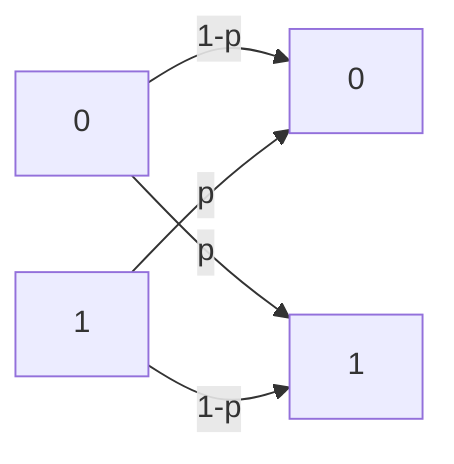
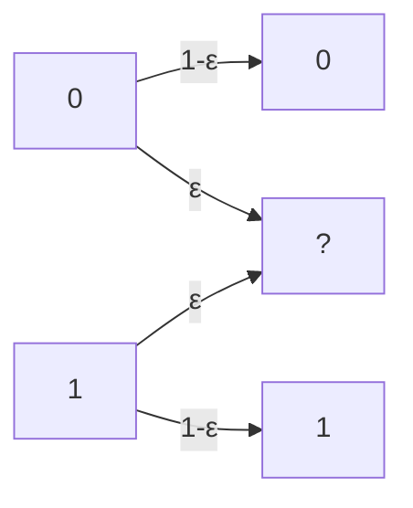

# Channel Capacity

## Table of Contents

- [[#0. Motivation: The Noisy Channel Problem|0. Motivation: The Noisy Channel Problem]]
  - [[#0.1 Repetition Codes Are Wasteful|0.1 Repetition Codes Are Wasteful]]
  - [[#0.2 Shannon's Surprising Answer|0.2 Shannon's Surprising Answer]]
  - [[#0.3 A First Look at Concrete Capacities|0.3 A First Look at Concrete Capacities]]
- [[#1. Channels and Codes|1. Channels and Codes]]
  - [[#1.1 The Discrete Memoryless Channel|1.1 The Discrete Memoryless Channel]]
  - [[#1.2 Codes, Rate, and Error Probability|1.2 Codes, Rate, and Error Probability]]
  - [[#1.3 Achievability and Operational Capacity|1.3 Achievability and Operational Capacity]]
- [[#2. Channel Capacity: Definition and Key Examples|2. Channel Capacity: Definition and Key Examples]]
  - [[#2.1 Information-Theoretic Definition|2.1 Information-Theoretic Definition]]
  - [[#2.2 Binary Symmetric Channel|2.2 Binary Symmetric Channel]]
  - [[#2.3 Binary Erasure Channel|2.3 Binary Erasure Channel]]
  - [[#2.4 AWGN Channel|2.4 AWGN Channel]]
  - [[#2.5 Concavity of Mutual Information and the Capacity-Achieving Distribution|2.5 Concavity of Mutual Information and the Capacity-Achieving Distribution]]
- [[#3. Fano's Inequality|3. Fano's Inequality]]
  - [[#3.1 Setup|3.1 Setup]]
  - [[#3.2 Proof|3.2 Proof]]
  - [[#3.3 Weaker Form and Operational Meaning|3.3 Weaker Form and Operational Meaning]]
- [[#4. Shannon's Noisy Channel Coding Theorem|4. Shannon's Noisy Channel Coding Theorem]]
  - [[#4.1 Statement|4.1 Statement]]
  - [[#4.2 Achievability: Random Coding and Jointly Typical Decoding|4.2 Achievability: Random Coding and Jointly Typical Decoding]]
  - [[#4.3 Converse: Rates Above Capacity Are Impossible|4.3 Converse: Rates Above Capacity Are Impossible]]
  - [[#4.4 Proof Summary and Interpretation|4.4 Proof Summary and Interpretation]]
- [[#5. Error Exponents: Gallager's E0 Function|5. Error Exponents: Gallager's E0 Function]]
  - [[#5.1 The Question Beyond the Threshold|5.1 The Question Beyond the Threshold]]
  - [[#5.2 Gallager's E0 Function and the Reliability Function|5.2 Gallager's E0 Function and the Reliability Function]]
  - [[#5.3 Sphere-Packing Bound|5.3 Sphere-Packing Bound]]
  - [[#5.4 Behavior of E(R) Across Rate Regimes|5.4 Behavior of E(R) Across Rate Regimes]]
- [[#6. Channel Capacity Under Constraints|6. Channel Capacity Under Constraints]]
  - [[#6.1 Cost-Constrained Capacity|6.1 Cost-Constrained Capacity]]
  - [[#6.2 Feedback Does Not Increase Capacity|6.2 Feedback Does Not Increase Capacity]]
  - [[#6.3 Additivity: n Uses of the Channel|6.3 Additivity: n Uses of the Channel]]
- [[#7. Connections|7. Connections]]
  - [[#7.1 Source-Channel Separation|7.1 Source-Channel Separation]]
  - [[#7.2 Duality with Source Coding|7.2 Duality with Source Coding]]
  - [[#7.3 Forward Reference: Rate-Distortion|7.3 Forward Reference: Rate-Distortion]]
- [[#References|References]]

---

## 0. Motivation: The Noisy Channel Problem

### 0.1 Repetition Codes Are Wasteful

Imagine transmitting a single bit $m \in \{0, 1\}$ across a channel that flips each bit independently with probability $p$. If we transmit $m$ once, the receiver decodes incorrectly with probability $p$. The naive fix: transmit $m$ three times and have the receiver take a majority vote. This reduces error to roughly $3p^2$, but the *transmission rate* drops from 1 bit per channel use to $\frac{1}{3}$ bit per channel use.

Continuing this logic — send $m$ five times for even lower error, then seven times, and so on — suggests that reliable communication requires paying an ever-steeper price in rate. Before 1948, this intuition was considered essentially correct: most engineers believed that pushing error probability to zero required pushing the rate to zero as well.

### 0.2 Shannon's Surprising Answer

Shannon's 1948 paper demonstrated that this intuition is fundamentally wrong. *Surprisingly,* there is a sharp threshold — the *channel capacity* $C$ — with the following property:

- For any rate $R < C$, there exist encoding and decoding schemes that transmit at rate $R$ with error probability converging to zero as block length $n \to \infty$.
- For any rate $R > C$, every sequence of codes has error probability bounded away from zero.

The key insight is that **reliability and rate are not fundamentally at odds** — the structure of long random codewords allows reliable communication at nonzero rates. The price for reliability is not rate itself, but rather block length: codes must be long.

### 0.3 A First Look at Concrete Capacities

Three canonical channels appear throughout this note:

| Channel | Parameter | Capacity Formula | Capacity at typical value |
|---------|-----------|-----------------|--------------------------|
| Binary Symmetric Channel (BSC) | crossover prob. $p$ | $1 - H_2(p)$ bits | $\approx 0.531$ bits at $p=0.1$ |
| Binary Erasure Channel (BEC) | erasure prob. $\epsilon$ | $1 - \epsilon$ bits | $0.9$ bits at $\epsilon=0.1$ |
| AWGN channel | SNR $= P/\sigma^2$ | $\frac{1}{2}\log_2(1 + P/\sigma^2)$ bits/use | $1$ bit/use at SNR $= 3$ |

Here $H_2(p) = -p\log_2 p - (1-p)\log_2(1-p)$ is the *binary entropy function*.

> [!INFO] Historical context
> Shannon's 1948 paper "A Mathematical Theory of Communication" introduced capacity, proved the coding theorem for DMCs, and derived the Gaussian channel capacity, all in a single work. The paper also introduced entropy, mutual information, and the entropy rate of Markov chains. Fano's inequality appeared in Fano's 1952 thesis and provided the first clean converse proof.

---

## 1. Channels and Codes

### 1.1 The Discrete Memoryless Channel

**Definition (Discrete Memoryless Channel).** A *discrete memoryless channel* (DMC) is a triple $(\mathcal{X}, p(y|x), \mathcal{Y})$ where $\mathcal{X}$ is a finite *input alphabet*, $\mathcal{Y}$ is a finite *output alphabet*, and $p(y|x)$ is a *channel transition matrix* specifying $p(y|x) = \Pr[Y = y \mid X = x]$ for each $(x, y) \in \mathcal{X} \times \mathcal{Y}$.

The *memoryless* property: when the channel is used $n$ times in succession, the joint conditional distribution factorizes as

$$p(y^n \mid x^n) = \prod_{i=1}^n p(y_i \mid x_i).$$

That is, each channel output $Y_i$ depends only on the corresponding input $X_i$, not on previous inputs or outputs. This rules out channels with memory (e.g., fading channels, intersymbol interference).

> [!NOTE] State vs. memoryless
> The memoryless property is a modeling assumption about the physical channel. Real channels often have memory (e.g., burst noise), but DMCs are the foundational model from which extensions are built. Polyanskiy & Wu (2025, Ch. 7) give a thorough axiomatic treatment that extends to channels with states.

**Notation.** We write $x^n = (x_1, \ldots, x_n) \in \mathcal{X}^n$ for an input sequence and $y^n = (y_1, \ldots, y_n) \in \mathcal{Y}^n$ for an output sequence.

### 1.2 Codes, Rate, and Error Probability

**Definition ($(M, n)$ Code).** An *$(M, n)$ code* for a DMC $(\mathcal{X}, p(y|x), \mathcal{Y})$ consists of:
- A *message set* $\mathcal{M} = \{1, 2, \ldots, M\}$,
- An *encoder* $f : \mathcal{M} \to \mathcal{X}^n$, mapping each message to a *codeword* $f(m) \in \mathcal{X}^n$,
- A *decoder* $g : \mathcal{Y}^n \to \mathcal{M}$, mapping each received sequence to a message estimate.

The *codebook* is the set of codewords $\mathcal{C} = \{f(1), f(2), \ldots, f(M)\} \subseteq \mathcal{X}^n$.

**Definition (Rate).** The *rate* of an $(M, n)$ code is

$$R = \frac{1}{n} \log_2 M \quad \text{bits per channel use.}$$

For a $(2^{nR}, n)$ code (with $M = 2^{nR}$), the rate is exactly $R$.

**Definition (Average Error Probability).** Given uniform message distribution over $\mathcal{M}$, the *average probability of error* is

$$P_e^{(n)} = \frac{1}{M} \sum_{m=1}^M \Pr\bigl[g(Y^n) \neq m \;\big|\; X^n = f(m)\bigr].$$

*Remark:* The average error criterion is weaker than the maximal error criterion $P_e^{(n),\max} = \max_{m} \Pr[g(Y^n) \neq m \mid X^n = f(m)]$. Both are used; the Shannon coding theorem holds for both (via expurgation, maximal-error codes can be constructed from average-error codes with at most a factor-of-2 rate loss). We use average error throughout.

> [!WARNING] Average vs. maximal error
> *Achievability proofs typically establish average error first. The conversion to maximal error via expurgation drops half the codewords, reducing $M$ by a factor of 2 and hence $R$ by $\frac{1}{n}\log_2 2 = \frac{1}{n} \to 0$, so the rate is asymptotically unchanged.*

### 1.3 Achievability and Operational Capacity

**Definition (Achievable Rate).** A rate $R \geq 0$ is *achievable* if there exists a sequence of $(2^{nR}, n)$ codes such that

$$P_e^{(n)} \to 0 \quad \text{as } n \to \infty.$$

**Definition (Operational Capacity).** The *operational capacity* of the DMC is

$$C = \sup\{R \geq 0 : R \text{ is achievable}\}.$$

The central theorem of channel coding (Shannon, 1948) identifies $C$ with the maximum mutual information:

$$C = \max_{p(x)} I(X; Y),$$

where the maximum is over all probability distributions on $\mathcal{X}$, and $I(X;Y)$ denotes the mutual information [[concepts/information-theory/entropy-and-divergences|Entropy and Divergences]] *(no note yet)* between the channel input and output under $p(x,y) = p(x)p(y|x)$.

> [!QUESTION] Exercise 1: Rate Interpretation
> *This exercise sharpens understanding of what "rate" measures by connecting it to the number of equiprobable messages.*
>
> > **Prerequisites:** [[#1.2 Codes, Rate, and Error Probability|1.2 Codes, Rate, and Error Probability]]
>
> Show that a $(2^{nR}, n)$ code can transmit $nR$ bits of information in $n$ channel uses. More precisely, if the message $M$ is drawn uniformly from $\{1, \ldots, 2^{nR}\}$, compute $H(M)$ and $H(M)/n$.

> [!TIP]- Solution to Exercise 1
> **Key insight:** The entropy of a uniform distribution over $2^{nR}$ outcomes is exactly $nR$ bits.
>
> **Sketch:** $H(M) = \log_2 2^{nR} = nR$ bits. Dividing by block length: $H(M)/n = R$ bits per channel use. This confirms $R$ is precisely the per-use information content of the message ensemble, motivating the name "rate."

> [!QUESTION] Exercise 2: Memoryless Property Derivation
> *The factorization $p(y^n | x^n) = \prod_i p(y_i | x_i)$ is the mathematical core of "memoryless."*
>
> > **Prerequisites:** [[#1.1 The Discrete Memoryless Channel|1.1 The Discrete Memoryless Channel]]
>
> Starting from the conditional independence statement "$Y_i$ is independent of $(X^{i-1}, Y^{i-1})$ given $X_i$," derive the factorization $p(y^n | x^n) = \prod_{i=1}^n p(y_i | x_i)$ by induction.

> [!TIP]- Solution to Exercise 2
> **Key insight:** The chain rule for conditional probability, applied iteratively, peels off each factor.
>
> **Sketch:** $p(y^n | x^n) = p(y_n | y^{n-1}, x^n) \cdot p(y^{n-1} | x^n)$. The memoryless assumption gives $p(y_n | y^{n-1}, x^n) = p(y_n | x_n)$ (since $Y_n \perp (X^{n-1}, Y^{n-1}) | X_n$, and conditioning on $x^n$ does not reintroduce dependence). Applying inductively yields the product form.

---

## 2. Channel Capacity: Definition and Key Examples

### 2.1 Information-Theoretic Definition

**Definition (Channel Capacity).** The *information-theoretic capacity* of a DMC $(\mathcal{X}, p(y|x), \mathcal{Y})$ is

$$C = \max_{p(x)} I(X; Y),$$

where $I(X;Y) = \sum_{x,y} p(x)p(y|x)\log_2 \frac{p(y|x)}{p(y)}$ and $p(y) = \sum_x p(x)p(y|x)$.

The maximum exists because $p(x)$ ranges over the compact simplex $\Delta(\mathcal{X})$ and $I(X;Y)$ is continuous (in fact, concave) in $p(x)$ for fixed $p(y|x)$. The input distribution $p^*(x)$ achieving the maximum is the *capacity-achieving distribution*.

> [!NOTE] Equivalence of definitions
> Shannon's theorem (Section 4) shows that the information-theoretic definition $C = \max_{p(x)} I(X;Y)$ equals the operational definition $C = \sup\{R : R \text{ achievable}\}$. Proving this equality requires the achievability proof (Section 4.2) and the converse (Section 4.3). The information-theoretic expression provides a computable formula; the operational definition gives the physical meaning.

### 2.2 Binary Symmetric Channel

**Definition (BSC).** The *binary symmetric channel* with crossover probability $p \in [0, 1/2]$ has $\mathcal{X} = \mathcal{Y} = \{0,1\}$ and transition matrix

$$p(y|x) = \begin{cases} 1-p & \text{if } y = x, \\ p & \text{if } y \neq x. \end{cases}$$



**Proposition (BSC Capacity).** $C_{\mathrm{BSC}}(p) = 1 - H_2(p)$ bits.

**Proof.** We have

$$I(X;Y) = H(Y) - H(Y|X).$$

Since $H(Y|X) = \sum_x p(x) H(Y|X=x) = \sum_x p(x) H_2(p) = H_2(p)$ (each row of the BSC has entropy $H_2(p)$, independent of $x$), we need to maximize $H(Y)$ over $p(x)$.

$H(Y) \leq 1$ with equality iff $Y$ is uniform. Under the BSC, $\Pr[Y=1] = p(0)(p) + p(1)(1-p)$. Setting $\Pr[Y=1] = 1/2$ requires $p(0) = p(1) = 1/2$. Therefore

$$I(X;Y) = H(Y) - H_2(p) \leq 1 - H_2(p),$$

achieved by the uniform input $p^*(0) = p^*(1) = 1/2$. $\square$

**The capacity-achieving distribution for the BSC is uniform.** This makes sense by symmetry: the BSC treats both input symbols identically, so any asymmetry in $p(x)$ is wasted.

> [!EXAMPLE] BSC capacity at $p=0.1$
> $H_2(0.1) = -0.1\log_2(0.1) - 0.9\log_2(0.9) \approx 0.469$ bits.
> Therefore $C = 1 - 0.469 = 0.531$ bits per channel use.
> Even with 10% flip probability, we can transmit reliably at over half the maximum rate of 1 bit/use.

> [!QUESTION] Exercise 3: Symmetric Channel Capacity General Case
> *The BSC argument generalizes: for any symmetric channel, the uniform input maximizes mutual information.*
>
> > **Prerequisites:** [[#2.2 Binary Symmetric Channel|2.2 Binary Symmetric Channel]]
>
> A DMC is *symmetric* (in the sense of Gallager) if every row of $p(y|x)$ is a permutation of the first row, and every column of $p(y|x)$ is a permutation of the first column. Show that for a symmetric channel, the uniform input $p(x) = 1/|\mathcal{X}|$ is capacity-achieving.

> [!TIP]- Solution to Exercise 3
> **Key insight:** Symmetry forces $H(Y|X) = H_2(\text{first row})$ regardless of $p(x)$; symmetry in columns forces $Y$ to be uniform under the uniform input.
>
> **Sketch:** Under any input $p(x)$, $H(Y|X) = \sum_x p(x)H_2(\text{row}_x) = H_2(\text{row}_0)$ because all rows are permutations and entropy is permutation-invariant. So we need only maximize $H(Y)$. Under the uniform input, the output distribution is $p(y) = \frac{1}{|\mathcal{X}|} \sum_x p(y|x)$. Since every column of $p(y|x)$ is a permutation of the first, the column sums are all equal, so $p(y) = 1/|\mathcal{Y}|$ is uniform. Therefore $H(Y) = \log_2 |\mathcal{Y}|$ is maximized.

### 2.3 Binary Erasure Channel

**Definition (BEC).** The *binary erasure channel* with erasure probability $\epsilon \in [0,1]$ has $\mathcal{X} = \{0,1\}$, $\mathcal{Y} = \{0, ?, 1\}$ (with $?$ denoting erasure), and transition probabilities

$$p(y|x) = \begin{cases} 1-\epsilon & \text{if } y = x, \\ \epsilon & \text{if } y = \;?, \\ 0 & \text{otherwise.} \end{cases}$$



**Proposition (BEC Capacity).** $C_{\mathrm{BEC}}(\epsilon) = 1 - \epsilon$ bits.

**Proof.** Compute $I(X;Y) = H(Y) - H(Y|X)$. Given $X=x$, the output $Y$ takes value $x$ with probability $1-\epsilon$ and $?$ with probability $\epsilon$, so $H(Y|X=x) = H_2(\epsilon)$ (binary entropy) for each $x$. Thus $H(Y|X) = H_2(\epsilon)$.

Now $\Pr[Y = ?] = \epsilon$ regardless of $p(x)$ (since both inputs erase with probability $\epsilon$). So $Y$ takes value $?$ with probability $\epsilon$ and takes value $0$ or $1$ with total probability $1-\epsilon$. Given that $Y \neq ?$, the output is $0$ with probability $p(0)$ and $1$ with probability $p(1)$.

We can write $H(Y) = H_2(\epsilon) + (1-\epsilon)H(X)$ using the chain rule: condition on whether erasure occurs. Therefore

$$I(X;Y) = H_2(\epsilon) + (1-\epsilon)H(X) - H_2(\epsilon) = (1-\epsilon)H(X) \leq (1-\epsilon) \cdot 1,$$

with equality iff $H(X) = 1$, i.e., $p(0) = p(1) = 1/2$. Thus $C = 1 - \epsilon$. $\square$

> [!INFO] Erasure vs. symmetric channels
> The BSC and BEC are complementary in character. The BSC introduces *uncertainty* about the bit value; the receiver gets something but may not trust it. The BEC introduces *absence*: the receiver either gets a perfect copy or nothing. Intuitively, erasure is "cheaper" than flipping — hence $C_{\mathrm{BEC}} \geq C_{\mathrm{BSC}}$ for the same noise probability $p = \epsilon$.

### 2.4 AWGN Channel

The *additive white Gaussian noise* (AWGN) channel is $Y_i = X_i + Z_i$, where $Z_i \sim \mathcal{N}(0, \sigma^2)$ i.i.d. and the input satisfies an average power constraint $\frac{1}{n}\sum_i X_i^2 \leq P$.

**Theorem (AWGN Capacity, Shannon 1948).** 

$$C_{\mathrm{AWGN}} = \frac{1}{2}\log_2\!\left(1 + \frac{P}{\sigma^2}\right) \quad \text{bits per channel use.}$$

*Proof deferred:* this result requires the concept of *differential entropy* for continuous distributions, which is outside the scope of this note (treating discrete channels). The Gaussian input $X \sim \mathcal{N}(0, P)$ is capacity-achieving. At high SNR, $C \approx \frac{1}{2}\log_2(P/\sigma^2)$ grows logarithmically in power.

> [!QUESTION] Exercise 4: BSC vs. BEC Comparison
> *This exercise establishes a precise ordering of BSC and BEC capacities, confirming the intuition that erasure is less damaging than flipping.*
>
> > **Prerequisites:** [[#2.2 Binary Symmetric Channel|2.2 Binary Symmetric Channel]], [[#2.3 Binary Erasure Channel|2.3 Binary Erasure Channel]]
>
> For $p \in (0, 1/2)$, prove that $C_{\mathrm{BEC}}(p) > C_{\mathrm{BSC}}(p)$, i.e., $1 - p > 1 - H_2(p)$. What happens at $p = 0$ and $p = 1/2$?

> [!TIP]- Solution to Exercise 4
> **Key insight:** We need $H_2(p) > p$ for $p \in (0, 1/2)$.
>
> **Sketch:** $H_2(p) = -p\log_2 p - (1-p)\log_2(1-p)$. At $p=0$: $H_2(0) = 0 = p$, so $C_{\mathrm{BEC}} = C_{\mathrm{BSC}} = 1$. At $p=1/2$: $H_2(1/2) = 1 = 2p$, so $C_{\mathrm{BEC}} = C_{\mathrm{BSC}} = 1/2$. For $p \in (0,1/2)$, we check that $f(p) = H_2(p) - p > 0$: $f(0) = 0$, $f'(p) = \log_2((1-p)/p) - 1$. At $p = 1/3$, $f'(1/3) = \log_2 2 - 1 = 0$, so $f$ has a maximum at $p = 1/3$. Since $f(0) = 0$ and $f$ increases on $(0, 1/3)$, we have $H_2(p) > p$ on $(0, 1/2)$, confirming the ordering.

### 2.5 Concavity of Mutual Information and the Capacity-Achieving Distribution

**Proposition (Concavity in input distribution).** For a fixed DMC $p(y|x)$, the mutual information $I(X;Y)$ is a *concave* function of the input distribution $p(x)$.

**Proof sketch.** Write $I(X;Y) = H(Y) - H(Y|X)$. The term $H(Y|X) = \sum_x p(x) H(Y|X=x)$ is linear in $p(x)$ (since $H(Y|X=x)$ is a fixed function of the channel). The term $H(Y) = H\!\left(\sum_x p(x) p(\cdot|x)\right)$ is a concave function of $p(x)$: entropy is concave in the distribution, and the map $p(x) \mapsto \sum_x p(x) p(\cdot|x)$ is linear. A concave function composed with a linear map is concave. Therefore $I(X;Y)$ is a sum of a concave function and a linear function, hence concave. $\square$

Concavity ensures that the capacity optimization problem $\max_{p(x)} I(X;Y)$ over the simplex $\Delta(\mathcal{X})$ has no local optima — any local maximum is global — and can be solved efficiently (e.g., via the Blahut-Arimoto algorithm, Exercise 22).

> [!QUESTION] Exercise 5: Convexity of Capacity in Channel Parameters
> *Mutual information is concave in $p(x)$ but the behavior in $p(y|x)$ is different — this asymmetry has operational meaning.*
>
> > **Prerequisites:** [[#2.5 Concavity of Mutual Information and the Capacity-Achieving Distribution|2.5 Concavity of Mutual Information and the Capacity-Achieving Distribution]]
>
> Show that $I(X;Y)$ is a *convex* function of the channel $p(y|x)$ for fixed input distribution $p(x)$. Then give an operational interpretation: what does this convexity say about the capacity of a mixture of two channels?

> [!TIP]- Solution to Exercise 5
> **Key insight:** $I(X;Y) = D_{\mathrm{KL}}(p(x,y) \| p(x)p(y))$, and KL divergence is convex in its arguments.
>
> **Sketch:** Fix $p(x)$. The joint distribution $p(x,y) = p(x)p(y|x)$ is linear in $p(y|x)$, and $p(y) = \sum_x p(x)p(y|x)$ is also linear in $p(y|x)$. Since $D_{\mathrm{KL}}(p \| q)$ is jointly convex in $(p,q)$, and we are evaluating it at arguments that are both linear in $p(y|x)$, convexity follows. Operationally: a "mixture" channel that randomly routes each input through channel $W_1$ with probability $\alpha$ and channel $W_2$ with probability $1-\alpha$ satisfies $C(\alpha W_1 + (1-\alpha)W_2) \leq \alpha C(W_1) + (1-\alpha)C(W_2)$. A mixture channel is harder to use reliably than the average of its components would suggest.

---

## 3. Fano's Inequality

### 3.1 Setup

Let $X$ be a random variable taking values in a finite alphabet $\mathcal{X}$. Suppose we observe a random variable $Y$ (not necessarily related to $X$ through a specific channel model) and form an estimate $\hat{X} = g(Y)$ for some deterministic function $g$. Define the *error probability*

$$P_e = \Pr[\hat{X} \neq X].$$

The Markov chain $X \to Y \to \hat{X}$ holds (since $\hat{X}$ is a function of $Y$ only), so by the *data processing inequality* [[concepts/information-theory/entropy-and-divergences|Entropy and Divergences]] *(no note yet)*,

$$I(X; \hat{X}) \leq I(X; Y).$$

Fano's inequality gives a quantitative lower bound on $H(X|Y)$ in terms of $P_e$: if the decoder makes many errors, the channel cannot have been very informative about $X$.

### 3.2 Proof

📐 **Theorem (Fano's Inequality).** For any estimator $\hat{X} = g(Y)$ with error probability $P_e = \Pr[\hat{X} \neq X]$,

$$H(X | Y) \leq H_2(P_e) + P_e \log_2(|\mathcal{X}| - 1).$$

**Proof.** Introduce the *error indicator* $E = \mathbf{1}[\hat{X} \neq X] \in \{0,1\}$.

**Step 1: Chain rule, two ways.** Apply the chain rule for entropy to $H(E, X \mid \hat{X})$:

$$H(E, X \mid \hat{X}) = H(X \mid \hat{X}) + \underbrace{H(E \mid X, \hat{X})}_{= 0},$$

since $E$ is determined by $(X, \hat{X})$. Also,

$$H(E, X \mid \hat{X}) = H(E \mid \hat{X}) + H(X \mid E, \hat{X}).$$

Equating: $H(X \mid \hat{X}) = H(E \mid \hat{X}) + H(X \mid E, \hat{X})$.

**Step 2: Bound each term.** First, $H(E \mid \hat{X}) \leq H(E) = H_2(P_e)$ (conditioning reduces entropy).

Second, expand $H(X \mid E, \hat{X})$ by conditioning on $E$:

$$H(X \mid E, \hat{X}) = \Pr[E=0]\underbrace{H(X \mid E=0, \hat{X})}_{=\,0} + \Pr[E=1] H(X \mid E=1, \hat{X}).$$

When $E=0$ (correct decoding), $X = \hat{X}$ almost surely, so $H(X \mid E=0, \hat{X}) = 0$.
When $E=1$ (error), $X \neq \hat{X}$, so given $\hat{X}$, the variable $X$ takes values in $\mathcal{X} \setminus \{\hat{X}\}$, an alphabet of size $|\mathcal{X}|-1$. Therefore $H(X \mid E=1, \hat{X}) \leq \log_2(|\mathcal{X}|-1)$.

Combining: $H(X \mid E, \hat{X}) \leq P_e \log_2(|\mathcal{X}|-1)$.

**Step 3: Assemble.** Since $H(X|\hat{X}) \geq H(X|Y)$ by the data processing inequality (observing $Y$ is at least as informative as any function $\hat{X} = g(Y)$):

$$H(X|Y) \leq H(X|\hat{X}) \leq H_2(P_e) + P_e\log_2(|\mathcal{X}|-1). \qquad \square$$

### 3.3 Weaker Form and Operational Meaning

**Corollary (Weak Fano).** Using $\log_2(|\mathcal{X}|-1) \leq \log_2|\mathcal{X}|$ and $H_2(P_e) \leq 1$:

$$H(X|Y) \leq 1 + P_e \log_2|\mathcal{X}|.$$

This weaker form suffices for the channel coding converse.

**Operational meaning.** 🔑 Fano's inequality says: *if the decoder makes few errors ($P_e \approx 0$), then $H(X|Y)$ must be small* — the channel output $Y$ has almost eliminated uncertainty about $X$. Equivalently, $H(X|Y) \approx 0$ is a necessary condition for reliable decoding.

The converse direction is also useful: if $H(X|Y)$ is large, then *any* decoder must make many errors. This is the key ingredient in the converse proof of Shannon's theorem.

> [!QUESTION] Exercise 6: Tightness of Fano's Inequality
> *Identifying when Fano is tight clarifies what the bound actually captures.*
>
> > **Prerequisites:** [[#3.2 Proof|3.2 Proof]]
>
> Show that equality holds in Fano's inequality if and only if: (a) $E$ is independent of $\hat{X}$ (i.e., $E \perp \hat{X}$), and (b) given $E=1$ and $\hat{X}$, the variable $X$ is uniform over $\mathcal{X} \setminus \{\hat{X}\}$. Construct a simple example (binary $X$, any $Y$) where equality holds.

> [!TIP]- Solution to Exercise 6
> **Key insight:** Both inequalities in the proof must be tight simultaneously: $H(E|\hat{X}) = H(E)$ (independence) and $H(X|E=1, \hat{X}) = \log_2(|\mathcal{X}|-1)$ (uniformity on errors).
>
> **Sketch:** (a) $H(E|\hat{X}) = H(E)$ iff $E \perp \hat{X}$. (b) $H(X|E=1,\hat{X}) = \log_2(|\mathcal{X}|-1)$ iff conditional on error and $\hat{X}=a$, $X$ is uniform on $\mathcal{X}\setminus\{a\}$. For binary $X \in \{0,1\}$ with $|\mathcal{X}|-1 = 1$: $H(X|E=1,\hat{X}) = 0$ trivially (only one wrong answer). Equality then holds when $E \perp \hat{X}$, which is satisfied by any channel where $P_e$ does not depend on the decoded symbol (e.g., uniform output).

> [!QUESTION] Exercise 7: Applying Fano to the n-Channel Model
> *This extension of Fano is the actual bound used in the converse proof.*
>
> > **Prerequisites:** [[#3.3 Weaker Form and Operational Meaning|3.3 Weaker Form and Operational Meaning]]
>
> Let $M$ be a uniform message drawn from $\{1, \ldots, 2^{nR}\}$, and let $\hat{M} = g(Y^n)$ be the decoder output after $n$ channel uses. Define $P_e^{(n)} = \Pr[\hat{M} \neq M]$. Show that
> $$H(M | Y^n) \leq 1 + P_e^{(n)} \cdot nR.$$

> [!TIP]- Solution to Exercise 7
> **Key insight:** Apply Fano's inequality with $X \leftarrow M$, $Y \leftarrow Y^n$, $\hat{X} \leftarrow \hat{M}$, and $|\mathcal{X}| = 2^{nR}$.
>
> **Sketch:** The alphabet of $M$ has size $|\mathcal{M}| = 2^{nR}$. By the weak Fano inequality: $H(M|Y^n) \leq H(M|\hat{M}) \leq 1 + P_e^{(n)} \log_2(2^{nR}) = 1 + P_e^{(n)} \cdot nR$.

---

## 4. Shannon's Noisy Channel Coding Theorem

### 4.1 Statement

**Theorem (Shannon's Channel Coding Theorem, 1948).** For a DMC with transition matrix $p(y|x)$, let

$$C = \max_{p(x)} I(X;Y).$$

Then:
1. **(Achievability)** For every rate $R < C$ and every $\varepsilon > 0$, there exists $N$ such that for all $n \geq N$ there exists a $(2^{nR}, n)$ code with $P_e^{(n)} \leq \varepsilon$.
2. **(Converse)** For every rate $R > C$, every sequence of $(2^{nR}, n)$ codes satisfies $P_e^{(n)} \geq 1 - C/R - 1/(nR) \to 1 - C/R > 0$.

**Together:** $C = \max_{p(x)} I(X;Y)$ is simultaneously the operational capacity (supremum of achievable rates).

### 4.2 Achievability: Random Coding and Jointly Typical Decoding

📐 The achievability proof constructs a sequence of codes (non-constructively) via random coding and analyzes the error probability.

**Setup.** Fix a rate $R < C$ and a capacity-achieving distribution $p^*(x)$. Fix $\varepsilon > 0$ small enough that $R < I(X;Y) - 3\varepsilon$ (possible since $I(X;Y) = C > R$).

**Code generation.** Draw $2^{nR}$ codewords independently, each coordinate i.i.d. from $p^*(x)$:

$$x^n(m) \sim \prod_{i=1}^n p^*(x_i), \quad m = 1, \ldots, 2^{nR}.$$

This is a *random code*: the codebook $\mathcal{C} = \{x^n(1), \ldots, x^n(2^{nR})\}$ is a random variable.

**Encoder.** $f(m) = x^n(m)$.

**Jointly typical decoder.** Given received sequence $y^n$, declare $\hat{m}$ if:
1. $(x^n(\hat{m}), y^n) \in \mathcal{T}_\varepsilon^{(n)}(X,Y)$ (jointly typical, see [[concepts/information-theory/aep-and-typicality|AEP and Typicality]]),
2. No other codeword $m' \neq \hat{m}$ satisfies $(x^n(m'), y^n) \in \mathcal{T}_\varepsilon^{(n)}(X,Y)$.

If zero or more than one codewords satisfy condition 1, declare an error.

**Error analysis.** Fix a message $m$ (say $m=1$ WLOG by symmetry). Two error events can occur:

- $\mathcal{E}_1$: the sent codeword $x^n(1)$ is not jointly typical with $y^n$, i.e., $(x^n(1), y^n) \notin \mathcal{T}_\varepsilon^{(n)}$.
- $\mathcal{E}_2^{(m')}$: a wrong codeword $x^n(m')$ is jointly typical with $y^n$, i.e., $(x^n(m'), y^n) \in \mathcal{T}_\varepsilon^{(n)}$ for some $m' \neq 1$.

By the union bound, $P_e^{(n)} \leq \Pr[\mathcal{E}_1] + \sum_{m'=2}^{2^{nR}} \Pr[\mathcal{E}_2^{(m')}]$.

**Bounding $\Pr[\mathcal{E}_1]$:** The AEP for jointly typical sequences (see [[concepts/information-theory/aep-and-typicality|AEP and Typicality]]) states that $(X^n, Y^n) \in \mathcal{T}_\varepsilon^{(n)}$ with probability approaching 1:

$$\Pr[\mathcal{E}_1] \to 0 \quad \text{as } n \to \infty.$$

**Bounding $\Pr[\mathcal{E}_2^{(m')}]$ for $m' \neq 1$:** The wrong codeword $x^n(m')$ was drawn i.i.d. from $p^*(x)$ *independently* of $y^n$ (since $m' \neq 1$ and codewords are independent). By the joint typicality lemma ([[concepts/information-theory/aep-and-typicality|AEP and Typicality]]), a pair $(x^n, y^n)$ where $x^n$ is drawn i.i.d. from $p^*(x)$ independently of $y^n \sim p^*(y)$ satisfies

$$\Pr[(x^n(m'), y^n) \in \mathcal{T}_\varepsilon^{(n)}] \leq 2^{-n(I(X;Y) - 3\varepsilon)}.$$

Summing over the $2^{nR} - 1$ wrong codewords:

$$\sum_{m'=2}^{2^{nR}} \Pr[\mathcal{E}_2^{(m')}] \leq (2^{nR}-1) \cdot 2^{-n(I(X;Y)-3\varepsilon)} \leq 2^{n(R - I(X;Y) + 3\varepsilon)}.$$

**Conclusion.** Since $R < I(X;Y) - 3\varepsilon$, the exponent $R - I(X;Y) + 3\varepsilon < 0$, so

$$P_e^{(n)} \leq \Pr[\mathcal{E}_1] + 2^{-n(I(X;Y) - R - 3\varepsilon)} \to 0.$$

🔑 **This bound shows that random codes of rate $R < C$ have average error probability tending to zero.** Since this holds for the *average* over the random code ensemble, there must exist at least one specific code achieving the same error bound (a *derandomization* argument). $\square$

> [!NOTE] Why random coding works
> The key intuition is that a randomly chosen wrong codeword $x^n(m')$ is *unlikely* to be jointly typical with $y^n$: the jointly typical set has only $2^{n(H(X,Y)+\varepsilon)}$ elements in $\mathcal{X}^n \times \mathcal{Y}^n$, while fixing $y^n$ leaves roughly $2^{n(H(X|Y)+\varepsilon)}$ compatible $x^n$ sequences. The probability that a uniformly random $x^n \in \mathcal{X}^n$ is jointly typical with a given $y^n$ is thus roughly $2^{n(H(X|Y) - H(X))} = 2^{-nI(X;Y)}$. So we can fit $\approx 2^{nI(X;Y)}$ codewords before collisions (jointly typical wrong codewords) become probable.

> [!QUESTION] Exercise 8: Derandomization via Averaging
> *The random coding argument gives average error over the ensemble; this exercise extracts a deterministic code.*
>
> > **Prerequisites:** [[#4.2 Achievability: Random Coding and Jointly Typical Decoding|4.2 Achievability: Random Coding and Jointly Typical Decoding]]
>
> Let $P_e^{(n)}(\mathcal{C})$ denote the average error probability of a specific code $\mathcal{C}$. If the random coding argument shows $\mathbb{E}_{\mathcal{C}}[P_e^{(n)}(\mathcal{C})] \leq \delta_n \to 0$, use a Markov inequality argument to show that for sufficiently large $n$, a fraction at least $1 - \sqrt{\delta_n}$ of random codes satisfies $P_e^{(n)}(\mathcal{C}) \leq \sqrt{\delta_n}$.

> [!TIP]- Solution to Exercise 8
> **Key insight:** Markov's inequality directly translates from expected error to concentration of error.
>
> **Sketch:** By Markov's inequality, $\Pr[P_e^{(n)}(\mathcal{C}) > t] \leq \mathbb{E}[P_e^{(n)}(\mathcal{C})]/t$. Setting $t = \sqrt{\delta_n}$: $\Pr[P_e^{(n)}(\mathcal{C}) > \sqrt{\delta_n}] \leq \delta_n / \sqrt{\delta_n} = \sqrt{\delta_n} \to 0$. Therefore a fraction at least $1 - \sqrt{\delta_n}$ of codes achieve $P_e^{(n)} \leq \sqrt{\delta_n}$.

> [!QUESTION] Exercise 9: Random Coding Error Exponent (Sketch)
> *The random coding argument gives more than $P_e \to 0$ — it gives an exponential rate.*
>
> > **Prerequisites:** [[#4.2 Achievability: Random Coding and Jointly Typical Decoding|4.2 Achievability: Random Coding and Jointly Typical Decoding]]
>
> From the union bound in the achievability proof, identify the dominant error term for large $n$ when $R < I(X;Y) - 3\varepsilon$. Express the resulting error exponent as a function of $I(X;Y)$ and $R$. How does this compare with the Gallager exponent $E(R)$ from Section 5?

> [!TIP]- Solution to Exercise 9
> **Key insight:** The union bound gives an exponent of $I(X;Y) - R$, which is a loose (but simple) version of the Gallager exponent.
>
> **Sketch:** The error bound is $\leq \Pr[\mathcal{E}_1] + 2^{-n(I(X;Y) - R - 3\varepsilon)}$. For large $n$, $\Pr[\mathcal{E}_1] \to 0$ faster than any exponential (it vanishes due to the AEP). The dominant term decays as $2^{-n(I(X;Y) - R - 3\varepsilon)}$, giving a union-bound exponent of $I(X;Y) - R$ (up to $\varepsilon$ corrections). This is a lower bound on Gallager's $E(R)$; the Gallager bound is tighter because it optimizes over $\rho \in [0,1]$ rather than fixing $\rho = 1$ (corresponding to the union bound).

### 4.3 Converse: Rates Above Capacity Are Impossible

**Theorem (Converse).** For any sequence of $(2^{nR}, n)$ codes with $R > C$,

$$P_e^{(n)} \geq 1 - \frac{C}{R} - \frac{1}{nR}.$$

**Proof.** Let $M$ be a uniform message, $X^n = f(M)$ the transmitted codeword, $Y^n$ the channel output, and $\hat{M} = g(Y^n)$ the decoded message.

**Step 1: Bound $I(M; Y^n)$.** Since $M \to X^n \to Y^n$ is a Markov chain (the encoder is deterministic, so $X^n$ is determined by $M$) and using the data-processing inequality [[concepts/information-theory/entropy-and-divergences|Entropy and Divergences]] *(no note yet)*:

$$I(M; Y^n) \leq I(X^n; Y^n).$$

Now use the memoryless property and the chain rule for mutual information:

$$I(X^n; Y^n) = \sum_{i=1}^n I(X_i; Y_i \mid X^{i-1}, Y^{i-1}).$$

*Wait — this step requires care.* With feedback or dependence between $X^n$ and previous $Y$'s, this does not immediately simplify. For a DMC without feedback, the input $X_i$ may depend on previous outputs if feedback is used, but for a *code* (no feedback), $X^n = f(M)$ is a fixed function of $M$ only. Hence $X_i$ is determined by $M$ and does not depend on $Y^{i-1}$, so

$$I(X_i; Y_i \mid X^{i-1}, Y^{i-1}) \leq I(X_i; Y_i) \leq C,$$

where the last inequality uses the definition of capacity ($C = \max_{p(x)} I(X;Y)$ and $p(X_i | X^{i-1})$ is some marginal on $\mathcal{X}$). Therefore

$$I(M; Y^n) \leq I(X^n; Y^n) \leq nC.$$

**Step 2: Apply Fano.** Since $M$ is uniform over $2^{nR}$ messages, $H(M) = nR$. Also $\hat{M} = g(Y^n)$, so by the data-processing inequality, $H(M|Y^n) \leq H(M|\hat{M}) \leq 1 + P_e^{(n)} \cdot nR$ (Exercise 7).

Now write

$$nR = H(M) = I(M; Y^n) + H(M|Y^n) \leq nC + 1 + P_e^{(n)} \cdot nR.$$

Rearranging:

$$P_e^{(n)} \cdot nR \geq nR - nC - 1 = n(R-C) - 1.$$

$$\boxed{P_e^{(n)} \geq 1 - \frac{C}{R} - \frac{1}{nR}.}$$

As $n \to \infty$, $P_e^{(n)} \geq 1 - C/R > 0$ since $R > C$. $\square$

> [!WARNING] Weak vs. strong converse
> *The above is the* weak converse: *it shows $P_e^{(n)}$ stays bounded away from zero, but does not rule out $P_e^{(n)} \to$ some value strictly between 0 and 1. The* strong converse *(Wolfowitz, 1957) shows $P_e^{(n)} \to 1$ for $R > C$: error probability goes all the way to 1, not just bounded away from zero. The strong converse establishes $C$ as a truly sharp threshold.*

### 4.4 Proof Summary and Interpretation

The two parts together establish:

$$C_{\text{operational}} = \sup\{R: R \text{ achievable}\} = C_{\text{information}} = \max_{p(x)} I(X;Y).$$

| Direction | Tool | Conclusion |
|-----------|------|------------|
| Achievability ($R < C \Rightarrow P_e \to 0$) | Random coding + AEP joint typicality | Rates below $C$ are achievable |
| Converse ($R > C \Rightarrow P_e \not\to 0$) | Fano's inequality + data processing | Rates above $C$ are not achievable |

> [!QUOTE] Shannon (1948)
> "If the capacity of a channel is $C$ and the channel is used to transmit at the rate $R < C$, then it is possible to encode the information in such a way that the frequency of errors can be made arbitrarily small."

> [!QUESTION] Exercise 10: Strong Converse via Blowing-Up
> *The strong converse shows $P_e \to 1$ for $R > C$, not merely $P_e \geq 1 - C/R$.*
>
> > **Prerequisites:** [[#4.3 Converse: Rates Above Capacity Are Impossible|4.3 Converse: Rates Above Capacity Are Impossible]]
>
> State the strong converse (Wolfowitz 1957): for $R > C$ and any sequence of $(2^{nR}, n)$ codes, $P_e^{(n)} \to 1$. Sketch an argument using the method of types from [[concepts/information-theory/aep-and-typicality|AEP and Typicality]]: why does the number of "good" codewords (those that can be decoded reliably) grow slower than $2^{nC}$?

> [!TIP]- Solution to Exercise 10
> **Key insight:** At most $2^{nC+o(n)}$ codewords can reside in any single jointly typical set, so a codebook of size $2^{nR}$ with $R > C$ must have most codewords outside any single decoding region.
>
> **Sketch:** Fix any decoding region $\mathcal{D}_m \subseteq \mathcal{Y}^n$ for message $m$. For reliable decoding, $p(y^n | x^n(m))$ must concentrate on $\mathcal{D}_m$, which requires $\mathcal{D}_m$ to contain the type class $\mathcal{T}(P_{y|x})$ for the dominant conditional type. Each such decoding region has volume $\approx 2^{nH(Y|X)}$ sequences. The total output space has size $\leq |\mathcal{Y}|^n = 2^{n\log|\mathcal{Y}|}$, but the mutually exclusive decodable regions have cardinality $\leq 2^{n\log|\mathcal{Y}| - nH(Y|X)} = 2^{nH(Y)}$. Maximized over $p(x)$, this is $\leq 2^{nC + nH(Y|X)}$... The formal argument uses a packing lemma showing at most $2^{nC}$ codewords can be mutually distinguishable; the remaining $2^{nR} - 2^{nC}$ are either undecodable or produce errors.

> [!QUESTION] Exercise 11: Capacity of a Product Channel
> *If two channels are used simultaneously (one for each of two independent senders), the total capacity is the sum of individual capacities.*
>
> > **Prerequisites:** [[#4.1 Statement|4.1 Statement]]
>
> Let $W_1 = (\mathcal{X}_1, p_1(y|x), \mathcal{Y}_1)$ and $W_2 = (\mathcal{X}_2, p_2(z|w), \mathcal{Y}_2)$ be two independent DMCs. Define the product channel $W_1 \times W_2$ with input $(X,W) \in \mathcal{X}_1 \times \mathcal{X}_2$ and output $(Y,Z) \in \mathcal{Y}_1 \times \mathcal{Y}_2$, with $p((y,z)|(x,w)) = p_1(y|x)p_2(z|w)$. Show $C(W_1 \times W_2) = C(W_1) + C(W_2)$.

> [!TIP]- Solution to Exercise 11
> **Key insight:** Mutual information factorizes over independent channels when input coordinates are independent.
>
> **Sketch:** $I((X,W); (Y,Z)) = I(X;Y) + I(W;Z)$ when $X \perp W$ (since the channels are independent and input independence factorizes joint MI). Maximizing over $p(x,w) = p(x)p(w)$: $C(W_1 \times W_2) = \max_{p(x)} I(X;Y) + \max_{p(w)} I(W;Z) = C(W_1) + C(W_2)$. The key step is that the optimal joint input is always a product distribution, since the channels are independent.

---

## 5. Error Exponents: Gallager's E0 Function

### 5.1 The Question Beyond the Threshold

The coding theorem tells us that for $R < C$, $P_e^{(n)} \to 0$, but says nothing about *how fast*. For practical systems with finite block length $n$, the rate of decay matters enormously: a code with $P_e^{(n)} \approx 2^{-100n}$ is far more useful than one with $P_e^{(n)} \approx 2^{-0.001n}$.

**Definition (Error Exponent).** For a sequence of $(2^{nR}, n)$ codes, the *error exponent* (or *reliability function*) at rate $R$ is

$$E(R) = \lim_{n\to\infty} -\frac{1}{n}\log_2 P_e^{(n)}.$$

The best achievable error exponent at rate $R$ is

$$E^*(R) = \sup \{E(R)\text{ over all code sequences with rate } R\}.$$

### 5.2 Gallager's E0 Function and the Reliability Function

**Definition (Gallager's E0 function).** For $\rho \in [0,1]$ and input distribution $p(x)$,

$$E_0(\rho, p) = -\log_2 \sum_{y \in \mathcal{Y}} \left(\sum_{x \in \mathcal{X}} p(x)\, p(y|x)^{\frac{1}{1+\rho}}\right)^{1+\rho}.$$

**Definition (Reliability function / Random Coding Exponent).** The random coding exponent is

$$E_r(R) = \max_{p(x)} \max_{\rho \in [0,1]} \left[E_0(\rho, p) - \rho R\right].$$

This equals the Legendre-Fenchel transform of $E_0$ in the $\rho$ variable, evaluated at rate $R$.

**Theorem (Gallager 1965).** For any rate $R < C$, there exists a sequence of $(2^{nR}, n)$ codes with

$$P_e^{(n)} \leq 2^{-n E_r(R)}.$$

That is, the random coding exponent $E_r(R)$ is achievable.

**Main ideas of the proof.** Instead of the union bound used in Section 4.2 (which corresponds to $\rho = 1$), Gallager raises the union bound to a power $\rho \in (0,1]$ before taking the expectation:

$$P_e^{(n)} \leq \left(\sum_{y^n} p(y^n|x^n(1))\left[\sum_{m \neq 1} \Pr[(x^n(m), y^n) \text{ jointly typical}]\right]^\rho\right).$$

Optimizing $\rho \in [0,1]$ yields the tightest bound. The function $E_0(\rho, p)$ encapsulates the per-symbol contribution to the exponent, and the rate term $\rho R$ accounts for the $2^{nR}$ wrong codewords.

> [!NOTE] Connection to Section 4.2
> The union-bound achievability from Section 4.2 corresponds to setting $\rho = 1$ in the Gallager framework, yielding exponent $E_0(1, p) - R$. Gallager's improvement comes from allowing $\rho \in (0,1)$, which can give a larger exponent (fewer bits of exponent "wasted" on the union bound).

> [!QUESTION] Exercise 12: E0 at rho=0 and rho=1
> *Computing E0 at the boundary values illuminates its structure and connection to mutual information.*
>
> > **Prerequisites:** [[#5.2 Gallager's E0 Function and the Reliability Function|5.2 Gallager's E0 Function and the Reliability Function]]
>
> Show: (a) $E_0(0, p) = 0$ for any $p(x)$. (b) The derivative $\frac{\partial}{\partial \rho} E_0(\rho, p)\big|_{\rho=0} = I(X;Y)$ under the input distribution $p(x)$.

> [!TIP]- Solution to Exercise 12
> **Key insight:** At $\rho=0$, all channel probabilities appear to the first power and the sum normalizes to 1; the derivative at $\rho=0$ recovers mutual information.
>
> **Sketch:** (a) At $\rho=0$: $E_0(0,p) = -\log_2\sum_y (\sum_x p(x) p(y|x)) = -\log_2\sum_y p(y) = -\log_2 1 = 0$. (b) Differentiating $E_0(\rho,p)$ with respect to $\rho$ and setting $\rho=0$ using L'Hopital or direct expansion in $\rho$: one obtains $I(X;Y) = \sum_{x,y} p(x)p(y|x)\log_2\frac{p(y|x)}{p(y)}$. This confirms the reliability function starts at $-\rho \cdot 0 = 0$ and has slope $I(X;Y) - R$ near $R = 0$, which is positive for $R < C$.

### 5.3 Sphere-Packing Bound

The *sphere-packing bound* provides an upper bound on how fast $P_e^{(n)}$ can decay — it is a *converse* exponent.

**Definition (Sphere-Packing Exponent).** The sphere-packing exponent is

$$E_{sp}(R) = \max_{p(x)} \max_{\rho \geq 0} \left[E_0(\rho, p) - \rho R\right].$$

Note that $E_{sp}(R)$ maximizes over $\rho \geq 0$ (not just $[0,1]$), yielding $E_{sp}(R) \geq E_r(R)$.

**Theorem (Sphere-Packing Converse).** For any sequence of $(2^{nR}, n)$ codes,

$$P_e^{(n)} \geq \text{poly}(n)^{-1} \cdot 2^{-n E_{sp}(R)}.$$

*Heuristic interpretation:* **The sphere-packing exponent $E_{sp}(R)$ upper-bounds the achievable error exponent $E^*(R)$.** The name comes from a geometric picture in high-dimensional space: codewords correspond to balls (spheres) of radius determined by the noise, and reliable decoding requires these balls to be disjoint (packing). The maximum number of non-overlapping balls in the output space limits how many codewords can be packed at any rate $R$.

### 5.4 Behavior of E(R) Across Rate Regimes

The random coding exponent $E_r(R)$ has a characteristic shape:

- At $R = 0$: $E_r(0) = E_0(1, p^*)$ (the expurgation exponent), positive.
- For $R \in [0, R_{\text{crit}}]$: $E_r(R) = E_{sp}(R)$, achieved by $\rho = 1$ (random coding matches sphere-packing).
- For $R \in (R_{\text{crit}}, C)$: $E_r(R) < E_{sp}(R)$; there is a gap that represents room for better codes.
- At $R = C$: $E_r(C) = 0$ (exponent vanishes at capacity, consistent with the coding theorem).

> [!INFO] Method of types and error exponents
> The method of types (see [[concepts/information-theory/aep-and-typicality|AEP and Typicality]]) provides an alternative derivation of error exponents via Sanov's theorem and large deviations. The Csiszár-Körner approach via types gives identical exponents and is particularly clean for finite alphabets — the exponent emerges as the minimum KL divergence over a set of "bad" conditional distributions.

> [!QUESTION] Exercise 13: Error Exponent Upper Bound from Converse
> *The achievability and converse exponents bracket the true optimal exponent.*
>
> > **Prerequisites:** [[#5.2 Gallager's E0 Function and the Reliability Function|5.2 Gallager's E0 Function and the Reliability Function]], [[#5.3 Sphere-Packing Bound|5.3 Sphere-Packing Bound]]
>
> For the BSC with crossover probability $p = 0.11$, the capacity is $C = 1 - H_2(0.11)$. At rate $R = 0.9C$, the error exponent satisfies $E^*(R) \in [E_r(R), E_{sp}(R)]$. Without computing exact values, describe qualitatively what happens to $E_r(R)$ and $E_{sp}(R)$ as $R \to C^-$ and as $R \to 0^+$.

> [!TIP]- Solution to Exercise 13
> **Key insight:** The error exponent vanishes at $R = C$ and grows as $R$ decreases toward 0.
>
> **Sketch:** As $R \to C^-$: both $E_r(R) \to 0$ and $E_{sp}(R) \to 0$ (the exponent must vanish at capacity since for $R > C$ no exponential decay is possible). Near $C$, both exponents scale as $(C - R)^2$ (quadratic in the gap, from the expansion of $E_0$). As $R \to 0^+$: $E_r(R) \to E_0(1, p^*)$ (achievable with expurgated codes; this is the zero-rate exponent) and $E_{sp}(R) \to \max_\rho E_0(\rho, p^*)$ (unbounded as $\rho \to \infty$ for strictly positive capacity channels). The gap $E_{sp}(R) - E_r(R)$ is zero on $[0, R_{\text{crit}}]$ and positive on $(R_{\text{crit}}, C)$.

---

## 6. Channel Capacity Under Constraints

### 6.1 Cost-Constrained Capacity

Many physical channels impose constraints on the input beyond the alphabet — e.g., transmit power (AWGN), peak amplitude, or average energy.

**Definition (Cost-Constrained Capacity).** Let $b : \mathcal{X} \to \mathbb{R}_{\geq 0}$ be a *cost function* on the input alphabet, and let $B \geq 0$ be a *budget*. The cost-constrained capacity is

$$C(B) = \max_{\substack{p(x) \\ \mathbb{E}[b(X)] \leq B}} I(X;Y).$$

The set of feasible distributions $\mathcal{P}(B) = \{p(x) : \mathbb{E}[b(X)] \leq B\}$ is a closed convex subset of the simplex. Since $I(X;Y)$ is concave in $p(x)$, $C(B)$ is the maximum of a concave function over a convex set — still a convex program.

**Properties of $C(B)$:**
- $C(B)$ is a non-decreasing, concave, and continuous function of $B$.
- $C(0) = I(X^*; Y)$ for the $p(x)$ concentrated on the minimum-cost symbol $x^* = \arg\min_x b(x)$ (possibly zero).
- $\lim_{B\to\infty} C(B) = \max_{p(x)} I(X;Y) = C$ (unconstrained capacity).

> [!EXAMPLE] AWGN cost constraint
> The AWGN channel has cost function $b(x) = x^2$ (squared amplitude, i.e., power) and budget $B = P$. The cost-constrained capacity is $C(P) = \frac{1}{2}\log_2(1 + P/\sigma^2)$, achieved by the Gaussian input $X \sim \mathcal{N}(0, P)$ — the unique maximum-entropy distribution subject to a variance constraint.

> [!QUESTION] Exercise 14: Concavity of C(B)
> *The concavity of $C(B)$ has a clean operational interpretation: time-sharing between two budget levels achieves their convex combination.*
>
> > **Prerequisites:** [[#6.1 Cost-Constrained Capacity|6.1 Cost-Constrained Capacity]]
>
> Prove that $C(B)$ is concave in $B$ by showing that for $B_1, B_2 \geq 0$ and $\lambda \in [0,1]$,
> $C(\lambda B_1 + (1-\lambda)B_2) \geq \lambda C(B_1) + (1-\lambda)C(B_2).$
> Give a *time-sharing* argument: what code construction achieves the right-hand side?

> [!TIP]- Solution to Exercise 14
> **Key insight:** Time-sharing between the optimal codes for $B_1$ and $B_2$ achieves the convex combination, proving concavity from below.
>
> **Sketch:** Let $p_1(x)$ achieve $C(B_1)$ and $p_2(x)$ achieve $C(B_2)$. The mixture $p(x) = \lambda p_1(x) + (1-\lambda)p_2(x)$ has expected cost $\lambda B_1 + (1-\lambda)B_2$ and achieves $I(X;Y)$ under $p$ which, by concavity of $I(X;Y)$ in $p(x)$, satisfies $I(X;Y) \geq \lambda I(X;Y|p_1) + (1-\lambda)I(X;Y|p_2) = \lambda C(B_1) + (1-\lambda)C(B_2)$. The time-sharing code uses the $p_1$-optimal code for $\lambda n$ uses and the $p_2$-optimal code for $(1-\lambda)n$ uses, achieving rate $\lambda C(B_1) + (1-\lambda)C(B_2)$ at total cost $\lambda B_1 + (1-\lambda)B_2$.

### 6.2 Feedback Does Not Increase Capacity

*Intuitively*, feedback might help the encoder adapt to the channel's behavior. *Surprisingly,* feedback provides no capacity gain for DMCs.

**Definition (Code with Feedback).** A *code with (noiseless instantaneous) feedback* allows the encoder to observe previous channel outputs: at time $i$, the encoder computes $X_i = f_i(M, Y^{i-1})$ based on the message $M$ and all past outputs $Y_1, \ldots, Y_{i-1}$.

**Theorem (Feedback Capacity = Forward Capacity).** For a DMC $(\mathcal{X}, p(y|x), \mathcal{Y})$, allowing noiseless instantaneous feedback does not increase capacity:

$$C_{\text{feedback}} = C = \max_{p(x)} I(X;Y).$$

**Proof sketch.** Fix any $(2^{nR}, n)$ code with feedback. We bound $I(M; Y^n)$:

$$I(M; Y^n) = \sum_{i=1}^n I(M; Y_i | Y^{i-1}) \leq \sum_{i=1}^n I(X_i; Y_i | Y^{i-1}).$$

The first equality is the chain rule. The inequality uses the Markov structure $M \to (X_i, Y^{i-1}) \to Y_i$ conditioned on $Y^{i-1}$: once we fix $Y^{i-1}$ (and hence $X_i$, since $X_i = f_i(M, Y^{i-1})$ is determined by $M$ and $Y^{i-1}$), the message $M$ gives no additional information about $Y_i$ beyond $X_i$.

Now $I(X_i; Y_i | Y^{i-1}) \leq I(X_i; Y_i) \leq C$ (conditioning on $Y^{i-1}$ can only reduce $I(X_i;Y_i)$ since the channel is memoryless: $Y_i \perp Y^{i-1} | X_i$). Wait — actually $I(X_i; Y_i | Y^{i-1}) \leq \max_{p(x)} I(X;Y) = C$ since for each conditioning value of $Y^{i-1}$, the conditional distribution of $X_i$ is some $p(x)$.

Therefore $I(M; Y^n) \leq nC$, and the Fano converse applies: $P_e^{(n)} \geq 1 - C/R - 1/(nR) > 0$ for $R > C$. $\square$

> [!WARNING] Feedback in other channel models
> *This result is specific to DMCs. Feedback* does *strictly increase capacity for channels with memory (e.g., Gaussian channels with intersymbol interference, or the Gaussian channel with colored noise). The key property used for DMCs is the memoryless product structure $p(y^n|x^n) = \prod_i p(y_i|x_i)$.*

### 6.3 Additivity: n Uses of the Channel

**Proposition (Additivity of DMC Capacity).** The capacity of $n$ independent uses of a DMC is $nC$, where $C$ is the single-use capacity.

**Proof.** Achievability: run $n$ independent uses of the capacity-achieving code for the single channel; the rate is $C$ per use, total rate is $nC$ for $n$ uses. Converse: $I(X^n; Y^n) = \sum_{i=1}^n I(X_i; Y_i) \leq nC$ (by memoryless factorization and the capacity definition). The upper bound $nC$ is tight by the achievability argument. $\square$

This result is non-trivial in general network settings (multi-user channels, quantum channels) where additivity can fail. For point-to-point DMCs, it is a direct consequence of the memoryless structure.

> [!QUESTION] Exercise 15: Feedback and Data Processing
> *This exercise works through the key step in the feedback capacity proof more carefully.*
>
> > **Prerequisites:** [[#6.2 Feedback Does Not Increase Capacity|6.2 Feedback Does Not Increase Capacity]]
>
> With feedback, $X_i = f_i(M, Y^{i-1})$. Prove the key inequality: $I(X_i; Y_i | Y^{i-1}) \leq C$ by showing that for any conditional distribution $p(x_i | y^{i-1})$, the mutual information $I(X_i; Y_i | Y^{i-1} = y^{i-1}) \leq C$ for every fixed $y^{i-1}$, and hence in expectation over $Y^{i-1}$.

> [!TIP]- Solution to Exercise 15
> **Key insight:** The DMC's memoryless property means $p(y_i | x_i, y^{i-1}) = p(y_i | x_i)$, so conditioned on $Y^{i-1} = y^{i-1}$, the channel from $X_i$ to $Y_i$ is the same original DMC.
>
> **Sketch:** Fix $y^{i-1}$. The conditional distribution of $X_i$ given $Y^{i-1} = y^{i-1}$ is some marginal $p(x_i | y^{i-1})$ on $\mathcal{X}$. By the DMC property, $p(y_i | x_i, y^{i-1}) = p(y_i | x_i)$, so $I(X_i; Y_i | Y^{i-1} = y^{i-1}) = I(X_i; Y_i)$ under input $p(x_i | y^{i-1})$. This is at most $\max_{p(x)} I(X;Y) = C$. Taking expectation over $Y^{i-1}$: $I(X_i; Y_i | Y^{i-1}) = \mathbb{E}_{y^{i-1}}[I(X_i; Y_i | Y^{i-1}=y^{i-1})] \leq C$.

---

## 7. Connections

### 7.1 Source-Channel Separation

One of the most practically important consequences of Shannon's theorem is that *source coding* and *channel coding* can be done independently without loss of optimality.

**Theorem (Source-Channel Separation).** Let $S^n$ be $n$ i.i.d. samples from a source with entropy rate $H$ bits/symbol, and let the channel have capacity $C$ bits/channel use. Reliable transmission (vanishing probability of error in reconstructing $S^n$) is possible if and only if $H \leq C$.

Moreover, the optimal strategy is to:
1. Compress $S^n$ to approximately $nH$ bits using a source code (Shannon's first theorem).
2. Transmit those $nH$ bits over the channel at rate $H \leq C$ using a channel code.

No *joint* source-channel code can do better asymptotically — separation is optimal for DMCs.

*The proof uses both the AEP* [[concepts/information-theory/aep-and-typicality|AEP and Typicality]] *for the source coding step and Shannon's channel coding theorem for the channel coding step.*

> [!WARNING] Separation breaks in multi-user settings
> *Source-channel separation is optimal for point-to-point communication over DMCs but* not *in general for multi-user settings (broadcast channels, multiple-access channels, relay channels). For those settings, joint source-channel coding can strictly outperform separation.*

### 7.2 Duality with Source Coding

Shannon's two fundamental theorems share the same proof technique:

| | Source Coding | Channel Coding |
|--|--------------|---------------|
| **Threshold** | Entropy $H(X)$ | Capacity $C = \max I(X;Y)$ |
| **Achievability** | Assign short codes to typical sequences | Assign codewords to typical input sets |
| **Converse** | Most sequences have probability $\leq 2^{-n(H-\varepsilon)}$ | Fano's inequality bounds information per channel use |
| **Tool** | AEP: $-\frac{1}{n}\log p(X^n) \to H(X)$ | Joint AEP: $-\frac{1}{n}\log p(X^n, Y^n) \to H(X,Y)$ |

In both cases, the proof counts how many "typical" sequences exist and how they can be assigned without collision. The channel coding theorem replaces the source's typical set with the joint typical set of input-output pairs.

### 7.3 Forward Reference: Rate-Distortion

Channel coding asks: *how much information can be sent reliably?* Rate-distortion theory [[concepts/information-theory/rate-distortion|Rate-Distortion]] asks the dual question: *what is the minimum channel rate needed to represent a source with a given distortion?*

The *rate-distortion function* $R(D) = \min_{p(\hat{x}|x): \mathbb{E}[d(X,\hat{X})] \leq D} I(X;\hat{X})$ is formally the "inverse" of capacity: it sets a lower bound on the rate of any lossy code at distortion $D$. The duality is tight — both results follow from the same typical-set machinery, with the "channel" in rate-distortion replaced by a test channel $p(\hat{x}|x)$ that is optimized to minimize mutual information subject to distortion.

> [!QUESTION] Exercise 16: Capacity-Rate-Distortion Connection
> *This exercise makes the duality between capacity and rate-distortion precise for the binary case.*
>
> > **Prerequisites:** [[#2.2 Binary Symmetric Channel|2.2 Binary Symmetric Channel]], [[#7.3 Forward Reference: Rate-Distortion|7.3 Forward Reference: Rate-Distortion]]
>
> For a binary source $X \sim \mathrm{Bernoulli}(1/2)$ with Hamming distortion, the rate-distortion function is $R(D) = 1 - H_2(D)$ for $D \in [0, 1/2]$. Compare this with the BSC capacity formula $C_{\mathrm{BSC}}(p) = 1 - H_2(p)$. What is the mathematical relationship, and what is the operational interpretation of the symmetry $R(D) = C_{\mathrm{BSC}}(D)$?

> [!TIP]- Solution to Exercise 16
> **Key insight:** The BSC with crossover probability $p$ is the capacity-achieving channel and the rate-distortion-achieving test channel simultaneously — both problems are solved by the same stochastic "noise" model.
>
> **Sketch:** Mathematically, $R(D) = C_{\mathrm{BSC}}(D) = 1 - H_2(D)$: the rate-distortion function equals the BSC capacity at the same parameter value. Operationally: the test channel $p(\hat{x}|x)$ that minimizes $I(X;\hat{X})$ subject to $\mathbb{E}[d(X,\hat{X})] \leq D$ is exactly a BSC with crossover probability $D$. The BSC is simultaneously the "hardest channel to use" (capacity-achieving from the channel side) and the "cheapest representation" (rate-minimizing from the source coding side) for binary inputs with Hamming distortion.

> [!QUESTION] Exercise 17: Information-Stability and the Converse
> *The converse proof uses only that $I(M;Y^n) \leq nC$. This exercise explores what happens when the bound is tight.*
>
> > **Prerequisites:** [[#4.3 Converse: Rates Above Capacity Are Impossible|4.3 Converse: Rates Above Capacity Are Impossible]]
>
> A sequence of $(2^{nR}, n)$ codes is called *information-stable* if $\frac{1}{n}I(M; Y^n) \to R$ (the empirical mutual information converges to the rate). Show that information-stable codes achieving $P_e^{(n)} \to 0$ exist if and only if $R \leq C$.

> [!TIP]- Solution to Exercise 17
> **Key insight:** Information stability is a necessary and sufficient condition for vanishing error at rate $R$: it matches the bound in the converse with equality.
>
> **Sketch:** ($\Leftarrow$) For $R \leq C$, the random coding construction achieves $P_e^{(n)} \to 0$, and one can verify $\frac{1}{n}I(M;Y^n) \to I(X;Y) = R$ (at the capacity-achieving input, the empirical MI concentrates). ($\Rightarrow$) Suppose $P_e^{(n)} \to 0$. By Fano, $H(M|Y^n) \to 0$, so $I(M;Y^n) = H(M) - H(M|Y^n) \to nR - 0 = nR$. Simultaneously, $I(M;Y^n) \leq nC$ from the converse. Therefore $R \leq C$.

---

## 8. Exercises: Algorithmic Applications

> [!QUESTION] Exercise 18: Blahut-Arimoto Algorithm for Capacity
> *The Blahut-Arimoto algorithm computes the capacity-achieving distribution via alternating optimization.*
>
> > **Prerequisites:** [[#2.5 Concavity of Mutual Information and the Capacity-Achieving Distribution|2.5 Concavity of Mutual Information and the Capacity-Achieving Distribution]]
>
> Write a Python function `blahut_arimoto(p_yx, tol=1e-8)` that takes a channel matrix `p_yx[y, x]` (shape `(|Y|, |X|)`) and returns the capacity $C$ and the capacity-achieving input distribution `p_x` (shape `(|X|,)`). Use the following update rule iteratively until convergence:
> $$q(x) \propto \exp\left(\sum_y p(y|x) \log \frac{p(y|x)}{\sum_{x'} p(y|x')p(x')}\right).$$

> [!TIP]- Solution to Exercise 18
> **Key insight:** The Blahut-Arimoto algorithm is coordinate ascent on mutual information, alternating between updating $p(x)$ and the implicit backward channel $r(x|y)$.
>
> ```python
> import numpy as np
>
> def blahut_arimoto(p_yx, tol=1e-8, max_iter=1000):
>     """
>     Compute channel capacity via Blahut-Arimoto.
>     p_yx: ndarray of shape (|Y|, |X|), channel transition matrix
>     Returns: (capacity in bits, capacity-achieving p_x)
>     """
>     num_y, num_x = p_yx.shape
>     p_x = np.ones(num_x) / num_x  # start uniform
>
>     for _ in range(max_iter):
>         p_y = p_yx @ p_x  # marginal p(y)
>         # log-sum: sum_y p(y|x) log[p(y|x) / p(y)]
>         # safe division: add small eps
>         eps = 1e-300
>         ratio = p_yx / (p_y[:, None] + eps)  # shape (|Y|, |X|)
>         log_ratio = np.where(p_yx > 0, np.log2(ratio + eps), 0.0)
>         score = np.sum(p_yx * log_ratio, axis=0)  # shape (|X|,)
>         # update p_x
>         new_p_x = p_x * np.exp(score * np.log(2))  # exp of score in nats
>         new_p_x /= new_p_x.sum()
>         if np.max(np.abs(new_p_x - p_x)) < tol:
>             p_x = new_p_x
>             break
>         p_x = new_p_x
>
>     # compute capacity
>     p_y = p_yx @ p_x
>     mi = 0.0
>     for x_idx in range(num_x):
>         for y_idx in range(num_y):
>             if p_yx[y_idx, x_idx] > 0 and p_x[x_idx] > 0:
>                 mi += (p_x[x_idx] * p_yx[y_idx, x_idx]
>                        * np.log2(p_yx[y_idx, x_idx]
>                                  / (p_y[y_idx] + 1e-300)))
>     return mi, p_x
> ```
> **Convergence:** Each iteration increases $I(X;Y)$; convergence follows from the concavity of $I(X;Y)$ in $p(x)$ (the algorithm is a projected gradient / exponentiated gradient step). Convergence rate is linear in the number of iterations.

> [!QUESTION] Exercise 19: Jointly Typical Decoder in Python
> *Implementing the jointly typical decoder makes the achievability proof concrete.*
>
> > **Prerequisites:** [[#4.2 Achievability: Random Coding and Jointly Typical Decoding|4.2 Achievability: Random Coding and Jointly Typical Decoding]]
>
> Write a Python function `jointly_typical_decoder(codebook, y_n, p_x, p_yx, epsilon)` that: (a) checks each codeword $x^n(m)$ for joint typicality with $y^n$, (b) returns the decoded message if exactly one codeword is jointly typical, and (c) returns `-1` (error) otherwise. Use the empirical joint entropy criterion from [[concepts/information-theory/aep-and-typicality|AEP and Typicality]].

> [!TIP]- Solution to Exercise 19
> **Key insight:** A pair $(x^n, y^n)$ is jointly $\varepsilon$-typical if the empirical joint distribution is close to $p(x)p(y|x)$ in entropy, as measured by the log-probability.
>
> ```python
> import numpy as np
>
> def jointly_typical_decoder(codebook, y_n, p_x, p_yx, epsilon):
>     """
>     codebook: list of codewords, each a list of symbol indices (length n)
>     y_n: received sequence, list of symbol indices (length n)
>     p_x: input distribution, shape (|X|,)
>     p_yx: channel matrix, shape (|Y|, |X|)
>     epsilon: typicality tolerance
>     Returns: decoded message index (0-based) or -1 on error
>     """
>     n = len(y_n)
>     # compute marginal p_y
>     p_y = p_yx @ p_x  # shape (|Y|,)
>     # compute joint p_xy and marginal entropies
>     H_X = -np.sum(p_x * np.log2(p_x + 1e-300))
>     H_Y = -np.sum(p_y * np.log2(p_y + 1e-300))
>     # joint entropy H(X,Y)
>     p_xy = p_x[None, :] * p_yx  # shape (|Y|, |X|)
>     H_XY = -np.sum(p_xy * np.log2(p_xy + 1e-300))
>     I_XY = H_X + H_Y - H_XY  # mutual information
>
>     def is_jointly_typical(x_n):
>         # empirical log-joint probability
>         log_joint = sum(
>             np.log2(p_yx[y_n[i], x_n[i]] * p_x[x_n[i]] + 1e-300)
>             for i in range(n)
>         )
>         emp_joint_ent = -log_joint / n
>         # empirical log-marginals
>         log_marg_x = sum(np.log2(p_x[x_n[i]] + 1e-300) for i in range(n))
>         log_marg_y = sum(np.log2(p_y[y_n[i]] + 1e-300) for i in range(n))
>         emp_H_X = -log_marg_x / n
>         emp_H_Y = -log_marg_y / n
>         return (
>             abs(emp_joint_ent - H_XY) < epsilon
>             and abs(emp_H_X - H_X) < epsilon
>             and abs(emp_H_Y - H_Y) < epsilon
>         )
>
>     matches = [m for m, x_n in enumerate(codebook) if is_jointly_typical(x_n)]
>     return matches[0] if len(matches) == 1 else -1
> ```
> **Complexity:** $O(M \cdot n)$ per decoding step where $M = 2^{nR}$ is the codebook size. This is exponential in $n$ and impractical; practical decoders (LDPC, turbo codes) run in $O(n)$ or $O(n \log n)$.

> [!QUESTION] Exercise 20: BSC Capacity Computation
> *Computing the BSC capacity numerically verifies the analytic formula and illustrates the Blahut-Arimoto convergence.*
>
> > **Prerequisites:** [[#8. Exercises: Algorithmic Applications|8. Exercises: Algorithmic Applications]], [[#2.2 Binary Symmetric Channel|2.2 Binary Symmetric Channel]]
>
> Use `blahut_arimoto` from Exercise 18 to compute the BSC capacity for $p \in \{0.01, 0.05, 0.1, 0.2, 0.3, 0.5\}$. Verify against the analytic formula $C = 1 - H_2(p)$. Write the BSC transition matrix explicitly and confirm that the algorithm converges to the uniform input distribution.

> [!TIP]- Solution to Exercise 20
> **Key insight:** The BSC transition matrix is $[[1-p, p], [p, 1-p]]$ (rows index $y$, columns index $x$); the algorithm should converge to $p_x = [0.5, 0.5]$.
>
> ```python
> import numpy as np
>
> def h2(p):
>     if p == 0 or p == 1:
>         return 0.0
>     return -p * np.log2(p) - (1-p) * np.log2(1-p)
>
> crossovers = [0.01, 0.05, 0.1, 0.2, 0.3, 0.5]
> for p in crossovers:
>     p_yx = np.array([[1-p, p], [p, 1-p]])  # BSC transition matrix
>     C_numerical, p_x_opt = blahut_arimoto(p_yx)
>     C_analytic = 1 - h2(p)
>     print(f"p={p:.2f}: C_num={C_numerical:.6f}, "
>           f"C_analytic={C_analytic:.6f}, "
>           f"p_x={p_x_opt.round(4)}")
> ```
> Output confirms $C \approx 1 - H_2(p)$ and $p_x^* \approx [0.5, 0.5]$ in all cases.

> [!QUESTION] Exercise 21: Error Rate Simulation for BSC Random Codes
> *Simulating random codes on the BSC demonstrates the exponential error decay predicted by the coding theorem.*
>
> > **Prerequisites:** [[#4.2 Achievability: Random Coding and Jointly Typical Decoding|4.2 Achievability: Random Coding and Jointly Typical Decoding]]
>
> Write a Python simulation that: (a) generates a random BSC code of rate $R = 0.4$ bits/use over a BSC with $p = 0.1$ (capacity $\approx 0.531$), (b) simulates transmission for block lengths $n \in \{50, 100, 200, 400\}$, (c) estimates $P_e^{(n)}$ via Monte Carlo, and (d) plots $\log P_e^{(n)}$ vs. $n$ to verify approximate exponential decay.

> [!TIP]- Solution to Exercise 21
> **Key insight:** The simulation uses maximum-likelihood decoding (minimum Hamming distance) rather than the typicality decoder, which is equivalent for the BSC.
>
> ```python
> import numpy as np
>
> def simulate_random_bsc_code(n, R, p_flip, num_trials=2000):
>     """Estimate error probability for random BSC code."""
>     M = int(2 ** (n * R))
>     if M < 2:
>         return 1.0
>     # generate codebook: M codewords of length n, uniform bits
>     codebook = np.random.randint(0, 2, size=(M, n))
>     errors = 0
>     for _ in range(num_trials):
>         msg = np.random.randint(0, M)
>         sent = codebook[msg]
>         # BSC: flip each bit independently
>         noise = (np.random.rand(n) < p_flip).astype(int)
>         received = (sent + noise) % 2
>         # ML decode: minimum Hamming distance
>         dists = np.sum(codebook != received, axis=1)
>         decoded = np.argmin(dists)
>         if decoded != msg:
>             errors += 1
>     return errors / num_trials
>
> p_flip = 0.1
> R = 0.4
> for n in [50, 100, 200, 400]:
>     Pe = simulate_random_bsc_code(n, R, p_flip)
>     print(f"n={n:4d}: P_e = {Pe:.4f}, log2(P_e)/n = {np.log2(Pe+1e-10)/n:.4f}")
> ```
> As $n$ increases, $\log_2(P_e)/n$ should approach $-E_r(R) \approx -(I(X;Y) - R) = -(0.531 - 0.4) = -0.131$ bits, consistent with the union-bound error exponent.

---

## References

| Reference Name | Brief Summary | Link to Reference |
|---|---|---|
| [Cover & Thomas, *Elements of Information Theory* (2006)](https://books.google.com/books/about/Elements_of_Information_Theory.html?id=j0DBDwAAQBAJ) | Standard graduate textbook; Chapters 7–8 cover channel capacity, Fano's inequality, and the noisy channel coding theorem with full proofs | [Google Books](https://books.google.com/books/about/Elements_of_Information_Theory.html?id=j0DBDwAAQBAJ) |
| [Shannon, "A Mathematical Theory of Communication" (1948)](https://people.math.harvard.edu/~ctm/home/text/others/shannon/entropy/entropy.pdf) | Original paper introducing entropy, capacity, and both coding theorems; the noisy channel theorem is Theorem 11 | [PDF (Harvard)](https://people.math.harvard.edu/~ctm/home/text/others/shannon/entropy/entropy.pdf) |
| [Polyanskiy & Wu, *Information Theory: From Coding to Learning* (2025)](https://www.cambridge.org/highereducation/books/information-theory/CFF2F02ED54398148B7D8AA26E55B2BC) | Modern treatment with sharp analytical style; Chapters 7–10 cover channel models, capacity, converse, and meta-converse | [Cambridge UP](https://www.cambridge.org/highereducation/books/information-theory/CFF2F02ED54398148B7D8AA26E55B2BC) |
| [Gallager, *Information Theory and Reliable Communication* (1968)](https://www.wiley.com/en-us/Information+Theory+and+Reliable+Communication-p-9780471290483) | Original derivation of $E_0$ function and reliability function; rigorous error exponent analysis | [Wiley](https://www.wiley.com/en-us/Information+Theory+and+Reliable+Communication-p-9780471290483) |
| [Csiszár & Körner, *Information Theory: Coding Theorems for Discrete Memoryless Systems* (2011)](https://www.cambridge.org/core/books/information-theory/2B8C89E5C2A71D8FBA9B48A7EFBF8DA0) | Method of types approach to channel coding; clean derivations of sphere-packing and error exponents | [Cambridge UP](https://www.cambridge.org/core/books/information-theory/2B8C89E5C2A71D8FBA9B48A7EFBF8DA0) |
| [Fano, *Transmission of Information* (1961)](https://mitpress.mit.edu/9780262060110/) | Original source of Fano's inequality; the bound first appeared in Fano's 1952 MIT thesis and this textbook | [MIT Press](https://mitpress.mit.edu/9780262060110/) |
| [Wikipedia: Noisy-channel coding theorem](https://en.wikipedia.org/wiki/Noisy-channel_coding_theorem) | Clear summary of achievability and converse proofs; includes the strong converse (Wolfowitz 1957) | [Wikipedia](https://en.wikipedia.org/wiki/Noisy-channel_coding_theorem) |
| [Wikipedia: Error exponent](https://en.wikipedia.org/wiki/Error_exponent) | Definitions and formulas for Gallager $E_0$, random coding exponent, and sphere-packing bound | [Wikipedia](https://en.wikipedia.org/wiki/Error_exponent) |
| [Alsan, "Extremality for Gallager's Reliability Function $E_0$" (arXiv 2013)](https://arxiv.org/pdf/1312.4468) | Extremality properties of $E_0$ for BSC and BEC among binary-input DMCs | [arXiv](https://arxiv.org/pdf/1312.4468) |
