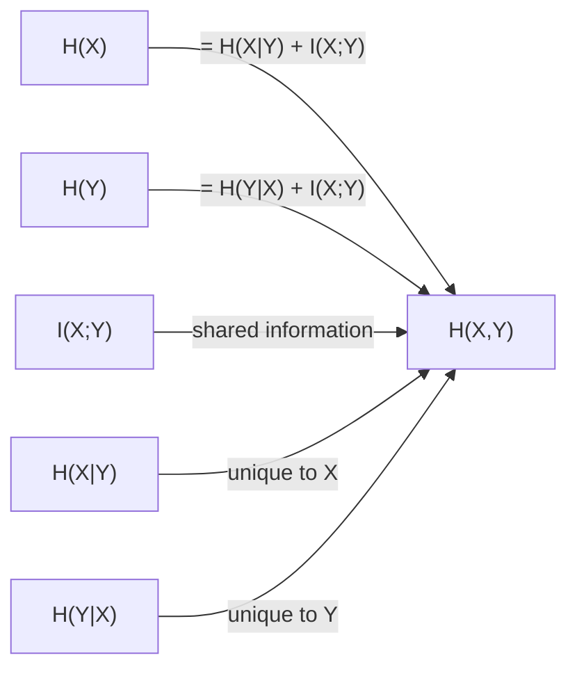

# Entropy and Divergences

## Table of Contents

- [[#1. Shannon Entropy|1. Shannon Entropy]]
  - [[#1.1 Axiomatic Derivation|1.1 Axiomatic Derivation]]
  - [[#1.2 Definition and Notation|1.2 Definition and Notation]]
  - [[#1.3 Operational Meaning: Average Surprise and Code Length|1.3 Operational Meaning: Average Surprise and Code Length]]
  - [[#1.4 Binary Entropy|1.4 Binary Entropy]]
  - [[#1.5 Joint and Conditional Entropy|1.5 Joint and Conditional Entropy]]
  - [[#1.6 Chain Rule for Entropy|1.6 Chain Rule for Entropy]]
  - [[#1.7 Differential Entropy: Subtleties|1.7 Differential Entropy: Subtleties]]
- [[#2. KL Divergence|2. KL Divergence]]
  - [[#2.1 Definition|2.1 Definition]]
  - [[#2.2 Non-Negativity: Gibbs' Inequality|2.2 Non-Negativity: Gibbs' Inequality]]
  - [[#2.3 Asymmetry|2.3 Asymmetry]]
  - [[#2.4 Operational Meaning: Log-Likelihood Ratios and Stein's Lemma|2.4 Operational Meaning: Log-Likelihood Ratios and Stein's Lemma]]
  - [[#2.5 The Radon-Nikodym Formulation|2.5 The Radon-Nikodym Formulation]]
  - [[#2.6 Coordinate Invariance|2.6 Coordinate Invariance]]
  - [[#2.7 Chain Rule for KL Divergence|2.7 Chain Rule for KL Divergence]]
- [[#3. Mutual Information|3. Mutual Information]]
  - [[#3.1 Definition via KL Divergence|3.1 Definition via KL Divergence]]
  - [[#3.2 Equivalent Expressions|3.2 Equivalent Expressions]]
  - [[#3.3 Conditional Mutual Information and Chain Rule|3.3 Conditional Mutual Information and Chain Rule]]
  - [[#3.4 Data Processing Inequality|3.4 Data Processing Inequality]]
  - [[#3.5 Sufficient Statistics|3.5 Sufficient Statistics]]
- [[#4. f-Divergences|4. f-Divergences]]
  - [[#4.1 General Definition|4.1 General Definition]]
  - [[#4.2 Key Examples|4.2 Key Examples]]
  - [[#4.3 Joint Convexity|4.3 Joint Convexity]]
  - [[#4.4 Data Processing Inequality for f-Divergences|4.4 Data Processing Inequality for f-Divergences]]
- [[#5. Core Inequalities|5. Core Inequalities]]
  - [[#5.1 Jensen's Inequality and Concavity of Entropy|5.1 Jensen's Inequality and Concavity of Entropy]]
  - [[#5.2 Log-Sum Inequality|5.2 Log-Sum Inequality]]
  - [[#5.3 Subadditivity of Entropy|5.3 Subadditivity of Entropy]]
  - [[#5.4 Fano's Inequality|5.4 Fano's Inequality]]
  - [[#5.5 Pinsker's Inequality|5.5 Pinsker's Inequality]]
- [[#References|References]]

---

## 1. Shannon Entropy 📐

### 1.1 Axiomatic Derivation

The formula $H = -\sum_i p_i \log p_i$ is not merely a definition chosen by convention; it is the unique functional (up to a positive constant) satisfying a small set of natural requirements. We state the *Shannon–Khinchin axioms* and sketch the uniqueness argument.

Let $\mathcal{P}_n = \{(p_1, \ldots, p_n) : p_i \geq 0,\, \sum_i p_i = 1\}$ denote the $(n-1)$-simplex of probability vectors of length $n$. A *measure of uncertainty* is a sequence of functions $H_n : \mathcal{P}_n \to \mathbb{R}_{\geq 0}$.

**Axiom SK1 (Continuity).** Each $H_n(p_1, \ldots, p_n)$ is continuous in all $p_i$.

**Axiom SK2 (Maximality).** For each $n$, the uniform distribution maximises uncertainty:
$$H_n(p_1, \ldots, p_n) \leq H_n\!\left(\tfrac{1}{n}, \ldots, \tfrac{1}{n}\right).$$

**Axiom SK3 (Expansibility).** Adding an impossible outcome does not change uncertainty:
$$H_{n+1}(p_1, \ldots, p_n, 0) = H_n(p_1, \ldots, p_n).$$

**Axiom SK4 (Chain rule / strong additivity).** For any $(p_1, \ldots, p_n) \in \mathcal{P}_n$ and any further splitting of the $i$-th outcome into sub-outcomes with conditional probabilities $(w_{i1}, \ldots, w_{im_i})$, uncertainty satisfies
$$H\!\left(\{p_i w_{ij}\}\right) = H(p_1, \ldots, p_n) + \sum_{i=1}^{n} p_i \, H(w_{i1}, \ldots, w_{im_i}).$$

**Theorem (Shannon–Khinchin, 1948/1957).** The unique (up to a positive multiplicative constant $\lambda > 0$) sequence $(H_n)$ satisfying SK1–SK4 is
$$H_n(p_1, \ldots, p_n) = -\lambda \sum_{i=1}^{n} p_i \log p_i.$$

*Proof sketch.* First, SK1–SK3 force $H_n(1/n, \ldots, 1/n) = \lambda \log n$ for some $\lambda > 0$: by SK2 and SK4 applied to uniform splits, $f(n) := H_n(1/n, \ldots, 1/n)$ satisfies $f(mn) = f(m) + f(n)$, so (by continuity) $f(n) = \lambda \log n$. Then SK4 applied iteratively expresses $H_n(p_1, \ldots, p_n)$ for rational probabilities by embedding it into a uniform distribution over $m = \sum_i k_i$ equiprobable outcomes (where $p_i = k_i/m$); SK1 extends to irrationals. $\square$

> [!NOTE] Choice of logarithm base
> The base of the logarithm fixes the unit of measurement. Base 2 gives *bits*, base $e$ gives *nats*, base 10 gives *Hartleys* (or *dits*). Throughout this note we default to bits (base 2) unless stated otherwise. All inequalities are base-independent up to constant factors.

> [!INFO] Historical note
> Shannon introduced entropy in his 1948 paper using an informal axiomatic argument. Khinchin (1957) gave the first complete proof of uniqueness, making the characterisation rigorous. The axioms are sometimes presented in slightly different (equivalent) forms; see Leinster (2021) for a category-theoretic unification.

### 1.2 Definition and Notation

**Definition 1.1 (Shannon entropy).** Let $X$ be a discrete random variable taking values in a finite or countable alphabet $\mathcal{X}$, with probability mass function $p : \mathcal{X} \to [0,1]$. The *Shannon entropy* of $X$ is
$$H(X) \;=\; -\sum_{x \in \mathcal{X}} p(x) \log p(x) \;=\; \mathbb{E}\!\left[-\log p(X)\right],$$
where the convention $0 \log 0 = 0$ is adopted (justified by continuity: $t \log t \to 0$ as $t \to 0^+$).

*Note on support.* Only outcomes with $p(x) > 0$ contribute to the sum. The *support* of $p$ is $\mathrm{supp}(p) = \{x : p(x) > 0\}$.

**Lemma 1.2 (Bounds on entropy).** For a random variable $X$ taking at most $n$ values,
$$0 \;\leq\; H(X) \;\leq\; \log n.$$
*Equality* $H(X) = 0$ iff $X$ is deterministic; $H(X) = \log n$ iff $X$ is uniform over $n$ outcomes.

*Proof.* Non-negativity follows from $-p \log p \geq 0$ for $p \in [0,1]$ (since $\log p \leq 0$). The upper bound follows from the log-sum inequality (Section 5.2) or Jensen's inequality applied to the concave function $-t \log t$; both are derived below. $\square$

### 1.3 Operational Meaning: Average Surprise and Code Length 🔑

The quantity $-\log p(x)$ is the *self-information* or *surprisal* of the event $\{X = x\}$: rare events carry high information content. $H(X)$ is thus the *expected surprisal* under $p$.

Operationally, Shannon's source coding theorem (see [[concepts/information-theory/aep-and-typicality|AEP and Typicality]]) asserts:

**The entropy $H(X)$ is the minimum expected number of bits per symbol needed to losslessly encode a source $X \sim p$.**

More precisely, for any uniquely decodable prefix-free code with codeword lengths $\ell(x)$, the *Kraft inequality* $\sum_x 2^{-\ell(x)} \leq 1$ constrains the average length $\bar{\ell} = \sum_x p(x)\ell(x)$, and it holds that
$$H(X) \;\leq\; \bar{\ell} \;<\; H(X) + 1.$$

The lower bound is tight (achieved by Huffman coding); the gap of at most 1 bit disappears in the block-coding limit (Shannon's first theorem).

> [!EXAMPLE] Self-information of a fair coin
> Let $X \sim \mathrm{Bernoulli}(1/2)$. Then $p(0) = p(1) = 1/2$, and
> $$H(X) = -\tfrac{1}{2}\log_2\tfrac{1}{2} - \tfrac{1}{2}\log_2\tfrac{1}{2} = 1 \text{ bit.}$$
> This matches the intuition: one fair coin flip carries exactly one bit of information. If instead $p(1) = 0.9$, then $H(X) = -(0.9\log_2 0.9 + 0.1\log_2 0.1) \approx 0.469$ bits — most of the uncertainty is gone.

### 1.4 Binary Entropy

**Definition 1.3 (Binary entropy function).** For $\theta \in [0,1]$, the *binary entropy function* is
$$H_2(\theta) \;=\; -\theta\log_2\theta - (1-\theta)\log_2(1-\theta),$$
with $H_2(0) = H_2(1) = 0$ and the maximum $H_2(1/2) = 1$ bit. It is symmetric about $\theta = 1/2$, strictly concave, and appears throughout the theory — in the AEP, source coding, and channel capacity of the binary symmetric channel.

> [!NOTE] Stirling approximation link
> By Stirling's approximation, $\binom{n}{k} \approx 2^{n H_2(k/n)}$ for $k = \lfloor \theta n \rfloor$. This is the combinatorial origin of binary entropy in typicality arguments. See [[concepts/information-theory/aep-and-typicality|AEP and Typicality]] for the full derivation.

### 1.5 Joint and Conditional Entropy

**Definition 1.4 (Joint entropy).** For jointly distributed $(X, Y) \sim p(x, y)$,
$$H(X, Y) \;=\; -\sum_{x,y} p(x,y)\log p(x,y) \;=\; \mathbb{E}[-\log p(X,Y)].$$

**Definition 1.5 (Conditional entropy).** The *conditional entropy* of $X$ given $Y$ is the expected entropy of $X$ under the posterior $p(x|y)$:
$$H(X \mid Y) \;=\; \sum_y p(y) H(X \mid Y = y) \;=\; -\sum_{x,y} p(x,y)\log p(x \mid y).$$

Equivalently, $H(X \mid Y) = H(X,Y) - H(Y)$, which follows from $\log p(x \mid y) = \log p(x,y) - \log p(y)$.

**Key properties:**

1. *Conditioning reduces entropy*: $H(X \mid Y) \leq H(X)$, with equality iff $X \perp Y$.
2. *Non-negativity*: $H(X \mid Y) \geq 0$, with equality iff $X$ is a deterministic function of $Y$.

*Proof of property 1 via mutual information.* Define mutual information $I(X;Y) := H(X) - H(X|Y)$; we show $I(X;Y) \geq 0$ in Section 3, which immediately gives $H(X|Y) \leq H(X)$. $\square$

> [!WARNING] Conditional entropy is not symmetric
> $H(X \mid Y) \neq H(Y \mid X)$ in general. However, $H(X) - H(X \mid Y) = H(Y) - H(Y \mid X) = I(X;Y)$, so the mutual information is symmetric even though individual conditional entropies are not.

### 1.6 Chain Rule for Entropy

**Proposition 1.6 (Chain rule for entropy).** For any collection of random variables $X_1, \ldots, X_n$,
$$H(X_1, X_2, \ldots, X_n) \;=\; \sum_{i=1}^{n} H(X_i \mid X_1, \ldots, X_{i-1}),$$
where $H(X_1 \mid \emptyset) := H(X_1)$.

*Proof.* By induction: $H(X_1, X_2) = H(X_1) + H(X_2 \mid X_1)$ follows from Definition 1.5 and the decomposition $p(x_1, x_2) = p(x_1)p(x_2 \mid x_1)$. Applying this to $H(X_1, \ldots, X_n) = H(X_1, \ldots, X_{n-1}) + H(X_n \mid X_1, \ldots, X_{n-1})$ and iterating completes the induction. $\square$

**Corollary 1.7 (Subadditivity, preview).** Since $H(X_i \mid X_1, \ldots, X_{i-1}) \leq H(X_i)$, the chain rule immediately gives $H(X_1, \ldots, X_n) \leq \sum_{i=1}^n H(X_i)$. We prove the conditioning reduction step rigorously in Section 5.3.

### 1.7 Differential Entropy: Subtleties 📐

Passing from discrete to continuous distributions introduces a subtly different notion of entropy. The naive substitution $-\sum p \log p \to -\int p \log p\,d\lambda$ yields *differential entropy*, but this analogue breaks several properties that discrete entropy enjoys.

**Definition 1.8 (Differential entropy).** Let $X$ be a continuous random variable with density $p$ with respect to Lebesgue measure $\lambda$ on $\mathbb{R}^d$. The *differential entropy* of $X$ is
$$h(X) \;=\; -\int_{\mathbb{R}^d} p(x)\log p(x)\,d\lambda(x) \;=\; \mathbb{E}[-\log p(X)],$$
whenever this integral converges absolutely.

#### Subtlety 1: Differential Entropy Can Be Negative

Discrete entropy satisfies $H(X) \geq 0$ always (since $-p\log p \geq 0$ for $p \in [0,1]$). Differential entropy has no such bound. Consider $X \sim \mathrm{Uniform}[0,\varepsilon]$, which has density $p(x) = 1/\varepsilon$:
$$h(X) = -\int_0^\varepsilon \frac{1}{\varepsilon}\log\frac{1}{\varepsilon}\,dx = \log\varepsilon.$$
For $\varepsilon < 1$, $h(X) = \log\varepsilon < 0$. *This is not a pathology*: a uniform distribution over a very small interval is highly concentrated and should have low (even "negative") information content relative to Lebesgue measure.

#### Subtlety 2: Differential Entropy Is Not Invariant Under Reparametrisation

For discrete distributions, any bijection $g$ satisfies $H(g(X)) = H(X)$ because $g$ merely permutes the atoms. For differential entropy, the change-of-variables formula introduces a Jacobian correction. If $Y = g(X)$ for a diffeomorphism $g : \mathbb{R} \to \mathbb{R}$, then the density of $Y$ is $p_Y(y) = p_X(g^{-1}(y)) \cdot |g'(g^{-1}(y))|^{-1}$, and a direct computation gives:

**Proposition 1.9 (Change-of-variables for differential entropy).**
$$h(g(X)) \;=\; h(X) \;+\; \mathbb{E}_X\!\left[\log|g'(X)|\right].$$

*Proof.* Substituting $y = g(x)$:
$$h(g(X)) = -\int p_Y(y)\log p_Y(y)\,dy = -\int p_X(x)\log\!\left(\frac{p_X(x)}{|g'(x)|}\right)dx = h(X) + \mathbb{E}[\log|g'(X)|].\;\square$$

The extra term $\mathbb{E}[\log|g'(X)|]$ vanishes only when $g$ is measure-preserving (i.e., $|g'| = 1$ a.e.). **Differential entropy is a property of the pair (distribution, coordinate system), not of the distribution alone.**

#### Subtlety 3: Differential Entropy as a Limit of Discretised Entropy

To understand what $h(X)$ actually measures, discretise $X$ at resolution $\Delta > 0$: define $X^\Delta = k\Delta$ whenever $X \in [k\Delta, (k+1)\Delta)$. For smooth $p$:
$$\Pr[X^\Delta = k\Delta] = \int_{k\Delta}^{(k+1)\Delta} p(x)\,dx \approx p(k\Delta)\cdot\Delta.$$
The discrete entropy of $X^\Delta$ is then:
$$H(X^\Delta) = -\sum_k p(k\Delta)\Delta\cdot\log(p(k\Delta)\Delta) \approx -\int p(x)\log p(x)\,dx - \log\Delta = h(X) - \log\Delta.$$

**As $\Delta \to 0$, the entropy of the discretised variable diverges as $-\log\Delta \to \infty$, but the finite residual is precisely $h(X)$.** This is the correct interpretation: $h(X)$ measures entropy relative to Lebesgue measure, with the infinite cost of specifying a real number subtracted out. In particular, $h(X)$ changes by $-\log c$ when distances are rescaled by $c$ (e.g., changing units from metres to centimetres adds $\log 100$ nats).

> [!NOTE] The base-measure viewpoint
> Writing $h(X) = -D_{\mathrm{KL}}(P \| \lambda)$ — where $\lambda$ is Lebesgue measure — makes the reference-measure dependence explicit. KL divergence $D_{\mathrm{KL}}(P \| Q) = \int \frac{dP}{dQ}\log\frac{dP}{dQ}\,dQ$ is defined purely via the Radon–Nikodym derivative and is intrinsic to the ordered pair $(P, Q)$. Differential entropy is KL *to Lebesgue measure*, so changing coordinates changes the "Q" and shifts $h$.

#### Subtlety 4: Mutual Information Remains Coordinate-Invariant

Despite $h(X)$ being coordinate-dependent, the mutual information $I(X;Y) = h(X) - h(X \mid Y)$ is **invariant** under diffeomorphisms applied to $X$ or $Y$. If $Z = g(X)$:
$$I(g(X); Y) = h(g(X)) - h(g(X) \mid Y) = \bigl[h(X) + \mathbb{E}\log|g'(X)|\bigr] - \bigl[h(X \mid Y) + \mathbb{E}\log|g'(X)|\bigr] = I(X; Y).$$
The Jacobian terms cancel because the conditional density of $g(X)$ given $Y = y$ has the same Jacobian as the marginal. Equivalently, $I(X;Y) = D_{\mathrm{KL}}(p_{XY} \| p_X \otimes p_Y)$ involves only ratios of densities, in which any common Jacobian factors cancel.

*This is why mutual information — and KL divergence — are the fundamental quantities for continuous distributions: they do not depend on the choice of coordinates.*

> [!WARNING] Do not interpret $h(X)$ as an absolute amount of information
> The statement "$X$ has differential entropy 3 nats" is meaningful only relative to Lebesgue measure in the given coordinate system. Statements like "$h(X) > h(Y)$, so $X$ is more uncertain than $Y$" are coordinate-dependent and can be reversed by a smooth reparametrisation. Use $I(X;Y)$ or $D_{\mathrm{KL}}$ for coordinate-free comparisons.

#### Maximum Differential Entropy: the Gaussian

For distributions with a fixed second moment, the Gaussian is the maximum-entropy distribution — a statement that *is* coordinate-invariant (since it involves a constraint on $\mathbb{E}[X^2]$ which is itself coordinate-dependent, but the Gaussian characterisation is stated in a fixed coordinate).

**Proposition 1.10 (Gaussian maximum entropy).** Among all distributions on $\mathbb{R}$ with $\mathrm{Var}(X) \leq \sigma^2$,
$$h(X) \;\leq\; \tfrac{1}{2}\log(2\pi e\sigma^2),$$
with equality iff $X \sim \mathcal{N}(0,\sigma^2)$.

*Proof.* Let $q = \mathcal{N}(0,\sigma^2)$. Since $D_{\mathrm{KL}}(p \| q) \geq 0$:
$$0 \leq \int p\log\frac{p}{q} = -h(p) - \int p\log q.$$
Now $\log q(x) = -x^2/(2\sigma^2) - \tfrac{1}{2}\log(2\pi\sigma^2)$, so:
$$-\int p(x)\log q(x)\,dx = \frac{\mathbb{E}[X^2]}{2\sigma^2} + \tfrac{1}{2}\log(2\pi\sigma^2) \leq \tfrac{1}{2} + \tfrac{1}{2}\log(2\pi\sigma^2) = \tfrac{1}{2}\log(2\pi e\sigma^2).$$
Rearranging gives $h(p) \leq \tfrac{1}{2}\log(2\pi e\sigma^2)$, with equality iff $p = q$. $\square$

> [!EXAMPLE] Differential entropies of standard distributions
> | Distribution | Parameters | $h(X)$ (nats) |
> |---|---|---|
> | $\mathrm{Uniform}[a,b]$ | $b > a$ | $\log(b-a)$ |
> | $\mathcal{N}(\mu, \sigma^2)$ | $\sigma > 0$ | $\tfrac{1}{2}\log(2\pi e\sigma^2)$ |
> | $\mathrm{Exponential}(\lambda)$ | $\lambda > 0$ | $1 - \log\lambda$ |
> | $\mathrm{Laplace}(\mu, b)$ | $b > 0$ | $1 + \log(2b)$ |
> | $\mathrm{Cauchy}(\mu, \gamma)$ | $\gamma > 0$ | $\log(4\pi\gamma)$ |
>
> Note that $h(\mathrm{Exponential}(\lambda)) < 0$ when $\lambda > e$: a very "tight" exponential can have negative differential entropy.

---

> [!QUESTION] Exercise 1: Entropy of a Function
> *This problem establishes that deterministic functions cannot increase entropy — a precursor to the data processing inequality.*
>
> > **Prerequisites:** [[#1.5 Joint and Conditional Entropy|1.5 Joint and Conditional Entropy]]
>
> Let $X$ be a discrete random variable and $f : \mathcal{X} \to \mathcal{Y}$ any deterministic function. Prove that $H(f(X)) \leq H(X)$, with equality if and only if $f$ is injective on $\mathrm{supp}(p)$.

> [!TIP]- Solution to Exercise 1
> **Key insight:** $f(X)$ is a function of $X$, so $H(f(X) \mid X) = 0$. Apply the chain rule in two ways.
>
> **Sketch:** By the chain rule, $H(X, f(X)) = H(X) + H(f(X) \mid X) = H(X)$ (since $f(X)$ is determined by $X$). Alternatively, $H(X, f(X)) = H(f(X)) + H(X \mid f(X)) \geq H(f(X))$, since $H(X \mid f(X)) \geq 0$. Combining: $H(f(X)) \leq H(X)$. For equality, we need $H(X \mid f(X)) = 0$, meaning $X$ is determined by $f(X)$, i.e., $f$ is injective on the support.

> [!QUESTION] Exercise 2: Chain Rule for Three Variables
> *This exercise builds facility with the chain rule in a concrete three-variable setting.*
>
> > **Prerequisites:** [[#1.6 Chain Rule for Entropy|1.6 Chain Rule for Entropy]]
>
> Let $X, Y, Z$ be jointly distributed discrete random variables. Prove directly from definitions (without the general chain rule) that
> $$H(X, Y, Z) = H(X) + H(Y \mid X) + H(Z \mid X, Y).$$

> [!TIP]- Solution to Exercise 2
> **Key insight:** Iterated factorisation of the joint distribution.
>
> **Sketch:** Write $p(x,y,z) = p(x)\,p(y \mid x)\,p(z \mid x,y)$. Taking $-\log$:
> $$-\log p(x,y,z) = -\log p(x) - \log p(y \mid x) - \log p(z \mid x,y).$$
> Taking expectations under $p(x,y,z)$ on both sides gives $H(X,Y,Z) = H(X) + H(Y \mid X) + H(Z \mid X,Y)$.

> [!QUESTION] Exercise 3: Differential Entropy Under Linear Rescaling
> *This exercise concretises the reparametrisation non-invariance of differential entropy and shows how the shift depends on the Jacobian.*
>
> > **Prerequisites:** [[#1.7 Differential Entropy: Subtleties|1.7 Differential Entropy: Subtleties]]
>
> Let $X$ be a continuous random variable with differential entropy $h(X)$. For a scalar $c \neq 0$, let $Y = cX$.
>
> **(a)** Using Proposition 1.9, show that $h(Y) = h(X) + \log|c|$.
>
> **(b)** Verify directly for $X \sim \mathcal{N}(0,1)$: compute $h(X)$ and $h(cX)$ from the Gaussian formula, and confirm the formula in (a).
>
> **(c)** For $X \sim \mathrm{Uniform}[0,1]$, find all values of $c > 0$ for which $h(cX) < 0$.

> [!TIP]- Solution to Exercise 3
> **Key insight:** The Jacobian $|g'(x)| = |c|$ is constant, so $\mathbb{E}[\log|g'(X)|] = \log|c|$.
>
> **Sketch:**
>
> **(a)** $g(x) = cx$, so $|g'(x)| = |c|$. Proposition 1.9 gives $h(cX) = h(X) + \mathbb{E}[\log|c|] = h(X) + \log|c|$.
>
> **(b)** For $\mathcal{N}(0,1)$: $h(X) = \frac{1}{2}\log(2\pi e)$. And $cX \sim \mathcal{N}(0, c^2)$, so $h(cX) = \frac{1}{2}\log(2\pi e c^2) = \frac{1}{2}\log(2\pi e) + \log|c| = h(X) + \log|c|$. ✓
>
> **(c)** $h(\mathrm{Uniform}[0,1]) = \log 1 = 0$. So $h(cX) = h(X) + \log c = \log c$. This is negative iff $\log c < 0$ iff $c < 1$. So for any $c \in (0,1)$, $h(cX) < 0$.

---

## 2. KL Divergence 📐

### 2.1 Definition

**Definition 2.1 (KL divergence).** Let $P$ and $Q$ be probability distributions on a common measurable space $(\mathcal{X}, \mathcal{F})$. Assume $P \ll Q$ (i.e., $P$ is *absolutely continuous* with respect to $Q$: $Q(A) = 0 \Rightarrow P(A) = 0$). The *Kullback–Leibler divergence* (also called *relative entropy*) of $P$ with respect to $Q$ is
$$D_{\mathrm{KL}}(P \,\|\, Q) \;=\; \sum_{x \in \mathcal{X}} p(x) \log \frac{p(x)}{q(x)} \;=\; \mathbb{E}_P\!\left[\log \frac{p(X)}{q(X)}\right],$$
where the sum is over $\mathrm{supp}(p)$ and the convention $p \log(p/q) = 0$ when $p = 0$ applies. If $P \not\ll Q$, we set $D_{\mathrm{KL}}(P \,\|\, Q) = +\infty$.

> [!NOTE] Notation conventions
> We write $D_{\mathrm{KL}}(P \,\|\, Q)$, $D(P \,\|\, Q)$, or $D(p \,\|\, q)$ interchangeably depending on context. The argument "$P \,\|\, Q$" is read "*$P$ relative to $Q$*". The convention $D_{\mathrm{KL}}(P \,\|\, Q) = +\infty$ when $P \not\ll Q$ is consistent with the $f$-divergence framework (Section 4).

### 2.2 Non-Negativity: Gibbs' Inequality

**Theorem 2.2 (Gibbs' inequality / information inequality).** For any two distributions $P \ll Q$,
$$D_{\mathrm{KL}}(P \,\|\, Q) \;\geq\; 0,$$
with equality if and only if $P = Q$ (i.e., $p(x) = q(x)$ for all $x \in \mathrm{supp}(p)$).

*Proof.* We use the inequality $\ln t \leq t - 1$ for all $t > 0$ (with equality iff $t = 1$). Applying this with $t = q(x)/p(x)$:
$$-D_{\mathrm{KL}}(P \,\|\, Q) = \sum_x p(x) \log \frac{q(x)}{p(x)} = \sum_x p(x) \ln \frac{q(x)}{p(x)} / \ln 2 \leq \frac{1}{\ln 2}\sum_x p(x)\left(\frac{q(x)}{p(x)} - 1\right) = \frac{1}{\ln 2}\left(\sum_x q(x) - \sum_x p(x)\right) = 0.$$

Hence $D_{\mathrm{KL}}(P \,\|\, Q) \geq 0$. Equality holds iff $q(x)/p(x) = 1$ for all $x \in \mathrm{supp}(p)$, which means $p = q$ on the support. Combined with $P \ll Q$, this gives $P = Q$. $\square$

> [!NOTE] Jensen's inequality proof
> Alternatively: since $-\log$ is a strictly convex function, Jensen's inequality gives $\mathbb{E}_P[-\log(q(X)/p(X))] \geq -\log \mathbb{E}_P[q(X)/p(X)] = -\log \sum_x q(x) = 0$. This is the same proof in different language; the two approaches are equivalent.

### 2.3 Asymmetry

*Crucially*, $D_{\mathrm{KL}}(P \,\|\, Q) \neq D_{\mathrm{KL}}(Q \,\|\, P)$ in general. The two directions differ both algebraically and operationally:

- $D_{\mathrm{KL}}(P \,\|\, Q)$: called the *forward KL* or *inclusive KL* in variational inference. When $q(x) = 0$ but $p(x) > 0$, the divergence is $+\infty$, so minimising forward KL forces $Q$ to *cover* the support of $P$.
- $D_{\mathrm{KL}}(Q \,\|\, P)$: called the *reverse KL* or *exclusive KL*. Minimising this allows $Q$ to concentrate on high-density regions of $P$ (mode-seeking).

> [!EXAMPLE] Asymmetry illustrated
> Let $P = \mathrm{Bernoulli}(0.9)$ and $Q = \mathrm{Bernoulli}(0.5)$. Then
> $$D_{\mathrm{KL}}(P \,\|\, Q) = 0.9\log\frac{0.9}{0.5} + 0.1\log\frac{0.1}{0.5} \approx 0.531 \text{ bits},$$
> $$D_{\mathrm{KL}}(Q \,\|\, P) = 0.5\log\frac{0.5}{0.9} + 0.5\log\frac{0.5}{0.1} \approx 0.531 \text{ bits.}$$
> In this symmetric Bernoulli case they happen to be equal — but consider $P = \mathrm{Bernoulli}(0.01)$ and $Q = \mathrm{Bernoulli}(0.5)$: the two divergences differ substantially.

### 2.4 Operational Meaning: Log-Likelihood Ratios and Stein's Lemma

The KL divergence arises naturally in hypothesis testing. Suppose we observe $n$ i.i.d. samples $X_1, \ldots, X_n$ and must choose between hypotheses $H_0 : X \sim P$ and $H_1 : X \sim Q$. The *log-likelihood ratio* is
$$\Lambda_n = \sum_{i=1}^n \log \frac{p(X_i)}{q(X_i)}.$$

By the law of large numbers, $\frac{1}{n}\Lambda_n \xrightarrow{a.s.} D_{\mathrm{KL}}(P \,\|\, Q)$ under $H_0$, and $\frac{1}{n}\Lambda_n \xrightarrow{a.s.} -D_{\mathrm{KL}}(Q \,\|\, P)$ under $H_1$.

**Stein's Lemma (Chernoff–Stein, informal).** In asymmetric hypothesis testing (minimising Type II error $\beta_n$ subject to Type I error $\alpha_n \leq \alpha$ for a fixed $\alpha > 0$), the optimal exponent of $\beta_n$ is:
$$-\frac{1}{n}\log \beta_n \;\xrightarrow{n \to \infty}\; D_{\mathrm{KL}}(P \,\|\, Q).$$

**This is the central operational interpretation of KL divergence: it is the optimal error exponent for one-sided hypothesis testing.** See [[concepts/information-theory/channel-capacity|Channel Capacity]] for Fano's inequality, which uses KL in the converse proof.

### 2.5 The Radon-Nikodym Formulation 📐

The discrete definition of KL writes $p(x)/q(x)$ — a ratio of probability masses. For general (possibly continuous or mixed) distributions this ratio is not well-defined, and the right replacement is the *Radon–Nikodym derivative*.

**Theorem 2.3 (Radon–Nikodym).** Let $P \ll Q$ be $\sigma$-finite measures on $(\mathcal{X}, \mathcal{F})$. Then there exists a measurable function $f : \mathcal{X} \to [0,\infty)$, unique $Q$-a.e., such that for every $A \in \mathcal{F}$:
$$P(A) \;=\; \int_A f \, dQ.$$
This $f$ is called the *Radon–Nikodym derivative* of $P$ with respect to $Q$, written $f = dP/dQ$.

The Radon–Nikodym derivative generalises familiar density ratios:

| Setting | $dP/dQ$ |
|---------|---------|
| Both discrete, $q(x) > 0$ on $\mathrm{supp}(p)$ | $p(x)/q(x)$ (ratio of pmfs) |
| Both absolutely continuous w.r.t. Lebesgue $\lambda$ | $p(x)/q(x)$ (ratio of pdfs) |
| $P = \delta_x$ (point mass), $Q$ has density $q$ | Does not exist — $P \not\ll Q$ if $q(x) = 0$ |
| $P$ continuous, $Q$ discrete | $P \not\ll Q$ (continuous measure cannot dominate continuous) |

> [!NOTE] Existence and the absolute-continuity condition
> The condition $P \ll Q$ is necessary: without it, $P$ assigns positive mass to a set that $Q$ calls null, and no $L^1(Q)$ function can recover that mass. The convention $D_{\mathrm{KL}}(P\|Q) = +\infty$ when $P \not\ll Q$ is precisely the statement that such configurations carry infinite information cost.

**Definition 2.4 (KL divergence, measure-theoretic).** For any $P \ll Q$,
$$D_{\mathrm{KL}}(P \,\|\, Q) \;=\; \int \frac{dP}{dQ}\log\frac{dP}{dQ}\,dQ \;=\; \mathbb{E}_P\!\left[\log\frac{dP}{dQ}\right].$$

This single formula subsumes both the discrete sum and the continuous integral. When both $P$ and $Q$ have densities $p, q$ w.r.t. a common dominating measure $\mu$ (e.g., Lebesgue or counting measure), $dP/dQ = p/q$ $\mu$-a.e., and the formula reduces to $\int p \log(p/q)\,d\mu$.

> [!NOTE] Differential entropy
> For continuous distributions, the analogue of Shannon entropy is *differential entropy* $h(X) = -\int p(x)\log p(x)\,dx$. Unlike $H(X)$, it can be negative, is not invariant under reparametrisation, and depends on the choice of base measure. See [[#1.7 Differential Entropy: Subtleties|§1.7]] for a full treatment. The relation $h(X) = -D_{\mathrm{KL}}(P\|\lambda)$ (where $\lambda$ is Lebesgue measure) makes the reference-measure dependence explicit.

### 2.6 Coordinate Invariance 🔑

The Radon–Nikodym formulation immediately implies that KL divergence is independent of the coordinate system used to represent the distributions — a property that differential entropy lacks.

**Proposition 2.5 (Coordinate invariance of KL).** Let $g : \mathcal{X} \to \mathcal{Y}$ be a measurable bijection (e.g., a diffeomorphism on $\mathbb{R}^d$). Let $P' = g_*P$ and $Q' = g_*Q$ denote the pushforward measures. Then
$$D_{\mathrm{KL}}(P' \,\|\, Q') \;=\; D_{\mathrm{KL}}(P \,\|\, Q).$$

*Proof.* The Radon–Nikodym derivative transforms as $\frac{dP'}{dQ'}(g(x)) = \frac{dP}{dQ}(x)$ — this follows from the definition: for any $B \in \mathcal{F}_\mathcal{Y}$,
$$P'(B) = P(g^{-1}(B)) = \int_{g^{-1}(B)} \frac{dP}{dQ}\,dQ = \int_B \frac{dP}{dQ}(g^{-1}(y))\,dQ'(y),$$
so $dP'/dQ' = (dP/dQ) \circ g^{-1}$ $Q'$-a.e. Therefore, by the change-of-variables formula ($y = g(x)$, $dQ' = g_*Q$):
$$D_{\mathrm{KL}}(P' \,\|\, Q') = \int \frac{dP'}{dQ'}\log\frac{dP'}{dQ'}\,dQ' = \int \frac{dP}{dQ}(x)\log\frac{dP}{dQ}(x)\,dQ(x) = D_{\mathrm{KL}}(P \,\|\, Q). \;\square$$

**Why differential entropy breaks this.** Differential entropy $h(X) = -D_{\mathrm{KL}}(P \| \lambda)$ fixes the second argument to Lebesgue measure $\lambda$. Under $g$, the first argument transforms to $g_*P$, but $\lambda$ stays fixed — yet $g_*\lambda \neq \lambda$ for a general diffeomorphism. So
$$h(g(X)) = -D_{\mathrm{KL}}(g_*P \| \lambda) \neq -D_{\mathrm{KL}}(g_*P \| g_*\lambda) = h(X).$$
The invariant quantity $D_{\mathrm{KL}}(g_*P \| g_*\lambda)$ would equal $h(X)$, but the actual computation $-D_{\mathrm{KL}}(g_*P \| \lambda)$ shifts by $\mathbb{E}[\log|g'(X)|]$, precisely the Jacobian term in Proposition 1.9.

**Mutual information as a corollary.** Since $I(X;Y) = D_{\mathrm{KL}}(p_{XY} \| p_X \otimes p_Y)$, Proposition 2.5 immediately gives $I(g(X); Y) = I(X; Y)$ for any diffeomorphism $g$ — no separate argument needed. The coordinate invariance of MI is a special case, not an independent fact.

> [!INFO] Why this matters for information geometry
> The coordinate-independence of KL is the starting point for *information geometry*: the Fisher–Rao metric on a statistical manifold is the unique Riemannian metric (up to scale) that is invariant under sufficient statistics, and it arises as the second-order expansion of $D_{\mathrm{KL}}$. See the planned `information-geometry.md` note for the full construction.

### 2.7 Chain Rule for KL Divergence

**Proposition 2.3 (Chain rule for KL).** Let $P_{XY}$ and $Q_{XY}$ be joint distributions with marginals $P_X, Q_X$ and conditionals $P_{Y|X}, Q_{Y|X}$. Then
$$D_{\mathrm{KL}}(P_{XY} \,\|\, Q_{XY}) \;=\; D_{\mathrm{KL}}(P_X \,\|\, Q_X) \;+\; \mathbb{E}_{P_X}\!\left[D_{\mathrm{KL}}(P_{Y|X} \,\|\, Q_{Y|X})\right].$$

*Proof.* Writing the log-ratio and factoring:
$$\log\frac{p(x,y)}{q(x,y)} = \log\frac{p(x)}{q(x)} + \log\frac{p(y|x)}{q(y|x)}.$$
Taking expectation under $P_{XY} = P_X \cdot P_{Y|X}$ gives the result. $\square$

**Corollary 2.4.** Since $\mathbb{E}_{P_X}[D_{\mathrm{KL}}(P_{Y|X} \,\|\, Q_{Y|X})] \geq 0$, we have $D_{\mathrm{KL}}(P_{XY} \,\|\, Q_{XY}) \geq D_{\mathrm{KL}}(P_X \,\|\, Q_X)$. Marginalising can only decrease KL — the joint distribution carries at least as much relative information as any marginal.

---

> [!QUESTION] Exercise 4: Non-Symmetry of KL via Explicit Computation
> *This problem builds intuition for the asymmetry of KL divergence by working through a concrete example where the difference is large.*
>
> > **Prerequisites:** [[#2.1 Definition|2.1 Definition]], [[#2.3 Asymmetry|2.3 Asymmetry]]
>
> Let $P = \mathrm{Bernoulli}(\epsilon)$ for small $\epsilon > 0$, and $Q = \mathrm{Bernoulli}(1/2)$. Compute $D_{\mathrm{KL}}(P \,\|\, Q)$ and $D_{\mathrm{KL}}(Q \,\|\, P)$ to leading order in $\epsilon$ as $\epsilon \to 0^+$. Which divergence grows unboundedly? Explain the operational meaning.

> [!TIP]- Solution to Exercise 4
> **Key insight:** As $\epsilon \to 0$, $Q$ assigns mass $1/2$ to $\{1\}$ but $P$ assigns mass $\epsilon$. The forward KL $D_{\mathrm{KL}}(Q \,\|\, P)$ diverges because $P$ assigns near-zero mass to the event $\{1\}$ that $Q$ places weight on.
>
> **Sketch:** $D_{\mathrm{KL}}(P \,\|\, Q) = \epsilon\log(2\epsilon) + (1-\epsilon)\log(2(1-\epsilon)) \approx \epsilon\log(2\epsilon) + \log 2 \to \log 2$ as $\epsilon \to 0$ (the divergence stays bounded at $1$ bit). On the other hand, $D_{\mathrm{KL}}(Q \,\|\, P) = \frac{1}{2}\log\frac{1}{2\epsilon} + \frac{1}{2}\log\frac{1}{2(1-\epsilon)} \approx \frac{1}{2}\log\frac{1}{2\epsilon} \to +\infty$. Operationally: $D_{\mathrm{KL}}(Q \,\|\, P)$ diverging means it is easy to distinguish $Q$ from $P$ when the null is $Q$ (the optimal Neyman–Pearson test using $D_{\mathrm{KL}}(Q\,\|\,P)$ has exponentially vanishing Type II error). When $P$ is the null instead, the task is harder at small $\epsilon$.

> [!QUESTION] Exercise 5: KL Divergence Between Gaussians
> *This is a closed-form computation that appears repeatedly in variational inference and the ELBO.*
>
> > **Prerequisites:** [[#2.5 The Radon-Nikodym Formulation|2.5 The Radon-Nikodym Formulation]]
>
> Let $P = \mathcal{N}(\mu_1, \sigma_1^2)$ and $Q = \mathcal{N}(\mu_2, \sigma_2^2)$. Derive the closed form
> $$D_{\mathrm{KL}}(P \,\|\, Q) = \log\frac{\sigma_2}{\sigma_1} + \frac{\sigma_1^2 + (\mu_1 - \mu_2)^2}{2\sigma_2^2} - \frac{1}{2}.$$

> [!TIP]- Solution to Exercise 5
> **Key insight:** For Gaussians, $\log(p/q)$ is quadratic in $x$, so the expectation under $P$ reduces to computing moments $\mathbb{E}_P[X]$ and $\mathbb{E}_P[X^2]$.
>
> **Sketch:** $D_{\mathrm{KL}}(P\|Q) = \mathbb{E}_P[\log p(X) - \log q(X)]$. With $\log p(x) = -\frac{1}{2}\log(2\pi\sigma_1^2) - \frac{(x-\mu_1)^2}{2\sigma_1^2}$ and similarly for $q$:
> $$D_{\mathrm{KL}}(P\|Q) = \log\frac{\sigma_2}{\sigma_1} - \frac{\mathbb{E}_P[(X-\mu_1)^2]}{2\sigma_1^2} + \frac{\mathbb{E}_P[(X-\mu_2)^2]}{2\sigma_2^2}.$$
> Using $\mathbb{E}_P[(X-\mu_1)^2] = \sigma_1^2$ and $\mathbb{E}_P[(X-\mu_2)^2] = \sigma_1^2 + (\mu_1-\mu_2)^2$, we get the stated formula.

---

## 3. Mutual Information 📐

### 3.1 Definition via KL Divergence

**Definition 3.1 (Mutual information).** Let $(X, Y) \sim p(x, y)$ with marginals $p(x)$ and $p(y)$. The *mutual information* between $X$ and $Y$ is
$$I(X\,;\,Y) \;=\; D_{\mathrm{KL}}\!\left(p_{XY} \,\Big\|\, p_X \otimes p_Y\right) \;=\; \sum_{x,y} p(x,y)\log\frac{p(x,y)}{p(x)p(y)},$$
where $p_X \otimes p_Y$ denotes the product distribution (the distribution of $(X', Y')$ where $X' \sim p_X$ and $Y' \sim p_Y$ are independent).

By Gibbs' inequality (Theorem 2.2), $I(X\,;\,Y) \geq 0$ always, with equality iff $X \perp Y$.

### 3.2 Equivalent Expressions

**Proposition 3.2.** Mutual information admits the following equivalent expressions:
$$I(X\,;\,Y) \;=\; H(X) - H(X \mid Y) \;=\; H(Y) - H(Y \mid X) \;=\; H(X) + H(Y) - H(X,Y).$$

*Proof.* Starting from the definition:
$$I(X\,;\,Y) = \sum_{x,y} p(x,y)\log\frac{p(x,y)}{p(x)p(y)} = \sum_{x,y} p(x,y)\log p(x,y) - \sum_{x,y}p(x,y)\log p(x) - \sum_{x,y}p(x,y)\log p(y).$$
The three sums equal $-H(X,Y)$, $-H(X)$, and $-H(Y)$ respectively, giving $I(X;Y) = -H(X,Y) + H(X) + H(Y) = H(X) + H(Y) - H(X,Y)$. The other forms follow by the chain rule $H(X,Y) = H(Y) + H(X|Y) = H(X) + H(Y|X)$. $\square$

**The identity $I(X;Y) = H(X) - H(X|Y)$ has a clean reading:** mutual information is the reduction in uncertainty about $X$ gained by observing $Y$.

> [!NOTE] Symmetry of mutual information
> Unlike $D_{\mathrm{KL}}$, $I(X;Y) = I(Y;X)$ always. This is immediate from the symmetric form $H(X) + H(Y) - H(X,Y)$.



### 3.3 Conditional Mutual Information and Chain Rule

**Definition 3.3 (Conditional mutual information).** The *conditional mutual information* of $X$ and $Y$ given $Z$ is
$$I(X\,;\,Y \mid Z) \;=\; H(X \mid Z) - H(X \mid Y, Z) \;=\; \mathbb{E}_Z[I(X\,;\,Y \mid Z=z)],$$
where the expectation is over $z \sim p(z)$.

Equivalently, $I(X;Y|Z) = D_{\mathrm{KL}}(p_{XY|Z} \,\|\, p_{X|Z} \otimes p_{Y|Z} \mid p_Z) \geq 0$.

**Proposition 3.4 (Chain rule for mutual information).** For any random variables $X$, $Y_1$, $Y_2$,
$$I(X\,;\,Y_1, Y_2) \;=\; I(X\,;\,Y_1) \;+\; I(X\,;\,Y_2 \mid Y_1).$$

*Proof.* Expand both sides using $H(X) - H(X \mid \cdot)$ and apply the entropy chain rule. $\square$

**Generalisation.** By induction:
$$I(X\,;\,Y_1, \ldots, Y_n) \;=\; \sum_{i=1}^n I(X\,;\,Y_i \mid Y_1, \ldots, Y_{i-1}).$$

### 3.4 Data Processing Inequality

**Theorem 3.5 (Data processing inequality, DPI).** If $X \to Y \to Z$ is a *Markov chain* (meaning $Z \perp X \mid Y$, i.e., $p(z|x,y) = p(z|y)$ for all $x, y, z$), then
$$I(X\,;\,Z) \;\leq\; I(X\,;\,Y).$$

*Proof.* By the chain rule for mutual information applied in two ways:
$$I(X\,;\,Y,Z) = I(X\,;\,Y) + I(X\,;\,Z \mid Y).$$
Since $Z \perp X \mid Y$, we have $I(X\,;\,Z \mid Y) = 0$, so $I(X\,;\,Y,Z) = I(X\,;\,Y)$.

Applying the chain rule in the other order:
$$I(X\,;\,Y,Z) = I(X\,;\,Z) + I(X\,;\,Y \mid Z) \geq I(X\,;\,Z).$$

Combining: $I(X\,;\,Z) \leq I(X\,;\,Y)$. $\square$

**The DPI formalises the intuition that processing or transmitting data cannot create new information.** Any transformation of $Y$ into $Z$ can only lose information about $X$.

> [!INFO] DPI in machine learning
> The DPI has direct implications for representation learning and compression. Any deterministic encoding $Z = f(Y)$ satisfies $I(X;Z) \leq I(X;Y)$, so a deterministic encoder cannot increase the mutual information between the representation and the label. The *information bottleneck* principle (Tishby et al.) explicitly trades off $I(X;Z)$ against $I(Y;Z)$ to find compressed representations.

### 3.5 Sufficient Statistics

**Definition 3.6 (Sufficient statistic).** A statistic $T = T(X^n)$ is *sufficient* for a family $\{p_\theta\}$ if the conditional distribution of $X^n$ given $T$ does not depend on $\theta$. Equivalently, $\theta \to X^n \to T$ is a Markov chain — so $T$ captures all information about $\theta$ in $X^n$.

**Corollary 3.7 (Sufficiency via DPI).** If $T$ is sufficient, then for any estimator $\hat{\theta}(X^n)$ there exists an estimator $\hat{\theta}^*(T)$ (based only on $T$) with $I(\theta\,;\,\hat{\theta}^*(T)) = I(\theta\,;\,\hat{\theta}(X^n))$. In particular, no information about $\theta$ is lost by reducing $X^n$ to $T$.

*Proof sketch.* $\theta \to X^n \to T$ and $\theta \to T \to \hat{\theta}^*$ are both Markov. By DPI, $I(\theta;T) \leq I(\theta;X^n)$. Sufficiency means equality holds (since $X^n$ and $T$ generate the same sigma-algebra conditional on $\theta$). $\square$

---

> [!QUESTION] Exercise 6: Mutual Information and Correlation
> *This problem shows that mutual information detects nonlinear dependence, unlike correlation, and quantifies the gap.*
>
> > **Prerequisites:** [[#3.1 Definition via KL Divergence|3.1 Definition via KL Divergence]], [[#3.2 Equivalent Expressions|3.2 Equivalent Expressions]]
>
> Let $X \sim \mathrm{Uniform}\{-1, +1\}$ (equal probability $1/2$) and $Y = X^2$. Compute $I(X;Y)$ and the Pearson correlation $\mathrm{Corr}(X,Y)$. What does the comparison reveal?

> [!TIP]- Solution to Exercise 6
> **Key insight:** $Y = X^2 = 1$ is a constant, so $Y$ carries no information about $X$, but it is a deterministic function of $X$.
>
> **Sketch:** Since $X \in \{-1, +1\}$, $Y = X^2 = 1$ always. So $H(Y) = 0$ and $H(Y|X) = 0$, giving $I(X;Y) = H(Y) - H(Y|X) = 0$. Meanwhile $\mathbb{E}[X] = 0$, $\mathbb{E}[Y] = 1$, $\mathrm{Cov}(X,Y) = \mathbb{E}[XY] - \mathbb{E}[X]\mathbb{E}[Y] = \mathbb{E}[X^3] = 0$, so $\mathrm{Corr}(X,Y) = 0$ too. A more interesting example: let $Y = |X|$ with $X \sim \mathcal{N}(0,1)$. Then $\mathrm{Corr}(X,Y) = 0$ but $I(X;Y) = H(X) - H(X||X|) > 0$ since $\mathrm{sign}(X)$ is hidden in $Y$.

> [!QUESTION] Exercise 7: Data Processing for Deterministic Functions
> *This establishes a useful special case of the DPI that appears in many coding arguments.*
>
> > **Prerequisites:** [[#3.4 Data Processing Inequality|3.4 Data Processing Inequality]]
>
> Let $g : \mathcal{Y} \to \mathcal{Z}$ be any deterministic function. Prove that $I(X\,;\,g(Y)) \leq I(X\,;\,Y)$ for any joint distribution $p(x,y)$.

> [!TIP]- Solution to Exercise 7
> **Key insight:** Setting $Z = g(Y)$ makes $X \to Y \to Z$ a Markov chain because $Z$ is a function of $Y$.
>
> **Sketch:** Since $g$ is deterministic, $p(z|y,x) = p(z|y) = \mathbf{1}[z = g(y)]$. Hence $p(z|y,x) = p(z|y)$, so $Z \perp X | Y$ and the chain $X \to Y \to Z = g(Y)$ is Markov. The DPI (Theorem 3.5) then gives $I(X;g(Y)) \leq I(X;Y)$.

> [!QUESTION] Exercise 8: Chain Rule for Mutual Information
> *This exercise derives the chain rule for mutual information directly from entropy chain rules.*
>
> > **Prerequisites:** [[#3.3 Conditional Mutual Information and Chain Rule|3.3 Conditional Mutual Information and Chain Rule]], [[#1.6 Chain Rule for Entropy|1.6 Chain Rule for Entropy]]
>
> Prove Proposition 3.4: $I(X\,;\,Y_1,Y_2) = I(X\,;\,Y_1) + I(X\,;\,Y_2 \mid Y_1)$.

> [!TIP]- Solution to Exercise 8
> **Key insight:** Express everything in terms of entropy and apply the entropy chain rule to $H(X, Y_1, Y_2)$.
>
> **Sketch:**
> $$I(X;Y_1,Y_2) = H(X) - H(X|Y_1,Y_2).$$
> $$I(X;Y_1) + I(X;Y_2|Y_1) = [H(X) - H(X|Y_1)] + [H(X|Y_1) - H(X|Y_1,Y_2)] = H(X) - H(X|Y_1,Y_2).$$
> The telescoping in the second line follows from $H(X|Y_1) - H(X|Y_1,Y_2) = I(X;Y_2|Y_1)$ by definition of conditional mutual information.

---

## 4. f-Divergences 📐

### 4.1 General Definition

The KL divergence belongs to a rich parametric family defined by a generator function. Let $f : (0, \infty) \to \mathbb{R}$ be a convex function satisfying $f(1) = 0$ (normalisation).

**Definition 4.1 (f-divergence).** Let $P$ and $Q$ be probability distributions on $\mathcal{X}$ with $P \ll Q$. The *f-divergence* of $P$ from $Q$ is
$$D_f(P \,\|\, Q) \;=\; \mathbb{E}_Q\!\left[f\!\left(\frac{dP}{dQ}\right)\right] \;=\; \int_{\mathcal{X}} q(x)\, f\!\left(\frac{p(x)}{q(x)}\right) d\mu(x),$$
where $\mu$ is any dominating measure. The definition extends to $P \not\ll Q$ by the convention that $f(t) = +\infty$ for $t > 0$ if $f$ is not finite on all of $(0,\infty)$, or by $q \cdot f(p/q)|_{q=0} = p \cdot f'(\infty)$ when $f'(\infty) := \lim_{t\to\infty} f(t)/t$ is finite.

**Non-negativity of all f-divergences.** Since $f$ is convex with $f(1) = 0$, Jensen's inequality gives
$$D_f(P \,\|\, Q) = \mathbb{E}_Q\!\left[f\!\left(\frac{dP}{dQ}\right)\right] \;\geq\; f\!\left(\mathbb{E}_Q\!\left[\frac{dP}{dQ}\right]\right) = f(1) = 0,$$
with equality iff $P = Q$ (assuming $f$ is strictly convex at $1$).

### 4.2 Key Examples

| Divergence | Generator $f(t)$ | Notes |
|------------|------------------|-------|
| KL divergence $D_{\mathrm{KL}}(P \| Q)$ | $t \ln t$ | Asymmetric; infinite if $P \not\ll Q$ |
| Reverse KL $D_{\mathrm{KL}}(Q \| P)$ | $-\ln t$ | Mode-seeking in variational inference |
| Total variation $\mathrm{TV}(P, Q)$ | $\frac{1}{2}|t - 1|$ | Symmetric; bounded in $[0,1]$ |
| Squared Hellinger $H^2(P,Q)$ | $\frac{1}{2}(\sqrt{t}-1)^2$ | Symmetric; bounded in $[0,1]$ |
| Pearson $\chi^2$ divergence | $(t-1)^2$ | Sensitive to tails; appears in importance sampling |
| Neyman $\chi^2$ divergence | $(1-t)^2/t$ | Reverse of Pearson; used in natural gradient |

> [!NOTE] Relationship between Hellinger and KL
> The squared Hellinger distance satisfies $H^2(P,Q) \leq D_{\mathrm{KL}}(P \,\|\, Q)$ (with the appropriate constant). More precisely, $H^2(P,Q) \leq \frac{1}{2} D_{\mathrm{KL}}(P\|Q)$ in nats. This follows from the inequality $(\sqrt{t}-1)^2 \leq t\ln t$ for $t > 0$.

> [!NOTE] TV distance formulation
> The total variation distance can be written equivalently as $\mathrm{TV}(P,Q) = \frac{1}{2}\sum_x |p(x) - q(x)| = \sup_{A \subseteq \mathcal{X}} |P(A) - Q(A)|$. Both forms appear in the literature.

### 4.3 Joint Convexity

**Theorem 4.2 (Joint convexity of f-divergences).** For any convex $f$ with $f(1) = 0$ and any $\lambda \in [0,1]$,
$$D_f\!\left(\lambda P_1 + (1-\lambda)P_2 \,\Big\|\, \lambda Q_1 + (1-\lambda)Q_2\right) \;\leq\; \lambda\, D_f(P_1 \,\|\, Q_1) \;+\; (1-\lambda)\, D_f(P_2 \,\|\, Q_2).$$

*Proof sketch.* Writing the mixture pair $(P, Q) = (\lambda P_1 + (1-\lambda)P_2, \lambda Q_1 + (1-\lambda)Q_2)$ and expanding $q(x) f(p(x)/q(x))$ via the definition, joint convexity of the function $(p,q) \mapsto q f(p/q)$ (as a perspective function of a convex $f$) gives the result. The *perspective function* of $f$ is $g(p,q) := q f(p/q)$ for $q > 0$, which is jointly convex in $(p,q)$ whenever $f$ is convex. $\square$

> [!NOTE] Implication for KL divergence
> Setting $f(t) = t \ln t$ gives joint convexity of $D_{\mathrm{KL}}$: for $\lambda \in [0,1]$,
> $$D_{\mathrm{KL}}(\lambda P_1 + (1-\lambda)P_2 \,\|\, \lambda Q_1 + (1-\lambda)Q_2) \leq \lambda D_{\mathrm{KL}}(P_1\|Q_1) + (1-\lambda)D_{\mathrm{KL}}(P_2\|Q_2).$$
> In particular, taking $Q_1 = Q_2 = Q$ gives *convexity of $D_{\mathrm{KL}}(\cdot \,\|\, Q)$ in $P$* (fixing $Q$). Fixing $P$ and varying $Q$, however, KL is generally not convex.

### 4.4 Data Processing Inequality for f-Divergences

**Theorem 4.3 (DPI for f-divergences).** Let $\kappa : \mathcal{X} \to \mathcal{Y}$ be a *Markov kernel* (a conditional distribution $\kappa(y|x)$). Define the *pushed-forward* measures $P\kappa$ and $Q\kappa$ on $\mathcal{Y}$ by $(P\kappa)(y) = \sum_x p(x)\kappa(y|x)$. Then
$$D_f(P\kappa \,\|\, Q\kappa) \;\leq\; D_f(P \,\|\, Q).$$

*Proof sketch.* The proof uses joint convexity (Theorem 4.2). Write $(P\kappa)(y) = \sum_x \kappa(y|x) p(x)$ as a convex combination $\sum_x q(x)\kappa(y|x) \cdot [p(x)/q(x)]$. Applying joint convexity of $g(p,q) = q f(p/q)$ under the averaging over $x$ induced by the kernel gives the inequality. $\square$

*Remark on equality.* Equality holds in the DPI iff the kernel $\kappa$ is *sufficient* for $\{P, Q\}$, meaning the ratio $dP/dQ$ is measurable with respect to the sigma-algebra generated by $\kappa$ — precisely the information-theoretic notion of sufficiency from Definition 3.6.

> [!INFO] Csiszár's theorem
> The data processing inequality for f-divergences is due to Csiszár (1963) and independently Morimoto (1963) and Ali & Silvey (1966). It unifies the DPI for KL (Section 3.4), the contractivity of TV under Markov kernels, and many other classical inequalities under one roof.

---

> [!QUESTION] Exercise 9: Hellinger Distance and Batacharyya Coefficient
> *This problem derives the Hellinger distance in terms of the Bhattacharyya coefficient and establishes its useful closed form.*
>
> > **Prerequisites:** [[#4.2 Key Examples|4.2 Key Examples]]
>
> Define the *Bhattacharyya coefficient* $\mathrm{BC}(P,Q) = \sum_x \sqrt{p(x)q(x)}$. Show that the squared Hellinger distance satisfies $H^2(P,Q) = 1 - \mathrm{BC}(P,Q)$, and deduce that $0 \leq H^2(P,Q) \leq 1$.

> [!TIP]- Solution to Exercise 9
> **Key insight:** Expand $(\sqrt{p} - \sqrt{q})^2 = p - 2\sqrt{pq} + q$ and sum over $\mathcal{X}$.
>
> **Sketch:** Using the generator $f(t) = \frac{1}{2}(\sqrt{t}-1)^2$:
> $$H^2(P,Q) = \sum_x q(x)\cdot\tfrac{1}{2}\left(\sqrt{\frac{p(x)}{q(x)}}-1\right)^2 = \tfrac{1}{2}\sum_x(\sqrt{p(x)}-\sqrt{q(x)})^2 = \tfrac{1}{2}\left(\sum_x p(x) - 2\sum_x\sqrt{p(x)q(x)} + \sum_x q(x)\right) = 1 - \sum_x\sqrt{p(x)q(x)}.$$
> So $H^2(P,Q) = 1 - \mathrm{BC}(P,Q)$. Since $\mathrm{BC}(P,Q) \in [0,1]$ by the AM-GM inequality ($\sqrt{pq} \leq (p+q)/2$ and $\sum(p+q)/2 = 1$), we get $H^2 \in [0,1]$.

> [!QUESTION] Exercise 10: Convexity of KL in the First Argument
> *This problem derives a useful special case of joint convexity: fixing Q, the KL is convex in P.*
>
> > **Prerequisites:** [[#4.3 Joint Convexity|4.3 Joint Convexity]]
>
> Let $Q$ be a fixed distribution and $P = \lambda P_1 + (1-\lambda)P_2$ for $\lambda \in [0,1]$. Prove directly (without invoking the general joint convexity theorem) that $D_{\mathrm{KL}}(P \,\|\, Q) \leq \lambda D_{\mathrm{KL}}(P_1 \,\|\, Q) + (1-\lambda)D_{\mathrm{KL}}(P_2 \,\|\, Q)$.

> [!TIP]- Solution to Exercise 10
> **Key insight:** Apply Jensen's inequality to the convex function $t \mapsto t \log t$ applied to $p(x)/q(x)$.
>
> **Sketch:** We need to show $\sum_x (\lambda p_1 + (1-\lambda)p_2)\log\frac{\lambda p_1 + (1-\lambda)p_2}{q} \leq \lambda\sum_x p_1\log\frac{p_1}{q} + (1-\lambda)\sum_x p_2\log\frac{p_2}{q}$. This is equivalent to $\sum_x q \cdot g\!\left(\frac{\lambda p_1 + (1-\lambda)p_2}{q}\right) \leq \lambda\sum_x q\,g(p_1/q) + (1-\lambda)\sum_x q\,g(p_2/q)$ where $g(t) = t\log t$ is convex. The inequality then follows from convexity of $g$ applied pointwise, and then summing over $x$.

---

## 5. Core Inequalities 🔑

### 5.1 Jensen's Inequality and Concavity of Entropy

**Theorem 5.1 (Jensen's inequality).** Let $\phi : \mathcal{I} \to \mathbb{R}$ be a convex function on an interval $\mathcal{I}$, and let $Z$ be a random variable taking values in $\mathcal{I}$ with $\mathbb{E}[Z]$ finite. Then
$$\phi(\mathbb{E}[Z]) \;\leq\; \mathbb{E}[\phi(Z)],$$
with equality iff $Z$ is a.s. constant or $\phi$ is affine on $\mathrm{supp}(Z)$.

**Corollary 5.2 (Entropy maximisation).** Among all distributions on $\mathcal{X}$ with $|\mathcal{X}| = n$, entropy is maximised by the uniform distribution, achieving $H = \log n$.

*Proof.* Apply Jensen to the concave function $\phi(t) = -t\log t$ (concave since $\phi''(t) = -1/t < 0$):
$$H(X) = \mathbb{E}[-\log p(X)] = n \cdot \mathbb{E}\!\left[-\frac{p(X)}{n}\log p(X)\right].$$
By Jensen applied to $-t\log t$ with weights $1/n$:
$$\frac{1}{n}\sum_x (-p(x)\log p(x)) \leq -\left(\frac{1}{n}\sum_x p(x)\right)\log\!\left(\frac{1}{n}\sum_x p(x)\right) = -\frac{1}{n}\log\frac{1}{n} = \frac{\log n}{n}.$$
Multiplying by $n$ gives $H(X) \leq \log n$, with equality iff all $p(x) = 1/n$. $\square$

### 5.2 Log-Sum Inequality

**Lemma 5.3 (Log-sum inequality).** For non-negative reals $a_1, \ldots, a_n$ and strictly positive reals $b_1, \ldots, b_n$ with $a = \sum_i a_i$ and $b = \sum_i b_i$,
$$\sum_{i=1}^n a_i \log \frac{a_i}{b_i} \;\geq\; a \log \frac{a}{b},$$
with equality iff all $a_i/b_i$ are equal (i.e., $a_i/b_i = a/b$ for all $i$).

*Proof.* The function $\phi(t) = t\log t$ is convex. Apply Jensen to a weighted average with weights $w_i = b_i/b$:
$$\sum_i \frac{b_i}{b} \phi\!\left(\frac{a_i}{b_i}\right) \;\geq\; \phi\!\left(\sum_i \frac{b_i}{b} \cdot \frac{a_i}{b_i}\right) = \phi\!\left(\frac{a}{b}\right) = \frac{a}{b}\log\frac{a}{b}.$$
Multiplying both sides by $b$ gives $\sum_i b_i \cdot \frac{a_i}{b_i}\log\frac{a_i}{b_i} = \sum_i a_i\log\frac{a_i}{b_i} \geq a\log\frac{a}{b}$. $\square$

**Application: non-negativity of KL divergence.** Set $a_i = p(x_i)$, $b_i = q(x_i)$, $a = b = 1$. Then:
$$D_{\mathrm{KL}}(P \,\|\, Q) = \sum_i p(x_i)\log\frac{p(x_i)}{q(x_i)} \;\geq\; 1 \cdot \log \frac{1}{1} = 0.$$

This is a second derivation of Gibbs' inequality (Theorem 2.2).

### 5.3 Subadditivity of Entropy

**Theorem 5.4 (Subadditivity of entropy).** For any jointly distributed random variables $X_1, \ldots, X_n$,
$$H(X_1, \ldots, X_n) \;\leq\; \sum_{i=1}^n H(X_i),$$
with equality iff $X_1, \ldots, X_n$ are mutually independent.

*Proof.* By the chain rule (Proposition 1.6) and the monotonicity of conditioning:
$$H(X_1, \ldots, X_n) = \sum_{i=1}^n H(X_i \mid X_1, \ldots, X_{i-1}) \;\leq\; \sum_{i=1}^n H(X_i),$$
where each inequality $H(X_i \mid X_1, \ldots, X_{i-1}) \leq H(X_i)$ follows from $I(X_i\,;\,X_1,\ldots,X_{i-1}) \geq 0$. Equality holds iff each $I(X_i\,;\,X_1,\ldots,X_{i-1}) = 0$, i.e., $X_i \perp (X_1,\ldots,X_{i-1})$ for all $i$, which is mutual independence. $\square$

> [!NOTE] Strong subadditivity
> The stronger inequality $H(X,Y,Z) + H(Y) \leq H(X,Y) + H(Y,Z)$ (equivalently, $I(X;Z|Y) \leq I(X;Z)$ when... wait, more precisely: $I(X;Z|Y) \geq 0$, which is always true) is called *strong subadditivity*. In quantum mechanics, the analogous result for von Neumann entropy is non-trivial and was proved by Lieb and Ruskai (1973).

### 5.4 Fano's Inequality

**Theorem 5.5 (Fano's inequality).** Let $X \in \mathcal{X}$ be a random variable (with $|\mathcal{X}| \geq 2$) and $\hat{X} = g(Y)$ any estimator of $X$ based on an observation $Y$. Define the *error probability* $P_e = \Pr(\hat{X} \neq X)$. Then
$$H(X \mid Y) \;\leq\; H_2(P_e) + P_e \log(|\mathcal{X}| - 1),$$
where $H_2$ is the binary entropy function.

*Proof.* Define the error indicator $E = \mathbf{1}[\hat{X} \neq X]$. Apply the chain rule for entropy in two ways:
$$H(E, X \mid \hat{X}) = H(X \mid \hat{X}) + \underbrace{H(E \mid X, \hat{X})}_{=0} = H(X \mid \hat{X}).$$
$$H(E, X \mid \hat{X}) = H(E \mid \hat{X}) + H(X \mid E, \hat{X}) \leq H(E) + H(X \mid E, \hat{X}),$$
since conditioning reduces entropy. Now $H(E) = H_2(P_e)$ (binary). For $H(X \mid E, \hat{X})$:
- When $E = 0$: $X = \hat{X}$ a.s., so $H(X \mid E=0, \hat{X}) = 0$.
- When $E = 1$: $X \neq \hat{X}$, so $X$ ranges over at most $|\mathcal{X}|-1$ values, giving $H(X \mid E=1, \hat{X}) \leq \log(|\mathcal{X}|-1)$.

Thus $H(X \mid E, \hat{X}) \leq P_e \log(|\mathcal{X}|-1)$. Combining:
$$H(X \mid \hat{X}) \leq H_2(P_e) + P_e \log(|\mathcal{X}|-1).$$

Finally, by the DPI applied to $X \to Y \to \hat{X}$: $H(X \mid Y) \leq H(X \mid \hat{X})$ (since $I(X;\hat{X}) \leq I(X;Y)$). $\square$

**Operational meaning.** If the error probability is small ($P_e \leq \epsilon$), then
$$H(X \mid Y) \leq H_2(\epsilon) + \epsilon \log(|\mathcal{X}|-1) \to 0 \text{ as } \epsilon \to 0,$$
confirming that reliable estimation ($P_e \to 0$) is impossible when $H(X \mid Y) > 0$. The contrapositive is the useful direction: **if $H(X \mid Y)$ is large, then $P_e$ must be large.**

> [!INFO] Fano in channel coding
> Fano's inequality is the workhorse of the channel coding converse. See [[concepts/information-theory/channel-capacity|Channel Capacity]] Section 3 for the full converse argument: $nR \leq I(X^n; Y^n) + 1 \leq nC + 1$ follows by applying Fano to the error event and using the chain rule for $I(X^n; Y^n)$.

### 5.5 Pinsker's Inequality

**Theorem 5.6 (Pinsker's inequality).** For any two probability distributions $P$ and $Q$,
$$\mathrm{TV}(P, Q) \;\leq\; \sqrt{\tfrac{1}{2} D_{\mathrm{KL}}(P \,\|\, Q)},$$
where $\mathrm{TV}(P,Q) = \frac{1}{2}\sum_x |p(x)-q(x)| = \sup_{A} |P(A)-Q(A)|$ is the total variation distance.

Equivalently (squaring both sides):
$$2\,\mathrm{TV}(P,Q)^2 \;\leq\; D_{\mathrm{KL}}(P \,\|\, Q).$$

*Proof.* We give a clean proof using a binary reduction. Let $A^* = \{x : p(x) \geq q(x)\}$ be the set achieving the TV supremum. Define $\bar{p} = P(A^*)$ and $\bar{q} = Q(A^*)$. By the DPI for KL (a special case of the f-divergence DPI, Theorem 4.3), the mapping $\kappa : \mathcal{X} \to \{0,1\}$ defined by $\kappa(1|x) = \mathbf{1}[x \in A^*]$ satisfies
$$D_{\mathrm{KL}}(P \,\|\, Q) \;\geq\; D_{\mathrm{KL}}(\mathrm{Ber}(\bar{p}) \,\|\, \mathrm{Ber}(\bar{q})).$$

So it suffices to prove Pinsker's inequality for Bernoulli distributions: $D_{\mathrm{KL}}(\mathrm{Ber}(p) \,\|\, \mathrm{Ber}(q)) \geq 2(p-q)^2$ for $p \geq q$. Define $f(\delta) = D_{\mathrm{KL}}(\mathrm{Ber}(q+\delta) \,\|\, \mathrm{Ber}(q)) - 2\delta^2$ for $\delta \geq 0$. We have $f(0) = 0$ and
$$f'(\delta) = \log\frac{q+\delta}{1-q-\delta} - \log\frac{q}{1-q} - 4\delta, \quad f'(0) = 0.$$
$$f''(\delta) = \frac{1}{q+\delta} + \frac{1}{1-q-\delta} - 4 = \frac{1}{(q+\delta)(1-q-\delta)} - 4 \geq 0$$
(since $(q+\delta)(1-q-\delta) \leq 1/4$). Thus $f'' \geq 0$ implies $f' \geq 0$ implies $f \geq 0$, giving $D_{\mathrm{KL}} \geq 2\delta^2 = 2(p-q)^2$. Since $\mathrm{TV}(\mathrm{Ber}(p),\mathrm{Ber}(q)) = |p-q|$, this gives $D_{\mathrm{KL}} \geq 2\,\mathrm{TV}^2$. $\square$

**Pinsker's inequality is a one-way bridge: convergence in KL implies convergence in TV, but not vice versa.**

> [!WARNING] Pinsker is not tight
> Pinsker's inequality is tight only as $\mathrm{TV} \to 0$ (in the sense that the ratio $D_{\mathrm{KL}} / \mathrm{TV}^2 \to 2$ for nearby distributions). For distributions far apart, the inequality can be very loose. A tighter lower bound is given by $D_{\mathrm{KL}}(P\|Q) \geq \log\frac{1}{1-\mathrm{TV}(P,Q)}$ (from the reverse Pinsker direction), or by using Hellinger: $D_{\mathrm{KL}} \geq 2H^2$ and $H^2 \geq \frac{1}{2}\mathrm{TV}^2$ give $D_{\mathrm{KL}} \geq \mathrm{TV}^2$.

---

> [!QUESTION] Exercise 11: Applying the Log-Sum Inequality
> *This problem applies the log-sum inequality to prove a fundamental concavity property of entropy.*
>
> > **Prerequisites:** [[#5.2 Log-Sum Inequality|5.2 Log-Sum Inequality]]
>
> Let $X$ be a random variable on alphabet $\mathcal{X}$ with distribution $p$. Use the log-sum inequality to prove that entropy is *concave* in the distribution: if $p = \lambda p_1 + (1-\lambda)p_2$ for $\lambda \in [0,1]$, then $H(p) \geq \lambda H(p_1) + (1-\lambda) H(p_2)$.

> [!TIP]- Solution to Exercise 11
> **Key insight:** Apply the log-sum inequality to the terms involving mixed distributions.
>
> **Sketch:** We must show $-\sum_x (\lambda p_1 + (1-\lambda)p_2)\log(\lambda p_1 + (1-\lambda)p_2) \geq -\lambda\sum_x p_1\log p_1 - (1-\lambda)\sum_x p_2\log p_2$. Apply the log-sum inequality to each $x$ with $a_1 = \lambda p_1(x)$, $a_2 = (1-\lambda)p_2(x)$, $b_1 = b_2 = (\lambda p_1(x)+(1-\lambda)p_2(x))/2$... Alternatively, note that the log-sum inequality with $a_i = \lambda_i p_i(x)$ and $b_i = \lambda_i$ gives $\sum_i \lambda_i p_i(x)\log p_i(x) \leq (\sum_i \lambda_i p_i(x))\log(\sum_i\lambda_i p_i(x))$, which after negation and summation over $x$ yields the concavity.

> [!QUESTION] Exercise 12: Fano's Inequality Applied
> *This problem uses Fano's inequality to derive a non-trivial lower bound on error probability.*
>
> > **Prerequisites:** [[#5.4 Fano's Inequality|5.4 Fano's Inequality]]
>
> Let $X \sim \mathrm{Uniform}\{1, 2, \ldots, M\}$ and let $Y = X + Z$ where $Z \sim \mathrm{Uniform}\{-\Delta, \ldots, \Delta\}$ is additive noise (all arithmetic mod $M$). Assuming $M$ is large and $\Delta \ll M$, use Fano's inequality to lower-bound the probability of error for any estimator $\hat{X}(Y)$.

> [!TIP]- Solution to Exercise 12
> **Key insight:** Compute $H(X|Y)$ and apply Fano's lower bound $P_e \geq (H(X|Y) - 1) / \log(M-1)$.
>
> **Sketch:** The additive noise model gives $H(Y|X) = \log(2\Delta+1)$ (since $Z$ is uniform on $2\Delta+1$ values). By symmetry, $H(Y) = \log M$ (output is still approximately uniform). So $H(X|Y) = H(X) + H(Y|X) - H(Y) = \log M + \log(2\Delta+1) - \log M = \log(2\Delta+1)$. Fano's inequality gives $P_e \geq \frac{H(X|Y) - 1}{\log(M-1)} \approx \frac{\log(2\Delta+1) - 1}{\log M}$ for large $M$. This matches intuition: if $\Delta \geq 1$ the error is non-negligible.

> [!QUESTION] Exercise 13: Pinsker for Gaussians
> *This problem applies Pinsker's inequality to Gaussians and checks whether the bound is useful.*
>
> > **Prerequisites:** [[#5.5 Pinsker's Inequality|5.5 Pinsker's Inequality]], [[#2.4 Operational Meaning: Log-Likelihood Ratios and Stein's Lemma|2.4 KL Between Gaussians (Exercise 5)]]
>
> Let $P = \mathcal{N}(0, 1)$ and $Q = \mathcal{N}(\mu, 1)$. Compute $D_{\mathrm{KL}}(P \,\|\, Q)$ and apply Pinsker's inequality to bound $\mathrm{TV}(P, Q)$. Compare with the exact value $\mathrm{TV}(P,Q) = 2\Phi(\mu/2) - 1$ where $\Phi$ is the standard Gaussian CDF.

> [!TIP]- Solution to Exercise 13
> **Key insight:** For unit-variance Gaussians with mean shift $\mu$, the KL is $\mu^2/2$ (in nats). Pinsker gives $\mathrm{TV} \leq |\mu|/2$.
>
> **Sketch:** By the formula from Exercise 5 with $\sigma_1 = \sigma_2 = 1$: $D_{\mathrm{KL}}(\mathcal{N}(0,1)\|\mathcal{N}(\mu,1)) = \mu^2/2$ nats. Pinsker gives $\mathrm{TV}(P,Q) \leq \sqrt{D_{\mathrm{KL}}/2} = \mu/2$ for small $\mu > 0$. The exact value $2\Phi(\mu/2)-1 \approx \mu/\sqrt{2\pi}$ for small $\mu$ (by the standard Gaussian density at 0). So Pinsker's bound $\mu/2$ is off by a factor of $\sqrt{2\pi}/2 \approx 1.25$ from the true value — reasonably tight near zero. For large $\mu$, the TV approaches 1 but Pinsker only gives $\mu/2 \gg 1$, showing the bound becomes vacuous.

> [!QUESTION] Exercise 14: Mutual Information via Entropy Chain Rule
> *This problem proves a chain-rule identity for mutual information useful in multi-user information theory.*
>
> > **Prerequisites:** [[#3.3 Conditional Mutual Information and Chain Rule|3.3 Conditional Mutual Information and Chain Rule]]
>
> Prove that for any three random variables $X$, $Y$, $Z$:
> $$I(X, Y\,;\,Z) \;=\; I(X\,;\,Z) \;+\; I(Y\,;\,Z \mid X).$$

> [!TIP]- Solution to Exercise 14
> **Key insight:** This is the chain rule for mutual information (Proposition 3.4) with the roles of the arguments swapped.
>
> **Sketch:** $I(X,Y;Z) = H(Z) - H(Z|X,Y)$. Write $H(Z) - H(Z|X,Y) = [H(Z) - H(Z|X)] + [H(Z|X) - H(Z|X,Y)] = I(X;Z) + I(Y;Z|X)$.

> [!QUESTION] Exercise 15: Conditioning Cannot Increase Mutual Information
> *This problem establishes that conditioning on an independent variable cannot create new information.*
>
> > **Prerequisites:** [[#3.3 Conditional Mutual Information and Chain Rule|3.3 Conditional Mutual Information and Chain Rule]], [[#3.4 Data Processing Inequality|3.4 Data Processing Inequality]]
>
> Suppose $W \perp (X, Y)$. Prove that $I(X\,;\,Y \mid W) = I(X\,;\,Y)$.

> [!TIP]- Solution to Exercise 15
> **Key insight:** Independence of $W$ from $(X,Y)$ means the conditional distribution of $(X,Y)$ given $W$ equals the unconditional joint.
>
> **Sketch:** $I(X;Y|W) = H(X|W) - H(X|Y,W)$. Since $W \perp (X,Y)$, we have $H(X|W) = H(X)$ and $H(X|Y,W) = H(X|Y)$ (the conditioning on the independent $W$ adds no information). Therefore $I(X;Y|W) = H(X) - H(X|Y) = I(X;Y)$.

> [!QUESTION] Exercise 16: The KL Chain Rule and Bayes
> *This problem connects the KL chain rule to Bayes' theorem and the notion of prior-to-posterior information gain.*
>
> > **Prerequisites:** [[#2.7 Chain Rule for KL Divergence|2.7 Chain Rule for KL Divergence]]
>
> Let $X$ be an unknown parameter with prior $\pi(x)$ and likelihood $p(y|x)$. Let $p(x|y)$ be the posterior and $p(y)$ the marginal. Using the KL chain rule (Proposition 2.3), show that
> $$D_{\mathrm{KL}}(p(x,y) \,\|\, \pi(x)p(y)) \;=\; I(X\,;\,Y),$$
> where $p(x,y) = \pi(x)p(y|x)$ is the joint.

> [!TIP]- Solution to Exercise 16
> **Key insight:** The mutual information is the KL divergence of the joint from the product of marginals — this is exactly Definition 3.1, but rephrased in Bayesian language.
>
> **Sketch:** $D_{\mathrm{KL}}(p(x,y)\|\pi(x)p(y)) = \sum_{x,y}p(x,y)\log\frac{p(x,y)}{\pi(x)p(y)} = \sum_{x,y}p(x,y)\log\frac{p(x)p(y|x)}{p(x)p(y)} = \sum_{x,y}p(x,y)\log\frac{p(y|x)}{p(y)} = I(X;Y)$ (using $\pi = p_X$ since $p(x,y) = \pi(x)p(y|x)$). The chain rule decomposition gives $I(X;Y) = D_{\mathrm{KL}}(\pi(x)\|p_X) + \mathbb{E}_\pi[D_{\mathrm{KL}}(p(y|x)\|p(y))]$, but the first term vanishes since the prior is the marginal. The result is the mutual information in the standard form.

> [!QUESTION] Exercise 17: Subadditivity and Independence Testing
> *This problem applies subadditivity to bound the total information in a collection of random variables.*
>
> > **Prerequisites:** [[#5.3 Subadditivity of Entropy|5.3 Subadditivity of Entropy]], [[#3.1 Definition via KL Divergence|3.1 Definition via KL Divergence]]
>
> Let $X_1, \ldots, X_n$ be random variables with joint distribution $p(x_1,\ldots,x_n)$ and product-of-marginals $\prod_i p(x_i)$. Show that
> $$D_{\mathrm{KL}}\!\left(p(x_1,\ldots,x_n) \,\Big\|\, \prod_{i=1}^n p(x_i)\right) = \sum_{i=1}^n H(X_i) - H(X_1,\ldots,X_n) \geq 0,$$
> and identify when equality holds.

> [!TIP]- Solution to Exercise 17
> **Key insight:** The KL of the joint from the product of marginals is a multivariate mutual information (sometimes called *total correlation*), and its non-negativity is equivalent to subadditivity of entropy.
>
> **Sketch:** $D_{\mathrm{KL}}(p(x^n)\|\prod_i p(x_i)) = \sum_{x^n}p(x^n)\log\frac{p(x^n)}{\prod_i p(x_i)} = -H(X_1,\ldots,X_n) + \sum_i H(X_i) \geq 0$ by subadditivity. Equality holds iff $p(x^n) = \prod_i p(x_i)$ for all $x^n$, i.e., the $X_i$ are mutually independent.

---

### Algorithmic Applications

> [!QUESTION] Exercise 18: Computing Entropy via NumPy
> *This problem implements entropy computation with numerical safeguards for zero probabilities.*
>
> > **Prerequisites:** [[#1.2 Definition and Notation|1.2 Definition and Notation]]
>
> Write a Python function `shannon_entropy(p, base=2)` that takes a NumPy array `p` of non-negative values (not necessarily normalised) and returns the Shannon entropy in the specified base. Handle the case `p[i] = 0` without producing `nan`. Discuss the numerical precision concern for very small probabilities.

> [!TIP]- Solution to Exercise 18
> **Key insight:** Use `np.where` or masking to avoid `0 * log(0)` returning `nan`. For very small probabilities, `log(p)` can underflow to `-inf`.
>
> **Sketch:**
> ```python
> import numpy as np
>
> def shannon_entropy(p: np.ndarray, base: float = 2.0) -> float:
>     """Shannon entropy H(p) in the specified base.
>
>     Args:
>         p: Non-negative array. Need not be normalised.
>         base: Logarithm base. Default 2 gives bits.
>
>     Returns:
>         Entropy value in [0, log_base(n)] bits.
>     """
>     p = np.asarray(p, dtype=float)
>     p = p / p.sum()  # normalise
>     # Mask zeros to avoid 0 * log(0) = nan
>     mask = p > 0
>     terms = np.where(mask, -p * np.log(p), 0.0)
>     return terms.sum() / np.log(base)
> ```
> Numerical precision: for `p[i]` near machine epsilon $\approx 10^{-16}$, `np.log(p[i])` $\approx -37$, but `p[i] * log(p[i])` $\approx 10^{-16} \cdot 37 \approx 0$ — negligible. More dangerous is catastrophic cancellation in KL: `p * log(p/q)` when `p ≈ q ≈ 0` both round to zero but differ. Use `scipy.special.rel_entr(p, q)` for numerically stable KL computation.

> [!QUESTION] Exercise 19: Estimating Mutual Information from Samples
> *This problem implements a simple plug-in estimator for mutual information and analyses its bias.*
>
> > **Prerequisites:** [[#3.2 Equivalent Expressions|3.2 Equivalent Expressions]]
>
> Write a Python function `mutual_information(X, Y)` where `X` and `Y` are integer-valued NumPy arrays of joint samples. Use a plug-in (empirical distribution) estimator. State the bias of the plug-in estimator and explain why it is always non-negative.

> [!TIP]- Solution to Exercise 19
> **Key insight:** The plug-in estimator is biased upward because empirical frequencies overfit — rare joint events are underrepresented in marginals, inflating the apparent dependence.
>
> **Sketch:**
> ```python
> import numpy as np
> from itertools import product
>
> def mutual_information(X: np.ndarray, Y: np.ndarray) -> float:
>     """Plug-in MI estimator I(X;Y) in bits.
>
>     Args:
>         X, Y: 1-D integer arrays of the same length n.
>
>     Returns:
>         Estimated mutual information in bits.
>     """
>     n = len(X)
>     joint_counts: dict = {}
>     for x, y in zip(X, Y):
>         joint_counts[(x, y)] = joint_counts.get((x, y), 0) + 1
>
>     p_xy = {k: v / n for k, v in joint_counts.items()}
>
>     x_vals = set(X)
>     y_vals = set(Y)
>     p_x = {x: sum(p_xy.get((x, y), 0) for y in y_vals) for x in x_vals}
>     p_y = {y: sum(p_xy.get((x, y), 0) for x in x_vals) for y in y_vals}
>
>     mi = 0.0
>     for (x, y), pxy in p_xy.items():
>         if pxy > 0:
>             mi += pxy * np.log2(pxy / (p_x[x] * p_y[y]))
>     return mi
> ```
> **Bias analysis:** The plug-in estimator satisfies $\mathbb{E}[\hat{I}] \geq I(X;Y)$ (non-negative bias). The bias arises because the entropy of the empirical marginals is underestimated relative to the joint: $\hat{H}(X) + \hat{H}(Y) - \hat{H}(X,Y)$ uses three separate empirical estimates, each with their own positive bias. The net effect is $O((|\mathcal{X}||\mathcal{Y}| - |\mathcal{X}| - |\mathcal{Y}|) / n)$ in bias. Bias-corrected estimators (e.g., Miller–Madow or jackknife) subtract $\frac{|\mathcal{X}||\mathcal{Y}|-1}{2n\ln 2}$.

> [!QUESTION] Exercise 20: KL Divergence via Importance Sampling
> *This problem implements an importance-sampling estimator for KL divergence when Q is intractable but P is sampleable.*
>
> > **Prerequisites:** [[#2.1 Definition|2.1 Definition]], [[#2.4 Operational Meaning: Log-Likelihood Ratios and Stein's Lemma|2.4 Operational Meaning]]
>
> Write a Python function `kl_divergence_is(log_p, log_q, n_samples)` that estimates $D_{\mathrm{KL}}(P \,\|\, Q)$ by drawing $n$ samples from $P$ and computing the mean log-ratio. Analyse the variance of this estimator and state when it fails.

> [!TIP]- Solution to Exercise 20
> **Key insight:** $D_{\mathrm{KL}}(P\|Q) = \mathbb{E}_P[\log p(X) - \log q(X)]$, so sampling from $P$ and averaging $\log p - \log q$ is unbiased.
>
> **Sketch:**
> ```python
> import numpy as np
> from typing import Callable
>
> def kl_divergence_is(
>     log_p: Callable[[np.ndarray], np.ndarray],
>     log_q: Callable[[np.ndarray], np.ndarray],
>     sample_p: Callable[[int], np.ndarray],
>     n_samples: int = 10_000,
> ) -> tuple[float, float]:
>     """Estimate D_KL(P||Q) by importance sampling from P.
>
>     Args:
>         log_p: Function mapping samples to log P densities.
>         log_q: Function mapping samples to log Q densities.
>         sample_p: Draws n samples from P.
>         n_samples: Number of Monte Carlo samples.
>
>     Returns:
>         (estimate, standard_error) in nats.
>     """
>     samples = sample_p(n_samples)
>     log_ratios = log_p(samples) - log_q(samples)
>     estimate = log_ratios.mean()
>     se = log_ratios.std() / np.sqrt(n_samples)
>     return float(estimate), float(se)
> ```
> **Variance analysis:** $\mathrm{Var}[\log p(X) - \log q(X)]$ under $P$ is finite iff $\mathbb{E}_P[(\log p/q)^2] < \infty$. This can be large when $P$ and $Q$ have very different supports or when $q(x)$ near zero causes $\log p/q \to +\infty$. The estimator **fails (infinite variance)** when $p(x)/q(x)$ has heavy tails under $P$, e.g., when $Q$ is heavier-tailed than $P$. In practice, clipping log-ratios or using self-normalised importance sampling improves stability.

> [!QUESTION] Exercise 21: Computing the f-Divergence Table Entry for Pearson Chi-Squared
> *This problem implements the chi-squared divergence and verifies the relationship to KL via a second-order Taylor expansion.*
>
> > **Prerequisites:** [[#4.2 Key Examples|4.2 Key Examples]]
>
> Write a Python function `chi_squared_divergence(p, q)` for discrete distributions. Then, verify numerically that for $Q = \mathrm{Uniform}$ and $P = Q + \epsilon$ (a small perturbation), $D_{\mathrm{KL}}(P\|Q) \approx \frac{1}{2}\chi^2(P\|Q)$ to second order in $\epsilon$.

> [!TIP]- Solution to Exercise 21
> **Key insight:** For distributions close together, all f-divergences reduce to multiples of $\chi^2$ (second-order expansion). The Fisher information metric emerges at this level.
>
> **Sketch:**
> ```python
> import numpy as np
>
> def chi_squared_divergence(p: np.ndarray, q: np.ndarray) -> float:
>     """Pearson chi-squared divergence chi^2(P||Q) = sum (p-q)^2 / q."""
>     p, q = np.asarray(p, float), np.asarray(q, float)
>     p, q = p / p.sum(), q / q.sum()
>     mask = q > 0
>     return float(np.where(mask, (p - q)**2 / q, 0.0).sum())
>
> # Numerical verification
> n = 20
> q = np.ones(n) / n   # uniform
> eps = 0.01
> rng = np.random.default_rng(0)
> delta = rng.standard_normal(n)
> delta -= delta.mean()   # zero-sum perturbation
> p = q + eps * delta
> p = np.clip(p, 1e-12, None)
> p /= p.sum()
>
> kl = float(np.sum(p * np.log(p / q)))
> chi2 = chi_squared_divergence(p, q)
> print(f"KL = {kl:.6f},  chi2/2 = {chi2/2:.6f},  ratio = {kl / (chi2/2):.4f}")
> # Expected: ratio ≈ 1.0 for small eps
> ```
> The Taylor expansion: for $p(x) = q(x)(1 + \delta(x))$ with $\sum_x q\delta = 0$ and $\|\delta\|_\infty \ll 1$, $D_{\mathrm{KL}}(P\|Q) = \sum_x q(1+\delta)\log(1+\delta) \approx \sum_x q \cdot \frac{\delta^2}{2} = \frac{1}{2}\chi^2(P\|Q)$ to leading order. This is precisely the Fisher information metric as the second derivative of KL.

> [!QUESTION] Exercise 22: Entropy Rate Estimation for Markov Chains
> *This problem shows how to extend per-symbol entropy to sequences with memory using the chain rule.*
>
> > **Prerequisites:** [[#1.6 Chain Rule for Entropy|1.6 Chain Rule for Entropy]], [[#1.3 Operational Meaning: Average Surprise and Code Length|1.3 Operational Meaning]]
>
> Write a Python function `entropy_rate_markov(transition_matrix, stationary)` that computes the entropy rate $\bar{H} = \lim_{n\to\infty} \frac{1}{n}H(X_1,\ldots,X_n) = -\sum_{i,j}\pi_i P_{ij}\log P_{ij}$ of a stationary finite Markov chain with transition matrix $P$ and stationary distribution $\pi$.

> [!TIP]- Solution to Exercise 22
> **Key insight:** For a stationary Markov chain, $\frac{1}{n}H(X^n) \to H(X_n|X_{n-1}) = \sum_i \pi_i H(\text{row}_i)$ by the chain rule and the ergodic theorem.
>
> **Sketch:**
> ```python
> import numpy as np
>
> def entropy_rate_markov(
>     P: np.ndarray,
>     pi: np.ndarray,
>     base: float = 2.0,
> ) -> float:
>     """Entropy rate of a stationary finite Markov chain.
>
>     Args:
>         P: Transition matrix of shape (n, n). Rows sum to 1.
>         pi: Stationary distribution of shape (n,).
>         base: Logarithm base. Default 2 gives bits/symbol.
>
>     Returns:
>         Entropy rate H_bar in bits/symbol.
>     """
>     P = np.asarray(P, dtype=float)
>     pi = np.asarray(pi, dtype=float) / np.asarray(pi).sum()
>     # Conditional entropy H(X_n | X_{n-1}) = sum_i pi_i * H(row i of P)
>     # H(row) = -sum_j P[i,j] log P[i,j]
>     row_entropies = np.array([
>         -np.sum(np.where(P[i] > 0, P[i] * np.log(P[i]), 0.0))
>         for i in range(len(pi))
>     ])
>     return float(pi @ row_entropies / np.log(base))
> ```
> This equals $H(X_n \mid X_{n-1})$ under stationarity, which equals the entropy rate. By the chain rule, $H(X_1,\ldots,X_n) = H(X_1) + \sum_{t=2}^n H(X_t|X_{t-1})$, and each conditional entropy equals the row-averaged formula above.

---

## References

| Reference Name | Brief Summary | Link to Reference |
|----------------|---------------|-------------------|
| [A Mathematical Theory of Communication](https://people.math.harvard.edu/~ctm/home/text/others/shannon/entropy/entropy.pdf) | Shannon's 1948 foundational paper introducing entropy, mutual information, and source/channel coding theorems | [PDF](https://people.math.harvard.edu/~ctm/home/text/others/shannon/entropy/entropy.pdf) |
| [Elements of Information Theory (Cover & Thomas)](https://onlinelibrary.wiley.com/doi/book/10.1002/047174882X) | Standard graduate textbook; Chapters 2–3 cover entropy, KL, mutual information, and all core inequalities | [Wiley](https://onlinelibrary.wiley.com/doi/book/10.1002/047174882X) |
| [Information Theory: From Coding to Learning (Polyanskiy & Wu)](https://people.lids.mit.edu/yp/homepage/data/itbook-export.pdf) | Modern graduate textbook with sharp analytical treatment; lecture notes on f-divergences and Pinsker's inequality | [PDF](https://people.lids.mit.edu/yp/homepage/data/itbook-export.pdf) |
| [Lecture Notes on f-Divergences (Polyanskiy)](https://people.lids.mit.edu/yp/homepage/data/LN_fdiv.pdf) | Concise standalone notes on f-divergence definitions, joint convexity, DPI, and Pinsker's inequality | [PDF](https://people.lids.mit.edu/yp/homepage/data/LN_fdiv.pdf) |
| [f-divergence — Wikipedia](https://en.wikipedia.org/wiki/F-divergence) | Survey of f-divergence definition, examples table, and key properties | [Wikipedia](https://en.wikipedia.org/wiki/F-divergence) |
| [Pinsker's Inequality — Wikipedia](https://en.wikipedia.org/wiki/Pinsker%27s_inequality) | Precise statement and multiple proofs of Pinsker's inequality including binary reduction | [Wikipedia](https://en.wikipedia.org/wiki/Pinsker%27s_inequality) |
| [CMU 10-704 Lecture 2: Gibbs', Data Processing, Fano](https://www.cs.cmu.edu/~aarti/Class/10704/lec2-dataprocess.pdf) | Clean derivations of Gibbs' inequality, DPI, and Fano's inequality | [PDF](https://www.cs.cmu.edu/~aarti/Class/10704/lec2-dataprocess.pdf) |
| [Information Theory, Axiomatic Foundations (Shalizi)](https://www.stat.cmu.edu/~cshalizi/350/2008/lectures/06a/lecture-06a.pdf) | Lecture notes on axiomatic derivation of Shannon entropy and the Shannon–Khinchin axioms | [PDF](https://www.stat.cmu.edu/~cshalizi/350/2008/lectures/06a/lecture-06a.pdf) |
| [Khinchin's Fourth Axiom of Entropy Revisited](https://www.mdpi.com/2571-905X/6/3/49) | Analysis of the Shannon–Khinchin axioms and their uniqueness proof | [MDPI](https://www.mdpi.com/2571-905X/6/3/49) |
| [Entropy and Diversity: The Axiomatic Approach (Leinster)](https://www.cambridge.org/core/books/entropy-and-diversity/496CF94AEA7B33F15904BD4FC8CC2369) | Category-theoretic unification of entropy axioms; entropy as magnitude | [Cambridge](https://www.cambridge.org/core/books/entropy-and-diversity/496CF94AEA7B33F15904BD4FC8CC2369) |
| [Csiszár–Morimoto f-divergences (Berkeley lecture)](https://www.stat.berkeley.edu/~aditya/resources/STAT212aSEP04Lecture2.pdf) | Graduate lecture on f-divergences, Pinsker, and inequalities between divergences | [PDF](https://www.stat.berkeley.edu/~aditya/resources/STAT212aSEP04Lecture2.pdf) |
