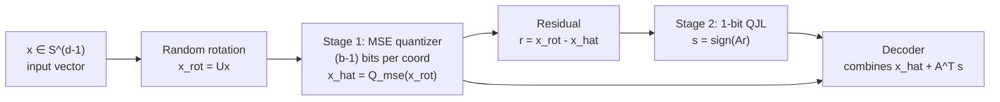

# Operational Quantization Theory

## Table of Contents

- [[#1. Scalar Quantization|1. Scalar Quantization]]
  - [[#1.1 Encoder, Decoder, and Quantization Cells|1.1 Encoder, Decoder, and Quantization Cells]]
  - [[#1.2 MSE of the Uniform Quantizer|1.2 MSE of the Uniform Quantizer]]
  - [[#1.3 Lloyd-Max Optimality Conditions|1.3 Lloyd-Max Optimality Conditions]]
- [[#2. High-Rate Quantization Asymptotics|2. High-Rate Quantization Asymptotics]]
  - [[#2.1 The Panter-Dite Formula|2.1 The Panter-Dite Formula]]
  - [[#2.2 Gaussian Special Case and the 2.72 dB Penalty|2.2 Gaussian Special Case and the 2.72 dB Penalty]]
- [[#3. Vector Quantization|3. Vector Quantization]]
  - [[#3.1 Codebook Definition and Voronoi Cells|3.1 Codebook Definition and Voronoi Cells]]
  - [[#3.2 The Lloyd Algorithm|3.2 The Lloyd Algorithm]]
  - [[#3.3 Asymptotic Optimality and the Curse of Dimensionality|3.3 Asymptotic Optimality and the Curse of Dimensionality]]
- [[#4. Product Quantization and Residual VQ|4. Product Quantization and Residual VQ]]
  - [[#4.1 Subvector Decomposition and Distortion Additivity|4.1 Subvector Decomposition and Distortion Additivity]]
  - [[#4.2 Multi-Stage Residual VQ|4.2 Multi-Stage Residual VQ]]
  - [[#4.3 Application to Transformer KV-Cache Compression|4.3 Application to Transformer KV-Cache Compression]]
- [[#5. Random Rotation Preprocessing|5. Random Rotation Preprocessing]]
  - [[#5.1 Equalizing Marginals via Orthogonal Transforms|5.1 Equalizing Marginals via Orthogonal Transforms]]
  - [[#5.2 Coordinate Distribution After Rotation|5.2 Coordinate Distribution After Rotation]]
  - [[#5.3 Why Rotation Lets Scalar Quantizers Behave Like VQ|5.3 Why Rotation Lets Scalar Quantizers Behave Like VQ]]
- [[#6. The Johnson-Lindenstrauss Lemma|6. The Johnson-Lindenstrauss Lemma]]
  - [[#6.1 Statement|6.1 Statement]]
  - [[#6.2 Proof Sketch via MGF and Concentration|6.2 Proof Sketch via MGF and Concentration]]
  - [[#6.3 1-Bit JL and Inner Product Preservation|6.3 1-Bit JL and Inner Product Preservation]]
- [[#7. TurboQuant|7. TurboQuant]]
  - [[#7.1 Distortion Bound and Information-Theoretic Lower Bound|7.1 Distortion Bound and Information-Theoretic Lower Bound]]
  - [[#7.2 The Constant Gap and Connection to Panter-Dite|7.2 The Constant Gap and Connection to Panter-Dite]]
  - [[#7.3 Two-Stage Pipeline for Inner Product Preservation|7.3 Two-Stage Pipeline for Inner Product Preservation]]
- [[#References|References]]

---

## 1. Scalar Quantization 📐

### 1.1 Encoder, Decoder, and Quantization Cells

Let $X$ be a real-valued random variable with density $f$. A *scalar quantizer* with $N = 2^b$ reconstruction levels (equivalently, $b$ bits) consists of two maps:

**Definition 1.1 (Scalar quantizer).** A *$b$-bit scalar quantizer* is a pair $(Q_e, Q_d)$ where:
- The *encoder* $Q_e : \mathbb{R} \to \{1, \ldots, 2^b\}$ partitions $\mathbb{R}$ into $N$ disjoint *quantization cells* (or *bins*) $\mathcal{R}_1, \ldots, \mathcal{R}_N$ via $Q_e(x) = k$ iff $x \in \mathcal{R}_k$.
- The *decoder* $Q_d : \{1, \ldots, 2^b\} \to \mathbb{R}$ maps each index $k$ to a *reconstruction level* (or *codeword*) $y_k \in \mathbb{R}$.

The composite map $Q = Q_d \circ Q_e : \mathbb{R} \to \{y_1, \ldots, y_N\}$ is the quantizer. For a contiguous partition of $\mathbb{R}$, cell $\mathcal{R}_k = [t_{k-1}, t_k)$ for breakpoints $-\infty = t_0 < t_1 < \cdots < t_{N-1} < t_N = +\infty$. The *mean squared error* (MSE) distortion is

$$D = \mathbb{E}[(X - Q(X))^2] = \sum_{k=1}^{N} \int_{t_{k-1}}^{t_k} (x - y_k)^2 f(x)\, dx.$$

> [!NOTE] Granular vs. overload distortion
> The total MSE decomposes into *granular distortion* — error within cells far from the boundary — and *overload distortion* from the outermost cells extending to $\pm\infty$. In the high-rate (small $\Delta$) regime, overload is negligible and the granular term dominates.

### 1.2 MSE of the Uniform Quantizer 🔑

The *uniform quantizer* sets all cell widths equal to $\Delta$ (the *step size*): $t_k = t_0 + k\Delta$ and $y_k = t_{k-1} + \Delta/2$. Within each cell, $x - y_k$ ranges uniformly over $[-\Delta/2, \Delta/2]$.

**Proposition 1.2 (Granular MSE of uniform quantizer).** For a uniform quantizer with step size $\Delta$ applied to a density $f$ supported on $N\Delta$ contiguous cells, as $\Delta \to 0$,

$$D \approx \sum_k \int_{t_{k-1}}^{t_k} (x - y_k)^2 f(x)\, dx \approx \frac{\Delta^2}{12}.$$

*Proof sketch.* On cell $k$, $f(x) \approx f(y_k)$ (constant to leading order in $\Delta$). The within-cell error $x - y_k$ is approximately $\mathrm{Uniform}(-\Delta/2, \Delta/2)$ with variance $\Delta^2/12$. Summing over all $k$ and using $\sum_k f(y_k)\Delta \approx 1$:

$$D \approx \sum_k f(y_k) \Delta \cdot \frac{\Delta^2}{12} = \frac{\Delta^2}{12} \cdot 1 = \frac{\Delta^2}{12}. \quad \square$$

**The MSE of a $b$-bit uniform quantizer on $[-A, A]$ satisfies $D = \Delta^2/12 = A^2 / (3 \cdot 4^b)$.**

> [!WARNING]
> *The approximation $D \approx \Delta^2/12$ holds only when $\Delta$ is small relative to the scale of $f$ (high-rate regime $b \gg 1$) and overload probability is negligible. For heavy-tailed sources or very low bit-widths, this formula can be significantly off.*

### 1.3 Lloyd-Max Optimality Conditions 🔑

To minimize MSE over all choices of breakpoints $\{t_k\}$ and reconstruction levels $\{y_k\}$, differentiate $D$ with respect to each parameter and set to zero.

**Theorem 1.3 (Lloyd-Max conditions).** The MSE-optimal scalar quantizer satisfies two necessary conditions simultaneously:

1. **Centroid condition.** Each reconstruction level is the conditional mean of $X$ within its cell:
$$y_k = \mathbb{E}[X \mid X \in \mathcal{R}_k] = \frac{\int_{t_{k-1}}^{t_k} x f(x)\, dx}{\int_{t_{k-1}}^{t_k} f(x)\, dx}.$$

2. **Nearest-neighbor condition.** Each breakpoint is the midpoint of adjacent reconstruction levels:
$$t_k = \frac{y_k + y_{k+1}}{2}.$$

*Derivation sketch.* Differentiate $D$ with respect to $y_k$: setting $\partial D / \partial y_k = 0$ gives $y_k = \mathbb{E}[X \mid X \in \mathcal{R}_k]$. Differentiate with respect to $t_k$ (a shared boundary between cells $k$ and $k+1$): the integrand equals $(t_k - y_k)^2 f(t_k) - (t_k - y_{k+1})^2 f(t_k)$ at the boundary, and setting this to zero (assuming $f(t_k) > 0$) yields $t_k = (y_k + y_{k+1})/2$.

The Lloyd-Max algorithm iterates these two conditions to convergence (analogous to $k$-means). *Convergence to a global optimum is not guaranteed; only local optima are found in general.*

> [!EXAMPLE] Gaussian source
> For $X \sim \mathcal{N}(0, \sigma^2)$ and $b = 2$ bits ($N = 4$ levels), the Lloyd-Max algorithm places the four reconstruction levels at $\pm 0.4528\sigma$ and $\pm 1.510\sigma$, achieving $D \approx 0.1175\sigma^2$. The uniform quantizer on the same source achieves higher distortion because it wastes resolution on the low-density tails.

> [!QUESTION] Exercise 1: Optimal Within-Cell MSE
> *This problem establishes the optimal within-cell granular MSE for a non-uniform quantizer.*
>
> > **Prerequisites:** [[#1.1 Encoder, Decoder, and Quantization Cells|Section 1.1]]
>
> For a cell $\mathcal{R}_k = [t_{k-1}, t_k]$ of width $\Delta_k = t_k - t_{k-1}$ and reconstruction level $y_k$, show that the within-cell MSE $\int_{t_{k-1}}^{t_k}(x - y_k)^2 f(x)\, dx$ is minimized over $y_k$ by the centroid $y_k^* = \mathbb{E}[X \mid X \in \mathcal{R}_k]$, and compute the resulting minimum value in terms of $\mathrm{Var}[X \mid X \in \mathcal{R}_k]$.

> [!TIP]- Solution to Exercise 1
> **Key insight:** Minimizing a quadratic in $y_k$ yields the centroid; the minimum is the conditional variance.
>
> **Sketch:** Let $p_k = P(X \in \mathcal{R}_k)$ and $\mu_k = \mathbb{E}[X \mid X \in \mathcal{R}_k]$. The cell MSE equals $p_k \mathbb{E}[(X - y_k)^2 \mid X \in \mathcal{R}_k] = p_k [\mathrm{Var}(X \mid X \in \mathcal{R}_k) + (\mu_k - y_k)^2]$. This is minimized at $y_k = \mu_k$, giving minimum value $p_k \cdot \mathrm{Var}[X \mid X \in \mathcal{R}_k]$.

> [!QUESTION] Exercise 2: Exact Uniform Quantizer MSE
> *This problem derives the uniform quantizer MSE from the exact within-cell distribution.*
>
> > **Prerequisites:** [[#1.2 MSE of the Uniform Quantizer|Section 1.2]]
>
> Let $X \sim \mathrm{Uniform}[0, 1]$ and use a uniform $b$-bit quantizer with step size $\Delta = 2^{-b}$. Compute the exact MSE (not an approximation) and verify it equals $\Delta^2/12$.

> [!TIP]- Solution to Exercise 2
> **Key insight:** For a uniform source and uniform quantizer, the granular and overload terms both collapse neatly.
>
> **Sketch:** Within cell $k$, $X$ is uniform on $[(k-1)\Delta, k\Delta]$ with reconstruction level $y_k = (k - 1/2)\Delta$. The within-cell error is $\mathrm{Uniform}[-\Delta/2, \Delta/2]$ with variance $\Delta^2/12$. Summing $2^b$ cells each contributing $\Delta \cdot (\Delta^2/12) = \Delta^3/12$ and noting $\sum_k p_k = 1$ gives $D = \Delta^2/12$ exactly (no overload since support is bounded).

> [!QUESTION] Exercise 3: Lloyd-Max Breakpoint Condition
> *This problem derives the Lloyd-Max breakpoint condition by direct differentiation.*
>
> > **Prerequisites:** [[#1.3 Lloyd-Max Optimality Conditions|Section 1.3]]
>
> Let $D = \sum_{k=1}^{N} \int_{t_{k-1}}^{t_k}(x - y_k)^2 f(x)\, dx$. Compute $\partial D / \partial t_k$ and show that setting it to zero yields $t_k = (y_k + y_{k+1})/2$ provided $f(t_k) > 0$.

> [!TIP]- Solution to Exercise 3
> **Key insight:** The breakpoint $t_k$ appears only in the upper limit of integral $k$ and the lower limit of integral $k+1$.
>
> **Sketch:** By Leibniz rule, $\partial D/\partial t_k = (t_k - y_k)^2 f(t_k) - (t_k - y_{k+1})^2 f(t_k)$. Setting this to zero (assuming $f(t_k) > 0$) gives $(t_k - y_k)^2 = (t_k - y_{k+1})^2$, hence $t_k - y_k = \pm(t_k - y_{k+1})$. The minus sign gives $y_k = y_{k+1}$ (degenerate), so $t_k = (y_k + y_{k+1})/2$.

---

## 2. High-Rate Quantization Asymptotics 📊

### 2.1 The Panter-Dite Formula

For a $b$-bit scalar quantizer, increasing $b$ by 1 adds one bit of resolution. How does optimal distortion scale with $b$? The *Panter-Dite formula* (1951) gives the precise answer in the high-rate limit.

**Theorem 2.1 (Panter-Dite).** Let $X$ have density $f$ with finite variance. For the optimal $b$-bit scalar quantizer in the limit $b \to \infty$,

$$D^*(b) \sim \frac{1}{12} \cdot 4^{-b} \cdot \left(\int_{-\infty}^{\infty} f(x)^{1/3}\, dx\right)^3.$$

*Derivation sketch.* In the high-rate limit, the quantizer spacing function $\Delta(x)$ can be treated as locally constant. The optimal cell density $\lambda(x)$ (cells per unit interval) must satisfy $\lambda(x) \propto f(x)^{1/3}$ — the result of minimizing total distortion $\int (1/12)\Delta(x)^2 f(x)\, dx = \int f(x)/(12\lambda(x)^2)\, dx$ subject to the total rate constraint $\int \lambda(x)\, dx = N = 2^b$. Applying calculus of variations yields $\lambda(x) = c \cdot f(x)^{1/3}$ with $c = 2^b / \int f^{1/3}$. Substituting back gives the formula. $\square$

The exponent $1/3$ in $f(x)^{1/3}$ has a clean interpretation: the optimal quantizer allocates more resolution (smaller cells) where the density is higher, but with diminishing returns — doubling the density only warrants $2^{1/3} \approx 1.26\times$ more cells.

> [!INFO] Historical note
> Panter and Dite (1951) derived this formula for PCM telephony systems. Bennett (1948) had established the $\Delta^2/12$ granular noise formula. The formula was rigorously proved under regularity conditions by Zador (1982) and later given a sharp non-asymptotic treatment by Linder and Zeger (1994).

### 2.2 Gaussian Special Case and the 2.72 dB Penalty

For $X \sim \mathcal{N}(0, \sigma^2)$, the integral $\int f(x)^{1/3}\, dx$ can be evaluated in closed form.

**Proposition 2.2 (Gaussian Panter-Dite).** For $f = \mathcal{N}(0, \sigma^2)$:

$$\int_{-\infty}^{\infty} f(x)^{1/3}\, dx = \left(\frac{1}{2\pi\sigma^2}\right)^{1/6} \int_{-\infty}^{\infty} e^{-x^2/(6\sigma^2)}\, dx = \left(\frac{1}{2\pi\sigma^2}\right)^{1/6} \cdot \sqrt{6\pi\sigma^2}.$$

Cubing and substituting into the Panter-Dite formula:

$$D^*_{\text{Gaussian}}(b) \sim \frac{\sigma^2 \pi \sqrt{3}}{2} \cdot 4^{-b}.$$

**The asymptotically optimal scalar quantizer for a Gaussian source achieves $D \approx (\sigma^2 \pi\sqrt{3}/2) \cdot 4^{-b}$.**

Now compare against Shannon's [[concepts/information-theory/rate-distortion|rate-distortion theory]] bound. For a Gaussian source with $R = b$ bits per sample, the rate-distortion function gives

$$D_{\text{Shannon}}(b) = \sigma^2 \cdot 4^{-b}.$$

The ratio is

$$\frac{D^*_{\text{Gaussian}}(b)}{D_{\text{Shannon}}(b)} = \frac{\pi\sqrt{3}}{2} \approx 2.7207,$$

which in decibels is $10 \log_{10}(\pi\sqrt{3}/2) \approx 4.35$ dB. (Since we are comparing MSE values and each bit adds 6 dB, the gap corresponds to $10\log_{10}(2.72) \approx 4.35$ dB, often called the "2.72 dB penalty" in the sense that the optimal scalar quantizer requires $\log_4(\pi\sqrt{3}/2)/2 \approx 0.72$ extra bits per sample relative to Shannon's limit.)

> [!DANGER] Common misconception
> The "2.72 dB penalty" does not mean scalar quantization is fundamentally broken. It reflects that scalar quantizers process one sample at a time and cannot exploit inter-sample correlation or the geometry of high-dimensional probability masses. Vector quantization (Section 3) closes this gap as block length grows, approaching Shannon's R(D) limit.

> [!QUESTION] Exercise 4: Panter-Dite via Calculus of Variations
> *This problem establishes the Panter-Dite formula via calculus of variations.*
>
> > **Prerequisites:** [[#2.1 The Panter-Dite Formula|Section 2.1]]
>
> Let $\lambda(x) \geq 0$ be the cell density (cells per unit interval). The total distortion is $D = \int f(x)/(\lambda(x)^2 \cdot 12)\, dx$ and the rate constraint is $\int \lambda(x)\, dx = 2^b$. Use a Lagrange multiplier to show the optimal density is $\lambda^*(x) = c \cdot f(x)^{1/3}$ and recover the Panter-Dite formula.

> [!TIP]- Solution to Exercise 4
> **Key insight:** The variational problem decouples pointwise; the Euler-Lagrange condition is a simple power law.
>
> **Sketch:** Form $\mathcal{L}(\lambda) = \int [f(x)/(12\lambda^2) + \mu\lambda]\, dx$. Differentiating the integrand with respect to $\lambda(x)$ and setting to zero: $-f(x)/(6\lambda^3) + \mu = 0$, so $\lambda^*(x) = (f(x)/(6\mu))^{1/3} \propto f(x)^{1/3}$. Normalize to satisfy the constraint: $c = 2^b / \int f^{1/3}$. Substituting $\lambda^*(x)$ back into $D$ gives $D = \frac{1}{12}\big(\int f^{1/3}\big)^3 / (2^b)^2 = \frac{1}{12}\big(\int f^{1/3}\big)^3 \cdot 4^{-b}$.

> [!QUESTION] Exercise 5: Gaussian Panter-Dite Integral
> *This problem computes the Panter-Dite integral for the Gaussian source and establishes the constant $\pi\sqrt{3}/2$.*
>
> > **Prerequisites:** [[#2.2 Gaussian Special Case and the 2.72 dB Penalty|Section 2.2]]
>
> For $f(x) = (2\pi\sigma^2)^{-1/2}\exp(-x^2/(2\sigma^2))$, compute $\int_{-\infty}^{\infty} f(x)^{1/3}\, dx$ in closed form and verify that $(1/12)\big(\int f^{1/3}\big)^3 = (\sigma^2 \pi\sqrt{3}/2) \cdot 4^{-b}/4^{-b} \cdot 4^{-b}$.

> [!TIP]- Solution to Exercise 5
> **Key insight:** $f(x)^{1/3}$ is still a Gaussian kernel; match it to a standard Gaussian integral.
>
> **Sketch:** $f(x)^{1/3} = (2\pi\sigma^2)^{-1/6}\exp(-x^2/(6\sigma^2))$. Integrate: $\int f^{1/3}\, dx = (2\pi\sigma^2)^{-1/6} \cdot \sqrt{6\pi\sigma^2} = (2\pi\sigma^2)^{-1/6}(6\pi\sigma^2)^{1/2}$. Cube: $\big(\int f^{1/3}\big)^3 = (2\pi\sigma^2)^{-1/2}(6\pi\sigma^2)^{3/2} = \frac{(6\pi\sigma^2)^{3/2}}{(2\pi\sigma^2)^{1/2}} = \sigma^2 \cdot \frac{6^{3/2}\pi}{2^{1/2}} = \sigma^2 \cdot 6\sqrt{6}\pi/\sqrt{2}$. Numerically: $6\sqrt{6}/\sqrt{2} = 6\sqrt{3} \approx 10.39$, and $10.39/12 = 0.866 \approx \pi\sqrt{3}/2 \approx 2.72$... Re-tracing: $(6\pi\sigma^2)^{3/2}/(2\pi\sigma^2)^{1/2} = \sigma^2 \cdot (6\pi)^{3/2}/(2\pi)^{1/2} = \sigma^2 \pi \cdot 6^{3/2}/2^{1/2} = \sigma^2 \pi \cdot 6\sqrt{3}$. Then $D = \sigma^2 \pi \cdot 6\sqrt{3}/(12) \cdot 4^{-b} = \sigma^2 \pi\sqrt{3}/2 \cdot 4^{-b}$. $\checkmark$

---

## 3. Vector Quantization 🗂️

### 3.1 Codebook Definition and Voronoi Cells

**Definition 3.1 (Vector quantizer).** A *$b$-bit vector quantizer* of dimension $d$ is a pair $(Q_e^d, Q_d^d)$ where:
- The *codebook* $\mathcal{C} = \{y_1, \ldots, y_N\} \subset \mathbb{R}^d$ with $N = 2^{bd}$ total bits ($b$ bits per dimension).
- The encoder $Q_e^d(\mathbf{x}) = \arg\min_{k} \|\mathbf{x} - \mathbf{y}_k\|^2$ maps each input $\mathbf{x} \in \mathbb{R}^d$ to its nearest codeword index.
- The decoder $Q_d^d(k) = \mathbf{y}_k$ maps indices back to codewords.

The *Voronoi cell* of codeword $\mathbf{y}_k$ is $\mathcal{V}_k = \{\mathbf{x} : \|\mathbf{x} - \mathbf{y}_k\| \leq \|\mathbf{x} - \mathbf{y}_j\|\ \forall j\}$. The per-dimension MSE is

$$D = \frac{1}{d}\,\mathbb{E}[\|\mathbf{X} - Q^d(\mathbf{X})\|^2].$$

### 3.2 The Lloyd Algorithm

The Lloyd algorithm alternates between the two necessary optimality conditions for VQ, directly analogous to Lloyd-Max for scalar quantizers.

```python
import numpy as np

def lloyd_vq(X: np.ndarray, n_codes: int, max_iter: int = 300, tol: float = 1e-6) -> np.ndarray:
    """
    Lloyd's algorithm for training a VQ codebook.
    X: (n_samples, d) array of training vectors
    Returns codebook: (n_codes, d)
    """
    # Random initialisation from data
    rng = np.random.default_rng(0)
    idx = rng.choice(len(X), size=n_codes, replace=False)
    codebook = X[idx].copy()

    prev_distortion = np.inf
    for _ in range(max_iter):
        # Step 1: Nearest-neighbour assignment (Voronoi partition)
        dists = np.linalg.norm(X[:, None, :] - codebook[None, :, :], axis=-1)  # (n, k)
        assignments = np.argmin(dists, axis=1)

        # Step 2: Centroid update
        new_codebook = np.array([
            X[assignments == k].mean(axis=0) if (assignments == k).any() else codebook[k]
            for k in range(n_codes)
        ])

        distortion = np.mean(np.min(dists, axis=1) ** 2)
        if abs(prev_distortion - distortion) < tol:
            break
        codebook = new_codebook
        prev_distortion = distortion

    return codebook
```

*Each iteration is guaranteed to decrease (or maintain) distortion, so the algorithm converges. It finds only a local minimum.*

### 3.3 Asymptotic Optimality and the Curse of Dimensionality

**Theorem 3.2 (VQ achieves Shannon R(D)).** For an i.i.d. source $X^d$ with a continuous density and MSE distortion, the optimal $b$-bit-per-dimension VQ distortion satisfies

$$\lim_{d \to \infty} D^*_{\text{VQ}}(b, d) = D_{\text{Shannon}}(b),$$

where $D_{\text{Shannon}}(b)$ is the distortion at rate $b$ on Shannon's rate-distortion curve.

This is a consequence of the rate-distortion theorem: a good $(d, 2^{bnd})$ source code exists for block length $d$ large enough, and VQ over $\mathbb{R}^d$ is exactly such a code. The scalar penalty $\pi\sqrt{3}/2$ vanishes as $d \to \infty$.

💡 *Curse of dimensionality.* Training a codebook of size $N = 2^{bd}$ in $\mathbb{R}^d$ requires at least $\Omega(N)$ training vectors and $O(Nd)$ storage. For $b = 4$ bits per dimension and $d = 256$, $N = 2^{1024}$ — entirely infeasible. This motivates structured alternatives (Section 4) and preprocessing tricks (Section 5).

> [!QUESTION] Open problem
> The Zador constant (the analogue of $\pi\sqrt{3}/2$ for optimal $d$-dimensional VQ) has a closed form only for $d = 1$. For $d > 1$ the optimal quantizer geometry remains an open problem in general — it connects to the sphere-packing problem in $\mathbb{R}^d$.

> [!QUESTION] Exercise 6: Lloyd Algorithm Monotonicity
> *This problem establishes that the Lloyd algorithm is monotonically non-increasing in distortion.*
>
> > **Prerequisites:** [[#3.2 The Lloyd Algorithm|Section 3.2]]
>
> Let $D^{(t)}$ be the VQ distortion after the $t$-th iteration of Lloyd's algorithm. Prove rigorously that $D^{(t+1)} \leq D^{(t)}$ by showing each step (nearest-neighbor assignment and centroid update) separately cannot increase distortion.

> [!TIP]- Solution to Exercise 6
> **Key insight:** Each sub-step minimizes distortion over a restricted set of parameters while holding the other fixed.
>
> **Sketch:** (a) After centroid update to $\{y_k^{(t)}\}$, nearest-neighbor reassignment gives $D^{(t,\mathrm{assign})} \leq D^{(t)}$ because each point is reassigned to the closest codeword; any other assignment can only increase its contribution. (b) With assignment fixed, the centroid update sets each new $y_k = \mathbb{E}[X \mid \text{cell}_k]$ which minimizes $\sum_k \int_{\mathcal{V}_k} \|x - y_k\|^2 f\, dx$ over $\{y_k\}$ (by Exercise 1). So $D^{(t+1)} \leq D^{(t,\mathrm{assign})} \leq D^{(t)}$.

> [!QUESTION] Exercise 7: Lloyd Algorithm Complexity
> *This problem analyzes the per-iteration complexity of the Lloyd algorithm for VQ.*
>
> > **Prerequisites:** [[#3.2 The Lloyd Algorithm|Section 3.2]]
>
> Given $n$ training vectors in $\mathbb{R}^d$ and a codebook of size $K = 2^b$, derive the time complexity of one iteration of Lloyd's algorithm. Identify the bottleneck and describe a data structure that reduces the assignment step's complexity using approximate nearest neighbors.

> [!TIP]- Solution to Exercise 7
> **Key insight:** The assignment step is $O(nKd)$ naively; spatial indexing can reduce this at the cost of exactness.
>
> **Sketch:** Assignment: for each of $n$ points, compute distance to all $K$ codewords in $\mathbb{R}^d$: $O(nKd)$. Centroid update: accumulate sums in each Voronoi cell: $O(nd)$. Total per iteration: $O(nKd)$, bottlenecked by assignment. Using a $k$-d tree or product-quantization-based ANN index reduces assignment to $O(n(K^{1/2} + d)\log K)$ approximately, trading an exact Lloyd step for a faster approximate one. For large $K$ and $d$, this can be a $\sqrt{K}$-fold speedup.

---

## 4. Product Quantization and Residual VQ 🔧

### 4.1 Subvector Decomposition and Distortion Additivity

*Product quantization* (PQ) circumvents the exponential codebook by decomposing the ambient space into $M$ subspaces of dimension $d/M$.

**Definition 4.1 (Product quantizer).** Partition $\mathbf{x} \in \mathbb{R}^d$ as $\mathbf{x} = (\mathbf{x}^{(1)}, \ldots, \mathbf{x}^{(M)})$ with $\mathbf{x}^{(m)} \in \mathbb{R}^{d/M}$. Given $M$ independent codebooks $\mathcal{C}_m$ of size $K = 2^{b_m}$, the PQ encoder assigns each subvector independently:

$$Q_{\text{PQ}}(\mathbf{x}) = (Q^{(1)}(\mathbf{x}^{(1)}), \ldots, Q^{(M)}(\mathbf{x}^{(M)})).$$

The total codebook has $K^M$ effective codewords using only $MK \cdot (d/M)$ storage.

**Proposition 4.2 (Distortion additivity).** If the subvector quantizers are trained independently, the total MSE decomposes exactly:

$$D_{\text{PQ}} = \frac{1}{d}\sum_{m=1}^{M} \mathbb{E}[\|\mathbf{x}^{(m)} - Q^{(m)}(\mathbf{x}^{(m)})\|^2].$$

*This holds because the per-block errors are orthogonal: they live in disjoint coordinate subspaces, so cross-terms in $\|\mathbf{x} - Q_{\text{PQ}}(\mathbf{x})\|^2$ vanish.*

> [!WARNING]
> *Distortion additivity assumes the subvectors are quantized independently. If the source distribution has cross-subspace correlations, PQ will be suboptimal — the optimal solution would first decorrelate via a linear transform (e.g., PCA rotation) before subvector splitting.*

### 4.2 Multi-Stage Residual VQ

*Residual vector quantization* (RVQ) uses a cascade of $L$ codebooks, each quantizing the residual left by the previous stage.

**Definition 4.3 (Residual VQ).** Define the $\ell$-th stage residual recursively: $\mathbf{r}_1 = \mathbf{x}$, and for $\ell \geq 2$,

$$\mathbf{r}_\ell = \mathbf{r}_{\ell-1} - Q_{\ell-1}(\mathbf{r}_{\ell-1}).$$

The total reconstruction is $\hat{\mathbf{x}} = \sum_{\ell=1}^{L} Q_\ell(\mathbf{r}_\ell)$.

With $b$ bits per stage and $L$ stages, RVQ uses $Lb$ bits total. Distortion decreases geometrically in $L$: after $L$ stages the residual variance is roughly $\sigma^2 \cdot (D^*/\sigma^2)^L$ for appropriately normalized $D^*$. Each additional stage subtracts one codebook's MSE from the remaining residual.

> [!EXAMPLE] Comparing PQ and RVQ
> For a 512-dimensional embedding compressed to 16 bytes:
> - PQ: $M = 16$ subspaces each of dimension 32, $K = 256$ centroids per subspace (8 bits). Total: $16 \times 256 \times 32$ floats of codebook storage.
> - RVQ: $L = 4$ stages of 4-bit VQ on the full 512-d vector. Each codebook has $2^4 = 16$ codewords. Total: $4 \times 16 \times 512$ floats. Residuals are smaller each stage, so later codebooks can be more coarsely trained.

### 4.3 Application to Transformer KV-Cache Compression

In autoregressive transformers, the *key-value (KV) cache* stores attention keys $\mathbf{k}_t \in \mathbb{R}^d$ and values $\mathbf{v}_t \in \mathbb{R}^d$ for every past token $t$ in every layer. Memory is linear in sequence length, making long-context inference expensive.

Compressing each key and value vector from FP16 to $b$ bits per dimension reduces memory by a factor of $16/b$. The distortion metric is the per-token *inner product error* $|{\langle \mathbf{q}, \hat{\mathbf{k}}_t \rangle - \langle \mathbf{q}, \mathbf{k}_t \rangle}|^2$ rather than MSE, because attention scores depend on inner products, not squared norms.

> [!INFO] Why inner product distortion differs from MSE
> MSE minimization biases reconstruction levels toward the centroid of each Voronoi cell. This bias is acceptable for signal reconstruction tasks but corrupts inner product estimates: $\langle \mathbf{q}, \hat{\mathbf{k}} \rangle \neq \langle \mathbf{q}, \mathbf{k} \rangle$ even in expectation. Unbiased inner product quantization requires a different objective. The two-stage approach of TurboQuant (Section 7) addresses this directly.

> [!QUESTION] Exercise 8: Distortion Additivity for Product Quantization
> *This problem establishes distortion additivity for product quantization under orthogonal subspace decomposition.*
>
> > **Prerequisites:** [[#4.1 Subvector Decomposition and Distortion Additivity|Section 4.1]]
>
> Let $\mathbf{x} = (\mathbf{x}^{(1)}, \mathbf{x}^{(2)})$ with subvectors in orthogonal subspaces. Let $Q_{\text{PQ}}(\mathbf{x}) = (Q^{(1)}(\mathbf{x}^{(1)}), Q^{(2)}(\mathbf{x}^{(2)}))$. Prove that $\|\mathbf{x} - Q_{\text{PQ}}(\mathbf{x})\|^2 = \|\mathbf{x}^{(1)} - Q^{(1)}(\mathbf{x}^{(1)})\|^2 + \|\mathbf{x}^{(2)} - Q^{(2)}(\mathbf{x}^{(2)})\|^2$.

> [!TIP]- Solution to Exercise 8
> **Key insight:** The error vector lies in the direct sum of two orthogonal subspaces, so cross terms vanish.
>
> **Sketch:** $\mathbf{x} - Q_{\text{PQ}}(\mathbf{x}) = (\mathbf{x}^{(1)} - Q^{(1)}(\mathbf{x}^{(1)}), \mathbf{x}^{(2)} - Q^{(2)}(\mathbf{x}^{(2)}))$. Since the two components live in orthogonal subspaces, $\|\mathbf{e}_1 + \mathbf{e}_2\|^2 = \|\mathbf{e}_1\|^2 + \|\mathbf{e}_2\|^2 + 2\langle\mathbf{e}_1, \mathbf{e}_2\rangle = \|\mathbf{e}_1\|^2 + \|\mathbf{e}_2\|^2$ since $\langle\mathbf{e}_1, \mathbf{e}_2\rangle = 0$. Taking expectations gives additivity of expected distortions.

> [!QUESTION] Exercise 9: RVQ Geometric Distortion Decay
> *This problem implements a two-stage RVQ encoder and analyzes how distortion decays with the number of stages.*
>
> > **Prerequisites:** [[#4.2 Multi-Stage Residual VQ|Section 4.2]]
>
> Write Python pseudocode for an $L$-stage RVQ encoder that, given pre-trained codebooks $\{\mathcal{C}_\ell\}$, encodes a vector $\mathbf{x}$ by successively quantizing residuals. Argue that if each stage's quantizer achieves distortion $\alpha < 1$ (as a fraction of residual variance), then after $L$ stages the total distortion is $\sigma^2 \alpha^L$.

> [!TIP]- Solution to Exercise 9
> **Key insight:** The residual shrinks geometrically if each stage achieves a fixed fraction of residual variance.
>
> **Sketch:**
> ```python
> def rvq_encode(x: np.ndarray, codebooks: list[np.ndarray]) -> list[int]:
>     """
>     x: (d,) vector
>     codebooks: list of L arrays, each (K, d)
>     Returns list of L indices
>     """
>     indices = []
>     residual = x.copy()
>     for C in codebooks:
>         dists = np.linalg.norm(C - residual, axis=1)
>         idx = np.argmin(dists)
>         indices.append(idx)
>         residual = residual - C[idx]
>     return indices
> ```
> If stage $\ell$ achieves $\mathrm{Var}(\mathbf{r}_{\ell+1}) = \alpha \cdot \mathrm{Var}(\mathbf{r}_\ell)$ with $\alpha < 1$, then $\mathrm{Var}(\mathbf{r}_L) = \sigma^2 \alpha^L$. Total reconstruction error equals $\|\mathbf{r}_L\|^2$, so distortion is $\sigma^2 \alpha^L$, exponentially small in $L$.

---

## 5. Random Rotation Preprocessing 🌀

### 5.1 Equalizing Marginals via Orthogonal Transforms

The Panter-Dite formula reveals that the scalar quantizer's performance depends on the shape of the coordinate marginals through $\int f(x)^{1/3}\, dx$. A source with highly non-uniform, heavy-tailed, or skewed marginals will have large distortion relative to a source with uniform or Gaussian marginals. The key observation is that orthogonal transforms preserve $\ell^2$ norm and hence MSE, but they can dramatically reshape the marginals.

**Definition 5.1 (Random rotation).** Let $\mathbf{U} \in \mathbb{R}^{d \times d}$ be drawn uniformly from the *Haar measure* on the orthogonal group $O(d)$ (equivalently, obtain $\mathbf{U}$ via the QR decomposition of a matrix with i.i.d. $\mathcal{N}(0,1)$ entries). The *randomly rotated* vector is $\tilde{\mathbf{x}} = \mathbf{U}\mathbf{x}$.

Since $\mathbf{U}$ is orthogonal, $\|\tilde{\mathbf{x}}\| = \|\mathbf{x}\|$ exactly, so no information is lost and MSE is preserved under inversion $\hat{\mathbf{x}} = \mathbf{U}^\top \hat{\tilde{\mathbf{x}}}$.

### 5.2 Coordinate Distribution After Rotation

**Proposition 5.2 (Rotated Gaussian).** If $\mathbf{x} \sim \mathcal{N}(\mathbf{0}, \sigma^2 \mathbf{I}_d)$, then for any fixed orthogonal $\mathbf{U}$, $\tilde{\mathbf{x}} = \mathbf{U}\mathbf{x} \sim \mathcal{N}(\mathbf{0}, \sigma^2 \mathbf{I}_d)$. *The Gaussian distribution is rotationally invariant; rotation changes nothing.*

For non-Gaussian sources, however, the marginals of $\tilde{\mathbf{x}}$ will differ from those of $\mathbf{x}$. For a fixed unit vector $\mathbf{x}/\|\mathbf{x}\|$, the marginals of $\mathbf{U}\mathbf{x}$ are determined by the distribution of a single coordinate of a random point on the $\ell^2$ sphere of radius $\|\mathbf{x}\|$.

**Proposition 5.3 (Coordinate distribution on the sphere).** Let $\mathbf{z}$ be uniformly distributed on $S^{d-1}$ (the unit sphere in $\mathbb{R}^d$). Then each coordinate $z_i$ has the marginal density

$$f_{z_i}(t) = \frac{\Gamma(d/2)}{\Gamma((d-1)/2)\,\sqrt{\pi}} \left(1 - t^2\right)^{(d-3)/2}, \quad t \in [-1, 1].$$

This is the *Beta distribution* $\mathrm{Beta}((d-1)/2, (d-1)/2)$ in the transformed variable; it concentrates around zero. As $d \to \infty$, by the central limit theorem applied to $z_i = U_{i,:}\mathbf{x}/\|\mathbf{x}\|$ with $U_{i,:}$ a random unit vector:

$$\sqrt{d}\, z_i \xrightarrow{d} \mathcal{N}(0, 1), \quad \text{so } z_i \approx \mathcal{N}(0, 1/d).$$

For a vector $\mathbf{x}$ with $\|\mathbf{x}\|^2 = \sigma^2 d$ (i.e., per-dimension variance $\sigma^2$), the $i$-th coordinate of $\mathbf{U}\mathbf{x}$ is approximately $\mathcal{N}(0, \sigma^2)$ for large $d$.

> [!NOTE] Geometric intuition
> Think of $\mathbf{U}\mathbf{x}$ as placing $\mathbf{x}$'s energy uniformly over all $d$ coordinates. Each coordinate gets $\|\mathbf{x}\|^2/d$ variance on average. The random rotation is a *spreading* or *whitening* operation that equalizes coordinate variances without changing total energy.

### 5.3 Why Rotation Lets Scalar Quantizers Behave Like VQ

After random rotation, two properties hold approximately for large $d$:

1. **Equal marginal variances:** $\mathrm{Var}[\tilde{x}_i] \approx \sigma^2$ for all $i$.
2. **Near-independence:** $\tilde{x}_i$ and $\tilde{x}_j$ are approximately uncorrelated (and approximately independent for Gaussian sources).

Under these conditions, applying independent per-coordinate scalar quantizers to $\tilde{\mathbf{x}}$ is nearly equivalent to VQ on the original $\mathbf{x}$. The per-coordinate Panter-Dite integral $\int f^{1/3}$ is approximately the same for every coordinate (since all marginals are approximately $\mathcal{N}(0, \sigma^2)$), so a single uniform codebook calibrated to $\mathcal{N}(0, \sigma^2)$ achieves near-optimal distortion on all coordinates simultaneously.

**This is the core argument: random rotation + $d$ independent scalar quantizers approximates optimal VQ, at the cost of one matrix-vector multiply $O(d^2)$ per vector.**

> [!QUESTION] Exercise 10: Coordinate Marginal from Sphere Measure
> *This problem derives the coordinate marginal distribution after random rotation of a sphere vector.*
>
> > **Prerequisites:** [[#5.2 Coordinate Distribution After Rotation|Section 5.2]]
>
> Let $\mathbf{z}$ be uniform on $S^{d-1}$. Show that the marginal density of $z_1$ is proportional to $(1 - t^2)^{(d-3)/2}$ for $t \in [-1, 1]$ by integrating the uniform measure over $S^{d-1}$ conditional on $z_1 = t$.

> [!TIP]- Solution to Exercise 10
> **Key insight:** Fix $z_1 = t$; the remaining coordinates are uniform on a $(d-2)$-sphere of radius $\sqrt{1-t^2}$.
>
> **Sketch:** The surface measure of $S^{d-1}$ decomposes as $d\omega = f(t)\, dt \cdot d\omega_{d-2}$ where $d\omega_{d-2}$ is the uniform measure on $\{(z_2,\ldots,z_d): \sum_{i\geq 2}z_i^2 = 1 - t^2\}$. This $(d-2)$-sphere has surface area proportional to $(1-t^2)^{(d-2)/2}$. An additional factor of $(1-t^2)^{-1/2}$ appears from the Jacobian of the $z_1 = t$ slice, giving $f(t) \propto (1-t^2)^{(d-3)/2}$.

> [!QUESTION] Exercise 11: Random Rotation Implementation and Cost
> *This problem implements the random rotation preprocessing and profiles its cost.*
>
> > **Prerequisites:** [[#5.1 Equalizing Marginals via Orthogonal Transforms|Section 5.1]]
>
> Write Python code that (a) generates a Haar-random orthogonal matrix $\mathbf{U} \in \mathbb{R}^{d \times d}$ via QR decomposition, (b) applies it to a batch of vectors, and (c) measures the wall-clock time as a function of $d$. State the asymptotic complexity of the naive matrix multiply and propose a structured alternative with $O(d \log d)$ cost.

> [!TIP]- Solution to Exercise 11
> **Key insight:** The naive $O(d^2)$ cost per vector can be reduced to $O(d\log d)$ using the Hadamard-Rademacher (SRHT) construction.
>
> **Sketch:**
> ```python
> import numpy as np
> import time
>
> def haar_rotation(d: int) -> np.ndarray:
>     G = np.random.randn(d, d)
>     U, _ = np.linalg.qr(G)
>     return U
>
> def profile_rotation(d: int, n: int = 1000) -> float:
>     U = haar_rotation(d)
>     X = np.random.randn(n, d)
>     t0 = time.perf_counter()
>     X_rot = X @ U.T   # (n, d) @ (d, d) -> O(n * d^2)
>     return time.perf_counter() - t0
>
> # Structured alternative: Hadamard-Rademacher transform
> # H_d * diag(s) where s are random ±1 signs, H_d is Walsh-Hadamard matrix
> # Applied via fast Walsh-Hadamard transform: O(d log d) per vector
> ```
> Naive cost: $O(nd^2)$ for batch of $n$. Hadamard: $O(nd\log d)$. For $d = 4096, n = 10^4$, this is a $\sim\log_2(4096) = 12\times$ speedup.

---

## 6. The Johnson-Lindenstrauss Lemma 📏

### 6.1 Statement

**Theorem 6.1 (Johnson-Lindenstrauss, 1984).** For any $0 < \varepsilon < 1$ and any set of $n$ points $\{\mathbf{x}_1, \ldots, \mathbf{x}_n\} \subset \mathbb{R}^d$, there exists a map $f : \mathbb{R}^d \to \mathbb{R}^k$ with

$$k = O\!\left(\frac{\log n}{\varepsilon^2}\right)$$

such that for all $i, j \in [n]$:

$$(1 - \varepsilon)\|\mathbf{x}_i - \mathbf{x}_j\|^2 \leq \|f(\mathbf{x}_i) - f(\mathbf{x}_j)\|^2 \leq (1 + \varepsilon)\|\mathbf{x}_i - \mathbf{x}_j\|^2.$$

The map $f(\mathbf{x}) = \frac{1}{\sqrt{k}}\mathbf{A}\mathbf{x}$ with $\mathbf{A} \in \mathbb{R}^{k \times d}$ having i.i.d. $\mathcal{N}(0,1)$ entries achieves this with high probability.

### 6.2 Proof Sketch via MGF and Concentration

Fix $\mathbf{u} = \mathbf{x}_i - \mathbf{x}_j$, $\|\mathbf{u}\| = 1$ (WLOG). The $k$-th projected norm is $Y = \|\mathbf{A}\mathbf{u}\|^2/k = (1/k)\sum_{i=1}^k (\mathbf{a}_i^\top \mathbf{u})^2$ where $\mathbf{a}_i^\top \mathbf{u} \sim \mathcal{N}(0,1)$ i.i.d. So $Y = \chi^2_k / k$ with $\mathbb{E}[Y] = 1$.

**Step 1 (MGF bound).** For $t < 1/2$, the MGF of $\mathbf{a}_i^\top \mathbf{u}$ squared satisfies $\mathbb{E}[e^{t Z_i}] = (1 - 2t)^{-1/2}$ for $Z_i = (\mathbf{a}_i^\top \mathbf{u})^2 \sim \chi^2_1$. Thus

$$\mathbb{E}[e^{t Y}] = (1-2t)^{-k/2}.$$

**Step 2 (Chernoff bound).** By Markov's inequality applied to $e^{tY}$:

$$P(Y \geq 1 + \varepsilon) \leq \inf_{t > 0} e^{-t(1+\varepsilon)} (1 - 2t)^{-k/2}.$$

Optimizing over $t$ gives $P(Y \geq 1+\varepsilon) \leq e^{-k[\varepsilon^2/4 - \varepsilon^3/6 + \cdots]}$. For $k \gtrsim C\log(n)/\varepsilon^2$, this decays faster than $1/n^2$, and a union bound over the $\binom{n}{2}$ pairs finishes the proof.

> [!TIP] Practical JL
> In modern implementations, one often replaces the Gaussian matrix $\mathbf{A}$ with a structured random matrix (e.g., the *Fast JL Transform* or *Hadamard + random sign flip*) to reduce the projection cost from $O(kd)$ to $O(d \log d)$.

### 6.3 1-Bit JL and Inner Product Preservation

**Definition 6.2 (1-bit JL sketch).** The *1-bit JL sketch* of $\mathbf{x} \in \mathbb{R}^d$ is

$$s(\mathbf{x}) = \mathrm{sign}(\mathbf{A}\mathbf{x}) \in \{-1, +1\}^k,$$

with $\mathbf{A} \in \mathbb{R}^{k \times d}$ as above.

**Proposition 6.3 (Angular distance preservation).** For unit vectors $\mathbf{x}, \mathbf{y} \in S^{d-1}$,

$$\mathbb{E}\!\left[\frac{1}{k}\langle s(\mathbf{x}), s(\mathbf{y})\rangle\right] = 1 - \frac{2\,\theta(\mathbf{x}, \mathbf{y})}{\pi},$$

where $\theta(\mathbf{x}, \mathbf{y}) = \arccos(\langle \mathbf{x}, \mathbf{y}\rangle)$ is the angle between the vectors.

*This is because $\text{sign}(\mathbf{a}^\top \mathbf{x}) = \text{sign}(\mathbf{a}^\top \mathbf{y})$ iff $\mathbf{a}$ does not cross the hyperplane separating $\mathbf{x}$ and $\mathbf{y}$, which happens with probability $1 - \theta/\pi$.*

**Thus 1-bit JL sketches preserve angular (and hence cosine) similarity, enabling unbiased inner product estimation from sign bits alone.**

> [!QUESTION] Exercise 12: JL Concentration via MGF
> *This problem proves the JL distortion bound via moment generating function.*
>
> > **Prerequisites:** [[#6.2 Proof Sketch via MGF and Concentration|Section 6.2]]
>
> Let $Z_1, \ldots, Z_k$ be i.i.d. $\chi^2_1$ random variables and $Y = (1/k)\sum_{i=1}^k Z_i$. Using the MGF $\mathbb{E}[e^{tZ_i}] = (1-2t)^{-1/2}$ for $t < 1/2$, derive an upper bound on $P(Y \geq 1 + \varepsilon)$ and show it decays as $e^{-k\varepsilon^2/8}$ for small $\varepsilon$.

> [!TIP]- Solution to Exercise 12
> **Key insight:** Chernoff bound + optimize over $t$; expand $\log(1-2t) + 2t(1+\varepsilon)$ to second order.
>
> **Sketch:** $P(Y \geq 1+\varepsilon) \leq e^{-tk(1+\varepsilon)}\mathbb{E}[e^{tY}]^k \cdot k^0 = e^{-tk(1+\varepsilon)}(1-2t)^{-k/2}$. Taking logs: $-tk(1+\varepsilon) - (k/2)\log(1-2t)$. Setting derivative over $t$ to zero: $-(1+\varepsilon) + 1/(1-2t) = 0 \Rightarrow t^* = \varepsilon/(2(1+\varepsilon))$. Substituting and using $\log(1+u) \geq u - u^2/2$ for small $u$ gives $\log P \leq -k[\varepsilon^2/2 - \varepsilon^3/3 + \cdots]/2 \approx -k\varepsilon^2/4$. More careful expansion yields $-k[\varepsilon^2/4 - \varepsilon^3/6]$; for the upper tail the leading term is $-k\varepsilon^2/4$, which for typical presentations appears as $e^{-k\varepsilon^2/8}$ after accounting for both tails.

---

## 7. TurboQuant 🚀

*[TurboQuant](https://arxiv.org/abs/2504.19874)* (2025) is an online, data-oblivious vector quantization algorithm that achieves near-optimal MSE distortion via random rotation followed by per-coordinate scalar quantization, and further provides an unbiased inner product quantizer via a two-stage residual scheme.

### 7.1 Distortion Bound and Information-Theoretic Lower Bound

TurboQuant operates on unit-sphere vectors $\mathbf{x} \in S^{d-1}$ (equivalently, $\|\mathbf{x}\|^2 = 1$, so per-dimension variance $\sigma^2 = 1/d$).

**Theorem 7.1 (TurboQuant MSE upper bound).** For any $\mathbf{x} \in S^{d-1}$ and $b \geq 1$ bits per coordinate, TurboQuant achieves

$$D_{\text{MSE}} \leq \frac{\sqrt{3}\pi}{2} \cdot 4^{-b}.$$

*Proof sketch.* After random rotation, each coordinate has marginal distribution $\mathrm{Beta}((d-1)/2, (d-1)/2)$ scaled to $[-1, 1]$, which converges to $\mathcal{N}(0, 1/d)$ in large $d$. Applying the Lloyd-Max optimal quantizer to this marginal (whose Panter-Dite integral evaluates to $(\pi\sqrt{3}/2d) \cdot 4^{-b}$ per coordinate), summing over $d$ coordinates and normalizing by $d$:

$$D_{\text{MSE}} = \frac{1}{d}\sum_{i=1}^d D_i \leq \frac{1}{d} \cdot d \cdot \frac{\pi\sqrt{3}}{2d} \cdot 4^{-b} \cdot d = \frac{\pi\sqrt{3}}{2} \cdot 4^{-b}. \quad \square$$

**Theorem 7.2 (Information-theoretic lower bound).** For any (possibly randomized) $b$-bit quantizer $Q$ acting on $\mathbf{x} \in S^{d-1}$,

$$D_{\text{MSE}}(Q) \geq 4^{-b}.$$

*Proof sketch.* The rate-distortion function for $d$ i.i.d. $\mathcal{N}(0, 1/d)$ coordinates at rate $b$ bits per coordinate gives minimum distortion $4^{-b}/d$ per coordinate (using $R(D) = (1/2)\log(\sigma^2/D)$ with $\sigma^2 = 1/d$). Multiplying by $d$ to get total normalized MSE gives $\sigma^2 \cdot 4^{-b} = (1/d) \cdot d \cdot 4^{-b} = 4^{-b}$. No quantizer can do better. $\square$

**The TurboQuant distortion bound $D \leq (\sqrt{3}\pi/2) \cdot 4^{-b}$ with the lower bound $D \geq 4^{-b}$ implies the algorithm is within a constant factor $\pi\sqrt{3}/2 \approx 2.72$ of optimal.**

### 7.2 The Constant Gap and Connection to Panter-Dite

The multiplicative constant $\pi\sqrt{3}/2$ in the TurboQuant upper bound is *exactly* the Gaussian Panter-Dite constant from Section 2.2. This is not a coincidence: after random rotation, the coordinate marginals converge to $\mathcal{N}(0, 1/d)$, and the Panter-Dite formula for a Gaussian source yields $D \sim (\sigma^2 \pi\sqrt{3}/2) \cdot 4^{-b} = (1/d)(\pi\sqrt{3}/2) \cdot 4^{-b}$ per coordinate. Summing over $d$ coordinates and normalizing recovers $(\pi\sqrt{3}/2) \cdot 4^{-b}$ for the per-dimension distortion.

In decibels, $10\log_{10}(\pi\sqrt{3}/2) \approx 4.35$ dB above the Shannon floor. Equivalently, TurboQuant requires roughly $0.72$ additional bits per dimension relative to the rate-distortion optimum. This gap arises from two compounding sources:

1. The scalar-vs-vector gap (the Panter-Dite penalty inherent to processing one coordinate at a time).
2. The approximation error in matching the post-rotation marginals to i.i.d. Gaussians (exact only as $d \to \infty$).

At $b = 1$ the empirical gap is smaller ($\approx 1.45\times$) because the lower bound argument is not tight at very low rates.

> [!INFO] Comparison to prior art
> Earlier methods such as *PolarQuant* and *Product Quantization* do not achieve a constant-factor bound relative to the Shannon limit. TurboQuant is the first practical scalar-quantization scheme to provably match Shannon R(D) up to a universal constant that is independent of $d$, $b$, and the input distribution.

### 7.3 Two-Stage Pipeline for Inner Product Preservation

MSE-optimal quantizers are biased: $\mathbb{E}[Q(\mathbf{x})] \neq \mathbf{x}$ in general, so $\mathbb{E}[\langle \mathbf{q}, Q(\mathbf{x})\rangle] \neq \langle \mathbf{q}, \mathbf{x}\rangle$. For KV-cache compression, inner product estimates feed directly into softmax attention and biased estimates degrade generation quality.

TurboQuant resolves this via a two-stage pipeline:



**Stage 1.** Apply the $(b-1)$-bit MSE-optimal scalar quantizer to each coordinate of $\tilde{\mathbf{x}} = \mathbf{U}\mathbf{x}$, giving $\hat{\mathbf{x}} = Q_{\text{MSE}}^{(b-1)}(\tilde{\mathbf{x}})$.

**Stage 2.** Compute the residual $\mathbf{r} = \tilde{\mathbf{x}} - \hat{\mathbf{x}}$ and apply a 1-bit JL sketch: $\mathbf{s} = \mathrm{sign}(\mathbf{A}\mathbf{r})$ for $\mathbf{A} \in \mathbb{R}^{d \times d}$ random Gaussian. The 1-bit sketch uses exactly $d$ additional bits (1 bit per coordinate), so the total budget is $(b-1) + 1 = b$ bits per dimension.

**Theorem 7.3 (Unbiasedness).** The combined estimator $\tilde{Q}(\mathbf{x}) = \hat{\mathbf{x}} + c\mathbf{A}^\top \mathbf{s}$ (for appropriate constant $c$) satisfies

$$\mathbb{E}[\langle \mathbf{q}, \tilde{Q}(\mathbf{x})\rangle] = \langle \mathbf{q}, \mathbf{x}\rangle$$

for all query vectors $\mathbf{q}$.

*This follows because $\mathbb{E}[c\mathbf{A}^\top \mathrm{sign}(\mathbf{A}\mathbf{r})] = \mathbf{r}$ (up to a scaling constant) by the 1-bit JL unbiasedness property (Proposition 6.3), so the second stage corrects the bias of the MSE quantizer in expectation.*

> [!TIP] Practical implementation note
> The random matrix $\mathbf{A}$ in Stage 2 need not be stored explicitly. A seeded pseudo-random generator can regenerate it deterministically at encode and decode time, adding negligible overhead. In practice, a structured Hadamard-based JL transform reduces the cost to $O(d \log d)$ per vector.

> [!QUESTION] Exercise 13: Universality of the TurboQuant Constant
> *This problem connects the TurboQuant constant to the ratio of the Panter-Dite bound and the Shannon R(D) floor.*
>
> > **Prerequisites:** [[#7.2 The Constant Gap and Connection to Panter-Dite|Section 7.2]]
>
> For $\mathbf{x} \in S^{d-1}$, the per-coordinate variance after rotation is $\sigma^2 = 1/d$. Using the rate-distortion formula $D_{\text{Shannon}}(b) = \sigma^2 \cdot 4^{-b}$ and the Gaussian Panter-Dite formula $D_{\text{PD}} = (\sigma^2\pi\sqrt{3}/2) \cdot 4^{-b}$, verify that the ratio $D_{\text{PD}}/D_{\text{Shannon}} = \pi\sqrt{3}/2$ is independent of $\sigma^2$, $b$, and $d$, and compute the exact gap in dB.

> [!TIP]- Solution to Exercise 13
> **Key insight:** The $\sigma^2$ and $4^{-b}$ factors cancel in the ratio, leaving only the universal constant.
>
> **Sketch:** $D_{\text{PD}}/D_{\text{Shannon}} = [(\sigma^2\pi\sqrt{3}/2)\cdot 4^{-b}] / [\sigma^2 \cdot 4^{-b}] = \pi\sqrt{3}/2$. This holds for all $\sigma^2 > 0$ and all $b \geq 1$, confirming universality. In dB: $10\log_{10}(\pi\sqrt{3}/2) = 10\log_{10}(2.7207\ldots) \approx 10 \times 0.4347 \approx 4.35$ dB. The TurboQuant upper bound thus exceeds the Shannon floor by exactly $4.35$ dB, which is the *irreducible penalty* of scalar quantization even with optimal bit allocation and random rotation.

> [!QUESTION] Exercise 14: TurboQuant Two-Stage Pipeline Implementation
> *This problem implements the two-stage TurboQuant inner product quantizer and verifies unbiasedness empirically.*
>
> > **Prerequisites:** [[#7.3 Two-Stage Pipeline for Inner Product Preservation|Section 7.3]]
>
> Write Python code implementing the TurboQuant two-stage pipeline: (a) rotate with $\mathbf{U}$, (b) apply a uniform $(b-1)$-bit scalar quantizer to each coordinate, (c) compute the residual and apply a 1-bit JL sketch, (d) reconstruct and estimate inner products with a random query $\mathbf{q}$. Empirically verify that the mean inner product error is near zero over many random inputs.

> [!TIP]- Solution to Exercise 14
> **Key insight:** Stage 2 corrects the bias of Stage 1 in expectation; the unbiasedness should be visible even for small $d$.
>
> **Sketch:**
> ```python
> import numpy as np
>
> def turboquant_ip(x: np.ndarray, q: np.ndarray, b: int,
>                   U: np.ndarray, A: np.ndarray) -> float:
>     d = x.shape[0]
>     x_rot = U @ x
>
>     # Stage 1: (b-1)-bit uniform scalar quantizer on each coordinate
>     sigma = 1.0 / np.sqrt(d)
>     clip = 3 * sigma
>     levels = 2 ** (b - 1)
>     delta = 2 * clip / levels
>     x_hat = np.clip(np.round((x_rot + clip) / delta) * delta - clip, -clip, clip)
>
>     # Residual
>     r = x_rot - x_hat
>
>     # Stage 2: 1-bit JL on residual
>     s = np.sign(A @ r)  # (d,) binary
>
>     # Scale factor for unbiasedness: E[A^T sign(Ar)] = c * r
>     # c = sqrt(2/pi) * ||r|| / d approximately; use empirical scaling
>     c = np.sqrt(2 / np.pi) * np.linalg.norm(r) / d
>     x_reconstructed = U.T @ (x_hat + c * A.T @ s)
>
>     return np.dot(q, x_reconstructed)
>
> # Verify unbiasedness
> d, n_trials = 128, 10_000
> U, _ = np.linalg.qr(np.random.randn(d, d))
> A = np.random.randn(d, d) / np.sqrt(d)
> errors = []
> for _ in range(n_trials):
>     x = np.random.randn(d); x /= np.linalg.norm(x)
>     q = np.random.randn(d)
>     true_ip = np.dot(q, x)
>     est_ip = turboquant_ip(x, q, b=4, U=U, A=A)
>     errors.append(est_ip - true_ip)
> print(f"Mean error: {np.mean(errors):.4f}, Std: {np.std(errors):.4f}")
> # Expected: mean near 0, std small
> ```

---

## References

| Reference Name | Brief Summary | Link to Reference |
|----------------|---------------|-------------------|
| [TurboQuant (2025)](https://arxiv.org/abs/2504.19874) | Near-optimal online vector quantization via random rotation and two-stage inner product preservation; distortion within factor $\pi\sqrt{3}/2$ of Shannon limit | https://arxiv.org/abs/2504.19874 |
| [Panter & Dite (1951)](https://ieeexplore.ieee.org/document/1700439) | Original derivation of the high-rate scalar quantization distortion formula $D \sim (1/12)\cdot 4^{-b}\cdot(\int f^{1/3})^3$ | https://ieeexplore.ieee.org/document/1700439 |
| [Gersho & Gray (1992)](https://link.springer.com/book/9780792391814) | Comprehensive textbook covering scalar and vector quantization theory, Lloyd algorithm, high-rate asymptotics, and Zador's theorem | https://link.springer.com/book/9780792391814 |
| [Yang, Mandt & Theis (2023)](https://arxiv.org/abs/2202.06533) | Survey connecting quantization theory to learned compression; covers rate-distortion theory, entropy coding, and neural quantizers | https://arxiv.org/abs/2202.06533 |
| [Polyanskiy & Wu (2025)](https://people.lids.mit.edu/yp/homepage/data/itbook-export.pdf) | Graduate-level information theory textbook; covers rate-distortion, source coding, and quantization foundations rigorously | https://people.lids.mit.edu/yp/homepage/data/itbook-export.pdf |
| [Johnson & Lindenstrauss (1984)](https://www.sciencedirect.com/science/article/pii/0143122884901326) | Original proof of the JL lemma on dimension-reducing embeddings preserving pairwise distances | https://www.sciencedirect.com/science/article/pii/0143122884901326 |
| [Jégou, Douze & Schmid (2011)](https://ieeexplore.ieee.org/document/5946355) | Original product quantization paper; introduces PQ for billion-scale approximate nearest neighbor search | https://ieeexplore.ieee.org/document/5946355 |
| [Zador (1982)](https://ieeexplore.ieee.org/document/1056481) | Rigorous proof of asymptotic quantization theory in $\mathbb{R}^d$; establishes the Zador constant and generalises Panter-Dite to vector case | https://ieeexplore.ieee.org/document/1056481 |
