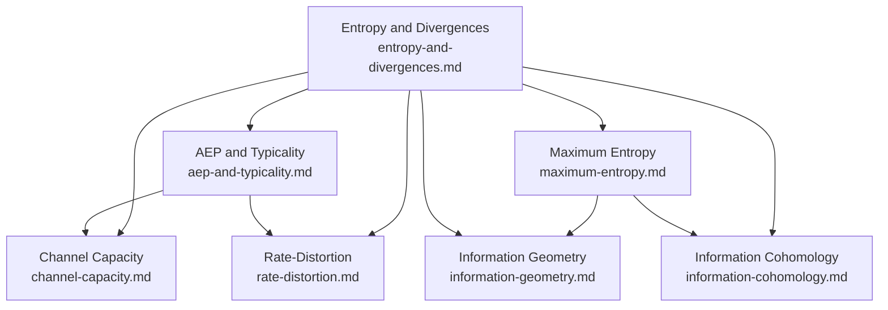

# Information Theory: Overview

This file is the index for the `concepts/information-theory/` folder. It lists planned and written subtopic notes, organizes them by theme, and collects the canonical references for the field. Use it to decide what to write next without needing to re-survey the landscape.

---

## Notes in This Folder

| File | Status | Topic |
|------|--------|-------|
| `entropy-and-divergences.md` | 🔲 Planned | Entropy, KL divergence, f-divergences, mutual information, and core inequalities |
| `aep-and-typicality.md` | ✅ Written | Asymptotic equipartition property, typical sets, lossless source coding |
| `channel-capacity.md` | ✅ Written | Channel capacity, Fano's inequality, Shannon's noisy channel coding theorem |
| `rate-distortion.md` | ✅ Written | Rate-distortion function, Blahut–Arimoto algorithm, connection to learned quantization |
| `quantization.md` | ✅ Written | Scalar/vector quantization, Panter–Dite, product quantization, random rotation, JL lemma, TurboQuant |
| `maximum-entropy.md` | 🔲 Planned | Jaynes' maximum-entropy principle, exponential families, statistical mechanics bridge |
| `information-geometry.md` | 🔲 Planned | Fisher–Rao metric, dual affine connections, α-connections, e/m-projections |
| `information-cohomology.md` | 🔲 Planned | Baudot–Bennequin construction, information structures as ringed sites, higher-order mutual information |

---

## Subtopic Map

### Classical Shannon Theory

| Subtopic | Key Idea | Primary Source |
|----------|----------|----------------|
| Entropy and divergences | H(X) as average surprise; KL as relative information; data-processing inequality | Shannon (1948); Cover & Thomas ch. 2–3 |
| AEP and typicality | Almost all long sequences are typical; typical set has probability → 1 and size ≈ 2^{nH} | Cover & Thomas ch. 3; Polyanskiy–Wu ch. 5 |
| Channel capacity | C = max_{p(x)} I(X;Y); operational meaning via coding theorem | Shannon (1948); Gallager (1968); Csiszár–Körner |
| Rate-distortion | R(D) = min_{p(x̂|x): E[d]≤D} I(X;X̂); connection to quantization | Berger (1971); Cover & Thomas ch. 10 |

### Maximum-Entropy Methods

| Subtopic | Key Idea | Primary Source |
|----------|----------|----------------|
| Jaynes' MaxEnt principle | Given moment constraints, choose the distribution maximising entropy | Jaynes (1957 I, II) |
| Exponential families | MaxEnt subject to linear constraints yields exponential families; natural parameters | Wainwright & Jordan (2008) |
| Variational inference | Mean-field, belief propagation, and the free-energy principle via dually-flat geometry | Wainwright & Jordan (2008) |

### Information Geometry

| Subtopic | Key Idea | Primary Source |
|----------|----------|----------------|
| Fisher–Rao metric | Unique (up to scale) Riemannian metric on statistical manifolds, invariant under sufficient statistics | Rao (1945); Chentsov (1982) |
| Dual connections | Statistical manifolds carry a pair of flat dual connections (e- and m-connections) | Amari & Nagaoka (2000) |
| α-connections | One-parameter family interpolating between e- and m-connections; α=±1 are dually flat | Amari (2016) |
| Divergences and projections | Bregman divergences generalise KL; e/m-projections are orthogonal in dual senses | Amari & Nagaoka (2000) ch. 3 |

### Information Cohomology

| Subtopic | Key Idea | Primary Source |
|----------|----------|----------------|
| Homological nature of entropy | Shannon entropy = unique 1-cocycle in H^1 of a simplicial probability space | Baudot & Bennequin (2015) |
| Information structures | Probability assignments form a presheaf; entropy is a natural transformation | Vigneaux (2017); Vigneaux thesis (2019) |
| Higher-order mutual information | I_k landscapes detect synergy/redundancy beyond pairwise mutual information | Baudot et al. (2019) |

### Applications to Compression and Quantization

| Subtopic | Key Idea | Primary Source |
|----------|----------|----------------|
| Learned compression | Rate-distortion theory grounds VAE and flow-based image codecs | Yang, Mandt & Theis (2023) |
| Vector quantization | Near-optimal VQ via random rotation + scalar quantisation; TurboQuant | Zandieh et al. (2025) |
| Axiomatic entropy diversity | Entropy as magnitude of enriched category; category-theoretic unification | Leinster (2021) |

---

## Dependency Graph

---

## Master References

| Reference | Authors | Year | What It Covers | Link |
|-----------|---------|------|----------------|------|
| [A Mathematical Theory of Communication](https://people.math.harvard.edu/~ctm/home/text/others/shannon/entropy/entropy.pdf) | Shannon | 1948 | Foundational: entropy, mutual information, source and channel coding theorems | [PDF](https://people.math.harvard.edu/~ctm/home/text/others/shannon/entropy/entropy.pdf) |
| [Information Theory and Statistical Mechanics I](https://bayes.wustl.edu/etj/articles/theory.1.pdf) | Jaynes | 1957 | MaxEnt as inference principle; statistical mechanics as information problem | [PDF](https://bayes.wustl.edu/etj/articles/theory.1.pdf) |
| [Information Theory and Statistical Mechanics II](https://link.aps.org/doi/10.1103/PhysRev.108.171) | Jaynes | 1957 | MaxEnt extended to quantum density matrices; canonical and grand canonical ensembles | [DOI](https://link.aps.org/doi/10.1103/PhysRev.108.171) |
| [Elements of Information Theory](https://onlinelibrary.wiley.com/doi/book/10.1002/047174882X) | Cover & Thomas | 2006 | Standard graduate textbook — entropy, AEP, channel capacity, rate-distortion | [Wiley](https://onlinelibrary.wiley.com/doi/book/10.1002/047174882X) |
| [Information Theory: From Coding to Learning](https://people.lids.mit.edu/yp/homepage/data/itbook-export.pdf) | Polyanskiy & Wu | 2025 | Modern graduate textbook; sharp analytical style; includes learning-theoretic connections | [PDF](https://people.lids.mit.edu/yp/homepage/data/itbook-export.pdf) |
| [Information Theory: Coding Theorems for Discrete Memoryless Systems](https://www.cambridge.org/core/books/information-theory/A441D8792B877693D6F91E8D61B53F42) | Csiszár & Körner | 2011 | Rigorous channel capacity and rate-distortion; method of types | [Cambridge](https://www.cambridge.org/core/books/information-theory/A441D8792B877693D6F91E8D61B53F42) |
| [Information Theory and Reliable Communication](https://www.rle.mit.edu/rgallager/books.htm) | Gallager | 1968 | Rigorous foundations; channel coding; error exponents | [MIT](https://www.rle.mit.edu/rgallager/books.htm) |
| [Rate Distortion Theory](https://archive.org/details/ratedistortionth0000berg) | Berger | 1971 | Classic monograph on the rate-distortion theorem; Blahut–Arimoto algorithm | [Archive.org](https://archive.org/details/ratedistortionth0000berg) |
| [Methods of Information Geometry](https://bookstore.ams.org/mmono-191) | Amari & Nagaoka | 2000 | Definitive reference: dual connections, Fisher–Rao metric, exponential/mixture geodesics | [AMS](https://bookstore.ams.org/mmono-191) |
| [Information Geometry and Its Applications](https://link.springer.com/book/10.1007/978-4-431-55978-8) | Amari | 2016 | Self-contained introduction from divergences; applications to statistics and neural networks | [Springer](https://link.springer.com/book/10.1007/978-4-431-55978-8) |
| [An Elementary Introduction to Information Geometry](https://arxiv.org/abs/1808.08271) | Nielsen | 2020 | Accessible 56-page survey of information manifolds and dual connections | [arXiv](https://arxiv.org/abs/1808.08271) |
| [Statistical Decision Rules and Optimal Inference](https://bookstore.ams.org/mmono-53) | Chentsov | 1982 | Uniqueness of the Fisher metric under Markov morphisms (Chentsov–Campbell theorem) | [AMS](https://bookstore.ams.org/mmono-53) |
| [The Homological Nature of Entropy](https://www.mdpi.com/1099-4300/17/5/3253) | Baudot & Bennequin | 2015 | Shannon entropy as degree-1 cohomology class; topos-theoretic framework | [MDPI](https://www.mdpi.com/1099-4300/17/5/3253) |
| [Information Structures and Their Cohomology](https://arxiv.org/abs/1709.07807) | Vigneaux | 2017 | Information structures as ringed sites; Shannon and Tsallis as degree-1 cocycles | [arXiv](https://arxiv.org/abs/1709.07807) |
| [Topology of Statistical Systems (PhD thesis)](https://theses.hal.science/tel-02951504) | Vigneaux | 2019 | Full topos-theoretic treatment of information cohomology; discrete and quantum settings | [HAL](https://theses.hal.science/tel-02951504) |
| [Topological Information Data Analysis](https://www.mdpi.com/1099-4300/21/9/869) | Baudot et al. | 2019 | Computational I_k landscapes; higher-order mutual information applied to real data | [MDPI](https://www.mdpi.com/1099-4300/21/9/869) |
| [Graphical Models, Exponential Families, and Variational Inference](https://people.eecs.berkeley.edu/~jordan/papers/wainwright-jordan-fnt.pdf) | Wainwright & Jordan | 2008 | Unified variational framework for exponential families; dually-flat geometry and belief propagation | [PDF](https://people.eecs.berkeley.edu/~jordan/papers/wainwright-jordan-fnt.pdf) |
| [Entropy and Diversity: The Axiomatic Approach](https://www.cambridge.org/core/books/entropy-and-diversity/496CF94AEA7B33F15904BD4FC8CC2369) | Leinster | 2021 | Entropy from enriched category theory; axiomatic unification of diversity measures | [Cambridge](https://www.cambridge.org/core/books/entropy-and-diversity/496CF94AEA7B33F15904BD4FC8CC2369) |
| [An Introduction to Neural Data Compression](https://arxiv.org/abs/2202.06533) | Yang, Mandt & Theis | 2023 | Rate-distortion theory of learned compression; VAE codecs; diffusion compressors | [arXiv](https://arxiv.org/abs/2202.06533) |
| [TurboQuant: Online Vector Quantization with Near-optimal Distortion Rate](https://arxiv.org/abs/2504.19874) | Zandieh et al. | 2025 | Random-rotation VQ achieves near-optimal MSE; 6× KV-cache compression on H100 | [arXiv](https://arxiv.org/abs/2504.19874) |
| [MIT 6.441 Lecture Notes](https://ocw.mit.edu/courses/6-441-information-theory-spring-2016/pages/lecture-notes/) | Polyanskiy & Wu | 2016 | Concise rigorous lecture notes; precursor to the 2025 textbook | [OCW](https://ocw.mit.edu/courses/6-441-information-theory-spring-2016/pages/lecture-notes/) |
