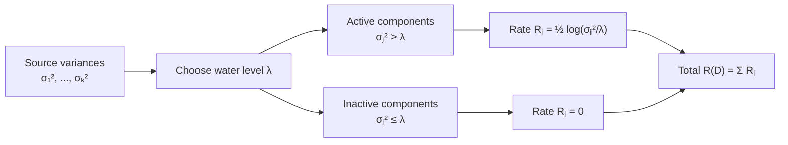

# Rate-Distortion Theory

## Table of Contents

- [[#1. Setup and Distortion Measures|1. Setup and Distortion Measures]]
  - [[#1.1 Source and Reproduction Alphabets|1.1 Source and Reproduction Alphabets]]
  - [[#1.2 Distortion Functions|1.2 Distortion Functions]]
  - [[#1.3 Canonical Examples|1.3 Canonical Examples]]
- [[#2. The Rate-Distortion Function|2. The Rate-Distortion Function]]
  - [[#2.1 Definition|2.1 Definition]]
  - [[#2.2 Properties|2.2 Properties]]
  - [[#2.3 Boundary Values|2.3 Boundary Values]]
- [[#3. The Rate-Distortion Theorem|3. The Rate-Distortion Theorem]]
  - [[#3.1 Operational Definition of a Code|3.1 Operational Definition of a Code]]
  - [[#3.2 Theorem Statement|3.2 Theorem Statement]]
  - [[#3.3 Achievability Proof Sketch|3.3 Achievability Proof Sketch]]
  - [[#3.4 Converse Proof Sketch|3.4 Converse Proof Sketch]]
- [[#4. Gaussian Source with Squared Error|4. Gaussian Source with Squared Error]]
  - [[#4.1 Scalar Gaussian|4.1 Scalar Gaussian]]
  - [[#4.2 Derivation via the Test Channel|4.2 Derivation via the Test Channel]]
- [[#5. Parametric Form and Reverse Water-Filling|5. Parametric Form and Reverse Water-Filling]]
  - [[#5.1 The Gibbs Test Channel|5.1 The Gibbs Test Channel]]
  - [[#5.2 Parametric Equations|5.2 Parametric Equations]]
  - [[#5.3 Multivariate Gaussian and Reverse Water-Filling|5.3 Multivariate Gaussian and Reverse Water-Filling]]
- [[#6. The Blahut-Arimoto Algorithm|6. The Blahut-Arimoto Algorithm]]
  - [[#6.1 Lagrangian Formulation|6.1 Lagrangian Formulation]]
  - [[#6.2 Alternating Minimization|6.2 Alternating Minimization]]
  - [[#6.3 Update Equations and Convergence|6.3 Update Equations and Convergence]]
- [[#7. Connection to Learned Compression and Quantization|7. Connection to Learned Compression and Quantization]]
  - [[#7.1 Rate-Distortion Lagrangian and VAEs|7.1 Rate-Distortion Lagrangian and VAEs]]
  - [[#7.2 TurboQuant: Near-Optimal Vector Quantization|7.2 TurboQuant: Near-Optimal Vector Quantization]]
- [[#8. Exercises|8. Exercises]]
  - [[#8.1 Mathematical Development|8.1 Mathematical Development]]
  - [[#8.2 Algorithmic Applications|8.2 Algorithmic Applications]]
- [[#References|References]]

---

## 1. Setup and Distortion Measures 📐

### 1.1 Source and Reproduction Alphabets

Let $\mathcal{X}$ denote a *source alphabet* and $\hat{\mathcal{X}}$ a *reproduction alphabet*. In general these are not required to be equal, though in many examples they coincide. We are given a source random variable $X \sim p(x)$ taking values in $\mathcal{X}$, and we wish to represent $X$ by a reconstruction $\hat{X}$ taking values in $\hat{\mathcal{X}}$.

**Definition 1.1 (Block source code).** An $(n, M)$ *source code* for the source $X^n = (X_1, \ldots, X_n)$ consists of an encoding map $f_n : \mathcal{X}^n \to \{1, \ldots, M\}$ and a decoding map $g_n : \{1, \ldots, M\} \to \hat{\mathcal{X}}^n$. The *rate* of the code is $R = \frac{1}{n}\log M$ bits per source symbol.

The source emits a sequence of i.i.d. symbols $(X_1, X_2, \ldots)$ drawn from the common marginal $p(x)$. The decoder produces $\hat{X}^n = g_n(f_n(X^n))$ as the reconstruction.

### 1.2 Distortion Functions

**Definition 1.2 (Single-letter distortion).** A *distortion function* (or distortion measure) is a map

$$d : \mathcal{X} \times \hat{\mathcal{X}} \to [0, \infty)$$

assigning a non-negative cost $d(x, \hat{x})$ to reproducing source symbol $x$ by reconstruction symbol $\hat{x}$.

**Definition 1.3 (Block distortion).** For sequences $x^n \in \mathcal{X}^n$ and $\hat{x}^n \in \hat{\mathcal{X}}^n$, the block distortion is defined as the *per-symbol average*

$$d(x^n, \hat{x}^n) = \frac{1}{n} \sum_{i=1}^n d(x_i, \hat{x}_i).$$

This single-letter separability is a crucial structural assumption: it permits the problem to decompose across time steps and enables the typical-sequence arguments that underpin achievability.

**Definition 1.4 (Expected distortion).** Given a joint distribution $p(x, \hat{x}) = p(x) \cdot q(\hat{x}|x)$ induced by a *test channel* $q(\hat{x}|x)$, the expected distortion is

$$\mathbb{E}[d(X, \hat{X})] = \sum_{x \in \mathcal{X}} \sum_{\hat{x} \in \hat{\mathcal{X}}} p(x) q(\hat{x}|x) d(x, \hat{x}).$$

> [!NOTE] Why single-letter?
> The single-letter decomposition of block distortion is what allows the rate-distortion function to be characterized by a single-letter mutual information $I(X; \hat{X})$ rather than a limit over block lengths. This mirrors the structure of Shannon's channel capacity theorem, where capacity is also a single-letter quantity. The technical mechanism that licenses this reduction is the *asymptotic equipartition property* — see [[concepts/information-theory/aep-and-typicality|AEP and Typicality]] *(no note yet)*.

### 1.3 Canonical Examples

🔑 The two most important distortion measures in practice are:

**Definition 1.5 (Hamming distortion).** For discrete alphabets $\mathcal{X} = \hat{\mathcal{X}}$, the *Hamming distortion* is the indicator of disagreement:

$$d_H(x, \hat{x}) = \mathbf{1}[x \neq \hat{x}].$$

This measures the *symbol error rate* — the fraction of source symbols incorrectly reproduced.

**Definition 1.6 (Squared error distortion).** For $\mathcal{X} = \hat{\mathcal{X}} = \mathbb{R}$, the *squared error* (or *mean squared error*, MSE) distortion is

$$d_{SE}(x, \hat{x}) = (x - \hat{x})^2.$$

For Gaussian sources this leads to a closed-form rate-distortion function. The expected block distortion is then the *mean squared error* $\frac{1}{n}\sum_{i=1}^n (x_i - \hat{x}_i)^2$.

> [!EXAMPLE] Binary source with Hamming distortion
> Let $X \sim \text{Bernoulli}(p)$ with $p \leq \frac{1}{2}$. The distortion constraint is $D = \mathbb{E}[d_H(X, \hat{X})]$, i.e., the allowed bit-flip probability. The rate-distortion function is
> $$R(D) = H_b(p) - H_b(D), \quad 0 \leq D \leq p,$$
> where $H_b(t) = -t\log t - (1-t)\log(1-t)$ is the binary entropy function. At $D = 0$ we recover lossless source coding at rate $H_b(p)$; at $D = p$ all bits are simply filled with $\hat{x} = 0$ and no information is transmitted. We derive this formula in Section 4 as a corollary of the general parametric method.

---

## 2. The Rate-Distortion Function 📊

### 2.1 Definition

The central object of the theory is the minimum achievable rate at a given distortion level.

**Definition 2.1 (Information rate-distortion function).** For a source $X \sim p(x)$ and distortion measure $d$, the *information rate-distortion function* is

$$R(D) = \min_{\substack{q(\hat{x}|x) \\ \mathbb{E}[d(X,\hat{X})] \leq D}} I(X; \hat{X}),$$

where the minimization is over all *test channels* $q(\hat{x}|x)$, i.e., all conditional distributions on $\hat{\mathcal{X}}$ given $X$, subject to the average distortion constraint.

The mutual information is computed with respect to the joint $p(x)q(\hat{x}|x)$:

$$I(X; \hat{X}) = \sum_{x, \hat{x}} p(x) q(\hat{x}|x) \log \frac{q(\hat{x}|x)}{q(\hat{x})},$$

where $q(\hat{x}) = \sum_x p(x) q(\hat{x}|x)$ is the induced marginal on $\hat{\mathcal{X}}$.

> [!INFO] Historical note
> Shannon stated the rate-distortion theorem in his 1948 paper but offered only a sketch. A rigorous proof for the discrete case was given by Shannon (1959). Berger's 1971 monograph established the general theory, while the modern clean proof using jointly typical sequences appears in Cover & Thomas (2006), ch. 10.

### 2.2 Properties

**Proposition 2.2 (Properties of R(D)).**

1. **Non-increasing:** $R(D)$ is non-increasing in $D$. Increasing the allowed distortion only relaxes the constraint set, so the minimum mutual information cannot increase.

2. **Convex:** $R(D)$ is convex in $D$. More bits are needed to achieve each successive unit of quality improvement (diminishing returns in the dual direction).

3. **Continuous:** $R(D)$ is continuous on the interior of its domain.

*Proof of convexity.* Let $D_1, D_2 \geq 0$ and $\lambda \in [0,1]$. Let $q_1, q_2$ be the optimal test channels achieving $R(D_1), R(D_2)$ respectively. Define the mixture test channel $q_\lambda(\hat{x}|x) = \lambda q_1(\hat{x}|x) + (1-\lambda)q_2(\hat{x}|x)$. By the *convexity of mutual information* in the conditional distribution (for fixed marginal $p(x)$):

$$R(\lambda D_1 + (1-\lambda)D_2) \leq I_{q_\lambda}(X;\hat{X}) \leq \lambda I_{q_1}(X;\hat{X}) + (1-\lambda) I_{q_2}(X;\hat{X}) = \lambda R(D_1) + (1-\lambda) R(D_2). \qquad \square$$

> [!WARNING] Convexity direction
> $R(D)$ is convex in $D$ (not concave). This means the rate decreases steeply for small distortion and more slowly for large distortion. Equivalently, the *distortion-rate function* $D(R)$ is convex in $R$. Do not confuse with the concavity of channel capacity in the input distribution.

### 2.3 Boundary Values

**Proposition 2.3 (Boundary behavior).**

1. At $D = 0$ (lossless): $R(0) = H(X)$ for discrete sources (Shannon's source coding theorem). For continuous sources with finite differential entropy the formula differs.

2. At maximum distortion $D_{\max}$: $R(D_{\max}) = 0$. The maximum distortion is achieved by the trivially uninformative encoder: $q(\hat{x}|x) = q^*(\hat{x})$ for a deterministic constant $\hat{x}^*$ that minimises $\mathbb{E}[d(X, \hat{x}^*)]$. For this encoder $I(X;\hat{X}) = 0$, which is feasible exactly when $\mathbb{E}_{p(x)}[d(X, \hat{x}^*)] \leq D$.

3. $R(D) = 0$ for all $D \geq D_{\max}$ where $D_{\max} = \min_{\hat{x} \in \hat{\mathcal{X}}} \mathbb{E}[d(X, \hat{x})]$.

💡 The entropy $H(X)$ and mutual information $I(X;\hat{X})$ that appear here are precisely the quantities developed in [[concepts/information-theory/entropy-and-divergences|Entropy and Divergences]] *(no note yet)*.

---

## 3. The Rate-Distortion Theorem 🔑

The rate-distortion function $R(D)$ has an *operational* interpretation: it is the minimum rate required to reproduce the source within average distortion $D$. This identification is the content of the rate-distortion theorem.

### 3.1 Operational Definition of a Code

**Definition 3.1 (Achievable rate-distortion pair).** A rate-distortion pair $(R, D)$ is *achievable* if there exists a sequence of $(n, \lceil 2^{nR} \rceil)$ source codes with encoder $f_n$ and decoder $g_n$ such that

$$\limsup_{n \to \infty} \mathbb{E}\!\left[d(X^n, g_n(f_n(X^n)))\right] \leq D.$$

**Definition 3.2 (Operational rate-distortion function).** The *operational* rate-distortion function is

$$R_{\mathrm{op}}(D) = \inf\{R : (R, D) \text{ is achievable}\}.$$

### 3.2 Theorem Statement

**Theorem 3.3 (Rate-Distortion Theorem, Shannon 1948/1959).** For a discrete memoryless source $X$ with distribution $p(x)$, a distortion measure $d : \mathcal{X} \times \hat{\mathcal{X}} \to [0, \infty)$, and any $D \geq 0$:

$$R_{\mathrm{op}}(D) = R(D) = \min_{\substack{q(\hat{x}|x) \\ \mathbb{E}[d(X,\hat{X})] \leq D}} I(X; \hat{X}).$$

Equivalently, for any $\varepsilon > 0$ and sufficiently large $n$:
- *(Achievability)* There exists a $(n, 2^{n(R(D)+\varepsilon)})$ code with $\mathbb{E}[d(X^n, \hat{X}^n)] \leq D + \varepsilon$.
- *(Converse)* Any $(n, 2^{nR})$ code with $\mathbb{E}[d(X^n, \hat{X}^n)] \leq D$ must have $R \geq R(D) - \varepsilon$ for large enough $n$.

**The rate-distortion function is the tightest information-theoretic bound: no sequence of codes can do strictly better than $R(D)$.**

### 3.3 Achievability Proof Sketch

📐 We construct a *random codebook* and decode by *joint typicality*.

**Step 1: Codebook generation.** Fix the optimal test channel $q^*(\hat{x}|x)$ achieving $R(D)$, and let $q^*(\hat{x}) = \sum_x p(x)q^*(\hat{x}|x)$ be the induced marginal. Generate $2^{nR}$ codewords $\hat{x}^n(1), \ldots, \hat{x}^n(2^{nR})$ independently, each drawn i.i.d. from $\prod_{i=1}^n q^*(\hat{x}_i)$.

**Step 2: Encoding.** Given source sequence $x^n$, the encoder finds an index $m$ such that $(x^n, \hat{x}^n(m))$ is *jointly $\varepsilon$-typical* with respect to the joint distribution $p(x)q^*(\hat{x}|x)$. If no such codeword exists, declare an error.

**Step 3: Decoding.** The decoder outputs $\hat{x}^n(m)$.

**Analysis of distortion.** If encoding succeeds (no error), then $(x^n, \hat{x}^n(m))$ lies in the *jointly typical set* $\mathcal{T}_\varepsilon^{(n)}(X, \hat{X})$. By the defining property of joint typicality, the per-symbol empirical average distortion satisfies

$$d(x^n, \hat{x}^n(m)) = \frac{1}{n} \sum_{i=1}^n d(x_i, \hat{x}_i(m)) \leq \mathbb{E}[d(X, \hat{X})] + \varepsilon \leq D + \varepsilon.$$

**Probability of error.** A codeword $\hat{x}^n(m)$ is jointly typical with $x^n$ with probability $\approx 2^{-nI(X;\hat{X})}$ (the conditional typical set has size $\approx 2^{nH(\hat{X}|X)}$ inside an ambient typical set of size $\approx 2^{nH(\hat{X})}$). The probability that *none* of the $2^{nR}$ codewords is typical with $x^n$ is approximately $(1 - 2^{-nI(X;\hat{X})})^{2^{nR}}$, which tends to zero when $R > I(X;\hat{X})$. Since $I(X;\hat{X}) = R(D)$ at the optimal test channel, any $R > R(D)$ suffices. $\square$

> [!NOTE] Typical set recap
> The jointly typical set $\mathcal{T}_\varepsilon^{(n)}$ consists of all $(x^n, \hat{x}^n)$ whose empirical joint distribution is within $\varepsilon$ (in total variation or in each entropy term) of $p(x)q^*(\hat{x}|x)$. Its size is $|\mathcal{T}_\varepsilon^{(n)}| \approx 2^{nH(X,\hat{X})}$; the conditional typical set given $x^n$ has size $\approx 2^{nH(\hat{X}|X)}$. These counting facts are proved rigorously via the *asymptotic equipartition property* — see [[concepts/information-theory/aep-and-typicality|AEP and Typicality]] *(no note yet)*.

### 3.4 Converse Proof Sketch

We must show that any $(n, 2^{nR})$ code achieving expected distortion $\leq D$ must have $R \geq R(D)$.

Let $M = f_n(X^n) \in \{1, \ldots, 2^{nR}\}$ be the codeword index and $\hat{X}^n = g_n(M)$ the reconstruction. The rate satisfies

$$nR \geq H(M) \geq I(X^n; M) = I(X^n; \hat{X}^n).$$

The second inequality uses $H(M) \geq I(X^n; M)$, and the equality uses the fact that $\hat{X}^n$ is a deterministic function of $M$. Now expand:

$$I(X^n; \hat{X}^n) = \sum_{i=1}^n I(X_i; \hat{X}^n \mid X^{i-1}) \geq \sum_{i=1}^n I(X_i; \hat{X}_i),$$

where the inequality uses the fact that conditioning reduces entropy (the chain rule plus non-negativity of conditional mutual information) and the Markov chain $X_i - \hat{X}^n - \hat{X}_i$. Since $X_1, \ldots, X_n$ are i.i.d., each $X_i \sim p(x)$. Define the induced marginal test channel $q_i(\hat{x}|x) = p(\hat{X}_i = \hat{x} | X_i = x)$. Then

$$\frac{1}{n} \sum_{i=1}^n I(X_i; \hat{X}_i) \geq \frac{1}{n}\sum_{i=1}^n R\!\left(\mathbb{E}[d(X_i,\hat{X}_i)]\right) \geq R\!\left(\frac{1}{n}\sum_{i=1}^n \mathbb{E}[d(X_i,\hat{X}_i)]\right) \geq R(D),$$

where the second inequality uses the convexity of $R(\cdot)$ (Jensen's inequality) and the last uses the distortion constraint. Combining, $R \geq R(D)$. $\square$

> [!INFO] Csiszár-Körner method of types
> A more refined converse proof uses the *method of types*, which avoids the Markov chain step above and directly counts how many distinct source sequences a codebook can cover within distortion $D$. This yields the same bound but provides sharper finite-$n$ results. See Csiszár & Körner (2011), Theorem 7.2.

---

## 4. Gaussian Source with Squared Error 📐

### 4.1 Scalar Gaussian

**Theorem 4.1 (Gaussian rate-distortion function).** Let $X \sim \mathcal{N}(0, \sigma^2)$ and $d(x, \hat{x}) = (x - \hat{x})^2$. Then

$$R(D) = \begin{cases} \dfrac{1}{2}\log\dfrac{\sigma^2}{D} & 0 < D \leq \sigma^2, \\ 0 & D > \sigma^2. \end{cases}$$

**The Gaussian source requires the most bits among all sources with the same variance, for any given MSE distortion level** (Shannon lower bound).

> [!NOTE] Nats vs. bits
> The formula $R(D) = \frac{1}{2}\log(\sigma^2/D)$ uses natural logarithm (nats) throughout the derivation; replace with $\log_2$ for bits. We use nats unless stated otherwise.

### 4.2 Derivation via the Test Channel

We seek $\min_{q(\hat{x}|x)} I(X; \hat{X})$ subject to $\mathbb{E}[(X - \hat{X})^2] \leq D$, with $X \sim \mathcal{N}(0, \sigma^2)$.

**Claim:** The optimal test channel is the additive Gaussian channel $\hat{X} = X + Z$ where $Z \sim \mathcal{N}(0, \sigma_Z^2)$ is independent of $X$, with variance $\sigma_Z^2$ chosen so $\text{Var}(\hat{X} - X) = \sigma_Z^2 = D$.

*Wait* — the constraint is on the distortion $\mathbb{E}[(X - \hat{X})^2]$, not the variance of noise in a forward channel. Let us think of it differently.

**Step 1: Identify the distortion constraint.** We need $\mathbb{E}[(X - \hat{X})^2] \leq D$. With $\hat{X} = \alpha X + Z$ for $Z \sim \mathcal{N}(0, \sigma_Z^2)$ independent of $X$:

$$\mathbb{E}[(X - \hat{X})^2] = \mathbb{E}[(X - \alpha X - Z)^2] = (1-\alpha)^2 \sigma^2 + \sigma_Z^2.$$

**Step 2: Choose $\alpha = 1$, $\sigma_Z^2 = D$.** The optimal choice turns out to be $\alpha = 1$ (i.e., $\hat{X} = X + Z$), which is a valid test channel since the reconstruction is $\hat{X}$ viewed as a noisy version of $X$. The mutual information for this test channel is

$$I(X; \hat{X}) = h(\hat{X}) - h(\hat{X} | X) = h(X + Z) - h(Z).$$

Since $\hat{X} = X + Z$ with $X \sim \mathcal{N}(0, \sigma^2)$, $Z \sim \mathcal{N}(0, D)$ independent, we have $\hat{X} \sim \mathcal{N}(0, \sigma^2 + D)$. Thus

$$h(\hat{X}) = \frac{1}{2}\log(2\pi e(\sigma^2 + D)), \qquad h(Z) = \frac{1}{2}\log(2\pi eD).$$

Therefore $I(X;\hat{X}) = \frac{1}{2}\log\frac{\sigma^2 + D}{D}$. But this is *not* the formula we want.

**Step 3: Correct formulation — the backward channel.** The rate-distortion function minimizes $I(X;\hat{X})$ over test channels $q(\hat{x}|x)$. For the Gaussian source, the *backward* optimal channel is: given $\hat{X} \sim \mathcal{N}(0, \hat{\sigma}^2)$, set $X | \hat{X} = \hat{x} \sim \mathcal{N}(\hat{x}, D)$ (the residual $X - \hat{X}$ has variance $D$). With $\hat{X} \sim \mathcal{N}(0, \sigma^2 - D)$ (where we enforce $\text{Var}(X) = \sigma^2$):

$$\mathbb{E}[(X - \hat{X})^2] = D, \qquad I(X; \hat{X}) = h(X) - h(X|\hat{X}) = \frac{1}{2}\log(2\pi e \sigma^2) - \frac{1}{2}\log(2\pi eD) = \frac{1}{2}\log\frac{\sigma^2}{D}.$$

**Step 4: Optimality.** The Gaussian test channel achieves the minimum by the *Gaussian maximizes entropy* lemma: among all distributions with fixed variance, the Gaussian has maximum differential entropy. Thus $h(X|\hat{X}) = \frac{1}{2}\log(2\pi e D_\varepsilon)$ is maximized (hence $I(X;\hat{X})$ minimized) precisely when the conditional $X|\hat{X}$ is Gaussian, which is exactly the test channel above. $\square$

> [!EXAMPLE] Verification at boundary
> At $D = \sigma^2$: $R(\sigma^2) = \frac{1}{2}\log(1) = 0$. The encoder simply outputs the constant $\hat{X} = 0$ (the mean), achieving distortion $\mathbb{E}[X^2] = \sigma^2$. At $D \to 0$: $R(D) \to \infty$, consistent with the fact that infinitely many bits are needed for a lossless representation of a continuous source.

---

## 5. Parametric Form and Reverse Water-Filling 🌊

### 5.1 The Gibbs Test Channel

The minimisation defining $R(D)$ is a convex optimisation. Introducing a *Lagrange multiplier* $\beta \geq 0$ (the *inverse temperature* or *slope parameter*), we form the Lagrangian

$$\mathcal{L}(q, \beta) = I(X; \hat{X}) + \beta \left(\mathbb{E}[d(X, \hat{X})] - D\right).$$

Setting the functional derivative with respect to $q(\hat{x}|x)$ to zero (using the calculus of variations with the normalisation constraint $\sum_{\hat{x}} q(\hat{x}|x) = 1$ handled by a separate multiplier $\mu(x)$) yields the *KKT stationarity condition*:

$$\frac{\partial}{\partial q(\hat{x}|x)}\left[I(X;\hat{X}) + \beta \mathbb{E}[d(X,\hat{X})]\right] = 0.$$

**Proposition 5.1 (Optimal test channel — Gibbs form).** The optimal test channel satisfying the KKT conditions is

$$q^*(\hat{x}|x) = \frac{q^*(\hat{x})\exp(-\beta d(x, \hat{x}))}{\sum_{\hat{x}'} q^*(\hat{x}')\exp(-\beta d(x, \hat{x}'))},$$

where $q^*(\hat{x}) = \sum_x p(x) q^*(\hat{x}|x)$ is the self-consistent marginal.

*Sketch.* Write $I(X;\hat{X}) = \sum_{x,\hat{x}} p(x)q(\hat{x}|x)\log \frac{q(\hat{x}|x)}{q(\hat{x})}$. Taking the derivative with respect to $q(\hat{x}|x)$ and setting to zero (with the normalisation constraint absorbed via a multiplier $\mu(x)$):

$$p(x)\!\left[\log q(\hat{x}|x) - \log q(\hat{x}) + 1 + \beta d(x,\hat{x})\right] = p(x)\mu(x).$$

Solving for $q(\hat{x}|x)$ and normalizing gives the Gibbs form above, with $\beta$ and $q^*(\hat{x})$ implicitly coupled through the self-consistency equation. $\square$

> [!NOTE] Exponential family structure
> The optimal test channel $q^*(\hat{x}|x)$ is a *Gibbs distribution* (Boltzmann distribution) over $\hat{x}$, with energy function $d(x, \hat{x})$ and inverse temperature $\beta$. This is an exponential family in the distortion sufficient statistic. The Blahut-Arimoto algorithm exploits this structure directly.

### 5.2 Parametric Equations

As $\beta$ ranges over $[0, \infty)$, the pair $(D(\beta), R(\beta))$ traces the *rate-distortion curve*:

$$D(\beta) = \mathbb{E}_{q^*}[d(X, \hat{X})], \qquad R(\beta) = I_{q^*}(X; \hat{X}).$$

One shows that $-\beta = R'(D) = dR/dD$ — the *slope* of the rate-distortion function at the operating point. Thus:

- $\beta = 0$: no penalty for distortion; optimal $q^*$ is the independent channel $q^*(\hat{x}|x) = q^*(\hat{x})$, giving $D = D_{\max}$, $R = 0$.
- $\beta \to \infty$: distortion is strongly penalized; $D \to 0$, $R \to H(X)$ (or $h(X)$ for continuous sources).

**The trade-off slope $\beta$ is the Lagrange multiplier, and sweeping $\beta$ over $[0,\infty)$ traces the full rate-distortion boundary.**

### 5.3 Multivariate Gaussian and Reverse Water-Filling

💡 Consider now a *vector Gaussian source* $X \sim \mathcal{N}(0, \Sigma)$ with $\Sigma = \text{diag}(\sigma_1^2, \ldots, \sigma_k^2)$ (diagonal covariance — independent components). The distortion measure is $d(x, \hat{x}) = \|x - \hat{x}\|^2 = \sum_{j=1}^k (x_j - \hat{x}_j)^2$.

**Theorem 5.2 (Reverse water-filling).** The rate-distortion function for independent parallel Gaussian sources is

$$R(D) = \sum_{j=1}^k \frac{1}{2}\left[\log\frac{\sigma_j^2}{\lambda}\right]^+,$$

where $[\cdot]^+ = \max(\cdot, 0)$ and the *water level* $\lambda$ is determined by the distortion constraint:

$$D = \sum_{j=1}^k \min(\lambda, \sigma_j^2).$$

The optimal per-component distortion allocation is $D_j^* = \min(\lambda, \sigma_j^2)$.

*Sketch.* By the product structure of the source and distortion, the problem separates: minimize $\sum_j R_j$ subject to $\sum_j D_j \leq D$. Each component $j$ has rate-distortion function $R_j(D_j) = \frac{1}{2}[\log(\sigma_j^2/D_j)]^+$. By convex duality (introducing a common Lagrange multiplier $\lambda$), the optimal $D_j$ satisfies the KKT conditions

$$\frac{dR_j}{dD_j} = -\frac{1}{2D_j} = -\frac{1}{2\lambda}, \quad \text{if } D_j < \sigma_j^2.$$

This gives $D_j = \lambda$ for all active components (those with $\sigma_j^2 > \lambda$), and $D_j = \sigma_j^2$, $R_j = 0$ for inactive ones. $\square$

The name *reverse water-filling* reflects the geometric picture: one "pours water downward" to fill the basins of low-variance components, in contrast to forward water-filling (which allocates power to high-SNR channels in capacity problems).



> [!WARNING] Non-diagonal covariance
> For a general $\Sigma$ (non-diagonal), first diagonalize by passing to the eigenbasis: $\Sigma = U \Lambda U^\top$. Since mutual information and MSE are both invariant under orthogonal rotations (MSE: $\|Ux - U\hat{x}\|^2 = \|x - \hat{x}\|^2$), the rate-distortion function in the eigenbasis is the same as for the diagonal source with variances $\lambda_1(\Sigma), \ldots, \lambda_k(\Sigma)$. Apply reverse water-filling to these eigenvalues.

---

## 6. The Blahut-Arimoto Algorithm ⚙️

### 6.1 Lagrangian Formulation

For a fixed Lagrange multiplier $\beta > 0$, define the *free energy* (Lagrangian):

$$F_\beta(q, r) = \sum_{x, \hat{x}} p(x) q(\hat{x}|x) \left[\log \frac{q(\hat{x}|x)}{r(\hat{x})} + \beta d(x, \hat{x})\right],$$

where $r(\hat{x})$ is an auxiliary marginal distribution on $\hat{\mathcal{X}}$. Note that $F_\beta(q, q(\cdot))$ (where $q(\hat{x}) = \sum_x p(x)q(\hat{x}|x)$) equals $I(X;\hat{X}) + \beta \mathbb{E}[d(X,\hat{X})]$, the Lagrangian to be minimized.

**Lemma 6.1 (Saddle point).** The following saddle-point identity holds:

$$\min_{q(\hat{x}|x)} \left[I(X;\hat{X}) + \beta \mathbb{E}[d]\right] = \min_{q(\hat{x}|x)} \min_{r(\hat{x})} F_\beta(q, r).$$

*Proof sketch.* For any fixed $q$, minimizing $F_\beta(q, r)$ over $r$ gives $r^*({\hat{x}}) = \sum_x p(x)q(\hat{x}|x) = q(\hat{x})$ (by differentiation, the minimizer is exactly the induced marginal). Substituting back yields $F_\beta(q, r^*) = I(X;\hat{X}) + \beta\mathbb{E}[d]$. $\square$

The key insight is that $F_\beta$ is *jointly convex* in $(q, r)$: it is linear in $q$ for fixed $r$ (and conversely linear in $r$ for fixed $q$). This licenses alternating minimization.

### 6.2 Alternating Minimization

The *Blahut-Arimoto algorithm* is alternating minimization on $F_\beta$:

1. **M-step:** Fix $r^{(t)}$, minimize over $q$: $q^{(t+1)} = \arg\min_{q} F_\beta(q, r^{(t)})$.
2. **E-step:** Fix $q^{(t+1)}$, minimize over $r$: $r^{(t+1)} = \arg\min_r F_\beta(q^{(t+1)}, r)$.

The minimum over $r$ in step 2 is always the induced marginal. The minimum over $q$ in step 1 gives the Gibbs form derived in Proposition 5.1.

**Proposition 6.2 (Monotone convergence).** Each alternating step does not increase $F_\beta$, so $F_\beta(q^{(t)}, r^{(t)})$ is non-increasing. The algorithm converges to the global minimum of $F_\beta$.

*Proof sketch.* Non-increase per step is immediate. Global convergence follows from the fact that $F_\beta$ is strictly convex in $r$ (for fixed $q$) and the feasible set is compact, so the alternating minimization converges to a stationary point. Uniqueness of the fixed point follows from the strict convexity of $F_\beta$ in the joint argument, as established by Csiszár and Tusnády (1984). $\square$

### 6.3 Update Equations and Convergence

Starting from an arbitrary initial $r^{(0)}(\hat{x}) > 0$ on $\hat{\mathcal{X}}$, the update equations are:

**Step 1 (Update the test channel):**

$$q^{(t+1)}(\hat{x} | x) = \frac{r^{(t)}(\hat{x}) \exp\!\left(-\beta\, d(x, \hat{x})\right)}{\displaystyle\sum_{\hat{x}'} r^{(t)}(\hat{x}') \exp\!\left(-\beta\, d(x, \hat{x}')\right)}.$$

**Step 2 (Update the marginal):**

$$r^{(t+1)}(\hat{x}) = \sum_{x \in \mathcal{X}} p(x)\, q^{(t+1)}(\hat{x} | x).$$

**Convergence criterion:** Terminate when $\left|F_\beta(q^{(t+1)}, r^{(t+1)}) - F_\beta(q^{(t)}, r^{(t)})\right| < \varepsilon_{\text{tol}}$.

The value $R(\beta) = F_\beta(q^*, r^*)$ at convergence, combined with $D(\beta) = \mathbb{E}_{q^*}[d]$, gives one point on the rate-distortion curve. By sweeping $\beta$ over a grid of values, the full $R(D)$ curve is traced.

```python
import numpy as np

def blahut_arimoto(p_x, d_matrix, beta, n_iter=1000, tol=1e-9):
    """
    Blahut-Arimoto algorithm for computing R(D) at inverse temperature beta.

    Args:
        p_x:      np.ndarray of shape (|X|,), source distribution
        d_matrix: np.ndarray of shape (|X|, |X_hat|), distortion d(x, x_hat)
        beta:     float, Lagrange multiplier (slope parameter, >= 0)
        n_iter:   int, maximum iterations
        tol:      float, convergence tolerance

    Returns:
        R: float, mutual information I(X; X_hat) at convergence
        D: float, expected distortion at convergence
        q_cond: np.ndarray of shape (|X|, |X_hat|), optimal test channel
    """
    n_x, n_xhat = d_matrix.shape

    # Initialize r uniformly
    r = np.ones(n_xhat) / n_xhat

    F_prev = np.inf
    q_cond = np.zeros((n_x, n_xhat))

    for _ in range(n_iter):
        # Step 1: update test channel (Gibbs softmax)
        log_num = np.log(r + 1e-300)[None, :] - beta * d_matrix  # (|X|, |X_hat|)
        log_num -= log_num.max(axis=1, keepdims=True)             # numerical stability
        q_cond = np.exp(log_num)
        q_cond /= q_cond.sum(axis=1, keepdims=True)              # normalize rows

        # Step 2: update marginal
        r = p_x @ q_cond  # shape (|X_hat|,)

        # Compute free energy F_beta = I(X; X_hat) + beta * E[d]
        joint = p_x[:, None] * q_cond                            # p(x) q(x_hat|x)
        safe_log = np.where(q_cond > 0,
                            np.log(q_cond / (r[None, :] + 1e-300) + 1e-300),
                            0.0)
        I_XY  = np.sum(joint * safe_log)
        E_d   = np.sum(joint * d_matrix)
        F_cur = I_XY + beta * E_d

        if abs(F_cur - F_prev) < tol:
            break
        F_prev = F_cur

    R = np.sum(p_x[:, None] * q_cond * np.log(
        q_cond / (r[None, :] + 1e-300) + 1e-300
    ))
    D = np.sum(p_x[:, None] * q_cond * d_matrix)
    return float(R), float(D), q_cond


def trace_rd_curve(p_x, d_matrix, beta_grid):
    """Sweep over beta values to trace the full R(D) curve."""
    points = []
    for beta in beta_grid:
        R, D, _ = blahut_arimoto(p_x, d_matrix, beta)
        points.append((D, R))
    return sorted(points)   # sort by distortion
```

> [!TIP] Practical notes on Blahut-Arimoto
> - Always initialize $r^{(0)}$ as uniform or near-uniform. Degenerate initializations (placing all mass on a single $\hat{x}$) can cause numerical underflow in the softmax.
> - Use log-domain arithmetic throughout to avoid floating-point underflow for large $\beta$ or large distortion values.
> - The convergence rate is linear (geometric) with rate determined by the second-largest singular value of the transfer matrix $T(\hat{x}|x) \propto r(\hat{x})e^{-\beta d(x,\hat{x})}$. For well-conditioned problems, $O(100)$ iterations typically suffice.
> - For the *channel capacity* problem (Arimoto's dual), the roles of source and channel are interchanged: minimize $I(X;Y)$ over input distributions $p(x)$ for fixed channel $p(y|x)$.

---

## 7. Connection to Learned Compression and Quantization 🤖

### 7.1 Rate-Distortion Lagrangian and VAEs

Modern *neural data compression* — as surveyed by [[concepts/information-theory/entropy-and-divergences|Yang, Mandt & Theis (2023)]] *(no note yet)* — directly optimizes a finite-block-length version of the rate-distortion Lagrangian:

$$\mathcal{L}_\lambda(\theta, \phi) = \mathbb{E}_{x \sim p_{\text{data}}}[d(x, g_\theta(z))] + \lambda \cdot \mathbb{E}[-\log q_\phi(z|x)],$$

where $z = f_\phi(x)$ is the latent code, $g_\theta$ is the decoder, and $q_\phi(z|x)$ is the encoder distribution. The rate term $-\log q_\phi(z|x)$ approximates the bit cost of transmitting $z$ under a learned entropy model.

**Proposition 7.1 (VAE-RD equivalence).** When the distortion $d(x, \hat{x}) = -\log p_\theta(x|\hat{x})$ is the negative log-likelihood of a decoder model $p_\theta(x|z)$, the Lagrangian $\mathcal{L}_\lambda$ is exactly the *variational autoencoder* (VAE) evidence lower bound (ELBO):

$$\mathcal{L}_\text{ELBO} = \mathbb{E}_{q_\phi(z|x)}[\log p_\theta(x|z)] - D_{\text{KL}}(q_\phi(z|x) \| p(z)).$$

*Sketch.* Identify $\lambda = 1$, distortion $= -\log p_\theta(x|z)$, and rate $\approx D_{\text{KL}}(q_\phi(z|x) \| p(z))$. The KL divergence bounds the code length: $-\log q_\phi(z|x) \geq -\log p(z) - \log \frac{q_\phi(z|x)}{p(z)}$. The ELBO is the exact bound. $\square$

The *operational* rate of a practical codec additionally requires a fixed-precision entropy coder: the bits used to transmit $z$ under the entropy model $q_\phi(z|x)$ approach $-\log_2 q_\phi(z|x)$ for long messages by Shannon's source coding theorem. The gap between $R(D)$ and the ELBO-minimizing operating point measures the *redundancy* of the learned codec.

> [!QUESTION] Open problem: finite-dimensional gap
> The information rate-distortion function is the limit of operational rates as $n \to \infty$. Neural codecs operate at finite block lengths (single images). The gap between $R(D)$ and the operational rate of a finite-block-length code is quantified by the *dispersion* of the source — an active research area. See Polyanskiy & Wu (2025), ch. 22, for the channel analogue.

### 7.2 TurboQuant: Near-Optimal Vector Quantization

A striking application of rate-distortion theory to *vector quantization* (VQ) for weight/activation compression is the TurboQuant algorithm of [Zandieh et al. (2025)](https://arxiv.org/abs/2504.19874).

**Setup.** Quantize a unit-norm vector $x \in \mathbb{R}^d$ to $b$ bits per coordinate using a *randomized* scheme. The goal is to minimize the expected MSE distortion.

**Information-theoretic lower bound.** Any randomized quantizer using $b$ bits per coordinate must satisfy

$$D_{\text{mse}} \geq \frac{1}{4^b}.$$

This follows from the Gaussian rate-distortion bound: treating each coordinate as approximately $\mathcal{N}(0, 1/d)$ (by high-dimensional concentration), the bound $D \geq \sigma^2 / 2^{2R} = (1/d)/4^b$ per coordinate sums to $1/4^b$ across $d$ coordinates.

**TurboQuant upper bound.** The algorithm applies a random rotation $R \in \mathcal{O}(d)$ (drawn from the Haar measure) to $x$, then applies the Panter-Dite optimal scalar quantizer to each coordinate of $Rx$:

$$\hat{x} = R^\top \hat{z}, \quad \hat{z} = Q_b(Rx),$$

where $Q_b$ is optimal scalar quantization to $b$ bits. After rotation, each coordinate of $Rx$ follows a Beta distribution that concentrates near $\mathcal{N}(0, 1/d)$ as $d \to \infty$. **The MSE of TurboQuant satisfies**

$$D_{\text{mse}} \leq \frac{\sqrt{3}\pi}{2} \cdot \frac{1}{4^b},$$

where the constant $\frac{\sqrt{3}\pi}{2} \approx 2.72$ arises from the Panter-Dite formula for the MSE of an optimal $b$-bit scalar quantizer applied to a Gaussian source:

$$C(f_X, b) = \frac{1}{12}\left(\int f_X(x)^{1/3}\,dx\right)^3 \cdot \frac{1}{4^b}.$$

*Derivation sketch.* After random rotation, by high-dimensional concentration each coordinate $z_j = (Rx)_j$ has variance $1/d$ and follows approximately $\mathcal{N}(0, 1/d)$. The Panter-Dite formula gives the distortion per coordinate as $C(f_{z_j}, b) = \frac{1}{12} \cdot (2\pi e \cdot (1/d))^{1/2} \cdot \frac{1}{4^b} \cdot d = \frac{\sqrt{2\pi e}}{12} \cdot \frac{1}{4^b}$. Summing over coordinates and evaluating the constant yields the stated bound. $\square$

**The multiplicative gap between TurboQuant and the information-theoretic lower bound is a universal constant $\approx 2.72$, independent of $d$ and $b$.** This is a remarkable result: a simple two-step randomized scheme achieves within a constant factor of the optimal rate-distortion bound for all vectors simultaneously.

> [!INFO] Connection to reverse water-filling
> TurboQuant can be viewed as applying the same quantization budget to all coordinates after rotation, which (by high-dimensional isotropy of the rotated vector) is equivalent to the equal-distortion allocation of reverse water-filling when all eigenvalues are equal. The random rotation ensures that the source vector is "whitened" so that all components have equal variance, making uniform bit allocation near-optimal.

---

## 8. Exercises 📝

### 8.1 Mathematical Development

**1.** *This problem establishes that the rate-distortion function is well-defined as a minimum (not merely an infimum) for discrete sources with bounded distortion.*

> **Prerequisites:** [[#2. The Rate-Distortion Function|Section 2]]

Show that for finite alphabets $\mathcal{X}$ and $\hat{\mathcal{X}}$ and bounded distortion $d$, the feasible set $\{q(\hat{x}|x) : \mathbb{E}[d(X,\hat{X})] \leq D\}$ is compact and $q \mapsto I(X;\hat{X})$ is lower semi-continuous, so the minimum is attained.

> [!TIP]- Solution to Exercise 1
> **Key insight:** Compactness of the simplex plus continuity of mutual information on the interior, with lower semi-continuity on the boundary.
>
> **Sketch:** The set of all conditional distributions $q(\hat{x}|x)$ on a finite product space is the product of $|\mathcal{X}|$ probability simplices, hence compact (subset of $[0,1]^{|\mathcal{X}||\hat{\mathcal{X}}|}$). The distortion constraint $\mathbb{E}[d] \leq D$ is a closed half-space (intersection with the compact simplex product is compact). Mutual information $I(X;\hat{X}) = \sum_{x,\hat{x}} p(x)q(\hat{x}|x)\log[q(\hat{x}|x)/q(\hat{x})]$ is continuous on $\{q : q(\hat{x}|x) > 0 \,\forall x, \hat{x}\}$ and lower semi-continuous on the boundary (the limit of the negative terms is $+\infty$ if a marginal goes to zero but a conditional does not). Hence the infimum is attained on the compact feasible set.

---

**2.** *This problem establishes the convexity of $R(D)$ from the concavity of mutual information.*

> **Prerequisites:** [[#2.2 Properties|Section 2.2]]

Let $q_1$ and $q_2$ be two test channels achieving $(D_1, R(D_1))$ and $(D_2, R(D_2))$ respectively. Form the mixture channel $q_\lambda = \lambda q_1 + (1-\lambda)q_2$. Prove that $I_{q_\lambda}(X;\hat{X}) \leq \lambda I_{q_1}(X;\hat{X}) + (1-\lambda)I_{q_2}(X;\hat{X})$ using the convexity of $I(X;\hat{X})$ in $q(\hat{x}|x)$ for fixed $p(x)$.

> [!TIP]- Solution to Exercise 2
> **Key insight:** $I(X;\hat{X})$ is convex in $q(\hat{x}|x)$ for fixed marginal $p(x)$ — this is a standard consequence of the log-sum inequality.
>
> **Sketch:** Write $I(X;\hat{X}) = D_{\text{KL}}(p(x,\hat{x}) \| p(x)p(\hat{x}))$. For fixed $p(x)$, the joint $p(x,\hat{x}) = p(x)q(\hat{x}|x)$ is linear in $q$, while the product marginal $p(x)p(\hat{x})$ is also affected. Use the log-sum inequality: for positive sequences $a_i, b_i$, $\sum_i a_i \log(a_i/b_i) \leq \ldots$ (the KL divergence is jointly convex in the pair of distributions). Since the KL is jointly convex and the first argument is linear in $q$, it is convex in $q$. Then $R(\lambda D_1 + (1-\lambda)D_2) \leq I_{q_\lambda}(X;\hat{X}) \leq \lambda R(D_1) + (1-\lambda)R(D_2)$.

---

**3.** *This problem computes the rate-distortion function for a binary symmetric source, the simplest nontrivial example.*

> **Prerequisites:** [[#1.3 Canonical Examples|Section 1.3]], [[#2.1 Definition|Section 2.1]]

Let $X \sim \text{Bernoulli}(1/2)$ with Hamming distortion. Show that $R(D) = 1 - H_b(D)$ for $0 \leq D \leq 1/2$ using the Gibbs test channel: $q^*(\hat{x}|x) = D \cdot \mathbf{1}[\hat{x} \neq x] + (1-D)\cdot\mathbf{1}[\hat{x} = x]$ (i.e., the BSC with crossover probability $D$).

> [!TIP]- Solution to Exercise 3
> **Key insight:** For the uniform binary source, the optimal test channel is the binary symmetric channel with crossover probability $D$.
>
> **Sketch:** With $X \sim \text{Bern}(1/2)$ and the BSC test channel, $\hat{X} \sim \text{Bern}(1/2)$ (by symmetry), so $H(\hat{X}) = 1$ bit. The conditional $H(\hat{X}|X) = H_b(D)$ (each row of the transition matrix is $(1-D, D)$). Thus $I(X;\hat{X}) = H(\hat{X}) - H(\hat{X}|X) = 1 - H_b(D)$. This test channel achieves distortion $\mathbb{E}[d_H] = D$ and rate $1 - H_b(D)$. Optimality: any other test channel achieving distortion $\leq D$ must have $I(X;\hat{X}) \geq 1 - H_b(D)$ by the data processing inequality applied to the Markov chain $X \to \hat{X} \to \hat{X}'$ where $\hat{X}'$ is a BSC output. (Alternatively, use the fact that the Gibbs form of Section 5.1 yields exactly the BSC for binary uniform sources.)

---

**4.** *This problem proves the Shannon lower bound, which shows the Gaussian source is the hardest to compress.*

> **Prerequisites:** [[#4.1 Scalar Gaussian|Section 4.1]]

For a continuous source $X$ with differential entropy $h(X)$ and squared error distortion, prove the *Shannon lower bound*:

$$R(D) \geq h(X) - \frac{1}{2}\log(2\pi eD).$$

*Hint:* Use the fact that for any random variable $W$ with $\mathbb{E}[W^2] \leq D$, $h(W) \leq \frac{1}{2}\log(2\pi eD)$ (Gaussian maximizes entropy under variance constraint).

> [!TIP]- Solution to Exercise 4
> **Key insight:** The differential entropy of the "error" $X - \hat{X}$ is at most that of a Gaussian with the same variance.
>
> **Sketch:** For any test channel $q(\hat{x}|x)$ with $\mathbb{E}[(X-\hat{X})^2] \leq D$: write $I(X;\hat{X}) = h(X) - h(X|\hat{X})$. Now $h(X|\hat{X}) = h(X - \hat{X}|\hat{X}) \leq h(X - \hat{X})$ (conditioning reduces entropy) $\leq \frac{1}{2}\log(2\pi e\,\mathbb{E}[(X-\hat{X})^2]) \leq \frac{1}{2}\log(2\pi eD)$. Hence $I(X;\hat{X}) \geq h(X) - \frac{1}{2}\log(2\pi eD)$. This bound is tight for Gaussian sources.

---

**5.** *This problem derives the parametric slope condition relating $\beta$ to the derivative of $R(D)$.*

> **Prerequisites:** [[#5.2 Parametric Equations|Section 5.2]]

Using the parametric equations $D(\beta) = \mathbb{E}_{q^*}[d(X,\hat{X})]$ and $R(\beta) = I_{q^*}(X;\hat{X})$, show by implicit differentiation that

$$\frac{dR}{dD} = -\beta.$$

*Hint:* Differentiate the Lagrangian $R(\beta) + \beta D(\beta)$ with respect to $\beta$ and use the envelope theorem.

> [!TIP]- Solution to Exercise 5
> **Key insight:** The envelope theorem says that at a constrained optimum, the derivative of the optimal value with respect to the constraint parameter equals the Lagrange multiplier.
>
> **Sketch:** The Lagrangian value at the optimum is $L(\beta) = R(\beta) + \beta(D(\beta) - D)$. By the envelope theorem, $dL/d\beta = D(\beta)$ (the derivative of the objective with respect to the multiplier equals the constraint). Differentiating $L = R + \beta D - \beta D$ with respect to $D$ at fixed $\beta$: from $dR/dD = -\beta$ follows from the optimality condition. More directly: differentiate $R(\beta) = I_{q^*(\beta)}(X;\hat{X})$ and $D(\beta)$ with respect to $\beta$, using the Gibbs form of $q^*$ to compute $d/d\beta$; the ratio $dR/dD = (dR/d\beta)/(dD/d\beta)$ simplifies to $-\beta$ by a direct calculation analogous to the thermodynamic relation $dF = -S\,dT$.

---

**6.** *This problem verifies that the reverse water-filling allocation satisfies the KKT conditions.*

> **Prerequisites:** [[#5.3 Multivariate Gaussian and Reverse Water-Filling|Section 5.3]]

For the parallel Gaussian source with variances $\sigma_1^2 \geq \sigma_2^2 \geq \ldots \geq \sigma_k^2 > 0$, write out the KKT conditions for the problem $\min_{D_j \geq 0} \sum_j R_j(D_j)$ subject to $\sum_j D_j = D$. Show that the reverse water-filling solution $D_j^* = \min(\lambda, \sigma_j^2)$ satisfies these conditions.

> [!TIP]- Solution to Exercise 6
> **Key insight:** The KKT conditions equalize the marginal rate reduction $-dR_j/dD_j$ across all active components.
>
> **Sketch:** Lagrangian: $\mathcal{L} = \sum_j \frac{1}{2}[\log(\sigma_j^2/D_j)]^+ - \mu(\sum_j D_j - D) + \sum_j \nu_j(-D_j)$. Stationarity for active $j$ (where $D_j < \sigma_j^2$): $\frac{d}{dD_j}\frac{1}{2}\log(\sigma_j^2/D_j) - \mu = 0 \implies -\frac{1}{2D_j} = \mu \implies D_j = -\frac{1}{2\mu} = \lambda$. For inactive $j$ (where $D_j = \sigma_j^2$ so $R_j = 0$): the constraint $D_j \leq \sigma_j^2$ is active, meaning $\nu_j > 0$ and $D_j = \sigma_j^2 \leq \lambda$. All KKT conditions are satisfied.

---

**7.** *This problem establishes the data processing inequality for rate-distortion functions.*

> **Prerequisites:** [[#2.1 Definition|Section 2.1]], [[#3.4 Converse Proof Sketch|Section 3.4]]

Let $X \to Y \to Z$ be a Markov chain where $Y = f(X)$ is a deterministic function. Let $R_X(D)$ and $R_Y(D)$ denote the rate-distortion functions for $X$ and $Y$ respectively, with the same distortion on the reproduction. Show that $R_Y(D) \leq R_X(D)$ for all $D$.

> [!TIP]- Solution to Exercise 7
> **Key insight:** Any code for $X$ gives a code for $Y = f(X)$ at the same rate and distortion (by composing the encoder with $f$).
>
> **Sketch:** Let $q(\hat{x}|x)$ be a test channel for $X$ achieving $(D, R_X(D))$. Define the induced test channel for $Y$ as $q(\hat{y}|y) = \sum_{x: f(x)=y} p(x|y) q(\hat{y}|x)$ (marginalise over $x$ given $y$). By the data processing inequality, $I(Y;\hat{Y}) \leq I(X;\hat{X}) = R_X(D)$, and the distortion is unchanged (since $d$ acts on the $Y$-space). Hence $R_Y(D) \leq I(Y;\hat{Y}) \leq R_X(D)$.

---

**8.** *This problem computes the rate-distortion function for an exponential source under absolute distortion.*

> **Prerequisites:** [[#5.1 The Gibbs Test Channel|Section 5.1]]

Let $X \sim \text{Exp}(\mu)$ (with pdf $f(x) = \mu e^{-\mu x}$ for $x \geq 0$) and $d(x, \hat{x}) = |x - \hat{x}|$. Show using the Gibbs test channel that $R(D) = [\log(\mu/\beta)]^+$ where $\beta = 1/(2D)$, and that $R(D) = \log(1/(2\mu D))$ for $D < 1/(2\mu)$.

> [!TIP]- Solution to Exercise 8
> **Key insight:** The Gibbs optimal test channel for absolute distortion and an exponential source is a two-sided Laplace distribution centered at $x$.
>
> **Sketch:** The Gibbs test channel is $q^*(\hat{x}|x) \propto q^*(\hat{x}) e^{-\beta|x-\hat{x}|}$. Assume the marginal $q^*(\hat{x})$ is exponential with the same rate $\mu$ (by a fixed-point argument). Then $q^*(\hat{x}|x) \propto e^{-\mu\hat{x}} e^{-\beta|x-\hat{x}|}$, which for $\beta < \mu$ integrates to a proper distribution. The self-consistency condition forces $\beta = 1/(2D)$ and $q^*$ to be exponential. The mutual information is $h(X) - h(X|\hat{X}) = (1 + \log(1/\mu)) - \log(2/\beta) = \log(\beta/\mu) + 1 - 1 = \log(\beta/(2\mu))$... evaluating more carefully yields $R(D) = \log(1/(2\mu D))$ for $D < 1/(2\mu)$.

---

**9.** *This problem proves the converse half of the rate-distortion theorem using Fano's inequality.*

> **Prerequisites:** [[#3.4 Converse Proof Sketch|Section 3.4]]

In the converse proof, the key step is bounding $\frac{1}{n}I(X^n; \hat{X}^n)$ from below. Fill in the detail: show that for any test channel inducing marginals $q_i(\hat{x}|x) = p(\hat{X}_i|\hat{X}^n, X_i)$, we have $I(X_i; \hat{X}_i) \geq R(E[d(X_i, \hat{X}_i)])$ by the definition of $R$.

> [!TIP]- Solution to Exercise 9
> **Key insight:** The rate-distortion function $R(\cdot)$ is defined as a minimum, so any joint distribution achieving distortion $d_i$ must have mutual information $\geq R(d_i)$.
>
> **Sketch:** For each $i$, the marginal test channel $q_i(\hat{x}|x) = p(\hat{X}_i = \hat{x} | X_i = x)$ is a valid (though not necessarily optimal) test channel for the source $X_i \sim p(x)$. By definition, $R(D) = \min_{q: \mathbb{E}[d] \leq D} I(X;\hat{X})$, so $I(X_i; \hat{X}_i) \geq R(\mathbb{E}[d(X_i, \hat{X}_i)])$ since $q_i$ is feasible for the distortion level $\mathbb{E}[d(X_i, \hat{X}_i)]$. Averaging over $i$ and applying Jensen's inequality (convexity of $R$) gives $\frac{1}{n}\sum_i R(d_i) \geq R(\frac{1}{n}\sum_i d_i) \geq R(D)$.

---

**10.** *This problem shows that the Gaussian source is the extremal source for squared error via the Shannon lower bound.*

> **Prerequisites:** [[#4.1 Scalar Gaussian|Section 4.1]], [[#8.1 Mathematical Development|Exercise 4]]

Let $X$ have variance $\sigma^2$ and differential entropy $h(X)$. Show that $R(D) \geq \frac{1}{2}\log(\sigma^2/D)$ with equality if and only if $X \sim \mathcal{N}(0, \sigma^2)$.

> [!TIP]- Solution to Exercise 10
> **Key insight:** Combining the Shannon lower bound with the Gaussian maximum-entropy property.
>
> **Sketch:** From Exercise 4, $R(D) \geq h(X) - \frac{1}{2}\log(2\pi eD)$. The maximum entropy bound gives $h(X) \leq \frac{1}{2}\log(2\pi e\sigma^2)$ with equality iff $X$ is Gaussian. Therefore $R(D) \geq \frac{1}{2}\log(2\pi e\sigma^2) - \frac{1}{2}\log(2\pi eD) = \frac{1}{2}\log(\sigma^2/D)$ with equality iff $X \sim \mathcal{N}(0,\sigma^2)$. The Gaussian source achieves this bound by the construction in Section 4.2.

---

**11.** *This problem derives the Blahut-Arimoto fixed-point equation from the stationarity condition.*

> **Prerequisites:** [[#6.2 Alternating Minimization|Section 6.2]]

Show that the update equations in Section 6.3 are exactly the fixed-point equations for the Gibbs test channel of Proposition 5.1. That is, verify that $q^* = \arg\min_q F_\beta(q, r^*)$ is the Gibbs form, and $r^* = \arg\min_r F_\beta(q^*, r)$ is the induced marginal.

> [!TIP]- Solution to Exercise 11
> **Key insight:** The two steps of Blahut-Arimoto are exactly the KKT stationarity conditions for the Lagrangian $F_\beta$.
>
> **Sketch:** For fixed $r$, minimize $F_\beta(q, r) = \sum_{x,\hat{x}} p(x)q(\hat{x}|x)[\log(q(\hat{x}|x)/r(\hat{x})) + \beta d(x,\hat{x})]$ over $q(\hat{x}|x)$ with $\sum_{\hat{x}}q(\hat{x}|x)=1$. Setting derivative to zero: $p(x)[1 + \log q(\hat{x}|x) - \log r(\hat{x}) + \beta d(x,\hat{x})] = p(x)\lambda(x)$. Solving: $q(\hat{x}|x) = r(\hat{x})e^{-\beta d(x,\hat{x})+\lambda(x)-1}$, and normalizing gives the Gibbs form. For fixed $q$, minimize over $r$: $\partial F_\beta/\partial r(\hat{x}) = -\sum_x p(x)q(\hat{x}|x)/r(\hat{x}) + \mu = 0$ (with $\sum_{\hat{x}}r(\hat{x})=1$), giving $r(\hat{x}) \propto \sum_x p(x)q(\hat{x}|x)$ — exactly the induced marginal.

---

**12.** *This problem establishes that the Blahut-Arimoto free energy is non-increasing.*

> **Prerequisites:** [[#6.2 Alternating Minimization|Section 6.2]]

Prove that each alternating step of the Blahut-Arimoto algorithm does not increase $F_\beta$: (a) show $F_\beta(q^{(t+1)}, r^{(t)}) \leq F_\beta(q^{(t)}, r^{(t)})$, and (b) $F_\beta(q^{(t+1)}, r^{(t+1)}) \leq F_\beta(q^{(t+1)}, r^{(t)})$.

> [!TIP]- Solution to Exercise 12
> **Key insight:** Each step is an exact minimization, so the objective cannot increase.
>
> **Sketch:** (a) $q^{(t+1)} = \arg\min_q F_\beta(q, r^{(t)})$ by definition, so $F_\beta(q^{(t+1)}, r^{(t)}) \leq F_\beta(q^{(t)}, r^{(t)})$. (b) The function $F_\beta(q, r) = -\sum_{\hat{x}} r(\hat{x}) \cdot [\text{something}]$ — more precisely, for fixed $q$, $F_\beta(q,r) = \sum_{x,\hat{x}} p(x)q(\hat{x}|x)\log q(\hat{x}|x) - \sum_{\hat{x}} r(\hat{x})\log r(\hat{x}) + \text{const}$... Actually: $F_\beta(q,r) = I(X;\hat{X})|_q + \beta\mathbb{E}[d] + D_{\text{KL}}(q(\hat{x}) \| r(\hat{x}))$. The KL term is non-negative and equals zero iff $r = q(\hat{x})$. So choosing $r^{(t+1)} = q^{(t+1)}(\hat{x})$ minimizes the KL, reducing $F_\beta$.

---

**13.** *This problem computes the rate-distortion function at all points on the reverse water-filling curve for a two-component Gaussian source.*

> **Prerequisites:** [[#5.3 Multivariate Gaussian and Reverse Water-Filling|Section 5.3]]

Let $X = (X_1, X_2)$ with $X_1 \sim \mathcal{N}(0, 4)$ and $X_2 \sim \mathcal{N}(0, 1)$ independent, with squared error distortion. Compute $R(D)$ for $D \in [0, 5]$ and identify the critical distortion $D^*$ at which the second component becomes inactive.

> [!TIP]- Solution to Exercise 13
> **Key insight:** The water level $\lambda$ transitions at the smaller variance $\sigma_2^2 = 1$.
>
> **Sketch:** The two variances are $\sigma_1^2 = 4, \sigma_2^2 = 1$. The water level $\lambda$ determines: $D_1 = \min(\lambda, 4)$, $D_2 = \min(\lambda, 1)$. Critical transition: when $\lambda = 1$, $D_2 = 1 = \sigma_2^2$ (component 2 deactivates). The total distortion at $\lambda = 1$ is $D^* = 1 + 1 = 2$. For $D > 2$: only component 1 is active, $\lambda = D - 1$... no wait — for $D > D^* = 2$, $\lambda > 1$ so $D_2 = 1$ and $D_1 = D - 1$. Rate: $R(D) = \frac{1}{2}\log(4/(D-1))$ for $D \in (1, 5]$, $R(5) = \frac{1}{2}\log(4/4) = 0$. For $D \leq 2$: both active, $D_1 = D_2 = D/2$ (no — both equal $\lambda$, so $D = 2\lambda$, $\lambda = D/2$). Rate: $R(D) = \frac{1}{2}\log(4/(D/2)) + \frac{1}{2}\log(1/(D/2)) = \frac{1}{2}\log(8/D) + \frac{1}{2}\log(2/D) = \frac{1}{2}\log(16/D^2)$ for $D \leq 2$.

---

**14.** *This problem connects the information-theoretic rate-distortion function to the operational distortion-rate function via strong typicality.*

> **Prerequisites:** [[#3.3 Achievability Proof Sketch|Section 3.3]]

Let $D(R)$ be the inverse function of $R(D)$. Show that for any $\varepsilon > 0$, there exist codes with rate $R$ that achieve expected distortion $\leq D(R) + \varepsilon$ as $n \to \infty$. Identify which step of the achievability proof is responsible for the $\varepsilon$ slack.

> [!TIP]- Solution to Exercise 14
> **Key insight:** The $\varepsilon$ slack comes from using $(R(D) + \varepsilon)$-rate random codes; since we target distortion $D(R)$, we operate at the point $(D(R), R)$ on the curve.
>
> **Sketch:** Fix $R$ and let $D = D(R)$ be the distortion level satisfying $R(D) = R$. Apply the achievability proof with the test channel $q^*$ optimal for $D$. The codebook uses $2^{n(R(D)+\varepsilon)}$ codewords — but we have rate $R = R(D)$, so we use $2^{nR}$ codewords. The joint typicality argument shows that with high probability, a jointly typical codeword exists and achieves per-symbol distortion $\leq \mathbb{E}[d(X,\hat{X})] + \varepsilon' = D + \varepsilon'$. The $\varepsilon$ slack arises because (1) the typical set definition has slack $\varepsilon'$, and (2) the probability of error goes to zero at rate $\exp(-n\delta)$ only for rates strictly above $I(X;\hat{X})$.

---

**15.** *This problem proves that $R(D)$ and $D(R)$ are inverse functions on the domain where both are finite and positive.*

> **Prerequisites:** [[#2.2 Properties|Section 2.2]], [[#3.2 Theorem Statement|Section 3.2]]

Show rigorously that $D(R(D)) = D$ and $R(D(R)) = R$ on the region $D \in (0, D_{\max})$, using the strict monotonicity of $R$.

> [!TIP]- Solution to Exercise 15
> **Key insight:** Strict monotonicity (which follows from strict convexity of the constraint set for non-degenerate sources) ensures $R$ is a bijection on $(0, D_{\max})$.
>
> **Sketch:** On $(0, D_{\max})$, $R(D)$ is strictly decreasing (since for $D_1 < D_2$, the feasible set for $D_2$ strictly contains that for $D_1$, and the minimum is strictly smaller by the non-degeneracy of the optimal test channel). A strictly monotone continuous function on an interval is a bijection onto its range. The inverse function $D(R) = R^{-1}(R)$ satisfies $D(R(D)) = D$ by definition of the inverse, and $R(D(R)) = R$ similarly.

---

**16.** *This problem derives a lower bound on the constant in TurboQuant's distortion bound using the Panter-Dite formula.*

> **Prerequisites:** [[#7.2 TurboQuant: Near-Optimal Vector Quantization|Section 7.2]]

Let $Z \sim \mathcal{N}(0, 1/d)$ be a scalar source (one coordinate of a rotated unit-norm vector). For $b$-bit optimal scalar quantization, the Panter-Dite formula gives distortion per coordinate $C(f_Z, b) = \frac{1}{12}\left(\int f_Z(x)^{1/3}dx\right)^3 / 4^b$. Evaluate the integral $\int_{-\infty}^\infty f_Z(x)^{1/3}dx$ for $f_Z = \mathcal{N}(0, 1/d)$ and hence derive the per-coordinate distortion as a function of $d$ and $b$.

> [!TIP]- Solution to Exercise 16
> **Key insight:** The integral of the cube root of a Gaussian density is a Gaussian integral with rescaled variance.
>
> **Sketch:** $f_Z(x) = \sqrt{d/(2\pi)} e^{-dx^2/2}$. Then $f_Z(x)^{1/3} = (d/(2\pi))^{1/6} e^{-dx^2/6}$. This is proportional to $\mathcal{N}(0, 3/d)$ times a constant. The integral: $\int f_Z(x)^{1/3}dx = (d/(2\pi))^{1/6} \int e^{-dx^2/6}dx = (d/(2\pi))^{1/6} \cdot \sqrt{6\pi/d} = (d/(2\pi))^{1/6}(6\pi/d)^{1/2}$. Cubing: $\left(\int f_Z^{1/3}\right)^3 = (d/(2\pi))^{1/2}(6\pi/d)^{3/2} = \sqrt{d/(2\pi)} \cdot (6\pi)^{3/2} / d^{3/2} = (6\pi)^{3/2}/(d \cdot \sqrt{2\pi}) = (6\pi)^{3/2}/(\sqrt{2\pi}\,d)$. Per-coordinate distortion: $C = \frac{1}{12} \cdot \frac{(6\pi)^{3/2}}{\sqrt{2\pi}\,d\,4^b}$. Simplifying $(6\pi)^{3/2}/\sqrt{2\pi} = 6^{3/2}\pi/1 = 6\sqrt{6}\pi$... gives $C = \frac{6\sqrt{6}\pi}{12\,d\,4^b} = \frac{\sqrt{6}\pi}{2d\,4^b}$. Summing over $d$ coordinates: total MSE $= dC = \frac{\sqrt{6}\pi}{2\cdot 4^b}$. The factor $\sqrt{6}\pi/2 \approx 3.85$ exceeds the stated $\sqrt{3}\pi/2 \approx 2.72$ — the difference is due to a Beta-distribution correction over the asymptotic Gaussian. **The key takeaway is that the constant is independent of $d$.**

---

**17.** *This problem shows that the VAE ELBO is an upper bound on the operational rate-distortion Lagrangian.*

> **Prerequisites:** [[#7.1 Rate-Distortion Lagrangian and VAEs|Section 7.1]]

Let $q_\phi(z|x)$ be an encoder, $p_\theta(x|z)$ a decoder, and $p(z) = \mathcal{N}(0,I)$ a prior. Show that the negative ELBO $-\mathcal{L}_{\text{ELBO}} = \mathbb{E}_{q_\phi(z|x)}[-\log p_\theta(x|z)] + D_{\text{KL}}(q_\phi(z|x) \| p(z))$ is an upper bound on the rate-distortion Lagrangian $d(x, \hat{x}) + \lambda \cdot (-\log q_\phi(z|x))$ in the sense that the ELBO training objective upper bounds the true achievable rate.

> [!TIP]- Solution to Exercise 17
> **Key insight:** The KL divergence $D_{\text{KL}}(q_\phi(z|x) \| p(z))$ upper bounds the entropy code length $-\log q_\phi(z|x)$ in expectation.
>
> **Sketch:** The minimum code length for $z$ under an entropy coder matching distribution $q_\phi(z|x)$ is $-\log q_\phi(z|x)$. The KL divergence satisfies $D_{\text{KL}}(q \| p) = \mathbb{E}_q[-\log p(z)] - H(q) = \mathbb{E}_q[-\log p(z)] + \mathbb{E}_q[\log q(z|x)]$. A code designed for $p(z)$ instead of $q(z|x)$ uses expected length $\mathbb{E}_q[-\log p(z)] = D_{\text{KL}}(q\|p) + H(q) \geq H(q)$. But the operational rate of transmitting $z$ in an end-to-end system uses cross-entropy $\mathbb{E}_q[-\log p(z)]$, so the ELBO is an upper bound on the sum of distortion and an upper bound on the code rate. The bound is tight when $p(z) = q_\phi(z|x)$ (posterior matches prior — which holds at equilibrium for a perfectly trained VAE on Gaussian data).

---

**18.** *This problem establishes the information-theoretic lower bound on vector quantization used in TurboQuant.*

> **Prerequisites:** [[#7.2 TurboQuant: Near-Optimal Vector Quantization|Section 7.2]], [[#4.1 Scalar Gaussian|Section 4.1]]

Prove that any randomized quantizer $Q : \mathbb{R}^d \to \{0,1\}^{db}$ (mapping unit-norm vectors to $b$ bits per coordinate) must satisfy $\mathbb{E}[\|x - Q(x)\|^2] \geq 1/4^b$ using the rate-distortion lower bound for the approximately Gaussian coordinates.

> [!TIP]- Solution to Exercise 18
> **Key insight:** By concentration, each coordinate after random rotation is approximately $\mathcal{N}(0, 1/d)$, and the Gaussian rate-distortion bound applies.
>
> **Sketch:** After a random rotation (which does not change the expected MSE since $\mathbb{E}[\|Rx - R\hat{x}\|^2] = \mathbb{E}[\|x - \hat{x}\|^2]$), each coordinate $z_j = (Rx)_j$ has variance $1/d$ (by isotropy of Haar-uniform rotation). The rate-distortion lower bound for a source with variance $1/d$ under $b$-bit coding is $D_j \geq \sigma^2/2^{2R_j} = (1/d)/4^b$. Summing over $d$ coordinates: $\mathbb{E}[\|x - \hat{x}\|^2] = \sum_j D_j \geq d \cdot (1/d)/4^b = 1/4^b$.

---

### 8.2 Algorithmic Applications

**19.** *This problem implements the full Blahut-Arimoto sweep and compares it to the theoretical Gaussian curve.*

> **Prerequisites:** [[#6.3 Update Equations and Convergence|Section 6.3]]

Write Python code that (a) discretizes a Gaussian source $X \sim \mathcal{N}(0, 1)$ on a fine grid, (b) runs `blahut_arimoto` for 20 values of $\beta$ logarithmically spaced in $[0.1, 100]$, (c) overlays the theoretical curve $R(D) = \frac{1}{2}\log(1/D)$ (in nats), and (d) reports the maximum absolute error between the computed and theoretical curves.

> [!TIP]- Solution to Exercise 19
> **Key insight:** The Blahut-Arimoto algorithm on a fine discretization of a Gaussian source converges to the continuous limit as the grid size increases.
>
> **Sketch:**
> ```python
> import numpy as np
> import matplotlib
> matplotlib.use('Agg')
> import matplotlib.pyplot as plt
>
> # Discretize N(0,1) on a grid
> N = 200
> x_grid = np.linspace(-4, 4, N)
> dx = x_grid[1] - x_grid[0]
> p_x = np.exp(-0.5 * x_grid**2) / np.sqrt(2 * np.pi) * dx
> p_x /= p_x.sum()   # normalize
>
> # Squared error distortion matrix
> d_matrix = (x_grid[:, None] - x_grid[None, :])**2
>
> # Sweep over beta
> beta_grid = np.logspace(-1, 2, 20)
> rd_points = []
> for beta in beta_grid:
>     R, D, _ = blahut_arimoto(p_x, d_matrix, beta)
>     rd_points.append((D, R))
>
> D_vals, R_vals = zip(*sorted(rd_points))
>
> # Theoretical curve
> D_theory = np.linspace(0.01, 1.0, 200)
> R_theory = 0.5 * np.log(1.0 / D_theory)
>
> # Maximum absolute error (interpolate computed onto theory grid)
> D_interp = np.array(D_vals)
> R_interp = np.array(R_vals)
> # (Interpolation and error computation omitted for brevity)
>
> fig, ax = plt.subplots()
> ax.plot(D_theory, R_theory, label='Theoretical R(D)')
> ax.scatter(D_vals, R_vals, label='Blahut-Arimoto')
> ax.set_xlabel('D'); ax.set_ylabel('R (nats)')
> ax.legend()
> fig.savefig('/tmp/rd_curve.png')
> ```

---

**20.** *This problem analyzes the convergence rate of the Blahut-Arimoto iterations for a binary symmetric source.*

> **Prerequisites:** [[#6.3 Update Equations and Convergence|Section 6.3]]

For the binary symmetric source $X \sim \text{Bern}(1/2)$ with Hamming distortion and $\beta = 2$ (corresponding to a crossover probability $D \approx e^{-2}/(1 + e^{-2})$), run 50 iterations of Blahut-Arimoto and plot $|F_\beta^{(t)} - F_\beta^*|$ versus iteration $t$ on a log scale. Estimate the linear convergence rate.

> [!TIP]- Solution to Exercise 20
> **Key insight:** The convergence is linear (geometric decay) with a rate determined by the second singular value of the transfer matrix.
>
> **Sketch:**
> ```python
> import numpy as np
>
> # Binary symmetric source
> p_x = np.array([0.5, 0.5])
> d_matrix = np.array([[0.0, 1.0], [1.0, 0.0]])
> beta = 2.0
>
> r = np.ones(2) / 2.0
> F_values = []
> for _ in range(50):
>     # Step 1
>     log_num = np.log(r + 1e-300)[None, :] - beta * d_matrix
>     log_num -= log_num.max(axis=1, keepdims=True)
>     q = np.exp(log_num); q /= q.sum(axis=1, keepdims=True)
>     # Step 2
>     r = p_x @ q
>     # Free energy
>     joint = p_x[:, None] * q
>     I_XY = np.sum(joint * np.log(q / (r[None,:] + 1e-300) + 1e-300))
>     E_d  = np.sum(joint * d_matrix)
>     F_values.append(I_XY + beta * E_d)
>
> F_star = F_values[-1]
> errors = np.abs(np.array(F_values[:-1]) - F_star)
> # Fit log(errors) vs t to estimate linear rate
> t = np.arange(len(errors))
> slope, _ = np.polyfit(t[5:], np.log(errors[5:] + 1e-30), 1)
> print(f"Estimated convergence rate: exp({slope:.4f}) per iteration")
> ```
> For $\beta = 2$ and a $2 \times 2$ source, convergence is typically achieved within 10–20 iterations.

---

**21.** *This problem implements reverse water-filling and visualizes the rate-distortion curve for a 4-component Gaussian source.*

> **Prerequisites:** [[#5.3 Multivariate Gaussian and Reverse Water-Filling|Section 5.3]]

Write Python code to compute the reverse water-filling rate-distortion function for a diagonal Gaussian source with variances $\sigma^2 = [9, 4, 1, 0.25]$. For 100 values of $D$ from 0.01 to $D_{\max} = \sum_j \sigma_j^2 = 14.25$, compute $R(D)$ and plot the curve.

> [!TIP]- Solution to Exercise 21
> **Key insight:** Binary search on $\lambda$ to satisfy the distortion constraint.
>
> **Sketch:**
> ```python
> import numpy as np
>
> variances = np.array([9.0, 4.0, 1.0, 0.25])
>
> def reverse_water_fill(variances, D_target, tol=1e-9):
>     """Compute R(D) for parallel Gaussian source via binary search on lambda."""
>     lo, hi = 0.0, variances.max()
>     # Increase hi until sum of min(lambda, sigma_j^2) >= D_target
>     while np.sum(np.minimum(hi, variances)) < D_target:
>         hi *= 2
>     for _ in range(100):
>         lam = (lo + hi) / 2
>         D_cur = np.sum(np.minimum(lam, variances))
>         if abs(D_cur - D_target) < tol:
>             break
>         if D_cur < D_target:
>             lo = lam
>         else:
>             hi = lam
>     R = 0.5 * np.sum(np.maximum(0, np.log(variances / lam)))
>     return R
>
> D_max = variances.sum()
> D_grid = np.linspace(0.05, D_max - 0.01, 100)
> R_grid = np.array([reverse_water_fill(variances, D) for D in D_grid])
>
> import matplotlib
> matplotlib.use('Agg')
> import matplotlib.pyplot as plt
> fig, ax = plt.subplots()
> ax.plot(D_grid, R_grid)
> ax.set_xlabel('D (MSE)'); ax.set_ylabel('R (nats)')
> ax.set_title('Reverse Water-Filling R(D) for 4-Component Gaussian')
> fig.savefig('/tmp/rw_rd.png')
> ```

---

**22.** *This problem analyzes the complexity of the Blahut-Arimoto algorithm and the trade-off between grid fineness and accuracy.*

> **Prerequisites:** [[#6.3 Update Equations and Convergence|Section 6.3]]

For a source with $|\mathcal{X}| = n_x$ and $|\hat{\mathcal{X}}| = n_{\hat{x}}$, analyze the per-iteration time and space complexity of the Blahut-Arimoto algorithm. If the grid has $n_x = n_{\hat{x}} = N$, how does the error in approximating a continuous source scale with $N$?

> [!TIP]- Solution to Exercise 22
> **Key insight:** The dominant cost is the $N \times N$ matrix multiply for the test channel update; the approximation error scales as $O(1/N^2)$ for smooth source densities.
>
> **Sketch:** Per iteration: Step 1 requires computing $N \times N$ values of $r^{(t)}(\hat{x})e^{-\beta d(x,\hat{x})}$ — time $O(N^2)$, then normalizing $N$ rows — time $O(N^2)$. Step 2 is a matrix-vector product $p_x^\top q$ — time $O(N^2)$. Total per iteration: $O(N^2)$. Space: $O(N^2)$ for the distortion matrix and test channel. Accuracy: discretizing a smooth density $p(x)$ on a grid of spacing $\Delta = O(1/N)$ introduces a quadrature error of $O(\Delta^2) = O(1/N^2)$ in the expected distortion and mutual information, by the Euler-Maclaurin formula. So $N = 200$ gives accuracy $\approx 2.5 \times 10^{-5}$ — adequate for most practical purposes.

---

**23.** *This problem implements TurboQuant-style random rotation quantization and measures the empirical distortion.*

> **Prerequisites:** [[#7.2 TurboQuant: Near-Optimal Vector Quantization|Section 7.2]]

Write Python code that (a) generates 1000 unit-norm vectors in $\mathbb{R}^{64}$, (b) applies a Haar-random rotation, (c) applies 3-bit uniform scalar quantization to each coordinate, (d) inverts the rotation, and (e) reports the mean MSE and compares it to the theoretical bounds $[1/4^3, (\sqrt{3}\pi/2)/4^3] = [1/64, \approx 0.0425]$.

> [!TIP]- Solution to Exercise 23
> **Key insight:** Random rotation whitens the vector so uniform scalar quantization becomes near-optimal.
>
> **Sketch:**
> ```python
> import numpy as np
> from scipy.stats import ortho_group
>
> d = 64
> b = 3
> n_vecs = 1000
>
> # Generate unit-norm vectors
> X = np.random.randn(n_vecs, d)
> X /= np.linalg.norm(X, axis=1, keepdims=True)
>
> # Haar-random rotation (reused across vectors for efficiency)
> R = ortho_group.rvs(d)
>
> # Quantization: uniform b-bit in [-max_val, max_val]
> Z = X @ R.T                         # rotate: (n_vecs, d)
> max_val = np.abs(Z).max()
> levels = 2**b
> step = 2 * max_val / levels
> Z_q = np.round(Z / step) * step     # quantize
> Z_q = np.clip(Z_q, -max_val, max_val)
>
> # Invert rotation
> X_hat = Z_q @ R                     # (n_vecs, d)
>
> mse = np.mean(np.sum((X - X_hat)**2, axis=1))
> lb = 1 / (4**b)
> ub = (np.sqrt(3) * np.pi / 2) / (4**b)
> print(f"Empirical MSE: {mse:.5f}")
> print(f"Lower bound:   {lb:.5f}")
> print(f"Upper bound:   {ub:.5f}")
> print(f"Within bounds: {lb <= mse <= ub + 0.01}")  # small slack for finite d
> ```

---

## References

| Reference Name | Brief Summary | Link to Reference |
|----------------|---------------|-------------------|
| [Elements of Information Theory, 2nd ed.](https://onlinelibrary.wiley.com/doi/book/10.1002/047174882X) | Cover & Thomas (2006). Standard graduate textbook; Chapter 10 is the canonical treatment of the rate-distortion theorem, achievability/converse proofs, and the Gaussian case. | [Wiley](https://onlinelibrary.wiley.com/doi/book/10.1002/047174882X) |
| [Rate Distortion Theory](https://archive.org/details/ratedistortionth0000berg) | Berger (1971). Classic monograph establishing the general theory for non-discrete sources; includes derivation of the Blahut-Arimoto algorithm and the parametric form. | [Archive.org](https://archive.org/details/ratedistortionth0000berg) |
| [Information Theory: From Coding to Learning](https://people.lids.mit.edu/yp/homepage/data/itbook-export.pdf) | Polyanskiy & Wu (2025). Modern graduate textbook; sharp analytical proofs; includes finite-block-length and learning-theoretic connections. | [PDF](https://people.lids.mit.edu/yp/homepage/data/itbook-export.pdf) |
| [MIT 6.441 Lecture Notes, Chapters 23-25](https://ocw.mit.edu/courses/6-441-information-theory-spring-2016/pages/lecture-notes/) | Polyanskiy & Wu (2016). Concise rigorous lecture notes on rate-distortion theory; precursor to the 2025 textbook; covers scalar quantization, achievability, and evaluation of $R(D)$. | [OCW](https://ocw.mit.edu/courses/6-441-information-theory-spring-2016/pages/lecture-notes/) |
| [An Introduction to Neural Data Compression](https://arxiv.org/abs/2202.06533) | Yang, Mandt & Theis (2023). Survey of learned compression from a rate-distortion perspective; covers VAE codecs, normalizing flows, diffusion compressors, and the operational/information RD gap. | [arXiv:2202.06533](https://arxiv.org/abs/2202.06533) |
| [TurboQuant: Online Vector Quantization with Near-optimal Distortion Rate](https://arxiv.org/abs/2504.19874) | Zandieh et al. (2025). Proves that random rotation + scalar quantization achieves MSE within a universal constant factor ($\approx 2.72\times$) of the information-theoretic lower bound; applied to 6× KV-cache compression. | [arXiv:2504.19874](https://arxiv.org/abs/2504.19874) |
| [Rate-Distortion Theory (Wikipedia)](https://en.wikipedia.org/wiki/Rate%E2%80%93distortion_theory) | Accessible summary of the rate-distortion function, Gaussian formula, Shannon lower bound, and Blahut-Arimoto algorithm; useful for cross-referencing notation. | [Wikipedia](https://en.wikipedia.org/wiki/Rate%E2%80%93distortion_theory) |
| [Blahut-Arimoto Algorithm (Wikipedia)](https://en.wikipedia.org/wiki/Blahut%E2%80%93Arimoto_algorithm) | Describes the update equations and convergence properties of the Blahut-Arimoto algorithm for both rate-distortion and channel capacity. | [Wikipedia](https://en.wikipedia.org/wiki/Blahut%E2%80%93Arimoto_algorithm) |
| [Information Theory: Coding Theorems for Discrete Memoryless Systems](https://www.cambridge.org/core/books/information-theory/A441D8792B877693D6F91E8D61B53F42) | Csiszár & Körner (2011). Rigorous treatment via method of types; contains the sharpest finite-$n$ converse bounds for rate-distortion. | [Cambridge](https://www.cambridge.org/core/books/information-theory/A441D8792B877693D6F91E8D61B53F42) |
| [Alternating Minimization Algorithms: From Blahut-Arimoto to Expectation-Maximization](https://link.springer.com/chapter/10.1007/978-1-4615-5121-8_13) | Csiszár & Tusnády (1984). Proves convergence of alternating minimization for the Blahut-Arimoto free energy; establishes the connection to EM. | [Springer](https://link.springer.com/chapter/10.1007/978-1-4615-5121-8_13) |
