# Mixture of Experts

A sparse conditional computation architecture that routes each input to a learned subset of specialist sub-networks, enabling massive parameter counts at sub-linear inference cost.

## Table of Contents

1. [[#1. Motivation and Background|Motivation and Background]]
   - [[#The Parameter-Efficiency Argument|The Parameter-Efficiency Argument]]
   - [[#Conditional Computation as a Principle|Conditional Computation as a Principle]]
   - [[#Historical Lineage|Historical Lineage]]
2. [[#2. The MoE Layer: Formal Definition|The MoE Layer: Formal Definition]]
   - [[#Notation|Notation]]
   - [[#Soft Gating|Soft Gating]]
   - [[#Hard Top-k Gating|Hard Top-k Gating]]
   - [[#Relation to Ensemble Methods|Relation to Ensemble Methods]]
3. [[#3. Sparsely-Gated MoE: Shazeer 2017|Sparsely-Gated MoE: Shazeer 2017]]
   - [[#Noisy Top-k Gating|Noisy Top-k Gating]]
   - [[#The Load Imbalance Problem|The Load Imbalance Problem]]
4. [[#4. Load Balancing|Load Balancing]]
   - [[#Importance Loss|Importance Loss]]
   - [[#Load Loss|Load Loss]]
   - [[#Capacity Factor and Token Dropping|Capacity Factor and Token Dropping]]
5. [[#5. Switch Transformer: Fedus 2021|Switch Transformer: Fedus 2021]]
   - [[#Top-1 Routing|Top-1 Routing]]
   - [[#Simplified Auxiliary Loss|Simplified Auxiliary Loss]]
   - [[#Scaling Behavior|Scaling Behavior]]
6. [[#6. Expert-Choice Routing|Expert-Choice Routing]]
   - [[#Inverting the Routing Decision|Inverting the Routing Decision]]
   - [[#Formal Specification|Formal Specification]]
   - [[#Guaranteed Load Balance|Guaranteed Load Balance]]
   - [[#Connection to Bipartite Matching|Connection to Bipartite Matching]]
7. [[#7. Mixtral and Modern Dense-Sparse Tradeoffs|Mixtral and Modern Dense-Sparse Tradeoffs]]
   - [[#Mixtral 8x7B Architecture|Mixtral 8x7B Architecture]]
   - [[#FLOP-Matched Comparisons|FLOP-Matched Comparisons]]
   - [[#Scaling Laws for MoE|Scaling Laws for MoE]]
8. [[#8. Training Dynamics and Collapse|Training Dynamics and Collapse]]
   - [[#Expert Collapse|Expert Collapse]]
   - [[#Router Z-Loss|Router Z-Loss]]
   - [[#Entropy Regularization|Entropy Regularization]]
   - [[#Initialization|Initialization]]
9. [[#9. Multi-Task Learning with MMoE|Multi-Task Learning with MMoE]]
   - [[#Multi-Task Problem Setup|Multi-Task Problem Setup]]
   - [[#Architecture Family|Architecture Family]]
   - [[#The MMoE Layer|The MMoE Layer]]
   - [[#Task-Relationship Modulation|Task-Relationship Modulation]]
   - [[#Gradient Flow and Trainability|Gradient Flow and Trainability]]
10. [[#References|References]]

---

## 1. Motivation and Background

### The Parameter-Efficiency Argument

The fundamental tension in deep learning is this: more parameters yield better model quality, but more parameters require more compute per forward pass. For dense networks, these two quantities are coupled — doubling parameter count roughly doubles both memory footprint and floating-point operations. *Mixture of Experts* breaks this coupling by making parameter activation conditional on the input.

Concretely, suppose a dense feed-forward network has $P$ parameters and costs $F$ FLOPs per token. A Mixture-of-Experts model might have $n \cdot P$ total parameters — one full set per expert — but activate only $k$ experts per token, incurring only $k \cdot F$ FLOPs. For $k \ll n$, the model stores $n$ times more knowledge but computes at a fraction of the cost of a dense model with the same parameter count.

**This is the parameter-efficiency argument: for a fixed inference compute budget, MoE models can achieve better quality than dense models because they can access vastly more parameters without paying the full FLOP cost.**

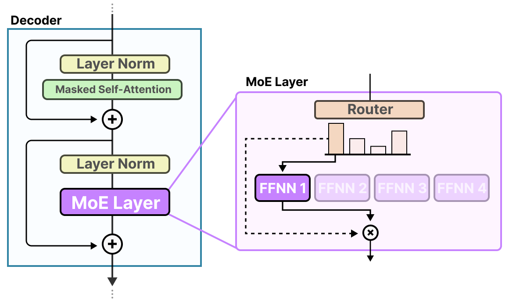
*Source: Grootendorst (2024), A Visual Guide to Mixture of Experts. The MoE layer embedded inside a Transformer block: a router examines each input token and dispatches it to a selected subset of expert FFNs; only those experts perform computation, and their outputs are aggregated to produce the layer's output.*

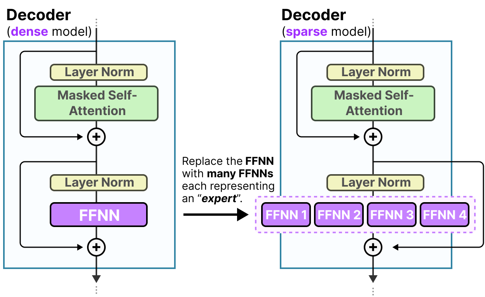
*Source: Grootendorst (2024), A Visual Guide to Mixture of Experts. A dense Transformer decoder block (left) uses a single FFNN sublayer; a sparse MoE decoder block (right) replaces it with multiple parallel expert FFNNs, only a subset of which are activated per token.*

### Conditional Computation as a Principle

The broader principle underlying MoE is *conditional computation*: the idea that not every part of a network should be activated for every input. Bengio et al. (2013) articulated this formally as a research agenda: the computational graph of a neural network need not be fully traversed for each example; different inputs should trigger different subgraphs. MoE instantiates this principle at the layer level, where the "subgraph" is a single expert's feed-forward network.

The key challenge is that conditional computation introduces a discrete *routing* decision — which experts to activate — and discrete decisions are not differentiable, breaking standard gradient-based training. The history of MoE is largely the history of working around this non-differentiability.

### Historical Lineage

The origins of MoE lie in classical statistical mixture models. The model-theoretic precedent is a mixture distribution $p(y \mid x) = \sum_i \pi_i(x) \, p_i(y \mid x)$, where $\pi_i(x)$ are input-dependent mixture weights. Jacobs et al. (1991) instantiated this as a supervised learning system, naming it "Adaptive Mixtures of Local Experts." In their formulation, a *gating network* computes weights over a small set of *expert* networks, each network specializing on a region of the input space.

This original MoE was soft — all experts are evaluated for every input, and outputs are a weighted sum. The key insight of Shazeer et al. (2017) was to make this hard and sparse: select only the top-$k$ experts by gate weight, set the rest to zero, and scale the system to thousands of experts within an LSTM language model. This required solving the *load balancing* problem — ensuring that routing does not trivially collapse to always selecting the same expert — which became the central research problem for all subsequent MoE work.

GShard (Lepikhin et al., 2021) integrated sparse MoE into Transformers and demonstrated scaling to 600B parameters across hundreds of TPU devices. Switch Transformers (Fedus et al., 2021) pushed to top-1 routing and trillion parameters. Expert-Choice routing (Zhou et al., 2022) inverted the selection direction. Mixtral (Jiang et al., 2024) demonstrated that carefully designed sparse MoE LLMs are competitive with or superior to dense models many times their active parameter count.

---

## 2. The MoE Layer: Formal Definition

### Notation

Let $E$ denote the number of experts, indexed $i \in \{1, \ldots, E\}$. Let $k \in \mathbb{Z}_{>0}$ with $k \leq E$ be the number of experts activated per token. Let $x \in \mathbb{R}^d$ be the input token representation. Each expert is a function $f_i : \mathbb{R}^d \to \mathbb{R}^d$ (in practice, a feed-forward network, typically the FFN sublayer of a Transformer block). Let $W_g \in \mathbb{R}^{d \times E}$ be the router weight matrix. We write $z(x) = W_g^\top x \in \mathbb{R}^E$ for the pre-softmax routing logits.

### Soft Gating

**Definition (Soft MoE Output).** The soft-gated MoE output for input $x$ is:

$$y = \sum_{i=1}^{E} g_i(x) \cdot f_i(x), \qquad g_i(x) = \operatorname{softmax}(z(x))_i = \frac{\exp(z_i(x))}{\sum_{j=1}^E \exp(z_j(x))}$$

In this formulation, $g_i(x) > 0$ for all $i$, so every expert is evaluated for every token. The output is a convex combination of all expert outputs, weighted by the softmax gate. This is the original Jacobs et al. (1991) formulation, made differentiable end-to-end. The gating network is trained jointly with the experts via backpropagation.

The soft formulation is fully differentiable: $\partial y / \partial \theta_{f_i} = g_i(x) \cdot \partial f_i(x) / \partial \theta_{f_i}$ and $\partial y / \partial W_g$ follows from the chain rule through the softmax. However, it provides no computational savings — all $E$ experts must be evaluated.

### Hard Top-k Gating

To obtain computational savings, we restrict to a sparse subset of experts. Introduce the masking operation:

$$\operatorname{KeepTopK}(v, k)_i = \begin{cases} v_i & \text{if } v_i \text{ is among the top-}k \text{ elements of } v \\ -\infty & \text{otherwise} \end{cases}$$

**Definition (Hard Top-k MoE Output).** The sparse top-$k$ gated MoE output is:

$$y = \sum_{i=1}^{E} g_i(x) \cdot f_i(x), \qquad g(x) = \operatorname{softmax}\!\left(\operatorname{KeepTopK}(z(x), k)\right)$$

Because $\operatorname{softmax}(-\infty) = 0$, only the $k$ experts with the highest logits receive non-zero gate weights, and the remaining $E - k$ experts are not evaluated. The gate weight for any selected expert $i$ is:

$$g_i(x) = \frac{\exp(z_i(x))}{\sum_{j \in \mathcal{T}(x)} \exp(z_j(x))}, \quad \mathcal{T}(x) = \{i : z_i(x) \text{ is a top-}k \text{ logit}\}$$

This concentrates the gate mass onto a selected subset, while the experts in $\mathcal{T}(x)$ form a proper probability simplex.

The top-$k$ selection is not differentiable: the set $\mathcal{T}(x)$ is a discrete function of $z(x)$, so gradients cannot flow through the selection boundary. In practice, training works by treating the selected set as given (stop-gradient on the selection) and backpropagating through the softmax weights and through the selected experts' outputs. *This is a valid but heuristic approximation to the true gradient.*

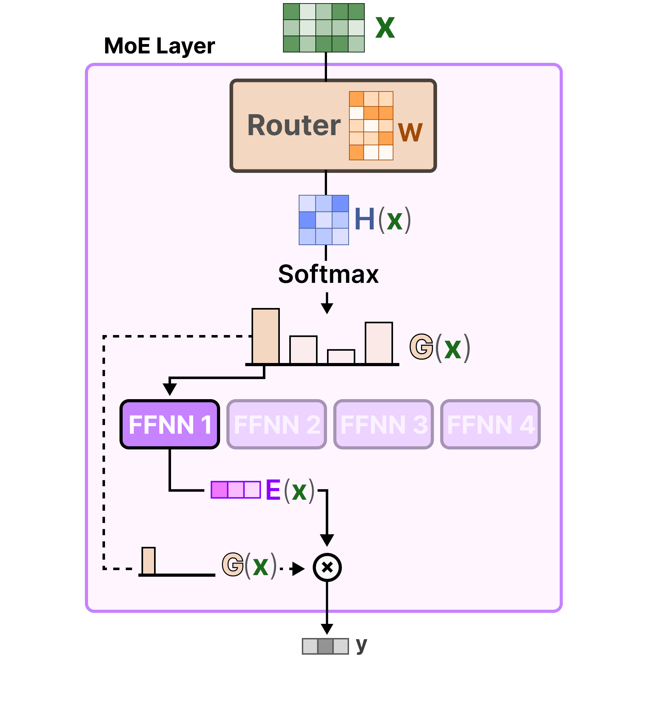
*Source: Grootendorst (2024), A Visual Guide to Mixture of Experts. The hard top-k gating computation: input $x$ is projected through the router weight matrix $W$ to produce logits $H(x)$; KeepTopK sets all but the top-$k$ entries to $-\infty$; Softmax over the surviving logits yields the sparse gate $G(x)$; only the selected expert's output $E(x)$ is computed and scaled by the gate weight to produce the final output $y$.*

### Relation to Ensemble Methods

The soft MoE output $y = \sum_i g_i(x) f_i(x)$ is formally a weighted ensemble, where the weights $g_i(x)$ depend on the input. This is a **mixture of experts** rather than a **committee** (equal weights) or a **boosting ensemble** (sequential, residual correction). The critical distinction from static ensembles is that the gating is input-conditional: the mixture weights $g_i(x)$ vary with $x$, implementing a learned partition (soft or hard) of the input space among specialists.

Unlike standard ensembles, however, MoE is trained jointly — gate and experts share a single training loss. This coupling means the gate network is learning to route tokens to the most appropriate expert, while experts simultaneously learn to specialize on the tokens they receive. This joint training dynamic can lead to stable specialization or to degenerate solutions (see Section 8).

---

## 3. Sparsely-Gated MoE: Shazeer 2017

Shazeer et al. (2017) operationalized the top-$k$ MoE idea at scale within an LSTM language model, demonstrating models with up to 137B parameters. The key technical contributions are *noisy top-k gating* and the first systematic treatment of the load imbalance problem.

### Noisy Top-k Gating

A naïve implementation of top-$k$ gating collapses: the same few experts receive all tokens because they were marginally better initialized, receive more gradient signal, improve further, and thus attract more tokens in a positive feedback loop. To break this symmetry, Shazeer et al. add token-wise Gaussian noise to the routing logits before the top-$k$ selection.

**Definition (Noisy Top-k Gating).** Let $W_n \in \mathbb{R}^{d \times E}$ be a learned noise scaling matrix, and let $\epsilon \sim \mathcal{N}(0, I_E)$ be a vector of standard normal random variables drawn independently for each token. Define the noisy logit:

$$H_i(x) = z_i(x) + \epsilon_i \cdot \operatorname{Softplus}\!\left((W_n^\top x)_i\right), \qquad \operatorname{Softplus}(u) = \log(1 + e^u)$$

The gate is then:

$$g(x) = \operatorname{softmax}\!\left(\operatorname{KeepTopK}(H(x), k)\right)$$

The noise magnitude $\operatorname{Softplus}((W_n^\top x)_i)$ is itself learned, making the exploration-exploitation tradeoff adaptive. The use of $\operatorname{Softplus}$ rather than $|\cdot|$ or $\operatorname{ReLU}$ ensures positive noise variance everywhere, which is needed for any non-selected expert to potentially be selected on the next step.

The noise serves two functions: (1) it stochastically promotes underutilized experts by occasionally routing tokens to them despite lower mean logits, and (2) its gradient through $W_n$ provides a signal to the noise scaling network based on how beneficial or detrimental the exploration was. This constitutes a form of RL-inspired exploration in the gating.

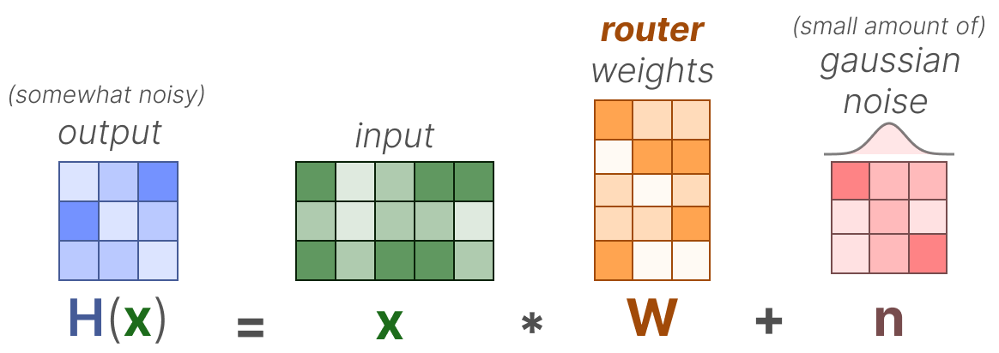
*Source: Grootendorst (2024), A Visual Guide to Mixture of Experts. The noisy top-k gating formula: the routing logit $H(x) = xW + n$ adds a small Gaussian noise term $n$ to the linear projection, introducing stochasticity that prevents routing collapse by occasionally promoting underutilized experts.*

**Remark (Inference).** At inference time, the noise term is set to zero: $H_i(x) = z_i(x)$. The gating is deterministic.

### The Load Imbalance Problem

Even with noise, the top-$k$ gating mechanism in a distributed training setup creates a structural load imbalance problem. In a data-parallel setup where each device processes a batch of tokens, each expert is typically assigned to a specific device. If routing concentrates too many tokens onto a single expert's device, that device becomes the bottleneck (stragglers in pipeline or tensor parallelism). Conversely, if some experts receive very few tokens, their parameters are updated infrequently or not at all in a given step, causing them to diverge from their intended specializations.

Formally, let $\mathcal{B}$ be a batch of $T$ tokens. Define the **load** of expert $i$ as the number of tokens routed to it:

$$\text{Load}_i(\mathcal{B}) = \sum_{x \in \mathcal{B}} \mathbf{1}[i \in \mathcal{T}(x)]$$

A balanced configuration would have $\text{Load}_i(\mathcal{B}) = kT/E$ for all $i$ (equal share of $k$ activations per token distributed over $E$ experts). Any deviation from this is load imbalance. The challenge is encouraging balance without eliminating the specialization that makes MoE useful.

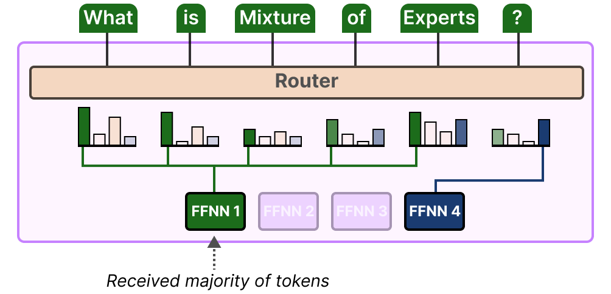
*Source: Grootendorst (2024), A Visual Guide to Mixture of Experts. An illustration of load imbalance: the router assigns the majority of tokens in a batch to a single expert (FFNN 1), while the remaining experts sit idle. This creates a computational bottleneck and prevents unused experts from receiving gradient updates.*

---

## 4. Load Balancing

Shazeer et al. (2017) proposed two differentiable auxiliary loss terms to encourage load balance, added to the main task loss with a small coefficient $\lambda > 0$.

### Importance Loss

**Definition (Expert Importance).** For a batch $\mathcal{B}$ of $T$ tokens, define the importance of expert $i$ as the sum of its gate weights across the batch:

$$\operatorname{Importance}_i(\mathcal{B}) = \sum_{x \in \mathcal{B}} g_i(x)$$

Note that $g_i(x) = 0$ for experts not in $\mathcal{T}(x)$, so this sums only over tokens for which expert $i$ is selected.

The importance vector $\operatorname{Importance}(\mathcal{B}) \in \mathbb{R}^E$ measures the total "soft attention" each expert receives. If all experts are equally important, this vector is constant.

**Definition (Importance Loss).** The importance loss is the squared *coefficient of variation* (CV) of the importance vector:

$$\mathcal{L}_{\text{imp}} = \operatorname{CV}\!\left(\operatorname{Importance}(\mathcal{B})\right)^2 = \left(\frac{\sigma(\operatorname{Importance}(\mathcal{B}))}{\mu(\operatorname{Importance}(\mathcal{B}))}\right)^2$$

where $\sigma(\cdot)$ is the standard deviation and $\mu(\cdot)$ is the mean. The CV is scale-invariant: it measures relative dispersion, so the loss is zero when all experts have equal importance and positive when importance is concentrated. Minimizing $\mathcal{L}_{\text{imp}}$ pushes the importance distribution toward uniformity.

This loss is differentiable with respect to the gate values $g_i(x)$, and hence with respect to $W_g$ through the softmax.

### Load Loss

The *importance loss* encourages balanced gate probabilities but does not directly constrain the number of tokens routed to each expert (which determines the actual computational load). The *load loss* addresses this.

**Definition (Smooth Load Estimate).** For expert $i$, define its smooth load on batch $\mathcal{B}$ as:

$$\operatorname{Load}_i(\mathcal{B}) = \sum_{x \in \mathcal{B}} P\!\left(i \in \mathcal{T}(x)\right)$$

where $P(i \in \mathcal{T}(x))$ is the probability that expert $i$ is in the top-$k$ set when noise is applied. Since the noise $\epsilon_i \sim \mathcal{N}(0, 1)$ is independent across experts, expert $i$ enters the top-$k$ if and only if $H_i(x) \geq H_{(k)}(x)$, where $H_{(k)}(x)$ is the $k$-th order statistic. Given the current logits $z(x)$, this probability can be computed via the normal CDF $\Phi$:

$$P(i \in \mathcal{T}(x)) = \Phi\!\left(\frac{z_i(x) - H_{-i,(k-1)}(x)}{\operatorname{Softplus}((W_n^\top x)_i)}\right)$$

where $H_{-i,(k-1)}(x)$ is the $(k{-}1)$-th largest logit among all experts except $i$. This is differentiable with respect to $z(x)$ and $W_n$.

**Definition (Load Loss).** The load loss mirrors the importance loss:

$$\mathcal{L}_{\text{load}} = \operatorname{CV}\!\left(\operatorname{Load}(\mathcal{B})\right)^2$$

**Combined Auxiliary Loss.** The total auxiliary loss is:

$$\mathcal{L}_{\text{aux}} = \lambda \cdot \left(\mathcal{L}_{\text{imp}} + \mathcal{L}_{\text{load}}\right)$$

with $\lambda$ a small positive constant (e.g., $10^{-2}$). The total training loss is $\mathcal{L} = \mathcal{L}_{\text{task}} + \mathcal{L}_{\text{aux}}$.

### Capacity Factor and Token Dropping

Even with auxiliary losses, routing in a distributed system requires hard limits on how many tokens each expert processes per batch (otherwise one expert could receive the entire batch). Shazeer et al. and subsequent work introduce the *capacity factor* to formalize this.

**Definition (Expert Capacity).** Given a batch of $T$ tokens, $E$ experts, and top-$k$ gating, the total number of expert-token pairs is $kT$. A balanced assignment would give $kT/E$ tokens to each expert. The expert capacity is:

$$C = \left\lfloor \frac{kT}{E} \cdot \phi \right\rfloor$$

where $\phi \geq 1$ is the **capacity factor**. Each expert processes at most $C$ tokens; tokens routed to an already-full expert are **dropped** — their expert representation is replaced by the residual (the token representation before the MoE layer), so the expert contributes zero to that token's output.

A capacity factor of $\phi = 1$ means the expert handles exactly its fair share, and any imbalance causes dropping. A capacity factor of $\phi = 1.25$ provides a 25% buffer above the uniform share, reducing dropping at the cost of pre-allocating extra compute capacity. For inference, capacity factor constraints are typically relaxed or removed.

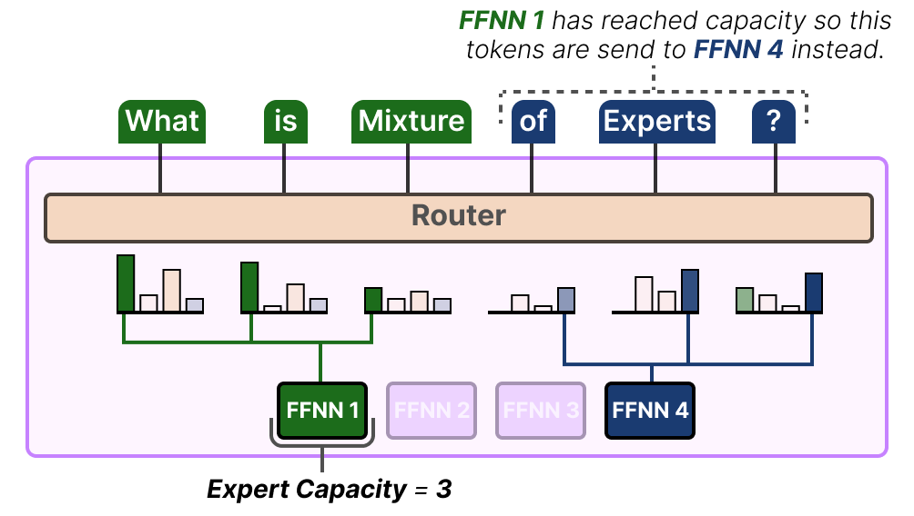
*Source: Grootendorst (2024), A Visual Guide to Mixture of Experts. Expert capacity in practice: when FFNN 1 has already processed its capacity (here, 3 tokens), any additional tokens that the router would send to it are instead redirected to the next preferred expert (FFNN 4). Tokens with no available expert slot are dropped.*

**Remark (Token Dropping as a Regularizer).** *Token dropping* is not merely an engineering constraint. It can be interpreted as a training-time regularizer: tokens whose first-choice expert is at capacity must rely on their second or subsequent choices, which forces those tokens to be processable by multiple experts and prevents over-specialization of the routing.

---

## 5. Switch Transformer: Fedus 2021

Fedus et al. (2021) scaled MoE Transformers to trillion parameters by simplifying the routing mechanism and carefully engineering the training regime. The central simplification is top-$1$ routing.

### Top-1 Routing

Switch Transformers set $k = 1$: each token is routed to exactly one expert. This reduces the number of expert-token pairs from $kT$ to $T$ per MoE layer, halving communication volume for top-2 gating and enabling more experts to be deployed for the same per-step cost.

**Definition (Switch Router).** For input $x$, the router computes:

$$g(x) = \operatorname{softmax}(W_g^\top x), \qquad i^*(x) = \arg\max_i g_i(x)$$

The output of the Switch layer is simply $y = g_{i^*(x)}(x) \cdot f_{i^*(x)}(x)$ — a single expert's output, scaled by the gate weight for that expert.

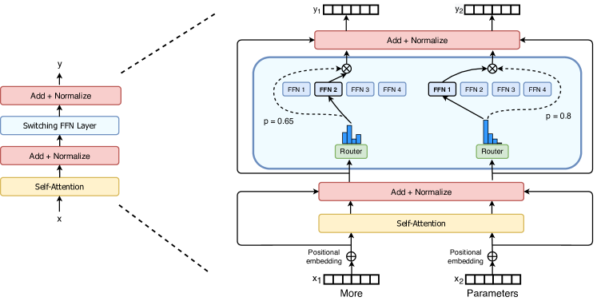
*Figure 2 (Fedus et al., 2021): The Switch Transformer encoder block. The standard dense FFN sublayer is replaced by a sparse Switch FFN layer containing multiple expert FFNs. A lightweight routing module independently assigns each token to exactly one expert (top-1 routing), enabling massive parameter scaling without proportional FLOP increase.*

**The Simplification Argument.** The Fedus et al. argument for top-1 routing is empirical: under FLOP-matched conditions (equal inference compute), top-1 routing with more total experts achieves comparable or better quality than top-2 routing with fewer experts. The communication reduction from top-1 allows training at larger scales, which more than compensates for any quality loss from limiting to one expert per token.

### Simplified Auxiliary Loss

Switch Transformer replaces the two-component CV-based loss of Shazeer et al. with a single, simpler auxiliary loss. Let $T$ be the number of tokens per batch per device, $E$ the number of experts, and define:

$$f_i = \frac{1}{T} \sum_{x \in \mathcal{B}} \mathbf{1}[i^*(x) = i], \qquad P_i = \frac{1}{T} \sum_{x \in \mathcal{B}} g_i(x)$$

Here $f_i$ is the fraction of tokens dispatched to expert $i$ (discrete, not differentiable) and $P_i$ is the fraction of total routing probability mass assigned to expert $i$ (continuous, differentiable). The auxiliary loss is:

$$\mathcal{L}_{\text{aux}} = \alpha \cdot E \cdot \sum_{i=1}^{E} f_i \cdot P_i$$

**Why this works.** Perfect balance would have $f_i = P_i = 1/E$ for all $i$, giving $\mathcal{L}_{\text{aux}} = E \cdot E \cdot (1/E)^2 = 1$. Any concentration — large $f_i$ and large $P_i$ for the same $i$ — increases the inner product $\sum_i f_i P_i$ above $1/E$. The product $f_i \cdot P_i$ is a differentiable proxy for the alignment between discrete routing decisions and soft routing probabilities: it penalizes the case where an expert receives both many tokens and high probability mass. The factor $E$ normalizes the baseline. Fedus et al. use $\alpha = 10^{-2}$.

**Note on differentiability.** $f_i$ is treated as a constant (no gradient through the argmax), while $P_i$ provides the gradient signal. The loss thus acts entirely through the softmax probabilities $g_i(x)$, encouraging the router to spread probability mass more uniformly even when discrete routing is concentrated.

### Scaling Behavior

**Switch Transformers achieve up to 7x pre-training speed improvements over dense T5 baselines at equivalent FLOP budgets, and 4x speedups over T5-XXL when scaling to trillion parameters.** The key finding is that the gains are available even in lower-precision (bfloat16) training, which was previously thought to be unstable for sparse models. This demonstrated that the engineering barriers to trillion-parameter sparse training were surmountable.

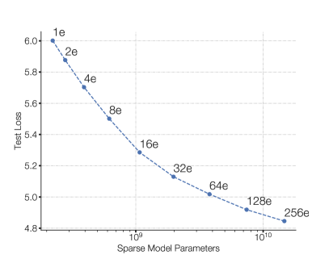
*Figure 1 (Fedus et al., 2021): Scaling properties of the Switch Transformer. Negative log perplexity improves consistently as the number of experts grows from 2 to 2048 under a fixed per-token FLOP budget, demonstrating that increasing total parameter count via more experts yields reliable quality gains without additional inference cost.*

---

## 6. Expert-Choice Routing

### Inverting the Routing Decision

All routing strategies discussed so far are *token-choice routing*: each token independently selects the top-$k$ experts to process it. This creates an inherent load imbalance: multiple tokens may simultaneously select the same expert, causing overflow, while other experts sit idle. Auxiliary losses and capacity factors mitigate this but do not eliminate it.

Zhou et al. (2022) propose *expert-choice routing*, which inverts the selection: instead of tokens choosing experts, each expert chooses its top-$m$ tokens from the batch.

### Formal Specification

**Notation.** Let $T$ denote the number of tokens in the batch, $E$ the number of experts, and $m$ the number of tokens each expert selects. Define $S = \text{token-expert score matrix} \in \mathbb{R}^{T \times E}$ with entries:

$$S_{t,i} = \operatorname{softmax}(W_g^\top x_t)_i = g_i(x_t)$$

**Definition (Expert-Choice Selection).** Each expert $i$ selects the top-$m$ tokens by its routing score:

$$\mathcal{B}_i = \operatorname{TopM}_{t \in [T]}(S_{t,i})$$

where $|\mathcal{B}_i| = m$ for all $i$. The output for token $t$ is:

$$y_t = \sum_{i : t \in \mathcal{B}_i} g_i(x_t) \cdot f_i(x_t)$$

Note that in this formulation, a token may appear in the selected sets of multiple experts (if its scores are high for several), or in none (if all experts rank it below their top-$m$ threshold). The effective number of experts activated per token is variable — this is a key distinction from token-choice routing.

The capacity factor $\phi$ controls the relationship between $m$ and token count: $m = \phi \cdot T / E$. Setting $\phi = 2$ means each expert processes twice its "fair share," and on average each token is processed by $2$ experts — equivalent to top-2 token-choice routing in total compute.

### Guaranteed Load Balance

**Proposition.** Under expert-choice routing, each expert processes exactly $m$ tokens per batch. Load is perfectly balanced by construction.

*Proof.* Each expert independently selects $|\mathcal{B}_i| = m$ tokens via the top-$m$ operation. Since each $\mathcal{B}_i$ is defined as the top-$m$ elements from a set of $T$ scores, $|\mathcal{B}_i| = m$ exactly for all $i \in [E]$. Total expert activations are exactly $m \cdot E$. Load is balanced by the selection mechanism itself, requiring no auxiliary loss for this purpose. $\square$

This is the defining advantage of expert-choice: perfect load balance is a structural property, not a trained-in incentive. **In practice this means no auxiliary loss for load balancing is required, and no tokens are dropped due to capacity overflow.**

The tradeoff is that tokens may receive attention from zero or more than $k$ experts, violating the uniform "each token sees exactly $k$ experts" invariant of token-choice routing. Tokens that are "difficult" (high-entropy routing scores) may attract many experts, while easy tokens may be processed by none. This variable expert coverage can be seen as an emergent form of adaptive computation.

### Connection to Bipartite Matching

Expert-choice routing can be understood as solving a relaxed bipartite matching problem. Consider a bipartite graph $G = ([T] \cup [E], \text{edges})$ where tokens are on one side and experts on the other. The weight of edge $(t, i)$ is $S_{t,i}$. We wish to find an assignment that (a) assigns each expert exactly $m$ tokens and (b) maximizes total weight.

This is a linear assignment problem, and if we additionally require each token to be assigned to exactly $k$ experts, it becomes a doubly-constrained bipartite $b$-matching. Expert-choice routing relaxes the constraint on tokens, solving only the expert-side constraint: each expert takes its top-$m$ tokens greedily, without coordinating with other experts. The resulting assignment is not globally optimal (two experts may both select the same high-scoring token while a third token is matched to neither), but it is computationally trivial and achieves the key goal of exact expert-side balance.

The connection to optimal transport is more than metaphorical: the doubly-constrained version can be solved via Sinkhorn iterations with appropriate marginal constraints, and this perspective has been explored in routing algorithms that aim to jointly balance both tokens and experts (see, e.g., Lewis et al., BASE Layers).

---

## 7. Mixtral and Modern Dense-Sparse Tradeoffs

### Mixtral 8x7B Architecture

Mixtral 8x7B (Jiang et al., 2024) is a decoder-only Transformer that replaces every FFN sublayer with a sparse MoE layer. The architecture follows:

- **Number of experts:** $E = 8$ per MoE layer
- **Routing:** top-$k = 2$ (each token is processed by exactly 2 of the 8 experts)
- **Total parameters:** 46.7B (all experts across all layers)
- **Active parameters per token:** 12.9B (2 experts activated per FFN layer)
- **Architecture otherwise:** same as Mistral 7B (grouped-query attention, sliding window attention, SwiGLU activations)

The MoE layer output for token $x$ at a given layer is:

$$y = \sum_{i \in \mathcal{T}(x)} g_i(x) \cdot f_i(x), \qquad |\mathcal{T}(x)| = 2$$

where the gate $g$ is a standard softmax router and $f_i$ is the $i$-th FFN expert (a standard SwiGLU feed-forward network). Notably, Mixtral does not use an auxiliary load balancing loss during training, relying instead on natural balance induced by the training distribution. This is an empirical finding that the routing does not catastrophically collapse in this setting.

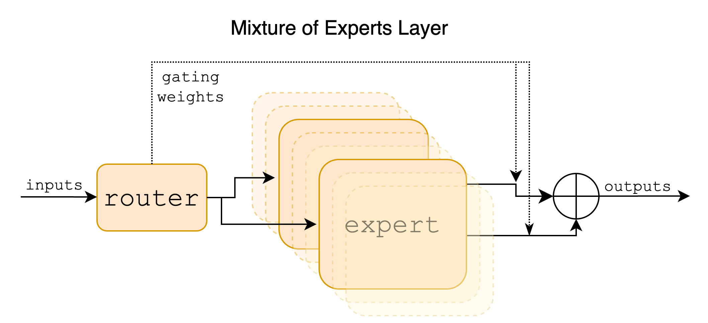
*Figure 1 (Jiang et al., 2024): The Mixtral sparse MoE layer. A router scores all 8 expert FFNs for each input token and selects the top-2 by score. The layer output is the weighted sum of the two selected experts' outputs, with weights given by the softmax-normalized gate scores over the selected pair.*

### FLOP-Matched Comparisons

The proper comparison between a dense model and an MoE model is under a fixed inference compute budget, measured in FLOPs per token. Mixtral's 12.9B active parameters imply a per-token FLOP count comparable to a 13B dense model. The relevant comparison is therefore: how does Mixtral 8x7B perform relative to a 13B dense model (same active compute) and a 70B dense model (same total parameter count)?

**The results reported by Jiang et al. show Mixtral outperforms Llama 2 70B (a dense model with 5x more active parameters) on most benchmarks, while using only 2 of 8 experts per token.** This concretely demonstrates the parameter-efficiency argument: access to 8 specialist FFN networks, even when only 2 are activated, provides substantially better quality than a single FFN with the same compute cost.

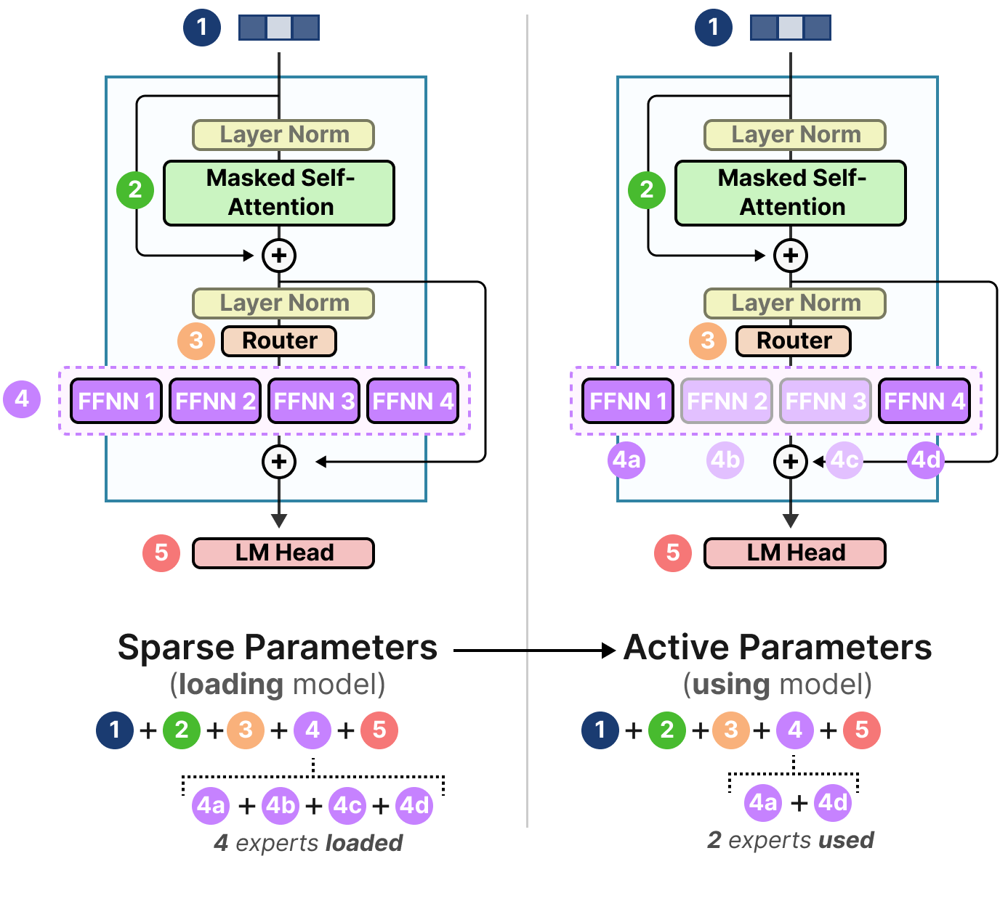
*Source: Grootendorst (2024), A Visual Guide to Mixture of Experts. Parameter breakdown for Mixtral 8x7B: the model holds 46.7B total parameters across 8 experts per layer, but activates only 12.9B parameters per token (2 of 8 experts). This decouples total parameter count from per-token compute, enabling FLOP-matched comparison against a ~13B dense model while benefiting from 46.7B worth of stored knowledge.*

The FLOP equivalence argument formalizes as follows. A standard Transformer FFN layer with hidden dimension $d_{ff}$ applied to a token of dimension $d$ costs approximately $2 \cdot 2d \cdot d_{ff}$ FLOPs (two linear projections for SwiGLU). For Mixtral with $E = 8$ experts and $k = 2$, the MoE layer cost is $2 \cdot 2d \cdot d_{ff}$ (same as a single FFN — only 2 experts are computed). The total parameter count in the MoE layer is $8 \cdot 2d \cdot d_{ff}$, four times a single FFN. Parameter count and FLOP count are thus decoupled by a factor of $E/k = 4$.

### Scaling Laws for MoE

The scaling behavior of MoE models departs from the Kaplan/Chinchilla laws derived for dense models. The key structural difference is that each expert's parameters are updated only by the tokens routed to it, so effective gradient signal per parameter scales as $(k/E)$ relative to a dense model.

Empirically, for a fixed training compute budget $C$ (measured in total FLOPs), MoE models consistently outperform dense models. Clark et al. (2022) and subsequent analyses find that under fixed FLOPs, it is better to train sparser models with more total parameters and more experts. The optimal number of experts as a function of compute is an active research question, with the general finding that more experts are beneficial until communication costs dominate.

A rough characterization (heuristic): if a dense model achieves loss $L$ after $C$ FLOPs, an MoE model with $E/k$ times more parameters (same active compute) can achieve the same loss with approximately $C / (E/k)^{\beta}$ FLOPs, for some exponent $\beta < 1$ that depends on the granularity and number of experts. The precise exponent is architecture- and data-dependent.

---

## 8. Training Dynamics and Collapse

### Expert Collapse

**Definition (Expert Collapse).** Expert collapse occurs when the router $g(x)$ assigns near-zero probability to some subset of experts across all or most inputs in the training data. Collapsed experts receive negligible gradient updates, fail to specialize, and effectively remove themselves from the model's functional capacity.

*Expert collapse* is a consequence of the positive feedback loop in joint training. Consider two experts $A$ and $B$, with $A$ marginally better initialized. Tokens routed to $A$ yield lower loss, providing stronger gradient signal to $A$'s parameters. $A$ improves; the router, observing lower loss from $A$, increases $g_A(x)$. This diverts more tokens from $B$, whose parameters stagnate, and the gap widens. This is a form of training-time symmetry breaking that is detrimental when it proceeds to completion (one or few experts receiving all tokens).

Expert collapse is distinct from **expert specialization**: in a healthy MoE, different experts specialize on different input types, and routing is non-uniform but not catastrophically concentrated. The challenge is allowing beneficial specialization while preventing complete collapse.

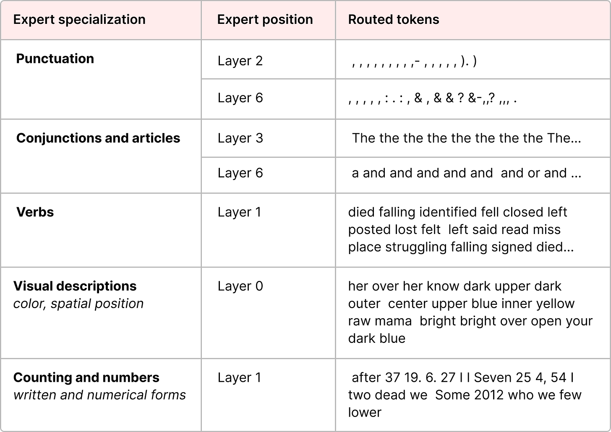
*Source: Grootendorst (2024), A Visual Guide to Mixture of Experts. Expert specialization in the ST-MoE model: different experts develop preferences for semantically or syntactically coherent token types. Some experts specialize on punctuation and delimiters, others on verbs or proper nouns. This emergent specialization is the desired outcome of joint gating-expert training, in contrast to the degenerate case of expert collapse.*

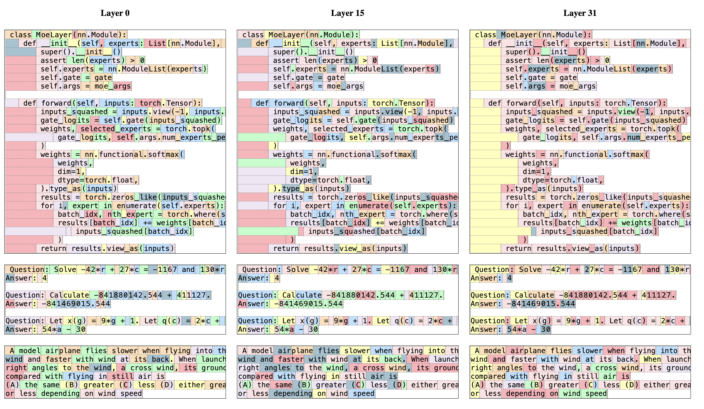
*Figure 8 (Jiang et al., 2024): Routing analysis in Mixtral 8x7B. Each token in a text passage is colored according to its first-choice expert. The routing pattern tracks syntactic structure rather than topic or domain — consecutive tokens of the same syntactic role (e.g., verb phrases, punctuation) tend to share an expert, even across different domains. This provides empirical evidence of expert specialization and confirms that Mixtral's routing does not collapse to a single dominant expert.*

### Router Z-Loss

The *router z-loss* (Zoph et al., 2022; ST-MoE) addresses training instability arising from large routing logits, which is a precursor to and companion of expert collapse.

**Motivation.** When routing logits $z_i(x)$ become large in magnitude, the softmax distribution becomes very sharp (peaked), effectively implementing hard routing. Sharp routing amplifies small perturbations — tiny changes in input $x$ can flip which expert is selected, causing discontinuous loss landscapes and gradient instability. Large logits also cause numerical issues in bfloat16 training.

**Definition (Router Z-Loss).** Let $z(x) \in \mathbb{R}^E$ denote the routing logits for token $x$. The router z-loss is:

$$\mathcal{L}_z = \frac{1}{T} \sum_{t=1}^{T} \left(\log \sum_{i=1}^{E} \exp(z_i(x_t))\right)^2$$

This is the mean squared log-sum-exp of the routing logits, taken over a batch of $T$ tokens.

**Why log-sum-exp.** Note that $\log \sum_i \exp(z_i) = \operatorname{LSE}(z)$ is a smooth approximation to $\max_i z_i$, with the bound:

$$\max_i z_i \leq \operatorname{LSE}(z) \leq \max_i z_i + \log E$$

Minimizing $\mathcal{L}_z$ therefore discourages large maximum routing logits, which directly counteracts the logit-growth mechanism underlying instability. The squared form (rather than absolute value) penalizes large deviations more strongly and provides a smooth gradient everywhere.

**Gradient.** Differentiating with respect to logit $z_{i}(x_t)$:

$$\frac{\partial \mathcal{L}_z}{\partial z_i(x_t)} = \frac{2}{T} \cdot \operatorname{LSE}(z(x_t)) \cdot \operatorname{softmax}(z(x_t))_i$$

The gradient scales with both the LSE magnitude and the softmax probability. High-probability experts (which tend to have the largest logits) receive the strongest shrinkage signal, directly countering the feedback loop driving collapse.

**Combined objective.** The full training loss including both load balancing and z-loss is:

$$\mathcal{L} = \mathcal{L}_{\text{task}} + \alpha_{\text{aux}} \cdot \mathcal{L}_{\text{aux}} + \alpha_z \cdot \mathcal{L}_z$$

Typical values from ST-MoE are $\alpha_{\text{aux}} = 10^{-2}$ and $\alpha_z \in [10^{-4}, 10^{-2}]$.

### Entropy Regularization

An alternative or complementary approach to z-loss is entropy regularization on the routing distribution. Define the routing entropy for token $x$:

$$H(g(x)) = -\sum_{i=1}^{E} g_i(x) \log g_i(x)$$

Adding a term $-\beta \cdot \mathbb{E}_x[H(g(x))]$ to the loss (i.e., subtracting entropy from the objective, which is equivalent to penalizing low entropy) encourages the router to distribute probability mass more uniformly. *This directly counteracts collapse but can conflict with the model's incentive to specialize: a uniform routing distribution means every expert receives equal probability mass, which may not reflect genuine input-dependent variation.*

In practice, entropy regularization is used more often in the soft-MoE and multi-task MoE literature than in the sparse-top-$k$ LLM context, where auxiliary losses and z-loss tend to be preferred.

### Initialization

Router initialization matters because routing decisions in the first few steps of training establish early specializations that are hard to undo. Recommendations from the ST-MoE paper include:

1. **Router weight initialization.** Sample $W_g$ from a truncated normal distribution with standard deviation $\sigma = \sqrt{s/d}$, where $s \approx 0.1$ is a scale hyperparameter and $d$ is the input dimension. This produces logits of modest magnitude at initialization, avoiding the sharp softmax regime from the start.

2. **Learning rate warmup.** Use a gradual learning rate warmup (e.g., linear from 0 to the peak LR over the first 10,000 steps) to allow routing to stabilize before the optimizer moves aggressively.

3. **Expert weight copying.** One practical initialization strategy is to initialize all experts as copies of the same pre-trained dense FFN, then fine-tune the MoE. This gives all experts equal starting quality, removing any initial asymmetry that could seed collapse. This is the approach used in some MoE "upcycling" methods.

---

## 9. Multi-Task Learning with MMoE

The routing architectures in Sections 3–7 share a single objective: efficiency in a single-task setting. Ma et al. (2018) applied the MoE principle to a different problem — *multi-task multi-label (MTML) learning* — where the goal is not compute-efficiency but knowledge transfer and task-relationship modeling across heterogeneous objectives.

### Multi-Task Problem Setup

Consider $K$ tasks, each associated with a loss function $\mathcal{L}_k$ over inputs $x \in \mathbb{R}^d$ and labels $y^k$. The standard *multi-task learning* (MTL) objective is:

$$\mathcal{L}_{\text{MTL}} = \sum_{k=1}^{K} \lambda_k \, \mathcal{L}_k, \qquad \lambda_k > 0$$

where the $\lambda_k$ are task weights. The central challenge is *task interference*: gradients from different tasks may conflict, causing the shared representation to satisfy one task at the cost of another. This tension is most severe when task labels are weakly correlated or structurally different (e.g., engagement vs. satisfaction in a recommendation system).

**Definition (Task Correlation).** For two tasks $k, k'$ with label distributions $Y^k, Y^{k'}$ on a shared input distribution, define their *Pearson correlation* as:

$$\rho_{k,k'} = \frac{\operatorname{Cov}(Y^k, Y^{k'})}{\sigma(Y^k) \, \sigma(Y^{k'})}$$

Ma et al. use $\rho_{k,k'}$ as an experimental control variable: datasets are constructed or modified so that $\rho$ varies from near $1$ (highly related tasks) to near $0$ or negative (weakly related or conflicting tasks).

### Architecture Family

Ma et al. compare three architectures that all share parameters across tasks:

**Shared-Bottom (SB).** The classical *hard parameter sharing* baseline. A single shared encoder $h : \mathbb{R}^d \to \mathbb{R}^m$ (e.g., a stack of dense layers) produces a common representation, and each task applies a private *tower network* $t^k : \mathbb{R}^m \to \mathbb{R}$ on top:

$$\hat{y}^k = t^k(h(x))$$

All $K$ tasks train through $h$ simultaneously, making $h$ susceptible to conflicting gradient updates. When tasks are strongly correlated, the shared representation generalizes well; when they are weakly correlated, no single $h(x)$ satisfies all tasks optimally.

**One-gate Mixture-of-Experts (OMoE).** A soft-gated MoE layer replaces $h$, with $E$ expert sub-networks $f_1, \ldots, f_E : \mathbb{R}^d \to \mathbb{R}^m$ and a single gating network shared across all tasks:

$$f(x) = \sum_{i=1}^{E} g_i(x) \cdot f_i(x), \qquad g(x) = \operatorname{softmax}(W_g^\top x), \quad W_g \in \mathbb{R}^{d \times E}$$

Each task then applies its own tower: $\hat{y}^k = t^k(f(x))$. OMoE increases representational capacity via the experts, but all tasks share the *same* expert mixture — the single gate $g(x)$ cannot route tasks differently.

### The MMoE Layer

**Definition (Multi-gate Mixture-of-Experts).** In *MMoE* (Ma et al., 2018), each task $k$ receives its own gating network $g^k$, while the experts $\{f_i\}$ are shared across all tasks:

$$f^k(x) = \sum_{i=1}^{E} g^k_i(x) \cdot f_i(x), \qquad g^k(x) = \operatorname{softmax}\!\left(W_{g^k}^\top x\right), \quad W_{g^k} \in \mathbb{R}^{d \times E}$$

The final output for task $k$ is:

$$\hat{y}^k = t^k\!\left(f^k(x)\right)$$

where $t^k$ is task $k$'s tower network. The MMoE model has $K$ gating networks (one per task) and $E$ shared expert networks. Compared to Shared-Bottom with a single encoder, MMoE introduces $K \cdot d \cdot E$ additional parameters for the gates and replaces one shared dense layer with $E$ expert layers — a modest parameter overhead in exchange for task-specific mixture weights.

**Parameter comparison.** Let $E$ experts each have $P$ parameters. The gating networks add $K \cdot d \cdot E$ parameters (small for large experts). The key contrast:

| Architecture | Expert parameters | Gate parameters | Task can modulate mixture? |
|---|---|---|---|
| Shared-Bottom | $P$ (one encoder) | none | No |
| OMoE | $E \cdot P$ | $d \cdot E$ | No (shared gate) |
| MMoE | $E \cdot P$ | $K \cdot d \cdot E$ | Yes (per-task gate) |

### Task-Relationship Modulation

The key claim of MMoE is that when tasks are weakly correlated, the per-task gates $g^k(x)$ learn to activate *different subsets of experts* for different tasks, effectively decomposing the multi-task problem into task-specific subproblems.

Formally, define the *gate divergence* between tasks $k$ and $k'$ as the expected $L_1$ distance between their routing distributions:

$$\Delta(k, k') = \mathbb{E}_x\!\left[\left\|g^k(x) - g^{k'}(x)\right\|_1\right]$$

*In the OMoE baseline, $\Delta(k, k') = 0$ by construction.* In MMoE, $\Delta(k, k')$ is a learned quantity: when tasks have conflicting gradient signals, the optimizer is free to reduce interference by pushing the gates to utilize different experts. Ma et al. confirm empirically that lower inter-task correlation $\rho_{k,k'}$ correlates with higher learned $\Delta(k, k')$, providing evidence that MMoE implicitly learns a soft task-specific expert allocation.

**Remark (Specialization vs. Sharing).** Unlike sparse top-$k$ routing, MMoE uses soft gating (all experts receive non-zero weight). Expert specialization is therefore emergent from gradient dynamics rather than enforced by routing architecture. An expert $f_i$ specializes for task $k$ to the extent that $g^k_i(x) \gg g^{k'}_i(x)$ for $k' \neq k$.

### Gradient Flow and Trainability

The gradient of the total MTL loss with respect to expert $f_i$'s parameters $\theta_i$ decomposes by task:

$$\frac{\partial \mathcal{L}_{\text{MTL}}}{\partial \theta_i} = \sum_{k=1}^{K} \lambda_k \, g^k_i(x) \cdot \frac{\partial \mathcal{L}_k}{\partial f^k(x)} \cdot \frac{\partial f_i(x)}{\partial \theta_i}$$

The gate weight $g^k_i(x)$ appears as a *task-specific gradient scaling factor* for expert $i$: if task $k$ routes little mass to expert $i$ (i.e., $g^k_i(x) \approx 0$), then task $k$ contributes negligibly to $\theta_i$'s update. This is the sense in which per-task gates modulate inter-task interference: expert $i$ is insulated from tasks that have learned to route around it.

**Trainability.** Ma et al. conduct an experiment measuring *trainability* — the fraction of random initializations and data permutations under which training converges to a good solution — across the three architectures. **MMoE exhibits higher trainability than both Shared-Bottom and OMoE, particularly under high data noise and high initialization variance.** The interpretation is that per-task gating provides more gradient pathways: if one path produces a conflicting gradient, another expert can absorb the conflicting signal, preventing the optimizer from getting stuck in a saddle caused by task interference.

*Concretely, in the synthetic experiments, Shared-Bottom's trainability drops sharply as task correlation decreases below $\rho \approx 0.5$, while MMoE maintains high trainability down to $\rho \approx 0$.* OMoE falls in between — the MoE structure helps but the shared gate cannot decouple task interference at the routing level.

**Real-world deployment.** Ma et al. apply MMoE to a large-scale recommendation system at Google, where tasks correspond to *engagement* (implicit feedback, e.g., watch time) and *satisfaction* (explicit feedback, e.g., user rating). These objectives are structurally different: engagement is dense and noisy, satisfaction is sparse and deliberate. MMoE outperforms both Shared-Bottom and OMoE baselines on held-out metrics, with particularly strong gains on the satisfaction task — the harder, sparser objective that benefits most from being shielded from engagement's gradient.

---

## References

| Reference Name | Brief Summary | Link to Reference |
|---|---|---|
| Jacobs et al. (1991) — Adaptive Mixtures of Local Experts | The original MoE paper; introduces soft gating with softmax weights over expert networks, training via backpropagation through a mixture loss. | [Neural Computation](https://direct.mit.edu/neco/article/3/1/79/5560/Adaptive-Mixtures-of-Local-Experts) |
| Shazeer et al. (2017) — Outrageously Large Neural Networks | Introduces sparsely-gated MoE with noisy top-k gating, importance and load auxiliary losses, and 137B parameter LSTM language models. | [arXiv:1701.06538](https://arxiv.org/abs/1701.06538) |
| Lepikhin et al. (2021) — GShard | Scales MoE Transformers to 600B parameters via top-2 gating with random second-expert routing, distributed sharding, and capacity-based token dropping. | [arXiv:2006.16668](https://arxiv.org/abs/2006.16668) |
| Fedus et al. (2021) — Switch Transformers | Simplifies MoE to top-1 routing, introduces the product-form auxiliary loss, demonstrates 7x pre-training speedup over dense T5, scales to 1T parameters. | [arXiv:2101.03961](https://arxiv.org/abs/2101.03961) |
| Zoph et al. (2022) — ST-MoE | Introduces the router z-loss for training stability, systematic analysis of MoE training dynamics and initialization, scaling to 269B sparse expert models. | [arXiv:2202.08906](https://arxiv.org/abs/2202.08906) |
| Zhou et al. (2022) — Expert Choice Routing | Proposes expert-choice (expert selects top-m tokens) as an alternative to token-choice routing; proves guaranteed load balance; shows improved training efficiency. | [arXiv:2202.09368](https://arxiv.org/abs/2202.09368) |
| Jiang et al. (2024) — Mixtral of Experts | Presents Mixtral 8x7B, a top-2 sparse MoE LLM with 46.7B total / 12.9B active parameters; outperforms Llama 2 70B on most benchmarks with 5x fewer active parameters. | [arXiv:2401.04088](https://arxiv.org/abs/2401.04088) |
| Mu and Lin (2025) — A Comprehensive Survey of MoE | Broad survey of MoE algorithms, theory, and applications spanning continual learning, meta-learning, multi-task learning, reinforcement learning, vision, and NLP. | [arXiv:2503.07137](https://arxiv.org/abs/2503.07137) |
| Bengio et al. (2013) — Estimating or Propagating Gradients Through Stochastic Neurons | Formalizes conditional computation as a research agenda; discusses gradient estimation through discrete stochastic decisions. | [arXiv:1305.2982](https://arxiv.org/abs/1305.2982) |
| Ma et al. (2018) — Modeling Task Relationships in Multi-task Learning with MMoE | Introduces Multi-gate Mixture-of-Experts (MMoE) for MTML: shared experts with per-task gating networks; demonstrates superior performance and trainability when tasks are weakly correlated; deployed in Google recommendation systems. | [ACM KDD 2018](https://dl.acm.org/doi/10.1145/3219819.3220007) |
| Grootendorst 2024 (Visual Guide to MoE) | Illustrated walkthrough of MoE routing, load balancing, and expert specialization | https://newsletter.maartengrootendorst.com/p/a-visual-guide-to-mixture-of-experts |
