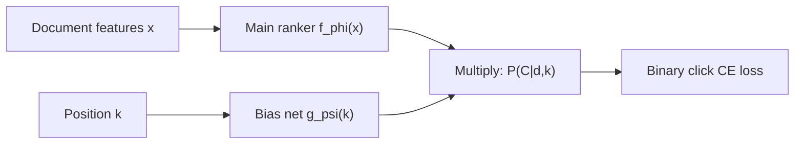

# Position Bias and Debiasing in Search Ranking

## Table of Contents

- [[#1. Motivation and Problem Setup|1. Motivation and Problem Setup]]
- [[#2. Click Models and the Examination Hypothesis|2. Click Models and the Examination Hypothesis]]
  - [[#2.1 Position-Based Model (PBM)|2.1 Position-Based Model (PBM)]]
  - [[#2.2 The Cascade Model|2.2 The Cascade Model]]
  - [[#2.3 The User Browsing Model (UBM)|2.3 The User Browsing Model (UBM)]]
  - [[#2.4 Formal Definition of Propensity|2.4 Formal Definition of Propensity]]
- [[#3. Causal Framework|3. Causal Framework]]
  - [[#3.1 Potential Outcomes Notation|3.1 Potential Outcomes Notation]]
  - [[#3.2 Logging Policy and MNAR Data|3.2 Logging Policy and MNAR Data]]
  - [[#3.3 Identifiability Conditions|3.3 Identifiability Conditions]]
- [[#4. Inverse Propensity Scoring (IPS) Estimator|4. Inverse Propensity Scoring (IPS) Estimator]]
  - [[#4.1 The Ideal Loss|4.1 The Ideal Loss]]
  - [[#4.2 The IPS Loss|4.2 The IPS Loss]]
  - [[#4.3 Unbiasedness Proof|4.3 Unbiasedness Proof]]
  - [[#4.4 Variance and Clipping|4.4 Variance and Clipping]]
- [[#5. Propensity Estimation|5. Propensity Estimation]]
  - [[#5.1 Result Randomization|5.1 Result Randomization]]
  - [[#5.2 Regression-EM (Wang et al., 2018)|5.2 Regression-EM (Wang et al., 2018)]]
  - [[#5.3 Intervention Harvesting and CPBM|5.3 Intervention Harvesting and CPBM]]
- [[#6. Dual Learning Algorithm (DLA)|6. Dual Learning Algorithm (DLA)]]
  - [[#6.1 The Duality Insight|6.1 The Duality Insight]]
  - [[#6.2 Dual Objective|6.2 Dual Objective]]
  - [[#6.3 Convergence Intuition|6.3 Convergence Intuition]]
- [[#7. Doubly Robust Estimators|7. Doubly Robust Estimators]]
  - [[#7.1 The Imputation Model|7.1 The Imputation Model]]
  - [[#7.2 DR Loss for LTR|7.2 DR Loss for LTR]]
  - [[#7.3 Bias-Variance Tradeoff vs. Pure IPS|7.3 Bias-Variance Tradeoff vs. Pure IPS]]
- [[#8. Extensions: Trust Bias, Selection Bias, and Vectorized EH|8. Extensions: Trust Bias, Selection Bias, and Vectorized EH]]
  - [[#8.1 Trust Bias and TrustPBM|8.1 Trust Bias and TrustPBM]]
  - [[#8.2 Selection Bias and MNAR Ratings|8.2 Selection Bias and MNAR Ratings]]
  - [[#8.3 Context-Dependent Propensity (CPBM)|8.3 Context-Dependent Propensity (CPBM)]]
  - [[#8.4 Vectorized Examination Hypothesis|8.4 Vectorized Examination Hypothesis]]
- [[#9. Industrial Deployment|9. Industrial Deployment]]
  - [[#9.1 PAL: Position-Bias Aware Learning (Huawei)|9.1 PAL: Position-Bias Aware Learning (Huawei)]]
  - [[#9.2 Google Personal Search (Regression-EM at Scale)|9.2 Google Personal Search (Regression-EM at Scale)]]
  - [[#9.3 eBay eCommerce Search|9.3 eBay eCommerce Search]]
  - [[#9.4 Baidu ULTR at Scale: Sobering Lessons|9.4 Baidu ULTR at Scale: Sobering Lessons]]
- [[#10. Evaluation Under Bias|10. Evaluation Under Bias]]
  - [[#10.1 Counterfactual Offline Evaluation|10.1 Counterfactual Offline Evaluation]]
  - [[#10.2 IPS-DCG and SNIPS|10.2 IPS-DCG and SNIPS]]
  - [[#10.3 Online A/B Testing as Ground Truth|10.3 Online A/B Testing as Ground Truth]]
- [[#References|References]]

---

## 1. Motivation and Problem Setup 🎯

Consider a search engine that logs user clicks on a ranked list of ten results. A naive learning algorithm would treat each click as evidence of relevance and each non-click as evidence of irrelevance, then minimize a supervised ranking loss against these labels. This is standard practice — and it is systematically wrong.

The problem is *position bias*: users are far more likely to examine, and therefore click, results displayed at the top of the page, regardless of their actual relevance. A document at rank 1 may receive ten times the clicks of an equally relevant document placed at rank 5, simply because of where it appears. An algorithm trained on raw clicks therefore learns, in part, to reproduce whatever ranking it was trained on — a feedback loop that entrenches historical errors and prevents discovery of better orderings.

The empirical foundation for this claim comes from [Joachims et al. (2005)](https://dl.acm.org/doi/10.1145/1076034.1076063), who used eye-tracking studies to demonstrate that while *absolute* click rates are heavily position-dependent, *relative* click preferences — which of two documents a user clicked more often — are informative about relevance. This distinction is the seed of the entire field.

**Goal.** We want to learn a ranking function $f : \mathcal{X} \to \mathbb{R}$ (where $\mathcal{X}$ is the space of query-document feature vectors) from click logs such that the resulting ranker optimizes true relevance, not presentation order. The fundamental challenge is that click logs are generated by a *biased* process: what we observe depends on *how* results were presented, making the data *missing not at random (MNAR)*.

> [!INFO] Why this matters industrially
> Large search and recommendation systems serve billions of queries. Even small improvements in ranking quality translate to significant user satisfaction gains. But because the only large-scale signal available is user clicks — not relevance annotations — every system trained on clicks is at risk of amplifying its own historical biases. Unbiased learning-to-rank (ULTR) provides the statistical machinery to correct for this.

---

## 2. Click Models and the Examination Hypothesis 🔬

### 2.1 Position-Based Model (PBM)

**Definition (Position-Based Model).** Let $q$ be a query, $d$ a document, and $k \in \{1, \ldots, K\}$ the rank at which $d$ is displayed. Define three binary random variables:

- $C_{d} \in \{0, 1\}$: whether the user clicked on document $d$,
- $E_{d} \in \{0, 1\}$: whether the user *examined* document $d$,
- $R_{d} \in \{0, 1\}$: whether the user perceived document $d$ as *relevant*.

The *Position-Based Model* (PBM) makes two assumptions:

1. **Examination Hypothesis (EH):** $C_{d} = E_{d} \cdot R_{d}$, i.e., a click occurs if and only if the document was both examined and perceived as relevant.
2. **Position-only examination:** $E_{d} \perp R_{d}$ and $P(E_{d} = 1) = \theta_{k(d)}$, where $k(d)$ is the rank of document $d$ and $\theta_k \in (0, 1]$ depends only on $k$.

Under PBM, the click probability factorizes as:

$$P(C_{d} = 1 \mid q, d, k) = \underbrace{\theta_k}_{\text{position propensity}} \cdot \underbrace{P(R_{d} = 1 \mid q, d)}_{\text{relevance}}$$

The vector $\boldsymbol{\theta} = (\theta_1, \ldots, \theta_K)$ is the *propensity vector* — the central object to be estimated.

> [!NOTE] Independence assumption
> The PBM critically assumes $E_{d} \perp R_{d}$, meaning whether a user examines position $k$ is independent of whether the document there is actually relevant. This is violated by, e.g., users who stop scanning after finding a relevant result (captured better by the cascade model). It is also violated by *trust bias* (Section 8.1).

### 2.2 The Cascade Model

[Craswell et al. (2008)](https://dl.acm.org/doi/10.1145/1341531.1341545) proposed and experimentally compared four click models. The *cascade model* assumes:

- Users scan results sequentially from rank 1 downward.
- At each rank $k$, the user clicks with probability $P(C \mid R = 1)$ if the document is relevant, then stops.
- Examination of rank $k$ is therefore conditioned on not clicking at any rank $j < k$.

Formally, let $S_k = \prod_{j=1}^{k-1}(1 - C_j)$ be the indicator that the user has not yet clicked. Then:

$$P(E_k = 1) = P(S_k = 1) = \prod_{j=1}^{k-1} (1 - \theta_j \cdot \rho_j)$$

where $\rho_j = P(R_j = 1)$. The cascade model performed best in Craswell et al.'s empirical evaluation — but it makes propensity estimation query-dependent and thus harder to scale.

**Key difference from PBM.** In the PBM, $\theta_k$ is a global constant depending only on rank. In the cascade model, the effective examination probability at rank $k$ depends on the relevance of all documents above it — making propensity a function of the entire ranked list.

### 2.3 The User Browsing Model (UBM)

[Dupret & Piwowarski (2008)](https://dl.acm.org/doi/10.1145/1390334.1390392) introduced the *User Browsing Model*, a probabilistic graphical model where the examination probability at rank $k$ depends not just on $k$ but also on the rank of the last clicked document:

$$P(E_k = 1 \mid \text{last click at rank } j) = \gamma(k, j)$$

The UBM strictly generalizes PBM (recovered when $\gamma(k, j) = \theta_k$ for all $j$). It captures *attention recovery* — after clicking a result at rank $j$, users are more likely to resume examination near rank $j$ than at much lower ranks.

### 2.4 Formal Definition of Propensity

Across all models, we define the *propensity* of a document at position $k$ as:

$$\rho_k \;\triangleq\; P(E_{d} = 1 \mid \text{document } d \text{ is placed at rank } k)$$

Under the PBM, $\rho_k = \theta_k$ is a scalar constant. Under richer models, $\rho_k$ may depend on query context, user history, or the identities of documents above rank $k$.

> [!WARNING] Propensity estimation is the bottleneck
> The propensity $\rho_k$ is never directly observed — we only observe clicks $C_d$, not examinations $E_d$. All ULTR methods depend critically on accurate propensity estimates. Errors in $\hat{\rho}_k$ bias the IPS estimator, and the bias does not vanish with more data.

> [!QUESTION] Exercise 1: PBM Factorization
> *This problem establishes that the PBM click probability uniquely determines both the propensity and relevance under mild conditions.*
>
> > **Prerequisites:** [[#2.1 Position-Based Model (PBM)|2.1 Position-Based Model (PBM)]]
>
> Under the PBM, suppose you observe click counts $n_k^+$ (clicks at rank $k$ over document set $\mathcal{D}^+$ of known-relevant documents) and $n_k^-$ (clicks at rank $k$ over document set $\mathcal{D}^-$ of known-irrelevant documents), from a large log. Show that $\theta_k$ is identifiable, and state what additional condition is needed.

> [!TIP]- Solution to Exercise 1
> **Key insight:** Under PBM, $P(C=1 \mid k, d \in \mathcal{D}^+) = \theta_k \cdot 1$ and $P(C=1 \mid k, d \in \mathcal{D}^-) = \theta_k \cdot 0 = 0$, so clicking a known-irrelevant document is impossible. In practice, relevance is unknown.
>
> **Sketch:** If we have *two* documents at rank $k$ with different (but known) relevance probabilities $r_1 \neq r_2$, we can form the system $\mathbb{E}[C_k^{(i)}] = \theta_k r_i$ for $i = 1, 2$. Taking the ratio $\mathbb{E}[C_k^{(1)}]/\mathbb{E}[C_k^{(2)}] = r_1/r_2$ cancels $\theta_k$, and then either equation solves for $\theta_k$. This is precisely the logic behind result randomization (Section 5.1): by randomly swapping two documents across ranks, we create the controlled comparison needed. The additional condition is *support*: every rank $k$ must have been observed with multiple documents of differing relevance.

---

## 3. Causal Framework 🔑

### 3.1 Potential Outcomes Notation

Following [Schnabel et al. (2016)](https://arxiv.org/abs/1602.05352), we adopt the *potential outcomes* (Neyman–Rubin) framework. Let $\mathcal{Q}$ be the space of queries and $\mathcal{D}$ the space of documents.

**Definition (Potential Outcome).** For query $q$ and document $d$, the *potential click* $C_{d}(k)$ is the binary click that would be observed if document $d$ were placed at rank $k$. Under the PBM:

$$C_d(k) = E_d(k) \cdot R_d, \qquad E_d(k) \sim \text{Bernoulli}(\theta_k)$$

where $R_d \in \{0, 1\}$ is the (fixed, unobservable) relevance of $d$ to $q$. The *observed* click is $C_d = C_d(k(d))$ where $k(d)$ is the rank actually assigned by the logging policy.

**Definition (True Ranking Loss).** Let $\pi$ denote a ranked list (permutation of documents) and let $\Delta(d, \pi)$ be a position-sensitive *per-document cost* (e.g., $\Delta(d, \pi) = \mathbf{1}[\text{rank of } d \text{ in } \pi > K]$ for precision-at-$K$, or a DCG discount). The *ideal loss* of ranker $f$ on query $q$ is:

$$L(f, q) = \sum_{d \in \mathcal{D}_q} \Delta(d, \pi_f) \cdot R_d$$

where $\pi_f$ is the ranking induced by $f$. We want to minimize $\mathbb{E}_q[L(f, q)]$ over the query distribution.

### 3.2 Logging Policy and MNAR Data

A *logging policy* (or *production ranker*) $\mu$ assigns rank $k(d) \sim \mu(\cdot \mid q, d)$ to each document. The observed click $C_d$ is then:

$$C_d = C_d(k_\mu(d)) = E_d(k_\mu(d)) \cdot R_d$$

The key structural feature is that $k_\mu(d)$ is correlated with $R_d$ — better rankers place more relevant documents at lower ranks, so high-rank positions are enriched for relevant documents. This means:

$$P(C_d = 1 \mid k_\mu(d)) \neq P(R_d = 1)$$

The data is *missing not at random* (MNAR): a non-click at rank 1 is very different evidence from a non-click at rank 10, because $\theta_1 \gg \theta_{10}$ means a rank-10 non-click is mostly due to non-examination, not irrelevance.

### 3.3 Identifiability Conditions

**Definition (Overlap / Positivity).** The propensity vector $\boldsymbol{\theta}$ is *identifiable* if every rank $k \in \{1, \ldots, K\}$ has been used, i.e., $\theta_k > 0$ for all $k$.

More precisely, IPS is well-defined as long as $\rho_{k(d)} > 0$ for every clicked document $d$ in the training data. When $\rho_{k(d)} = 0$ (document $d$ at rank $k$ could never be examined), no amount of click data can recover information about $R_d$, and the IPS weight $1/\rho_{k(d)}$ diverges.

**Condition (Unconfounded examination).** Under the PBM, examination $E_d$ is *unconfounded* with relevance $R_d$: $E_d \perp R_d$. This is the critical identifying assumption enabling the IPS correction. It fails when the logging ranker has placed highly relevant documents at low ranks, because a user scanning the page might stop early (violating position-only examination).

> [!WARNING] When identifiability fails
> If the logging policy is deterministic (each query always maps to the same ranking), then $\theta_k$ cannot be estimated from click data alone — every document at rank $k$ has been placed there by the same ranker, and we cannot separate $\theta_k$ from document-level relevance. This motivates result randomization (Section 5.1).

---

## 4. Inverse Propensity Scoring (IPS) Estimator 📐

### 4.1 The Ideal Loss

For query $q$ with ranked list $\pi$ induced by ranker $f$, the per-document loss using only observed click labels $C_d$ as a proxy for $R_d$ is the *naive loss*:

$$\hat{L}_\text{naive}(f, q) = \sum_{d \in \mathcal{D}_q} \Delta(d, \pi_f) \cdot C_d$$

This is biased: $\mathbb{E}[C_d] = \theta_{k_\mu(d)} \cdot R_d \neq R_d$ in general, so the naive loss weights high-rank documents upward and low-rank documents downward.

### 4.2 The IPS Loss

**Definition (IPS Loss).** The *Inverse Propensity Scoring loss* for ranker $f$ on query $q$ given click vector $\mathbf{c}$ is:

$$\hat{L}_\text{IPS}(f, q \mid \mathbf{c}) = \sum_{\substack{d \in \mathcal{D}_q \\ C_d = 1}} \frac{\Delta(d, \pi_f)}{\rho_{k_\mu(d)}}$$

where $\rho_{k_\mu(d)} = P(E_d = 1 \mid k_\mu(d))$ is the propensity of the logging rank. The sum ranges only over *clicked* documents because, under the EH, non-clicked documents contribute zero to the ideal loss (if not examined, we learn nothing about relevance; if examined but not relevant, $R_d = 0$).

The IPS loss was introduced in the LTR context by [Joachims et al. (2017)](https://arxiv.org/abs/1608.04468) and formalized as a counterfactual estimator by [Agarwal et al. (2019)](https://arxiv.org/abs/1805.00065).

> [!NOTE] IPS in the pairwise case
> For pairwise ranking (e.g., Ranking SVM), the IPS correction applies to each pairwise comparison. For documents $d_i$ and $d_j$ with $d_i$ clicked at rank $k_i$ and $d_j$ unclicked, the pairwise IPS weight is $1/\rho_{k_i}$. This yields the *Propensity-Weighted Ranking SVM*:
> $$\min_\mathbf{w} \;\frac{1}{2}\|\mathbf{w}\|^2 + C \sum_{(i,j): C_i=1, C_j=0} \frac{1}{\rho_{k_i}} \max(0,\; 1 - \mathbf{w}^\top (\phi_i - \phi_j))$$
> where $\phi_i$ is the feature vector for document $d_i$.

### 4.3 Unbiasedness Proof

**Proposition (IPS Unbiasedness).** Under the PBM with known propensities $\{\rho_k\}$ and provided $\rho_k > 0$ for all $k$, the IPS loss is an unbiased estimator of the ideal loss:

$$\mathbb{E}_{\mathbf{E}}\!\left[\hat{L}_\text{IPS}(f, q \mid \mathbf{C})\right] = L(f, q)$$

where the expectation is over the randomness in examination $\mathbf{E} = (E_d)_{d \in \mathcal{D}_q}$ conditional on relevances $(R_d)$.

*Proof sketch.* Expand the expectation:

$$\mathbb{E}_\mathbf{E}\!\left[\hat{L}_\text{IPS}(f, q \mid \mathbf{C})\right] = \mathbb{E}_\mathbf{E}\!\left[\sum_{d: C_d=1} \frac{\Delta(d, \pi_f)}{\rho_{k_\mu(d)}}\right]$$

$$= \sum_{d \in \mathcal{D}_q} \frac{\Delta(d, \pi_f)}{\rho_{k_\mu(d)}} \cdot \mathbb{E}[C_d]$$

$$= \sum_{d \in \mathcal{D}_q} \frac{\Delta(d, \pi_f)}{\rho_{k_\mu(d)}} \cdot \rho_{k_\mu(d)} \cdot R_d \qquad \text{(by PBM factorization)}$$

$$= \sum_{d \in \mathcal{D}_q} \Delta(d, \pi_f) \cdot R_d \;=\; L(f, q). \qquad \square$$

**The key algebraic step** is that $\mathbb{E}[C_d] = \rho_{k_\mu(d)} \cdot R_d$, so the propensity in the denominator exactly cancels the propensity in the click expectation. This holds *regardless* of the ranking $\pi_f$ of the new ranker $f$, because $\rho_{k_\mu(d)}$ is the propensity of the *logging* rank, not the new rank. The ranker $f$ is evaluated via $\Delta(d, \pi_f)$, which can be any ranking of the documents.

**Bold key result: IPS gives an unbiased estimate of the true ranking loss using only biased click logs, provided propensities are known and positive.**

### 4.4 Variance and Clipping

The IPS estimator is unbiased but can have high variance. The variance of $\hat{L}_\text{IPS}$ is dominated by documents at low ranks:

$$\text{Var}\!\left[\hat{L}_\text{IPS}\right] \propto \sum_{d} \frac{\Delta(d, \pi_f)^2 \cdot R_d \cdot (1 - \rho_{k_\mu(d)})}{\rho_{k_\mu(d)}^2}$$

When $\rho_{k_\mu(d)} \to 0$ (e.g., documents logged at rank 10 with $\theta_{10} \approx 0.05$), the variance explodes. This is the *high-variance problem* of IPS.

**Propensity Clipping.** A standard remedy is to clip propensities from below at a threshold $\tau > 0$:

$$\hat{L}_\text{IPS}^\tau(f, q) = \sum_{d: C_d=1} \frac{\Delta(d, \pi_f)}{\max(\rho_{k_\mu(d)}, \tau)}$$

Clipping introduces bias — documents with $\rho_{k_\mu(d)} < \tau$ are *under-reweighted* — but reduces variance. The optimal $\tau$ trades bias against variance and is typically chosen by cross-validation.

**Self-Normalized IPS (SNIPS).** An alternative variance-reduction strategy normalizes the IPS weights to sum to one:

$$\hat{L}_\text{SNIPS}(f, q) = \frac{\sum_{d: C_d=1} \Delta(d, \pi_f) / \rho_{k_\mu(d)}}{\sum_{d: C_d=1} 1 / \rho_{k_\mu(d)}}$$

SNIPS is biased but consistent, and typically has substantially lower variance than IPS in practice. This estimator was introduced in the recommendation context by Schnabel et al. (2016).

> [!QUESTION] Exercise 2: Variance Decomposition
> *This problem shows that IPS variance is fundamentally linked to the logging policy's propensity distribution.*
>
> > **Prerequisites:** [[#4.3 Unbiasedness Proof|4.3 Unbiasedness Proof]], [[#4.4 Variance and Clipping|4.4 Variance and Clipping]]
>
> Let $d^*$ be a single relevant document ($R_{d^*} = 1$) placed at rank $k$ by the logging policy, with propensity $\rho_k$. The IPS contribution is $X = C_{d^*} / \rho_k$. Show that $\text{Var}[X] = R_{d^*}(1 - \rho_k)/\rho_k$, and explain why logging at rank 1 (high propensity) gives lower variance than logging at rank 10 (low propensity), even though both yield an unbiased estimate.

> [!TIP]- Solution to Exercise 2
> **Key insight:** The propensity denominator amplifies the binary variance of the click random variable.
>
> **Sketch:** $X = C_{d^*}/\rho_k$ where $C_{d^*} \sim \text{Bernoulli}(\rho_k \cdot R_{d^*})$. With $R_{d^*}=1$, $\mathbb{E}[X] = 1$ and $\mathbb{E}[X^2] = \mathbb{E}[C_{d^*}^2/\rho_k^2] = \rho_k/\rho_k^2 = 1/\rho_k$. Thus $\text{Var}[X] = 1/\rho_k - 1 = (1-\rho_k)/\rho_k$. For rank 1 with $\rho_1 = 0.9$, variance $\approx 0.11$. For rank 10 with $\rho_{10} = 0.05$, variance $= 19$. Both estimators are unbiased (in expectation they equal $R_{d^*} = 1$), but the rank-10 estimate is 170× more variable. This is why practical systems collect a mix of ranks and use clipping.

---

## 5. Propensity Estimation 🛠️

Knowing the IPS framework, the practical bottleneck is: how do we estimate $\rho_k = \theta_k$ from data?

### 5.1 Result Randomization

The cleanest approach is *result randomization* (also called *intervention*): for a small fraction of queries, swap documents across ranks uniformly at random, breaking the correlation between document relevance and rank. The resulting data satisfies:

$$\mathbb{E}[C_d \mid k_\mu(d) = k, \text{randomized}] = \theta_k \cdot \bar{R}$$

where $\bar{R}$ is the average relevance across the pool. By comparing click rates at different ranks on the randomized subset, $\theta_k$ can be identified up to a global constant:

$$\hat{\theta}_k \propto \frac{\text{(click rate at rank } k \text{ under randomization)}}{\text{(average click rate under randomization)}}$$

**Limitation.** Randomization degrades user experience (users see worse-ordered results) and is often politically or legally fraught in production systems. The randomization budget must be small (often $<1\%$ of traffic), limiting statistical power.

### 5.2 Regression-EM (Wang et al., 2018)

[Wang et al. (2018)](https://dl.acm.org/doi/10.1145/3159652.3159732) proposed *Regression-EM*, an algorithm that estimates propensities from standard (non-randomized) click logs via Expectation-Maximization.

**Setup.** Under the PBM, the click likelihood for document $d$ at rank $k$ is:

$$P(C_d = c_{d} \mid \theta_k, r_d) = (\theta_k r_d)^{c_d}(1 - \theta_k r_d)^{1 - c_d}$$

where $r_d = P(R_d = 1)$ is the unknown document relevance. The complete-data log-likelihood, treating $E_d$ as a latent variable, is:

$$\log P(C_d, E_d \mid \theta_k, r_d) \propto E_d \log(\theta_k r_d) + (1-E_d)\log(1-\theta_k) + (C_d - E_d)\log(r_d)$$

The *Regression* in Regression-EM refers to modeling relevance $r_d$ as a parametric function of document features $\mathbf{x}_d$: $r_d = \sigma(\mathbf{w}^\top \mathbf{x}_d)$.

**E-step.** Given current estimates $(\hat{\boldsymbol{\theta}}^{(t)}, \hat{\mathbf{w}}^{(t)})$, compute the posterior probability of examination for each document:

$$\hat{e}_d^{(t)} = P(E_d = 1 \mid C_d, \hat{\theta}_{k(d)}^{(t)}, \hat{r}_d^{(t)}) = \begin{cases} 1 & \text{if } C_d = 1 \\ \dfrac{\hat{\theta}_{k(d)}^{(t)}(1 - \hat{r}_d^{(t)})}{1 - \hat{\theta}_{k(d)}^{(t)}\hat{r}_d^{(t)}} & \text{if } C_d = 0 \end{cases}$$

The $C_d = 1$ case is exact: a click implies examination (under EH). The $C_d = 0$ case uses Bayes' rule: $P(E=1 \mid C=0) = P(C=0 \mid E=1)P(E=1)/P(C=0) = (1-r)\theta / (1-\theta r)$.

**M-step.** Update parameters by maximizing the expected complete-data log-likelihood:

$$\hat{\theta}_k^{(t+1)} = \frac{\sum_{d: k(d)=k} \hat{e}_d^{(t)}}{N_k}$$

where $N_k$ is the number of documents displayed at rank $k$. The relevance parameters $\hat{\mathbf{w}}^{(t+1)}$ are updated by fitting a logistic regression of $\hat{e}_d^{(t)}$ on document features, where the "pseudo-labels" are the E-step posteriors.

This alternation continues until convergence. The final $\hat{\boldsymbol{\theta}}$ is used as propensity estimates for IPS training.

> [!NOTE] Why EM over direct MLE?
> The joint MLE of $(\boldsymbol{\theta}, \mathbf{w})$ from observed clicks is not identifiable without additional constraints: we cannot separately identify whether low click rates at rank $k$ are due to low $\theta_k$ (poor examination) or low $r_d$ (poor relevance). The EM algorithm, by treating examination as a latent variable and using a parametric model for relevance, imposes enough structure to make the problem tractable.

> [!WARNING] EM identifiability caveat
> Regression-EM is only identified if relevance varies with document features independently of rank — i.e., if the logging ranker does not perfectly sort by relevance. When the logging ranker is near-optimal, position and relevance become nearly collinear, and the EM solution can be degenerate.

### 5.3 Intervention Harvesting and CPBM

**Intervention Harvesting** ([Agarwal et al., 2019](https://arxiv.org/abs/1812.05161)) avoids both result randomization and EM by exploiting *natural variation* in historic logs: across different time periods or different production ranking functions, the same document $d$ may appear at different ranks $k_1$ and $k_2$. This provides a natural experiment:

$$\frac{P(C_d = 1 \mid k(d) = k_1)}{P(C_d = 1 \mid k(d) = k_2)} = \frac{\theta_{k_1}}{\theta_{k_2}}$$

Under PBM, the ratio of click rates equals the ratio of examination probabilities, since relevance $R_d$ cancels. By harvesting these "interventions" from logs — pairs $(d, k_1)$ and $(d, k_2)$ for the same document — one can estimate the entire propensity vector up to normalization using a system of pairwise equations.

**CPBM: Context-Dependent Position-Based Model.** [Fang et al. (2019)](https://arxiv.org/abs/1811.01802) observed that the standard PBM assumes $\theta_k$ depends only on rank, whereas in practice examination probability also varies with query characteristics (informational vs. navigational queries), device, and user segment. They propose the *Context-Dependent PBM* (CPBM):

$$P(E_d = 1 \mid k, \mathbf{z}) = \theta_{k}(\mathbf{z})$$

where $\mathbf{z}$ is a context vector. Propensity is estimated by intervention harvesting on the subset of log entries that share the same context $\mathbf{z}$, yielding context-specific propensity estimates $\hat{\theta}_k(\mathbf{z})$.

> [!QUESTION] Exercise 3: Ratio Estimator Consistency
> *This problem shows that the intervention harvesting estimator is consistent under mild conditions.*
>
> > **Prerequisites:** [[#5.3 Intervention Harvesting and CPBM|5.3 Intervention Harvesting and CPBM]], [[#2.1 Position-Based Model (PBM)|2.1 Position-Based Model (PBM)]]
>
> Suppose document $d$ appears at rank $k_1$ in $n_1$ sessions and at rank $k_2$ in $n_2$ sessions, with click counts $c_1$ and $c_2$ respectively. Define the estimator $\hat{\theta}_{k_1}/\hat{\theta}_{k_2} = (c_1/n_1)/(c_2/n_2)$. Show that this is consistent for $\theta_{k_1}/\theta_{k_2}$ as $n_1, n_2 \to \infty$, and identify the key PBM assumption required.

> [!TIP]- Solution to Exercise 3
> **Key insight:** Under PBM, the relevance $r_d = P(R_d = 1)$ is the same across both rank conditions (the document is the same), so it cancels in the ratio.
>
> **Sketch:** By LLN, $c_i/n_i \xrightarrow{p} P(C_d = 1 \mid k(d) = k_i) = \theta_{k_i} r_d$ for $i = 1, 2$. By the continuous mapping theorem (Slutsky), the ratio $(c_1/n_1)/(c_2/n_2) \xrightarrow{p} (\theta_{k_1} r_d)/(\theta_{k_2} r_d) = \theta_{k_1}/\theta_{k_2}$. The key PBM assumption is that $r_d$ is the same in both conditions — i.e., the user population and query distribution are the same when $d$ appears at $k_1$ as when it appears at $k_2$. This can fail if the logging ranker changed systematically (e.g., $d$ was demoted due to a relevance drop).

---

## 6. Dual Learning Algorithm (DLA) 🔄

### 6.1 The Duality Insight

The core difficulty with Regression-EM is that it separates propensity estimation from ranker training: propensities are estimated offline, then held fixed during learning. If the propensity estimate is poor, the trained ranker is biased, but the ranker's output is not used to improve the propensity estimate.

[Ai et al. (2018)](https://arxiv.org/abs/1804.05938) recognized a *duality* between the two problems:

- **Ranker problem:** Given propensities $\rho$, use IPS-weighted clicks to learn a ranker $f$.
- **Propensity problem:** Given a ranker $f$ (providing relevance estimates), use those estimates to debias the click signal and learn propensities $\rho$.

Each problem, when solved with the other's output as input, provides a corrected signal for the other. This suggests a joint optimization via alternating updates.

### 6.2 Dual Objective

Let $f_\phi$ be the ranking model (parameterized by $\phi$) and $g_\psi$ be the propensity model (parameterized by $\psi$). DLA defines two coupled losses on query $q$ with logged ranking $\pi_q$ and clicks $\mathbf{c}$:

**Ranker IPS loss** (debiased using current propensity estimates):

$$\mathcal{L}_\text{IPW}(f_\phi, q \mid g_\psi) = \sum_{\substack{d \in \pi_q \\ C_d = 1}} \frac{\Delta(d, \pi_{f_\phi})}{g_\psi(k_\mu(d))}$$

**Propensity IRW loss** (debiased using current ranker relevance estimates — *Inverse Relevance Weighting*):

$$\mathcal{L}_\text{IRW}(g_\psi, q \mid f_\phi) = \sum_{\substack{d \in \pi_q \\ C_d = 1}} \frac{\tilde{\Delta}(d, \pi_{g_\psi})}{f_\phi(d)}$$

where $\tilde{\Delta}(d, \pi_{g_\psi})$ is a position-sensitive cost for propensity model $g_\psi$ and $f_\phi(d) \in (0,1)$ is treated as the estimated relevance of document $d$.

The DLA update rule alternates:

$$\phi^{(t+1)} \leftarrow \phi^{(t)} - \eta_\phi \nabla_\phi \sum_q \mathcal{L}_\text{IPW}(f_\phi, q \mid g_{\psi^{(t)}})$$

$$\psi^{(t+1)} \leftarrow \psi^{(t)} - \eta_\psi \nabla_\psi \sum_q \mathcal{L}_\text{IRW}(g_\psi, q \mid f_{\phi^{(t+1)}})$$

> [!NOTE] Symmetry of the dual problems
> The duality is exact in the following sense: if $f_\phi$ is a correct relevance model and we use it as denominator weights in $\mathcal{L}_\text{IRW}$, then the IRW loss is an unbiased estimator of the propensity vector (by an argument symmetric to the IPS unbiasedness proof). Conversely, a correct propensity model makes $\mathcal{L}_\text{IPW}$ an unbiased ranking loss. The fixed point of the alternating updates (if it exists) satisfies both conditions simultaneously.

### 6.3 Convergence Intuition

DLA does not have a published convergence proof in the strong sense. The convergence *intuition* is as follows: at the fixed point $(\phi^*, \psi^*)$, the ranker $f_{\phi^*}$ produces relevance estimates that, when used in $\mathcal{L}_\text{IRW}$, yield the true propensities; and those propensities, when used in $\mathcal{L}_\text{IPW}$, yield the optimal ranker. This is a Nash equilibrium of the two-player game defined by the coupled losses.

Empirically, DLA converges in practice and outperforms separate propensity estimation + IPS training on standard benchmarks (Yahoo LTR, Istella), particularly when the initial propensity estimate is poor.

> [!WARNING] DLA in online settings
> One practical advantage of DLA over Regression-EM is that it can operate *online*: as new click batches arrive, both $\phi$ and $\psi$ are updated jointly, allowing the system to adapt to distribution shift in user behavior or query mix. Regression-EM requires a full EM re-run.

> [!QUESTION] Exercise 4: IRW Loss Unbiasedness
> *This problem proves that the IRW loss is an unbiased estimator of the position propensity, symmetric to the IPS unbiasedness proof.*
>
> > **Prerequisites:** [[#6.2 Dual Objective|6.2 Dual Objective]], [[#4.3 Unbiasedness Proof|4.3 Unbiasedness Proof]]
>
> Under PBM, suppose $f_\phi(d) = R_d$ (the ranker is the true relevance). Show that $\mathbb{E}[\mathcal{L}_\text{IRW}(g_\psi, q \mid f_\phi)]$ is an unbiased estimator of the ideal propensity loss $\sum_{d \in \pi_q} \tilde{\Delta}(d, \pi_{g_\psi}) \cdot \theta_{k_\mu(d)}$.

> [!TIP]- Solution to Exercise 4
> **Key insight:** The IRW denominator (relevance) plays the same role as the IPS denominator (propensity), with examination and relevance swapping roles.
>
> **Sketch:** With $f_\phi(d) = R_d$, $\mathbb{E}[\mathcal{L}_\text{IRW}] = \sum_{d: C_d=1} \mathbb{E}[\tilde{\Delta}(d, \pi_{g_\psi}) / R_d]$. Since $P(C_d=1) = \theta_{k_\mu(d)} R_d$, we get $\sum_d \tilde{\Delta}(d, \pi_{g_\psi}) \cdot \mathbb{E}[C_d/R_d] = \sum_d \tilde{\Delta}(d, \pi_{g_\psi}) \cdot \theta_{k_\mu(d)} \cdot R_d / R_d = \sum_d \tilde{\Delta}(d, \pi_{g_\psi}) \cdot \theta_{k_\mu(d)}$. The $R_d$ terms cancel exactly as $\theta_{k_\mu(d)}$ cancelled in the IPS proof, establishing the symmetric result.

---

## 7. Doubly Robust Estimators 📊

### 7.1 The Imputation Model

The IPS estimator has low bias but high variance. An alternative strategy is to use a *direct method* (DM) that predicts the ideal loss using a regression model:

**Definition (Imputation Model).** An *imputation model* $\hat{r}: \mathcal{X} \to [0,1]$ is a function that predicts the relevance $R_d$ of each document directly from features, without using propensities. The DM estimator is:

$$\hat{L}_\text{DM}(f, q) = \sum_{d \in \mathcal{D}_q} \Delta(d, \pi_f) \cdot \hat{r}(d)$$

The DM estimator has low variance (it uses all documents, not just clicked ones) but is biased when $\hat{r}(d) \neq R_d$.

### 7.2 DR Loss for LTR

[Oosterhuis (2022)](https://arxiv.org/abs/2203.17118) proposed the first *doubly robust* estimator designed specifically for click-based LTR, addressing the key difficulty that user examination $E_d$ is not directly observed.

**Definition (DR Loss).** The doubly robust loss for LTR is:

$$\hat{L}_\text{DR}(f, q) = \underbrace{\sum_{d \in \mathcal{D}_q} \Delta(d, \pi_f) \cdot \hat{r}(d)}_{\text{DM term}} + \underbrace{\sum_{d: C_d=1} \frac{\Delta(d, \pi_f)(1 - \hat{r}(d))}{\rho_{k_\mu(d)}}}_{\text{IPS correction term}}$$

The key innovation over standard DR estimators (used in, e.g., causal inference for treatment effects) is that $\rho_{k_\mu(d)}$ here is the *expected* examination probability at rank $k$, rather than the actual examination realization. Since $E_d$ is latent, we cannot use the realized treatment; instead, the expected treatment per rank is used.

**Unbiasedness.** $\hat{L}_\text{DR}$ is unbiased if *either*:
1. The propensity estimates $\rho_{k_\mu(d)}$ are correct (IPS term corrects the DM bias), *or*
2. The imputation model $\hat{r}(d) = R_d$ exactly (DM term is already perfect, IPS correction is zero in expectation).

This *double robustness* means the estimator is unbiased under a strictly weaker condition than either pure IPS or pure DM.

### 7.3 Bias-Variance Tradeoff vs. Pure IPS

The variance of $\hat{L}_\text{DR}$ relative to $\hat{L}_\text{IPS}$ depends on the quality of $\hat{r}$:

$$\text{Var}[\hat{L}_\text{DR}] \approx \text{Var}[\hat{L}_\text{IPS}] - \text{Cov}\!\left[\hat{L}_\text{IPS},\; \sum_d \Delta(d,\pi_f)\hat{r}(d)\right]$$

When $\hat{r}(d)$ is positively correlated with the IPS terms (i.e., the imputation model correctly identifies which documents are relevant), the DR estimator has strictly lower variance than IPS. Oosterhuis (2022) reports that DR requires *several orders of magnitude* fewer data points to converge, compared to IPS, in simulation studies on standard ULTR benchmarks.

*Surprisingly,* even a poor imputation model (low $R^2$ in predicting relevance) can substantially reduce variance, because the DM term acts as a *control variate* that reduces the effective variance of the IPS term.

> [!QUESTION] Exercise 5: DR Bias Decomposition
> *This problem shows that DR bias equals the product of propensity error and relevance error.*
>
> > **Prerequisites:** [[#7.2 DR Loss for LTR|7.2 DR Loss for LTR]], [[#4.3 Unbiasedness Proof|4.3 Unbiasedness Proof]]
>
> Suppose $\hat{\rho}_k = \rho_k + \epsilon_k$ (propensity error) and $\hat{r}(d) = R_d + \delta_d$ (imputation error). Show that the bias of $\hat{L}_\text{DR}$ is of order $O(\epsilon_k \cdot \delta_d)$, compared to $O(\epsilon_k)$ for IPS alone.

> [!TIP]- Solution to Exercise 5
> **Key insight:** The DM term absorbs the leading-order bias, leaving only a second-order interaction.
>
> **Sketch:** $\mathbb{E}[\hat{L}_\text{DR}] = \sum_d \Delta(d,\pi_f)[\hat{r}(d) + \rho_{k_\mu(d)}(R_d - \hat{r}(d))/\hat{\rho}_{k_\mu(d)}]$. Substituting $\hat{\rho}_k = \rho_k + \epsilon_k$ and $\hat{r} = R_d + \delta_d$: the DM term contributes $\sum_d \Delta \cdot (R_d + \delta_d)$; the IPS correction contributes $-\sum_d \Delta \cdot \delta_d \cdot \rho_k/(\rho_k + \epsilon_k) \approx -\sum_d \Delta \cdot \delta_d(1 - \epsilon_k/\rho_k)$. The leading $\delta_d$ terms cancel, leaving residual bias $\sum_d \Delta \cdot \delta_d \epsilon_k / \rho_k = O(\epsilon_k \delta_d)$. The cross-product is second order, hence DR bias is $O(\epsilon_k \delta_d)$ vs. IPS bias of $O(\epsilon_k)$.

---

## 8. Extensions: Trust Bias, Selection Bias, and Vectorized EH 🔭

### 8.1 Trust Bias and TrustPBM

*Trust bias* (also called *presentation bias*) refers to users' tendency to perceive top-ranked results as more relevant simply because they appear at the top, independent of their actual content. This is distinct from position bias: position bias affects *examination*, while trust bias affects *perceived relevance*.

[Agarwal et al. (2019)](https://research.google/pubs/addressing-trust-bias-for-unbiased-learning-to-rank/) proposed the *TrustPBM*, which adds a rank-dependent noise model on perceived relevance. Let $\tilde{R}_d$ denote perceived relevance and $R_d$ true relevance. TrustPBM defines:

$$P(\tilde{R}_d = 1 \mid R_d = r, E_d = 1, k) = \begin{cases} \epsilon_k^+ & r = 1 \\ \epsilon_k^- & r = 0 \end{cases}$$

where $\epsilon_k^+ \approx 1$ (examined relevant items are usually perceived as relevant) and $\epsilon_k^- > 0$ (some irrelevant items at low ranks are incorrectly perceived as relevant due to trust). The click probability becomes:

$$P(C_d = 1 \mid k, R_d) = \theta_k \left[\epsilon_k^+ R_d + \epsilon_k^-(1 - R_d)\right]$$

This is a richer model but requires estimating both $\theta_k$ and $\epsilon_k^\pm$ — typically via EM with result randomization.

### 8.2 Selection Bias and MNAR Ratings

In recommendation systems (as opposed to search), *selection bias* is the analogous problem: users tend to rate items they expect to like (self-selection), so the observed rating matrix is MNAR. The propensity $\rho_{u,i} = P(\text{item } i \text{ is rated by user } u)$ depends on expected relevance.

[Schnabel et al. (2016)](https://arxiv.org/abs/1602.05352) applied IPS to matrix factorization: the IPS-MF loss is:

$$\hat{L}_\text{IPS-MF} = \sum_{(u,i): \text{rated}} \frac{(\hat{r}_{u,i} - r_{u,i})^2}{\rho_{u,i}}$$

where $\rho_{u,i}$ is estimated from the rating patterns (e.g., items rated more often by similar users have higher propensity). The approach extends directly to ranking losses, making it a precursor to ULTR.

### 8.3 Context-Dependent Propensity (CPBM)

As noted in Section 5.3, the standard PBM assumes $\theta_k$ is a single global constant. The CPBM of [Fang et al. (2019)](https://arxiv.org/abs/1811.01802) allows the propensity to depend on a context vector $\mathbf{z}$:

$$\theta_k(\mathbf{z}) = \sigma\!\left(\mathbf{v}_k^\top \mathbf{z}\right)$$

where $\mathbf{v}_k$ is a rank-specific parameter vector and $\sigma$ is the sigmoid function. The parameters $\{\mathbf{v}_k\}$ are estimated by intervention harvesting: for each pair of sessions that differ only in the rank of some document $d$ (and share the same context $\mathbf{z}$), the ratio of click rates estimates $\theta_{k_1}(\mathbf{z})/\theta_{k_2}(\mathbf{z})$.

### 8.4 Vectorized Examination Hypothesis

The standard EH factorizes click probability as a *scalar* product of position propensity and relevance. [Chen et al. (2022)](https://arxiv.org/abs/2206.01702) showed this is a *misspecification* when interactions between bias factors and ranking features are complex.

**Vectorized EH.** Replace the scalar factorization with a *dot-product* formulation:

$$P(C_d = 1 \mid k, d) = \langle \mathbf{p}_k,\; \mathbf{q}_d \rangle$$

where $\mathbf{p}_k \in \mathbb{R}^m$ is a position embedding and $\mathbf{q}_d \in \mathbb{R}^m$ is a document-relevance embedding. The universality argument: by the Stone–Weierstrass theorem, any bounded continuous function $g(k, d)$ can be approximated to arbitrary precision by $\langle \mathbf{p}_k, \mathbf{q}_d \rangle$ for large enough $m$. The scalar EH is recovered when $m = 1$, making the vectorized formulation a strict generalization.

*Surprisingly,* empirical results show that even small $m$ (e.g., $m = 4$) substantially outperforms $m = 1$ on production-scale benchmarks, suggesting the scalar EH is not merely theoretically restrictive but practically harmful.

---

## 9. Industrial Deployment 🏭

### 9.1 PAL: Position-Bias Aware Learning (Huawei)

[Guo et al. (2019)](https://www.semanticscholar.org/paper/PAL:-a-position-bias-aware-learning-framework-for-Guo-Yu/4eb8bb576a5603b82c27d7f40e508b7dc8c1c0cc) proposed *PAL* (Position-bias Aware Learning), a pragmatic departure from IPS that avoids propensity estimation entirely.

**Architecture.** The CTR predictor is decomposed as:

$$P(C = 1 \mid d, k) = P_\text{pos}(k) \cdot P_\text{rel}(d)$$

where $P_\text{pos}(k)$ is a shallow sub-network taking rank $k$ as input (a learned position embedding), and $P_\text{rel}(d)$ is the main ranker taking document features as input. The full model is:

**Training vs. Inference.** During training, position $k$ is known (the item was served at rank $k$) so $g_\psi(k)$ receives the true rank. During inference, position is not known, so the bias sub-network is *dropped entirely* and only $f_\phi(\mathbf{x})$ is used to score items. This cleanly separates bias modeling from relevance scoring.

**Results.** PAL achieved 3–35% CTR and CVR improvements over position-naive CTR models in Huawei's live recommender, in an A/B test on tens of millions of users.

> [!TIP] PAL vs. IPS in practice
> PAL is simpler to deploy than IPS because it requires no explicit propensity estimation. However, the multiplicative decomposition $P_\text{pos} \cdot P_\text{rel}$ is exactly the PBM factorization — so PAL implicitly learns the propensities as parameters of $g_\psi$, without the EM algorithm. The tradeoff is that $g_\psi$ is trained jointly with $f_\phi$ and may absorb relevance signal if the two sub-networks are not carefully regularized.

### 9.2 Google Personal Search (Regression-EM at Scale)

[Wang et al. (2018)](https://dl.acm.org/doi/10.1145/3159652.3159732) deployed Regression-EM for Google's personal search product (Gmail, Drive, Calendar). Personal search is particularly sparse: each user-specific corpus is small, making per-query click counts insufficient for reliable propensity estimation.

The Regression-EM solution addresses sparsity by sharing the relevance model $r_d = \sigma(\mathbf{w}^\top \mathbf{x}_d)$ across all queries and users, while keeping the propensity vector $\boldsymbol{\theta}$ global. This ties the EM updates through the shared feature representation, allowing propensity estimates to be informed by millions of queries even when individual query-document pairs are rarely clicked.

The system was validated by comparison against randomized propensities (the ground truth): Regression-EM recovered propensity estimates close to the randomized baseline without any explicit randomization, at roughly zero user-experience cost.

### 9.3 eBay eCommerce Search

[Aslanyan & Porwal (2019)](https://arxiv.org/abs/1812.09338) exploited a structural feature of eBay's eCommerce search: items change rank over time as prices fluctuate and inventory changes. This *rank drift* creates natural "interventions" similar to intervention harvesting.

Their propensity estimator groups click logs by (query, item) pairs across sessions where the item appeared at different ranks, then uses the ratio estimator from Section 5.3. The key eCommerce-specific insight is that item relevance is more stable than in web search (a shirt is equally relevant whether the price dropped yesterday or not), making the ratio estimator more reliable.

Comparison against EM-based baselines showed that the drift-based estimator outperformed Regression-EM in DCG on held-out annotated data, particularly in low-traffic query categories where EM's parametric model is most prone to overfitting.

### 9.4 Baidu ULTR at Scale: Sobering Lessons

[Hager et al. (2024)](https://arxiv.org/abs/2404.02543) conducted a large-scale reproducibility study using the Baidu-ULTR dataset — over 1.2 billion user sessions with 397,572 annotated query-document pairs. They evaluated six ULTR approaches: Naive baselines, IPS, Regression-EM, DLA, Pairwise Debiasing, and Two-Tower models.

**Key finding:** *All ULTR methods robustly improved click prediction (negative log-likelihood) compared to naive baselines.* However, *improved click prediction did not translate to improved ranking on expert annotations.* The best neural click model achieved DCG@10 of 8.233 on annotation metrics — below an untuned BM25 baseline scoring 9.544.

**Main lessons:**
1. Click prediction and relevance ranking are *diverging objectives* on production data.
2. Choice of ranking loss (pointwise vs. listwise vs. pairwise) and input features created larger performance gaps than choice of debiasing method.
3. ULTR improves the model's ability to predict clicks given position, but this does not imply that the debiased ranker aligns with human relevance judgments.
4. PBM assumptions may be violated at Baidu's scale: search users' behavioral patterns may involve complex multi-click sessions that the simple examination × relevance factorization does not capture.

*This is a sobering result for the field: the theoretical guarantees of ULTR hold under the PBM, but the PBM may not hold in production.*

---

## 10. Evaluation Under Bias 📏

### 10.1 Counterfactual Offline Evaluation

A fundamental challenge: we cannot evaluate a new ranker $f$ by deploying it (that requires an A/B test), yet standard offline evaluation using click labels is biased for the same reasons that training is biased. The solution is *counterfactual offline evaluation*: use the IPS framework to estimate how a new ranker $f$ would have performed, if it had been the logging policy.

**Definition (IPS-DCG).** The *IPS-DCG* of ranker $f$ is:

$$\widehat{\text{DCG}}_\text{IPS}(f) = \frac{1}{|\mathcal{Q}|} \sum_{q \in \mathcal{Q}} \sum_{d: C_d = 1} \frac{\text{dcg}(d, \pi_f)}{\rho_{k_\mu(d)}}$$

where $\text{dcg}(d, \pi_f) = (2^{R_d} - 1) / \log_2(1 + \text{rank}_f(d))$ is the per-document DCG contribution. Since $R_d$ is unknown, $C_d$ is used as a proxy with the IPS correction removing position bias.

### 10.2 IPS-DCG and SNIPS

The SNIPS variant of IPS-DCG normalizes by the sum of IPS weights:

$$\widehat{\text{DCG}}_\text{SNIPS}(f) = \frac{\sum_{q} \sum_{d: C_d=1} \text{dcg}(d, \pi_f) / \rho_{k_\mu(d)}}{\sum_{q} \sum_{d: C_d=1} 1/\rho_{k_\mu(d)}}$$

SNIPS-DCG has lower variance than IPS-DCG and is typically used as the primary offline evaluation metric in ULTR papers. The metric is only reliable when the new ranker $f$ does not radically reorder documents relative to the logging policy — extreme reordering puts documents into rank regions not covered by the log (overlap failure).

### 10.3 Online A/B Testing as Ground Truth

Ultimately, the gold standard for evaluating a debiased ranker is an online A/B test, where a random subset of users receives rankings from $f$ while the control group receives $f_\mu$. Online experiments measure:

- Click-through rate (CTR) — directly measures click behavior, consistent with ULTR's training signal.
- Dwell time, return rate — proxies for satisfaction beyond CTR.
- Expert annotation DCG — measured on a held-out annotation set, the "ground truth" relevance metric.

The Baidu ULTR finding (Section 9.4) highlights that online CTR improvement and annotation DCG improvement do not always align. *An ML engineer deploying ULTR should treat annotation-based offline evaluation as more reliable than click-based offline evaluation.*

> [!EXAMPLE] A worked counterfactual evaluation
> Suppose the logging policy placed document $d^*$ (which turns out to be clicked, so $C_{d^*}=1$) at rank 5, and the new ranker $f$ would place $d^*$ at rank 1. The IPS-DCG contribution is:
>
> $$\frac{\text{dcg}(d^*, \pi_f)}{\rho_5} = \frac{(2^1 - 1)/\log_2(2)}{0.15} = \frac{1.0}{0.15} \approx 6.67$$
>
> compared to the logging DCG contribution $\text{dcg}(d^*, \pi_\mu) / \rho_5 = [(2^1 - 1)/\log_2(6)] / 0.15 \approx 1.72$. The IPS correction upweights the log contribution because $d^*$ was rarely examined (low propensity at rank 5), so observing a click there is strong evidence of relevance — and placing it at rank 1 would yield a much larger DCG gain.

> [!QUESTION] Exercise 6: IPS-DCG Consistency
> *This problem establishes when IPS-DCG is a consistent estimator of true expected DCG.*
>
> > **Prerequisites:** [[#10.1 Counterfactual Offline Evaluation|10.1 Counterfactual Offline Evaluation]], [[#4.3 Unbiasedness Proof|4.3 Unbiasedness Proof]]
>
> State and prove the conditions under which $\widehat{\text{DCG}}_\text{IPS}(f) \xrightarrow{p} \text{DCG}(f)$ as the number of logged queries $|\mathcal{Q}| \to \infty$. Identify which conditions may fail for a new ranker $f$ that is significantly better than the logging policy.

> [!TIP]- Solution to Exercise 6
> **Key insight:** Consistency requires overlap — every document-rank pair that $f$ would serve must have positive propensity in the log.
>
> **Sketch:** By the law of large numbers, IPS-DCG converges to $\mathbb{E}_q[\sum_{d:C_d=1} \text{dcg}(d,\pi_f)/\rho_{k_\mu(d)}]$. By the unbiasedness proof (Section 4.3), this expectation equals $\mathbb{E}_q[\sum_d \text{dcg}(d,\pi_f) R_d] = \text{DCG}(f)$. The required conditions are: (1) $\rho_{k_\mu(d)} > 0$ for all clicked documents (overlap), (2) the PBM holds (examination factorizes), (3) relevance is stationary across sessions. Condition (1) can fail for a superior ranker $f$ that places irrelevant documents at very high ranks — those documents were rarely clicked in the log (low propensity), so the IPS weight explodes and the variance grows. In extreme cases, $f$ may place documents at ranks not covered by the log at all (support failure), making the estimator undefined.

---

## References

| Reference Name | Brief Summary | Link to Reference |
|---|---|---|
| [Joachims et al. (2005) — Accurately Interpreting Clickthrough Data as Implicit Feedback](https://dl.acm.org/doi/10.1145/1076034.1076063) | Foundational eye-tracking study establishing that raw clicks are position-biased but relative click preferences are informative about relevance | [ACM DL](https://dl.acm.org/doi/10.1145/1076034.1076063) |
| [Craswell et al. (2008) — An Experimental Comparison of Click Position-Bias Models](https://dl.acm.org/doi/10.1145/1341531.1341545) | Proposes and compares four click models including the Examination Hypothesis and Cascade Model; cascade model wins empirically | [ACM DL](https://dl.acm.org/doi/10.1145/1341531.1341545) |
| [Dupret & Piwowarski (2008) — A User Browsing Model to Predict Search Engine Click Data](https://dl.acm.org/doi/10.1145/1390334.1390392) | Introduces the User Browsing Model (UBM), a PGM conditioning examination on the rank of the last click | [ACM DL](https://dl.acm.org/doi/10.1145/1390334.1390392) |
| [Schnabel et al. (2016) — Recommendations as Treatments: Debiasing Learning and Evaluation](https://arxiv.org/abs/1602.05352) | Frames recommendation as causal inference using potential outcomes; introduces IPS-based unbiased estimators and SNIPS for matrix factorization | [arXiv](https://arxiv.org/abs/1602.05352) |
| [Joachims et al. (2017) — Unbiased Learning-to-Rank with Biased Feedback](https://arxiv.org/abs/1608.04468) | Establishes IPS-weighted ERM framework for ULTR; introduces Propensity-Weighted Ranking SVM; proves unbiasedness under PBM | [arXiv](https://arxiv.org/abs/1608.04468) |
| [Wang et al. (2018) — Position Bias Estimation for Unbiased Learning to Rank in Personal Search](https://dl.acm.org/doi/10.1145/3159652.3159732) | Google paper proposing Regression-EM to estimate position propensities from sparse click data without result randomization; deployed in Google personal search | [ACM DL](https://dl.acm.org/doi/10.1145/3159652.3159732) |
| [Ai et al. (2018) — Unbiased Learning to Rank with Unbiased Propensity Estimation](https://arxiv.org/abs/1804.05938) | Proposes DLA, jointly training ranker and propensity model as dual optimization problems; supports online learning | [arXiv](https://arxiv.org/abs/1804.05938) |
| [Agarwal et al. (2019a) — A General Framework for Counterfactual Learning-to-Rank](https://arxiv.org/abs/1805.00065) | Extends IPS framework to deep ranking functions; propensity-weighted DCG loss for gradient-based optimization | [arXiv](https://arxiv.org/abs/1805.00065) |
| [Fang et al. (2019) — Intervention Harvesting for Context-Dependent Examination-Bias Estimation](https://arxiv.org/abs/1811.01802) | Proposes CPBM where propensity depends on query/user context; estimates via intervention harvesting from historic log variation | [arXiv](https://arxiv.org/abs/1811.01802) |
| [Agarwal et al. (2019b) — Estimating Position Bias without Intrusive Interventions](https://arxiv.org/abs/1812.05161) | Extremum estimator harvesting propensity from logs of multiple historic rankers without result randomization | [arXiv](https://arxiv.org/abs/1812.05161) |
| [Agarwal et al. (2019c) — Addressing Trust Bias for Unbiased Learning-to-Rank](https://research.google/pubs/addressing-trust-bias-for-unbiased-learning-to-rank/) | Extends PBM to capture trust bias; proposes TrustPBM with EM estimation; validated on Google personal search | [Google Research](https://research.google/pubs/addressing-trust-bias-for-unbiased-learning-to-rank/) |
| [Guo et al. (2019) — PAL: A Position-Bias Aware Learning Framework for CTR Prediction in Live Recommender Systems](https://www.semanticscholar.org/paper/PAL:-a-position-bias-aware-learning-framework-for-Guo-Yu/4eb8bb576a5603b82c27d7f40e508b7dc8c1c0cc) | Huawei: trains shallow position-aware sub-network at training time, drops it at inference; achieves 3–35% CTR/CVR lift in A/B test | [Semantic Scholar](https://www.semanticscholar.org/paper/PAL:-a-position-bias-aware-learning-framework-for-Guo-Yu/4eb8bb576a5603b82c27d7f40e508b7dc8c1c0cc) |
| [Aslanyan & Porwal (2019) — Position Bias Estimation for Unbiased Learning-to-Rank in eCommerce Search](https://arxiv.org/abs/1812.09338) | eBay: propensity estimator exploiting natural rank drift over time; outperforms EM baselines on eCommerce data | [arXiv](https://arxiv.org/abs/1812.09338) |
| [Hu et al. (2019) — Unbiased LambdaMART: An Unbiased Pairwise Learning-to-Rank Algorithm](https://arxiv.org/abs/1809.05818) | Pairwise debiasing correcting for bias at both clicked and unclicked positions; A/B tested at a major commercial search engine | [arXiv](https://arxiv.org/abs/1809.05818) |
| [Chen et al. (2021) — Bias and Debias in Recommender System: A Survey and Future Directions](https://arxiv.org/abs/2010.03240) | Comprehensive survey taxonomising seven bias types and debiasing approaches across recommendation venues 2010–2021 | [arXiv](https://arxiv.org/abs/2010.03240) |
| [Oosterhuis (2022) — Doubly-Robust Estimation for Correcting Position-Bias in Click Feedback for Unbiased Learning to Rank](https://arxiv.org/abs/2203.17118) | First DR estimator for click-based LTR; uses expected treatment per rank; several orders-of-magnitude sample efficiency gain over IPS | [arXiv](https://arxiv.org/abs/2203.17118) |
| [Chen et al. (2022) — Scalar is Not Enough: Vectorization-based Unbiased Learning to Rank](https://arxiv.org/abs/2206.01702) | Identifies misspecification in scalar Examination Hypothesis; proposes vector dot-product formulation that is universal by Stone–Weierstrass | [arXiv](https://arxiv.org/abs/2206.01702) |
| [Hager et al. (2024) — Unbiased Learning to Rank Meets Reality: Lessons from Baidu's Large-Scale Search Dataset](https://arxiv.org/abs/2404.02543) | SIGIR 2024 reproducibility study: ULTR improves click prediction but not consistently relevance ranking per expert annotations on Baidu's 1.2B session dataset | [arXiv](https://arxiv.org/abs/2404.02543) |
