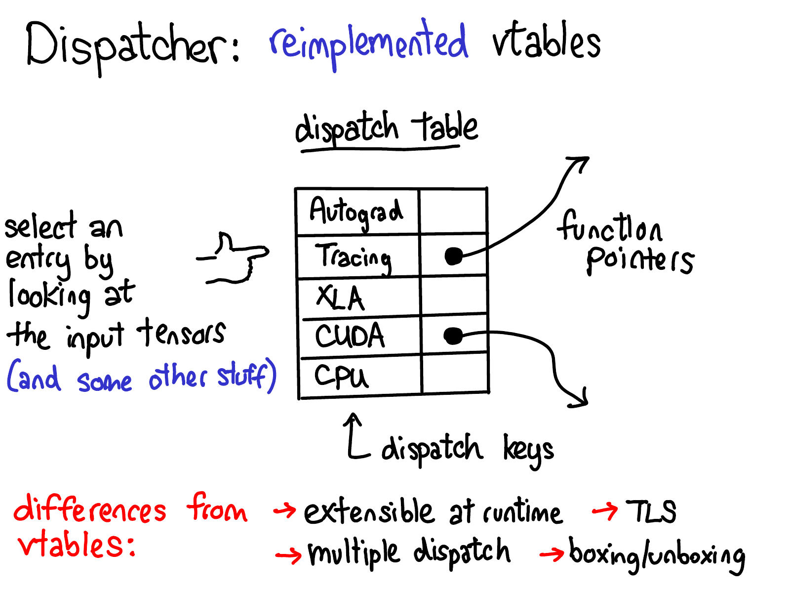
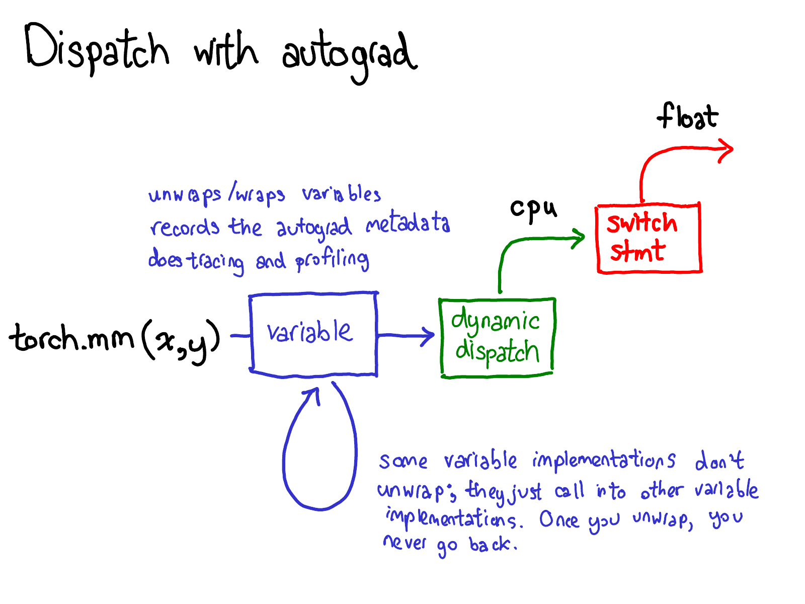
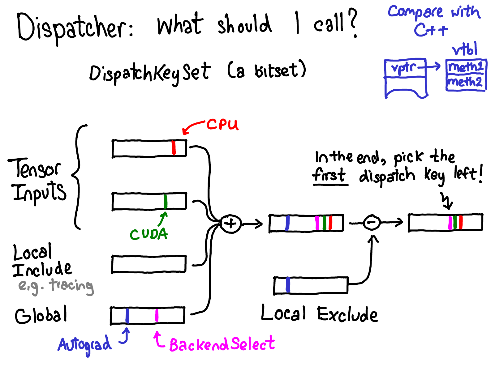
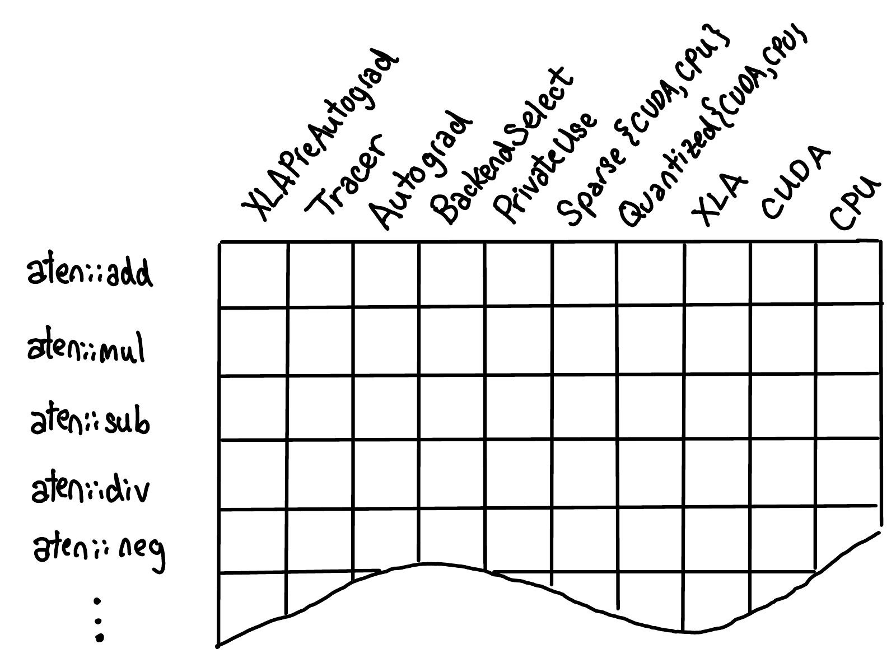
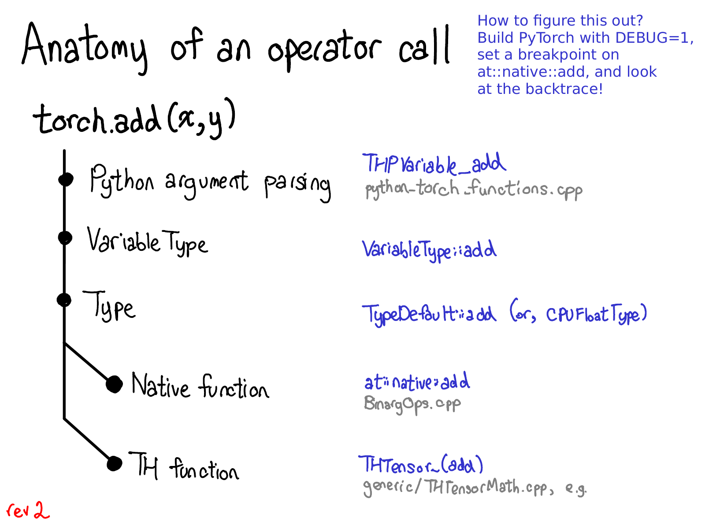
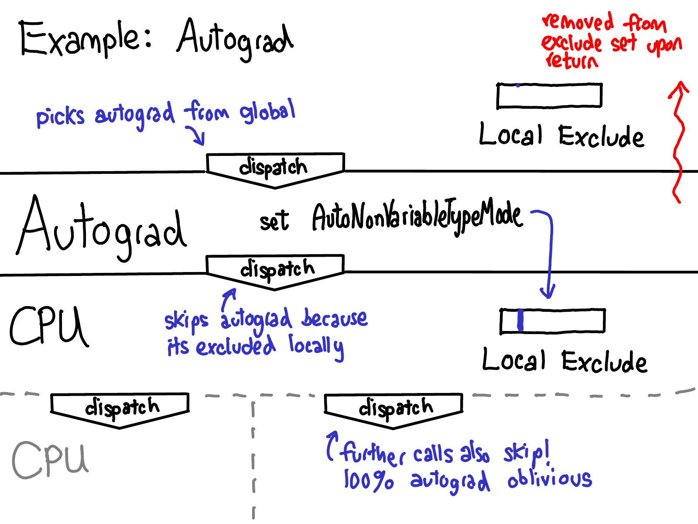

# ⚙️ The C10 Dispatcher

## Table of Contents

- [[#1. Motivation and Architecture Overview|1. Motivation and Architecture Overview]]
  - [[#1.1 Before the Dispatcher: The Type Object|1.1 Before the Dispatcher: The Type Object]]
  - [[#1.2 Adding a Feature: The VariableType Example|1.2 Adding a Feature: The VariableType Example]]
  - [[#1.3 Why This Breaks: The Combinatorial Explosion|1.3 Why This Breaks: The Combinatorial Explosion]]
  - [[#1.4 Multiple Dispatch|1.4 Multiple Dispatch]]
  - [[#1.5 How the C10 Dispatcher Fixes These Issues|1.5 How the C10 Dispatcher Fixes These Issues]]
  - [[#1.6 The Two-Level Table|1.6 The Two-Level Table]]
  - [[#1.7 Cross-Cutting Concerns as First-Class Citizens|1.7 Cross-Cutting Concerns as First-Class Citizens]]
- [[#2. Dispatch Keys and DispatchKeySet|2. Dispatch Keys and DispatchKeySet]]
  - [[#2.1 DispatchKey: the Enum|2.1 DispatchKey: the Enum]]
  - [[#2.2 DispatchKeySet: the 64-Bit Bitmask|2.2 DispatchKeySet: the 64-Bit Bitmask]]
  - [[#2.3 Priority Ordering|2.3 Priority Ordering]]
  - [[#2.4 Computing the Keyset at Runtime|2.4 Computing the Keyset at Runtime]]
  - [[#2.5 Toy Python Implementation|2.5 Toy Python Implementation]]
- [[#3. The Dispatch Table|3. The Dispatch Table]]
  - [[#3.1 OperatorHandle|3.1 OperatorHandle]]
  - [[#3.2 Kernel Lookup|3.2 Kernel Lookup]]
  - [[#3.3 Three Registration Slots|3.3 Three Registration Slots]]
- [[#4. Operator Registration|4. Operator Registration]]
  - [[#4.1 TORCH_LIBRARY and TORCH_LIBRARY_IMPL|4.1 TORCH_LIBRARY and TORCH_LIBRARY_IMPL]]
  - [[#4.2 native_functions.yaml and Codegen|4.2 native_functions.yaml and Codegen]]
  - [[#4.3 Unboxed and Boxed Registration|4.3 Unboxed and Boxed Registration]]
  - [[#4.4 Example: Registering a Custom Op|4.4 Example: Registering a Custom Op]]
- [[#5. Boxed vs. Unboxed Calling Convention|5. Boxed vs. Unboxed Calling Convention]]
  - [[#5.1 Unboxed Convention|5.1 Unboxed Convention]]
  - [[#5.2 Boxed Convention and IValue|5.2 Boxed Convention and IValue]]
  - [[#5.3 Adapters: Boxing an Unboxed Kernel|5.3 Adapters: Boxing an Unboxed Kernel]]
  - [[#5.4 Why Fallbacks Need Boxing|5.4 Why Fallbacks Need Boxing]]
  - [[#5.5 Boxed Fallback Kernels|5.5 Boxed Fallback Kernels]]
- [[#6. Cross-Cutting Dispatch Keys in Depth|6. Cross-Cutting Dispatch Keys in Depth]]
  - [[#6.1 BackendSelect|6.1 BackendSelect]]
  - [[#6.2 Autograd and AutogradCUDA|6.2 Autograd and AutogradCUDA]]
  - [[#6.3 Functionalize|6.3 Functionalize]]
  - [[#6.4 PythonKey|6.4 PythonKey]]
  - [[#6.5 CompositeImplicitAutograd|6.5 CompositeImplicitAutograd]]
  - [[#6.6 CompositeExplicitAutograd|6.6 CompositeExplicitAutograd]]
- [[#7. Tracing the Full Call Stack for torch.add(x, y)|7. Tracing the Full Call Stack for torch.add(x, y)]]
- [[#8. The redispatch Mechanism|8. The redispatch Mechanism]]
  - [[#8.1 Why Masking Rather Than a Direct Call|8.1 Why Masking Rather Than a Direct Call]]
  - [[#8.2 Guard-Based vs. Explicit redispatch|8.2 Guard-Based vs. Explicit redispatch]]
- [[#References|References]]

---

## 1. Motivation and Architecture Overview

### 1.1 Before the Dispatcher: The Type Object

Before the C10 dispatcher landed (roughly PyTorch 1.3–1.4), every tensor carried a pointer to a `Type` object — a C++ abstract base class with one pure virtual method for every PyTorch operator. The full definition had around 600 methods:

```cpp
// Simplified from aten/src/ATen/Type.h (pre-dispatcher)
struct Type {
    // One pure virtual method per operator
    virtual Tensor add(const Tensor& self, const Tensor& other, Scalar alpha) const = 0;
    virtual Tensor mul(const Tensor& self, const Tensor& other) const = 0;
    virtual Tensor relu(const Tensor& self) const = 0;
    virtual Tensor mm(const Tensor& self, const Tensor& mat2) const = 0;
    virtual Tensor conv2d(const Tensor& input, const Tensor& weight,
                          const Tensor& bias, IntArrayRef stride,
                          IntArrayRef padding, IntArrayRef dilation,
                          int64_t groups) const = 0;
    // ... ~595 more methods
    
    virtual Backend backend() const = 0;
    virtual ScalarType scalarType() const = 0;
};
```

Each concrete backend provided a full override of every method. The backends were further split by dtype, yielding a class per (device, dtype) pair:

```cpp
struct CPUFloatType : public Type {
    Backend backend() const override { return Backend::CPU; }
    ScalarType scalarType() const override { return ScalarType::Float; }

    Tensor add(const Tensor& self, const Tensor& other, Scalar alpha) const override {
        // dispatch to CPU float ATen kernel
        return at::native::add_cpu(self, other, alpha);
    }
    Tensor relu(const Tensor& self) const override {
        return at::native::relu_cpu(self);
    }
    // ... implement all ~600 methods
};

struct CUDAHalfType : public Type {
    Backend backend() const override { return Backend::CUDA; }
    ScalarType scalarType() const override { return ScalarType::Half; }

    Tensor add(const Tensor& self, const Tensor& other, Scalar alpha) const override {
        return at::native::add_cuda_half(self, other, alpha);
    }
    // ... implement all ~600 methods
};
```

When you wrote `x + y` in Python, ATen called `x.type().add(x, y)` — single dynamic dispatch through the `Type*` pointer stored inside the tensor's `TensorImpl`.

> [!INFO] How many Type subclasses existed?
> In practice: `{CPU, CUDA, HIP, MKLDNN, OpenCL, ...} × {Float, Double, Half, Int, Long, ...}` ≈ 5 devices × 10 dtypes = **~50 concrete `Type` subclasses**, each implementing ~600 virtual methods. This was ~30,000 lines of largely redundant C++ code auto-generated from a script.

### 1.2 Adding a Feature: The VariableType Example

Autograd was the first major cross-cutting feature. The requirement: when a tensor has `requires_grad=True`, calling `add` should (a) run the actual addition, (b) record a `AddBackward` node on the autograd tape, and (c) return a result tensor whose `grad_fn` points to that node.

Under the `Type` model, the only way to intercept every operator for autograd was to create a *new subclass* of every backend type, overriding every method:

```cpp
// Simplified from torch/csrc/autograd/generated/VariableType.cpp
struct VariableType : public Type {
    // Wrap the underlying real type (CPU, CUDA, etc.)
    const Type& baseType;
    explicit VariableType(const Type& base) : baseType(base) {}

    Tensor add(const Tensor& self, const Tensor& other, Scalar alpha) const override {
        // 1. Unwrap Variable → underlying Tensor
        auto& self_  = static_cast<const Variable&>(self).data();
        auto& other_ = static_cast<const Variable&>(other).data();

        // 2. Set up gradient bookkeeping
        std::shared_ptr<AddBackward0> grad_fn;
        if (compute_requires_grad(self, other)) {
            grad_fn = std::make_shared<AddBackward0>();
            grad_fn->self_scalar_type = self.scalar_type();
            // ... capture saved tensors, set edge connections
        }

        // 3. Call real kernel via the wrapped base type
        auto result = baseType.add(self_, other_, alpha);

        // 4. Wrap result back into a Variable with grad_fn attached
        auto output = as_variable(result);
        if (grad_fn) {
            set_history(output, grad_fn);
        }
        return output;
    }

    // Repeat this pattern for EVERY other operator: relu, mm, conv2d, ...
    Tensor relu(const Tensor& self) const override {
        auto& self_ = static_cast<const Variable&>(self).data();
        std::shared_ptr<ReluBackward0> grad_fn;
        if (compute_requires_grad(self)) {
            grad_fn = std::make_shared<ReluBackward0>();
            grad_fn->self_ = SavedVariable(self, false);
        }
        auto result = baseType.relu(self_);
        auto output = as_variable(result);
        if (grad_fn) set_history(output, grad_fn);
        return output;
    }

    // ... ~600 more methods, all following the same boilerplate
};
```

*The generated `VariableType.cpp` was over 1 MB of code* — primarily boilerplate that repeated the same pattern (unwrap → save inputs → call base → wrap result → attach grad_fn) for each of ~600 operators. A new operator required hand-editing (or codegen-editing) this file. Any bug in the wrapper pattern could silently produce wrong gradients for just one operator.

> [!EXAMPLE] What adding `torch.atan2` looked like before the dispatcher
> Adding a new operator required:
> 1. Add `virtual Tensor atan2(...) = 0` to `Type`.
> 2. Implement `atan2` in every backend (`CPUFloatType`, `CUDAHalfType`, ... × 50 subclasses).
> 3. Add `atan2` to `VariableType` with the gradient wrapper.
> 4. Add a derivative formula to `derivatives.yaml` so the codegen could produce the `VariableType` entry.
>
> Steps 2–3 alone touched 50+ files. With the dispatcher, only steps 4 + a native kernel are needed.

### 1.3 Why This Breaks: The Combinatorial Explosion

Autograd was only the beginning. As PyTorch grew, more cross-cutting features appeared:

| Feature | What it needed |
|---------|---------------|
| Autograd | `VariableType` wrapping every operator |
| JIT Tracing (`torch.jit.trace`) | `TracingType` recording every operator |
| Profiling | `ProfilingType` timing every operator |
| Quantization | `QuantizedCPUType` / `QuantizedCUDAType` for every op |
| Named tensors | `NamedType` propagating dim names through every op |
| XLA (Google TPUs) | New backend subclasses for every dtype |

Each new feature either required its own `Type` subclass wrapping the previous chain, or a combinatorial subclass merging multiple features. Composing autograd + tracing + profiling for CUDA float32 required something like:

```
ProfilingType → TracingType → VariableType → CUDAFloatType
```

This chain was:
- **Implicit** — constructed through a sequence of pointer assignments, not visible at any one call site
- **Fragile** — reordering features in the chain could change semantics silently
- **Unextensible** — a third-party backend (XLA, IPEX) had to subclass PyTorch-internal types and re-implement all wrappers

**Definition (Type Hierarchy Complexity).** With $B$ backends and $F$ cross-cutting features, the `Type` model requires $O(B \times F)$ subclasses if features chain linearly, or $O(B \times 2^F)$ if any subset of features must be composable. Each subclass reimplements all $\sim 600$ operator methods, giving $O(600 \cdot B \cdot F)$ lines of generated code — which scaled to hundreds of thousands of lines in practice.

### 1.4 Multiple Dispatch

The `Type` model used *single dispatch*: `x.type().add(x, y)` dispatches on the type of `x` only. But `add(x, y)` conceptually depends on the types of *both* arguments. What if `x` is a CPU tensor and `y` is a CUDA tensor? What if `x` is dense and `y` is sparse?

**Definition (Single Dispatch).** *Single dispatch* selects a method implementation based on the runtime type of one distinguished argument (the *receiver*). In C++ this is virtual dispatch on `this`. In Python, it is `x.method(y)` — the type of `y` does not influence which `method` is called.

**Definition (Multiple Dispatch).** *Multiple dispatch* (also called *multimethods*) selects an implementation based on the runtime types of **all** arguments. A call `f(x, y)` dispatches on `(type(x), type(y))` jointly.

```python
# Single dispatch: only x's type matters
class Tensor:
    def add(self, other):   # self is the one dispatched on
        if type(self) is CUDATensor:
            return cuda_add(self, other)  # other's type is ignored here
        ...

# Multiple dispatch: both types matter
@multimethod
def add(x: CPUTensor, y: CPUTensor): return cpu_add(x, y)

@multimethod
def add(x: CUDATensor, y: CUDATensor): return cuda_add(x, y)

@multimethod
def add(x: SparseTensor, y: DenseTensor): return sparse_dense_add(x, y)
```

Languages like [Julia](https://docs.julialang.org/en/v1/manual/methods/) have multiple dispatch built in. C++ and Python have only single dispatch natively; multiple dispatch is simulated with patterns like the *visitor* (double dispatch) or explicit `isinstance` chains.

**The pre-dispatcher PyTorch workaround.** `add(x, y)` dispatched on `x.type()` only. If `y` had a different type (e.g., sparse), the `Type::add` implementation had to check `y`'s type manually with `if (y.is_sparse()) { ... }` — essentially manual multiple dispatch inside a singly-dispatched method. This was ad hoc, unsystematic, and easy to forget.

**How the C10 dispatcher handles multiple dispatch.** At call time, the `DispatchKeySet` is computed as the **union** of the dispatch key sets of *all* tensor arguments:

```cpp
// Pseudocode for keyset computation at call time
DispatchKeySet keyset;
for (const Tensor& t : all_tensor_args) {
    keyset |= t.key_set();           // union across all inputs
}
keyset |= c10::tls_local_dispatch_key_set().included_;  // thread-local keys
```

The highest-priority key in the union wins. This is a principled form of multiple dispatch: the result reflects the most "demanding" type among all arguments. If any argument is on CUDA, the CUDA key is active. If any argument requires grad, the Autograd key is active.

> [!NOTE] Priority as type specificity
> In classical multiple dispatch, the "most specific" matching signature wins. In PyTorch's dispatcher, "most specific" maps to "highest priority key." `Autograd` has higher priority than `CUDA` — meaning autograd interceptors fire before device kernels, regardless of which argument triggers the autograd key.

> [!QUESTION] Exercise 1: The Type Hierarchy Problem
> *This problem establishes why the pre-dispatcher design was architecturally unsound.*
>
> > **Prerequisites:** [[#1.3 Why This Breaks: The Combinatorial Explosion|1.3 Why This Breaks: The Combinatorial Explosion]]
>
> Suppose PyTorch supports $B$ backends (CPU, CUDA, XLA, ...) and $F$ cross-cutting features (Autograd, Tracing, Profiling, ...). Under the old `Type` virtual-table design, roughly how many distinct `Type` subclasses are needed to support all combinations? What does this count become under the dispatcher's single-table design?

> [!TIP]- Solution to Exercise 1
> **Key insight:** The old design requires composing each backend with each feature subset; the dispatcher separates them entirely.
>
> **Sketch:**
> - **Type model:** $O(B \times F)$ subclasses if features chain linearly (each feature wraps the previous), or $O(B \times 2^F)$ if any subset must be simultaneously active. Each subclass re-implements all $\sim 600$ operator methods.
> - **Dispatcher:** $O(B + F)$ registrations — $B$ backend kernels (one per operator per backend) plus $F$ fallback kernels (one per cross-cutting key, shared across all operators). The fallback registration is the key saving: one kernel handles all operators for that feature.

### 1.5 How the C10 Dispatcher Fixes These Issues

The dispatcher addresses each problem from §1.3 directly:

| Old problem | Dispatcher solution |
|------------|-------------------|
| Cross-cutting features needed a `Type` subclass per backend | A *fallback* kernel registered once for a `DispatchKey` applies to all backends and all operators |
| Composing $F$ features meant $O(B \cdot F)$ subclasses | Features are independent table entries; order is determined by key priority, not class hierarchy |
| No fallback / decomposition story | `CompositeImplicitAutograd` keys register one implementation that any backend can inherit |
| Third-party backends had to fork internal types | Backends register their own `TORCH_LIBRARY_IMPL` without modifying PyTorch source |
| Single dispatch only | `DispatchKeySet` is the union of all argument keysets → principled multiple dispatch |
| Adding an operator required editing 50+ files | One native kernel + one codegen entry; all features inherit via fallbacks |

*The fundamental insight is separating the two axes:* operators (rows) and dispatch keys (columns) are orthogonal. Adding a new operator adds a row; adding a new feature adds a column. Neither requires touching the other.

### 1.6 The Two-Level Table

The C10 dispatcher replaces the `Type` chain with a single, unified two-level lookup:

$$\text{operator name} \xrightarrow{\text{schema lookup}} \texttt{OperatorHandle} \xrightarrow{\text{key lookup}} \text{kernel function pointer}$$

**Definition (Dispatch Table).** For each registered operator $op$, the dispatcher maintains an `OperatorHandle` containing a fixed-size array of *kernel function pointers* indexed by `DispatchKey`. The key to use is computed dynamically at call time from the set of tensor arguments and thread-local state, yielding a `DispatchKeySet`. The highest-priority key present in that set with a registered kernel is selected.



*Yang (2020): The dispatch table. Each operator (row) has one slot per dispatch key (column). A cell contains a function pointer when a kernel has been registered for that (operator, key) pair, and is null otherwise. The dispatcher selects the highest-priority non-null cell for the current call.*

### 1.7 Cross-Cutting Concerns as First-Class Citizens

The key design insight is that features like autograd, tracing, and functionalization are expressed as *additional dispatch keys*, not as an additional class hierarchy. Each such key registers a *fallback* kernel that intercepts any operator call, performs its cross-cutting work, and then calls `redispatch` to continue down the priority stack to the next key.

**This means adding a new cross-cutting feature requires:**
1. Defining a new `DispatchKey` enum value.
2. Registering one fallback kernel for that key — once, for all operators.
3. Zero changes to existing backend kernels.

Compare to the `VariableType` approach: instead of ~600 autograd wrappers (one per operator), the autograd fallback is a **single boxed kernel** that intercepts all operators via the boxed calling convention, performs gradient bookkeeping generically using the operator's registered derivative formula, and redispatches. The per-operator gradient formulas live in `derivatives.yaml` — not in per-operator C++ wrapper functions.

---

---

## 2. Dispatch Keys and DispatchKeySet ⚙️

### 2.1 DispatchKey: the Enum

**Definition (DispatchKey).** A `DispatchKey` is a named constant from an enum (defined in `c10/core/DispatchKey.h`) identifying either a *backend* (a physical compute substrate) or a *cross-cutting concern* (a behavioral modifier applied before/after the backend kernel). Representative values:

| Category | Keys |
|----------|------|
| Hardware backends | `CPU`, `CUDA`, `MPS`, `XLA`, `Meta`, `Lazy` |
| Per-backend autograd | `AutogradCPU`, `AutogradCUDA`, `AutogradXLA`, ... |
| Alias: all autograd backends | `Autograd` (expands to all `Autograd*` keys at registration) |
| Factory / device selection | `BackendSelect` |
| Python interop | `Python` (called `PythonKey` in user-facing docs) |
| Functional transforms | `Functionalize` |
| Tracing | `Tracer` |
| Composite aliases | `CompositeImplicitAutograd`, `CompositeExplicitAutograd` |
| Functional transforms (functorch) | `FuncTorchGradWrapper`, `FuncTorchBatched`, `FuncTorchVmapMode` |

The enum is organized so that **higher-numbered keys have higher priority**. The dispatcher uses the most-significant-bit position of the `DispatchKeySet` bitmask to resolve ties.

### 2.2 DispatchKeySet: the 64-Bit Bitmask

**Definition (DispatchKeySet).** A `DispatchKeySet` is a `uint64_t` where each bit corresponds to one `DispatchKey`. Bit $i$ is set if and only if key $i$ is active. The set supports standard bitwise operations: union (`|`), intersection (`&`), complement (`~`), and difference (`&~`).

Internally, the 64 bits are split into two regions:

$$\underbrace{\text{high bits}}_{\text{functionality keys (Autograd, Functionalize, ...)}} \;|\; \underbrace{\text{low bits}}_{\text{backend component keys (CPU, CUDA, ...)}}$$

The lower ~12 bits encode the backend component (CPU, CUDA, MPS, etc.); the remaining upper bits encode functionality keys. A *runtime key* for a per-backend functionality (e.g. `AutogradCUDA`) is computed by combining the functionality bit with the backend bit at dispatch time via `toRuntimePerBackendFunctionalityKey(functionality, backend)`.

**Definition (highest-priority key extraction).** The dispatcher finds the highest-priority active key by locating the most-significant set bit in the `uint64_t`:

```cpp
// From c10/core/DispatchKeySet.h
DispatchKey highestPriorityTypeId() const {
    auto functionality = highestFunctionalityKey();
    if (isPerBackendFunctionality(functionality)) {
        return toRuntimePerBackendFunctionalityKey(
            functionality, highestBackendKey());
    }
    return functionality;
}
```

The function `highestFunctionalityKey()` calls `countLeadingZeros` on the `repr_` field — a single hardware instruction on modern CPUs — making key resolution $O(1)$.

### 2.3 Priority Ordering

The priority ordering from high to low (highest fires first) is approximately:

```
FuncTorchDynamicLayerFrontMode  (outermost functorch transform)
FuncTorchGradWrapper            (grad() transform)
FuncTorchVmapMode               (vmap() transform)
Python                          (__torch_dispatch__)
Functionalize                   (AOTAutograd functional transform)
AutogradCUDA / AutogradCPU      (per-backend autograd wrappers)
Autograd                        (alias: all per-backend autograd keys)
BackendSelect                   (device selection for factory ops)
CUDA / CPU / MPS / XLA / ...    (actual backend computation)
```



*Yang (2019): Visual depiction of the dispatch key priority order. Keys toward the top fire first; each key's kernel typically calls redispatch to continue down the stack.*

*Important:* `CompositeImplicitAutograd` and `CompositeExplicitAutograd` are *alias keys* used only at registration time. They are expanded to fill multiple concrete key slots (all backend keys, and the composite keys) when the operator is registered. They do not appear as bits in a runtime `DispatchKeySet`.

### 2.4 Computing the Keyset at Runtime

At every operator call site, the dispatcher builds the current `DispatchKeySet` as:

$$\text{keyset} = \Bigl(\bigcup_{t \in \text{tensor args}} \text{key\_set}(t)\Bigr) \cup \text{TLS}_{\text{include}} \cup \text{global} \;\setminus\; \text{TLS}_{\text{exclude}}$$

The four components are:

| Component | Source | Example |
|-----------|--------|---------|
| $\bigcup \text{key\_set}(t)$ | Tensor arguments | `AutogradCUDA | CUDA` for a CUDA tensor with `requires_grad=True` |
| $\text{TLS}_{\text{include}}$ | Thread-local include set | `Tracer` when inside `torch.jit.trace` |
| $\text{global}$ | Always-on global keys | `BackendSelect`, `ADInplaceOrView` |
| $\text{TLS}_{\text{exclude}}$ | Thread-local exclude set | `AutogradCUDA` when inside `torch.no_grad()` or after an Autograd kernel has run |



*Yang (2020): How the `DispatchKeySet` is assembled. All four sources are combined with bitwise OR, then the TLS exclude set is subtracted with `& ~exclude`. The resulting bitmask is the one whose highest set bit selects the kernel.*

### 2.5 Toy Python Implementation

```python
from __future__ import annotations
from enum import IntEnum

class DispatchKey(IntEnum):
    CPU              = 1
    CUDA             = 2
    AutogradCPU      = 10
    AutogradCUDA     = 11
    Functionalize    = 20
    Python           = 30
    BackendSelect    = 5

class DispatchKeySet:
    def __init__(self, *keys: DispatchKey):
        self._bits: int = 0
        for k in keys:
            self._bits |= (1 << int(k))

    def __or__(self, other: DispatchKeySet) -> DispatchKeySet:
        result = DispatchKeySet()
        result._bits = self._bits | other._bits
        return result

    def __and__(self, mask: DispatchKeySet) -> DispatchKeySet:
        result = DispatchKeySet()
        result._bits = self._bits & mask._bits
        return result

    def exclude(self, other: DispatchKeySet) -> DispatchKeySet:
        result = DispatchKeySet()
        result._bits = self._bits & ~other._bits
        return result

    def highest_priority_key(self) -> DispatchKey | None:
        if self._bits == 0:
            return None
        msb_index = self._bits.bit_length() - 1
        return DispatchKey(msb_index)

    def has(self, key: DispatchKey) -> bool:
        return bool(self._bits & (1 << int(key)))

    def __repr__(self) -> str:
        active = [k.name for k in DispatchKey if self.has(k)]
        return f"DispatchKeySet({{{', '.join(active)}}})"


def compute_keyset(
    tensor_keysets: list[DispatchKeySet],
    tls_include: DispatchKeySet,
    tls_exclude: DispatchKeySet,
    global_set: DispatchKeySet,
) -> DispatchKeySet:
    combined = global_set | tls_include
    for ks in tensor_keysets:
        combined = combined | ks
    return combined.exclude(tls_exclude)


cuda_tensor_ks = DispatchKeySet(DispatchKey.AutogradCUDA, DispatchKey.CUDA)
global_ks = DispatchKeySet(DispatchKey.BackendSelect)
tls_include = DispatchKeySet()
tls_exclude = DispatchKeySet()

keyset = compute_keyset([cuda_tensor_ks], tls_include, tls_exclude, global_ks)
print(keyset)
print("Highest:", keyset.highest_priority_key())
```

Running this prints:

```
DispatchKeySet({CUDA, BackendSelect, AutogradCUDA})
Highest: AutogradCUDA
```

**The `bit_length() - 1` trick finds the most-significant set bit in $O(1)$, mirroring `countLeadingZeros` in the C++ implementation.**

---

> [!QUESTION] Exercise 2: Keyset Subtraction for Redispatch
> *This problem establishes how the Autograd key is masked out after it fires.*
>
> > **Prerequisites:** [[#2.4 Computing the Keyset at Runtime|2.4 Computing the Keyset at Runtime]], [[#2.5 Toy Python Implementation|2.5 Toy Python Implementation]]
>
> Using the `DispatchKeySet` class above, write a function `after_autograd(keyset)` that returns the keyset that would be used after the `AutogradCUDA` kernel has fired — that is, the keyset passed to `redispatch`. Then call it on the `keyset` computed above and verify the new highest-priority key is `CUDA`.

> [!TIP]- Solution to Exercise 2
> **Key insight:** The Autograd kernel adds `AutogradCUDA` (and all other autograd keys) to the thread-local exclude set before calling redispatch. We simulate this with `exclude`.
>
> **Sketch:**
> ```python
> autograd_keys = DispatchKeySet(DispatchKey.AutogradCUDA, DispatchKey.AutogradCPU)
>
> def after_autograd(keyset: DispatchKeySet) -> DispatchKeySet:
>     return keyset.exclude(autograd_keys)
>
> reduced = after_autograd(keyset)
> print(reduced)
> print("Highest after autograd:", reduced.highest_priority_key())
> ```
> Output: `DispatchKeySet({CUDA, BackendSelect})` and `Highest after autograd: BackendSelect`. Since `BackendSelect` is a fallthrough (no kernel registered for add), it skips immediately to `CUDA`.

---

## 3. The Dispatch Table 📋

### 3.1 OperatorHandle

**Definition (OperatorHandle).** For each registered operator, the dispatcher allocates one `OperatorHandle` object on the heap (via `std::list` to ensure stable addresses). The `OperatorHandle` contains:

- The operator's *schema* (a `FunctionSchema` object holding the operator name, overload name, argument types, return types, and aliasing annotations).
- A fixed-size dispatch table: an array `dispatch_table_` indexed by `DispatchKey` enum value, each cell holding a `KernelFunction`.
- A `std::list<AnnotatedKernel>` for each key, preserving registration history.

**Definition (KernelFunction).** A `KernelFunction` stores a pair: an optional *unboxed function pointer* (type-erased as `void*` but cast to the correct signature at call time) and a mandatory *boxed function pointer* (always present; used as fallback when no unboxed pointer is available). When a kernel is registered as unboxed, the dispatcher also auto-generates and stores its boxed wrapper.



*Yang (2020): The full dispatch table grid. Rows are operators; columns are dispatch keys. Most cells are empty (no kernel). Composite keys fill entire rows. Backend-specific kernels fill individual cells. The shading distinguishes exact registrations, catch-all registrations, and backend fallbacks.*

### 3.2 Kernel Lookup

Given a `DispatchKeySet`, the lookup proceeds in two steps:

1. **Extract key:** `key = keyset.highestPriorityTypeId()` — the $O(1)$ MSB extraction described in §2.2.
2. **Index table:** `kernel = dispatch_table_[static_cast<uint8_t>(key)]`.

If the cell is non-null, the kernel is called. If null, the dispatcher advances to the next key by removing `key` from the keyset and repeating — this is called *falling through*.

> [!NOTE] Fallthrough optimization
> In practice, the dispatcher does not loop linearly. It precomputes a *dispatch table* with all fallthrough chains resolved. `computeDispatchTableEntryWithNoFallthrough` propagates fallthrough pointers at registration time so the hot dispatch path is always a single array lookup.

### 3.3 Three Registration Slots

For any given (operator, dispatch key) pair, there are three levels of registration, resolved in this order of precedence:

| Slot | How registered | Scope | Priority |
|------|---------------|-------|----------|
| *Exact kernel* | `m.impl("op", key, fn)` | One operator × one key | Highest |
| *Backend fallback* | `m.fallback(key, fn)` (column-wise) | One key × all operators | Middle |
| *Catch-all* | `m.impl("op", DispatchKey::CompositeImplicitAutograd, fn)` | One operator × all keys | Lowest |

*Exact kernels* have the highest priority: if an op has both a `CUDA` exact kernel and a `CompositeImplicitAutograd` catch-all, the `CUDA` kernel wins for CUDA tensors.

*Backend fallbacks* fill an entire column: registering a profiling fallback at `Profiler` means every operator will be intercepted by the profiler on every call, regardless of whether an exact profiling kernel was registered.

*Catch-all* (composite) registrations fill an entire row: a `CompositeImplicitAutograd` kernel claims all backend slots simultaneously, expressing "this operator decomposes into primitives regardless of backend."

---

> [!QUESTION] Exercise 3: Registration Precedence
> *This problem establishes how registration priority interacts with the dispatch table.*
>
> > **Prerequisites:** [[#3.3 Three Registration Slots|3.3 Three Registration Slots]]
>
> Suppose `aten::special_op` is registered with a `CompositeImplicitAutograd` kernel that decomposes into `aten::add` and `aten::mul`. Later, a custom CUDA backend registers an exact kernel at `CUDA` for `special_op`. For a CUDA tensor with `requires_grad=True`, list in order all the dispatch keys that will fire when `special_op(x)` is called, and which kernel runs at each.

> [!TIP]- Solution to Exercise 3
> **Key insight:** Exact registrations override composite catch-alls for their specific key. The `AutogradCUDA` slot for `special_op` is inherited from the composite decomposition (since no Autograd exact kernel was explicitly registered), so it fires first.
>
> **Sketch:**
> 1. `AutogradCUDA` fires: the autograd wrapper (from the composite decomposition via `CompositeImplicitAutograd`) saves inputs, constructs a `grad_fn`, calls `redispatch` excluding autograd keys.
> 2. `CUDA` fires: the exact custom CUDA kernel registered for `special_op` — not the composite decomposition. This is the key point: even though `CompositeImplicitAutograd` filled the row, the explicit `CUDA` registration overwrites that cell.
>
> If no exact CUDA kernel had been registered, step 2 would instead execute the composite decomposition's `add` + `mul` chain, each of which dispatches independently through the full pipeline.

---

## 4. Operator Registration 🔧

### 4.1 TORCH_LIBRARY and TORCH_LIBRARY_IMPL

Registration in C++ uses two macros:

**`TORCH_LIBRARY(ns, m)`** — declares a *namespace* and registers *schemas* (the operator signature contract). No kernel is specified here; only the type contract.

```cpp
TORCH_LIBRARY(myops, m) {
    m.def("add_scaled(Tensor self, Tensor other, float scale) -> Tensor");
}
```

**`TORCH_LIBRARY_IMPL(ns, key, m)`** — registers a *kernel* for a specific dispatch key. Multiple `IMPL` blocks can exist for the same namespace, one per key.

```cpp
TORCH_LIBRARY_IMPL(myops, CPU, m) {
    m.impl("add_scaled", add_scaled_cpu);
}

TORCH_LIBRARY_IMPL(myops, CUDA, m) {
    m.impl("add_scaled", add_scaled_cuda);
}

TORCH_LIBRARY_IMPL(myops, Autograd, m) {
    m.impl("add_scaled", torch::autograd::autogradNotImplementedFallback());
}
```

The `TORCH_LIBRARY` blocks are processed at static initialization time (before `main()`). The `Dispatcher::singleton()` object accumulates all registrations and computes the dispatch table entries lazily or eagerly depending on when they arrive.

### 4.2 native_functions.yaml and Codegen

Built-in ATen operators are declared in `aten/src/ATen/native/native_functions.yaml`. This YAML file is the *source of truth* for the operator contract. Each entry has the form:

```yaml
- func: add.Tensor(Tensor self, Tensor other, *, Scalar alpha=1) -> Tensor
  variants: function, method
  dispatch:
    CPU: add_cpu
    CUDA: add_cuda
    SparseCPU: add_sparse_cpu
    SparseCUDA: add_sparse_cuda
    CompositeImplicitAutograd: add
```

The `dispatch:` block maps `DispatchKey` names to the C++ function name implementing that key. The `codegen` step (invoked at build time by `torchgen`) reads this YAML and generates:

| Generated artifact | Purpose |
|-------------------|---------|
| `Functions.h`, `Operators.h` | C++ API headers (`at::add(...)`) |
| `RegisterCPU.cpp`, `RegisterCUDA.cpp` | `TORCH_LIBRARY_IMPL` blocks that wire YAML entries to C++ functions |
| `VariableType_*.cpp` | Autograd wrapper functions for each op |
| `torch/csrc/autograd/generated/python_variable_methods.cpp` | Python `torch.*` and `Tensor.*` bindings (the `THPVariable_add` layer) |

The `variants: function, method` field controls whether `torch.add(x, y)` and `x.add(y)` are both generated. The aliasing annotation `Tensor(a!)` in the schema tells the compiler that the argument is written in place, allowing alias analysis downstream.

**Dispatch keywords recognized in the YAML:**

| Keyword | Meaning |
|---------|---------|
| `CPU`, `CUDA`, `MPS`, `XLA`, ... | Exact per-backend kernel |
| `CompositeImplicitAutograd` | Decomposition into primitives; autograd inherited |
| `CompositeExplicitAutograd` | Decomposition with a separately registered autograd formula |
| `CompositeExplicitAutogradNonFunctional` | Decomposition that uses aliasing ops internally |
| `Meta` | Abstract ("fake") kernel for shape inference without data |

### 4.3 Unboxed and Boxed Registration

`m.impl("op_name", fn)` registers `fn` as an *unboxed* kernel: `fn` is a typed C++ function pointer (or lambda) whose signature matches the operator schema exactly. The dispatcher stores it as-is and also auto-generates a boxed wrapper that packs/unpacks `IValue` arguments.

`m.impl("op_name", torch::CppFunction::makeFromBoxedFunction(&my_boxed_kernel))` registers a *boxed* kernel: `my_boxed_kernel` has the signature `void(const OperatorHandle&, DispatchKeySet, Stack*)`. It receives type-erased arguments and must manually unpack them. This is used for fallback kernels that must work for all operators without knowing their signatures.

### 4.4 Example: Registering a Custom Op

```cpp
#include <torch/library.h>
#include <ATen/ATen.h>

at::Tensor add_scaled_cpu(const at::Tensor& a, const at::Tensor& b, double s) {
    return (a + b) * s;
}

at::Tensor add_scaled_cuda(const at::Tensor& a, const at::Tensor& b, double s) {
    return (a + b) * s;
}

class AddScaledBackward : public torch::autograd::Function<AddScaledBackward> {
public:
    static at::Tensor forward(
        torch::autograd::AutogradContext* ctx,
        const at::Tensor& a,
        const at::Tensor& b,
        double s)
    {
        ctx->saved_data["scale"] = s;
        return add_scaled_cpu(a, b, s);
    }

    static torch::autograd::tensor_list backward(
        torch::autograd::AutogradContext* ctx,
        torch::autograd::tensor_list grad_outputs)
    {
        double s = ctx->saved_data["scale"].toDouble();
        auto g = grad_outputs[0] * s;
        return {g, g, at::Tensor{}};
    }
};

TORCH_LIBRARY(myops, m) {
    m.def("add_scaled(Tensor a, Tensor b, float s) -> Tensor");
}

TORCH_LIBRARY_IMPL(myops, CPU, m) {
    m.impl("add_scaled", add_scaled_cpu);
}

TORCH_LIBRARY_IMPL(myops, CUDA, m) {
    m.impl("add_scaled", add_scaled_cuda);
}

TORCH_LIBRARY_IMPL(myops, Autograd, m) {
    m.impl("add_scaled", torch::autograd::autogradFunctionFallback<AddScaledBackward>());
}
```

> [!WARNING] Static initialization ordering
> `TORCH_LIBRARY` and `TORCH_LIBRARY_IMPL` both execute at static initialization time. If a kernel is registered in a shared library that is loaded after the dispatcher has already processed some calls, the dispatch table must be updated retroactively. This is why the dispatcher stores registrations in a `std::list` rather than a flat array — insertions do not invalidate existing iterators.

---

> [!QUESTION] Exercise 4: Schema Mismatch
> *This problem establishes when schema validation catches misregistrations.*
>
> > **Prerequisites:** [[#4.1 TORCH_LIBRARY and TORCH_LIBRARY_IMPL|4.1 TORCH_LIBRARY and TORCH_LIBRARY_IMPL]]
>
> The schema `"add_scaled(Tensor a, Tensor b, float s) -> Tensor"` declares `s` as `float`. A C++ function `add_scaled_cpu(const at::Tensor& a, const at::Tensor& b, double s)` is registered. Will this cause an error? If so, at what point (compile time, registration time, or call time)?

> [!TIP]- Solution to Exercise 4
> **Key insight:** The dispatcher validates that the registered kernel's C++ type signature matches the schema's type contract at *registration time* using template metaprogramming (type traits that compare the C++ types against the schema's `ArgumentType` list).
>
> **Sketch:** In PyTorch's dispatcher, `float` in a schema corresponds to `double` in C++ (PyTorch uses `double` internally for float scalars). So this specific case is actually fine — `float` in schema maps to `double` in C++. However, a genuine mismatch (e.g. registering `int64_t` where `Tensor` is expected) would be caught at `m.impl(...)` call time via a static assertion failure, not at kernel call time. The `makeUnboxedOnlyFunctor` template instantiation fails to compile if the types do not match.

---

## 5. Boxed vs. Unboxed Calling Convention 📦

### 5.1 Unboxed Convention

**Definition (Unboxed Kernel).** An unboxed kernel is a C++ function whose signature matches the operator schema exactly, with each schema type mapped to its canonical C++ type:

| Schema type | C++ type |
|-------------|----------|
| `Tensor` | `const at::Tensor&` |
| `Tensor?` | `const std::optional<at::Tensor>&` |
| `int` | `int64_t` |
| `float` | `double` |
| `bool` | `bool` |
| `Scalar` | `const at::Scalar&` |
| `int[]` | `at::IntArrayRef` |

The dispatcher calls an unboxed kernel via a C++ function pointer cast — effectively a direct `call` instruction with no argument packing overhead. This is the calling convention for all built-in ATen kernels.

### 5.2 Boxed Convention and IValue

**Definition (IValue).** An `IValue` (short for *interpreter value*) is a tagged union that can hold any PyTorch value type. Internally it is a two-word struct: a payload word (holding the value or a pointer to heap-allocated data) and a tag word identifying the type. The possible tags include:

```
None, Tensor, Double, Int, Bool, String, Tuple, List,
GenericDict, Object, Capsule, RRef, Future, ...
```

**Definition (Stack).** A `Stack` is `using Stack = std::vector<IValue>`. Boxed kernels receive a `Stack*` and consume their arguments from the back of the stack, pushing their results back.

**Definition (Boxed Kernel).** A boxed kernel has the signature:

```cpp
void boxed_kernel(const OperatorHandle& op, DispatchKeySet ks, Stack* stack);
```

It receives a pointer to the current `Stack`, pops arguments in reverse order (last argument popped first), computes results, and pushes them. This convention allows a single kernel to work for any operator without knowing its signature at compile time.

### 5.3 Adapters: Boxing an Unboxed Kernel

When an unboxed kernel is registered, the dispatcher auto-generates a boxed wrapper via the template in `aten/src/ATen/core/boxing/impl/make_boxed_from_unboxed_functor.h`. The wrapper:

1. Pops $n$ `IValue`s from the stack.
2. Casts each to its corresponding C++ type (e.g. `ivalue.toTensor()`, `ivalue.toInt()`).
3. Calls the unboxed function with those typed arguments.
4. Pushes the result back as an `IValue`.

This boxing path is only exercised when the boxed convention is needed (e.g. when a fallback kernel must re-invoke the operator). The hot path (eager Python and C++ calls) always takes the unboxed shortcut.

### 5.4 Why Fallbacks Need Boxing

A *fallback kernel* (registered column-wise for an entire dispatch key) must intercept any operator, but the operator's argument types are not known at the time the fallback is written or compiled. The only way to write a single C++ function that handles `aten::add(Tensor, Tensor, Scalar)` and `aten::convolution(Tensor, Tensor, Tensor?, int[], int[], int[], bool, int[], int)` is through type erasure — hence boxing.

*Surprisingly,* the boxing overhead (stack allocation, `IValue` construction) is paid only by fallback paths. Normal eager execution of a built-in op always takes the unboxed path from the Python binding through to the kernel, incurring zero `IValue` allocations.

### 5.5 Boxed Fallback Kernels

Three important fallback kernels are implemented as boxed kernels:

**`CompositeImplicitAutograd`** — decomposes an operator into primitive ops that already have autograd formulas. Registered column-wise at the composite key. When an op's YAML entry specifies `CompositeImplicitAutograd: fn`, the function `fn` is a plain C++ function that calls other ATen ops; it does not need an autograd formula because autograd flows through the inner ops' `grad_fn` graphs automatically.

**`Functionalize`** — rewrites in-place mutations and aliasing view operations into functional (non-mutating, non-aliasing) equivalents. Used by AOTAutograd (see [[concepts/pytorch-internals/torch-compile/overview|torch.compile]]) to convert a stateful eager program into a pure functional graph that can be differentiated and compiled. Implemented as a boxed fallback because it must intercept all operators, including user-defined custom ops.

**`PythonKey`** — calls back into Python when `__torch_dispatch__` is active (see [[concepts/pytorch-internals/torch-fx|torch.fx]]). The boxed kernel packs all arguments into Python objects, calls the Python dispatch method, and unpacks the results. This is the mechanism underlying `torch.fx.Interpreter`, `make_fx`, and custom dispatch modes.

---

> [!QUESTION] Exercise 5: IValue Round-Trip
> *This problem establishes the overhead structure of the boxed calling convention.*
>
> > **Prerequisites:** [[#5.2 Boxed Convention and IValue|5.2 Boxed Convention and IValue]], [[#5.3 Adapters: Boxing an Unboxed Kernel|5.3 Adapters: Boxing an Unboxed Kernel]]
>
> A fallback boxed kernel is registered for dispatch key `Profiler`. When `aten::add(x, y)` is called with two CUDA tensors, how many times (if any) are `IValue` objects constructed and destroyed over the full dispatch sequence: from the Python call, through the `Profiler` kernel, through `AutogradCUDA`, to the `CUDA` kernel?

> [!TIP]- Solution to Exercise 5
> **Key insight:** The boxed calling convention is exercised only when the fallback kernel is entered via the boxed path. But the hot path between Python and unboxed kernels does not construct `IValue` objects at all.
>
> **Sketch:**
> - Python → Dispatcher: zero `IValue` objects. The Python binding (`THPVariable_add`) unpacks Python objects directly into `at::Tensor` C++ objects and calls the typed C++ dispatcher API (`Dispatcher::call<Tensor, Tensor, Tensor, Scalar>(...)`).
> - Dispatcher → `Profiler` boxed kernel: one set of `IValue` constructions (one per argument). The boxing adapter wraps `x`, `y`, and `alpha` into `IValue` objects on the `Stack`. The profiler kernel pops them, records timing, and re-pushes them (or calls `redispatch` with the same stack).
> - Dispatcher → `AutogradCUDA`: if `AutogradCUDA` has an unboxed kernel (which it does — it is a generated C++ function), the arguments are unboxed back to `at::Tensor` for that call. One round-trip.
> - `AutogradCUDA` → `CUDA`: the `AutogradCUDA` kernel itself calls `redispatch` via the unboxed API — zero additional `IValue` constructions.
> - **Total:** one boxing (Python→Profiler) and one unboxing (Profiler→AutogradCUDA). All other transitions are unboxed.

---

## 6. Cross-Cutting Dispatch Keys in Depth 🔑


*Yang (2020): The full operator × dispatch-key grid. Cross-cutting keys (Autograd, Functionalize, Python) span entire columns — each cell in a cross-cutting column contains the same fallback kernel. Backend keys (CPU, CUDA) have sparse coverage — only operators that have been explicitly implemented for that backend.*

### 6.1 BackendSelect

**Purpose:** For *factory functions* (operators that create tensors rather than receiving them as input — e.g. `torch.zeros`, `torch.randn`), there are no tensor arguments from which to compute the backend bit. The `DispatchKeySet` from tensor arguments is empty. `BackendSelect` fires in this case.

**Invariant:** A `BackendSelect` kernel examines the `device=` keyword argument (or other hints like the `TensorOptions` struct) and determines the correct backend key, then calls `redispatch` with a keyset that includes the appropriate backend key but excludes `BackendSelect`.

**When it fires:** Always, for every operator call, because `BackendSelect` is in the global default include set. For non-factory ops, the `BackendSelect` cell contains a fallthrough pointer — it resolves immediately to the next key without doing any work.

### 6.2 Autograd and AutogradCUDA

**Purpose:** Constructs the autograd tape. For each differentiable op, a codegen'd wrapper (in `VariableType_*.cpp`) is registered at the per-backend autograd key (e.g. `AutogradCUDA` for CUDA ops). The `Autograd` alias key expands to all per-backend autograd keys at registration time.

**Invariant:** The autograd kernel must call `redispatch` with all autograd keys removed from the keyset before returning. Failure to do so causes infinite recursion because the same autograd kernel would fire again.

**What it does:**

```python
def autograd_kernel_for_add(x, y, alpha=1):
    # 1. Check if any input requires grad
    any_requires_grad = x.requires_grad or y.requires_grad

    # 2. Enter no-grad scope for the actual computation (adds Autograd to TLS exclude)
    with torch.no_grad():
        # 3. Re-dispatch to CUDA kernel
        result = dispatcher.redispatch(keyset_without_autograd, "aten::add", x, y, alpha)

    # 4. If grad is needed, wrap result with grad_fn
    if any_requires_grad:
        result = set_history(result, AddBackward0(x, y, alpha))

    return result
```

The `set_history` call creates an `AddBackward0` `Node` object, sets `result.grad_fn` to it, and records `x` and `y` as the saved inputs via `collect_next_edges`. See [[concepts/pytorch-internals/autograd-engine|Autograd Engine]] for the Node/Edge DAG internals.

### 6.3 Functionalize

**Purpose:** Converts stateful (in-place, aliasing view) programs into *functional* programs that use only value-semantics ops. This is required by AOTAutograd to produce a clean computation graph for the compiler backend.

**Invariant:** Every in-place op `op_` is replaced by `out = op(copy_of_self); self.copy_(out)` at the functional level. Every view op is replaced by `as_strided` with explicit stride arithmetic. The resulting graph has no aliasing, making it safe to reorder and fuse.

**When it fires:** Only when the `Functionalize` key is in the TLS include set — this key is not in the default global set. It is activated by `torch._dispatch.python.enable_python_dispatcher()` or internally by `make_fx` during AOTAutograd tracing.

### 6.4 PythonKey

**Purpose:** Calls back into Python when a `__torch_dispatch__` handler is active. This is the low-level mechanism underlying `torch.fx.Interpreter`, `make_fx`, and custom tensor subclasses that intercept all ops.

**Invariant:** The `Python` dispatch key is activated by pushing a Python dispatch mode onto the thread-local mode stack (via `_push_mode`). The boxed kernel packs all tensor arguments and keyword arguments into Python objects, looks up `__torch_dispatch__` on the mode, calls it, and unpacks the results.

**When it fires:** Whenever `torch.overrides.enable_reentrant_dispatch()` or any `__torch_dispatch__` context is active. The `Python` key sits above `Autograd` in the priority ordering, so it fires *before* the autograd wrapper — this means `__torch_dispatch__` sees the op before autograd has a chance to wrap the output. See [[concepts/pytorch-internals/torch-fx|torch.fx]] for how `make_fx` exploits this.

### 6.5 CompositeImplicitAutograd

**Purpose:** Registers an operator as a *decomposition* into more primitive ops. The term "Implicit" means the autograd formula is *implicit* — it is inherited automatically from the autograd formulas of the primitive ops in the decomposition.

**Invariant:** When `aten::addmm` is registered as `CompositeImplicitAutograd`, the kernel `addmm` decomposes into `mm` and `add`. Autograd for `addmm` is computed by differentiating through the `mm` and `add` ops, each of which has its own autograd formula. No explicit backward function is needed.

**Effect on the dispatch table:** Registering at `CompositeImplicitAutograd` fills the cells for all backend keys AND all autograd keys. An explicit backend registration (e.g. an optimized `CUDA` kernel for `addmm`) overrides the composite cell for that specific key.

> [!WARNING] CompositeImplicitAutograd and torch.compile
> Composite kernels can be problematic for `torch.compile` because the decomposition expands to more ops at trace time. For ops that should remain opaque to the compiler, `CompositeExplicitAutograd` or explicit per-backend registrations are preferred.

### 6.6 CompositeExplicitAutograd

**Purpose:** Like `CompositeImplicitAutograd`, but with an *explicit* hand-written autograd formula registered separately in `derivatives.yaml`. The decomposition is used for all backend computations, but the backward pass uses the custom formula rather than differentiating through the decomposition.

**When to use:** When the explicit formula is numerically superior to automatic differentiation through the decomposition — e.g. for `log_softmax`, where the naive backward through `exp`/`sum`/`log` is less numerically stable than a hand-derived formula.

---

> [!QUESTION] Exercise 6: CompositeImplicit vs. CompositeExplicit
> *This problem establishes when each composite key is appropriate.*
>
> > **Prerequisites:** [[#6.5 CompositeImplicitAutograd|6.5 CompositeImplicitAutograd]], [[#6.6 CompositeExplicitAutograd|6.6 CompositeExplicitAutograd]]
>
> Operator `aten::norm` computes $\|x\|_p = \left(\sum_i |x_i|^p\right)^{1/p}$. It decomposes into `abs`, `pow`, `sum`, `pow`. Should it be registered as `CompositeImplicitAutograd` or `CompositeExplicitAutograd`, and why? Would your answer change for $p = 1$ vs. $p = 2$?

> [!TIP]- Solution to Exercise 6
> **Key insight:** `CompositeImplicit` is correct when automatic differentiation through the decomposition is numerically stable and efficient. `CompositeExplicit` is needed when the naive backward is numerically problematic.
>
> **Sketch:** For general $p$, the backward of $\|x\|_p$ involves $\partial/\partial x_i = \text{sgn}(x_i) \cdot |x_i|^{p-1} / \|x\|_p^{p-1}$. Differentiating through `abs`→`pow`→`sum`→`pow` produces this formula automatically, but with potential issues at $x_i = 0$ for non-integer $p$ (since `pow(0, p-1)` is indeterminate when $p < 1$). For $p = 2$ (L2 norm), the formula simplifies to $x / \|x\|_2$, which is well-behaved except at $\|x\|_2 = 0$. In practice, PyTorch registers `norm` with `CompositeImplicitAutograd` but includes guards for the zero-norm degenerate case; a fully robust implementation would use `CompositeExplicitAutograd` with a numerically hardened backward.

---

## 7. Tracing the Full Call Stack for torch.add(x, y) 🔬

Let `x` and `y` be CUDA tensors with `requires_grad=True`. Here is the complete call stack from Python to the CUDA kernel and back.



*Yang (2019): The layered call chain for `torch.add`. Each layer is a separate dispatch key kernel; arrows represent function calls down (dispatch) and returns up (result propagation).*

**Step 1 — Python: `torch.add(x, y)`**

The Python interpreter looks up `torch.add`, which resolves to `THPVariable_add` — a C function generated by `torchgen` from `native_functions.yaml`. `THPVariable_add`:

1. Parses Python arguments using `PythonArgs` (generated argument-parsing code).
2. Converts Python `Tensor` objects to `at::Tensor` C++ objects.
3. Releases the GIL.
4. Calls `at::_ops::add_Tensor::call(self, other, alpha)`.

**Step 2 — ATen C++ API: `at::_ops::add_Tensor::call`**

This is a thin generated wrapper that:

1. Looks up the `OperatorHandle` for `aten::add.Tensor` via a static local variable (looked up once, cached for subsequent calls).
2. Computes the `DispatchKeySet`:

$$\text{keyset} = \text{key\_set}(x) \cup \text{key\_set}(y) \cup \text{global} \setminus \text{TLS\_exclude}$$

For two CUDA tensors with `requires_grad=True` outside `torch.no_grad()`:

$$\text{keyset} = \{\texttt{AutogradCUDA},\, \texttt{CUDA},\, \texttt{BackendSelect}\}$$

3. Calls `Dispatcher::call(op_handle, keyset, self, other, alpha)`.

**Step 3 — Dispatcher: kernel lookup**

`Dispatcher::call` extracts the highest-priority key from `keyset`:

$$\text{key} = \texttt{highestPriorityTypeId}(\texttt{keyset}) = \texttt{AutogradCUDA}$$

It indexes `dispatch_table_[AutogradCUDA]` and retrieves the `KernelFunction` stored there — the codegen'd `VariableType::add_Tensor` function.

**Step 4 — AutogradCUDA kernel: `VariableType::add_Tensor` (in `VariableTypeEverything.cpp`)**

This is a generated function that:

1. Checks `compute_requires_grad(self, other)` — true here.
2. Creates an `AddBackward0` node:

```cpp
auto grad_fn = std::make_shared<AddBackward0>();
grad_fn->set_next_edges(collect_next_edges(self, other));
grad_fn->alpha = alpha;
```

3. Enters `AutoNonVariableTypeMode` RAII guard — this adds `AutogradCUDA` to `TLS_exclude`, preventing autograd from firing again.
4. Calls `Dispatcher::redispatch(keyset & ~autograd_keyset, op, self_base, other_base, alpha)` — passes the original `keyset` with `AutogradCUDA` masked out.
5. Upon return, calls `set_history(result, grad_fn)` — wraps the output tensor with the `AddBackward0` node.

**Step 5 — Dispatcher redispatch: key lookup**

With `AutogradCUDA` excluded, the new highest-priority key is:

$$\text{key} = \texttt{highestPriorityTypeId}(\texttt{keyset} \setminus \{\texttt{AutogradCUDA}\}) = \texttt{BackendSelect}$$

The `BackendSelect` cell for `aten::add` is a *fallthrough* (no factory-specific logic needed), so the dispatcher advances to the next key:

$$\text{key} = \texttt{CUDA}$$

**Step 6 — CUDA kernel: `at::native::add_cuda`**

The CUDA kernel:

1. Is dispatched to via `dispatch_table_[CUDA]`.
2. Constructs a `TensorIterator` to handle broadcasting, dtype promotion, and strided indexing.
3. Launches an elementwise CUDA kernel (a `gpu_kernel` call that dispatches over dtypes via `AT_DISPATCH_ALL_TYPES`).
4. Returns the output tensor.

**Step 7 — Return path**

Control unwinds back through `VariableType::add_Tensor`, which calls `set_history(result, grad_fn)`. The returned tensor has:

- `result.requires_grad() == True`
- `result.grad_fn == AddBackward0_instance`
- `AddBackward0_instance.next_edges_ == [Edge(x.grad_fn or AccumulateGrad), Edge(y.grad_fn or AccumulateGrad)]`



*Yang (2020): The two-pass dispatch sequence. In the first pass the `AutogradCUDA` kernel fires, creates the `AddBackward0` node, and calls `redispatch`. In the second pass (with `AutogradCUDA` excluded from the keyset) the `CUDA` kernel fires and performs the actual computation. The output tensor is wrapped with the `grad_fn` pointer only after the second pass completes.*

---

> [!QUESTION] Exercise 7: Tracing torch.zeros on CUDA
> *This problem establishes how BackendSelect functions for a factory op with no tensor inputs.*
>
> > **Prerequisites:** [[#7. Tracing the Full Call Stack for torch.add(x, y)|7. Tracing the Full Call Stack for torch.add(x, y)]], [[#6.1 BackendSelect|6.1 BackendSelect]]
>
> Trace the dispatch sequence for `torch.zeros(4, 8, device="cuda")`. What is the `DispatchKeySet` computed by the dispatcher at Step 2? Which key fires first and why? What does the `BackendSelect` kernel do here, in contrast to the fallthrough it performs for `torch.add`?

> [!TIP]- Solution to Exercise 7
> **Key insight:** Factory ops have no tensor arguments, so the union over tensor argument keysets is empty. The only active keys come from the global default set.
>
> **Sketch:**
> - Step 2: `keyset = {} | global = {BackendSelect}`. There are no tensor arguments contributing `AutogradCUDA` or `CUDA` bits.
> - Step 3: Highest-priority key is `BackendSelect`. The `BackendSelect` kernel for `zeros` is not a fallthrough — it is a real kernel that reads the `TensorOptions` argument (which carries `device=cuda`), extracts the `DeviceType::CUDA` value, and calls `redispatch` with a keyset that explicitly includes the `CUDA` backend key: `redispatch({CUDA}, op, size, options_on_cuda)`.
> - Step 5: Now `keyset = {CUDA}`, so the CUDA `zeros` kernel fires and allocates a zero-filled CUDA tensor via `CUDACachingAllocator`.
> - No autograd key fires because `requires_grad` defaults to `False` for `torch.zeros`.

---

## 8. The redispatch Mechanism 🔄

### 8.1 Why Masking Rather Than a Direct Call

After the `AutogradCUDA` kernel has finished setting up the tape, it needs to invoke the actual computation kernel. It could do this via a direct C++ function call:

```cpp
at::native::add_cuda(self, other, alpha);  // direct call, bypassing dispatcher
```

but this is incorrect: it skips all intermediate dispatch keys that might sit between `AutogradCUDA` and `CUDA`. In a production deployment, the key sequence might be:

$$\texttt{AutogradCUDA} \to \texttt{Profiler} \to \texttt{Autocast} \to \texttt{CUDA}$$

A direct call would skip `Profiler` and `Autocast`. The dispatcher's `redispatch` API avoids this:

```cpp
at::redispatch::add(keyset & ~autograd_keyset, self, other, alpha);
```

This passes the masked keyset back into the dispatcher, which selects the next highest-priority key with a registered kernel — whatever that happens to be.

**The crucial property:** the `AutogradCUDA` kernel does not need to know what keys exist between it and the backend. It only needs to mask itself out and re-enter the dispatcher. All other cross-cutting keys are handled transparently.

### 8.2 Guard-Based vs. Explicit redispatch

In practice, the masking is accomplished by a RAII guard rather than a manual keyset modification:

```cpp
{
    at::AutoNonVariableTypeMode guard;
    // Everything inside this scope has AutogradCUDA in TLS_exclude.
    // Calls to any op will skip the Autograd key automatically.
    result = at::add(self_base, other_base, alpha);
}
```

`AutoNonVariableTypeMode` is a thin wrapper around `DispatchKeySet::tls_set_dispatch_key_excluded(autograd_keys, true)`. When the guard is destroyed, the TLS exclude set is restored.

*The explicit `redispatch` API is preferred in new code* — it is more explicit about intent and avoids surprising interactions between nested guards.

```
Dispatcher::redispatch(keyset, op, args...)
```

is equivalent to:

```
keyset_without_current = keyset & ~{currently_handled_key}
Dispatcher::call_with_keyset(keyset_without_current, op, args...)
```


*Yang (2020): The `redispatch` flow. The `AutogradCUDA` kernel receives the full keyset, masks out `AutogradCUDA`, and hands the reduced keyset back to the dispatcher. The dispatcher then selects the next highest-priority key (here, `CUDA`) without any knowledge of what the `AutogradCUDA` kernel did.*

---

> [!QUESTION] Exercise 8: Composing Two Cross-Cutting Keys
> *This problem establishes that the redispatch mechanism handles arbitrary key compositions without any kernel knowing about each other.*
>
> > **Prerequisites:** [[#8.1 Why Masking Rather Than a Direct Call|8.1 Why Masking Rather Than a Direct Call]], [[#8.2 Guard-Based vs. Explicit redispatch|8.2 Guard-Based vs. Explicit redispatch]]
>
> Suppose a `Profiler` dispatch key is registered between `AutogradCUDA` and `CUDA` in the priority order. The Profiler boxed fallback kernel records timing and calls `redispatch`. For `torch.add(x, y)` with CUDA tensors and `requires_grad=True`, write the complete ordered list of (key, kernel) pairs that fire, with the keyset passed to each. Do the `AutogradCUDA` kernel and the `CUDA` kernel need to be modified to accommodate the `Profiler`?

> [!TIP]- Solution to Exercise 8
> **Key insight:** Neither the `AutogradCUDA` kernel nor the `CUDA` kernel needs any modification. The Profiler inserts itself purely by virtue of being in the priority order and registering a column-wide fallback.
>
> **Sketch:**
>
> | Step | Keyset passed in | Key selected | Kernel | Keyset for redispatch |
> |------|-----------------|--------------|--------|-----------------------|
> | 1 | `{AutogradCUDA, Profiler, CUDA}` | `AutogradCUDA` | `VariableType::add_Tensor` | `{Profiler, CUDA}` |
> | 2 | `{Profiler, CUDA}` | `Profiler` | `profiler_fallback` (boxed) | `{CUDA}` |
> | 3 | `{CUDA}` | `CUDA` | `at::native::add_cuda` | — (returns) |
>
> The `AutogradCUDA` kernel masks out autograd keys and calls `redispatch({Profiler, CUDA}, ...)`. The dispatcher selects `Profiler` next — transparently. The `CUDA` kernel is called after the profiler records its timing. **Neither `AutogradCUDA` nor `CUDA` is aware of the `Profiler`'s existence.**

---

## References

| Reference | Brief Summary | Link |
|-----------|--------------|-------|
| Yang, "Let's Talk About the PyTorch Dispatcher" (2020) | Three-part blog post covering dispatch key set computation, three-way registration taxonomy, and boxing/unboxing in depth. The primary reference for this note. | [blog.ezyang.com](https://blog.ezyang.com/2020/09/lets-talk-about-the-pytorch-dispatcher/) |
| Yang, "PyTorch Internals" (2019) | Foundational tour of the tensor model, ATen dispatch, and the Python/C++ boundary. Background for the `VariableType` dispatch chain and `AutogradMeta`. | [blog.ezyang.com](https://blog.ezyang.com/2019/05/pytorch-internals/) |
| PyTorch Dispatcher Walkthrough (PyTorch Wiki) | Step-by-step C++ call stack for `torch.add()` through dispatch-key-set resolution, `AutoNonVariableTypeMode`, and the `CUDA` kernel. | [github.com/pytorch/pytorch wiki](https://github.com/pytorch/pytorch/wiki/PyTorch-dispatcher-walkthrough) |
| ATen native/README.md | `native_functions.yaml` schema reference: aliasing annotations, dispatch keywords, variant field, and codegen drivers. | [github.com](https://github.com/pytorch/pytorch/blob/main/aten/src/ATen/native/README.md) |
| Registering a Dispatched Operator in C++ (PyTorch Docs) | Official tutorial for `TORCH_LIBRARY` / `TORCH_LIBRARY_IMPL`; boxed vs. unboxed registration; autograd integration for custom ops. | [docs.pytorch.org](https://docs.pytorch.org/tutorials/advanced/dispatcher.html) |
| Boxing and Unboxing in the PyTorch Operator Library (PyTorch Wiki) | Internal wiki covering IValue semantics, Stack-based calling convention, and how boxing adapters are generated from unboxed kernel types. | [github.com/pytorch/pytorch wiki](https://github.com/pytorch/pytorch/wiki/Boxing-and-Unboxing-in-the-PyTorch-Operator-Library) |
| c10/core/DispatchKey.h (PyTorch source) | Authoritative enum definition for all `DispatchKey` values and the bitmask layout comment explaining the functionality/backend bit split. | [github.com](https://github.com/pytorch/pytorch/blob/main/c10/core/DispatchKey.h) |
| c10/core/DispatchKeySet.h (PyTorch source) | `DispatchKeySet` struct: `uint64_t repr_`, `highestPriorityTypeId()`, TLS include/exclude computation, and `countLeadingZeros` MSB trick. | [github.com](https://github.com/pytorch/pytorch/blob/main/c10/core/DispatchKeySet.h) |
| PyTorch Call Stack Deep Dive (Red Hat Emerging Technologies, 2026) | Frame-by-frame trace of `torch.logaddexp` from Python through `THPVariable_*`, ATen API, `VariableType`, to `BinaryOpsKernel`; matches the `torch.add` structure. | [next.redhat.com](https://next.redhat.com/2026/03/27/pytorch-call-stack-deep-dive-tracing-tensor-operations-from-python-to-c-kernels/) |
| Ansel, Yang et al., "PyTorch 2" (arXiv 2304.01277, 2024) | Covers `Functionalize` and `PythonKey` in the context of AOTAutograd, `make_fx`, and the compiler stack. | [arxiv.org](https://arxiv.org/abs/2304.01277) |
