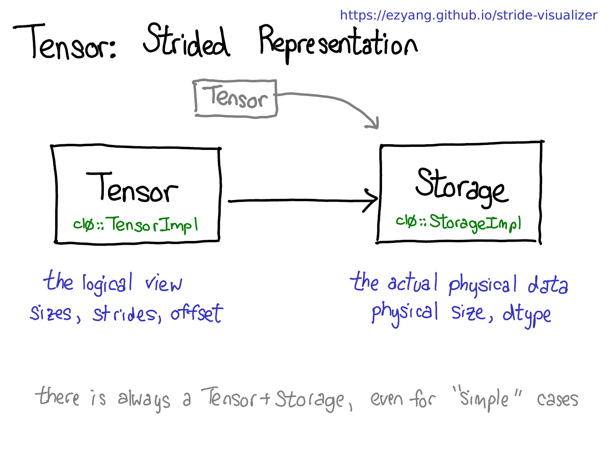
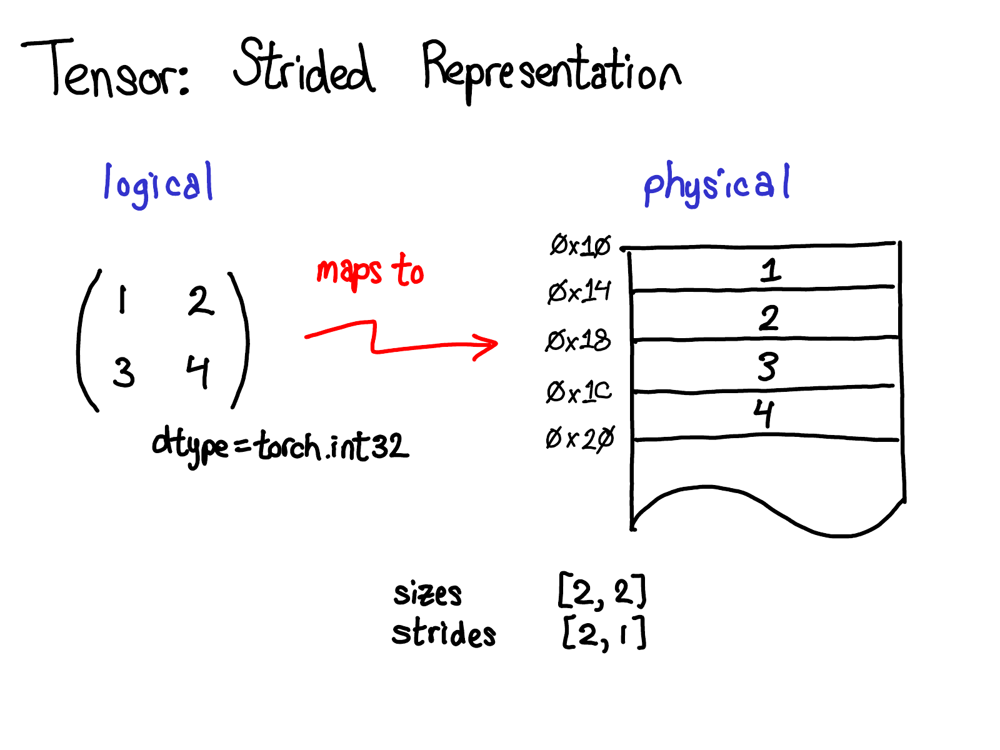
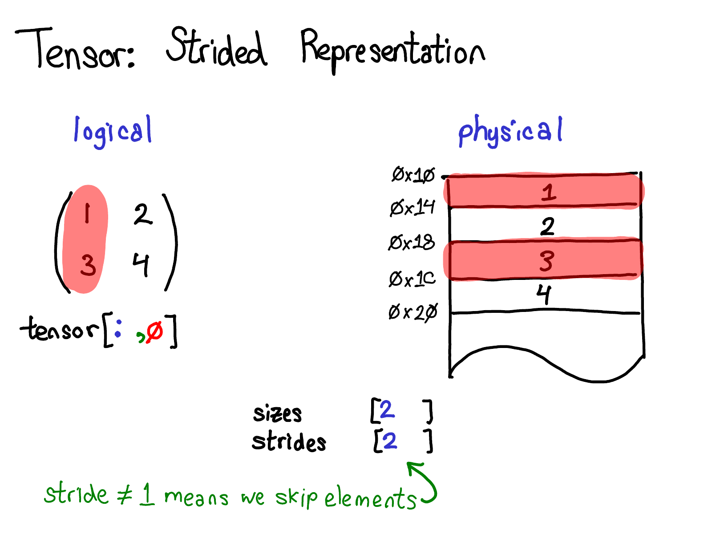
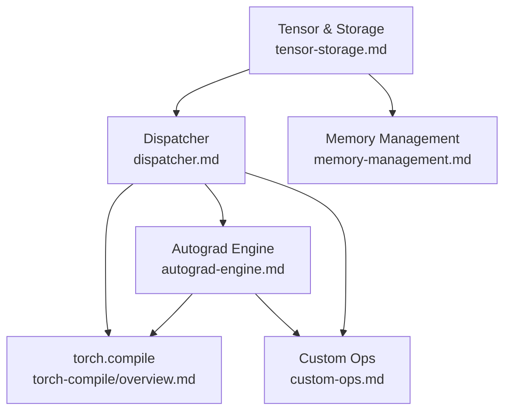
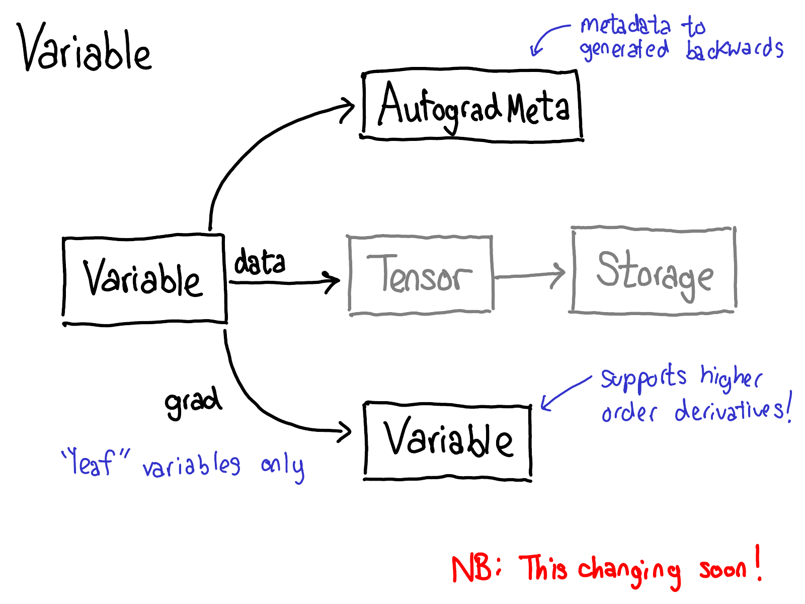
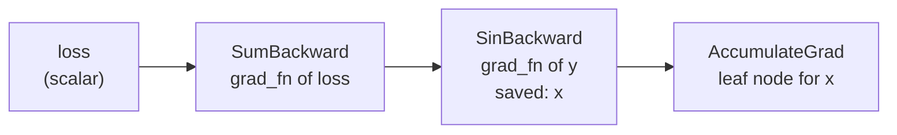
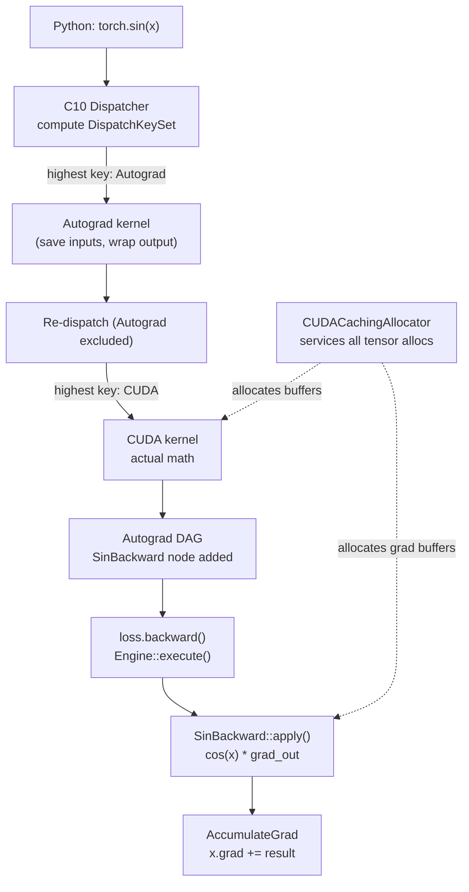

# PyTorch Internals: Overview

This file is the index for the `concepts/pytorch-internals/` folder. It lists planned and written subtopic notes, organizes them by theme, and collects the canonical references for the field. Use it to decide what to write next without needing to re-survey the landscape.

---

## 📋 Notes in This Folder

| File | Status | Topic |
|------|--------|-------|
| `tensor-storage.md` | 🔲 Planned | `Tensor` / `Storage` / `TensorImpl` layout; strides, views, and memory aliasing |
| `dispatcher.md` | ✅ Written | C10 dispatcher; dispatch key bitmask; boxed vs. unboxed calls; operator registration |
| `autograd-engine.md` | 🔲 Planned | Tape construction; `grad_fn` Node/Edge DAG; backward thread pool scheduling |
| `torch-fx.md` | ✅ Written | torch.fx paper walkthrough: Proxy tracing, 6-opcode IR, codegen, graph transforms |
| `torch-compile/overview.md` | ✅ Written | Full-stack survey: data flow from Python → FX graph → prims → kernels |
| `torch-compile/dynamo.md` | ✅ Written | TorchDynamo: CPython frame-eval hook, bytecode analysis, FX capture, guards |
| `torch-compile/aot-autograd.md` | ✅ Written | AOTAutograd: joint forward/backward trace, cross-backward fusion |
| `torch-compile/inductor.md` | ✅ Written | TorchInductor: loop-level IR, Triton lowering, epilogue fusion |
| `torch-compile/symbolic-shapes.md` | ✅ Written | ShapeEnv, SymPy guard inequalities, dynamic shapes, recompilation policy |
| `memory-management.md` | 🔲 Planned | `CUDACachingAllocator`; block pools; splitting/coalescing; fragmentation |
| `custom-ops.md` | 🔲 Planned | `TORCH_LIBRARY` / `TORCH_LIBRARY_IMPL`; schema strings; autograd formula registration |

---

## 🗺️ Subtopic Map

### 🧱 Tensor Model

| Subtopic | Key Idea | Primary Source |
|----------|----------|----------------|
| `Tensor` / `Storage` / `TensorImpl` | `Tensor` is a reference-counted handle to `TensorImpl`; `Storage` is the raw byte buffer; they can be shared across views | Yang 2019 |
| Strides and views | A view shares `Storage` but has different strides/offsets; `is_contiguous()` checks stride ordering | Yang 2019 |
| Memory aliasing invariants | Mutable aliasing is tracked via version counters; in-place ops bump the version and invalidate saved tensors in autograd | PyTorch autograd notes |
| `AutogradMeta` | Optional metadata attached to `TensorImpl` at runtime (in a separate DSO to avoid circular deps) | Yang 2019 |



*Yang (2019): The three-layer object hierarchy. `Tensor` is a thin Python-side handle (ref-counted pointer); `TensorImpl` holds all metadata (dtype, device, strides, sizes, `AutogradMeta`); `Storage` owns the raw byte buffer. Multiple `TensorImpl`s can point to the same `Storage`, which is how views are implemented without copying data.*



*Yang (2019): Physical memory layout for a contiguous 2D tensor. Elements are stored row-major; the stride tuple `[ncols, 1]` encodes that stepping along dim-0 advances by `ncols` elements and stepping along dim-1 advances by 1.*



*Yang (2019): A transposed or sliced view reuses the same `Storage` but changes the stride/offset fields in `TensorImpl`. No data is copied; `is_contiguous()` returns `False` when strides do not satisfy the row-major ordering invariant.*

### ⚙️ Dispatch & Ops

| Subtopic | Key Idea | Primary Source |
|----------|----------|----------------|
| C10 dispatcher | Every `torch.*` call goes through a table lookup keyed by a `DispatchKeySet` bitmask computed from tensor arguments + thread-local state | Yang 2020 |
| Dispatch key hierarchy | Keys are prioritized (e.g. `Functionalize` > `Autograd` > `CUDA` > `CPU`); the highest-priority key with a registered kernel wins | Yang 2020 |
| Boxed vs. unboxed kernels | Boxed kernels receive `IValue` stacks and can be registered as catch-all fallbacks; unboxed kernels are type-safe C++ lambdas | Yang 2020 |
| Operator registration | `TORCH_LIBRARY` declares a schema; `TORCH_LIBRARY_IMPL` registers a kernel per dispatch key; `native_functions.yaml` drives codegen for built-in ops | ATen native README |
| Structured kernels | Meta + impl pattern: one implementation, three variants (`functional`/`inplace`/`out=`) auto-generated by codegen | Codegen wiki |

### 🔄 Autograd

| Subtopic | Key Idea | Primary Source |
|----------|----------|----------------|
| Graph construction | Autograd registers at the `Autograd` dispatch key; forward wrapper wraps outputs in `Variable`, sets `grad_fn` to a `Node`, and calls `collect_next_edges` | PyTorch blog 2021 |
| Node / Edge DAG | `grad_fn` is a `Node`; its `next_edges_` are `Edge` structs pointing to input `Node`s; leaves are `AccumulateGrad` nodes | PyTorch blog 2021 |
| Backward scheduling | `Engine::execute()` uses a thread pool with `GraphTask` / `NodeTask` queues; nodes are ready when all dependencies are resolved | PyTorch autograd blog 2021 |
| `derivatives.yaml` | Source of truth for JVP formulas; parsed by codegen to generate `*Backward` `Node` subclasses with `apply()` methods | PyTorch autograd blog 2021 |
| `autograd.Function` | Python-level escape hatch for custom JVPs; `setup_context` + `backward` define the Node; `apply()` routes through the dispatcher | PyTorch docs |

### 🚀 Compilation (TorchDynamo / TorchInductor)

| Subtopic | Key Idea | Primary Source |
|----------|----------|----------------|
| TorchDynamo bytecode interception | Hooks into CPython's frame-evaluation API (`PEP 523`); rewrites bytecode to intercept Python ops and build `torch.fx` graph fragments | Ansel et al. 2024 |
| Guard generation | Each compiled graph is guarded by tensor-shape/dtype/device assertions; guard failure triggers recompilation | Ansel et al. 2024 |
| AOTAutograd | Traces the joint forward+backward graph ahead-of-time so Inductor can fuse across the backward pass | Ansel et al. 2024 |
| PrimTorch | ~250 primitive ops that all backends must implement; upper-level ops decompose into prims at trace time | Ansel et al. 2024 |
| TorchInductor | Define-by-run loop-level IR using Python callables with SymPy symbolic sizes; lowers to Triton (GPU) or C++/OpenMP (CPU) | Ansel/jansel 2022 |
| Symbolic shapes | SymPy expressions track shape relationships; guards are inequalities over these; enables generalization across batch sizes | PyTorch compiler docs |

### 🧠 Memory Management

| Subtopic | Key Idea | Primary Source |
|----------|----------|----------------|
| `CUDACachingAllocator` | Maintains free-block pools (small ≤ 1 MiB, large > 1 MiB); `malloc` finds best-fit block, splits if needed | DeVito 2022 |
| Block rounding | Small allocations round to 512 B; large allocations round to 2 MiB to reduce fragmentation | DeVito 2022 |
| Stream-local caches | Free blocks are stream-tagged; a block freed on stream A cannot be reused on stream B without sync | DeVito 2022 |
| OOM recovery | On OOM, allocator calls `cudaFree` on all cached-but-free blocks and retries | DeVito 2022 |
| CUDA graphs | Graph capture requires the allocator to fix addresses; `make_graphed_callables` coordinates this | Nguyen et al. 2021 |

### 🔧 Custom Operators

| Subtopic | Key Idea | Primary Source |
|----------|----------|----------------|
| `TORCH_LIBRARY` schema | Schema string declares name, arguments, return types, and aliasing annotations (`Tensor(a!)`) | Custom ops tutorial |
| `TORCH_LIBRARY_IMPL` | Registers a kernel for a specific dispatch key (e.g. `CUDA`, `CPU`, `Autograd`) | Custom ops tutorial |
| Autograd formula registration | `setup_context` + `backward` static methods on a `torch.autograd.Function`; or `registerFakeImpl` for abstract interpretation | Custom ops tutorial |
| `torch.compile` compatibility | Custom ops must register a meta kernel (abstract/fake tensor) for Dynamo to trace through them symbolically | Custom ops tutorial |

---

## 🔗 Dependency Graph



---

## 🚶 How PyTorch Works: A Brief Walkthrough

This section traces a minimal training step end-to-end through PyTorch's internal machinery, grounding the subtopic map above in a concrete execution sequence.

**The program:**

```python
x = torch.randn(4, 8, requires_grad=True, device="cuda")
y = torch.sin(x)
loss = y.sum()
loss.backward()
# x.grad is now populated
```

---

### Step 1 — Tensor creation

`torch.randn(...)` allocates a `Storage` (a raw byte buffer) via `CUDACachingAllocator`, then constructs a `TensorImpl` pointing into that `Storage` with strides `[8, 1]` and offset `0`. The Python-side `Tensor` object is a thin reference-counted handle to this `TensorImpl`. Because `requires_grad=True`, the `TensorImpl` also carries an `AutogradMeta` struct that marks it as a *leaf variable* whose gradient will accumulate into `x.grad`.


*Yang (2019): The `Tensor` → `TensorImpl` → `Storage` ownership chain. The `Tensor` Python object is a thin ref-counted handle; `TensorImpl` holds all metadata including strides, dtype, and optional `AutogradMeta`; `Storage` is the raw byte buffer allocated by `CUDACachingAllocator`.*

---

### Step 2 — Dispatching `torch.sin(x)`

Calling `torch.sin(x)` crosses the Python/C++ boundary into the C10 *dispatcher*. The dispatcher computes a `DispatchKeySet` bitmask by inspecting the tensor arguments and thread-local state. For a CUDA tensor with `requires_grad=True` outside a `torch.no_grad()` block, the highest-priority active key is **`Autograd`**. The dispatcher finds the kernel registered at `Autograd` for `aten::sin` and calls it.

> The `Autograd` kernel is auto-generated from `native_functions.yaml` + `derivatives.yaml` at build time.


*Yang (2020): The C10 dispatch table. Each operator (`aten::sin`, `aten::add`, …) has a row of function pointers, one per dispatch key (`CPU`, `CUDA`, `Autograd`, `Tracing`, …). The dispatcher selects the highest-priority key present in the computed `DispatchKeySet` and jumps to that cell.*


*Yang (2020): How the `DispatchKeySet` bitmask is computed. It is the union of (1) the keys contributed by each tensor argument (device/layout bits), (2) a thread-local include set (e.g. `Tracer` when inside `torch.jit.trace`), and (3) a global default set — minus a thread-local exclude set (e.g. `Autograd` excluded inside `torch.no_grad()`).*

---

### Step 3 — Autograd forward wrapper

The `Autograd`-keyed kernel for `sin` is a *wrapper*, not the math. It:

1. **Saves inputs** needed for the backward (here, `x` itself, since $\frac{d}{dx}\sin x = \cos x$ needs $x$).
2. **Re-dispatches** by excluding `Autograd` from the `DispatchKeySet`, causing the dispatcher to fall through to the next key — `CUDA`. This runs the actual CUDA sin kernel, producing the output tensor `y`.
3. **Wraps the output**: sets `y.grad_fn = SinBackward`, a `Node` subclass whose `next_edges_` point to `x`'s `AccumulateGrad` node. This links `y` into the autograd DAG.

This two-pass structure — `Autograd` key builds the tape, `CUDA` key does the math — is repeated for every differentiable op.



*Yang (2019): The `Variable` abstraction (now unified into `Tensor`) carries an `AutogradMeta` payload inside `TensorImpl`. `AutogradMeta` holds the `grad_fn` pointer (the backward `Node`), the accumulated `.grad` tensor for leaf variables, and the `requires_grad` flag.*


*Yang (2020): The two-pass dispatch sequence for a differentiable op. The `Autograd` key fires first — its kernel saves inputs and prepares the `grad_fn` — then re-dispatches with `Autograd` excluded, falling through to the `CUDA` kernel that performs the actual computation. The output tensor is then wrapped to carry the newly constructed `grad_fn`.*

---

### Step 4 — Tape after the forward pass

After `y = torch.sin(x)` and `loss = y.sum()`, the autograd DAG looks like:



Each `Node` stores:
- `next_edges_`: pointers to the `Node`s of its inputs (the backward DAG edges).
- Saved tensors: intermediate values needed to compute the JVP (here, `x` inside `SinBackward`).
- A `sequence_nr_`: a monotonically increasing integer used by the engine to schedule execution priority.

---

### Step 5 — `loss.backward()`

`Engine::execute()` performs a reverse topological traversal of the DAG using a thread-pool-backed priority queue:

1. Seeds the queue with `(SumBackward, upstream_grad=tensor(1.0))`.
2. Pops `SumBackward`, calls its `apply(tensor(1.0))`, which returns `ones_like(y)` — the gradient of sum w.r.t. its input. Enqueues `(SinBackward, ones_like(y))`.
3. Pops `SinBackward`, calls `apply(ones_like(y))`. The JVP formula from `derivatives.yaml` is $\cos(x) \cdot \text{grad\_output}$. It loads the saved `x`, computes `cos(x) * ones_like(y)`, and sends the result to `AccumulateGrad`.
4. `AccumulateGrad` adds the incoming gradient into `x.grad` (allocating it on first call).

The engine dispatches each `apply()` call through the C10 dispatcher again — the gradient ops (`cos`, pointwise multiply) go through exactly the same `Autograd` → `CUDA` path as the forward ops, but because they are themselves not tracked (we are inside the backward), the `Autograd` key is disabled (via `AutoGradMode::set_enabled(false)`) and dispatch falls directly to `CUDA`.

---

### Step 6 — Memory throughout

The `CUDACachingAllocator` services every tensor allocation in the above sequence — `x`'s storage, `y`'s storage, intermediate gradient buffers — without ever calling `cudaMalloc` after the first few warmup iterations. Freed tensors return their blocks to the pool; the next allocation performs a best-fit lookup in $O(1)$ (small pool) or $O(\log n)$ (large pool tree). The `SinBackward` node holds a reference to the saved `x` tensor, preventing its block from being reclaimed until the backward completes.

---

### The full picture



Each box in this diagram corresponds to a subsystem with a planned deepdive note. The walkthrough above is the thread that ties them together.

---

## 📚 Potential Deepdives

The table below lists specific internal subsystems worth dedicated deep-dive notes, beyond the planned cluster files. These are not yet scheduled but represent natural next steps as the cluster matures.

| Area | Specific Topic | Why Interesting |
|------|---------------|-----------------|
| Tensor internals | Version counter semantics and in-place op safety | Non-obvious why in-place ops break autograd without `retain_graph` |
| Tensor internals | `TensorIterator` — broadcast/type promotion/kernel dispatch for pointwise ops | The machinery behind most elementwise ops; mediates CUDA/CPU kernel selection |
| Dispatcher | `CompositeImplicitAutograd` vs. `CompositeExplicitAutograd` — decomposition timing | Determines when an op's autograd formula is inherited vs. overridden |
| Dispatcher | Fallback kernels — `PythonKey`, `Functionalize`, `BackendSelect` | How Python torch ops, functionalization, and autoselect work as cross-cutting concerns |
| Autograd | `torch.autograd.Function` — custom JVPs, `setup_context`, `vmap` support | How user-level differentiable ops integrate with the Node/Edge DAG |
| Autograd | `torch.func` / `functorch` — functional transforms (vmap, grad, jacrev) | Composable transforms via interpreter stack rather than tape mutation |
| Compiler | AOTAutograd — tracing joint forward/backward graphs ahead of time | Key to why `torch.compile` can fuse across backward passes |
| Compiler | TorchInductor Triton lowering — loop tiling, epilogue fusion, layout propagation | Where GPU-level performance gains actually come from |
| Compiler | Symbolic shapes in depth — SymPy guard generation, `ShapeEnv` | How Dynamo generalizes across batch sizes without recompiling |
| Memory | `memory_efficient_attention` — how kernel-level memory savings interact with allocator | Bridges custom CUDA kernel design and allocator behavior |
| Build system | `native_functions.yaml` + codegen pipeline | Understanding where Python bindings, dispatch tables, and autograd wrappers come from |
| Build system | `torch._C` extension module and Python/C++ boundary | How `torch.add` in Python becomes an ATen kernel invocation |

---

## 📖 Master References

| Reference | Authors | Year | What It Covers | Link |
|-----------|---------|------|----------------|------|
| [PyTorch Internals](https://blog.ezyang.com/2019/05/pytorch-internals/) | Edward Z. Yang | 2019 | Canonical tour: TensorImpl/Storage/strides, ATen dispatch, Python/C++ boundary, autograd hooks | [blog.ezyang.com](https://blog.ezyang.com/2019/05/pytorch-internals/) |
| [Let's Talk About the PyTorch Dispatcher](https://blog.ezyang.com/2020/09/lets-talk-about-the-pytorch-dispatcher/) | Edward Z. Yang | 2020 | C10 dispatcher: dispatch-key set computation, three-way registration taxonomy, boxing/unboxing | [blog.ezyang.com](https://blog.ezyang.com/2020/09/lets-talk-about-the-pytorch-dispatcher/) |
| [How Computational Graphs are Constructed in PyTorch](https://pytorch.org/blog/computational-graphs-constructed-in-pytorch/) | Preferred Networks | 2021 | `AutogradMeta`, `grad_fn` / Node / Edge structures, `collect_next_edges`, codegen wrappers | [pytorch.org/blog](https://pytorch.org/blog/computational-graphs-constructed-in-pytorch/) |
| [Overview of PyTorch Autograd Engine](https://pytorch.org/blog/overview-of-pytorch-autograd-engine/) | Preferred Networks | 2021 | Backward pass: JVP evaluation, `derivatives.yaml`, gradient accumulation, Engine scheduling | [pytorch.org/blog](https://pytorch.org/blog/overview-of-pytorch-autograd-engine/) |
| [PyTorch 2: Faster ML Through Dynamic Bytecode Transformation](https://arxiv.org/abs/2304.01277) | Ansel, Yang, He et al. | 2024 | TorchDynamo frame-eval hook, guard generation, AOTAutograd, PrimTorch, TorchInductor codegen | [arXiv 2304.01277](https://arxiv.org/abs/2304.01277) |
| [torch.fx: Practical Program Capture and Transformation](https://arxiv.org/abs/2112.08429) | Reed, DeVito, He et al. | 2021 | `torch.fx` symbolic tracer, doubly-linked Graph IR (Node/placeholder/call-*), Python codegen | [arXiv 2112.08429](https://arxiv.org/abs/2112.08429) |
| [TorchDynamo: Dynamic Python Bytecode Transformation](https://dev-discuss.pytorch.org/t/torchdynamo-an-experiment-in-dynamic-python-bytecode-transformation/361) | Jason Ansel | 2021 | Original Dynamo design doc: bytecode analysis, guard structure, FX fragment capture, Python fallback | [dev-discuss.pytorch.org](https://dev-discuss.pytorch.org/t/torchdynamo-an-experiment-in-dynamic-python-bytecode-transformation/361) |
| [TorchInductor: a PyTorch-native Compiler with Define-by-Run IR](https://dev-discuss.pytorch.org/t/torchinductor-a-pytorch-native-compiler-with-define-by-run-ir-and-symbolic-shapes/747) | Jason Ansel | 2022 | Inductor loop-level IR, SymPy symbolic sizes, Triton GPU codegen, C++/OpenMP CPU path | [dev-discuss.pytorch.org](https://dev-discuss.pytorch.org/t/torchinductor-a-pytorch-native-compiler-with-define-by-run-ir-and-symbolic-shapes/747) |
| [A Guide to PyTorch's CUDA Caching Allocator](https://zdevito.github.io/2022/08/04/cuda-caching-allocator.html) | Zach DeVito | 2022 | Small/large pools, best-fit selection, 512 B/2 MiB rounding, stream-local caches, OOM recovery | [zdevito.github.io](https://zdevito.github.io/2022/08/04/cuda-caching-allocator.html) |
| [Debugging PyTorch Memory Use with Snapshots](https://zdevito.github.io/2022/08/16/memory-snapshots.html) | Zach DeVito | 2022 | `memory._snapshot()` dumps, allocator block graph, flamegraph visualization, stack trace correlation | [zdevito.github.io](https://zdevito.github.io/2022/08/16/memory-snapshots.html) |
| [Accelerating PyTorch with CUDA Graphs](https://pytorch.org/blog/accelerating-pytorch-with-cuda-graphs/) | Nguyen et al. | 2021 | CUDA graph capture/replay, allocator coordination, `make_graphed_callables`, dynamic shape constraints | [pytorch.org/blog](https://pytorch.org/blog/accelerating-pytorch-with-cuda-graphs/) |
| [Deep Dive to PyTorch AutoGrad (series)](https://wentao.site/deep_dive_to_autograd_1/) | Wentao Guo | 2021–22 | Source-level trace of autograd C++ call chain: Python → `AutogradMeta` → graph construction → engine | [wentao.site](https://wentao.site/deep_dive_to_autograd_1/) |
| [Deep Dive to PyTorch Contiguous Operator (series)](https://wentao.site/deep_dive_into_contiguous_1/) | Wentao Guo | 2021–22 | End-to-end trace of `Tensor.contiguous()` through dispatcher, TensorIterator, kernel execution | [wentao.site](https://wentao.site/deep_dive_into_contiguous_1/) |
| [PyTorch Dispatcher Walkthrough — GitHub Wiki](https://github.com/pytorch/pytorch/wiki/PyTorch-dispatcher-walkthrough) | PyTorch Core Team | ongoing | Step-by-step C++ call stack for `torch.add()` through dispatch-key-set resolution and fallback | [github.com/pytorch/pytorch wiki](https://github.com/pytorch/pytorch/wiki/PyTorch-dispatcher-walkthrough) |
| [Codegen and Structured Kernels — GitHub Wiki](https://github.com/pytorch/pytorch/wiki/Codegen-and-Structured-Kernels) | PyTorch Core Team | ongoing | `native_functions.yaml` → Python bindings, C++ headers, autograd wrappers, structured kernel pattern | [github.com/pytorch/pytorch wiki](https://github.com/pytorch/pytorch/wiki/Codegen-and-Structured-Kernels) |
| [ATen native/README.md](https://github.com/pytorch/pytorch/blob/main/aten/src/ATen/native/README.md) | PyTorch Core Team | ongoing | `native_functions.yaml` schema syntax, aliasing markers, dispatch keywords, `derivatives.yaml` entries | [github.com](https://github.com/pytorch/pytorch/blob/main/aten/src/ATen/native/README.md) |
| [Autograd Mechanics — PyTorch Docs](https://docs.pytorch.org/docs/stable/notes/autograd.html) | PyTorch Core Team | ongoing | Version counters, `retain_graph`, multithreaded autograd, grad-mode/no-grad/inference-mode | [docs.pytorch.org](https://docs.pytorch.org/docs/stable/notes/autograd.html) |
| [Custom C++ and CUDA Operators Tutorial](https://docs.pytorch.org/tutorials/advanced/cpp_custom_ops.html) | PyTorch Core Team | ongoing | Full `TORCH_LIBRARY` / `TORCH_LIBRARY_IMPL` workflow; schema; autograd registration; `torch.compile` compat | [docs.pytorch.org](https://docs.pytorch.org/tutorials/advanced/cpp_custom_ops.html) |
| [Registering a Dispatched Operator in C++](https://docs.pytorch.org/tutorials/advanced/dispatcher.html) | PyTorch Core Team | ongoing | Dispatcher-side custom op registration: boxed vs. unboxed, catch-all fallbacks, new backend keys | [docs.pytorch.org](https://docs.pytorch.org/tutorials/advanced/dispatcher.html) |
| [TorchDynamo Overview — PyTorch Docs](https://docs.pytorch.org/docs/stable/torch.compiler_dynamo_overview.html) | PyTorch Core Team | ongoing | Guard implementation, cache lookup, recompilation policy, graph-break behavior, `explain()` API | [docs.pytorch.org](https://docs.pytorch.org/docs/stable/torch.compiler_dynamo_overview.html) |
