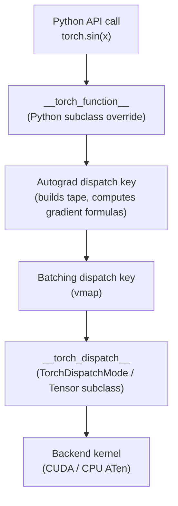
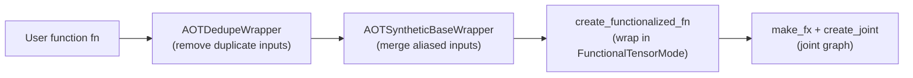
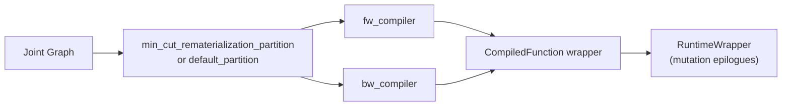

# 🔬 AOTAutograd: Deep Dive

## Table of Contents

- [[#1. The Cross-Backward Fusion Problem|1. The Cross-Backward Fusion Problem]]
  - [[#1.1 Eager-Mode Autograd Tape|1.1 Eager-Mode Autograd Tape]]
  - [[#1.2 Why Adjacent Backward Ops Cannot Be Fused|1.2 Why Adjacent Backward Ops Cannot Be Fused]]
  - [[#1.3 AOTAutograd's Solution|1.3 AOTAutograd's Solution]]
- [[#2. make_fx and the Dispatch Protocol|2. make_fx and the Dispatch Protocol]]
  - [[#2.1 The PyTorch Dispatch Stack|2.1 The PyTorch Dispatch Stack]]
  - [[#2.2 Why __torch_dispatch__ and Not __torch_function__|2.2 Why __torch_dispatch__ and Not __torch_function__]]
  - [[#2.3 ProxyTorchDispatchMode|2.3 ProxyTorchDispatchMode]]
  - [[#2.4 How make_fx Works|2.4 How make_fx Works]]
  - [[#2.5 Tracing Through the Autograd Engine|2.5 Tracing Through the Autograd Engine]]
- [[#3. The Joint Forward-Backward Graph|3. The Joint Forward-Backward Graph]]
  - [[#3.1 Formal Definition|3.1 Formal Definition]]
  - [[#3.2 Graph Signature|3.2 Graph Signature]]
  - [[#3.3 Concrete Example: sin + sum|3.3 Concrete Example: sin + sum]]
  - [[#3.4 derivatives.yaml and JVP Formulas|3.4 derivatives.yaml and JVP Formulas]]
- [[#4. Functionalization in Depth|4. Functionalization in Depth]]
  - [[#4.1 Why Compilers Require Functional Graphs|4.1 Why Compilers Require Functional Graphs]]
  - [[#4.2 FunctionalTensor|4.2 FunctionalTensor]]
  - [[#4.3 The functionalize() Transform|4.3 The functionalize() Transform]]
  - [[#4.4 Mutation Classification|4.4 Mutation Classification]]
  - [[#4.5 View Aliasing and ViewAndMutationMeta|4.5 View Aliasing and ViewAndMutationMeta]]
  - [[#4.6 Toy Demonstration|4.6 Toy Demonstration]]
- [[#5. Graph Partitioning via Min-Cut Rematerialization|5. Graph Partitioning via Min-Cut Rematerialization]]
  - [[#5.1 The Partitioning Problem|5.1 The Partitioning Problem]]
  - [[#5.2 Min-Cut Formulation|5.2 Min-Cut Formulation]]
  - [[#5.3 Edge Weight Design|5.3 Edge Weight Design]]
  - [[#5.4 Recomputation Heuristics|5.4 Recomputation Heuristics]]
  - [[#5.5 Comparison to torch.utils.checkpoint|5.5 Comparison to torch.utils.checkpoint]]
- [[#6. The AOTAutograd Runtime Wrapper|6. The AOTAutograd Runtime Wrapper]]
  - [[#6.1 The CompiledFunction Structure|6.1 The CompiledFunction Structure]]
  - [[#6.2 Two-Stage Pipeline|6.2 Two-Stage Pipeline]]
  - [[#6.3 Input Mutation Epilogue|6.3 Input Mutation Epilogue]]
  - [[#6.4 Higher-Order Differentiation|6.4 Higher-Order Differentiation]]
- [[#7. Relationship to torch.func|7. Relationship to torch.func]]
  - [[#7.1 Shared Infrastructure|7.1 Shared Infrastructure]]
  - [[#7.2 vmap and BatchedTensor|7.2 vmap and BatchedTensor]]
  - [[#7.3 AOTAutograd as Ahead-of-Time torch.func.grad|7.3 AOTAutograd as Ahead-of-Time torch.func.grad]]
- [[#References|References]]

---

## 1. The Cross-Backward Fusion Problem 🔑

The fundamental justification for AOTAutograd is a limitation of eager-mode PyTorch's autograd engine that prevents a whole class of compiler optimizations. To state it precisely requires understanding how the autograd tape is built.

### 1.1 Eager-Mode Autograd Tape

In eager mode, every call to an ATen operator that touches a tensor with `requires_grad=True` appends a *gradient function node* (a `Node` subclass such as `SinBackward` or `AddBackward0`) to the *autograd graph*. This graph is constructed incrementally, one operator at a time, as Python executes. At `.backward()` time, PyTorch walks this graph in reverse topological order and calls each node's `apply()` method — which dispatches a kernel, records its result as an input gradient, and propagates to the next node.

The key structural fact is: **the backward graph does not exist as a data structure until `.backward()` is called**, and even then it is executed node-by-node rather than as a whole program. A compiler that sits between the user's forward code and the ATen kernels therefore sees, at any given moment, exactly one operator's backward computation in isolation.

### 1.2 Why Adjacent Backward Ops Cannot Be Fused

Consider a loss computation $\ell = \sin(x) + x^2$. The backward produces two gradient paths:

$$\frac{d\ell}{dx} = \cos(x) + 2x$$

In eager mode, when `.backward()` executes, the autograd engine calls `SinBackward0.apply(upstream_grad)` which dispatches `aten::cos` — a separate kernel launch. Then it calls `PowBackward0.apply(upstream_grad)` which dispatches `aten::mul` — another separate kernel launch. Finally, `AddBackward0.apply(g1, g2)` dispatches `aten::add` — a third kernel launch.

Each kernel launch reads and writes to *high-bandwidth memory* (HBM). For elementwise operations on a tensor of size $n$, the arithmetic intensity (FLOPs per byte) is approximately $1/4$ — far below the hardware's theoretical compute-to-memory ratio, so execution is *memory-bandwidth bound*. Fusing `cos + mul + add` into a single kernel would replace three HBM round-trips with one, reducing backward memory bandwidth by roughly $3\times$ for this fragment.

*Crucially,* when the compiler processes `SinBackward0`, it does not know that `PowBackward0` will execute immediately afterward. The graph is not statically available. Fusion is impossible.

> [!WARNING] The Eager Compiler Sees Atoms, Not Molecules
> Even with a JIT compiler attached (e.g., NNC or Inductor in eager mode), each backward node is a separate compilation unit. Operators that would optimally fuse are compiled independently, and the resulting code incurs full memory-bandwidth cost for each.

### 1.3 AOTAutograd's Solution

AOTAutograd resolves this by tracing *both* the forward and backward passes into a single static [[concepts/pytorch-internals/torch-fx|torch.fx]] `GraphModule` — the *joint graph* — before any computation occurs. The compiler receives the joint graph as a whole program and can apply cross-operator fusion across the backward nodes just as easily as across forward nodes.

In practice, AOTAutograd enables cross-op fusion in the backward that reduces backward memory bandwidth by **30–50%** for elementwise-heavy models (as reported in the functorch benchmarks: NNC compilation cuts backward time from 1899.7 μs to 831.2 μs, a ~56% reduction).

---

> [!QUESTION] Exercise 1: Bandwidth Arithmetic
> *This problem establishes the memory-bandwidth argument for backward fusion concretely.*
>
> > **Prerequisites:** [[#1.2 Why Adjacent Backward Ops Cannot Be Fused|1.2 Why Adjacent Backward Ops Cannot Be Fused]]
>
> Let $x \in \mathbb{R}^n$ be a float32 tensor. Consider the backward pass through $\ell = \sin(x) + \cos(x)$, where each of `SinBackward`, `CosBackward`, and `AddBackward` launches a separate kernel. (a) Compute the total bytes read + written for the three-kernel unfused implementation, as a function of $n$. (b) If the three ops are fused into a single kernel that reads $x$ and $\bar{\ell}$ once and writes $dx$ once, what is the fused byte count? (c) Derive the bandwidth-reduction factor as $n \to \infty$.

> [!TIP]- Solution to Exercise 1
> **Key insight:** Each kernel reads all its inputs and writes all its outputs; intermediate results between fused ops need never touch HBM.
>
> **Sketch:**
> - **Unfused.** SinBackward reads $x$ (4n bytes) and $\bar{\ell}$ (4n bytes), writes $\partial_x^{(1)}$ (4n bytes) → 12n bytes. CosBackward: reads $x$ + $\bar{\ell}$, writes $\partial_x^{(2)}$ → 12n bytes. AddBackward: reads $\partial_x^{(1)}$ + $\partial_x^{(2)}$, writes $dx$ → 12n bytes. Total: **36n bytes**.
> - **Fused.** One kernel reads $x$ and $\bar{\ell}$, accumulates both gradients in registers, writes $dx$. Total: $4n + 4n + 4n = $ **12n bytes**.
> - **Reduction factor:** $36n / 12n = \mathbf{3\times}$.

---

## 2. make_fx and the Dispatch Protocol 📐

### 2.1 The PyTorch Dispatch Stack

Every PyTorch operator call passes through a layered *dispatch stack* managed by the C10 Dispatcher. Simplified, the stack (from outermost to innermost) is:



*Figure 1: Simplified PyTorch dispatch stack. `__torch_function__` fires before dispatch resolution; `__torch_dispatch__` fires after all higher dispatch keys, at the bottom of the Python-accessible portion of the stack.*

### 2.2 Why __torch_dispatch__ and Not __torch_function__

**`__torch_function__`** is a Python-level interception hook. It fires when a `torch.*` API function is called on a subclass, *before* the call is dispatched into C++. It sees Python-level ops like `torch.sin(x)` or `torch.add(x, y)`. Critically, it does *not* see:

- The decomposed ATen kernels that a composite op delegates to (composite C++ implementations are invisible to Python)
- The backward kernels invoked by `torch.autograd.grad` — because those fire inside the C++ autograd engine, below `__torch_function__`

**`__torch_dispatch__`** fires *after* the dispatch stack has resolved — after autograd, after batching, at the deepest Python-accessible point before the backend kernel. It intercepts the raw ATen op calls such as `aten::sin.default`. Consequently:

1. It sees every individual ATen op, including those generated by composite decompositions
2. When `torch.autograd.grad` runs the backward pass inside the autograd engine, the gradient formula kernels (e.g., `aten::cos` from `sin`'s backward) are issued as ATen ops — and `__torch_dispatch__` captures them too

*This is why `make_fx` can record a complete joint graph containing both forward and backward ATen ops.*

> [!INFO] The __torch_dispatch__ Position
> Formally, `__torch_dispatch__` sits at the `Python` dispatch key in the C10 key stack, which is ordered below `AutogradCPU`/`AutogradCUDA`. The Autograd key's `apply()` calls gradient formulas, which re-enter the dispatcher — and those re-entries arrive at `__torch_dispatch__` again, yielding a flat sequence of ATen calls spanning the entire forward + backward computation.

### 2.3 ProxyTorchDispatchMode

`make_fx` works by activating a *dispatch mode* called **`ProxyTorchDispatchMode`**, which is an instance of `TorchDispatchMode` — a context-manager-based version of `__torch_dispatch__` that does not require a tensor subclass.

When `ProxyTorchDispatchMode` is active, every ATen operator call is intercepted. The mode:
1. Looks up the corresponding `torch.fx` *proxy* for each input tensor
2. Records a `call_function` node in an `torch.fx.Graph` object: `graph.call_function(op, args=proxy_args)`
3. Creates a new proxy for the output and associates it with the output tensor
4. Falls through to the real kernel (or, in tracing mode, to a `FakeTensor` computation)

The result after the traced function returns is a `torch.fx.GraphModule` whose `graph` attribute is the sequence of ATen calls executed.

### 2.4 How make_fx Works

**`make_fx(fn)(*example_inputs)`** returns a `GraphModule` representing `fn`'s operations. The call sequence is:

```python
# Pseudocode for make_fx internals
def make_fx(fn, decomposition_table=None, tracing_mode="fake"):
    def wrapper(*args):
        # 1. Wrap inputs as FakeTensors (meta tensors with shape/dtype but no data)
        fake_mode = FakeTensorMode(shape_env=ShapeEnv())
        fake_args = [fake_mode.from_tensor(a) for a in args]

        # 2. Create an FX tracer and activate ProxyTorchDispatchMode
        tracer = PythonKeyTracer()
        proxy_args = [tracer.create_proxy("placeholder", f"arg_{i}", ...) for i, _ in enumerate(fake_args)]

        with ProxyTorchDispatchMode(tracer, tracing_mode) as proxy_mode:
            with fake_mode:
                # 3. Run the function — every ATen call is intercepted by ProxyTorchDispatchMode
                out = fn(*proxy_args)

        # 4. Return the GraphModule
        return torch.fx.GraphModule(tracer.root, tracer.graph)
    return wrapper
```

The `FakeTensorMode` context ensures that shape and dtype propagation works correctly without allocating real memory. The `ProxyTorchDispatchMode` context captures every ATen call as an FX node.

### 2.5 Tracing Through the Autograd Engine

When AOTAutograd constructs the joint graph, it needs to capture not just the forward ops but also the backward ops. This is accomplished by calling `torch.autograd.grad(fw_outputs, primals, tangents)` *inside* the `make_fx` trace — while `ProxyTorchDispatchMode` is still active.

The autograd engine runs the backward pass in the normal way: it walks the tape accumulated during the forward and calls each gradient function's `apply()` method. Each `apply()` call dispatches ATen ops — `aten::cos` for `SinBackward`, `aten::mul` for `PowBackward`, etc. Since `ProxyTorchDispatchMode` is still active on the dispatch stack, these ATen calls are also recorded as `call_function` nodes in the FX graph.

The result: the FX graph contains a contiguous sequence of nodes spanning forward ops followed by backward ops, all in topological order. **This is the joint graph.**

---

> [!QUESTION] Exercise 2: Tracing Modes
> *This problem establishes why FakeTensor mode is necessary during make_fx tracing.*
>
> > **Prerequisites:** [[#2.4 How make_fx Works|2.4 How make_fx Works]]
>
> Suppose we ran `make_fx` using *real* tensors (not FakeTensors). (a) What happens when we call `torch.autograd.grad(fw_outputs, primals, tangents)` inside the trace for a function $f: \mathbb{R}^{1000 \times 1000} \to \mathbb{R}$? (b) Why is this problematic for AOTAutograd, which is invoked at torch.compile time (before the user's actual data is available)? (c) What property of FakeTensor allows it to support `torch.autograd.grad` during tracing?

> [!TIP]- Solution to Exercise 2
> **Key insight:** FakeTensor propagates shape/dtype metadata without materializing values — it can run the autograd graph structurally without requiring real gradient values.
>
> **Sketch:**
> (a) With real tensors, `torch.autograd.grad` executes the backward fully: it computes actual gradient values using real arithmetic, consuming real memory proportional to the model size.
> (b) AOTAutograd is called at compile time when the user's data is not yet available (torch.compile operates on example/fake inputs). Using real tensors would require materializing the full backward computation including allocating activation memory — this defeats the purpose of ahead-of-time compilation and would be prohibitively slow as a compilation overhead.
> (c) FakeTensor implements every ATen operator as a metadata-only computation: it propagates output shapes, dtypes, and device from input metadata without executing arithmetic. This allows the autograd engine's backward graph traversal to proceed (calling each gradient function's structural logic) and ProxyTorchDispatchMode to record the op sequence, without ever computing real numbers.

---

## 3. The Joint Forward-Backward Graph 📐

### 3.1 Formal Definition

Let $\mathbf{p} \in \mathbb{R}^d$ denote the concatenation of all primal inputs (model parameters and activations) and let $\boldsymbol{\tau} \in \mathbb{R}^m$ denote the upstream *tangent* (gradient flowing into this subgraph from above). Let $f: \mathbb{R}^d \to \mathbb{R}^m$ be the forward function.

**Definition (Joint Graph).** The *joint forward-backward function* is

$$J(\mathbf{p},\, \boldsymbol{\tau}) \;=\; \bigl(\,f(\mathbf{p}),\;\; \nabla_{\mathbf{p}}\langle f(\mathbf{p}),\, \boldsymbol{\tau}\rangle\,\bigr)$$

where $\langle \cdot, \cdot \rangle$ is the standard inner product. The first component is the vector of forward outputs; the second is the vector-Jacobian product (VJP) — equivalently the gradient of the scalar $\langle f(\mathbf{p}), \boldsymbol{\tau}\rangle$ with respect to $\mathbf{p}$.

The FX graph that `make_fx` produces for $J$ is called the *joint graph*. Its nodes are ATen operations; some compute forward outputs, others compute gradient outputs. Neither group is annotated — they are simply ordered by data dependency.

### 3.2 Graph Signature

The joint graph has the following FX `placeholder` (input) and `output` structure:

```
Inputs:  [p_0, p_1, ..., p_{d-1},   tau_0, tau_1, ..., tau_{m-1}]
          ^--- primals ---^           ^------- tangents --------^

Outputs: ([fw_out_0, ..., fw_out_k], [grad_p_0, ..., grad_p_{d-1}])
```

The primals are the original function arguments. The tangents are synthetic inputs representing upstream gradients — in the loss computation case, typically a scalar `1.0` tangent for the loss tensor.

### 3.3 Concrete Example: sin + sum

Consider the function:

```python
import torch
from torch._functorch.aot_autograd import aot_function

def fn(x):
    y = torch.sin(x)
    return y.sum()
```

AOTAutograd traces the joint graph $J(x, \tau)$ where $x$ is the primal and $\tau \in \mathbb{R}$ is the scalar tangent for `sum`'s output. The joint graph contains the following ATen nodes (pseudocode FX IR):

```
%x         : [#users=2] = placeholder[target=x]
%tau       : [#users=1] = placeholder[target=tangent_0]

# Forward ops
%sin       : [#users=2] = call_function[target=aten.sin.default](%x)
%sum_1     : [#users=1] = call_function[target=aten.sum.default](%sin)

# Backward ops (SinBackward: d/dx sin(x) = cos(x))
%cos       : [#users=1] = call_function[target=aten.cos.default](%x)
%expand    : [#users=1] = call_function[target=aten.expand.default](%tau, [shape_of_sin])
%mul       : [#users=1] = call_function[target=aten.mul.Tensor](%expand, %cos)

output ([%sum_1], [%mul])
```

Key observations:
- `%x` appears twice: once feeding `%sin` (forward) and once feeding `%cos` (backward). After partitioning, `%x` will be a *saved tensor* bridging the forward and backward graphs.
- `%cos` and `%mul` are the backward nodes. Compiled together with `%expand`, they fuse into a single kernel.
- The sin activation `%sin` is used in both `%sum_1` (forward) and needs to be reachable for potential backward use, but the min-cut partitioner will determine whether to save it or recompute it.

### 3.4 derivatives.yaml and JVP Formulas

PyTorch's gradient formulas are defined in `tools/autograd/derivatives.yaml`. Each entry specifies the VJP formula for an ATen op in a Python-like DSL. For example:

```yaml
- name: sin(Tensor self) -> Tensor
  self: grad * self.cos()
```

When `make_fx` traces `torch.autograd.grad(...)`, the autograd engine looks up these formulas and dispatches the ATen ops they specify (here `aten::mul` and `aten::cos`). These dispatched ops arrive at `ProxyTorchDispatchMode` and become FX nodes. **The joint graph is therefore an unrolled expansion of the derivatives.yaml formulas for all ops in the forward.**

---

> [!QUESTION] Exercise 3: Joint Graph for a Two-Layer MLP
> *This problem exercises reading off the joint graph structure for a realistic forward computation.*
>
> > **Prerequisites:** [[#3.3 Concrete Example: sin + sum|3.3 Concrete Example: sin + sum]], [[#3.4 derivatives.yaml and JVP Formulas|3.4 derivatives.yaml and JVP Formulas]]
>
> Let $f(W_1, W_2, x) = \text{relu}(W_2 \cdot \text{relu}(W_1 \cdot x))$ where $W_1 \in \mathbb{R}^{h \times d}$, $W_2 \in \mathbb{R}^{o \times h}$, $x \in \mathbb{R}^d$. (a) List the ATen ops that appear in the joint graph (forward section). (b) List the ATen ops that appear in the backward section, citing the corresponding `derivatives.yaml` entry for each. (c) Which tensors from the forward are referenced by the backward section, and are therefore candidates for the saved-tensor set?

> [!TIP]- Solution to Exercise 3
> **Key insight:** Matrix multiply backward introduces both a left and right product; relu backward requires the sign of the pre-activation.
>
> **Sketch:**
> (a) **Forward ops:** `aten.mm(W1, x)` → `aten.relu` → `aten.mm(W2, h1)` → `aten.relu` → `aten.sum` (or loss).
> (b) **Backward ops:** ReluBackward uses `aten.threshold_backward(grad, h, 0)` which needs the pre-relu activation `h` to compute the sign mask. MmBackward uses `aten.mm(grad_out, W.T)` for the input gradient and `aten.mm(input.T, grad_out)` for the weight gradient — needing both the input and the weight from the forward.
> (c) **Saved tensor candidates:** `h1_pre_relu` (pre-activation after first mm), `h2_pre_relu` (pre-activation after second mm), `h1` (post-relu activation needed for `dW2`), `x` (needed for `dW1`), `W1`, `W2` (needed for propagating gradients back through mm). The partitioner will choose to save a subset and recompute the rest.

---

## 4. Functionalization in Depth 📐

### 4.1 Why Compilers Require Functional Graphs

Backend compilers such as [[concepts/pytorch-internals/torch-compile/inductor|TorchInductor]] operate on a *functional* intermediate representation: every operation takes tensors as inputs and produces new tensors as outputs, with no side effects. Two categories of PyTorch operations violate this requirement:

1. **In-place mutations**: `x.add_(y)`, `x.relu_()`, `weight.data.copy_(...)` — these modify existing tensor storage.
2. **View aliasing**: `y = x[2:5]`, `y = x.view(...)` — `y` and `x` share underlying storage, so a write to `y` is also a write to `x`.

A compiler that blindly inlines either category risks miscompiling: it might reorder a mutation relative to a read of the same storage, or it might eliminate a copy that was actually observable from another alias.

Functionalization eliminates both categories by rewriting the program into an equivalent one that uses only *copy-on-write* semantics.

### 4.2 FunctionalTensor

**`FunctionalTensor`** is a *tensor subclass* that intercepts in-place and view operations. Internally it wraps a real (or fake) tensor called the *functional storage*. When an in-place op arrives:

```python
# User writes:       x.add_(y)
# FunctionalTensor intercepts and does:
x_new = x_functional_storage + y   # pure functional op, recorded as FX node
x._functional_storage = x_new      # rebind the backing tensor; no HBM write yet
```

The functional storage is rebind, not mutated. The original tensor object `x` is still reachable by user code (it still satisfies `x is x`), but internally it now points to a different tensor value.

View operations are similarly intercepted: `y = x.view(...)` creates a new `FunctionalTensor` that remembers `(x, view_op)` as its *view chain*. No aliased storage is created.

### 4.3 The functionalize() Transform

`torch.func.functionalize(fn)` is a higher-order function that runs `fn` inside a `FunctionalTensorMode` context. This mode:
1. Wraps all input tensors in `FunctionalTensor`
2. Runs `fn` — all in-place ops and views are intercepted
3. After `fn` returns, calls `sync_functional_tensor` on each output to *apply* the pending mutations: the rebindings accumulated in the functional storage are committed to the FX graph as explicit `copy_` or functional-equivalent nodes

The output is a graph whose every operation is pure.

### 4.4 Mutation Classification

After functionalization, AOTAutograd classifies each input according to the `MutationType` enum defined in `torch/_functorch/_aot_autograd/schemas.py`:

| Class | Meaning | Graph Treatment |
|---|---|---|
| `NOT_MUTATED` | Input not modified during forward | No special handling; input simply flows through |
| `MUTATED_IN_GRAPH` | Mutation expressible as a functional op (non-leaf tensor data mutation) | Embedded as a `copy_` at the end of the forward graph; the updated value is a graph output |
| `MUTATED_OUT_GRAPH` | Mutation not expressible functionally (e.g., leaf parameter metadata mutation) | Applied via an *epilogue* `copy_` or `as_strided_` at runtime outside the compiled graph |

**The runtime wrapper uses this classification to reconstruct correct mutation semantics after the compiled graph returns.** Specifically, for `MUTATED_IN_GRAPH` inputs, the compiled graph returns the updated tensor as an extra output; the wrapper applies `input.copy_(updated_value)` to propagate the mutation back to the original Python tensor object.

### 4.5 View Aliasing and ViewAndMutationMeta

**`ViewAndMutationMeta`** is the central dataclass (in `torch/_functorch/_aot_autograd/schemas.py`) that records aliasing and mutation information collected during the functionalization pass. Its key fields:

- **`input_info`**: A list of `InputAliasInfo` objects (one per input) recording whether the input was mutated, and if so what type.
- **`output_info`**: A list of `OutputAliasInfo` objects recording whether each output is:
  - `OutputType.non_alias` — a freshly computed tensor
  - `OutputType.alias_of_input` — a view of one of the inputs
  - `OutputType.is_input` — literally *is* one of the inputs
  - `OutputType.alias_of_intermediate` — a view of an intermediate computed tensor
- **`mutated_inp_runtime_indices`**: Indices of inputs that require `copy_` epilogues at runtime.

After the functional compiled graph executes, the runtime wrapper uses `ViewAndMutationMeta` to *reconstruct* the correct aliasing: for outputs of type `alias_of_input`, it replays the recorded view chain to produce a tensor that genuinely aliases the input's storage, satisfying user expectations.

### 4.6 Toy Demonstration

Consider a function with an in-place relu:

```python
import torch
from torch.fx.experimental.proxy_tensor import make_fx
from torch._functorch.aot_autograd import functionalized_rng_runtime_epilogue

def fn_inplace(x):
    x.relu_()   # in-place mutation
    return x * 2.0

# Before functionalization: make_fx traces through in-place ops literally
gm_before = make_fx(fn_inplace)(torch.randn(4))
print(gm_before.code)
# def forward(self, x):
#     relu_ = torch.ops.aten.relu_.default(x);  x = None
#     mul = torch.ops.aten.mul.Tensor(relu_, 2.0)
#     return mul

# After functionalization: in-place ops replaced by functional equivalents
from torch._functorch.aot_autograd import aot_function
def print_compile(gm, _):
    print(gm.code)
    return gm

aot_function(fn_inplace, fw_compiler=print_compile)(torch.randn(4))
# def forward(self, x):
#     relu = torch.ops.aten.relu.default(x)         # functional relu
#     copy_ = torch.ops.aten.copy_.default(x, relu) # mutation epilogue
#     mul = torch.ops.aten.mul.Tensor(relu, 2.0)
#     return (copy_, mul)
```

*The in-place `relu_` is replaced by a functional `relu` followed by a `copy_` epilogue. The graph is now pure: the `relu` node has no side effects, and the `copy_` makes the mutation explicit and deferrable.*

---

> [!QUESTION] Exercise 4: Mutation Classification
> *This problem exercises identifying which mutation class applies to different program patterns.*
>
> > **Prerequisites:** [[#4.4 Mutation Classification|4.4 Mutation Classification]], [[#4.5 View Aliasing and ViewAndMutationMeta|4.5 View Aliasing and ViewAndMutationMeta]]
>
> For each of the following patterns, identify the mutation class and describe what the runtime wrapper does after the compiled graph returns:
> (a) A forward function that does `hidden.add_(bias)` where `hidden` is an intermediate (not a user-visible input).
> (b) A forward function that does `param.data.copy_(new_val)` where `param` is a model parameter passed as an input.
> (c) A forward function that returns `x[2:5]` where `x` is an input tensor (a view of the input).

> [!TIP]- Solution to Exercise 4
> **Key insight:** The classification depends on whether the mutation target is a user-visible input and whether it can be expressed functionally; aliasing is handled via output type classification, not mutation type.
>
> **Sketch:**
> (a) `hidden.add_(bias)` where `hidden` is an intermediate: This is an in-graph op on a non-input tensor. Functionalization replaces it with `hidden_new = hidden + bias` and any downstream uses of `hidden` are rewritten to use `hidden_new`. No mutation epilogue is needed because the user never holds a reference to `hidden`. Class: effectively `NOT_MUTATED` from the perspective of inputs.
> (b) `param.data.copy_(new_val)` where `param` is a passed input: `param` is a user-visible input, so this is `MUTATED_IN_GRAPH`. The compiled graph returns `new_val` as an extra output, and the runtime wrapper calls `param.copy_(new_val)` to make the mutation visible to the caller.
> (c) `return x[2:5]` where `x` is an input: This is not a mutation at all — it's a view aliasing output. `ViewAndMutationMeta` records this output as `OutputType.alias_of_input`. The compiled graph returns the underlying data (or a non-aliased copy); the runtime wrapper replays the `x[2:5]` view chain to produce a tensor that aliases `x`'s storage correctly.

---

## 5. Graph Partitioning via Min-Cut Rematerialization 📐

### 5.1 The Partitioning Problem

After the joint graph is produced and functionalized, it must be *partitioned* into two disjoint subgraphs:

- **Forward graph** $G_f$: executed at forward time; takes primals as inputs; produces user outputs and a set of *saved tensors* $\mathcal{S}$
- **Backward graph** $G_b$: executed at `.backward()` time; takes saved tensors $\mathcal{S}$ and tangents as inputs; produces gradients with respect to the primals

The interface between $G_f$ and $G_b$ is exactly $\mathcal{S}$. Every element of $\mathcal{S}$ must be stored in memory between forward and backward — it represents *activation memory*. Minimizing $|\mathcal{S}|$ (by bytes) reduces peak memory.

**The core tension:** a value needed by $G_b$ must either be (a) in $\mathcal{S}$ (saved, at memory cost) or (b) recomputed inside $G_b$ (at compute cost). The partitioner must choose optimally.

### 5.2 Min-Cut Formulation

The `min_cut_rematerialization_partition` function in `torch/_functorch/partitioners.py` formulates partitioning as a *minimum $s$-$t$ cut* on a flow network.

**Construction of the flow network:**

Each FX node $v$ in the joint graph is split into two flow network nodes, $v_\text{in}$ and $v_\text{out}$, connected by an edge with capacity $w(v)$:

$$\text{edge}(v_\text{in} \to v_\text{out}),\quad \text{capacity} = w(v)$$

Data dependencies between nodes are represented by infinite-capacity edges:

$$\text{if } u \text{ feeds } v: \quad \text{edge}(u_\text{out} \to v_\text{in}),\quad \text{capacity} = \infty$$

A *source* node $s$ connects to all primal input nodes. A *sink* node $t$ collects from all nodes required by the backward section (identified during graph tracing). Infinite-capacity edges from $s$ to primal inputs and from required-backward nodes to $t$ ensure these nodes are never cut.

**The min-cut** of this network partitions the nodes into a *reachable set* (associated with $G_f$) and an *unreachable set* (associated with $G_b$). A node $v$ is *cut* (i.e., appears in the saved set $\mathcal{S}$) if the edge $v_\text{in} \to v_\text{out}$ is in the cut. **Minimizing the cut total capacity minimizes the total bytes of saved tensors, subject to every backward requirement being satisfiable.**

### 5.3 Edge Weight Design

The edge weight $w(v)$ for node $v$ is:

$$w(v) = \text{bytes}(v) \cdot \left(1.1^{\min(\delta(v),\, 100)}\right) \cdot \mathbb{1}[\text{not fusible with all users}]$$

where:
- $\text{bytes}(v)$ is the memory footprint of $v$'s output tensor (from `tensor_meta`)
- $\delta(v) \in \mathbb{Z}_{\geq 0}$ is $v$'s distance-from-backward (nodes closer to the backward get lower weight, biasing toward saving them nearer the cut)
- The $\mathbb{1}[\text{not fusible}]$ factor doubles the weight for nodes that cannot be fused with all their users — making them more expensive to cut (i.e., more likely to be recomputed)

Nodes that must not be cut are assigned $w(v) = \infty$, which guarantees they appear in the saved set.

### 5.4 Recomputation Heuristics

**Always ban from recomputation** (assigned $w(v) = \infty$):
- Random ops: `aten::native_dropout`, `aten::rand_like`, `aten::randn_like` — recomputing would give different values
- Reduction ops that strongly compress data (output size $\leq$ input size / 4): `aten::mean`, `aten::sum` with large reduction dimensions — cheap to save, expensive to recompute
- Compute-intensive ops: `aten::mm`, `aten::bmm`, `aten::addmm`, `aten::convolution`, `aten::upsample_bilinear2d`

**Always allow recomputation** (finite $w(v)$, typically small):
- View ops: `aten::view`, `aten::reshape`, `aten::transpose`, `aten::permute` — zero FLOPs, pure metadata
- Elementwise activations: `aten::relu`, `aten::gelu`, `aten::silu`, `aten::tanh`
- Scalar arithmetic: `aten::add`, `aten::mul`, `aten::sub`, `aten::div` (elementwise)
- `aten::getitem`, `aten::scalar_tensor`

> [!INFO] The Activation Budget Extension
> In recent PyTorch versions, `min_cut_rematerialization_partition` has been extended with an `activation_memory_budget` parameter. When set to a value in $[0, 1]$, it runs a 0–1 knapsack solver (dynamic programming, greedy, or ILP variants from `torch/_functorch/_activation_checkpointing/knapsack.py`) to find the cheapest set of nodes to recompute while keeping total saved memory within the budget. This provides a principled memory–compute trade-off dial.

### 5.5 Comparison to torch.utils.checkpoint

| Property | `torch.utils.checkpoint` | AOTAutograd min-cut |
|---|---|---|
| Granularity | User-specified segments | Per-node in FX graph |
| Timing | Runtime (eager) | Compile-time (static) |
| Optimality | Suboptimal (user decides boundaries) | Globally optimal within the graph |
| Fusion awareness | None | Yes (fusible recomputed ops are compiled together with their consumers) |
| Random op handling | User must handle manually | Automatically banned from recompute |
| API | `checkpoint(fn, *args)` wrapper | Automatic inside `torch.compile` |

**The fusion-awareness point is the critical advantage.** When AOTAutograd decides to recompute, say, `relu` in the backward, it is recomputed *inside* $G_b$'s compiled graph. The recomputed `relu` is adjacent to the backward nodes that consume it, so the compiler can fuse them into a single kernel — the recomputation has near-zero marginal cost relative to saving the activation.

---

> [!QUESTION] Exercise 5: Partitioner Invariants
> *This problem tests understanding of which structural properties the partitioner must guarantee.*
>
> > **Prerequisites:** [[#5.2 Min-Cut Formulation|5.2 Min-Cut Formulation]], [[#5.4 Recomputation Heuristics|5.4 Recomputation Heuristics]]
>
> (a) Prove that the min-cut construction guarantees that $G_b$ can always compute all required gradients — i.e., there is no backward node that lacks a valid input. (b) Explain why assigning $w(v) = \infty$ to a `native_dropout` node does *not* mean that `native_dropout`'s output is always saved; instead, describe the two possibilities. (c) If a node $v$ is a view op (zero bytes to save), what does the flow network assign as $w(v)$, and what does the resulting cut placement imply?

> [!TIP]- Solution to Exercise 5
> **Key insight:** The min-cut respects data dependency via infinite-capacity dependency edges; banned nodes are guaranteed to appear in the saved set; zero-weight nodes are always recomputed.
>
> **Sketch:**
> (a) Every backward requirement node has an infinite-capacity edge to $t$. In any finite-cost cut, this edge cannot be cut — so the requirement node is always in the unreachable (backward) partition. By the flow network construction, every predecessor of this node in the computation either has its edge cut (is in $\mathcal{S}$) or is also in the backward partition and is recomputed. Inductively, the backward graph has all the values it needs.
> (b) $w(v) = \infty$ for `native_dropout` means the edge $v_\text{in} \to v_\text{out}$ cannot be in the min-cut (its capacity is too large to cut). This means the node is either: (i) placed entirely in $G_f$ (used only in the forward) so it is not in $\mathcal{S}$ and not recomputed — its output just flows forward; or (ii) the node itself is in $G_f$ but its output is demanded by $G_b$, forcing it into $\mathcal{S}$ via the infinite-capacity edge to $t$. In both cases, recomputation is forbidden.
> (c) For a view op, $\text{bytes}(v) = 0$, so $w(v) = 0$ regardless of other factors. A zero-capacity edge is always in every min-cut (cutting it is free). Thus the view node always lands in the saved set — but since saving a view costs zero bytes, this is equivalent to always recomputing it: the backward graph replays the view op at negligible cost.

---

## 6. The AOTAutograd Runtime Wrapper 🔑

After partitioning, AOTAutograd produces two `GraphModule` objects — $G_f$ and $G_b$ — which are passed to the configured `fw_compiler` and `bw_compiler` respectively to produce optimized callables. These callables are then wrapped in a Python `torch.autograd.Function` subclass called `CompiledFunction`.

### 6.1 The CompiledFunction Structure

**`CompiledFunction`** is a dynamically-generated subclass of `torch.autograd.Function`. Its three methods correspond exactly to the three phases of PyTorch's autograd engine:

```python
class CompiledFunction(torch.autograd.Function):

    @staticmethod
    def forward(ctx, *primals):
        # Run the compiled forward graph
        fw_outs = compiled_fw(*primals)
        
        # Split: user-visible outputs vs. saved tensors
        user_outputs = fw_outs[:num_user_outputs]
        saved_tensors = fw_outs[num_user_outputs:]
        
        ctx.save_for_backward(*saved_tensors)
        return tuple(user_outputs)

    @staticmethod
    def setup_context(ctx, inputs, output):
        # Populated by save_for_backward in forward above
        pass

    @staticmethod
    def backward(ctx, *grad_outputs):
        saved_tensors = ctx.saved_tensors
        # Run the compiled backward graph
        gradients = compiled_bw(*saved_tensors, *grad_outputs)
        return tuple(gradients)
```

The key design choice: **saved tensors are made explicit at the graph level.** Instead of each ATen backward node individually stashing intermediates (the default eager behavior), the partitioner determines the minimal set of saved tensors up front, and $G_f$ returns them as explicit outputs. This eliminates the overhead of per-node `save_for_backward` calls and gives the compiler full visibility into the memory footprint.

### 6.2 Two-Stage Pipeline

The AOTAutograd pipeline has two stages that the wrappers implement:

**Stage 1 — Graph Capture:**



**Stage 2 — Compilation and Wrapping:**



### 6.3 Input Mutation Epilogue

For inputs classified as `MUTATED_IN_GRAPH`, the compiled $G_f$ returns the updated tensor as an extra output (beyond the user-visible outputs and saved tensors). The **`RuntimeWrapper`** — the outermost Python wrapper — intercepts the compiled graph's outputs and applies:

```python
for i, inp_idx in enumerate(mutated_inp_runtime_indices):
    original_input = inputs[inp_idx]
    updated_value = fw_outputs[num_user_outputs + num_saved + i]
    original_input.copy_(updated_value)
```

This reconstructs the mutation semantics that the user's code expects (e.g., `optimizer.step()` updating parameters in-place) while keeping the compiled graph itself mutation-free.

### 6.4 Higher-Order Differentiation

Because `CompiledFunction` is a proper `torch.autograd.Function` subclass, it participates in PyTorch's autograd engine normally. This means:

1. **Second-order gradients**: `torch.autograd.grad(loss, params, create_graph=True)` calls `CompiledFunction.forward`, which returns outputs with `grad_fn` set. Calling `.backward()` on those outputs differentiates through `CompiledFunction.backward` — this is standard autograd-of-autograd.

2. **Composability with `torch.func`**: `torch.func.grad(compiled_fn)` wraps `CompiledFunction` in functorch's functional autograd infrastructure, enabling composition like `torch.func.grad(torch.func.grad(compiled_fn))`.

> [!WARNING] Compiled Autograd and Higher-Order Gradients
> *The `CompiledFunction.backward` graph is itself eager Python code — it is not re-traced for higher-order differentiation. If you need compiled second-order gradients, use Compiled Autograd (`torch.compile(torch.autograd.grad(...))`) which extends the AOTAutograd approach one level further.*

---

> [!QUESTION] Exercise 6: The Saved Tensor Contract
> *This problem traces the lifecycle of a saved tensor through AOTAutograd's wrapper stack.*
>
> > **Prerequisites:** [[#6.1 The CompiledFunction Structure|6.1 The CompiledFunction Structure]], [[#6.3 Input Mutation Epilogue|6.3 Input Mutation Epilogue]]
>
> Suppose a forward function has the graph $G_f$ with outputs `[user_out, saved_cos_x]` and the backward graph $G_b$ takes `[saved_cos_x, tangent]` as inputs. Trace the lifecycle of `saved_cos_x`:
> (a) When is `saved_cos_x` allocated (what event causes the memory allocation)?
> (b) Where is it stored between forward and backward?
> (c) When is it freed?
> (d) If `torch.autograd.grad(..., retain_graph=False)` is used (the default), what does PyTorch do with the `CompiledFunction`'s saved tensors after backward completes?

> [!TIP]- Solution to Exercise 6
> **Key insight:** AOTAutograd's saved tensors follow the same lifecycle as any `save_for_backward` tensor in standard PyTorch autograd.
>
> **Sketch:**
> (a) `saved_cos_x` is allocated when `compiled_fw` executes and returns it as part of `fw_outs`. The memory is materialized as part of the compiled forward kernel's output allocation.
> (b) It is stored in `ctx.saved_tensors` — the `CompiledFunction`'s autograd context, which lives in the autograd graph node that PyTorch creates for this Function application. In practice, it is a Python list held by the `AccumulateGrad` node.
> (c) After `CompiledFunction.backward` calls `ctx.saved_tensors`, PyTorch decrements the reference count. With `retain_graph=False`, the autograd node is freed after backward, dropping the last reference to `saved_cos_x`, which then gets garbage-collected (or returned to the memory allocator).
> (d) With `retain_graph=False`, PyTorch frees the entire autograd graph rooted at the `CompiledFunction` node after backward completes — including all saved tensors. `saved_cos_x` is released. A subsequent call to `loss.backward()` would fail with "Trying to backward through the graph a second time."

---

## 7. Relationship to torch.func 💡

### 7.1 Shared Infrastructure

`torch.func` (formerly *functorch*) and AOTAutograd are not separate implementations — they share the same underlying infrastructure:

- Both use `make_fx` with `ProxyTorchDispatchMode` for graph capture
- Both use `FunctionalTensor` / `FunctionalTensorMode` for functionalization
- Both use the `create_joint` machinery to combine forward and backward passes
- Both dispatch through the same C10 dispatch stack

The difference is purely in *when and how* the transformation is applied.

### 7.2 vmap and BatchedTensor

`torch.func.vmap` (vectorized map) operates analogously to functionalization but in the batching dimension. It activates a *`BatchedTensor`* subclass — a dispatch mode that intercepts every ATen op and replaces it with its batched equivalent (e.g., `aten::mm` → `aten::bmm`). The dispatch stack position is the same (`__torch_dispatch__` level), so `vmap` composes naturally with `make_fx`:

```python
batched_fn = torch.func.vmap(fn)
gm = make_fx(batched_fn)(batched_example)
# gm contains batched ATen ops
```

This composability is the reason `torch.func.jacrev`, `torch.func.hessian`, and `torch.func.grad` nest correctly — each transform installs its own dispatch mode, and the modes stack.

### 7.3 AOTAutograd as Ahead-of-Time torch.func.grad

**`torch.func.grad(f)(*args)`** applies a VJP transform to `f` and executes it *immediately* with `*args`. The transformation is reapplied on every call.

**AOTAutograd** applies a VJP transform (via `create_joint`) *once*, ahead of time, producing a static graph that is compiled and cached. The compiled function is then called for every subsequent forward + backward pass.

The duality is:

| Property | `torch.func.grad` | AOTAutograd |
|---|---|---|
| Transform application | Per-call (runtime) | Once at compile time |
| Result | Eager callable | Compiled GraphModule |
| Composability | Arbitrary nesting | Single pass |
| Overhead | Transform overhead every call | Compilation overhead once |
| Graph visibility | No static graph | Full static graph; enables fusion |

*Surprisingly,* both approaches produce equivalent outputs — AOTAutograd can be understood as *caching the result of* `torch.func.grad` for a fixed function signature.

> [!NOTE] Why Not Just Cache torch.func.grad?
> One might ask: why not simply JIT-cache `torch.func.grad(f)`? The answer is that `torch.func.grad` is still a Python function — it calls `make_fx` each time or executes eagerly. AOTAutograd combines the tracing with functionalization, partitioning, and backend compilation in a single pipeline, producing a fused kernel. `torch.func.grad` alone produces an FX graph but does not fuse kernels. The backend compiler (Inductor) is what converts the graph into a fused Triton kernel.

---

> [!QUESTION] Exercise 7: Composing Transforms
> *This problem explores what happens when vmap and grad are composed under AOTAutograd.*
>
> > **Prerequisites:** [[#7.2 vmap and BatchedTensor|7.2 vmap and BatchedTensor]], [[#7.3 AOTAutograd as Ahead-of-Time torch.func.grad|7.3 AOTAutograd as Ahead-of-Time torch.func.grad]]
>
> Consider `f(x) = (x**2).sum()` where `x` is a 1D tensor. We want to compute the per-sample gradient across a batch: `torch.func.vmap(torch.func.grad(f))(batch_x)` where `batch_x` has shape `(B, D)`.
> (a) In what order do the dispatch modes activate on the stack during the vmap+grad trace?
> (b) What is the shape of the FX graph output for the batched-per-sample-gradient computation?
> (c) If this combined transform were compiled through AOTAutograd (i.e., `torch.compile(torch.func.vmap(torch.func.grad(f)))`), what does the joint graph look like at the ATen level, and which ATen ops appear?

> [!TIP]- Solution to Exercise 7
> **Key insight:** vmap and grad compose by stacking dispatch modes; the joint graph for the composed transform contains both the batching expansion and the gradient formula ops.
>
> **Sketch:**
> (a) `vmap` activates `BatchedTensor` mode (outermost); `grad` activates `ProxyTorchDispatchMode` (inner, for the gradient tracing). When the inner function executes `x**2`, it goes through: Python API → autograd → batching (BatchedTensor) → `ProxyTorchDispatchMode`. The batching dimension is handled first, then the proxy recording captures the batched op.
> (b) The output has shape `(B, D)` — for each sample in the batch, the gradient of `f` w.r.t. that sample's `x` is a vector of shape `(D,)`.
> (c) At the ATen level, the joint graph for `vmap(grad(f))` applied to `batch_x` contains: `aten::mul(batch_x, 2.0)` (gradient of `x**2` is `2x`), perhaps an `aten::sum` or identity from the `sum`'s backward, and then the result has shape `(B, D)`. Since `f(x) = (x**2).sum()`, `grad(f)(x) = 2*x` elementwise. The batched version is `aten::mul(batch_x, scalar_tensor(2.0))` — a single batched multiply, perfectly fusible.

---

## References

| Reference | Brief Summary | Link |
|---|---|---|
| Ansel et al., "PyTorch 2: Faster Machine Learning Through Dynamic Python Bytecode Transformation and Graph Compilation" (ASPLOS 2024) | Primary source covering the full torch.compile stack including AOTAutograd's joint graph, functionalization, and partitioning | [dl.acm.org](https://dl.acm.org/doi/pdf/10.1145/3620665.3640366) |
| PyTorch, "AOT Autograd: How to use and optimize?" (functorch docs) | Official tutorial demonstrating `aot_function`, graph printing, NNC compilation, and recomputation benchmarks | [docs.pytorch.org](https://docs.pytorch.org/functorch/stable/notebooks/aot_autograd_optimizations.html) |
| DeepWiki, "AOT Autograd and Functionalization" | Detailed architectural breakdown of the two-stage pipeline, FunctionalTensor, ViewAndMutationMeta, and wrapper types | [deepwiki.com](https://deepwiki.com/pytorch/pytorch/2.4-aot-autograd-and-functionalization) |
| PyTorch Developer Forum, "What (and Why) is __torch_dispatch__?" | Authoritative explanation of `__torch_dispatch__`'s position in the dispatch stack and its relationship to autograd | [dev-discuss.pytorch.org](https://dev-discuss.pytorch.org/t/what-and-why-is-torch-dispatch/557) |
| PyTorch Developer Forum, "Difference between __torch_function__ and __torch_dispatch__" | Precise comparison of the two extension hooks, their firing points, and what they can/cannot intercept | [dev-discuss.pytorch.org](https://dev-discuss.pytorch.org/t/difference-between-torch-function-and-torch-dispatch/1376) |
| PyTorch Developer Forum, "How does torch.compile work with autograd?" | Core explanation of how AOTAutograd traces backward via FakeTensor + dispatch and wraps in autograd.Function | [dev-discuss.pytorch.org](https://dev-discuss.pytorch.org/t/how-does-torch-compile-work-with-autograd/1621/2) |
| `torch/_functorch/aot_autograd.py` (PyTorch source) | Canonical implementation: `aot_function`, `aot_module`, joint graph construction, runtime wrapper | [github.com](https://github.com/pytorch/pytorch/blob/main/torch/_functorch/aot_autograd.py) |
| `torch/_functorch/partitioners.py` (PyTorch source, via functorch docs) | Implementation of `min_cut_rematerialization_partition`: NetworkX flow network, edge weights, recomputation heuristics | [docs.pytorch.org (0.2.0 module source)](https://docs.pytorch.org/functorch/0.2.0/_modules/functorch/_src/partitioners.html) |
| `torch/_functorch/_aot_autograd/schemas.py` (via DeepWiki) | Definition of `ViewAndMutationMeta`, `MutationType`, `InputAliasInfo`, `OutputAliasInfo` | [github.com (pytorch)](https://github.com/pytorch/pytorch/blob/main/torch/_functorch/_aot_autograd/functional_utils.py) |
| depyf, "A Walk Through Example of torch.compile" | Concrete walkthrough of `CompiledFunction` structure and saved tensor lifecycle | [depyf.readthedocs.io](https://depyf.readthedocs.io/en/latest/walk_through.html) |
| functorch GitHub README | Overview of composable function transforms (vmap, grad, jacrev) and their relationship to AOTAutograd | [github.com](https://github.com/pytorch/functorch) |
