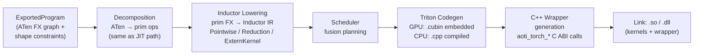

# 🏭 AOTInductor: Ahead-of-Time Compilation for Deployment

## Table of Contents

- [[#1. Motivation: JIT vs. AOT Compilation|1. Motivation: JIT vs. AOT Compilation]]
  - [[#1.1 The JIT torch.compile Deployment Problem|1.1 The JIT torch.compile Deployment Problem]]
  - [[#1.2 What AOTInductor Provides|1.2 What AOTInductor Provides]]
- [[#2. Architecture and Position in the Stack|2. Architecture and Position in the Stack]]
  - [[#2.1 Where AOTInductor Sits|2.1 Where AOTInductor Sits]]
  - [[#2.2 The Compilation Pipeline|2.2 The Compilation Pipeline]]
- [[#3. The Export Step: torch.export|3. The Export Step: torch.export]]
  - [[#3.1 ExportedProgram|3.1 ExportedProgram]]
  - [[#3.2 What export Guarantees|3.2 What export Guarantees]]
  - [[#3.3 Constraints and Dynamic Shapes|3.3 Constraints and Dynamic Shapes]]
- [[#4. Inductor AOT Lowering|4. Inductor AOT Lowering]]
  - [[#4.1 From ExportedProgram to Inductor IR|4.1 From ExportedProgram to Inductor IR]]
  - [[#4.2 Kernel Compilation|4.2 Kernel Compilation]]
  - [[#4.3 The C++ Wrapper|4.3 The C++ Wrapper]]
- [[#5. The Shared Library ABI|5. The Shared Library ABI]]
  - [[#5.1 .so Structure|5.1 .so Structure]]
  - [[#5.2 The C ABI Contract|5.2 The C ABI Contract]]
  - [[#5.3 AOTIModelContainerRunner|5.3 AOTIModelContainerRunner]]
- [[#6. Dynamic Shapes in AOTInductor|6. Dynamic Shapes in AOTInductor]]
  - [[#6.1 Dim Objects and Constraints|6.1 Dim Objects and Constraints]]
  - [[#6.2 Shape Baking vs. Dynamic Dispatch|6.2 Shape Baking vs. Dynamic Dispatch]]
  - [[#6.3 Runtime Shape Checks|6.3 Runtime Shape Checks]]
- [[#7. Python and C++ Runtime APIs|7. Python and C++ Runtime APIs]]
  - [[#7.1 aot_compile and aoti_load_package|7.1 aot_compile and aoti_load_package]]
  - [[#7.2 aoti_compile_and_package|7.2 aoti_compile_and_package]]
  - [[#7.3 C++ Inference without Python|7.3 C++ Inference without Python]]
- [[#8. CUDA Graphs Integration|8. CUDA Graphs Integration]]
- [[#9. Limitations and Tradeoffs|9. Limitations and Tradeoffs]]
  - [[#9.1 vs. JIT torch.compile|9.1 vs. JIT torch.compile]]
  - [[#9.2 Unsupported Patterns|9.2 Unsupported Patterns]]
- [[#References|References]]

---

## 1. Motivation: JIT vs. AOT Compilation

### 1.1 The JIT torch.compile Deployment Problem

`torch.compile` is a *just-in-time* compiler: the first call to a compiled function triggers Dynamo tracing, AOTAutograd joint tracing, and Inductor kernel generation. This incurs three costs that are acceptable in training but problematic in production inference:

| Cost | Training | Production Inference |
|------|----------|---------------------|
| **Compilation latency** | Amortized over thousands of steps | Unacceptable on the first request |
| **Python interpreter** | Already required | Often forbidden (safety, overhead, licensing) |
| **Guard re-evaluation** | Per-call overhead acceptable | Every microsecond counts |
| **Recompilation** | Rare, survivable | Latency spike on new input shapes |
| **Process startup** | Python + PyTorch loaded | Separate serving process, libtorch only |

Beyond latency, many production serving stacks use C++ inference servers (TorchServe backend, Triton Inference Server, or custom gRPC services) that load models as shared libraries. Shipping a Python process per replica is expensive.

### 1.2 What AOTInductor Provides

AOTInductor (*ahead-of-time Inductor*) compiles a model **before deployment** into a standalone shared library (`.so` on Linux, `.dll` on Windows) that:

- Contains **all compiled Triton/CUBIN kernels** as embedded binary data
- Exposes a **pure C ABI** — callable from C++ with only `libtorch` (no Python)
- Requires **no recompilation at runtime** — no guards, no Dynamo, no Python overhead
- Supports **deterministic latency** from the first call

The tradeoff: shape flexibility must be declared upfront (via `torch.export.Dim`), and any input that violates the declared constraints is undefined behavior (not a graceful recompilation).

---

## 2. Architecture and Position in the Stack

### 2.1 Where AOTInductor Sits

AOTInductor replaces the JIT half of `torch.compile` with an offline compilation step:

```mermaid
flowchart TD
    subgraph JIT["JIT Path (torch.compile)"]
        J1["Python model\nfirst call"]
        J2["TorchDynamo\nbytecode interception"]
        J3["AOTAutograd\njoint tracing"]
        J4["TorchInductor JIT\nTriton kernels compiled at runtime"]
        J5["Execution (every call):\ncheck guards → run kernels"]
        J1 --> J2 --> J3 --> J4 --> J5
    end

    subgraph AOT["AOT Path (AOTInductor)"]
        A1["torch.export.export()\noffline, before deployment"]
        A2["ExportedProgram\npure FX graph + constraints"]
        A3["TorchInductor AOT\ngenerate Triton + C++ wrapper"]
        A4["model.so\nself-contained shared library"]
        A5["Production inference:\nload .so, call C ABI"]
        A1 --> A2 --> A3 --> A4 --> A5
    end
```



### 2.2 The Compilation Pipeline



The decomposition and Inductor lowering stages are identical to the JIT path — AOTInductor is simply Inductor invoked in a mode that writes artifacts to disk rather than executing them inline.

---

## 3. The Export Step: torch.export

### 3.1 ExportedProgram

`torch.export.export(model, args, kwargs, dynamic_shapes)` traces the model through a strict version of TorchDynamo with `fullgraph=True` and produces an `ExportedProgram`:

```python
import torch
from torch.export import export, Dim

batch = Dim("batch", min=1, max=512)
ep = export(
    model,
    args=(x,),
    dynamic_shapes={"x": {0: batch}},
)
```

`ExportedProgram` contains:
- **`graph_module`** — a `torch.fx.GraphModule` with ATen-level ops; no Python control flow
- **`graph_signature`** — maps placeholder nodes to inputs/buffers/parameters
- **`range_constraints`** — `{symbol: ValueRanges(min, max)}` for each dynamic dim
- **`equality_constraints`** — `[(InputDim(arg, i), InputDim(arg, j))]` asserting dims are equal across inputs

### 3.2 What export Guarantees

`torch.export` enforces a stronger invariant than `torch.compile`:

| Property | torch.compile | torch.export |
|----------|--------------|-------------|
| **Captures full graph** | Best-effort (graph breaks allowed) | Mandatory; raises on any graph break |
| **No Python at runtime** | No (resume stubs call Python) | Yes; the graph is pure ATen |
| **Shape constraints explicit** | Implicit (guard-based) | Explicit (`Dim` objects in `dynamic_shapes`) |
| **Serializable** | No | Yes (`ep.save()`, `ep.load()`) |
| **Mutable buffers** | Handled via functionalization | Tracked in `graph_signature` |

> [!WARNING] fullgraph=True is mandatory
> Any operation that would cause a graph break under `torch.compile` — `torch.autograd.Function.apply`, data-dependent control flow, `.item()` calls — raises `torch.export.ExportError` with a diagnostic. The model must be refactored before export can succeed.

### 3.3 Constraints and Dynamic Shapes

The `dynamic_shapes` argument maps each input argument (by name or position) to a dict from dimension index to a `Dim` object:

```python
# Two inputs with a shared dynamic batch dimension
batch = Dim("batch", min=1, max=1024)
seq   = Dim("seq",   min=1, max=2048)

ep = export(
    model,
    args=(x, y),
    dynamic_shapes={
        "x": {0: batch, 1: seq},
        "y": {0: batch},          # same Dim object → equality constraint
    },
)
```

Sharing the same `Dim` object across inputs asserts that those dimensions are **equal at runtime**. Inductor can use this to avoid generating shape-check code and to produce tighter loop bounds.

Dimensions not mentioned in `dynamic_shapes` are *static* — their value is baked into the compiled kernel. Attempting to call the compiled artifact with a different value for a static dimension is undefined behavior.

> [!QUESTION] Exercise 1: Static vs. Dynamic Dimension Cost
> *This problem develops intuition for the performance tradeoff between static and dynamic dimensions.*
>
> > **Prerequisites:** [[#3.3 Constraints and Dynamic Shapes|3.3 Constraints and Dynamic Shapes]], [[#6. Dynamic Shapes in AOTInductor|6. Dynamic Shapes in AOTInductor]]
>
> A transformer inference model has input shape `(batch, seq_len, hidden_dim)` with `hidden_dim = 4096` fixed, `batch ∈ [1, 64]`, and `seq_len ∈ [1, 2048]`. A teammate proposes marking all three dimensions dynamic "to be safe." Argue for and against this, and describe what performance implications making `hidden_dim` static has on the generated Triton kernels.

> [!TIP]- Solution to Exercise 1
> **Key insight:** Static dimensions are compile-time constants in Triton source — they can be used as `constexpr` tile sizes, enabling the compiler to select optimal tiling without runtime branching.
>
> **For marking dynamic:** Avoids recompilation if hidden_dim ever changes; same `.so` handles future model variants.
>
> **Against:** `hidden_dim` = 4096 enables Triton to use it as a compile-time `BLOCK_K` or `BLOCK_N` constant. With a static 4096, the compiler knows the inner dimension of every GEMM exactly, so it can pick the optimal tile shape (e.g., 128×256×64 for A100 tensor cores) without emitting a runtime `if/else` over possible tile alignments. A dynamic hidden_dim requires a runtime `cdiv(hidden_dim, BLOCK_K)` expression in the kernel, which also prevents the Triton autotuner from specializing on that dimension — potentially costing 10–30% throughput on GEMM-heavy workloads.
>
> **Verdict:** Mark batch and seq_len dynamic (they vary per request); keep hidden_dim static (it's an architectural constant that rarely changes and has strong tiling implications).

---

## 4. Inductor AOT Lowering

### 4.1 From ExportedProgram to Inductor IR

AOTInductor calls `torch._inductor.aot_compile(exported_program, inputs, options)`, which:

1. **Decomposes** ATen ops to the prim level using the same decomposition table as the JIT path
2. **Lowers** each prim op to an Inductor IR node via the `lowerings` registry (identical `@register_lowering` dispatch)
3. **Runs the Scheduler** — fusion planning, Δ-traffic scoring, same algorithm as JIT

The key difference is that all symbolic shapes come from the `ExportedProgram`'s range constraints rather than from Dynamo's ShapeEnv. At lowering time, each dynamic dimension is a `sympy.Symbol` with known bounds; static dimensions are replaced by their concrete integer values.

### 4.2 Kernel Compilation

For GPU targets, each scheduled kernel is:
1. Generated as Triton Python source (same `triton_heuristics` / `@triton.jit` as JIT)
2. Compiled with `triton.compile()` to PTX then to CUBIN (`.cubin` binary)
3. The CUBIN is **embedded** in the output `.so` as a `__attribute__((section(".rodata")))` byte array

For CPU targets, the generated C++ source is compiled with the system compiler (GCC/Clang) and linked into the `.so`.

Because compilation happens offline, AOTInductor can afford a more exhaustive autotuning sweep than JIT (where tuning latency would show up on the first inference request).

### 4.3 The C++ Wrapper

Inductor generates a C++ file (`model.cpp`) containing:

```cpp
// Auto-generated by AOTInductor
#include <torch/csrc/inductor/aoti_runtime/interface.h>

extern "C" {

AOTIRuntimeError AOTInductorModelContainerCreate(
    AOTInductorModelContainerHandle* container_handle,
    size_t num_models,
    bool is_cpu,
    const char* cubin_dir) {
    // Initializes CUDA context, loads CUBINs
    *container_handle = new AOTInductorModelContainer(num_models, is_cpu, cubin_dir);
    return AOTI_RUNTIME_SUCCESS;
}

AOTIRuntimeError AOTInductorModelContainerRun(
    AOTInductorModelContainerHandle container_handle,
    AtenTensorHandle* input_handles,
    size_t num_inputs,
    AtenTensorHandle* output_handles,
    size_t num_outputs,
    AOTInductorStreamHandle stream_handle,
    AOTInductorProxyExecutorHandle proxy_executor_handle) {
    // Validates shapes, runs kernel sequence
    auto* model = get_model(container_handle);
    model->run(input_handles, output_handles, (cudaStream_t)stream_handle);
    return AOTI_RUNTIME_SUCCESS;
}

} // extern "C"
```

The `AtenTensorHandle` is an opaque pointer to a `at::Tensor` — the caller allocates tensors with `torch::empty(...)` or equivalent and passes pointers. The `.so` never calls back into Python.

---

## 5. The Shared Library ABI

### 5.1 .so Structure

The compiled `.so` contains:

| Section | Contents |
|---------|---------|
| `.text` | C++ wrapper logic: shape validation, kernel dispatch sequence |
| `.rodata` | Embedded CUBIN blobs (one per kernel) |
| `.data` | CUDA module handles, persistent state |
| `extern "C" symbols` | `AOTInductorModelContainerCreate`, `AOTInductorModelContainerRun`, `AOTInductorModelContainerDelete` |

The `.so` links against `libtorch_cuda.so` and `libcuda.so` but **not** against `libpython`. A serving process only needs libtorch and the CUDA runtime.

### 5.2 The C ABI Contract

The C ABI is defined in `torch/csrc/inductor/aoti_runtime/interface.h`:

```c
typedef void* AOTInductorModelContainerHandle;
typedef void* AtenTensorHandle;
typedef void* AOTInductorStreamHandle;

AOTIRuntimeError AOTInductorModelContainerCreate(
    AOTInductorModelContainerHandle* container_handle,
    size_t num_models,
    bool is_cpu,
    const char* cubin_dir);

AOTIRuntimeError AOTInductorModelContainerRun(
    AOTInductorModelContainerHandle container_handle,
    AtenTensorHandle* input_handles,
    size_t num_inputs,
    AtenTensorHandle* output_handles,
    size_t num_outputs,
    AOTInductorStreamHandle stream_handle,
    AOTInductorProxyExecutorHandle proxy_executor_handle);

AOTIRuntimeError AOTInductorModelContainerDelete(
    AOTInductorModelContainerHandle container_handle);
```

`num_models` enables a **multi-runner container** — the container holds multiple independent copies of the model's state (weights, scratch buffers), enabling concurrent inference requests on different CUDA streams without serialization.

### 5.3 AOTIModelContainerRunner

PyTorch provides a C++ helper class that wraps the raw ABI:

```cpp
#include <torch/csrc/inductor/aoti_runner/model_container_runner_cuda.h>

// Load
torch::inductor::AOTIModelContainerRunnerCuda runner(
    "path/to/model.so",
    /*num_runners=*/4,           // concurrent request capacity
    /*device_str=*/"cuda",
    /*cubin_dir=*/""             // empty = embedded CUBINs
);

// Inference
std::vector<at::Tensor> inputs = {input_tensor};
std::vector<at::Tensor> outputs = runner.run(inputs);
```

`runner.run()` is thread-safe when `num_runners > 1`: it acquires one of the pre-allocated model slots from a fixed pool, runs the inference, and releases the slot. Requests that arrive when all slots are busy block (or can be queued by the caller).

> [!QUESTION] Exercise 2: Multi-Runner Concurrency
> *This problem develops understanding of the num_runners parameter and its interaction with CUDA streams.*
>
> > **Prerequisites:** [[#5.3 AOTIModelContainerRunner|5.3 AOTIModelContainerRunner]]
>
> A serving system has 4 CPU threads each submitting inference requests to an `AOTIModelContainerRunnerCuda` with `num_runners=2`. Describe what happens when all 4 threads call `runner.run()` simultaneously. What resource is being protected by the runner pool, and why can two runners share a single GPU without conflict?

> [!TIP]- Solution to Exercise 2
> **Key insight:** The resource being protected is the *model's mutable state* (e.g., KV-cache buffers, intermediate activation buffers). Two simultaneous runs using the same scratch buffer would corrupt each other.
>
> **Sketch:**
> - Threads 1 and 2 acquire the two available runner slots and begin inference on CUDA streams S1 and S2.
> - Threads 3 and 4 block waiting for a slot.
> - When thread 1's inference completes, it releases its slot. Thread 3 acquires it and begins inference on stream S1 (or a new stream).
> - Two runners can share a GPU because they execute on *different CUDA streams*: CUDA's multi-stream execution model allows independent kernel queues to overlap on SM resources without synchronization, as long as they do not access the same memory.

---

## 6. Dynamic Shapes in AOTInductor

### 6.1 Dim Objects and Constraints

`torch.export.Dim` objects declare symbolic dimensions with optional bounds:

```python
from torch.export import Dim

# Unbounded (Inductor will not specialize on this value)
batch = Dim("batch")

# Bounded — Inductor can use bounds for range checks and tile alignment
batch = Dim("batch", min=1, max=512)

# Derived — seq must be a multiple of 8 (useful for attention heads)
seq = Dim("seq", min=8, max=2048)
```

Under the hood, each `Dim` becomes a `sympy.Symbol` in `ShapeEnv` with the declared bounds stored as `var_to_range`. Inductor's scheduler uses these bounds to decide whether symbolic guard expressions can be simplified (e.g., if `batch >= 1` is guaranteed, no runtime check is needed for a loop that iterates `batch` times).

### 6.2 Shape Baking vs. Dynamic Dispatch

When Inductor lowers an op with a symbolic dimension `s`:

- **Triton `constexpr` arguments** — static dims become `tl.constexpr` parameters, enabling compile-time tile selection. Dynamic dims become regular integer arguments passed at each kernel launch.
- **Index expressions** — `tl.arange(0, BLOCK_SIZE)` uses `BLOCK_SIZE` as `constexpr`; offsets involving `s` become `pid * BLOCK_SIZE + tl.arange(0, BLOCK_SIZE)` with `s` as a runtime kernel argument.
- **CUBIN portability** — a single CUBIN can handle all values of `s` within `[min, max]` because `s` appears only in arithmetic, not in tiling decisions (which are constexpr).

### 6.3 Runtime Shape Checks

For dynamic dimensions declared with bounds, the C++ wrapper validates bounds at each call:

```cpp
// Auto-generated shape validation code in model.cpp
void validate_inputs(AtenTensorHandle* inputs) {
    int64_t batch = inputs[0]->size(0);
    AOTI_TORCH_CHECK(batch >= 1 && batch <= 512,
        "Input dim 0 (batch) out of range: ", batch);
    // static dims are baked in and not checked
}
```

Violations raise an error (not a recompilation). There are no guards, no fallback — the caller is responsible for respecting the declared constraints.

> [!QUESTION] Exercise 3: Guard-Free vs. Guard-Based
> *This problem contrasts the JIT and AOT shape-handling models.*
>
> > **Prerequisites:** [[#6.3 Runtime Shape Checks|6.3 Runtime Shape Checks]], [[concepts/pytorch-internals/torch-compile/dynamo|TorchDynamo: Guard Generation]]
>
> In JIT `torch.compile`, if a function is compiled with `batch=32` and then called with `batch=64`, Dynamo detects the guard failure and recompiles. In AOTInductor with `batch` declared dynamic with `min=1, max=512`, the same call succeeds without recompilation. In AOTInductor with `batch` left static (compiled with `batch=32`), the same call is undefined behavior. Explain why the AOT static case cannot fall back to recompilation gracefully.

> [!TIP]- Solution to Exercise 3
> **Key insight:** Recompilation requires the presence of a Python runtime and a compilation cache. The AOT `.so` contains neither.
>
> **Sketch:** JIT `torch.compile` keeps a per-code-object linked list of `(guard_fn, compiled_code)` pairs in the Python process. When `guard_fn` fails, Python has access to the compiler (Dynamo + Inductor) and can trigger a new compilation entry.
>
> The AOT `.so` is a compiled binary artifact with no knowledge of PyTorch's compiler, no Python interpreter, and no cache. At runtime, it only calls `libtorch_cuda` for tensor operations. When the static-compiled kernel assumes `batch=32`, that assumption is baked into the Triton tile structure, CUBIN binary, and possibly index arithmetic. Calling with `batch=64` silently reads/writes out-of-bounds memory or produces incorrect results — the `.so` has no mechanism to detect the mismatch and no Python environment to recompile into.

---

## 7. Python and C++ Runtime APIs

### 7.1 aot_compile and aoti_load_package

**Compilation (Python, offline):**

```python
import torch
from torch.export import export, Dim

# Step 1: export
batch = Dim("batch", min=1, max=64)
ep = export(model, (x,), dynamic_shapes={"x": {0: batch}})

# Step 2: AOT compile → .so
so_path = torch._inductor.aot_compile(
    ep,
    (x,),
    options={
        "max_autotune": True,      # exhaustive kernel autotuning
        "cuda_graphs": True,       # embed CUDA graph capture in .so
    },
)
print(so_path)  # e.g., /tmp/aot_inductor/model.so
```

**Inference (Python, online):**

```python
# Load the compiled artifact back into Python
compiled_model = torch._inductor.aoti_load_package(so_path)

# Call like a normal callable — returns tensors
output = compiled_model(x_new)
```

`aoti_load_package` wraps `AOTIModelContainerRunnerCuda` in a Python callable, handling tensor handle conversion transparently.

### 7.2 aoti_compile_and_package

For distribution, `aoti_compile_and_package` creates a single `.pt2` archive containing the `.so` and metadata:

```python
package_path = torch._inductor.aoti_compile_and_package(
    ep,
    args=(x,),
    package_path="model.pt2",
    options={"max_autotune": True},
)

# Load from the package
compiled_model = torch._inductor.aoti_load_package("model.pt2")
```

The `.pt2` format allows shipping a single file, version-checking the PyTorch ABI, and including multiple device variants (CPU + CUDA) in one bundle.

### 7.3 C++ Inference without Python

A production C++ server using only libtorch:

```cpp
#include <torch/torch.h>
#include <torch/csrc/inductor/aoti_runner/model_container_runner_cuda.h>

int main() {
    // Load compiled model
    torch::inductor::AOTIModelContainerRunnerCuda runner("model.so", /*num_runners=*/2);

    // Prepare input (must match shape/dtype constraints)
    auto input = torch::randn({32, 512}, torch::TensorOptions()
                                            .dtype(torch::kFloat32)
                                            .device(torch::kCUDA));

    // Run inference (thread-safe for concurrent calls)
    auto outputs = runner.run({input});
    std::cout << outputs[0].sizes() << std::endl;

    return 0;
}
```

Compile against libtorch:

```bash
g++ -std=c++17 inference.cpp \
    -I$(python -c "import torch; print(torch.utils.cmake_prefix_path)")/../../include \
    -L$(python -c "import torch; print(torch.utils.cmake_prefix_path)")/../../lib \
    -ltorch -ltorch_cuda -lc10_cuda \
    -o inference
```

> [!NOTE] libtorch ABI compatibility
> The `.so` is compiled against a specific libtorch ABI version. If the serving binary links a different libtorch (e.g., different CUDA version or PyTorch release), the `.so` may fail to load. Pin both the compilation and serving environments to the same torch/CUDA version combination.

> [!QUESTION] Exercise 4: Serving Architecture
> *This problem develops understanding of the deployment architecture for a production inference server.*
>
> > **Prerequisites:** [[#7.3 C++ Inference without Python|7.3 C++ Inference without Python]], [[#5.3 AOTIModelContainerRunner|5.3 AOTIModelContainerRunner]]
>
> Design a production inference server for an LLM prefill model (batch=1–32, seq_len=1–2048, hidden_dim=8192 fixed). The server must handle up to 100 concurrent requests. Specify: (a) how to call `export`, (b) the `num_runners` value to use, (c) how concurrent requests are handled, and (d) what happens if a request arrives with `batch=64`.

> [!TIP]- Solution to Exercise 4
> **Key insight:** num_runners controls parallelism within the compiled artifact; CUDA streams handle GPU concurrency.
>
> **(a) Export call:**
> ```python
> batch = Dim("batch", min=1, max=32)
> seq   = Dim("seq",   min=1, max=2048)
> ep = export(model, (x,), dynamic_shapes={"x": {0: batch, 1: seq}})
> # hidden_dim=8192 is NOT in dynamic_shapes → baked in statically
> so_path = torch._inductor.aot_compile(ep, (x,), options={"max_autotune": True})
> ```
>
> **(b) num_runners:** Set to the number of concurrent GPU streams the server can saturate. A reasonable starting point: `num_runners = min(4, num_gpus * 2)`. For 100 concurrent requests, the server queues requests and dispatches them to available runner slots — 4–8 runners is typical since GPU saturation usually occurs well before 100 parallel streams.
>
> **(c) Concurrent handling:** Requests enter a work queue; worker threads claim runner slots from the pool. Each runner uses a dedicated CUDA stream so GPU kernels from different requests can overlap (compute throughput permitting).
>
> **(d) batch=64 request:** `batch=64 > max=32` violates the declared bound. The C++ wrapper's `validate_inputs()` raises `AOTI_RUNTIME_ERROR`. The server must catch this and return an error to the caller. It cannot fall back to eager or recompile — the contract is: stay within declared bounds, or handle the error at the serving layer.

---

## 8. CUDA Graphs Integration

CUDA graphs capture a sequence of GPU operations into a single replayable DAG, eliminating CPU-side kernel launch overhead (typically 5–20 μs per kernel) and enabling GPU-side scheduling optimizations.

AOTInductor can embed CUDA graph capture and replay inside the `.so`:

```python
so_path = torch._inductor.aot_compile(
    ep, (x,),
    options={"cuda_graphs": True}
)
```

When `cuda_graphs=True`:
1. On the **first run**, the wrapper executes all kernels normally and records them into a `cudaGraph_t`
2. On **subsequent runs** (same shapes), it calls `cudaGraphLaunch(graph, stream)` — a single CPU call replaces $N$ individual kernel launches
3. If a run has **different shapes** (within the dynamic range), CUDA graphs are bypassed and kernels run normally

> [!WARNING] CUDA Graph Constraints
> CUDA graphs require that memory addresses of inputs and outputs do not change between runs. The C++ wrapper allocates persistent input/output buffers and uses `cudaMemcpy` to copy user-provided tensors in and out. This adds one extra copy per run but eliminates per-kernel launch overhead — the tradeoff is favorable when $N_\text{kernels} \gg 1$ or per-kernel latency is small.

The option `max-autotune-no-cudagraphs` sometimes outperforms `max-autotune` (which includes CUDA graphs) for models where the copy overhead exceeds the launch overhead savings. This is model-dependent and should be benchmarked.

> [!QUESTION] Exercise 5: CUDA Graph Tradeoff
> *This problem develops intuition for when CUDA graphs help vs. hurt.*
>
> > **Prerequisites:** [[#8. CUDA Graphs Integration|8. CUDA Graphs Integration]]
>
> A model has 200 small elementwise kernels, each launching in ~3 μs. An alternative model has 5 large GEMM kernels, each running for ~2 ms. For each, estimate the overhead fraction saved by CUDA graphs and conclude whether enabling CUDA graphs is likely to be beneficial.

> [!TIP]- Solution to Exercise 5
> **Key insight:** CUDA graph benefit is proportional to launch overhead as a fraction of total runtime.
>
> **Model 1 (200 elementwise kernels):**
> - Launch overhead: 200 × 3 μs = 600 μs
> - Actual compute (assume 10 μs/kernel): 200 × 10 μs = 2000 μs
> - Total without graphs: 2600 μs; with graphs: ~2000 μs + ~1 μs replay = 2001 μs
> - **Savings: ~23%** — significant. CUDA graphs are beneficial here.
>
> **Model 2 (5 large GEMMs):**
> - Launch overhead: 5 × 3 μs = 15 μs
> - Actual compute: 5 × 2000 μs = 10000 μs
> - Total without graphs: 10015 μs; with graphs: ~10001 μs
> - **Savings: ~0.15%** — negligible. CUDA graphs add copy overhead with minimal benefit. May hurt if copies add more than 15 μs.

---

## 9. Limitations and Tradeoffs

### 9.1 vs. JIT torch.compile

| Property | JIT torch.compile | AOTInductor |
|----------|------------------|-------------|
| **First-call latency** | High (compile on first call) | Zero (pre-compiled) |
| **Per-call overhead** | Guard check + Python | Pure C dispatch |
| **Shape flexibility** | Any shape (recompiles) | Declared dynamic dims only |
| **Model changes** | Recompile transparently | Must re-run aot_compile |
| **Python required at runtime** | Yes | No |
| **Debugging** | TORCH_LOGS, explain(), eager fallback | C++ debugger, aoti_runtime logs |
| **Training support** | Yes (AOTAutograd computes grads) | No (inference only) |
| **Custom ops** | Registered at Python import | Must be in libtorch or as `.so` dependency |

### 9.2 Unsupported Patterns

AOTInductor inherits `torch.export`'s restrictions plus its own:

| Pattern | Why unsupported |
|---------|----------------|
| **Data-dependent control flow** | `torch.export` requires static graph |
| **torch.autograd.Function** | Not exportable; use `torch.library.custom_op` instead |
| **Python side effects** | No Python at runtime |
| **`torch.nn.functional.scaled_dot_product_attention` with arbitrary masks** | FlashAttention backend requires static mask patterns |
| **Dynamic operator dispatch** (e.g., choosing op based on tensor value) | Graph must be static |
| **`model.train()` mode** | AOTInductor compiles inference graphs only; gradient tape not available |

---

## References

| Reference | Brief Summary | Link |
|-----------|---------------|------|
| Ansel et al., 2024 — *PyTorch 2: Faster Machine Learning Through Dynamic Python Bytecode Transformation and Graph Compilation* | ASPLOS 2024 paper; covers AOTInductor in the deployment section | [arXiv:2304.01277](https://arxiv.org/abs/2304.01277) |
| PyTorch Docs — *torch._inductor.aot_compile* | Official API reference for the `aot_compile` function | [docs.pytorch.org](https://docs.pytorch.org/docs/stable/torch.compiler_aot_inductor.html) |
| PyTorch Tutorial — *AOTInductor for non-Python inference* | End-to-end walkthrough: export → compile → C++ serving | [docs.pytorch.org/tutorials](https://docs.pytorch.org/tutorials/recipes/torch_export_aoti_python.html) |
| PyTorch Tutorial — *torch.export Tutorial* | Covers ExportedProgram, Dim, dynamic_shapes, graph_signature | [docs.pytorch.org/tutorials](https://docs.pytorch.org/tutorials/intermediate/torch_export_tutorial.html) |
| PyTorch Docs — *AOTInductor C++ Runner* | `AOTIModelContainerRunnerCuda` API and thread-safety semantics | [docs.pytorch.org](https://docs.pytorch.org/docs/stable/torch.compiler_aot_inductor.html) |
| PyTorch Blog — *Accelerating Inference with torch.export and AOTInductor* | Benchmark results and motivating examples | [pytorch.org/blog](https://pytorch.org/blog/accelerating-inference-with-torch-export-and-aot-inductor/) |
