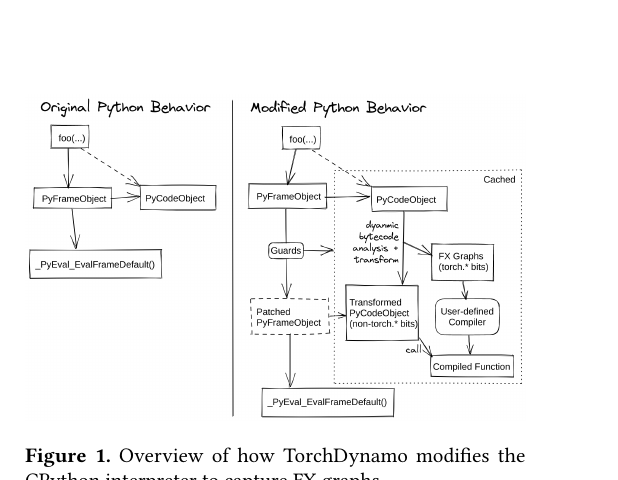
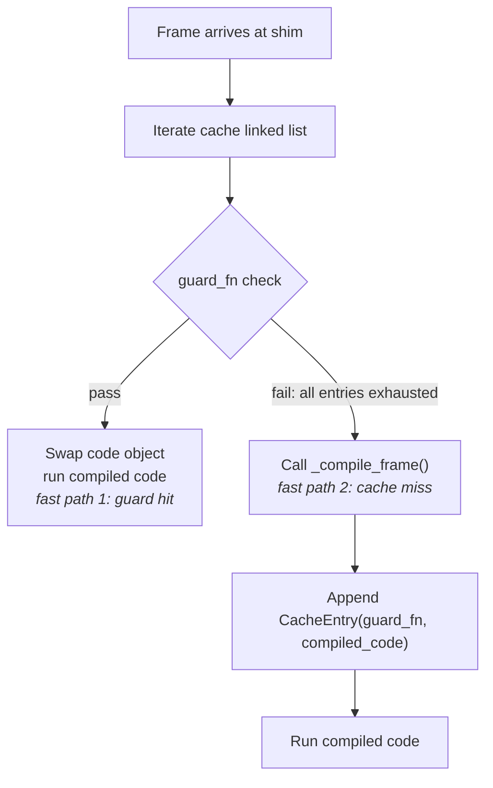
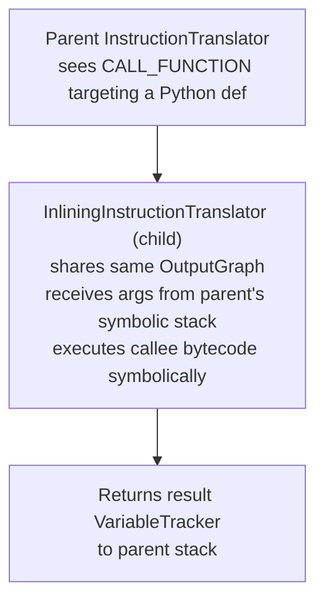
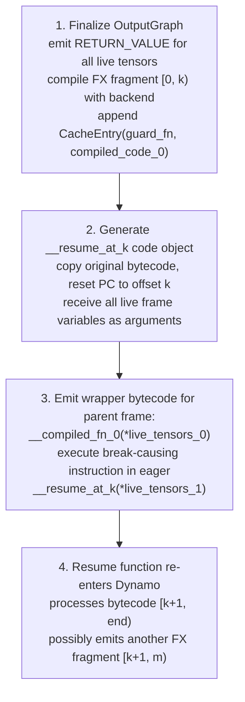

# 🔬 TorchDynamo: Deep Dive

## Table of Contents

- [[#1. The Python Bytecode Model|1. The Python Bytecode Model]]
  - [[#1.1 CPython Code Objects and the Value Stack|1.1 CPython Code Objects and the Value Stack]]
  - [[#1.2 PEP 523: The Frame-Eval API|1.2 PEP 523: The Frame-Eval API]]
  - [[#1.3 Hook Installation via set_eval_frame|1.3 Hook Installation via set_eval_frame]]
  - [[#1.4 The Two Fast Paths|1.4 The Two Fast Paths]]
- [[#2. InstructionTranslator: Symbolic Bytecode Execution|2. InstructionTranslator: Symbolic Bytecode Execution]]
  - [[#2.1 The Symbolic Value Stack|2.1 The Symbolic Value Stack]]
  - [[#2.2 Opcode Dispatch|2.2 Opcode Dispatch]]
  - [[#2.3 OutputGraph: FX Node Accumulation|2.3 OutputGraph: FX Node Accumulation]]
  - [[#2.4 Inlining: InliningInstructionTranslator|2.4 Inlining: InliningInstructionTranslator]]
- [[#3. VariableTracker Taxonomy|3. VariableTracker Taxonomy]]
  - [[#3.1 Design Principle|3.1 Design Principle]]
  - [[#3.2 Major Subtypes|3.2 Major Subtypes]]
  - [[#3.3 Worked Example: y = x + 1|3.3 Worked Example: y = x + 1]]
- [[#4. Guard Generation and GuardBuilder|4. Guard Generation and GuardBuilder]]
  - [[#4.1 Source Annotations|4.1 Source Annotations]]
  - [[#4.2 Guard Types and GuardBuilder Methods|4.2 Guard Types and GuardBuilder Methods]]
  - [[#4.3 Guard Code Generation|4.3 Guard Code Generation]]
  - [[#4.4 The guard_fn Structure|4.4 The guard_fn Structure]]
- [[#5. Graph Breaks: Mechanics and Implications|5. Graph Breaks: Mechanics and Implications]]
  - [[#5.1 Exhaustive Trigger Catalogue|5.1 Exhaustive Trigger Catalogue]]
  - [[#5.2 What Dynamo Does on a Break|5.2 What Dynamo Does on a Break]]
  - [[#5.3 fullgraph=True Mode|5.3 fullgraph=True Mode]]
- [[#6. The Compilation Cache in Depth|6. The Compilation Cache in Depth]]
  - [[#6.1 The Per-Code-Object Linked List|6.1 The Per-Code-Object Linked List]]
  - [[#6.2 Cache Size and Fallback Policy|6.2 Cache Size and Fallback Policy]]
  - [[#6.3 The Persistent FX Graph Cache|6.3 The Persistent FX Graph Cache]]
  - [[#6.4 Clearing State|6.4 Clearing State]]
- [[#7. Debugging and Observability|7. Debugging and Observability]]
  - [[#7.1 Backend Isolation Modes|7.1 Backend Isolation Modes]]
  - [[#7.2 torch._dynamo.explain|7.2 torch._dynamo.explain]]
  - [[#7.3 Logging and Bytecode Inspection|7.3 Logging and Bytecode Inspection]]
- [[#References|References]]

---

## 1. The Python Bytecode Model

> [!INFO] Prerequisite
> This section assumes familiarity with CPython internals at the level of code objects and the eval loop. The [[concepts/pytorch-internals/torch-compile/overview|torch.compile survey]] covers Dynamo at a high level; this note goes significantly deeper.

### 1.1 CPython Code Objects and the Value Stack

Every Python function is compiled by CPython into a *code object* (`PyCodeObject`), a C struct containing:

| Field | Type | Meaning |
|-------|------|---------|
| `co_code` | `bytes` | Sequence of 2-byte instruction words: (opcode, arg) |
| `co_consts` | `tuple` | Literal constants embedded in the bytecode |
| `co_varnames` | `tuple` | Names of local variables |
| `co_freevars` | `tuple` | Names of closed-over variables |
| `co_filename`, `co_firstlineno` | metadata | Source location |

When CPython *calls* a function it allocates a *frame* (`PyFrameObject`) from the code object. The frame holds:

- **Value stack** — a fixed-size array of `PyObject*` pointers. The program counter (`f_lasti`) and stack pointer (`f_stacktop`) track execution state.
- **`f_locals`** — a C array of local variable slots, indexed by position in `co_varnames`.
- A pointer to the enclosing frame (`f_back`) forming the call stack.

The *eval loop* (`_PyEval_EvalFrameDefault`) fetches one instruction at a time, dispatches to a `switch`/`computed-goto` block keyed on the opcode, and manipulates the value stack. For instance:

- **`LOAD_FAST i`** — pushes `f_locals[i]` onto the stack.
- **`BINARY_ADD`** — pops two objects, calls `PyNumber_Add`, pushes the result.
- **`CALL_FUNCTION n`** — pops the top $n+1$ stack slots (callee + $n$ args), calls `_PyObject_Call`, pushes the return value.
- **`RETURN_VALUE`** — pops the stack top and returns it as the frame's result.

**Definition (Execution Frame).** Formally, a frame $F$ is the tuple $(C, \sigma, \text{pc}, \ell)$ where $C$ is the code object, $\sigma : \text{Varnames} \to \text{PyObject*}$ is the local variable store, $\text{pc} \in [0, |C.\texttt{co\_code}|)$ is the instruction pointer, and $\ell$ is the value stack.

### 1.2 PEP 523: The Frame-Eval API

[PEP 523](https://peps.python.org/pep-0523/) (CPython 3.6+) added an `eval_frame` function pointer to `PyInterpreterState`. Before evaluating any frame, CPython checks:

```c
// Simplified from CPython/ceval.c
if (tstate->interp->eval_frame != NULL) {
    return tstate->interp->eval_frame(tstate, frame, throwflag);
}
return _PyEval_EvalFrameDefault(tstate, frame, throwflag);
```

This gives any C extension the ability to intercept *every function call* and either handle it or delegate back to the default evaluator. Dynamo registers `custom_eval_frame_shim` (in `torch/csrc/dynamo/eval_frame.c`) as this hook.

**Definition (Custom Frame Evaluator).** A frame evaluator has the C signature:

$$
\texttt{eval\_fn}(\texttt{PyThreadState}^*, \texttt{PyFrameObject}^*, \texttt{int}) \to \texttt{PyObject}^*
$$

The `throwflag` argument signals whether an exception is being propagated into the frame; Dynamo passes it through unchanged when falling back to the default evaluator.



*Ansel et al. (2024): TorchDynamo installs a custom frame-evaluation function via PEP 523. On the first call, it compiles the frame; on subsequent calls with passing guards, it swaps in the compiled code object directly.*

### 1.3 Hook Installation via set_eval_frame

`torch._dynamo.optimize` and `torch.compile` ultimately call into `torch/_dynamo/eval_frame.py`, which wraps the C function `set_eval_frame(callback)`. This function stores the callback in `PyThreadState` (thread-local), so the hook is *per-thread*, not global:

```python
# Simplified from torch/_dynamo/eval_frame.py
@contextmanager
def enable_dynamo(compiler_fn):
    prior = set_eval_frame(compiler_fn)   # installs hook, returns old value
    try:
        yield
    finally:
        set_eval_frame(prior)             # restores previous hook (or None)
```

> [!NOTE] Thread Safety
> Because the hook is stored in `PyThreadState`, separate Python threads each maintain their own hook. A thread that does not call `set_eval_frame` will not be intercepted by Dynamo, even if the main thread has an active hook. This makes `torch.compile` safe with Python threading but requires explicit handling in multi-threaded inference servers.

### 1.4 The Two Fast Paths

When `custom_eval_frame_shim` is invoked for a frame, it immediately checks the *compilation cache* attached to the frame's code object:



**Fast path 1** (guard hit): guard evaluation is pure Python predicate evaluation with no allocations. The compiled code object is swapped in and the default evaluator runs it — Dynamo is entirely out of the hot path.

**Fast path 2** (cache miss): `_compile_frame` is called, which instantiates `InstructionTranslator`, performs symbolic execution, emits an FX graph, compiles it via the backend, generates a guard function, and appends a new `CacheEntry` to the linked list.

> [!QUESTION] Exercise 1: Frame Hook Scope
> *This problem tests understanding of where the PEP 523 hook is installed.*
>
> > **Prerequisites:** [[#1.3 Hook Installation via set_eval_frame|1.3 Hook Installation via set_eval_frame]]
>
> Suppose you decorate a top-level function `f` with `@torch.compile` and call it from two threads simultaneously. Thread A calls `f(x_A)` and Thread B calls `f(x_B)` with different tensor dtypes. Describe precisely: (a) how many `set_eval_frame` calls occur and when; (b) whether the two threads share a compilation cache; (c) what happens if Thread B's guard fails after Thread A has already compiled a specialization.

> [!TIP]- Solution to Exercise 1
> **Key insight:** The hook is stored per-thread in `PyThreadState`, but the compilation cache is stored on the *code object* (`PyCodeObject`), which is shared between threads.
>
> **Sketch:**
> (a) Each thread that enters the decorated function installs the hook via `set_eval_frame` independently — two calls, one per thread. The `@torch.compile` decorator wraps `f` in a `OptimizedModule` or equivalent that manages the context manager per-call.
>
> (b) The cache *is* shared: it lives on the code object `f.__code__`, which is a single Python object referenced by both threads. Access to the linked list requires a GIL hold, so appending entries is safe but not lock-free.
>
> (c) When Thread B's guard fails, Dynamo is re-entered from Thread B's context. It calls `_compile_frame`, performs symbolic execution for Thread B's dtype specialization, and appends a second `CacheEntry`. The cache now has two entries. Future calls from either thread walk the list until a guard passes.

---

## 2. InstructionTranslator: Symbolic Bytecode Execution

### 2.1 The Symbolic Value Stack

`InstructionTranslator` (defined in `torch/_dynamo/symbolic_convert.py`) is a bytecode *interpreter* that re-executes the function's bytecode symbolically rather than concretely. The key difference from CPython's eval loop:

- CPython's value stack holds `PyObject*` — pointers to real Python objects.
- Dynamo's *symbolic value stack* holds `VariableTracker` instances — abstract representations that carry both the object's *identity* (for guard generation) and its *FX proxy* (for graph construction).

**Definition (Symbolic Value Stack).** The symbolic stack $\hat{\ell}$ is a sequence of `VariableTracker` objects. Each tracker $v \in \hat{\ell}$ carries:
1. A `source` annotation — a path expression describing how to reach the underlying Python object from the frame locals (used by `GuardBuilder`).
2. Optionally, an `fx_proxy` — a `torch.fx.Proxy` node in the `OutputGraph` representing this value's computation.

### 2.2 Opcode Dispatch

`InstructionTranslator` contains one method per CPython opcode (or inherits it from a base class). The dispatch loop:

```python
# Simplified from symbolic_convert.py
def step(self):
    inst = self.instructions[self.instruction_pointer]
    self.instruction_pointer += 1
    handler = getattr(self, inst.opname, None)
    if handler:
        handler(inst)
    else:
        self.unimplemented(f"opcode {inst.opname}")
```

Key opcode handlers:

| Opcode | Handler behavior |
|--------|-----------------|
| `LOAD_FAST` | Look up `inst.argval` in the symbolic locals dict; push the corresponding `VariableTracker` |
| `LOAD_CONST` | Wrap the literal in a `ConstantVariable`; push it |
| `LOAD_GLOBAL` | Look up the name in the frame globals; wrap as `TorchVariable`, `NNModuleVariable`, or `ConstantVariable` depending on the object type |
| `BINARY_ADD` | Pop two trackers $b$, $a$; call `a.__add__(tx, [b])`; push the result tracker |
| `CALL_FUNCTION` | Pop callee + args; dispatch to callee tracker's `call_function(tx, args, kwargs)` |
| `RETURN_VALUE` | Pop the top-of-stack tracker; finalize `OutputGraph`; emit the compiled code |
| `POP_JUMP_IF_FALSE` | If the condition tracker is a `ConstantVariable`, specialize the branch. If it is a `TensorVariable` or `SymNodeVariable`, trigger a graph break. |

> [!WARNING] Data-dependent branches
> When `POP_JUMP_IF_FALSE` or `POP_JUMP_IF_TRUE` encounters a condition that is a `TensorVariable`, Dynamo cannot statically determine which branch to take — it triggers a graph break. This is the most common cause of fragmentation in models with dynamic control flow.

### 2.3 OutputGraph: FX Node Accumulation

`OutputGraph` (in `torch/_dynamo/output_graph.py`) is the *accumulator* that builds the [[concepts/pytorch-internals/torch-fx|torch.fx]] graph incrementally as `InstructionTranslator` processes instructions. It wraps an `fx.Graph` and exposes three primary emission methods:

**Definition (FX Node Emission).** During symbolic execution, `OutputGraph` emits nodes of three kinds:

| Kind | Emitted when | FX node op |
|------|-------------|------------|
| `call_function` | A `TorchVariable` or `BuiltinVariable` is called with tensor arguments | `graph.call_function(fn, args, kwargs)` |
| `call_method` | A method is called on a `TensorVariable` (e.g., `.relu()`, `.view()`) | `graph.call_method(method_name, args, kwargs)` |
| `call_module` | An `NNModuleVariable` is called | `graph.call_module(module_name, args, kwargs)` |

Each emission returns an `fx.Proxy` object, which is wrapped in a new `TensorVariable` and pushed onto the symbolic stack. This is how tensor computations propagate through the symbolic interpreter without actually running the computation.

> [!EXAMPLE] OutputGraph in action
> Consider `y = torch.relu(x)` where `x` is a local tensor. The instruction sequence is roughly:
> 1. `LOAD_GLOBAL torch` → pushes a `TorchVariable` wrapping the `torch` module
> 2. `LOAD_ATTR relu` → pushes a `TorchVariable` wrapping `torch.relu`
> 3. `LOAD_FAST x` → pushes the `TensorVariable` for `x` (with proxy `%x`)
> 4. `CALL_FUNCTION 1` → calls `TorchVariable(torch.relu).call_function(tx, [TensorVariable(%x)], {})` → emits `%relu = call_function[target=torch.relu](args=(%x,))` → pushes `TensorVariable(%relu)`
> 5. `STORE_FAST y` → pops the tracker and binds it to `y` in the symbolic locals

### 2.4 Inlining: InliningInstructionTranslator

When the callee of a `CALL_FUNCTION` is a Python `def` that Dynamo *can* inline (i.e., not a graph-break-causing builtin), Dynamo does not emit a `call_function` node. Instead, it *inlines* the callee by spawning a child `InliningInstructionTranslator`:



**Definition (Inlining).** `InliningInstructionTranslator` is a subclass of `InstructionTranslator` that overrides `RETURN_VALUE` to *return* the top-of-stack tracker to the parent rather than finalizing the graph. It shares the parent's `OutputGraph`, so any FX nodes emitted by the inlined function appear in the same graph fragment.

Inlining is critical for capturing helper functions, `nn.functional` calls that are implemented in Python, and user-defined utility functions that operate only on tensors. If inlining encounters an operation that would cause a graph break, the break propagates up to the parent.

> [!QUESTION] Exercise 2: Inlining vs. Graph Break
> *This problem establishes when inlining succeeds and when it degrades to a graph break.*
>
> > **Prerequisites:** [[#2.4 Inlining: InliningInstructionTranslator|2.4 Inlining: InliningInstructionTranslator]]
>
> Consider:
> ```python
> def helper(t):
>     if t.shape[0] > 10:   # data-independent: shape is static
>         return t * 2
>     return t + 1
>
> @torch.compile
> def f(x):
>     return helper(x)
> ```
> (a) Does Dynamo inline `helper`? (b) Does the `if` branch cause a graph break? (c) Now replace `t.shape[0]` with `t.item()`. What happens?

> [!TIP]- Solution to Exercise 2
> **Key insight:** Static shape guards enable specialization of control flow; data escape (`item()`) forces a break.
>
> **Sketch:**
> (a) Yes — `helper` is a plain Python `def` with no C-extension or graph-break operations, so `InliningInstructionTranslator` handles it.
>
> (b) No. `t.shape[0]` is an integer known at trace time (Dynamo specializes tensor shapes by default). The `ConstantVariable` representing `shape[0]` is compared against `10` using a `COMPARE_OP` instruction, yielding another `ConstantVariable(True or False)`. Dynamo specializes the branch without a break, installing a shape guard `L['x'].shape[0] > 10` (or its negation).
>
> (c) `t.item()` materializes a tensor value into Python — it is a *data escape*. Dynamo cannot know the value at trace time, so it triggers a graph break inside `helper`. The partial graph up to `item()` is compiled; the branch and remainder execute in eager mode.

---

## 3. VariableTracker Taxonomy

### 3.1 Design Principle

`VariableTracker` (base class in `torch/_dynamo/variables/base.py`) is the abstract representation of a Python value during symbolic execution. Every object that Dynamo encounters — tensors, integers, functions, modules, lists — is wrapped in an appropriate subclass. The subclass determines three things:

1. **What guards are installed** when the value enters the symbolic stack (via `make_guards`).
2. **What FX node is emitted** when an operation is performed on the value (via `call_function`, `__add__`, etc.).
3. **Whether a graph break occurs** if the operation is unsupported.

`VariableBuilder` is the factory that constructs `VariableTracker` instances from real Python objects at frame entry, attaching source annotations.

### 3.2 Major Subtypes

| Subtype | Source file | Wraps | Guards installed | FX emission |
|---------|------------|-------|-----------------|-------------|
| `TensorVariable` | `variables/tensor.py` | `torch.Tensor` | `TENSOR_MATCH`: dtype, device, ndim, requires_grad, dispatch keys. Shape dims: `EQUALS_MATCH` (static) or `SHAPE_ENV` inequality (dynamic) | `call_function` / `call_method` producing a proxy |
| `ConstantVariable` | `variables/constant.py` | Python `int`, `float`, `bool`, `str`, `None` | `EQUALS_MATCH` on the concrete value | Inlined as an immediate argument — no FX node |
| `TorchVariable` | `variables/torch.py` | `torch.*` functions and namespaces | `ID_MATCH` on the function object id | `call_function` with target = the function |
| `NNModuleVariable` | `variables/nn_module.py` | `nn.Module` instance | `ID_MATCH` on the module instance | `call_module` with target = module name |
| `SymNodeVariable` | `variables/tensor.py` | Symbolic integer from `ShapeEnv` | `SHAPE_ENV` inequality constraint | Used in index expressions and size computations |
| `UserDefinedObjectVariable` | `variables/user_defined.py` | Arbitrary Python object | Opaque; attribute accesses may install `HASATTR` guards | None — triggers graph break if tensor-producing |
| `ListVariable` / `TupleVariable` | `variables/lists.py` | Python `list` / `tuple` of traceable values | Per-element guards from each element's tracker | Reconstructed as immediate args; no graph node for the container |
| `BuiltinVariable` | `variables/builtin.py` | Python builtins (`len`, `range`, `zip`, …) | `ID_MATCH` | Depends: `len(tensor)` → `call_function`, `range(n)` → unrolled loop |

> [!NOTE] SymNodeVariable and Dynamic Shapes
> `SymNodeVariable` wraps a `torch.SymInt` — a symbolic integer produced by [[concepts/pytorch-internals/torch-compile/symbolic-shapes|Symbolic Shapes]]' `ShapeEnv`. When `dynamic=True` is passed to `torch.compile`, tensor dimension values are not specialized to concrete integers but instead become `SymInt` objects tracked by `ShapeEnv`. Guards on these dimensions are expressed as inequalities (e.g., $s_0 \ge 1$) rather than equality checks.

### 3.3 Worked Example: y = x + 1

Let `x` be a `torch.float32` tensor of shape `(3, 4)` passed as a local variable. The bytecode for `y = x + 1` (under CPython 3.11) is approximately:

```
LOAD_FAST   x          # push x
LOAD_CONST  1          # push 1
BINARY_OP   +          # pop 1, pop x; push result
STORE_FAST  y          # pop result; bind to y
```

Dynamo's `InstructionTranslator` processes each instruction:

1. **`LOAD_FAST x`** → look up `x` in the symbolic locals dict. `VariableBuilder` has already wrapped the concrete tensor at frame entry: it calls `TensorVariable.__init__`, records source `LocalSource("x")`, and installs guards via `TENSOR_MATCH` (checks dtype = float32, device = cpu/cuda, ndim = 2, shape = (3, 4) under static mode). The `TensorVariable` (carrying FX proxy `%x`) is pushed onto $\hat\ell$.

2. **`LOAD_CONST 1`** → the literal `1` is wrapped as `ConstantVariable(1)` with guard `EQUALS_MATCH`. No source annotation needed (literals have no runtime address). Pushed onto $\hat\ell$.

3. **`BINARY_OP +`** → pops `ConstantVariable(1)` then `TensorVariable(%x)`. Dispatch: `TensorVariable.__add__(tx, [ConstantVariable(1)])`. The tensor variable's `__add__` method:
   - Resolves that `1` is a constant, so it can be passed directly as an FX argument.
   - Calls `OutputGraph.call_function(torch.Tensor.__add__, args=(%x, 1))`.
   - `OutputGraph` emits an FX node: `%add = call_function[target=torch.Tensor.__add__](args=(%x, 1))`.
   - Returns a new `TensorVariable` carrying proxy `%add`. Pushed onto $\hat\ell$.

4. **`STORE_FAST y`** → pops `TensorVariable(%add)` and binds it to `y` in the symbolic locals.

**The FX graph after tracing `y = x + 1` contains exactly two nodes:** a `placeholder` for `x` and a `call_function` for the add. The constant `1` is *not* a graph node — it is a literal embedded in the `call_function` args.

> [!QUESTION] Exercise 3: Guard Count
> *This problem works through the guards generated for the worked example.*
>
> > **Prerequisites:** [[#3.3 Worked Example: y = x + 1|3.3 Worked Example: y = x + 1]]
>
> For the function `f(x): return x + 1` compiled with `torch.compile` (static shapes), list every guard predicate that Dynamo installs, give its type from the guard taxonomy, and explain which of them would fire if `f` is called again with a float64 tensor of the same shape.

> [!TIP]- Solution to Exercise 3
> **Key insight:** `TENSOR_MATCH` is a compound guard; a dtype mismatch fires it immediately.
>
> **Sketch:**
> Guards installed on first call (shape `(3,4)`, dtype float32, device cpu):
>
> | Predicate | Guard type |
> |-----------|-----------|
> | `isinstance(L['x'], torch.Tensor)` | `TENSOR_MATCH` (type check) |
> | `L['x'].dtype == torch.float32` | `TENSOR_MATCH` (dtype) |
> | `L['x'].device.type == 'cpu'` | `TENSOR_MATCH` (device) |
> | `L['x'].ndim == 2` | `TENSOR_MATCH` (ndim) |
> | `L['x'].shape[0] == 3` | `EQUALS_MATCH` (static shape dim 0) |
> | `L['x'].shape[1] == 4` | `EQUALS_MATCH` (static shape dim 1) |
> | `L['x'].requires_grad == False` | `TENSOR_MATCH` (grad flag) |
>
> On second call with float64, the dtype predicate `L['x'].dtype == torch.float32` evaluates to `False`. The guard function returns `False` at that predicate (guards are evaluated with short-circuit `and`). Dynamo walks to the next cache entry (or compiles a new specialization for float64 if none exists).

---

## 4. Guard Generation and GuardBuilder

### 4.1 Source Annotations

Every `VariableTracker` carries a `source` field — a *source annotation* that encodes the *path* from the frame locals to the wrapped Python object. `GuardBuilder` uses this path to emit guard predicates that check the correct runtime object.

**Definition (Source).** A source is a tree of path accessors:

| Source class | Meaning | Example guard access |
|-------------|---------|---------------------|
| `LocalSource(name)` | Frame local variable | `L['name']` |
| `GlobalSource(name)` | Frame global | `G['name']` |
| `AttrSource(base, attr)` | Attribute access | `base.attr` |
| `GetItemSource(base, key)` | Index access | `base[key]` |
| `NNModuleSource(base)` | `nn.Module` in module hierarchy | derived from `NNModuleVariable` |

Sources compose: if `model` is a `LocalSource("model")` and its attribute `weight` is an `AttrSource(LocalSource("model"), "weight")`, then the guard for `weight.dtype` generates `L['model'].weight.dtype == torch.float32`.

### 4.2 Guard Types and GuardBuilder Methods

`GuardBuilder` (in `torch/_dynamo/guards.py`, with a performance-critical C++ implementation in `torch/csrc/dynamo/guards.cpp`) contains one method per guard type. At the time of writing, over 30 guard types exist. The most important:

| Guard type | `GuardBuilder` method | What it checks |
|-----------|----------------------|---------------|
| `TENSOR_MATCH` | `TENSOR_MATCH` | dtype, device, ndim, requires_grad, dispatch keys, optionally shape and stride |
| `EQUALS_MATCH` | `EQUALS_MATCH` | Equality with a concrete Python value (int, str, bool) |
| `ID_MATCH` | `ID_MATCH` | Object identity (`id(obj) == expected_id`) — used for functions and modules |
| `TYPE_MATCH` | `TYPE_MATCH` | `type(obj) is ExpectedType` |
| `SHAPE_ENV` | `SHAPE_ENV` | Symbolic shape inequalities from `ShapeEnv` |
| `HASATTR` | `HASATTR` | `hasattr(obj, 'attr')` — for attribute access on `UserDefinedObjectVariable` |
| `DICT_KEYS` | `DICT_KEYS` | `set(dict.keys()) == expected_keys` |
| `LIST_LENGTH` | `LIST_LENGTH` | `len(list) == expected_len` |

**Definition (Guard).** A guard is a dataclass with three fields:
- `name`: identifier string for the guarded variable
- `source`: an enum indicating the source type (distinct from `VariableTracker.source`)
- `create_fn`: a callable that is a method of `GuardBuilder`

Guards are created via `VariableTracker.make_guards(GuardBuilder.METHOD_NAME)`, which calls `self.source.make_guard(fn)`.

### 4.3 Guard Code Generation

`GuardBuilder` methods emit Python *code strings* that are joined with `and` into a single `check_fn` predicate. For example, `EQUALS_MATCH` appends:

```python
# Emitted by GuardBuilder.EQUALS_MATCH for ConstantVariable(1) at LocalSource("y")
"L['y'] == 1"
```

`TENSOR_MATCH` emits a call to the compiled C++ helper `___check_tensors`:

```python
# Emitted by GuardBuilder.TENSOR_MATCH for TensorVariable at LocalSource("x")
"___check_tensors(L['x'], dtype=torch.float32, device='cpu', ndim=2, requires_grad=False)"
```

Multiple guards combine:

```python
guard_code = (
    "___guarded_code.valid and "
    "___check_type_id(L['x'], <id>) and "
    "___check_tensors(L['x'], ...) and "
    "L['x'].shape[0] == 3 and "
    "L['x'].shape[1] == 4"
)
```

### 4.4 The guard_fn Structure

The final guard function has the Python signature:

**Definition (Guard Function).** Let $\mathcal{L}$ be the dict of frame locals and $\mathcal{G}$ the dict of frame globals. The guard function is:

$$
\texttt{guard\_fn}(\mathcal{L} : \texttt{dict}, \mathcal{G} : \texttt{dict}) \to \texttt{bool}
$$

It is a pure Python function (with C helpers for tensor checks) generated by `exec`-ing the emitted code string into a fresh namespace. The `L` and `G` bindings refer to the dictionaries of live locals and globals respectively, which are constructed from the frame at the cache-lookup site.

> [!NOTE] C++ Guard Acceleration
> For performance, the actual `RootGuardManager` (since PyTorch 2.1) implements guard evaluation in C++ via `torch/csrc/dynamo/guards.cpp`. The Python code-string approach described above is the conceptual model; the compiled guard manager avoids Python overhead on the fast path.

> [!QUESTION] Exercise 4: Guard Composition
> *This problem tests understanding of how source annotations compose into guard predicates.*
>
> > **Prerequisites:** [[#4.1 Source Annotations|4.1 Source Annotations]], [[#4.3 Guard Code Generation|4.3 Guard Code Generation]]
>
> Consider:
> ```python
> class Config:
>     dtype = torch.float32
>
> @torch.compile
> def f(x, cfg):
>     return x.to(cfg.dtype)
> ```
> Describe the source annotation on the `VariableTracker` wrapping `cfg.dtype`, and write out the guard predicate Dynamo generates for it.

> [!TIP]- Solution to Exercise 4
> **Key insight:** `AttrSource` composes over `LocalSource` to produce a dotted path.
>
> **Sketch:**
> `cfg` enters as `LocalSource("cfg")`. When Dynamo encounters `cfg.dtype` (a `LOAD_ATTR` instruction), it accesses attribute `dtype` on `cfg`'s tracker — producing a new tracker with source `AttrSource(LocalSource("cfg"), "dtype")`. The corresponding guard predicate is:
>
> ```python
> "L['cfg'].dtype == torch.float32"   # EQUALS_MATCH guard
> "___check_type_id(L['cfg'], <id_of_Config>)"  # TYPE_MATCH / ID_MATCH guard
> ```
>
> Both are required: the type guard ensures the attribute access `cfg.dtype` is safe; the value guard specializes on the concrete dtype. If `cfg.dtype` is later changed to `torch.float16`, the value guard fires.

---

## 5. Graph Breaks: Mechanics and Implications

### 5.1 Exhaustive Trigger Catalogue

A *graph break* occurs whenever `InstructionTranslator` encounters an operation that cannot be represented in the FX graph or whose outcome depends on runtime data that is not symbolically available. Dynamo categorizes break sources:

**Data escape — tensor value enters Python:**
- `tensor.item()` — materializes a 0-d tensor to a Python scalar
- `bool(tensor)` — calls `__bool__`, which calls `.item()` for 0-d tensors
- `int(tensor)` — calls `__index__` or `__int__`
- `tensor.tolist()` — materializes the full tensor as a Python list

**Unsupported Python operations:**
- `print(...)`, `logging.*` calls, file I/O — side effects with no FX equivalent
- `id(tensor)`, `hash(tensor)`, `type(tensor)` used as a runtime value — not graph-representable
- `torch.autograd.grad(...)` called directly in the forward pass (not via `.backward()`)
- `torch.nn.utils.rnn.pack_padded_sequence` and ops with data-dependent output shapes

**Data-dependent control flow:**
- `if tensor_valued_condition:` — when the condition is a `TensorVariable` (not a `ConstantVariable` or `SymNodeVariable` that can be statically resolved)
- `for i in range(tensor.item()):` — loop bound depends on tensor data

**Untraced callees:**
- Calling a C extension function that Dynamo does not have a `VariableTracker` for
- Calling a Python function that, when `InliningInstructionTranslator` attempts to inline it, itself triggers a graph break at the top level

**Unsupported Python builtins (in tensor-producing context):**
- `exec`, `eval`, `globals()`, `locals()` — dynamic name lookup
- `__import__` — dynamic import

> [!DANGER] Silent performance regression
> Graph breaks do not raise errors by default. A model with many breaks will compile and run correctly but will not benefit from kernel fusion or cross-operator optimization across the break boundaries. *Always use `torch._dynamo.explain` (§7.2) or `TORCH_LOGS="graph_breaks"` to audit break counts before claiming a model is "compiled".*

### 5.2 What Dynamo Does on a Break

When `InstructionTranslator` hits a break trigger at instruction offset $k$ in the original bytecode, it performs the following sequence:



**Definition (Resume Stub).** A `__resume_at_<offset>_<index>` code object is a copy of the original bytecode with `co_firstlineno` and jump targets adjusted so that execution begins at byte offset `<offset>`. Live frame variables are passed as arguments. The stub re-enters `custom_eval_frame_shim` on its first call, triggering Dynamo to compile the continuation.

*Importantly,* a function with $N$ graph breaks becomes $N+1$ compiled FX graph fragments, each with its own guard set. The wrapper function that glues them together is itself compiled bytecode — it is not re-interpreted by Dynamo on every call.

> [!EXAMPLE] Graph Break Transformation
> Original function:
> ```python
> def f(x, y):
>     a = x + y          # captured in graph fragment 0
>     print("debug")     # graph break here
>     return a * 2       # captured in graph fragment 1
> ```
> After Dynamo transforms `f`, the bytecode effectively implements:
> ```python
> def f(x, y):
>     a, = __compiled_fn_0(x, y)   # fragment 0: x + y
>     print("debug")                # eager
>     return __resume_at_38_1(a)   # fragment 1: a * 2
> ```
> `__resume_at_38_1` re-enters Dynamo on its first call, compiling `a * 2` into a second compiled artifact.

### 5.3 fullgraph=True Mode

`torch.compile(fullgraph=True)` instructs Dynamo to treat any graph break as a fatal error:

```python
@torch.compile(fullgraph=True)
def f(x):
    print(x)   # raises torch._dynamo.exc.Unsupported at trace time
    return x + 1
```

`fullgraph=True` is the preferred mode for production deployment: it makes graph break mistakes visible at development time rather than silently fragmenting the graph. It is also required for `torch.export`, which demands a single captured graph with no Python fallback.

> [!QUESTION] Exercise 5: Break Count
> *This problem counts graph fragments for a multi-break function.*
>
> > **Prerequisites:** [[#5.2 What Dynamo Does on a Break|5.2 What Dynamo Does on a Break]]
>
> Consider:
> ```python
> @torch.compile
> def f(x):
>     a = x.relu()
>     print(a.shape)       # break 1
>     b = a * 2
>     if a.item() > 0:     # break 2
>         return b + 1
>     return b - 1
> ```
> How many compiled FX graph fragments does Dynamo produce? What does each fragment contain? What executes in eager mode between fragments?

> [!TIP]- Solution to Exercise 5
> **Key insight:** Each break produces one additional fragment; the break-causing instruction itself runs in eager mode.
>
> **Sketch:**
> Break at `print(a.shape)` and break at `if a.item() > 0:` → **3 compiled fragments**:
>
> | Fragment | Contains | Eager between |
> |---------|----------|--------------|
> | 0 | `x.relu()` — one FX node | `print(a.shape)` |
> | 1 | `a * 2` | `a.item()` + the `if` branch dispatch |
> | 2 | `b + 1` or `b - 1` (whichever branch is taken, specialized per guard) | none |
>
> *Note:* Fragment 2 is specialized per branch — Dynamo traces each branch arm independently on the first call down each path. The `item()` value is not in a guard (it is a data-dependent value), so the branch dispatch happens in eager Python.

---

## 6. The Compilation Cache in Depth

### 6.1 The Per-Code-Object Linked List

The Dynamo compilation cache is a *linked list* of `CacheEntry` pairs, stored as an attribute on each `PyCodeObject`. Because code objects are shared Python objects (the same `f.__code__` is referenced everywhere `f` appears), the cache is implicitly shared across all call sites of the same function.

**Definition (Cache Entry).** A `CacheEntry` is a pair:

$$
\texttt{CacheEntry} = (\texttt{guard\_fn} : \texttt{dict} \to \texttt{bool},\; \texttt{code} : \texttt{PyCodeObject})
$$

where `guard_fn` encodes the specialization conditions under which `code` is valid, and `code` is the compiled code object that replaces the original function body.

Cache lookup is $O(n)$ in the number of entries. For the default limit of $n \le 8$ this is a small constant — the guard functions are compiled predicates and the list is cache-friendly in memory.

**Definition (Cache Lookup Protocol).** On each call to a compiled function, the hook iterates the linked list from head to tail. For entry $i$:
- If `entry_i.guard_fn(locals, globals)` returns `True`: swap `entry_i.code` as the code object and evaluate it via `_PyEval_EvalFrameDefault`. Stop.
- If `False`: advance to `entry_i.next`.
- If the list is exhausted: call `_compile_frame`, append a new entry, evaluate.

*Surprisingly,* putting the most recently compiled specialization at the head (rather than maintaining MRU order) is not the current policy — the list is append-only. This means that if call patterns cycle through many specializations, later entries incur higher lookup cost. The `cache_size_limit` prevents this from becoming unbounded.

### 6.2 Cache Size and Fallback Policy

**Definition (Cache Size Limit).** `torch._dynamo.config.cache_size_limit` (default: **8**) is the maximum number of `CacheEntry` objects per code object. Once this limit is reached, Dynamo **stops compiling new specializations** for that function and falls back to eager execution for any guard-failing call.

> [!WARNING] Recompilation Warning
> When Dynamo recompiles a function for the $n$-th time (approaching the limit), it emits a `UserWarning` with text resembling `"TorchDynamo optimized model may be significantly slower than original because of recompilation."` This warning is a signal to investigate guard instability. Enable `TORCH_LOGS="recompiles"` to see the exact guard that failed.

Common causes of excessive recompilation:
- Calling a function with tensors of varying shapes without enabling `dynamic=True`
- Passing different `nn.Module` instances (each fails the `ID_MATCH` guard on the module)
- Changing `requires_grad` between calls

### 6.3 The Persistent FX Graph Cache

The Dynamo per-code-object cache is in-process and non-persistent. A separate *persistent cache* tier stores Inductor compilation artifacts across process restarts:

| Cache tier | Contents | Location | Persistence |
|-----------|----------|----------|-------------|
| `FXGraphCache` | Inductor-lowered FX graph IR | `TORCHINDUCTOR_CACHE_DIR` | Across restarts |
| `TritonCache` | Compiled `.cubin` files from Triton | `TORCHINDUCTOR_CACHE_DIR` | Across restarts |
| `AOTAutogradCache` | Joint forward+backward graph artifacts | `TORCHINDUCTOR_CACHE_DIR` | Across restarts |

`TORCHINDUCTOR_CACHE_DIR` defaults to `/tmp/torchinductor_<username>/`. The cache key for `FXGraphCache` is a hash over: the FX graph structure, operator signatures, PyTorch version, and relevant compiler config flags. *This means that upgrading PyTorch invalidates all cached artifacts.* Validation at load time also checks that the GPU device matches the cached target.

The persistent cache means that the second process run after a cold compilation is significantly faster — Inductor skips lowering and kernel compilation, retrieving pre-compiled `.cubin` objects directly. This is especially impactful for large transformer models where Inductor compilation dominates startup time.

> [!NOTE] Triton vs. cubin
> The TritonCache stores CUDA binary (`.cubin`) files produced from Triton's PTX compilation pipeline. These are device-specific and must match the target GPU compute capability. Mismatches cause cache misses, not errors — Triton recompiles and overwrites the stale entry.

### 6.4 Clearing State

```python
torch._dynamo.reset()
```

`torch._dynamo.reset()` clears the Dynamo per-code-object linked-list caches (all `CacheEntry` pairs on all code objects registered with Dynamo) and resets internal counters. **It does not clear the Inductor persistent cache** (`TORCHINDUCTOR_CACHE_DIR`). To force a full recompilation including Inductor, delete the cache directory:

```python
import shutil, os
shutil.rmtree(os.environ.get("TORCHINDUCTOR_CACHE_DIR",
              f"/tmp/torchinductor_{os.getenv('USER')}"))
```

> [!QUESTION] Exercise 6: Cache Sizing
> *This problem analyzes cache limit tradeoffs.*
>
> > **Prerequisites:** [[#6.1 The Per-Code-Object Linked List|6.1 The Per-Code-Object Linked List]], [[#6.2 Cache Size and Fallback Policy|6.2 Cache Size and Fallback Policy]]
>
> A training loop calls `@torch.compile`-decorated `forward(x)` with batch sizes drawn from `{16, 32, 64}` and two dtypes `{float32, float16}`, producing up to 6 distinct specializations. The default `cache_size_limit` is 8.
>
> (a) With static shapes (default), will all 6 specializations fit? (b) What is the guard lookup cost for the 6th specialization on a cache hit? (c) If you increase `cache_size_limit` to 100 and call `forward` with 50 distinct shapes, what is the asymptotic per-call overhead for a hot specialization near the end of the list?

> [!TIP]- Solution to Exercise 6
> **Key insight:** The list is unsorted and append-only; lookup cost is proportional to list position.
>
> **Sketch:**
> (a) Yes — $3 \times 2 = 6 \le 8$, all specializations fit.
>
> (b) In the worst case, the 6th entry is the last appended. Lookup walks 5 failing guards before hitting the 6th. Cost = 5 failed guard evaluations + 1 passing guard evaluation. Each guard is a handful of Python predicate checks; for small $n$ this is negligible.
>
> (c) With 50 specializations and a hot entry near position 50, every call walks 49 failing guards before hitting the match. If each guard takes $\sim$1 µs, that is 49 µs of pure guard overhead per call — potentially significant for small tensors or high-throughput inference. **This is why `cache_size_limit` is deliberately small**: beyond $\sim$8 specializations, `dynamic=True` (symbolic shapes) is almost always the right solution.

---

## 7. Debugging and Observability

### 7.1 Backend Isolation Modes

`torch.compile` accepts a `backend` argument that controls how far down the compilation stack the function is sent. Two diagnostic backends are especially useful:

| Backend | What runs | What is skipped | Use case |
|---------|----------|----------------|----------|
| `"eager"` | TorchDynamo (frame capture + guard generation) | [[concepts/pytorch-internals/torch-compile/aot-autograd|AOTAutograd]], Inductor | Isolate Dynamo-layer bugs: graph breaks, incorrect guard logic |
| `"aot_eager"` | TorchDynamo + AOTAutograd | Inductor | Isolate AOTAutograd bugs: functionalization failures, grad graph errors |
| `"inductor"` (default) | Full stack | Nothing | Production performance |

```python
# Test Dynamo alone
f_dynamo = torch.compile(f, backend="eager")

# Test Dynamo + AOTAutograd
f_aot = torch.compile(f, backend="aot_eager")
```

Both `"eager"` and `"aot_eager"` produce *correct* outputs (they fall back to eager kernels), so correctness testing against the original function is valid. Performance will be slower than eager due to Dynamo overhead without the benefit of kernel fusion.

### 7.2 torch._dynamo.explain

`torch._dynamo.explain(fn)(*args)` performs a *dry run* trace of `fn` with the given arguments and returns an `ExplainOutput` object summarizing all graph captures and breaks:

```python
import torch

@torch.compile
def f(x):
    a = x.relu()
    print(a.shape)   # break
    return a * 2

x = torch.randn(4)
explanation = torch._dynamo.explain(f)(x)

print(explanation.graphs)              # list of captured FX graphs
print(explanation.graph_count)         # number of graph fragments
print(explanation.graph_break_count)   # number of breaks
print(explanation.break_reasons)       # list of (reason_str, traceback) pairs
```

`ExplainOutput.break_reasons` gives human-readable strings like `"'print' is a graph-breaking function"` paired with a Python traceback pointing to the source location. This is the primary tool for iteratively eliminating graph breaks from a model.

> [!EXAMPLE] Diagnosing a Graph Break
> ```python
> import torch
>
> def helper(t):
>     return t.item()     # data escape
>
> @torch.compile
> def f(x):
>     v = helper(x)       # break triggered inside helper
>     return x + v
>
> x = torch.tensor(1.0)
> explanation = torch._dynamo.explain(f)(x)
>
> # explanation.graph_count == 2
> # explanation.break_reasons[0] might read:
> # ("'item' is a graph-breaking function", <traceback to helper>)
> ```
> Fix: if `v` is truly needed as a scalar constant, compute it outside `@torch.compile` and pass it as an argument.

### 7.3 Logging and Bytecode Inspection

**Environment variables for verbose tracing:**

| Variable | Effect |
|---------|--------|
| `TORCH_LOGS="+dynamo"` | Per-instruction tracing: logs every opcode Dynamo processes and the resulting tracker |
| `TORCH_LOGS="graph_breaks"` | Log every graph break with reason and location |
| `TORCH_LOGS="recompiles"` | Log every recompilation event with the failing guard |
| `TORCH_LOGS="output_code"` | Print the transformed (Dynamo-rewritten) bytecode as Python source |
| `TORCHDYNAMO_VERBOSE=1` | Extended stack traces on errors |

**Programmatic bytecode inspection:**

```python
# See the compiled/rewritten code in Python form
import torch._dynamo
torch._dynamo.config.output_code = True
# Then call the compiled function — it prints the generated code

# Or use depyf (third-party) for decompiled source:
# pip install depyf
import depyf
with depyf.prepare_debug(f, x):
    f(x)
```

**Checking for graph breaks in CI:**

```python
# Strict mode: raises on first graph break
torch.compile(f, fullgraph=True)(x)
```

This pattern is recommended for production model CI: add a test that calls the model once under `fullgraph=True` on representative inputs, and any future regression that introduces a break will fail the test immediately.

> [!QUESTION] Exercise 7: Diagnostic Workflow
> *This problem applies the observability tools to a realistic debugging scenario.*
>
> > **Prerequisites:** [[#7.2 torch._dynamo.explain|7.2 torch._dynamo.explain]], [[#7.3 Logging and Bytecode Inspection|7.3 Logging and Bytecode Inspection]]
>
> A colleague reports that `torch.compile` provides no speedup on their model. They suspect graph breaks but do not know where. Describe a step-by-step debugging workflow using only the tools covered in this section, starting from the symptom and ending with a concrete fix strategy.

> [!TIP]- Solution to Exercise 7
> **Key insight:** Funnel from coarse (count) to fine (location) to root cause (fix).
>
> **Sketch:**
>
> **Step 1 — Confirm breaks exist:**
> ```python
> exp = torch._dynamo.explain(model.forward)(sample_input)
> print(exp.graph_count, exp.graph_break_count)
> ```
> If `graph_break_count > 0`, proceed.
>
> **Step 2 — Locate breaks:**
> ```python
> for reason, tb in exp.break_reasons:
>     print(reason)
>     print(tb)
> ```
> Each entry points to the source file and line.
>
> **Step 3 — Triage severity:**
> Not all breaks are equally costly. A break in a rarely-called branch is irrelevant; a break inside the main forward loop fragments every iteration. Count how many ops fall outside compiled regions.
>
> **Step 4 — Apply fixes in priority order:**
> - Data escape (`item`, `bool`): move the scalar extraction outside `@torch.compile` or use `torch.where` to keep the branch inside the graph.
> - `print`: remove or guard with `if torch.compiler.is_compiling(): ...`.
> - Unsupported op: check if a `torch.compile`-compatible equivalent exists or file a Dynamo issue.
>
> **Step 5 — Validate:**
> ```python
> torch.compile(model.forward, fullgraph=True)(sample_input)
> ```
> No error = no breaks = clean capture. Re-benchmark.

---

## References

| Reference | Brief Summary | Link |
|-----------|--------------|------|
| Ansel et al., "PyTorch 2: Faster ML Through Dynamic Python Bytecode Transformation and Graph Compilation" (ASPLOS 2024) | Primary paper for the full torch.compile stack; §3 covers TorchDynamo design, PEP 523 hook, guard system, and graph breaks | [ACM DL](https://dl.acm.org/doi/10.1145/3620665.3640366) |
| Jason Ansel, "TorchDynamo: An Experiment in Dynamic Python Bytecode Transformation" (dev-discuss, 2022) | Original Dynamo design document; rationale for bytecode analysis over tracing, early correctness results | [dev-discuss.pytorch.org](https://dev-discuss.pytorch.org/t/torchdynamo-an-experiment-in-dynamic-python-bytecode-transformation/361) |
| PyTorch Docs, "Dynamo Overview" | Official high-level overview of TorchDynamo's architecture and guard system | [docs.pytorch.org](https://docs.pytorch.org/docs/stable/torch.compiler_dynamo_overview.html) |
| PyTorch Docs, "TorchDynamo Deeper Dive" (2.0) | Deeper walkthrough of the bytecode transformation pipeline with code examples | [docs.pytorch.org](https://docs.pytorch.org/docs/2.0/dynamo/deep-dive.html) |
| PyTorch Docs, "Guards Overview" (2.3) | Reference for all guard types and the GuardBuilder pipeline | [docs.pytorch.org](https://docs.pytorch.org/docs/2.3/_sources/torch.compiler_guards_overview.rst.txt) |
| DeepWiki, "TorchDynamo" | Structured source-level walkthrough of InstructionTranslator, VariableTracker hierarchy, GuardBuilder, and caching | [deepwiki.com](https://deepwiki.com/pytorch/pytorch/2.1-torchdynamo) |
| PyTorch Tutorials, "Compile Time Caching in torch.compile" | Explains FXGraphCache, TritonCache, AOTAutogradCache tiers and TORCHINDUCTOR_CACHE_DIR | [docs.pytorch.org](https://docs.pytorch.org/tutorials/recipes/torch_compile_caching_tutorial.html) |
| PyTorch Docs, "Working with Graph Breaks" (2.9) | Catalogue of graph-break-causing operations and mitigation strategies | [docs.pytorch.org](https://docs.pytorch.org/docs/stable/compile/programming_model.graph_breaks_index.html) |
| PyTorch source, `torch/_dynamo/symbolic_convert.py` | Canonical implementation of `InstructionTranslator` and `InliningInstructionTranslator` | [github.com/pytorch/pytorch](https://github.com/pytorch/pytorch/blob/main/torch/_dynamo/symbolic_convert.py) |
| PyTorch source, `torch/_dynamo/variables/` | All `VariableTracker` subclass implementations | [github.com/pytorch/pytorch](https://github.com/pytorch/pytorch/blob/main/torch/_dynamo/variables/builtin.py) |
| PEP 523 — Adding a frame evaluation API to CPython | The CPython PEP that introduced the `eval_frame` hook mechanism Dynamo uses | [peps.python.org](https://peps.python.org/pep-0523/) |
| faster-cpython/ideas Discussion #368, "Pluggable JITs and PEP-523" | Discussion of PEP 523's C-level API, `_PyInterpreterState_SetEvalFrameFunc`, and per-thread scoping | [github.com/faster-cpython](https://github.com/faster-cpython/ideas/discussions/368) |
| jysh1214, "Graph Break in TorchDynamo" (2024) | Detailed walkthrough of the resume_at continuation mechanism with decompiled bytecode examples | [jysh1214.github.io](https://jysh1214.github.io/pytorch/2024/10/19/Graph-Break-in-TorchDynamo.html) |
| UW PLSE, "How does torch.compile work?" (2025) | Academic-style exposition of the full compilation pipeline with bytecode examples | [uwplse.org](https://uwplse.org/2025/04/28/torchdynamo.html) |
