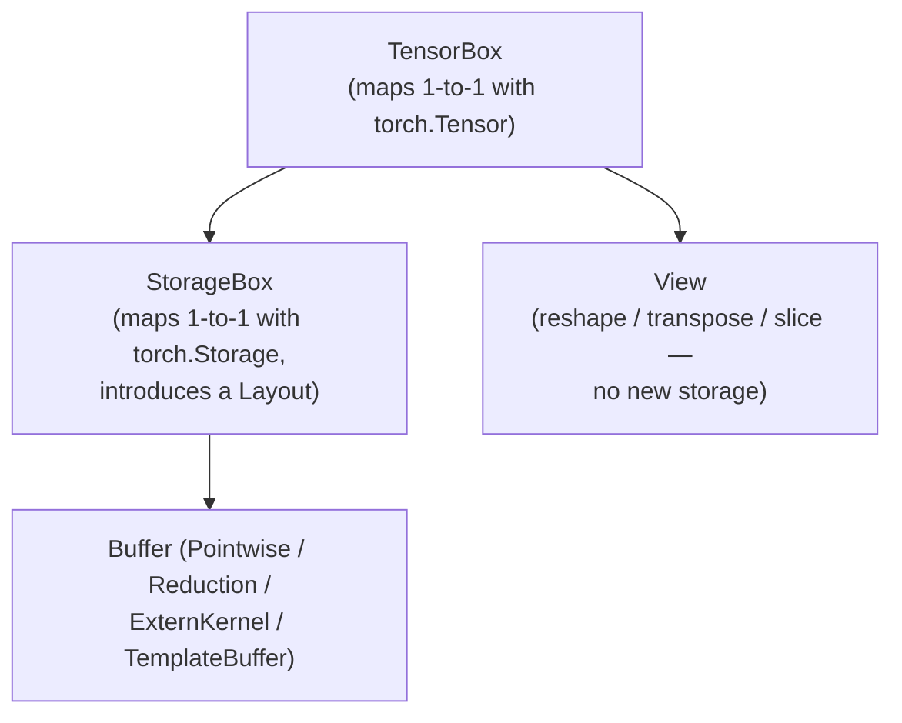

# TorchInductor: Deep Dive

## Table of Contents

- [[#1. Inductor's Role in the Stack|1. Inductor's Role in the Stack]]
  - [[#1.1 What Inductor Receives|1.1 What Inductor Receives]]
  - [[#1.2 What Inductor Produces|1.2 What Inductor Produces]]
  - [[#1.3 The Lowering Pipeline|1.3 The Lowering Pipeline]]
  - [[#1.4 Why a Python-Native IR|1.4 Why a Python-Native IR]]
- [[#2. The Inductor IR in Depth|2. The Inductor IR in Depth]]
  - [[#2.1 ir.Pointwise|2.1 ir.Pointwise]]
  - [[#2.2 ir.Reduction|2.2 ir.Reduction]]
  - [[#2.3 ir.ExternKernel and ir.TemplateBuffer|2.3 ir.ExternKernel and ir.TemplateBuffer]]
  - [[#2.4 The TensorBox Ownership Hierarchy|2.4 The TensorBox Ownership Hierarchy]]
  - [[#2.5 Worked Example: Residual ReLU|2.5 Worked Example: Residual ReLU]]
- [[#3. Lowering: FX Nodes to Inductor IR|3. Lowering: FX Nodes to Inductor IR]]
  - [[#3.1 The Lowering Registry|3.1 The Lowering Registry]]
  - [[#3.2 The ops Namespace|3.2 The ops Namespace]]
  - [[#3.3 Fallthrough to ExternKernel|3.3 Fallthrough to ExternKernel]]
  - [[#3.4 Lowering Example: aten.add|3.4 Lowering Example: aten.add]]
- [[#4. The Scheduler: Fusion Decisions|4. The Scheduler: Fusion Decisions]]
  - [[#4.1 Scheduler Data Structures|4.1 Scheduler Data Structures]]
  - [[#4.2 Fusion Compatibility Rules|4.2 Fusion Compatibility Rules]]
  - [[#4.3 Memory Traffic Scoring|4.3 Memory Traffic Scoring]]
  - [[#4.4 score_fusion and Fusion Priority|4.4 score_fusion and Fusion Priority]]
- [[#5. Triton Codegen|5. Triton Codegen]]
  - [[#5.1 From inner_fn to Triton Source|5.1 From inner_fn to Triton Source]]
  - [[#5.2 The ops Translation Table|5.2 The ops Translation Table]]
  - [[#5.3 Reduction Codegen: Persistent and Looped|5.3 Reduction Codegen: Persistent and Looped]]
  - [[#5.4 GEMM Template Kernels|5.4 GEMM Template Kernels]]
  - [[#5.5 Epilogue Fusion in GEMM Templates|5.5 Epilogue Fusion in GEMM Templates]]
  - [[#5.6 Schematic: Fused relu(x + y) Kernel|5.6 Schematic: Fused relu(x + y) Kernel]]
- [[#6. CPU Codegen: C++ and OpenMP|6. CPU Codegen: C++ and OpenMP]]
  - [[#6.1 Loop Structure and Parallelism|6.1 Loop Structure and Parallelism]]
  - [[#6.2 SIMD Vectorization via at::vec|6.2 SIMD Vectorization via at::vec]]
  - [[#6.3 The CppVecKernelChecker|6.3 The CppVecKernelChecker]]
  - [[#6.4 CPU vs. GPU Tradeoffs|6.4 CPU vs. GPU Tradeoffs]]
- [[#7. Layout Propagation|7. Layout Propagation]]
  - [[#7.1 The Problem|7.1 The Problem]]
  - [[#7.2 FlexibleLayout vs. FixedLayout|7.2 FlexibleLayout vs. FixedLayout]]
  - [[#7.3 The Propagation Pass|7.3 The Propagation Pass]]
- [[#8. Autotuning in max-autotune Mode|8. Autotuning in max-autotune Mode]]
  - [[#8.1 MultiTemplateBuffer|8.1 MultiTemplateBuffer]]
  - [[#8.2 Benchmarking and Caching|8.2 Benchmarking and Caching]]
  - [[#8.3 max-autotune vs. max-autotune-no-cudagraphs|8.3 max-autotune vs. max-autotune-no-cudagraphs]]
- [[#References|References]]

---

## 1. Inductor's Role in the Stack 🔑

TorchInductor is the default *compiler backend* for [[concepts/pytorch-internals/torch-compile/overview|torch.compile survey]]. It sits at the bottom of a four-stage pipeline and is responsible for translating high-level, device-agnostic graph IR into device-specific compiled artifacts — Triton kernels on GPU, C++/OpenMP on CPU.

### 1.1 What Inductor Receives

[[concepts/pytorch-internals/torch-compile/aot-autograd|AOTAutograd]] traces the forward and backward passes jointly, functionalizes all mutations, and partitions the joint graph. It then lowers the ATen-level FX graph through PrimTorch's decompositions, producing a *prim-level* `torch.fx.GraphModule` over roughly 250 primitive operators.

**Definition (Inductor input).** Let $G = (V, E)$ be a directed acyclic [[concepts/pytorch-internals/torch-fx|torch.fx]] graph where each node $v \in V$ carries an `aten` or `prims` operation target, *FakeTensor* shape metadata, and symbolic stride information encoded as `sympy.Symbol` instances via [[concepts/pytorch-internals/torch-compile/symbolic-shapes|Symbolic Shapes]]. Inductor receives $G$ together with a set of *example inputs* that instantiate the FakeTensors for shape inference.

The graph at this point:
- is *functional* (no in-place mutations survive; `copy_` is replaced by data-flow edges),
- is *decomposed* to prim ops Inductor's lowering registry is guaranteed to cover,
- carries symbolic shapes wherever the input was traced with `dynamic=True`.

### 1.2 What Inductor Produces

For **GPU targets** (CUDA/ROCm): Inductor emits a `.py` file containing one or more `@triton.jit`-decorated functions, which the Triton compiler transforms to PTX and assembles into `.cubin` binaries. A Python *wrapper* module is also emitted; it sets up tensor arguments, computes launch grids, and calls the compiled kernels.

For **CPU targets**: Inductor emits a `.cpp` file with `#pragma omp parallel for` directives and explicit SIMD intrinsics via `at::vec::Vectorized`. The file is compiled at runtime by GCC or Clang and loaded via `dlopen`.

Both artifacts are cached in `TORCHINDUCTOR_CACHE_DIR` (defaulting to `/tmp/torchinductor_<user>/`) keyed on a hash of the graph structure, shapes, dtypes, and compiler version.

### 1.3 The Lowering Pipeline

The five-stage compilation flow inside Inductor:


The *lowering* step is a symbolic interpretation of the FX graph: each FX node is replaced by a call to the registered lowering function for that operator, which constructs one or more Inductor IR nodes. This is purely Python-level graph transformation — no C++ compiler is invoked at this stage.

### 1.4 Why a Python-Native IR

Most production compilers (XLA, TVM, MLIR-based systems) use a statically-typed, strongly-typed IR defined in C++ or a domain-specific language. Inductor's IR is Python-callable objects and SymPy expressions. The rationale:

1. **Developer productivity.** A new op lowering is a three-line Python function, not a C++ visitor pass plus tablegen registration.
2. **Easy debugging.** Intermediate IR can be printed, stepped through with `pdb`, and modified with standard Python tools.
3. **Multi-pass reuse.** The same `inner_fn` callable is *re-executed* with different `ops` implementations (symbolic analysis, Triton codegen, C++ codegen) — a form of *tagless-final* style that avoids duplicating traversal logic.

> [!NOTE] The ~50 Inductor operators
> Although ATen has 2000+ operators and PrimTorch reduces this to ~250 prim ops, Inductor's own loop-level IR contains only ~50 constructs. This is because the lowering step *decomposes* prim ops into combinations of `Pointwise`, `Reduction`, and `ExternKernel` nodes — the only primitives Inductor's scheduler and codegen need to reason about.

> [!QUESTION] Exercise 1: Lowering Counts
> *This problem makes precise why Inductor's IR has far fewer operators than PrimTorch.*
>
> > **Prerequisites:** [[#1.3 The Lowering Pipeline|1.3 The Lowering Pipeline]]
>
> ATen has ~2000 operators. PrimTorch decomposes these to ~250 prim ops. Inductor's loop-level IR has only ~50 constructs. (a) Explain in one sentence why each successive reduction in operator count is possible. (b) A new hardware vendor writes a backend for Inductor. Which layer do they need to implement, and what is the minimum surface area?

> [!TIP]- Solution to Exercise 1
> **Key insight:** Each stage decomposes composite ops into simpler primitives that share a common algebraic structure; the backend only needs to handle the final primitive set.
>
> **Sketch:**
> (a) ATen → PrimTorch: composite ops (`layer_norm`, `gelu`) expand into primitive elementwise/reduction sequences. PrimTorch → Inductor IR: all prim ops map to one of three node types (`Pointwise`, `Reduction`, `ExternKernel`) by the lowering registry. The IR count is small because the *structure* of a loop nest is what varies, not the *type* of node.
>
> (b) The vendor implements Inductor's codegen backend (analogous to `TritonKernel` or `CppKernel`). The minimum surface area is: (i) an `ops` subclass mapping the ~15 symbolic ops (`load`, `store`, `add`, `mul`, `sin`, `exp`, `where`, `reduction`, …) to target-language expressions, and (ii) a kernel wrapper that materialises tile indices for the target's execution model. All IR construction, fusion, and scheduling logic is shared.

---

## 2. The Inductor IR in Depth 📐

Inductor's IR is a *loop-level* IR: each IR node represents the computation of one output *buffer* over a rectangular iteration domain. The central design choice is that the computation is specified not as a static expression tree but as a *Python callable* — the `inner_fn`.

### 2.1 ir.Pointwise

**Definition (Pointwise node).** An `ir.Pointwise` node $P$ is a tuple

$$
P = (\text{inner\_fn},\; \text{ranges},\; \text{dtype})
$$

where:
- $\text{ranges} \in (\mathbb{Z} \cup \mathcal{S})^d$ is a list of $d$ loop bounds, each either a concrete integer or a `sympy.Symbol`,
- $\text{inner\_fn} : \mathcal{S}^d \to \text{OpsValue}$ is a Python callable that accepts a list of $d$ symbolic *index expressions* and returns a symbolic scalar value representing the output at that coordinate.

The iteration domain is the $d$-dimensional rectangular box

$$
\mathcal{D}(P) = \bigl\{(i_0, \ldots, i_{d-1}) \mid 0 \le i_k < \text{ranges}[k],\; k = 0,\ldots,d-1\bigr\}.
$$

The semantics are: for every $\mathbf{i} \in \mathcal{D}(P)$, the output buffer at position $\mathbf{i}$ equals `inner_fn(symbolic_index(i))`.

**Why "define-by-run."** The IR node does not contain a static expression tree. Instead, its content is *produced by calling* `inner_fn` with fresh SymPy symbols. This means the same callable can be re-executed by different `ops` implementations: once with a symbolic algebra ops to analyse memory access patterns, again with Triton ops to emit source code, again with C++ ops to emit a `.cpp` kernel — without any AST rewriting.

**Pointwise fusion by `inner_fn` composition.** Two `Pointwise` nodes $P_1, P_2$ with the same `ranges` (or compatible broadcast ranges) fuse into a single node $P_{12}$:

$$
P_{12}.\text{inner\_fn}(\mathbf{i}) = P_2.\text{inner\_fn\_with\_substituted\_input}\bigl(P_1.\text{inner\_fn}(\mathbf{i}),\; \mathbf{i}\bigr)
$$

Concretely, instead of writing $P_1$'s output to a buffer and then loading it in $P_2$, the fused node computes $P_1$'s value in a register and passes it directly to $P_2$'s expression. The HBM store + load is eliminated.

> [!EXAMPLE] inner_fn for a scalar load-and-add
> ```python
> def inner_fn(index):
>     i1, i0 = index
>     tmp0 = ops.load("x", i1 + i0 * size1)   # load x[i1, i0]
>     tmp1 = ops.load("x", 2 * size1 + i0)    # load x[2, i0]
>     return ops.add(tmp0, tmp1)
> ```
> When codegen calls this with Triton symbolic indices, each `ops.*` call emits the corresponding Triton intrinsic. The same function called with the C++ ops emits the C++ expression.

### 2.2 ir.Reduction

**Definition (Reduction node).** An `ir.Reduction` node $R$ extends `Pointwise` with a *reduction dimension*:

$$
R = (\text{inner\_fn},\; \text{ranges},\; \text{reduction\_ranges},\; \text{reduction\_type},\; \text{dtype})
$$

where:
- $\text{ranges}$ are the *output* loop bounds (the non-reduced axes),
- $\text{reduction\_ranges}$ are the bounds of the axes being summed/maximised/etc.,
- $\text{reduction\_type} \in \{\texttt{"sum"},\; \texttt{"max"},\; \texttt{"min"},\; \texttt{"any"},\; \texttt{"prod"},\;\ldots\}$,
- $\text{inner\_fn}(\text{output\_index},\; \text{reduction\_index}) \to \text{OpsValue}$ accepts *two* index tuples.

The semantics:

$$
\text{out}[\mathbf{i}] = \bigoplus_{\mathbf{r} \in \mathcal{D}(R.\text{reduction\_ranges})} R.\text{inner\_fn}(\mathbf{i},\; \mathbf{r})
$$

where $\bigoplus$ is the reduction operator.

**Split reduction.** For large reduction dimensions that exceed register capacity, Inductor splits the reduction into two passes:

1. *Partial reduction*: tile the reduction axis into chunks of size $B_r$; each tile produces a partial result stored to an intermediate buffer.
2. *Final reduction*: reduce the partial results.

This two-pass strategy trades one kernel launch for reduced register pressure and improved occupancy. The split point is chosen heuristically based on `reduction_ranges` and the SMEM capacity of the target device.

### 2.3 ir.ExternKernel and ir.TemplateBuffer

**Definition (ExternKernel).** An `ir.ExternKernel` node $E$ wraps a call to a pre-compiled library routine (cuBLAS GEMM, cuDNN convolution, ATen fallback) where Inductor generates a *wrapper call* rather than a loop IR. The node stores the target op, input buffer references, and output strides. Inductor cannot fuse across `ExternKernel` boundaries from the inside — but see `TemplateBuffer` for the controlled exception.

**Definition (TemplateBuffer).** An `ir.TemplateBuffer` node $T$ represents a computation backed by a pre-written Triton *template kernel* (e.g., a tiled matrix multiplication). Unlike `ExternKernel`, `TemplateBuffer` exposes a designated *epilogue injection point*: a region after the main computation but before the final `tl.store` where Inductor can inline subsequent `Pointwise` ops. This is the mechanism behind *epilogue fusion* for GEMMs.

### 2.4 The TensorBox Ownership Hierarchy

Every Inductor IR object that a lowering function returns is wrapped in a `TensorBox`. The full ownership chain is:



`TensorBox` enables aliasing semantics: two `TensorBox` objects can share the same `StorageBox` (mirroring PyTorch's tensor-storage split). `View` nodes represent zero-copy transformations; they are eliminated during lowering by rewriting the index expressions inside `inner_fn` rather than inserting explicit reshapes.

### 2.5 Worked Example: Residual ReLU

Consider the computation `y = relu(x) + x` — a skip connection with activation.

After AOTAutograd decomposition, the FX graph contains two nodes:

```
%relu : Tensor = aten.relu(%x)
%add  : Tensor = aten.add(%relu, %x)
```

Lowering produces two `Pointwise` nodes:

```python
# Node A: relu lowering
def inner_fn_A(index):
    val = ops.load("x", linearize(index, x_strides))
    return ops.maximum(val, ops.constant(0.0, dtype))

A = Pointwise(inner_fn=inner_fn_A, ranges=x.ranges)

# Node B: add lowering
def inner_fn_B(index):
    a = ops.load(A.name, linearize(index, A.strides))  # would load A's buffer
    b = ops.load("x", linearize(index, x_strides))
    return ops.add(a, b)

B = Pointwise(inner_fn=inner_fn_B, ranges=x.ranges)
```

The scheduler detects that A and B have identical `ranges` and that B's only input is A. It fuses them by composing `inner_fn`s:

```python
# Fused node AB
def inner_fn_AB(index):
    val = ops.load("x", linearize(index, x_strides))
    relu_val = ops.maximum(val, ops.constant(0.0, dtype))   # A inlined
    skip_val = ops.load("x", linearize(index, x_strides))
    return ops.add(relu_val, skip_val)                       # B's body

AB = Pointwise(inner_fn=inner_fn_AB, ranges=x.ranges)
```

**The intermediate buffer for `relu(x)` is never allocated or written to HBM.** The two FX nodes become a single Triton kernel.

> [!QUESTION] Exercise 2: Broadcast Fusion
> *This problem checks understanding of when two Pointwise nodes with different ranges can fuse.*
>
> > **Prerequisites:** [[#2.1 ir.Pointwise|2.1 ir.Pointwise]]
>
> Let $P_1$ have `ranges = [M, N]` and $P_2$ have `ranges = [M, 1]` (a row-wise operation whose output is broadcast to shape `[M, N]`). (a) Describe how Inductor's index rewriting makes this fusion correct. (b) Does the fused node have `ranges = [M, N]` or `[M, 1]`? Justify.

> [!TIP]- Solution to Exercise 2
> **Key insight:** Broadcast fusion works by rewriting indices in the inner node, not by padding tensors.
>
> **Sketch:**
> (a) $P_2$'s `inner_fn` is written to accept a 2D index `[i, j]` but it only uses `i` (the broadcast dimension is ignored via stride=0 or by clamping `j` to 0). When the fused node iterates over `[M, N]` and calls $P_2$'s `inner_fn` with index `[i, j]`, the `j` component is dropped inside the function. No actual broadcast buffer is written.
>
> (b) The fused node has `ranges = [M, N]` — the *larger* iteration domain. The consumer $P_1$ needs all `[M, N]` elements, so the fused kernel must iterate over all of them. $P_2$'s contribution is computed once per `i` (the `j` loop body is identical for all `j`, and CSE or the hardware prefetcher amortises this).

---

## 3. Lowering: FX Nodes to Inductor IR 🔑

Lowering is the first Inductor pass: it walks the FX graph in topological order, replacing each `call_function` node with one or more Inductor IR nodes.

### 3.1 The Lowering Registry

**Definition (Lowering registry).** A global Python dictionary

$$
\texttt{lowerings} : \text{OpOverload} \to (\text{args}: \text{list}[\text{IRNode}],\; \text{kwargs}) \to \text{TensorBox}
$$

maps ATen/prim operator objects to Python functions that construct and return Inductor IR nodes.

Registration uses the `@register_lowering` decorator:

```python
@register_lowering(aten.relu, type_promotion_kind=ELEMENTWISE_TYPE_PROMOTION_KIND.DEFAULT)
def relu(x):
    def inner_fn(index):
        val = x.inner_fn(index)
        return ops.maximum(val, ops.constant(0.0, x.dtype))
    return Pointwise.create(inner_fn=inner_fn, ranges=x.get_size())
```

The decorator registers this function under the key `aten.relu.default` (and any alias overloads). During graph lowering, the FX interpreter calls `lowerings[node.target](lowered_args)` for each node.

> [!INFO] Type promotion
> The `type_promotion_kind` argument instructs the lowering to insert implicit type casts when input dtypes differ. This mirrors ATen's type promotion rules so that generated kernels are semantically equivalent to eager execution.

### 3.2 The ops Namespace

Inside every `inner_fn`, computations are expressed using `ops.*` calls. The `ops` object is a thread-local context variable that is *swapped out* between passes:

| Pass | `ops` implementation | Effect |
|------|---------------------|--------|
| Memory analysis | `MemoryUsageOps` | Records buffer accesses, computes read sets |
| Triton codegen | `TritonOverrides` | Emits Triton DSL expressions |
| C++ codegen | `CppOverrides` | Emits C++ expression strings |
| Constant folding | `ConstantFolder` | Evaluates symbolic ops on concrete values |

Key `ops` methods:

| `ops` call | Semantic |
|-----------|---------|
| `ops.load(name, index)` | Load scalar from named buffer at linear index |
| `ops.store(name, index, value)` | Store scalar to named buffer |
| `ops.add(a, b)` | Pointwise addition |
| `ops.mul(a, b)` | Pointwise multiplication |
| `ops.sin(a)` | Elementwise sine |
| `ops.exp(a)` | Elementwise exponential |
| `ops.maximum(a, b)` | Elementwise max (used for ReLU) |
| `ops.where(cond, x, y)` | Ternary select |
| `ops.constant(val, dtype)` | Scalar constant |
| `ops.reduction(dtype, src_dtype, rtype, value)` | Reduction accumulation step |

The `ops` design is an instance of the *tagless-final* (or *object-algebra*) pattern: `inner_fn` is parameterised over an *ops interface*, and different interpreters are substituted at different compilation phases.

### 3.3 Fallthrough to ExternKernel

If `node.target` is absent from `lowerings`, Inductor falls back to `ir.ExternKernel`. This wraps a runtime call to `torch.ops.<target>(*args)` — i.e., eager execution of that op during the compiled graph's forward pass. The op is not fused, not vectorised, and not analysed. This is the *correct* fallback (output is always numerically identical to eager) but it sacrifices performance.

*Practically,* Inductor ships lowerings for 433 distinct ATen operators (1605 including dtype overloads), so the fallback is rarely triggered for standard model architectures.

### 3.4 Lowering Example: aten.add

```python
@register_lowering(aten.add, type_promotion_kind=ELEMENTWISE_TYPE_PROMOTION_KIND.DEFAULT)
def add(a, b, alpha=1):
    # alpha=1 is the common case; handle scaled add separately
    def inner_fn(index):
        return ops.add(a.inner_fn(index), b.inner_fn(index))
    return Pointwise.create(
        device=a.get_device(),
        dtype=a.get_dtype(),
        inner_fn=inner_fn,
        ranges=broadcast_ranges(a.get_size(), b.get_size()),
    )
```

*Note:* `a.inner_fn(index)` is a recursive call — `a` is itself a `Pointwise` node whose `inner_fn` may call other ops. This is how the fusion chain builds up: the expression tree is captured *lazily* inside closures rather than allocated eagerly.

> [!QUESTION] Exercise 3: Lowering a Composite Op
> *This problem traces how a composite op decomposes through the lowering pipeline.*
>
> > **Prerequisites:** [[#3.1 The Lowering Registry|3.1 The Lowering Registry]], [[#3.2 The ops Namespace|3.2 The ops Namespace]]
>
> `aten.gelu` (Gaussian Error Linear Unit) is decomposed by PrimTorch into `0.5 * x * (1 + erf(x / sqrt(2)))`. (a) Write out (schematically) the sequence of Inductor IR nodes produced by lowering `aten.gelu`. (b) How many `Pointwise` nodes are created, and how many survive after the scheduler fuses them? (c) How many HBM round-trips does the fused kernel incur for a tensor of size $N$ float32 elements? Compare to eager.

> [!TIP]- Solution to Exercise 3
> **Key insight:** All elementwise sub-expressions become a single `Pointwise` node after fusion; the fused kernel reads `x` once and writes `out` once.
>
> **Sketch:**
> (a) PrimTorch decomposes gelu into: `sqrt2_recip = 1/sqrt(2)`, `x_scaled = x * sqrt2_recip`, `erf_val = erf(x_scaled)`, `shifted = 1 + erf_val`, `half_x = 0.5 * x`, `out = half_x * shifted`. Each binary/unary op creates one `Pointwise` node, producing ~6 nodes.
>
> (b) All 6 nodes share identical `ranges = [N]` and form a single dependency chain. The scheduler fuses them into **1** `Pointwise` node via `inner_fn` composition.
>
> (c) The fused kernel incurs **2** HBM round-trips: 1 read (load `x`) + 1 write (store `out`). Eager incurs up to $2 \times 6 = 12$ round-trips (a load+store pair per op in the worst case, though in practice caching reduces this for small tensors).

---

## 4. The Scheduler: Fusion Decisions 📐

The *scheduler* (`torch/_inductor/scheduler.py`) takes the flat list of Inductor IR nodes produced by lowering and groups them into *kernel groups* — sets of nodes that will be compiled into a single kernel.

### 4.1 Scheduler Data Structures

**Definition (SchedulerNode).** A `SchedulerNode` $S$ wraps a single Inductor IR node and tracks:
- `reads`: the set of named buffers that `inner_fn` loads from,
- `writes`: the named buffer that this node writes,
- `unmet_dependencies`: nodes whose output buffers this node reads and which have not yet been scheduled,
- `users`: downstream `SchedulerNode`s that read this node's output.

**Definition (FusedSchedulerNode).** A `FusedSchedulerNode` $F$ is the merge of two or more `SchedulerNode`s. Its `unmet_dependencies` is the union of its constituents' `unmet_dependencies` minus any edges that are *internal* to the fused group (those intermediate buffers are never written to HBM). Its `writes` is the set of buffers that leave the fused group.

The scheduler performs a greedy topological traversal: at each step it considers all ready (all dependencies met) nodes and greedily attempts to fuse each with the current candidate kernel group.

### 4.2 Fusion Compatibility Rules

The scheduler enforces the following compatibility rules before attempting a fusion:

| Pair | Fusion allowed? | Condition |
|------|----------------|-----------|
| `Pointwise` + `Pointwise` | Yes | Same `ranges` (or one is a broadcast of the other) |
| `Pointwise` + `Reduction` | Yes (epilogue) | The `Pointwise` reads only the `Reduction`'s output |
| `Reduction` + `Reduction` | **No** | Incompatible reduction axes create nested loop structure |
| `Reduction` + `Reduction` (same group) | Yes | Identical `ranges` and `reduction_ranges` (horizontal fusion) |
| `TemplateBuffer` + `Pointwise` | Yes (epilogue) | The `Pointwise` immediately follows the `TemplateBuffer` in topological order |
| `ExternKernel` + anything | **No** | Extern boundaries are opaque |

> [!WARNING] Why two arbitrary reductions do not fuse
> Two `Reduction` nodes reducing over *different* axes (e.g., one reduces columns, the other rows) would require a loop structure like:
> ```
> for i in range(M):
>     for r in range(N):   # reduction 1's inner loop
>         acc1 += x[i, r]
>     for s in range(K):   # reduction 2's inner loop
>         acc2 += y[i, s]
> ```
> These loops are *sequential* — the second reduction's inner loop cannot share register state with the first's. *Surprisingly,* fusing them would save kernel launch overhead but not HBM traffic (each still reads its full input), so the gain is marginal while the code generation complexity is high. Inductor conservatively disallows this case.

**Horizontal fusion** (same group, no common reads): two independent `Pointwise` nodes over the same shape can be emitted in the same kernel body, reducing kernel launch count. This is controlled by `config.aggressive_fusion`.

**Mix-order reduction** is a special case: two reductions where one iterates `(numel, rnumel)` and the other `(rnumel, numel)` (transposed loop order) — e.g., a row reduction and a column reduction sharing an input. Inductor allows this on GPU/Triton only, subject to the constraint that neither reads the other's output.

### 4.3 Memory Traffic Scoring

**Definition (memory traffic score).** For a set of nodes $\mathcal{G}$, define $\text{bytes}(\mathcal{G})$ as the total HBM bytes transferred if all nodes in $\mathcal{G}$ execute as separate kernels. For a proposed fusion $A \cup B$:

$$
\Delta_{\text{traffic}}(A \cup B) = \text{bytes}(A) + \text{bytes}(B) - \text{bytes}(A \cup B)
$$

**A fusion is accepted by the memory criterion only if $\Delta_{\text{traffic}} > 0$**, i.e., the fused kernel writes fewer bytes to HBM than the two separate kernels would together.

$\text{bytes}(\{P\})$ for a `Pointwise` node $P$ is computed from its `reads` and `writes` sets via the symbolic memory access analysis pass (running `inner_fn` with `MemoryUsageOps`).

> [!NOTE] When Delta-traffic can be zero or negative
> If $A$ and $B$ read *disjoint* buffers and write disjoint buffers, fusing them saves only kernel launch overhead (a few microseconds) but uses more registers per thread, potentially reducing occupancy. Inductor's `aggressive_fusion` config controls whether to fuse in this case.

### 4.4 score_fusion and Fusion Priority

Because fusion is not associative — fusing $A$ with $B$ may block fusing $B$ with $C$ — the scheduler uses a *priority queue* keyed on `score_fusion(A, B)`:

$$
\text{score\_fusion}(A, B) = w_t \cdot \mathbb{1}[\text{template involved}] + w_m \cdot \Delta_{\text{traffic}}(A \cup B) + w_p \cdot \text{proximity}(A, B)
$$

where:
- $w_t$ is a large weight prioritising GEMM/conv template epilogue fusions (highest ROI),
- $w_m$ is weighted by memory traffic savings,
- $w_p = 1/\text{dist}(A, B)$ rewards adjacent nodes in the topological order (fewer live buffers to keep in memory simultaneously).

The scheduler iterates: pop the highest-scoring candidate pair, fuse if compatible, push new pairs involving the merged node. This greedy strategy is not globally optimal but runs in near-linear time.

> [!QUESTION] Exercise 4: Fusion Blocking
> *This problem illustrates why fusion order matters.*
>
> > **Prerequisites:** [[#4.2 Fusion Compatibility Rules|4.2 Fusion Compatibility Rules]], [[#4.4 score_fusion and Fusion Priority|4.4 score_fusion and Fusion Priority]]
>
> Consider three `Pointwise` nodes $P_1, P_2, P_3$ with $P_2$ reading $P_1$'s output and $P_3$ reading $P_2$'s output. All have the same `ranges`. (a) What is the globally optimal fusion? (b) Suppose the scheduler greedily fuses $P_2$ and $P_3$ first (e.g., they have higher proximity score). Does this block the full 3-way fusion? Explain.

> [!TIP]- Solution to Exercise 4
> **Key insight:** Pointwise fusion is transitive — composing `inner_fn`s works for any chain length. Order does not block full fusion here, but it does in mixed-type chains.
>
> **Sketch:**
> (a) Globally optimal: fuse all three into one `Pointwise` node $P_{123}$, reading `x` (the input to $P_1$) once and writing the output once.
>
> (b) For a pure pointwise chain, fusing $P_2 \cup P_3$ first is fine. The merged node $P_{23}$ reads $P_1$'s buffer. The scheduler then fuses $P_1 \cup P_{23}$ to get $P_{123}$ — same result. *However,* if $P_2$ were a `Reduction` and $P_3$ were a `Pointwise` (epilogue pattern), then fusing $P_2 \cup P_3$ correctly. But if $P_1$ is also a `Reduction`, fusing $P_1 \cup P_2$ would violate the `Reduction+Reduction` rule. The scheduler must prefer the `Reduction+Pointwise` epilogue fusion first.

---

## 5. Triton Codegen 📐

Once the scheduler has determined the kernel groups, the codegen pass generates source code. For GPU targets, the `TritonKernel` class in `torch/_inductor/codegen/triton.py` translates each `FusedSchedulerNode` into a `@triton.jit`-decorated Python function.

### 5.1 From inner_fn to Triton Source

The translation proceeds in three steps:

**Step 1: Assign tile shape.** The codegen assigns a *block size* $B$ for the iteration domain. For a 1D `Pointwise` over `N` elements, `BLOCK_SIZE = min(next_power_of_2(N), 1024)` is a common heuristic. For 2D kernels, separate `BLOCK_M` and `BLOCK_N` are assigned.

**Step 2: Construct symbolic Triton indices.** Codegen creates SymPy expressions that represent Triton's tile-level index arithmetic:

```python
# For a 1D kernel with BLOCK_SIZE
pid     = sympy_expr("tl.program_id(0)")
offsets = pid * BLOCK_SIZE + sympy_expr("tl.arange(0, BLOCK_SIZE)")
mask    = offsets < N   # N may be symbolic (SymPy expr for dynamic shapes)
```

These are SymPy expression objects, not strings yet.

**Step 3: Call inner_fn with Triton ops.** Codegen installs `TritonOverrides` as the `ops` implementation and calls `inner_fn(offsets)`. The returned symbolic expression is *printed* by recursively walking the SymPy expression tree, translating each node to its Triton string equivalent:

```
ops.add(a, b) → f"{a} + {b}"
ops.load(ptr, idx) → f"tl.load({ptr} + {idx}, mask={mask})"
ops.store(ptr, idx, val) → f"tl.store({ptr} + {idx}, {val}, mask={mask})"
ops.maximum(a, b) → f"triton_helpers.maximum({a}, {b})"
```

The resulting string is assembled into the kernel function body with proper indentation.

### 5.2 The ops Translation Table

| `ops` call | Triton output |
|-----------|--------------|
| `ops.load(buf, idx)` | `tl.load(buf + idx, mask=mask, other=0)` |
| `ops.store(buf, idx, val)` | `tl.store(buf + idx, val, mask=mask)` |
| `ops.add(a, b)` | `a + b` |
| `ops.mul(a, b)` | `a * b` |
| `ops.sin(a)` | `tl.math.sin(a)` |
| `ops.exp(a)` | `tl.math.exp(a)` |
| `ops.log(a)` | `tl.math.log(a)` |
| `ops.sqrt(a)` | `tl.math.sqrt(a)` |
| `ops.maximum(a, b)` | `triton_helpers.maximum(a, b)` |
| `ops.where(c, x, y)` | `tl.where(c, x, y)` |
| `ops.constant(v, dt)` | `tl.full([], v, dtype)` or literal |
| `ops.to_dtype(v, dt)` | `v.to(triton_dtype)` |

### 5.3 Reduction Codegen: Persistent and Looped

Inductor's reduction codegen offers two strategies, selected by the `should_use_persistent_reduction()` heuristic:

**Persistent reduction** (small reductions, `ReductionHint.INNER` with $N \le 1024$): A single Triton program loads the *entire* reduction axis into one tile. The reduction is performed in registers with `tl.sum(x, axis=0)`, `tl.max(x, axis=0)`, etc. There is no explicit loop over reduction tiles.

```python
# Schematic persistent sum reduction over axis 1 of [M, N] tensor
@triton.jit
def triton_per_kernel(X, Out, M, N, BLOCK_N: tl.constexpr):
    row = tl.program_id(0)
    cols = tl.arange(0, BLOCK_N)           # BLOCK_N == N (entire row)
    mask = cols < N
    x = tl.load(X + row * N + cols, mask=mask, other=0.0)
    result = tl.sum(x, axis=0)             # register-level sum
    tl.store(Out + row, result)
```

Kernel naming convention: `triton_per_*` (persistent).

**Non-persistent (looped) reduction** (large reductions, `ReductionHint` other than INNER, or $N > 1024$): The kernel iterates over *tiles* of the reduction axis in a loop, maintaining a running accumulator in registers. Two passes may be used for two-pass softmax:

- Pass 1: stream tiles through an `online_softmax_combine()` function, maintaining running `(max, sumexp)` state. Load policy: `eviction_policy='evict_last'` (data lingers in L2).
- Pass 2: reload input tiles, normalise using the computed statistics. Load policy: `evict_first` (streaming, no L2 reuse).

Kernel naming convention: `triton_red_*` (reduction).

> [!INFO] Persistent vs. looped performance
> Persistent reductions outperform looped variants for small $N$ (32–1024): a single pass avoids redundant input reloads, SM cycle counts are lower, and occupancy is not register-pressure limited. For $N > 1024$, persistent reduction would require excessive SMEM, and the looped strategy scales correctly.

### 5.4 GEMM Template Kernels

For matrix multiplications (detected as `aten.mm`, `aten.addmm`, `aten.bmm`), Inductor does not generate a loop-level `Reduction` node. Instead it selects a *pre-written Triton template* from a library of tiled GEMM implementations parameterised by:

$$
(M_t,\; N_t,\; K_t,\; \text{num\_stages},\; \text{num\_warps},\; \text{split\_k})
$$

where $M_t \times N_t$ is the output tile size and $K_t$ is the inner dimension tile size. Each configuration is compiled to a distinct Triton kernel. The design space is:

- $M_t, N_t \in \{16, 32, 64, 128\}$
- $K_t \in \{32, 64, 128\}$
- `num_stages` $\in \{2, 3, 4, 5\}$ (software pipeline depth)
- `num_warps` $\in \{4, 8\}$

In default (`reduce-overhead`) mode, a single heuristically-chosen configuration is used. In `max-autotune` mode, all 20–100+ configurations are compiled and benchmarked (see §8).

### 5.5 Epilogue Fusion in GEMM Templates

**The problem:** After `C = A @ B`, a common pattern is `out = relu(C + bias)`. Naively this requires:
1. Write `C` to HBM (GEMM store).
2. Read `C` from HBM, read `bias`, compute `relu(C + bias)`, write `out` to HBM.

This is one HBM write and two HBM reads *of the GEMM output* — wasteful for large matrices.

**Epilogue fusion:** The GEMM template exposes an injection point *after* the output tile `acc` has been computed in registers but *before* `tl.store(C_ptr, acc)`. Inductor's codegen substitutes:

```python
# Standard GEMM template (simplified)
acc = tl.dot(a_tile, b_tile, acc)   # accumulate
# ... (loop over K tiles) ...
# Epilogue injection point — pointwise ops on 'acc' before store:
acc = acc + tl.load(bias_ptr + n_offset, mask=n_mask)  # bias add
acc = triton_helpers.maximum(acc, 0.0)                  # relu
tl.store(C_ptr + m_offset * N + n_offset, acc, mask=out_mask)
```

**The intermediate buffer for `C` is never written to HBM.** The round-trip is eliminated. For a $M \times N$ output at float32, this saves $4MN$ bytes written and $4MN$ bytes re-read — $8MN$ bytes of HBM traffic.

The condition for epilogue fusion: the `Pointwise` node(s) must read *only* the `TemplateBuffer`'s output, have the same output shape, and the `TemplateBuffer`'s layout must be compatible with the in-register tile layout.

### 5.6 Schematic: Fused relu(x + y) Kernel

For `out = relu(x + y)` where `x, y` are both `[N]` float32 tensors:

```python
@triton.jit
def triton_poi_fused_add_relu_0(
    in_ptr0, in_ptr1, out_ptr0,
    xnumel,
    XBLOCK: tl.constexpr,
):
    xoffset = tl.program_id(0) * XBLOCK
    xindex = xoffset + tl.arange(0, XBLOCK)
    xmask = xindex < xnumel

    # Load x
    tmp0 = tl.load(in_ptr0 + xindex, mask=xmask, other=0.0)
    # Load y
    tmp1 = tl.load(in_ptr1 + xindex, mask=xmask, other=0.0)
    # add (inner_fn of the add Pointwise node)
    tmp2 = tmp0 + tmp1
    # relu (inner_fn of the relu Pointwise node, fused in)
    tmp3 = triton_helpers.maximum(tmp2, 0.0)
    # Single store
    tl.store(out_ptr0 + xindex, tmp3, mask=xmask)
```

The kernel prefix `poi` signals a pointwise operation. `XBLOCK` is a `tl.constexpr` so Triton can unroll and vectorise the loop body. Two inputs are read once each, one output is written once — **3 HBM round-trips** total regardless of whether the ops are fused at the Triton level or at the CUDA kernel level.

> [!QUESTION] Exercise 5: GEMM Epilogue Savings
> *This problem quantifies the HBM savings from epilogue fusion for a realistic transformer layer.*
>
> > **Prerequisites:** [[#5.5 Epilogue Fusion in GEMM Templates|5.5 Epilogue Fusion in GEMM Templates]]
>
> A transformer feed-forward block computes `out = gelu(x @ W1 + b1)` where `x` has shape `[B*S, D_model]` with `D_model = 4096`, `W1` has shape `[D_model, D_ff]` with `D_ff = 16384`, and `B*S = 2048`. Assume float32. (a) How many bytes of HBM traffic does unfused execution incur for the GEMM output tensor alone (store + reload)? (b) How many does epilogue-fused execution incur?

> [!TIP]- Solution to Exercise 5
> **Key insight:** Epilogue fusion eliminates one full HBM store + load cycle for the GEMM output.
>
> **Sketch:**
> (a) GEMM output shape: `[2048, 16384]`. Size in bytes: $2048 \times 16384 \times 4 = 134\,217\,728$ bytes $\approx 128$ MiB. Unfused: 1 store (128 MiB) + 1 reload for the gelu/bias kernel (128 MiB) = **256 MiB**.
>
> (b) Epilogue-fused: the gelu and bias-add are computed in-register after the GEMM tile accumulation. The GEMM output is **never written to HBM as an intermediate**. Only the final `out` buffer is stored: **128 MiB** (one store). Savings: 128 MiB per forward pass — at A100 HBM bandwidth of ~2 TB/s, this is ~64 μs saved per layer.

---

## 6. CPU Codegen: C++ and OpenMP 📐

For CPU targets, the `CppKernel` class in `torch/_inductor/codegen/cpp.py` translates `FusedSchedulerNode`s into C++ source with OpenMP parallelism and explicit SIMD vectorisation.

### 6.1 Loop Structure and Parallelism

For a `Pointwise` node over `N` elements, Inductor generates a loop nest of the form:

```cpp
#pragma omp parallel for num_threads(NTHREADS) schedule(static)
for (int64_t i0 = 0; i0 < N; i0 += VECTOR_WIDTH) {
    // vectorised body
}
```

For multi-dimensional iteration domains, outer loops are parallelised with `#pragma omp parallel for` and inner loops use `#pragma omp simd` for auto-vectorisation hints. The compiler (GCC/Clang) is invoked with `-O3 -march=native` (or an explicit `-mavx2` / `-mavx512f` flag) so that SIMD intrinsics are legal.

The generated `.cpp` is compiled at trace time via a `subprocess` call to the system compiler and loaded with `ctypes.CDLL` (via `dlopen` on POSIX). The `.so` artifact is cached alongside the Triton `.cubin`.

### 6.2 SIMD Vectorisation via at::vec

For loops that pass vectorisability analysis, Inductor generates explicit SIMD code using PyTorch's `at::vec::Vectorized<T>` abstraction, which compiles to AVX2 (8×float32) or AVX-512 (16×float32) instructions depending on the detected ISA:

```cpp
// Generated: y = relu(x + bias) for a tile of 8 floats
auto tmp0 = at::vec::Vectorized<float>::loadu(in_ptr0 + offset);   // load x tile
auto tmp1 = at::vec::Vectorized<float>::loadu(in_ptr1 + offset);   // load bias tile
auto tmp2 = tmp0 + tmp1;                                            // add
auto zero = at::vec::Vectorized<float>(0.0f);
auto tmp3 = at::vec::Vectorized<float>::blendv(zero, tmp2,          // relu via blend
                tmp2 > zero);
tmp3.store(out_ptr0 + offset);                                      // store
```

The `at::vec::Vectorized<T>` abstraction is platform-agnostic at the source level; the ISA-specific intrinsics (`_mm256_*` for AVX2, `_mm512_*` for AVX-512) are selected at compile time via `#ifdef` blocks inside `aten/src/ATen/cpu/vec/`.

Vectorisation coverage in practice: ~90% of inference kernels (float32) are successfully vectorised; ~71% of training kernels (float32). Non-vectorisable cases include: integer types, `int64` indexing, certain scatter/gather patterns, and ops with no vector intrinsic (`rand`, `atomic_add`).

### 6.3 The CppVecKernelChecker

Before emitting the vectorised kernel body, Inductor runs `CppVecKernelChecker` — a static analysis pass that symbolically executes `inner_fn` and checks whether every `ops.*` call in the body has a corresponding `at::vec` implementation.

Scenarios that prevent vectorisation:
- `ops.rand()` — no vector RNG intrinsic available
- `ops.atomic_add()` — atomic operations are inherently scalar
- Non-contiguous loads where stride ≠ 1 in the innermost dimension
- Mixed integer/float expressions that require `int64` intermediates

When vectorisation is blocked, Inductor falls back to a scalar loop with `#pragma omp simd` for the compiler to attempt auto-vectorisation.

### 6.4 CPU vs. GPU Tradeoffs

| Dimension | GPU (Triton) | CPU (C++/OpenMP) |
|-----------|-------------|-----------------|
| Parallelism unit | Thread blocks + warps | OpenMP threads + SIMD lanes |
| Memory bottleneck | HBM bandwidth (~2 TB/s A100) | DRAM + L3 cache hierarchy |
| Fusion priority | Eliminate HBM round-trips | Eliminate DRAM loads; exploit L1/L2 cache reuse |
| Math throughput | FP32 TFLOPS (tensor cores via GEMM templates) | AVX-512 FP32 FLOPS |
| Compilation latency | Triton → PTX → SASS (seconds) | GCC/Clang `-O3` (seconds) |
| Key config | `BLOCK_SIZE`, `num_warps`, `num_stages` | `NTHREADS`, `VECTOR_WIDTH`, tiling for cache |

> [!QUESTION] Exercise 6: CPU Vectorisation Failure
> *This problem traces why a seemingly simple op fails vectorisation.*
>
> > **Prerequisites:** [[#6.3 The CppVecKernelChecker|6.3 The CppVecKernelChecker]]
>
> A model contains `out = x[indices]` — a gather operation where `indices` is a `[N]` int64 tensor. (a) Why does `CppVecKernelChecker` reject vectorisation for this kernel? (b) What does the generated fallback code look like (schematically)? (c) Under what condition could a future version of Inductor vectorise this?

> [!TIP]- Solution to Exercise 6
> **Key insight:** Non-contiguous memory access (scatter/gather) has no efficient AVX2/AVX-512 equivalent for arbitrary indices.
>
> **Sketch:**
> (a) `ops.load("x", indices[i])` with non-constant `indices[i]` requires a *gather* load (`_mm256_i32gather_ps` in AVX2). While gather intrinsics exist, they are significantly slower than contiguous loads on most microarchitectures, and `at::vec` may not expose them as a supported vectorisation path. Additionally, `indices` is `int64`, requiring 64-bit index arithmetic that complicates SIMD lanes.
>
> (b) Fallback scalar loop:
> ```cpp
> for (int64_t i = 0; i < N; ++i) {
>     out_ptr[i] = in_ptr[indices_ptr[i]];
> }
> ```
> with `#pragma omp parallel for` at the outer level.
>
> (c) If `indices` were proved (via SymPy) to be a contiguous range `[start, start+N)` (i.e., a slice), then the access pattern is contiguous and vectorisation is legal. Alternatively, if `at::vec` exposes gather intrinsics and the perf model shows they are beneficial, Inductor could emit gather code.

---

## 7. Layout Propagation 📐

### 7.1 The Problem

Some operators have strong memory-layout preferences:
- **Convolutions** prefer *channels-last* (NHWC) layout: for a feature map of shape `[N, C, H, W]`, elements are stored as `N, H, W, C` in memory. This enables cuDNN's high-performance Winograd and implicit GEMM paths and improves cache locality along the spatial dimensions.
- **Linear layers and elementwise ops** are *layout-agnostic*: they compute correctly for any stride pattern.

If Inductor naively inserts `contiguous()` calls at every layout boundary, it incurs full HBM transposes. For a ResNet-50 with many conv–BN–ReLU sequences, these transposes can dominate runtime.

### 7.2 FlexibleLayout vs. FixedLayout

**Definition (FixedLayout).** A `FixedLayout` node has a *committed* stride vector. Any consumer that requires a different layout must insert an explicit `as_strided` (view) or copy. External kernels (`ExternKernel`) always have `FixedLayout` because their calling convention is defined by the underlying library.

**Definition (FlexibleLayout).** A `FlexibleLayout` node's strides are *undecided* at IR construction time. The layout propagation pass may assign any legal stride ordering to it without inserting a copy. This is the default for `Pointwise` and `Reduction` nodes, since their `inner_fn` can be rewritten to emit any index arithmetic.

### 7.3 The Propagation Pass

Layout propagation is a *backward pass* over the Inductor IR graph (from outputs to inputs) that assigns layouts to all `FlexibleLayout` nodes. The objective is to minimise the total number of layout conversion copies.

**Propagation rule:** If a `FlexibleLayout` node $P$ is consumed by a `FixedLayout` node $E$ (e.g., a convolution that requires NHWC input), and $P$'s `inner_fn` can generate NHWC indexing directly (i.e., `P` has no other consumers with a conflicting layout preference), then $P$ is assigned `channels_last` layout. No copy is inserted.

**Conflict resolution:** If $P$ has two consumers — one requiring NHWC and one requiring NCHW — Inductor must insert at least one copy. It inserts the copy on the edge leading to the consumer whose required layout is less common (minimising total copy cost).

*Practically,* the `layout_optimization` config flag (default `True` when convolutions are present) enables this pass. For pure transformer models with no convolutions, layout propagation is a no-op — all tensors remain in the default contiguous (row-major) layout.

> [!QUESTION] Exercise 7: Layout Conflict
> *This problem works through a case where layout propagation cannot eliminate all copies.*
>
> > **Prerequisites:** [[#7.2 FlexibleLayout vs. FixedLayout|7.2 FlexibleLayout vs. FixedLayout]], [[#7.3 The Propagation Pass|7.3 The Propagation Pass]]
>
> A graph contains: `conv(x)` (requires NHWC input; `FixedLayout` output) followed by a fork: one branch feeds another `conv` (requires NHWC), the other feeds `torch.mm` (requires NCHW/contiguous). How many layout copies does the optimal assignment require? Describe the assignment.

> [!TIP]- Solution to Exercise 7
> **Key insight:** At a fork, the copy is placed on the cheaper edge; the other branch shares the layout of the producer.
>
> **Sketch:**
> The first conv outputs NHWC (FixedLayout). Both consumers want NHWC (second conv) or NCHW (`mm`). Optimal assignment: leave the NHWC output flowing to the second conv (0 copies on that edge) and insert a *single* NHWC→NCHW copy on the edge to `mm`. Total: **1 copy**. If instead we assign NCHW everywhere, we need 1 copy before the first conv (NCHW→NHWC) + 0 copies before mm — still 1 copy but we lose the NHWC advantage *inside* the first conv's kernel. The propagation pass correctly prefers the NHWC-majority assignment.

---

## 8. Autotuning in max-autotune Mode 🔑

### 8.1 MultiTemplateBuffer

In `max-autotune` mode (enabled via `torch.compile(mode="max-autotune")`), Inductor replaces a GEMM `TemplateBuffer` with a `MultiTemplateBuffer` — a *collection* of candidate `TemplateBuffer`s, one per configuration tuple $(M_t, N_t, K_t, \text{stages}, \text{warps})$.

**Definition (MultiTemplateBuffer).** A `MultiTemplateBuffer` $\mathcal{M}$ contains $K$ candidate kernels $\{T_1, \ldots, T_K\}$ all computing the same GEMM but with different tile configurations. At compile time, all $K$ candidates are compiled by the Triton compiler. At *benchmarking time*, each is timed on the actual GPU with representative input tensors of the traced shapes. The winning candidate — lowest wall-clock time — is selected and the others are discarded.

Typical $K$: 20–100 candidates for a standard `mm` operation. Backends include Triton templates, CUTLASS 2.x templates (on NVIDIA), Composable Kernel templates (on AMD/ROCm), and ATen/cuBLAS fallbacks.

The `CachingAutotuner` orchestrates the benchmarking:
1. **Cache lookup:** Check `PersistentCache` (a JSON file at `TORCHINDUCTOR_CACHE_DIR`) for a recorded winner for this `(op, shapes, dtypes, device)` tuple.
2. **Precompilation:** Compile all candidates in parallel via `PrecompileThreadPool`.
3. **Benchmarking:** Execute each compiled kernel in an isolated subprocess (`AutotuneProcessPool`) to prevent cache pollution.
4. **Selection:** Record the winner in `PersistentCache`. On the next run with the same shapes, the cache hit skips steps 2–3 entirely.

### 8.2 Benchmarking and Caching

The cache key is a hash of:
- The operation type (e.g., `mm`, `bmm`, `conv2d`)
- The input/output shape tuple
- The dtype
- The PyTorch/Triton version string

Cache location: `$TORCHINDUCTOR_CACHE_DIR/<hash>.json` (defaults to `/tmp/torchinductor_<user>/`).

> [!WARNING] Cache invalidation
> The cache is invalidated whenever the PyTorch or Triton version changes (the version string is part of the hash). *It is not invalidated* when model weights change — autotuning benchmarks kernel *structure*, not values. However, if the traced shapes change (e.g., a different batch size), the cache misses and re-tunes.

### 8.3 max-autotune vs. max-autotune-no-cudagraphs

*CUDA graph capture* replays a fixed sequence of CUDA kernel launches from a pre-recorded graph, eliminating Python dispatch overhead (~10–50 μs per launch). However, CUDA graphs require:
- Fixed tensor addresses (tensors must live at the same virtual address on every invocation),
- Fixed launch configurations (no dynamic shapes after capture).

In `max-autotune` mode, CUDA graph capture is attempted by default. If tensor addresses change between benchmark iterations (e.g., a new tensor is allocated), graph capture fails silently and Inductor falls back to eager kernel launching.

`max-autotune-no-cudagraphs` disables CUDA graph capture but retains all autotuning of GEMM configurations. *Surprisingly,* on some workloads with frequent memory reallocations, `max-autotune-no-cudagraphs` outperforms `max-autotune` because the failed graph capture introduces latency overhead.

The mode is selected via:

```python
model_opt = torch.compile(model, mode="max-autotune")
# or
model_opt = torch.compile(model, mode="max-autotune-no-cudagraphs")
```

> [!NOTE] Autotuning hardware requirements
> Autotuning benchmarking is *gated* on the number of CUDA streaming multiprocessors (SMs). On devices with fewer than a threshold number of SMs (e.g., low-end consumer GPUs), Inductor skips autotuning and uses the heuristic configuration directly.

> [!QUESTION] Exercise 8: Autotuning Cache Design
> *This problem reasons about the cache key design and its failure modes.*
>
> > **Prerequisites:** [[#8.2 Benchmarking and Caching|8.2 Benchmarking and Caching]]
>
> (a) Two models both have a `mm` operation with shapes `[2048, 4096] @ [4096, 16384]` in float32. Should they share an autotuning cache entry? (b) A model is deployed on a different GPU (A100 → H100). The cache was populated on the A100. What happens on the H100? Is this correct behaviour? (c) Propose an improvement to the cache key design that handles the GPU model correctly.

> [!TIP]- Solution to Exercise 8
> **Key insight:** The cache key must include hardware identity; the current design does not, which can lead to suboptimal (but correct) kernel selection across GPU types.
>
> **Sketch:**
> (a) Yes — same op type, shapes, dtype, and version string → same hash → shared cache entry. The winning tile configuration for `[2048, 4096] @ [4096, 16384]` float32 is determined purely by the GEMM geometry, so sharing is valid.
>
> (b) The H100 gets a cache hit from the A100 run. The *selected* Triton configuration may be suboptimal for H100's different SM count, SMEM size, and pipeline depth preferences. However, the output is still *correct*. This is a performance bug, not a correctness bug.
>
> (c) Include `torch.cuda.get_device_name()` (or the CUDA device ordinal's PCI device ID) in the cache key hash. This ensures A100 and H100 maintain separate cache entries and each gets the configuration tuned for its own hardware.

---

## References

| Reference | Brief Summary | Link |
|-----------|--------------|------|
| Ansel et al., "PyTorch 2: Faster Machine Learning Through Dynamic Python Bytecode Transformation and Graph Compilation" (ASPLOS 2024) | Primary paper describing TorchDynamo, AOTAutograd, and TorchInductor end-to-end; §5 covers Inductor IR, scheduler, and codegen | [ACM DL](https://dl.acm.org/doi/10.1145/3620665.3640366) |
| Jason Ansel, "TorchInductor: a PyTorch-native Compiler with Define-by-Run IR and Symbolic Shapes" (PyTorch Dev Forum) | Original design document for TorchInductor; introduces inner_fn, TensorBox/StorageBox hierarchy, ops namespace, and symbolic shapes | [dev-discuss.pytorch.org](https://dev-discuss.pytorch.org/t/torchinductor-a-pytorch-native-compiler-with-define-by-run-ir-and-symbolic-shapes/747) |
| DeepWiki PyTorch — TorchInductor Backend | Comprehensive wiki covering IR node types, lowering registry, scheduler data structures, Triton codegen, and kernel selection/autotuning | [deepwiki.com](https://deepwiki.com/pytorch/pytorch/2.5-torchinductor-backend) |
| Karthick Panner Selvam, "Learn by doing: TorchInductor Reduction Kernels" (2025) | Detailed walkthrough of persistent vs. looped reduction codegen; FusedSchedulerNode internals; softmax kernel example | [karthick.ai](https://karthick.ai/blog/2025/Learn-By-Doing-Torchinductor-Reduction/) |
| PyTorch, "Accelerated CPU Inference with PyTorch Inductor using torch.compile" | Describes at::vec::Vectorized, CppVecKernelChecker, oneDNN/MKL fusion patterns, vectorisation coverage statistics | [pytorch.org](https://pytorch.org/blog/accelerated-cpu-inference/) |
| PyTorch Tutorial, "Inductor CPU backend debugging and profiling" | Shows generated C++ code structure including OpenMP pragmas and at::vec::Vectorized usage | [docs.pytorch.org](https://docs.pytorch.org/tutorials/intermediate/inductor_debug_cpu.html) |
| PyTorch Tutorial, "Using Max-Autotune Compilation on CPU for Better Performance" | Describes max-autotune CPU GEMM template selection, benchmarking methodology, epilogue fusion, and cache strategy | [docs.pytorch.org](https://docs.pytorch.org/tutorials/unstable/max_autotune_on_CPU_tutorial.html) |
| PyTorch Dev Forum, "TorchInductor Update 8: Max-autotune Support on CPU with GEMM Template" | Technical description of C++ GEMM template for CPU: multi-level cache blocking, weight prepacking, and epilogue fusion at the microkernel level | [dev-discuss.pytorch.org](https://dev-discuss.pytorch.org/t/torchinductor-update-8-max-autotune-support-on-cpu-with-gemm-template/2439) |
| Ian Barber, "Inductor Notes" (2024) | Personal deep-dive notes on AtenIR/PrimsIR lowering pipeline, define-by-run semantics, and scheduler design | [ianbarber.blog](https://ianbarber.blog/2024/01/16/inductor-notes/) |
| Ian Barber, "Autotuning in PyTorch & Triton" (2025) | Explains max-autotune backend selection, CUDA graph interaction, AutotuneCache design, and no-cudagraphs mode | [ianbarber.blog](https://ianbarber.blog/2025/05/04/autotuning-in-pytorch-triton/) |
| PyTorch, "torch/_inductor/ir.py" (source) | Canonical source for Pointwise, Reduction, ExternKernel, TemplateBuffer, TensorBox, FlexibleLayout, FixedLayout | [github.com](https://github.com/pytorch/pytorch/blob/main/torch/_inductor/codegen/triton.py) |
