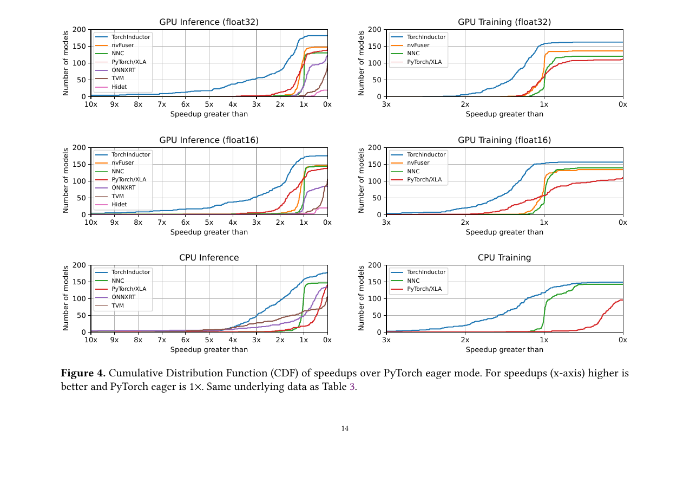
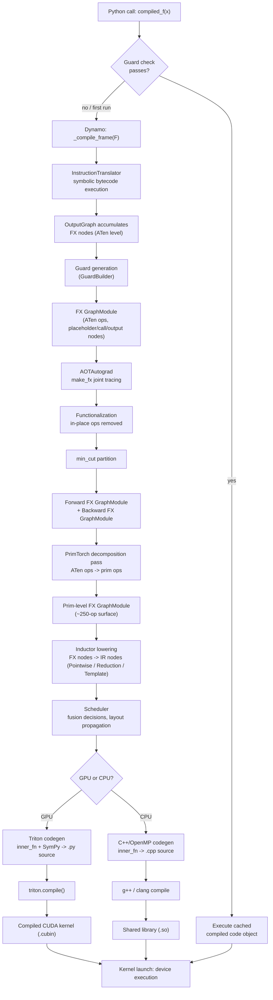

# 🔥 torch.compile: Full-Stack Survey

## Table of Contents

- [[#1. Motivation and Architecture at a Glance|1. Motivation and Architecture at a Glance]]
- [[#2. TorchDynamo: Python Bytecode Interception|2. TorchDynamo: Python Bytecode Interception]]
  - [[#2.1 The PEP 523 Frame-Eval Hook|2.1 The PEP 523 Frame-Eval Hook]]
  - [[#2.2 Symbolic Bytecode Execution and Variable Trackers|2.2 Symbolic Bytecode Execution and Variable Trackers]]
  - [[#2.3 FX Graph Fragment Capture|2.3 FX Graph Fragment Capture]]
  - [[#2.4 Guard Generation|2.4 Guard Generation]]
  - [[#2.5 Graph Breaks|2.5 Graph Breaks]]
  - [[#2.6 Recompilation Policy and Cache Structure|2.6 Recompilation Policy and Cache Structure]]
- [[#3. The FX Intermediate Representation|3. The FX Intermediate Representation]]
- [[#4. AOTAutograd: Ahead-of-Time Joint Tracing|4. AOTAutograd: Ahead-of-Time Joint Tracing]]
  - [[#4.1 Why Ahead-of-Time|4.1 Why Ahead-of-Time]]
  - [[#4.2 The Joint Forward-Backward Graph|4.2 The Joint Forward-Backward Graph]]
  - [[#4.3 Functionalization|4.3 Functionalization]]
  - [[#4.4 Graph Partitioning via Min-Cut|4.4 Graph Partitioning via Min-Cut]]
  - [[#4.5 Cross-Backward Fusion: What Eager Cannot Do|4.5 Cross-Backward Fusion: What Eager Cannot Do]]
- [[#5. PrimTorch: Operator Decomposition|5. PrimTorch: Operator Decomposition]]
  - [[#5.1 The Two Operator Levels|5.1 The Two Operator Levels]]
  - [[#5.2 Decomposition at Trace Time|5.2 Decomposition at Trace Time]]
  - [[#5.3 Why This Layer Exists|5.3 Why This Layer Exists]]
- [[#6. TorchInductor: Loop-Level IR and Kernel Generation|6. TorchInductor: Loop-Level IR and Kernel Generation]]
  - [[#6.1 The Define-by-Run Loop IR|6.1 The Define-by-Run Loop IR]]
  - [[#6.2 Symbolic Shapes with SymPy|6.2 Symbolic Shapes with SymPy]]
  - [[#6.3 The Scheduler and Fusion|6.3 The Scheduler and Fusion]]
  - [[#6.4 GPU Path: Triton Codegen|6.4 GPU Path: Triton Codegen]]
  - [[#6.5 CPU Path: C++ and OpenMP|6.5 CPU Path: C++ and OpenMP]]
  - [[#6.6 Layout Propagation|6.6 Layout Propagation]]
- [[#7. End-to-End Data Flow|7. End-to-End Data Flow]]
- [[#8. Guards and Recompilation in Depth|8. Guards and Recompilation in Depth]]
  - [[#8.1 Guard Types|8.1 Guard Types]]
  - [[#8.2 Cache Lookup Mechanism|8.2 Cache Lookup Mechanism]]
  - [[#8.3 Specialization vs. Dynamic Shapes|8.3 Specialization vs. Dynamic Shapes]]
- [[#9. torch.compile Usage Modes|9. torch.compile Usage Modes]]
- [[#References|References]]

---

## 1. Motivation and Architecture at a Glance

PyTorch's eager execution model is maximally flexible: every operator call dispatches immediately through the [[concepts/pytorch-internals/dispatcher|C10 Dispatcher]], the [[concepts/pytorch-internals/autograd-engine|Autograd Engine]] records a tape node, and the kernel launches on the device. The interpreter overhead incurred by Python and the inability to observe more than one operator at a time preclude two major classes of optimization:

1. **Kernel fusion** — adjacent elementwise or reduction operations can be merged into a single kernel, eliminating redundant HBM round-trips.
2. **Cross-pass optimization** — the backward graph is unknown at forward time, so decisions such as which activations to save (rather than recompute) cannot be made globally.

`torch.compile` layers a multi-stage compilation pipeline in front of eager execution without abandoning Python's dynamism. The four stages are:

| Stage | Input | Output | Principal invariant |
|-------|-------|--------|---------------------|
| TorchDynamo | Python bytecode frames | FX graph fragments + guards | Semantically equivalent to eager; guards certify validity |
| AOTAutograd | FX forward graph | Paired forward + backward FX graphs | Joint functional graph; all mutations and aliases resolved |
| PrimTorch | ATen-level FX graph | Prim-level FX graph (~250 ops) | Closed, stable operator surface any backend can implement |
| TorchInductor | Prim-level FX graph | Triton / C++/OpenMP source | Optimal loop structure; fused kernels; hardware-specific |

**Performance headline:** Ansel et al. (ASPLOS 2024) report a geometric mean of **2.27× inference** and **1.41× training** speedup over eager execution on an NVIDIA A100 across 180+ real-world models, while achieving a **99% graph capture rate** — compared to approximately 50% for the earlier TorchScript approach.



*Figure 4 (Ansel et al., 2024): Cumulative Distribution Function of speedups over PyTorch eager mode across 180+ models from TorchBench, HuggingFace, and TIMM. TorchInductor (blue) dominates all other backends at every speedup threshold for both GPU inference (float32 and float16) and GPU training. The x-axis is inverted: curves further left indicate more models achieving higher speedups.*

> [!INFO] What this note is and is not
> This is a **survey** of the full stack. Each stage has its own planned deep-dive: [[concepts/pytorch-internals/torch-compile/dynamo|dynamo.md]], [[concepts/pytorch-internals/torch-compile/aot-autograd|aot-autograd.md]], [[concepts/pytorch-internals/torch-compile/inductor|inductor.md]], [[concepts/pytorch-internals/torch-compile/symbolic-shapes|symbolic-shapes.md]]. The goal here is to establish the interfaces, invariants, and ordering rationale so that the deeper notes have a coherent home.

---

## 2. TorchDynamo: Python Bytecode Interception

🔑 TorchDynamo is the *graph acquisition* layer. Its job is to extract maximal sequences of PyTorch tensor operations from an arbitrary Python function into FX graph fragments, while generating *guards* that certify those fragments are valid for the current inputs.

### 2.1 The PEP 523 Frame-Eval Hook

CPython 3.6+ defines [PEP 523](https://peps.python.org/pep-0523/), which allows a custom C-level callback to replace the default frame evaluation function (`_PyEval_EvalFrameDefault`). TorchDynamo calls `set_eval_frame()` to install its hook globally (scoped per-thread via a context manager when you call `torch.compile`).

**Definition (Frame-Eval Hook).** Let $F$ denote a CPython execution frame — a struct containing the bytecode object (`co_code`), locals, the value stack, and the current instruction pointer. The hook function has the signature:

$$
\texttt{hook}(F, \texttt{throwflag}) \to \texttt{PyObject*}
$$

When CPython is about to evaluate frame $F$, it calls `hook(F, 0)` instead. Dynamo's hook inspects whether $F$ has already been compiled. If yes and guards pass, it replaces $F$'s code object with the compiled version and resumes normal evaluation. If no or guards fail, it calls `_compile_frame(F)`.

> [!NOTE] Why not `sys.settrace` or `__torch_function__`?
> `sys.settrace` fires per Python *line*, not per bytecode instruction, and imposes enormous overhead. `__torch_function__` only intercepts PyTorch operators — it misses Python control flow and non-tensor branches that affect graph structure. PEP 523 is the only hook that can intercept *all* computation at negligible cost.


*Figure 1 (Ansel et al., 2024): Side-by-side comparison of original CPython frame evaluation (left) and TorchDynamo's modified behavior (right). On first call, Dynamo performs dynamic bytecode analysis to extract FX graph fragments, generates guards, and compiles a transformed PyCodeObject. On subsequent calls, the guard function is checked; if it passes, the cached compiled function is called directly, bypassing re-analysis.*

### 2.2 Symbolic Bytecode Execution and Variable Trackers

`_compile_frame` runs the frame's bytecode through `InstructionTranslator`, a symbolic interpreter. Rather than executing bytecode concretely, `InstructionTranslator` steps through each instruction and maintains a symbolic value stack where each slot holds a *VariableTracker*.

**Definition (VariableTracker).** A VariableTracker $v$ is a runtime abstraction over a Python object. It carries:
- A *source* annotation (e.g., `LocalSource("x")`) recording where the object came from in the frame locals.
- A *guard builder* that knows what conditions must hold on the real object for this tracker to remain valid.
- Specialization-specific state depending on the Python type.

Key VariableTracker subtypes include `TensorVariable` (wraps a tensor; produces FX proxy nodes for operations), `ConstantVariable` (fully specializes a Python scalar or bool into the guard), `ListVariable`, `TupleVariable`, and `UserDefinedObjectVariable` (for objects Dynamo cannot specialize — treated opaquely, causing graph breaks if tensor-producing).

When `InstructionTranslator` encounters a bytecode instruction like `BINARY_ADD`, it calls the appropriate `VariableTracker` method (e.g., `TensorVariable.__add__`), which emits an FX `call_function` node into the `OutputGraph` and returns a new `TensorVariable` representing the result.

### 2.3 FX Graph Fragment Capture

The `OutputGraph` accumulates emitted FX nodes. When Dynamo reaches a point where it must stop (a graph break, a `return`, or `fullgraph` mode), it finalizes the graph into a `torch.fx.GraphModule` and passes it to the configured backend (by default, the `aot_autograd` wrapper over TorchInductor).

> [!EXAMPLE] Bytecode Rewriting
> Suppose the original function has bytecode for `y = torch.sin(x) + torch.cos(x)`. Dynamo rewrites the frame's code object so that the executed bytecode instead calls `__compiled_fn_0(x)`, where `__compiled_fn_0` is the compiled FX graph. If a graph break occurs mid-function, a `__resume_at_<offset>` continuation function handles the remaining bytecode by recursively re-entering Dynamo.

The rewritten bytecode is cached: subsequent calls to the same function fast-path directly to the compiled code if guards pass, without re-entering `_compile_frame`.

### 2.4 Guard Generation

Guards are boolean predicates over the runtime inputs that certify a compiled graph fragment is valid. They are embedded as checks in the rewritten bytecode — evaluated before executing the compiled graph.

**Definition (Guard).** A guard $g$ is a predicate $g : \mathcal{I} \to \{\texttt{true}, \texttt{false}\}$ over the space $\mathcal{I}$ of possible input values. If $g(\mathbf{x}) = \texttt{true}$, the compiled code is correct for input $\mathbf{x}$.

Guards are generated by `GuardBuilder` during symbolic bytecode execution. Each `VariableTracker` contributes guards appropriate to its type. Concrete examples:

| Guard type | What it checks | Generated by |
|-----------|---------------|-------------|
| `TENSOR_MATCH` | dtype, device, requires_grad, ndim | TensorVariable |
| `SIZE_MATCH` | concrete shape dimensions | TensorVariable (static mode) |
| `SHAPE_ENV` | symbolic inequality constraints | ShapeEnv (dynamic mode) |
| `EQUALS_MATCH` | Python scalar/bool value | ConstantVariable |
| `ID_MATCH` | object identity (e.g., a specific nn.Module instance) | ModuleVariable |
| `DISPATCH_KEY` | dispatch key bitset on tensor | TensorVariable |
| `DYNAMIC_INDICES` | which dimensions were seen with variable sizes | TensorVariable (dynamic mode) |

> [!WARNING] Guard explosion
> *If a function branches on `x.shape[0]`, Dynamo specializes the branch and records an `EQUALS_MATCH` guard on the concrete value. Every distinct value triggers a recompile. For shape-polymorphic code, use `torch.compile(dynamic=True)` to generate `SHAPE_ENV` inequalities instead.*

### 2.5 Graph Breaks

A *graph break* occurs when `InstructionTranslator` encounters a construct it cannot trace inline:

- Calls to unsupported C extensions or arbitrary Python libraries.
- Tensor-to-Python data extraction: `x.item()`, `x.tolist()`, `bool(tensor)`.
- Control flow that depends on a data-dependent boolean (e.g., `if x.sum() > 0`), unless `torch.cond` is used.
- `print`, `logging`, or other side-effectful Python operations.
- `torch.nn.Module` forward methods with non-tensor state that Dynamo cannot model.

On a graph break, Dynamo:
1. Finalizes and compiles the FX fragment built so far.
2. Emits a `__resume_at_<offset>` bytecode stub that, when reached, restores the Python value stack and jumps to the instruction after the break point, recursively invoking Dynamo.

> [!DANGER] Performance implication of graph breaks
> Each break prevents the backend compiler from seeing operations across the boundary. Cross-break fusion is impossible. In practice, a single break in a tight training loop can negate most of the speedup. Use `torch.compile(fullgraph=True)` to convert breaks into errors, making them visible during development.

> [!QUESTION] Exercise 1: Guard Interaction with Graph Breaks
> *This problem establishes how guards on either side of a graph break interact during recompilation.*
>
> > **Prerequisites:** [[#2.4 Guard Generation|2.4 Guard Generation]], [[#2.5 Graph Breaks|2.5 Graph Breaks]]
>
> A function `f(x, n)` contains a graph break triggered by `print(n)` where `n` is a Python integer. Dynamo compiles two FX fragments: $G_1$ before the break and $G_2$ after. Describe: (a) what guards are attached to each fragment, (b) what happens when `f` is called again with the same `x` but a different integer `n`, and (c) when it is called with the same `n` but a tensor `x` of different shape.

> [!TIP]- Solution to Exercise 1
> **Key insight:** Each compiled fragment has its own guard set. Guards for $G_1$ cover the tensor properties of `x` (dtype, device, shape in static mode). Guards for $G_2$ cover any properties of `x` that flow into $G_2$ after the break. The integer `n` is accessed only inside the `print` call, which itself is the break-point; Dynamo does not trace through `print`, so `n` does not appear in either compiled fragment's guards — it is simply executed eagerly.
>
> **Sketch:**
> - (a) $G_1$'s guards: dtype/device/shape of `x`. $G_2$'s guards: same properties of `x` (re-checked because $G_2$ is entered through a new resume frame). `n` is not in any guard because it was consumed by the traced-over `print`.
> - (b) Same `x`, different `n`: all guards pass (they don't mention `n`). No recompile. The `print(n)` runs eagerly during the resume, printing the new value. Correct.
> - (c) Same `n`, different `x` shape (static mode): `SIZE_MATCH` guard on $G_1$ fails. Dynamo recompiles $G_1$ (and likely $G_2$, since `x`'s shape change may affect indexing). One new cache entry is added.

### 2.6 Recompilation Policy and Cache Structure

Each compiled Python function maintains a *compilation cache* — a linked list of `(guard_fn, code_object)` pairs. On each call:

1. Dynamo evaluates `guard_fn` for each entry in order.
2. The first entry whose guards pass provides the `code_object` to execute.
3. If no entry passes, `_compile_frame` is invoked: a new trace produces a new `(guard_fn, code_object)` pair appended to the list.

The cache is bounded: by default, Dynamo emits a warning after 8 recompilations for the same function and eventually stops compiling (falling back to eager) to avoid unbounded compile time. This threshold is configurable via `torch._dynamo.config.cache_size_limit`.

> [!NOTE] FX Graph Cache
> Separately from Dynamo's per-frame cache, TorchInductor maintains a persistent *FX Graph Cache* keyed on a hash of the FX graph structure and guard values. If the same graph was compiled in a previous process run, Inductor can load the compiled artifact from disk, amortizing startup cost across process restarts.

---

## 3. The FX Intermediate Representation

Between Dynamo and AOTAutograd/Inductor, computation is represented as a `torch.fx.GraphModule` — PyTorch's general-purpose program IR defined in Reed et al. (2022).

**Definition (FX Graph).** An FX graph $\mathcal{G} = (V, E)$ is a directed acyclic graph where each vertex $v \in V$ is an FX `Node` with:
- An **opcode** $\in \{\texttt{placeholder}, \texttt{call\_function}, \texttt{call\_method}, \texttt{call\_module}, \texttt{get\_attr}, \texttt{output}\}$.
- A **target**: the function, method name, or module path being called.
- **args** and **kwargs**: edges to predecessor nodes or immediate Python values.

The six opcodes cover every pattern needed to represent PyTorch programs:

| Opcode | Semantics |
|--------|-----------|
| `placeholder` | A function input (corresponds to `def f(x, y, ...)`) |
| `call_function` | Call a free Python/PyTorch function, e.g., `torch.add` |
| `call_method` | Call a method on a value, e.g., `x.relu()` |
| `call_module` | Invoke an `nn.Module` sub-module's `forward` |
| `get_attr` | Read a parameter or buffer from the module hierarchy |
| `output` | The function's return value(s) |

The entire graph is stored as an in-order list of `Node` objects (topological order by construction). Code generation reconstitutes executable Python by iterating this list and emitting calls.

> [!NOTE] FX is the lingua franca of the stack
> Every stage — Dynamo output, AOTAutograd input/output, PrimTorch decomposition, Inductor input — uses FX graphs. Transformations are applied by graph-to-graph passes: a pass iterates nodes, replaces targets, inserts new nodes, and erases old ones — all in Python.

---

## 4. AOTAutograd: Ahead-of-Time Joint Tracing

💡 AOTAutograd sits between Dynamo and Inductor. It receives a forward FX graph, traces through PyTorch's [[concepts/pytorch-internals/autograd-engine|Autograd Engine]] to capture the backward graph *before any data is seen at runtime*, and hands a pair of functional FX graphs to the backend compiler.

### 4.1 Why Ahead-of-Time

In eager mode, the backward pass is built dynamically: each forward operator records a `grad_fn` node in the autograd tape, and `.backward()` traverses this tape at runtime. The compiler never sees the backward graph until it has already run.

AOTAutograd breaks this barrier. By tracing the backward graph ahead of time, it:
- Makes both forward and backward graphs available simultaneously for cross-pass optimization.
- Allows the backend to fuse backward kernels with each other and with forward epilogues.
- Enables global decisions about which activations to save vs. recompute (rematerialization).

### 4.2 The Joint Forward-Backward Graph

**Definition (Joint Graph).** Given a user function $f : \mathbb{R}^n \to \mathbb{R}^m$ (represented as an FX graph), AOTAutograd constructs a *joint function*:

$$
J(\mathbf{p}, \boldsymbol{\tau}) = (f(\mathbf{p}),\; \nabla_\mathbf{p} \langle f(\mathbf{p}), \boldsymbol{\tau} \rangle)
$$

where $\mathbf{p}$ are the *primals* (inputs and parameters) and $\boldsymbol{\tau}$ are the *tangents* (upstream gradients). $J$ returns both the forward outputs and the parameter gradients in a single graph.

The tracing mechanism uses `make_fx` — a function that applies `torch.fx.Interpreter`-based symbolic execution under `__torch_dispatch__` to record operator calls as FX nodes. `make_fx` is invoked on the joint function with proxy tensors representing primals and tangents:

```python
def joint_fn(primals, tangents):
    fw_outs = f(*primals)
    grads = torch.autograd.grad(fw_outs, primals, tangents)
    return fw_outs, grads

joint_graph = make_fx(joint_fn)(proxy_primals, proxy_tangents)
```

*This is not standard FX symbolic tracing.* Standard FX tracing uses `__torch_function__` and does not see autograd. `make_fx` uses `__torch_dispatch__`, which fires *after* dispatch resolution — including through autograd — so both the forward operator calls and the backward `AccumulateGrad` / `ViewBackward` nodes are captured.

### 4.3 Functionalization

Backend compilers require *pure functional* graphs: no in-place mutation, no aliased tensors sharing storage. AOTAutograd applies *functionalization* to enforce this.

**Definition (Functionalization).** Functionalization is the transformation $\phi$ that converts a graph with in-place operations and view aliases into a semantically equivalent pure functional graph. For each in-place op $x \mathrel{+}= y$, $\phi$ replaces it with $x' = x + y$ and redirects all downstream uses of $x$ to $x'$.

Concretely, functionalization wraps tensors in `FunctionalTensor` objects. Mutations are *recorded* as functional shadow updates rather than applied to the underlying storage. After tracing, mutations are classified:

| Category | Meaning | Handling |
|----------|---------|---------|
| `NOT_MUTATED` | Input unchanged | No action |
| `MUTATED_IN_GRAPH` | Mutation fully represented as a functional operation in the graph | Embedded in graph |
| `MUTATED_OUT_GRAPH` | Mutation cannot be expressed functionally within the trace | Applied via `copy_()` epilogue at runtime |

Similarly, view aliasing is resolved: the `ViewAndMutationMeta` structure tracks which outputs alias which inputs, and the runtime wrapper reconstructs the correct aliasing semantics after the functional graph executes.

### 4.4 Graph Partitioning via Min-Cut

After the joint graph is traced and functionalized, it must be split into a *forward* graph $G_f$ and a *backward* graph $G_b$. The forward graph saves certain intermediate tensors (*saved activations*) that the backward graph consumes.

The partition is a classic **min-cut** problem: minimize the bandwidth (total size of saved activations flowing from $G_f$ to $G_b$) subject to the constraint that every value needed by $G_b$ is either a primal input or a saved activation from $G_f$.

**Definition (Rematerialization).** An activation $a$ computed in $G_f$ that is needed in $G_b$ can either be *saved* (stored in memory, increasing peak activation memory) or *recomputed* (replicated in $G_b$, increasing FLOPs). The `min_cut_rematerialization_partition` function applies a min-cut algorithm with the following heuristic edge weights:

$$
w(a) = \text{cost\_to\_save}(a) - \text{cost\_to\_recompute}(a)
$$

Nodes with large memory footprint but cheap recomputation (e.g., `relu`, `dropout`) are candidates for recomputation. Expensive reductions (`mean`, `sum` over large tensors) are always saved. Views are always recomputed (zero compute cost).

> [!NOTE] Activation checkpointing
> `torch.utils.checkpoint` in eager mode is a runtime mechanism: it discards activations during the forward and re-runs the segment during backward. AOTAutograd's rematerialization is a *compile-time* version of the same idea — more precise because the compiler can analyze the full graph rather than operating on user-specified segment boundaries.

### 4.5 Cross-Backward Fusion: What Eager Cannot Do

In eager mode, backward operators execute sequentially as the autograd engine traverses the tape. The kernel for `SinBackward` launches, completes, and writes its output to memory before `AddBackward` can begin. There is no opportunity for the two kernels to fuse.

With AOTAutograd, the backward graph $G_b$ is a static FX graph. TorchInductor sees the entire backward at compile time and can fuse `SinBackward` and `AddBackward` into a single Triton kernel that reads inputs once, computes both gradients, and writes them back in one pass. **This is the fundamental reason AOTAutograd exists: it lifts the backward graph from runtime-dynamic to compile-time-static.**

> [!QUESTION] Exercise 2: When AOTAutograd Cannot Trace
> *This problem probes the boundary conditions of AOTAutograd's tracing.*
>
> > **Prerequisites:** [[#4.2 The Joint Forward-Backward Graph|4.2 The Joint Forward-Backward Graph]], [[#4.3 Functionalization|4.3 Functionalization]]
>
> Consider a function `f` that contains a call to `torch.linalg.solve(A, b)`. (a) Why does AOTAutograd have no difficulty tracing through this call? (b) Now suppose `f` calls a custom CUDA kernel written in C++ with no registered backward. What does AOTAutograd emit in the backward graph for this node, and what is the runtime consequence?

> [!TIP]- Solution to Exercise 2
> **Key insight:** AOTAutograd traces through `__torch_dispatch__`, which fires for any registered ATen operator. Custom CUDA kernels registered via `TORCH_LIBRARY` *can* have an autograd formula registered — in which case AOTAutograd captures it. If no formula is registered, the node becomes a dead end in the tape.
>
> **Sketch:**
> - (a) `torch.linalg.solve` is a standard ATen operator with a registered autograd formula. When `make_fx` traces the joint function, `torch.autograd.grad` invokes this formula under `__torch_dispatch__`, recording the backward ops (e.g., a matrix solve for the gradient of `A`) as FX nodes in the joint graph. No special treatment needed.
> - (b) If the custom kernel has no `setup_context`/backward formula, `torch.autograd.grad` will raise `RuntimeError: element 0 of tensors does not require grad and does not have a grad_fn`. AOTAutograd will fail to trace the backward, and the entire `torch.compile` will fail for training. For inference (`requires_grad=False`), this is not an issue — AOTAutograd skips backward tracing entirely when no gradient is needed.

---

## 5. PrimTorch: Operator Decomposition

📐 PrimTorch addresses a fundamental portability problem: PyTorch exposes over 2,000 operator overloads at the ATen level (the C++ operator registry). Writing a compiler backend that correctly lowers all 2,000+ operators is impractical. PrimTorch solves this by decomposing ATen ops into a closed, stable set of ~250 *primitive* operators.

### 5.1 The Two Operator Levels

PrimTorch defines two distinct operator sets, both exposed under `torch.ops.prims`:

**Definition (ATen ops).** The ATen operator set consists of approximately 750 *canonical* operators (with ~2,000+ overloads counting dtype/layout variants). These are the operators visible at the Python-facing `torch.*` API. They have complex semantics (broadcasting, type promotion, view semantics, in-place variants) and are not all fusion-friendly. A backend targeting ATen ops must handle the full surface.

**Definition (Prim ops).** The prim operator set consists of approximately 250 *primitive* operators with simplified, stripped-down semantics: no type promotion rules, no broadcasting (inputs must have matching shapes), no in-place variants, and no aliasing. Each prim op corresponds to a tight loop-level computation that a compiler backend can directly map to hardware instructions.

The hierarchy is:

```
torch.* API (user-facing, ~2000 overloads)
     ↓ decomposes to
ATen ops (~750 canonical)
     ↓ decomposes to
Prim ops (~250 primitives)   ← compiler backends target this level
```

### 5.2 Decomposition at Trace Time

Decomposition happens as a graph transformation pass applied to the FX graph *before* it is handed to TorchInductor. The pass iterates every `call_function` node, checks if the target has a registered decomposition in `torch._decomp.decompositions`, and if so, replaces the node with its decomposition (an inline subgraph of more primitive ops).

**Example.** The ATen operator `torch.nn.functional.gelu(x)` decomposes as:

$$
\text{gelu}(x) = x \cdot \frac{1}{2}\left(1 + \text{erf}\left(\frac{x}{\sqrt{2}}\right)\right)
$$

At the prim level, this becomes a sequence: `prims.mul`, `prims.add`, `prims.erf`, `prims.sqrt`, `prims.div` — all elementwise prims with no broadcasting or promotion semantics.

### 5.3 Why This Layer Exists

> [!TIP] 💡 The decomposition layer is the backend portability contract.
> A new hardware vendor does not need to implement `gelu`, `layer_norm`, `scaled_dot_product_attention`, and 700 other ops. They implement the ~250 prims, and every ATen op decomposes into those prims at trace time. The compiler then fuses the resulting sequence of prims into efficient kernels for their hardware.

There is a deliberate tradeoff: decomposing `gelu` into five prims and then fusing them recovers the efficiency of a hand-fused `gelu` kernel — *if* the backend's fusion engine is good enough. For backends without fusion (e.g., export to ONNX), it is better to target ATen ops directly and rely on the runtime to dispatch to vendor-optimized implementations.

> [!QUESTION] Exercise 3: Decomposition Granularity Trade-off
> *This problem explores when decomposing to prims hurts performance.*
>
> > **Prerequisites:** [[#5.1 The Two Operator Levels|5.1 The Two Operator Levels]], [[#5.2 Decomposition at Trace Time|5.2 Decomposition at Trace Time]]
>
> `torch.nn.functional.layer_norm(x, normalized_shape, weight, bias)` can decompose into prim ops (mean, variance, reciprocal sqrt, mul, add). TorchInductor fuses these back into a single kernel. However, cuDNN has a highly optimized `cudnnLayerNormForward` implementation that uses specialized memory access patterns TorchInductor's Triton kernel cannot match. Describe the architectural mechanism by which TorchInductor can *bypass* the prim decomposition and call cuDNN directly for `layer_norm`.

> [!TIP]- Solution to Exercise 3
> **Key insight:** TorchInductor has its own *lowering registry* that maps ATen ops directly to hand-written Triton templates or external library calls, bypassing the prim decomposition path. The lowering registry takes priority over the generic decomposition → prim fusion path.
>
> **Sketch:** Before applying prim decompositions, TorchInductor checks its internal lowering table for the ATen op. For `aten.native_layer_norm`, Inductor can register a lowering that emits a call to `torch.ops.aten.native_layer_norm` via the cuDNN path (or a custom Triton template). The decomposition to prims only fires for ops *not* in Inductor's lowering table. This two-path design means frequently-used ops get optimized implementations while the long tail falls through to generic prim decomposition. The `max-autotune` mode extends this by also trying CUTLASS templates for `mm`/`conv` and benchmarking against the Triton-generated version.

---

## 6. TorchInductor: Loop-Level IR and Kernel Generation

🔑 TorchInductor is the default compiler backend. It receives a prim-level FX graph and produces optimized GPU (Triton) or CPU (C++/OpenMP) kernel code. Its core innovation is a *define-by-run loop-level IR* — a Python-native representation that enables both symbolic shape handling and straightforward code generation.

### 6.1 The Define-by-Run Loop IR

**Definition (Inductor IR Node).** An Inductor IR node for a pointwise operation is a Python callable of the form:

```python
def inner_fn(index: list[sympy.Expr]) -> sympy.Expr:
    # index is a list of symbolic loop iteration variables
    # returns a symbolic expression for the output element at this index
    ...

node = torchinductor.ir.Pointwise(
    device=torch.device("cuda"),
    dtype=torch.float32,
    inner_fn=inner_fn,
    ranges=[size0, size1],   # symbolic loop bounds
)
```

The "define-by-run" terminology refers to the fact that the IR is *not* a static graph of nodes connected by edges. Instead, code generation is performed by *executing* `inner_fn` with symbolic index variables (SymPy `Symbol` objects), collecting the resulting symbolic expression, and then emitting the expression as Triton or C++ code.

For reductions, the analogous structure is `torchinductor.ir.Reduction`, which has both an `inner_fn` (computing the element to reduce over) and a `reduction_fn` (the accumulation, e.g., sum or max).

**Key property:** The Inductor IR is *lazy*. An `ir.Pointwise` node does not compute anything; it only becomes concrete when the scheduler decides to emit it as a kernel and calls `inner_fn` with the iteration variables.

### 6.2 Symbolic Shapes with SymPy

*Static-shape* compilation — where every tensor dimension is a concrete integer — yields optimal loop bounds and enables loop tiling decisions to be made at compile time. But it produces a separate compiled artifact for every distinct input shape, leading to cache thrashing for transformer models with variable sequence lengths.

TorchInductor uses SymPy to represent *symbolic shapes*: dimension values are `sympy.Symbol` objects (e.g., `s0`, `s1`) that flow through all indexing arithmetic. A compiled Triton kernel with symbolic shapes contains runtime-computed index expressions:

```python
# Generated Triton kernel (schematic) for a pointwise op on shape [s0, s1]
@triton.jit
def kernel(x_ptr, out_ptr, s0, s1, ...):
    pid = tl.program_id(0)
    offset = pid * BLOCK_SIZE + tl.arange(0, BLOCK_SIZE)
    mask = offset < s0 * s1
    x = tl.load(x_ptr + offset, mask=mask)
    tl.store(out_ptr + offset, tl.sin(x), mask=mask)
```

At runtime, `s0` and `s1` are passed as kernel arguments. The kernel is correct for any values satisfying the guard inequalities established during compilation (e.g., $s_0 > 0$, $s_1 > 0$).

SymPy handles the algebra: it simplifies expressions like `s0 * s1 + s0 * 0` to `s0 * s1`, eliminates redundant index terms from strides, and generates readable guard predicates.

> [!NOTE] Specialization on zero and one
> *By default, TorchInductor specializes on $s = 0$ and $s = 1$ even in dynamic mode.* A zero-size tensor requires a boundary check that would complicate the general case; a size-one tensor often enables broadcast elimination. Every other size is treated symbolically.

### 6.3 The Scheduler and Fusion

The Inductor *Scheduler* is the component that decides which IR nodes are fused into the same kernel. Its decisions directly control memory traffic: two fused pointwise nodes share a single HBM read/write cycle; unfused nodes each pay independently.

**Definition (Fusion Categories).** The scheduler partitions IR nodes into three categories:

- **Pointwise**: elementwise operations (sin, add, mul, relu, ...). Any two pointwise nodes with compatible iteration domains can fuse.
- **Reduction**: operations that reduce along one or more dimensions (sum, max, mean). A reduction can fuse with preceding pointwise ops that feed it, but two reductions cannot fuse with each other (they would require nested loops with incompatible structure).
- **Template**: pre-written Triton or CUTLASS kernels for matmul and conv. Templates fuse with succeeding pointwise ops (epilogue fusion) but not with preceding reductions.

Fusion decisions are scored by estimated *memory traffic reduction*:

$$
\Delta_{\text{traffic}}(A \cup B) = \text{traffic}(A) + \text{traffic}(B) - \text{traffic}(A \cup B)
$$

A fusion is performed if $\Delta_{\text{traffic}} > 0$. The scheduler also checks *iteration domain compatibility*: two nodes can fuse only if their loop ranges are identical or one can be broadcast into the other.

### 6.4 GPU Path: Triton Codegen

For GPU targets, the scheduler's fusion groups are lowered to *Triton* kernels. Triton is a Python-embedded DSL for writing GPU kernels at the tile level — the programmer specifies tile sizes and the compiler handles CUDA thread-block mapping, shared memory, and vectorization.

Inductor's code generator calls each fused node's `inner_fn` with symbolic Triton tile indices (SymPy expressions quantized to `tl.arange` expressions) and collects the resulting symbolic tree. It then emits Triton source by recursively printing the tree:

| Inductor op | Triton emission |
|-------------|----------------|
| `prims.sin` | `tl.sin(...)` |
| `prims.add` | `... + ...` |
| `prims.load` | `tl.load(ptr + idx, mask=mask)` |
| `prims.store` | `tl.store(ptr + idx, val, mask=mask)` |
| Reduction sum | `tl.sum(...)` |

For matmul and conv, Inductor uses *template kernels*: pre-written Triton code for the matrix multiply loop, with a user-supplied epilogue insertion point. The template produces a `MultiTemplate` buffer holding $N$ candidate GEMM implementations (different tile sizes, different pipelining depths). In `max-autotune` mode, the scheduler benchmarks all candidates and picks the fastest.

**Epilogue fusion.** After selecting the GEMM winner, the scheduler checks whether any immediately-downstream pointwise ops (e.g., `bias_add`, `gelu`, `dropout`) can be inlined into the GEMM's output tile before it is written back to HBM. This *epilogue fusion* eliminates one round of HBM traffic: the GEMM output never materializes as a full tensor.

### 6.5 CPU Path: C++ and OpenMP

For CPU targets, the same IR is lowered to C++ loops with `#pragma omp parallel for` annotations. The scheduler still performs fusion, and symbolic shape expressions become C++ variable references. The generated code is compiled at runtime via the system C++ compiler (typically GCC or Clang) and loaded as a shared library.

CPU code generation benefits from the same symbolic shape machinery: a single compiled artifact handles variable batch sizes without recompilation.

### 6.6 Layout Propagation

PyTorch tensors can have *contiguous* (row-major, NCHW) or *channels-last* (NHWC) memory layout. Many convolution workloads are faster in channels-last format because it exposes more contiguous memory accesses along the channel dimension, which maps better to GPU vectorized loads.

However, naively inserting layout conversions at every operator boundary is expensive. TorchInductor performs *layout propagation*: it analyzes the graph and determines a global layout assignment that minimizes conversion overhead. Operations like `conv2d` prefer channels-last; operations like `linear` are layout-agnostic. The scheduler assigns layouts and inserts `permute`/`contiguous` nodes only where conversions are unavoidable.

> [!QUESTION] Exercise 4: Fusion Impossibility for Reductions
> *This problem establishes why two reductions cannot fuse into a single kernel.*
>
> > **Prerequisites:** [[#6.3 The Scheduler and Fusion|6.3 The Scheduler and Fusion]], [[#6.4 GPU Path: Triton Codegen|6.4 GPU Path: Triton Codegen]]
>
> Let $A$ be a `sum` reduction over the column dimension of a matrix $X \in \mathbb{R}^{M \times N}$ (yielding a vector in $\mathbb{R}^M$) and $B$ be a `sum` reduction over the row dimension of $X$ (yielding a vector in $\mathbb{R}^N$). Both $A$ and $B$ read from $X$. Prove that $A$ and $B$ cannot be fused into a single Triton kernel without producing an incorrect result or incurring the same memory traffic as two separate kernels.

> [!TIP]- Solution to Exercise 4
> **Key insight:** $A$ and $B$ have incompatible iteration domains and reduction axes. Fusing them requires a thread block to simultaneously reduce along rows and columns — which requires either processing the full matrix twice (no saving) or a two-phase reduction that is strictly more expensive than two separate passes.
>
> **Sketch:** In Triton, a reduction kernel assigns program IDs to *output* elements. For $A$ (column sum), each program ID corresponds to one row of $X$, and the kernel accumulates over columns. For $B$ (row sum), each program ID corresponds to one column, and the kernel accumulates over rows. To fuse, we would need each thread block to handle both a row-accumulation and a column-accumulation — but the memory access pattern for rows (strided) and columns (contiguous) require different tile geometries. Any fusion must either: (1) materialize $X$ into shared memory twice (one per reduction direction), paying the same HBM bandwidth as two kernels; or (2) assign different thread block structures to the two reductions, which is equivalent to two separate kernel launches. The scheduler's iteration-domain compatibility check correctly blocks this fusion.

---

## 7. End-to-End Data Flow

The diagram below traces a single call to a `torch.compile`d function `f(x)` from Python invocation through to GPU kernel launch, showing the artifact produced at each stage boundary.



**Stage boundaries summarized:**

| Handoff | From | To | Artifact |
|---------|------|----|---------|
| Dynamo → AOTAutograd | Frame-eval hook | `aot_module` wrapper | `torch.fx.GraphModule` at ATen level |
| AOTAutograd → Decomp | `make_fx` + functionalize | Decomposition pass | Functional `GraphModule`, ATen level |
| Decomp → Inductor | Decomposition pass | Inductor lowering | Prim-level `GraphModule` |
| Inductor lowering → Scheduler | `lower_to_ir()` | `Scheduler` | `Pointwise`/`Reduction`/`Template` IR nodes |
| Scheduler → Codegen | Fusion grouping | `TritonKernel` / `CppKernel` | Python Triton source / C++ source |
| Codegen → Runtime | `triton.compile()` / gcc | Kernel cache | `.cubin` / `.so` |

---

## 8. Guards and Recompilation in Depth

### 8.1 Guard Types

Guards are the contract between Dynamo's compiled artifact and the runtime input. They are embedded in the rewritten bytecode as a sequence of Python boolean checks. If *any* guard fails, the cache miss handler triggers recompilation.

The full taxonomy of guard types, ordered roughly from cheapest to most expensive to evaluate:

| Guard | Cost | Triggered by |
|-------|------|-------------|
| `EQUALS_MATCH` on Python scalar | O(1) comparison | Python int/float/bool used in the graph |
| `ID_MATCH` on object | O(1) identity check | `nn.Module` instance, Python object |
| `TENSOR_MATCH` on dtype/device | O(1) attribute read | Any tensor input |
| `TENSOR_MATCH` on requires_grad | O(1) | Any tensor input |
| `SIZE_MATCH` on concrete shape | O(rank) | Static shape mode |
| `DISPATCH_KEY` bitmask check | O(1) | Tensor dispatch key set |
| `SHAPE_ENV` inequality | O(num constraints) | Dynamic shape mode |
| `DYNAMIC_INDICES` attribute | O(ndim) | Mixed static/dynamic dimension mode |

### 8.2 Cache Lookup Mechanism

**Definition (Compilation Cache Entry).** An entry $e_i = (g_i, c_i)$ in Dynamo's per-function cache consists of:
- $g_i$: a guard function `g_i(L) -> bool` where `L` is the frame locals dictionary.
- $c_i$: a Python code object to execute if $g_i$ passes.

On a call to the compiled function:

```python
for (guard_fn, code_obj) in cache:
    if guard_fn(frame.locals):
        exec(code_obj, frame.globals, frame.locals)
        return
# cache miss:
new_entry = compile_frame(frame)
cache.append(new_entry)
exec(new_entry.code_obj, ...)
```

The linear scan is $O(|\text{cache}|)$, bounded by `cache_size_limit` (default 8). In practice, caches rarely exceed 2–3 entries for well-structured code.

### 8.3 Specialization vs. Dynamic Shapes

`torch.compile` exposes a `dynamic` parameter controlling how Dynamo handles shape variability:

**Static specialization (`dynamic=False`, default).** Every tensor dimension is matched concretely. A new batch size triggers a recompile, producing a new entry in the cache. This yields maximally optimized kernels (loop bounds are compile-time constants, enabling aggressive unrolling and tile-size selection) but causes cache thrashing with variable-length inputs.

**Dynamic shapes (`dynamic=True`).** Dynamo assigns `sympy.Symbol` objects to tensor dimensions that have been seen with different values, and records `SHAPE_ENV` guards encoding the observed constraints (e.g., $s_0 \geq 1$, $s_0 \leq 2048$). The compiled Triton kernel receives shape values as runtime arguments and handles any conforming size without recompilation.

*Surprisingly,* dynamic shape compilation often incurs only a 5–10% overhead relative to static compilation — the SymPy symbolic expressions in Triton kernels typically optimize to the same code as if the bounds were constant, because Triton's LLVM backend eliminates the symbolic parameter once it is known at kernel-call time.

> [!WARNING] Mixed static/dynamic dimensions
> *`dynamic=True` does not make all dimensions symbolic.* Dimensions that are always seen with the same value remain specialized. Dynamo uses the `DYNAMIC_INDICES` mechanism to track, per-tensor, which dimensions have been observed with variable sizes — only those become symbols. This is the `mark_dynamic` / `mark_static` API.

> [!QUESTION] Exercise 5: Guard Evaluation Cost
> *This problem analyzes the amortized cost of guard evaluation for a high-throughput inference server.*
>
> > **Prerequisites:** [[#8.1 Guard Types|8.1 Guard Types]], [[#8.2 Cache Lookup Mechanism|8.2 Cache Lookup Mechanism]]
>
> A production inference service calls `compiled_model(x)` at 10,000 requests/second. Each call evaluates 12 guards (all `TENSOR_MATCH` type, 4 ns each). The compiled kernel itself takes 500 µs to execute. (a) What fraction of total per-call time is spent on guard evaluation? (b) The team considers switching to `reduce-overhead` mode (CUDA graphs). What does CUDA graph capture do to guard evaluation overhead, and what constraint does it impose on inputs?

> [!TIP]- Solution to Exercise 5
> **Key insight:** Guard evaluation is negligible relative to kernel execution in the high-throughput case, but CUDA graphs eliminate even that overhead at the cost of fixed input/output addresses.
>
> **Sketch:**
> - (a) Guard time per call: $12 \times 4\,\text{ns} = 48\,\text{ns}$. Kernel time: $500\,\mu\text{s} = 500{,}000\,\text{ns}$. Guard fraction: $48 / 500{,}048 \approx 0.0096\%$. Negligible.
> - (b) CUDA graphs capture the entire sequence of CUDA API calls (kernel launches, memory ops) into a *replay graph*. After capture, a single `cudaGraphLaunch` replays all operations without re-issuing individual CUDA calls, eliminating Python overhead and CPU-side kernel launch latency. However, CUDA graphs require that tensor addresses and shapes are *fixed* at capture time — the graph is recorded for specific pointer values. This means inputs must be placed in pre-allocated, fixed-address buffers. Variable-length inputs (different sequence lengths) require either padding to a fixed size or maintaining separate CUDA graphs per shape, increasing memory usage.

---

## 9. torch.compile Usage Modes

`torch.compile` accepts a `mode` string that selects a preset combination of Inductor compiler flags:

```python
compiled_model = torch.compile(
    model,
    mode="default",        # or "reduce-overhead", "max-autotune", "max-autotune-no-cudagraphs"
    dynamic=False,         # True for dynamic shapes
    fullgraph=False,       # True to raise on any graph break
    backend="inductor",    # or "eager", "aot_eager", or custom
)
```

| Mode | CUDA Graphs | Autotuning | Compile Time | Best For |
|------|-------------|------------|-------------|----------|
| `"default"` | No | No | Low | General use; first deployment |
| `"reduce-overhead"` | Yes | No | Low | Small models on large GPUs; Python-bound inference |
| `"max-autotune"` | Yes | Yes (GEMM, conv) | High | Throughput-critical inference; large batch training |
| `"max-autotune-no-cudagraphs"` | No | Yes | High | Variable-shape inputs needing best kernel selection |

**`"default"`** applies the standard Inductor pipeline: prim decomposition, scheduler fusion, Triton/C++ codegen, symbolic shapes if `dynamic=True`. No autotuning — the first tile configuration tried is used. Compile time is typically 30–120 seconds for a large model on first run.

**`"reduce-overhead"`** enables *CUDA graph capture*. After the first few warmup runs (to populate caches and let Dynamo stabilize), Inductor captures a CUDA graph: a recording of all CUDA API calls for one forward pass. Subsequent calls replay the graph with a single `cudaGraphLaunch`, eliminating Python-side overhead and per-kernel-launch CPU cost. **This can be 2–5× faster for small models where Python overhead dominates.** The constraint is fixed input tensor addresses and shapes.

**`"max-autotune"`** enables CUDA graphs *and* exhaustive autotuning. For matmul and conv nodes, Inductor generates $N$ candidate Triton templates (varying tile sizes $M_t \times N_t \times K_t$, number of pipeline stages, and split-k configurations) and benchmarks each on the target hardware. It selects the fastest and caches the winner. This adds significant compile time (minutes for a large model) but produces hardware-optimal kernels. On A100, autotune can recover 10–30% performance over `default` for GEMM-heavy workloads.

**`"max-autotune-no-cudagraphs"`** provides autotuning without the fixed-address constraint, suitable for models with variable-length inputs (e.g., language model inference with dynamic sequence length).

> [!NOTE] The `backend` parameter
> Setting `backend="eager"` runs Dynamo without any compilation — useful for debugging guard logic and graph breaks. `backend="aot_eager"` adds AOTAutograd tracing (capturing the joint graph) but skips Inductor — useful for testing AOTAutograd correctness. Custom backends are functions `(fx.GraphModule, example_inputs) -> Callable`.

> [!QUESTION] Exercise 6: CUDA Graph Incompatibility with Dynamic Allocation
> *This problem identifies a common failure mode when combining CUDA graphs with dynamic-allocation patterns.*
>
> > **Prerequisites:** [[#9. torch.compile Usage Modes|9. torch.compile Usage Modes]], [[#8.3 Specialization vs. Dynamic Shapes|8.3 Specialization vs. Dynamic Shapes]]
>
> A model uses `torch.where(mask, x, torch.zeros_like(x))` where `mask` is a boolean tensor that varies at runtime. A colleague says: "I switched to `reduce-overhead` mode and my outputs are now always zeros on the second call." Explain the mechanism of this bug and the correct fix.

> [!TIP]- Solution to Exercise 6
> **Key insight:** CUDA graphs capture *tensor addresses*, not tensor contents. If the model allocates a new `torch.zeros_like(x)` tensor on every call, the CUDA graph replay re-uses the *captured* address — which now points to a stale allocation, potentially deallocated and reallocated for a different tensor.
>
> **Sketch:** During CUDA graph capture (warmup run), `torch.zeros_like(x)` allocates a buffer at address $A_0$, filled with zeros. The CUDA graph records a `cudaMemcpyAsync` from $A_0$ in the `torch.where` kernel. On replay, the graph issues the same copy *from $A_0$*, but if the allocator has reused $A_0$ for another tensor (e.g., an intermediate activation), the values at $A_0$ are no longer zeros. Fix: pre-allocate the zeros buffer *outside* the compiled function and pass it as an explicit input (so it has a stable address captured in the graph), or use `torch.compile(mode="max-autotune-no-cudagraphs")` to disable CUDA graphs. Alternatively, replace the pattern with `x * mask` (a pure elementwise op with no dynamic allocation) which compiles cleanly under CUDA graphs.

---

## References

| Reference | Brief Summary | Link |
|-----------|--------------|------|
| Ansel et al., "PyTorch 2: Faster ML Through Dynamic Python Bytecode Transformation" (ASPLOS 2024) | Primary source for the full torch.compile stack; covers Dynamo frame-eval hook, AOTAutograd, PrimTorch, Inductor, and benchmark results | [dl.acm.org](https://dl.acm.org/doi/10.1145/3620665.3640366) |
| Jason Ansel, "TorchDynamo: An Experiment in Dynamic Python Bytecode Transformation" (dev-discuss, 2022) | Original TorchDynamo design doc; bytecode analysis rationale, guard structure, FX fragment capture | [dev-discuss.pytorch.org](https://dev-discuss.pytorch.org/t/torchdynamo-an-experiment-in-dynamic-python-bytecode-transformation/361) |
| Jason Ansel, "TorchInductor: a PyTorch-native Compiler with Define-by-Run IR" (dev-discuss, 2022) | Inductor design: define-by-run IR, SymPy symbolic sizes, Triton GPU path, epilogue fusion | [dev-discuss.pytorch.org](https://dev-discuss.pytorch.org/t/torchinductor-a-pytorch-native-compiler-with-define-by-run-ir/747) |
| Reed et al., "torch.fx: Practical Program Capture and Transformation for Deep Learning in Python" (MLSys 2022) | Defines the FX IR (GraphModule, Node, opcodes) that all torch.compile stages use | [arxiv.org/abs/2112.08429](https://arxiv.org/abs/2112.08429) |
| PyTorch, "Dynamo Overview" (official docs, 2024) | Authoritative reference for frame-eval hook, guard types, recompilation policy, cache structure | [docs.pytorch.org](https://docs.pytorch.org/docs/stable/torch.compiler_dynamo_overview.html) |
| PyTorch, "AOT Autograd: How to use and optimize?" (functorch docs) | AOTAutograd joint graph tracing, partitioning, and cross-backward fusion examples | [docs.pytorch.org/functorch](https://docs.pytorch.org/functorch/stable/notebooks/aot_autograd_optimizations.html) |
| PyTorch, "Introduction to torch.compile" (tutorial) | End-to-end usage guide; fullgraph parameter, graph break detection | [docs.pytorch.org](https://docs.pytorch.org/tutorials/intermediate/torch_compile_tutorial.html) |
| Modal, "What do the parameters of torch.compile do?" (blog, 2024) | Concise reference for `mode`, `dynamic`, `fullgraph`, and `backend` parameters | [modal.com](https://modal.com/blog/torch-compile-parameters) |
| DeepWiki, "TorchDynamo" (pytorch/pytorch) | Architectural walkthrough of InstructionTranslator, VariableTrackers, OutputGraph, and ShapeEnv | [deepwiki.com](https://deepwiki.com/pytorch/pytorch/2.1-torchdynamo) |
| DeepWiki, "AOT Autograd and Functionalization" (pytorch/pytorch) | Detailed treatment of joint tracing, FunctionalTensor, mutation classification, and min-cut partitioning | [deepwiki.com](https://deepwiki.com/pytorch/pytorch/2.4-aot-autograd-and-functionalization) |
| Ian Barber, "Inductor Notes" (blog, 2024) | Practical notes on Inductor scheduling, fusion scoring, Triton emission, and autotuning | [ianbarber.blog](https://ianbarber.blog/2024/01/16/inductor-notes/) |
| PyTorch, "torch.compile API reference" (stable docs) | Full API documentation for `torch.compile` parameters | [docs.pytorch.org](https://docs.pytorch.org/docs/stable/generated/torch.compile.html) |
