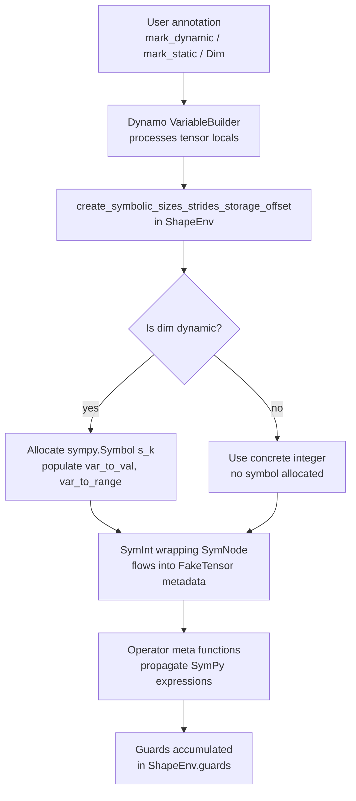

# Symbolic Shapes in torch.compile

## Table of Contents

- [[#1. Motivation: The Static vs. Dynamic Shape Tradeoff|1. Motivation: The Static vs. Dynamic Shape Tradeoff]]
  - [[#1.1 Static Shapes and Cache Thrashing|1.1 Static Shapes and Cache Thrashing]]
  - [[#1.2 Dynamic Shapes and Their Costs|1.2 Dynamic Shapes and Their Costs]]
  - [[#1.3 The Overhead Budget|1.3 The Overhead Budget]]
- [[#2. ShapeEnv: The Central State Manager|2. ShapeEnv: The Central State Manager]]
  - [[#2.1 Core Data Structures|2.1 Core Data Structures]]
  - [[#2.2 Entry Point: create_symbolic_sizes_strides_storage_offset|2.2 Entry Point: create_symbolic_sizes_strides_storage_offset]]
  - [[#2.3 SymNode: The Internal Carrier|2.3 SymNode: The Internal Carrier]]
- [[#3. Symbolic Integers: SymPy Expressions Throughout the Stack|3. Symbolic Integers: SymPy Expressions Throughout the Stack]]
  - [[#3.1 From Symbol to Expression Tree|3.1 From Symbol to Expression Tree]]
  - [[#3.2 SymPy Assumptions and Simplification|3.2 SymPy Assumptions and Simplification]]
  - [[#3.3 User-Visible Types: SymInt, SymFloat, SymBool|3.3 User-Visible Types: SymInt, SymFloat, SymBool]]
- [[#4. Guard Generation|4. Guard Generation]]
  - [[#4.1 What Triggers a Guard|4.1 What Triggers a Guard]]
  - [[#4.2 Guard Serialization and Source Annotations|4.2 Guard Serialization and Source Annotations]]
  - [[#4.3 Guard Types and Their Costs|4.3 Guard Types and Their Costs]]
  - [[#4.4 Divisibility Guards|4.4 Divisibility Guards]]
- [[#5. Specialization on 0 and 1|5. Specialization on 0 and 1]]
  - [[#5.1 Why the Special Cases Exist|5.1 Why the Special Cases Exist]]
  - [[#5.2 Performance Implication|5.2 Performance Implication]]
  - [[#5.3 Disabling Zero-One Specialization|5.3 Disabling Zero-One Specialization]]
- [[#6. Backed vs. Unbacked SymInts|6. Backed vs. Unbacked SymInts]]
  - [[#6.1 Backed SymInts|6.1 Backed SymInts]]
  - [[#6.2 Unbacked SymInts|6.2 Unbacked SymInts]]
  - [[#6.3 Deferred Runtime Asserts|6.3 Deferred Runtime Asserts]]
  - [[#6.4 torch._check and Range Refinement|6.4 torch._check and Range Refinement]]
- [[#7. The mark_dynamic / mark_static / torch.export.Dim APIs|7. The mark_dynamic / mark_static / torch.export.Dim APIs]]
  - [[#7.1 mark_dynamic|7.1 mark_dynamic]]
  - [[#7.2 mark_static|7.2 mark_static]]
  - [[#7.3 torch.export.Dim|7.3 torch.export.Dim]]
  - [[#7.4 How Annotations Feed into ShapeEnv|7.4 How Annotations Feed into ShapeEnv]]
- [[#8. Symbolic Shapes in TorchInductor|8. Symbolic Shapes in TorchInductor]]
  - [[#8.1 Loop IR with Symbolic Bounds|8.1 Loop IR with Symbolic Bounds]]
  - [[#8.2 Triton Kernel Parameterization|8.2 Triton Kernel Parameterization]]
  - [[#8.3 Constant Folding for Static Dimensions|8.3 Constant Folding for Static Dimensions]]
  - [[#8.4 Guard Tightening in Inductor|8.4 Guard Tightening in Inductor]]
- [[#9. Automatic Dynamic Shapes: dynamic="auto"|9. Automatic Dynamic Shapes: dynamic="auto"]]
- [[#10. Debugging Symbolic Shapes|10. Debugging Symbolic Shapes]]
  - [[#10.1 TORCH_LOGS="+dynamic"|10.1 TORCH_LOGS="+dynamic"]]
  - [[#10.2 torch._dynamo.explain|10.2 torch._dynamo.explain]]
  - [[#10.3 ShapeEnv as a Test Harness|10.3 ShapeEnv as a Test Harness]]
  - [[#10.4 Common Failure Modes|10.4 Common Failure Modes]]
- [[#References|References]]

---

## 1. Motivation: The Static vs. Dynamic Shape Tradeoff

> [!INFO] Relationship to the survey note
> This note is a deep-dive companion to [[concepts/pytorch-internals/torch-compile/overview|torch.compile survey]]. The survey introduced symbolic shapes in a single subsection (§6.2). Here we give a thorough treatment of every layer of the system, building from first principles.

### 1.1 Static Shapes and Cache Thrashing

When [[concepts/pytorch-internals/torch-compile/dynamo|TorchDynamo]] traces a function with a concrete input, every tensor dimension is a known integer. The compiled artifact — FX graph, fused Triton kernels, loop bounds, tile size decisions — is baked for those exact dimensions.

**Definition (Shape Specialization).** A compiled artifact $A$ is *shape-specialized* if for every tensor dimension $d_i$ appearing in the original function, $A$ contains the concrete value $d_i = c_i$ for some $c_i \in \mathbb{Z}_{>0}$ (or $c_i = 0$) as a compile-time constant rather than a runtime parameter.

The benefits are substantial:

- **Loop bounds are constants.** A loop `for i in range(s0):` with $s_0 = 64$ becomes a constant-bounded loop; the compiler can unroll, pipeline, or choose tile sizes exactly.
- **Constant folding eliminates index arithmetic.** Expressions like `stride[0] = s1 * s2` with $s_1 = 128$, $s_2 = 4$ fold to `512` at compile time.
- **Bounds checks are statically proved.** Access patterns can be verified safe at compilation time.

The liability is equally severe: **each distinct shape tuple triggers a fresh compilation**. A transformer model serving variable-length sequences — lengths 64, 128, 192, 256, 512, … — produces one compiled artifact per length, each potentially taking seconds to compile. This *cache thrashing* is prohibitive for production inference.

### 1.2 Dynamic Shapes and Their Costs

Dynamic shape compilation replaces selected integer dimensions with `sympy.Symbol` objects — symbolic unknowns that flow through the entire compilation pipeline as algebraic expressions. The compiled artifact becomes a *family* of programs parameterized by the symbol values, valid for all conforming inputs without recompilation.

**Definition (Dynamic Compilation).** Let $\mathbf{s} = (s_0, s_1, \ldots, s_{k-1})$ be a tuple of $k$ *free symbols* in $\mathbb{Z}_{>0}$. A compiled artifact $A(\mathbf{s})$ is *dynamically compiled* with respect to $\mathbf{s}$ if:

1. All loop bounds, strides, and index expressions in $A$ are SymPy expressions in $\mathbf{s}$.
2. A *guard predicate* $G(\mathbf{s})$ — a conjunction of SymPy inequalities — is attached to $A$; at runtime, $G$ is evaluated with the concrete symbol values to certify that $A$ is valid for the incoming shapes.

The costs of dynamic compilation are:

1. **Symbolic arithmetic overhead at trace time.** SymPy must simplify expressions instead of performing constant arithmetic. Trace time can be 2–4x longer.
2. **Disabled static optimizations.** Loop unrolling and tile size selection that depend on knowing an exact dimension cannot fire.
3. **Runtime kernel arguments.** Triton kernels receive $s_0, s_1, \ldots$ as integer arguments on every launch. This adds a small kernel launch overhead (typically one `mov` instruction per symbol into the argument buffer).
4. **Guard evaluation on each call.** The guard predicate $G(\mathbf{s})$ is evaluated as a small Python expression on each invocation.

### 1.3 The Overhead Budget

*Surprisingly,* the practical overhead of dynamic shapes versus static shapes is often only 5–10%. LLVM and the Triton compiler can constant-fold symbol values once they are known at kernel-call time, recovering many static optimizations at launch. The dominant cost is guard evaluation, which for typical models amounts to a few microseconds — negligible against GPU kernel latency of milliseconds.

**Key principle:** use dynamic shapes for dimensions that vary per request (batch size, sequence length); use static shapes for dimensions that are fixed by the model architecture (embedding dimension, number of heads).

> [!QUESTION] Exercise 1: Counting Compilations Under Static Shapes
> *This problem establishes the combinatorial explosion that makes static shapes impractical for variable-input serving.*
>
> > **Prerequisites:** [[#1.1 Static Shapes and Cache Thrashing|1.1 Static Shapes and Cache Thrashing]]
>
> A transformer model has two variable dimensions: batch size $B \in \{1, 2, 4, 8, 16, 32\}$ and sequence length $L \in \{64, 128, 256, 512\}$. The model is compiled with `torch.compile(dynamic=False)`. How many distinct compiled artifacts are produced in the worst case if every $(B, L)$ combination is encountered at least once during serving? Now suppose only $L$ is marked dynamic with `mark_dynamic`. How many artifacts are produced?

> [!TIP]- Solution to Exercise 1
> **Key insight:** Static specialization means one artifact per distinct shape tuple; dynamic dimensions collapse an axis.
>
> **Sketch:** With `dynamic=False` and both dimensions concrete, each of the $6 \times 4 = 24$ shape tuples produces a distinct artifact. With only $L$ marked dynamic, Dynamo treats $L$ as a SymPy symbol — the 4 values of $L$ collapse into one symbol, and the 6 values of $B$ still specialize. This gives $6 \times 1 = 6$ artifacts (one per concrete $B$ value). Marking $B$ dynamic too reduces to a single artifact covering all 24 combinations, at the cost of a small runtime overhead per call.

---

## 2. ShapeEnv: The Central State Manager

### 2.1 Core Data Structures

**Definition (ShapeEnv).** `torch.fx.experimental.symbolic_shapes.ShapeEnv` is the singleton object allocated once per Dynamo compilation frame. It acts as the oracle for all symbolic shape decisions during that compilation and accumulates all constraints that must hold for the compiled artifact to remain valid.

The key internal data structures are:

| Field | Type | Role |
|-------|------|------|
| `var_to_val` | `dict[sympy.Symbol, int]` | The concrete integer each symbol had at trace time (the *hint*); used for SymPy simplification and guard generation |
| `var_to_range` | `dict[sympy.Symbol, ValueRanges]` | Lower and upper bounds for each symbol, e.g. $s_0 \in [1, 2048]$ |
| `guards` | `list[ShapeGuard]` | Accumulated SymPy boolean expressions that must hold at runtime |
| `deferred_runtime_asserts` | `list` | Guards that cannot be checked statically and must be emitted as runtime assertions into the compiled graph |
| `_var_to_stack` | `dict[sympy.Symbol, StackSummary]` | Debug traceback pointing to where each symbol was created |

> [!NOTE] var_to_val deprecation trajectory
> In recent PyTorch versions (2.11+) `var_to_val` has been augmented or partially superseded by `backed_var_to_val` to cleanly separate backed from unbacked symbols. The logical role — storing the concrete hint — is unchanged. Always access symbols through the `ShapeEnv` API rather than the raw dict.

A `ShapeGuard` is a small dataclass:

```python
@dataclass
class ShapeGuard:
    expr: sympy.Expr      # a SymPy boolean expression
    stack: StackSummary   # traceback to where the guard was added
```

The `ValueRanges` type wraps a `(lower, upper)` pair of SymPy expressions (possibly $-\infty$ / $+\infty$) and supports interval arithmetic: `ValueRanges.add`, `ValueRanges.mul`, etc.

### 2.2 Entry Point: create_symbolic_sizes_strides_storage_offset

The primary entry point for creating symbolic metadata for a tensor is:

```python
sizes, strides, storage_offset = shape_env.create_symbolic_sizes_strides_storage_offset(
    t,       # a concrete torch.Tensor (or FakeTensor with a concrete shape)
    source,  # a Source object (e.g. LocalSource("x")) identifying the tensor
)
```

For each dimension $i$:

1. If the dimension is marked **static** (via `mark_static`, or if the policy is `dynamic=False`, or if the value is 0 or 1 and zero-one specialization is active), `sizes[i]` is the concrete integer `t.shape[i]`.
2. If the dimension is marked **dynamic** (via `mark_dynamic`, or if the policy is `dynamic=True`), a fresh `sympy.Symbol` $s_k$ is allocated (with $k$ incremented globally), $s_k$ is inserted into `var_to_val` with value `t.shape[i]`, its range is initialized in `var_to_range` to `[2, inf]` (size-like, positive, avoiding 0 and 1 per the specialization policy), and `sizes[i]` is a `SymInt` wrapping a `SymNode` that points to $s_k$.

The same logic applies to strides (which can be symbolic when views are involved) and the storage offset.

> [!NOTE] Why strides are also symbolic
> A non-contiguous tensor like `x.T` (transpose) has stride $(s_1, 1)$ if the original has shape $(s_0, s_1)$. Since $s_1$ is a symbol, the stride is too. Inductor's index expressions must carry the symbolic stride to generate correct pointer arithmetic.

### 2.3 SymNode: The Internal Carrier

Every `SymInt` visible in Python wraps a `SymNode` object. The `SymNode` holds:

- A SymPy expression (the symbolic value).
- A reference back to the owning `ShapeEnv`.
- Optional metadata: a *hint* (the concrete value from `var_to_val`), used to guide simplification without committing to a guard.

**The entire symbolic reasoning apparatus lives in Python, not C++.** This was a deliberate design choice: SymPy, traceback capture, and the guard serializer all require the Python runtime. The only C++ involvement is the dispatch layer that routes shape queries to SymNode when a tensor has symbolic metadata.

> [!QUESTION] Exercise 2: Manual ShapeEnv Construction
> *This problem builds familiarity with the ShapeEnv API for testing and debugging.*
>
> > **Prerequisites:** [[#2.2 Entry Point: create_symbolic_sizes_strides_storage_offset|2.2 Entry Point]]
>
> Using the public API, write a Python snippet that:
> (a) creates a `ShapeEnv`,
> (b) allocates a single symbol $s_0$ with hint 64 and range $[1, 512]$,
> (c) constructs the SymPy expression $s_0^2 + 1$,
> (d) calls `shape_env.evaluate_expr(expr)` and explains what guard is generated.

> [!TIP]- Solution to Exercise 2
> **Key insight:** `create_symbol` allocates the symbol; `evaluate_expr` forces concretization and records the guard.
>
> **Sketch:**
> ```python
> from torch.fx.experimental.symbolic_shapes import ShapeEnv, ValueRanges
> import sympy
>
> shape_env = ShapeEnv()
> s0 = shape_env.create_symbol(64, source=..., dynamic_dim=True,
>                               constraint_dim=ValueRanges(1, 512))
> expr = s0**2 + 1
> val = shape_env.evaluate_expr(expr)
> # val == 4097 (the hint-evaluated result)
> # Guard added: s0**2 + 1 == 4097  (an EQUALS_MATCH on the expression)
> ```
> Because `evaluate_expr` is called with no override, it evaluates `expr` at the hint value (64) and records the equality as a guard. To instead emit a range guard, one would call `size_hint` or use value-range analysis rather than `evaluate_expr`.

---

## 3. Symbolic Integers: SymPy Expressions Throughout the Stack

### 3.1 From Symbol to Expression Tree

Each dynamic dimension becomes a leaf `sympy.Symbol`, named `s0`, `s1`, …, `sN` for backed symbols and `u0`, `u1`, … for unbacked symbols (see §6). All arithmetic on `SymInt` objects in Python is overloaded to produce SymPy expression trees:

$$
\texttt{SymInt}(s_0) + \texttt{SymInt}(s_1) \;\longrightarrow\; \texttt{SymInt}\!\left(\texttt{sympy.Add}(s_0, s_1)\right)
$$

These expression trees flow through every layer of the stack:

- **Dynamo tracing** — tensor shape attributes become SymInt; operations on shapes produce new SymPy expressions; comparisons produce SymBool (which forces guard generation).
- **FakeTensor** — the lightweight "meta" tensor used during tracing carries symbolic sizes and strides. Every operator's shape propagation function (its *meta function*) computes output shapes as SymPy expressions. For `torch.cat([x, y], dim=0)`, the meta function emits $s_{x_0} + s_{y_0}$.
- **AOTAutograd** — preserves symbolic shapes through joint graph tracing; no new symbols are created here.
- **TorchInductor** — loop bounds and index expressions in Inductor's loop-level IR are SymPy expressions.

### 3.2 SymPy Assumptions and Simplification

When a symbol $s_k$ is created, ShapeEnv configures SymPy assumptions on it:

```python
s_k = sympy.Symbol(f"s{k}", positive=True, integer=True)
```

These assumptions unlock a range of SymPy simplification rules:

| Expression | Simplified form | Assumption required |
|------------|-----------------|---------------------|
| `Abs(s0)` | `s0` | `positive=True` |
| `s0 % 1` | `0` | `integer=True` |
| `ceiling(s0)` | `s0` | `integer=True` |
| `s0 * 0` | `0` | (always) |
| `s0 // s0` | `1` | `positive=True, integer=True` |

SymPy performs these simplifications eagerly at expression construction time, before any guard is generated. This keeps guard expressions compact — a critical property since guards are compiled to Python source strings that run on every invocation.

> [!WARNING] Simplification is not always complete
> SymPy's simplifier is powerful but not decision-complete for arbitrary integer arithmetic. Expressions like `(s0 * 2) // 2` simplify to `s0` only if SymPy can prove `s0` is integer and `s0 * 2` is even, which requires the integer assumption. Without it, the expression stays unreduced. Always pass `integer=True` when creating size-like symbols.

### 3.3 User-Visible Types: SymInt, SymFloat, SymBool

PyTorch exposes three user-visible symbolic types that mirror their Python counterparts:

**Definition (Symbolic Types).**

- `torch.SymInt` — wraps a `SymNode` over a SymPy expression in $\mathbb{Z}$. Arithmetic operations produce new `SymInt` objects.
- `torch.SymFloat` — wraps a `SymNode` over a SymPy expression in $\mathbb{R}$. Produced by operations like `1.0 / SymInt`.
- `torch.SymBool` — wraps a `SymNode` over a SymPy boolean expression. Produced by comparison operators; materializing a `SymBool` to a concrete `bool` forces guard generation.

The key invariant: **no operation on SymInt/SymFloat/SymBool produces a Python `int`/`float`/`bool` silently.** Conversion to a concrete type is always explicit (via `int(symint)`, which records a guard) or via `shape_env.evaluate_expr`.

> [!QUESTION] Exercise 3: Tracing SymPy Expression Growth
> *This problem builds intuition for how expression trees grow during a trace.*
>
> > **Prerequisites:** [[#3.1 From Symbol to Expression Tree|3.1 From Symbol to Expression Tree]]
>
> Let $x$ have shape $(s_0, s_1)$ and $y$ have shape $(s_1, s_2)$. Write out the SymPy expression for the number of elements in the output of `torch.mm(x, y)`. Then apply the integer and positivity assumptions to simplify. What guard is generated if the code later checks `out.numel() > 0`?

> [!TIP]- Solution to Exercise 3
> **Key insight:** `torch.mm` output shape is $(s_0, s_2)$; `numel()` is the product of all dimensions.
>
> **Sketch:** The meta function for `mm` returns shape $(s_0, s_2)$. `numel()` returns `SymInt(s_0 * s_2)`. Checking `out.numel() > 0` converts this to `SymBool(s_0 * s_2 > 0)`. Since both symbols are `positive=True` and `integer=True`, SymPy immediately simplifies $s_0 \cdot s_2 > 0$ to `True` under those assumptions — and ShapeEnv records no guard (the predicate is unconditionally true). If the assumptions were not set, SymPy cannot prove this and would emit the guard `s0 * s2 > 0`.

---

## 4. Guard Generation

📐 Guards are the formal mechanism by which symbolic compilation remains sound. Every decision made during tracing that depends on a symbolic value — taking a branch, selecting a kernel, choosing a layout — must be recorded so the compiled artifact can verify those same decisions are valid at runtime.

### 4.1 What Triggers a Guard

Guards are generated whenever a `SymBool` is materialized to a concrete `bool`. The primary sources are:

**Shape attribute access.** Accessing `x.shape[0]` on a tensor with a static (specialized) dimension generates an `EQUALS_MATCH` guard: `L['x'].size()[0] == c`. No guard is generated for a dimension that is a free symbol — the symbol itself represents the value.

**Explicit comparisons.** Dynamo traces Python code symbolically. When it encounters:

```python
if x.shape[0] > 1:
    ...
```

the condition `SymBool(s0 > 1)` is evaluated at the hint value (say, 64 → `True`), the `True` branch is taken, and the guard `s0 > 1` is recorded. On a future call with $s_0 = 0$, the guard fails → recompile.

**Equality assertions.** `assert x.shape[0] == y.shape[0]` during tracing generates the guard `s0 == s1`. ShapeEnv can also use this to substitute $s_1 \to s_0$ throughout all subsequent expressions, simplifying the guard set.

**torch._check().** The function `torch._check(expr)` is the programmatic guard insertion API. It marks a boolean expression as unconditionally true for the purposes of compilation, either resolving a guard immediately (if it can be proved from current constraints) or inserting a deferred runtime assert.

### 4.2 Guard Serialization and Source Annotations

Every `sympy.Symbol` is associated at creation time with a *source* — a small object describing how to reach the runtime value that instantiates the symbol. Sources form a compositional hierarchy:

| Source type | Meaning | Example |
|-------------|---------|---------|
| `LocalSource(name)` | A local variable in the traced frame | `LocalSource("x")` |
| `AttrSource(base, attr)` | An attribute of a base source | `AttrSource(LocalSource("x"), "shape")` |
| `GetItemSource(base, idx)` | An index into a base source | `GetItemSource(AttrSource(...), 0)` |

**Definition (Guard Serialization).** `ShapeEnv.produce_guards(placeholders, sources)` converts each accumulated `ShapeGuard` into a Python expression string. For a guard `s0 > 1` where $s_0$ was sourced from `GetItemSource(AttrSource(LocalSource("x"), "shape"), 0)`, the serialized form is:

```python
"L['x'].size()[0] > 1"
```

This string is compiled into the guard function that runs before each cached graph lookup. The `L` dictionary is the local variable scope of the traced frame, populated by Dynamo's frame restoration logic.

`produce_guards_verbose` additionally emits comment strings with stack traces pointing to where each guard was created — invaluable for debugging spurious recompilations.

### 4.3 Guard Types and Their Costs

| Guard type | Trigger | Serialized form | Cost |
|------------|---------|-----------------|------|
| `EQUALS_MATCH` | Concrete dim accessed or specialized | `x.size()[0] == 64` | One integer comparison |
| `SHAPE_ENV` | Symbolic comparison | `x.size()[0] > 1` | One integer comparison |
| `TYPE_MATCH` | Object type check (not shape-specific) | `type(x) == torch.Tensor` | One `isinstance` call |
| Divisibility | `s0 % k == 0` | `x.size()[0] % 2 == 0` | One modulo + comparison |

Guards are evaluated in order of decreasing cheapness. `EQUALS_MATCH` guards appear first; `SHAPE_ENV` guards (which may involve more complex arithmetic) appear later.

### 4.4 Divisibility Guards

Division of a symbolic integer requires care. `s0 // k` is a valid SymPy expression even without a divisibility assumption, but if the compiled code needs the **exact** floor-division result to control branching or indexing, Dynamo must record that the divisibility holds:

$$
s_0 \,\%\, k = 0 \quad\text{(divisibility guard)}
$$

Without this guard, `s0 // 2` with $s_0 = 5$ would produce 2 at trace time (hint-based evaluation) but the guard `s0 % 2 == 0` would have been recorded, causing a recompile when $s_0$ is odd. Dynamo emits these guards automatically when floor-division is applied to a symbol in a context where the result matters (e.g., it is used as a range bound or compared).

> [!QUESTION] Exercise 4: Guard Derivation for a Reshape
> *This problem makes guard generation concrete by working through a reshape operation.*
>
> > **Prerequisites:** [[#4.1 What Triggers a Guard|4.1 What Triggers a Guard]], [[#4.4 Divisibility Guards|4.4 Divisibility Guards]]
>
> Suppose `x` has dynamic shape $(s_0, 64)$ (only the first dimension is dynamic). The code calls `x.view(s0 // 2, 128)`. (a) What is the output shape as a SymPy expression? (b) What divisibility guard is generated? (c) If the traced hint was $s_0 = 32$, what is the concrete output shape at trace time, and does the divisibility guard hold for the hint?

> [!TIP]- Solution to Exercise 4
> **Key insight:** `view` requires the total element count to be consistent; reshaping introduces a divisibility constraint on the dynamic dimension.
>
> **Sketch:** (a) Input numel $= s_0 \cdot 64$. Output shape is $(s_0 / 2, 128)$, so numel $= (s_0 / 2) \cdot 128 = s_0 \cdot 64$. SymPy simplifies the numel equality. Output symbolic shape is $(s_0 \,//\, 2, 128)$ with output size $[s_0 \,//\, 2, 128]$. (b) Dynamo records the divisibility guard `s0 % 2 == 0` because `s0 // 2` is used as a concrete shape dimension. (c) With $s_0 = 32$: output shape is $(16, 128)$. The divisibility guard `32 % 2 == 0` holds. Any odd input for $s_0$ will fail this guard and trigger recompilation.

---

## 5. Specialization on 0 and 1

### 5.1 Why the Special Cases Exist

Even in `dynamic=True` mode, Dynamo specializes dimensions that are observed as **0** or **1** at trace time. This is *not* arbitrary conservatism — both values have deep implications for program semantics.

**The case of 0 (zero-size dimensions).** A zero-size tensor dimension means `numel() == 0`. The canonical safe pattern for any tensor operation is:

```python
if numel == 0:
    return torch.empty_like(output)
```

If Dynamo were to keep $s_0 = 0$ symbolic, the compiled code would need to handle this branch for all symbol values — generating dead-code-heavy kernels, or requiring a guard `s0 != 0` that then specializes the case after all. Dynamo instead records an `EQUALS_MATCH` guard `s == 0` and compiles the zero-size path. Any non-zero input triggers a recompile.

**The case of 1 (unit dimensions).** A size-1 dimension interacts with broadcasting. Consider `x.expand(s0, s1)` where $s_1 = 1$ at trace time. The expand operation is a no-op (a stride-0 view) when $s_1 = 1$; it becomes a real copy (or a different kernel) when $s_1 > 1$. Specializing $s_1 = 1$ allows Inductor to generate the simple no-copy path. Keeping $s_1$ symbolic would require a branch inside the kernel.

More generally, many PyTorch operators have special-cased fast paths for unit dimensions (e.g., batch normalization with a single-element batch), and these fast paths are not semantically equivalent to the general case in terms of numerical behavior (e.g., batch norm variance is ill-defined for a single element).

**Definition (Zero-One Specialization).** ShapeEnv's default policy: if `var_to_val[s_k] in {0, 1}` at symbol creation time, treat $s_k$ as a concrete integer. The default range for non-zero-one dynamic dimensions is $[2, \infty)$.

### 5.2 Performance Implication

*The performance implication is easy to miss:* switching a batch size from 1 (common in single-sample inference) to 2 triggers a recompile even if `dynamic=True` is set, because $B = 1$ was specialized. Users doing single-sample inference with `torch.compile` should either:

1. Pad the batch to size 2 to avoid the $B = 1$ specialization, then slice the output; or
2. Compile a separate static artifact for $B = 1$; or
3. Disable zero-one specialization for the batch dimension (see §5.3).

**The same applies to 0-length sequences in masked attention.** A sequence of length 0 specializes, so any subsequent call with non-zero length recompiles.

### 5.3 Disabling Zero-One Specialization

PyTorch provides `mark_unbacked` (and the associated env var `TORCH_COMPILE_UNBACKED_SOURCES`) as a path to *oblivious-size reasoning* — compiling without the 0/1 special cases. However, this requires that the compiled code genuinely handles zero and unit sizes correctly, which many operators do not. The safer approach is to use `mark_dynamic` with explicit `min=2` (or `min=1` if the unit case is handled) as described in §7.

> [!WARNING] Soundness: zero-one specialization cannot always be elided safely
> A model that runs correctly for $N > 2$ does not necessarily produce correct results for $N = 1$. Batch normalization, layer normalization (with group=1), and certain attention masking implementations have known correctness differences at $N = 0$ or $N = 1$. Disabling zero-one specialization without auditing the model is a potential soundness issue, not just a performance issue.

> [!QUESTION] Exercise 5: Broadcasting and the Unit Dimension
> *This problem illustrates why size-1 specialization exists for broadcasting.*
>
> > **Prerequisites:** [[#5.1 Why the Special Cases Exist|5.1 Why the Special Cases Exist]]
>
> Let `x` have shape $(B, 1, D)$ and `y` have shape $(B, L, D)$ where $B, L, D$ are dynamic. The code computes `x + y`. At trace time, $L = 1$. (a) What is the shape of `x + y` at trace time, symbolically? (b) What guard does Dynamo record for $L$? (c) What happens at runtime when $L = 16$?

> [!TIP]- Solution to Exercise 5
> **Key insight:** Broadcasting is shape-dependent; size-1 specialization ensures Dynamo knows the broadcast structure.
>
> **Sketch:** (a) At trace time $L = 1$, so `x` has shape $(B, 1, D)$ and `y` has shape $(B, 1, D)$ (since $L = 1$). The output shape is $(B, 1, D)$ — no broadcast occurs. (b) With zero-one specialization active, Dynamo records `EQUALS_MATCH` guard `y.size()[1] == 1`. (c) At runtime $L = 16$: `y.size()[1]` is now 16, the guard `y.size()[1] == 1` fails, and Dynamo recompiles. In the recompiled trace, $L$ is treated as a dynamic symbol (because it has now been seen with multiple values in auto mode), and the output shape becomes $(B, L, D)$.

---

## 6. Backed vs. Unbacked SymInts

### 6.1 Backed SymInts

A *backed* symint is a `SymInt` whose underlying symbol has a known concrete value in `ShapeEnv.var_to_val` (the *hint*). Backed symbols arise from tensor shapes: when Dynamo traces `x` with shape `[64, 128]` and marks both dimensions dynamic, it allocates $s_0$ with hint 64 and $s_1$ with hint 128.

The hint enables:

1. **SymPy simplification at trace time.** Expressions involving $s_0$ can be evaluated at the hint to check for zero divisors, select branches, and simplify arithmetic.
2. **Static guard generation.** The guard function computes the same expression at runtime and checks it matches the expected branch direction.
3. **Range initialization.** The hint plus `mark_dynamic(min=, max=)` bounds populate `var_to_range`.

Backed symbols are named `s0`, `s1`, … in diagnostic output.

### 6.2 Unbacked SymInts

An *unbacked* symint is a `SymInt` whose underlying symbol has **no** concrete hint. These arise from *data-dependent operations* — computations whose output shape depends on the values of a tensor, not just its shape:

```python
n = x.nonzero().shape[0]          # depends on values of x
k = (x > threshold).sum().item()   # depends on values of x
```

At trace time, the number of nonzero elements `n` is unknown because Dynamo uses `FakeTensor` (a meta/abstract tensor that carries symbolic shape without data). `FakeTensor` cannot evaluate `x.nonzero()` for a concrete count.

**Definition (Unbacked SymInt).** An unbacked symint $u_k$ is a fresh `sympy.Symbol` with name `u{k}` and **no entry in `var_to_val`**. Its range is initialized to:

- `[0, inf)` for size-like contexts (e.g., `.nonzero().shape[0]`)
- `(-inf, inf)` for general contexts (e.g., `.item()` on a non-shape value)

Without a hint, SymPy cannot evaluate expressions involving $u_k$ to a concrete value. This creates two fundamental constraints:

1. **No control flow on unbacked symints.** `if u_k > 5: ...` has no hint to guide branch selection. Dynamo cannot take one branch and record the other as a guard — it must raise `GuardOnDataDependentSymNode` and force a *graph break*.
2. **No static simplification.** Expressions like `u_k + 1 > u_k` cannot be proved `True` without range information (though range analysis can sometimes resolve this: since $u_k \geq 0$ and $u_k + 1 > u_k$ is always true for integers, range analysis may discharge this).

Unbacked symbols are named `u0`, `u1`, … in diagnostic output (`TORCH_LOGS="+dynamic"`).

### 6.3 Deferred Runtime Asserts

Guards on backed symints are checked at the start of each compiled-graph invocation — before any tensor computation runs. But guards involving unbacked symints cannot be checked up front because the unbacked symbol's value is not computed until the graph runs (it is the output of `nonzero`, `sum`, etc.).

**Definition (Deferred Runtime Assert).** A deferred runtime assert is a SymPy boolean expression involving at least one unbacked symbol, stored in `ShapeEnv.deferred_runtime_asserts`. The compiler emits these as Python `assert` statements into the compiled graph body, **immediately after** the operation that produces the unbacked value:

```python
# Inductor-emitted pseudocode
u0 = aten.nonzero(x).shape[0]
assert u0 >= 0  # deferred runtime assert from ShapeEnv
# ... further computation involving u0 ...
```

This reinserts the assertion at the point where the value is first available. If the assertion fires at runtime, it indicates that the user's `torch._check` calls (see §6.4) made an incorrect claim about the data, and the program is incorrect — not just needing recompilation.

### 6.4 torch._check and Range Refinement

`torch._check(cond)` is the mechanism for teaching ShapeEnv about constraints on unbacked symbols. It takes a boolean SymPy expression and:

1. **Marks the condition as unconditionally true** for all downstream symbolic reasoning in this compilation.
2. **Refines the value range** of any symbols appearing in `cond`. For example, `torch._check(u0 < 20)` tightens $u_0$'s range from $[0, \infty)$ to $[0, 19]$.
3. **Inserts a deferred runtime assert** into the graph, ensuring the claim is validated at execution time.

Example pattern for a data-dependent selection:

```python
indices = (x > threshold).nonzero()
k = indices.shape[0]          # unbacked symint u0
torch._check(k >= 1)          # assert at least one nonzero; tightens range to [1, inf)
torch._check(k <= x.shape[0]) # upper bound; tightens range to [1, s0]
# Now downstream code can use k in bounded range contexts
result = indices[:k, :]       # narrow is safe
```

> [!WARNING] torch._check is not free
> `torch._check` inserts a runtime assertion into every compiled-graph invocation. For tight loops, this can become a non-trivial overhead. Use it to enforce invariants that are logically guaranteed by the caller, not as a debugging tool.

> [!QUESTION] Exercise 6: Unbacked SymInt Control Flow
> *This problem tests understanding of why control flow on unbacked symbols requires special handling.*
>
> > **Prerequisites:** [[#6.2 Unbacked SymInts|6.2 Unbacked SymInts]], [[#6.4 torch._check and Range Refinement|6.4 torch._check and Range Refinement]]
>
> The following code is compiled with `torch.compile`. Explain step-by-step what Dynamo does when it reaches the `if` statement. Then rewrite the code to avoid the `GuardOnDataDependentSymNode` error using `torch._check`.
>
> ```python
> def f(x, threshold):
>     indices = (x > threshold).nonzero()
>     k = indices.shape[0]
>     if k > 0:          # <-- problem line
>         return x[indices[:, 0]]
>     else:
>         return x.new_zeros(1)
> ```

> [!TIP]- Solution to Exercise 6
> **Key insight:** `k` is an unbacked symint; `k > 0` creates a `SymBool` with no hint, so Dynamo cannot determine which branch to take.
>
> **Sketch:** Dynamo traces `f`. When `indices = (x > threshold).nonzero()` runs on `FakeTensor`, the output shape's first dimension is unknown — an unbacked symint $u_0$ is allocated. `k = indices.shape[0]` gives `SymInt(u0)`. At `if k > 0:`, Dynamo evaluates `SymBool(u0 > 0)` — but $u_0$ has no hint. Dynamo raises `GuardOnDataDependentSymNode`.
>
> **Fix:** Use `torch._check` and `torch.cond` (or restructure to avoid the branch):
> ```python
> def f(x, threshold):
>     indices = (x > threshold).nonzero()
>     k = indices.shape[0]
>     # Tell ShapeEnv k >= 0 (already known from range) and assert at runtime
>     torch._check(k >= 0)
>     # Avoid the branch: use masking or always return a padded tensor
>     # Option A: if branch is always safe, use guard_or_false
>     # Option B: restructure to avoid control flow on k
>     result = x.index_select(0, indices[:, 0]) if k > 0 else x.new_zeros(1)
>     # Better: use torch.where or always execute both paths
>     out = torch.where(k > 0, x.index_select(0, indices[:, 0]),
>                       x.new_zeros(1))  # still hits the same issue
>     # Cleanest: use torch.cond (explicit if-else in the graph)
>     return torch.cond(k > 0, lambda: x[indices[:, 0]], lambda: x.new_zeros(1))
> ```

---

## 7. The mark_dynamic / mark_static / torch.export.Dim APIs

### 7.1 mark_dynamic

`torch._dynamo.mark_dynamic(tensor, dim, min=None, max=None)` proactively marks a specific tensor dimension as symbolic before compilation. It must be called **before** the function is first traced by Dynamo.

```python
x = torch.randn(64, 128)
torch._dynamo.mark_dynamic(x, 0)        # s0 = dynamic, s1 = static (=128)
torch._dynamo.mark_dynamic(x, 0, min=1, max=512)  # with explicit range
```

The effect: when `create_symbolic_sizes_strides_storage_offset` processes `x`, dimension 0 is treated as a fresh symbol regardless of its concrete value, even if that value is 0 or 1 (overriding the zero-one specialization policy). The `min` and `max` arguments directly initialize `var_to_range[s_k] = ValueRanges(min, max)` rather than using the default `[2, inf)`.

*A subtle point:* `mark_dynamic` bypasses zero-one specialization for the marked dimension. If you mark a batch dimension as dynamic with `min=1`, then single-sample inference ($B = 1$) and multi-sample inference ($B = 32$) both use the same compiled artifact — no recompile when batch size changes from 1 to anything else.

### 7.2 mark_static

`torch._dynamo.mark_static(tensor, dim)` forces specialization of a dimension even in `dynamic=True` mode. It exists for dimensions that the user knows are invariant (e.g., the model's hidden dimension is always 768).

```python
torch._dynamo.mark_static(x, 1)  # always concrete, never symbolic
```

The effect: in `create_symbolic_sizes_strides_storage_offset`, dimension 1 is treated as a concrete integer and no symbol is allocated. This restores the full static optimization benefits for that dimension: constant folding, exact tile size selection, loop unrolling.

### 7.3 torch.export.Dim

`torch.export.Dim` is the analogous mechanism for `torch.export.export`. It creates a *named* symbolic dimension with explicit semantics:

```python
from torch.export import Dim

batch = Dim("batch", min=1, max=512)
seq_len = Dim("seq_len", min=1, max=2048)

ep = torch.export.export(
    model,
    (x, y),
    dynamic_shapes={"x": {0: batch, 1: seq_len}, "y": {0: batch}}
)
```

Key properties:

- The string name (`"batch"`, `"seq_len"`) is used for readable symbol names in diagnostics and serialized programs.
- Two dimensions annotated with the **same `Dim` object** are constrained to be equal — ShapeEnv generates $s_{\text{batch}_x} = s_{\text{batch}_y}$ and substitutes one for the other.
- Dimensions annotated with **different `Dim` objects** are treated as independent symbols, even if they happen to have the same value at trace time.
- `Dim.AUTO` allocates a symbol with default range $[2, \infty)$ and specializes it if all guards during tracing are consistent with a single concrete value.
- `Dim.STATIC` forces specialization (analogous to `mark_static`).
- `Dim.DYNAMIC` allocates a symbol and raises an error if specialization is attempted (stricter than `Dim.AUTO`).

**Definition (Named Constraint Equations).** If dimensions $d_i$ and $d_j$ share the same `Dim` object, ShapeEnv adds the constraint $s_i = s_j$ to `guards`, which enables substitution $s_j \to s_i$ in all subsequent expressions, reducing the symbolic dimension of the problem.

### 7.4 How Annotations Feed into ShapeEnv

The flow is:



The annotation determines the policy at step **D**. All downstream machinery — SymPy expression construction, guard accumulation, Inductor codegen — operates identically regardless of whether the annotation was `mark_dynamic`, `mark_static`, or `Dim`.

> [!QUESTION] Exercise 7: Shared Dim Constraint Reduction
> *This problem illustrates how shared Dim objects reduce the symbolic dimension of a problem.*
>
> > **Prerequisites:** [[#7.3 torch.export.Dim|7.3 torch.export.Dim]], [[#2.1 Core Data Structures|2.1 Core Data Structures]]
>
> A model takes inputs `x` of shape $(B, L_x, D)$ and `y` of shape $(B, L_y, D)$, where $B$, $L_x$, $L_y$, $D$ are all potentially dynamic. If you annotate using two separate `Dim` objects for $B$ — one for `x` and one for `y` — how many free symbols does ShapeEnv track? If you annotate using a single shared `Dim` object for $B$? What guard is generated in the shared case, and how does ShapeEnv use it to reduce expression complexity?

> [!TIP]- Solution to Exercise 7
> **Key insight:** Shared `Dim` objects add an equality constraint that ShapeEnv uses to perform symbol substitution, reducing the number of free symbols.
>
> **Sketch:** With two separate `Dim` objects for $B$, ShapeEnv allocates symbols $s_{B_x}$ and $s_{B_y}$ independently — 4 total free symbols: $s_{B_x}, s_{B_y}, s_{L_x}, s_{L_y}$ (assuming $D$ is static). With a single shared `Dim` for $B$, ShapeEnv allocates $s_B$, $s_{L_x}$, $s_{L_y}$ — 3 free symbols. The equality constraint $s_{B_x} = s_{B_y}$ is recorded as a guard and immediately used to substitute $s_{B_y} \to s_B$ throughout all expressions. This reduces every subsequent expression involving $s_{B_y}$, simplifies guard expressions, and makes the generated guard code smaller: instead of checking `x.size()[0] == val_x and y.size()[0] == val_y`, it checks `x.size()[0] == y.size()[0]`.

---

## 8. Symbolic Shapes in TorchInductor

### 8.1 Loop IR with Symbolic Bounds

[[concepts/pytorch-internals/torch-compile/inductor|TorchInductor]] represents computation as a *loop-level IR* whose fundamental node types are:

- `Pointwise(ranges, inner_fn)` — an elementwise kernel over a multi-dimensional iteration space.
- `Reduction(ranges, reduction_ranges, inner_fn)` — a reduction over `reduction_ranges` producing an output of shape `ranges`.

The `ranges` field is a list of SymPy expressions — not necessarily concrete integers. When dimensions are dynamic, these lists contain symbols:

```python
Pointwise(
    ranges=[s0, s1],       # symbolic: e.g. (batch_size, seq_len)
    inner_fn=lambda i, j: x[i, j] + y[i, j]
)
```

Every index expression inside `inner_fn` is computed symbolically. For a simple elementwise add over $(s_0, s_1)$ tensors with row-major strides $(s_1, 1)$, the flat index for element $(i, j)$ is:

$$
\text{idx}(i, j) = i \cdot s_1 + j
$$

This SymPy expression is emitted into the generated Triton kernel as a runtime arithmetic expression.

### 8.2 Triton Kernel Parameterization

When Inductor generates a Triton kernel for a dynamic-shape node, the free symbols become kernel launch arguments. The generated Python wrapper looks like:

```python
def kernel_wrapper(x, y, out, s0, s1):
    grid = (triton.cdiv(s0 * s1, BLOCK_SIZE),)
    fused_add_kernel[grid](
        x, y, out,
        s0, s1,              # passed as tl.constexpr-annotated arguments
        BLOCK_SIZE=256,
    )
```

Inside the Triton kernel, `s0` and `s1` are available as Python integers at kernel-call time. The Triton compiler and LLVM backend can then perform *late constant folding*: if `s1 = 768` when the kernel is called, LLVM can fold all occurrences of `s1` to the constant 768 in the generated PTX, recovering many of the static optimization benefits.

> [!NOTE] BLOCK_SIZE remains static even with dynamic shapes
> The tile size `BLOCK_SIZE` is always a compile-time constant in the Triton kernel — it must be a `tl.constexpr`. Only dimension parameters (`s0`, `s1`, …) are runtime arguments. This means Inductor must choose a tile size that works for all valid symbol values in `var_to_range`, which can be more conservative than the tile size chosen for a specific static shape.

### 8.3 Constant Folding for Static Dimensions

When a tensor has mixed static and dynamic dimensions — e.g., shape $(s_0, 768)$ — Inductor detects that the second dimension is a concrete integer and folds it into the kernel as a `tl.constexpr`:

```python
# Mixed: s0 dynamic, dim_1 = 768 static
Pointwise(ranges=[s0, 768], ...)
```

Inductor emits `DIM_1 = 768` as a `tl.constexpr` argument. This enables:

- **Exact tile size selection** along the static dimension (tile to 256 knowing $768 = 3 \times 256$ exactly).
- **Loop unrolling** along the static dimension.
- **Constant stride arithmetic** (`stride_1 = 1` is known, no multiply needed).

**Key result: mixing static and dynamic dimensions is common and well-supported.** The transformer's $(B, L, D)$ pattern — with $B$ and $L$ dynamic, $D$ static — hits this path and benefits from constant-folded $D$ while flexibly serving variable batch and sequence lengths.

### 8.4 Guard Tightening in Inductor

Inductor may add guards beyond what Dynamo generated. Two primary sources:

**Divisibility guards for tile alignment.** If Inductor chooses `BLOCK_SIZE = 128` for a dimension of size $s_0$, it may require $s_0 \equiv 0 \pmod{128}$ to avoid a boundary check. This guard (`s0 % 128 == 0`) is added to the Dynamo guard set and checked on each invocation.

**Layout guards.** Inductor assumes contiguous layouts by default. If the input tensor's strides are computed symbolically (e.g., after a transpose), Inductor may add guards asserting specific stride values before selecting a kernel variant.

> [!TIP] Inspect Inductor-added guards
> Run with `TORCH_LOGS="+guards"` to see the full guard set including Inductor additions, or inspect `ShapeEnv.guards` after a `torch.compile` call to compare the pre- and post-Inductor guard count.

> [!QUESTION] Exercise 8: Tile Size Selection Under Dynamic Shapes
> *This problem illustrates the tension between tile size optimization and guard minimalism.*
>
> > **Prerequisites:** [[#8.2 Triton Kernel Parameterization|8.2 Triton Kernel Parameterization]], [[#8.4 Guard Tightening in Inductor|8.4 Guard Tightening in Inductor]]
>
> Inductor compiles an elementwise kernel for a tensor of shape $(s_0,)$ with `var_to_range[s0] = [1, 4096]`. It must choose `BLOCK_SIZE`. Option A: `BLOCK_SIZE = 512`, requiring guard `s0 % 512 == 0`. Option B: `BLOCK_SIZE = 512` with a boundary condition (`tl.load(..., mask=offs < s0)`), requiring no divisibility guard. (a) What is the cost of Option A's guard? (b) What is the cost of Option B's masking at runtime? (c) Under what conditions is Option A preferable?

> [!TIP]- Solution to Exercise 8
> **Key insight:** The masking approach is more general but adds per-element conditional logic; the divisibility guard is cheaper per kernel launch but triggers recompilation for non-multiples.
>
> **Sketch:** (a) Option A's guard `s0 % 512 == 0` is one modulo + comparison on the CPU before kernel launch — negligible (~1 ns). But it forces recompilation whenever $s_0$ is not divisible by 512, fragmenting the compiled artifact cache. (b) Option B's mask `offs < s0` executes inside the Triton kernel on every thread: it is a predicated load that may serialize warps at the boundary. For large $s_0$, the boundary block is a small fraction of total work; for small $s_0$ (e.g., $s_0 = 3$), every block is a boundary block and the overhead is significant. (c) Option A is preferable when the caller can guarantee divisibility (e.g., via `mark_dynamic(x, 0, min=512)` combined with user-enforced padding), or when $s_0$ is always a large multiple of 512 in practice. Inductor's heuristic is to use masking by default and add divisibility guards only when the alignment is known from `var_to_range` analysis.

---

## 9. Automatic Dynamic Shapes: dynamic="auto"

Prior to PyTorch 2.1, users had to manually choose between `dynamic=False` (maximum specialization, maximum recompilation) and `dynamic=True` (maximum symbolization, conservative optimizations). **PyTorch 2.1 introduced `dynamic="auto"` as the default**, implementing a two-phase strategy:

**Phase 1 — First compilation (static assumption).** The first call to the compiled function is traced with static shapes (all dimensions specialized). This produces a maximally optimized artifact for the example inputs. Guards are recorded normally.

**Phase 2 — Recompilation with automatic dynamism.** If the input shapes change and a guard fails, Dynamo does **not** simply recompile with the new static shapes. Instead, it identifies which dimensions changed between the first and second calls and automatically promotes them to dynamic symbols:

$$
\text{dynamic dim} \leftarrow \{d_i : \text{shape}_1[d_i] \neq \text{shape}_2[d_i]\}
$$

The second compilation uses `mark_dynamic` on those dimensions, producing an artifact that works for all future shapes along those axes. Dimensions that did not change remain specialized.

**Definition (Auto Dynamic Policy).** In `dynamic="auto"` mode:

1. Call 1: compile with fully static shapes.
2. Call 2 (shape change): recompile with automatically identified dynamic dims.
3. Call 3+: the second artifact handles all conforming shapes; no further recompilation unless a new dimension axis changes.

This policy requires at most 2 compilations per "shape regime" rather than one per shape tuple. The second compiled artifact is slightly less optimized than a fully static one but handles a family of shapes.

*Surprisingly,* this two-phase approach outperforms naive `dynamic=True` in many workloads because the first (static) compilation's guards are tight enough to be cheap, and most models operate in a single shape regime in practice.

> [!NOTE] Profile-Guided Optimization for dynamic="auto"
> Since PyTorch 2.12, the auto-dynamic choices from Phase 2 can be serialized to disk via `TORCH_COMPILE_JOB_ID=1 TORCH_DYNAMO_AUTOMATIC_DYNAMIC_LOCAL_PGO=1`. On subsequent process restarts, Phase 1 is skipped and the dynamic artifact is compiled immediately, eliminating the first-call overhead.

> [!QUESTION] Exercise 9: Auto Dynamic in Practice
> *This problem traces through the auto dynamic compilation lifecycle for a realistic serving scenario.*
>
> > **Prerequisites:** [[#9. Automatic Dynamic Shapes: dynamic="auto"|9. Automatic Dynamic Shapes]]
>
> A text classification model is compiled with `torch.compile(dynamic="auto")`. Calls arrive with shapes: Call 1: $(8, 128)$, Call 2: $(16, 128)$, Call 3: $(8, 256)$, Call 4: $(32, 512)$. Trace through which compilations occur, which dimensions become dynamic after each recompile, and how many total compilations are needed.

> [!TIP]- Solution to Exercise 9
> **Key insight:** Auto dynamic promotes only the dimensions that have changed, so each recompile broadens the coverage of the dynamic artifact.
>
> **Sketch:** Call 1 $(8, 128)$: first compilation with static shapes $(B=8, L=128)$. Guards: `x.size()[0] == 8` and `x.size()[1] == 128`. Call 2 $(16, 128)$: `x.size()[0] == 8` fails. Recompile: dim 0 promoted to dynamic $s_0$; dim 1 stays static (128). New artifact handles $(s_0, 128)$ for any $s_0$. Guards: `x.size()[1] == 128`. Call 3 $(8, 256)$: `x.size()[1] == 128` fails. Recompile: dim 1 also promoted to dynamic $s_1$. New artifact handles $(s_0, s_1)$ for any $(s_0, s_1)$. No shape guards remain. Call 4 $(32, 512)$: no guards fail; the fully dynamic artifact handles this. Total compilations: 3. After 3 compilations, the artifact is fully general (both dims dynamic) and handles all future shapes without recompilation.

---

## 10. Debugging Symbolic Shapes

### 10.1 TORCH_LOGS="+dynamic"

The most comprehensive debugging tool. Setting `TORCH_LOGS="+dynamic"` emits verbose output for every symbolic shape decision made during a compilation:

```
[DEBUG dynamic] create_symbol s0 = 64  source=x.size()[0]  range=[2, inf)
[DEBUG dynamic] create_symbol s1 = 128 source=x.size()[1]  range=[2, inf)
[DEBUG dynamic] specializing s1 == 128 (zero-one spec disabled, but value seen once)
[DEBUG dynamic] guard: s0 > 1  (from: mymodule.py:47: if x.shape[0] > 1:)
[DEBUG dynamic] guard: s0 % 2 == 0  (divisibility: view reshape)
```

Each log line identifies the symbol, its source, its range, and the code location that triggered the decision. This is the primary tool for diagnosing:

- Unexpected specializations (why is this dimension static when I expected it to be dynamic?)
- Guard proliferation (why are so many guards being generated?)
- Unbacked symint errors (where is the data-dependent shape coming from?)

### 10.2 torch._dynamo.explain

`torch._dynamo.explain(fn)(*args)` returns an `ExplainOutput` object with:

- `.graphs` — list of captured FX graph fragments
- `.guards` — list of all guards generated across all graphs
- `.break_reasons` — locations where graph breaks occurred

For symbolic shape analysis, inspect `.guards` to see which dimensions generated `SHAPE_ENV` guards versus `EQUALS_MATCH` guards. A dimension that should be dynamic but only shows `EQUALS_MATCH` guards was specialized despite your intent.

### 10.3 ShapeEnv as a Test Harness

`ShapeEnv` can be instantiated directly for unit testing symbolic shape logic:

```python
from torch.fx.experimental.symbolic_shapes import ShapeEnv

shape_env = ShapeEnv()
# Manually create symbols and test guard generation
# Useful for verifying that a specific expression generates the expected guard
guards_str = shape_env.produce_guards(placeholders, sources)
valid = shape_env.evaluate_guards_for_args(placeholders, args)
```

This is the approach used in PyTorch's own test suite for symbolic shapes (`test/test_symbolic_shapes.py`), and is valuable for library authors who want to ensure their operator meta functions produce correct symbolic shapes.

### 10.4 Common Failure Modes

| Symptom | Likely cause | Fix |
|---------|-------------|-----|
| Recompile on every batch size change | Batch dim specialized (zero-one or first-compile static) | `mark_dynamic(x, 0, min=1)` |
| `GuardOnDataDependentSymNode` | Control flow on unbacked symint | Rewrite to avoid the branch; use `torch._check` + `torch.cond` |
| Guard `s0 % 128 == 0` failing | Input not padded to Inductor tile boundary | Pad input or use `mask=` boundary handling |
| Guard proliferation, slow guard check | Too many `SHAPE_ENV` guards | Profile with `TORCH_LOGS="+guards"`; identify redundant comparisons; simplify model control flow |
| Compilation 3+ when only 2 expected | A dimension changed that wasn't promoted to dynamic in phase 2 | Inspect `TORCH_LOGS="+dynamic"` to find the non-promoted dim |

> [!QUESTION] Exercise 10: Diagnosing a Recompilation Loop
> *This problem integrates the full symbolic shapes system into a realistic debugging scenario.*
>
> > **Prerequisites:** [[#10.4 Common Failure Modes|10.4 Common Failure Modes]], [[#9. Automatic Dynamic Shapes: dynamic="auto"|9. Automatic Dynamic Shapes]]
>
> A user reports that their compiled model recompiles on every call. `TORCH_LOGS="+dynamic"` shows that `seq_len` (dim 1 of the input) is always specialized to the current call's value, even though different calls have different sequence lengths. The user has `torch.compile(dynamic="auto")`. What is the most likely cause, and what is the fix?

> [!TIP]- Solution to Exercise 10
> **Key insight:** Per-call recompilation under `dynamic="auto"` after the first call means the auto-dynamic promotion is not sticking — likely because the second recompile itself produces a static artifact for a new shape rather than a dynamic one.
>
> **Sketch:** The most common cause is that `seq_len` satisfies zero-one specialization on the first call — e.g., the first call had `seq_len = 1` (perhaps a warmup call), which specialized to 1. All subsequent calls with `seq_len > 1` each fail the `seq_len == 1` guard and trigger recompilation. But auto-dynamic promotes dims that have changed from call N-1 to call N — if each call has a unique `seq_len`, the auto-dynamic mechanism may be treating each successive pair as "dim changed" and promoting, but the range is not wide enough or another guard is re-specializing. Fix: use `mark_dynamic(x, 1, min=1)` to force the dim to be symbolic from the start, bypassing the auto-dynamic two-phase strategy. Alternatively, avoid `seq_len = 1` on the warmup call: use `seq_len = 2` or a representative production length so the first static artifact covers the common case.

---

## References

| Reference | Brief Summary | Link |
|-----------|---------------|------|
| Ansel et al., "PyTorch 2: Faster Machine Learning Through Dynamic Python Bytecode Transformation and Graph Compilation" (ASPLOS 2024) | Primary source for the torch.compile architecture; §3.3 covers symbolic shapes and ShapeEnv | [arXiv 2304.01277](https://arxiv.org/abs/2304.01277) |
| PyTorch Dynamic Shapes Core Concepts (official docs, main branch) | User-facing explanation of SymInt, ShapeEnv, backed/unbacked, and guard generation | [docs.pytorch.org](https://docs.pytorch.org/docs/main/user_guide/torch_compiler/compile/dynamic_shapes_core_concepts.html) |
| PyTorch Dynamic Shapes reference page (2.9 docs) | API reference for `mark_dynamic`, `dynamic=True/False`, `ShapeEnv` interaction | [docs.pytorch.org/docs/2.9](https://docs.pytorch.org/docs/2.9/torch.compiler_dynamic_shapes.html) |
| PyTorch Backed vs Unbacked SymInts (official docs, main branch) | Distinguishes backed and unbacked symbols; explains `mark_unbacked` and oblivious-size reasoning | [docs.pytorch.org](https://docs.pytorch.org/docs/main/user_guide/torch_compiler/compile/dynamic_shapes_backed_unbacked.html) |
| PyTorch Troubleshooting GuardOnDataDependentSymNode (official docs) | Step-by-step guide for resolving unbacked symint errors; covers `torch._check`, `torch.cond`, and `statically_known_true` | [docs.pytorch.org](https://docs.pytorch.org/docs/main/user_guide/torch_compiler/compile/dynamic_shapes_troubleshooting_guardon_errors.html) |
| The Zero-One Specialization Problem (official docs, 2.12) | Explains why 0 and 1 are specialized by default and the soundness risks of disabling it | [docs.pytorch.org/docs/2.12](https://docs.pytorch.org/docs/2.12/user_guide/torch_compiler/compile/dynamic_shapes_zero_one_specialization.html) |
| PyTorch 2.1 Release Blog: Automatic Dynamic Shape Compilation | Introduces the `dynamic="auto"` two-phase strategy and its performance results | [pytorch.org/blog](https://pytorch.org/blog/pytorch-2-1/) |
| `ShapeEnv` class documentation (PyTorch 2.12) | API reference for `create_symbol`, `produce_guards`, `evaluate_expr`, `bind_symbols`, `freeze` | [docs.pytorch.org/docs/2.12](https://docs.pytorch.org/docs/2.12/generated/torch.fx.experimental.symbolic_shapes.ShapeEnv.html) |
| Advanced Control Options for Dynamic Shapes (official docs, main) | PGO serialization, compiler collectives, force_parameter_static_shapes, TORCH_LOGS="+dynamic" | [docs.pytorch.org](https://docs.pytorch.org/docs/main/user_guide/torch_compiler/compile/dynamic_shapes_advanced_control_options.html) |
| Ian Barber, "Dynamic Shapes in PyTorch" (blog, April 2025) | Practical walkthrough of ShapeEnv, backed/unbacked symints, and guard mechanics with code examples | [ianbarber.blog](https://ianbarber.blog/2025/04/04/dynamic-shapes-in-pytorch/) |
| Ian Barber, "Inductor Notes" (blog, January 2024) | TorchInductor architecture: define-by-run IR, symbolic SymPy shapes, Triton/OpenMP codegen | [ianbarber.blog](https://ianbarber.blog/2024/01/16/inductor-notes/) |
| State of Symbolic Shapes branch (PyTorch Developer Mailing List, ezyang) | Historical design notes on SymInt/SymFloat architecture, ShapeEnv guard consolidation, tracing overhead | [dev-discuss.pytorch.org](https://dev-discuss.pytorch.org/t/state-of-symbolic-shapes-branch/777) |
| torch.export Tutorial (PyTorch Tutorials 2.11) | Covers `torch.export.Dim` API, `Dim.AUTO/STATIC/DYNAMIC`, shared dims for equality constraints | [docs.pytorch.org/tutorials](https://docs.pytorch.org/tutorials/intermediate/torch_export_tutorial.html) |
| PyTorch torch.compiler Guards Overview (2.3 docs source) | Documents guard types including EQUALS_MATCH, guard dataclass structure, LocalSource, GuardBuilder | [docs.pytorch.org/docs/2.3](https://docs.pytorch.org/docs/2.3/_sources/torch.compiler_guards_overview.rst.txt) |
