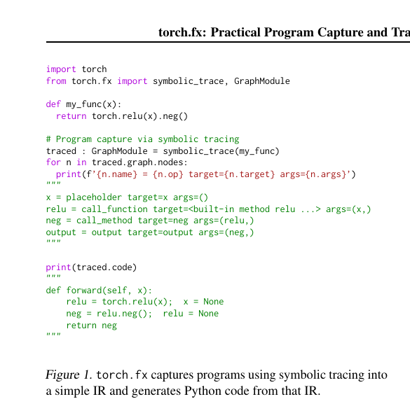
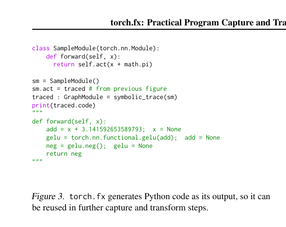
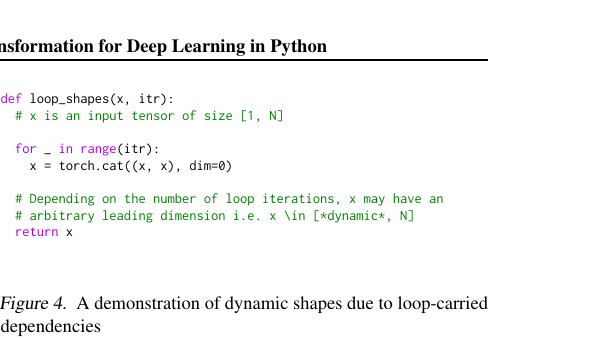
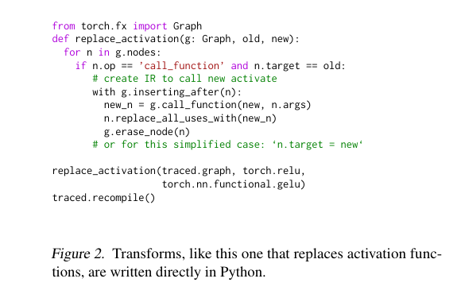
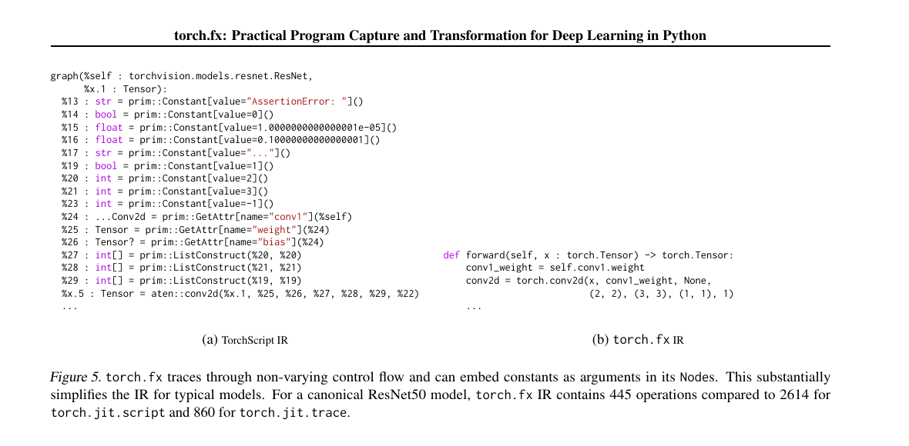
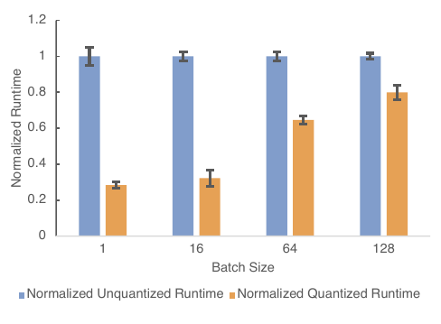
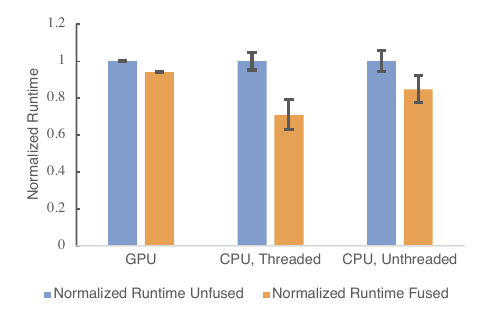
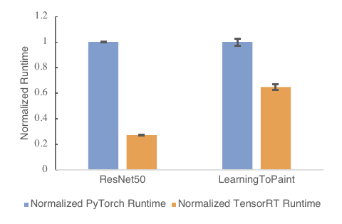

# 🔬 torch.fx: Practical Program Capture and Transformation

*Reed, DeVito, He, Ussery, Ansel — MLSys 2022 (arXiv 2112.08429)*

## Table of Contents

- [[#1. Motivation: The Eager–Graph Tension|1. Motivation: The Eager–Graph Tension]]
- [[#2. Background: The Design Space|2. Background: The Design Space]]
  - [[#2.1 Capturing Program Structure|2.1 Capturing Program Structure]]
  - [[#2.2 Specializing Programs|2.2 Specializing Programs]]
  - [[#2.3 Intermediate Representation Design|2.3 Intermediate Representation Design]]
- [[#3. Design Principles|3. Design Principles]]
- [[#4. Program Capture: Symbolic Tracing|4. Program Capture: Symbolic Tracing]]
  - [[#4.1 The Proxy Data Structure|4.1 The Proxy Data Structure]]
  - [[#4.2 The Tracer and __torch_function__|4.2 The Tracer and __torch_function__]]
  - [[#4.3 Configurable Capture via Tracer Subclassing|4.3 Configurable Capture via Tracer Subclassing]]
- [[#5. The IR: Graph, Node, and GraphModule|5. The IR: Graph, Node, and GraphModule]]
  - [[#5.1 The Six Opcodes|5.1 The Six Opcodes]]
  - [[#5.2 Nodes, Args, and Data Dependencies|5.2 Nodes, Args, and Data Dependencies]]
  - [[#5.3 GraphModule: State + Code Together|5.3 GraphModule: State + Code Together]]
- [[#6. Source-to-Source Code Generation|6. Source-to-Source Code Generation]]
- [[#7. Design Decisions|7. Design Decisions]]
  - [[#7.1 No Control Flow in the IR|7.1 No Control Flow in the IR]]
  - [[#7.2 Functional Graph, Stateful Modules|7.2 Functional Graph, Stateful Modules]]
  - [[#7.3 AoT Capture Without Specialization|7.3 AoT Capture Without Specialization]]
- [[#8. Writing Graph Transforms|8. Writing Graph Transforms]]
  - [[#8.1 The Transform Pattern|8.1 The Transform Pattern]]
  - [[#8.2 Activation Replacement|8.2 Activation Replacement]]
  - [[#8.3 Conv–BatchNorm Fusion|8.3 Conv–BatchNorm Fusion]]
  - [[#8.4 Shape Propagation|8.4 Shape Propagation]]
- [[#9. Case Studies|9. Case Studies]]
- [[#References|References]]

---

## 1. Motivation: The Eager–Graph Tension

PyTorch's eager execution model is excellent for development: every operator dispatches immediately through the [[concepts/pytorch-internals/dispatcher|C10 Dispatcher]], results are available for inspection at any Python breakpoint, and `pdb` works out of the box. But eager mode has a structural limitation — *the runtime only ever sees one operator at a time*. This precludes a class of transformations that require non-local program context:

| Transform | What it needs to see |
|-----------|---------------------|
| Operator fusion | Two adjacent ops simultaneously, to merge their kernels |
| Quantization | The activation tensor *produced* by one op and *consumed* by the next |
| Conv–BN fusion | A `Conv2d` node *and* the immediately-following `BatchNorm2d` node |
| Device lowering | The entire computation graph to schedule onto a fixed-memory accelerator |
| FLOP counting / shape prop | The complete DAG with all tensor shapes |

To apply any of these transforms, you need to *capture* the program structure — inspect it as a data structure before running it. This is the gap `torch.fx` fills.

**The key insight:** most neural networks are *basic block programs* — flat sequences of tensor operations with no data-dependent control flow (no `if tensor_value > 0`, no dynamic loops). For this majority case, a deliberately simple IR suffices, and building for the majority makes the system far easier to use and implement than TorchScript's full-Python model.

---

## 2. Background: The Design Space

### 2.1 Capturing Program Structure

The paper identifies three approaches to program capture:

**Concrete tracing** (`torch.jit.trace`): run the program on real inputs, record which ops fire. Simple to implement, but incidentally *shape-specializes* — a `jit.trace` with batch size 4 produces a graph that is incorrect for batch size 8 if any shape-dependent control flow was exercised.

**Symbolic tracing** (torch.fx, MXNet Gluon, `tf.function`): run the program with *abstract proxy values* rather than real tensors. No concrete shapes flow through, so no accidental specialization. Fails silently on data-dependent control flow (e.g. `if x.sum() > 0`) — but this failure is *observable* and raises an error in torch.fx.

**Embedded language compilation** (TorchScript): parse the Python source with a full lexer–parser–compiler toolchain. Supports richer programs including control flow and user-defined types. High complexity to implement and to write transforms against: TorchScript's ResNet IR has 2614 nodes from `jit.script` vs. 445 for torch.fx.

torch.fx chooses symbolic tracing for its simplicity, and makes the limitations configurable rather than trying to handle the long tail.

### 2.2 Specializing Programs

Specialization means committing to specific values (shapes, dtypes, Python scalars) at capture time. More specialization → smaller, faster artifacts; less generality.

- **Shape specialization** (`jit.trace`): committed to specific shapes. Wrong for other shapes.
- **JIT specialization** (LazyTensor, DyNet): capture on every invocation, then apply transforms and cache. Correct for all inputs but pays capture overhead repeatedly.
- **AoT without specialization** (torch.fx): capture once ahead-of-time. The IR contains *no* specialization — it is the transform's job to decide what to specialize, if anything. Predictable and observable, at the cost of not handling input-dependent control flow.

### 2.3 Intermediate Representation Design

Three axes of IR design:

**Language:** Protocol Buffers (TensorFlow), C++ data structures (TorchScript), Python objects (torch.fx). torch.fx chooses Python — transforms are written in Python and can be debugged with `pdb`.

**Control flow:** Most ML models are *basic block programs* (MLPs, CNNs, Transformers without decoder loops). Representing control flow in the IR forces every analysis to be a fixpoint dataflow computation — expensive to implement correctly, even for compiler writers. torch.fx omits control flow entirely.

> [!NOTE] Why fixpoint matters
> For a basic block, shape analysis is a single forward pass: iterate nodes in topological order, propagate shapes through each operator. With a loop in the IR, shape analysis is a fixpoint computation: iterate until convergence, because a loop-carried tensor can take infinitely many shapes depending on iteration count (e.g. `torch.cat` in a loop). torch.fx avoids this entirely by not representing loops.

**State (mutability):** PyTorch tensors support aliasing (`x[i]` is a view of `x`) and in-place mutation (`x[i] = y`). Reasoning about mutation safety requires alias analysis — annotating every op with aliasing semantics and running a points-to analysis. torch.fx treats mutation as undefined behavior and raises an error if captured. Model parameters live in the stateful `GraphModule`, cleanly separated from the functional `Graph`.

---

## 3. Design Principles

The paper states three principles that drive torch.fx's design:

1. **Prefer correctness for typical models over generality.** torch.fx will fail on models with data-dependent control flow. This is acceptable because the failure is explicit (an error with a stack trace), and the vast majority of production models don't need it.

2. **Work within the Python ecosystem.** IR is Python objects. Transforms are Python functions. Output is Python code. ML practitioners don't need to learn Protocol Buffers or C++.

3. **Make capture configurable.** Long-tail problems are handled by subclassing `Tracer`, not by complicating the core system. Users can block tracing into specific submodules (`is_leaf_module`), install metadata on nodes (`create_proxy`), or specialize on tensor metadata they care about.

---

## 4. Program Capture: Symbolic Tracing

The paper's overview figure shows the full pipeline at a glance: `symbolic_trace` captures a function into a `Graph` of `Node` objects, then regenerates executable Python code from that graph.



*Figure 1 (Reed et al., 2022): `torch.fx` captures programs via symbolic tracing into a six-opcode IR and regenerates Python code from that IR. The `call_function` node holds a direct reference to the Python callable; `call_method` records method calls on the first argument.*

### 4.1 The Proxy Data Structure

Symbolic tracing works by substituting every input tensor with a *Proxy* — a duck-typed Python object that records operations on it instead of executing them.

**Definition (Proxy).** A `Proxy` is a Python object that:
- Intercepts attribute access (`proxy.shape`, `proxy.dtype`) and method calls (`proxy.relu()`) by recording them as `Node` objects in a `Graph`.
- Implements `__torch_function__` to intercept free PyTorch functions (`torch.add(a, b)`, `torch.sin(x)`).
- Returns another `Proxy` from any operation, so the substitution propagates forward through the entire function.

Here is a minimal implementation that captures the core idea:

```python
class MiniGraph:
    def __init__(self):
        self.nodes: list[dict] = []

    def add_node(self, op, target, args=(), kwargs=None):
        name = f"{target.__name__ if callable(target) else target}_{len(self.nodes)}"
        node = {"name": name, "op": op, "target": target, "args": args, "kwargs": kwargs or {}}
        self.nodes.append(node)
        return node


class MiniProxy:
    """
    Records operations into a Graph instead of executing them.
    Returns self (another Proxy) from every operation so the substitution
    propagates through the traced function.
    """
    def __init__(self, node: dict, graph: MiniGraph):
        self.node = node
        self.graph = graph

    def __add__(self, other):
        node = self.graph.add_node(
            op="call_function",
            target=lambda a, b: a + b,  # stand-in for torch.add
            args=(self.node["name"], _node_name(other)),
        )
        return MiniProxy(node, self.graph)

    def relu(self):
        node = self.graph.add_node(
            op="call_method",
            target="relu",
            args=(self.node["name"],),
        )
        return MiniProxy(node, self.graph)

    def __repr__(self):
        return f"Proxy({self.node['name']})"


def _node_name(x):
    return x.node["name"] if isinstance(x, MiniProxy) else x


def mini_trace(fn, *input_names):
    graph = MiniGraph()
    proxies = []
    for name in input_names:
        node = graph.add_node("placeholder", name)
        proxies.append(MiniProxy(node, graph))
    output = fn(*proxies)
    graph.add_node("output", "output", args=(output.node["name"],))
    return graph


def my_fn(x, y):
    return (x + y).relu()


graph = mini_trace(my_fn, "x", "y")
for n in graph.nodes:
    print(n["op"], n["target"] if isinstance(n["target"], str) else "<fn>", n["args"])

# placeholder x ()
# placeholder y ()
# call_function <fn>  ('x_0', 'y_1')
# call_method   relu  ('<fn>_2',)
# output        output ('<fn>_2_relu_3',)  # (names simplified)
```

*The real `torch.fx.Proxy` does the same thing, but also implements `__torch_function__`, `__getattr__` for tensor attributes, and wraps the full ATen operator surface.*

> [!QUESTION] Exercise 1: Proxy Propagation Failure
> *This problem establishes when symbolic substitution breaks down.*
>
> > **Prerequisites:** [[#4.1 The Proxy Data Structure|4.1 The Proxy Data Structure]]
>
> A function `f(x)` contains the line `if x.shape[0] > 1: return x * 2`. When `f` is symbolically traced with a `MiniProxy` substituted for `x`, what happens when Python evaluates the `if` statement, and why does this constitute a fundamental limitation of symbolic tracing rather than a bug in the implementation?

> [!TIP]- Solution to Exercise 1
> **Key insight:** `if` requires a concrete Python `bool`. `x.shape[0]` on a Proxy returns another Proxy (the shape is symbolic). `Proxy > 1` would return a Proxy. Python's `if` then calls `bool(proxy)`, which cannot produce a meaningful boolean — it raises a `torch.fx.proxy.TraceError`. This is not a bug: *the information needed to resolve the branch (the actual value of `x.shape[0]`) does not exist at trace time*. The Proxy has no concrete data. Fixing this would require either (a) concrete specialization (losing generality) or (b) lifting the `if` into a graph node (requiring control flow in the IR — the complexity torch.fx deliberately avoids).

### 4.2 The Tracer and `__torch_function__`

The real `torch.fx` symbolic tracer uses two interception mechanisms:

1. **`__torch_function__`** — a Python protocol on tensor subclasses. When a free PyTorch function (e.g. `torch.relu`, `torch.add`) is called with an argument that implements `__torch_function__`, PyTorch calls `type(arg).__torch_function__(func, types, args, kwargs)` instead of executing `func`. `Proxy` implements this to record `call_function` nodes.

2. **Module override** — `Tracer.call_module` is invoked when a `call_module` node should be recorded (i.e. when a traced `nn.Module.forward` calls a sub-module).

Here is a minimal `__torch_function__` implementation:

```python
import torch

class TracingProxy(torch.Tensor):
    """
    A Tensor subclass that records operations into a graph.
    __torch_function__ fires for all torch.* free functions.
    """
    _graph: list  # class-level graph accumulator (simplified)

    @classmethod
    def __torch_function__(cls, func, types, args=(), kwargs=None):
        kwargs = kwargs or {}
        # Record the call instead of executing it
        node = {"op": "call_function", "target": func, "args": args, "kwargs": kwargs}
        cls._graph.append(node)
        # Return another TracingProxy so the substitution propagates
        result = cls.__new__(cls)
        result._node = node
        return result
```

*The real `torch.fx.Proxy` is not a Tensor subclass — it uses `__torch_function__` via a wrapper but is a plain Python object. The above simplification illustrates the interception mechanism.*

**Definition (Tracer).** The `Tracer` class controls the symbolic tracing process. Its two most important overridable methods are:

- `is_leaf_module(m, qualname) -> bool` — returns `True` if a sub-module should be treated as an opaque `call_module` node (not traced into). Default: built-in `nn` modules like `nn.Conv2d` are leaves; user-defined modules are traced through.
- `create_proxy(kind, target, args, kwargs) -> Proxy` — called whenever a new `Node` and its associated `Proxy` are about to be created. Can be overridden to attach metadata.

### 4.3 Configurable Capture via Tracer Subclassing

The paper emphasizes that edge cases are handled by subclassing `Tracer`, not by complicating the core.

```python
import torch.fx as fx

class ShapeAwareTracer(fx.Tracer):
    """
    A Tracer that also records the concrete shape of each tensor
    on the corresponding Node during tracing, by running a shadow
    eager pass alongside the symbolic one.
    """
    def __init__(self, example_inputs):
        super().__init__()
        self._concrete = list(example_inputs)
        self._proxy_to_concrete: dict = {}

    def create_proxy(self, kind, target, args, kwargs, name=None, type_expr=None, proxy_factory_fn=None):
        proxy = super().create_proxy(kind, target, args, kwargs, name, type_expr, proxy_factory_fn)
        # Run the op concretely in parallel to get real shapes
        if kind == "call_function":
            concrete_args = tuple(
                self._proxy_to_concrete.get(id(a), a)
                for a in args
            )
            result = target(*concrete_args, **kwargs)
            self._proxy_to_concrete[id(proxy)] = result
            proxy.node.meta["tensor_meta"] = {
                "shape": result.shape,
                "dtype": result.dtype,
            }
        return proxy
```

Another common pattern — blocking tracing into specific modules to avoid unsupported language features:

```python
class LeafOnlyConvTracer(fx.Tracer):
    def is_leaf_module(self, m, qualname):
        # Treat ALL nn.Module instances as leaves (opaque call_module nodes)
        return isinstance(m, torch.nn.Module)
```

> [!QUESTION] Exercise 2: Leaf Module vs. Trace-Through
> *This problem explores how `is_leaf_module` changes the IR produced for a simple model.*
>
> > **Prerequisites:** [[#4.3 Configurable Capture via Tracer Subclassing|4.3 Configurable Capture via Tracer Subclassing]]
>
> Consider an `nn.Sequential([nn.Linear(8, 4), nn.ReLU()])` model. (a) What nodes does the default `fx.symbolic_trace` produce? (b) What nodes does `LeafOnlyConvTracer` above produce for the same model? (c) Which representation is more useful for a pass that wants to replace all `nn.ReLU` modules with `nn.GELU`, and why?

> [!TIP]- Solution to Exercise 2
> **Key insight:** `is_leaf_module=True` preserves module identity in the IR; tracing through loses it.
>
> **Sketch:**
> - (a) Default tracer traces through `Sequential` (user-defined) and `Linear` (user-defined via inherited forward) but treats `ReLU` as a leaf (it's a built-in `nn` module). Nodes: `placeholder x`, `linear_weight = get_attr`, `linear_bias = get_attr`, `call_function torch.addmm(...)`, `call_module relu`, `output`. (Exact decomposition depends on PyTorch version.)
> - (b) `LeafOnlyConvTracer` treats every `nn.Module` as a leaf. Nodes: `placeholder x`, `call_module 0` (the Linear), `call_module 1` (the ReLU), `output`. The internals of `Linear` are hidden.
> - (c) The `LeafOnlyConvTracer` version is more useful for the ReLU→GELU replacement. The pass can search for `call_module` nodes whose `target` resolves to an `nn.ReLU` instance and replace the module, without needing to know about the internal weight/bias ops. The default trace has decomposed `Linear` into raw ops, making the structure harder to pattern-match.

---

## 5. The IR: Graph, Node, and GraphModule

### 5.1 The Six Opcodes

torch.fx's IR is a `Graph` — a doubly-linked list of `Node` objects stored in topological order. Every operation in a captured program maps to one of exactly six opcodes:

| Opcode | Meaning | `target` | `args` |
|--------|---------|---------|--------|
| `placeholder` | Function input | Argument name (str) | `()`, or `(default_value,)` |
| `get_attr` | Fetch parameter/buffer from module | Dotted attribute path (str) | `()` |
| `call_function` | Call a free Python function | The function object itself | Python calling convention |
| `call_method` | Call a method on `args[0]` | Method name (str) | `(self, *args)` |
| `call_module` | Invoke a sub-module's `forward` | Dotted module path (str) | Python calling convention |
| `output` | Return value | `"output"` | `(return_value,)` |

**Definition (Node).** A `Node` $n$ is a tuple $(op, \text{target}, \text{args}, \text{kwargs}, \text{name})$ where:
- $op \in \{\texttt{placeholder}, \texttt{get\_attr}, \texttt{call\_function}, \texttt{call\_method}, \texttt{call\_module}, \texttt{output}\}$
- $\text{target}$ is the callable or name being invoked (type depends on $op$)
- $\text{args}$ / $\text{kwargs}$ are the arguments in Python calling convention — other `Node` references encode data dependencies; immediate Python values (int, float, tuple, list) are embedded directly

Data dependencies are encoded as `Node` references within `args`/`kwargs`. There are no separate edge objects; edges are implicit in the arg list.

Here is a minimal Python implementation of the Graph/Node structure:

```python
from __future__ import annotations
from typing import Any, Callable

class Node:
    def __init__(self, graph: "Graph", op: str, target: Any, args: tuple, kwargs: dict, name: str):
        self.graph = graph
        self.op = op
        self.target = target
        self.args = args       # may contain Node references (data deps) or immediate values
        self.kwargs = kwargs
        self.name = name
        self.meta: dict = {}   # attach-point for passes (shapes, dtypes, etc.)
        self._users: set["Node"] = set()  # reverse edges: who reads this node's output

    def replace_all_uses_with(self, new_node: "Node"):
        """Redirect all consumers of self to new_node."""
        for user in list(self._users):
            user.args = tuple(new_node if a is self else a for a in user.args)
            user.kwargs = {k: (new_node if v is self else v) for k, v in user.kwargs.items()}
            new_node._users.add(user)
        self._users.clear()

    def __repr__(self):
        args_repr = tuple(a.name if isinstance(a, Node) else a for a in self.args)
        return f"{self.name} = {self.op}[{self.target}]({args_repr})"


class Graph:
    def __init__(self):
        self._nodes: list[Node] = []
        self._name_counter: dict[str, int] = {}

    def _fresh_name(self, base: str) -> str:
        count = self._name_counter.get(base, 0)
        self._name_counter[base] = count + 1
        return base if count == 0 else f"{base}_{count}"

    def placeholder(self, name: str) -> Node:
        n = Node(self, "placeholder", name, (), {}, self._fresh_name(name))
        self._nodes.append(n)
        return n

    def call_function(self, fn: Callable, args: tuple = (), kwargs: dict | None = None) -> Node:
        name = self._fresh_name(getattr(fn, "__name__", "fn"))
        n = Node(self, "call_function", fn, args, kwargs or {}, name)
        for a in args:
            if isinstance(a, Node):
                a._users.add(n)
        self._nodes.append(n)
        return n

    def call_method(self, method: str, args: tuple = ()) -> Node:
        name = self._fresh_name(method)
        n = Node(self, "call_method", method, args, {}, name)
        for a in args:
            if isinstance(a, Node):
                a._users.add(n)
        self._nodes.append(n)
        return n

    def output(self, result: Node) -> Node:
        n = Node(self, "output", "output", (result,), {}, "output")
        result._users.add(n)
        self._nodes.append(n)
        return n

    def erase_node(self, node: Node):
        assert not node._users, f"Cannot erase {node.name}: still has users"
        self._nodes.remove(node)

    @property
    def nodes(self):
        return list(self._nodes)

    def print_tabular(self):
        print(f"{'name':<20} {'op':<20} {'target':<30} {'args'}")
        print("-" * 80)
        for n in self._nodes:
            t = n.target.__name__ if callable(n.target) else n.target
            args = tuple(a.name if isinstance(a, Node) else a for a in n.args)
            print(f"{n.name:<20} {n.op:<20} {t:<30} {args}")
```

Building the graph for `torch.relu(x).neg()` manually:

```python
import torch

g = Graph()
x   = g.placeholder("x")
rel = g.call_function(torch.relu, (x,))
neg = g.call_method("neg", (rel,))
g.output(neg)
g.print_tabular()

# name                 op                   target                         args
# --------------------------------------------------------------------------------
# x                    placeholder          x                              ()
# relu                 call_function        relu                           ('x',)
# neg                  call_method          neg                            ('relu',)
# output               output               output                         ('neg',)
```

### 5.2 Nodes, Args, and Data Dependencies

A key design decision: **args embed immediate Python values inline** rather than requiring separate constant nodes. `torch.reshape(x, (4, -1))` produces a `call_function` node with `args = (x_node, (4, -1))` — the tuple `(4, -1)` is stored directly as an arg.

This keeps the graph sparse: 445 nodes for ResNet50 in torch.fx vs. 860 in `jit.trace` (which emits constant construction nodes for every int and tuple).

> [!EXAMPLE] IR comparison: torch.conv2d
> In TorchScript:
> ```
> %27 : int[] = prim::ListConstruct(%20, %20)   # stride = [2, 2]
> %28 : int[] = prim::ListConstruct(%21, %21)   # padding = [3, 3]
> %x.5 : Tensor = aten::conv2d(%x.1, %25, %26, %27, %28, %29, %22)
> ```
> In torch.fx:
> ```python
> conv2d = torch.conv2d(x, conv1_weight, None, (2, 2), (3, 3), (1, 1), 1)
> ```
> The strides and padding are immediate args — no list-construction nodes.

### 5.3 GraphModule: State + Code Together

**Definition (GraphModule).** A `GraphModule` is a `torch.nn.Module` subclass that:
- Holds a `Graph` object representing the captured computation.
- Stores module parameters and sub-modules (via the `nn.Module` parameter registry).
- Exposes a `forward` method that is the *generated Python code* for the captured graph.

The generated code is installed at construction time via `exec()`. It is accessible as the `code` property:

```python
import torch
import torch.fx as fx

class MyModel(torch.nn.Module):
    def __init__(self):
        super().__init__()
        self.linear = torch.nn.Linear(8, 4)
        self.act = torch.nn.ReLU()

    def forward(self, x):
        return self.act(self.linear(x))

traced: fx.GraphModule = fx.symbolic_trace(MyModel())
print(traced.code)

# def forward(self, x : torch.Tensor) -> torch.Tensor:
#     linear = self.linear(x);  x = None
#     act = self.act(linear);  linear = None
#     return act
```

*Note the `x = None` after use — the generated code explicitly nulls references to free tensors early, mimicking PyTorch's eager memory reclamation behavior.*

---

## 6. Source-to-Source Code Generation

After a transform, `GraphModule.recompile()` regenerates Python source from the current `Graph` and installs it as the new `forward`. The code generation walks the node list in topological order (which is the storage order, maintained as an invariant by graph mutation APIs) and emits one Python statement per node.

Here is a minimal codegen for our `Graph` class:

```python
def codegen(graph: Graph, fn_name: str = "forward") -> str:
    """
    Emit Python source from a Graph.
    Nodes stored in topological order — emit one statement per node.
    """
    lines = []
    placeholders = [n for n in graph.nodes if n.op == "placeholder"]
    params = ", ".join(["self"] + [p.name for p in placeholders])
    lines.append(f"def {fn_name}({params}):")

    for node in graph.nodes:
        if node.op == "placeholder":
            continue   # handled in signature

        def arg_repr(a):
            if isinstance(a, Node):
                return a.name
            return repr(a)

        args_str = ", ".join(arg_repr(a) for a in node.args)

        if node.op == "call_function":
            fn_name_str = f"{node.target.__module__}.{node.target.__qualname__}"
            lines.append(f"    {node.name} = {fn_name_str}({args_str})")

        elif node.op == "call_method":
            self_node, *rest = node.args
            rest_str = ", ".join(arg_repr(a) for a in rest)
            lines.append(f"    {node.name} = {self_node.name}.{node.target}({rest_str})")

        elif node.op == "get_attr":
            lines.append(f"    {node.name} = self.{node.target}")

        elif node.op == "call_module":
            lines.append(f"    {node.name} = self.{node.target}({args_str})")

        elif node.op == "output":
            result = node.args[0]
            lines.append(f"    return {result.name}")

    return "\n".join(lines)


g = Graph()
x   = g.placeholder("x")
rel = g.call_function(torch.relu, (x,))
neg = g.call_method("neg", (rel,))
g.output(neg)

print(codegen(g))

# def forward(self, x):
#     torch.nn.functional.relu = torch.relu(x)    # (name depends on __module__)
#     neg = relu.neg()
#     return neg
```

*The real `torch.fx` codegen also handles tuple outputs, `*args`/`**kwargs` nodes, and assigns Python type annotations from `node.type`.*

The paper's Figure 3 demonstrates a key downstream benefit of code generation: since the output of a transform is a valid `GraphModule` with a real Python `forward`, it can be plugged into another module and symbolically traced again for further transformation.



*Figure 3 (Reed et al., 2022): `torch.fx` generates Python code as its output. Here the result of a previous relu→gelu replacement is installed as a sub-module and symbolically traced again — the constants (`math.pi`) are inlined and the full chain of transforms is visible in a single flat IR.*

---

## 7. Design Decisions

### 7.1 No Control Flow in the IR

The most consequential design decision: torch.fx's `Graph` has no `if`, `while`, or `for` nodes. This is not an oversight — it is central to the system's simplicity.

**Why control flow complicates transforms.** With control flow in the IR, every analysis must be a *fixpoint dataflow* computation:

- Define a *lattice* of analysis values (e.g. `{unknown, dynamic, concrete_shape}`).
- Define a *transfer function* $f_n$ for each node: given the analysis value of inputs, compute the analysis value of the output.
- Define a *join* $\sqcup$ for merging values at control-flow merge points (e.g. after an `if`).
- Iterate until convergence.

For a basic block (no control flow), only the transfer function is needed — a single forward pass.

The paper gives shape analysis as a concrete example of the difference. For a basic block, shape propagation is $O(n)$:

```python
def propagate_shapes(graph: Graph, inputs: dict[str, tuple]):
    shapes = dict(inputs)
    for node in graph.nodes:
        if node.op == "placeholder":
            pass  # shape set from inputs
        elif node.op == "call_function":
            in_shapes = tuple(shapes[a.name] for a in node.args if isinstance(a, Node))
            # Transfer function for the specific op:
            shapes[node.name] = infer_shape(node.target, in_shapes)
    return shapes
```

With a loop in the IR, `torch.cat` in a loop body accumulates an unbounded shape — the analysis reaches a `"dynamic"` fixed point after arbitrarily many iterations. This "dynamic" value then poisons downstream analyses that need concrete shapes (e.g. ASIC memory planning).



*Figure 4 (Reed et al., 2022): A concrete illustration of loop-carried shape dynamics. After `k` iterations of `torch.cat((x, x), dim=0)`, the leading dimension is $2^k$ — not statically knowable. Shape analysis in a basic block IR avoids this entirely by simply not representing the loop.*

> [!WARNING] What torch.fx does with control flow
> *If a traced function contains `for i in range(n)` where `n` is a Python constant (e.g. `range(3)`), the loop is unrolled by the tracer — it appears in the IR as 3 repetitions of the loop body. If `n` is data-dependent, the trace raises a `TraceError`.*

### 7.2 Functional Graph, Stateful Modules

torch.fx's `Graph` is functional — no node mutates another node's output. But model parameters are *state*, and some operations have well-understood stateful semantics (e.g. `BatchNorm` tracks running mean/variance).

The solution: parameters and sub-modules live in `GraphModule`, outside the functional graph. The graph interacts with them via two opcodes:
- `get_attr` fetches a parameter by dotted path from the module hierarchy.
- `call_module` invokes a sub-module's `forward`.

Transforms can modify both the graph (e.g. remove a `BatchNorm` node) and the module state (e.g. absorb the BN scale/shift into the preceding Conv weights) simultaneously, since they are co-located in the `GraphModule`.

```python
# Both are accessible from a GraphModule:
gm: fx.GraphModule = fx.symbolic_trace(model)
gm.graph           # the functional Graph
gm.conv1           # the nn.Conv2d module (stateful parameters)
gm.conv1.weight    # the actual parameter tensor
```

### 7.3 AoT Capture Without Specialization

torch.fx traces *ahead-of-time* — once, at transform-authoring time, not on every inference call. The graph is not specialized to any particular input: no concrete shapes, dtypes, or scalar values flow through the symbolic trace (unless the `Tracer` is explicitly written to specialize).

This is in contrast to `jit.trace` (which specializes to example input shapes) and JIT systems like LazyTensor (which re-specialize on every call). The tradeoff:

| Property | torch.fx AoT | `jit.trace` AoT | LazyTensor JIT |
|----------|-------------|----------------|----------------|
| Handles data-dependent control flow | ❌ | ❌ | ✅ |
| Accidental shape specialization | ❌ | ✅ | ❌ |
| Re-capture overhead | ❌ | ❌ | ✅ |
| Observable failures | ✅ (TraceError) | ❌ (silent wrong output) | N/A |

*Specialization is left to the transform.* A quantization pass that needs to know tensor ranges can instrument the graph with observer nodes during a calibration phase — this is the transform deciding to specialize, not the capture mechanism.

---

## 8. Writing Graph Transforms

### 8.1 The Transform Pattern

All torch.fx transforms follow the same structure:

```python
def my_transform(gm: fx.GraphModule) -> fx.GraphModule:
    graph = gm.graph
    for node in list(graph.nodes):  # iterate a copy — graph may be modified
        if <matches pattern>:
            with graph.inserting_after(node):
                new_node = graph.<create_node>(...)
            node.replace_all_uses_with(new_node)
            graph.erase_node(node)
    graph.lint()        # verify IR invariants (no dangling references, etc.)
    gm.recompile()      # regenerate forward() from the modified graph
    return gm
```

The graph mutation API:
- `graph.inserting_after(node)` / `graph.inserting_before(node)` — context managers that set the insertion point for subsequent node creation calls.
- `node.replace_all_uses_with(new_node)` — redirect all consumers of `node` to `new_node`.
- `graph.erase_node(node)` — remove `node` (only safe when it has no users).
- `graph.lint()` — check IR invariants: topological order, no dead references.

### 8.2 Activation Replacement

The paper's Figure 2 shows the compact form of the activation replacement transform — fewer than 10 lines of Python for a complete graph rewrite pass:



*Figure 2 (Reed et al., 2022): The activation replacement transform from the paper. `inserting_after` sets the insertion point, `replace_all_uses_with` rewires all consumers, and `erase_node` removes the old node. The simplicity of this pass is a direct consequence of the Python-native IR.*

The paper's Figure 2 example — replacing all `relu` calls with `gelu`:

```python
import torch
import torch.fx as fx
import torch.nn.functional as F

def replace_relu_with_gelu(gm: fx.GraphModule) -> fx.GraphModule:
    graph = gm.graph
    for node in list(graph.nodes):
        if node.op == "call_function" and node.target is torch.relu:
            with graph.inserting_after(node):
                gelu_node = graph.call_function(F.gelu, node.args, node.kwargs)
            node.replace_all_uses_with(gelu_node)
            graph.erase_node(node)
    graph.lint()
    gm.recompile()
    return gm


class SimpleNet(torch.nn.Module):
    def forward(self, x):
        return torch.relu(torch.relu(x) + 1.0)

gm = fx.symbolic_trace(SimpleNet())
print("Before:\n", gm.code)

replace_relu_with_gelu(gm)
print("After:\n", gm.code)

# Before:
#   relu   = torch.relu(x)
#   add    = relu + 1.0
#   relu_1 = torch.relu(add)
#   return relu_1
#
# After:
#   gelu   = torch.nn.functional.gelu(x)
#   add    = gelu + 1.0
#   gelu_1 = torch.nn.functional.gelu(add)
#   return gelu_1
```

> [!QUESTION] Exercise 3: Handling `call_method` relu
> *This problem extends the activation replacement transform to cover method-style relu calls.*
>
> > **Prerequisites:** [[#8.2 Activation Replacement|8.2 Activation Replacement]], [[#5.1 The Six Opcodes|5.1 The Six Opcodes]]
>
> The `replace_relu_with_gelu` transform above only catches `call_function` nodes targeting `torch.relu`. However, users often write `x.relu()` (a `call_method` node with target `"relu"`). Extend the transform to also replace `call_method` relu nodes with `call_function` gelu nodes. Be precise about how `args` are structured differently for `call_method` vs. `call_function`.

> [!TIP]- Solution to Exercise 3
> **Key insight:** For a `call_method` node `x.relu()`, `args[0]` is the `self` tensor (the node for `x`). A `call_function` `F.gelu(x)` takes the same tensor as its first positional arg. The replacement is straightforward once you know the args convention.
>
> **Sketch:**
> ```python
> for node in list(graph.nodes):
>     if node.op == "call_function" and node.target is torch.relu:
>         with graph.inserting_after(node):
>             new = graph.call_function(F.gelu, node.args, node.kwargs)
>         node.replace_all_uses_with(new)
>         graph.erase_node(node)
>
>     elif node.op == "call_method" and node.target == "relu":
>         # args = (self_tensor, *positional_args) — here just (self_tensor,)
>         self_tensor = node.args[0]
>         with graph.inserting_after(node):
>             new = graph.call_function(F.gelu, (self_tensor,), {})
>         node.replace_all_uses_with(new)
>         graph.erase_node(node)
> ```
> Note: `call_method` nodes for `relu` should have no extra args beyond `self`, so `node.args[0]` is always the tensor.

### 8.3 Conv–BatchNorm Fusion

Conv–BN fusion is a canonical example of a transform that requires *non-local* program context (it must see two adjacent nodes) *and* must modify both the graph and the module state simultaneously.

**The mathematical basis.** A Conv2d followed by BatchNorm computes:

$$\text{BN}(\text{Conv}(x)) = \gamma \cdot \frac{W * x + b - \mu}{\sqrt{\sigma^2 + \epsilon}} + \beta$$

This is equivalent to a Conv2d with modified weight $W'$ and bias $b'$:

$$W' = \frac{\gamma}{\sqrt{\sigma^2 + \epsilon}} W, \qquad b' = \gamma \cdot \frac{b - \mu}{\sqrt{\sigma^2 + \epsilon}} + \beta$$

After folding, the BN node can be removed. The transform must:
1. Find every `call_module` → `call_module` pair where the first is a Conv2d and the second is a BatchNorm2d.
2. Compute $W'$ and $b'$ and write them into the Conv2d's parameters.
3. Replace all uses of the BN node with the Conv node.
4. Erase the BN node.

```python
def fuse_conv_bn(gm: fx.GraphModule) -> fx.GraphModule:
    graph = gm.graph
    for node in list(graph.nodes):
        # look for a BN node whose sole input is a Conv node
        if node.op != "call_module":
            continue
        bn = gm.get_submodule(node.target)
        if not isinstance(bn, torch.nn.BatchNorm2d) or not bn.track_running_stats:
            continue
        if len(node.args) != 1 or node.args[0].op != "call_module":
            continue
        conv_node = node.args[0]
        conv = gm.get_submodule(conv_node.target)
        if not isinstance(conv, torch.nn.Conv2d):
            continue

        # fold BN parameters into Conv weights
        with torch.no_grad():
            scale = bn.weight / (bn.running_var + bn.eps).sqrt()
            conv.weight.data *= scale[:, None, None, None]
            if conv.bias is None:
                conv.bias = torch.nn.Parameter(torch.zeros(conv.out_channels))
            conv.bias.data = (conv.bias.data - bn.running_mean) * scale + bn.bias

        # rewire graph: redirect BN's users to the Conv node
        node.replace_all_uses_with(conv_node)
        graph.erase_node(node)

    graph.lint()
    gm.recompile()
    return gm
```

*The paper reports ~6% latency reduction on GPU and ~40% on CPU for ResNet50 with this transform.*

### 8.4 Shape Propagation

`torch.fx.passes.shape_prop.ShapeProp` is a built-in interpreter pass that propagates shapes by executing the graph concretely with example inputs and recording the resulting tensor metadata on each node:

```python
from torch.fx.passes.shape_prop import ShapeProp

model = torch.nn.Linear(8, 4)
gm = fx.symbolic_trace(model)

example = torch.randn(2, 8)
ShapeProp(gm).propagate(example)

for node in gm.graph.nodes:
    if "tensor_meta" in node.meta:
        print(node.name, node.meta["tensor_meta"].shape)

# x          torch.Size([2, 8])
# weight     torch.Size([4, 8])
# ...
# output     torch.Size([2, 4])
```

The underlying pattern — walking nodes in order and running each concretely — is a simple `Interpreter`:

```python
class MiniInterpreter:
    """Run a Graph concretely to propagate metadata."""
    def __init__(self, gm: fx.GraphModule):
        self.gm = gm

    def run(self, *args):
        env: dict[str, Any] = {}
        arg_iter = iter(args)
        for node in self.gm.graph.nodes:
            if node.op == "placeholder":
                env[node.name] = next(arg_iter)
            elif node.op == "get_attr":
                env[node.name] = self.gm.get_parameter(node.target)
            elif node.op == "call_function":
                a = tuple(env[n.name] if isinstance(n, fx.Node) else n for n in node.args)
                env[node.name] = node.target(*a, **node.kwargs)
            elif node.op == "call_method":
                self_val = env[node.args[0].name]
                a = tuple(env[n.name] if isinstance(n, fx.Node) else n for n in node.args[1:])
                env[node.name] = getattr(self_val, node.target)(*a)
            elif node.op == "call_module":
                submod = self.gm.get_submodule(node.target)
                a = tuple(env[n.name] if isinstance(n, fx.Node) else n for n in node.args)
                env[node.name] = submod(*a)
            elif node.op == "output":
                return env[node.args[0].name]
```

> [!QUESTION] Exercise 4: FLOP Counting via Interpreter
> *This problem applies the Interpreter pattern to implement a FLOP counter.*
>
> > **Prerequisites:** [[#8.4 Shape Propagation|8.4 Shape Propagation]]
>
> Extend `MiniInterpreter` to count floating-point multiply-accumulate operations. For a `call_function` node targeting `torch.mm(A, B)` where $A \in \mathbb{R}^{m \times k}$ and $B \in \mathbb{R}^{k \times n}$, the FLOP count is $2mkn$ (one multiply + one accumulate per entry). After running `ShapeProp`, tensor shapes are available in `node.meta["tensor_meta"].shape`. Sketch the implementation.

> [!TIP]- Solution to Exercise 4
> **Key insight:** After `ShapeProp`, each node's `meta["tensor_meta"]` carries the output shape. For ops like `mm`, the input shapes determine the FLOP count. The interpreter can tally FLOPs without re-executing — just inspect `node.meta`.
>
> **Sketch:**
> ```python
> def count_flops(gm: fx.GraphModule, example: torch.Tensor) -> int:
>     ShapeProp(gm).propagate(example)  # populate node.meta with shapes
>     total = 0
>     for node in gm.graph.nodes:
>         if node.op == "call_function" and node.target is torch.mm:
>             # args[0].meta gives input A shape, args[1].meta gives B shape
>             m, k = node.args[0].meta["tensor_meta"].shape
>             k2, n = node.args[1].meta["tensor_meta"].shape
>             assert k == k2
>             total += 2 * m * k * n
>         # extend for conv2d, linear, etc.
>     return total
> ```
> For `torch.nn.functional.linear(x, w, b)` where `x ∈ R^{B×in}`, `w ∈ R^{out×in}`: FLOPs = `2 * B * in * out` (plus `B * out` for bias add).

---

## 9. Case Studies

The paper evaluates torch.fx across four application areas. The results establish that the simplicity of the IR pays off in implementation productivity as well as performance.

| Case Study | What torch.fx enabled | Key result |
|-----------|----------------------|-----------|
| **IR complexity** | Simpler representation than TorchScript | 445 nodes for ResNet50 vs. 860 (`jit.trace`) vs. 2614 (`jit.script`) |
| **Post-training quantization** | Observer insertion + conversion in a single Python pass | 3.3× inference speedup on DeepRecommender (CPU, FBGEMM) |
| **Conv–BN fusion** | Non-local pattern match + simultaneous weight + graph modification | 6% GPU latency reduction, 40% CPU latency reduction on ResNet50 |
| **Program scheduling** | Hoist non-blocking RPC prefetch calls early in the graph | Up to 9% QPS improvement in large distributed training |
| **TensorRT lowering** | Translate FX graph to TensorRT IR + handle unsupported ops | 3.7× inference speedup on ResNet50 |
| **Shape analysis** | `ShapeProp` interpreter; symbolic shape propagation | Foundation for quantization calibration and ASIC memory planning |

Figure 5 shows the concrete IR size difference for ResNet50. The TorchScript IR (left) requires explicit constant-construction nodes for every integer and list; the torch.fx IR (right) embeds them as immediate arguments, cutting node count by nearly 2×.



*Figure 5 (Reed et al., 2022): TorchScript IR (left) vs. torch.fx IR (right) for the opening Conv2d of ResNet50. TorchScript emits separate `prim::ListConstruct` nodes for strides and padding; torch.fx embeds `(2, 2)` and `(3, 3)` directly as node arguments. For a full ResNet50, this reduces the IR from 860 nodes (`jit.trace`) or 2614 nodes (`jit.script`) down to 445 nodes.*

The quantization result demonstrates the runtime benefit of operator-level reduction. Applying PTQ via torch.fx achieves up to 3.3× speedup across batch sizes on a server-class CPU:



*Figure 6 (Reed et al., 2022): Normalized inference runtime (lower is better) for torch.fx-based PTQ on DeepRecommender. Quantized runtime (orange) is 3–3.3× faster than FP32 (blue) at batch sizes 1, 16, and 64; the gap narrows at batch size 128 where memory bandwidth becomes less of a bottleneck.*

The Conv–BN fusion transform achieves its largest relative gains on CPU where kernel launch overhead is proportionally greater:



*Figure 7 (Reed et al., 2022): Normalized inference runtime for torch.fx-based Conv–BN fusion on ResNet50. Fused (orange) vs. unfused (blue): ~6% speedup on GPU, ~30% on CPU threaded, ~15% on CPU unthreaded. The larger CPU gains reflect reduced memory bandwidth pressure from eliminating the BN read/write pass.*

The TensorRT lowering pass delegates operator execution to a specialized inference engine, yielding the largest single-transform speedup:



*Figure 8 (Reed et al., 2022): Normalized inference runtime for torch.fx-based TensorRT lowering. TensorRT (orange) achieves 3.7× speedup on ResNet50 and ~1.6× on LearningToPaint vs. native PyTorch (blue). Unsupported operations fall back to eager PyTorch, explaining the smaller gain on the more heterogeneous LearningToPaint model.*

> [!INFO] 💡 Productivity argument
> The paper notes an *order-of-magnitude productivity increase* for quantization development compared to TorchScript, and fewer than 150 lines of Python for the full Conv-BN fusion transform including a test harness. This is the strongest argument for the torch.fx design philosophy: simpler IR = simpler transforms = faster development.

> [!QUESTION] Exercise 5: Quantization Observer Insertion
> *This problem sketches the preparation phase of post-training quantization using torch.fx.*
>
> > **Prerequisites:** [[#8.1 The Transform Pattern|8.1 The Transform Pattern]], [[#9. Case Studies|9. Case Studies]]
>
> Post-training quantization requires inserting "observer" modules after specific activation nodes (e.g. after every `call_function` targeting `torch.relu`). An observer records the min/max of the floating-point values flowing through it during calibration. Sketch a `prepare_ptq` transform that inserts observer modules after every relu call. What changes must be made to both the `Graph` and the `GraphModule`?

> [!TIP]- Solution to Exercise 5
> **Key insight:** Inserting an observer requires both (a) adding a `call_module` node to the graph (to call the observer during forward), and (b) registering the observer module on the `GraphModule` so the `call_module` node can find it by dotted path.
>
> **Sketch:**
> ```python
> from torch.quantization import MinMaxObserver
>
> def prepare_ptq(gm: fx.GraphModule) -> fx.GraphModule:
>     graph = gm.graph
>     observer_count = 0
>     for node in list(graph.nodes):
>         if node.op == "call_function" and node.target is torch.relu:
>             # Register an observer module on the GraphModule
>             obs_name = f"observer_{observer_count}"
>             observer_count += 1
>             gm.add_module(obs_name, MinMaxObserver())
>             # Insert call_module node after the relu node
>             with graph.inserting_after(node):
>                 obs_node = graph.call_module(obs_name, (node,))
>             node.replace_all_uses_with(obs_node)
>             # Restore: obs_node takes node as input (not itself)
>             obs_node.args = (node,)
>     graph.lint()
>     gm.recompile()
>     return gm
> ```
> After `prepare_ptq(gm)`, running calibration data through `gm(x)` automatically updates each observer's `min_val` and `max_val`. The conversion phase then uses these statistics to choose quantization scales.

---

## References

| Reference | Brief Summary | Link |
|-----------|--------------|------|
| Reed et al., "torch.fx: Practical Program Capture and Transformation for Deep Learning in Python" (MLSys 2022) | The primary source; 6-opcode IR, symbolic tracing, design decisions, case studies | [arXiv 2112.08429](https://arxiv.org/abs/2112.08429) |
| PyTorch, "torch.fx Overview" (official docs) | API reference for `Graph`, `Node`, `GraphModule`, `Tracer`, `Interpreter`, `Transformer` | [docs.pytorch.org](https://docs.pytorch.org/docs/stable/fx.html) |
| PyTorch, "torch.fx: Symbolic Tracing" (tutorial) | Worked examples of symbolic tracing and graph transforms | [docs.pytorch.org/tutorials](https://docs.pytorch.org/tutorials/intermediate/fx_profiling_tutorial.html) |
| He, "Building a Conv/BN Fuser in FX" (tutorial) | Step-by-step implementation of the Conv–BN fusion transform | [pytorch.org/tutorials](https://pytorch.org/tutorials/intermediate/fx_conv_bn_fuser.html) |
| Ansel et al., "PyTorch 2: Faster ML Through Dynamic Bytecode Transformation" (ASPLOS 2024) | How torch.fx becomes the IR that TorchDynamo, AOTAutograd, and TorchInductor pass between stages | [arXiv 2304.01277](https://arxiv.org/abs/2304.01277) |
| Yang, "PyTorch Internals" (blog, 2019) | Background on the dispatcher and tensor model that torch.fx sits on top of | [blog.ezyang.com](https://blog.ezyang.com/2019/05/pytorch-internals/) |
